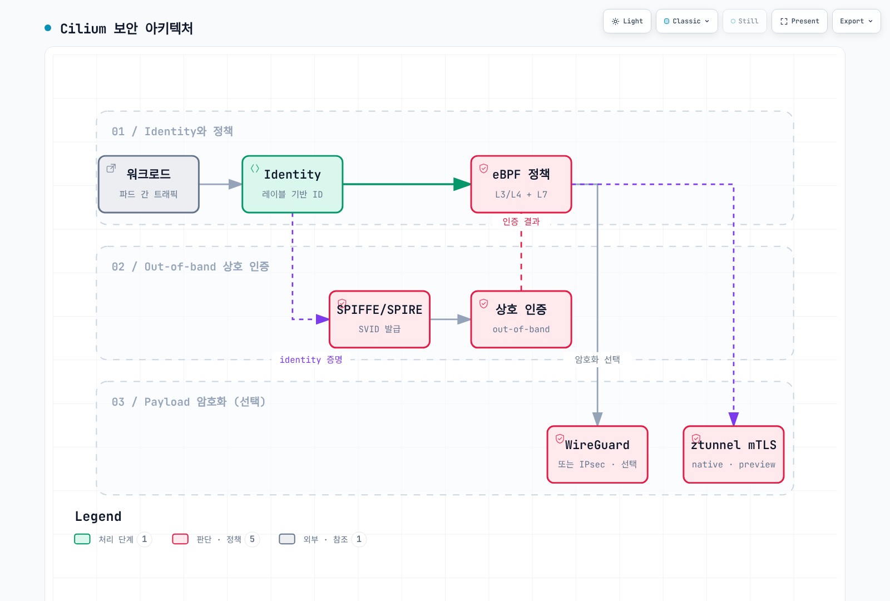
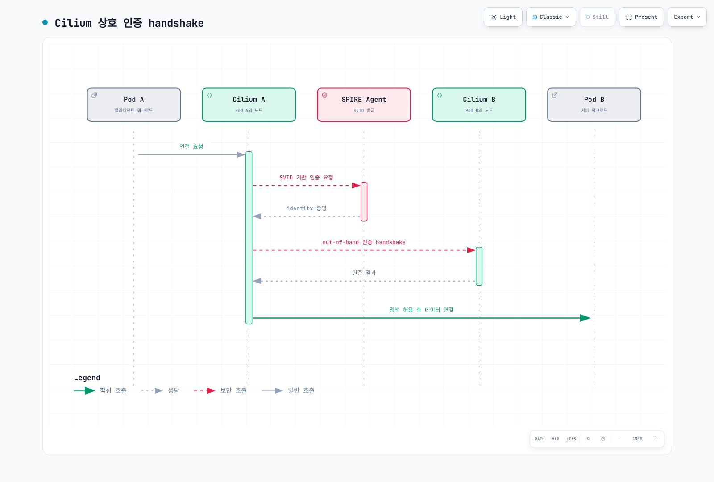
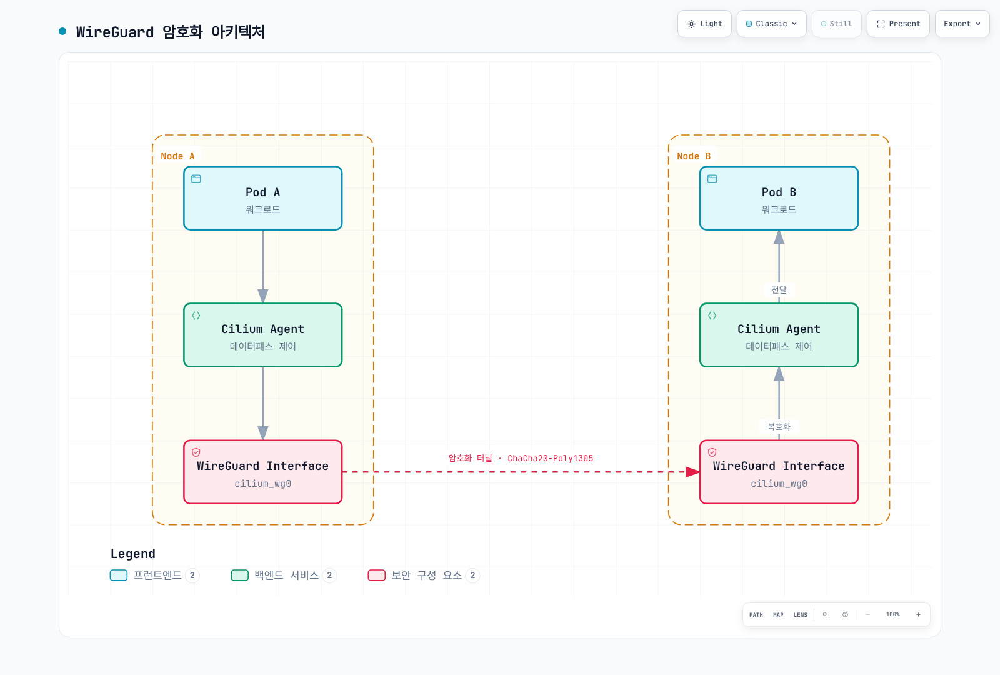
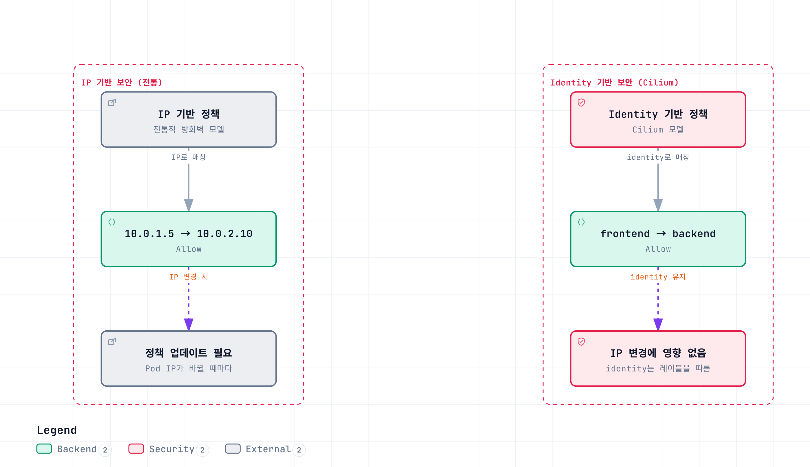

# Cilium Service Mesh 보안

> **검토일**: 2026년 9월 11일 · Cilium/chart 1.20.1 · 번들 SPIRE 1.15.2. Kubernetes/EKS 테스트 범위와 플랫폼 요건은 [개요](./README.md)를 참고하세요.

## 개요

워크로드 인가, 상대 인증, 애플리케이션 데이터 암호화를 별도로 검토해야 합니다. Cilium의 out-of-band 상호 인증, WireGuard/IPsec 전송 암호화, 별도의 ztunnel mTLS 베타는 요건과 제한이 다릅니다.

아래 정책 예시는 일반 Cilium 정책·out-of-band 인증 경로를 설명합니다. **Ztunnel 암호화에서도 같은 L4 정책 적용이 유지된다고 가정하면 안 됩니다.** 해당 베타의 제한은 아래에서 설명합니다.

## 보안 아키텍처



[🔍 인터랙티브 다이어그램 보기](https://www.atomai.click/kubernetes-docs/archmaps/ko-service-mesh-cilium-service-mesh-03-security-0.html)

상자는 책임 구분이며 모든 조합에서 모든 정책이 유지된다는 보장이 아닙니다. 특히 ztunnel 베타는 별도 Identity·데이터 경로를 사용하고 기본 CA에는 out-of-band 인증용 SPIRE 통합이 필수이지 않습니다.

## 상호 인증과 데이터 암호화

### 기존 Cilium mutual authentication

Cilium 1.20.1은 out-of-band 방식을 여전히 **베타·미완성 기능**으로 문서화합니다. Cilium Agent는 SPIRE의 SVID로 Cilium 보안 Identity를 인증합니다. 네트워크 정책에서 인증을 요구한다고 애플리케이션 연결 자체가 TLS로 바뀌지는 않습니다.



[🔍 인터랙티브 다이어그램 보기](https://www.atomai.click/kubernetes-docs/archmaps/ko-service-mesh-cilium-service-mesh-03-security-1.html)

인증 기록은 Identity 관계에 대해 캐시됩니다. 따라서 그림이 HTTP 요청마다 또는 반드시 모든 애플리케이션 연결마다 새로운 인증서·핸드셰이크를 수행한다는 뜻은 아닙니다. 인증 요구와 함께 명시적인 인가 규칙도 적용해야 합니다.

### ztunnel 기반 네이티브 mTLS (2026년 업데이트)

Cilium 1.20.1에는 **Ztunnel Transparent Encryption (Beta)**가 포함되어 있습니다. 필요한 bootstrap·CA 자료를 준비한 뒤 다음 모드 설정으로 선택합니다.

```yaml
encryption:
  enabled: true
  type: ztunnel
  ztunnel:
    ca:
      type: internal
```

릴리스의 기본값은 Cilium 내부 CA입니다. `cilium-ztunnel-secrets` Secret에는 `bootstrap-private.key`, `bootstrap-root.crt`, `ca-private.key`, `ca-root.crt`가 필요합니다. 공식 생성 스크립트는 예시이며 완전한 프로덕션 PKI·교체 설계가 아닙니다. Chart의 `bootstrapRootCert` 옵션만으로는 공개 인증서만 제공하며 내부 CA에 필요한 개인 키를 생성하지 않습니다.

Cilium Agent는 등록된 Pod의 네트워크 네임스페이스에 iptables 리다이렉션을 구성하고, 노드의 ztunnel에 워크로드 상태를 보내며 제어·인증서 인터페이스를 제공합니다. Chart는 `ztunnel-cilium` DaemonSet을 생성합니다. Namespace 등록에는 `io.cilium/mtls-enabled=true`를 사용하며 모드 설치만으로 모든 namespace가 등록되지는 않습니다.

릴리스 문서에 명시된 범위는 다음과 같습니다.

- 송신·수신 워크로드가 모두 등록되어야 하며 등록된 워크로드와 미등록 워크로드 간 통신은 지원하지 않습니다.
- Namespace 단위 등록만 지원하며 Pod별 등록은 지원하지 않습니다. HostNetwork Pod도 등록할 수 없습니다.
- TCP만 mTLS로 리다이렉트하며 UDP 등은 해당 암호화 경로 밖에 있습니다.
- ClusterMesh는 지원하지 않으며 커널이 필요한 iptables 동작을 지원해야 합니다.
- 패킷이 Pod를 떠나기 전에 암호화하므로 HBONE 포트 15008을 직접 대상으로 하는 경우 외에는 일반 L4 정책이 동작하지 않습니다.

이 통합은 namespace/service-account 워크로드 Identity 모델을 사용합니다. Out-of-band 인증의 숫자 `/identity/<id>` SPIFFE 경로와 구분해야 합니다.

준비된 테스트 설치에서 읽기 전용으로 확인하는 명령은 다음과 같습니다.

```bash
kubectl -n kube-system get daemonset ztunnel-cilium
kubectl get namespaces -l io.cilium/mtls-enabled=true
kubectl -n kube-system get configmap cilium-config -o yaml
```

Namespace 레이블, 정상 프록시 또는 15008번 포트의 패킷 관찰만으로 모든 예상 트래픽의 암호화·인가를 입증할 수는 없습니다. 실제 등록, 선택한 경로 양쪽, 인증서 Identity·신뢰와 지원하지 않는 트래픽도 확인해야 합니다.

### mTLS엔 Cilium과 Istio 중 언제 어느 쪽을 고를까

필요한 Identity, 인가와 트래픽 범위에 따라 선택하세요. 기존 Cilium 환경에서 Identity 정책·WireGuard/IPsec을 사용하거나, 제약 안에서 별도 ztunnel 베타를 평가할 수 있습니다. 실제 활성화하는 프록시·CA·운영 의존성을 함께 계산해야 합니다.

Istio의 사이드카·ambient 모드도 각자의 기능·플랫폼 범위 안에서 워크로드 프록시 mTLS를 제공합니다. `PeerAuthentication`의 `STRICT`는 인바운드 mTLS 요구사항이며 그 자체로 Identity 발급·프록시 설치·모든 호출자 인가를 수행하지 않습니다. 비교를 하나의 암호화 스위치로 단순화하면 안 됩니다. [사이드카·ambient 비교](../istio/comparison/03-sidecar-vs-ambient.md)는 실제 측정한 버전과 시나리오를 유지합니다.

### SPIRE 기반 mutual authentication 설정

**Out-of-band 인증**에는 설치별로 검토한 values에 다음 오버레이를 병합합니다.

```yaml
authentication:
  enabled: true
  mutual:
    spire:
      enabled: true
      trustDomain: spiffe.cilium
      agentSocketPath: /run/spire/sockets/agent/agent.sock
      install:
        enabled: true
        server:
          dataStorage:
            enabled: true
            size: 1Gi
```

SPIRE StatefulSet에 적합한 StorageClass/PV가 필요합니다. 모든 EKS 클러스터에 `gp3`라는 클래스가 자동으로 존재하는 것은 아닙니다. `authentication.enabled`가 필요하고, trust domain·Agent 소켓 설정은 `install.server`나 `install.agent` 아래가 아니라 `authentication.mutual.spire` 아래에 둡니다. 번들 chart는 기존의 `server.replicas`, `server.nodeAttestor`, `agent.workloadAttestor`, `server.ca.ttl` 예시를 구현하지 않습니다.

SPIRE Server는 Agent를 증명하고 SVID에 서명합니다. Agent는 워크로드 증명을 수행하며, Cilium 통합은 Cilium 보안 Identity 항목을 등록하고 인증 정보 조회를 위임하는 과정도 사용합니다. SPIRE 활성화만으로 모든 트래픽의 인증을 강제하거나 WireGuard/IPsec을 켜지는 않습니다.

### 상호 인증 정책 적용

`authentication`은 **ingress/egress 허용 규칙 안의 객체**입니다. 배열이나 최상위 `spec.authentication` 스위치가 아닙니다. 다음 클러스터 범위 정책은 의도적으로 하나의 애플리케이션·namespace를 선택합니다.

```yaml
apiVersion: cilium.io/v2
kind: CiliumClusterwideNetworkPolicy
metadata:
  name: production-backend-auth
spec:
  endpointSelector:
    matchLabels:
      k8s:io.kubernetes.pod.namespace: production
      k8s:app: backend
  ingress:
  - fromEndpoints:
    - matchLabels:
        k8s:io.kubernetes.pod.namespace: production
        k8s:app: frontend
    toPorts:
    - ports:
      - port: '8080'
        protocol: TCP
    authentication:
      mode: required
```

### 네임스페이스별 상호 인증 설정

이 예시는 `production`의 워크로드를 선택하고 같은 namespace의 인증된 상대가 TCP 8080으로 접근하도록 허용합니다.

```yaml
apiVersion: cilium.io/v2
kind: CiliumNetworkPolicy
metadata:
  name: namespace-auth
  namespace: production
spec:
  endpointSelector: {}
  ingress:
  - fromEndpoints:
    - matchLabels:
        k8s:io.kubernetes.pod.namespace: production
    toPorts:
    - ports:
      - port: '8080'
        protocol: TCP
    authentication:
      mode: required
```

같은 namespace 허용의 예시이며 모든 애플리케이션의 최소 권한 정책은 아닙니다. 다른 포트, 클라이언트, probe와 기존 허용 정책은 별도로 검토해야 합니다. Ingress를 설정할 뿐 완전한 egress 의존성 정책을 자동 구성하지 않습니다.

### 서비스별 상호 인증 설정

```yaml
apiVersion: cilium.io/v2
kind: CiliumNetworkPolicy
metadata:
  name: service-auth
  namespace: default
spec:
  endpointSelector:
    matchLabels:
      k8s:io.kubernetes.pod.namespace: default
      k8s:app: backend
  ingress:
  - fromEndpoints:
    - matchLabels:
        k8s:io.kubernetes.pod.namespace: default
        k8s:app: frontend
    toPorts:
    - ports:
      - port: '8080'
        protocol: TCP
    authentication:
      mode: required
```

여기서 송신·수신 레이블은 워크로드를 나타내며 최종 사용자의 로그인이 아닙니다. 누가 워크로드를 생성하고 레이블을 바꾸거나 ServiceAccount를 사용할 수 있는지는 Kubernetes 권한으로 통제해야 합니다.

## CiliumNetworkPolicy L7 규칙

### HTTP L7 보안 정책

```yaml
apiVersion: cilium.io/v2
kind: CiliumNetworkPolicy
metadata:
  name: http-security-policy
  namespace: default
spec:
  endpointSelector:
    matchLabels:
      k8s:io.kubernetes.pod.namespace: default
      k8s:app: api-server
  ingress:
  - fromEndpoints:
    - matchLabels:
        k8s:io.kubernetes.pod.namespace: default
        k8s:role: reader
    toPorts:
    - ports:
      - port: '8080'
        protocol: TCP
      rules:
        http:
        - method: ^GET$
          path: ^/api/.*$
  - fromEndpoints:
    - matchLabels:
        k8s:io.kubernetes.pod.namespace: default
        k8s:role: admin
    toPorts:
    - ports:
      - port: '8080'
        protocol: TCP
      rules:
        http:
        - method: ^(GET|POST|PUT|PATCH|DELETE)$
          path: ^/api/.*$
          headers:
          - Authorization
  - fromEndpoints:
    - matchLabels:
        k8s:io.kubernetes.pod.namespace: default
        k8s:app: monitoring
    toPorts:
    - ports:
      - port: '8080'
        protocol: TCP
      rules:
        http:
        - method: ^GET$
          path: ^/health$
        - method: ^GET$
          path: ^/metrics$
```

한 규칙 안의 HTTP 항목은 OR 관계입니다. `headers: [Authorization]`은 존재만 요구하며 bearer token의 서명·만료·권한을 검증하지 않습니다. 기존 `Authorization: Bearer .*` 문자열도 JWT 검증기나 일반적인 정규식 값 비교가 아니었습니다. 애플리케이션 인증·인가는 별도로 수행하세요.

HTTP 경로 정책에는 지원되는 검사 가능한 L7 경로가 필요합니다. 애플리케이션 TLS, probe와 의존성 트래픽에도 해당 설정이 필요하며 포트 번호만으로 TLS가 활성화되지는 않습니다.

### Kafka L7 보안 정책

Cilium 1.20.1 L7 스키마는 기존 `rules.kafka` 객체를 거부합니다. 아래 대체 예시는 **네트워크 접근 가능 여부만** 제한합니다.

```yaml
apiVersion: cilium.io/v2
kind: CiliumNetworkPolicy
metadata:
  name: kafka-network-boundary
  namespace: kafka
spec:
  endpointSelector:
    matchLabels:
      k8s:io.kubernetes.pod.namespace: kafka
      k8s:app: kafka
  ingress:
  - fromEndpoints:
    - matchLabels:
        k8s:io.kubernetes.pod.namespace: kafka
        k8s:role: producer
    toPorts:
    - ports:
      - port: '9092'
        protocol: TCP
  - fromEndpoints:
    - matchLabels:
        k8s:io.kubernetes.pod.namespace: kafka
        k8s:role: consumer
    toPorts:
    - ports:
      - port: '9092'
        protocol: TCP
```

실제 Kafka Listener의 TLS/SASL과 브로커 ACL로 produce/fetch, 토픽·컨슈머 그룹을 제어하세요. 폐기된 L7 규칙을 제거하면 L4 접근만 남으며 토픽 수준 인가가 유지되는 것은 아닙니다.

### DNS L7 보안 정책

```yaml
apiVersion: cilium.io/v2
kind: CiliumNetworkPolicy
metadata:
  name: dns-security
  namespace: default
spec:
  endpointSelector:
    matchLabels:
      k8s:io.kubernetes.pod.namespace: default
      k8s:app: web-application
  egress:
  - toEndpoints:
    - matchLabels:
        k8s:io.kubernetes.pod.namespace: kube-system
        k8s:k8s-app: kube-dns
    toPorts:
    - ports:
      - port: '53'
        protocol: UDP
      - port: '53'
        protocol: TCP
      rules:
        dns:
        - matchPattern: '*.*.svc.cluster.local'
        - matchName: api.stripe.com
        - matchName: sts.us-east-1.amazonaws.com
  - toFQDNs:
    - matchName: api.stripe.com
    - matchName: sts.us-east-1.amazonaws.com
    toPorts:
    - ports:
      - port: '443'
        protocol: TCP
```

`kube-system`의 `k8s-app=kube-dns` 레이블을 가진 CoreDNS와 일반적인 `cluster.local` DNS 접미사를 가정하며 UDP·TCP DNS를 허용합니다. Service FQDN에는 서비스와 namespace가 모두 들어가므로 `*.*.svc.cluster.local`은 기존 `*.svc.cluster.local`과 다릅니다.

외부 HTTPS 허용은 DNS 질의 허용과 별개입니다. `sts.us-east-1.amazonaws.com`은 특정 리전의 AWS 엔드포인트이며, AWS는 기존의 `api.aws.amazon.com`을 범용 API 엔드포인트로 사용하지 않습니다. 실제 SDK 리전·서비스 엔드포인트와 필요한 IPv6·dual-stack·private endpoint 변형을 선택하세요. 내부 DNS 응답이 모든 내부 Service 연결을 자동 허용하지는 않습니다.

Resolver 검색 목록과 NodeLocal DNS도 검토해야 합니다. 넓은 S3 와일드카드는 의도한 버킷 외의 목적지를 허용할 수 있으며 DNS/IP 정책만으로 허용된 목적지를 통한 데이터 유출을 방지한다고 보장할 수 없습니다.

## 상호 인증 (Mutual Authentication)

### 인증 모드

| 모드 | Out-of-band 정책 API에서의 의미 |
|---|---|
| `required` | 일치하는 허용 트래픽에 성공적인 인증 요구 |
| `disabled` | 해당 규칙의 트래픽에 명시적 인증 예외 적용 |
| `test-always-fail` | 의도적으로 인증을 실패시키는 테스트 모드 |

릴리스 스키마에는 `optional` 모드가 없습니다. 다른 규칙이 겹칠 때 인증 요구를 생략하는 것과 명시적 예외를 두는 것은 구분해야 합니다. 인증 규칙을 단순한 독립 허용 규칙으로 가정하지 말고 실제 적용 결과를 확인하세요.

### 상호 인증 정책 예시

인증 예외는 명시적이고 좁게 설정하며 근거가 있어야 합니다.

```yaml
apiVersion: cilium.io/v2
kind: CiliumNetworkPolicy
metadata:
  name: authentication-exception
  namespace: production
spec:
  endpointSelector:
    matchLabels:
      k8s:io.kubernetes.pod.namespace: production
      k8s:app: secure-service
  ingress:
  - fromEndpoints:
    - matchLabels:
        k8s:io.kubernetes.pod.namespace: production
        k8s:app: trusted-client
    toPorts:
    - ports:
      - port: '443'
        protocol: TCP
    authentication:
      mode: required
  - fromEndpoints:
    - matchLabels:
        k8s:io.kubernetes.pod.namespace: monitoring
        k8s:app: prometheus
    toPorts:
    - ports:
      - port: '9090'
        protocol: TCP
    authentication:
      mode: disabled
```

Prometheus 규칙은 “가능하면 인증”이 아니라 **인증 비활성화 예외**입니다. 지정한 모니터링 워크로드와 포트만 허용합니다. 각 애플리케이션의 Listener에 TLS를 적용하는 것은 별도 애플리케이션 설정입니다.

### SPIFFE ID 기반 인증

기본 **out-of-band** SPIRE trust domain에서 Cilium 보안 Identity 형식은 다음과 같습니다.

```text
spiffe://spiffe.cilium/identity/<numeric-security-identity>
```

허용할 상대는 엔드포인트·Identity 정책으로 선택합니다. `authentication` 객체에는 임의의 SPIFFE-ID 허용 목록 필드가 없습니다. 주석을 Istio 형식의 `/ns/.../sa/...` URI로 바꾼다고 접근이 제한되지 않습니다. 앞에서 설명한 ztunnel 베타는 별도 워크로드 Identity 모델을 사용합니다.

## 암호화

### WireGuard 투명 암호화

```yaml
encryption:
  enabled: true
  type: wireguard
```

Cilium은 노드 키 쌍을 만들고 CiliumNode 정보로 공개 키를 배포합니다. Cilium 관리 Pod가 **서로 다른 노드**에 있는 지원 경로를 암호화하며, 같은 노드의 트래픽은 암호화하지 않습니다. 커널이 WireGuard를 지원해야 하고 chart에는 `encryption.wireguard.userspaceFallback` 옵션이 없습니다.

노드 간 UDP 51871과 MTU·캡슐화를 검토해야 합니다. AWS VPC CNI chaining에는 문서화된 `cni.enableRouteMTUForCNIChaining` 등의 추가 MTU 요건이 있으므로 선택한 설치 모드에 맞춰 적용하세요.

#### WireGuard 아키텍처



[🔍 인터랙티브 다이어그램 보기](https://www.atomai.click/kubernetes-docs/archmaps/ko-service-mesh-cilium-service-mesh-03-security-2.html)

Agent 상자는 관리·키 배포를 나타내며 모든 패킷의 사용자 공간 경유 홉이 아닙니다. WireGuard 인터페이스의 캡처에는 평문 내부 패킷이 보일 수 있으므로 암호화를 평가할 때는 올바른 외부 네트워크 경로를 확인해야 합니다.

Node-to-node 범위는 별도의 베타 옵션입니다.

```yaml
encryption:
  enabled: true
  type: wireguard
  nodeEncryption: true
```

키 갱신 bootstrap 실패를 피하기 위해 기본적으로 control-plane 노드를 노드 암호화에서 제외합니다. 릴리스의 트래픽 표에는 XDP 가속, Geneve 이외의 DSR, egress gateway 응답 관련 예외도 있습니다. 외부 요청의 클라이언트→클러스터 구간은 노드 WireGuard가 암호화하지 않습니다.

### IPsec 암호화

```yaml
encryption:
  enabled: true
  type: ipsec
  ipsec:
    secretName: cilium-ipsec-keys
    keyFile: keys
    keyWatcher: true
    keyRotationDuration: 5m
```

Secret은 Cilium과 같은 namespace에 있어야 합니다. 문서화된 AES-GCM 예시의 `keys` 항목 형식은 다음과 같습니다.

```text
3+ rfc4106(gcm(aes)) <fresh-20-byte-random-value-in-hex> 128
```

`+`는 터널별 파생 키를 선택합니다. `+`가 없는 기존 글로벌 키 형식은 보안상 이유로 폐기되었으므로 현재 지침으로 복사하면 안 됩니다. 예시 키를 재사용하지 말고 문서화된 CLI·Secret 절차로 새로운 키를 생성하고 보호하세요.

`keyRotationDuration: 5m`은 키 변경 후 전환·이전 키 정리 유예 기간이며 **5분마다 새 키를 생성하는 스케줄러가 아닙니다**. 지원되는 절차로 키 ID와 키 자료를 변경하고, ClusterMesh에서는 모든 클러스터를 조율하며, 업그레이드 중 노드 버전이 섞인 상태에서 키를 교체하지 마세요.

ESP·방화벽, 실제 암호화 인터페이스와 native-routing CIDR을 확인해야 합니다. 현재 IPsec의 L7 구성에는 문서화된 transparent DNS proxy 동작이 필요합니다. CNI chaining·host policy를 지원하지 않고 같은 노드의 트래픽도 암호화하지 않습니다.

### 암호화 비교

| 항목 | WireGuard | IPsec | ztunnel 베타 |
|---|---|---|---|
| 키·Identity | 노드가 생성하는 키 쌍 | 배포한 키 자료에서 터널별 키 파생 | 워크로드 mTLS 인증서와 bootstrap·CA 자료 |
| 데이터 경로 | 커널 WireGuard 인터페이스 | 커널 IPsec/XFRM | 노드별 TLS 프록시와 Pod namespace 리다이렉션 |
| 같은 노드·적용 범위 | 같은 노드는 암호화하지 않으며 릴리스 트래픽 표 확인 | 같은 노드는 암호화하지 않으며 모드별 제한 적용 | 양쪽 등록·TCP 전용·정책 제한 적용 |
| 암호 알고리즘 | WireGuard 프로토콜의 ChaCha20-Poly1305 구성 | AES-GCM 등 구성한 커널 지원 알고리즘 | 지원 프록시가 협상한 TLS |
| 성능 | 실제 CPU·MTU·트래픽 조합 측정 | 알고리즘·하드웨어·터널·단일 터널 복호화 제한 측정 | 프록시·TLS·워크로드 오버헤드 측정. 기존 비교 벤치마크에는 포함되지 않음 |

투명 암호화에는 아직 학습하지 않은 목적지를 외부로 판단하는 endpoint-discovery 구간도 있을 수 있습니다. Cilium은 제한된 egress와 encryption strict mode를 완화책으로 문서화하지만 각각 제한이 있습니다. Strict egress는 IPv4·CIDR에 의존하며, strict ingress에는 WireGuard·관리되는 인터페이스가 필요하고 CNI chaining은 지원하지 않습니다. “암호화 활성화”가 모든 경로에서 평문을 거부한다는 증거는 아닙니다.

## ID 기반 보안

### Cilium Identity

Cilium은 Identity 관련 레이블 집합에 숫자 ID를 할당하며 여러 Pod가 공유할 수 있습니다. 사용자가 계산하는 해시나 영구적인 Pod 식별자가 아닙니다.

### Identity 구성 요소

```bash
kubectl -n kube-system get pods -l k8s-app=cilium -o wide
CILIUM_POD='<agent-on-the-workload-node>'
kubectl -n default get ciliumendpoints
kubectl get ciliumidentities
kubectl -n kube-system exec "$CILIUM_POD" -c cilium-agent -- cilium-dbg identity list
kubectl -n kube-system exec "$CILIUM_POD" -c cilium-agent -- cilium-dbg status --verbose
kubectl -n kube-system exec "$CILIUM_POD" -c cilium-agent -- cilium-dbg encrypt status
```

Namespace·ServiceAccount·선택한 워크로드 레이블 등이 영향을 줍니다. ID 1–6은 host, world, unmanaged, health, init, remote-node이며 워크로드 ID는 설치별로 달라집니다. 해당 노드의 Agent를 조회하고 명령 실패와 전체 상태를 유지하세요.

### ID 기반 정책

```yaml
apiVersion: cilium.io/v2
kind: CiliumNetworkPolicy
metadata:
  name: identity-based-policy
  namespace: default
spec:
  endpointSelector:
    matchLabels:
      k8s:io.kubernetes.pod.namespace: default
      k8s:app: backend
  ingress:
  - fromEndpoints:
    - matchLabels:
        k8s:io.kubernetes.pod.namespace: default
        k8s:app: frontend
        k8s:environment: production
    toPorts:
    - ports:
      - port: '8080'
        protocol: TCP
  - fromEndpoints:
    - matchLabels:
        k8s:io.kubernetes.pod.namespace: monitoring
        k8s:app: prometheus
    toPorts:
    - ports:
      - port: '9090'
        protocol: TCP
```

### IP vs Identity 비교



[🔍 인터랙티브 다이어그램 보기](https://www.atomai.click/kubernetes-docs/archmaps/ko-service-mesh-cilium-service-mesh-03-security-4.html)

IP 변경에도 정책 selector를 유지할 수 있지만 Cilium은 엔드포인트·IP 캐시를 갱신해야 합니다. Identity는 정리 후 재할당될 수도 있으므로 그림이 모든 재시작 뒤 같은 숫자 ID를 보장하지는 않습니다.

## 외부 PKI 통합

### cert-manager 통합

다음 객체는 upstream CA Secret 생성 예시이며 **이것만으로 Secret을 SPIRE에 연결하지는 않습니다**.

```yaml
apiVersion: cert-manager.io/v1
kind: ClusterIssuer
metadata:
  name: cilium-ca-issuer
spec:
  ca:
    secretName: cilium-ca-secret
---
apiVersion: cert-manager.io/v1
kind: Certificate
metadata:
  name: cilium-spire-ca
  namespace: cilium-spire
spec:
  secretName: spire-ca-secret
  duration: 8760h
  renewBefore: 720h
  isCA: true
  privateKey:
    algorithm: ECDSA
    size: 256
    rotationPolicy: Always
  usages:
  - cert sign
  - crl sign
  subject:
    organizations:
    - Cilium
  commonName: SPIRE upstream CA
  issuerRef:
    name: cilium-ca-issuer
    kind: ClusterIssuer
    group: cert-manager.io
```

Cert-manager의 설정된 cluster-resource namespace에 충분한 잔여 수명을 가진 유효한 서명 CA·키 `cilium-ca-secret`을 준비하세요. CA 제약, 서명 용도와 신뢰 체인을 검증해야 합니다. 1년은 하위 CA 수명의 예시이며 보편적인 권장값이 아닙니다.

외부에서 관리하는 SPIRE Server는 지원되는 UpstreamAuthority와 필요한 마운트 자료 또는 Issuer API를 사용해야 합니다. 기존 PKI에 가입하는 disk authority에는 `cert_file_path`, `key_file_path`, 신뢰 루트의 `bundle_file_path`가 필요하며 reload·교체·신뢰 중첩을 설계해야 합니다. Kubernetes Secret 변경만으로 모든 인증서 소비자가 새 CA를 채택했다고 판단하면 안 됩니다.

번들 SPIRE ConfigMap을 부분적인 별도 파일로 교체하지 마세요. 외부 SPIRE에는 Cilium의 외부 서버 주소, trust domain, 위임 Identity 등록과 인증 요건을 별도로 검토해야 합니다.

### Vault 통합

다음은 독립적으로 구성한 SPIRE 1.15.2 Server의 **plugin 설정 조각**이며 완전한 Server 설정이나 Kubernetes Deployment가 아닙니다.

```hcl
plugins {
  UpstreamAuthority "vault" {
    plugin_data {
      vault_addr = "https://vault.vault.svc:8200"
      pki_mount_point = "pki"
      ca_cert_path = "/vault/ca/ca.crt"
      k8s_auth {
        k8s_auth_mount_point = "kubernetes"
        k8s_auth_role_name = "spire-upstream"
        token_path = "/var/run/secrets/vault/token"
      }
    }
  }
}
```

Plugin은 `server` 내부가 아니라 최상위 `plugins`에 둡니다. 필드 이름은 `pki_mount_point`이며 여기의 `token_path`는 `k8s_auth` 안에 들어갑니다. 토큰은 구성한 Vault 인증 역할에 사용할 projected Kubernetes ServiceAccount token으로, 일반 Vault token 파일과 다릅니다.

토큰 projection·audience와 Vault Kubernetes 인증을 준비하고, 역할을 의도한 SPIRE 워크로드에 연결하며, Vault TLS를 검증할 CA를 마운트하고 필요한 PKI sign-intermediate 권한을 부여해야 합니다. SPIRE `ca_ttl`, Vault PKI TTL, 워크로드 신뢰와 교체도 조율하세요. 이 가이드는 해당 외부 의존성을 배포·시험했다고 주장하지 않습니다.

## 제로 트러스트 네트워킹

### 기본 거부 정책

클러스터 범위 리소스이지만 의도적으로 격리된 `policy-lab` namespace만 선택합니다.

```yaml
apiVersion: cilium.io/v2
kind: CiliumClusterwideNetworkPolicy
metadata:
  name: policy-lab-default-deny
spec:
  endpointSelector:
    matchLabels:
      k8s:io.kubernetes.pod.namespace: policy-lab
  enableDefaultDeny:
    ingress: true
    egress: true
  ingress: []
  egress: []
```

`enableDefaultDeny`를 명시합니다. Cilium의 빈 ingress/egress 배열만으로는 기본 거부를 활성화하는 규칙이 생기지 않습니다. Kubernetes NetworkPolicy 예시의 동작을 그대로 가정하면 안 됩니다.

DNS 등의 구체적인 의존성은 별도 허용 규칙으로 추가합니다.

```yaml
apiVersion: cilium.io/v2
kind: CiliumNetworkPolicy
metadata:
  name: policy-lab-dns
  namespace: policy-lab
spec:
  endpointSelector: {}
  egress:
  - toEndpoints:
    - matchLabels:
        k8s:io.kubernetes.pod.namespace: kube-system
        k8s:k8s-app: kube-dns
    toPorts:
    - ports:
      - port: '53'
        protocol: UDP
      - port: '53'
        protocol: TCP
```

모든 호스트 네트워크 흐름을 허용해야 한다는 보편적인 요건은 없습니다. 실제 kubelet·probe·resolver·host policy 동작을 검토하세요. 이 예시는 Cilium의 호스트 처리 방식을 변경하거나 침해된 특권 노드를 방어하지는 않습니다.

### 최소 권한 접근

`edge`에 `app=ingress-gateway`로 표시된 Cilium 관리 게이트웨이 워크로드, `production`의 frontend·database와 정상 SPIRE 통합을 가정합니다.

```yaml
apiVersion: cilium.io/v2
kind: CiliumNetworkPolicy
metadata:
  name: production-security
  namespace: production
spec:
  endpointSelector:
    matchLabels:
      k8s:io.kubernetes.pod.namespace: production
      k8s:app: api
  ingress:
  - fromEndpoints:
    - matchLabels:
        k8s:io.kubernetes.pod.namespace: production
        k8s:app: frontend
    toPorts:
    - ports:
      - port: '8080'
        protocol: TCP
    authentication:
      mode: required
  - fromEndpoints:
    - matchLabels:
        k8s:io.kubernetes.pod.namespace: edge
        k8s:app: ingress-gateway
    toPorts:
    - ports:
      - port: '8080'
        protocol: TCP
  egress:
  - toEndpoints:
    - matchLabels:
        k8s:io.kubernetes.pod.namespace: kube-system
        k8s:k8s-app: kube-dns
    toPorts:
    - ports:
      - port: '53'
        protocol: UDP
      - port: '53'
        protocol: TCP
  - toEndpoints:
    - matchLabels:
        k8s:io.kubernetes.pod.namespace: production
        k8s:app: database
    toPorts:
    - ports:
      - port: '5432'
        protocol: TCP
    authentication:
      mode: required
```

선택한 게이트웨이 구현에서 실제 관찰한 레이블과 Identity를 사용하세요. Cilium 자체의 노드 Envoy ingress/Gateway 경로나 외부 로드 밸런서는 다른 Identity를 보일 수 있습니다. 임의 Pod 레이블은 `reserved:ingress`나 외부 클라이언트 주소와 교환 가능한 값이 아닙니다. 기존의 종료된 ingress-nginx 예시가 필수 의존성인 것은 아닙니다.

### 마이크로세그멘테이션

Service 이름을 조회하는 티어에 명시적 DNS 접근을 유지했습니다. 같은 게이트웨이 모델과 지정 Listener 포트를 전제로 합니다.

```yaml
apiVersion: cilium.io/v2
kind: CiliumNetworkPolicy
metadata:
  name: frontend-policy
  namespace: app
spec:
  endpointSelector:
    matchLabels:
      k8s:io.kubernetes.pod.namespace: app
      k8s:tier: frontend
  ingress:
  - fromEndpoints:
    - matchLabels:
        k8s:io.kubernetes.pod.namespace: edge
        k8s:app: ingress-gateway
    toPorts:
    - ports:
      - port: '443'
        protocol: TCP
  egress:
  - toEndpoints:
    - matchLabels:
        k8s:io.kubernetes.pod.namespace: kube-system
        k8s:k8s-app: kube-dns
    toPorts:
    - ports:
      - port: '53'
        protocol: UDP
      - port: '53'
        protocol: TCP
  - toEndpoints:
    - matchLabels:
        k8s:io.kubernetes.pod.namespace: app
        k8s:tier: backend
    toPorts:
    - ports:
      - port: '8080'
        protocol: TCP
    authentication:
      mode: required
---
apiVersion: cilium.io/v2
kind: CiliumNetworkPolicy
metadata:
  name: backend-policy
  namespace: app
spec:
  endpointSelector:
    matchLabels:
      k8s:io.kubernetes.pod.namespace: app
      k8s:tier: backend
  ingress:
  - fromEndpoints:
    - matchLabels:
        k8s:io.kubernetes.pod.namespace: app
        k8s:tier: frontend
    toPorts:
    - ports:
      - port: '8080'
        protocol: TCP
    authentication:
      mode: required
  egress:
  - toEndpoints:
    - matchLabels:
        k8s:io.kubernetes.pod.namespace: kube-system
        k8s:k8s-app: kube-dns
    toPorts:
    - ports:
      - port: '53'
        protocol: UDP
      - port: '53'
        protocol: TCP
  - toEndpoints:
    - matchLabels:
        k8s:io.kubernetes.pod.namespace: app
        k8s:tier: database
    toPorts:
    - ports:
      - port: '5432'
        protocol: TCP
    authentication:
      mode: required
---
apiVersion: cilium.io/v2
kind: CiliumNetworkPolicy
metadata:
  name: database-policy
  namespace: app
spec:
  endpointSelector:
    matchLabels:
      k8s:io.kubernetes.pod.namespace: app
      k8s:tier: database
  enableDefaultDeny:
    egress: true
  ingress:
  - fromEndpoints:
    - matchLabels:
        k8s:io.kubernetes.pod.namespace: app
        k8s:tier: backend
    toPorts:
    - ports:
      - port: '5432'
        protocol: TCP
    authentication:
      mode: required
  egress: []
```

데이터베이스는 egress 허용 규칙 없이 egress 기본 거부를 명시적으로 활성화하지만, 허용된 연결의 상태 기반 응답은 가능합니다. 실제 백업·복제·인증 등의 의존성을 필요한 만큼 추가하세요. 네트워크 경로 제한만으로 인가된 데이터베이스·애플리케이션 요청을 통한 모든 데이터 추출을 방지할 수는 없습니다.

## 보안 감사 및 모니터링

### 정책 감사 모드

`cilium.io/audit-mode: "true"`는 지원되는 정책별 감사 스위치가 아닙니다. 이 임의 어노테이션이 있어도 정책은 정상적으로 차단을 적용할 수 있습니다.

**격리된 엔드포인트 시험**에서 실제 변경 가능한 옵션은 `PolicyAuditMode`입니다. 로컬 엔드포인트를 확인하고 임시 활성화한 뒤 통제된 관찰이 끝나면 차단을 복구하세요.

```bash
kubectl -n kube-system exec "$CILIUM_POD" -c cilium-agent -- cilium-dbg endpoint list
ENDPOINT_ID='<local-endpoint-id-in-the-isolated-test>'
kubectl -n kube-system exec "$CILIUM_POD" -c cilium-agent -- cilium-dbg endpoint config "$ENDPOINT_ID"
kubectl -n kube-system exec "$CILIUM_POD" -c cilium-agent -- cilium-dbg endpoint config "$ENDPOINT_ID" PolicyAuditMode=true
# Observe the controlled test, then restore enforcement.
kubectl -n kube-system exec "$CILIUM_POD" -c cilium-agent -- cilium-dbg endpoint config "$ENDPOINT_ID" PolicyAuditMode=false
```

이는 하나의 정책 객체에 감사 동작을 붙이는 대신 해당 엔드포인트의 적용 방식을 바꿉니다. 모든 L7 거부·보안 실패가 허용된 감사 이벤트로 바뀐다고 가정하지 말고 실제 데이터패스·프록시 동작을 확인하세요. `enableDefaultDeny: false`도 동등한 L7 감사 모드가 아닙니다.

### 정책 위반 모니터링

```bash
# Terminal 1
cilium hubble port-forward --port-forward 4245
# Terminal 2
hubble observe --server localhost:4245 --namespace production --verdict DROPPED --last 100
hubble observe --server localhost:4245 --namespace production --verdict DROPPED --drop-reason-desc POLICY_DENIED --last 100
hubble observe --server localhost:4245 --namespace policy-lab --verdict AUDIT --last 100
```

`DROPPED`에는 정책 이외의 원인도 포함됩니다. 이유 필터는 보고된 policy-denied drop을 대상으로 하며 L7·애플리케이션 인가 실패는 별도 관찰이 필요합니다. `AUDIT`와 `DROPPED`도 다릅니다. `--last 100`은 제한된 이력이며 Relay는 연결된 Hubble 인스턴스마다 그 개수를 반환할 수 있어 전체 클러스터 트래픽 카운터가 아닙니다. 연속 관찰이 필요할 때만 `--follow`를 추가하세요.

### Prometheus 메트릭

```yaml
prometheus:
  enabled: true
hubble:
  enabled: true
  metrics:
    enabled:
    - dns
    - drop
    - flow
    - httpV2
    - icmp
    - port-distribution
    - tcp
```

활성화 플래그와 별도로 Agent·Hubble exporter의 Prometheus 탐색·수집 설정이 필요합니다. 폐기된 `http` 대신 `httpV2`를 사용하고 둘을 동시에 켜면 안 됩니다. HTTP 메트릭에는 해당 L7 가시성도 필요합니다.

- `cilium_drop_count_total`은 원인·방향별 패킷 drop을 세며 정책 위반만 세는 메트릭이 아닙니다.
- `cilium_forward_count_total`은 전달 패킷 수이며 애플리케이션 성공 요청 수가 아닙니다.
- Hubble `drop` exporter의 `hubble_drop_total`은 flow-drop 정보이며 Agent 패킷 카운터와 집계 단위가 다릅니다.
- 기존 `cilium_policy_verdict`는 문서화된 메트릭 이름이 아니었습니다. 실제 policy-verdict 이벤트나 선택한 exporter가 제공하는 메트릭을 사용하세요.

## 다음 단계

- [관측성](./04-observability.md)
- [인그레스 & 게이트웨이](./05-ingress-gateway.md)
- [모범 사례](./06-best-practices.md)
- [보안 퀴즈](../../quizzes/service-mesh/cilium-service-mesh/security.md)

## 참고 자료

- [Cilium1.20.1 mutual authentication](https://github.com/cilium/cilium/blob/v1.20.1/Documentation/network/servicemesh/mutual-authentication/mutual-authentication.rst)
- [Authentication example/API shape](https://github.com/cilium/cilium/blob/v1.20.1/Documentation/network/servicemesh/mutual-authentication/mutual-authentication-example.rst)
- [Cilium1.20.1 CNP schema](https://github.com/cilium/cilium/blob/v1.20.1/pkg/k8s/apis/cilium.io/client/crds/v2/ciliumnetworkpolicies.yaml)
- [Cilium1.20.1 ztunnel beta](https://github.com/cilium/cilium/blob/v1.20.1/Documentation/security/network/encryption-ztunnel.rst)
- [Ztunnel CA implementation](https://github.com/cilium/cilium/blob/v1.20.1/pkg/ztunnel/ca/ca_server.go)
- [Ztunnel bootstrap example](https://github.com/cilium/cilium/blob/v1.20.1/examples/kubernetes-ztunnel/generate-secrets.sh)
- [Encryption scope/strict mode](https://github.com/cilium/cilium/blob/v1.20.1/Documentation/security/network/encryption.rst)
- [WireGuard](https://github.com/cilium/cilium/blob/v1.20.1/Documentation/security/network/encryption-wireguard.rst)
- [IPsec and key rotation](https://github.com/cilium/cilium/blob/v1.20.1/Documentation/security/network/encryption-ipsec.rst)
- [Helm values](https://github.com/cilium/cilium/blob/v1.20.1/install/kubernetes/cilium/values.yaml)
- [HTTP/DNS policy](https://github.com/cilium/cilium/blob/v1.20.1/Documentation/security/policy/layer7.rst)
- [Default-deny behavior](https://github.com/cilium/cilium/blob/v1.20.1/Documentation/security/policy/intro.rst)
- [Explicit default-deny API](https://github.com/cilium/cilium/blob/v1.20.1/pkg/policy/api/rule.go)
- [Mutable endpoint audit option](https://github.com/cilium/cilium/blob/v1.20.1/pkg/option/endpoint.go)
- [Endpoint configuration CLI](https://github.com/cilium/cilium/blob/v1.20.1/Documentation/cmdref/cilium-dbg_endpoint_config.md)
- [Metrics](https://github.com/cilium/cilium/blob/v1.20.1/Documentation/observability/metrics.rst)
- [SPIRE1.15.2 server configuration](https://github.com/spiffe/spire/blob/v1.15.2/doc/spire_server.md)
- [SPIRE Vault authority](https://github.com/spiffe/spire/blob/v1.15.2/doc/plugin_server_upstreamauthority_vault.md)
- [SPIRE disk authority](https://github.com/spiffe/spire/blob/v1.15.2/doc/plugin_server_upstreamauthority_disk.md)
- [Kafka ACLs](https://kafka.apache.org/41/security/authorization-and-acls/)
- [AWS STS endpoints](https://docs.aws.amazon.com/general/latest/gr/sts.html)
- [WireGuard protocol](https://www.wireguard.com/protocol/)
- [NIST Zero Trust Architecture — further reading](https://www.nist.gov/publications/zero-trust-architecture)
