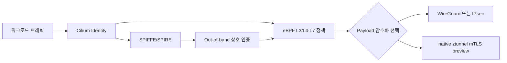
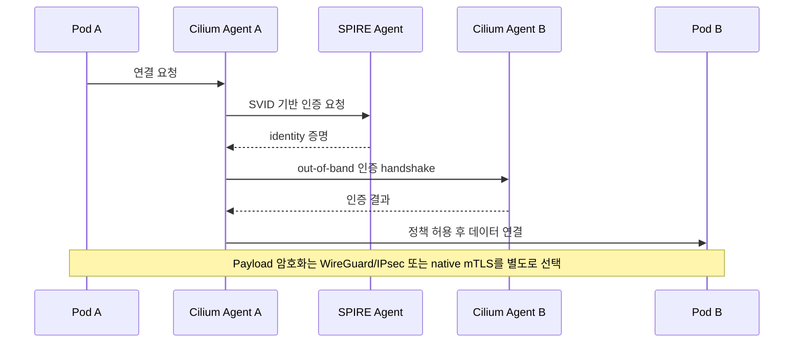
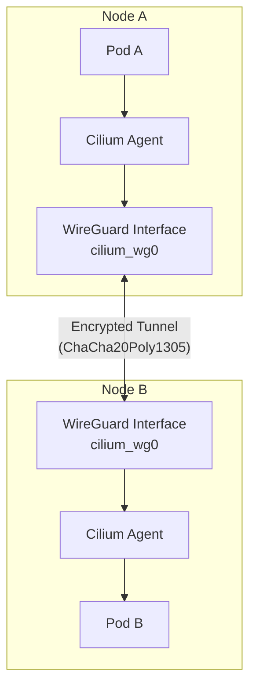
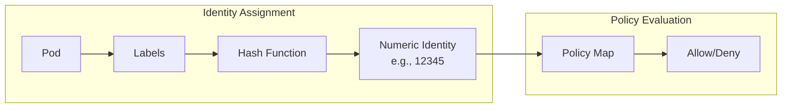
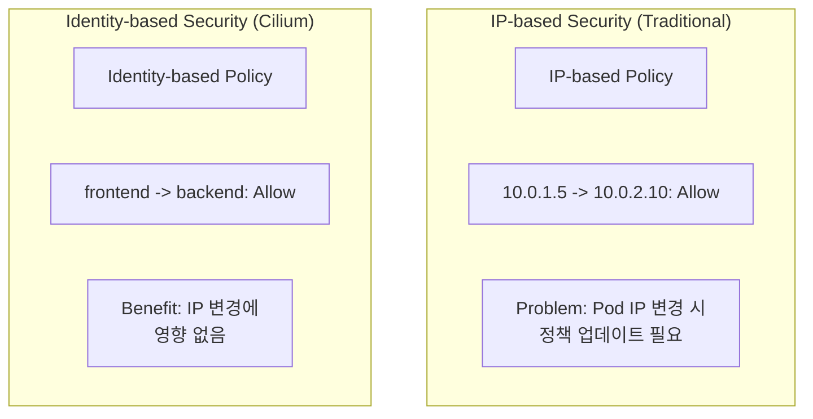

# Cilium Service Mesh 보안

> **지원 버전**: Cilium 1.16+, Kubernetes 1.28+
> **마지막 업데이트**: 2026년 8월 21일

## 개요

Cilium 보안에서는 다음 세 계층을 분리해야 합니다.

1. **Identity 기반 인가**: Cilium Identity와 eBPF 정책이 어떤 워크로드의 통신을 허용할지 결정합니다.
2. **상호 인증**: SPIFFE/SPIRE를 사용하는 Cilium mutual authentication은 애플리케이션 데이터 연결과 분리된 **out-of-band** handshake로 상대 identity를 확인합니다.
3. **데이터 암호화**: 기존 방식에서는 WireGuard/IPsec을 별도로 켜야 payload가 암호화됩니다. 지원되는 환경에서는 ztunnel 기반 native mTLS preview가 워크로드 트래픽을 TLS로 암호화합니다.

이 세 기능을 조합할 수 있지만 자동으로 Istio `PeerAuthentication`의 `STRICT` workload mTLS와 같은 의미가 되지는 않습니다. 보안 요구사항을 identity 인가, 상대 인증, 전송 중 암호화로 나눠 각각 검증해야 합니다.

## 보안 아키텍처



## 상호 인증과 데이터 암호화

### 기존 Cilium mutual authentication

Cilium mutual authentication은 연결 허용 전에 두 endpoint의 identity를 검증하지만, 기존 구현의 인증 handshake는 애플리케이션 데이터 경로와 분리되어 있습니다. 즉 `authentication.mode: required`만으로 기존 데이터 연결의 payload가 TLS 암호화된다고 가정하면 안 됩니다. 데이터 기밀성이 필요하면 [WireGuard 또는 IPsec](https://docs.cilium.io/en/stable/security/network/encryption/)을 함께 구성합니다.



### ztunnel 기반 네이티브 mTLS (2026년 업데이트)

2026년 3월 공개된 Cilium native mTLS는 ztunnel 모델을 사용해 상호 인증과 실제 payload 암호화를 하나의 workload mTLS 경로로 제공합니다. 기존 out-of-band mutual authentication 및 WireGuard/IPsec 조합과는 다른 데이터 플레인입니다. 다음 세 컴포넌트가 함께 동작합니다:

- **SPIRE** — 워크로드 신원과 X.509 인증서를 발급 (아래 SPIRE 기반 설정과 동일한 역할)
- **Cilium** — 파드의 아웃바운드 트래픽을 15001번 포트의 ztunnel로 투명하게 리다이렉트하는 iptables 규칙을 설치
- **ztunnel** — 파드별 사이드카가 아닌 **노드별 프록시**로, 실제 mTLS 핸드셰이크를 수행하고 파드 간 트래픽을 암호화

"사이드카 없음, 애플리케이션 코드 변경 없음"이라는 특성은 유지되지만 TLS handshake는 노드별 전용 프로세스에서 수행됩니다. 이 기능은 preview 상태와 플랫폼별 지원 범위를 확인한 뒤 도입해야 하며, 운영 성숙도가 높은 Istio `STRICT` mTLS의 자동 대체로 취급해서는 안 됩니다.

전체 아키텍처는 [Cilium의 네이티브 mTLS 블로그 포스트](https://cilium.io/blog/2026/03/23/native-mtls-cilium/)를 참고하세요.

### mTLS엔 Cilium과 Istio 중 언제 어느 쪽을 고를까

- **Cilium을 고르는 경우**: 이미 Cilium이 데이터플레인으로 돌고 있고, 효율적인 L3/L4 identity 정책과 네트워크 암호화가 목적일 때 — 별도 사이드카나 서비스별 프록시를 운영할 필요가 없고, 필요한 접근 규칙은 CiliumNetworkPolicy/CiliumClusterwideNetworkPolicy로 이미 표현 가능합니다.
- **Istio를 고르는 경우**: `PeerAuthentication`의 `STRICT` 시맨틱을 갖춘 성숙한 workload 인증서 mTLS나, Istio 고유의 L7 정책·라우팅([sidecar vs ambient 비교](../istio/comparison/03-sidecar-vs-ambient.md)에서 다루는 `AuthorizationPolicy`, retry, traffic-shifting 규칙류)이 필요할 때 — Cilium의 기존 mutual authentication은 out-of-band라 이런 정책 표면을 갖지 않습니다.
- 암호화 계층만 보고 결정하지 마세요: Cilium의 WireGuard/IPsec과 네이티브 ztunnel mTLS preview 둘 다 payload를 암호화하지만, 어느 쪽도 Istio `PeerAuthentication`의 `STRICT`가 한 스위치로 제공하는 "워크로드 신원 발급 + 정책 강제 + payload 암호화" 조합을 그대로 재현하지는 않습니다.

### SPIRE 기반 mutual authentication 설정

```yaml
# values.yaml - SPIRE 통합 설정
authentication:
  mutual:
    spire:
      enabled: true
      install:
        enabled: true
        namespace: cilium-spire

        server:
          # SPIRE Server 설정
          replicas: 1
          dataStorage:
            enabled: true
            size: 1Gi
            storageClass: gp3

          # Trust Domain 설정
          trustDomain: cluster.local

          # CA 설정
          ca:
            # 내부 CA 사용
            keyType: ec-p256
            ttl: 24h

          # 노드 어트스터 설정
          nodeAttestor:
            k8sPsat:
              enabled: true

        agent:
          # SPIRE Agent 설정
          socketPath: /run/spire/sockets/agent.sock

          # 워크로드 어트스터 설정
          workloadAttestor:
            k8s:
              enabled: true
              disableContainerSelectors: false
```

### 상호 인증 정책 적용

```yaml
# 전체 클러스터에서 mutual authentication 요구
apiVersion: cilium.io/v2
kind: CiliumClusterwideNetworkPolicy
metadata:
  name: enforce-mtls
spec:
  endpointSelector: {}
  authentication:
  - mode: required
```

### 네임스페이스별 상호 인증 설정

```yaml
# 특정 네임스페이스에만 mutual authentication 적용
apiVersion: cilium.io/v2
kind: CiliumNetworkPolicy
metadata:
  name: namespace-mtls
  namespace: production
spec:
  endpointSelector: {}
  ingress:
  - fromEndpoints:
    - {}
    authentication:
    - mode: required
  egress:
  - toEndpoints:
    - {}
    authentication:
    - mode: required
```

### 서비스별 상호 인증 설정

```yaml
# 특정 서비스 간 mutual authentication 강제
apiVersion: cilium.io/v2
kind: CiliumNetworkPolicy
metadata:
  name: service-mtls
  namespace: default
spec:
  endpointSelector:
    matchLabels:
      app: backend

  ingress:
  - fromEndpoints:
    - matchLabels:
        app: frontend
    authentication:
    - mode: required
    toPorts:
    - ports:
      - port: "8080"
        protocol: TCP
```

## CiliumNetworkPolicy L7 규칙

### HTTP L7 보안 정책

```yaml
apiVersion: cilium.io/v2
kind: CiliumNetworkPolicy
metadata:
  name: http-security-policy
  namespace: default
spec:
  endpointSelector:
    matchLabels:
      app: api-server

  ingress:
  # 읽기 전용 액세스
  - fromEndpoints:
    - matchLabels:
        role: reader
    toPorts:
    - ports:
      - port: "8080"
        protocol: TCP
      rules:
        http:
        - method: GET
          path: "/api/.*"

  # 관리자 액세스
  - fromEndpoints:
    - matchLabels:
        role: admin
    toPorts:
    - ports:
      - port: "8080"
        protocol: TCP
      rules:
        http:
        - method: ".*"
          path: "/api/.*"
          headers:
          - "Authorization: Bearer .*"

  # 헬스 체크
  - fromEndpoints:
    - matchLabels:
        app: monitoring
    toPorts:
    - ports:
      - port: "8080"
        protocol: TCP
      rules:
        http:
        - method: GET
          path: "/health"
        - method: GET
          path: "/metrics"
```

### Kafka L7 보안 정책

```yaml
apiVersion: cilium.io/v2
kind: CiliumNetworkPolicy
metadata:
  name: kafka-security
  namespace: kafka
spec:
  endpointSelector:
    matchLabels:
      app: kafka

  ingress:
  # Producer - 특정 토픽에만 쓰기 허용
  - fromEndpoints:
    - matchLabels:
        role: producer
    toPorts:
    - ports:
      - port: "9092"
        protocol: TCP
      rules:
        kafka:
        - apiKey: produce
          topic: "orders"
        - apiKey: produce
          topic: "events"
        - apiKey: metadata

  # Consumer - 특정 토픽에서만 읽기 허용
  - fromEndpoints:
    - matchLabels:
        role: consumer
    toPorts:
    - ports:
      - port: "9092"
        protocol: TCP
      rules:
        kafka:
        - apiKey: fetch
          topic: "orders"
        - apiKey: fetch
          topic: "events"
        - apiKey: listoffsets
          topic: "orders"
        - apiKey: listoffsets
          topic: "events"
        - apiKey: metadata
        - apiKey: findcoordinator
        - apiKey: joingroup
        - apiKey: heartbeat
        - apiKey: leavegroup
        - apiKey: syncgroup
        - apiKey: offsetcommit
          topic: "orders"
        - apiKey: offsetfetch
          topic: "orders"
```

### DNS L7 보안 정책

```yaml
apiVersion: cilium.io/v2
kind: CiliumNetworkPolicy
metadata:
  name: dns-security
  namespace: default
spec:
  endpointSelector:
    matchLabels:
      app: web-application

  egress:
  # DNS 쿼리 제한
  - toEndpoints:
    - matchLabels:
        k8s:io.kubernetes.pod.namespace: kube-system
        k8s-app: kube-dns
    toPorts:
    - ports:
      - port: "53"
        protocol: UDP
      rules:
        dns:
        # 내부 서비스만 허용
        - matchPattern: "*.svc.cluster.local"
        # 특정 외부 도메인만 허용
        - matchName: "api.stripe.com"
        - matchName: "api.aws.amazon.com"
        - matchPattern: "*.s3.amazonaws.com"

  # 허용된 외부 서비스로의 Egress
  - toFQDNs:
    - matchName: "api.stripe.com"
    - matchName: "api.aws.amazon.com"
    - matchPattern: "*.s3.amazonaws.com"
    toPorts:
    - ports:
      - port: "443"
        protocol: TCP
```

## 상호 인증 (Mutual Authentication)

> 이 절은 `authentication.mode` 정책 설정 예시입니다. mutual authentication이 다루는 범위와 다루지 않는 범위(out-of-band handshake이며 payload 암호화와 별개)는 위의 [상호 인증과 데이터 암호화](#상호-인증과-데이터-암호화)를 참고하세요.

### 인증 모드

```yaml
# Cilium 인증 모드 옵션

# 1. disabled - 인증 없음 (기본값)
authentication:
- mode: disabled

# 2. optional - 인증 가능하면 사용, 아니면 허용
authentication:
- mode: optional

# 3. required - 인증 필수
authentication:
- mode: required

# 4. test-always-fail - 테스트용 (항상 실패)
authentication:
- mode: test-always-fail
```

### 상호 인증 정책 예시

```yaml
apiVersion: cilium.io/v2
kind: CiliumNetworkPolicy
metadata:
  name: mutual-auth-policy
  namespace: production
spec:
  endpointSelector:
    matchLabels:
      app: secure-service

  ingress:
  # 인증된 클라이언트만 허용
  - fromEndpoints:
    - matchLabels:
        app: trusted-client
    authentication:
    - mode: required
    toPorts:
    - ports:
      - port: "443"
        protocol: TCP

  # 모니터링은 선택적 인증
  - fromEndpoints:
    - matchLabels:
        app: prometheus
    authentication:
    - mode: optional
    toPorts:
    - ports:
      - port: "9090"
        protocol: TCP
```

### SPIFFE ID 기반 인증

```yaml
apiVersion: cilium.io/v2
kind: CiliumNetworkPolicy
metadata:
  name: spiffe-auth
  namespace: default
spec:
  endpointSelector:
    matchLabels:
      app: database

  ingress:
  # 특정 SPIFFE ID만 허용
  - fromEndpoints:
    - matchLabels:
        app: backend
    authentication:
    - mode: required
      # SPIFFE ID 검증은 자동으로 수행됨
      # spiffe://cluster.local/ns/default/sa/backend
```

## 암호화

> 이 절은 위의 [상호 인증과 데이터 암호화](#상호-인증과-데이터-암호화)에서 개념으로 소개한 payload 암호화 메커니즘(WireGuard/IPsec)의 실제 설정입니다 — 암호화는 mutual authentication의 부산물이 아니라 별도로 선택하는 항목입니다.

### WireGuard 투명 암호화

WireGuard는 Linux 커널 레벨에서 모든 Pod 간 트래픽을 암호화합니다:

```yaml
# values.yaml - WireGuard 활성화
encryption:
  enabled: true
  type: wireguard

  wireguard:
    # 사용자 공간 폴백 (커널 지원 없는 경우)
    userspaceFallback: true

  # 노드 간 암호화
  nodeEncryption: true
```

```bash
# WireGuard 상태 확인
cilium status | grep Encryption

# 예상 출력
Encryption:              Wireguard  [NodeEncryption: Enabled, cilium_wg0 (Pubkey: xxx, Port: 51871, Peers: 2)]

# WireGuard 피어 확인
cilium encrypt status

# 예상 출력
Encryption: Wireguard
Keys in use: 1
Max Seq. Number: 0x0
Errors: 0
```

#### WireGuard 아키텍처



### IPsec 암호화

```yaml
# values.yaml - IPsec 활성화
encryption:
  enabled: true
  type: ipsec

  ipsec:
    # IPsec 인터페이스
    interface: ""

    # 키 회전 간격
    keyRotationDuration: "5m"

    # 암호화 인터페이스
    mountPath: /etc/ipsec

# IPsec 키 생성
# kubectl create secret generic -n kube-system cilium-ipsec-keys \
#   --from-literal=keys="3 rfc4106(gcm(aes)) $(openssl rand -hex 20) 128"
```

### 암호화 비교

| 기능 | WireGuard | IPsec |
|------|-----------|-------|
| 성능 | 매우 높음 | 높음 |
| 설정 복잡도 | 낮음 | 중간 |
| 커널 지원 | 5.6+ (빌트인) | 모든 버전 |
| 암호화 알고리즘 | ChaCha20Poly1305 | AES-GCM, 등 |
| 키 관리 | 자동 | 수동/자동 |
| 표준 | 비표준 | IETF 표준 |

## ID 기반 보안

### Cilium Identity

Cilium은 IP 대신 ID를 기반으로 보안 정책을 적용합니다:



### Identity 구성 요소

```bash
# Identity 레이블 구성
# - k8s:io.kubernetes.pod.namespace
# - k8s:io.cilium.k8s.policy.serviceaccount
# - k8s:app
# - k8s:version
# - 기타 사용자 정의 레이블

# Identity 목록 확인
cilium identity list

# 예시 출력
IDENTITY   LABELS
1          reserved:host
2          reserved:world
3          reserved:unmanaged
4          reserved:health
5          reserved:init
6          reserved:remote-node
12345      k8s:app=frontend,k8s:io.kubernetes.pod.namespace=default
12346      k8s:app=backend,k8s:io.kubernetes.pod.namespace=default
```

### ID 기반 정책

```yaml
# ID 기반 네트워크 정책
apiVersion: cilium.io/v2
kind: CiliumNetworkPolicy
metadata:
  name: identity-based-policy
  namespace: default
spec:
  endpointSelector:
    matchLabels:
      app: backend

  ingress:
  # 특정 레이블(Identity)을 가진 Pod만 허용
  - fromEndpoints:
    - matchLabels:
        app: frontend
        environment: production
    toPorts:
    - ports:
      - port: "8080"

  # 다른 네임스페이스의 특정 서비스 허용
  - fromEndpoints:
    - matchLabels:
        k8s:io.kubernetes.pod.namespace: monitoring
        app: prometheus
    toPorts:
    - ports:
      - port: "9090"
```

### IP vs Identity 비교



## 외부 PKI 통합

### cert-manager 통합

```yaml
# cert-manager로 인증서 관리
apiVersion: cert-manager.io/v1
kind: ClusterIssuer
metadata:
  name: cilium-ca-issuer
spec:
  ca:
    secretName: cilium-ca-secret
---
apiVersion: cert-manager.io/v1
kind: Certificate
metadata:
  name: cilium-spire-ca
  namespace: cilium-spire
spec:
  secretName: spire-ca-secret
  duration: 8760h  # 1년
  renewBefore: 720h  # 30일 전 갱신
  isCA: true
  privateKey:
    algorithm: ECDSA
    size: 256
  subject:
    organizations:
    - Cilium
  commonName: SPIRE CA
  issuerRef:
    name: cilium-ca-issuer
    kind: ClusterIssuer
```

### Vault 통합

```yaml
# SPIRE에서 Vault를 CA로 사용
apiVersion: v1
kind: ConfigMap
metadata:
  name: spire-server-config
  namespace: cilium-spire
data:
  server.conf: |
    server {
      trust_domain = "cluster.local"

      ca_subject = {
        country = ["US"]
        organization = ["MyOrg"]
        common_name = ""
      }

      # Vault UpstreamAuthority
      UpstreamAuthority "vault" {
        plugin_data {
          vault_addr = "https://vault.vault.svc:8200"
          pki_mount_path = "pki"
          ca_cert_path = "/vault/ca/ca.crt"
          token_path = "/vault/token/token"
        }
      }
    }
```

## 제로 트러스트 네트워킹

### 기본 거부 정책

```yaml
# 클러스터 전체 기본 거부
apiVersion: cilium.io/v2
kind: CiliumClusterwideNetworkPolicy
metadata:
  name: default-deny
spec:
  endpointSelector: {}
  ingress:
  - fromEndpoints:
    - matchLabels:
        reserved:host: ""
  egress:
  - toEndpoints:
    - matchLabels:
        reserved:host: ""
  - toEndpoints:
    - matchLabels:
        k8s:io.kubernetes.pod.namespace: kube-system
        k8s-app: kube-dns
    toPorts:
    - ports:
      - port: "53"
        protocol: UDP
```

### 최소 권한 접근

```yaml
# 프로덕션 네임스페이스 보안 정책
apiVersion: cilium.io/v2
kind: CiliumNetworkPolicy
metadata:
  name: production-security
  namespace: production
spec:
  # 모든 Pod에 적용
  endpointSelector: {}

  # 기본 거부
  ingressDeny:
  - fromEntities:
    - world

  # 허용 규칙
  ingress:
  # 같은 네임스페이스 내 통신 허용
  - fromEndpoints:
    - matchLabels:
        k8s:io.kubernetes.pod.namespace: production
    authentication:
    - mode: required

  # Ingress Controller에서의 접근 허용
  - fromEndpoints:
    - matchLabels:
        k8s:io.kubernetes.pod.namespace: ingress-nginx
        app: nginx-ingress
    toPorts:
    - ports:
      - port: "8080"

  egress:
  # DNS
  - toEndpoints:
    - matchLabels:
        k8s:io.kubernetes.pod.namespace: kube-system
        k8s-app: kube-dns
    toPorts:
    - ports:
      - port: "53"
        protocol: UDP

  # 같은 네임스페이스 내 통신
  - toEndpoints:
    - matchLabels:
        k8s:io.kubernetes.pod.namespace: production
    authentication:
    - mode: required
```

### 마이크로세그멘테이션

```yaml
# 3-tier 아키텍처 보안
---
# Frontend 정책
apiVersion: cilium.io/v2
kind: CiliumNetworkPolicy
metadata:
  name: frontend-policy
  namespace: app
spec:
  endpointSelector:
    matchLabels:
      tier: frontend

  ingress:
  - fromEntities:
    - world
    toPorts:
    - ports:
      - port: "443"

  egress:
  - toEndpoints:
    - matchLabels:
        tier: backend
    toPorts:
    - ports:
      - port: "8080"
---
# Backend 정책
apiVersion: cilium.io/v2
kind: CiliumNetworkPolicy
metadata:
  name: backend-policy
  namespace: app
spec:
  endpointSelector:
    matchLabels:
      tier: backend

  ingress:
  - fromEndpoints:
    - matchLabels:
        tier: frontend
    toPorts:
    - ports:
      - port: "8080"
    authentication:
    - mode: required

  egress:
  - toEndpoints:
    - matchLabels:
        tier: database
    toPorts:
    - ports:
      - port: "5432"
    authentication:
    - mode: required
---
# Database 정책
apiVersion: cilium.io/v2
kind: CiliumNetworkPolicy
metadata:
  name: database-policy
  namespace: app
spec:
  endpointSelector:
    matchLabels:
      tier: database

  ingress:
  - fromEndpoints:
    - matchLabels:
        tier: backend
    toPorts:
    - ports:
      - port: "5432"
    authentication:
    - mode: required

  # 외부 Egress 없음 (데이터 유출 방지)
  egressDeny:
  - toEntities:
    - world
```

## 보안 감사 및 모니터링

### 정책 감사 모드

```yaml
# 감사 모드로 정책 테스트
apiVersion: cilium.io/v2
kind: CiliumNetworkPolicy
metadata:
  name: audit-policy
  namespace: default
  annotations:
    # 감사 모드 - 로깅만, 차단 안 함
    cilium.io/audit-mode: "true"
spec:
  endpointSelector:
    matchLabels:
      app: backend

  ingress:
  - fromEndpoints:
    - matchLabels:
        app: frontend
    toPorts:
    - ports:
      - port: "8080"
```

### 정책 위반 모니터링

```bash
# Hubble로 정책 위반 관찰
hubble observe --verdict DROPPED

# 특정 네임스페이스의 거부된 트래픽
hubble observe --namespace production --verdict DROPPED

# 정책 위반 통계
hubble observe --verdict DROPPED -o json | jq -r '.flow | "\(.source.namespace)/\(.source.pod_name) -> \(.destination.namespace)/\(.destination.pod_name)"' | sort | uniq -c | sort -rn
```

### Prometheus 메트릭

```yaml
# 보안 관련 메트릭 수집
hubble:
  metrics:
    enabled:
    - dns
    - drop
    - flow
    - http
    - icmp
    - port-distribution
    - tcp

# 유용한 메트릭
# - cilium_drop_count_total: 정책에 의해 거부된 패킷 수
# - cilium_policy_verdict: 정책 결정 (allow/deny)
# - cilium_forward_count_total: 전달된 패킷 수
```

## 다음 단계

- [관찰성](./04-observability.md): Hubble을 통한 보안 모니터링
- [인그레스 & 게이트웨이](./05-ingress-gateway.md): 외부 트래픽 보안
- [모범 사례](./06-best-practices.md): 프로덕션 보안 설정

## 참고 자료

- [Cilium Network Policy Documentation](https://docs.cilium.io/en/stable/security/policy/)
- [Cilium Mutual Authentication](https://docs.cilium.io/en/stable/network/servicemesh/mutual-authentication/)
- [Cilium Encryption Documentation](https://docs.cilium.io/en/stable/security/network/encryption/)
- [Cilium Native mTLS](https://cilium.io/blog/2026/03/23/native-mtls-cilium/)
- [Istio PeerAuthentication](https://istio.io/latest/docs/reference/config/security/peer_authentication/)
- [SPIFFE/SPIRE Documentation](https://spiffe.io/docs/latest/)
- [Zero Trust Architecture - NIST](https://www.nist.gov/publications/zero-trust-architecture)
