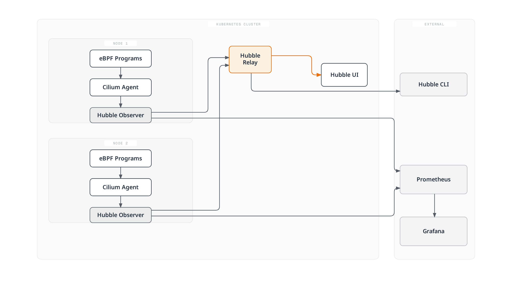
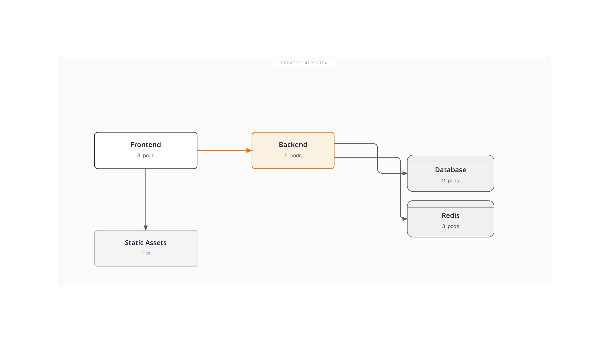
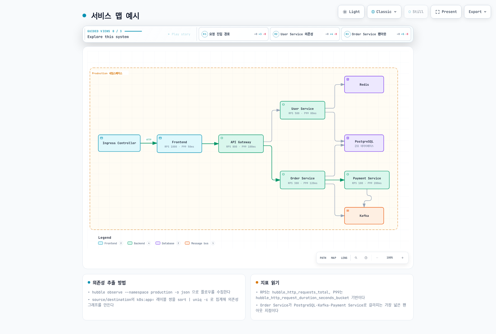
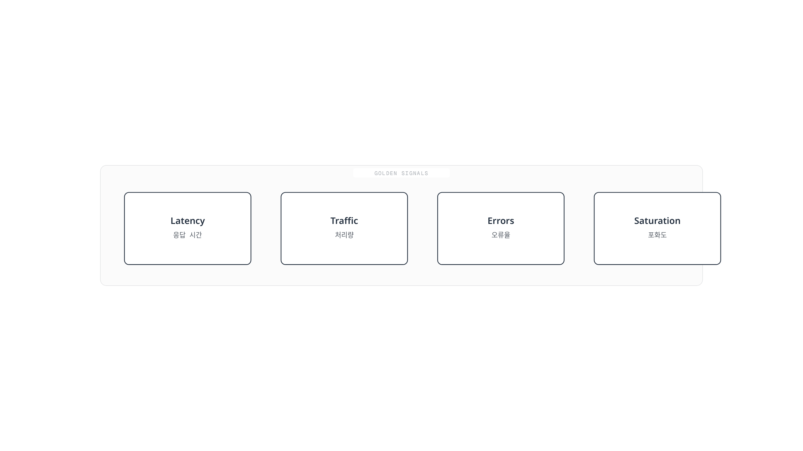

# Cilium Service Mesh 관측성

> **검토일**: 2026년 9월 11일 · Cilium/chart 1.20.1 · Hubble CLI 1.19.4 · Collector Contrib 0.160.0 · Loki 3.7.7. Kubernetes/EKS와 플랫폼 요건은 [개요](./README.md)를 참고하세요.

## 개요

Hubble은 Cilium이 처리한 트래픽의 관찰 결과를 제공합니다. L3/L4 이벤트는 데이터패스에서 오고, HTTP 가시성에는 지원되는 L7 프록시·정책 경로가 추가로 필요합니다. Hubble 활성화만으로 임의의 애플리케이션 TLS를 복호화하거나 모든 의존성을 발견하거나 분산 애플리케이션 trace를 생성하지는 않습니다.

예시는 `production`에 준비된 워크로드와 올바르게 설치된 Cilium을 전제로 합니다. 관찰 가능한 범위를 해석할 때 [보안 문서](./03-security.md)의 암호화·ztunnel 제약도 적용하세요.

## Hubble 아키텍처



[🔍 인터랙티브 다이어그램 보기](https://www.atomai.click/kubernetes-docs/archmaps/ko-service-mesh-cilium-service-mesh-04-observability-0.html)

그림은 구성 요소를 묶어 설명합니다. 설정된 경로에서는 Envoy도 L7 이벤트를 제공하므로 HTTP 관찰의 입력이 eBPF뿐인 것은 아닙니다. Prometheus의 메트릭 수집은 Relay flow API와 별도입니다.

| 구성 요소 | 역할 |
|---|---|
| Cilium Agent의 Observer | 노드별로 제한된 flow 이력을 저장·제공 |
| Hubble Relay | 연결된 Hubble Server의 관찰 결과 집계 |
| Hubble UI | 관찰된 관계와 flow 상세 정보 표시 |
| Hubble CLI | API 조회 또는 내보낸 JSON 레코드 읽기 |
| Hubble metrics handler | 해당 관찰 이벤트를 Prometheus 메트릭으로 변환 |

관찰 버퍼는 장기 로그 저장소가 아닙니다. 가득 찬 버퍼, 누락된 노드, exporter 실패와 이벤트 손실은 애플리케이션 상태와 구분해 해석해야 합니다.

## Hubble 설치 및 설정

### Helm을 통한 설치

Cilium 1.20.1의 검토된 설치 values에 다음 오버레이를 병합하세요. 메트릭과 Relay/UI를 활성화하고 포트 포워딩으로 접근합니다. Prometheus·Grafana·Collector·Loki를 설치하는 설정은 아닙니다.

```yaml
prometheus:
  enabled: true
hubble:
  enabled: true
  relay:
    enabled: true
    replicas: 1
    resources:
      requests:
        cpu: 100m
        memory: 128Mi
      limits:
        cpu: 1000m
        memory: 1024Mi
  ui:
    enabled: true
    replicas: 1
    ingress:
      enabled: false
  metrics:
    enabled:
    - dns
    - drop
    - tcp
    - flow
    - icmp
    - port-distribution
    - httpV2:labelsContext=source_namespace,source_workload,destination_namespace,destination_workload
  tls:
    enabled: true
    auto:
      enabled: true
      method: cronJob
      certValidityDuration: 365
      schedule: 0 0 1 */4 *
```

리소스 수치는 용량 측정 결과가 아니라 예시입니다. 일부 Agent 설정 변경에는 통제된 rollout이 필요하므로 적용 전에 렌더링된 워크로드와 설치 절차를 확인하세요.

Hubble Server↔Relay mTLS는 관찰 데이터 전송을 보호합니다. UI ingress, 클라이언트가 접속하는 Relay API, 메트릭 엔드포인트와 애플리케이션 트래픽의 TLS·인증은 별도입니다. 공개 UI에는 적절한 접근 제어가 필요하며 TLS Secret만으로 사용자를 인증하지는 않습니다.

이 오버레이는 인증서 갱신에 `cronJob`을 선택합니다. 선택한 chart의 기본 유효 기간은 365일이며 TLS 문서에는 1,095일을 명시한 예시도 있습니다. `method: helm`은 인증서를 생성할 수 있지만 갱신을 예약하지 않습니다. 인증서 Job, 만료와 신뢰를 확인하세요. Hubble이 인증서 reload를 지원해도 갱신 절차의 운영을 대신하지는 않습니다.

### Hubble CLI 설치

다음 Unix 예시는 릴리스를 고정하고 Linux/macOS·amd64/arm64를 선택하며 다운로드나 checksum 검증 실패 시 중단합니다.

```bash
set -eu
HUBBLE_VERSION=v1.19.4
case "$(uname -s)" in
  Linux) HUBBLE_RELEASE_OS=linux ;;
  Darwin) HUBBLE_RELEASE_OS=darwin ;;
  *) echo "Use the matching release archive for this operating system." >&2; exit 1 ;;
esac
case "$(uname -m)" in
  x86_64|amd64) HUBBLE_RELEASE_ARCH=amd64 ;;
  aarch64|arm64) HUBBLE_RELEASE_ARCH=arm64 ;;
  *) echo "Unsupported architecture for this example." >&2; exit 1 ;;
esac
HUBBLE_ARCHIVE="hubble-${HUBBLE_RELEASE_OS}-${HUBBLE_RELEASE_ARCH}.tar.gz"
HUBBLE_RELEASE_BASE="https://github.com/cilium/hubble/releases/download/${HUBBLE_VERSION}"
curl -fSLO "${HUBBLE_RELEASE_BASE}/${HUBBLE_ARCHIVE}"
curl -fSLO "${HUBBLE_RELEASE_BASE}/${HUBBLE_ARCHIVE}.sha256sum"
if command -v sha256sum >/dev/null 2>&1; then
  sha256sum --check "${HUBBLE_ARCHIVE}.sha256sum"
else
  shasum -a 256 -c "${HUBBLE_ARCHIVE}.sha256sum"
fi
tar -xzf "$HUBBLE_ARCHIVE" hubble
sudo install -m 0755 hubble /usr/local/bin/hubble
hubble version
```

다운로드에 적절한 작업 디렉터리를 사용하세요. 공식 릴리스에는 Windows amd64/arm64 아카이브도 있으므로 게시된 SHA-256을 확인하고 해당 플랫폼의 설치 절차를 따르세요. CLI 지원 플랫폼과 Cilium Linux 데이터패스를 실행할 수 있는 운영체제는 구분해야 합니다.

### Relay 연결

```bash
# Terminal 1
cilium hubble port-forward --port-forward 4245
# Terminal 2
hubble status --server localhost:4245
hubble observe --server localhost:4245 --namespace production --last 100
hubble observe --server localhost:4245 --namespace production --follow
```

전체 상태·오류를 유지하세요. grep으로 “Hubble”을 찾았거나 노드 3개가 연결된 예시 출력이 있다고 실제 설치가 정상임을 입증하지는 않습니다.

## Hubble CLI

### 기본 사용법과 필터

`hubble observe`는 일반적으로 최근 버퍼의 관찰 결과를 반환합니다. `--follow`가 없으면 연속 스트림이 아닙니다. `--last`는 이력을 제한하며 Relay는 연결된 Hubble 인스턴스마다 그 개수를 반환할 수 있습니다.

```bash
hubble observe --pod production/frontend --last 100
hubble observe --from-ip 10.0.1.5 --to-ip 10.0.2.10
hubble observe --to-port 8080
hubble observe --protocol http --http-status '5+'
hubble observe --protocol http --http-status '2+'
hubble observe --http-method POST --http-method PUT
hubble observe --http-path '^/api/v1/users/.*$'
hubble observe --to-label 'k8s:app=backend,k8s:version=v2'
hubble observe --from-namespace production --to-namespace production --from-workload frontend --to-workload backend
hubble observe --to-service production/backend
hubble observe --namespace production --verdict DROPPED --drop-reason-desc POLICY_DENIED
```

일치 규칙을 구분해야 합니다.

- Pod·Service 이름은 **prefix**이며 namespace를 생략하면 `default`를 사용합니다.
- `--from-ip`, `--to-ip`를 사용하세요. 기존 `--ip-source`·`--ip-destination`은 유효한 플래그가 아닙니다.
- HTTP 상태는 정확한 코드와 `5+` 같은 prefix를 지원하며 `500-599`는 허용하지 않습니다.
- HTTP 메서드는 정확한 값입니다. POST 또는 PUT에는 플래그를 반복하며 `"POST|PUT"`은 정규식이 아니라 리터럴 메서드 값입니다.
- 하나의 레이블 selector 문자열에서 쉼표로 연결한 조건은 AND이며, 반복한 selector들은 대안입니다.
- Service 필터는 Service·ClusterIP에서 얻은 메타데이터를 사용합니다. `--from-service frontend`가 frontend Service의 Pod를 일반적으로 선택하지는 않습니다. 호출 워크로드에는 workload·Pod·label 필터를 사용하세요.
- `--to-service production/backend`는 namespace를 포함해 단독으로 사용합니다. `--to-service`와 `--namespace` 조합은 CLI가 거부합니다.

### 출력 형식과 보존 데이터

`json`과 `jsonpb`는 같은 protobuf JSON 매핑의 별칭입니다. `dict`, `compact`, `table` 표시 형식도 지원합니다.

```bash
hubble observe --namespace production --last 100 -o json
hubble observe --input-file flows.jsonl --last 100 -o json
hubble observe --since 5m
```

절대 RFC3339 `--since`·`--until` 시각도 사용 가능한 데이터만 조회합니다. 메모리 버퍼에 수년의 이력이 생기는 것은 아니므로 과거 조사가 필요하면 내보낸 데이터를 보존하세요.

## Hubble UI

### 서비스 맵



[🔍 인터랙티브 다이어그램 보기](https://www.atomai.click/kubernetes-docs/archmaps/ko-service-mesh-cilium-service-mesh-04-observability-1.html)

UI의 관계는 관찰된 트래픽에서 나옵니다. 조용한 워크로드, 지원하지 않는 경로, 클러스터 밖 브라우저·CDN 트래픽과 메타데이터가 없는 엔드포인트는 보이지 않을 수 있습니다. 연결선이 없다고 의존성이 없다는 증거는 아닙니다.

### UI 기능과 접근

UI는 namespace·verdict 필터, 최근 flow 상세 정보와 관찰된 서비스 맵을 제공합니다. L7 상세 정보에는 L7 가시성이 필요합니다.

```bash
kubectl -n kube-system port-forward --address 127.0.0.1 service/hubble-ui 12000:80
# Open http://localhost:12000
```

## L7 흐름 가시성

### HTTP, gRPC와 DNS

```bash
hubble observe --protocol http --last 100 -o json |
  jq 'select(.flow.l7.type == "RESPONSE") | .flow.l7.http'
hubble observe --protocol http --last 100 -o json |
  jq 'select(.flow.l7.type == "RESPONSE") |
      select((.flow.l7.latency_ns // "0" | tonumber) > 1000000000)'
hubble observe --protocol dns --last 100 -o json |
  jq 'select(.flow.l7.dns.rcode == 3)'
hubble observe --protocol http --http-path '^/myapp[.]UserService/GetUser$'
hubble observe --port 9092
```

JSON 매핑은 64비트 `latency_ns`를 **문자열**로 인코딩합니다. 숫자 비교 전에 `tonumber`로 변환해야 하며 문자열을 JSON 숫자와 직접 비교하면 느린 요청 결과가 잘못됩니다.

HTTP 응답 레코드에는 상태 코드가 있지만 요청 레코드에는 아직 없을 수 있습니다. gRPC 메서드는 HTTP 경로로 선택할 수 있지만 HTTP 200이 애플리케이션 수준 gRPC 성공을 뜻하지는 않습니다. 필요한 RPC 결과는 별도로 수집하세요.

선택한 CLI에는 `--dns-rcode` 플래그가 없습니다. JSON의 숫자 응답 코드를 확인하며 3은 NXDOMAIN입니다. `kafka` CLI 필터는 호환되는 과거 데이터를 읽을 수 있지만 Cilium 1.20.1에서 제거한 Kafka L7 처리를 복구하지는 않습니다. 9092 포트 필터는 토픽·작업 검사가 아니라 L4 관찰을 제공합니다.

## Prometheus 메트릭

### 수집 활성화

각 handler를 한 번만 활성화하세요. 예를 들어 `dns`는 DNS 메트릭 집합을 내보내며 `dns:query`는 별도의 질의 카운터를 켜는 대신 질의 이름 context를 추가합니다. `dns`·`http`를 query·response·duration별로 반복하면 겹치는 메트릭 집합을 등록하려고 합니다.

`httpV2`는 폐기된 `http` handler를 대체하며 둘을 동시에 사용할 수 없습니다. `hubble_http_requests_total`은 **응답 이벤트**를 사용하고 `status`를 포함하며 요청 방향의 source/destination context를 제공합니다. 기존 `hubble_http_responses_total`은 내보내지 않습니다.

기본 오버레이는 namespace·workload context를 명시적으로 요청합니다. `destination_service`는 지원되는 `labelsContext` 이름이 아닙니다. Prometheus Operator CRD·컨트롤러를 설치하고 selector를 확인한 뒤 실제 수집을 추가하세요.

```yaml
prometheus:
  serviceMonitor:
    enabled: true
    labels:
      release: prometheus
    relabelings:
    - sourceLabels:
      - __meta_kubernetes_pod_node_name
      targetLabel: node
      action: replace
      replacement: ${1}
    - targetLabel: cluster
      replacement: example-cluster
      action: replace
hubble:
  metrics:
    serviceMonitor:
      enabled: true
      labels:
        release: prometheus
      relabelings:
      - sourceLabels:
        - __meta_kubernetes_pod_node_name
        targetLabel: node
        action: replace
        replacement: ${1}
      - targetLabel: cluster
        replacement: example-cluster
        action: replace
```

`example-cluster`를 의도한 고유 메트릭 레이블로, `release: prometheus`를 설치된 Prometheus selector와 맞는 레이블로 교체하세요. 목록을 바꿀 때 node relabeling도 유지해야 합니다. 아래 규칙에도 `ruleSelector`·namespace 선택이 맞아야 합니다.

이 relabeling은 scrape 대상과 샘플에 `cluster`를 추가합니다. Prometheus `external_labels` 설정만으로 로컬 쿼리 샘플에 해당 레이블이 생기지는 않습니다. 실제 target label을 확인하세요. `job="hubble-metrics"`·`job="cilium-agent"` 예시는 일반적인 Service 기반 job 이름을 가정합니다.

### 기록·알림 규칙

이 규칙은 Prometheus가 평가하고 Alertmanager는 알림 전달을 처리합니다. 의존하는 쿼리·대시보드를 사용하기 전에 recording rule을 로드해야 합니다.

```yaml
apiVersion: monitoring.coreos.com/v1
kind: PrometheusRule
metadata:
  name: cilium-hubble-observation
  namespace: monitoring
  labels:
    release: prometheus
spec:
  groups:
  - name: cilium.hubble.httpv2
    rules:
    - record: cilium_hubble:http_responses:rate5m
      expr: sum by (cluster, destination_namespace, destination_workload) (rate(hubble_http_requests_total{reporter="server",cluster!="",destination_namespace!="",destination_workload!=""}[5m]))
    - record: cilium_hubble:http_5xx:rate5m
      expr: 'sum by (cluster, destination_namespace, destination_workload) (rate(hubble_http_requests_total{reporter="server",cluster!="",destination_namespace!="",destination_workload!="",status=~"5.."}[5m]))

        or on (cluster, destination_namespace, destination_workload) (0 * cilium_hubble:http_responses:rate5m)'
    - record: cilium_hubble:http_5xx_percent:rate5m
      expr: '(100 * cilium_hubble:http_5xx:rate5m / cilium_hubble:http_responses:rate5m)

        and on (cluster, destination_namespace, destination_workload) (cilium_hubble:http_responses:rate5m
        > 0)'
    - record: cilium_hubble:http_latency_bucket:rate5m
      expr: sum by (le, cluster, destination_namespace, destination_workload) (rate(hubble_http_request_duration_seconds_bucket{reporter="server",cluster!="",destination_namespace!="",destination_workload!=""}[5m]))
    - alert: HighObservedHTTP5xx
      expr: (cilium_hubble:http_5xx_percent:rate5m > 5) and on (cluster, destination_namespace,
        destination_workload) (cilium_hubble:http_responses:rate5m > 1)
      for: 5m
      labels:
        severity: warning
      annotations:
        summary: High observed HTTP 5xx ratio
        description: '{{ $labels.cluster }}/{{ $labels.destination_namespace }}/{{
          $labels.destination_workload }}: {{ $value }}%'
    - alert: HighObservedHTTPP99
      expr: (histogram_quantile(0.99, cilium_hubble:http_latency_bucket:rate5m) >
        1) and on (cluster, destination_namespace, destination_workload) (cilium_hubble:http_responses:rate5m
        > 1)
      for: 5m
      labels:
        severity: warning
      annotations:
        summary: High observed HTTP latency
        description: '{{ $labels.cluster }}/{{ $labels.destination_namespace }}/{{
          $labels.destination_workload }}: {{ $value }}s'
    - alert: HubbleMetricsScrapeFailed
      expr: up{job="hubble-metrics"} == 0
      for: 5m
      labels:
        severity: warning
      annotations:
        summary: Known Hubble metrics target cannot be scraped
    - alert: CiliumBPFMapPressure
      expr: cilium_bpf_map_pressure > 0.9
      for: 5m
      labels:
        severity: warning
      annotations:
        summary: High pressure in an instrumented BPF map
        description: '{{ $labels.cluster }}/{{ $labels.node }} {{ $labels.map_name
          }}: {{ $value }}'
```

예시는 **서버·ingress 관찰 경계**를 선택합니다. Client·egress 관찰은 같은 교환을 나타낼 수 있어 경계를 섞으면 중복 집계할 수 있습니다. 여러 게이트웨이·L7 정책이 있으면 실제 프록시 경로도 확인해야 합니다.

5xx 시리즈가 없을 때는 일치하는 관찰 total이 있는 경우에만 0을 채웁니다. 유휴 total을 나눠 가짜 정상 비율을 만들지 않고, 관찰 데이터가 없으면 없는 상태로 남깁니다. 이 비율이 모든 TCP 실패, 거부된 요청, 누락된 응답과 애플리케이션 실패를 포함하지는 않습니다.

임계값, 초당 응답 1개 조건과 5분 지속 시간은 워크로드 오류 예산에 맞춰 바꿀 예시입니다. `up == 0`은 알려진 scrape 대상의 실패를 탐지하며 사라진 대상에는 별도 inventory·readiness 확인이 필요합니다. Map-pressure는 계측된 맵만 포함하고 정책 맵 사용 압력이 보고 임계값보다 낮으면 시리즈가 없을 수 있습니다.

### 주요 쿼리

처음 세 쿼리는 위 recording rule을 사용합니다. 단위와 관찰 범위도 메트릭 의미의 일부입니다.

### 관찰된 서버 HTTP 응답/초

```promql
cilium_hubble:http_responses:rate5m
```

### 관찰된 HTTP5xx 비율

```promql
cilium_hubble:http_5xx_percent:rate5m
```

### 관찰된 HTTP P99 초

```promql
histogram_quantile(0.99, cilium_hubble:http_latency_bucket:rate5m)
```

### Hubble flow-drop 이벤트/초

```promql
sum by (cluster, reason) (rate(hubble_drop_total[5m]))
```

### 관찰된 DNS 질의/초

```promql
sum by (cluster) (rate(hubble_dns_queries_total[5m]))
```

### 관찰된 SYN 플래그 발생/초

```promql
sum by (cluster) (rate(hubble_tcp_flags_total{flag="SYN"}[5m]))
```

### 관찰된 flow 이벤트/초

```promql
sum by (cluster) (rate(hubble_flows_processed_total[5m]))
```

### Cilium 전달 바이트/초

```promql
sum by (cluster, node, direction) (rate(cilium_forward_bytes_total[5m]))
```

### Prometheus scrape 성공

```promql
up{job=~"cilium-agent|hubble-metrics"}
```

### 관리 엔드포인트 수

```promql
cilium_endpoint
```

### 로드된 정책 수

```promql
cilium_policy
```

### 계측된 BPF 맵 사용 압력

```promql
cilium_bpf_map_pressure
```

### 최근 GC 시점의 CT 항목

```promql
cilium_datapath_conntrack_gc_entries
```

### 설치된 엔드포인트 프록시 리다이렉트

```promql
cilium_proxy_redirects
```

`hubble_flows_processed_total`은 바이트가 아니라 flow 이벤트를 셉니다. Hubble drop 이벤트와 Agent 패킷 카운터도 다릅니다. SYN 발생에는 재전송이 포함되며 활성 연결 gauge가 아닙니다.

Agent는 기존 `*_count` 이름 대신 `cilium_endpoint`, `cilium_policy`를 내보냅니다. `cilium_datapath_conntrack_gc_entries`는 GC 실행에서 관찰한 항목이며 기존 `cilium_datapath_conntrack_active`·`max` 비율은 문서화된 현재 메트릭 쌍이 아닙니다. `cilium_proxy_redirects`는 요청 수가 아니라 설치된 리다이렉트 수입니다. BPF pressure·capacity 메트릭은 자체 맵 레이블·보고 동작을 가지므로 관련 없는 사용률 분모를 만들면 안 됩니다.

## Grafana 대시보드

### 릴리스 대시보드

Cilium 릴리스에는 dashboard JSON이 포함됩니다. 활성화한 메트릭·target label과 각 대시보드를 대조하세요. 일반 Hubble 대시보드에는 아직 예전 HTTP-response 쿼리가 있고, HTTP workload 대시보드는 HTTPv2 데이터와 cluster·workload 변수를 사용합니다. 성공 시리즈가 없을 때의 성공률 패널도 주의가 필요합니다.

기존 v1.12 dashboard ID 목록은 이 가이드와 버전이 맞는 설치 절차가 아닙니다. 아래 커스텀 대시보드는 수정한 recording rule, 명시적인 datasource 입력, 배치와 단위를 사용합니다. 기존 Grafana에 import하고 해당 Prometheus datasource를 선택하세요.

### 커스텀 대시보드 예시

```json
{
  "__inputs": [
    {
      "name": "DS_PROMETHEUS",
      "label": "Prometheus",
      "type": "datasource",
      "pluginId": "prometheus",
      "pluginName": "Prometheus"
    }
  ],
  "id": null,
  "uid": "cilium-hubble-observed",
  "title": "Cilium Hubble Observations",
  "tags": [
    "cilium",
    "hubble"
  ],
  "schemaVersion": 38,
  "version": 1,
  "timezone": "browser",
  "time": {
    "from": "now-1h",
    "to": "now"
  },
  "refresh": "30s",
  "panels": [
    {
      "id": 1,
      "title": "Observed HTTP responses/s",
      "type": "timeseries",
      "gridPos": {
        "x": 0,
        "y": 0,
        "w": 12,
        "h": 8
      },
      "datasource": {
        "type": "prometheus",
        "uid": "${DS_PROMETHEUS}"
      },
      "targets": [
        {
          "refId": "A",
          "expr": "cilium_hubble:http_responses:rate5m",
          "legendFormat": "{{cluster}} / {{destination_namespace}} / {{destination_workload}}"
        }
      ],
      "fieldConfig": {
        "defaults": {
          "unit": "reqps"
        },
        "overrides": []
      }
    },
    {
      "id": 2,
      "title": "Observed HTTP5xx (%)",
      "type": "timeseries",
      "gridPos": {
        "x": 12,
        "y": 0,
        "w": 12,
        "h": 8
      },
      "datasource": {
        "type": "prometheus",
        "uid": "${DS_PROMETHEUS}"
      },
      "targets": [
        {
          "refId": "A",
          "expr": "cilium_hubble:http_5xx_percent:rate5m",
          "legendFormat": "{{cluster}} / {{destination_namespace}} / {{destination_workload}}"
        }
      ],
      "fieldConfig": {
        "defaults": {
          "unit": "percent"
        },
        "overrides": []
      }
    },
    {
      "id": 3,
      "title": "Observed HTTP P99",
      "type": "timeseries",
      "gridPos": {
        "x": 0,
        "y": 8,
        "w": 12,
        "h": 8
      },
      "datasource": {
        "type": "prometheus",
        "uid": "${DS_PROMETHEUS}"
      },
      "targets": [
        {
          "refId": "A",
          "expr": "histogram_quantile(0.99, cilium_hubble:http_latency_bucket:rate5m)",
          "legendFormat": "{{cluster}} / {{destination_namespace}} / {{destination_workload}}"
        }
      ],
      "fieldConfig": {
        "defaults": {
          "unit": "s"
        },
        "overrides": []
      }
    },
    {
      "id": 4,
      "title": "Observed flow drops/s",
      "type": "timeseries",
      "gridPos": {
        "x": 12,
        "y": 8,
        "w": 12,
        "h": 8
      },
      "datasource": {
        "type": "prometheus",
        "uid": "${DS_PROMETHEUS}"
      },
      "targets": [
        {
          "refId": "A",
          "expr": "sum by (cluster, reason) (rate(hubble_drop_total[5m]))",
          "legendFormat": "{{cluster}} / {{reason}}"
        }
      ],
      "fieldConfig": {
        "defaults": {
          "unit": "ops"
        },
        "overrides": []
      }
    }
  ]
}
```

이 대시보드는 관찰값을 보고하며 종단 간 애플리케이션 SLI를 보장하지 않습니다. 데이터가 없으면 트래픽·L7 가시성·수집 상태를 확인하세요.

## 서비스 의존성 맵

### 의존성 추출

다음 예시는 **ingress 경계에서 관찰한 HTTP 요청**을 방향대로 집계하며 워크로드 메타데이터가 없어도 오류를 내지 않습니다.

```bash
hubble observe --namespace production --protocol http --traffic-direction ingress --last 1000 -o json |
  jq -r 'select(.flow.l7.type == "REQUEST") |
    [.flow.source.namespace,
     (.flow.source.workloads[0].name // .flow.source.pod_name // "unknown"),
     .flow.destination.namespace,
     (.flow.destination.workloads[0].name // .flow.destination.pod_name // "unknown")] |
    @tsv' |
  sort | uniq -c | sort -rn
```

개수는 선택한 관찰 이벤트 수이며 자동으로 요청률이나 완전한 의존성 목록이 되지 않습니다. 알 수 없는 엔드포인트와 관찰 경로 밖 의존성에는 다른 근거가 필요합니다.

### 서비스 맵 예시



[🔍 인터랙티브 다이어그램 보기](https://www.atomai.click/kubernetes-docs/archmaps/ko-service-mesh-cilium-service-mesh-04-observability-2.html)

그림의 숫자에는 여기서 제공하는 측정 근거가 없습니다. 관계를 설명하는 데 사용하고 용량·SLO 임계값을 정하는 근거로 쓰지 마세요. Cilium은 Kafka 토픽 수준 가시성 없이도 Kafka로 향하는 L4 트래픽을 관찰할 수 있습니다.

## Golden Signals 모니터링



[🔍 인터랙티브 다이어그램 보기](https://www.atomai.click/kubernetes-docs/archmaps/ko-service-mesh-cilium-service-mesh-04-observability-3.html)

서비스에 맞는 정의로 신호를 사용하세요. Availability는 네 가지 이름 중 하나가 아니지만 명시적인 SLI가 필요합니다. 관찰된 HTTP 5xx 비율만으로 가용성을 완전히 측정하지는 못합니다. Histogram quantile은 인스턴스별 백분위수를 평균하는 대신 `le`를 유지하며 호환되는 bucket을 집계해야 합니다.

## OpenTelemetry 통합

### Hubble Flow 내보내기

선택한 chart는 static·dynamic **파일 내보내기**를 지원합니다. 기존 `hubble.export.opentelemetry`·`fileOutput` 설정은 OTLP 송신자를 구성하지 않습니다.

다음 예시는 파일 회전과 선택한 필드를 사용해 `production` 관련 관찰을 dynamic exporter로 내보냅니다.

```yaml
hubble:
  export:
    static:
      enabled: false
    dynamic:
      enabled: true
      config:
        createConfigMap: true
        configMapName: cilium-flowlog-config
        content:
        - name: production
          filePath: /var/run/cilium/hubble/events.log
          fileMaxSizeMb: 10
          fileMaxBackups: 5
          fileCompress: false
          includeFilters:
          - source_pod:
            - production/
          - destination_pod:
            - production/
          excludeFilters: []
          fieldMask:
          - time
          - node_name
          - source.namespace
          - source.pod_name
          - source.workloads
          - destination.namespace
          - destination.pod_name
          - destination.workloads
          - IP
          - l4
          - verdict
          - drop_reason_desc
          - l7.type
          - l7.latency_ns
          - l7.http.code
          - l7.http.method
          - l7.http.protocol
          - l7.dns.rcode
```

두 include filter는 OR 관계로 송신 또는 수신이 해당 namespace인 관찰을 선택합니다. 이 mask는 HTTP URL·헤더와 워크로드 레이블을 제외하므로 추가 필드가 필요하면 목적에 맞게 선택하세요. Exporter 활성화 후에는 dynamic 설정을 Agent 재시작 없이 갱신할 수 있지만 처음 활성화하거나 설치 설정을 바꿀 때는 적절한 rollout이 필요합니다.

파일 회전은 로컬 보존이며 중앙 영구 저장소가 아닙니다. 예상 노드에서 파일이 기록되는지 확인하고 적절한 로그 reader를 구성하세요.

### Collector 설정

다음은 Collector Contrib 0.160.0의 **설정**이며 Deployment가 아닙니다. 노드별 Collector DaemonSet에 해당 호스트 로그 디렉터리의 읽기 권한, 쓰기 가능한 영구 checkpoint 저장소와 downward API의 `K8S_NODE_NAME`을 제공해야 합니다.

```yaml
extensions:
  file_storage:
    directory: /var/lib/otelcol/file_storage
    create_directory: true
receivers:
  filelog/hubble:
    include:
    - /var/run/cilium/hubble/events*.log
    start_at: end
    storage: file_storage
    operators:
    - type: json_parser
      parse_from: body
      parse_to: body
      timestamp:
        parse_from: body.time
        layout_type: gotime
        layout: 2006-01-02T15:04:05.999999999Z07:00
processors:
  memory_limiter:
    check_interval: 1s
    limit_mib: 128
    spike_limit_mib: 32
  resource/hubble:
    attributes:
    - key: service.name
      value: hubble-flow-logs
      action: upsert
    - key: k8s.node.name
      value: ${env:K8S_NODE_NAME}
      action: upsert
  batch:
    timeout: 5s
exporters:
  otlphttp/loki:
    endpoint: https://logs.example.com/otlp
    headers:
      X-Scope-OrgID: example-tenant
    tls:
      ca_file: /etc/otel/tls/backend-ca.crt
service:
  extensions:
  - file_storage
  pipelines:
    logs:
      receivers:
      - filelog/hubble
      processors:
      - memory_limiter
      - resource/hubble
      - batch
      exporters:
      - otlphttp/loki
```

예시 backend 주소, tenant와 CA 경로를 실제 Loki OTLP 엔드포인트·신뢰 설정으로 교체하세요. 선택한 gateway가 요구하는 인증을 제공해야 하며 `X-Scope-OrgID`는 tenant 식별자이지 인증이 아닙니다.

Filelog receiver는 JSON body와 timestamp를 파싱합니다. 영구 `file_storage` checkpoint는 읽기 위치를 보존하며 임시 볼륨은 재시작 동작을 바꿀 수 있습니다. 저장된 위치가 없을 때 `start_at: end`는 기존 내용을 건너뛰므로 replay·import 설정이 아닙니다.

Loki 3.7.7은 `/otlp/v1/logs`로 OTLP/HTTP 로그를 받으며 exporter는 `/otlp` base endpoint 뒤에 `/v1/logs`를 붙입니다. Loki에 structured metadata와 호환되는 저장소 설정이 필요합니다. 제거된 Collector `loki` exporter를 사용하면 안 됩니다. Resource attribute `service.name`은 Loki의 `service_name` 레이블이 되고 구조화한 body는 로그 내용으로 남습니다.

Flow 로그, Prometheus 메트릭과 애플리케이션 trace는 서로 다른 신호입니다.

| 신호 | 이 가이드의 경로 |
|---|---|
| Hubble flow 레코드 | File exporter → 노드 filelog receiver → OTLP/HTTP 로그 backend |
| Hubble·Agent 메트릭 | 메트릭 endpoint → Prometheus 수집 |
| 애플리케이션·Envoy trace | 별도 계측과 적절한 trace pipeline·backend |

기존 Collector `jaeger` exporter도 선택한 배포판에 없습니다. 현재 Jaeger는 적절한 trace pipeline으로 OTLP trace를 받을 수 있지만, flow 로그를 trace exporter로 보낸다고 분산 trace가 만들어지지는 않습니다. 이 장의 Collector pipeline은 **로그만** 내보냅니다.

## 트러블슈팅

### 상태와 설정

```bash
cilium status
hubble status --server localhost:4245
kubectl -n kube-system get daemonset cilium
kubectl -n kube-system get deployment hubble-relay hubble-ui
kubectl -n kube-system get configmap cilium-config -o yaml
kubectl -n kube-system get pods -l k8s-app=cilium -o wide
CILIUM_POD='<agent-on-the-node-being-inspected>'
kubectl -n kube-system exec "$CILIUM_POD" -c cilium-agent -- cilium-dbg status --verbose
kubectl -n kube-system exec "$CILIUM_POD" -c cilium-agent -- cilium-dbg bpf ct list global
kubectl -n kube-system logs deployment/hubble-relay --since=10m
```

해당 노드의 Agent를 사용하세요. 클라이언트 `cilium` CLI와 Agent 안의 `cilium-dbg` 인터페이스는 다릅니다. 오류와 전체 상태를 유지하며 grep 결과를 readiness 보장으로 사용하지 마세요.

### Flow 또는 메트릭이 보이지 않을 때

데이터패스 장애로 판단하기 전에 트래픽, 보존 기간과 필터를 확인하세요. 연결된 Hubble 인스턴스와 TLS·인증서 갱신을 확인한 뒤 다음 경우를 구분해야 합니다.

- Namespace·prefix·방향·프로토콜 필터가 맞지 않아 관찰 결과가 없는 경우.
- 지원 L7 가시성이 없거나 payload가 암호화되어 HTTP 관찰이 없는 경우.
- Relay·Server를 사용할 수 없거나 메트릭 target에 접근할 수 없는 경우.
- 설치된 Prometheus가 ServiceMonitor·PrometheusRule을 선택하지 않는 경우.
- Context·cluster label이 없거나 다른 handler용 쿼리를 사용하는 경우.
- Export·reader 오류, 회전·보존 구간 누락 또는 관찰 손실.

그래프를 채우려고 무한 connectivity-test 루프를 실행하지 마세요. 준비된 워크로드에 통제된 트래픽을 사용하고 각 관찰이 무엇을 나타내는지 확인해야 합니다.

## 다음 단계

- [인그레스 & 게이트웨이](./05-ingress-gateway.md)
- [모범 사례](./06-best-practices.md)
- [관측성 퀴즈](../../quizzes/service-mesh/cilium-service-mesh/observability.md)

## 참고 자료

- [Cilium1.20.1 Hubble setup](https://github.com/cilium/cilium/blob/v1.20.1/Documentation/observability/hubble/setup.rst)
- [Hubble TLS and renewal](https://github.com/cilium/cilium/blob/v1.20.1/Documentation/observability/hubble/configuration/tls.rst)
- [Hubble export](https://github.com/cilium/cilium/blob/v1.20.1/Documentation/observability/hubble/configuration/export.rst)
- [Hubble CLI](https://github.com/cilium/cilium/blob/v1.20.1/Documentation/observability/hubble/hubble-cli.rst)
- [Hubble CLI1.19.4 release](https://github.com/cilium/hubble/releases/tag/v1.19.4)
- [Hubble UI](https://github.com/cilium/cilium/blob/v1.20.1/Documentation/observability/hubble/hubble-ui.rst)
- [Metric definitions](https://github.com/cilium/cilium/blob/v1.20.1/Documentation/observability/metrics.rst)
- [HTTP metric implementation](https://github.com/cilium/cilium/blob/v1.20.1/pkg/hubble/metrics/http/handler.go)
- [Metric context labels](https://github.com/cilium/cilium/blob/v1.20.1/pkg/hubble/metrics/api/context.go)
- [Released HTTP workload dashboard](https://github.com/cilium/cilium/blob/v1.20.1/install/kubernetes/cilium/files/hubble/dashboards/hubble-l7-http-metrics-by-workload.json)
- [Released general Hubble dashboard](https://github.com/cilium/cilium/blob/v1.20.1/install/kubernetes/cilium/files/hubble/dashboards/hubble-dashboard.json)
- [Collector0.160 filelog receiver](https://github.com/open-telemetry/opentelemetry-collector-contrib/blob/v0.160.0/receiver/filelogreceiver/README.md)
- [Loki3.7.7 OTLP ingestion](https://github.com/grafana/loki/blob/v3.7.7/docs/sources/send-data/otel/_index.md)
- [Loki3.7.7 OTLP mapping and endpoint](https://github.com/grafana/loki/blob/v3.7.7/docs/sources/shared/otel.md)
- [Collector JSON parser](https://github.com/open-telemetry/opentelemetry-collector-contrib/blob/v0.160.0/pkg/stanza/docs/operators/json_parser.md)
- [Google SRE Golden Signals](https://sre.google/sre-book/monitoring-distributed-systems/)
