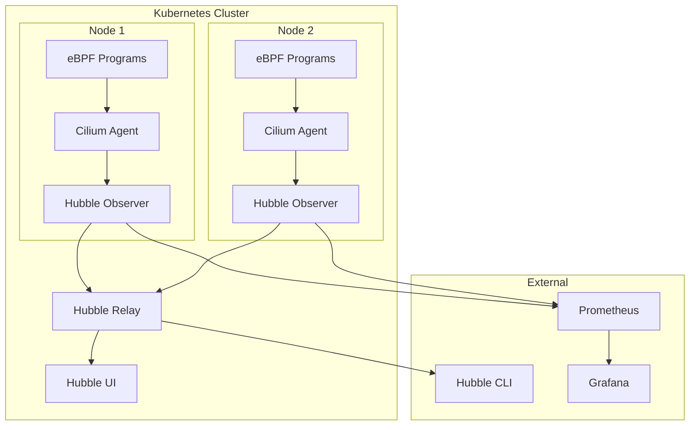
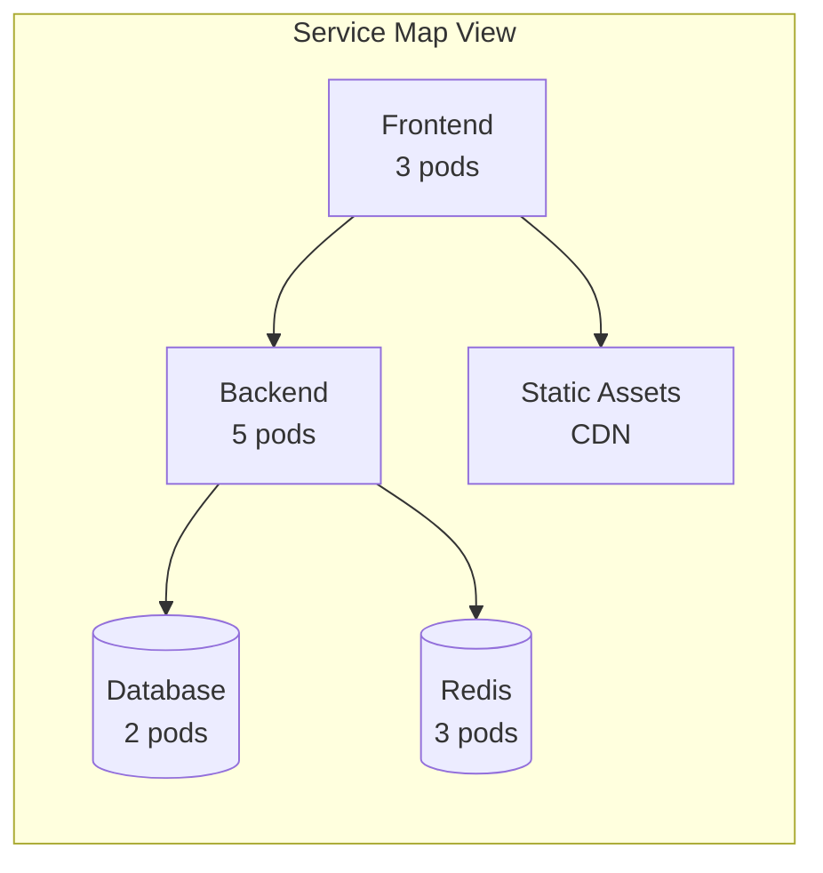
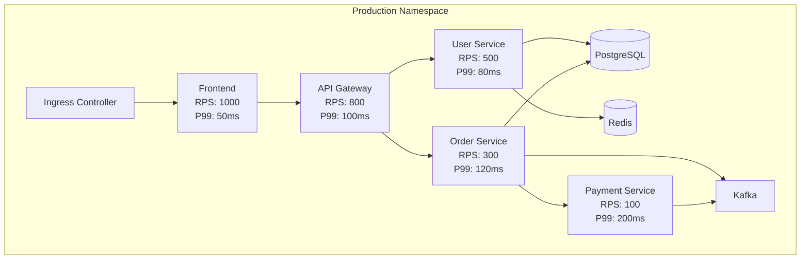
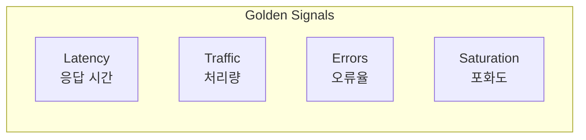

# Cilium Service Mesh 관찰성

> **지원 버전**: Cilium 1.16+, Kubernetes 1.28+
> **마지막 업데이트**: 2026년 2월 22일

## 개요

Cilium Service Mesh는 Hubble을 통해 강력한 네트워크 관찰성을 제공합니다. Hubble은 eBPF를 기반으로 네트워크 흐름을 실시간으로 관찰하고, 서비스 간 의존성을 시각화하며, L7 레벨의 상세한 메트릭을 수집합니다. 이 장에서는 Hubble의 구성 요소와 활용 방법을 설명합니다.

## Hubble 아키텍처



### 구성 요소

| 컴포넌트 | 역할 | 배포 방식 |
|----------|------|-----------|
| Hubble Observer | 노드별 흐름 수집 | Cilium Agent 내장 |
| Hubble Relay | 클러스터 전체 흐름 집계 | Deployment |
| Hubble UI | 시각화 대시보드 | Deployment |
| Hubble CLI | 명령줄 인터페이스 | 로컬 설치 |
| Hubble Metrics | Prometheus 메트릭 | Cilium Agent 내장 |

## Hubble 설치 및 설정

### Helm을 통한 설치

```yaml
# values.yaml
hubble:
  enabled: true

  # Hubble Relay
  relay:
    enabled: true
    replicas: 1
    resources:
      limits:
        cpu: 1000m
        memory: 1024Mi
      requests:
        cpu: 100m
        memory: 128Mi

  # Hubble UI
  ui:
    enabled: true
    replicas: 1
    ingress:
      enabled: true
      hosts:
      - hubble.example.com
      tls:
      - secretName: hubble-tls
        hosts:
        - hubble.example.com

  # Hubble 메트릭
  metrics:
    enabled:
    - dns
    - drop
    - tcp
    - flow
    - icmp
    - http

    serviceMonitor:
      enabled: true

  # 흐름 로그 설정
  export:
    static:
      enabled: false
      filePath: /var/run/cilium/hubble/events.log

  # TLS 설정
  tls:
    enabled: true
    auto:
      enabled: true
      method: helm
      certValidityDuration: 1095
```

### Hubble CLI 설치

```bash
# macOS
brew install hubble

# Linux
HUBBLE_VERSION=$(curl -s https://raw.githubusercontent.com/cilium/hubble/master/stable.txt)
curl -L --remote-name-all https://github.com/cilium/hubble/releases/download/$HUBBLE_VERSION/hubble-linux-amd64.tar.gz
tar xzvf hubble-linux-amd64.tar.gz
sudo mv hubble /usr/local/bin/

# 연결 설정 (포트 포워딩)
kubectl port-forward -n kube-system svc/hubble-relay 4245:80 &

# 상태 확인
hubble status

# 예상 출력
Healthcheck (via localhost:4245): Ok
Current/Max Flows: 8190/8190 (100.00%)
Flows/s: 23.19
Connected Nodes: 3/3
```

## Hubble CLI

### 기본 사용법

```bash
# 실시간 흐름 관찰
hubble observe

# 특정 네임스페이스 관찰
hubble observe --namespace production

# 특정 Pod 관찰
hubble observe --pod production/frontend-xxx

# 특정 서비스 관찰
hubble observe --to-service backend

# 팔로우 모드 (실시간)
hubble observe -f
```

### 흐름 필터링

```bash
# 프로토콜별 필터링
hubble observe --protocol http
hubble observe --protocol tcp
hubble observe --protocol dns

# IP 주소 필터링
hubble observe --ip-source 10.0.1.5
hubble observe --ip-destination 10.0.2.10

# 포트 필터링
hubble observe --port 80
hubble observe --port 443

# verdict 필터링 (허용/거부)
hubble observe --verdict FORWARDED
hubble observe --verdict DROPPED

# HTTP 상태 코드 필터링
hubble observe --http-status 500
hubble observe --http-status 200-299

# 복합 필터
hubble observe \
  --namespace production \
  --protocol http \
  --verdict DROPPED \
  -f
```

### 출력 형식

```bash
# 기본 출력
hubble observe

# JSON 출력
hubble observe -o json

# JSON 출력 (파이프 처리용)
hubble observe -o jsonpb

# 딕셔너리 형식
hubble observe -o dict

# 콤팩트 형식
hubble observe -o compact

# 테이블 형식
hubble observe -o table
```

### 고급 쿼리

```bash
# 특정 시간 범위
hubble observe --since 5m
hubble observe --since 2024-01-15T10:00:00Z --until 2024-01-15T11:00:00Z

# 최근 N개 흐름
hubble observe --last 100

# 특정 레이블 기반 필터링
hubble observe --from-label "app=frontend"
hubble observe --to-label "app=backend,version=v2"

# 서비스 간 흐름
hubble observe --from-service frontend --to-service backend

# Identity 기반 필터링
hubble observe --from-identity 12345
hubble observe --to-identity 12346

# 정규식 필터링
hubble observe --http-path "/api/v1/users/.*"
hubble observe --http-method "POST|PUT"
```

## Hubble UI

### 서비스 맵

Hubble UI는 서비스 간 의존성을 시각적으로 보여줍니다:



### UI 기능

1. **서비스 맵**: 실시간 서비스 의존성 그래프
2. **흐름 타임라인**: 시간별 네트워크 흐름
3. **네임스페이스 필터**: 네임스페이스별 보기
4. **verdict 필터**: 허용/거부 트래픽 분리
5. **상세 정보**: 개별 흐름의 L7 상세 정보

### UI 접근

```bash
# 포트 포워딩
kubectl port-forward -n kube-system svc/hubble-ui 12000:80

# 브라우저에서 접근
# http://localhost:12000
```

## L7 흐름 가시성

### HTTP 흐름

```bash
# HTTP 요청 관찰
hubble observe --protocol http -o json | jq '.flow.l7.http'

# 예시 출력
{
  "code": 200,
  "method": "GET",
  "url": "/api/v1/users",
  "protocol": "HTTP/1.1",
  "headers": [
    {"key": "Host", "value": "api.example.com"},
    {"key": "User-Agent", "value": "curl/7.79.1"}
  ]
}

# HTTP 오류 추적
hubble observe --protocol http --http-status 500-599

# 느린 요청 식별
hubble observe --protocol http -o json | jq 'select(.flow.l7.latency_ns > 1000000000)'
```

### gRPC 흐름

```bash
# gRPC 호출 관찰
hubble observe --protocol http --http-path "/.*Service/.*"

# gRPC 메서드별 필터링
hubble observe --http-path "/myapp.UserService/GetUser"
```

### DNS 쿼리

```bash
# DNS 쿼리 관찰
hubble observe --protocol dns

# 특정 도메인 쿼리
hubble observe --protocol dns -o json | jq '.flow.l7.dns | select(.query != null)'

# DNS 응답 코드별 필터링
hubble observe --protocol dns --dns-rcode NXDOMAIN
```

### Kafka 흐름

```bash
# Kafka 트래픽 관찰
hubble observe --port 9092

# Kafka 토픽별 필터링 (L7 정책 적용 시)
hubble observe --protocol kafka -o json | jq '.flow.l7.kafka'
```

## Prometheus 메트릭

### 메트릭 활성화

```yaml
# values.yaml
hubble:
  metrics:
    enabled:
    # DNS 메트릭
    - dns:query
    - dns:response

    # 패킷 드롭 메트릭
    - drop

    # TCP 메트릭
    - tcp

    # 흐름 메트릭
    - flow

    # ICMP 메트릭
    - icmp

    # HTTP 메트릭
    - http:requests
    - http:responses
    - http:duration

    # 포트 분포
    - port-distribution

    # ServiceMonitor 활성화
    serviceMonitor:
      enabled: true
      labels:
        release: prometheus
```

### 주요 메트릭

```promql
# 초당 요청 수 (RPS)
rate(hubble_http_requests_total[5m])

# HTTP 오류율
sum(rate(hubble_http_responses_total{status=~"5.."}[5m])) /
sum(rate(hubble_http_responses_total[5m])) * 100

# HTTP 지연 시간 (p99)
histogram_quantile(0.99, rate(hubble_http_request_duration_seconds_bucket[5m]))

# 패킷 드롭 수
rate(hubble_drop_total[5m])

# DNS 쿼리 수
rate(hubble_dns_queries_total[5m])

# TCP 연결 수
hubble_tcp_flags_total{flag="SYN"}

# 네트워크 흐름 수
rate(hubble_flows_processed_total[5m])
```

### Cilium 에이전트 메트릭

```promql
# Cilium 에이전트 상태
cilium_agent_up

# 엔드포인트 수
cilium_endpoint_count

# 정책 적용 수
cilium_policy_count

# BPF 맵 사용량
cilium_bpf_map_pressure

# 연결 추적 테이블 사용량
cilium_datapath_conntrack_active

# 프록시 리다이렉트 수
cilium_proxy_redirects
```

## Grafana 대시보드

### 기본 대시보드 설치

```bash
# Cilium 공식 대시보드 Import
# Grafana UI에서 Dashboard > Import > Dashboard ID 입력

# 주요 대시보드 ID
# - 16611: Cilium v1.12 Agent
# - 16612: Cilium v1.12 Operator
# - 16613: Cilium v1.12 Hubble
```

### 커스텀 대시보드 예시

```json
{
  "title": "Cilium Service Mesh Overview",
  "panels": [
    {
      "title": "HTTP Requests/s",
      "type": "graph",
      "targets": [
        {
          "expr": "sum(rate(hubble_http_requests_total[5m])) by (destination_service)",
          "legendFormat": "{{destination_service}}"
        }
      ]
    },
    {
      "title": "HTTP Error Rate",
      "type": "gauge",
      "targets": [
        {
          "expr": "sum(rate(hubble_http_responses_total{status=~\"5..\"}[5m])) / sum(rate(hubble_http_responses_total[5m])) * 100"
        }
      ]
    },
    {
      "title": "P99 Latency",
      "type": "graph",
      "targets": [
        {
          "expr": "histogram_quantile(0.99, sum(rate(hubble_http_request_duration_seconds_bucket[5m])) by (le, destination_service))",
          "legendFormat": "{{destination_service}}"
        }
      ]
    },
    {
      "title": "Dropped Packets",
      "type": "graph",
      "targets": [
        {
          "expr": "sum(rate(hubble_drop_total[5m])) by (reason)",
          "legendFormat": "{{reason}}"
        }
      ]
    }
  ]
}
```

## 서비스 의존성 맵

### 의존성 시각화

```bash
# 서비스 간 의존성 추출
hubble observe -o json | jq -r '[.flow.source.labels[] | select(startswith("k8s:app="))] | first' | sort | uniq -c

# 서비스 의존성 그래프 생성
hubble observe --namespace production -o json | \
  jq -r 'select(.flow.source.labels != null and .flow.destination.labels != null) |
    "\(.flow.source.labels | map(select(startswith("k8s:app="))) | first // "unknown") -> \(.flow.destination.labels | map(select(startswith("k8s:app="))) | first // "unknown")"' | \
  sort | uniq -c | sort -rn
```

### 서비스 맵 예시



## Golden Signals 모니터링

### 4가지 골든 시그널



### PromQL 쿼리

```promql
# 1. Latency (지연 시간)
# P50 지연 시간
histogram_quantile(0.50, sum(rate(hubble_http_request_duration_seconds_bucket[5m])) by (le, destination_service))

# P99 지연 시간
histogram_quantile(0.99, sum(rate(hubble_http_request_duration_seconds_bucket[5m])) by (le, destination_service))

# 2. Traffic (처리량)
# 초당 요청 수
sum(rate(hubble_http_requests_total[5m])) by (destination_service)

# 초당 바이트 수
sum(rate(hubble_flows_processed_total[5m])) by (destination_service)

# 3. Errors (오류율)
# HTTP 오류율
sum(rate(hubble_http_responses_total{status=~"5.."}[5m])) by (destination_service) /
sum(rate(hubble_http_responses_total[5m])) by (destination_service) * 100

# 패킷 드롭율
sum(rate(hubble_drop_total[5m])) by (reason)

# 4. Saturation (포화도)
# TCP 연결 수
hubble_tcp_connections_total

# 연결 추적 테이블 사용률
cilium_datapath_conntrack_active / cilium_datapath_conntrack_max * 100
```

### AlertManager 규칙

```yaml
# prometheus-rules.yaml
apiVersion: monitoring.coreos.com/v1
kind: PrometheusRule
metadata:
  name: cilium-alerts
  namespace: monitoring
spec:
  groups:
  - name: cilium.service-mesh
    rules:
    # 높은 오류율
    - alert: HighHTTPErrorRate
      expr: |
        sum(rate(hubble_http_responses_total{status=~"5.."}[5m])) by (destination_service)
        / sum(rate(hubble_http_responses_total[5m])) by (destination_service) * 100 > 5
      for: 5m
      labels:
        severity: warning
      annotations:
        summary: "High HTTP error rate for {{ $labels.destination_service }}"
        description: "HTTP 5xx error rate is {{ $value }}%"

    # 높은 지연 시간
    - alert: HighLatency
      expr: |
        histogram_quantile(0.99, sum(rate(hubble_http_request_duration_seconds_bucket[5m])) by (le, destination_service)) > 1
      for: 5m
      labels:
        severity: warning
      annotations:
        summary: "High latency for {{ $labels.destination_service }}"
        description: "P99 latency is {{ $value }}s"

    # 패킷 드롭
    - alert: HighDropRate
      expr: sum(rate(hubble_drop_total[5m])) by (reason) > 100
      for: 5m
      labels:
        severity: warning
      annotations:
        summary: "High packet drop rate"
        description: "Drop rate is {{ $value }}/s for reason {{ $labels.reason }}"
```

## OpenTelemetry 통합

### OTLP 내보내기 설정

```yaml
# values.yaml
hubble:
  export:
    fileOutput:
      enabled: false
    opentelemetry:
      enabled: true
      otlp:
        endpoint: "otel-collector.observability.svc:4317"
        insecure: true
        headers:
          "x-api-key": "your-api-key"
```

### OpenTelemetry Collector 설정

```yaml
# otel-collector-config.yaml
apiVersion: v1
kind: ConfigMap
metadata:
  name: otel-collector-config
  namespace: observability
data:
  config.yaml: |
    receivers:
      otlp:
        protocols:
          grpc:
            endpoint: 0.0.0.0:4317

    processors:
      batch:
        timeout: 10s

    exporters:
      # Jaeger로 내보내기
      jaeger:
        endpoint: jaeger-collector.observability.svc:14250
        tls:
          insecure: true

      # Prometheus로 메트릭 내보내기
      prometheus:
        endpoint: 0.0.0.0:8889

      # Loki로 로그 내보내기
      loki:
        endpoint: http://loki.observability.svc:3100/loki/api/v1/push

    service:
      pipelines:
        traces:
          receivers: [otlp]
          processors: [batch]
          exporters: [jaeger]
        metrics:
          receivers: [otlp]
          processors: [batch]
          exporters: [prometheus]
```

## 트러블슈팅

### 일반적인 문제 진단

```bash
# Cilium 상태 확인
cilium status

# Hubble 상태 확인
hubble status

# 연결 문제 진단
hubble observe --verdict DROPPED --namespace problematic-namespace

# 정책 위반 확인
hubble observe --verdict DROPPED -o json | jq '.flow.drop_reason_desc'

# 특정 Pod 문제 진단
hubble observe --pod production/problematic-pod-xxx

# DNS 문제 진단
hubble observe --protocol dns --dns-rcode NXDOMAIN

# 연결 추적 테이블 확인
cilium bpf ct list global
```

### 흐름 없음 문제

```bash
# Hubble이 활성화되었는지 확인
kubectl get cm -n kube-system cilium-config -o yaml | grep hubble

# Hubble Relay 상태 확인
kubectl get pods -n kube-system -l app.kubernetes.io/name=hubble-relay

# Hubble Observer 상태 확인
cilium status | grep Hubble

# 버퍼 크기 확인
kubectl exec -n kube-system ds/cilium -- cilium hubble status
```

## 다음 단계

- [인그레스 & 게이트웨이](./05-ingress-gateway.md): 외부 트래픽 모니터링
- [모범 사례](./06-best-practices.md): 관찰성 구성 최적화

## 참고 자료

- [Hubble Documentation](https://docs.cilium.io/en/stable/observability/hubble/)
- [Hubble CLI Reference](https://docs.cilium.io/en/stable/observability/hubble/hubble-cli/)
- [Hubble Metrics](https://docs.cilium.io/en/stable/observability/metrics/)
- [Grafana Dashboards for Cilium](https://grafana.com/grafana/dashboards/?search=cilium)
