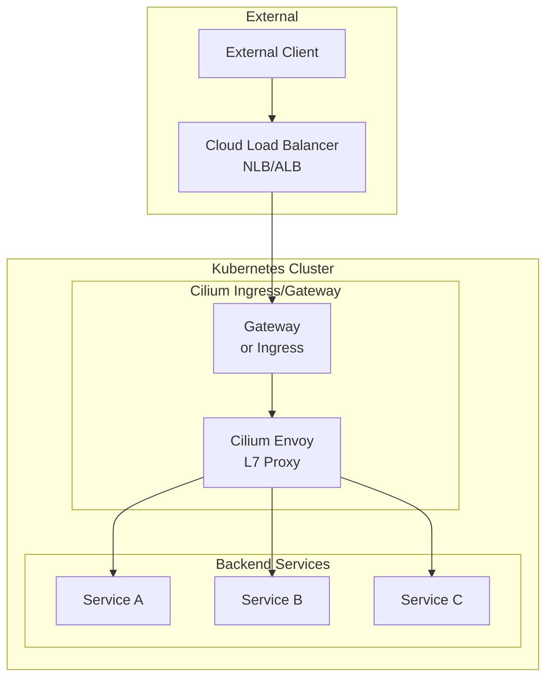
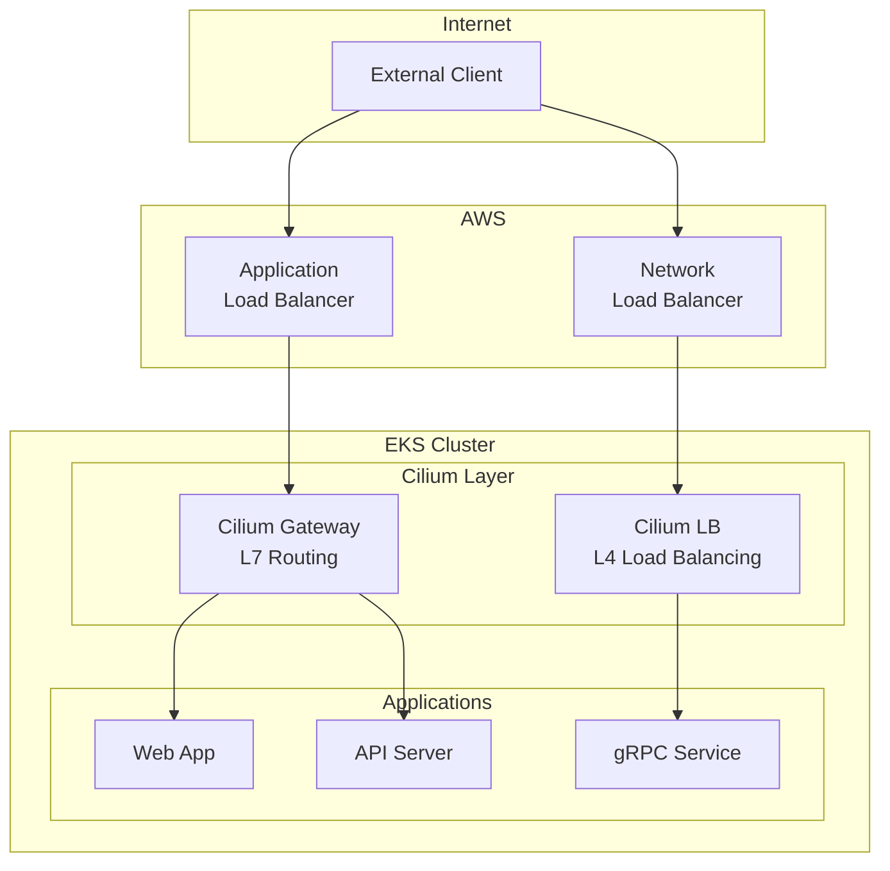
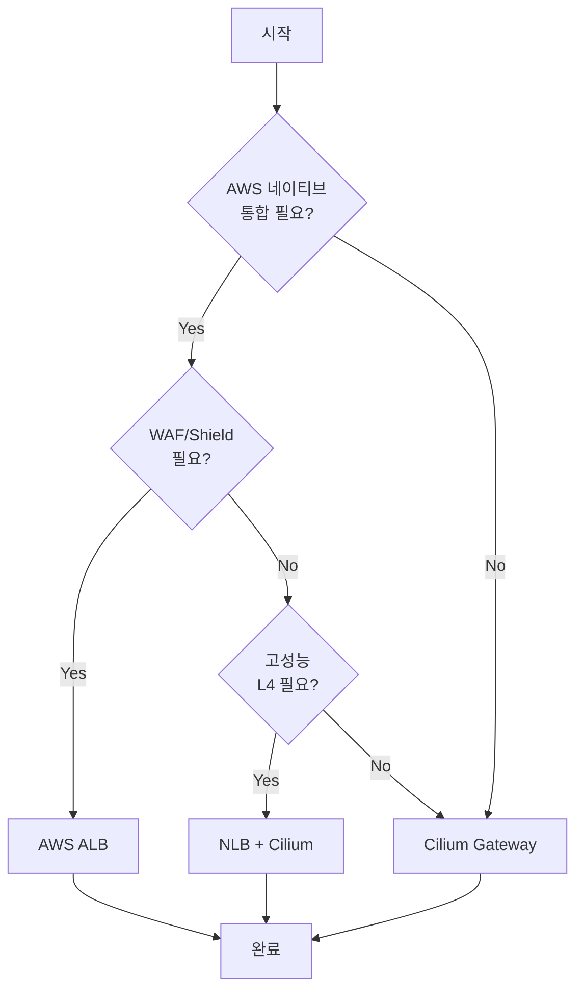

# Cilium Service Mesh 인그레스 & 게이트웨이

> **지원 버전**: Cilium 1.16+, Kubernetes 1.28+
> **마지막 업데이트**: 2025년 2월 21일

## 개요

Cilium Service Mesh는 Kubernetes Ingress Controller와 Gateway API를 네이티브로 지원합니다. eBPF 기반의 고성능 데이터패스를 활용하여 외부 트래픽을 효율적으로 처리하고, L7 라우팅, TLS 종료, 로드 밸런싱 등의 기능을 제공합니다.

## 아키텍처



## Cilium Ingress Controller

### 설치 및 활성화

```yaml
# values.yaml
ingressController:
  enabled: true

  # 로드밸런서 모드
  loadbalancerMode: shared  # shared 또는 dedicated

  # 기본 백엔드 서비스
  default: true

  # Ingress Class 이름
  ingressClassName: cilium

  # 서비스 설정
  service:
    type: LoadBalancer
    annotations:
      # EKS NLB 사용
      service.beta.kubernetes.io/aws-load-balancer-type: "nlb"
      service.beta.kubernetes.io/aws-load-balancer-scheme: "internet-facing"
```

### Ingress 리소스 예시

```yaml
apiVersion: networking.k8s.io/v1
kind: Ingress
metadata:
  name: app-ingress
  namespace: default
  annotations:
    # Cilium 특정 어노테이션
    ingress.cilium.io/loadbalancer-mode: shared
    ingress.cilium.io/tls-passthrough: "false"
spec:
  ingressClassName: cilium
  tls:
  - hosts:
    - app.example.com
    secretName: app-tls-secret
  rules:
  - host: app.example.com
    http:
      paths:
      - path: /api
        pathType: Prefix
        backend:
          service:
            name: api-service
            port:
              number: 80
      - path: /
        pathType: Prefix
        backend:
          service:
            name: frontend-service
            port:
              number: 80
```

### 경로 기반 라우팅

```yaml
apiVersion: networking.k8s.io/v1
kind: Ingress
metadata:
  name: path-routing
  namespace: default
spec:
  ingressClassName: cilium
  rules:
  - host: api.example.com
    http:
      paths:
      # /users/* -> users-service
      - path: /users
        pathType: Prefix
        backend:
          service:
            name: users-service
            port:
              number: 80

      # /orders/* -> orders-service
      - path: /orders
        pathType: Prefix
        backend:
          service:
            name: orders-service
            port:
              number: 80

      # /products/* -> products-service
      - path: /products
        pathType: Prefix
        backend:
          service:
            name: products-service
            port:
              number: 80

      # 정확한 경로 매칭
      - path: /health
        pathType: Exact
        backend:
          service:
            name: health-service
            port:
              number: 80
```

### TLS 종료

```yaml
# TLS Secret 생성
apiVersion: v1
kind: Secret
metadata:
  name: app-tls-secret
  namespace: default
type: kubernetes.io/tls
data:
  tls.crt: <base64-encoded-cert>
  tls.key: <base64-encoded-key>
---
apiVersion: networking.k8s.io/v1
kind: Ingress
metadata:
  name: tls-ingress
  namespace: default
spec:
  ingressClassName: cilium
  tls:
  - hosts:
    - secure.example.com
    secretName: app-tls-secret
  rules:
  - host: secure.example.com
    http:
      paths:
      - path: /
        pathType: Prefix
        backend:
          service:
            name: secure-app
            port:
              number: 80
```

### TLS 패스스루

```yaml
apiVersion: networking.k8s.io/v1
kind: Ingress
metadata:
  name: tls-passthrough
  namespace: default
  annotations:
    ingress.cilium.io/tls-passthrough: "true"
spec:
  ingressClassName: cilium
  rules:
  - host: backend.example.com
    http:
      paths:
      - path: /
        pathType: Prefix
        backend:
          service:
            name: tls-backend
            port:
              number: 443
```

## Gateway API

### Gateway API 활성화

```yaml
# values.yaml
gatewayAPI:
  enabled: true

  # Gateway Controller 설정
  secretNamespace: kube-system

  # Gateway Class 이름
  gatewayClassName: cilium
```

### GatewayClass

```yaml
apiVersion: gateway.networking.k8s.io/v1
kind: GatewayClass
metadata:
  name: cilium
spec:
  controllerName: io.cilium/gateway-controller
  description: "Cilium Gateway Controller"
```

### Gateway

```yaml
apiVersion: gateway.networking.k8s.io/v1
kind: Gateway
metadata:
  name: main-gateway
  namespace: default
spec:
  gatewayClassName: cilium

  listeners:
  # HTTP 리스너
  - name: http
    protocol: HTTP
    port: 80
    hostname: "*.example.com"
    allowedRoutes:
      namespaces:
        from: Same

  # HTTPS 리스너
  - name: https
    protocol: HTTPS
    port: 443
    hostname: "*.example.com"
    tls:
      mode: Terminate
      certificateRefs:
      - kind: Secret
        name: wildcard-tls
        namespace: default
    allowedRoutes:
      namespaces:
        from: Same

  # TCP 리스너
  - name: tcp
    protocol: TCP
    port: 9000
    allowedRoutes:
      namespaces:
        from: Same
      kinds:
      - kind: TCPRoute
```

### HTTPRoute

```yaml
apiVersion: gateway.networking.k8s.io/v1
kind: HTTPRoute
metadata:
  name: api-routes
  namespace: default
spec:
  parentRefs:
  - name: main-gateway
    namespace: default
    sectionName: https

  hostnames:
  - "api.example.com"

  rules:
  # 경로 기반 라우팅
  - matches:
    - path:
        type: PathPrefix
        value: /v1/users
    backendRefs:
    - name: users-v1
      port: 80

  - matches:
    - path:
        type: PathPrefix
        value: /v2/users
    backendRefs:
    - name: users-v2
      port: 80

  # 헤더 기반 라우팅
  - matches:
    - path:
        type: PathPrefix
        value: /api
      headers:
      - name: X-API-Version
        value: "2"
    backendRefs:
    - name: api-v2
      port: 80

  # 기본 라우트
  - matches:
    - path:
        type: PathPrefix
        value: /
    backendRefs:
    - name: api-v1
      port: 80
```

### 가중치 기반 트래픽 분할

```yaml
apiVersion: gateway.networking.k8s.io/v1
kind: HTTPRoute
metadata:
  name: canary-route
  namespace: default
spec:
  parentRefs:
  - name: main-gateway

  hostnames:
  - "app.example.com"

  rules:
  - matches:
    - path:
        type: PathPrefix
        value: /
    backendRefs:
    # 90% -> stable
    - name: app-stable
      port: 80
      weight: 90
    # 10% -> canary
    - name: app-canary
      port: 80
      weight: 10
```

### 요청/응답 변환

```yaml
apiVersion: gateway.networking.k8s.io/v1
kind: HTTPRoute
metadata:
  name: transform-route
  namespace: default
spec:
  parentRefs:
  - name: main-gateway

  rules:
  - matches:
    - path:
        type: PathPrefix
        value: /api

    filters:
    # 요청 헤더 수정
    - type: RequestHeaderModifier
      requestHeaderModifier:
        add:
        - name: X-Request-ID
          value: "generated-id"
        - name: X-Forwarded-By
          value: "cilium-gateway"
        set:
        - name: Host
          value: "internal-api.default.svc"
        remove:
        - X-Internal-Header

    # URL 재작성
    - type: URLRewrite
      urlRewrite:
        hostname: internal-api.default.svc
        path:
          type: ReplacePrefixMatch
          replacePrefixMatch: /v2/api

    # 응답 헤더 수정
    - type: ResponseHeaderModifier
      responseHeaderModifier:
        add:
        - name: X-Response-Time
          value: "computed"
        remove:
        - Server

    backendRefs:
    - name: api-service
      port: 80
```

### 리다이렉트

```yaml
apiVersion: gateway.networking.k8s.io/v1
kind: HTTPRoute
metadata:
  name: redirect-route
  namespace: default
spec:
  parentRefs:
  - name: main-gateway

  rules:
  # HTTP -> HTTPS 리다이렉트
  - matches:
    - path:
        type: PathPrefix
        value: /
    filters:
    - type: RequestRedirect
      requestRedirect:
        scheme: https
        statusCode: 301

  # 경로 리다이렉트
  - matches:
    - path:
        type: Exact
        value: /old-path
    filters:
    - type: RequestRedirect
      requestRedirect:
        path:
          type: ReplaceFullPath
          replaceFullPath: /new-path
        statusCode: 301

  # 호스트 리다이렉트
  - matches:
    - path:
        type: PathPrefix
        value: /legacy
    filters:
    - type: RequestRedirect
      requestRedirect:
        hostname: legacy.example.com
        statusCode: 302
```

### TCPRoute

```yaml
apiVersion: gateway.networking.k8s.io/v1alpha2
kind: TCPRoute
metadata:
  name: tcp-route
  namespace: default
spec:
  parentRefs:
  - name: main-gateway
    sectionName: tcp

  rules:
  - backendRefs:
    - name: tcp-service
      port: 9000
```

### TLSRoute

```yaml
apiVersion: gateway.networking.k8s.io/v1alpha2
kind: TLSRoute
metadata:
  name: tls-route
  namespace: default
spec:
  parentRefs:
  - name: main-gateway

  hostnames:
  - "secure.example.com"

  rules:
  - backendRefs:
    - name: tls-backend
      port: 443
```

## EKS 통합 패턴

### NLB + Cilium Ingress

```yaml
# values.yaml
ingressController:
  enabled: true
  loadbalancerMode: shared
  service:
    type: LoadBalancer
    annotations:
      # NLB 사용
      service.beta.kubernetes.io/aws-load-balancer-type: "nlb"
      service.beta.kubernetes.io/aws-load-balancer-scheme: "internet-facing"

      # NLB 타겟 타입
      service.beta.kubernetes.io/aws-load-balancer-nlb-target-type: "ip"

      # 크로스존 로드 밸런싱
      service.beta.kubernetes.io/aws-load-balancer-cross-zone-load-balancing-enabled: "true"

      # 헬스 체크
      service.beta.kubernetes.io/aws-load-balancer-healthcheck-protocol: "HTTP"
      service.beta.kubernetes.io/aws-load-balancer-healthcheck-path: "/healthz"
      service.beta.kubernetes.io/aws-load-balancer-healthcheck-interval: "10"

      # 프록시 프로토콜 (클라이언트 IP 보존)
      service.beta.kubernetes.io/aws-load-balancer-proxy-protocol: "*"
```

### ALB + Cilium

```yaml
# ALB Ingress Controller와 함께 사용
# ALB -> NodePort -> Cilium -> Pods

apiVersion: networking.k8s.io/v1
kind: Ingress
metadata:
  name: alb-to-cilium
  namespace: default
  annotations:
    kubernetes.io/ingress.class: alb
    alb.ingress.kubernetes.io/scheme: internet-facing
    alb.ingress.kubernetes.io/target-type: ip
    alb.ingress.kubernetes.io/backend-protocol: HTTP
spec:
  rules:
  - host: app.example.com
    http:
      paths:
      - path: /
        pathType: Prefix
        backend:
          service:
            name: cilium-ingress  # Cilium Ingress Service
            port:
              number: 80
```

### 하이브리드 아키텍처



## 멀티테넌트 게이트웨이

### 네임스페이스별 게이트웨이

```yaml
# 공유 GatewayClass
apiVersion: gateway.networking.k8s.io/v1
kind: GatewayClass
metadata:
  name: cilium-shared
spec:
  controllerName: io.cilium/gateway-controller
---
# Team A Gateway
apiVersion: gateway.networking.k8s.io/v1
kind: Gateway
metadata:
  name: team-a-gateway
  namespace: team-a
spec:
  gatewayClassName: cilium-shared
  listeners:
  - name: https
    protocol: HTTPS
    port: 443
    hostname: "*.team-a.example.com"
    tls:
      mode: Terminate
      certificateRefs:
      - kind: Secret
        name: team-a-tls
    allowedRoutes:
      namespaces:
        from: Same
---
# Team B Gateway
apiVersion: gateway.networking.k8s.io/v1
kind: Gateway
metadata:
  name: team-b-gateway
  namespace: team-b
spec:
  gatewayClassName: cilium-shared
  listeners:
  - name: https
    protocol: HTTPS
    port: 443
    hostname: "*.team-b.example.com"
    tls:
      mode: Terminate
      certificateRefs:
      - kind: Secret
        name: team-b-tls
    allowedRoutes:
      namespaces:
        from: Same
```

### 크로스 네임스페이스 라우팅

```yaml
# 공유 게이트웨이
apiVersion: gateway.networking.k8s.io/v1
kind: Gateway
metadata:
  name: shared-gateway
  namespace: gateway-system
spec:
  gatewayClassName: cilium
  listeners:
  - name: https
    protocol: HTTPS
    port: 443
    hostname: "*.example.com"
    allowedRoutes:
      namespaces:
        from: Selector
        selector:
          matchLabels:
            gateway-access: "true"
---
# 네임스페이스 레이블
apiVersion: v1
kind: Namespace
metadata:
  name: app-team
  labels:
    gateway-access: "true"
---
# 다른 네임스페이스에서 HTTPRoute
apiVersion: gateway.networking.k8s.io/v1
kind: HTTPRoute
metadata:
  name: app-route
  namespace: app-team
spec:
  parentRefs:
  - name: shared-gateway
    namespace: gateway-system
  hostnames:
  - "app.example.com"
  rules:
  - matches:
    - path:
        type: PathPrefix
        value: /
    backendRefs:
    - name: app-service
      port: 80
```

## 로드 밸런싱 고급 설정

### 서비스 헬스 체크

```yaml
apiVersion: cilium.io/v2
kind: CiliumEnvoyConfig
metadata:
  name: health-check-config
  namespace: default
spec:
  services:
  - name: my-service
    namespace: default

  resources:
  - "@type": type.googleapis.com/envoy.config.cluster.v3.Cluster
    name: default/my-service
    connect_timeout: 5s
    type: EDS

    # 헬스 체크 설정
    health_checks:
    - timeout: 5s
      interval: 10s
      unhealthy_threshold: 3
      healthy_threshold: 2
      http_health_check:
        path: "/health"
        host: "health-check.local"
        expected_statuses:
        - start: 200
          end: 299

    # 이상치 감지
    outlier_detection:
      consecutive_5xx: 5
      interval: 10s
      base_ejection_time: 30s
      max_ejection_percent: 50
      enforcing_consecutive_5xx: 100
```

### 연결 풀 설정

```yaml
apiVersion: cilium.io/v2
kind: CiliumEnvoyConfig
metadata:
  name: connection-pool
  namespace: default
spec:
  services:
  - name: high-traffic-service
    namespace: default

  resources:
  - "@type": type.googleapis.com/envoy.config.cluster.v3.Cluster
    name: default/high-traffic-service
    connect_timeout: 5s

    # HTTP/1.1 연결 풀
    http_protocol_options:
      accept_http_10: true

    # HTTP/2 연결 풀
    http2_protocol_options:
      max_concurrent_streams: 1000
      initial_stream_window_size: 65536
      initial_connection_window_size: 1048576

    # Circuit Breaker
    circuit_breakers:
      thresholds:
      - priority: DEFAULT
        max_connections: 10000
        max_pending_requests: 10000
        max_requests: 10000
        max_retries: 5
      - priority: HIGH
        max_connections: 20000
        max_pending_requests: 20000
        max_requests: 20000
        max_retries: 10
```

## AWS Load Balancer Controller 비교

| 기능 | Cilium Ingress/Gateway | AWS LB Controller |
|------|------------------------|-------------------|
| L7 라우팅 | Envoy 기반 | ALB 기반 |
| L4 로드 밸런싱 | eBPF 기반 | NLB 기반 |
| mTLS | 네이티브 지원 | ACM 통합 |
| Gateway API | 완전 지원 | 제한적 |
| 비용 | 노드 리소스만 | LB 비용 추가 |
| 지연 시간 | 매우 낮음 | 중간 |
| 커스터마이징 | Envoy 설정 | 제한적 |

### 선택 가이드



## 모니터링

### Gateway 메트릭

```bash
# Cilium Gateway 상태 확인
kubectl get gateway -A

# Gateway 상세 정보
kubectl describe gateway main-gateway

# HTTPRoute 상태
kubectl get httproute -A

# Envoy 상태 확인
kubectl exec -n kube-system ds/cilium -- cilium status | grep -i envoy
```

### Prometheus 메트릭

```promql
# Gateway 요청 수
rate(envoy_http_downstream_rq_total{envoy_http_conn_manager_prefix="cilium-gateway"}[5m])

# Gateway 오류율
sum(rate(envoy_http_downstream_rq_xx{envoy_http_conn_manager_prefix="cilium-gateway",envoy_response_code_class="5"}[5m])) /
sum(rate(envoy_http_downstream_rq_total{envoy_http_conn_manager_prefix="cilium-gateway"}[5m])) * 100

# Gateway 지연 시간
histogram_quantile(0.99, rate(envoy_http_downstream_rq_time_bucket{envoy_http_conn_manager_prefix="cilium-gateway"}[5m]))
```

## 다음 단계

- [모범 사례](./06-best-practices.md): 프로덕션 배포 가이드

## 참고 자료

- [Cilium Ingress Controller](https://docs.cilium.io/en/stable/network/servicemesh/ingress/)
- [Cilium Gateway API](https://docs.cilium.io/en/stable/network/servicemesh/gateway-api/gateway-api/)
- [Gateway API Specification](https://gateway-api.sigs.k8s.io/)
- [AWS Load Balancer Controller](https://kubernetes-sigs.github.io/aws-load-balancer-controller/)
