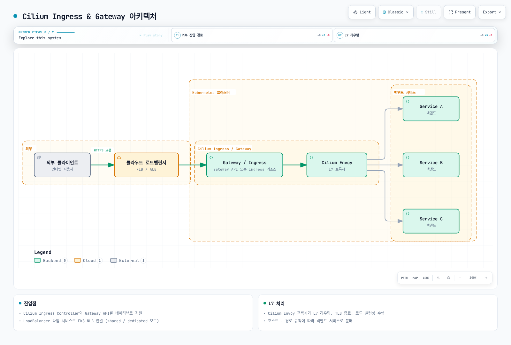
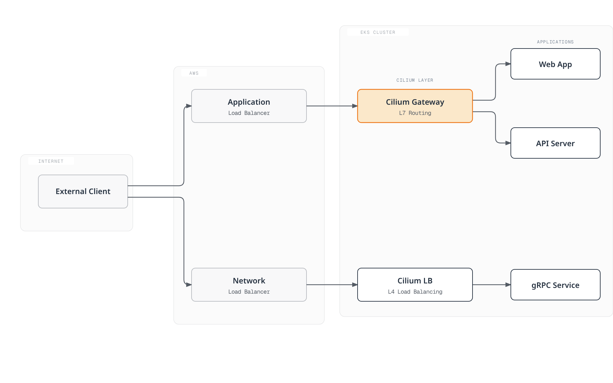

# Cilium Service Mesh 인그레스 & 게이트웨이

> **검토 기준**: Cilium 1.20.1, Gateway API 1.6.1, AWS Load Balancer Controller 3.5.0.
> **최종 검토**: 2026년 9월 11일. Kubernetes/EKS 지원 범위는 [설치 전제](./README.md)를 확인합니다. 최신 릴리스라는 이유만으로 호환성을 보장하지 않습니다.

## 개요

Cilium은 Kubernetes Ingress와 Gateway API 리소스를 통해 데이터 플레인을 설정합니다. eBPF가 Service 전달과 L7 트래픽의 노드 로컬 Envoy 리다이렉션을 처리하고, Envoy가 HTTP 라우팅과 TLS 종료를 수행합니다. 불투명한 TCP/TLS 전달 경로의 기능은 다릅니다. 아래 예제는 서로 다른 진입점 구성으로, 완전한 애플리케이션 배포가 아닙니다.

## 아키텍처



[🔍 인터랙티브 다이어그램 보기](https://www.atomai.click/kubernetes-docs/archmaps/ko-service-mesh-cilium-service-mesh-05-ingress-gateway-0.html)

Gateway/Ingress 상자는 패킷을 수신하는 프로세스가 아니라 설정 리소스입니다. 실제 L7 경로는 로드 밸런서 → Service/NodePort 프런트엔드 → eBPF/TPROXY → Envoy → 백엔드입니다. Cilium은 외부 `world` → `ingress` 경계와 `ingress` → 백엔드 경계에서 각각 정책을 적용하므로 두 구간을 모두 허용해야 합니다. 클라우드 로드 밸런서 준비와 대상 등록은 별도 전제입니다.

## Cilium Ingress Controller

### 설치 및 활성화

```yaml
kubeProxyReplacement: true
l7Proxy: true
envoy:
  enabled: true
ingressController:
  enabled: true
  loadbalancerMode: shared
  default: false
  service:
    type: LoadBalancer
```

이미 계획한 Cilium 설치에 합치는 Helm **오버라이드**입니다. 설치 가이드의 플랫폼별 CNI/IPAM과 접근 가능한 API 서버 설정을 유지해야 합니다. 실행 중인 클러스터의 kube-proxy replacement 변경은 단순 기능 토글이 아닌 마이그레이션입니다. 적용 전에 고정한 1.20.1 차트를 렌더링하여 검토합니다.

`ingressController.default`는 `cilium`을 **기본 IngressClass**로 지정하며, 기본 백엔드를 설정하지 않습니다. 차트는 `cilium` 클래스를 생성합니다. `ingressController.ingressClassName`은 지원되는 값이 아닙니다. 각 Ingress에 `spec.ingressClassName`을 명시하면 클러스터 기본값에 의존하지 않습니다.

shared 모드에서 Cilium이 관리하는 Ingress는 Helm 릴리스 네임스페이스(여기서는 `kube-system`)의 `cilium-ingress` Service를 사용합니다. 개별 Ingress 어노테이션으로 dedicated 모드를 선택할 수 있으며, 다른 컨트롤러나 Gateway API 리소스까지 자동으로 같은 프런트엔드를 공유하지는 않습니다. 모드 변경으로 주소가 바뀌거나 연결이 끊길 수 있습니다. `LoadBalancer`에는 실제 조정·프로비저닝 구현이 필요합니다. AWS LBC가 Service를 관리한다면 아래 EKS 오버라이드를 사용합니다.

### Ingress 리소스 예시

```yaml
apiVersion: networking.k8s.io/v1
kind: Ingress
metadata:
  name: app-ingress
  namespace: default
  annotations:
    ingress.cilium.io/loadbalancer-mode: shared
    ingress.cilium.io/tls-passthrough: 'false'
spec:
  ingressClassName: cilium
  tls:
  - hosts:
    - app.example.com
    secretName: app-tls-secret
  rules:
  - host: app.example.com
    http:
      paths:
      - path: /api
        pathType: Prefix
        backend:
          service:
            name: api-service
            port:
              number: 80
      - path: /
        pathType: Prefix
        backend:
          service:
            name: frontend-service
            port:
              number: 80
```

`default`에 Service 포트 80과 준비된 엔드포인트를 가진 각 Service를 생성합니다. `app.example.com`을 포함하는 인증서를 `app-tls-secret`에 제공하고 DNS를 해당 프런트엔드로 연결합니다. TLS 구간은 Envoy에서 종료되며 예제의 백엔드 포트는 평문 HTTP입니다. Cilium의 기본 `enforceHttps: true`는 TLS가 설정된 호스트의 HTTP를 HTTPS로 리다이렉트합니다. 이 설정만으로 워크로드 간 mTLS가 성립하지는 않습니다.

### 경로 기반 라우팅

```yaml
apiVersion: networking.k8s.io/v1
kind: Ingress
metadata:
  name: path-routing
  namespace: default
spec:
  ingressClassName: cilium
  rules:
  - host: api.example.com
    http:
      paths:
      - path: /users
        pathType: Prefix
        backend:
          service:
            name: users-service
            port:
              number: 80
      - path: /orders
        pathType: Prefix
        backend:
          service:
            name: orders-service
            port:
              number: 80
      - path: /products
        pathType: Prefix
        backend:
          service:
            name: products-service
            port:
              number: 80
      - path: /health
        pathType: Exact
        backend:
          service:
            name: health-service
            port:
              number: 80
```

`Prefix`는 경로 요소 단위로 일치합니다. `/users`, `/users/42`는 일치하지만 `/users-old`는 일치하지 않습니다. `Exact`는 `/health`만 일치합니다. Cilium Ingress는 Exact, ImplementationSpecific/정규식, Prefix 순서로 처리하고 각 그룹에서는 긴 경로를 우선합니다. Gateway API에는 별도의 우선순위 규칙이 있으므로 YAML 나열 순서를 일반적인 라우팅 우선순위로 해석하지 않습니다.

### TLS 종료

```yaml
apiVersion: networking.k8s.io/v1
kind: Ingress
metadata:
  name: tls-ingress
  namespace: default
spec:
  ingressClassName: cilium
  tls:
  - hosts:
    - secure.example.com
    secretName: app-tls-secret
  rules:
  - host: secure.example.com
    http:
      paths:
      - path: /
        pathType: Prefix
        backend:
          service:
            name: secure-app
            port:
              number: 80
```

가짜 Base64 자리표시자를 적용하지 말고 **실제 PEM 파일**로 Secret을 생성합니다. 두 예제에서 같은 Secret을 사용하려면 인증서 SAN이 `app.example.com`과 `secure.example.com`을 모두 포함해야 합니다. 그렇지 않으면 각각의 Secret을 사용합니다. 공개적으로 신뢰되거나 명시적으로 신뢰한 사설 PKI 인증서를 발급하고 갱신 절차를 준비합니다.

```bash
openssl x509 -in ./tls.crt -noout -dates -ext subjectAltName
kubectl -n default create secret tls app-tls-secret \
  --cert=./tls.crt --key=./tls.key --dry-run=client -o yaml
```

마지막 명령은 Secret을 출력할 뿐 적용하지 않습니다. 선택한 Secret 관리 절차로 검토·적용하고, 개인 키가 포함된 출력을 공유 로그에 남기지 않습니다.

### TLS 패스스루

```yaml
apiVersion: networking.k8s.io/v1
kind: Ingress
metadata:
  name: tls-passthrough
  namespace: default
  annotations:
    ingress.cilium.io/tls-passthrough: 'true'
spec:
  ingressClassName: cilium
  rules:
  - host: backend.example.com
    http:
      paths:
      - path: /
        pathType: Prefix
        backend:
          service:
            name: tls-backend
            port:
              number: 443
```

백엔드가 TLS를 종료하고 `backend.example.com` 인증서를 관리합니다. Cilium은 TLS SNI로 선택하며 passthrough Ingress에는 호스트 이름과 경로 `/`가 필요합니다. 암호화된 내부 HTTP 경로나 헤더를 수정할 수 없습니다. 백엔드는 원래 클라이언트 소켓 주소가 아니라 Envoy/노드에서 시작한 새 연결을 보며, Envoy는 이 스트림에 HTTP 전달 헤더를 삽입할 수 없습니다.

## Gateway API

### Gateway API 활성화

```yaml
gatewayAPI:
  enabled: true
  gatewayClass:
    create: true
  secretsNamespace:
    create: true
    name: cilium-secrets
    sync: true
```

컨트롤러를 활성화하기 전에 **Gateway API 1.6.1 Standard CRD**를 설치합니다. Cilium 1.20.1 설치 문서가 사용하는 버전입니다. CRD를 공유하는 모든 컨트롤러의 업그레이드 영향을 확인합니다. 이 조각은 앞선 kube-proxy replacement/L7 전제를 보완하며 전체 Cilium values 파일을 대체하지 않습니다.

실제 키는 `gatewayAPI.gatewayClass.create`와 `gatewayAPI.secretsNamespace`입니다. 이전 위치의 `secretNamespace`, `gatewayClassName`은 무시됩니다. 인증서 참조는 기본적으로 Gateway와 같은 네임스페이스의 Secret을 지정합니다. 컨트롤러의 동기화용 Secret 네임스페이스가 사용자 참조의 위치를 바꾸지는 않습니다.

### GatewayClass

앞선 차트 설정을 사용하면 Cilium이 컨트롤러 이름 `io.cilium/gateway-controller`인 `cilium` GatewayClass를 관리합니다. `kubectl get gatewayclass cilium -o yaml`로 확인하고 같은 객체에 두 번째 관리 주체를 만들지 않습니다. GatewayClass는 컨트롤러와 파라미터를 선택하며 물리 로드 밸런서 공유를 의미하지 않습니다.

### Gateway

```yaml
apiVersion: gateway.networking.k8s.io/v1
kind: Gateway
metadata:
  name: main-gateway
  namespace: default
spec:
  gatewayClassName: cilium
  listeners:
  - name: http
    protocol: HTTP
    port: 80
    hostname: '*.example.com'
    allowedRoutes:
      namespaces:
        from: Same
  - name: https
    protocol: HTTPS
    port: 443
    hostname: '*.example.com'
    tls:
      mode: Terminate
      certificateRefs:
      - kind: Secret
        name: wildcard-tls
        namespace: default
    allowedRoutes:
      namespaces:
        from: Same
```

HTTPS 사용 전에 리스너 호스트 이름에 맞는 인증서를 `default/wildcard-tls`에 생성합니다. `*.example.com`은 `example.com` 자체나 `a.b.example.com`까지 포함하지 않습니다. 여기서는 HTTP/HTTPS를 종료하며 뒤의 TCP·TLS passthrough 예제는 프로토콜과 소유 관계를 명확히 하기 위해 별도 Gateway를 사용합니다. Gateway별 Service에 각각 클라우드 로드 밸런서가 필요할 수 있습니다.

### HTTPRoute

```yaml
apiVersion: gateway.networking.k8s.io/v1
kind: HTTPRoute
metadata:
  name: api-routes
  namespace: default
spec:
  parentRefs:
  - name: main-gateway
    namespace: default
    sectionName: https
  hostnames:
  - api.example.com
  rules:
  - matches:
    - path:
        type: PathPrefix
        value: /v1/users
    backendRefs:
    - name: users-v1
      port: 80
  - matches:
    - path:
        type: PathPrefix
        value: /v2/users
    backendRefs:
    - name: users-v2
      port: 80
  - matches:
    - path:
        type: PathPrefix
        value: /api
      headers:
      - name: X-API-Version
        value: '2'
    backendRefs:
    - name: api-v2
      port: 80
  - matches:
    - path:
        type: PathPrefix
        value: /
    backendRefs:
    - name: api-v1
      port: 80
```

백엔드는 Route 네임스페이스에 존재하는 Service이며 포트 80과 준비된 엔드포인트가 필요합니다. `sectionName: https`는 이 Route를 HTTPS 리스너로 한정합니다. 해당 `status.parents`의 `Accepted`, `ResolvedRefs`, Gateway/리스너의 `Programmed`·`Accepted` 조건과 최신 `observedGeneration`을 확인합니다. 설정 수락만으로 DNS, 인증서 신뢰, 대상 상태, 애플리케이션 연결까지 검증되지는 않습니다.

### 가중치 기반 트래픽 분할

```yaml
apiVersion: gateway.networking.k8s.io/v1
kind: HTTPRoute
metadata:
  name: canary-route
  namespace: default
spec:
  parentRefs:
  - name: main-gateway
    sectionName: https
  hostnames:
  - app.example.com
  rules:
  - matches:
    - path:
        type: PathPrefix
        value: /
    backendRefs:
    - name: app-stable
      port: 80
      weight: 90
    - name: app-canary
      port: 80
      weight: 10
```

가중치는 상대적인 선택 확률이며 매 10개 요청 중 정확히 9개가 stable로 간다는 보장은 아닙니다. 연결, 재시도, 표본 크기에 따라 관측 비율이 달라집니다. 이 예제는 HTTPS에만 연결되며 API 예제와 다른 호스트를 사용합니다.

### 요청/응답 변환

```yaml
apiVersion: gateway.networking.k8s.io/v1
kind: HTTPRoute
metadata:
  name: transform-route
  namespace: default
spec:
  parentRefs:
  - name: main-gateway
    sectionName: https
  rules:
  - matches:
    - path:
        type: PathPrefix
        value: /api
    filters:
    - type: RequestHeaderModifier
      requestHeaderModifier:
        set:
        - name: X-Doc-Route
          value: api-v2
        remove:
        - X-Internal-Header
    - type: URLRewrite
      urlRewrite:
        hostname: internal-api.default.svc
        path:
          type: ReplacePrefixMatch
          replacePrefixMatch: /v2/api
    - type: ResponseHeaderModifier
      responseHeaderModifier:
        set:
        - name: X-Doc-Gateway
          value: cilium
    backendRefs:
    - name: api-service
      port: 80
  hostnames:
  - transform.example.com
```

헤더 값은 **문자열 리터럴**입니다. `X-Doc-Route`, `X-Doc-Gateway`는 진단용 표시이며 생성된 요청 ID나 측정한 응답 시간이 아닙니다. 호스트 변경은 `URLRewrite.hostname`으로 처리하고 `Host` 헤더 변경을 중복하지 않습니다. 이 헤더는 호출자 인증 수단이 아닙니다. 응답 `Server` 헤더는 컨트롤러의 Envoy 서버 헤더 변환 설정에도 영향을 받으므로 이를 바꾸려면 검증된 `CiliumGatewayClassConfig`를 사용합니다.

### 리다이렉트

```yaml
apiVersion: gateway.networking.k8s.io/v1
kind: HTTPRoute
metadata:
  name: redirect-http
  namespace: default
spec:
  parentRefs:
  - name: main-gateway
    sectionName: http
  hostnames:
  - '*.example.com'
  rules:
  - matches:
    - path:
        type: PathPrefix
        value: /
    filters:
    - type: RequestRedirect
      requestRedirect:
        scheme: https
        port: 443
        statusCode: 308
---
apiVersion: gateway.networking.k8s.io/v1
kind: HTTPRoute
metadata:
  name: redirect-path
  namespace: default
spec:
  parentRefs:
  - name: main-gateway
    sectionName: https
  hostnames:
  - old.example.com
  rules:
  - matches:
    - path:
        type: Exact
        value: /old-path
    filters:
    - type: RequestRedirect
      requestRedirect:
        path:
          type: ReplaceFullPath
          replaceFullPath: /new-path
        statusCode: 308
---
apiVersion: gateway.networking.k8s.io/v1
kind: HTTPRoute
metadata:
  name: redirect-host
  namespace: default
spec:
  parentRefs:
  - name: main-gateway
    sectionName: https
  hostnames:
  - old.example.com
  rules:
  - matches:
    - path:
        type: PathPrefix
        value: /legacy
    filters:
    - type: RequestRedirect
      requestRedirect:
        hostname: legacy.example.com
        statusCode: 307
```

스킴 리다이렉트는 **`http`에만** 연결하므로 HTTPS 요청을 같은 URL로 무한 리다이렉트하지 않습니다. 나머지 두 Route는 `https`와 제한된 출발 호스트에만 연결합니다. 영구 리다이렉트 308과 임시 리다이렉트 307은 요청 메서드·본문을 유지합니다. 301/302는 클라이언트 동작이 다르므로 쓰기 요청에 보편적으로 권장하지 않습니다. 처음에 클라이언트가 평문 HTTP로 보낸 데이터는 리다이렉트로 회수할 수 없습니다. RequestRedirect와 URLRewrite는 별도 필터이며 하나의 규칙에서 함께 사용할 수 없습니다.

### TCPRoute

```yaml
apiVersion: gateway.networking.k8s.io/v1
kind: Gateway
metadata:
  name: tcp-gateway
  namespace: default
spec:
  gatewayClassName: cilium
  listeners:
  - name: tcp
    protocol: TCP
    port: 9000
    allowedRoutes:
      namespaces:
        from: Same
      kinds:
      - kind: TCPRoute
---
apiVersion: gateway.networking.k8s.io/v1
kind: TCPRoute
metadata:
  name: tcp-route
  namespace: default
spec:
  parentRefs:
  - name: tcp-gateway
    sectionName: tcp
  rules:
  - backendRefs:
    - name: tcp-service
      port: 9000
```

Gateway API 1.6.1의 TCPRoute는 **v1**으로 제공되며 이전 `v1alpha2`는 제공되지 않습니다. TCPRoute는 불투명한 TCP 스트림을 전달하고 HTTP 경로를 검사하지 않습니다. TCP 내부에 HTTP나 TLS가 있어도 이 Route가 HTTP 라우팅·TLS 종료를 수행하는 것은 아닙니다. Cilium 1.20.1 L4 Gateway 변환은 백엔드 EndpointSlice를 사용하므로 L7 Envoy 프런트엔드와 엔드포인트 구현이 같다고 가정하지 않습니다.

### TLSRoute

```yaml
apiVersion: gateway.networking.k8s.io/v1
kind: Gateway
metadata:
  name: tls-gateway
  namespace: default
spec:
  gatewayClassName: cilium
  listeners:
  - name: tls
    protocol: TLS
    port: 443
    hostname: secure.example.com
    tls:
      mode: Passthrough
    allowedRoutes:
      namespaces:
        from: Same
      kinds:
      - kind: TLSRoute
---
apiVersion: gateway.networking.k8s.io/v1
kind: TLSRoute
metadata:
  name: tls-route
  namespace: default
spec:
  parentRefs:
  - name: tls-gateway
    sectionName: tls
  hostnames:
  - secure.example.com
  rules:
  - backendRefs:
    - name: tls-backend
      port: 443
```

이 기준에서 TLSRoute도 **v1**으로 제공됩니다. 앞선 HTTPS 종료 리스너가 아니라 `mode: Passthrough`인 호환 `TLS` 리스너가 필요합니다. 백엔드가 `secure.example.com` 인증서를 관리하고, HTTP 내용은 암호화된 상태에서 SNI로 백엔드를 선택합니다. 생성된 Service, 리스너 상태, 종단 간 TLS 신뢰를 확인합니다.

## EKS 통합 패턴

### NLB + Cilium Ingress

```yaml
ingressController:
  enabled: true
  loadbalancerMode: shared
  enableProxyProtocol: false
  service:
    type: LoadBalancer
    loadBalancerClass: service.k8s.aws/nlb
    allocateLoadBalancerNodePorts: true
    externalTrafficPolicy: Cluster
    annotations:
      service.beta.kubernetes.io/aws-load-balancer-scheme: internet-facing
      service.beta.kubernetes.io/aws-load-balancer-nlb-target-type: instance
      service.beta.kubernetes.io/aws-load-balancer-attributes: load_balancing.cross_zone.enabled=true
      service.beta.kubernetes.io/aws-load-balancer-healthcheck-protocol: TCP
      service.beta.kubernetes.io/aws-load-balancer-healthcheck-port: traffic-port
```

**AWS LBC가 관리하는 NLB → EC2 NodePort → Cilium Ingress Envoy** 구성의 오버라이드입니다. AWS LBC 3.5.0과 IAM·서브넷·보안 그룹 전제, 적격 EC2 노드, Cilium이 지원하는 EKS/CNI 구성, 할당된 NodePort가 필요합니다. EKS Auto Mode나 Fargate에 Cilium을 설치하는 예제가 아닙니다. `service.k8s.aws/nlb`는 AWS LBC 소유를 명시합니다. 과거 `aws-load-balancer-type: nlb` 어노테이션은 이 소유 관계를 표현하지 않습니다.

이 L7 프런트엔드에는 instance 대상을 사용합니다. Cilium 1.20.1 shared Ingress Service는 Pod 대상 참조가 없는 합성 EndpointSlice(`192.192.192.192:9999`)를 가집니다. AWS LBC의 IP 대상 해석기는 Pod 참조가 필요하므로 이 엔드포인트를 건너뜁니다. Service를 단순히 `ip`로 바꿔도 노드 로컬 Envoy 프로세스가 자동으로 발견되지 않습니다. 이는 Cilium L7 프런트엔드의 특성이며 일반 워크로드 Service나 현재 L4 Gateway EndpointSlice와 구분해야 합니다.

TCP 상태 검사는 NodePort의 전송 계층 도달성을 확인하며 애플리케이션 `/healthz`, TLS 유효성, 호스트별 HTTP 경로를 검사하지 않습니다. 교차 영역 분산은 현재 load-balancer attributes 어노테이션을 사용하고 비용·트래픽 영향을 검토합니다. 기존 Service의 컨트롤러 소유나 LB 종류 변경을 무중단 전환으로 가정하지 않습니다.

**클라이언트 식별과 선택적 PROXY protocol:** Cilium은 `Cluster`, `Local` external traffic policy 모두에서 프런트엔드에 보이는 출발지를 HTTP Envoy 처리에 유지합니다. 이 출발지가 원래 클라이언트인지는 앞단 NLB와 대상 그룹 속성에 먼저 달려 있습니다. instance TCP 대상은 일반적으로 클라이언트 IP를 보존하므로 PROXY protocol이 항상 필요한 것은 아닙니다. 해당 토폴로지에서 필요하다면 NLB와 다음 추가 오버라이드를 함께 구성합니다.

```yaml
ingressController:
  enableProxyProtocol: true
  service:
    annotations:
      service.beta.kubernetes.io/aws-load-balancer-proxy-protocol: '*'
```

NLB의 PPv2와 Cilium Ingress 수신 파서를 함께 활성화합니다. 한쪽만 바꾸면 트래픽이 실패하므로 전환 순서도 검증해야 합니다. 파서는 PROXY 헤더를 요구하므로 해당 헤더 없는 직접 HTTP/TLS 검사는 실패합니다. AWS LBC는 PPv2·instance 대상·`externalTrafficPolicy: Local` 조합을 경고하므로 예제는 `Cluster`를 유지합니다. HTTP/HTTPS 상태 검사에도 호환 파서가 필요합니다. 직접 접근을 신뢰한 프록시 경로로 제한해야 하며, PP 메타데이터나 HTTP 전달 헤더는 인증된 신원이 아닙니다. Gateway API에는 별도 `gatewayAPI.enableProxyProtocol` 설정이 필요합니다.

### ALB + Cilium

ALB → Cilium Envoy 조합은 가능하지만 실제 환경에 맞게 아래 전제를 설계·검증해야 합니다. 앞서 설명한 합성 L7 EndpointSlice에 `target-type: ip`만 지정하는 일반적인 지름길은 없습니다.

| 경계 | 필요한 결정 |
|---|---|
| 컨트롤러·네임스페이스 | ALB Ingress에 `spec.ingressClassName: alb`를 지정합니다. 백엔드 Service는 **같은 네임스페이스**에 있어야 합니다. shared `cilium-ingress` Service는 보통 `default`가 아니라 `kube-system`에 있습니다. |
| 대상 | 노드 경로에는 별도로 계획한 NodePort Service와 ALB `target-type: instance`를 사용하고 적격 노드, 포트 할당, 보안 그룹을 검증합니다. 기존 NLB를 소유한 Service를 암묵적으로 변경하지 않습니다. |
| TLS | ALB 종료 후 HTTP/HTTPS 중 무엇을 사용할지 결정합니다. ACM 서버 인증서 연결은 클라이언트 mTLS가 아닙니다. ALB가 HTTP로 전달하면 Cilium의 HTTPS 리다이렉트와 충돌하여 루프가 생길 수 있습니다. |
| 상태 검사 | ALB 상태 검사는 자동으로 `app.example.com`이 아닌 자체 Host 헤더를 사용하므로 호스트 전용 경로에서 404가 날 수 있습니다. 적절한 상태 검사 경로·포트를 정의하고 검증합니다. |
| 클라이언트 식별 | 실제 프록시 체인에 맞는 Cilium XFF 신뢰 홉 수, 신뢰하지 않는 헤더 정리, ALB 우회 직접 접근 방지를 구성합니다. |

이전 예제는 잘못된 네임스페이스·IP 대상을 참조하고 위 결정을 누락하여 구현 전제로 대체했습니다. 이 문서에서 해당 조합을 실제 배포하거나 부하 검증하지는 않았습니다.

### 하이브리드 아키텍처



[🔍 인터랙티브 다이어그램 보기](https://www.atomai.click/kubernetes-docs/archmaps/ko-service-mesh-cilium-service-mesh-05-ingress-gateway-1.html)

논리적 조합이며 검증된 배포 매니페스트가 아닙니다. ALB 경로에는 앞선 네임스페이스·대상·TLS·상태 검사·신뢰 경계 결정이 필요합니다. NLB L4 경로는 개별 RPC 메서드를 해석하지 않고 gRPC 스트림을 전달할 수 있습니다. ALB 뒤에 Cilium을 추가해도 ALB 비용이 사라지거나 ALB 기능이 Cilium 자체 기능으로 바뀌지 않습니다.

## 멀티테넌트 게이트웨이

### 네임스페이스별 게이트웨이

```yaml
apiVersion: gateway.networking.k8s.io/v1
kind: GatewayClass
metadata:
  name: cilium-shared
spec:
  controllerName: io.cilium/gateway-controller
---
apiVersion: gateway.networking.k8s.io/v1
kind: Gateway
metadata:
  name: team-a-gateway
  namespace: team-a
spec:
  gatewayClassName: cilium-shared
  listeners:
  - name: https
    protocol: HTTPS
    port: 443
    hostname: '*.team-a.example.com'
    tls:
      mode: Terminate
      certificateRefs:
      - kind: Secret
        name: team-a-tls
    allowedRoutes:
      namespaces:
        from: Same
---
apiVersion: gateway.networking.k8s.io/v1
kind: Gateway
metadata:
  name: team-b-gateway
  namespace: team-b
spec:
  gatewayClassName: cilium-shared
  listeners:
  - name: https
    protocol: HTTPS
    port: 443
    hostname: '*.team-b.example.com'
    tls:
      mode: Terminate
      certificateRefs:
      - kind: Secret
        name: team-b-tls
    allowedRoutes:
      namespaces:
        from: Same
```

각 네임스페이스와 유효한 자체 TLS Secret을 먼저 만듭니다. `cilium-shared` GatewayClass 공유는 하나의 Service/로드 밸런서 공유를 뜻하지 않습니다. `from: Same`은 Route 연결을 각 Gateway 네임스페이스로 제한합니다. Gateway, Secret, Route, 네임스페이스 레이블을 변경할 권한은 RBAC로 별도 통제합니다.

### 크로스 네임스페이스 라우팅

```yaml
apiVersion: gateway.networking.k8s.io/v1
kind: Gateway
metadata:
  name: shared-gateway
  namespace: gateway-system
spec:
  gatewayClassName: cilium
  listeners:
  - name: https
    protocol: HTTPS
    port: 443
    hostname: '*.example.com'
    allowedRoutes:
      namespaces:
        from: Selector
        selector:
          matchLabels:
            gateway-access: 'true'
    tls:
      mode: Terminate
      certificateRefs:
      - kind: Secret
        name: shared-tls
---
apiVersion: v1
kind: Namespace
metadata:
  name: app-team
  labels:
    gateway-access: 'true'
---
apiVersion: gateway.networking.k8s.io/v1
kind: HTTPRoute
metadata:
  name: app-route
  namespace: app-team
spec:
  parentRefs:
  - name: shared-gateway
    namespace: gateway-system
    sectionName: https
  hostnames:
  - app.example.com
  rules:
  - matches:
    - path:
        type: PathPrefix
        value: /
    backendRefs:
    - name: app-service
      port: 80
```

`gateway-system`과 허용한 호스트를 포함하는 `shared-tls` Secret을 생성합니다. 네임스페이스 선택자는 Route 연결 권한을 부여하며 사용자 인증이나 애플리케이션 요청 인가는 수행하지 않습니다. 관리자가 `gateway-access` 레이블 변경 권한을 통제해야 합니다.

위 `app-service`는 `app-team`에 있으므로 ReferenceGrant가 필요 없습니다. 대신 Route가 `backend-team/shared-api`를 참조하려면 백엔드 네임스페이스에서 명시적으로 허용합니다.

```yaml
apiVersion: gateway.networking.k8s.io/v1
kind: ReferenceGrant
metadata:
  name: allow-app-team
  namespace: backend-team
spec:
  from:
  - group: gateway.networking.k8s.io
    kind: HTTPRoute
    namespace: app-team
  to:
  - group: ''
    kind: Service
    name: shared-api
---
apiVersion: gateway.networking.k8s.io/v1
kind: HTTPRoute
metadata:
  name: shared-api-route
  namespace: app-team
spec:
  parentRefs:
  - name: shared-gateway
    namespace: gateway-system
    sectionName: https
  hostnames:
  - shared-api.example.com
  rules:
  - backendRefs:
    - name: shared-api
      namespace: backend-team
      port: 80
```

이 대안을 사용하기 전에 Service 포트 80의 `backend-team/shared-api`를 생성합니다. 네임스페이스가 다른 Route → Gateway 연결은 `allowedRoutes`, Route → 백엔드 Service 참조는 `ReferenceGrant`로 허용합니다. 서로 다른 권한 검사입니다. 1.6.1에서는 ReferenceGrant v1이 제공되며 v1beta1도 아직 제공됩니다.

## 로드 밸런싱 고급 설정

### 서비스 헬스 체크

```yaml
apiVersion: cilium.io/v2
kind: CiliumEnvoyConfig
metadata:
  name: health-check-config
  namespace: default
spec:
  services:
  - name: my-service
    namespace: default
    ports:
    - 80
    listener: health-check-config-listener
  resources:
  - '@type': type.googleapis.com/envoy.config.listener.v3.Listener
    name: health-check-config-listener
    filter_chains:
    - filters:
      - name: envoy.filters.network.http_connection_manager
        typed_config:
          '@type': type.googleapis.com/envoy.extensions.filters.network.http_connection_manager.v3.HttpConnectionManager
          stat_prefix: health-check-config
          route_config:
            name: health-check-config-routes
            virtual_hosts:
            - name: app
              domains:
              - '*'
              routes:
              - match:
                  prefix: /
                route:
                  cluster: default/my-service
                  retry_policy:
                    num_retries: 0
          http_filters:
          - name: envoy.filters.http.router
            typed_config:
              '@type': type.googleapis.com/envoy.extensions.filters.http.router.v3.Router
  - '@type': type.googleapis.com/envoy.config.cluster.v3.Cluster
    name: default/my-service
    connect_timeout: 5s
    type: EDS
    health_checks:
    - timeout: 5s
      interval: 10s
      unhealthy_threshold: 3
      healthy_threshold: 2
      http_health_check:
        path: /health
        host: health-check.local
        expected_statuses:
        - start: 200
          end: 300
    outlier_detection:
      consecutive_5xx: 5
      interval: 10s
      base_ejection_time: 30s
      max_ejection_percent: 50
      enforcing_consecutive_5xx: 100
```

Service 포트 80 → 이름 있는 Listener → HTTP 경로 → EDS Cluster로 이어지는 독립 CEC입니다. Cilium이 참조된 Service의 xDS 엔드포인트 설정을 제공합니다. 준비된 백엔드가 있는 `default/my-service`를 만들고 다른 CEC나 자동 생성 Ingress/Gateway 설정에 동시에 할당하지 않습니다. CEC를 컨트롤러 소유 리소스의 패치 수단으로 사용하지 않습니다.

모든 백엔드는 실제로 `Host: health-check.local`과 `/health`를 받아야 합니다. Envoy 상태 범위는 상한을 제외하므로 `[200, 300)`이 전체 2xx를 포함합니다. 능동 상태 검사와 수동 outlier detection은 다르며, 퇴출 상한·panic 동작 때문에 모든 장애 엔드포인트의 제외가 보장되지는 않습니다. 백엔드 수와 장애 모델에 맞게 검증합니다.

### 연결 풀 설정

```yaml
apiVersion: cilium.io/v2
kind: CiliumEnvoyConfig
metadata:
  name: connection-pool
  namespace: default
spec:
  services:
  - name: high-traffic-service
    namespace: default
    ports:
    - 80
    listener: connection-pool-listener
  resources:
  - '@type': type.googleapis.com/envoy.config.listener.v3.Listener
    name: connection-pool-listener
    filter_chains:
    - filters:
      - name: envoy.filters.network.http_connection_manager
        typed_config:
          '@type': type.googleapis.com/envoy.extensions.filters.network.http_connection_manager.v3.HttpConnectionManager
          stat_prefix: connection-pool
          route_config:
            name: connection-pool-routes
            virtual_hosts:
            - name: app
              domains:
              - '*'
              routes:
              - match:
                  prefix: /
                route:
                  cluster: default/high-traffic-service
                  retry_policy:
                    num_retries: 0
          http_filters:
          - name: envoy.filters.http.router
            typed_config:
              '@type': type.googleapis.com/envoy.extensions.filters.http.router.v3.Router
  - '@type': type.googleapis.com/envoy.config.cluster.v3.Cluster
    name: default/high-traffic-service
    connect_timeout: 5s
    type: EDS
    typed_extension_protocol_options:
      envoy.extensions.upstreams.http.v3.HttpProtocolOptions:
        '@type': type.googleapis.com/envoy.extensions.upstreams.http.v3.HttpProtocolOptions
        explicit_http_config:
          http2_protocol_options:
            max_concurrent_streams: 1000
            initial_stream_window_size: 65536
            initial_connection_window_size: 1048576
    circuit_breakers:
      thresholds:
      - priority: DEFAULT
        max_connections: 10000
        max_pending_requests: 10000
        max_requests: 10000
        max_retries: 5
```

포트 80의 `default/high-traffic-service`를 생성하고 백엔드가 평문 HTTP/2(h2c)를 명시적으로 지원하도록 합니다. typed protocol 옵션은 업스트림 HTTP/2 선택이며 자동 프로토콜 협상이 아닙니다. `accept_http_10`은 HTTP/1.0 수락 옵션이지 HTTP/1.1 연결 풀 설정이 아닙니다. HTTP/1 백엔드에는 대응하는 명시적 HTTP/1 설정을 선택합니다.

회로 차단 임계값은 Envoy cluster/priority별이며 전체 시스템 할당량이나 권장 용량이 아닙니다. `max_retries`는 동시 재시도 수 제한이며 요청당 재시도 횟수가 아닙니다. 여기서는 경로에 `num_retries: 0`을 설정했습니다. 연결·스트림 상한을 높이려면 리소스와 백엔드 검증이 필요하며 숫자는 설명용입니다.

## AWS Load Balancer Controller 비교

| 기능 | Cilium Ingress/Gateway | AWS Load Balancer Controller 3.5 |
|---|---|---|
| 데이터 플레인 | eBPF Service/L4 전달, HTTP/TLS에는 Envoy | AWS ALB 또는 NLB |
| Gateway API | 고정한 Cilium 버전의 기능·적합성 표 확인 | HTTPRoute/GRPCRoute는 ALB, TCPRoute/UDPRoute/TLSRoute는 NLB에 대응하며 한 Gateway에 L4/L7 혼합 불가 |
| TLS·신원 | Ingress TLS 종료/통과, 워크로드 암호화·인증은 별도 [보안 설정](./03-security.md) | ACM 서버 인증서, ALB 클라이언트 mTLS에는 별도 mutual-authentication 모드·trust store 필요 |
| 비용 | 노드·프록시 리소스 **및 생성한 클라우드 LB·네트워크 비용** | ALB/NLB, 용량·사용량, 네트워크 비용 |
| 사용자 설정 | 지원하는 Gateway API 기능과 독립 CEC, 생성 객체는 컨트롤러 소유 | LBC API·어노테이션으로 노출한 AWS 리스너·규칙·대상 그룹 기능 |
| 성능 | 실제 토폴로지·암호화·워크로드 측정 | 같은 워크로드와 서비스 제약을 측정하며 보편적인 지연 순위는 없음 |

LBC 3.5 문서의 Gateway API 검증 기준은 **1.6.0**, Cilium 설치 문서는 **1.6.1**입니다. CRD를 공유하는 클러스터에서는 최신 카탈로그 버전만 보고 모든 컨트롤러가 지원한다고 가정하지 말고 호환성을 검증합니다.

필요한 AWS L7 연동에는 ALB, 전송·대상 특성에는 NLB, 클러스터 내부 라우팅·정책에는 해당 Cilium 기능을 선택합니다. 현재 NLB는 새 흐름을 대상으로 **0–999** 가중치의 대상 그룹을 지원합니다. 컨트롤러의 기능 노출과 특정 Route의 의미는 별도 확인 사항입니다. 일반적인 가중치 변경은 기존 연결을 유지하지만 AWS 문서상 가중치를 **0**으로 설정하면 짧은 시간 뒤 해당 대상 그룹의 기존 연결도 종료됩니다. 이를 연결을 보존하는 drain으로 설명하지 않습니다.

이전 선택 그림에 반복되던 근거 없는 비용·지연·mTLS·Gateway API 주장을 위 표로 대체했습니다. 어느 연동 방식을 일괄 배제하는 기준은 아닙니다.

## 모니터링

### Gateway 메트릭

```bash
kubectl get gatewayclass cilium -o yaml
kubectl get gateway,httproute,tcproute,tlsroute -A
kubectl -n default describe gateway main-gateway
kubectl -n default get httproute api-routes -o yaml
kubectl -n kube-system exec ds/cilium -- cilium-dbg status --verbose
kubectl -n kube-system exec ds/cilium -- cilium-dbg envoy admin metrics -f downstream_rq
```

### Prometheus 메트릭

먼저 [관측성 가이드](./04-observability.md)에 따라 Cilium Envoy Prometheus 엔드포인트를 활성화하고 수집합니다. 여러 클러스터를 한 Prometheus에서 수집하면 안정적인 `cluster` 대상 레이블을 구성합니다. Cilium Envoy 이미지가 내보내는 레이블은 `envoy_http_conn_manager_prefix`이며 값은 `listener-insecure`, `listener-secure`, 포트별 변형 등입니다. 고정된 `cilium-gateway` 값이 아닙니다. 같은 Envoy의 여러 Gateway가 prefix를 재사용할 수 있으므로 아래 쿼리는 **수집한 프록시/HCM** 기준이며 Gateway별 집계를 보장하지 않습니다. 실제 레이블을 먼저 확인합니다.

아래 세 쿼리는 시작된 요청률, 완료 응답 카운터 중 5xx 비율, **초 단위** p99 지연을 나타냅니다. 없는 5xx 분자는 같은 레이블의 관측된 분모로만 0을 채우며, 트래픽·텔레메트리 부재를 정상 0으로 바꾸지 않습니다. 양수 분모 필터는 유휴 시계열을 제외합니다. Envoy `downstream_rq_time` 히스토그램은 **밀리초**이므로 `/ 1000`이 필요합니다. `le`를 유지하며 버킷을 집계한 후 분위수를 계산합니다. 적은 표본, 수집 공백, 히스토그램 부재는 별도로 감시해야 합니다.

```promql
sum by (cluster, instance, envoy_http_conn_manager_prefix) (
  rate(envoy_http_downstream_rq_total[5m])
)
```

```promql
100 *
(
  sum by (cluster, instance, envoy_http_conn_manager_prefix) (
    rate(envoy_http_downstream_rq_xx{envoy_response_code_class="5"}[5m])
  )
  or
  0 * sum by (cluster, instance, envoy_http_conn_manager_prefix) (
    rate(envoy_http_downstream_rq_xx[5m])
  )
)
/
(
  sum by (cluster, instance, envoy_http_conn_manager_prefix) (
    rate(envoy_http_downstream_rq_xx[5m])
  ) > 0
)
```

```promql
histogram_quantile(
  0.99,
  sum by (cluster, instance, envoy_http_conn_manager_prefix, le) (
    rate(envoy_http_downstream_rq_time_bucket[5m])
  )
) / 1000
```

## 다음 단계

- [모범 사례](./06-best-practices.md): 운영 전제와 한계

## 참고 자료

- [Cilium 1.20.1 Ingress](https://github.com/cilium/cilium/blob/v1.20.1/Documentation/network/servicemesh/ingress.rst)
- [Cilium traffic, source IP and policy](https://github.com/cilium/cilium/blob/v1.20.1/Documentation/network/servicemesh/ingress-reference.rst)
- [Cilium Gateway API installation](https://github.com/cilium/cilium/blob/v1.20.1/Documentation/network/servicemesh/gateway-api/gateway-api.rst)
- [Cilium 1.20.1 Helm values](https://github.com/cilium/cilium/blob/v1.20.1/install/kubernetes/cilium/values.yaml)
- [Gateway API 1.6.1 CRDs](https://github.com/kubernetes-sigs/gateway-api/tree/v1.6.1/config/crd/standard)
- [AWS LBC 3.5 NLB configuration](https://github.com/kubernetes-sigs/aws-load-balancer-controller/blob/v3.5.0/docs/guide/service/nlb.md)
- [AWS LBC 3.5 annotations](https://github.com/kubernetes-sigs/aws-load-balancer-controller/blob/v3.5.0/docs/guide/service/annotations.md)
- [AWS LBC 3.5 Gateway API](https://github.com/kubernetes-sigs/aws-load-balancer-controller/blob/v3.5.0/docs/guide/gateway/gateway.md)
- [NLB target group attributes](https://docs.aws.amazon.com/elasticloadbalancing/latest/network/edit-target-group-attributes.html)
- [NLB listener weights](https://docs.aws.amazon.com/elasticloadbalancing/latest/network/load-balancer-listeners.html)
- [Envoy 1.37 request statistics](https://www.envoyproxy.io/docs/envoy/v1.37.5/configuration/http/http_conn_man/stats)
