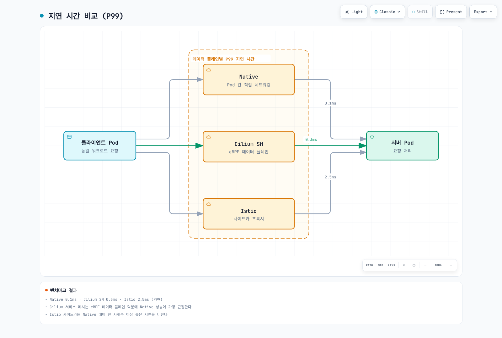
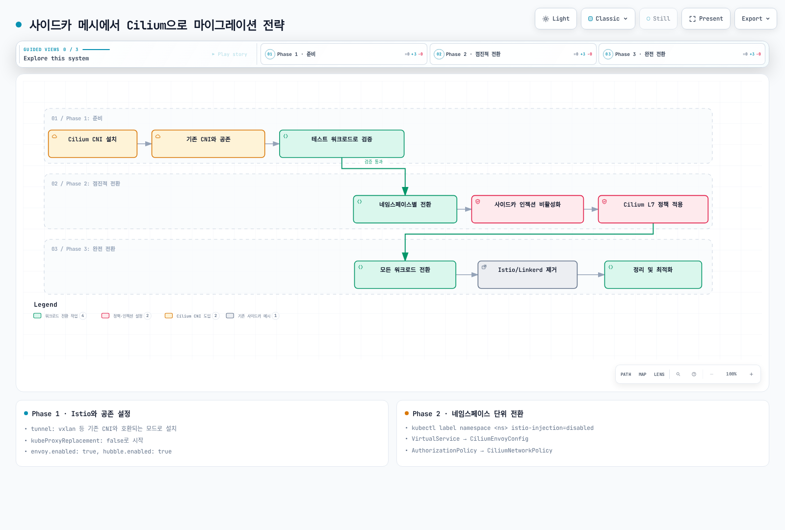
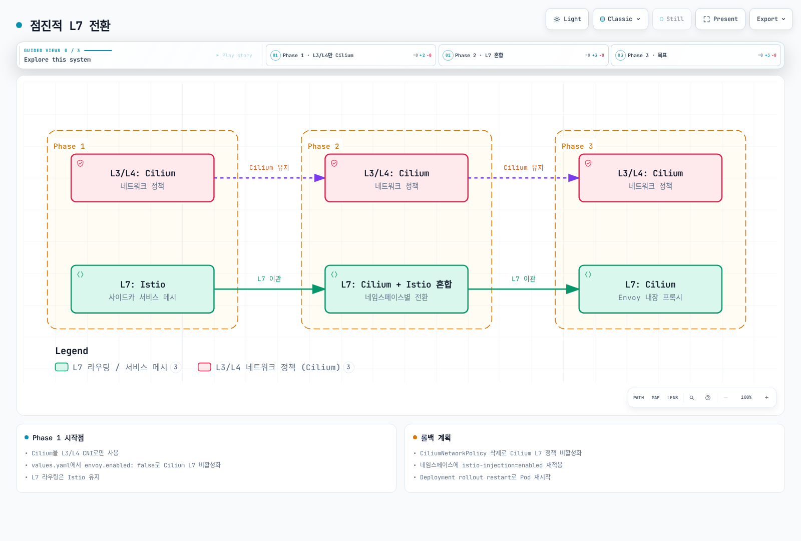

# Cilium Service Mesh 모범 사례

> **지원 버전**: Cilium 1.16+, Kubernetes 1.28+
> **마지막 업데이트**: 2026년 2월 22일

## 개요

이 장에서는 Cilium Service Mesh를 프로덕션 환경에서 운영하기 위한 모범 사례를 다룹니다. 배포 체크리스트, 리소스 사이징, 성능 튜닝, 사이드카 메시에서의 마이그레이션, 업그레이드 전략, 트러블슈팅 가이드를 포함합니다.

## 프로덕션 배포 체크리스트

### 필수 항목

```markdown
## 인프라 준비
- [ ] Kubernetes 버전 1.28+ 확인
- [ ] Linux 커널 5.10+ (eBPF 기능용)
- [ ] 노드당 최소 4 CPU, 8GB RAM
- [ ] CNI로 Cilium이 설치됨
- [ ] kube-proxy 비활성화 (선택적이지만 권장)

## Cilium 설정
- [ ] Cilium 버전 1.16+ 설치
- [ ] Envoy 프록시 활성화
- [ ] Hubble 관찰성 활성화
- [ ] 메트릭 수집 설정

## 보안
- [ ] WireGuard 또는 IPsec 암호화 활성화
- [ ] mTLS 설정 (SPIRE 통합)
- [ ] 기본 거부 네트워크 정책 적용
- [ ] RBAC 설정 확인

## 관찰성
- [ ] Prometheus 메트릭 수집 설정
- [ ] Grafana 대시보드 구성
- [ ] AlertManager 알림 규칙 설정
- [ ] 로그 집계 설정 (선택)

## 고가용성
- [ ] Cilium Operator 복제본 2+ 설정
- [ ] Hubble Relay 복제본 2+ 설정
- [ ] etcd 외부 클러스터 (대규모 환경)
- [ ] PodDisruptionBudget 설정
```

### 권장 Helm values.yaml

```yaml
# production-values.yaml
# Cilium Agent 설정
agent:
  resources:
    limits:
      cpu: 2000m
      memory: 2Gi
    requests:
      cpu: 500m
      memory: 512Mi

# Operator 설정
operator:
  replicas: 2
  resources:
    limits:
      cpu: 1000m
      memory: 1Gi
    requests:
      cpu: 100m
      memory: 128Mi

# Envoy 프록시 설정
envoy:
  enabled: true
  resources:
    limits:
      cpu: 2000m
      memory: 2Gi
    requests:
      cpu: 200m
      memory: 256Mi

# Hubble 설정
hubble:
  enabled: true
  relay:
    enabled: true
    replicas: 2
    resources:
      limits:
        cpu: 1000m
        memory: 1Gi
      requests:
        cpu: 100m
        memory: 128Mi
  ui:
    enabled: true
    replicas: 2
  metrics:
    enabled:
    - dns
    - drop
    - tcp
    - flow
    - http
    serviceMonitor:
      enabled: true

# kube-proxy 대체
kubeProxyReplacement: true

# 로드 밸런서 설정
loadBalancer:
  algorithm: maglev
  mode: snat

# 암호화
encryption:
  enabled: true
  type: wireguard
  nodeEncryption: true

# 상호 인증
authentication:
  mutual:
    spire:
      enabled: true

# eBPF 설정
bpf:
  masquerade: true
  clockProbe: false
  preallocateMaps: true
  tproxy: true

# IPAM
ipam:
  mode: cluster-pool
  operator:
    clusterPoolIPv4PodCIDRList:
    - "10.0.0.0/8"
    clusterPoolIPv4MaskSize: 24

# 리소스 제한
resources:
  limits:
    cpu: 4000m
    memory: 4Gi
  requests:
    cpu: 100m
    memory: 512Mi
```

## 사이징 가이드라인

### 클러스터 규모별 권장 사항

| 규모 | 노드 | Pod | Cilium Agent | Envoy | Hubble Relay |
|------|------|-----|--------------|-------|--------------|
| 소규모 | 1-10 | <500 | 500m/512Mi | 200m/256Mi | 100m/128Mi |
| 중규모 | 10-50 | 500-2000 | 1000m/1Gi | 500m/512Mi | 200m/256Mi |
| 대규모 | 50-200 | 2000-10000 | 2000m/2Gi | 1000m/1Gi | 500m/512Mi |
| 초대규모 | 200+ | 10000+ | 4000m/4Gi | 2000m/2Gi | 1000m/1Gi |

### Cilium Agent 리소스 계산

```yaml
# 노드당 Pod 수에 따른 메모리 계산
# 기본: 512Mi + (Pod 수 * 1Mi)

# 예: 100 Pod/노드
resources:
  requests:
    memory: "612Mi"  # 512 + 100
  limits:
    memory: "1224Mi" # 2x requests

# 예: 250 Pod/노드
resources:
  requests:
    memory: "762Mi"  # 512 + 250
  limits:
    memory: "1524Mi"
```

### Envoy 리소스 계산

```yaml
# L7 트래픽 양에 따른 리소스
# 기본: 256Mi + (초당 연결 수 * 0.1Mi)

# 예: 1000 연결/초
envoy:
  resources:
    requests:
      cpu: 500m
      memory: "356Mi"  # 256 + 100
    limits:
      cpu: 2000m
      memory: "712Mi"

# 예: 10000 연결/초
envoy:
  resources:
    requests:
      cpu: 2000m
      memory: "1256Mi"
    limits:
      cpu: 4000m
      memory: "2512Mi"
```

### eBPF 맵 사이징

```yaml
# 대규모 클러스터용 eBPF 맵 설정
bpf:
  # 연결 추적 맵
  ctGlobalTcpMax: 524288  # 기본
  ctGlobalAnyMax: 262144  # 기본

  # 대규모 클러스터
  ctGlobalTcpMax: 2097152  # 2M 연결
  ctGlobalAnyMax: 1048576  # 1M 연결

  # NAT 맵
  natGlobalMax: 524288  # 기본
  natGlobalMax: 2097152  # 대규모

  # 정책 맵
  policyMapMax: 16384   # 기본
  policyMapMax: 65536   # 대규모
```

## 성능 튜닝

### eBPF 최적화

```yaml
# values.yaml - 성능 최적화
bpf:
  # 맵 사전 할당 (메모리 효율성)
  preallocateMaps: true

  # 소켓 LB (향상된 성능)
  lbBypassFIBLookup: true
  socketLB:
    enabled: true
    hostNamespaceOnly: true

# 커널 파라미터 최적화
extraConfig:
  bpf-map-dynamic-size-ratio: "0.0025"
  enable-bpf-clock-probe: "false"
```

### 네트워크 스택 최적화

```bash
# 노드 레벨 커널 파라미터
sysctl -w net.core.somaxconn=65535
sysctl -w net.ipv4.tcp_max_syn_backlog=65535
sysctl -w net.core.netdev_max_backlog=65535
sysctl -w net.ipv4.tcp_fin_timeout=30
sysctl -w net.ipv4.tcp_tw_reuse=1

# eBPF JIT 활성화
sysctl -w net.core.bpf_jit_enable=1
```

### Envoy 성능 튜닝

```yaml
apiVersion: cilium.io/v2
kind: CiliumEnvoyConfig
metadata:
  name: performance-tuning
spec:
  resources:
  - "@type": type.googleapis.com/envoy.config.bootstrap.v3.Bootstrap
    overload_manager:
      refresh_interval: 0.25s
      resource_monitors:
      - name: "envoy.resource_monitors.fixed_heap"
        typed_config:
          "@type": type.googleapis.com/envoy.extensions.resource_monitors.fixed_heap.v3.FixedHeapConfig
          max_heap_size_bytes: 2147483648  # 2GB

  - "@type": type.googleapis.com/envoy.config.cluster.v3.Cluster
    name: optimized-cluster
    connect_timeout: 1s

    # 연결 풀 최적화
    http2_protocol_options:
      max_concurrent_streams: 1000
      initial_stream_window_size: 1048576
      initial_connection_window_size: 16777216

    # 서킷 브레이커
    circuit_breakers:
      thresholds:
      - priority: DEFAULT
        max_connections: 100000
        max_pending_requests: 100000
        max_requests: 100000
```

### 벤치마크 결과



[🔍 인터랙티브 다이어그램 보기](https://www.atomai.click/kubernetes-docs/archmaps/ko-service-mesh-cilium-service-mesh-06-best-practices-0.html)

## 사이드카 메시에서 마이그레이션

### 마이그레이션 전략



[🔍 인터랙티브 다이어그램 보기](https://www.atomai.click/kubernetes-docs/archmaps/ko-service-mesh-cilium-service-mesh-06-best-practices-1.html)

### Istio에서 마이그레이션

#### 1단계: Cilium 설치 (Istio와 공존)

```yaml
# values.yaml - Istio와 공존
tunnel: vxlan  # 또는 기존 CNI와 호환되는 모드
kubeProxyReplacement: false  # 초기에는 비활성화
envoy:
  enabled: true
hubble:
  enabled: true
```

#### 2단계: 네임스페이스별 전환

```bash
# 테스트 네임스페이스에서 Istio 사이드카 비활성화
kubectl label namespace test-ns istio-injection=disabled

# Istio 정책을 Cilium 정책으로 변환
# VirtualService -> CiliumEnvoyConfig
# AuthorizationPolicy -> CiliumNetworkPolicy
```

#### 3단계: 정책 변환 예시

**Istio VirtualService:**
```yaml
apiVersion: networking.istio.io/v1beta1
kind: VirtualService
metadata:
  name: reviews-route
spec:
  hosts:
  - reviews
  http:
  - match:
    - headers:
        end-user:
          exact: jason
    route:
    - destination:
        host: reviews
        subset: v2
  - route:
    - destination:
        host: reviews
        subset: v1
```

**Cilium 동등 설정:**
```yaml
apiVersion: cilium.io/v2
kind: CiliumEnvoyConfig
metadata:
  name: reviews-route
spec:
  services:
  - name: reviews
    namespace: default
  backendServices:
  - name: reviews-v1
    namespace: default
  - name: reviews-v2
    namespace: default
  resources:
  - "@type": type.googleapis.com/envoy.config.listener.v3.Listener
    name: reviews-listener
    filter_chains:
    - filters:
      - name: envoy.filters.network.http_connection_manager
        typed_config:
          "@type": type.googleapis.com/envoy.extensions.filters.network.http_connection_manager.v3.HttpConnectionManager
          route_config:
            virtual_hosts:
            - name: reviews
              domains: ["*"]
              routes:
              - match:
                  prefix: "/"
                  headers:
                  - name: "end-user"
                    exact_match: "jason"
                route:
                  cluster: default/reviews-v2
              - match:
                  prefix: "/"
                route:
                  cluster: default/reviews-v1
```

**Istio AuthorizationPolicy:**
```yaml
apiVersion: security.istio.io/v1beta1
kind: AuthorizationPolicy
metadata:
  name: httpbin
spec:
  selector:
    matchLabels:
      app: httpbin
  rules:
  - from:
    - source:
        principals: ["cluster.local/ns/default/sa/sleep"]
    to:
    - operation:
        methods: ["GET"]
        paths: ["/info*"]
```

**Cilium 동등 설정:**
```yaml
apiVersion: cilium.io/v2
kind: CiliumNetworkPolicy
metadata:
  name: httpbin
spec:
  endpointSelector:
    matchLabels:
      app: httpbin
  ingress:
  - fromEndpoints:
    - matchLabels:
        k8s:io.kubernetes.pod.namespace: default
        k8s:io.cilium.k8s.policy.serviceaccount: sleep
    toPorts:
    - ports:
      - port: "80"
        protocol: TCP
      rules:
        http:
        - method: GET
          path: "/info.*"
```

### 롤백 계획

```yaml
# 롤백용 ConfigMap
apiVersion: v1
kind: ConfigMap
metadata:
  name: migration-rollback
data:
  rollback.sh: |
    #!/bin/bash
    # 1. Cilium L7 정책 비활성화
    kubectl delete ciliumnetworkpolicy --all -n $NAMESPACE

    # 2. Istio 사이드카 재활성화
    kubectl label namespace $NAMESPACE istio-injection=enabled

    # 3. Pod 재시작
    kubectl rollout restart deployment -n $NAMESPACE
```

## 점진적 도입

### L3/L4만 사용 (Istio L7 유지)

```yaml
# Cilium을 L3/L4 CNI로만 사용
# Istio를 L7 서비스 메시로 유지

# values.yaml
envoy:
  enabled: false  # Cilium L7 비활성화

# 네트워크 정책은 Cilium 사용
# L7 라우팅은 Istio 유지
```

### 점진적 L7 전환



[🔍 인터랙티브 다이어그램 보기](https://www.atomai.click/kubernetes-docs/archmaps/ko-service-mesh-cilium-service-mesh-06-best-practices-2.html)

## 모니터링 및 알림 설정

### 핵심 메트릭

```yaml
# PrometheusRule
apiVersion: monitoring.coreos.com/v1
kind: PrometheusRule
metadata:
  name: cilium-service-mesh
spec:
  groups:
  - name: cilium.critical
    rules:
    # Cilium Agent 상태
    - alert: CiliumAgentDown
      expr: up{job="cilium-agent"} == 0
      for: 5m
      labels:
        severity: critical

    # Envoy 프록시 상태
    - alert: CiliumEnvoyDown
      expr: cilium_proxy_redirects == 0
      for: 5m
      labels:
        severity: critical

    # 높은 패킷 드롭
    - alert: HighPacketDropRate
      expr: rate(cilium_drop_count_total[5m]) > 1000
      for: 5m
      labels:
        severity: warning

  - name: cilium.performance
    rules:
    # 높은 연결 추적 사용
    - alert: HighConntrackUsage
      expr: cilium_datapath_conntrack_active / cilium_datapath_conntrack_max > 0.8
      for: 10m
      labels:
        severity: warning

    # BPF 맵 압력
    - alert: HighBPFMapPressure
      expr: cilium_bpf_map_pressure > 0.8
      for: 10m
      labels:
        severity: warning
```

### 대시보드 구성

```json
{
  "dashboard": {
    "title": "Cilium Service Mesh Production",
    "panels": [
      {
        "title": "Agent Health",
        "type": "stat",
        "targets": [{"expr": "sum(cilium_agent_up)"}]
      },
      {
        "title": "Request Rate",
        "type": "graph",
        "targets": [{"expr": "sum(rate(hubble_http_requests_total[5m])) by (destination)"}]
      },
      {
        "title": "Error Rate",
        "type": "graph",
        "targets": [{"expr": "sum(rate(hubble_http_responses_total{status=~\"5..\"}[5m])) / sum(rate(hubble_http_responses_total[5m])) * 100"}]
      },
      {
        "title": "P99 Latency",
        "type": "graph",
        "targets": [{"expr": "histogram_quantile(0.99, sum(rate(hubble_http_request_duration_seconds_bucket[5m])) by (le))"}]
      }
    ]
  }
}
```

## 업그레이드 전략

### 롤링 업그레이드

```bash
# 1. 새 버전 확인
helm repo update
helm search repo cilium/cilium --versions

# 2. 업그레이드 계획 검토
helm diff upgrade cilium cilium/cilium \
  --namespace kube-system \
  --version 1.17.0 \
  -f values.yaml

# 3. 롤링 업그레이드 실행
helm upgrade cilium cilium/cilium \
  --namespace kube-system \
  --version 1.17.0 \
  -f values.yaml \
  --wait

# 4. 상태 확인
cilium status
cilium connectivity test
```

### 카나리 업그레이드

```yaml
# 노드 레이블 기반 카나리 업그레이드
# 일부 노드에만 새 버전 적용

# Step 1: 카나리 노드 레이블
kubectl label nodes node-canary-1 cilium-upgrade=canary

# Step 2: 카나리 노드에 새 버전 배포
# (별도 DaemonSet 사용)
```

### 업그레이드 롤백

```bash
# 이전 버전으로 롤백
helm rollback cilium <REVISION> --namespace kube-system

# 또는 특정 버전으로 다운그레이드
helm upgrade cilium cilium/cilium \
  --namespace kube-system \
  --version 1.15.0 \
  -f values.yaml
```

## 트러블슈팅 가이드

### 일반적인 문제

#### 1. Pod 네트워크 연결 실패

```bash
# 진단 명령
cilium status
cilium connectivity test

# 엔드포인트 상태 확인
cilium endpoint list

# 정책 확인
cilium policy get

# BPF 맵 확인
cilium bpf ct list global
```

#### 2. L7 정책이 적용되지 않음

```bash
# Envoy 상태 확인
kubectl exec -n kube-system ds/cilium -- cilium status | grep Envoy

# 프록시 리다이렉트 확인
cilium service list

# Envoy 설정 확인
kubectl exec -n kube-system ds/cilium -- \
  cilium envoy config dump
```

#### 3. 높은 지연 시간

```bash
# 연결 추적 상태
cilium bpf ct list global | wc -l

# BPF 맵 사용률
cilium metrics list | grep bpf_map

# Envoy 통계
kubectl exec -n kube-system ds/cilium -- \
  curl localhost:9901/stats
```

### 디버그 모드

```yaml
# 디버그 로깅 활성화
debug:
  enabled: true
  verbose:
    flow: true
    kvstore: true
    envoy: true
    policy: true
```

### 로그 수집

```bash
# Cilium 로그
kubectl logs -n kube-system -l k8s-app=cilium -c cilium-agent

# Envoy 로그
kubectl logs -n kube-system -l k8s-app=cilium -c cilium-envoy

# 전체 번들 수집
cilium-bugtool
```

## EKS 특정 권장 사항

### VPC CNI와의 통합

```yaml
# EKS에서 Cilium ENI 모드
eni:
  enabled: true

ipam:
  mode: eni

egressMasqueradeInterfaces: eth0
routingMode: native

# AWS 보안 그룹 통합
enableAWSSecurityGroups: true
```

### 노드 그룹 설정

```yaml
# EKS 관리형 노드 그룹
# AMI: Amazon Linux 2 (AL2)
# 커널: 5.10+

# 권장 인스턴스 유형
# - m6i.xlarge (프로덕션)
# - c6i.xlarge (컴퓨팅 집약적)
# - r6i.xlarge (메모리 집약적)
```

### IAM 설정

```yaml
# Cilium Operator용 IAM 정책
{
  "Version": "2012-10-17",
  "Statement": [
    {
      "Effect": "Allow",
      "Action": [
        "ec2:CreateNetworkInterface",
        "ec2:DeleteNetworkInterface",
        "ec2:DescribeNetworkInterfaces",
        "ec2:DescribeSubnets",
        "ec2:DescribeSecurityGroups",
        "ec2:DescribeVpcs",
        "ec2:ModifyNetworkInterfaceAttribute",
        "ec2:AssignPrivateIpAddresses",
        "ec2:UnassignPrivateIpAddresses"
      ],
      "Resource": "*"
    }
  ]
}
```

## 요약

### 핵심 권장 사항

1. **리소스 사이징**: 클러스터 규모에 맞게 Agent와 Envoy 리소스 설정
2. **보안**: WireGuard 암호화와 mTLS 활성화
3. **관찰성**: Hubble과 Prometheus 메트릭 수집 필수
4. **점진적 도입**: 기존 메시에서 단계적으로 마이그레이션
5. **모니터링**: 핵심 메트릭에 대한 알림 설정

### 추가 리소스

- [Cilium 공식 문서](https://docs.cilium.io/)
- [Cilium Slack 커뮤니티](https://cilium.herokuapp.com/)
- [Cilium GitHub](https://github.com/cilium/cilium)
- [eBPF 학습 자료](https://ebpf.io/)

## 참고 자료

- [Cilium Production Guide](https://docs.cilium.io/en/stable/operations/performance/)
- [Cilium Troubleshooting](https://docs.cilium.io/en/stable/operations/troubleshooting/)
- [Cilium Upgrade Guide](https://docs.cilium.io/en/stable/operations/upgrade/)
- [Migrating from Istio to Cilium](https://docs.cilium.io/en/stable/network/servicemesh/istio-migration/)
