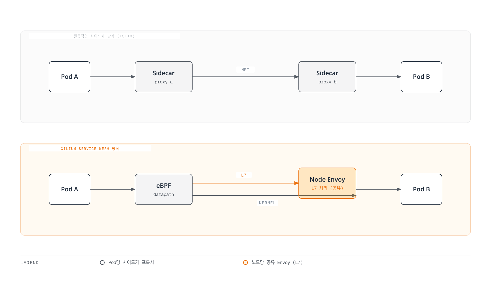
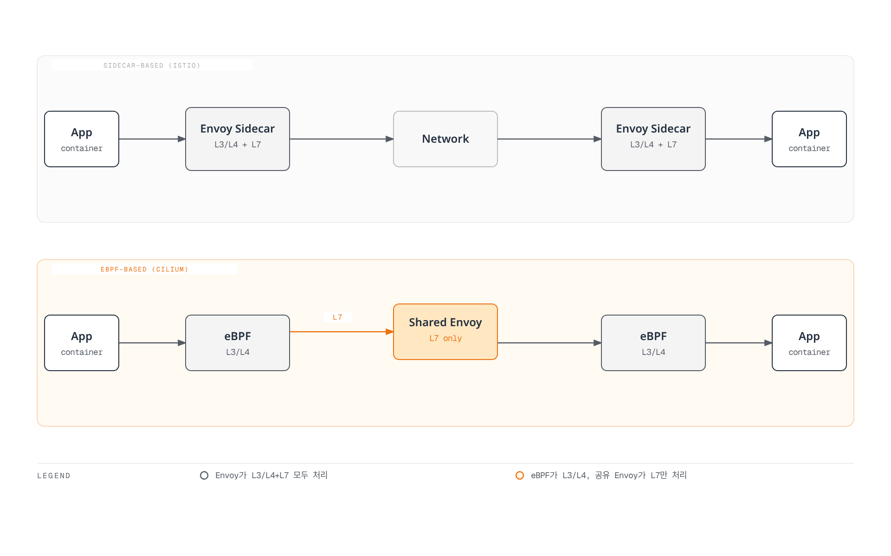
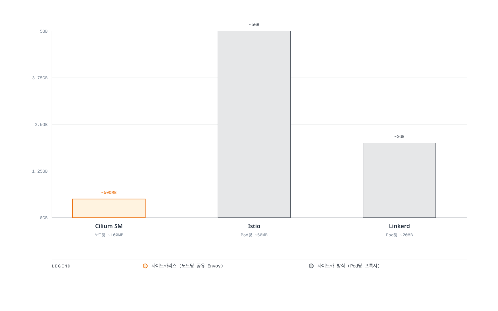

# Cilium Service Mesh 개요

> **지원 버전**: Cilium 1.16+, Kubernetes 1.28+
> **마지막 업데이트**: 2026년 2월 22일

## 소개

Cilium Service Mesh는 eBPF 기반의 사이드카 없는(sidecar-free) 서비스 메시 솔루션입니다. 기존의 사이드카 프록시 방식과 달리, Cilium Service Mesh는 Linux 커널의 eBPF 기술을 활용하여 네트워크 트래픽을 처리하고, 노드당 하나의 공유 Envoy 프록시를 사용하여 L7 기능을 제공합니다.

### 핵심 가치 제안

Cilium Service Mesh의 핵심 가치는 **통합된 네트워킹과 서비스 메시 플랫폼**입니다:

1. **리소스 효율성**: 사이드카 프록시 없이 서비스 메시 기능 제공
2. **낮은 지연 시간**: eBPF를 통한 커널 레벨 패킷 처리
3. **단순한 운영**: CNI와 서비스 메시가 하나의 컴포넌트로 통합
4. **점진적 도입**: 기존 Cilium CNI 사용자가 쉽게 서비스 메시로 확장 가능
5. **강력한 보안**: SPIFFE 기반 ID와 투명한 mTLS 지원

## 사이드카 vs 사이드카리스 아키텍처



### 아키텍처 비교 다이어그램



## 서비스 메시 비교

| 기능 | Cilium Service Mesh | Istio | Linkerd |
|------|---------------------|-------|---------|
| **아키텍처** | eBPF + 노드 Envoy | 사이드카 Envoy | 사이드카 linkerd2-proxy |
| **프록시** | 노드당 1개 (L7만) | Pod당 1개 | Pod당 1개 |
| **메모리 오버헤드** | 낮음 (노드당 ~50-100MB) | 높음 (Pod당 ~50MB) | 중간 (Pod당 ~20MB) |
| **CPU 오버헤드** | 매우 낮음 | 높음 | 중간 |
| **지연 시간** | ~0.1-0.5ms | ~1-3ms | ~0.5-1ms |
| **L4 처리** | eBPF (커널) | Envoy (사용자 공간) | linkerd2-proxy |
| **L7 처리** | Envoy | Envoy | linkerd2-proxy |
| **mTLS** | 투명 (eBPF/WireGuard) | 사이드카 Envoy | linkerd2-proxy |
| **CNI 통합** | 네이티브 | 별도 CNI 필요 | 별도 CNI 필요 |
| **설치 복잡도** | 낮음 | 높음 | 중간 |
| **Gateway API** | 완전 지원 | 완전 지원 | 부분 지원 |
| **네트워크 정책** | CiliumNetworkPolicy (L3-L7) | AuthorizationPolicy | Server (L4) |
| **관찰성** | Hubble (네이티브) | Kiali, Jaeger | Linkerd Viz |

### 리소스 사용량 비교



## Cilium Service Mesh를 선택해야 할 때

### 적합한 사용 사례

1. **이미 Cilium CNI를 사용 중인 경우**
   - 기존 Cilium 투자를 활용
   - 추가 컴포넌트 없이 서비스 메시 기능 활성화
   - 통합된 운영 및 모니터링

2. **리소스 효율성이 중요한 경우**
   - 대규모 클러스터에서 사이드카 오버헤드 제거
   - 노드 리소스 최적화 필요
   - 비용 절감이 중요한 환경

3. **낮은 지연 시간이 필수인 경우**
   - 고성능 워크로드
   - 실시간 애플리케이션
   - 금융/거래 시스템

4. **단순한 운영을 원하는 경우**
   - 하나의 컴포넌트로 CNI + 서비스 메시
   - 사이드카 인젝션 관리 불필요
   - 업그레이드 및 트러블슈팅 단순화

### 부적합한 사용 사례

1. **기존 Istio 투자가 큰 경우**
   - 복잡한 Istio 정책이 이미 구현됨
   - Istio 전용 기능에 의존

2. **Envoy 확장이 많이 필요한 경우**
   - 사이드카별 커스텀 필터
   - Pod별 세밀한 프록시 설정

3. **멀티 클러스터 메시가 복잡한 경우**
   - Istio의 성숙한 멀티 클러스터 기능 필요

## 사전 요구사항

### Cilium CNI 설치 확인

Cilium Service Mesh를 사용하려면 먼저 Cilium CNI가 설치되어 있어야 합니다:

```bash
# Cilium 상태 확인
cilium status

# 예상 출력
    /¯¯\
 /¯¯\__/¯¯\    Cilium:             OK
 \__/¯¯\__/    Operator:           OK
 /¯¯\__/¯¯\    Envoy DaemonSet:    OK
 \__/¯¯\__/    Hubble Relay:       OK
    \__/       ClusterMesh:        disabled

# Cilium 버전 확인
cilium version
```

### EKS에서 Cilium 설치

```bash
# Helm 리포지토리 추가
helm repo add cilium https://helm.cilium.io/
helm repo update

# EKS에 Cilium 설치 (서비스 메시 기능 포함)
helm install cilium cilium/cilium --version 1.16.0 \
  --namespace kube-system \
  --set eni.enabled=true \
  --set ipam.mode=eni \
  --set egressMasqueradeInterfaces=eth0 \
  --set routingMode=native \
  --set kubeProxyReplacement=true \
  --set loadBalancer.algorithm=maglev \
  --set envoy.enabled=true \
  --set hubble.enabled=true \
  --set hubble.relay.enabled=true \
  --set hubble.ui.enabled=true
```

### 필수 컴포넌트

| 컴포넌트 | 역할 | 필수 여부 |
|----------|------|-----------|
| Cilium Agent | eBPF 프로그램 관리, 정책 적용 | 필수 |
| Cilium Operator | CRD 관리, IPAM | 필수 |
| Envoy (cilium-envoy) | L7 프록시 처리 | 서비스 메시 필수 |
| Hubble | 관찰성 | 권장 |
| Hubble Relay | UI/CLI 연결 | 권장 |
| Hubble UI | 시각화 | 선택 |

## 서비스 메시 기능 활성화

### 기본 활성화

```yaml
# values.yaml
envoy:
  enabled: true

# L7 프록시 정책 적용을 위한 기본 설정
proxy:
  enabled: true
```

### 전체 서비스 메시 설정

```yaml
# values.yaml - 전체 서비스 메시 기능
envoy:
  enabled: true
  resources:
    limits:
      cpu: 2000m
      memory: 2Gi
    requests:
      cpu: 100m
      memory: 256Mi

# Hubble 관찰성
hubble:
  enabled: true
  relay:
    enabled: true
  ui:
    enabled: true
  metrics:
    enabled:
      - dns
      - drop
      - tcp
      - flow
      - icmp
      - http

# 상호 인증 (mTLS)
authentication:
  mutual:
    spire:
      enabled: true
      install:
        enabled: true

# Ingress Controller
ingressController:
  enabled: true
  loadbalancerMode: shared

# Gateway API
gatewayAPI:
  enabled: true
```

## 문서 구성

이 섹션의 문서들은 다음과 같이 구성되어 있습니다:

| 문서 | 설명 |
|------|------|
| [아키텍처](./01-architecture.md) | eBPF 데이터패스, 노드 Envoy, CRD 모델 |
| [트래픽 관리](./02-traffic-management.md) | L7 라우팅, 로드 밸런싱, 트래픽 분할 |
| [보안](./03-security.md) | mTLS, 네트워크 정책, 암호화 |
| [관찰성](./04-observability.md) | Hubble, 메트릭, 서비스 맵 |
| [인그레스 & 게이트웨이](./05-ingress-gateway.md) | Ingress Controller, Gateway API |
| [모범 사례](./06-best-practices.md) | 프로덕션 배포, 마이그레이션, 튜닝 |

## 빠른 시작

### 1. 서비스 메시 기능 확인

```bash
# Envoy DaemonSet 확인
kubectl get daemonset -n kube-system cilium-envoy

# Cilium 서비스 메시 상태
cilium status | grep -E "Envoy|Hubble"
```

### 2. 샘플 애플리케이션 배포

```yaml
# bookinfo.yaml
apiVersion: v1
kind: Namespace
metadata:
  name: bookinfo
---
apiVersion: apps/v1
kind: Deployment
metadata:
  name: productpage
  namespace: bookinfo
spec:
  replicas: 1
  selector:
    matchLabels:
      app: productpage
  template:
    metadata:
      labels:
        app: productpage
    spec:
      containers:
      - name: productpage
        image: docker.io/istio/examples-bookinfo-productpage-v1:1.18.0
        ports:
        - containerPort: 9080
---
apiVersion: v1
kind: Service
metadata:
  name: productpage
  namespace: bookinfo
spec:
  selector:
    app: productpage
  ports:
  - port: 9080
    targetPort: 9080
```

### 3. L7 정책 적용

```yaml
# l7-policy.yaml
apiVersion: cilium.io/v2
kind: CiliumNetworkPolicy
metadata:
  name: productpage-l7
  namespace: bookinfo
spec:
  endpointSelector:
    matchLabels:
      app: productpage
  ingress:
  - fromEndpoints:
    - matchLabels:
        app: frontend
    toPorts:
    - ports:
      - port: "9080"
        protocol: TCP
      rules:
        http:
        - method: GET
          path: "/productpage"
        - method: GET
          path: "/health"
```

### 4. 트래픽 관찰

```bash
# Hubble CLI로 L7 트래픽 관찰
hubble observe --namespace bookinfo -f

# HTTP 요청 필터링
hubble observe --namespace bookinfo --protocol http

# 서비스 간 흐름 확인
hubble observe --namespace bookinfo --to-service productpage
```

## 다음 단계

1. **[아키텍처](./01-architecture.md)**: Cilium Service Mesh의 내부 동작 방식을 이해합니다.
2. **[트래픽 관리](./02-traffic-management.md)**: L7 라우팅과 트래픽 제어를 구성합니다.
3. **[보안](./03-security.md)**: mTLS와 L7 네트워크 정책을 설정합니다.

## 참고 자료

- [Cilium 공식 문서](https://docs.cilium.io/)
- [Cilium Service Mesh 가이드](https://docs.cilium.io/en/stable/network/servicemesh/)
- [eBPF 소개](https://ebpf.io/)
- [Gateway API 문서](https://gateway-api.sigs.k8s.io/)
