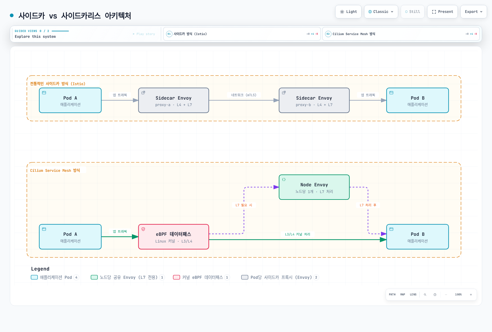

# Cilium Service Mesh 개요

> **검토 기준**: 2026년 9월 11일 · Cilium/chart 1.20.1 · CLI 0.20.0 · Hubble CLI 1.19.4

Cilium은 Kubernetes networking, eBPF policy/load balancing, 선택적인 application-layer proxy 기능을 결합합니다. 선택한 L7 트래픽은 Envoy 통합이 처리합니다. 애플리케이션별 sidecar를 없애도 proxy, kernel 요구사항, 운영 component가 사라지는 것은 아닙니다.

## 아키텍처와 보안 경계



[인터랙티브 다이어그램 보기](https://www.atomai.click/kubernetes-docs/archmaps/ko-service-mesh-cilium-service-mesh-readme-0.html)

Envoy는 Cilium agent와 같은 Pod의 process 또는 별도로 관리하는 `cilium-envoy` DaemonSet으로 실행할 수 있습니다. 선택한 chart의 일반적인 렌더링은 별도 DaemonSet입니다. 실제 배치와 L7 hop 수는 기능/정책에 따라 달라지며 모든 packet이 Envoy를 통과하지는 않습니다.

| Component | 역할 |
|---|---|
| Cilium agent | Node datapath, endpoint identity, 정책 적용 |
| Cilium operator | 선택한 모드의 IPAM 및 cluster/controller 역할 |
| Envoy | 대상 L7 policy, ingress, Gateway API 처리 |
| Hubble | Flow 관찰; L7 record에는 해당 proxy visibility 필요 |
| Hubble Relay / UI | 추가 집계 및 시각화 component |
| 설정한 경우의 SPIRE | Beta mutual-authentication 기능의 identity 인프라 |

### 상호 인증과 자동 트래픽 암호화는 다름

Cilium 1.20.1은 **out-of-band 상호 인증을 beta이자 미완성 기능**으로 문서화합니다. Cilium security identity에 대한 mTLS 기반 handshake는 agent 사이에서 out of band로 이루어집니다. 각 애플리케이션 연결을 Istio/Linkerd workload proxy와 같은 TLS transport로 감싸는 방식은 아닙니다.

WireGuard/IPsec은 별도 지원 모드와 적용 범위를 가진 암호화 기능입니다. WireGuard는 TLS가 아니며 SPIRE 활성화만으로 application data가 암호화되거나 모든 endpoint에 인증 규칙이 적용되지는 않습니다. 선택한 버전은 mutual authentication과 ClusterMesh/외부 mesh mTLS의 호환성 제한도 명시합니다.

Cilium 1.20.1에는 `encryption.type: ztunnel`로 선택하는 별도의 [ztunnel 투명 암호화 베타](https://github.com/cilium/cilium/blob/v1.20.1/Documentation/security/network/encryption-ztunnel.rst)도 있습니다. Namespace 등록으로 TCP 워크로드 mTLS를 제공하며 양쪽 엔드포인트가 모두 등록되어야 합니다. ClusterMesh와 hostNetwork Pod는 지원하지 않고, 릴리스 문서는 이 경로에서 HBONE 포트 15008을 대상으로 하는 경우 외에는 일반 L4 정책이 동작하지 않는다고 명시합니다. 별도의 CA·bootstrap 요건을 가진 배포 선택지입니다.

Beta 경로를 사용하기 전에 [보안 가이드](03-security.md)와 해당 버전 보안 모델/제한을 검토합니다. Routing, 인증, 인가, 암호화는 서로 다른 요구사항입니다.

Cilium은 Istio 배포의 기반 CNI로도 사용할 수 있습니다. Network 통합이 인증 방식의 상호 교환을 뜻하지는 않습니다. 모드별 socket load balancing, CNI 공존, L7 정책 소유권을 검토해야 합니다.

## 기능과 측정한 비용 비교

| 주제 | Cilium | Istio | Linkerd |
|---|---|---|---|
| Dataplane | eBPF와 선택한 L7용 공유 Envoy | Sidecar 또는 ambient ztunnel/waypoint 역할 | Native sidecar 배치를 포함한 Pod별 proxy |
| Pod networking | 모드에 따라 CNI 제공 또는 chaining | 기반 Pod network 필요; 자체 CNI는 mesh 트래픽 redirect | 기반 Pod network 필요; 선택적 CNI는 mesh 트래픽 redirect |
| Policy | Kubernetes/Cilium network policy와 L7 기능 | 별도 network-policy 계층과 mesh 인가/routing | Server/route 인가와 outbound routing이며 L4에만 한정되지 않음 |
| Gateway API | 선택적으로 활성화하는 controller와 문서화된 conformance/기능 | Gateway와 mesh-routing 역할 | 지원되는 Service/Server-parent route 역할 |
| 보안 | Out-of-band 인증·별도 암호화와, 제약이 있는 별도 ztunnel mTLS 베타 | Workload mesh mTLS와 정책 | Workload mesh mTLS와 정책 |

Workload/설정과 무관한 범용 CPU, memory, latency 순위는 없습니다. 이전 per-node/per-Pod 숫자와 100-Pod memory 그림에는 benchmark 출처가 없고 component, node 수, workload 조건도 빠져 있었습니다. 동일한 baseline에서 agent/proxy, controller, 지표, identity 인프라를 포함한 증분 비용을 측정해 비교합니다.

Cilium의 network 모델과 필요한 L7 기능이 환경에 맞으면 유용하며 이미 Cilium을 운영할 때 특히 검토할 수 있습니다. CNI 이전, kernel/platform 지원, node 공유에 따른 장애 영향, 보안 요구사항, 기존 정책 의존성을 평가합니다. “Sidecarless”나 “eBPF”만으로 금융/실시간 workload의 latency나 비용 목표가 증명되지는 않습니다.

더 넓은 기능 경계는 유지되는 [서비스 메시 비교](../istio/comparison/01-service-mesh-comparison.md)를 참고합니다.

## 버전과 플랫폼 전제 조건

선택한 release의 기준입니다.

- 일반 Kubernetes e2e 호환성 목록은 **1.33–1.36**입니다. 릴리스의 EKS CI 파일은 **1.33–1.35**이며 default는 1.35입니다. 다른 근거 집합이므로 더 최신이거나 provider 목록에 없는 조합은 별도 검증이 필요합니다.
- Helm chart의 느슨한 `kubeVersion >=1.21.0-0`이 검증된 지원 matrix는 아니며 최신 Kubernetes도 자동 포함되지 않습니다.
- 지원되는 AMD64/AArch64 Linux와 보통 kernel 5.10 이상 또는 문서화된 backport 동등 환경이 필요합니다. L7 redirect와 고급 기능에는 추가 kernel/module 요구사항이 있습니다.
- 해당 Cilium release의 Gateway API 기준은 **v1.6.1**입니다. CRD 변경 전 필수/선택 CRD와 1.20의 TLSRoute upgrade 주의사항을 확인합니다. 호환성 검토 없이 최신 catalog 버전으로 바꾸지 않습니다.

```bash
cilium version --client
cilium version
cilium status --wait --wait-duration 5m
kubectl -n kube-system get daemonset cilium
# For the dedicated Envoy mode selected below:
kubectl -n kube-system get daemonset cilium-envoy
```

CLI 자체 버전과 실행 중인 Cilium 이미지 버전은 다른 정보입니다. 전체 status 출력과 실패를 유지합니다. “Envoy”나 “Hubble” grep만으로 준비 상태가 인증되지는 않습니다. Embedded mode라면 별도 Envoy DaemonSet이 없을 수 있습니다.

### EKS 설치 방식 선택

| 모드/플랫폼 | 구분할 점 |
|---|---|
| Cilium AWS ENI mode | Cilium이 ENI IPAM/native routing 관리; IAM, 라우팅, node/Pod 등록 계획 필요. 일반 1.20.1 ENI 문서는 IPv6 Beta를 설명하지만 EKS 설치 페이지에는 IPv4 전용 문구가 남아 있으므로, 여기서는 IPv4 예제를 사용하고 플랫폼별 IPv6 전제·지원은 별도 검증 |
| AWS VPC CNI chaining | AWS VPC CNI가 interface/IPAM을 유지하고 Cilium datapath가 뒤에 연결됨; 고급 L7/IPsec 제한 검토 필요 |
| EKS Fargate | 대체 CNI를 지원하지 않으며 AWS VPC CNI 필요 |
| EKS Auto Mode | 대체 CNI와 network-policy plugin을 지원하지 않음 |
| EKS Hybrid Nodes | EC2 ENI 인수 대신 별도의 AWS 지원 Cilium 버전/설정/기능 지침 사용 |

EC2 node CNI에 대한 AWS 지원은 Amazon VPC CNI에 한정되며 다른 호환 CNI는 자체 운영/vendor 지원이 필요합니다. 별도의 Hybrid Nodes 지원 범위를 일반 Cilium 호환성 표에서 추론하지 않습니다.

Helm 한 줄은 기존 AWS VPC CNI cluster의 이전 계획이 아닙니다. API bootstrap 접근, kube-proxy replacement, CNI 소유권, IAM, node readiness taint, 이미 실행 중인 unmanaged Pod 재생성을 검증된 절차로 다룹니다. 이 감사에서는 cluster 생성이나 CNI 교체를 실행하지 않았습니다.

## 선택한 기능 활성화

이미 올바르게 설치된 Cilium에 적용할 feature overlay를 `cilium-mesh-features.yaml`로 저장합니다.

```yaml
l7Proxy: true
envoy:
  enabled: true
hubble:
  enabled: true
  relay:
    enabled: true
  ui:
    enabled: true
```

지원되는 L7 flag는 `l7Proxy`이며 `proxy.enabled`로 대체할 수 없습니다. Native chart 검증에서 `proxy.enabled:false`는 L7을 계속 활성화하고 `l7Proxy:false`는 비활성화함을 확인했습니다.

```bash
set -euo pipefail
umask 077
helm repo add cilium https://helm.cilium.io/
helm repo update cilium
# Preview only: reviewed-cni-values.yaml must describe the existing intended CNI mode.
helm template cilium cilium/cilium --version 1.20.1 \
  --namespace kube-system --kube-version 1.35.0 \
  -f reviewed-cni-values.yaml -f cilium-mesh-features.yaml \
  > cilium-mesh-rendered.yaml
```

호환되는 예제 Kubernetes 버전으로 설치의 검토된 CNI values와 병합해 미리 봅니다. 결과를 확인하고 기존 소유자를 통해 release가 지원하는 upgrade 절차를 따릅니다. 완전한 CNI 설치나 networking mode 변경을 대신하는 명령이 아닙니다.

| 선택적 기능 | 추가 요구사항 |
|---|---|
| Gateway API | kube-proxy replacement, L7 proxy, 필수 v1.6.1 CRD, 적절한 load-balancer/host-network 설계 |
| Ingress controller | 지원되는 설정과 노출 모델; 모든 mesh 트래픽에 자동 적용되지 않음 |
| Hubble metrics | 선택한 metric family와 수집기; Relay/UI가 Prometheus를 만들지는 않음 |
| Mutual authentication | Beta 검토, 명시적 활성화, SPIRE/storage/연결, 해당 인증 정책, 별도 암호화 검토 |

**격리된 beta 인증 평가**에서는 이전 예제에 빠진 최상위 flag를 포함해야 합니다.

```yaml
authentication:
  enabled: true
  mutual:
    spire:
      enabled: true
      install:
        enabled: true
```

Chart는 `authentication.enabled:true` 없는 SPIRE 통합을 거부합니다. 제공되는 SPIRE server는 기본적으로 persistent storage를 사용하므로 적합한 PVC provisioning이 필요합니다. 이 조각이 운영 보안, cluster 간 인증, application traffic 암호화를 구성하지는 않습니다.

## L7 정책과 관찰 예제

`bookinfo`에 Cilium이 관리하는 `app:productpage` HTTP 애플리케이션과 같은 namespace의 `app:frontend` client를 준비합니다. Bookinfo를 사용한다면 필요한 애플리케이션 의존성을 모두 배포합니다. Productpage Deployment 하나가 완전한 Bookinfo는 아닙니다. 검증한 이미지와 애플리케이션에 맞는 readiness를 사용합니다.

다음 정책은 해당 endpoint를 선택하고 명시한 client/method/path 조합을 허용합니다. Workload를 생성하지는 않습니다.

```yaml
apiVersion: cilium.io/v2
kind: CiliumNetworkPolicy
metadata:
  name: productpage-l7
  namespace: bookinfo
spec:
  endpointSelector:
    matchLabels:
      k8s:app: productpage
  ingress:
  - fromEndpoints:
    - matchLabels:
        k8s:app: frontend
        k8s:io.kubernetes.pod.namespace: bookinfo
    toPorts:
    - ports:
      - port: '9080'
        protocol: TCP
      rules:
        http:
        - method: GET
          path: ^/productpage$
        - method: GET
          path: ^/health$
```

정책 소유자를 통해 적용하기 전에 다른 정책과 예상한 default-deny 영향을 평가합니다. 예제는 path 두 개만 허용하며 전체 browser 동작에 필요한 모든 static asset/의존성을 허용하지 않습니다. 인증/암호화는 이 L7 허용 정책과 별개입니다.

```bash
# Keep this terminal running; configure the intended kube context first.
cilium hubble port-forward --port-forward 4245

# In another terminal, use the selected Hubble CLI:
hubble status --server localhost:4245
hubble observe --server localhost:4245 --namespace bookinfo --protocol http --follow
# Service-name filters are an alternative to --namespace in this CLI.
hubble observe --server localhost:4245 --to-service bookinfo/productpage
```

선택한 Hubble CLI는 `--namespace`와 `--to-service` 조합을 거부합니다. Namespace 관찰 또는 namespace를 포함한 service-name prefix 중 하나를 사용합니다. L7 record에는 실제 대상 트래픽과 proxy visibility가 필요합니다. L7 proxy 이전의 drop은 더 넓은 flow/drop 조회가 필요할 수 있습니다. 관찰된 flow가 없다고 허용/거부/정상 경로가 증명되지는 않습니다.

## 문서 구성과 참고 자료

| 가이드 | 범위 |
|---|---|
| [아키텍처](01-architecture.md) | Datapath, Envoy, API 모델 |
| [트래픽 관리](02-traffic-management.md) | Routing과 load balancing |
| [보안](03-security.md) | Policy, 인증, 암호화 경계 |
| [관찰성](04-observability.md) | Hubble과 지표 |
| [Ingress/Gateway](05-ingress-gateway.md) | 외부 트래픽과 Gateway API |
| [모범 사례](06-best-practices.md) | 운영, 이전, 검증 |

- [해당 버전 Kubernetes 호환성](https://github.com/cilium/cilium/blob/v1.20.1/Documentation/network/kubernetes/compatibility.rst)
- [System 요구사항](https://github.com/cilium/cilium/blob/v1.20.1/Documentation/operations/system_requirements.rst)
- [Cilium networking과 Istio](https://github.com/cilium/cilium/blob/v1.20.1/Documentation/network/servicemesh/istio.rst)
- [Envoy mode](https://github.com/cilium/cilium/blob/v1.20.1/Documentation/security/network/proxy/envoy.rst)
- [Mutual authentication 제한](https://github.com/cilium/cilium/blob/v1.20.1/Documentation/network/servicemesh/mutual-authentication/mutual-authentication.rst)
- [Gateway API 전제 조건](https://github.com/cilium/cilium/blob/v1.20.1/Documentation/network/servicemesh/gateway-api/installation.rst)
- [EKS ENI 요구사항](https://github.com/cilium/cilium/blob/v1.20.1/Documentation/installation/requirements-eks.rst)과 [AWS VPC CNI chaining](https://github.com/cilium/cilium/blob/v1.20.1/Documentation/installation/cni-chaining-aws-cni.rst)
- [EKS 대체 CNI](https://docs.aws.amazon.com/eks/latest/userguide/alternate-cni-plugins.html)와 [Hybrid Nodes CNI](https://docs.aws.amazon.com/eks/latest/userguide/hybrid-nodes-cni.html)
- [Cilium 1.20.1 ENI IPAM / IPv6 Beta](https://github.com/cilium/cilium/blob/v1.20.1/Documentation/network/concepts/ipam/eni.rst)
