# Istio 기본 개념

이 문서에서는 Istio의 핵심 개념과 아키텍처를 설명합니다. Istio를 효과적으로 사용하기 위해서는 이러한 기본 개념을 이해하는 것이 중요합니다.

## 목차

1. [배경과 역사](#배경과-역사)
2. [Why Istio?](#why-istio)
3. [Istio 아키텍처](#istio-아키텍처)
4. [Deployment Modes: Sidecar vs Ambient](#deployment-modes-sidecar-vs-ambient)
5. [핵심 리소스](#핵심-리소스)
6. [트래픽 관리 개념](#트래픽-관리-개념)
7. [보안 개념](#보안-개념)
8. [관찰성 개념](#관찰성-개념)
9. [네임스페이스와 서비스 메시](#네임스페이스와-서비스-메시)
10. [다음 단계](#다음-단계)

## 배경과 역사

### Service Mesh의 탄생 배경

#### 마이크로서비스의 도전 과제

2010년대 초반, 기업들은 모놀리식 애플리케이션을 마이크로서비스로 분해하기 시작했습니다.

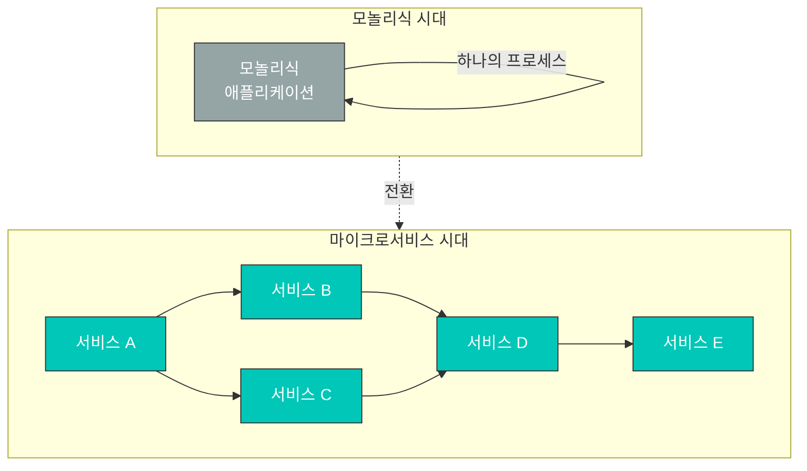

**새로운 문제들**:

| 문제 | 설명 | 영향 |
|------|------|------|
| **서비스 간 통신** | 네트워크 호출 증가 | 지연 시간, 장애 전파 |
| **Observability** | 분산 추적 필요 | 디버깅 어려움 |
| **보안** | 서비스 간 인증/암호화 | mTLS 구현 복잡도 |
| **트래픽 제어** | 카나리 배포, A/B 테스트 | 애플리케이션 코드 수정 |
| **장애 처리** | Circuit Breaker, Retry | 각 서비스마다 구현 |

#### 초기 해결 방법: 라이브러리

**문제점**:
- 언어별로 라이브러리 개발 필요 (Java용 Hystrix, Go용 별도 라이브러리...)
- 애플리케이션 코드에 긴밀히 결합
- 업데이트 시 모든 서비스 재배포
- 버전 관리 복잡

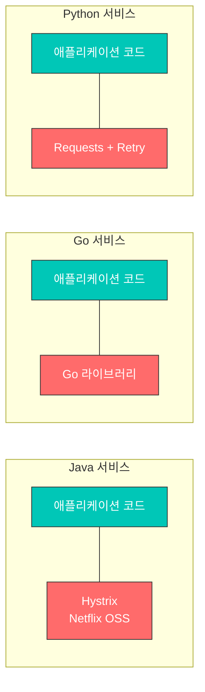

**Service Mesh의 아이디어**: 네트워킹 로직을 애플리케이션에서 분리하여 인프라 레이어로 이동

### Envoy Proxy의 탄생

#### Lyft의 문제

**2015년, Lyft**는 다음 문제들을 겪고 있었습니다:

- 200+ 마이크로서비스 운영
- 다양한 언어와 프레임워크 (Python, Go, Java 등)
- 기존 프록시(HAProxy, NGINX)로는 부족
  - 동적 구성 변경 어려움
  - Observability 부족
  - 고급 라우팅 기능 제한

#### Matt Klein과 Envoy

**Matt Klein** (Lyft 엔지니어)는 2016년 Envoy를 오픈소스로 공개했습니다.

**Envoy가 해결한 문제들**:

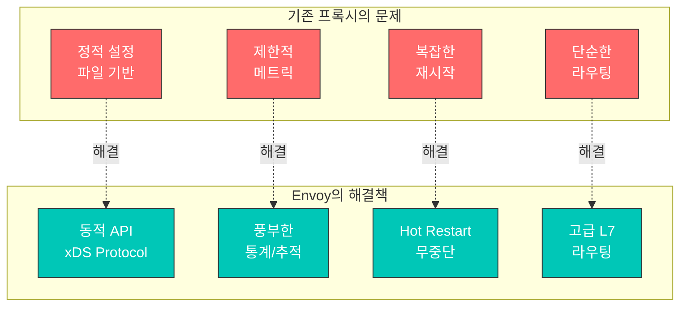

**Envoy의 핵심 특징**:

1. **Out-of-process Architecture**: 애플리케이션과 별도 프로세스
2. **xDS APIs**: 동적 구성 업데이트
3. **L7 Proxy**: HTTP/2, gRPC, WebSocket 지원
4. **Observability**: 상세한 메트릭, 추적, 로깅
5. **성능**: C++로 작성, 고성능

#### CNCF 편입

**타임라인**:
- **2016년 9월**: Envoy 오픈소스 공개
- **2017년 9월**: CNCF 프로젝트로 승인 (Incubating)
- **2018년 11월**: CNCF Graduated 프로젝트로 승격

### Istio의 탄생과 역사

#### Google, IBM, Lyft의 협력

**2017년 5월**, Google, IBM, Lyft가 협력하여 Istio를 발표했습니다.

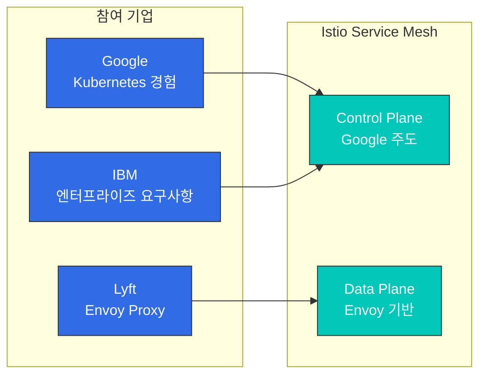

**각 회사의 기여**:

| 회사 | 주요 기여 | 이유 |
|------|----------|------|
| **Google** | Control Plane 설계 | Borg, Kubernetes 경험 |
| **IBM** | 엔터프라이즈 기능 | 기업 고객 요구사항 |
| **Lyft** | Envoy Proxy | 프로덕션 검증된 프록시 |

#### Istio 버전 역사

**주요 마일스톤**:

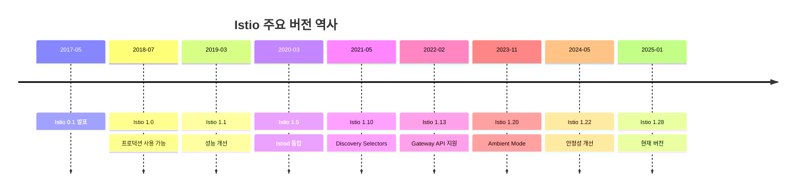

**1.5 버전 (2020년 3월) - 중요한 전환점**:

이전 아키텍처 (Istio 1.4 이전):
```
별도 컴포넌트로 분리:
- Mixer (정책/텔레메트리)
- Pilot (트래픽 관리)
- Citadel (인증서 관리)
- Galley (구성 검증)
```

새로운 아키텍처 (Istio 1.5+, 현재 1.28):
```
Istiod (단일 바이너리로 통합)
├── Pilot 기능 (Service Discovery, Traffic Management)
├── Citadel 기능 (Certificate Authority, Identity)
└── Galley 기능 (Configuration Validation)

Mixer는 완전히 제거됨 (기능이 Envoy로 이동)
```

**변경 이유**:
- 복잡도 감소 (4개 → 1개 컴포넌트)
- 성능 향상 (Mixer 제거로 지연 시간 50% 감소)
- 운영 단순화 (단일 프로세스 관리)
- 리소스 효율성 (메모리, CPU 사용량 감소)

## Why Istio?

Kubernetes는 컨테이너 오케스트레이션을 제공하지만, 마이크로서비스 간의 복잡한 통신을 관리하는 데는 한계가 있습니다. Istio는 이러한 문제를 해결하기 위한 서비스 메시 솔루션입니다.

### 마이크로서비스의 과제

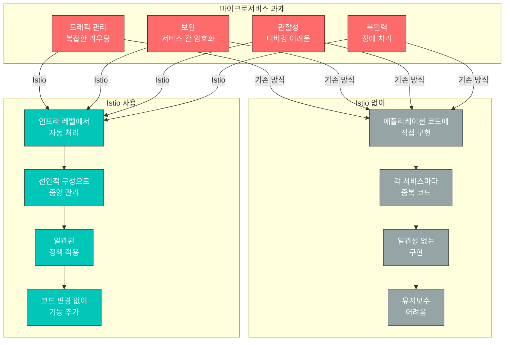

### Istio가 제공하는 핵심 가치

#### 1. 트래픽 관리

**문제**: 새 버전 배포 시 안전하게 트래픽을 전환하고 싶습니다.

**Istio 해결책**:
```yaml
# 코드 변경 없이 Canary 배포
apiVersion: networking.istio.io/v1
kind: VirtualService
metadata:
  name: reviews
spec:
  hosts:
  - reviews
  http:
  - route:
    - destination:
        host: reviews
        subset: v1
      weight: 90  # 기존 버전 90%
    - destination:
        host: reviews
        subset: v2
      weight: 10  # 새 버전 10%
```

**이점**:
- 애플리케이션 코드 수정 불필요
- 실시간 트래픽 분할 조정
- 자동 롤백 가능
- A/B 테스트, Blue/Green 배포 지원

#### 2. 보안

**문제**: 서비스 간 통신을 암호화하고 인증하고 싶습니다.

**Istio 해결책**:
```yaml
# 자동 mTLS 활성화
apiVersion: security.istio.io/v1
kind: PeerAuthentication
metadata:
  name: default
  namespace: istio-system
spec:
  mtls:
    mode: STRICT  # 모든 서비스 간 자동 암호화
```

**이점**:
- 인증서 자동 발급 및 갱신
- 서비스 신원 자동 검증
- 세밀한 권한 제어
- Zero Trust 네트워크 구현

#### 3. 관찰성

**문제**: 수십 개의 마이크로서비스에서 요청 흐름을 추적하기 어렵습니다.

**Istio 해결책**:
- 자동 메트릭 생성 (Latency, Traffic, Errors, Saturation)
- 분산 추적 (Distributed Tracing)
- 서비스 토폴로지 시각화

**이점**:
- 병목 구간 자동 식별
- 에러 원인 빠른 파악
- 실시간 서비스 상태 모니터링

#### 4. 복원력

**문제**: 한 서비스의 장애가 전체 시스템에 전파됩니다.

**Istio 해결책**:
```yaml
# Circuit Breaker 자동 설정
apiVersion: networking.istio.io/v1
kind: DestinationRule
metadata:
  name: reviews
spec:
  host: reviews
  trafficPolicy:
    outlierDetection:
      consecutiveErrors: 5
      interval: 30s
      baseEjectionTime: 30s
```

**이점**:
- 장애 격리 (Circuit Breaker)
- 자동 재시도 및 타임아웃
- 비정상 인스턴스 자동 제거
- 트래픽 제한 (Rate Limiting)

### Istio를 사용해야 하는 경우

**✅ Istio가 적합한 경우:**

1. **마이크로서비스 아키텍처**
   - 10개 이상의 서비스
   - 서비스 간 복잡한 의존성
   - 빈번한 배포

2. **고급 트래픽 관리 필요**
   - Canary 배포, A/B 테스트
   - 세밀한 라우팅 제어
   - Traffic Mirroring

3. **강력한 보안 요구사항**
   - 서비스 간 암호화 필수
   - 세밀한 접근 제어
   - 규정 준수 (Compliance)

4. **관찰성과 디버깅**
   - 복잡한 서비스 간 문제 추적
   - 성능 병목 식별
   - SLO/SLA 모니터링

**❌ Istio가 과할 수 있는 경우:**

1. **간단한 애플리케이션**
   - 서비스 개수가 적음 (5개 미만)
   - 단순한 요구사항
   - Kubernetes Ingress로 충분

2. **리소스 제약**
   - 작은 클러스터
   - 리소스 오버헤드 감당 어려움
   - 사이드카 메모리 비용 부담

3. **운영 역량 부족**
   - 학습 시간 부족
   - 전담 플랫폼 팀 없음
   - 간단한 솔루션 선호

### 대안과 비교

#### Kubernetes Ingress vs Istio

| 기능 | Kubernetes Ingress | Istio |
|------|-------------------|-------|
| **범위** | 외부 → 클러스터 | 외부 + 내부 서비스 간 |
| **라우팅** | 기본적 (Path, Host) | 고급 (Header, Cookie 등) |
| **mTLS** | 수동 설정 | 자동 |
| **Observability** | 제한적 | 풍부함 |
| **복잡도** | 낮음 | 높음 |
| **사용 시나리오** | 간단한 앱 | 마이크로서비스 |

#### AWS VPC Lattice vs Istio

자세한 비교는 [AWS 통합](04-aws-integration.md#istio-vs-다른-솔루션-비교) 문서를 참고하세요.

**간단 요약:**
- **VPC Lattice**: AWS 관리형, 간단, 크로스 VPC/계정 통신
- **Istio**: 오픈소스, 강력한 기능, Kubernetes 전용, 세밀한 제어

#### Linkerd vs Istio

| 특성 | Istio | Linkerd |
|------|-------|---------|
| **복잡도** | 높음 | 낮음 |
| **기능** | 매우 풍부 | 핵심 기능만 |
| **리소스** | 높음 | 낮음 |
| **학습 곡선** | 가파름 | 완만함 |
| **커뮤니티** | 큼 | 작음 |

**선택 가이드:**
- 고급 기능과 유연성 필요 → **Istio**
- 간단하고 가벼운 메시 필요 → **Linkerd**

## Deployment Modes: Sidecar vs Ambient

Istio는 두 가지 배포 모드를 지원합니다: **Sidecar Mode**와 **Ambient Mode**.

### Sidecar Mode (기본)

각 애플리케이션 파드에 Envoy 프록시를 사이드카 컨테이너로 주입합니다.

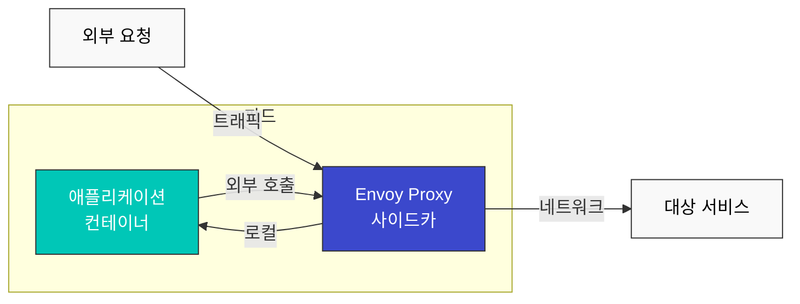

**장점:**
- 성숙하고 안정적
- 모든 Istio 기능 지원
- 파드별 세밀한 제어

**단점:**
- 리소스 오버헤드 (각 파드마다 Envoy)
- 시작 시간 증가 (Init Container)
- 복잡한 권한 설정 (iptables)

### Ambient Mode (새로운 방식)

사이드카 없이 노드 레벨에서 트래픽을 처리합니다.

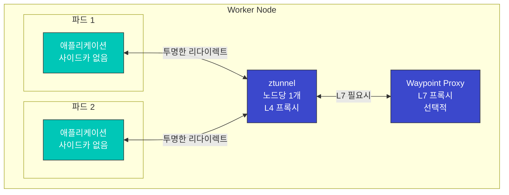

**장점:**
- 낮은 리소스 사용 (노드당 1개)
- 빠른 파드 시작
- 간단한 운영
- 점진적 L7 기능 적용 가능

**단점:**
- 상대적으로 새로운 기술 (덜 성숙)
- 일부 고급 기능 제한적
- 파드별 세밀한 제어 어려움

### 비교표

| 특성 | Sidecar Mode | Ambient Mode |
|------|-------------|--------------|
| **리소스 사용** | 높음 (파드당) | 낮음 (노드당) |
| **시작 시간** | 느림 (Init Container) | 빠름 |
| **운영 복잡도** | 높음 | 낮음 |
| **L4 기능** | 지원 | 지원 |
| **L7 기능** | 전체 지원 | 선택적 (Waypoint) |
| **성숙도** | 높음 | 중간 |
| **마이그레이션** | - | 기존 사이드카에서 가능 |
| **권장 사용** | 고급 L7 기능 필요 | 리소스 효율성 중시 |

### 선택 가이드

**Sidecar Mode 선택:**
- 모든 Istio 기능 활용 필요
- 파드별 세밀한 정책 제어
- 프로덕션 검증된 안정성 필요

**Ambient Mode 선택:**
- 리소스 효율성 중요
- 간단한 L4 기능만 필요
- 점진적으로 L7 기능 추가 예정

**자세한 내용**은 [Advanced: Ambient Mode](advanced/01-ambient-mode.md) 문서를 참고하세요.

## Istio 아키텍처

Istio는 **Control Plane**과 **Data Plane** 두 가지 주요 구성 요소로 이루어져 있습니다.

| 구성 요소 | 설명 |
|----------|------|
| **Control Plane (istiod)** | 서비스 디스커버리, 구성 배포, 인증서 관리를 담당하는 중앙 제어 시스템 |
| **Data Plane (Envoy Proxy)** | 각 파드의 사이드카로 배포되어 실제 트래픽을 처리 (라우팅, mTLS, 메트릭) |

**상세한 아키텍처 구조, 내부 동작 원리, 트래픽 가로채기 메커니즘**은 [아키텍처 문서](03-architecture.md)를 참고하세요.

## 핵심 리소스

Istio는 Kubernetes Custom Resource Definitions (CRDs)를 사용하여 구성을 관리합니다.

### 1. VirtualService

VirtualService는 요청을 서비스로 라우팅하는 방법을 정의합니다.

```yaml
apiVersion: networking.istio.io/v1
kind: VirtualService
metadata:
  name: reviews-route
spec:
  hosts:
  - reviews  # 대상 서비스
  http:
  - match:
    - headers:
        end-user:
          exact: jason
    route:
    - destination:
        host: reviews
        subset: v2  # 특정 사용자는 v2로 라우팅
  - route:
    - destination:
        host: reviews
        subset: v1  # 기본적으로 v1로 라우팅
```

**주요 기능**:
- 경로 기반 라우팅 (Path, Header, Query Parameter)
- 트래픽 분할 (Canary, A/B 테스트)
- Retry, Timeout, Fault Injection
- URL Rewrite, Header 조작

### 2. DestinationRule

DestinationRule은 서비스의 서브셋(버전)을 정의하고 트래픽 정책을 적용합니다.

```yaml
apiVersion: networking.istio.io/v1
kind: DestinationRule
metadata:
  name: reviews-destination
spec:
  host: reviews
  trafficPolicy:
    loadBalancer:
      simple: LEAST_REQUEST  # 로드 밸런싱 알고리즘
    connectionPool:
      tcp:
        maxConnections: 100
      http:
        http1MaxPendingRequests: 50
        maxRequestsPerConnection: 2
    outlierDetection:
      consecutiveErrors: 5
      interval: 30s
      baseEjectionTime: 30s
  subsets:
  - name: v1
    labels:
      version: v1
  - name: v2
    labels:
      version: v2
  - name: v3
    labels:
      version: v3
```

**주요 기능**:
- 서비스 버전(subset) 정의
- 로드 밸런싱 알고리즘
- Connection Pool 설정
- Circuit Breaker (Outlier Detection)
- TLS 설정

### 3. Gateway

Gateway는 메시로 들어오는 외부 트래픽을 관리합니다.

```yaml
apiVersion: networking.istio.io/v1
kind: Gateway
metadata:
  name: bookinfo-gateway
spec:
  selector:
    istio: ingressgateway  # Ingress Gateway 파드 선택
  servers:
  - port:
      number: 80
      name: http
      protocol: HTTP
    hosts:
    - "bookinfo.example.com"
  - port:
      number: 443
      name: https
      protocol: HTTPS
    tls:
      mode: SIMPLE
      credentialName: bookinfo-credential  # TLS 인증서
    hosts:
    - "bookinfo.example.com"
```

**주요 기능**:
- 외부 트래픽의 진입점 정의
- 호스트, 포트, 프로토콜 설정
- TLS 종료
- SNI 라우팅

### 4. ServiceEntry

ServiceEntry는 메시 외부의 서비스를 메시 내부 서비스처럼 사용할 수 있게 합니다.

```yaml
apiVersion: networking.istio.io/v1
kind: ServiceEntry
metadata:
  name: external-api
spec:
  hosts:
  - api.external.com
  ports:
  - number: 443
    name: https
    protocol: HTTPS
  location: MESH_EXTERNAL
  resolution: DNS
```

**주요 기능**:
- 외부 서비스 등록
- 외부 서비스에 대한 트래픽 제어
- Egress 트래픽 관리

### 5. PeerAuthentication

PeerAuthentication은 서비스 간 인증 정책을 정의합니다.

```yaml
apiVersion: security.istio.io/v1
kind: PeerAuthentication
metadata:
  name: default
  namespace: default
spec:
  mtls:
    mode: STRICT  # STRICT, PERMISSIVE, DISABLE
```

### 6. AuthorizationPolicy

AuthorizationPolicy는 서비스 접근 권한을 정의합니다.

```yaml
apiVersion: security.istio.io/v1
kind: AuthorizationPolicy
metadata:
  name: allow-ratings
  namespace: default
spec:
  selector:
    matchLabels:
      app: ratings
  action: ALLOW
  rules:
  - from:
    - source:
        principals: ["cluster.local/ns/default/sa/reviews"]
    to:
    - operation:
        methods: ["GET"]
```

## 트래픽 관리 개념

### 트래픽 라우팅 흐름

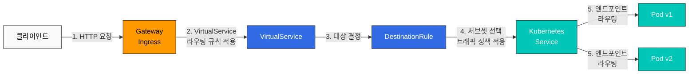

### 트래픽 분할 (Canary 배포)

```yaml
apiVersion: networking.istio.io/v1
kind: VirtualService
metadata:
  name: reviews-canary
spec:
  hosts:
  - reviews
  http:
  - route:
    - destination:
        host: reviews
        subset: v1
      weight: 90  # 90%의 트래픽
    - destination:
        host: reviews
        subset: v2
      weight: 10  # 10%의 트래픽 (카나리)
```

### Circuit Breaker

```yaml
apiVersion: networking.istio.io/v1
kind: DestinationRule
metadata:
  name: reviews-circuit-breaker
spec:
  host: reviews
  trafficPolicy:
    connectionPool:
      tcp:
        maxConnections: 100
      http:
        http1MaxPendingRequests: 10
        maxRequestsPerConnection: 2
    outlierDetection:
      consecutiveErrors: 5
      interval: 30s
      baseEjectionTime: 30s
      maxEjectionPercent: 50
```

## 보안 개념

### mTLS (Mutual TLS)

Istio는 서비스 간 통신을 자동으로 암호화합니다.

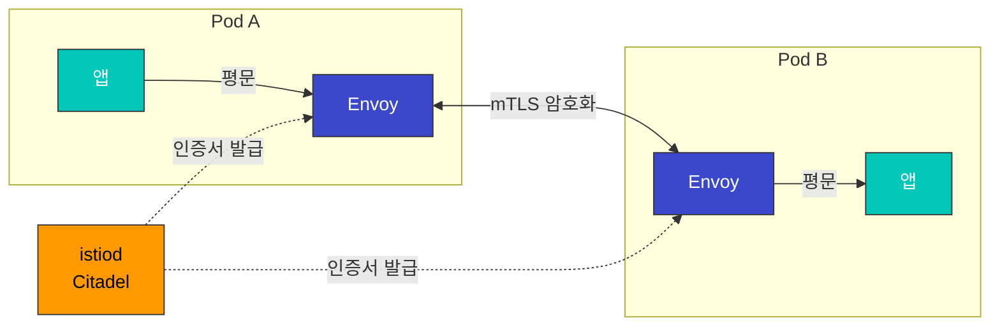

**mTLS 모드**:
- **STRICT**: mTLS만 허용
- **PERMISSIVE**: mTLS와 평문 모두 허용 (마이그레이션용)
- **DISABLE**: mTLS 비활성화

### 인증 및 권한 부여

```yaml
# JWT 인증
apiVersion: security.istio.io/v1
kind: RequestAuthentication
metadata:
  name: jwt-auth
spec:
  jwtRules:
  - issuer: "https://accounts.google.com"
    jwksUri: "https://www.googleapis.com/oauth2/v3/certs"
---
# 권한 부여 정책
apiVersion: security.istio.io/v1
kind: AuthorizationPolicy
metadata:
  name: require-jwt
spec:
  action: DENY
  rules:
  - from:
    - source:
        notRequestPrincipals: ["*"]
```

## 관찰성 개념

Istio는 자동으로 메트릭, 로그, 트레이스를 생성합니다.

### 자동 생성되는 메트릭

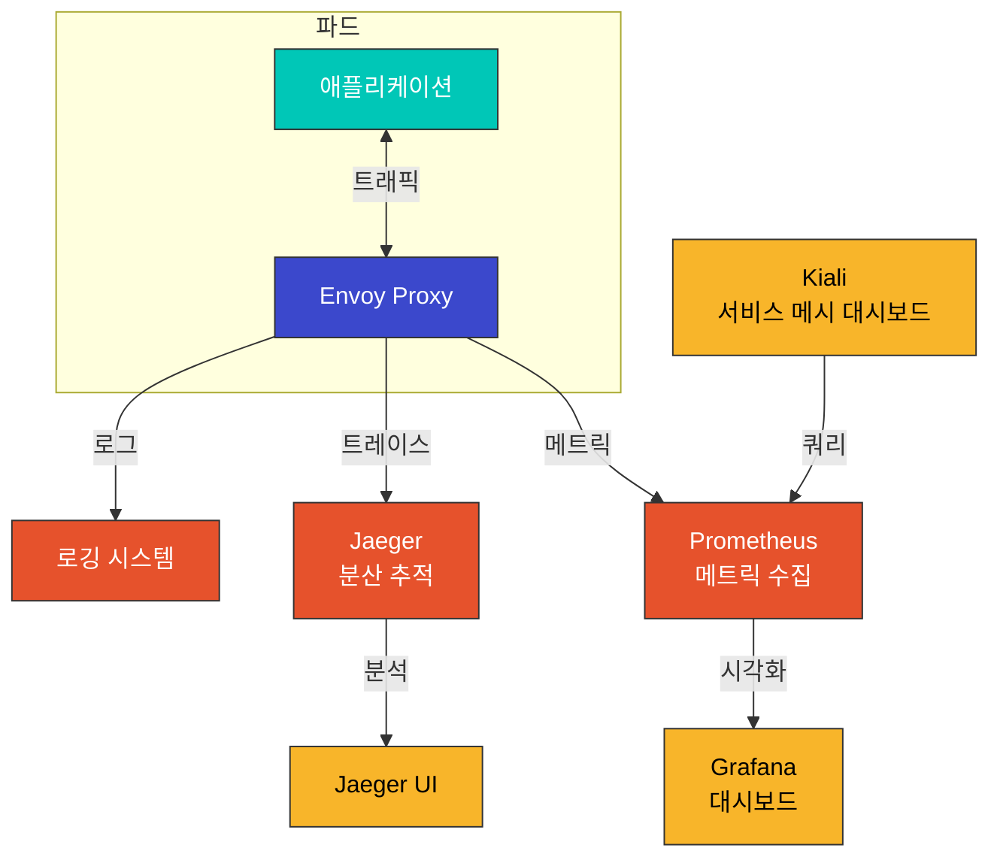

### 주요 메트릭

| 메트릭 | 설명 |
|-------|------|
| `istio_requests_total` | 총 요청 수 |
| `istio_request_duration_milliseconds` | 요청 지연 시간 |
| `istio_request_bytes` | 요청 크기 |
| `istio_response_bytes` | 응답 크기 |
| `istio_tcp_connections_opened_total` | TCP 연결 수 |

### 분산 추적

```yaml
# Envoy에서 추적 활성화
apiVersion: install.istio.io/v1alpha1
kind: IstioOperator
spec:
  meshConfig:
    enableTracing: true
    defaultConfig:
      tracing:
        sampling: 100.0  # 100% 샘플링
        zipkin:
          address: jaeger-collector.istio-system:9411
```

## 네임스페이스와 서비스 메시

### 네임스페이스 격리

```yaml
# 네임스페이스별 mTLS 정책
apiVersion: security.istio.io/v1
kind: PeerAuthentication
metadata:
  name: default
  namespace: production
spec:
  mtls:
    mode: STRICT
---
# 네임스페이스별 권한 정책
apiVersion: security.istio.io/v1
kind: AuthorizationPolicy
metadata:
  name: deny-all
  namespace: production
spec:
  action: DENY
  rules:
  - {}
```

### 서비스 메시 범위

```bash
# 특정 네임스페이스만 메시에 포함
kubectl label namespace default istio-injection=enabled
kubectl label namespace staging istio-injection=enabled

# 특정 네임스페이스 제외
kubectl label namespace kube-system istio-injection=disabled
```

### 멀티 테넌시

```yaml
# Sidecar 리소스로 메시 범위 제한
apiVersion: networking.istio.io/v1
kind: Sidecar
metadata:
  name: default
  namespace: production
spec:
  egress:
  - hosts:
    - "production/*"  # production 네임스페이스만 접근 가능
    - "istio-system/*"
```

## VM 워크로드 등록

Istio는 Kubernetes 파드뿐만 아니라 **Virtual Machine (VM) 워크로드**도 서비스 메시에 등록할 수 있습니다. 이를 통해 레거시 애플리케이션이나 클러스터 외부의 서비스도 Istio의 트래픽 관리, 보안, 관찰성 기능을 활용할 수 있습니다.

### VM 워크로드가 필요한 이유

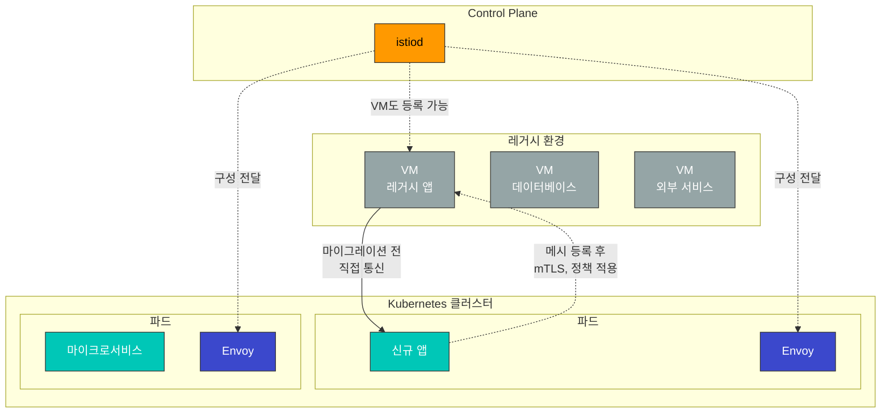

**사용 시나리오**:
- 레거시 애플리케이션의 점진적 마이그레이션
- 데이터베이스 서버를 메시에 포함
- 클러스터 외부의 서비스 통합
- 하이브리드 클라우드 환경 구성

### VM 등록 아키텍처

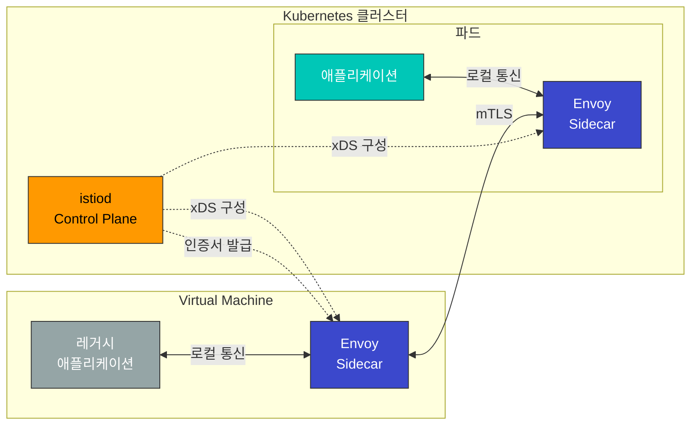

### WorkloadEntry 리소스

VM 워크로드는 **WorkloadEntry** 리소스로 등록합니다.

```yaml
apiVersion: networking.istio.io/v1
kind: WorkloadEntry
metadata:
  name: legacy-database
  namespace: default
spec:
  address: 192.168.1.100  # VM의 IP 주소
  labels:
    app: mysql
    version: v5.7
  serviceAccount: database-sa
  ports:
    mysql: 3306
```

**WorkloadEntry 주요 필드**:
- `address`: VM의 IP 주소
- `labels`: 서비스 선택자와 매칭
- `serviceAccount`: mTLS 인증을 위한 서비스 계정
- `ports`: 노출할 포트 정의

### ServiceEntry와 통합

WorkloadEntry는 ServiceEntry와 함께 사용하여 VM 서비스를 메시에 등록합니다.

```yaml
# ServiceEntry로 서비스 정의
apiVersion: networking.istio.io/v1
kind: ServiceEntry
metadata:
  name: legacy-database
spec:
  hosts:
  - database.legacy.com
  ports:
  - number: 3306
    name: mysql
    protocol: TCP
  location: MESH_INTERNAL  # 메시 내부 서비스로 등록
  resolution: STATIC
  workloadSelector:
    labels:
      app: mysql
---
# WorkloadEntry로 VM 인스턴스 등록
apiVersion: networking.istio.io/v1
kind: WorkloadEntry
metadata:
  name: mysql-vm-1
  namespace: default
spec:
  address: 192.168.1.100
  labels:
    app: mysql
    version: v5.7
  serviceAccount: mysql-sa
```

### VM 등록 vs Multi-Cluster 비교

| 기능 | VM 워크로드 등록 | Multi-Cluster | Kubernetes 파드 |
|------|----------------|---------------|----------------|
| **워크로드 위치** | 클러스터 외부 VM | 다른 Kubernetes 클러스터 | 클러스터 내부 |
| **Envoy 설치** | 수동 설치 | 자동 (사이드카) | 자동 (사이드카) |
| **등록 방법** | WorkloadEntry | ServiceEntry + EndpointSlice | Service + Pod |
| **mTLS** | 지원 | 지원 | 지원 |
| **서비스 디스커버리** | 수동 (IP 지정) | 자동 | 자동 |
| **사용 시나리오** | 레거시 앱, DB | 멀티 클라우드, 재해 복구 | 클라우드 네이티브 앱 |
| **운영 복잡도** | 높음 | 중간 | 낮음 |

### VM 등록의 이점

#### 1. 점진적 마이그레이션

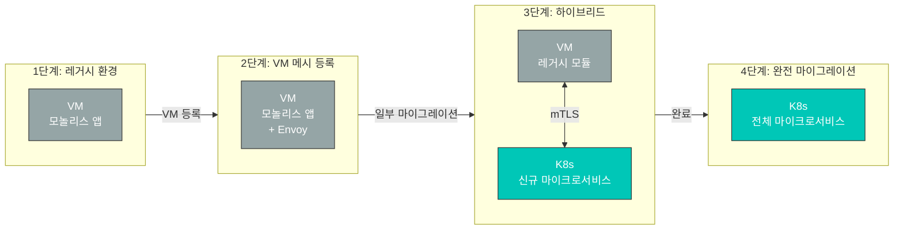

**이점**:
- 기존 VM 애플리케이션을 수정하지 않고 메시에 통합
- 단계적으로 Kubernetes로 마이그레이션
- 마이그레이션 중에도 일관된 보안 및 관찰성 유지

#### 2. 통합된 보안 정책

```yaml
# VM과 파드 모두에 적용되는 mTLS 정책
apiVersion: security.istio.io/v1
kind: PeerAuthentication
metadata:
  name: default
  namespace: default
spec:
  mtls:
    mode: STRICT  # VM과 파드 모두 mTLS 강제
---
# VM 데이터베이스 접근 제어
apiVersion: security.istio.io/v1
kind: AuthorizationPolicy
metadata:
  name: database-access
  namespace: default
spec:
  selector:
    matchLabels:
      app: mysql  # WorkloadEntry의 레이블
  action: ALLOW
  rules:
  - from:
    - source:
        principals: ["cluster.local/ns/default/sa/app-sa"]
    to:
    - operation:
        methods: ["*"]
```

#### 3. 일관된 관찰성

VM 워크로드도 Kubernetes 파드와 동일한 메트릭, 로그, 분산 추적을 제공합니다.

```promql
# VM과 파드의 통합 메트릭 조회
sum(rate(istio_requests_total{destination_workload="mysql-vm-1"}[5m]))

# VM에서 발생한 에러율
sum(rate(istio_requests_total{destination_workload="mysql-vm-1",response_code="500"}[5m]))
/
sum(rate(istio_requests_total{destination_workload="mysql-vm-1"}[5m]))
```

### VM 등록 제약사항

1. **수동 Envoy 설치**: VM에 Envoy 프록시를 수동으로 설치하고 구성해야 함
2. **네트워크 연결**: VM과 Kubernetes 클러스터 간 네트워크 연결 필요
3. **인증서 관리**: VM에 서비스 계정 인증서를 배포해야 함
4. **운영 부담**: VM의 Envoy 버전 관리 및 업데이트 필요
5. **자동 확장 제한**: Kubernetes의 HPA와 같은 자동 확장 불가

### 실제 사용 예시

#### 시나리오: 레거시 데이터베이스 통합

```yaml
# 1. ServiceEntry로 데이터베이스 서비스 정의
apiVersion: networking.istio.io/v1
kind: ServiceEntry
metadata:
  name: legacy-postgres
  namespace: production
spec:
  hosts:
  - postgres.production.svc.cluster.local
  addresses:
  - 240.240.1.10  # 가상 IP
  ports:
  - number: 5432
    name: postgresql
    protocol: TCP
  location: MESH_INTERNAL
  resolution: STATIC
  workloadSelector:
    labels:
      app: postgres
      tier: database
---
# 2. WorkloadEntry로 VM 인스턴스 등록
apiVersion: networking.istio.io/v1
kind: WorkloadEntry
metadata:
  name: postgres-vm-1
  namespace: production
spec:
  address: 10.0.1.100  # 실제 VM IP
  labels:
    app: postgres
    tier: database
    version: v13
  serviceAccount: postgres-sa
  ports:
    postgresql: 5432
---
# 3. 접근 제어 정책
apiVersion: security.istio.io/v1
kind: AuthorizationPolicy
metadata:
  name: postgres-access-control
  namespace: production
spec:
  selector:
    matchLabels:
      app: postgres
  action: ALLOW
  rules:
  - from:
    - source:
        namespaces: ["production"]
        principals: ["cluster.local/ns/production/sa/api-service"]
    to:
    - operation:
        ports: ["5432"]
```

**결과**:
- Kubernetes 파드는 `postgres.production.svc.cluster.local`로 데이터베이스 접근
- VM과 파드 간 자동 mTLS 암호화
- 접근 제어 정책 적용
- 메트릭 및 분산 추적 자동 수집

### 워크로드 등록 비교 요약

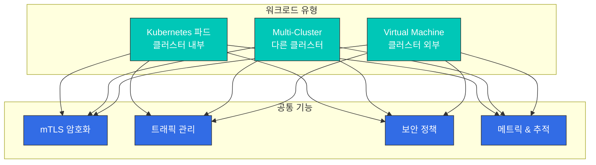

Istio의 유연한 워크로드 등록 기능을 통해:
- **Kubernetes 파드**: 클라우드 네이티브 애플리케이션
- **Multi-Cluster**: 멀티 클라우드, 지역 분산, 재해 복구
- **Virtual Machine**: 레거시 앱, 데이터베이스, 하이브리드 환경

모든 워크로드에 일관된 보안, 트래픽 관리, 관찰성 기능을 제공합니다.

## 다음 단계

이제 Istio의 기본 개념을 이해했습니다. 다음 문서를 통해 실제 사용 방법을 학습하세요:

### 핵심 기능

1. **[Traffic Management](traffic-management/README.md)**
   - Gateway와 VirtualService 사용법
   - DestinationRule과 서브셋 정의
   - ServiceEntry와 WorkloadEntry (VM 등록)
   - 고급 라우팅 패턴 (Canary, A/B 테스트)
   - Traffic Mirroring 및 Shadowing

2. **[Security](security/README.md)**
   - mTLS 구성 및 PeerAuthentication
   - 인증 (RequestAuthentication, JWT)
   - 권한 부여 (AuthorizationPolicy)
   - 보안 정책 관리
   - 외부 인증 통합

3. **[Observability](observability/README.md)**
   - 메트릭 수집 (Prometheus)
   - 분산 추적 (Jaeger, Zipkin)
   - 로깅 구성
   - Kiali 서비스 메시 시각화
   - Grafana 대시보드

4. **[Resilience](resilience/README.md)**
   - Circuit Breaker 패턴
   - Retry 및 Timeout 설정
   - Rate Limiting
   - Outlier Detection
   - Fault Injection 테스트

### 고급 주제

5. **[Advanced Topics](advanced/README.md)**
   - Ambient Mode (사이드카 없는 메시)
   - Multi-Cluster 구성
   - EnvoyFilter 커스터마이징
   - DNS Proxy 및 Caching
   - VM 워크로드 상세 구성
   - WASM 플러그인 개발

## 참고 자료

- [Istio 공식 문서 - 개념](https://istio.io/latest/docs/concepts/)
- [Istio 공식 문서 - 트래픽 관리](https://istio.io/latest/docs/concepts/traffic-management/)
- [Istio 공식 문서 - 보안](https://istio.io/latest/docs/concepts/security/)
- [Istio 공식 문서 - 관찰성](https://istio.io/latest/docs/concepts/observability/)
- [Envoy 프록시 공식 문서](https://www.envoyproxy.io/docs/envoy/latest/)
