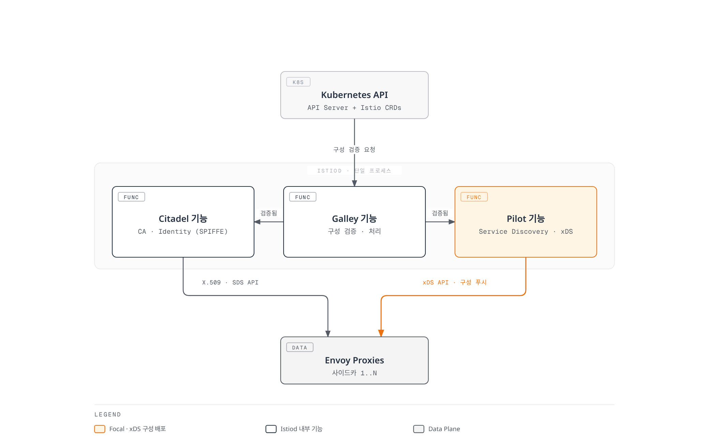
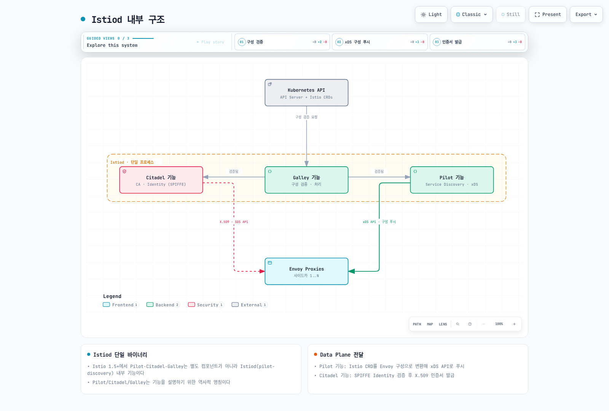
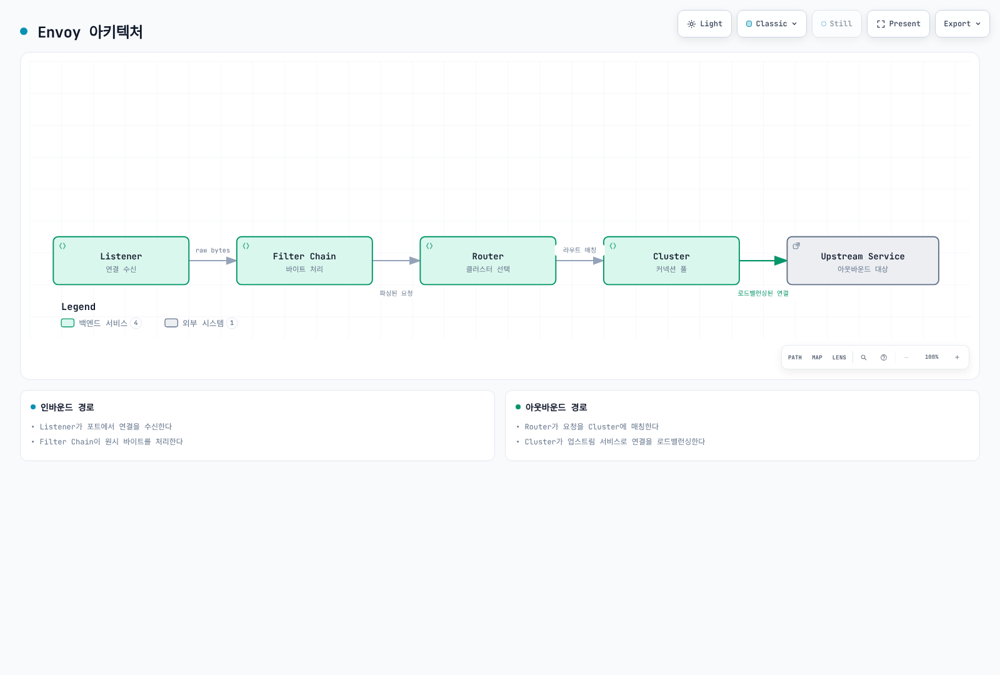
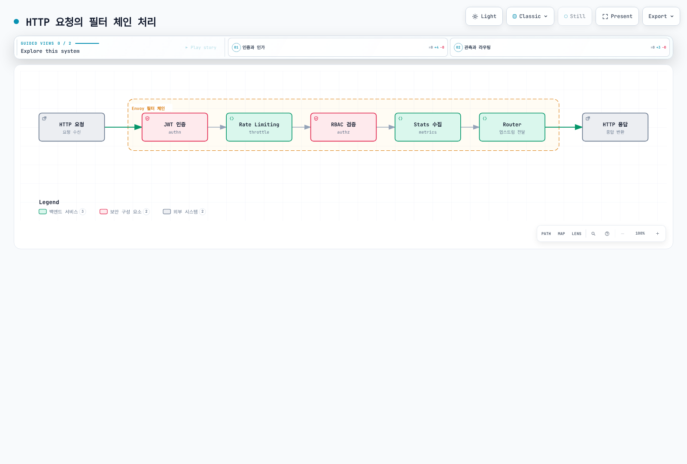
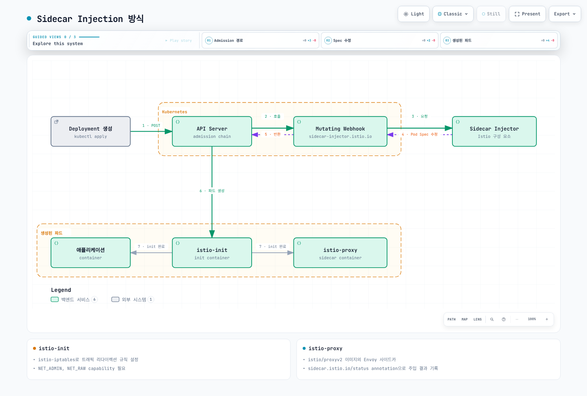
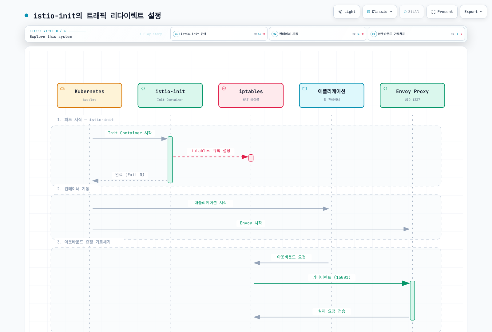
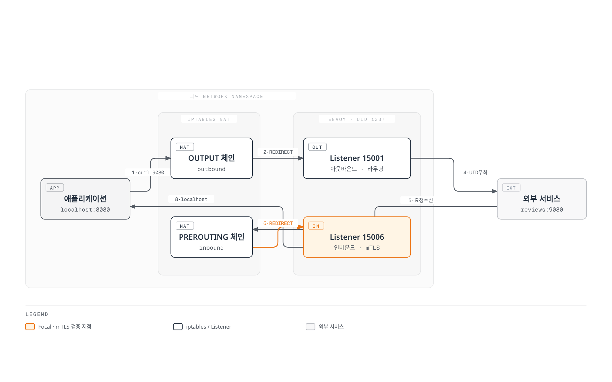
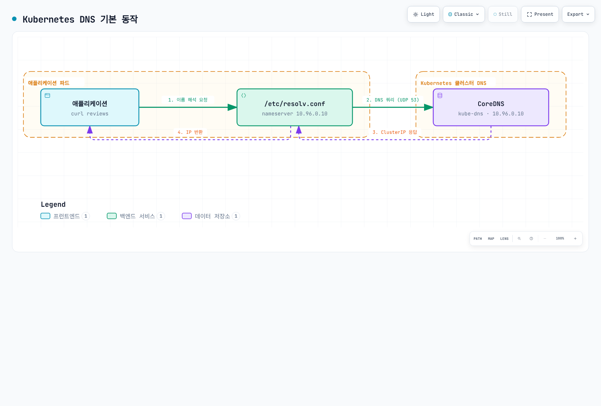
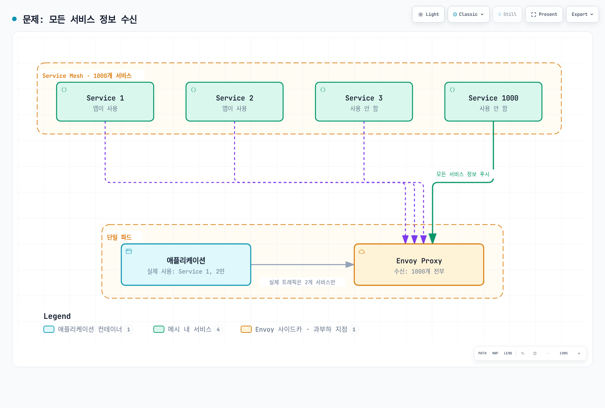

# 아키텍처

> **검토 버전**: Istio 1.31.0 **API 버전**: `networking.istio.io/v1`, `security.istio.io/v1` **마지막 업데이트**: 2026년 9월 11일

Istio의 내부 아키텍처와 네트워킹 메커니즘을 심층적으로 다룹니다.

**배경 및 역사**는 [기본 개념](02-basic-concepts.md#배경과-역사) 문서를 참고하세요.

**중요 변경사항 (Istio 1.5+)**:

* Pilot, Citadel, Galley는 별도 컴포넌트가 **아닙니다**
* Istiod라는 **단일 바이너리**(`pilot-discovery`)로 통합되었습니다
* Pilot/Citadel/Galley 용어는 **기능을 설명하기 위한 역사적 명칭**입니다

## 목차

이 장은 주로 Sidecar 모드를 설명합니다. Ambient는 노드별 Rust 기반 ztunnel과 선택적 L7 waypoint를 사용하며 트래픽 가로채기와 DNS 경로가 다릅니다. Mixer는 istiod로 통합된 것이 아니라 퇴역하고 텔레메트리가 프록시로 이동했습니다. 아래 JSON과 주입된 파드 예시는 구조 설명용이며 완전한 배포 매니페스트가 아닙니다.

1. [Istio 아키텍처 개요](03-architecture.md#istio-아키텍처-개요)
2. [Control Plane: Istiod](03-architecture.md#control-plane-istiod)
3. [Data Plane: Envoy Proxy](03-architecture.md#data-plane-envoy-proxy)
4. [Sidecar Injection 메커니즘](03-architecture.md#sidecar-injection-메커니즘)
5. [iptables와 트래픽 가로채기](03-architecture.md#iptables와-트래픽-가로채기)
6. [DNS 처리 메커니즘](03-architecture.md#dns-처리-메커니즘)
7. [xDS API 통신](03-architecture.md#xds-api-통신)
8. [Sidecar 리소스를 통한 최적화](03-architecture.md#sidecar-리소스를-통한-최적화)

## Istio 아키텍처 개요

### 전체 구조



[🔍 인터랙티브 다이어그램 보기](https://www.atomai.click/kubernetes-docs/archmaps/ko-service-mesh-istio-03-architecture-0.html)

### Control Plane vs Data Plane

| 구분      | Control Plane (Istiod) | Data Plane (Envoy) |
| ------- | ---------------------- | ------------------ |
| **역할**  | 정책 관리, 구성 배포           | 실제 트래픽 처리          |
| **위치**  | 별도 파드 (일반적으로 1-3개)     | 모든 애플리케이션 파드       |
| **언어**  | Go                     | C++                |
| **부하**  | 낮음                     | 높음 (모든 트래픽)        |
| **확장성** | 수평 확장 (HA)             | 자동 (파드당 1개)        |

## Control Plane: Istiod

### Istiod 내부 구조

**중요**: Istio 1.5 이후 Pilot, Citadel, Galley는 **별도 컴포넌트가 아닌 Istiod 내부 기능**입니다.



[🔍 인터랙티브 다이어그램 보기](https://www.atomai.click/kubernetes-docs/archmaps/ko-service-mesh-istio-03-architecture-10.html)

### Istiod의 주요 기능

**참고**: 아래 기능들은 Istio 1.31에서 Istiod 내부에 통합되어 있습니다. 역사적 명칭(Pilot, Citadel, Galley)은 기능을 설명하기 위해 사용됩니다.

#### 1. Service Discovery (Pilot 기능)

```yaml
# Kubernetes Service 감지
apiVersion: v1
kind: Service
metadata:
  name: reviews
spec:
  selector:
    app: reviews
  ports:
  - port: 9080
```

Istiod는 다음을 추적합니다:

* Kubernetes Service
* EndpointSlice (파드 IP)
* Pod 상태 변화
* 외부 서비스 (ServiceEntry)

#### 2. Traffic Management (Pilot 기능)

Istio CRD를 Envoy 구성으로 변환:

```yaml
# VirtualService (사용자 정의)
apiVersion: networking.istio.io/v1
kind: VirtualService
metadata:
  name: reviews
spec:
  hosts:
  - reviews
  http:
  - route:
    - destination:
        host: reviews
        subset: v1
      weight: 90
    - destination:
        host: reviews
        subset: v2
      weight: 10
```

↓ Istiod가 Envoy 구성으로 변환 ↓

```json
{
  "match": {"prefix": "/"},
  "route": {
    "weighted_clusters": {
      "clusters": [
        {"name": "outbound|9080|v1|reviews.default.svc.cluster.local", "weight": 90},
        {"name": "outbound|9080|v2|reviews.default.svc.cluster.local", "weight": 10}
      ]
    }
  }
}
```

#### 3. Certificate Management (Citadel 기능)

Istio 에이전트가 키와 CSR을 생성하고 istiod에 인증해 서명된 인증서를 받습니다. Envoy는 로컬 에이전트의 SDS에서 인증서와 키를 받습니다. 유효 기간은 설정 가능하며 만료 전에 갱신됩니다.

**SPIFFE ID 형식**:

```
spiffe://cluster.local/ns/default/sa/reviews
```

#### 4. Configuration Validation (Galley 기능)

Admission 검증은 스키마와 개별 설정 제약을 확인합니다. 리소스 간 참조는 `istioctl analyze`로 검사하며 존재하지 않는 destination이 항상 admission webhook에서 거부되는 것은 아닙니다. 아래 예제는 없는 Gateway를 참조합니다:

```yaml
# invalid-vs.yaml
apiVersion: networking.istio.io/v1
kind: VirtualService
metadata:
  name: invalid
spec:
  hosts:
  - reviews
  gateways:
  - missing-gateway
  http:
  - route:
    - destination:
        host: reviews
```

```bash
istioctl analyze invalid-vs.yaml --use-kube=false
# IST0101: Referenced gateway not found: "missing-gateway"
```

### Istiod 프로세스 구조

**Istio 1.31의 실제 구현**:

```bash
# Inspect the configured binary arguments; no shell in the image is required
kubectl get deployment istiod -n istio-system   -o jsonpath='{.spec.template.spec.containers[?(@.name=="discovery")].args}'
# The discovery container runs pilot-discovery discovery.
```

**주요 포인트**:

* Istiod는 `pilot-discovery`라는 **단일 Go 바이너리**로 실행됩니다
* Pilot, Citadel, Galley는 역사적 역할 명칭이며 현재 코드 패키지 이름을 뜻하지 않습니다
* 모든 기능이 하나의 프로세스 내에서 goroutine으로 실행됩니다

**Istiod가 제공하는 주요 포트**:

| 포트        | 프로토콜  | 용도                       | 기능                |
| --------- | ----- | ------------------------ | ----------------- |
| **15010** | gRPC  | xDS (legacy)             | 이전 버전 호환성         |
| **15012** | gRPC  | xDS over TLS             | 주요 xDS API 엔드포인트  |
| **15014** | HTTP  | Control plane monitoring | 메트릭 및 헬스 체크       |
| **15017** | HTTPS | Webhook                  | 주입 및 구성 검증 |
| **8080**  | HTTP  | Debug                    | 디버깅 인터페이스         |

### Istiod 배포

**고가용성 구성**:

```yaml
# Merge into the existing istioctl install file; do not replace a managed Deployment
apiVersion: install.istio.io/v1alpha1
kind: IstioOperator
spec:
  components:
    pilot:
      k8s:
        hpaSpec:
          minReplicas: 3
          maxReplicas: 5
        resources:
          requests:
            cpu: 500m
            memory: 2Gi
```

**리소스 사용량** (일반적):

* CPU: 0.5 - 2 cores
* Memory: 2 - 4 GB
* 수천 개의 서비스와 파드 처리 가능

## Data Plane: Envoy Proxy

### Envoy 아키텍처



[🔍 인터랙티브 다이어그램 보기](https://www.atomai.click/kubernetes-docs/archmaps/ko-service-mesh-istio-03-architecture-2.html)

### Envoy의 주요 구성 요소

#### 1. Listeners

**포트를 수신하고 연결을 받아들입니다**:

```json
{
  "name": "0.0.0.0_15001",
  "address": {
    "socket_address": {
      "address": "0.0.0.0",
      "port_value": 15001
    }
  },
  "filter_chains": [...]
}
```

**Istio의 기본 Listeners**:

* `0.0.0.0:15001`: 모든 아웃바운드 TCP 트래픽
* `0.0.0.0:15006`: 모든 인바운드 TCP 트래픽
* `0.0.0.0:15021`: Health check
* `0.0.0.0:15090`: Prometheus 메트릭

#### 2. Filters

**요청/응답을 처리하는 플러그인**:



[🔍 인터랙티브 다이어그램 보기](https://www.atomai.click/kubernetes-docs/archmaps/ko-service-mesh-istio-03-architecture-3.html)

#### 3. Clusters

**업스트림 서비스의 논리적 그룹**:

```json
{
  "name": "outbound|9080|v1|reviews.default.svc.cluster.local",
  "type": "EDS",
  "eds_cluster_config": {
    "service_name": "outbound|9080|v1|reviews.default.svc.cluster.local"
  },
  "circuit_breakers": {...},
  "outlier_detection": {...}
}
```

#### 4. Endpoints

**실제 파드 IP 목록**:

```json
{
  "cluster_name": "outbound|9080|v1|reviews",
  "endpoints": [
    {
      "lb_endpoints": [
        {"endpoint": {"address": {"socket_address": {"address": "10.244.1.5", "port_value": 9080}}}},
        {"endpoint": {"address": {"socket_address": {"address": "10.244.2.8", "port_value": 9080}}}}
      ]
    }
  ]
}
```

### Envoy 성능

실제 트래픽 패턴, 구성 크기, 텔레메트리 설정으로 측정하세요. [공식 벤치마크](https://istio.io/latest/docs/ops/deployment/performance-and-scalability/)는 Istio 1.24의 결과이며 공통 RPS/core, 1ms 미만 P99, 메모리 보장값은 없습니다. istiod도 서비스·프록시 수와 구성 변경량으로 산정해야 합니다.

## Sidecar Injection 메커니즘

### Injection 방식



[🔍 인터랙티브 다이어그램 보기](https://www.atomai.click/kubernetes-docs/archmaps/ko-service-mesh-istio-03-architecture-4.html)

Webhook은 Deployment 자체가 아닌 파드 생성 요청을 변경합니다. 주입 활성화 후 기존 파드는 재생성해야 합니다. Istio CNI는 특권 네트워크 설정을 파드의 init 컨테이너 밖으로 옮기며 native sidecar 사용 여부에 따라 생성되는 파드 구조도 달라집니다.

### 원본 vs Injection 후

**원본 Deployment**:

```yaml
apiVersion: apps/v1
kind: Deployment
metadata:
  name: reviews
spec:
  selector:
    matchLabels:
      app: reviews
  template:
    metadata:
      labels:
        app: reviews
    spec:
      containers:
      - name: reviews
        image: reviews:v1
        ports:
        - containerPort: 9080
```

**Injection 후**:

```yaml
apiVersion: v1
kind: Pod
metadata:
  annotations:
    sidecar.istio.io/status: '{"initContainers":["istio-init"],"containers":["istio-proxy"]}'
spec:
  initContainers:
  - name: istio-init
    image: istio/proxyv2:1.31.0
    command: ['istio-iptables', ...]
    securityContext:
      capabilities:
        add: [NET_ADMIN, NET_RAW]
  containers:
  - name: reviews
    image: reviews:v1
    ports:
    - containerPort: 9080
  - name: istio-proxy
    image: istio/proxyv2:1.31.0
    args: ['proxy', 'sidecar', ...]
```

### Sidecar Injection 활성화

#### 자동 주입 (권장)

**Namespace 레벨**:

```bash
# 네임스페이스에 레이블 추가
kubectl label namespace default istio-injection=enabled

# 이후 해당 네임스페이스에 배포되는 모든 파드에 자동으로 사이드카 주입
kubectl apply -f deployment.yaml
```

**Pod 레벨** (Label):

```yaml
apiVersion: v1
kind: Pod
metadata:
  name: example-app
  labels:
    sidecar.istio.io/inject: "true"  # 파드별 주입 활성화
spec:
  containers:
  - name: app
    image: myapp:v1
```

#### 수동 주입

`istioctl kube-inject` 명령어를 사용하여 YAML 파일에 직접 사이드카를 주입합니다.

```bash
# YAML 파일에 사이드카 주입 후 배포
istioctl kube-inject -f deployment.yaml | kubectl apply -f -

# 또는 파일로 저장
istioctl kube-inject -f deployment.yaml -o deployment-injected.yaml
kubectl apply -f deployment-injected.yaml
```

**수동 주입 사용 시나리오**:

* 자동 주입을 사용할 수 없는 환경
* CI/CD 파이프라인에서 명시적으로 제어하고 싶을 때
* 디버깅 목적으로 주입된 YAML을 확인하고 싶을 때

## iptables와 트래픽 가로채기

### istio-init 컨테이너

**역할**: 파드의 네트워크 트래픽을 Envoy Proxy로 리다이렉트하는 iptables 규칙 설정



[🔍 인터랙티브 다이어그램 보기](https://www.atomai.click/kubernetes-docs/archmaps/ko-service-mesh-istio-03-architecture-5.html)

### iptables 규칙 상세

**단순화한 규칙 설명 — 실행할 스크립트가 아님**:

```bash
#!/bin/bash
# istio-iptables 스크립트 (단순화)

# 1. OUTPUT 체인: 애플리케이션의 아웃바운드 트래픽
iptables -t nat -A OUTPUT -p tcp \
  -m owner ! --uid-owner 1337 \
  -j REDIRECT --to-port 15001     # Envoy 아웃바운드 포트

# 2. PREROUTING 체인: 파드로 들어오는 인바운드 트래픽
iptables -t nat -A PREROUTING -p tcp \
  -j REDIRECT --to-port 15006     # Envoy 인바운드 포트

# 3. 제외 규칙
# - localhost 트래픽
iptables -t nat -I OUTPUT -d 127.0.0.1/32 -j RETURN

# - Istiod 통신 (15012)
iptables -t nat -I OUTPUT -p tcp --dport 15012 -j RETURN

# - DNS (53)
iptables -t nat -I OUTPUT -p udp --dport 53 -j RETURN
```

### 트래픽 흐름 (iptables 적용 후)



[🔍 인터랙티브 다이어그램 보기](https://www.atomai.click/kubernetes-docs/archmaps/ko-service-mesh-istio-03-architecture-6.html)

### iptables 규칙 확인

**파드 내부에서 확인**:

일반 istio-proxy는 distroless일 수 있으며 NET_ADMIN 권한이 없습니다. 필요한 도구와 권한이 있는 승인된 노드/파드 네트워크 네임스페이스 디버깅 세션에서만 확인하세요. 아래는 `iptables -t nat -L -n -v`의 출력 예시입니다:

```text
# OUTPUT 체인
Chain OUTPUT (policy ACCEPT)
target     prot opt source     destination
ISTIO_OUTPUT  tcp  --  0.0.0.0/0  0.0.0.0/0

# ISTIO_OUTPUT 상세
Chain ISTIO_OUTPUT (1 references)
RETURN     all  --  0.0.0.0/0  127.0.0.1           # localhost 제외
RETURN     all  --  0.0.0.0/0  0.0.0.0/0           owner UID match 1337  # Envoy 제외
REDIRECT   tcp  --  0.0.0.0/0  0.0.0.0/0           redir ports 15001  # 나머지 리다이렉트

# PREROUTING 체인
Chain PREROUTING (policy ACCEPT)
ISTIO_INBOUND  tcp  --  0.0.0.0/0  0.0.0.0/0

# ISTIO_INBOUND 상세
Chain ISTIO_INBOUND (1 references)
REDIRECT   tcp  --  0.0.0.0/0  0.0.0.0/0           redir ports 15006
```

### Init 컨테이너와 Istio CNI

두 방식 모두 트래픽 리다이렉션을 구성합니다. Istio CNI는 AWS VPC CNI 같은 기본 CNI에 연결되는 특권 노드 DaemonSet이며 이를 대체하는 eBPF CNI가 아닙니다. Sidecar에서는 선택 사항이고 Ambient에서는 필수입니다.

## DNS 처리 메커니즘

### Kubernetes DNS 기본 동작



[🔍 인터랙티브 다이어그램 보기](https://www.atomai.click/kubernetes-docs/archmaps/ko-service-mesh-istio-03-architecture-7.html)

**/etc/resolv.conf** (파드 내부):

```bash
nameserver 10.96.0.10  # kube-dns ClusterIP
search default.svc.cluster.local svc.cluster.local cluster.local
options ndots:5
```

### Envoy의 DNS 처리

**애플리케이션 DNS 조회와 Envoy의 엔드포인트 디스커버리는 서로 다른 동작**입니다:

애플리케이션이 먼저 서비스 이름을 해석합니다. 이후 Envoy가 라우팅 구성과 EDS 엔드포인트로 업스트림을 선택하며 EDS는 애플리케이션의 DNS 조회를 대체하지 않습니다.

**장점**:

* EDS는 Envoy에 엔드포인트를 배포; 앱 DNS는 DNS 캡처가 로컬 응답하지 않으면 설정된 리졸버 사용
* 동적 Endpoint 업데이트
* 고급 라우팅 (버전, 가중치 등)

### DNS Proxy (Sidecar에서 선택 사항)

**Istio 1.8+부터 DNS Proxy 기능 추가**:

Sidecar DNS 프록시는 Istio 에이전트에서 실행되며 istiod가 배포한 로컬 이름 테이블로 응답합니다. DNS 요청마다 istiod에 조회하지 않습니다. 알 수 없는 이름은 `/etc/resolv.conf`의 리졸버로 전달합니다. Ambient DNS 캡처는 1.25부터 기본 활성화입니다. 아래 설정을 설치 파일에 병합하고 해당 Sidecar 워크로드를 재시작하세요.

```yaml
apiVersion: install.istio.io/v1alpha1
kind: IstioOperator
spec:
  meshConfig:
    defaultConfig:
      proxyMetadata:
        ISTIO_META_DNS_CAPTURE: "true"  # DNS Proxy 활성화
```

**동작 방식**:

DNS 캡처 활성화 시: 앱 → Istio 에이전트 DNS 프록시 → 로컬 이름 테이블, 또는 알 수 없는 이름이면 업스트림 리졸버.

**DNS Proxy iptables 규칙**:

```bash
# UDP 53번 포트를 Istio agent DNS proxy로 리다이렉트
iptables -t nat -A OUTPUT -p udp --dport 53 \
  -m owner ! --uid-owner 1337 \
  -j REDIRECT --to-port 15053
```

## xDS API 통신

### xDS Protocol 개요

**xDS**: Discovery Service의 약자로, Envoy의 동적 구성 프로토콜입니다.

LDS, RDS, CDS, EDS는 일반적으로 ADS 스트림을 공유하는 논리적 리소스 유형입니다. Sidecar SDS는 istiod의 다섯 번째 직접 스트림이 아니라 로컬 Istio 에이전트가 제공합니다.

### xDS API 종류

| API     | 이름                 | 역할          | 예시                |
| ------- | ------------------ | ----------- | ----------------- |
| **LDS** | Listener Discovery | 수신 포트 구성    | 15001, 15006      |
| **RDS** | Route Discovery    | HTTP 라우팅 규칙 | VirtualService    |
| **CDS** | Cluster Discovery  | 업스트림 서비스    | DestinationRule   |
| **EDS** | Endpoint Discovery | 파드 IP 목록    | Service Endpoints |
| **SDS** | Secret Discovery   | TLS 인증서     | mTLS 인증서          |

### xDS 통신 흐름

시작 시 에이전트가 ID를 준비하고 istiod로 디스커버리 연결을 중계합니다. Envoy는 수신 구성을 ACK하며 구성이나 엔드포인트 변경 시 istiod가 업데이트를 배포합니다. 인증서는 로컬 에이전트의 SDS로 별도 제공됩니다.

### xDS 통신 확인

**Envoy Admin API로 확인**:

```bash
# Export via istioctl; no curl or shell is required inside the proxy image
istioctl proxy-config all <pod-name> -n default -o json > config-dump.json
jq '.configs[] | select(."@type" | endswith("ListenersConfigDump")) | .dynamic_listeners' config-dump.json
jq '.configs[] | select(."@type" | endswith("ClustersConfigDump")) | .dynamic_active_clusters' config-dump.json
jq '.configs[] | select(."@type" | endswith("RoutesConfigDump")) | .dynamic_route_configs' config-dump.json
```

**istioctl로 확인**:

```bash
# Listener 구성
istioctl proxy-config listeners <pod-name> -n default

# Cluster 구성
istioctl proxy-config clusters <pod-name> -n default

# Endpoint 구성
istioctl proxy-config endpoints <pod-name> -n default

# Route 구성
istioctl proxy-config routes <pod-name> -n default
```

## Sidecar 리소스를 통한 최적화

### 문제: 모든 서비스 정보 수신

기본적으로 각 Envoy는 **메시 전체의 모든 서비스 정보**를 받습니다:



[🔍 인터랙티브 다이어그램 보기](https://www.atomai.click/kubernetes-docs/archmaps/ko-service-mesh-istio-03-architecture-13.html)

**문제점**:

* 메모리 사용량 증가
* CPU 사용량 증가 (구성 처리)
* 네트워크 대역폭 낭비
* Istiod 부하 증가

### 해결책: Sidecar 리소스

**Sidecar 리소스**로 필요한 서비스만 수신하도록 제한:

```yaml
apiVersion: networking.istio.io/v1
kind: Sidecar
metadata:
  name: default
  namespace: default
spec:
  egress:
  - hosts:
    - "./*"  # 같은 네임스페이스의 모든 서비스
    - "istio-system/*"  # istio-system의 모든 서비스
    - "production/reviews.production.svc.cluster.local"  # production 네임스페이스의 reviews만
```

구성 범위 제한과 REGISTRY_ONLY는 아웃바운드 방화벽이 아닙니다. 격리에는 AuthorizationPolicy와 네트워크 정책 집행을 사용하세요. Sidecar 리소스는 Ambient 프록시를 구성하지 않습니다.

### Sidecar 리소스 예제

#### 1. 네임스페이스 구성 범위 제한

```yaml
apiVersion: networking.istio.io/v1
kind: Sidecar
metadata:
  name: default
  namespace: team-a
spec:
  egress:
  - hosts:
    - "team-a/*"  # 자신의 네임스페이스만
    - "istio-system/*"  # 시스템 서비스
    - "shared/*"  # 공유 서비스
```

#### 2. 특정 서비스 구성 가져오기

```yaml
apiVersion: networking.istio.io/v1
kind: Sidecar
metadata:
  name: frontend
  namespace: default
spec:
  workloadSelector:
    labels:
      app: frontend
  egress:
  - port:
      number: 443
      name: https
      protocol: HTTPS
    hosts:
    - "external/*"
  - hosts:
    - "default/reviews.default.svc.cluster.local"
    - "default/ratings.default.svc.cluster.local"
    - "default/details.default.svc.cluster.local"
```

#### 3. 미등록 목적지 탐지

```yaml
apiVersion: networking.istio.io/v1
kind: Sidecar
metadata:
  name: external-only
  namespace: default
spec:
  workloadSelector:
    labels:
      app: batch-job
  egress:
  - hosts:
    - "./*"  # 같은 네임스페이스
  outboundTrafficPolicy:
    mode: REGISTRY_ONLY  # 알려진 Kubernetes 서비스와 ServiceEntry 목적지
```

### Sidecar 리소스 효과

가져오는 서비스 수를 줄이면 구성 크기가 줄고 프록시 메모리와 푸시 작업량을 줄일 수 있습니다. Cluster 수는 포트와 subset에도 영향을 받으므로 서비스 하나가 항상 Envoy Cluster 하나인 것은 아닙니다. 메모리와 푸시 시간 절감은 실제로 측정해야 합니다.

### DNS와 Sidecar 통합

```yaml
apiVersion: networking.istio.io/v1
kind: Sidecar
metadata:
  name: dns-optimized
  namespace: default
spec:
  egress:
  - hosts:
    - "default/reviews.default.svc.cluster.local"
    - "default/ratings.default.svc.cluster.local"
  # 가져오는 서비스 구성 범위 제한
  # DNS 캡처는 별도 설정
```

**결과**:

* 선택한 서비스 구성을 가져오며 DNS 허용 목록이 아님
* `google.com` 등 외부 도메인은 CoreDNS로 전달
* 메모리 및 CPU 절약

## 참고 자료

### 공식 문서

* [Istio Architecture](https://istio.io/latest/docs/ops/deployment/architecture/)
* [Envoy Proxy](https://www.envoyproxy.io/docs/envoy/latest/intro/intro)
* [xDS Protocol](https://www.envoyproxy.io/docs/envoy/latest/api-docs/xds_protocol)
* [SPIFFE](https://spiffe.io/)

### 역사 및 배경

* [Envoy project milestones (CNCF)](https://www.cncf.io/projects/envoy/)
* [Istio Announcement - Google Cloud Blog](https://cloud.google.com/blog/products/gcp/istio-service-mesh-for-microservices)
* [Service Mesh 역사](https://www.nginx.com/blog/what-is-a-service-mesh/)

### 심화 학습

* [Envoy Architecture Overview](https://www.envoyproxy.io/docs/envoy/latest/intro/arch_overview/arch_overview)
* [Istio Performance and Scalability](https://istio.io/latest/docs/ops/deployment/performance-and-scalability/)
* [iptables Tutorial](https://www.frozentux.net/iptables-tutorial/iptables-tutorial.html)

* [Architecture](https://istio.io/latest/docs/ops/deployment/architecture/)
* [DNS Proxying](https://istio.io/latest/docs/ops/configuration/traffic-management/dns-proxy/)
* [Install the Istio CNI node agent](https://istio.io/latest/docs/setup/additional-setup/cni/)
* [Security](https://istio.io/latest/docs/concepts/security/)
* [ReferencedResourceNotFound](https://istio.io/latest/docs/reference/config/analysis/ist0101/)
* [Installing the Sidecar](https://istio.io/latest/docs/setup/additional-setup/sidecar-injection/)
* [Sidecar](https://istio.io/latest/docs/reference/config/networking/sidecar/)
* [Configuration Scoping](https://istio.io/latest/docs/ops/configuration/mesh/configuration-scoping/)
* [Performance and Scalability](https://istio.io/latest/docs/ops/deployment/performance-and-scalability/)
