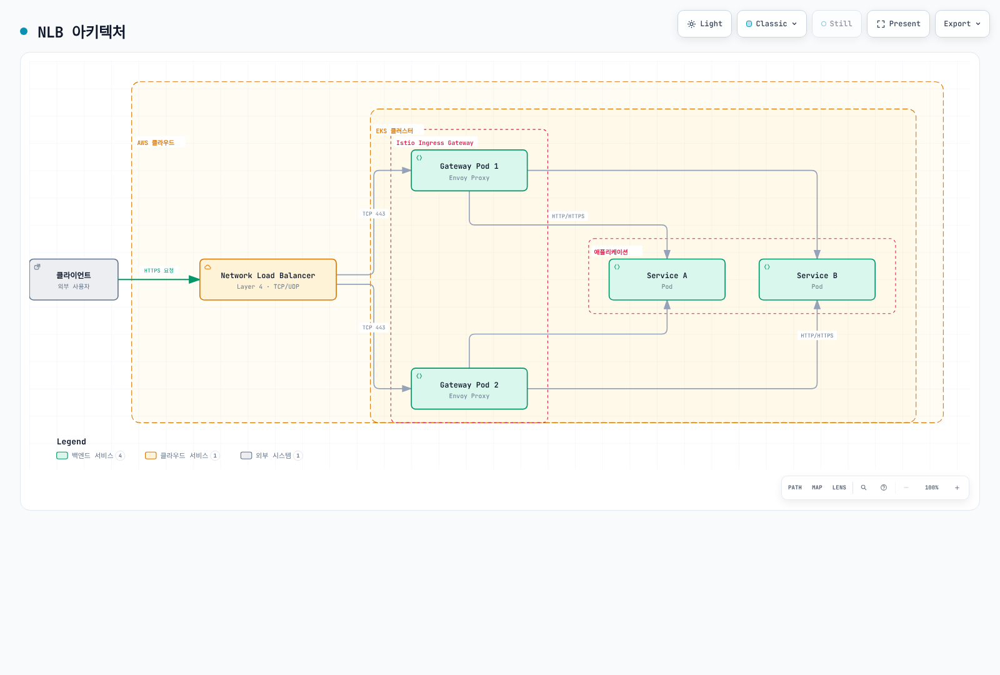
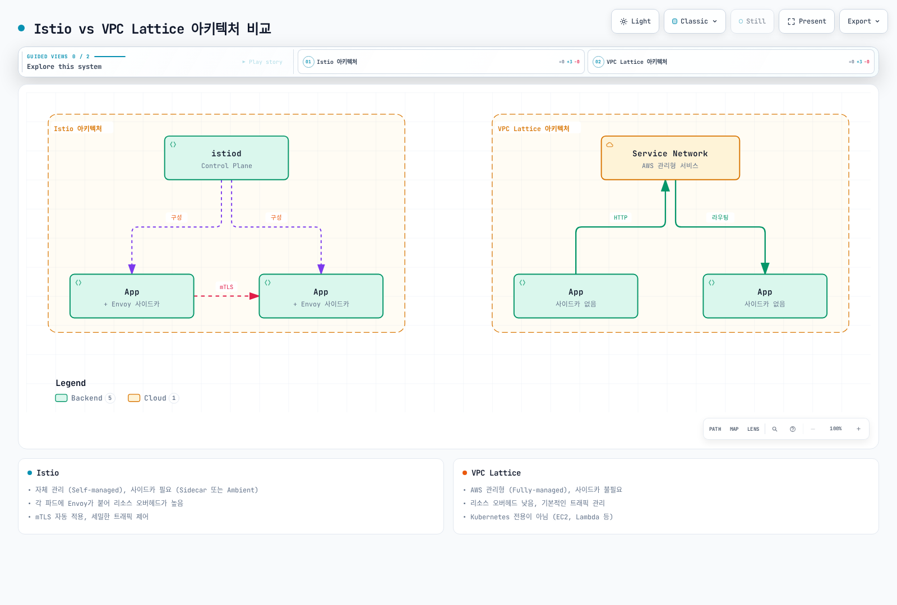
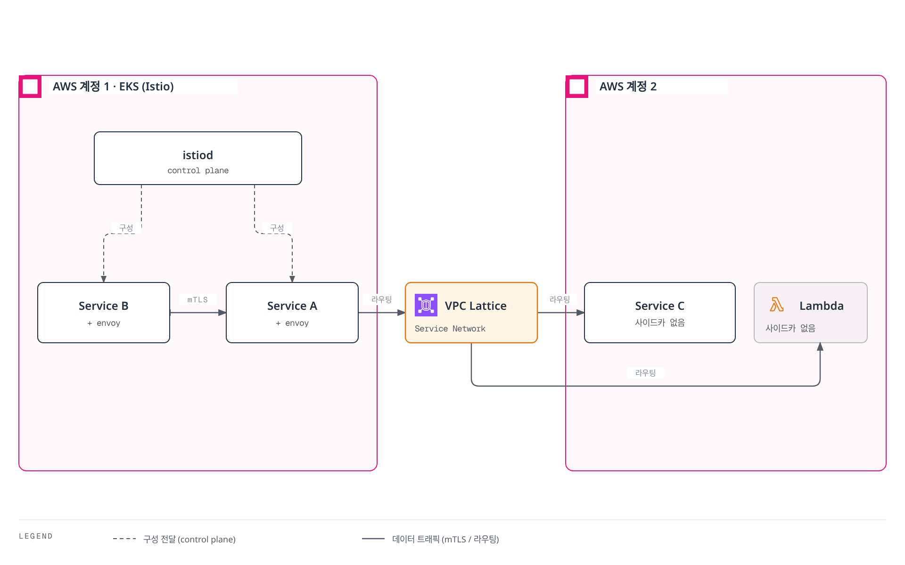

# AWS 통합

이 문서에서는 Amazon EKS 환경에서 Istio를 AWS 서비스와 통합하는 방법을 다룹니다.

## 목차

2026-09-11 기준 Linux EC2 기반 EKS 노드와 AWS Load Balancer Controller를 대상으로 검토했습니다. 아래 NLB 패스스루, ALB 종료, NLB 종료는 대안 구성으로 같은 Service/Gateway에 동시에 적용하지 마세요. [설치 문서](01-installation.md)의 게이트웨이 파드 레이블과 대상 포트에 맞추고 Service 변경은 관리 중인 Helm/istioctl 설정에 병합하세요. EKS Auto Mode는 로드 밸런서 관리 및 지원 annotation이 다르며 Fargate에서는 Istio CNI/ztunnel을 실행할 수 없습니다.

1. [AWS Load Balancer 통합](04-aws-integration.md#aws-load-balancer-통합)
2. [Istio vs 다른 솔루션 비교](04-aws-integration.md#istio-vs-다른-솔루션-비교)
3. [EKS 특화 최적화](04-aws-integration.md#eks-특화-최적화)
4. [모범 사례](04-aws-integration.md#모범-사례)

## AWS Load Balancer 통합

Istio Ingress Gateway를 AWS Load Balancer와 통합하여 외부 트래픽을 처리할 수 있습니다.

### Network Load Balancer (NLB) 통합

NLB는 Layer 4 (TCP/UDP) 로드 밸런서로, 높은 성능과 낮은 지연시간이 필요한 경우 적합합니다.

#### NLB 아키텍처



[🔍 인터랙티브 다이어그램 보기](https://www.atomai.click/kubernetes-docs/archmaps/ko-service-mesh-istio-04-aws-integration-0.html)

#### NLB 설정

**1. AWS Load Balancer Controller 설치**

```bash
# IAM 정책 생성
curl -fsSL -o iam_policy.json https://raw.githubusercontent.com/kubernetes-sigs/aws-load-balancer-controller/v3.5.0/docs/install/iam_policy.json

aws iam create-policy \
    --policy-name AWSLoadBalancerControllerIAMPolicy \
    --policy-document file://iam_policy.json

# IRSA 생성 전에 클러스터 OIDC 프로바이더를 한 번 연결
eksctl utils associate-iam-oidc-provider --cluster my-cluster --approve

# IRSA 설정
eksctl create iamserviceaccount \
  --cluster=my-cluster \
  --namespace=kube-system \
  --name=aws-load-balancer-controller \
  --attach-policy-arn="arn:aws:iam::<AWS_ACCOUNT_ID>:policy/AWSLoadBalancerControllerIAMPolicy" \
  --override-existing-serviceaccounts \
  --approve

# Helm으로 컨트롤러 설치
helm repo add eks https://aws.github.io/eks-charts
helm repo update

helm install aws-load-balancer-controller eks/aws-load-balancer-controller \
  -n kube-system \
  --version 3.5.0 \
  --set clusterName=my-cluster \
  --set region=us-west-2 \
  --set vpcId="<VPC_ID>" \
  --set serviceAccount.create=false \
  --set serviceAccount.name=aws-load-balancer-controller
```

**2. NLB를 사용하는 Istio Ingress Gateway 설정**

```yaml
# istio-ingress-nlb.yaml
apiVersion: v1
kind: Service
metadata:
  name: istio-ingressgateway
  namespace: istio-system
  annotations:
    # NLB 설정
    service.beta.kubernetes.io/aws-load-balancer-type: "external"
    service.beta.kubernetes.io/aws-load-balancer-nlb-target-type: "ip"
    service.beta.kubernetes.io/aws-load-balancer-scheme: "internet-facing"

    # TCP 패스스루: TLS는 Istio에서 종료; 여기에는 ACM TLS 리스너 없음

    # 헬스 체크 설정
    service.beta.kubernetes.io/aws-load-balancer-healthcheck-protocol: "http"
    service.beta.kubernetes.io/aws-load-balancer-healthcheck-port: "15021"
    service.beta.kubernetes.io/aws-load-balancer-healthcheck-path: "/healthz/ready"

    # 추가 설정
    service.beta.kubernetes.io/aws-load-balancer-attributes: "load_balancing.cross_zone.enabled=true"
spec:
  type: LoadBalancer
  selector:
    app: istio-ingressgateway
    istio: ingressgateway
  ports:
  - name: http2
    port: 80
    protocol: TCP
    targetPort: 8080
  - name: https
    port: 443
    protocol: TCP
    targetPort: 8443
```

**3. Gateway 리소스 설정**

```yaml
apiVersion: networking.istio.io/v1
kind: Gateway
metadata:
  name: my-gateway
  namespace: istio-system
spec:
  selector:
    istio: ingressgateway
  servers:
  - port:
      number: 443
      name: https
      protocol: HTTPS
    tls:
      mode: SIMPLE
      credentialName: my-tls-secret
    hosts:
    - "myapp.example.com"
  - port:
      number: 80
      name: http
      protocol: HTTP
    hosts:
    - "myapp.example.com"
    tls:
      httpsRedirect: true
```

#### NLB 장점

* **높은 성능**: 초당 수백만 요청 처리
* **낮은 지연시간**: Layer 4에서 동작하여 빠른 응답
* **고정 IP**: Elastic IP 할당 가능
* **프로토콜 지원**: TCP, UDP, TLS
* **용량 계획**: 연결 수·바이트 사용량을 측정하고 리전별 요금 비교

#### NLB 사용 시나리오

* WebSocket, gRPC 등 장시간 연결이 필요한 경우
* 초당 수백만 요청을 처리해야 하는 경우
* 고정 IP가 필요한 경우
* TLS 종료를 Istio에서 수행하려는 경우

### Application Load Balancer (ALB) 통합

ALB는 Layer 7 (HTTP/HTTPS) 로드 밸런서로, 고급 라우팅 기능이 필요한 경우 적합합니다.

#### ALB 아키텍처

클라이언트 HTTPS는 ALB에서 ACM 인증서로 종료되며 이 예제는 Istio 게이트웨이에 HTTP/1.1을 전달합니다. 이후 Envoy가 애플리케이션으로 라우팅합니다.

#### ALB 설정

**1. Ingress 리소스로 ALB 생성**

```yaml
# istio-ingress-alb.yaml
apiVersion: networking.k8s.io/v1
kind: Ingress
metadata:
  name: istio-ingress
  namespace: istio-system
  annotations:
    # ALB 설정
    alb.ingress.kubernetes.io/scheme: internet-facing
    alb.ingress.kubernetes.io/target-type: ip
    alb.ingress.kubernetes.io/listen-ports: '[{"HTTP": 80}, {"HTTPS": 443}]'
    alb.ingress.kubernetes.io/ssl-redirect: '443'

    # ACM 인증서
    alb.ingress.kubernetes.io/certificate-arn: arn:aws:acm:region:account:certificate/cert-id

    # 헬스 체크
    alb.ingress.kubernetes.io/healthcheck-protocol: HTTP
    alb.ingress.kubernetes.io/healthcheck-port: '15021'
    alb.ingress.kubernetes.io/healthcheck-path: /healthz/ready
    alb.ingress.kubernetes.io/healthcheck-interval-seconds: '15'
    alb.ingress.kubernetes.io/healthcheck-timeout-seconds: '5'
    alb.ingress.kubernetes.io/success-codes: '200'
    alb.ingress.kubernetes.io/healthy-threshold-count: '2'
    alb.ingress.kubernetes.io/unhealthy-threshold-count: '2'

    # 추가 설정
    alb.ingress.kubernetes.io/load-balancer-attributes: idle_timeout.timeout_seconds=60
    alb.ingress.kubernetes.io/target-group-attributes: deregistration_delay.timeout_seconds=30
spec:
  ingressClassName: alb
  rules:
  - host: "myapp.example.com"
    http:
      paths:
      - path: /
        pathType: Prefix
        backend:
          service:
            name: istio-ingressgateway
            port:
              number: 80
```

ALB 구성에서는 게이트웨이 Service를 ClusterIP로 구성해 별도 NLB가 생성되지 않게 하세요. ALB가 TLS를 종료하고 기본적으로 HTTP/1.1을 전달하므로 아래 HTTP Gateway에는 HTTPS 리다이렉트를 넣지 않습니다. 애플리케이션 라우트는 `my-alb-gateway`에 연결한 VirtualService로 정의하세요.

```yaml
apiVersion: networking.istio.io/v1
kind: Gateway
metadata:
  name: my-alb-gateway
  namespace: istio-system
spec:
  selector:
    istio: ingressgateway
  servers:
  - port:
      number: 80
      name: http
      protocol: HTTP
    hosts:
    - "myapp.example.com"
```

**2. 경로 기반 라우팅**

```yaml
apiVersion: networking.k8s.io/v1
kind: Ingress
metadata:
  name: istio-ingress-path-based
  namespace: istio-system
  annotations:
    alb.ingress.kubernetes.io/scheme: internet-facing
    alb.ingress.kubernetes.io/target-type: ip
spec:
  ingressClassName: alb
  rules:
  - host: "api.example.com"
    http:
      paths:
      - path: /v1
        pathType: Prefix
        backend:
          service:
            name: istio-ingressgateway
            port:
              number: 80
  - host: "admin.example.com"
    http:
      paths:
      - path: /
        pathType: Prefix
        backend:
          service:
            name: istio-ingressgateway
            port:
              number: 80
```

#### ALB 장점

* **고급 라우팅**: Path, Header, Query String 기반 라우팅
* **WAF 통합**: AWS WAF로 보안 강화
* **인증 통합**: Cognito, OIDC 통합
* **ACM 통합**: 인증서 자동 관리
* **컨테이너 최적화**: ECS, EKS에 최적화

#### ALB 사용 시나리오

* HTTP/HTTPS 전용 트래픽
* 경로 기반 라우팅이 필요한 경우
* WAF 보안이 필요한 경우
* 여러 도메인을 단일 로드 밸런서에서 처리하는 경우

### NLB vs ALB 비교

| 특성            | NLB                    | ALB                   |
| ------------- | ---------------------- | --------------------- |
| **OSI Layer** | Layer 4 (TCP/UDP)      | Layer 7 (HTTP/HTTPS)  |
| **용량** | 트래픽 및 용량 설정에 따라 다름 | 트래픽 및 용량 설정에 따라 다름 |
| **지연시간**      | 매우 낮음                  | 낮음                    |
| **고정 IP**     | 지원 (Elastic IP)        | 미지원                   |
| **TLS 종료**    | TCP 패스스루 또는 NLB TLS 리스너   | ALB에서 처리 가능           |
| **라우팅**       | IP/Port 기반             | Path, Host, Header 기반 |
| **WAF 통합**    | 불가                     | 가능                    |
| **비용** | NLCU 사용량과 리전 요금 | LCU 사용량과 리전 요금 |
| **WebSocket** | 네이티브 지원                | 지원                    |
| **gRPC**      | 네이티브 지원                | HTTP/2 필요             |
| **권장 사용**     | 높은 성능, WebSocket, gRPC | HTTP 라우팅, WAF, 인증     |

## Istio vs 다른 솔루션 비교

### Istio vs VPC Lattice

VPC Lattice는 AWS의 관리형 애플리케이션 네트워킹 서비스입니다.

#### 아키텍처 비교



[🔍 인터랙티브 다이어그램 보기](https://www.atomai.click/kubernetes-docs/archmaps/ko-service-mesh-istio-04-aws-integration-2.html)

#### 기능 비교

| 특성                  | Istio                   | VPC Lattice             |
| ------------------- | ----------------------- | ----------------------- |
| **관리 주체**           | 자체 관리 (Self-managed)    | AWS 관리형 (Fully-managed) |
| **사이드카**            | Sidecar 모드만 필요; Ambient는 없음 | 불필요                     |
| **리소스 오버헤드**        | Sidecar/Ambient 토폴로지에 따라 다름        | 낮음 (사이드카 없음)            |
| **복잡도**             | 높음                      | 낮음                      |
| **학습 곡선**           | 가파름                     | 완만함                     |
| **트래픽 관리**          | 매우 고급 (세밀한 제어)          | 기본적 (충분한 기능)            |
| **mTLS** | 자동 워크로드 ID/인증서 관리 | TLS 패스스루에서 애플리케이션이 직접 처리 |
| **Observability**   | 풍부한 메트릭, 트레이스           | 기본 메트릭                  |
| **Fault Injection** | 지원                      | 미지원                     |
| **Circuit Breaker** | 세밀한 제어                  | 동등한 Istio 정책 API 없음; 서비스 할당량과는 다름                   |
| **Rate Limiting**   | Local + Global          | 동등한 Istio 정책 API 없음; 서비스 할당량과는 다름                   |
| **Multi-cluster**   | 강력한 지원                  | VPC 간 연결                |
| **크로스 계정**          | 복잡                      | 간단 (네이티브 지원)            |
| **비용**              | 컴퓨팅 비용 (EC2)            | 서비스 사용 비용               |
| **벤더 종속**           | 없음 (오픈소스)               | AWS 종속                  |
| **Kubernetes 전용**   | 아니오 (VM 지원) | 아니오 (EC2, Lambda 등)     |

VPC Lattice TLS 패스스루는 앱 TLS/mTLS를 유지하지만 해당 리스너에서는 IAM ID 기반 인증이나 Lambda 대상을 사용할 수 없습니다. HTTPS 리스너와 TLS 패스스루의 보안 기능을 구분하세요.

#### 언제 Istio를 선택할까?

**Istio가 적합한 경우:**

1. **세밀한 트래픽 제어 필요**
   * Canary 배포, A/B 테스트, Traffic Mirroring
   * 복잡한 라우팅 규칙 (Header, Cookie 기반 등)
   * Fault Injection으로 Chaos Engineering
2. **강력한 보안 요구사항**
   * 서비스 간 자동 mTLS 암호화
   * 세밀한 권한 부여 정책
   * JWT 검증, RBAC
3. **고급 관찰성 필요**
   * 상세한 메트릭 (Latency P50/P95/P99)
   * 분산 추적 (Jaeger, Zipkin)
   * 서비스 토폴로지 시각화 (Kiali)
4. **멀티 클러스터 메시**
   * 여러 EKS 클러스터 간 통신
   * 클러스터 간 페일오버
   * 글로벌 로드 밸런싱
5. **벤더 독립성**
   * 다른 클라우드 또는 온프레미스로 이동 가능성
   * Kubernetes 표준 사용

**예제: Istio의 고급 트래픽 관리**

```yaml
apiVersion: networking.istio.io/v1
kind: VirtualService
metadata:
  name: reviews
spec:
  hosts:
  - reviews
  http:
  # Header 기반 라우팅
  - match:
    - headers:
        user-agent:
          regex: ".*Mobile.*"
    route:
    - destination:
        host: reviews
        subset: mobile-v2
  # Canary 배포 (10%)
  - match:
    - headers:
        x-canary:
          exact: "true"
    route:
    - destination:
        host: reviews
        subset: v3
      weight: 10
    - destination:
        host: reviews
        subset: v2
      weight: 90
  # Traffic Mirroring
  - route:
    - destination:
        host: reviews
        subset: v2
    mirror:
      host: reviews
      subset: v3
    mirrorPercentage:
      value: 100
```

#### 언제 VPC Lattice를 선택할까?

**VPC Lattice가 적합한 경우:**

1. **간단한 서비스 연결**
   * 기본적인 로드 밸런싱과 라우팅만 필요
   * 빠른 구현이 중요
2. **낮은 운영 오버헤드**
   * AWS 관리형 서비스 선호
   * 사이드카 관리 부담 없음
3. **크로스 VPC/계정 통신**
   * 여러 AWS 계정 간 서비스 연결
   * VPC 피어링 없이 통신
4. **혼합 환경**
   * EKS + EC2 + Lambda 혼합 환경
   * Kubernetes만이 아닌 다양한 컴퓨팅 사용
5. **비용 최적화**
   * 사이드카 리소스 비용 절감
   * 작은 규모의 서비스

#### Istio + VPC Lattice 함께 사용하기

두 솔루션은 상호 배타적이지 않으며, 함께 사용할 수 있습니다:



[🔍 인터랙티브 다이어그램 보기](https://www.atomai.click/kubernetes-docs/archmaps/ko-service-mesh-istio-04-aws-integration-3.html)

**사용 사례:**

* **클러스터 내부**: Istio로 세밀한 트래픽 관리와 보안
* **클러스터 간/크로스 계정**: VPC Lattice로 간단한 연결
* **혼합 환경**: Istio 클러스터와 Lambda/EC2 연결에 VPC Lattice 사용

### Istio vs Cilium (eBPF 기반)

Cilium은 eBPF를 사용하는 Kubernetes 네트워킹 및 보안 솔루션입니다.

#### 아키텍처 비교

| 특성         | Istio                | Cilium               |
| ---------- | -------------------- | -------------------- |
| **기술 스택**  | Envoy Proxy (사이드카)   | eBPF (커널 레벨)         |
| **주요 목적**  | Service Mesh         | CNI + Service Mesh   |
| **네트워킹**   | Kubernetes CNI 위에 동작 | CNI 자체를 제공           |
| **성능**     | 좋음                   | 매우 우수 (커널 레벨)        |
| **리소스 사용** | 높음 (사이드카)            | 낮음 (커널 레벨)           |
| **L7 기능**  | 매우 강력                | 기본적                  |
| **관찰성**    | 풍부함                  | Hubble (기본적)         |
| **학습 곡선**  | 가파름                  | 가파름                  |
| **성숙도**    | 높음                   | 중간 (Service Mesh 기능) |

#### 기능 비교

| 기능                     | Istio                     | Cilium                     |
| ---------------------- | ------------------------- | -------------------------- |
| **Network Policy**     | Kubernetes + Istio        | Kubernetes + Cilium (더 강력) |
| **L7 Load Balancing**  | 매우 세밀함                    | 기본적                        |
| **mTLS** | 자동 워크로드 mTLS | 상호 인증과 WireGuard/IPsec 암호화는 별도 |
| **Traffic Management** | 매우 고급                     | 기본적                        |
| **Observability**      | Prometheus, Jaeger, Kiali | Hubble                     |
| **성능**                 | 좋음                        | 우수                         |
| **Multi-cluster**      | 강력함                       | Cluster Mesh               |

#### 언제 무엇을 선택할까?

**Istio 선택:**

* L7 트래픽 관리가 핵심 요구사항
* 강력한 서비스 메시 기능 필요
* 풍부한 관찰성과 디버깅 도구 필요

**Cilium 선택:**

* CNI 교체를 고려 중
* 네트워크 보안이 주 관심사
* 성능 최적화가 중요
* eBPF 기술 활용 원함

**함께 사용:**

* Cilium을 CNI로, Istio를 Service Mesh로 사용 가능
* 단, 기능 중복과 복잡도 증가 고려 필요

## EKS 특화 최적화

VPC CNI Pod ENI trunking과 SecurityGroupPolicy를 함께 쓰는 Ambient 워크로드는 [EKS Ambient 사전 요구사항](https://istio.io/latest/docs/ambient/install/platform-prerequisites/#amazon-elastic-kubernetes-service-eks)을 확인하세요. strict Pod Security Group 모드는 link-local 헬스 프로브를 차단할 수 있습니다. 문서의 standard enforcing mode 또는 exec probe 대안을 검토하고 CNI 모드 변경의 정책 영향을 확인하세요.

### IAM Roles for Service Accounts (IRSA) 통합

EC2 기반 노드에서는 EKS Pod Identity도 AWS API 자격 증명 옵션입니다. Pod Identity Agent와 호환 AWS SDK가 필요하며 IRSA 역할 annotation은 사용하지 않습니다. 두 방식 모두 Istio SPIFFE 워크로드 ID를 대체하지 않습니다.

Istio 워크로드가 AWS 서비스에 안전하게 접근할 수 있도록 IRSA를 설정합니다.

#### IRSA 설정

```bash
# 1. OIDC 프로바이더 생성
eksctl utils associate-iam-oidc-provider \
    --cluster my-cluster \
    --approve

# 2. IAM 정책 생성
cat <<EOF > app-policy.json
{
    "Version": "2012-10-17",
    "Statement": [
        {
            "Effect": "Allow",
            "Action": [
                "s3:GetObject",
                "s3:ListBucket"
            ],
            "Resource": [
                "arn:aws:s3:::my-bucket",
                "arn:aws:s3:::my-bucket/*"
            ]
        }
    ]
}
EOF

aws iam create-policy \
    --policy-name MyAppS3Policy \
    --policy-document file://app-policy.json

# 3. Service Account에 IAM Role 연결
eksctl create iamserviceaccount \
    --cluster my-cluster \
    --namespace default \
    --name my-app-sa \
    --role-name my-app-role \
    --attach-policy-arn "arn:aws:iam::<ACCOUNT_ID>:policy/MyAppS3Policy" \
    --approve
```

#### Istio와 IRSA 사용

```yaml
apiVersion: v1
kind: ServiceAccount
metadata:
  name: my-app-sa
  namespace: default
  annotations:
    eks.amazonaws.com/role-arn: arn:aws:iam::<ACCOUNT_ID>:role/my-app-role
---
apiVersion: apps/v1
kind: Deployment
metadata:
  name: my-app
  namespace: default
spec:
  selector:
    matchLabels:
      app: my-app
  template:
    metadata:
      labels:
        app: my-app
    spec:
      serviceAccountName: my-app-sa  # IRSA 사용
      containers:
      - name: app
        image: my-app:latest
        env:
        - name: AWS_REGION
          value: us-west-2
```

### AWS Certificate Manager (ACM) 통합

ACM 인증서를 Istio Gateway에서 사용하는 방법입니다.

#### NLB에서 TLS 종료

```yaml
apiVersion: v1
kind: Service
metadata:
  name: istio-ingressgateway
  namespace: istio-system
  annotations:
    service.beta.kubernetes.io/aws-load-balancer-type: "external"
    service.beta.kubernetes.io/aws-load-balancer-nlb-target-type: "ip"
    service.beta.kubernetes.io/aws-load-balancer-ssl-cert: "arn:aws:acm:region:account:certificate/cert-id"
    service.beta.kubernetes.io/aws-load-balancer-ssl-ports: "443"
    service.beta.kubernetes.io/aws-load-balancer-backend-protocol: "tcp"
spec:
  type: LoadBalancer
  selector:
    istio: ingressgateway
  ports:
  - name: https
    port: 443
    targetPort: 8080
```

별도 대안 구성입니다. ACM TLS는 NLB에서 끝나며 대상에는 평문 HTTP가 전달됩니다. TLS Gateway 대신 Service 443 포트의 아래 HTTP 리스너를 사용하고 백엔드에 SIMPLE TLS나 HTTPS 리다이렉트를 적용하지 마세요.

```yaml
apiVersion: networking.istio.io/v1
kind: Gateway
metadata:
  name: nlb-terminated-gateway
  namespace: istio-system
spec:
  selector:
    istio: ingressgateway
  servers:
  - port:
      number: 443
      name: http-after-nlb
      protocol: HTTP
    hosts:
    - "myapp.example.com"
```

#### Istio에서 TLS 종료 (ACM Private CA)

```bash
# Generate a private key and CSR locally; clients must trust this private CA
openssl req -new -newkey rsa:2048 -nodes \
  -keyout private-key.pem -out csr.pem \
  -subj '/CN=myapp.example.com' -addext 'subjectAltName=DNS:myapp.example.com'

CA_ARN='arn:aws:acm-pca:region:account:certificate-authority/ca-id'
CERT_ARN=$(aws acm-pca issue-certificate \
  --certificate-authority-arn "$CA_ARN" \
  --csr fileb://csr.pem \
  --signing-algorithm SHA256WITHRSA \
  --validity Value=365,Type=DAYS \
  --query CertificateArn --output text)
aws acm-pca wait certificate-issued \
  --certificate-authority-arn "$CA_ARN" --certificate-arn "$CERT_ARN"
aws acm-pca get-certificate \
  --certificate-authority-arn "$CA_ARN" --certificate-arn "$CERT_ARN" \
  --output json > issued-certificate.json
jq -r '.Certificate + "\n" + .CertificateChain' issued-certificate.json > certificate-chain.pem
kubectl create secret tls my-tls-secret \
  --cert=certificate-chain.pem --key=private-key.pem -n istio-system
```

```yaml
apiVersion: networking.istio.io/v1
kind: Gateway
metadata:
  name: my-gateway
  namespace: istio-system
spec:
  selector:
    istio: ingressgateway
  servers:
  - port:
      number: 443
      name: https
      protocol: HTTPS
    tls:
      mode: SIMPLE
      credentialName: my-tls-secret  # ACM 인증서
    hosts:
    - "myapp.example.com"
```

인증서 발급만으로 Secret이 설치·갱신되지는 않습니다. 갱신 및 Secret 업데이트를 자동화하세요. ACM ARN을 Istio `credentialName`으로 직접 사용할 수 없습니다.

### CloudWatch Container Insights 통합

Istio 메트릭을 CloudWatch로 전송하여 통합 모니터링을 구현합니다.

#### CloudWatch Agent 설정

```bash
# For EC2-backed EKS; OIDC association is required for this IRSA path
kubectl create namespace amazon-cloudwatch --dry-run=client -o yaml | kubectl apply -f -
eksctl create iamserviceaccount \
  --cluster my-cluster --namespace amazon-cloudwatch --name cwagent-prometheus \
  --attach-policy-arn arn:aws:iam::aws:policy/CloudWatchAgentServerPolicy --approve
curl -fsSL -o prometheus-eks.yaml \
  https://raw.githubusercontent.com/aws-samples/amazon-cloudwatch-container-insights/latest/k8s-deployment-manifest-templates/deployment-mode/service/cwagent-prometheus/prometheus-eks.yaml
# Review/pin this manifest; merge the Istio scrape jobs and EMF declarations below before applying
kubectl apply -f prometheus-eks.yaml
kubectl rollout status deployment/cwagent-prometheus -n amazon-cloudwatch
```

Namespace와 ServiceAccount만으로 에이전트가 배포되지는 않습니다. 공식 매니페스트에는 Deployment, RBAC, 마운트된 ConfigMap이 포함됩니다. 배포 도구가 ServiceAccount를 교체하면 IRSA annotation을 보존하세요. 기존 수집기가 있으면 중복 배포 대신 기존 구성을 변경하세요.

#### Prometheus 메트릭 스크래핑

```yaml
# prometheus-config.yaml
apiVersion: v1
kind: ConfigMap
metadata:
  name: prometheus-config
  namespace: amazon-cloudwatch
data:
  prometheus.yaml: |
    global:
      scrape_interval: 1m
      scrape_timeout: 10s

    scrape_configs:
    # Istio Control Plane 메트릭
    - job_name: 'istiod'
      kubernetes_sd_configs:
      - role: pod
        namespaces:
          names:
          - istio-system
      relabel_configs:
      - source_labels: [__meta_kubernetes_pod_label_app, __meta_kubernetes_pod_container_port_name]
        action: keep
        regex: istiod;http-monitoring

    # Envoy 사이드카 메트릭
    - job_name: 'envoy-stats'
      metrics_path: /stats/prometheus
      kubernetes_sd_configs:
      - role: pod
      relabel_configs:
      - source_labels: [__meta_kubernetes_pod_container_port_name]
        action: keep
        regex: '.*-envoy-prom'
```

`prometheus-cwagentconfig`의 `logs.metrics_collected.prometheus.emf_processor.metric_declaration`에 선언을 병합하세요. 스크래핑 ConfigMap만으로 사용자 지정 CloudWatch 메트릭이 게시되지는 않습니다. 매니페스트의 `prometheus_config_path`와 기존 설정을 보존하고 에이전트를 재배포/재시작하세요. 예:

```json
{
  "source_labels": ["job"],
  "label_matcher": "^envoy-stats$",
  "dimensions": [["ClusterName", "job"]],
  "metric_selectors": ["^istio_requests_total$", "^istio_tcp_received_bytes_total$"]
}
```

#### CloudWatch Logs Insights 쿼리

아래 쿼리는 따로 실행합니다. 로그 수집기로 프록시 로그를 전송해야 하며 Prometheus 수집은 액세스 로그를 수집하지 않습니다. 지연 시간 쿼리는 숫자형 `request_duration_ms` JSON 필드를 전제로 합니다 (Envoy `%DURATION%`으로 구성하거나 기존 형식을 먼저 파싱).

```text
# Istio 에러 로그 분석
fields @timestamp, @message
| filter @logStream like /istio-proxy/
| filter @message like /error/
| sort @timestamp desc
| limit 100

```

```text
# 요청 지연시간 분석
fields @timestamp, request_duration_ms
| filter @logStream like /istio-proxy/
| stats avg(request_duration_ms), max(request_duration_ms), pct(request_duration_ms, 95) by bin(5m)
```

### EKS 최적화 설정

#### 1. Pod Resources 최적화

```yaml
# Envoy 사이드카 리소스 최적화
apiVersion: install.istio.io/v1alpha1
kind: IstioOperator
spec:
  meshConfig:
    defaultConfig:
      concurrency: 2  # Envoy 워커 스레드 수이며 Connection Pool 제한이 아님
      proxyMetadata:
        # EKS 최적화
        ISTIO_META_DNS_CAPTURE: "true"
  values:
    global:
      proxy:
        resources:
          requests:
            cpu: 100m
            memory: 128Mi
          limits:
            cpu: 2000m
            memory: 1024Mi
```

#### 2. Cluster Autoscaler 고려

HPA는 replica를 조정하며 Metrics Server와 리소스 요청이 필요합니다. Cluster Autoscaler/Karpenter는 노드를 확장합니다. 차트가 관리하는 기존 HPA를 수정하고 중복 HPA를 만들지 마세요.

```yaml
# Istio Gateway Autoscaling
apiVersion: autoscaling/v2
kind: HorizontalPodAutoscaler
metadata:
  name: istio-ingressgateway
  namespace: istio-system
spec:
  scaleTargetRef:
    apiVersion: apps/v1
    kind: Deployment
    name: istio-ingressgateway
  minReplicas: 2
  maxReplicas: 10
  metrics:
  - type: Resource
    resource:
      name: cpu
      target:
        type: Utilization
        averageUtilization: 80
  - type: Resource
    resource:
      name: memory
      target:
        type: Utilization
        averageUtilization: 80
```

#### 3. Pod Disruption Budget

```yaml
apiVersion: policy/v1
kind: PodDisruptionBudget
metadata:
  name: istio-ingressgateway
  namespace: istio-system
spec:
  minAvailable: 1
  selector:
    matchLabels:
      app: istio-ingressgateway
```

## 모범 사례

### 1. 로드 밸런서 선택 가이드

**NLB 사용:**

* gRPC, WebSocket 등 장시간 연결
* 초당 수백만 요청 처리
* 고정 IP 필요
* TLS 종료를 Istio에서 수행

**ALB 사용:**

* HTTP/HTTPS 전용
* 경로 기반 라우팅
* WAF 보안 필요
* Cognito 인증 통합

### 2. TLS 종료 위치

**로드 밸런서에서 종료:**

* ACM 인증서 자동 갱신
* 관리 용이
* Istio 부하 감소

**Istio에서 종료:**

* 엔드 투 엔드 암호화 필요
* 세밀한 TLS 정책 제어
* mTLS 사용

### 3. 비용 최적화

* **Spot 인스턴스**: Istio Gateway 워크로드에 활용
* **Graviton 인스턴스**: ARM 기반으로 비용 절감
* **리소스 제한**: 사이드카 리소스 적절히 설정
* **Ambient Mode**: 사이드카 오버헤드 제거 고려

### 4. 보안

* **IRSA**: IAM 역할로 AWS 서비스 접근
* **Security Group**: 최소 권한 원칙
* **mTLS**: 서비스 간 암호화 활성화
* **Network Policy**: Amazon VPC CNI, Cilium 또는 Calico에서 정책 집행 활성화 및 플랫폼 지원 확인

### 5. 모니터링

* **CloudWatch**: 통합 로그 및 메트릭
* **X-Ray**: 분산 추적
* **Prometheus + Grafana**: 상세 메트릭
* **Kiali**: 서비스 메시 시각화

## 다음 단계

AWS 통합을 완료했다면 다음 문서를 참고하세요:

1. [**Traffic Management**](traffic-management/README.md): 고급 트래픽 관리 기능
2. [**Security**](security/README.md): mTLS 및 인증/권한 부여
3. [**Observability**](observability/README.md): 메트릭, 로그, 트레이스 수집

## 참고 자료

* [AWS Load Balancer Controller](https://kubernetes-sigs.github.io/aws-load-balancer-controller/)
* [EKS Best Practices - Networking](https://docs.aws.amazon.com/eks/latest/best-practices/networking.html)
* [VPC Lattice Documentation](https://docs.aws.amazon.com/vpc-lattice/)
* [Cilium Documentation](https://docs.cilium.io/)
* [AWS Container Insights](https://docs.aws.amazon.com/AmazonCloudWatch/latest/monitoring/ContainerInsights.html)

* [Annotations](https://kubernetes-sigs.github.io/aws-load-balancer-controller/latest/guide/service/annotations/)
* [Ingress annotations](https://kubernetes-sigs.github.io/aws-load-balancer-controller/latest/guide/ingress/annotations/)
* [v3.5.0](https://github.com/kubernetes-sigs/aws-load-balancer-controller/releases/tag/v3.5.0)
* [AWS Load Balancer Controller chart metadata](https://raw.githubusercontent.com/aws/eks-charts/master/stable/aws-load-balancer-controller/Chart.yaml)
* [Install AWS Load Balancer Controller with Helm - Amazon EKS](https://docs.aws.amazon.com/eks/latest/userguide/lbc-helm.html)
* [TLS listeners for VPC Lattice services - Amazon VPC Lattice](https://docs.aws.amazon.com/vpc-lattice/latest/ug/tls-listeners.html)
* [issue-certificate](https://docs.aws.amazon.com/cli/latest/reference/acm-pca/issue-certificate.html)
* [get-certificate](https://docs.aws.amazon.com/cli/latest/reference/acm-pca/get-certificate.html)
* [ContainerInsights Prometheus Setup](https://docs.aws.amazon.com/AmazonCloudWatch/latest/monitoring/ContainerInsights-Prometheus-Setup.html)
* [Scraping additional Prometheus sources and importing those metrics - Amazon CloudWatch](https://docs.aws.amazon.com/AmazonCloudWatch/latest/monitoring/ContainerInsights-Prometheus-Setup-configure.html)
* [Learn how EKS Pod Identity grants pods access to AWS services - Amazon EKS](https://docs.aws.amazon.com/eks/latest/userguide/pod-identities.html)
* [Limit Pod traffic with Kubernetes network policies - Amazon EKS](https://docs.aws.amazon.com/eks/latest/userguide/cni-network-policy.html)
* [DNS Proxying](https://istio.io/latest/docs/ops/configuration/traffic-management/dns-proxy/)
