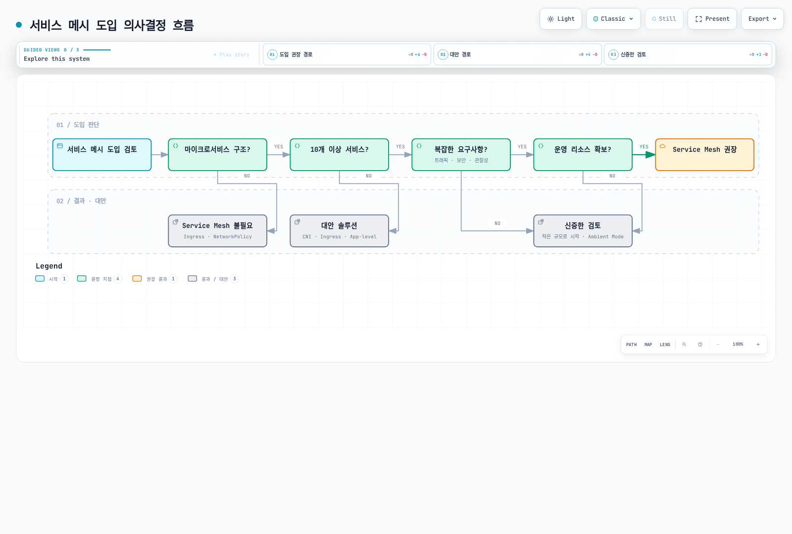
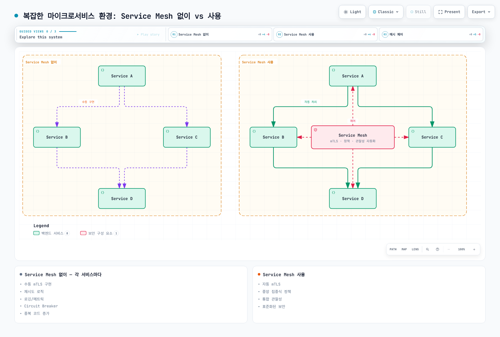
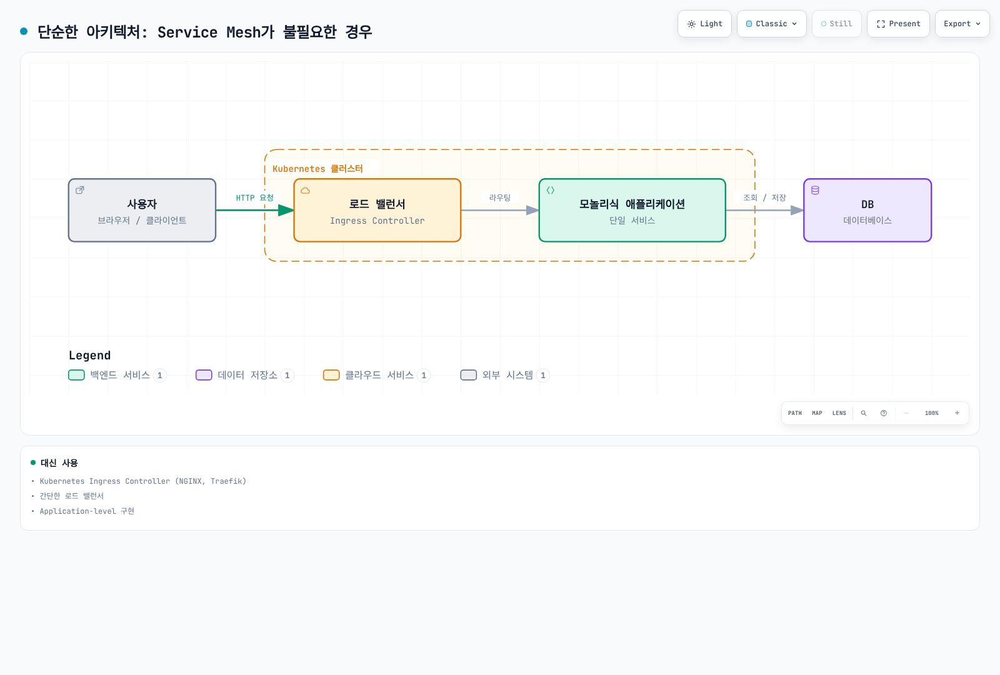
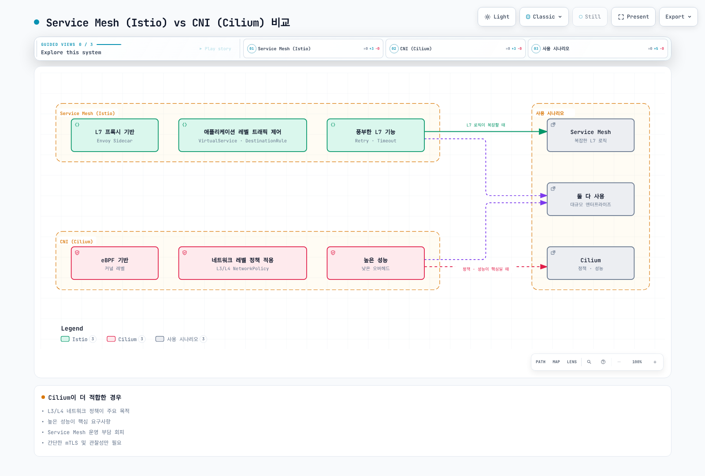
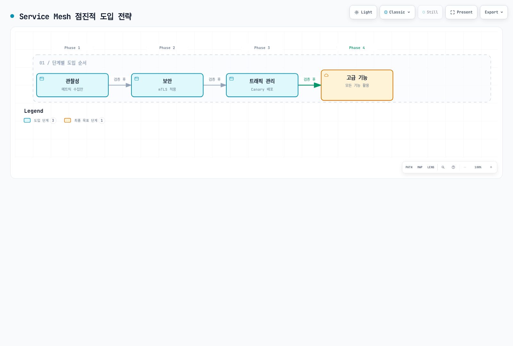
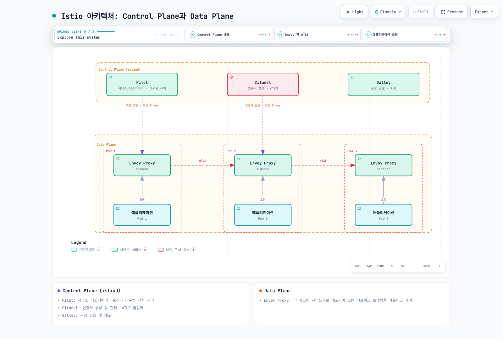

# Istio

> **마지막 업데이트**: 2026년 9월 11일

Amazon EKS에서 Istio Service Mesh를 활용한 실용적인 가이드입니다.

### 2026년 9월 검토: 지원 릴리스

Istio 1.31.0은 GA이며 [릴리스 발표](https://istio.io/latest/news/releases/1.31.x/announcing-1.31/)는 2026년 8월 31일 게시되었습니다. 신규 설치 예제는 1.31.0과 두 제품의 지원 범위가 겹치는 EKS Kubernetes 1.34–1.36을 사용합니다. Istio 1.31은 Kubernetes 1.32–1.36을 지원하며, EKS 표준 지원은 현재 1.34–1.36입니다. 설치 전에 [Istio 지원 매트릭스](https://istio.io/latest/docs/releases/supported-releases/)와 [EKS 버전 수명 주기](https://docs.aws.amazon.com/eks/latest/userguide/kubernetes-versions.html)를 다시 확인하세요.

검토일 기준 Istio 1.30과 1.29도 지원됩니다. 해당 브랜치는 Envoy 취약점, BackendTLSPolicy의 fail-open, EnvoyFilter의 Control Plane 서비스 거부를 수정한 [ISTIO-SECURITY-2026-006](https://istio.io/latest/news/security/istio-security-2026-006/)을 적용하려면 최소 1.30.4 또는 1.29.7이 필요합니다. Istio 1.28은 지원이 종료되었습니다. Istio 1.31 차트는 `https://blob.istio.io/istio-release/charts`를 사용하며 기존 Google 호스팅 저장소에는 신규 릴리스가 게시되지 않습니다.

## 목차

1. [서비스 메시가 정말 필요한가?](#서비스-메시가-정말-필요한가)
2. [설치 및 초기 설정](01-installation.md)
3. [기본 개념](02-basic-concepts.md)
4. [아키텍처](03-architecture.md)
5. [AWS 통합](04-aws-integration.md)
6. [용어집](glossary.md)
7. [Traffic Management (트래픽 관리)](traffic-management/README.md)
8. [Security (보안)](security/README.md)
9. [Observability (관찰성)](observability/README.md)
10. [Resilience (복원력)](resilience/README.md)
11. [Advanced (고급 기능)](advanced/README.md)
12. [Troubleshooting (문제 해결)](troubleshooting/common-errors.md)
13. [모범 사례](best-practices.md)
14. [대안 비교](comparison/README.md)

## Istio란?

Istio는 마이크로서비스를 연결, 보호, 제어 및 관찰하기 위한 오픈 소스 서비스 메시 플랫폼입니다. 복잡한 마이크로서비스 아키텍처에서 서비스 간 통신을 관리하고, 트래픽 제어, 보안, 관찰성을 제공합니다.

### 서비스 메시 개념

<div align="center"></div>

서비스 메시는 마이크로서비스 간의 통신을 관리하는 인프라 계층입니다. Istio는 Envoy 사이드카와 Ambient 모드(노드별 ztunnel 및 선택적 L7 waypoint)를 지원합니다. 프록시는 메시에 등록된 트래픽을 처리하며 제외된 트래픽과 미지원 프로토콜은 적용 범위 밖입니다. 이를 통해 애플리케이션 코드 수정 없이 다음과 같은 기능을 제공합니다:

* **트래픽 라우팅**: 지능형 라우팅, 로드 밸런싱, Canary 배포
* **보안**: 자동 mTLS, 인증, 권한 부여
* **관찰성**: 메트릭, 로그, 분산 추적
* **복원력**: Circuit Breaking, Retry, Timeout

### 실제 사용 예시

<p align="center"><br><em>Istio 없는 일반 애플리케이션</em></p>

<p align="center"><br><em>Istio가 적용된 애플리케이션 - 각 서비스에 Envoy Proxy가 Sidecar로 배포됨</em></p>

위 Bookinfo 그림은 Sidecar 모드를 설명합니다. 자동 주입은 등록된 네임스페이스 또는 워크로드에서 새로 생성되는 파드에 적용되며 Ambient 모드는 사이드카를 주입하지 않습니다.

## 서비스 메시가 정말 필요한가?

아래 서비스 개수와 체크리스트 점수는 논의를 위한 예시이며 Istio 요구사항이 아닙니다. 작은 환경도 보안 요구에 따라 메시가 필요할 수 있습니다. 의사결정 그림의 수치도 예시 기준입니다.

서비스 메시는 강력한 도구이지만, 모든 상황에 적합한 것은 아닙니다. 도입 전에 신중한 검토가 필요합니다.

### 의사결정 흐름



[🔍 인터랙티브 다이어그램 보기](https://www.atomai.click/kubernetes-docs/archmaps/ko-service-mesh-istio-overview-0.html)

### Service Mesh가 필요한 경우 ✅

#### 1. 복잡한 마이크로서비스 환경



[🔍 인터랙티브 다이어그램 보기](https://www.atomai.click/kubernetes-docs/archmaps/ko-service-mesh-istio-overview-1.html)

**권장 기준**:

* ✅ 10개 이상의 마이크로서비스
* ✅ 서비스 간 통신이 빈번함 (East-West 트래픽)
* ✅ 다양한 프로그래밍 언어 사용 (Polyglot)
* ✅ 여러 팀이 독립적으로 서비스 개발

#### 2. Zero Trust 보안 요구사항

**Service Mesh 제공**:

* 서비스 간 자동 mTLS 암호화
* SPIFFE 기반 Identity 관리
* 세밀한 인증/인가 정책
* mTLS를 강제한 메시 트래픽의 암호화; 자동 mTLS만으로는 평문 클라이언트를 차단하지 않음

**대안 없이는 달성 어려움**:

* 각 서비스에 보안 로직 중복 구현
* 인증서 수동 관리의 복잡성
* 일관성 없는 보안 정책

#### 3. 고급 트래픽 관리

```yaml
# Canary 배포 (트래픽 분배)
apiVersion: networking.istio.io/v1
kind: VirtualService
metadata:
  name: reviews
spec:
  hosts:
  - reviews
  http:
  - route:
    - destination:
        host: reviews
        subset: v1
      weight: 90
    - destination:
        host: reviews
        subset: v2
      weight: 10  # 10%만 새 버전으로
```

**필요한 경우**:

* Canary 배포, A/B 테스트
* 헤더/경로 기반 라우팅
* Traffic Mirroring (Shadow Testing)
* Fault Injection (Chaos Engineering)
* Circuit Breaking, Retry, Timeout

#### 4. 통합 관찰성

**Service Mesh 장점**:

* 애플리케이션 코드 수정 없이 자동 메트릭 수집
* 프록시의 추적 span 생성; 요청을 연결하려면 애플리케이션의 추적 헤더 전파 필요
* 통일된 로깅 형식
* 서비스 토폴로지 시각화 (Kiali)

### Service Mesh가 불필요한 경우 ❌

#### 1. 단순한 아키텍처



[🔍 인터랙티브 다이어그램 보기](https://www.atomai.click/kubernetes-docs/archmaps/ko-service-mesh-istio-overview-2.html)

**대신 사용**:

* 유지보수 중인 Kubernetes Gateway API 또는 Ingress 컨트롤러
* 간단한 로드 밸런서
* Application-level 구현

#### 2. 소수의 마이크로서비스 (<10개)

**오버헤드가 더 큼**:

* Service Mesh 운영 복잡도 > 얻는 이점
* 5-10개 서비스는 수동 관리 가능
* CNI가 지원하면 NetworkPolicy로 L3/L4 격리 가능; mTLS나 HTTP 인가는 제공하지 않음

**대안**:

```yaml
# L3/L4 인바운드 격리; NetworkPolicy를 지원하는 CNI 필요
apiVersion: networking.k8s.io/v1
kind: NetworkPolicy
metadata:
  name: allow-frontend-to-backend
spec:
  podSelector:
    matchLabels:
      app: backend
  ingress:
  - from:
    - podSelector:
        matchLabels:
          app: frontend
```

#### 3. 운영 리소스 부족

**Service Mesh 운영 요구사항**:

* Istio/Envoy 전문 지식
* Control Plane 모니터링 및 관리
* 업그레이드 및 패치 관리
* 문제 해결 능력 (디버깅 복잡도 증가)

**팀 준비 필요**:

* 최소 1-2명의 Service Mesh 전문가
* 지속적인 학습 및 업데이트 추적
* 충분한 테스트 환경

#### 4. 성능이 극도로 중요한 경우

**Service Mesh 오버헤드**:

실제 트래픽, 프록시 구성, 텔레메트리 설정으로 지연 시간과 CPU·메모리를 측정하세요. [공식 성능 문서](https://istio.io/latest/docs/ops/deployment/performance-and-scalability/)의 Istio 1.24 벤치마크는 과거의 특정 조건에서 측정한 결과이며 다른 버전이나 워크로드의 보장값이 아닙니다.

**대안 고려**:

* Ambient 모드 (공유 L4 프록시 사용; 절감 효과는 트래픽과 waypoint 배치에 따라 달라짐)
* CNI 기반 솔루션 (Cilium)
* Application-level 최적화

### 대안 솔루션 비교

| 기능            | Service Mesh                              | CNI (Cilium) | Ingress Controller | App-level |
| ------------- | ----------------------------------------- | ------------ | ------------------ | --------- |
| **L7 트래픽 관리** | ✅ 완벽 지원                                   | ⚠️ 제한적       | ⚠️ Ingress만        | ✅ 가능      |
| **mTLS 자동화**  | ✅ 완벽 지원                                   | ⚠️ 상호 인증과 암호화는 별도         | ❌ 미지원              | ❌ 수동 구현   |
| **분산 추적**     | ⚠️ 추적 컨텍스트 전파 필요                                      | ❌ 미지원        | ❌ 미지원              | ⚠️ 수동 구현  |
| **L3/L4 정책**  | ✅ 지원                                      | ✅ 완벽 지원      | ❌ 미지원              | ❌ 미지원     |
| **운영 복잡도**    | 🔴 높음                                     | 🟡 중간        | 🟢 낮음              | 🟡 중간     |
| **리소스 오버헤드**  | <p>🔴 높음 (Sidecar)<br>🟢 낮음 (Ambient)</p> | 🟢 낮음        | 🟢 낮음              | 🟢 없음     |
| **적합한 규모**    | 요구사항에 따라 결정                                   | 모든 규모        | 소규모                | 소규모       |

### CNI 기반 솔루션 (Cilium)

Cilium은 eBPF 기반으로 **네트워크 레벨**에서 많은 기능을 제공합니다:



[🔍 인터랙티브 다이어그램 보기](https://www.atomai.click/kubernetes-docs/archmaps/ko-service-mesh-istio-overview-3.html)

**Cilium이 더 적합한 경우**:

* L3/L4 네트워크 정책이 주요 목적
* 높은 성능이 핵심 요구사항
* Service Mesh 운영 부담 회피
* 네트워크 정책과 관찰성이 주요 목적; Cilium 상호 인증 외에 페이로드 기밀성을 위한 WireGuard/IPsec 암호화 필요

**참고**: [Cilium 문서](../../networking/cilium/README.md)

### 의사결정 체크리스트

도입 전 다음 질문에 답해보세요:

**아키텍처**:

* [ ] 마이크로서비스가 10개 이상인가?
* [ ] 서비스 간 통신이 복잡한가?
* [ ] 여러 프로그래밍 언어를 사용하는가?

**보안**:

* [ ] Zero Trust 보안 모델이 필요한가?
* [ ] 서비스 간 mTLS 암호화가 필수인가?
* [ ] 세밀한 접근 제어가 필요한가?

**트래픽 관리**:

* [ ] Canary 배포, A/B 테스트가 필요한가?
* [ ] 고급 라우팅 규칙이 필요한가?
* [ ] Circuit Breaking, Retry가 많은 서비스에 필요한가?

**관찰성**:

* [ ] 분산 추적이 필수인가?
* [ ] 통합된 메트릭 수집이 필요한가?
* [ ] 서비스 토폴로지 시각화가 필요한가?

**운영**:

* [ ] Service Mesh 전문가가 있는가?
* [ ] 운영 복잡도를 감당할 수 있는가?
* [ ] 리소스 오버헤드를 수용할 수 있는가?

**결과**:

* ✅ 10개 이상 체크: Service Mesh 강력 권장
* 🟡 5-9개 체크: 신중한 평가 필요, 작은 규모로 시작 (Ambient Mode 추천)
* ❌ 4개 이하 체크: 대안 솔루션 고려 (CNI, Ingress, App-level)

### 점진적 도입 전략

Service Mesh가 필요하다고 판단되면, 점진적으로 도입하세요:



[🔍 인터랙티브 다이어그램 보기](https://www.atomai.click/kubernetes-docs/archmaps/ko-service-mesh-istio-overview-4.html)

**권장 순서**:

1. **Pilot 프로젝트** (1-2개 네임스페이스)
2. **관찰성 먼저** (메트릭, 로그, 추적)
3. **보안 적용** (mTLS PERMISSIVE → STRICT)
4. **트래픽 관리** (VirtualService, DestinationRule)
5. **전사 확대**

### 주요 기능

1.  **트래픽 관리**

    VirtualService는 라우트를 선택하고 DestinationRule은 subset과 목적지 트래픽 정책을 정의합니다.

    * 지능형 라우팅 및 로드 밸런싱
    * A/B 테스트, Canary 배포, Blue/Green 배포
    * Circuit Breaking, Retry, Timeout 제어
    * Traffic Mirroring 및 Fault Injection
2.  **보안**

    <div align="center"></div>

    * 서비스 간 자동 mTLS 암호화
    * 강력한 인증 및 권한 부여
    * 세밀한 액세스 제어 정책
    * 네트워크 격리 및 보안 정책
3.  **관찰성**

    <div align="center"></div>

    * 프록시 메트릭과 설정을 통한 액세스 로그·추적 생성
    * Prometheus, Grafana, Jaeger, Kiali 통합
    * 서비스 토폴로지 시각화
    * 실시간 트래픽 모니터링
4. **복원력**
   * Circuit Breaker 패턴
   * Rate Limiting
   * Outlier Detection
   * Zone Aware Routing

### Istio 아키텍처

<div align="center"></div>

Istio는 Control Plane과 Data Plane으로 구성됩니다:



[🔍 인터랙티브 다이어그램 보기](https://www.atomai.click/kubernetes-docs/archmaps/ko-service-mesh-istio-overview-5.html)

**Control Plane (istiod)**:

* 서비스 디스커버리와 프록시 구성 (과거 Pilot의 역할)
* 인증 기관과 ID 관리 (과거 Citadel의 역할)
* 구성 검증; Galley는 퇴역한 독립 구성 요소이며 현재 별도 서비스가 아님

**Data Plane**:

* **Sidecar 모드**: 등록된 파드별 Envoy
* **Ambient 모드**: L4 보안을 위한 노드별 ztunnel과 L7 처리를 위한 선택적 waypoint

### Amazon EKS에서 Istio 사용의 이점

1. **간편한 마이크로서비스 관리**
   * 애플리케이션 코드 수정 없이 트래픽 관리
   * 선언적 구성으로 일관된 정책 적용
   * Kubernetes Native API 사용
2. **강화된 보안**
   * 서비스 간 자동 암호화
   * EKS Pod Identity 또는 IRSA를 통한 AWS API 접근; Istio 워크로드 ID는 Kubernetes 서비스 계정 기반
   * 세밀한 권한 제어
3. **향상된 관찰성**
   * Amazon CloudWatch와 통합
   * AWS X-Ray를 통한 분산 추적
   * 상세한 메트릭 및 로그
4. **AWS 서비스와의 통합**
   * Application Load Balancer (ALB) 통합
   * AWS Certificate Manager (ACM) 통합
   * Amazon EBS CSI Driver와 호환

### 시작하기

[Gateway API guide](https://istio.io/latest/docs/tasks/traffic-management/ingress/gateway-api/)

Istio를 처음 사용하신다면 다음 순서로 문서를 읽어보세요:

1. [**설치 및 초기 설정**](01-installation.md): EKS 클러스터에 Istio 설치
2. [**기본 개념**](02-basic-concepts.md): Istio의 핵심 개념 이해
3. [**Traffic Management**](traffic-management/README.md): Gateway, VirtualService, DestinationRule 학습
4. [**Security**](security/README.md): mTLS, 인증, 권한 부여 설정
5. [**Observability**](observability/README.md): 메트릭, 로그, 트레이스 수집
6. [**모범 사례**](best-practices.md): 프로덕션 환경에서의 권장 사항

### 실습 예제

아래 라우팅 발췌 예제에는 일치하는 Service와 DestinationRule subset(`v1`/`v2`)이 필요합니다. 트래픽 관리 장을 함께 참고하세요.

각 섹션에는 실제로 작동하는 YAML 예제가 포함되어 있습니다. 모든 예제는 다음과 같이 클릭하여 복사할 수 있도록 구성되어 있습니다:

```yaml
# 예제 VirtualService
apiVersion: networking.istio.io/v1
kind: VirtualService
metadata:
  name: reviews
spec:
  hosts:
  - reviews
  http:
  - route:
    - destination:
        host: reviews
        subset: v1
```

### 참고 자료

* [Istio 공식 문서](https://istio.io/latest/docs/)
* [Istio GitHub](https://github.com/istio/istio)
* [Istio EKS 플랫폼 가이드](https://istio.io/latest/docs/setup/platform-setup/amazon-eks/)
* [Istio 커뮤니티](https://istio.io/latest/get-involved/)


* [Tracing and application header propagation](https://istio.io/latest/docs/tasks/observability/distributed-tracing/overview/)
* [Kubernetes NetworkPolicy capabilities](https://kubernetes.io/docs/concepts/services-networking/network-policies/)
* [Cilium mutual authentication](https://docs.cilium.io/en/stable/network/servicemesh/mutual-authentication/mutual-authentication/)

### 퀴즈

이 장에서 배운 내용을 테스트하려면 다음 퀴즈를 풀어보세요:

* [Traffic Management 퀴즈](../../quizzes/service-mesh/istio/traffic-management.md)
* [Security 퀴즈](../../quizzes/service-mesh/istio/security.md)
* [Observability 퀴즈](../../quizzes/service-mesh/istio/observability.md)
* [Resilience 퀴즈](../../quizzes/service-mesh/istio/resilience.md)
* [Advanced 퀴즈](../../quizzes/service-mesh/istio/advanced.md)
