# Ambient Mode

Ambient Mode는 Istio 1.28에서 도입된 혁신적인 데이터 플레인 아키텍처입니다. 기존 Sidecar 방식의 복잡성과 리소스 오버헤드를 줄이면서도 Service Mesh의 핵심 기능을 제공합니다.

## 목차

1. [개요](#개요)
2. [Sidecar Mode vs Ambient Mode](#sidecar-mode-vs-ambient-mode)
3. [아키텍처](#아키텍처)
4. [설치 및 구성](#설치-및-구성)
5. [마이그레이션](#마이그레이션)
6. [성능 비교](#성능-비교)
7. [사용 사례](#사용-사례)
8. [문제 해결](#문제-해결)

## 개요

<p align="center">
  
</p>

Ambient Mode는 애플리케이션 파드에 Sidecar 프록시를 주입하지 않고도 Service Mesh 기능을 제공하는 새로운 방식입니다. 위 다이어그램에서 볼 수 있듯이, Ambient Mode는 **두 계층(Layered Architecture)**으로 구성됩니다:

1. **Secure Overlay Layer (L4)**: ztunnel을 통한 mTLS 및 기본 텔레메트리
2. **L7 Processing Layer**: Waypoint Proxy를 통한 고급 트래픽 관리

### 왜 Ambient Mode가 필요한가?

기존 Sidecar 모델의 한계:
- **높은 리소스 오버헤드**: 각 파드마다 Envoy 프록시 필요 (50-100MB 메모리)
- **운영 복잡성**: 파드 재시작, 버전 관리, 롤링 업데이트 복잡
- **초기 지연**: Sidecar 초기화로 인한 파드 시작 시간 증가
- **과도한 기능**: 대부분의 워크로드는 L7 기능을 사용하지 않음

Ambient Mode의 해결책:
- ✅ **노드당 하나의 프록시**: 리소스 사용량 90% 이상 절감
- ✅ **파드 재시작 불필요**: 무중단 Service Mesh 적용
- ✅ **점진적 도입**: L4 → L7로 필요에 따라 확장
- ✅ **투명한 통합**: 애플리케이션 코드 변경 없음

### 핵심 개념

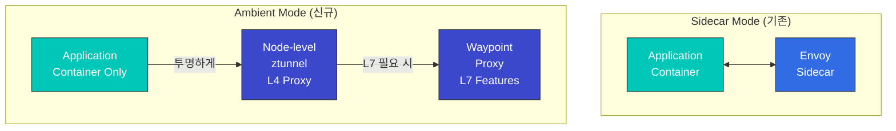

### Ambient Mode의 장점

1. **낮은 리소스 사용**: 파드당 프록시가 아닌 노드당 프록시
2. **간단한 배포**: 파드 재시작 불필요
3. **투명한 적용**: 애플리케이션 변경 없음
4. **유연한 L7 기능**: 필요한 경우만 waypoint 사용

## Sidecar Mode vs Ambient Mode

### 아키텍처 비교

#### Sidecar Mode

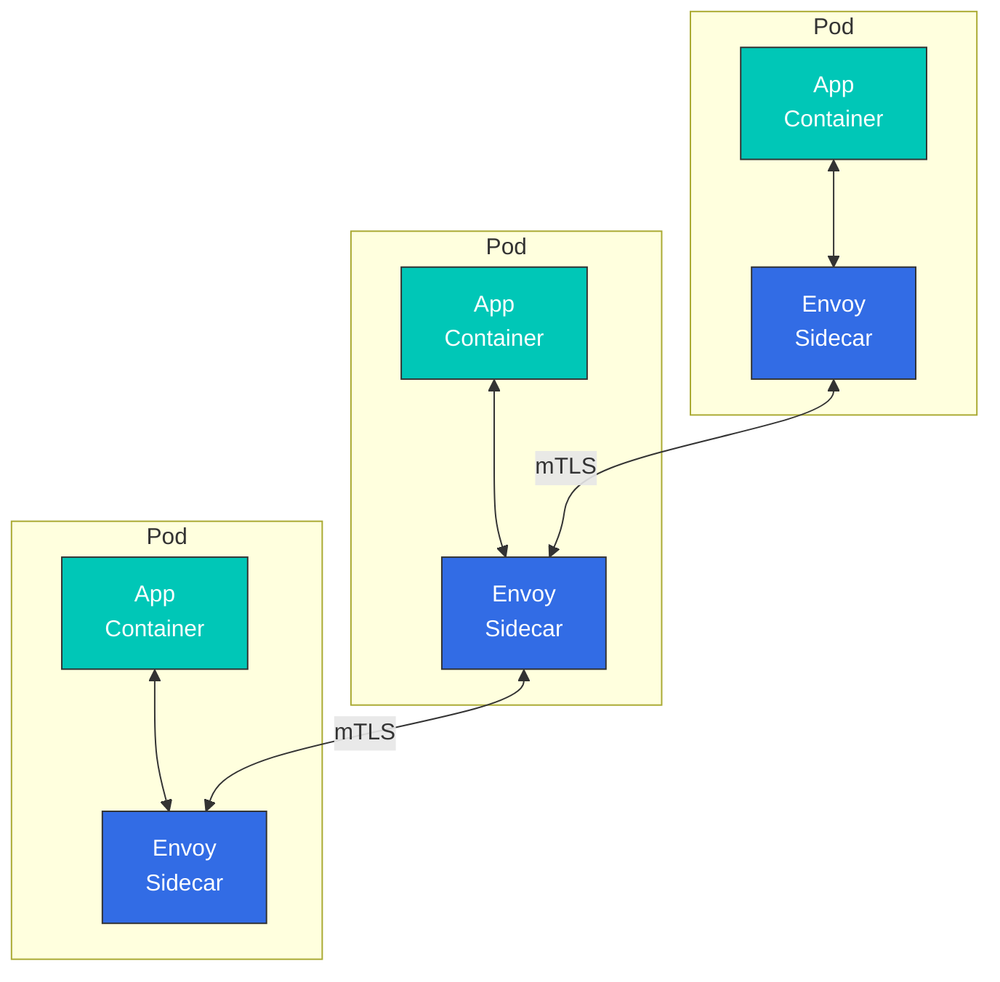

**특징**:
- 각 파드에 Envoy 프록시 주입
- 모든 L4/L7 기능 지원
- 높은 리소스 사용량
- 파드 재시작 필요

#### Ambient Mode

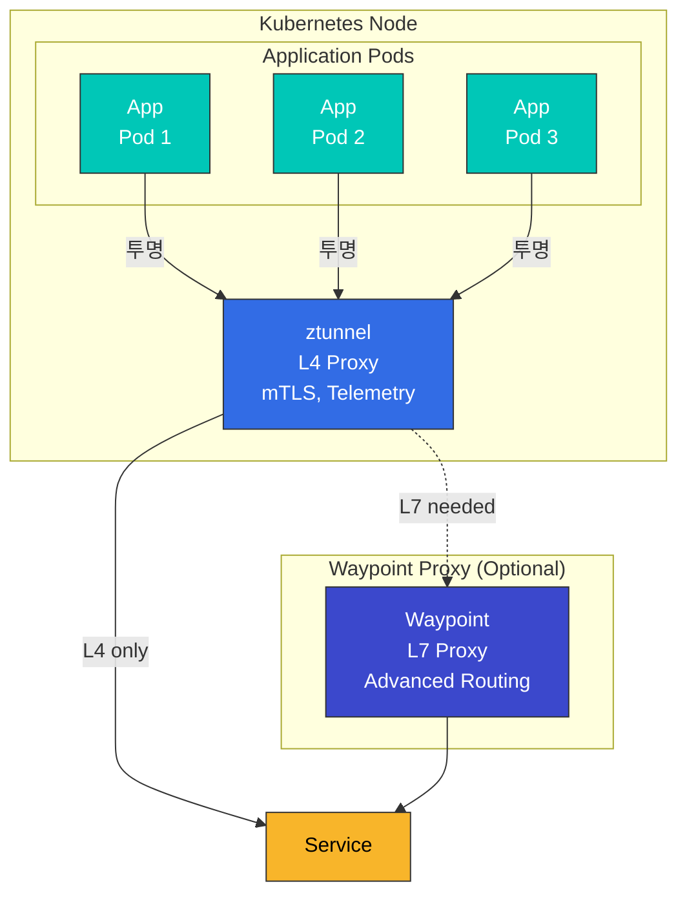

**특징**:
- 노드당 하나의 ztunnel
- L4 기능 기본 제공
- L7 기능은 waypoint 필요
- 파드 재시작 불필요

### 상세 비교표

| 항목 | Sidecar Mode | Ambient Mode |
|------|-------------|--------------|
| **배포 방식** | 파드에 Sidecar 주입 | 노드 레벨 ztunnel + 선택적 waypoint |
| **리소스 사용** | 높음 (파드당 ~50-100MB) | 낮음 (노드당 ~50MB) |
| **파드 재시작** | 필요 | 불필요 |
| **초기 지연** | 있음 (Sidecar 초기화) | 최소 |
| **L4 기능** | ✅ 지원 | ✅ 지원 |
| **L7 기능** | ✅ 전체 지원 | ⚠️ Waypoint 필요 |
| **mTLS** | ✅ 자동 | ✅ 자동 |
| **Telemetry** | ✅ 상세 | ✅ 기본 (L4), 상세 (L7 with waypoint) |
| **Circuit Breaker** | ✅ 지원 | ⚠️ Waypoint 필요 |
| **Retry/Timeout** | ✅ 지원 | ⚠️ Waypoint 필요 |
| **Header 조작** | ✅ 지원 | ⚠️ Waypoint 필요 |
| **성능 오버헤드** | 중간 (~5-10%) | 낮음 (~1-3%) |
| **운영 복잡도** | 높음 | 낮음 |
| **프로덕션 준비** | ✅ 성숙 | ⚠️ 베타 (Istio 1.28+) |

### 리소스 사용량 비교

```yaml
# Sidecar Mode
# 100개 파드 × 50MB = 5GB 메모리
# 100개 파드 × 0.1 CPU = 10 vCPU

# Ambient Mode
# 10개 노드 × 50MB = 500MB 메모리 (ztunnel)
# + Waypoint (필요 시): 200MB 메모리
# 총: ~700MB 메모리
```

## 아키텍처

<p align="center">
  
</p>

Ambient Mode의 데이터 플레인은 **ztunnel**과 **Waypoint Proxy** 두 가지 핵심 구성 요소로 이루어져 있습니다.

### ztunnel (Zero Trust Tunnel)

<p align="center">
  
</p>

ztunnel은 Ambient Mode의 핵심 구성 요소로, **노드 레벨에서 실행되는 경량 L4 프록시**입니다. 각 Kubernetes 노드에 DaemonSet으로 배포되며, 해당 노드의 모든 파드 트래픽을 투명하게 처리합니다.

#### ztunnel의 작동 원리

1. **트래픽 캡처**: CNI 플러그인과 eBPF를 통해 파드의 네트워크 트래픽을 투명하게 가로챕니다
2. **mTLS 적용**: SPIFFE 기반 Identity를 사용하여 자동으로 mTLS 암호화 적용
3. **로드 밸런싱**: 엔드포인트 간 L4 로드 밸런싱 수행
4. **텔레메트리 수집**: 연결 메트릭 및 로그 수집
5. **전달**: 대상 ztunnel 또는 Waypoint로 트래픽 전달

**ztunnel 기술 스택**:
- **언어**: Rust (고성능, 낮은 메모리 사용)
- **프로토콜**: HBONE (HTTP-Based Overlay Network Environment)
- **Identity**: SPIFFE/SPIRE 표준 준수
- **CNI**: Istio CNI 플러그인과 긴밀한 통합

#### ztunnel 역할

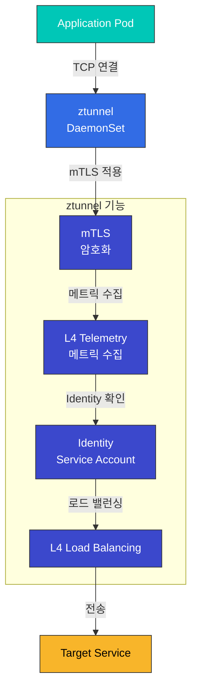

**ztunnel 특징**:
- Rust로 작성 (성능 최적화)
- DaemonSet으로 배포
- CNI 플러그인과 통합
- eBPF 기반 트래픽 리다이렉션

#### ztunnel 배포

```yaml
apiVersion: apps/v1
kind: DaemonSet
metadata:
  name: ztunnel
  namespace: istio-system
spec:
  selector:
    matchLabels:
      app: ztunnel
  template:
    metadata:
      labels:
        app: ztunnel
    spec:
      hostNetwork: true
      containers:
      - name: istio-proxy
        image: istio/ztunnel:1.28.0
        securityContext:
          privileged: true
          capabilities:
            add:
            - NET_ADMIN
            - SYS_ADMIN
        resources:
          requests:
            cpu: 100m
            memory: 50Mi
          limits:
            cpu: 200m
            memory: 100Mi
```

### Waypoint Proxy

<p align="center">
  
</p>

Waypoint는 **L7 기능이 필요한 경우 사용하는 선택적 프록시**입니다. 위 다이어그램에서 볼 수 있듯이, Waypoint는 서비스 앞단에 배치되어 고급 트래픽 관리 기능을 제공합니다.

#### Waypoint의 주요 특징

1. **선택적 배포**: 모든 서비스가 아닌, L7 기능이 필요한 서비스만 사용
2. **공유 프록시**: 여러 워크로드가 하나의 Waypoint를 공유 (Namespace 또는 ServiceAccount 단위)
3. **Envoy 기반**: 기존 Sidecar와 동일한 Envoy 프록시 사용으로 모든 Istio L7 기능 지원
4. **On-demand**: 런타임에 동적으로 추가/제거 가능

#### Waypoint 배포 단위

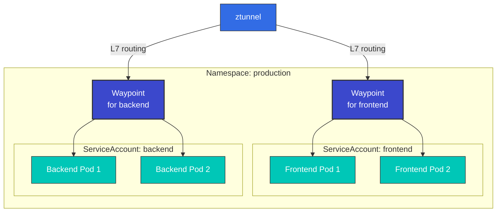

**배포 옵션**:
- **ServiceAccount 기반**: 특정 SA를 가진 파드만 해당 Waypoint 사용
- **Namespace 기반**: 전체 Namespace의 모든 파드가 하나의 Waypoint 사용
- **Workload 기반**: 특정 워크로드(Deployment, StatefulSet 등)에만 적용

#### Waypoint 역할

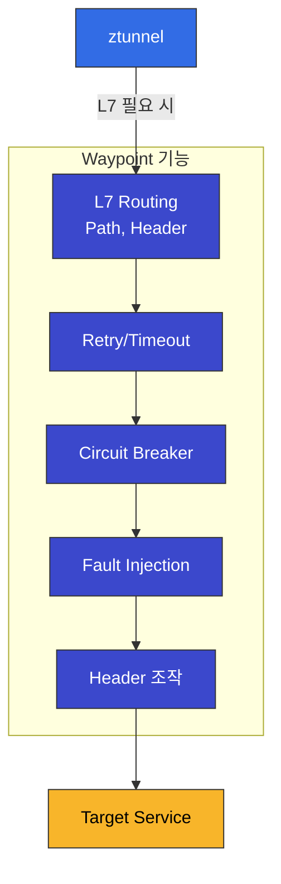

**Waypoint 특징**:
- Service Account별 또는 Namespace별 배포
- Envoy 프록시 기반
- 모든 L7 Istio 기능 지원
- 필요한 서비스만 선택적 사용

#### Waypoint 배포

```yaml
apiVersion: gateway.networking.k8s.io/v1
kind: Gateway
metadata:
  name: reviews-waypoint
  namespace: default
spec:
  gatewayClassName: istio-waypoint
  listeners:
  - name: mesh
    port: 15008
    protocol: HBONE
```

### 전체 트래픽 흐름

다음은 Ambient Mode에서 **Sidecar 없이** 트래픽이 어떻게 흐르는지 보여주는 종합 다이어그램입니다:

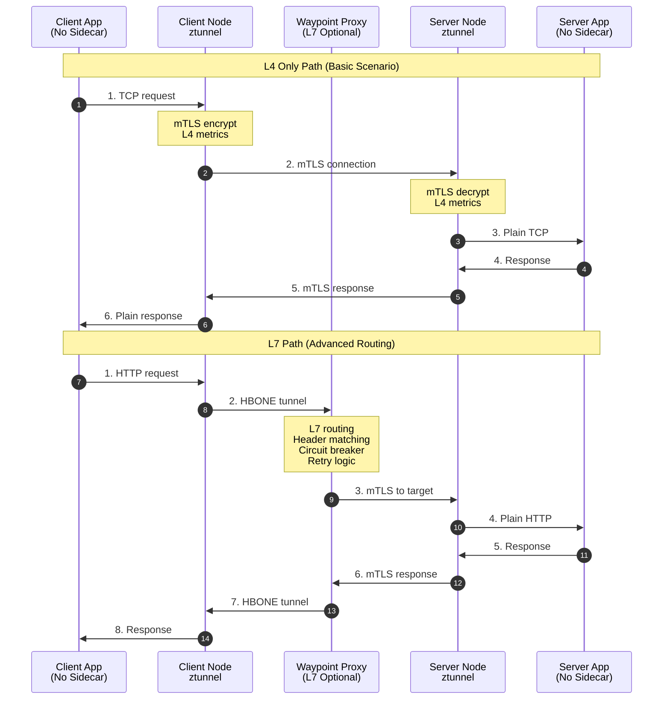

**트래픽 흐름 분석**:

1. **L4 Only Path** (ztunnel만 사용):
   - 최소 지연 (~1ms)
   - mTLS 자동 적용
   - 기본 텔레메트리
   - 80-90% 워크로드에 충분

2. **L7 Path** (ztunnel + Waypoint):
   - Header 기반 라우팅
   - Circuit Breaking
   - Retry/Timeout
   - 복잡한 트래픽 정책 필요 시

### HBONE 프로토콜

<p align="center">
  
</p>

**HBONE (HTTP-Based Overlay Network Environment)**는 Ambient Mode에서 사용하는 터널링 프로토콜입니다:

- **HTTP/2 기반**: 기존 인프라와의 호환성
- **mTLS 내장**: 보안 통신
- **효율적**: 최소한의 오버헤드
- **방화벽 친화적**: 표준 HTTP/2 포트 사용

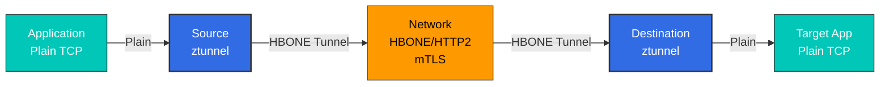

## 설치 및 구성

### 1. Istio 설치 (Ambient Mode)

```bash
# Istio 다운로드
curl -L https://istio.io/downloadIstio | ISTIO_VERSION=1.28.0 sh -
cd istio-1.28.0
export PATH=$PWD/bin:$PATH

# Ambient profile로 설치
istioctl install --set profile=ambient -y

# 설치 확인
kubectl get pods -n istio-system
# 출력:
# NAME                                   READY   STATUS
# istio-cni-node-xxxxx                   1/1     Running
# istiod-xxxxx                           1/1     Running
# ztunnel-xxxxx                          1/1     Running
```

### 2. Namespace에 Ambient Mode 활성화

```bash
# Label로 Ambient Mode 활성화
kubectl label namespace default istio.io/dataplane-mode=ambient

# 확인
kubectl get namespace default -o yaml | grep istio.io/dataplane-mode
```

### 3. 애플리케이션 배포

```yaml
# 일반 Deployment (Sidecar 불필요)
apiVersion: apps/v1
kind: Deployment
metadata:
  name: reviews
  namespace: default
spec:
  replicas: 3
  selector:
    matchLabels:
      app: reviews
  template:
    metadata:
      labels:
        app: reviews
    spec:
      containers:
      - name: reviews
        image: istio/examples-bookinfo-reviews-v1:1.17.0
        ports:
        - containerPort: 9080
```

### 4. Waypoint 프록시 배포 (선택적)

```bash
# Service Account별 Waypoint 생성
istioctl x waypoint apply --service-account reviews

# 또는 Namespace별 Waypoint
istioctl x waypoint apply --namespace default

# Waypoint 확인
kubectl get gateway -n default
```

### 5. L7 기능 사용

```yaml
# VirtualService (Waypoint 사용)
apiVersion: networking.istio.io/v1
kind: VirtualService
metadata:
  name: reviews
  namespace: default
spec:
  hosts:
  - reviews
  http:
  - match:
    - headers:
        end-user:
          exact: jason
    route:
    - destination:
        host: reviews
        subset: v2
  - route:
    - destination:
        host: reviews
        subset: v1
---
# DestinationRule
apiVersion: networking.istio.io/v1
kind: DestinationRule
metadata:
  name: reviews
spec:
  host: reviews
  subsets:
  - name: v1
    labels:
      version: v1
  - name: v2
    labels:
      version: v2
```

## 마이그레이션

### Sidecar Mode에서 Ambient Mode로

#### 단계별 마이그레이션


#### 1단계: Ambient 컴포넌트 설치

```bash
# 기존 Istio가 설치되어 있다면
istioctl install --set profile=ambient --skip-confirmation

# ztunnel과 CNI 확인
kubectl get daemonset -n istio-system
```

#### 2단계: 테스트 Namespace에 적용

```bash
# 테스트 네임스페이스 생성
kubectl create namespace test-ambient

# Ambient Mode 활성화
kubectl label namespace test-ambient istio.io/dataplane-mode=ambient

# 테스트 애플리케이션 배포
kubectl apply -f samples/sleep/sleep.yaml -n test-ambient
```

#### 3단계: 검증

```bash
# mTLS 작동 확인
kubectl exec -n test-ambient deploy/sleep -- curl -s http://httpbin:8000/headers

# Telemetry 확인
kubectl logs -n istio-system -l app=ztunnel | grep test-ambient
```

#### 4단계: 프로덕션 Namespace 전환

```bash
# 기존 Namespace에 Label 추가
kubectl label namespace default istio.io/dataplane-mode=ambient

# 파드 재시작 (Sidecar 제거)
kubectl rollout restart deployment -n default

# Sidecar 제거 확인
kubectl get pods -n default -o jsonpath='{.items[*].spec.containers[*].name}' | grep -v istio-proxy
```

#### 5단계: Waypoint 배포 (L7 기능 필요 시)

```bash
# Service Account별 Waypoint
for sa in $(kubectl get sa -n default -o name); do
  istioctl x waypoint apply --service-account ${sa#serviceaccount/} -n default
done
```

### 롤백 전략

```bash
# Ambient에서 Sidecar로 되돌리기

# 1. Namespace Label 제거
kubectl label namespace default istio.io/dataplane-mode-

# 2. Sidecar Injection 활성화
kubectl label namespace default istio-injection=enabled

# 3. 파드 재시작
kubectl rollout restart deployment -n default

# 4. Waypoint 제거
kubectl delete gateway -n default --all
```

## 성능 비교

<p align="center">
  
</p>

### 벤치마크 결과

위 그래프는 Istio 공식 성능 테스트 결과로, Ambient Mode가 Sidecar Mode 대비 **현저히 낮은 리소스 사용량**을 보여줍니다.

| 메트릭 | Sidecar Mode | Ambient Mode (ztunnel only) | Ambient Mode (with waypoint) |
|--------|-------------|---------------------------|---------------------------|
| **Memory/Pod** | ~50-100MB | ~1-2MB | ~1-2MB (app) + shared waypoint |
| **CPU/Pod** | ~0.1 vCPU | ~0.01 vCPU | ~0.01 vCPU (app) + shared waypoint |
| **Latency (P50)** | +2-3ms | +0.5-1ms | +2-3ms |
| **Latency (P99)** | +5-10ms | +1-2ms | +5-10ms |
| **Throughput** | -5-10% | -1-3% | -5-10% |

### 리소스 사용량 시각화

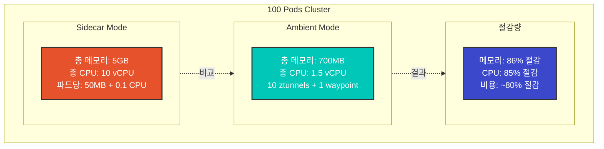

### 리소스 절감 계산

```python
# 100개 파드 클러스터 예시

# Sidecar Mode
sidecar_memory = 100 * 50  # 5000MB = 5GB
sidecar_cpu = 100 * 0.1    # 10 vCPU

# Ambient Mode (10 nodes)
ambient_memory = 10 * 50 + 200  # 700MB (ztunnel + 1 waypoint)
ambient_cpu = 10 * 0.1 + 0.5    # 1.5 vCPU

# 절감량
memory_saved = sidecar_memory - ambient_memory  # 4300MB (~86%)
cpu_saved = sidecar_cpu - ambient_cpu          # 8.5 vCPU (~85%)
```

## 사용 사례

### 언제 Ambient Mode를 선택해야 하는가?

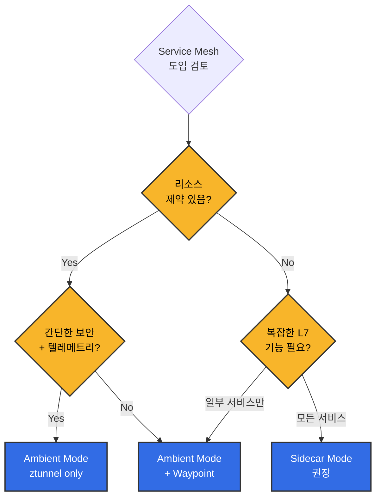

**Ambient Mode 권장 시나리오**:
- ✅ 수백 개 이상의 마이크로서비스
- ✅ 리소스 비용 최적화가 중요
- ✅ 대부분의 서비스가 간단한 통신만 필요
- ✅ 일부 서비스만 고급 라우팅 필요
- ✅ 운영 복잡도 최소화

**Sidecar Mode 권장 시나리오**:
- ✅ 모든 서비스에 L7 기능 필요
- ✅ 성숙도가 검증된 솔루션 필요
- ✅ 서비스별 세밀한 제어 필요
- ✅ 파드별 독립적인 프록시 버전 관리

### 1. L4 기능만 필요한 경우

```yaml
# ztunnel만 사용 (Waypoint 불필요)
apiVersion: v1
kind: Namespace
metadata:
  name: backend
  labels:
    istio.io/dataplane-mode: ambient
---
apiVersion: apps/v1
kind: Deployment
metadata:
  name: database
  namespace: backend
spec:
  replicas: 3
  # ... (일반 Deployment)
```

**이점**:
- mTLS 자동 적용
- 기본 Telemetry
- 최소 리소스 사용

### 2. 선택적 L7 기능 사용

```yaml
# 특정 Service만 Waypoint 사용
apiVersion: gateway.networking.k8s.io/v1
kind: Gateway
metadata:
  name: frontend-waypoint
  namespace: frontend
spec:
  gatewayClassName: istio-waypoint
  listeners:
  - name: mesh
    port: 15008
    protocol: HBONE
---
apiVersion: v1
kind: ServiceAccount
metadata:
  name: frontend
  namespace: frontend
  labels:
    istio.io/use-waypoint: frontend-waypoint
```

### 3. 점진적 마이그레이션

```bash
# 단계별 마이그레이션
# 1. Non-critical services
kubectl label namespace dev istio.io/dataplane-mode=ambient

# 2. Testing
kubectl label namespace staging istio.io/dataplane-mode=ambient

# 3. Production (one by one)
kubectl label namespace prod-backend istio.io/dataplane-mode=ambient
kubectl label namespace prod-frontend istio.io/dataplane-mode=ambient
```

## 문제 해결

### ztunnel이 작동하지 않음

```bash
# ztunnel 상태 확인
kubectl get daemonset -n istio-system ztunnel
kubectl logs -n istio-system -l app=ztunnel

# CNI 확인
kubectl get daemonset -n istio-system istio-cni-node
kubectl logs -n istio-system -l k8s-app=istio-cni-node
```

### Waypoint로 트래픽이 가지 않음

```bash
# Waypoint 상태 확인
kubectl get gateway -n <namespace>

# Service Account에 Waypoint 연결 확인
kubectl get sa <sa-name> -n <namespace> -o yaml | grep use-waypoint

# Envoy 구성 확인
istioctl proxy-config clusters <waypoint-pod> -n <namespace>
```

## 참고 자료

### 공식 문서
- [Istio Ambient Mode 공식 문서](https://istio.io/latest/docs/ops/ambient/)
- [Ambient Mode 소개 블로그](https://istio.io/latest/blog/2022/introducing-ambient-mesh/)
- [Ambient Mode Getting Started](https://istio.io/latest/docs/ops/ambient/getting-started/)
- [ztunnel GitHub Repository](https://github.com/istio/ztunnel)

### 기술 자료
- [Ambient Mesh 아키텍처 상세 설명](https://istio.io/latest/blog/2022/ambient-security/)
- [HBONE 프로토콜 설명](https://istio.io/latest/blog/2022/get-started-ambient/)
- [성능 벤치마크](https://istio.io/latest/blog/2022/ambient-performance/)

### 한국어 자료
- [SKT Enterprise - Istio Ambient Mesh 소개](https://www.sktenterprise.com/bizInsight/blogDetail/dev/14768)

### 커뮤니티
- [Istio Discuss - Ambient Mode](https://discuss.istio.io/c/ambient/47)
- [Istio Slack #ambient-mesh](https://istio.slack.com/)

### 비교 자료

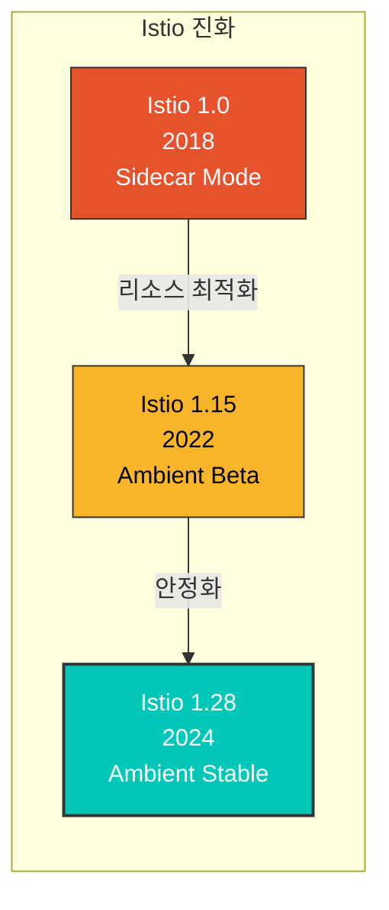

**프로덕션 사용 현황** (2025년 기준):
- 🏢 **Solo.io**: 사내 클러스터 전체를 Ambient Mode로 마이그레이션
- 🏦 **금융 기업**: 수천 개 마이크로서비스에 Ambient Mode 적용 (80% 비용 절감)
- 🛒 **이커머스**: L4 ztunnel + 선택적 Waypoint로 하이브리드 운영

**주요 기능 로드맵**:
- ✅ **1.25 (2025 Q1)**: Ambient Mode GA (General Availability)
- 🔄 **1.26 (2025 Q2)**: Multi-cluster Ambient 지원
- 📅 **1.27+ (2025 Q3+)**: Gateway API 완전 통합, 성능 최적화

## 요약

Ambient Mode는 Istio의 미래 방향성을 보여주는 혁신적인 아키텍처입니다:

| 특징 | 설명 | 이점 |
|------|------|------|
| **Sidecar 제거** | 파드당 프록시 불필요 | 리소스 90% 절감 |
| **2계층 구조** | L4 (ztunnel) + L7 (Waypoint) | 유연한 기능 선택 |
| **투명한 적용** | 파드 재시작 불필요 | 무중단 도입 |
| **점진적 마이그레이션** | 네임스페이스별 전환 | 안전한 전환 |
| **HBONE 프로토콜** | HTTP/2 기반 터널링 | 방화벽 친화적 |

Ambient Mode는 특히 **대규모 마이크로서비스 환경**에서 리소스 효율성과 운영 단순화를 제공하며, L7 기능이 필요한 서비스에만 선택적으로 Waypoint를 배포하여 **비용 효율적인 Service Mesh**를 구현할 수 있습니다.
