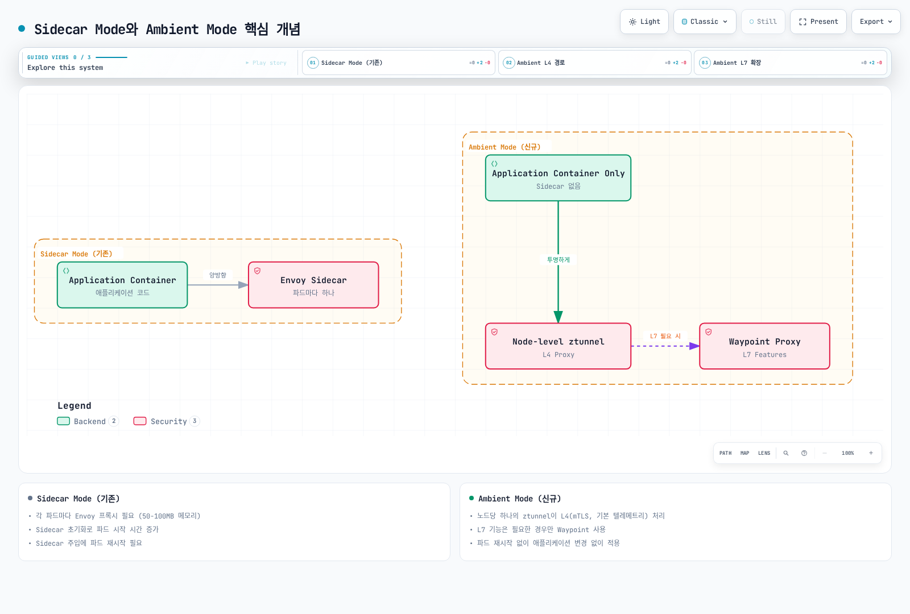
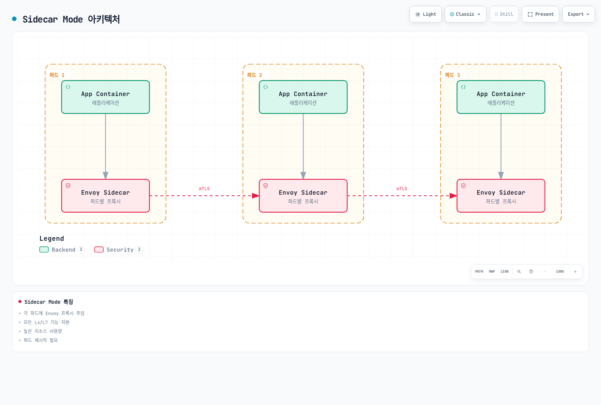
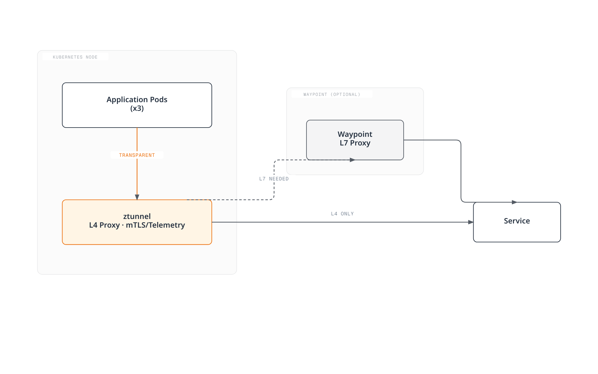
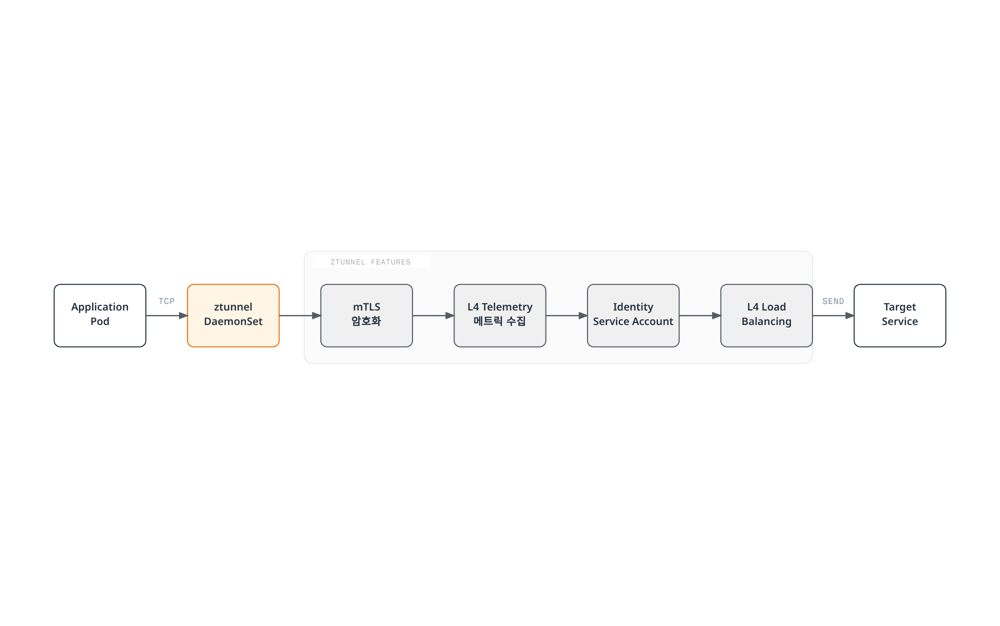
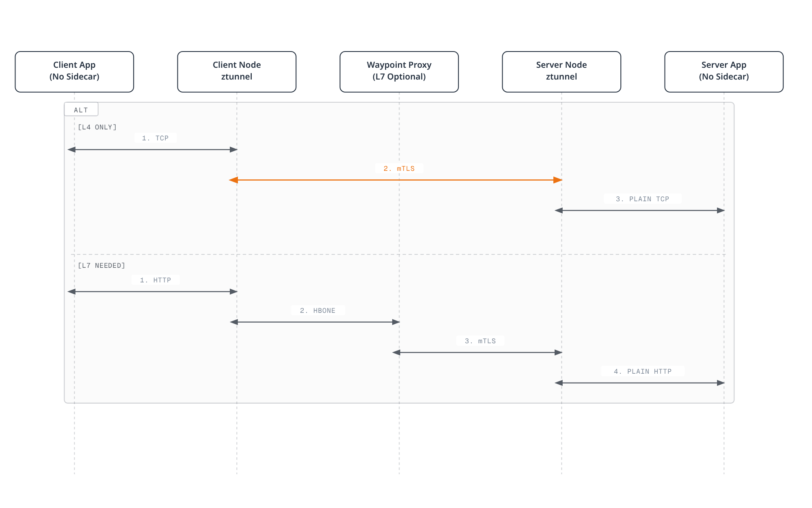
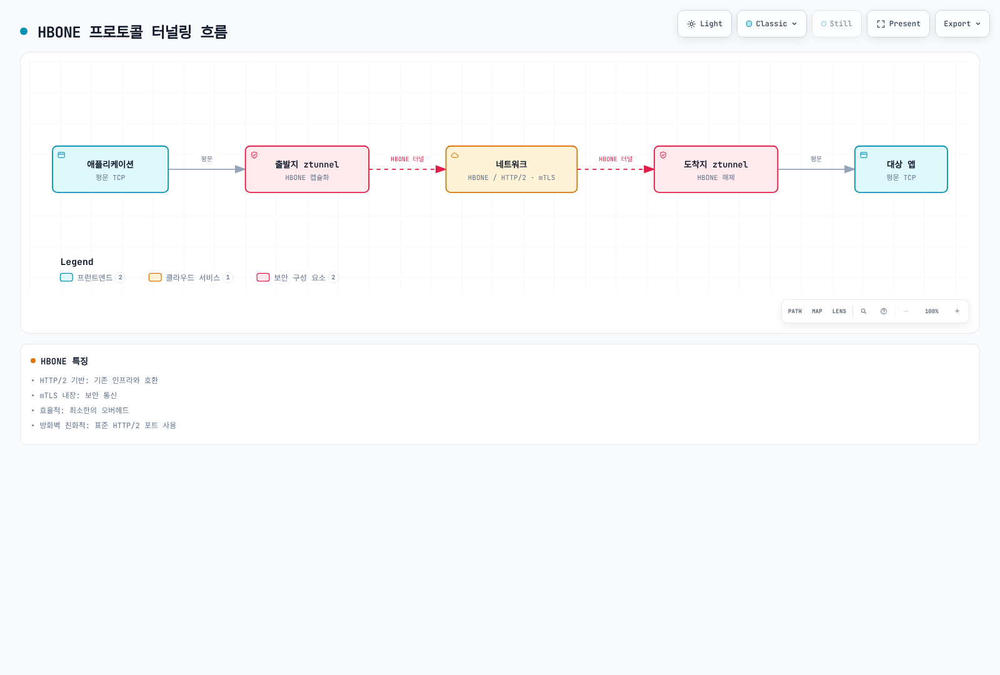

# Ambient Mode

> **검토일**: 2026년 9월 11일 · Istio 1.31. 호환 Linux Node·node-agent/CNI 권한·새 실습 namespace를 전제합니다. 감사에서 배포 명령을 실행하지 않았습니다.

Ambient는 2022년 실험적 preview로 소개되어 Istio 1.18에 Alpha로 처음 포함되고 1.22 Beta·1.24 core GA에 도달했습니다. Preview는 정식 1.15 릴리스의 GA 기능이 아니었습니다. 리소스 절감량·전환 안전성은 실제 topology·정책·트래픽에 달려 있습니다.

## 목차

1. [개요](#개요)
2. [Sidecar Mode vs Ambient Mode](#sidecar-mode-vs-ambient-mode)
3. [아키텍처](#아키텍처)
4. [설치 및 구성](#설치-및-구성)
5. [마이그레이션](#마이그레이션)
6. [성능 비교](#성능-비교)
7. [사용 사례](#사용-사례)
8. [문제 해결](#문제-해결)

## 개요


Ambient Mode는 애플리케이션 파드에 Sidecar 프록시를 주입하지 않고도 Service Mesh 기능을 제공하는 새로운 방식입니다. Ambient Mode는 **두 계층(Layered Architecture)**으로 구성됩니다:

1. **Secure Overlay Layer (L4)**: ztunnel을 통한 mTLS 및 기본 텔레메트리
2. **L7 Processing Layer**: Waypoint Proxy를 통한 고급 트래픽 관리

### 왜 Ambient Mode가 필요한가?

기존 Sidecar 모델의 한계:
- **높은 리소스 오버헤드**: 각 파드마다 Envoy 프록시 필요 (실제 proxy footprint 측정 필요)
- **운영 복잡성**: 파드 재시작, 버전 관리, 롤링 업데이트 복잡
- **시작 시 조정**: Proxy·앱 readiness 조정 필요
- **과도한 기능**: 일부 workload는 L4 mesh 기능만 필요

Ambient Mode의 해결책:
- ✅ **공유 Node 프록시·필요한 waypoint**: 전체 리소스 사용량 측정
- ✅ **등록 시 재시작을 피할 수 있음**: 기존 sidecar 제거·정책 전환에는 통제된 rollout 필요
- ✅ **점진적 도입**: L4 → L7로 필요에 따라 확장
- ✅ **투명한 L4 통합**: 추적 context·앱 timeout/멱등성 계약은 여전히 필요

### 핵심 개념

그림의 선택적 waypoint는 설정·등록으로 선택합니다. Ztunnel이 HTTP 요청마다 L7 우회 여부를 판정하는 것은 아닙니다. 기존 연결·readiness·정책 전환은 별도 검증이 필요합니다.




[🔍 인터랙티브 다이어그램 보기](https://www.atomai.click/kubernetes-docs/archmaps/ko-service-mesh-istio-advanced-01-ambient-mode-0.html)

### Ambient Mode의 장점

1. **공유 리소스 모델**: Node 프록시·필요한 waypoint replica
2. **간단한 배포**: unmeshed Pod 등록에는 재시작 불필요; sidecar 제거에는 필요
3. **투명한 L4 전송**: 앱 추적·deadline·멱등성 요구는 별도
4. **유연한 L7 기능**: 필요한 경우만 waypoint 사용

## Sidecar Mode vs Ambient Mode

### 아키텍처 비교

#### Sidecar Mode



[🔍 인터랙티브 다이어그램 보기](https://www.atomai.click/kubernetes-docs/archmaps/ko-service-mesh-istio-advanced-01-ambient-mode-1.html)

**특징**:
- 각 파드에 Envoy 프록시 주입
- 성숙한 L4/L7 기능; 선택 릴리스 지원 확인
- 높은 리소스 사용량
- 파드 재시작 필요

#### Ambient Mode



[🔍 인터랙티브 다이어그램 보기](https://www.atomai.click/kubernetes-docs/archmaps/ko-service-mesh-istio-advanced-01-ambient-mode-2.html)

**특징**:
- 노드당 하나의 ztunnel
- L4 기능 기본 제공
- L7 기능은 waypoint 필요
- unmeshed Pod 등록에는 재시작 불필요; sidecar 제거에는 필요

### 상세 비교표

| 항목 | Sidecar Mode | Ambient Mode |
|------|-------------|--------------|
| **배포 방식** | 파드에 Sidecar 주입 | 노드 레벨 ztunnel + 선택적 waypoint |
| **리소스 산정** | Pod별 Envoy·control plane | Node ztunnel·모든 waypoint replica·control plane; 부하에서 측정 |
| **Pod 재생성** | 주입 프록시 추가/제거에 필요 | unmeshed 등록에는 보통 불필요; 기존 sidecar 제거에는 필요 |
| **시작 시 조정** | Proxy/앱 lifecycle·readiness | CNI capture·ztunnel 준비 |
| **L4 기능** | ✅ 지원 | ✅ 지원 |
| **L7 기능** | 릴리스별 지원 | Waypoint·지원 API 필요; 모든 확장이 GA는 아님 |
| **mTLS** | ✅ 자동 | ✅ 자동 |
| **Telemetry** | ✅ 상세 | ✅ 기본 (L4), 상세 (L7 with waypoint) |
| **Circuit Breaker** | ✅ 지원 | ⚠️ Waypoint 필요 |
| **Retry/Timeout** | ✅ 지원 | ⚠️ Waypoint 필요 |
| **Header 조작** | ✅ 지원 | ⚠️ Waypoint 필요 |
| **성능 오버헤드** | Workload·설정에 의존 | 경로·신원·waypoint·부하에 의존; 같은 정책으로 비교 |
| **운영 범위** | Workload별 proxy lifecycle | Node/CNI·공유 waypoint lifecycle |
| **프로덕션 준비** | ✅ 성숙 | ✅ GA (Istio 1.24 이상) |

### 리소스 사용량 비교

아래 100-Pod 계산은 가상 계획 예제이며 공식 benchmark가 아닙니다. 모든 Node/waypoint replica와 같은 보안·관찰성·routing 요구를 반영한 뒤 리소스·청구 절감을 추정합니다.

## 아키텍처


Ambient Mode의 데이터 플레인은 **ztunnel**과 **Waypoint Proxy** 두 가지 핵심 구성 요소로 이루어져 있습니다.

### ztunnel (Zero Trust Tunnel)


ztunnel은 Ambient Mode의 핵심 구성 요소로, **노드 레벨에서 실행되는 경량 L4 프록시**입니다. 대상 Linux Node의 DaemonSet으로 실행되어 등록된 workload의 지원 트래픽을 처리합니다. 모든 Pod의 모든 트래픽이 아니며 host-network/제외 workload·비TCP 앱 프로토콜은 현재 지원을 확인해야 합니다.

#### ztunnel의 작동 원리

1. **트래픽 캡처**: Istio CNI의 Pod 내부 netfilter/iptables 규칙·network namespace 전달로 파드의 네트워크 트래픽을 투명하게 가로챕니다
2. **mTLS 적용**: SPIFFE 기반 Identity를 사용하여 자동으로 mTLS 암호화 적용
3. **로드 밸런싱**: 엔드포인트 간 L4 로드 밸런싱 수행
4. **텔레메트리 수집**: 연결 메트릭 및 로그 수집
5. **전달**: 대상 ztunnel 또는 Waypoint로 트래픽 전달

**ztunnel 기술 스택**:
- **언어**: Rust (고성능, 낮은 메모리 사용)
- **프로토콜**: HBONE (HTTP-Based Overlay Network Environment)
- **Identity**: SPIFFE workload 신원; 기본 Istiod CA, SPIRE는 별도 통합
- **CNI**: Istio CNI 플러그인과 긴밀한 통합

#### ztunnel 역할



[🔍 인터랙티브 다이어그램 보기](https://www.atomai.click/kubernetes-docs/archmaps/ko-service-mesh-istio-advanced-01-ambient-mode-3.html)

**ztunnel 특징**:
- Rust로 작성 (성능 최적화)
- DaemonSet으로 배포
- CNI 플러그인과 통합
- Istio CNI와 연동한 Pod 내부 netfilter/iptables 리다이렉션

#### ztunnel 배포

릴리스의 ambient 설치·chart를 사용합니다. 기존 최소 DaemonSet은 token/CA/socket mount가 없고 hostNetwork/privileged 설정도 달랐습니다. 1.31 chart는 필요한 capability·Pod namespace 접근을 구성하며 `hostNetwork: true`·`privileged: true`를 설정하지 않습니다. 전체 chart/platform 문맥 없이 권한을 복사·축소하지 않습니다.

```bash
# Offline inspection; use the same reviewed values as the actual installation
istioctl manifest generate --set profile=ambient > ambient-rendered.yaml
# Inspect a deployed resource if a mesh already exists
kubectl get daemonset ztunnel -n istio-system -o yaml
```

### Waypoint Proxy


Waypoint는 **L7 기능이 필요한 경우 사용하는 선택적 프록시**입니다. 설정한 Waypoint는 등록한 resource의 트래픽 경로에 배치되어 고급 트래픽 관리 기능을 제공합니다.

#### Waypoint의 주요 특징

1. **선택적 배포**: 모든 서비스가 아닌, L7 기능이 필요한 서비스만 사용
2. **공유 프록시**: 여러 워크로드가 하나의 Waypoint를 공유 (namespace/Service/Pod 등록 범위)
3. **Envoy 기반**: 기존 Sidecar와 동일한 Envoy 프록시 사용으로 릴리스별 L7 API 지원
4. **On-demand**: 런타임에 동적으로 추가/제거 가능

#### Waypoint 배포 단위

ServiceAccount는 workload 신원을 제공하며 여기에 레이블을 붙여도 waypoint를 선택하지 **않습니다**. Namespace·Service·Pod의 `istio.io/use-waypoint`와 목적에 맞는 Gateway의 `istio.io/waypoint-for` traffic type을 사용합니다.

| 등록 대상 | 범위 |
|---|---|
|Namespace|그 namespace의 대상 resource에 기본 waypoint 선택|
|Service|해당 Service 트래픽; 기본 type은 `service`|
|Pod|`workload` 또는 `all` waypoint를 통한 직접 workload/Pod-IP 트래픽|

Deployment 자체의 레이블은 기존 Pod를 바꾸지 않으므로 workload 등록에는 Pod-template 레이블을 사용합니다. `service` waypoint가 직접 Pod-IP 트래픽까지 자동 처리하지는 않습니다.

#### Waypoint 역할


**Waypoint 특징**:
- Gateway로 배포한 뒤 지원되는 resource 등록으로 선택
- Envoy 프록시 기반
- API별 지원 확인; 임의 EnvoyFilter patch는 지원되는 waypoint API가 아님
- 필요한 서비스만 선택적 사용

#### Waypoint 배포

```yaml
apiVersion: gateway.networking.k8s.io/v1
kind: Gateway
metadata:
  name: reviews-waypoint
  namespace: ambient-demo
  labels:
    istio.io/waypoint-for: service
spec:
  gatewayClassName: istio-waypoint
  listeners:
  - name: mesh
    port: 15008
    protocol: HBONE
```

기본 `istio-waypoint` class는 Envoy를 사용합니다. Core ambient GA가 모든 API의 GA는 아닙니다. 현재 문서는 ambient VirtualService를 Alpha로 설명하며 Gateway API route와 혼용하지 않도록 합니다. 여기서는 HTTPRoute를 사용합니다. EnvoyFilter는 지원되는 waypoint 확장이 아닙니다. L7 정책은 waypoint에 도달한 트래픽만 보호하므로 강제 경유에는 문서화된 ztunnel 권한 guard·올바른 등록/readiness도 필요합니다.

### 전체 트래픽 흐름

다음은 Ambient Mode에서 **Sidecar 없이** 트래픽이 어떻게 흐르는지 보여주는 종합 다이어그램입니다:



[🔍 인터랙티브 다이어그램 보기](https://www.atomai.click/kubernetes-docs/archmaps/ko-service-mesh-istio-advanced-01-ambient-mode-6.html)

**트래픽 흐름 분석**:

1. **L4 Only Path** (ztunnel만 사용):
   - 대표 부하에서 경로 지연 측정
   - mTLS 자동 적용
   - 기본 텔레메트리
   - 실제 요구가 L4만으로 충족될 때 적합

2. **L7 Path** (ztunnel + Waypoint):
   - Header 기반 라우팅
   - Circuit Breaking
   - Retry/Timeout
   - 복잡한 트래픽 정책 필요 시

### HBONE 프로토콜


**HBONE (HTTP-Based Overlay Network Environment)**는 Ambient Mode에서 사용하는 터널링 프로토콜입니다:

- **HTTP/2 기반**: 기존 인프라와의 호환성
- **mTLS 내장**: 보안 통신
- **Multiplexing**: 같은 source/destination 신원 쌍의 TCP stream이 tunnel을 공유
- **네트워크 정책**: HBONE은 통상 TCP15008을 사용하므로 필요한 mesh 경로를 명시적으로 허용



[🔍 인터랙티브 다이어그램 보기](https://www.atomai.click/kubernetes-docs/archmaps/ko-service-mesh-istio-advanced-01-ambient-mode-7.html)

이 가이드의 HBONE은 TCP stream을 전송합니다. 앱 UDP는 이 tunnel로 전달되지 않으며 DNS capture/proxy는 별도 기능입니다. 프록시 사이 mesh 전송이 암호화되어도 로컬 앱 stream은 평문일 수 있습니다.

## 설치 및 구성

호환 Linux Node·Istio CNI/ztunnel DaemonSet이 필요합니다. EKS Fargate는 이 Node DaemonSet을 실행하지 못하므로 지원되는 EC2 기반 배치와 실제 Node/CNI platform을 확인합니다. [사전 요구사항](https://istio.io/latest/docs/ambient/install/platform-prerequisites/)은 CNI 경로·권한·health probe를 설명합니다. VPC CNI Pod ENI trunking·SecurityGroupPolicy에는 standard enforcing mode 또는 적절한 exec probe가 필요할 수 있으므로 정책 영향을 검토합니다. GKE·OpenShift·k3s 등은 다른 설정이 필요할 수 있습니다.

Istio1.31은 Kubernetes1.32–1.36을 지원하며 EKS 범위는 [설치 가이드](../01-installation.md)를 따릅니다. 아래 Gateway API1.6.0은 Istio1.31 의존성·공식 ambient 실습과 맞는 버전입니다. 기존 bundle의 호환성을 확인하며 더 새로운 호환 bundle을 예제에 맞추려고 낮추지 않습니다.

### 1. Istio 설치 (Ambient Mode)

Installer·platform 설정을 검토한 새 실습 mesh에만 이 설치 명령을 사용합니다. 기존 mesh의 설치 방식·값은 마이그레이션 절차로 보존합니다.

```bash
curl -fsSL https://istio.io/downloadIstio -o download-istio.sh
ISTIO_VERSION=1.31.0 sh download-istio.sh
cd istio-1.31.0
export PATH="$PWD/bin:$PATH"

# Fresh cluster without Gateway API; review an existing bundle separately
if ! kubectl get crd gateways.gateway.networking.k8s.io >/dev/null 2>&1; then
  kubectl apply --server-side -f https://github.com/kubernetes-sigs/gateway-api/releases/download/v1.6.0/experimental-install.yaml
fi
kubectl wait --for=condition=Established crd/gateways.gateway.networking.k8s.io --timeout=60s
kubectl get crd httproutes.gateway.networking.k8s.io

# Fresh lab mesh only; include required platform-specific values
istioctl install --set profile=ambient -y
kubectl get pods,daemonsets -n istio-system
```

### 2. Ambient Mode 활성화와 애플리케이션 배포

Sidecar injection·revision override가 없는 새 실습 namespace를 사용합니다. Ambient 레이블만으로 기존 sidecar Pod가 전환되지는 않습니다. 1.31 배포본의 완전한 Bookinfo 매니페스트에는 기존 단일 Deployment 예제에 없던 reviews Service·version 레이블·ServiceAccount·ratings 의존성이 있으며 Bookinfo1.20.3 이미지를 사용합니다.

```bash
kubectl create namespace ambient-demo
kubectl label namespace ambient-demo istio.io/dataplane-mode=ambient
kubectl get namespace ambient-demo -L istio-injection,istio.io/rev,istio.io/dataplane-mode
kubectl apply -n ambient-demo -f samples/bookinfo/platform/kube/bookinfo.yaml
kubectl apply -n ambient-demo -f samples/curl/curl.yaml
for deployment in reviews-v1 reviews-v2 ratings-v1 curl; do
  kubectl rollout status "deployment/$deployment" -n ambient-demo --timeout=120s
done
istioctl ztunnel-config workloads --workload-namespace ambient-demo
```

### 3. Waypoint 배포와 선택

현재 CLI는 waypoint 이름·traffic type을 받으며 ServiceAccount 등록 flag를 사용하지 않습니다. 준비 상태를 기다린 뒤 Service를 명시적으로 등록합니다.

```bash
istioctl waypoint apply --name reviews-waypoint --for service -n ambient-demo --wait
kubectl label service reviews -n ambient-demo istio.io/use-waypoint=reviews-waypoint --overwrite
kubectl get gateways.gateway.networking.k8s.io reviews-waypoint -n ambient-demo
kubectl get service reviews -n ambient-demo --show-labels
```

### 4. L7 기능 사용

버전별 backend Service를 만들고 등록한 reviews Service에 HTTPRoute를 연결합니다. GET/header routing 예제이며 헤더가 인증된 신원은 아닙니다. 이전 VirtualService를 이 Gateway API route와 함께 적용하지 않습니다. 다른 Service·Pod IP 직접 호출은 별도 경로입니다.

```yaml
apiVersion: v1
kind: Service
metadata:
  name: reviews-v1
  namespace: ambient-demo
spec:
  selector:
    app: reviews
    version: v1
  ports:
  - name: http
    port: 9080
    targetPort: 9080
---
apiVersion: v1
kind: Service
metadata:
  name: reviews-v2
  namespace: ambient-demo
spec:
  selector:
    app: reviews
    version: v2
  ports:
  - name: http
    port: 9080
    targetPort: 9080
---
apiVersion: gateway.networking.k8s.io/v1
kind: HTTPRoute
metadata:
  name: reviews
  namespace: ambient-demo
spec:
  parentRefs:
  - group: ''
    kind: Service
    name: reviews
    port: 9080
  rules:
  - matches:
    - method: GET
      headers:
      - name: end-user
        type: Exact
        value: jason
    backendRefs:
    - name: reviews-v2
      port: 9080
  - matches:
    - method: GET
    backendRefs:
    - name: reviews-v1
      port: 9080
```

```bash
kubectl describe httproutes.gateway.networking.k8s.io reviews -n ambient-demo
kubectl exec -n ambient-demo deploy/curl -c curl -- \
  curl -sS --max-time 5 -H "end-user: jason" http://reviews:9080/reviews/0
```

Accepted/ResolvedRefs 상태·선택한 backend를 로그/텔레메트리로 확인합니다. HTTP 성공만으로 mTLS·waypoint 강제 경유가 증명되지는 않습니다. L7 권한에는 적절한 `targetRefs`, 강제 경유에는 문서의 ztunnel 권한 guard도 필요합니다. [Waypoint 정책 연결](https://istio.io/latest/docs/ambient/usage/l7-features/)을 참고합니다.

## 마이그레이션

### Sidecar Mode에서 Ambient Mode로

마이그레이션은 레이블만의 변경이 아닌 정책/workload rollout입니다. 설치 revision·CA/trust·gateway·CNI 옵션·선언적 workload 설정을 보존합니다. 기존 sidecar가 ambient 등록보다 우선합니다. L7 정책이 필요한 workload의 sidecar를 제거하기 전에 호환 routing/권한·준비된 waypoint를 구성합니다.

#### 1단계: Ambient 컴포넌트 설치

기존 설치 방식·검토한 값으로 호환 버전의 ambient 지원을 추가합니다. Helm 관리 mesh를 무관한 `istioctl install --set profile=ambient` 명령으로 덮어쓰지 않습니다. 의도한 설정을 render/diff하고 CNI/ztunnel Node agent를 확인합니다.

#### 2단계: 테스트 Namespace에 적용

독립적인 ambient 실습에1.31 배포본의 client·server를 모두 배포합니다. httpbin Service는8000을 노출하고8080으로 전달합니다.

```bash
kubectl create namespace test-ambient
kubectl label namespace test-ambient istio.io/dataplane-mode=ambient
kubectl apply -n test-ambient -f samples/curl/curl.yaml
kubectl apply -n test-ambient -f samples/httpbin/httpbin.yaml
kubectl rollout status deployment/curl -n test-ambient --timeout=120s
kubectl rollout status deployment/httpbin -n test-ambient --timeout=120s
kubectl exec -n test-ambient deploy/curl -c curl -- \
  curl -sS --max-time 5 http://httpbin:8000/headers
```

#### 3단계: 검증

Workload의 HBONE 열은 의도한 전송 방식을 보여줍니다. 실제 트래픽은 해당 Node ztunnel 로그의 예상 source/destination 신원 또는 `connection_security_policy="mutual_tls"` TCP 메트릭으로 확인합니다. HTTP 성공만으로 mTLS가 증명되지는 않습니다. HBONE 등록만으로 모든 평문 호출자를 거부하지 않으므로 필요하면 PeerAuthentication STRICT를 사용합니다. [mTLS 검증](https://istio.io/latest/docs/ambient/usage/verify-mtls-enabled/)을 참고합니다.

```bash
istioctl ztunnel-config workloads --workload-namespace test-ambient
source_pod=$(kubectl get pod -n test-ambient -l app=curl -o jsonpath='{.items[0].metadata.name}')
source_node=$(kubectl get pod "$source_pod" -n test-ambient -o jsonpath='{.spec.nodeName}')
ztunnel_pod=$(kubectl get pod -n istio-system -l app=ztunnel \
  --field-selector "spec.nodeName=$source_node" -o jsonpath='{.items[0].metadata.name}')
kubectl logs "$ztunnel_pod" -n istio-system --since=5m
```

#### 4단계: 선택한 Workload 전환

다음은 별도의 기존 `migration-demo` namespace에 검토한 namespace 주입 curl/httpbin Deployment만 있고 L4 요구만 있는 경우입니다. Pod-template injection override·수동 주입 프록시는 별도로 확인하며 명령이 자동 제거하지는 않습니다. L7 workload는 먼저 waypoint 등록·`targetRefs`·강제 경유 guard를 포함한 정책 전환을 검증합니다. 전환 중 정책 공존을 설계해야 하며 ztunnel에 적용되는 selector 기반 L7 정책은 fail closed할 수 있습니다.

```bash
# Reference snapshots, not manifests to blindly reapply with stale server metadata
kubectl get namespace migration-demo -o json > migration-namespace-before.json
kubectl get deployment curl httpbin -n migration-demo -o yaml > migration-workloads-before.yaml

kubectl label namespace migration-demo istio.io/dataplane-mode=ambient --overwrite
kubectl label namespace migration-demo istio-injection- istio.io/rev-
kubectl get namespace migration-demo -L istio-injection,istio.io/rev,istio.io/dataplane-mode
for deployment in curl httpbin; do
  kubectl rollout restart "deployment/$deployment" -n migration-demo
  kubectl rollout status "deployment/$deployment" -n migration-demo --timeout=120s
done

# Check both classic containers and native-sidecar initContainers
kubectl get pods -n migration-demo -o json | jq -r '
  .items[] | [.metadata.name,
    any((.spec.containers + (.spec.initContainers // []))[]; .name == "istio-proxy")] | @tsv'
istioctl ztunnel-config workloads --workload-namespace migration-demo
```

#### 5단계: 선택한 데이터 경로 검증

지정한 workload의 readiness·연결·신원·정책을 다시 확인합니다. L7 대상에는 실제 Namespace/Service/Pod 등록·Gateway traffic type/준비·route/정책 연결을 확인하며 ServiceAccount마다 waypoint를 만들지 않습니다. Workload별 중단/rollback 기준을 사용합니다. 이 실습 절차는 운영 무중단 보장이 아닙니다.

### 롤백 전략

기록한 injection 방식·원래 Pod-template/정책을 복원합니다. 다음은 앞의 namespace injection 경우만 다루며 이전 revision이 존재하고 정상이어야 합니다. Waypoint를 사용한 대상은 검토한 rollback에서 등록/routing 정책도 복원해야 합니다. 해당 대상으로 생성했고 참조가 없는 특정 waypoint만 삭제하며 namespace의 모든 Gateway를 삭제하지 않습니다.

```bash
original_revision=$(jq -r '.metadata.labels["istio.io/rev"] // ""' migration-namespace-before.json)
original_injection=$(jq -r '.metadata.labels["istio-injection"] // ""' migration-namespace-before.json)

# Restore the recorded namespace-injection mode; do not invent a revision
if [ "$original_injection" = "enabled" ]; then
  kubectl label namespace migration-demo istio-injection=enabled --overwrite
elif [ -n "$original_revision" ]; then
  kubectl label namespace migration-demo "istio.io/rev=$original_revision" --overwrite
else
  echo "No supported namespace-injection mode recorded; restore the original workload configuration." >&2
  exit 1
fi
kubectl label namespace migration-demo istio.io/dataplane-mode-
for deployment in curl httpbin; do
  kubectl rollout restart "deployment/$deployment" -n migration-demo
  kubectl rollout status "deployment/$deployment" -n migration-demo --timeout=120s
done
```

## 성능 비교

### 벤치마크 결과

삭제한 `perf.png` URL은404였으며 기존 “공식 benchmark” 표를 뒷받침하지 못했습니다. Pod별 CPU/메모리·지연·처리량 수치의 출처도 확인되지 않았습니다. [공식 성능 결과](https://istio.io/latest/docs/ops/deployment/performance-and-scalability/)의 원래 release·부하·payload·하드웨어·정책 조건을 함께 사용하며 역사적 측정을 최신 릴리스 시험으로 바꾸지 않습니다.

| 측정 | 비교 조건 |
|---|---|
|메모리/CPU|앱 수·신원/연결·Node 수·모든 waypoint replica·동일 정책|
|P50/P99 지연|요청 크기/속도·연결 재사용·mTLS·L7 정책·텔레메트리·과부하|
|처리량|동일 앱/backend 용량·오류 정의|
|비용|실제 provisioned 용량·사용률·청구; request/사용량 감소만으로 청구 감소가 되지는 않음|

### 리소스 절감 계산

기존100-Pod 산술은 **가상 예산 모델**로만 유지합니다. 50MB/0.1CPU·waypoint 값은 추천 request/limit·실측 비용이 아닌 가정 입력입니다. 실제 비교에는 모든 waypoint/ztunnel replica·HA 배치·control-plane 자원을 포함하며 waypoint replica 수가 늘면 결과도 달라집니다.

```python
# Hypothetical planning inputs, not measured resource consumption or billing
sidecar_memory = 100 * 50       # MB, decimal
sidecar_cpu = 100 * 0.1        # vCPU
ambient_memory = 10 * 50 + 200  # 10 ztunnels + one assumed waypoint budget
ambient_cpu = 10 * 0.1 + 0.5

memory_saved = sidecar_memory - ambient_memory  # 4300 MB, 86% of assumed baseline
cpu_saved = sidecar_cpu - ambient_cpu           # 8.5 vCPU, 85% of assumed baseline
```

## 사용 사례

### 언제 Ambient Mode를 선택해야 하는가?


**Ambient Mode 권장 시나리오**:
- ✅ 수백 개 이상의 마이크로서비스
- ✅ 리소스 비용 최적화가 중요
- ✅ 대부분의 서비스가 간단한 통신만 필요
- ✅ 일부 서비스만 고급 라우팅 필요
- ✅ 운영 복잡도 최소화

**Sidecar Mode 권장 시나리오**:
- ✅ 필요한 API/확장·platform 동작이 선택한 sidecar 구성에서만 지원
- ✅ 성숙도가 검증된 솔루션 필요
- ✅ 서비스별 세밀한 제어 필요
- ✅ 파드별 독립적인 프록시 버전 관리

### 1. L4 기능만 필요한 경우

호환되는 기존 TCP workload는 platform·정책·capture 조건을 확인한 뒤 namespace를 등록합니다. 다음 Namespace가 완전한 DB 배포는 아니며 복제·스토리지·HA는 별도로 설계합니다.

```yaml
apiVersion: v1
kind: Namespace
metadata:
  name: backend
  labels:
    istio.io/dataplane-mode: ambient
```

### 2. 선택적 L7 기능 사용

실습에서는 준비된 reviews waypoint를 Service 수준에서 선택합니다. Namespace·직접 workload 등록은 별도 지원 범위이며 ServiceAccount 레이블은 선택자가 아닙니다.

```bash
kubectl label service reviews -n ambient-demo istio.io/use-waypoint=reviews-waypoint --overwrite
```

L7 요구만으로 sidecar가 필수는 아닙니다. 실제 앱 요구와 지원되는 waypoint API·확장을 비교합니다. 반대로 core GA가 모든 고급 API의 기능 동등성을 의미하지도 않습니다.

### 3. 점진적 마이그레이션

먼저 injection·등록 상태를 조사하고 명확한 readiness·보안·rollback 기준으로 검토한 대상을 전환합니다. dev/staging/production namespace 전체를 무조건 labeling하거나 기존 sidecar가 자동 전환된다고 가정하지 않습니다.

```bash
kubectl get namespaces -L istio-injection,istio.io/rev,istio.io/dataplane-mode,istio.io/use-waypoint
```

## 문제 해결

### ztunnel이 작동하지 않음

```bash
# ztunnel 상태 확인
kubectl get daemonset -n istio-system ztunnel
kubectl logs -n istio-system -l app=ztunnel

# CNI 확인
kubectl get daemonset -n istio-system istio-cni-node
kubectl logs -n istio-system -l k8s-app=istio-cni-node
```

### Waypoint로 트래픽이 가지 않음

```bash
# Waypoint 상태 확인
kubectl get gateways.gateway.networking.k8s.io -n <namespace>

# 지원되는 등록 범위·Gateway 준비 상태 확인
kubectl get namespace <namespace> -L istio.io/use-waypoint
kubectl get services -n <namespace> -L istio.io/use-waypoint
istioctl waypoint list -n <namespace>
istioctl ztunnel-config services

# Envoy 구성 확인
istioctl proxy-config clusters <waypoint-pod> -n <namespace>
```

## 참고 자료

### 현재 공식 문서

- [Ambient overview](https://istio.io/latest/docs/ambient/overview/)
- [Getting started](https://istio.io/latest/docs/ambient/getting-started/)
- [In-pod traffic redirection](https://istio.io/latest/docs/ambient/architecture/traffic-redirection/)
- [HBONE](https://istio.io/latest/docs/ambient/architecture/hbone/)
- [Waypoint enrollment](https://istio.io/latest/docs/ambient/usage/waypoint/)
- [L7 API support and policy attachment](https://istio.io/latest/docs/ambient/usage/l7-features/)
- [Performance methodology/results](https://istio.io/latest/docs/ops/deployment/performance-and-scalability/)
- [ztunnel source](https://github.com/istio/ztunnel)
- [Istio community and Slack access](https://istio.io/latest/get-involved/)

### 역사적 소개 자료

다음2022년 문서는 실험적 preview를 설명하며 현재 설치·ServiceAccount-waypoint 명령의 기준이 아닙니다.

- [Introducing ambient mesh (2022)](https://istio.io/latest/blog/2022/introducing-ambient-mesh/)
- [Experimental security architecture (2022)](https://istio.io/latest/blog/2022/ambient-security/)
- [Experimental getting started (2022)](https://istio.io/latest/blog/2022/get-started-ambient/)

### 검증한 이력과 현재 제한

| 이력 | 근거 |
|---|---|
|2022 preview|실험 구현 발표; 정식1.15 기능 릴리스가 아님|
|1.18 Alpha (2023)|Ambient를 처음 포함한 Istio 릴리스|
|1.22 Beta (2024)|Beta 단계|
|1.24 core GA (2024)|Core ztunnel/waypoint/API 단계; 개별 기능의 지원 상태는 별도|

현재 [ambient multicluster 문서](https://istio.io/latest/docs/ambient/install/multicluster/)는 **Beta multi-primary·multi-network** 지원을 설명합니다. Primary/remote는 미지원이고 single-network는 미검증입니다. Cluster 간 waypoint 이름/설정·service scope를 조정해야 합니다. 이전1.26/1.27 roadmap·출처 없는 기업 절감 수치가 지원 동작·비용 감소 보장의 근거는 아닙니다.

### 한국어 추가 자료

- [SKT Enterprise 소개 글](https://www.sktenterprise.com/bizInsight/blogDetail/dev/14768) — 추가 읽기 자료이며 현재 API 검증은 위 공식 문서를 기준으로 합니다.

## 요약

Ambient는 공유 L4 전송과 선택한 L7 waypoint 처리를 분리합니다. Unmeshed workload 등록·proxy lifecycle 관리를 단순화할 수 있지만 리소스 절감·정책 유지·가용성은 같은 정책 조건의 측정과 검증된 전환 계획이 필요합니다. Linux/CNI/platform 제약·TCP15008 연결·API별 지원 상태를 함께 고려합니다.
