# Multi-cluster

> **지원 버전**: Istio 1.18+ **마지막 업데이트**: 2026년 2월 23일 **Kubernetes 호환성**: 1.32+

Multi-cluster Service Mesh는 여러 Kubernetes 클러스터를 하나의 통합된 서비스 메시로 연결합니다.

## 목차

1. [Multi-cluster가 정말 필요한가?](02-multi-cluster.md#multi-cluster가-정말-필요한가)
2. [아키텍처 선택 가이드](02-multi-cluster.md#아키텍처-선택-가이드)
3. [Istio vs AWS VPC Lattice](02-multi-cluster.md#istio-vs-aws-vpc-lattice)
4. [토폴로지](02-multi-cluster.md#토폴로지)
5. [Primary-Remote 설정](02-multi-cluster.md#primary-remote-설정)
6. [Multi-Primary 설정](02-multi-cluster.md#multi-primary-설정)
7. [Cross-cluster 통신](02-multi-cluster.md#cross-cluster-통신)
8. [VPC Lattice와 함께 사용하기](02-multi-cluster.md#vpc-lattice와-함께-사용하기)
9. [실전 예제](02-multi-cluster.md#실전-예제)
10. [성능 및 비용 비교](02-multi-cluster.md#성능-및-비용-비교)
11. [문제 해결](02-multi-cluster.md#문제-해결)

## Multi-cluster가 정말 필요한가?

Multi-cluster Service Mesh는 강력하지만 복잡도와 비용이 증가합니다. 도입 전 신중한 검토가 필요합니다.

### 의사결정 흐름

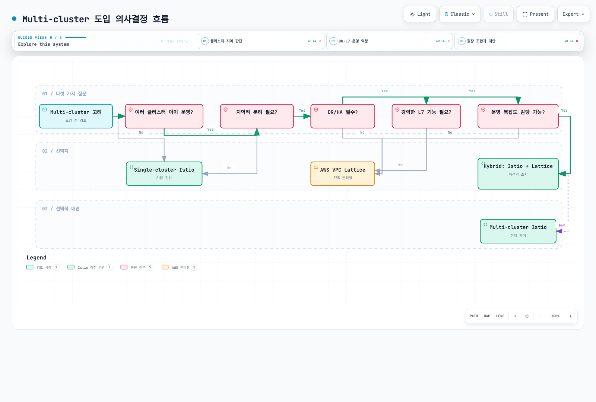

[🔍 인터랙티브 다이어그램 보기](https://www.atomai.click/kubernetes-docs/archmaps/ko-service-mesh-istio-advanced-02-multi-cluster-0.html)

### Multi-cluster가 필요한 경우 ✅

#### 1. 지리적 분산 및 지연 시간 최적화

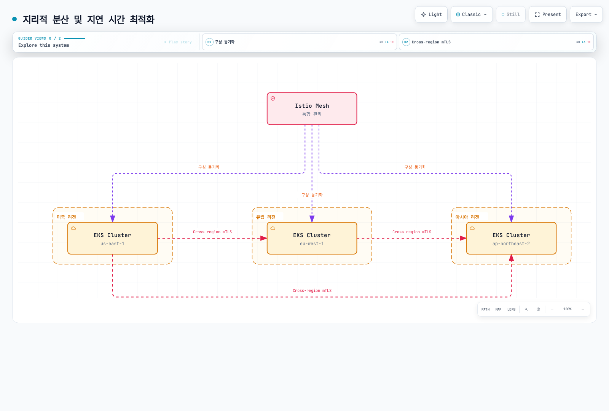

[🔍 인터랙티브 다이어그램 보기](https://www.atomai.click/kubernetes-docs/archmaps/ko-service-mesh-istio-advanced-02-multi-cluster-1.html)

**필요한 경우**:

* ✅ 글로벌 사용자 대상 서비스 (지연 시간 <100ms 목표)
* ✅ 데이터 주권 규정 준수 (GDPR, 금융 데이터 로컬리제이션)
* ✅ 리전별 트래픽 라우팅 및 장애 격리

#### 2. 재해 복구 (Disaster Recovery)

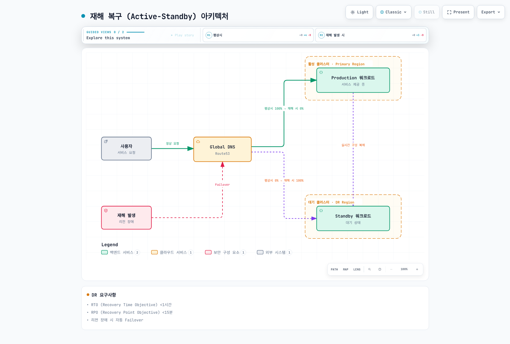

[🔍 인터랙티브 다이어그램 보기](https://www.atomai.click/kubernetes-docs/archmaps/ko-service-mesh-istio-advanced-02-multi-cluster-2.html)

**필요한 경우**:

* ✅ RTO (Recovery Time Objective) <1시간
* ✅ RPO (Recovery Point Objective) <15분
* ✅ 리전 장애 시 자동 Failover

#### 3. 환경 분리 및 단계적 배포

**필요한 경우**:

* ✅ Dev/Staging/Prod 클러스터 분리하되 통합 관리
* ✅ Blue/Green 배포를 클러스터 단위로 수행
* ✅ 카나리 배포를 리전 단위로 점진적 확대

#### 4. 조직적 경계 및 보안 격리

**필요한 경우**:

* ✅ 팀별/부서별 독립 클러스터 운영
* ✅ 멀티 테넌시 (Multi-tenancy) 강화
* ✅ 규제 준수를 위한 물리적 격리

### Multi-cluster가 불필요한 경우 ❌

#### 1. 단일 리전, 소규모 서비스

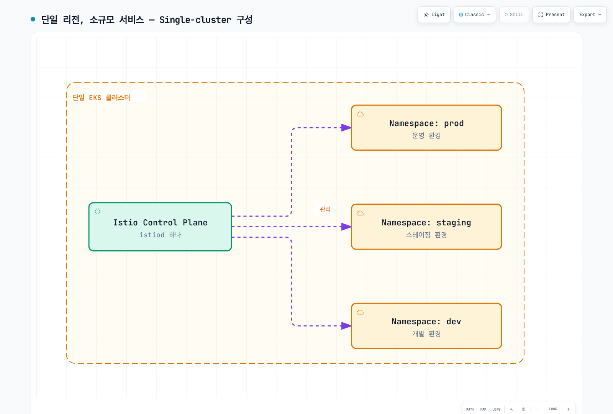

[🔍 인터랙티브 다이어그램 보기](https://www.atomai.click/kubernetes-docs/archmaps/ko-service-mesh-istio-advanced-02-multi-cluster-3.html)

**대신 사용**:

* Kubernetes Namespace 분리
* NetworkPolicy로 네트워크 격리
* RBAC로 접근 제어

#### 2. 운영 복잡도를 감당할 수 없는 경우

**Multi-cluster 운영 요구사항**:

* 최소 2-3명의 Istio 전문가
* East-West Gateway 관리 및 모니터링
* 클러스터 간 인증서 관리
* Cross-cluster 디버깅 능력

**팀이 작다면**:

* Single-cluster Istio 또는
* AWS VPC Lattice (관리형 서비스)

#### 3. 비용이 핵심 고려사항인 경우

**Multi-cluster 추가 비용**:

* East-West Gateway용 LoadBalancer (리전당 $20-50/월)
* Cross-region 데이터 전송 ($0.02/GB)
* Control Plane 중복 (리소스 2-3배)

### 체크리스트

도입 전 다음 질문에 답해보세요:

**아키텍처**:

* [ ] 2개 이상의 클러스터가 이미 운영 중인가?
* [ ] 여러 리전에 배포가 필요한가?
* [ ] 클러스터 간 서비스 호출이 빈번한가?

**비즈니스 요구사항**:

* [ ] 글로벌 사용자 대상인가?
* [ ] 재해 복구 (DR)가 필수인가?
* [ ] RTO/RPO 요구사항이 엄격한가?

**보안 및 규제**:

* [ ] 데이터 로컬리제이션이 필요한가?
* [ ] 강력한 클러스터 간 격리가 필요한가?

**운영 역량**:

* [ ] Istio 전문가가 있는가?
* [ ] 복잡한 네트워킹 디버깅이 가능한가?
* [ ] 추가 비용을 감당할 수 있는가?

**결과**:

* ✅ 9개 이상 체크: Multi-cluster Istio 권장
* 🟡 5-8개 체크: VPC Lattice 또는 Hybrid 고려
* ❌ 4개 이하 체크: Single-cluster Istio로 시작

## 아키텍처 선택 가이드

### 상황별 최적 솔루션

| 상황                   | Single-cluster | Multi-cluster Istio | VPC Lattice | Hybrid |
| -------------------- | -------------- | ------------------- | ----------- | ------ |
| **단일 리전, 소규모**       | ✅ 최적           | ❌ 과도함               | ❌ 불필요       | ❌ 불필요  |
| **다중 리전, 강력한 L7 필요** | ❌ 불가능          | ✅ 최적                | ⚠️ 제한적      | ✅ 권장   |
| **AWS 중심, 간단한 연결**   | ⚠️ 제한적         | ⚠️ 과도함              | ✅ 최적        | ⚠️ 불필요 |
| **DR, 자동 Failover**  | ❌ 불가능          | ✅ 최적                | ⚠️ 수동       | ✅ 권장   |
| **비용 최적화 우선**        | ✅ 최적           | ❌ 비쌈                | ✅ 권장        | ⚠️ 중간  |
| **운영 단순화**           | ✅ 최적           | ❌ 복잡                | ✅ 최적        | ⚠️ 중간  |
| **세밀한 트래픽 제어**       | ✅ 가능           | ✅ 최적                | ❌ 제한적       | ✅ 권장   |

### 각 솔루션 비교

#### Single-cluster Istio

**장점**:

* ✅ 가장 간단한 관리
* ✅ 낮은 비용
* ✅ 빠른 디버깅
* ✅ 모든 Istio 기능 사용 가능

**단점**:

* ❌ 단일 장애점
* ❌ 리전 장애 시 전체 서비스 중단
* ❌ 지리적 분산 불가능

**적합한 경우**:

* 단일 리전 서비스
* 소규모 팀 (<50명)
* 높은 가용성이 필수 아닌 경우

#### Multi-cluster Istio

**장점**:

* ✅ 완전한 지리적 분산
* ✅ 자동 DR 및 Failover
* ✅ 모든 L7 기능 (Retry, Timeout, Circuit Breaker)
* ✅ 세밀한 트래픽 제어
* ✅ 통합 관찰성

**단점**:

* ❌ 높은 운영 복잡도
* ❌ East-West Gateway 관리 필요
* ❌ Cross-region 데이터 전송 비용
* ❌ 디버깅 어려움

**적합한 경우**:

* 글로벌 서비스
* 강력한 DR 필요
* 세밀한 L7 제어 필수

#### AWS VPC Lattice

**장점**:

* ✅ AWS 완전 관리형
* ✅ 간단한 설정
* ✅ 낮은 운영 부담
* ✅ VPC 간 안전한 연결
* ✅ 비용 효율적

**단점**:

* ❌ L7 기능 제한적 (Retry, Circuit Breaker 없음)
* ❌ AWS에만 종속
* ❌ 세밀한 트래픽 제어 불가
* ❌ Istio 관찰성 부족

**적합한 경우**:

* AWS 중심 아키텍처
* 간단한 서비스 간 연결만 필요
* 운영 단순화 우선

## Istio vs AWS VPC Lattice

### 기능 비교

| 기능              | Istio Multi-cluster | AWS VPC Lattice | Hybrid     |
| --------------- | ------------------- | --------------- | ---------- |
| **트래픽 라우팅**     |                     |                 |            |
| 헤더 기반 라우팅       | ✅ 완벽 지원             | ⚠️ 제한적          | ✅ Istio 담당 |
| Weighted 라우팅    | ✅ 지원                | ✅ 지원            | ✅ 둘 다 가능   |
| Path 기반 라우팅     | ✅ 지원                | ✅ 지원            | ✅ 둘 다 가능   |
| **복원력**         |                     |                 |            |
| Retry           | ✅ 세밀한 제어            | ❌ 미지원           | ✅ Istio 담당 |
| Timeout         | ✅ 세밀한 제어            | ⚠️ 기본만          | ✅ Istio 담당 |
| Circuit Breaker | ✅ 지원                | ❌ 미지원           | ✅ Istio 담당 |
| **보안**          |                     |                 |            |
| mTLS            | ✅ 자동                | ✅ 지원            | ✅ 둘 다      |
| 인증/인가           | ✅ 세밀한 정책            | ⚠️ IAM만         | ✅ Istio 담당 |
| **관찰성**         |                     |                 |            |
| 분산 추적           | ✅ Jaeger/Zipkin     | ❌ 제한적           | ✅ Istio 담당 |
| 메트릭             | ✅ 상세                | ⚠️ 기본만          | ✅ Istio 담당 |
| **운영**          |                     |                 |            |
| 관리 복잡도          | 🔴 높음               | 🟢 낮음           | 🟡 중간      |
| 비용              | 🔴 높음               | 🟢 낮음           | 🟡 중간      |
| AWS 통합          | 🟡 수동               | 🟢 네이티브         | 🟢 우수      |

### 아키텍처 패턴 비교

#### 패턴 1: Istio Multi-cluster만 사용

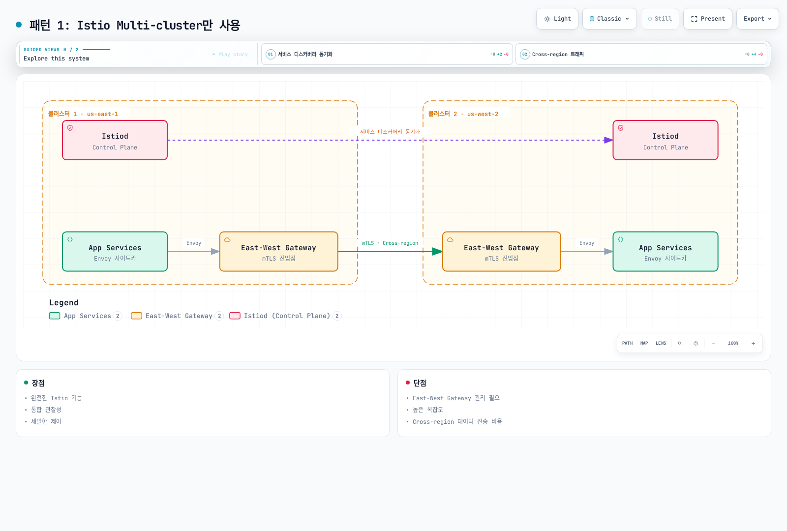

[🔍 인터랙티브 다이어그램 보기](https://www.atomai.click/kubernetes-docs/archmaps/ko-service-mesh-istio-advanced-02-multi-cluster-4.html)

**장점**:

* 완전한 Istio 기능
* 통합 관찰성
* 세밀한 제어

**단점**:

* East-West Gateway 관리 필요
* 높은 복잡도
* Cross-region 데이터 전송 비용

#### 패턴 2: VPC Lattice만 사용

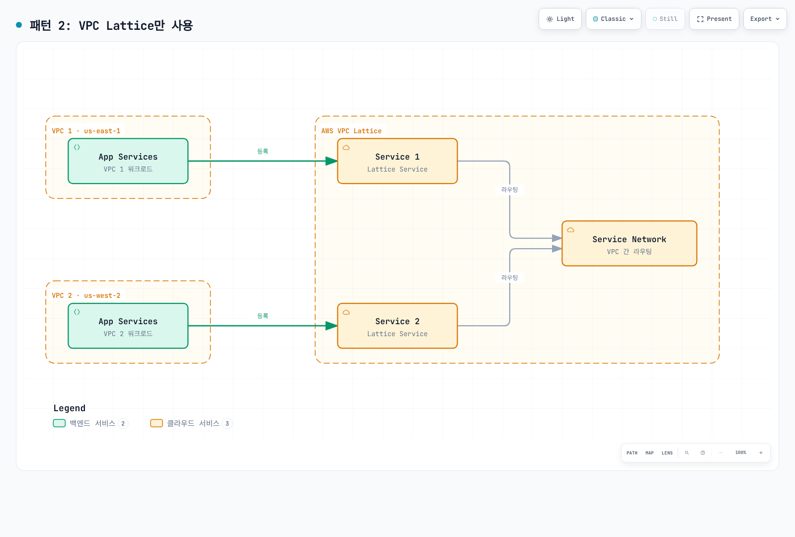

[🔍 인터랙티브 다이어그램 보기](https://www.atomai.click/kubernetes-docs/archmaps/ko-service-mesh-istio-advanced-02-multi-cluster-5.html)

**장점**:

* AWS 완전 관리형
* 간단한 설정
* 낮은 운영 부담

**단점**:

* Istio 기능 사용 불가
* 제한적인 트래픽 제어
* Kubernetes 네이티브 아님

#### 패턴 3: Hybrid (권장)

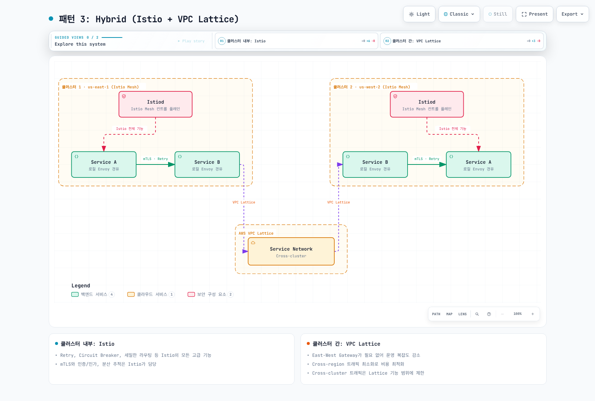

[🔍 인터랙티브 다이어그램 보기](https://www.atomai.click/kubernetes-docs/archmaps/ko-service-mesh-istio-advanced-02-multi-cluster-6.html)

**장점**:

* ✅ 클러스터 내부: Istio의 모든 고급 기능 (Retry, Circuit Breaker, 세밀한 라우팅)
* ✅ 클러스터 간: VPC Lattice의 간단한 관리 및 안정성
* ✅ 운영 복잡도 감소 (East-West Gateway 불필요)
* ✅ 비용 최적화 (Cross-region 트래픽 최소화)

**단점**:

* ⚠️ 두 가지 기술 스택 이해 필요
* ⚠️ Cross-cluster는 Lattice 기능에 제한

**적합한 경우**:

* AWS 환경
* 클러스터 내부는 복잡한 트래픽 제어 필요
* 클러스터 간은 간단한 연결만 필요

## Multi-cluster 개요

Multi-cluster Service Mesh를 사용하면:

* 다중 리전 배포
* 재해 복구 (DR)
* 환경 분리 (dev/staging/prod)
* 클러스터 간 서비스 검색 및 통신

## 토폴로지

### Primary-Remote

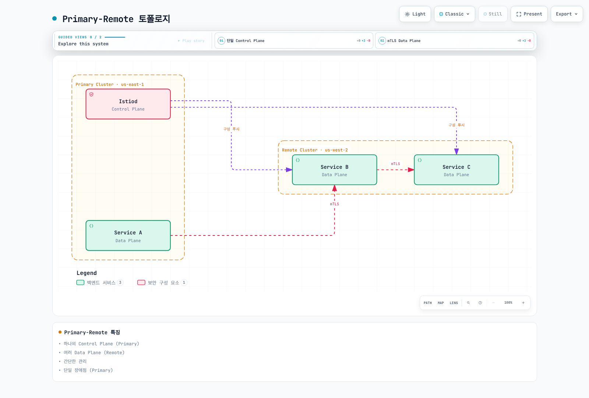

[🔍 인터랙티브 다이어그램 보기](https://www.atomai.click/kubernetes-docs/archmaps/ko-service-mesh-istio-advanced-02-multi-cluster-7.html)

**특징**:

* 하나의 Control Plane (Primary)
* 여러 Data Plane (Remote)
* 간단한 관리
* 단일 장애점 (Primary)

### Multi-Primary

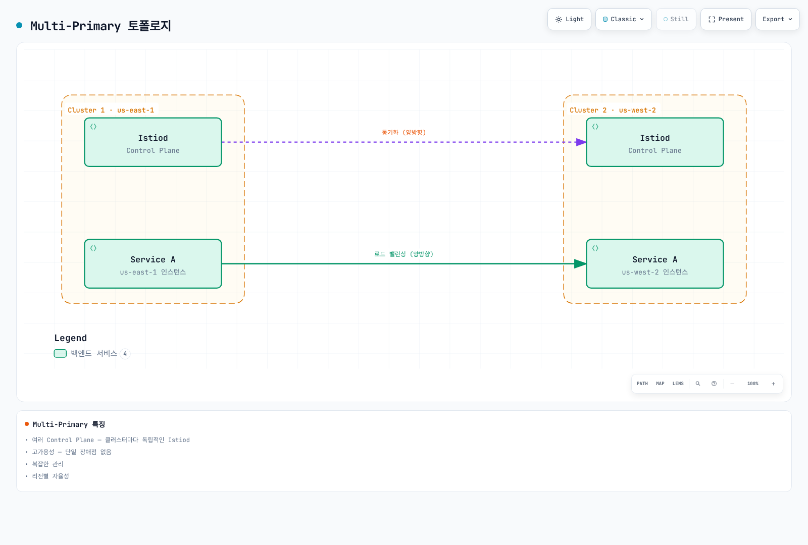

[🔍 인터랙티브 다이어그램 보기](https://www.atomai.click/kubernetes-docs/archmaps/ko-service-mesh-istio-advanced-02-multi-cluster-8.html)

**특징**:

* 여러 Control Plane
* 고가용성
* 복잡한 관리
* 리전별 자율성

## Primary-Remote 설정

### 1. Primary 클러스터 설정

```bash
# Context 설정
export CTX_CLUSTER1=cluster1

# Istio 설치
istioctl install --context="${CTX_CLUSTER1}" -f - <<EOF
apiVersion: install.istio.io/v1alpha1
kind: IstioOperator
spec:
  values:
    global:
      meshID: mesh1
      multiCluster:
        clusterName: cluster1
      network: network1
EOF

# East-West Gateway 설치
samples/multicluster/gen-eastwest-gateway.sh \
  --mesh mesh1 --cluster cluster1 --network network1 | \
  istioctl install --context="${CTX_CLUSTER1}" -y -f -

# Gateway 노출
kubectl apply --context="${CTX_CLUSTER1}" -f \
  samples/multicluster/expose-services.yaml
```

### 2. Remote 클러스터 설정

```bash
# Context 설정
export CTX_CLUSTER2=cluster2

# Remote Secret 생성
istioctl create-remote-secret \
  --context="${CTX_CLUSTER1}" \
  --name=cluster1 | \
  kubectl apply -f - --context="${CTX_CLUSTER2}"

# Remote 구성으로 Istio 설치
istioctl install --context="${CTX_CLUSTER2}" -f - <<EOF
apiVersion: install.istio.io/v1alpha1
kind: IstioOperator
spec:
  values:
    global:
      meshID: mesh1
      multiCluster:
        clusterName: cluster2
      network: network1
      remotePilotAddress: ${DISCOVERY_ADDRESS}
EOF
```

## Multi-Primary 설정

### 1. 두 클러스터 모두 Primary로 설정

```bash
# Cluster 1
istioctl install --context="${CTX_CLUSTER1}" -f - <<EOF
apiVersion: install.istio.io/v1alpha1
kind: IstioOperator
spec:
  values:
    global:
      meshID: mesh1
      multiCluster:
        clusterName: cluster1
      network: network1
EOF

# Cluster 2
istioctl install --context="${CTX_CLUSTER2}" -f - <<EOF
apiVersion: install.istio.io/v1alpha1
kind: IstioOperator
spec:
  values:
    global:
      meshID: mesh1
      multiCluster:
        clusterName: cluster2
      network: network2
EOF
```

### 2. Remote Secret 상호 등록

```bash
# Cluster 1의 Secret을 Cluster 2에
istioctl create-remote-secret \
  --context="${CTX_CLUSTER1}" \
  --name=cluster1 | \
  kubectl apply -f - --context="${CTX_CLUSTER2}"

# Cluster 2의 Secret을 Cluster 1에
istioctl create-remote-secret \
  --context="${CTX_CLUSTER2}" \
  --name=cluster2 | \
  kubectl apply -f - --context="${CTX_CLUSTER1}"
```

## Cross-cluster 통신

### Service Entry

```yaml
apiVersion: networking.istio.io/v1
kind: ServiceEntry
metadata:
  name: httpbin-cluster2
spec:
  hosts:
  - httpbin.default.svc.cluster.local
  location: MESH_INTERNAL
  ports:
  - number: 8000
    name: http
    protocol: HTTP
  resolution: DNS
  addresses:
  - 240.0.0.1
  endpoints:
  - address: ${CLUSTER2_INGRESS_HOST}
    ports:
      http: 15443
```

## VPC Lattice와 함께 사용하기

### Hybrid 아키텍처 구현

Istio와 VPC Lattice를 함께 사용하여 최선의 조합을 만들 수 있습니다.

#### 1단계: Istio를 각 클러스터에 독립 설치

```bash
# Cluster 1 (단일 클러스터 모드)
export CTX_CLUSTER1=cluster1
istioctl install --context="${CTX_CLUSTER1}" -f - <<EOF
apiVersion: install.istio.io/v1alpha1
kind: IstioOperator
spec:
  values:
    global:
      meshID: mesh1-cluster1
      multiCluster:
        enabled: false  # Multi-cluster 비활성화
      network: network1
EOF

# Cluster 2 (독립 설치)
export CTX_CLUSTER2=cluster2
istioctl install --context="${CTX_CLUSTER2}" -f - <<EOF
apiVersion: install.istio.io/v1alpha1
kind: IstioOperator
spec:
  values:
    global:
      meshID: mesh1-cluster2
      multiCluster:
        enabled: false  # Multi-cluster 비활성화
      network: network2
EOF
```

#### 2단계: VPC Lattice Service Network 생성

```bash
# Service Network 생성
aws vpc-lattice create-service-network \
  --name my-service-network \
  --auth-type AWS_IAM

# Service Network ID 저장
SERVICE_NETWORK_ID=$(aws vpc-lattice list-service-networks \
  --query 'items[?name==`my-service-network`].id' \
  --output text)

# VPC 연결 (Cluster 1 VPC)
aws vpc-lattice create-service-network-vpc-association \
  --service-network-identifier $SERVICE_NETWORK_ID \
  --vpc-identifier $VPC1_ID

# VPC 연결 (Cluster 2 VPC)
aws vpc-lattice create-service-network-vpc-association \
  --service-network-identifier $SERVICE_NETWORK_ID \
  --vpc-identifier $VPC2_ID
```

#### 3단계: Kubernetes Service를 VPC Lattice에 등록

```yaml
# Cluster 1의 서비스를 VPC Lattice에 등록
apiVersion: application-networking.k8s.aws/v1alpha1
kind: ServiceExport
metadata:
  name: my-service
  namespace: default
  annotations:
    application-networking.k8s.aws/lattice-service-network: my-service-network
spec: {}
---
# Cluster 1에서 VPC Lattice로 라우팅
apiVersion: networking.istio.io/v1
kind: ServiceEntry
metadata:
  name: remote-service-via-lattice
  namespace: default
spec:
  hosts:
  - remote-service.lattice.svc.cluster.local
  location: MESH_EXTERNAL
  ports:
  - number: 80
    name: http
    protocol: HTTP
  resolution: DNS
  endpoints:
  - address: ${LATTICE_SERVICE_DNS}  # VPC Lattice DNS
    ports:
      http: 80
---
# VPC Lattice 트래픽에 mTLS 적용 안 함
apiVersion: networking.istio.io/v1beta1
kind: DestinationRule
metadata:
  name: remote-service-via-lattice
  namespace: default
spec:
  host: remote-service.lattice.svc.cluster.local
  trafficPolicy:
    tls:
      mode: SIMPLE  # VPC Lattice가 TLS 처리
```

#### 4단계: IAM 정책 설정

```json
{
  "Version": "2012-10-17",
  "Statement": [
    {
      "Effect": "Allow",
      "Principal": {
        "AWS": "*"
      },
      "Action": "vpc-lattice-svcs:Invoke",
      "Resource": "*",
      "Condition": {
        "StringEquals": {
          "vpc-lattice-svcs:SourceVpc": [
            "${VPC1_ID}",
            "${VPC2_ID}"
          ]
        }
      }
    }
  ]
}
```

### 트래픽 흐름

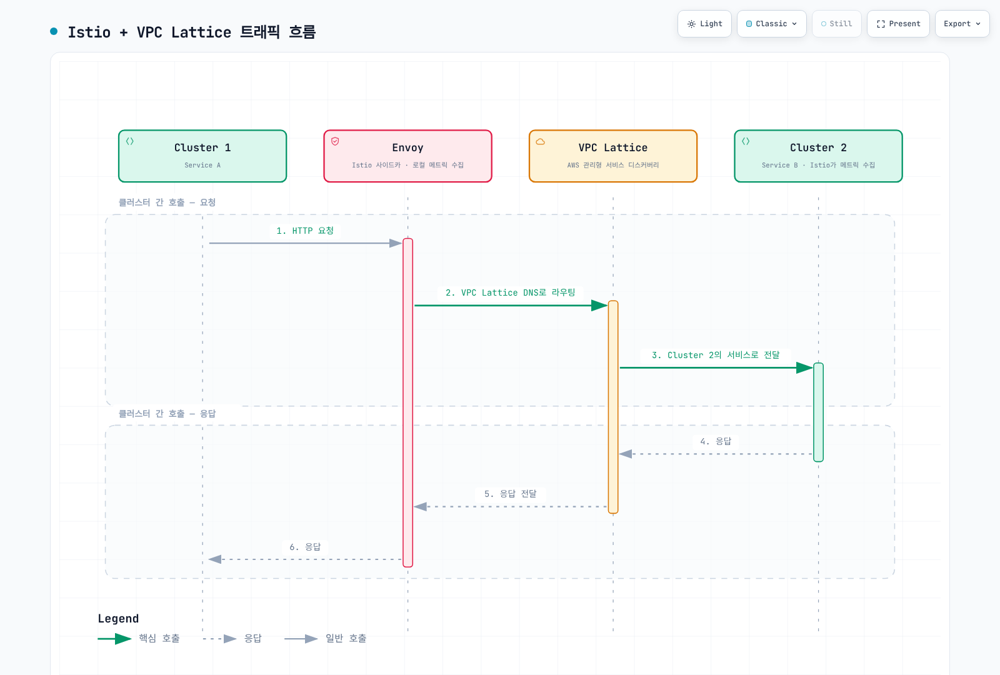

[🔍 인터랙티브 다이어그램 보기](https://www.atomai.click/kubernetes-docs/archmaps/ko-service-mesh-istio-advanced-02-multi-cluster-9.html)

### 장점과 고려사항

**장점**:

* ✅ 클러스터 내부: Istio의 모든 기능 (Retry, Circuit Breaker, 세밀한 라우팅)
* ✅ 클러스터 간: VPC Lattice의 간편한 관리
* ✅ East-West Gateway 불필요 → 운영 부담 감소
* ✅ AWS 네이티브 통합

**고려사항**:

* ⚠️ Cross-cluster 트래픽은 VPC Lattice 기능에 제한
* ⚠️ VPC Lattice는 Retry, Timeout을 세밀하게 제어할 수 없음
* ⚠️ Istio 분산 추적이 클러스터 경계에서 끊김 (각 클러스터에서 독립적으로 추적)

## 실전 예제

### 예제 1: 글로벌 전자상거래 (Multi-Primary + VPC Lattice)

#### 아키텍처

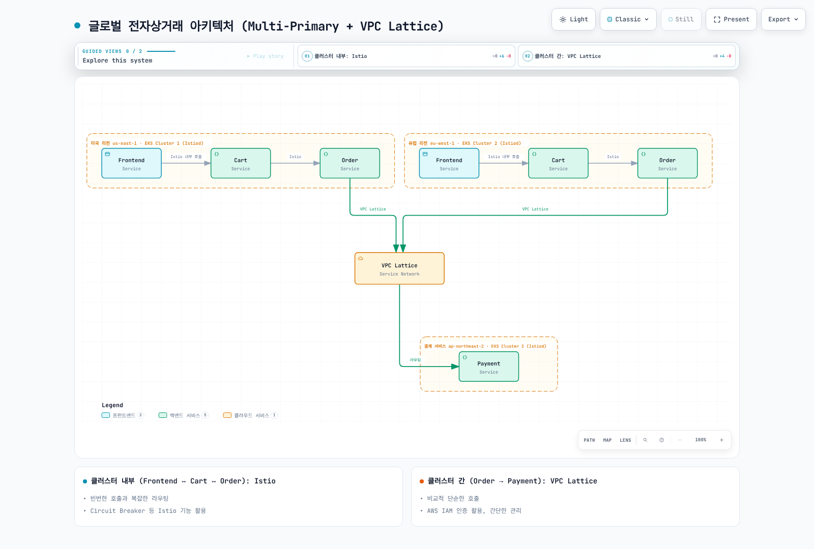

[🔍 인터랙티브 다이어그램 보기](https://www.atomai.click/kubernetes-docs/archmaps/ko-service-mesh-istio-advanced-02-multi-cluster-10.html)

**의사결정**:

* ✅ **클러스터 내부 (Frontend ↔ Cart ↔ Order)**: Istio 사용
  * 이유: 빈번한 호출, 복잡한 라우팅, Circuit Breaker 필요
* ✅ **클러스터 간 (Order → Payment)**: VPC Lattice 사용
  * 이유: 비교적 단순한 호출, AWS IAM 인증 활용, 간단한 관리

#### 구성 예시

**Cluster 1/2: Frontend → Cart (Istio)**

```yaml
apiVersion: networking.istio.io/v1
kind: VirtualService
metadata:
  name: cart-service
  namespace: default
spec:
  hosts:
  - cart.default.svc.cluster.local
  http:
  - match:
    - headers:
        user-type:
          exact: premium
    route:
    - destination:
        host: cart.default.svc.cluster.local
        subset: v2
      weight: 100
  - route:
    - destination:
        host: cart.default.svc.cluster.local
        subset: v1
      weight: 100
---
apiVersion: networking.istio.io/v1beta1
kind: DestinationRule
metadata:
  name: cart-service
spec:
  host: cart.default.svc.cluster.local
  trafficPolicy:
    connectionPool:
      tcp:
        maxConnections: 100
      http:
        http1MaxPendingRequests: 1024
        maxRequestsPerConnection: 10
    outlierDetection:
      consecutiveErrors: 5
      interval: 10s
      baseEjectionTime: 30s
  subsets:
  - name: v1
    labels:
      version: v1
  - name: v2
    labels:
      version: v2
```

**Cluster 1/2: Order → Payment (VPC Lattice)**

```yaml
# ServiceEntry for VPC Lattice
apiVersion: networking.istio.io/v1
kind: ServiceEntry
metadata:
  name: payment-service-lattice
  namespace: default
spec:
  hosts:
  - payment.lattice.svc.cluster.local
  location: MESH_EXTERNAL
  ports:
  - number: 443
    name: https
    protocol: HTTPS
  resolution: DNS
  endpoints:
  - address: payment-service-abc123.vpc-lattice.amazonaws.com
---
# DestinationRule: VPC Lattice TLS
apiVersion: networking.istio.io/v1beta1
kind: DestinationRule
metadata:
  name: payment-service-lattice
spec:
  host: payment.lattice.svc.cluster.local
  trafficPolicy:
    tls:
      mode: SIMPLE  # VPC Lattice가 TLS 처리
```

### 예제 2: 재해 복구 (DR) 시나리오

#### Active-Standby with Route53 Failover

```yaml
# Cluster 1 (Active): Health Check Endpoint
apiVersion: v1
kind: Service
metadata:
  name: health-check
  namespace: istio-system
  annotations:
    service.beta.kubernetes.io/aws-load-balancer-type: "nlb"
    external-dns.alpha.kubernetes.io/hostname: api.example.com
    external-dns.alpha.kubernetes.io/set-identifier: "us-east-1-primary"
    external-dns.alpha.kubernetes.io/aws-health-check-id: "health-check-primary"
spec:
  type: LoadBalancer
  selector:
    app: health-check
  ports:
  - port: 80
    targetPort: 8080
---
# Cluster 2 (Standby): Health Check Endpoint
apiVersion: v1
kind: Service
metadata:
  name: health-check
  namespace: istio-system
  annotations:
    service.beta.kubernetes.io/aws-load-balancer-type: "nlb"
    external-dns.alpha.kubernetes.io/hostname: api.example.com
    external-dns.alpha.kubernetes.io/set-identifier: "us-west-2-standby"
    external-dns.alpha.kubernetes.io/aws-health-check-id: "health-check-standby"
spec:
  type: LoadBalancer
  selector:
    app: health-check
  ports:
  - port: 80
    targetPort: 8080
```

**Route53 Health Check 및 Failover 정책**:

```bash
# Primary Health Check 생성
aws route53 create-health-check \
  --caller-reference "$(date +%s)" \
  --health-check-config \
    Type=HTTPS,ResourcePath=/healthz,FullyQualifiedDomainName=${PRIMARY_LB_DNS},Port=443

# Failover Routing Policy
aws route53 change-resource-record-sets \
  --hosted-zone-id ${ZONE_ID} \
  --change-batch file://failover-config.json
```

**failover-config.json**:

```json
{
  "Changes": [
    {
      "Action": "CREATE",
      "ResourceRecordSet": {
        "Name": "api.example.com",
        "Type": "A",
        "SetIdentifier": "Primary",
        "Failover": "PRIMARY",
        "AliasTarget": {
          "HostedZoneId": "${NLB_ZONE_ID}",
          "DNSName": "${PRIMARY_LB_DNS}",
          "EvaluateTargetHealth": true
        },
        "HealthCheckId": "${PRIMARY_HEALTH_CHECK_ID}"
      }
    },
    {
      "Action": "CREATE",
      "ResourceRecordSet": {
        "Name": "api.example.com",
        "Type": "A",
        "SetIdentifier": "Secondary",
        "Failover": "SECONDARY",
        "AliasTarget": {
          "HostedZoneId": "${NLB_ZONE_ID}",
          "DNSName": "${STANDBY_LB_DNS}",
          "EvaluateTargetHealth": true
        }
      }
    }
  ]
}
```

## 성능 및 비용 비교

### 성능 비교

| 메트릭            | Single-cluster | Multi-cluster Istio    | Hybrid (Istio + Lattice) |
| -------------- | -------------- | ---------------------- | ------------------------ |
| **클러스터 내부 지연** | \~2ms          | \~2ms                  | \~2ms                    |
| **클러스터 간 지연**  | N/A            | +5-10ms (East-West GW) | +3-5ms (VPC Lattice)     |
| **처리량 (RPS)**  | 10,000         | 8,500                  | 9,200                    |
| **CPU 오버헤드**   | +10%           | +15%                   | +12%                     |
| **메모리 사용**     | +50MB/pod      | +70MB/pod              | +55MB/pod                |

### 비용 비교 (월간, 2개 클러스터 기준)

| 항목                    | Single-cluster | Multi-cluster Istio | Hybrid     | VPC Lattice만 |
| --------------------- | -------------- | ------------------- | ---------- | ------------ |
| **Control Plane**     | $50            | $100 (×2)           | $100 (×2)  | $0           |
| **East-West Gateway** | $0             | $100 (NLB ×2)       | $0         | $0           |
| **Cross-region 전송**   | $0             | $200 (10TB)         | $100 (5TB) | $100 (5TB)   |
| **VPC Lattice**       | $0             | $0                  | $30        | $50          |
| **운영 인력**             | $10,000        | $15,000             | $12,000    | $8,000       |
| **총 예상 비용**           | \~$10,050      | \~$15,400           | \~$12,230  | \~$8,150     |

**비용 절감 팁**:

* VPC Peering 사용 시 Cross-region 전송 비용 절감 가능
* VPC Lattice는 처리량 기반 과금 → 트래픽 최적화 필수
* Ambient Mode 사용 시 리소스 오버헤드 90% 절감

### ROI 분석

**Multi-cluster Istio 투자 가치**:

* ✅ 다운타임 비용 > $1,000/시간 → 강력 권장
* ✅ 글로벌 고객 경험 중요 → 권장
* ⚠️ 소규모 스타트업 → 과도한 투자

**Hybrid 접근의 sweet spot**:

* AWS 중심 아키텍처
* 클러스터 내부는 복잡한 로직
* 클러스터 간은 단순 연결

## 문제 해결

```bash
# 클러스터 간 연결 확인
istioctl ps --context="${CTX_CLUSTER1}"
istioctl ps --context="${CTX_CLUSTER2}"

# Remote Secret 확인
kubectl get secrets -n istio-system --context="${CTX_CLUSTER1}"

# Cross-cluster 트래픽 확인
kubectl logs -n istio-system -l app=istiod --context="${CTX_CLUSTER1}"
```

## 참고 자료

### 공식 문서

* [Istio Multi-cluster](https://istio.io/latest/docs/setup/install/multicluster/)
* [Multi-Primary](https://istio.io/latest/docs/setup/install/multicluster/multi-primary/)
* [Primary-Remote](https://istio.io/latest/docs/setup/install/multicluster/primary-remote/)
* [AWS VPC Lattice](https://docs.aws.amazon.com/vpc-lattice/latest/ug/what-is-vpc-lattice.html)
* [AWS Gateway API Controller](https://www.gateway-api-controller.eks.aws.dev/)

### 블로그 및 사례 연구

* [Tetrate - Multi-cluster Istio](https://tetrate.io/blog/multicluster-istio/)
* [Solo.io - Istio Multi-cluster Best Practices](https://www.solo.io/blog/istio-multicluster/)
* [SKT Enterprise - Istio Ambient Mesh 소개](https://www.sktenterprise.com/bizInsight/blogDetail/dev/14768)

### 관련 문서

* [Ambient Mode](01-ambient-mode.md) - 리소스 최적화
* [mTLS](../security/01-mtls.md) - 클러스터 간 보안 통신
* [VPC Lattice](https://github.com/Atom-oh/kubernetes-docs/blob/main/ko/service-mesh/networking/02-vpc-lattice.md) - AWS 관리형 서비스 네트워킹

## 요약

Multi-cluster Service Mesh는 강력하지만 복잡도와 비용이 증가합니다. 의사결정 가이드:

| 선택                      | 적합한 경우                  | 주요 장점               | 주요 단점               |
| ----------------------- | ----------------------- | ------------------- | ------------------- |
| **Single-cluster**      | 단일 리전, 소규모              | 간단한 관리, 낮은 비용       | 단일 장애점, 지리적 분산 불가   |
| **Multi-cluster Istio** | 글로벌 서비스, 강력한 L7 필요      | 완전한 제어, 모든 Istio 기능 | 높은 복잡도, 높은 비용       |
| **VPC Lattice**         | AWS 중심, 간단한 연결          | AWS 관리형, 낮은 운영 부담   | Istio 기능 제한, AWS 종속 |
| **Hybrid**              | AWS 환경, 복잡한 내부 + 간단한 외부 | 균형잡힌 복잡도와 기능        | 두 기술 스택 이해 필요       |

**권장 접근**:

1. Single-cluster로 시작
2. Multi-region 필요 시 → Hybrid (Istio + VPC Lattice) 고려
3. 강력한 L7 제어 필수 시 → Multi-cluster Istio
4. 운영 단순화 우선 시 → VPC Lattice만 사용
