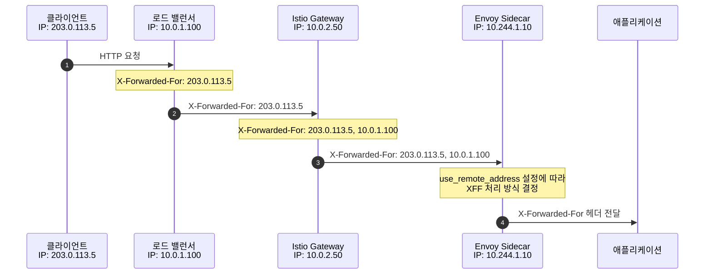
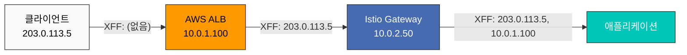
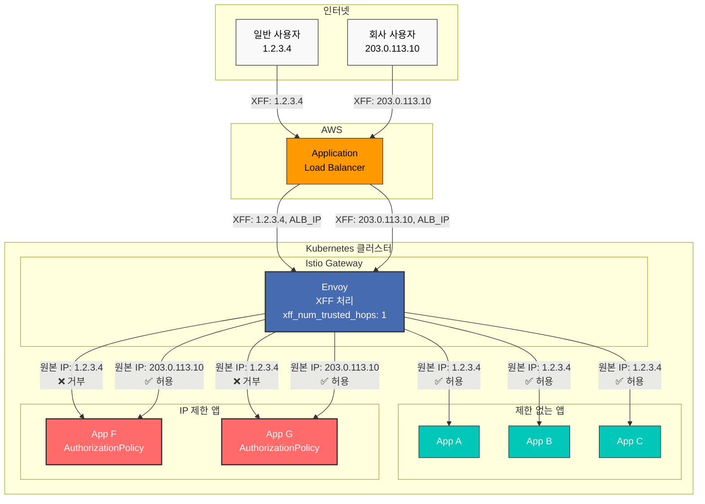
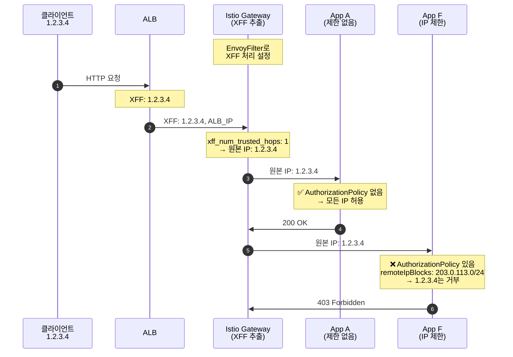

# EnvoyFilter

> **지원 버전**: Istio 1.28+
> **마지막 업데이트**: 2026년 2월 19일

EnvoyFilter는 Envoy 프록시의 구성을 직접 커스터마이즈할 수 있는 고급 기능입니다.

## 목차

1. [개요](#개요)
2. [구조](#구조)
3. [주요 사용 사례](#주요-사용-사례)
4. [X-Forwarded-For 및 Hop 설정](#x-forwarded-for-및-hop-설정)
5. [정적 응답 설정](#정적-응답-설정)
6. [실전 예제](#실전-예제)
7. [모범 사례](#모범-사례)
8. [문제 해결](#문제-해결)

## 개요

EnvoyFilter를 사용하면:
- 커스텀 헤더 추가/수정/삭제
- Rate Limiting
- External Authorization
- WASM 플러그인 통합

## 구조

```yaml
apiVersion: networking.istio.io/v1alpha3
kind: EnvoyFilter
metadata:
  name: custom-filter
  namespace: default
spec:
  workloadSelector:
    labels:
      app: myapp
  configPatches:
  - applyTo: HTTP_FILTER
    match:
      context: SIDECAR_OUTBOUND
      listener:
        filterChain:
          filter:
            name: "envoy.filters.network.http_connection_manager"
    patch:
      operation: INSERT_BEFORE
      value:
        name: envoy.filters.http.lua
        typed_config:
          "@type": type.googleapis.com/envoy.extensions.filters.http.lua.v3.Lua
          inline_code: |
            function envoy_on_request(request_handle)
              request_handle:headers():add("x-custom-header", "value")
            end
```

## 주요 사용 사례

### 1. 커스텀 헤더 추가

```yaml
apiVersion: networking.istio.io/v1alpha3
kind: EnvoyFilter
metadata:
  name: add-header
spec:
  workloadSelector:
    labels:
      app: myapp
  configPatches:
  - applyTo: HTTP_FILTER
    match:
      context: SIDECAR_OUTBOUND
    patch:
      operation: INSERT_BEFORE
      value:
        name: envoy.filters.http.lua
        typed_config:
          "@type": type.googleapis.com/envoy.extensions.filters.http.lua.v3.Lua
          inline_code: |
            function envoy_on_request(request_handle)
              request_handle:headers():add("x-request-id", request_handle:headers():get(":authority"))
              request_handle:headers():add("x-forwarded-proto", "https")
            end
```

### 2. Rate Limiting

```yaml
apiVersion: networking.istio.io/v1alpha3
kind: EnvoyFilter
metadata:
  name: ratelimit
spec:
  workloadSelector:
    labels:
      app: api-service
  configPatches:
  - applyTo: HTTP_FILTER
    match:
      context: SIDECAR_INBOUND
    patch:
      operation: INSERT_BEFORE
      value:
        name: envoy.filters.http.local_ratelimit
        typed_config:
          "@type": type.googleapis.com/envoy.extensions.filters.http.local_ratelimit.v3.LocalRateLimit
          stat_prefix: http_local_rate_limiter
          token_bucket:
            max_tokens: 100
            tokens_per_fill: 10
            fill_interval: 1s
```

### 3. WASM 플러그인

```yaml
apiVersion: networking.istio.io/v1alpha3
kind: EnvoyFilter
metadata:
  name: wasm-filter
spec:
  workloadSelector:
    labels:
      app: myapp
  configPatches:
  - applyTo: HTTP_FILTER
    match:
      context: SIDECAR_INBOUND
    patch:
      operation: INSERT_BEFORE
      value:
        name: envoy.filters.http.wasm
        typed_config:
          "@type": type.googleapis.com/envoy.extensions.filters.http.wasm.v3.Wasm
          config:
            vm_config:
              runtime: "envoy.wasm.runtime.v8"
              code:
                local:
                  filename: "/var/local/lib/wasm-filters/my_plugin.wasm"
```

## X-Forwarded-For 및 Hop 설정

프록시 체인 환경에서 실제 클라이언트 IP를 추적하기 위해 X-Forwarded-For (XFF) 헤더와 hop 수를 제어하는 것은 매우 중요합니다.

### X-Forwarded-For 개요



### XFF 설정 옵션

#### 1. use_remote_address 설정

**use_remote_address**는 Envoy가 XFF 헤더를 어떻게 처리할지 결정합니다.

```yaml
apiVersion: networking.istio.io/v1alpha3
kind: EnvoyFilter
metadata:
  name: xff-config
  namespace: istio-system
spec:
  workloadSelector:
    labels:
      istio: ingressgateway
  configPatches:
  - applyTo: NETWORK_FILTER
    match:
      context: GATEWAY
      listener:
        filterChain:
          filter:
            name: "envoy.filters.network.http_connection_manager"
    patch:
      operation: MERGE
      value:
        typed_config:
          "@type": type.googleapis.com/envoy.extensions.filters.network.http_connection_manager.v3.HttpConnectionManager
          use_remote_address: true
          xff_num_trusted_hops: 1
```

**use_remote_address 옵션**:

| 설정 값 | 동작 | 사용 시나리오 |
|---------|------|--------------|
| `true` | 다운스트림 주소를 XFF에 추가하고, 신뢰 | Edge Proxy (인터넷 직접 접근) |
| `false` | 다운스트림 주소를 신뢰하지 않고, XFF 그대로 전달 | Internal Proxy (신뢰된 프록시 뒤) |

#### 2. xff_num_trusted_hops 설정

**xff_num_trusted_hops**는 XFF 헤더에서 신뢰할 수 있는 hop 수를 정의합니다.

```yaml
apiVersion: networking.istio.io/v1alpha3
kind: EnvoyFilter
metadata:
  name: xff-trusted-hops
  namespace: istio-system
spec:
  workloadSelector:
    labels:
      istio: ingressgateway
  configPatches:
  - applyTo: NETWORK_FILTER
    match:
      context: GATEWAY
      listener:
        filterChain:
          filter:
            name: "envoy.filters.network.http_connection_manager"
    patch:
      operation: MERGE
      value:
        typed_config:
          "@type": type.googleapis.com/envoy.extensions.filters.network.http_connection_manager.v3.HttpConnectionManager
          use_remote_address: true
          xff_num_trusted_hops: 2  # 마지막 2개 hop 신뢰
          skip_xff_append: false
```

**xff_num_trusted_hops 계산 예시**:

```
X-Forwarded-For: 203.0.113.5, 10.0.1.100, 10.0.2.50, 10.244.1.10
                 [Client IP] [Proxy 1]   [Proxy 2]   [Proxy 3]

xff_num_trusted_hops: 0 → 신뢰 안함
  → 클라이언트 IP: 10.244.1.10 (마지막 hop)

xff_num_trusted_hops: 1 → 마지막 1개 신뢰
  → 클라이언트 IP: 10.0.2.50

xff_num_trusted_hops: 2 → 마지막 2개 신뢰
  → 클라이언트 IP: 10.0.1.100

xff_num_trusted_hops: 3 → 마지막 3개 신뢰
  → 클라이언트 IP: 203.0.113.5 (실제 클라이언트)
```

### 실제 시나리오별 설정

#### 시나리오 1: AWS ALB + Istio Gateway



**설정**:

```yaml
apiVersion: networking.istio.io/v1alpha3
kind: EnvoyFilter
metadata:
  name: gateway-xff-config
  namespace: istio-system
spec:
  workloadSelector:
    labels:
      istio: ingressgateway
  configPatches:
  - applyTo: NETWORK_FILTER
    match:
      context: GATEWAY
      listener:
        filterChain:
          filter:
            name: "envoy.filters.network.http_connection_manager"
    patch:
      operation: MERGE
      value:
        typed_config:
          "@type": type.googleapis.com/envoy.extensions.filters.network.http_connection_manager.v3.HttpConnectionManager
          use_remote_address: true
          xff_num_trusted_hops: 1  # ALB만 신뢰
          skip_xff_append: false
```

**설명**:
- `use_remote_address: true`: Gateway가 edge proxy 역할
- `xff_num_trusted_hops: 1`: ALB (마지막 hop)를 신뢰
- 결과: 실제 클라이언트 IP (`203.0.113.5`)가 올바르게 추출됨

#### 시나리오 2: Client → CloudFront → ALB → Gateway

```mermaid
flowchart LR
    Client[클라이언트<br/>203.0.113.5]
    CF[CloudFront<br/>172.64.0.1]
    ALB[AWS ALB<br/>10.0.1.100]
    Gateway[Istio Gateway<br/>10.0.2.50]
    App[애플리케이션]

    Client -->|"XFF: (없음)"| CF
    CF -->|"XFF: 203.0.113.5"| ALB
    ALB -->|"XFF: 203.0.113.5, 172.64.0.1"| Gateway
    Gateway -->|"XFF: 203.0.113.5, 172.64.0.1, 10.0.1.100"| App

    %% 스타일 정의
    classDef client fill:#f9f9f9,stroke:#333,stroke-width:1px,color:black;
    classDef aws fill:#FF9900,stroke:#333,stroke-width:1px,color:black;
    classDef istio fill:#466BB0,stroke:#333,stroke-width:1px,color:white;
    classDef app fill:#00C7B7,stroke:#333,stroke-width:1px,color:white;

    %% 클래스 적용
    class Client client;
    class CF,ALB aws;
    class Gateway istio;
    class App app;
```



**설정**:

```yaml
apiVersion: networking.istio.io/v1alpha3
kind: EnvoyFilter
metadata:
  name: gateway-xff-cf-alb
  namespace: istio-system
spec:
  workloadSelector:
    labels:
      istio: ingressgateway
  configPatches:
  - applyTo: NETWORK_FILTER
    match:
      context: GATEWAY
      listener:
        filterChain:
          filter:
            name: "envoy.filters.network.http_connection_manager"
    patch:
      operation: MERGE
      value:
        typed_config:
          "@type": type.googleapis.com/envoy.extensions.filters.network.http_connection_manager.v3.HttpConnectionManager
          use_remote_address: true
          xff_num_trusted_hops: 2  # CloudFront + ALB 신뢰
          skip_xff_append: false
```

**XFF 계산**:
```
X-Forwarded-For: 203.0.113.5, 172.64.0.1, 10.0.1.100
                 [실제 IP]  [CloudFront IP] [ALB IP]

xff_num_trusted_hops: 2 → 마지막 2개(CloudFront, ALB) 신뢰
→ 실제 클라이언트 IP: 203.0.113.5
```

#### 시나리오 3: Client → CloudFront → NLB → ALB → Gateway

```mermaid
flowchart LR
    Client[클라이언트<br/>203.0.113.5]
    CF[CloudFront<br/>172.64.0.1]
    NLB[AWS NLB<br/>10.0.1.50]
    ALB[AWS ALB<br/>10.0.1.100]
    Gateway[Istio Gateway<br/>10.0.2.50]
    App[애플리케이션]

    Client -->|"XFF: (없음)"| CF
    CF -->|"XFF: 203.0.113.5"| NLB
    NLB -->|"XFF: 203.0.113.5<br/>(L4, 수정 안함)"| ALB
    ALB -->|"XFF: 203.0.113.5, 172.64.0.1"| Gateway
    Gateway -->|"XFF: 203.0.113.5, 172.64.0.1, 10.0.1.100"| App

    %% 스타일 정의
    classDef client fill:#f9f9f9,stroke:#333,stroke-width:1px,color:black;
    classDef aws fill:#FF9900,stroke:#333,stroke-width:1px,color:black;
    classDef istio fill:#466BB0,stroke:#333,stroke-width:1px,color:white;
    classDef app fill:#00C7B7,stroke:#333,stroke-width:1px,color:white;

    %% 클래스 적용
    class Client client;
    class CF,NLB,ALB aws;
    class Gateway istio;
    class App app;
```



**설정**:

```yaml
apiVersion: networking.istio.io/v1alpha3
kind: EnvoyFilter
metadata:
  name: gateway-xff-cf-nlb-alb
  namespace: istio-system
spec:
  workloadSelector:
    labels:
      istio: ingressgateway
  configPatches:
  - applyTo: NETWORK_FILTER
    match:
      context: GATEWAY
      listener:
        filterChain:
          filter:
            name: "envoy.filters.network.http_connection_manager"
    patch:
      operation: MERGE
      value:
        typed_config:
          "@type": type.googleapis.com/envoy.extensions.filters.network.http_connection_manager.v3.HttpConnectionManager
          use_remote_address: true
          xff_num_trusted_hops: 2  # CloudFront + ALB 신뢰 (NLB는 L4이므로 카운트 안 됨)
          skip_xff_append: false
```

**중요**: NLB는 L4 로드 밸런서이므로 XFF 헤더를 읽거나 수정하지 않습니다. 따라서 XFF 체인에 영향을 주지 않습니다.

**XFF 계산**:
```
X-Forwarded-For: 203.0.113.5, 172.64.0.1, 10.0.1.100
                 [실제 IP]  [CloudFront IP] [ALB IP]

NLB는 XFF에 영향 없음 (L4 LB)
xff_num_trusted_hops: 2 → 마지막 2개(CloudFront, ALB) 신뢰
→ 실제 클라이언트 IP: 203.0.113.5
```

#### 시나리오 4: Client → ALB → Gateway (직접 연결)


**설정**:

```yaml
apiVersion: networking.istio.io/v1alpha3
kind: EnvoyFilter
metadata:
  name: gateway-xff-alb-only
  namespace: istio-system
spec:
  workloadSelector:
    labels:
      istio: ingressgateway
  configPatches:
  - applyTo: NETWORK_FILTER
    match:
      context: GATEWAY
      listener:
        filterChain:
          filter:
            name: "envoy.filters.network.http_connection_manager"
    patch:
      operation: MERGE
      value:
        typed_config:
          "@type": type.googleapis.com/envoy.extensions.filters.network.http_connection_manager.v3.HttpConnectionManager
          use_remote_address: true
          xff_num_trusted_hops: 1  # ALB만 신뢰
          skip_xff_append: false
```

**XFF 계산**:
```
X-Forwarded-For: 203.0.113.5, 10.0.1.100
                 [실제 IP]  [ALB IP]

xff_num_trusted_hops: 1 → 마지막 1개(ALB) 신뢰
→ 실제 클라이언트 IP: 203.0.113.5
```

#### 시나리오 3: 내부 서비스 간 통신 (Sidecar)

```yaml
apiVersion: networking.istio.io/v1alpha3
kind: EnvoyFilter
metadata:
  name: sidecar-xff-config
  namespace: default
spec:
  workloadSelector:
    labels:
      app: backend-service
  configPatches:
  - applyTo: NETWORK_FILTER
    match:
      context: SIDECAR_INBOUND
      listener:
        filterChain:
          filter:
            name: "envoy.filters.network.http_connection_manager"
    patch:
      operation: MERGE
      value:
        typed_config:
          "@type": type.googleapis.com/envoy.extensions.filters.network.http_connection_manager.v3.HttpConnectionManager
          use_remote_address: false  # 내부 프록시, 신뢰된 환경
          xff_num_trusted_hops: 0
          skip_xff_append: false
```

### XFF 관련 추가 옵션

#### skip_xff_append

XFF 헤더에 현재 hop을 추가하지 않습니다.

```yaml
apiVersion: networking.istio.io/v1alpha3
kind: EnvoyFilter
metadata:
  name: xff-skip-append
  namespace: istio-system
spec:
  workloadSelector:
    labels:
      istio: ingressgateway
  configPatches:
  - applyTo: NETWORK_FILTER
    match:
      context: GATEWAY
    patch:
      operation: MERGE
      value:
        typed_config:
          "@type": type.googleapis.com/envoy.extensions.filters.network.http_connection_manager.v3.HttpConnectionManager
          skip_xff_append: true  # XFF 헤더를 수정하지 않음
```

**사용 시나리오**: 디버깅 또는 특정 XFF 체인 유지가 필요한 경우

#### via 헤더 설정

프록시 체인을 Via 헤더로 추적:

```yaml
apiVersion: networking.istio.io/v1alpha3
kind: EnvoyFilter
metadata:
  name: via-header
  namespace: istio-system
spec:
  workloadSelector:
    labels:
      istio: ingressgateway
  configPatches:
  - applyTo: NETWORK_FILTER
    match:
      context: GATEWAY
    patch:
      operation: MERGE
      value:
        typed_config:
          "@type": type.googleapis.com/envoy.extensions.filters.network.http_connection_manager.v3.HttpConnectionManager
          via: "istio-gateway"
```

### 실제 클라이언트 IP 추출 예제

Lua 스크립트로 실제 클라이언트 IP 추출:

```yaml
apiVersion: networking.istio.io/v1alpha3
kind: EnvoyFilter
metadata:
  name: extract-real-ip
  namespace: default
spec:
  workloadSelector:
    labels:
      app: api-service
  configPatches:
  - applyTo: HTTP_FILTER
    match:
      context: SIDECAR_INBOUND
      listener:
        filterChain:
          filter:
            name: "envoy.filters.network.http_connection_manager"
            subFilter:
              name: "envoy.filters.http.router"
    patch:
      operation: INSERT_BEFORE
      value:
        name: envoy.filters.http.lua
        typed_config:
          "@type": type.googleapis.com/envoy.extensions.filters.http.lua.v3.Lua
          inline_code: |
            function envoy_on_request(request_handle)
              -- X-Forwarded-For 헤더 가져오기
              local xff = request_handle:headers():get("x-forwarded-for")

              if xff then
                -- 첫 번째 IP가 실제 클라이언트 IP
                local client_ip = xff:match("^([^,]+)")

                -- 커스텀 헤더로 설정
                request_handle:headers():add("x-real-ip", client_ip)

                request_handle:logInfo("Real Client IP: " .. client_ip)
              end
            end
```

### XFF 검증 및 디버깅

#### 1. 헤더 확인

```bash
# 파드 내부에서 헤더 확인
kubectl exec -it <pod-name> -c istio-proxy -- curl -v localhost:15000/config_dump | \
  jq '.configs[] | select(.["@type"] == "type.googleapis.com/envoy.admin.v3.ListenersConfigDump") |
      .dynamic_listeners[].active_state.listener.filter_chains[].filters[] |
      select(.name == "envoy.filters.network.http_connection_manager") |
      .typed_config | {use_remote_address, xff_num_trusted_hops}'
```

#### 2. 실제 요청으로 테스트

```bash
# XFF 헤더를 포함한 테스트 요청
curl -H "X-Forwarded-For: 203.0.113.5, 10.0.1.100" \
     http://your-gateway.example.com/api/test

# 애플리케이션 로그에서 수신된 헤더 확인
kubectl logs -n default <pod-name> -c app | grep -i "x-forwarded-for"
```

#### 3. Envoy 액세스 로그 활성화

```yaml
apiVersion: networking.istio.io/v1alpha3
kind: EnvoyFilter
metadata:
  name: access-log-xff
  namespace: istio-system
spec:
  workloadSelector:
    labels:
      istio: ingressgateway
  configPatches:
  - applyTo: NETWORK_FILTER
    match:
      context: GATEWAY
    patch:
      operation: MERGE
      value:
        typed_config:
          "@type": type.googleapis.com/envoy.extensions.filters.network.http_connection_manager.v3.HttpConnectionManager
          access_log:
          - name: envoy.access_loggers.file
            typed_config:
              "@type": type.googleapis.com/envoy.extensions.access_loggers.file.v3.FileAccessLog
              path: /dev/stdout
              log_format:
                text_format: |
                  [%START_TIME%] "%REQ(:METHOD)% %REQ(X-ENVOY-ORIGINAL-PATH?:PATH)% %PROTOCOL%"
                  XFF: "%REQ(X-FORWARDED-FOR)%"
                  Real IP: "%DOWNSTREAM_REMOTE_ADDRESS%"
                  Status: %RESPONSE_CODE% Duration: %DURATION%ms
```

### 보안 고려사항

#### 1. XFF 스푸핑 방지

```yaml
apiVersion: networking.istio.io/v1alpha3
kind: EnvoyFilter
metadata:
  name: xff-security
  namespace: istio-system
spec:
  workloadSelector:
    labels:
      istio: ingressgateway
  configPatches:
  - applyTo: NETWORK_FILTER
    match:
      context: GATEWAY
    patch:
      operation: MERGE
      value:
        typed_config:
          "@type": type.googleapis.com/envoy.extensions.filters.network.http_connection_manager.v3.HttpConnectionManager
          use_remote_address: true
          xff_num_trusted_hops: 1
          # 신뢰하지 않는 hop의 XFF는 무시됨
```

**중요**: Edge Gateway에서는 **반드시** `use_remote_address: true`로 설정하여 클라이언트가 XFF를 조작하는 것을 방지해야 합니다.

#### 2. 내부 서비스 보호

```yaml
apiVersion: networking.istio.io/v1alpha3
kind: EnvoyFilter
metadata:
  name: internal-xff-strip
  namespace: default
spec:
  workloadSelector:
    labels:
      tier: backend
  configPatches:
  - applyTo: HTTP_FILTER
    match:
      context: SIDECAR_INBOUND
    patch:
      operation: INSERT_BEFORE
      value:
        name: envoy.filters.http.lua
        typed_config:
          "@type": type.googleapis.com/envoy.extensions.filters.http.lua.v3.Lua
          inline_code: |
            function envoy_on_request(request_handle)
              -- 내부 네트워크에서 오지 않은 요청의 XFF 제거
              local remote_addr = request_handle:streamInfo():downstreamRemoteAddress():ip()

              -- 10.0.0.0/8 내부 네트워크가 아니면 XFF 제거
              if not remote_addr:match("^10%.") then
                request_handle:headers():remove("x-forwarded-for")
                request_handle:logWarn("Removed potentially spoofed XFF from: " .. remote_addr)
              end
            end
```

### 선택적 앱별 IP 제한 (Gateway + AuthorizationPolicy)

**시나리오**: 일부 앱(A-E)은 모든 클라이언트 허용, 특정 앱(F-G)은 회사 NAT IP만 허용

#### 아키텍처 개요



#### 핵심 원리

**Gateway의 역할** (모든 앱에 공통 적용):
- XFF 헤더에서 원본 클라이언트 IP 추출
- 신뢰할 수 있는 hop 제외 (`xff_num_trusted_hops`)
- **접근 제어는 하지 않음** - 단지 IP를 정확히 식별하는 역할

**AuthorizationPolicy의 역할** (특정 앱에만 선택적 적용):
- Gateway가 추출한 원본 IP를 기반으로 접근 제어
- `selector`로 특정 앱만 대상으로 지정
- **정책이 없는 앱은 모든 클라이언트 허용**

#### 구현 예시

**1단계: Gateway에서 XFF 처리 (전체 앱 공통)**

```yaml
# istio-system 네임스페이스에 한 번만 적용
apiVersion: networking.istio.io/v1alpha3
kind: EnvoyFilter
metadata:
  name: gateway-xff-config
  namespace: istio-system
spec:
  workloadSelector:
    labels:
      istio: ingressgateway
  configPatches:
  - applyTo: NETWORK_FILTER
    match:
      context: GATEWAY  # Gateway 컨텍스트
      listener:
        filterChain:
          filter:
            name: "envoy.filters.network.http_connection_manager"
    patch:
      operation: MERGE
      value:
        typed_config:
          "@type": type.googleapis.com/envoy.extensions.filters.network.http_connection_manager.v3.HttpConnectionManager
          use_remote_address: true
          xff_num_trusted_hops: 1  # ALB만 신뢰 (CloudFlare 있으면 2)
          skip_xff_append: false
```

**2단계: App F에 IP 제한 적용 (선택적)**

```yaml
# App F만 회사 NAT IP 허용
apiVersion: security.istio.io/v1
kind: AuthorizationPolicy
metadata:
  name: app-f-ip-restriction
  namespace: default
spec:
  selector:
    matchLabels:
      app: app-f  # ⚠️ App F에만 적용
  action: DENY
  rules:
  - from:
    - source:
        notRemoteIpBlocks:  # 다음 IP가 아니면 거부
        - "203.0.113.0/24"  # 회사 NAT IP 대역
```

**3단계: App G에 IP 제한 적용 (선택적)**

```yaml
# App G도 동일한 회사 NAT IP 허용
apiVersion: security.istio.io/v1
kind: AuthorizationPolicy
metadata:
  name: app-g-ip-restriction
  namespace: default
spec:
  selector:
    matchLabels:
      app: app-g  # ⚠️ App G에만 적용
  action: DENY
  rules:
  - from:
    - source:
        notRemoteIpBlocks:
        - "203.0.113.0/24"  # 회사 NAT IP 대역
```

**4단계: App A-E는 AuthorizationPolicy 없음 (모든 클라이언트 허용)**

```yaml
# App A-E에는 AuthorizationPolicy를 생성하지 않음
# = 모든 클라이언트 IP 허용
```

#### 동작 흐름



#### 왜 Gateway 설정이 필요한가?

**Gateway XFF 설정 없이는**:
- `remoteIpBlocks`가 ALB의 IP를 읽음 (원본 IP가 아님)
- 모든 요청이 동일한 ALB IP로 보여서 제대로 필터링 불가

**Gateway XFF 설정 있으면**:
- Gateway가 XFF 헤더에서 원본 IP 정확히 추출
- AuthorizationPolicy의 `remoteIpBlocks`가 원본 IP 사용
- 각 앱의 AuthorizationPolicy가 정확히 작동

#### 테스트

```bash
# 일반 사용자 (1.2.3.4) - App A 접근
curl -H "Host: app-a.example.com" http://<gateway-ip>/
# 예상: 200 OK

# 일반 사용자 (1.2.3.4) - App F 접근
curl -H "Host: app-f.example.com" http://<gateway-ip>/
# 예상: 403 Forbidden (RBAC: access denied)

# 회사 사용자 (203.0.113.10) - App F 접근
curl -H "Host: app-f.example.com" -H "X-Forwarded-For: 203.0.113.10" http://<gateway-ip>/
# 예상: 200 OK

# AuthorizationPolicy 확인
kubectl get authorizationpolicy -n default
# 출력:
# NAME                    AGE
# app-f-ip-restriction    5m
# app-g-ip-restriction    5m
# (app-a, app-b, app-c, app-d, app-e는 없음)
```

#### 요약

| 구성 요소 | 적용 범위 | 목적 | 필수 여부 |
|----------|----------|------|----------|
| Gateway EnvoyFilter | 모든 앱 | XFF에서 원본 IP 추출 | ✅ 필수 (한 번만) |
| App F AuthorizationPolicy | App F만 | 회사 NAT IP만 허용 | 선택적 |
| App G AuthorizationPolicy | App G만 | 회사 NAT IP만 허용 | 선택적 |
| App A-E AuthorizationPolicy | 없음 | 제한 없음 (모든 IP 허용) | 불필요 |

**핵심 포인트**:
- Gateway XFF 설정은 IP 추출만 수행, 접근 제어 안 함
- AuthorizationPolicy는 선택적으로 특정 앱에만 적용
- 정책이 없는 앱은 자동으로 모든 클라이언트 허용

---

### XFF 기반 IP 접근 제어

X-Forwarded-For 헤더의 원본 클라이언트 IP를 기반으로 접근 제어를 구현합니다.

**권장 방법**: AuthorizationPolicy의 `remoteIpBlocks` 사용 (EnvoyFilter보다 선언적이고 안전)

#### 1. AuthorizationPolicy로 IP Whitelist (권장)

```yaml
apiVersion: security.istio.io/v1
kind: AuthorizationPolicy
metadata:
  name: ip-whitelist
  namespace: default
spec:
  selector:
    matchLabels:
      app: api-service
  action: ALLOW
  rules:
  - from:
    - source:
        remoteIpBlocks:  # X-Forwarded-For의 원본 IP
        - "203.0.113.10/32"
        - "203.0.113.11/32"
        - "198.51.100.0/24"
```

**장점**:
- ✅ 선언적이고 이해하기 쉬움
- ✅ Istio가 자동으로 XFF 헤더 파싱
- ✅ CIDR 범위 지원
- ✅ Istio 업그레이드 시 안전
- ✅ 별도 코드 작성 불필요

#### 2. AuthorizationPolicy로 IP Blacklist (권장)

```yaml
apiVersion: security.istio.io/v1
kind: AuthorizationPolicy
metadata:
  name: ip-blacklist
  namespace: default
spec:
  selector:
    matchLabels:
      app: api-service
  action: DENY
  rules:
  - from:
    - source:
        remoteIpBlocks:  # 차단할 IP
        - "192.0.2.100/32"
        - "192.0.2.101/32"
        - "198.51.100.0/24"
```

#### 3. 경로별 IP 제한 (AuthorizationPolicy)

```yaml
apiVersion: security.istio.io/v1
kind: AuthorizationPolicy
metadata:
  name: admin-path-ip-restriction
  namespace: default
spec:
  selector:
    matchLabels:
      app: api-service
  action: ALLOW
  rules:
  # Admin 경로는 특정 IP만
  - to:
    - operation:
        paths: ["/admin/*"]
    from:
    - source:
        remoteIpBlocks:
        - "203.0.113.10/32"
        - "203.0.113.11/32"

  # 일반 경로는 모든 IP
  - to:
    - operation:
        notPaths: ["/admin/*"]
    from:
    - source:
        remoteIpBlocks:
        - "0.0.0.0/0"
```

#### 4. 복합 정책: IP + 경로 + 메서드

```yaml
apiVersion: security.istio.io/v1
kind: AuthorizationPolicy
metadata:
  name: complex-access-control
  namespace: default
spec:
  selector:
    matchLabels:
      app: api-service
  action: ALLOW
  rules:
  # 관리자: 모든 경로 접근 가능
  - from:
    - source:
        remoteIpBlocks:
        - "203.0.113.10/32"  # Admin IP

  # 내부 네트워크: API 읽기만 가능
  - to:
    - operation:
        paths: ["/api/v1/*"]
        methods: ["GET"]
    from:
    - source:
        remoteIpBlocks:
        - "10.0.0.0/8"  # 내부 네트워크

  # 공개 네트워크: 공개 API만 접근
  - to:
    - operation:
        paths: ["/api/v1/public/*"]
        methods: ["GET", "POST"]
    from:
    - source:
        remoteIpBlocks:
        - "0.0.0.0/0"
```

#### 5. Whitelist + Blacklist 조합

```yaml
# Blacklist 먼저 적용 (우선순위 높음)
apiVersion: security.istio.io/v1
kind: AuthorizationPolicy
metadata:
  name: ip-blacklist
  namespace: default
spec:
  selector:
    matchLabels:
      app: api-service
  action: DENY
  rules:
  - from:
    - source:
        remoteIpBlocks:
        - "192.0.2.100/32"
        - "192.0.2.101/32"
        - "198.51.100.0/24"
---
# Whitelist 적용
apiVersion: security.istio.io/v1
kind: AuthorizationPolicy
metadata:
  name: ip-whitelist
  namespace: default
spec:
  selector:
    matchLabels:
      app: api-service
  action: ALLOW
  rules:
  - from:
    - source:
        remoteIpBlocks:
        - "203.0.113.0/24"
        - "198.51.100.0/22"  # 더 큰 범위
```

**처리 순서**: DENY 정책이 먼저 평가되므로 Blacklist가 우선 적용됩니다.

#### 6. 테스트

```bash
# 1. 허용된 IP에서 테스트
curl -H "X-Forwarded-For: 203.0.113.10" http://api-service:8080/api

# 2. 차단된 IP에서 테스트
curl -H "X-Forwarded-For: 192.0.2.100" http://api-service:8080/api

# 3. Whitelist에 없는 IP
curl -H "X-Forwarded-For: 1.2.3.4" http://api-service:8080/api

# 4. Admin 경로 접근 테스트
curl -H "X-Forwarded-For: 203.0.113.10" http://api-service:8080/admin/users
curl -H "X-Forwarded-For: 10.0.1.100" http://api-service:8080/admin/users

# 5. 정책 확인
kubectl get authorizationpolicy -n default

# 6. 로그 확인 (Envoy 접근 로그)
kubectl logs -n default <pod-name> -c istio-proxy | grep "403"
```

#### 7. 고급: EnvoyFilter로 커스텀 거부 메시지 (선택적)

AuthorizationPolicy는 기본적으로 `RBAC: access denied` 메시지를 반환합니다. 커스텀 메시지가 필요한 경우에만 EnvoyFilter 추가:

```yaml
apiVersion: networking.istio.io/v1alpha3
kind: EnvoyFilter
metadata:
  name: custom-deny-message
  namespace: default
spec:
  workloadSelector:
    matchLabels:
      app: api-service
  configPatches:
  - applyTo: HTTP_FILTER
    match:
      context: SIDECAR_INBOUND
      listener:
        filterChain:
          filter:
            name: "envoy.filters.network.http_connection_manager"
            subFilter:
              name: "envoy.filters.http.router"
    patch:
      operation: INSERT_BEFORE
      value:
        name: envoy.filters.http.lua
        typed_config:
          "@type": type.googleapis.com/envoy.extensions.filters.http.lua.v3.Lua
          inline_code: |
            function envoy_on_response(response_handle)
              local status = response_handle:headers():get(":status")
              local body = response_handle:body():getBytes(0, 1000)

              -- AuthorizationPolicy의 403 응답 감지
              if status == "403" and body and body:match("RBAC: access denied") then
                response_handle:body():setBytes('{"error": "Access denied", "code": "IP_NOT_ALLOWED"}')
                response_handle:headers():replace("content-type", "application/json")
              end
            end
```

### 모범 사례

1. **Edge Gateway 설정**:
   - `use_remote_address: true`
   - `xff_num_trusted_hops`: 신뢰하는 프록시 수만큼 설정

2. **Internal Sidecar 설정**:
   - `use_remote_address: false`
   - `skip_xff_append: false`

3. **검증 및 테스트**:
   - 프로덕션 배포 전 XFF 동작 철저히 테스트
   - 액세스 로그로 실제 클라이언트 IP 추출 확인

4. **보안**:
   - Edge에서 XFF 스푸핑 방지
   - 신뢰할 수 없는 소스의 XFF 무시

## 정적 응답 설정

특정 요청에 대해 백엔드 서비스를 거치지 않고 정적 응답을 직접 반환할 수 있습니다. 이는 유지보수 모드, 에러 페이지, 헬스체크 응답 등에 유용합니다.

### 정적 응답 개요


### 사용 사례

1. **유지보수 모드**: 503 Service Unavailable 반환
2. **헬스체크 엔드포인트**: 200 OK 반환
3. **커스텀 에러 페이지**: JSON 또는 HTML 에러 응답
4. **테스트/모의 응답**: 특정 경로에 미리 정의된 응답
5. **빠른 거부**: 인증 실패 시 401 Unauthorized 즉시 반환

### 구현 방법 선택 가이드

Istio는 정적 응답을 구현하는 여러 방법을 제공합니다:

| 방법 | 사용 시기 | 장점 | 단점 |
|------|----------|------|------|
| **VirtualService** | 간단한 정적 응답, 라우팅 규칙과 통합 | 선언적, 이해하기 쉬움 | 제한된 커스터마이징 |
| **ProxyConfig** | 워크로드별 Envoy 설정 | 세밀한 제어, 성능 튜닝 | 복잡한 구성 |
| **AuthorizationPolicy** | IP/헤더 기반 접근 제어 | 보안 정책과 통합 | 정적 응답 전용 아님 |
| **EnvoyFilter** | 위 방법으로 불가능한 경우만 | 최대 유연성 | 복잡, 업그레이드 위험 |

**권장**: 가능한 한 **VirtualService**와 **AuthorizationPolicy**를 먼저 사용하고, 필요한 경우에만 EnvoyFilter 사용

### VirtualService로 정적 응답 구현

#### 1. 기본 정적 응답 (directResponse)

```yaml
apiVersion: networking.istio.io/v1
kind: VirtualService
metadata:
  name: api-service
  namespace: default
spec:
  hosts:
  - api-service
  http:
  # 유지보수 모드
  - match:
    - uri:
        prefix: "/api/v1"
    directResponse:
      status: 503
      body:
        string: |
          {
            "error": {
              "code": "SERVICE_UNAVAILABLE",
              "message": "The service is currently under maintenance",
              "timestamp": "2025-11-26T10:00:00Z",
              "retry_after": 3600
            }
          }
    headers:
      response:
        set:
          content-type: "application/json"
          retry-after: "3600"
```

**결과**:
```bash
$ curl -i http://api-service/api/v1/users
HTTP/1.1 503 Service Unavailable
content-type: application/json
retry-after: 3600

{
  "error": {
    "code": "SERVICE_UNAVAILABLE",
    "message": "The service is currently under maintenance",
    "timestamp": "2025-11-26T10:00:00Z",
    "retry_after": 3600
  }
}
```

#### 2. 헬스체크 엔드포인트

```yaml
apiVersion: networking.istio.io/v1
kind: VirtualService
metadata:
  name: api-service-health
spec:
  hosts:
  - api-service
  http:
  # 헬스체크 경로
  - match:
    - uri:
        exact: "/health"
    directResponse:
      status: 200
      body:
        string: "OK"

  # 일반 트래픽
  - route:
    - destination:
        host: api-service
```

#### 3. 특정 경로 차단

```yaml
apiVersion: networking.istio.io/v1
kind: VirtualService
metadata:
  name: block-admin
spec:
  hosts:
  - api-service
  http:
  # Admin 경로 차단
  - match:
    - uri:
        prefix: "/admin"
    directResponse:
      status: 403
      body:
        string: |
          {
            "error": "Access to admin endpoints is forbidden"
          }
    headers:
      response:
        set:
          content-type: "application/json"

  # 일반 트래픽
  - route:
    - destination:
        host: api-service
```

#### 4. Fault Injection으로 에러 시뮬레이션

```yaml
apiVersion: networking.istio.io/v1
kind: VirtualService
metadata:
  name: fault-injection
spec:
  hosts:
  - api-service
  http:
  - fault:
      abort:
        httpStatus: 503
        percentage:
          value: 100  # 100% 트래픽에 적용
    route:
    - destination:
        host: api-service
```

### AuthorizationPolicy로 접근 제어

#### 1. 소스 IP 기반 접근 제어

```yaml
apiVersion: security.istio.io/v1
kind: AuthorizationPolicy
metadata:
  name: ip-whitelist
  namespace: default
spec:
  selector:
    matchLabels:
      app: api-service
  action: ALLOW
  rules:
  - from:
    - source:
        ipBlocks:
        - "203.0.113.10/32"
        - "203.0.113.11/32"
        - "198.51.100.0/24"
---
# 기본 DENY 정책
apiVersion: security.istio.io/v1
kind: AuthorizationPolicy
metadata:
  name: deny-all
  namespace: default
spec:
  selector:
    matchLabels:
      app: api-service
  action: DENY
  rules:
  - from:
    - source:
        notIpBlocks:
        - "203.0.113.10/32"
        - "203.0.113.11/32"
        - "198.51.100.0/24"
```

#### 2. 경로별 IP 제한

```yaml
apiVersion: security.istio.io/v1
kind: AuthorizationPolicy
metadata:
  name: admin-ip-whitelist
  namespace: default
spec:
  selector:
    matchLabels:
      app: api-service
  action: ALLOW
  rules:
  # Admin 경로는 특정 IP만
  - to:
    - operation:
        paths: ["/admin/*"]
    from:
    - source:
        ipBlocks:
        - "203.0.113.10/32"
        - "203.0.113.11/32"

  # 일반 경로는 모든 IP
  - to:
    - operation:
        notPaths: ["/admin/*"]
```

#### 3. X-Forwarded-For 헤더 기반 제어

AuthorizationPolicy는 `remoteIpBlocks`를 사용하여 X-Forwarded-For 헤더의 원본 IP를 확인할 수 있습니다:

```yaml
apiVersion: security.istio.io/v1
kind: AuthorizationPolicy
metadata:
  name: xff-based-access
  namespace: default
spec:
  selector:
    matchLabels:
      app: api-service
  action: ALLOW
  rules:
  - from:
    - source:
        remoteIpBlocks:  # X-Forwarded-For 헤더의 원본 IP
        - "203.0.113.0/24"
        - "198.51.100.0/24"
```

**중요**: `remoteIpBlocks`가 작동하려면 Gateway에서 `xff_num_trusted_hops`를 올바르게 설정해야 합니다 (위 [XFF 설정](#xff-설정-옵션) 참조).

#### 4. 커스텀 거부 응답

AuthorizationPolicy로 차단된 요청은 기본적으로 403 응답을 반환하지만, EnvoyFilter와 결합하여 커스텀 응답을 제공할 수 있습니다:

```yaml
apiVersion: security.istio.io/v1
kind: AuthorizationPolicy
metadata:
  name: block-untrusted-ips
  namespace: default
spec:
  selector:
    matchLabels:
      app: api-service
  action: DENY
  rules:
  - from:
    - source:
        notRemoteIpBlocks:
        - "203.0.113.0/24"
---
# 403 응답에 커스텀 바디 추가
apiVersion: networking.istio.io/v1alpha3
kind: EnvoyFilter
metadata:
  name: custom-deny-response
  namespace: default
spec:
  workloadSelector:
    matchLabels:
      app: api-service
  configPatches:
  - applyTo: HTTP_FILTER
    match:
      context: SIDECAR_INBOUND
      listener:
        filterChain:
          filter:
            name: "envoy.filters.network.http_connection_manager"
            subFilter:
              name: "envoy.filters.http.router"
    patch:
      operation: INSERT_BEFORE
      value:
        name: envoy.filters.http.lua
        typed_config:
          "@type": type.googleapis.com/envoy.extensions.filters.http.lua.v3.Lua
          inline_code: |
            function envoy_on_response(response_handle)
              local status = response_handle:headers():get(":status")

              if status == "403" then
                response_handle:body():setBytes('{"error": "Access denied", "code": "FORBIDDEN"}')
                response_handle:headers():replace("content-type", "application/json")
              end
            end
```

### ProxyConfig로 Envoy 설정

ProxyConfig를 사용하면 워크로드별로 Envoy 프록시를 세밀하게 구성할 수 있습니다.

#### 1. 워크로드별 프록시 설정

```yaml
apiVersion: networking.istio.io/v1beta1
kind: ProxyConfig
metadata:
  name: api-service-config
  namespace: default
spec:
  selector:
    matchLabels:
      app: api-service
  concurrency: 4  # Worker 스레드 수

  # 접근 로그 설정
  accessLogging:
  - providers:
    - name: envoy
      file:
        path: /dev/stdout
        format: |
          [%START_TIME%] "%REQ(:METHOD)% %REQ(X-ENVOY-ORIGINAL-PATH?:PATH)% %PROTOCOL%"
          Status: %RESPONSE_CODE% Duration: %DURATION%ms
          Client IP: %REQ(X-FORWARDED-FOR)%

  # 타임아웃 설정
  connectionTimeout: 10s
  drainDuration: 5s

  # 리소스 제한
  resourceLimits:
    maxConnections: 10000
```

#### 2. 통계 및 메트릭 설정

```yaml
apiVersion: networking.istio.io/v1beta1
kind: ProxyConfig
metadata:
  name: monitoring-config
  namespace: default
spec:
  selector:
    matchLabels:
      app: api-service

  # 통계 설정
  stats:
    inclusionPrefixes:
    - "cluster.outbound"
    - "http.inbound"
    inclusionSuffixes:
    - "upstream_rq_time"

  # 추적 설정
  tracing:
    sampling: 100.0  # 100% 샘플링
    maxPathTagLength: 256
```

### 통합 예제: VirtualService + AuthorizationPolicy

실제 프로덕션 시나리오를 위한 통합 예제입니다.

#### 시나리오: API 서비스 보호

```yaml
# 1. IP 기반 접근 제어
apiVersion: security.istio.io/v1
kind: AuthorizationPolicy
metadata:
  name: api-access-control
  namespace: default
spec:
  selector:
    matchLabels:
      app: api-service
  action: ALLOW
  rules:
  # Admin API는 특정 IP만
  - to:
    - operation:
        paths: ["/api/v1/admin/*"]
    from:
    - source:
        remoteIpBlocks:
        - "203.0.113.10/32"  # 관리자 IP

  # Public API는 모든 신뢰된 네트워크
  - to:
    - operation:
        paths: ["/api/v1/public/*"]
    from:
    - source:
        remoteIpBlocks:
        - "0.0.0.0/0"  # 모든 IP (실제로는 신뢰된 대역만)
---
# 2. 라우팅 및 정적 응답
apiVersion: networking.istio.io/v1
kind: VirtualService
metadata:
  name: api-service-routes
spec:
  hosts:
  - api-service
  http:
  # 헬스체크
  - match:
    - uri:
        exact: "/health"
    directResponse:
      status: 200
      body:
        string: '{"status": "healthy"}'
    headers:
      response:
        set:
          content-type: "application/json"

  # 레거시 API 버전 차단
  - match:
    - uri:
        prefix: "/api/v0/"
    directResponse:
      status: 410
      body:
        string: |
          {
            "error": "API v0 is deprecated",
            "supported_versions": ["v1", "v2"],
            "migration_guide": "https://docs.example.com/migration"
          }
    headers:
      response:
        set:
          content-type: "application/json"

  # 정상 라우팅
  - route:
    - destination:
        host: api-service
        port:
          number: 8080
    timeout: 30s
    retries:
      attempts: 3
      perTryTimeout: 10s
---
# 3. 프록시 설정
apiVersion: networking.istio.io/v1beta1
kind: ProxyConfig
metadata:
  name: api-service-proxy
  namespace: default
spec:
  selector:
    matchLabels:
      app: api-service
  concurrency: 4
  accessLogging:
  - providers:
    - name: envoy
      file:
        path: /dev/stdout
```

### Lua를 사용한 동적 정적 응답

Lua 스크립트를 사용하면 조건에 따라 동적으로 정적 응답을 생성할 수 있습니다.

#### 유지보수 시간대 자동 감지

```yaml
apiVersion: networking.istio.io/v1alpha3
kind: EnvoyFilter
metadata:
  name: maintenance-window
  namespace: default
spec:
  workloadSelector:
    labels:
      app: api-service
  configPatches:
  - applyTo: HTTP_FILTER
    match:
      context: SIDECAR_INBOUND
      listener:
        filterChain:
          filter:
            name: "envoy.filters.network.http_connection_manager"
            subFilter:
              name: "envoy.filters.http.router"
    patch:
      operation: INSERT_BEFORE
      value:
        name: envoy.filters.http.lua
        typed_config:
          "@type": type.googleapis.com/envoy.extensions.filters.http.lua.v3.Lua
          inline_code: |
            function envoy_on_request(request_handle)
              -- 현재 시간 (UTC)
              local current_hour = tonumber(os.date("!%H"))

              -- 매일 새벽 2-4시는 유지보수 시간
              if current_hour >= 2 and current_hour < 4 then
                request_handle:respond(
                  {[":status"] = "503",
                   ["content-type"] = "application/json",
                   ["retry-after"] = "3600"},
                  '{"error": "Maintenance in progress", "window": "02:00-04:00 UTC"}'
                )
              end
            end
```

#### 요청 헤더 기반 응답

```yaml
apiVersion: networking.istio.io/v1alpha3
kind: EnvoyFilter
metadata:
  name: header-based-response
  namespace: default
spec:
  workloadSelector:
    labels:
      app: api-service
  configPatches:
  - applyTo: HTTP_FILTER
    match:
      context: SIDECAR_INBOUND
      listener:
        filterChain:
          filter:
            name: "envoy.filters.network.http_connection_manager"
            subFilter:
              name: "envoy.filters.http.router"
    patch:
      operation: INSERT_BEFORE
      value:
        name: envoy.filters.http.lua
        typed_config:
          "@type": type.googleapis.com/envoy.extensions.filters.http.lua.v3.Lua
          inline_code: |
            function envoy_on_request(request_handle)
              local api_version = request_handle:headers():get("x-api-version")

              -- 지원하지 않는 API 버전
              if api_version and api_version == "v1" then
                request_handle:respond(
                  {[":status"] = "410",
                   ["content-type"] = "application/json"},
                  '{"error": "API v1 is deprecated", "supported_versions": ["v2", "v3"]}'
                )
              end
            end
```

### VirtualService와 통합

VirtualService와 EnvoyFilter를 함께 사용하여 더 복잡한 라우팅 시나리오를 구현할 수 있습니다.

```yaml
apiVersion: networking.istio.io/v1
kind: VirtualService
metadata:
  name: api-service
spec:
  hosts:
  - api-service
  http:
  - match:
    - uri:
        prefix: "/maintenance"
    fault:
      abort:
        httpStatus: 503
        percentage:
          value: 100
    route:
    - destination:
        host: api-service
  - route:
    - destination:
        host: api-service
---
apiVersion: networking.istio.io/v1alpha3
kind: EnvoyFilter
metadata:
  name: maintenance-response-body
  namespace: default
spec:
  workloadSelector:
    labels:
      app: api-service
  configPatches:
  - applyTo: HTTP_FILTER
    match:
      context: SIDECAR_INBOUND
    patch:
      operation: INSERT_BEFORE
      value:
        name: envoy.filters.http.lua
        typed_config:
          "@type": type.googleapis.com/envoy.extensions.filters.http.lua.v3.Lua
          inline_code: |
            function envoy_on_response(response_handle)
              local status = response_handle:headers():get(":status")
              local path = response_handle:headers():get(":path")

              -- VirtualService에서 503을 반환한 경우 커스텀 바디 추가
              if status == "503" and path and path:match("^/maintenance") then
                response_handle:body():setBytes('{"message": "Service under maintenance"}')
                response_handle:headers():replace("content-type", "application/json")
              end
            end
```

### 실전 시나리오

#### 시나리오 1: Blue/Green 배포 중 트래픽 차단

```yaml
apiVersion: networking.istio.io/v1alpha3
kind: EnvoyFilter
metadata:
  name: deployment-block
  namespace: production
spec:
  workloadSelector:
    labels:
      app: api-service
      version: v1  # 구버전만 차단
  configPatches:
  - applyTo: HTTP_ROUTE
    match:
      context: SIDECAR_INBOUND
    patch:
      operation: MERGE
      value:
        direct_response:
          status: 503
          body:
            inline_string: |
              {
                "message": "This version is being deprecated",
                "migration": {
                  "new_endpoint": "https://api-v2.example.com",
                  "cutoff_date": "2025-12-31"
                }
              }
        response_headers_to_add:
        - header:
            key: "Content-Type"
            value: "application/json"
        - header:
            key: "X-Migration-Required"
            value: "true"
```

#### 시나리오 2: Rate Limit 초과 시 429 응답

```yaml
apiVersion: networking.istio.io/v1alpha3
kind: EnvoyFilter
metadata:
  name: ratelimit-response
  namespace: default
spec:
  workloadSelector:
    labels:
      app: api-service
  configPatches:
  # Rate Limit 필터
  - applyTo: HTTP_FILTER
    match:
      context: SIDECAR_INBOUND
      listener:
        filterChain:
          filter:
            name: "envoy.filters.network.http_connection_manager"
            subFilter:
              name: "envoy.filters.http.router"
    patch:
      operation: INSERT_BEFORE
      value:
        name: envoy.filters.http.local_ratelimit
        typed_config:
          "@type": type.googleapis.com/envoy.extensions.filters.http.local_ratelimit.v3.LocalRateLimit
          stat_prefix: http_local_rate_limiter
          token_bucket:
            max_tokens: 100
            tokens_per_fill: 10
            fill_interval: 1s
          filter_enabled:
            runtime_key: local_rate_limit_enabled
            default_value:
              numerator: 100
              denominator: HUNDRED
          filter_enforced:
            runtime_key: local_rate_limit_enforced
            default_value:
              numerator: 100
              denominator: HUNDRED
          response_headers_to_add:
          - append: false
            header:
              key: x-local-rate-limit
              value: 'true'
          local_rate_limit_per_downstream_connection: false
          # 커스텀 429 응답
          status:
            code: 429
          response_headers_to_add:
          - header:
              key: "Content-Type"
              value: "application/json"

  # Lua 필터로 429 응답 바디 추가
  - applyTo: HTTP_FILTER
    match:
      context: SIDECAR_INBOUND
      listener:
        filterChain:
          filter:
            name: "envoy.filters.network.http_connection_manager"
            subFilter:
              name: "envoy.filters.http.router"
    patch:
      operation: INSERT_BEFORE
      value:
        name: envoy.filters.http.lua
        typed_config:
          "@type": type.googleapis.com/envoy.extensions.filters.http.lua.v3.Lua
          inline_code: |
            function envoy_on_response(response_handle)
              local status = response_handle:headers():get(":status")
              local rate_limited = response_handle:headers():get("x-local-rate-limit")

              if status == "429" and rate_limited == "true" then
                local body = [[
                {
                  "error": {
                    "code": "RATE_LIMIT_EXCEEDED",
                    "message": "Too many requests",
                    "retry_after": 60
                  }
                }
                ]]
                response_handle:body():setBytes(body)
                response_handle:headers():add("Retry-After", "60")
              end
            end
```

#### 시나리오 3: 카나리 배포 테스트 응답

```yaml
apiVersion: networking.istio.io/v1alpha3
kind: EnvoyFilter
metadata:
  name: canary-test-response
  namespace: default
spec:
  workloadSelector:
    labels:
      app: api-service
      version: canary
  configPatches:
  - applyTo: HTTP_FILTER
    match:
      context: SIDECAR_INBOUND
      listener:
        filterChain:
          filter:
            name: "envoy.filters.network.http_connection_manager"
            subFilter:
              name: "envoy.filters.http.router"
    patch:
      operation: INSERT_BEFORE
      value:
        name: envoy.filters.http.lua
        typed_config:
          "@type": type.googleapis.com/envoy.extensions.filters.http.lua.v3.Lua
          inline_code: |
            function envoy_on_request(request_handle)
              local test_header = request_handle:headers():get("x-canary-test")

              -- 카나리 테스트 헤더가 있으면 미리 정의된 응답 반환
              if test_header == "dry-run" then
                request_handle:respond(
                  {[":status"] = "200",
                   ["content-type"] = "application/json",
                   ["x-canary-version"] = "v2.0.0"},
                  '{"message": "Canary version response", "version": "v2.0.0"}'
                )
              end
            end
```

### 테스트 및 검증

#### 정적 응답 테스트

```bash
# 1. 기본 503 응답 테스트
curl -i http://api-service:8080/api/v1

# 2. 헬스체크 엔드포인트 테스트
curl -i http://api-service:8080/health

# 3. JSON 에러 응답 테스트
curl -i -H "Content-Type: application/json" http://api-service:8080/api/v1/users

# 4. 유지보수 시간대 테스트 (시간 조작)
kubectl exec -it <pod-name> -c istio-proxy -- date -s "02:30:00"
curl -i http://api-service:8080/api/v1

# 5. Rate Limit 테스트
for i in {1..150}; do
  curl -i http://api-service:8080/api/v1
done
```

#### Envoy 구성 확인

```bash
# 1. 정적 응답 라우트 확인
istioctl proxy-config routes <pod-name> -n default -o json | \
  jq '.[] | select(.virtualHosts[].routes[].directResponse != null)'

# 2. 전체 라우트 구성 확인
istioctl proxy-config routes <pod-name> -n default

# 3. EnvoyFilter 적용 확인
kubectl get envoyfilter -n default maintenance-mode -o yaml

# 4. Envoy Admin API로 확인
kubectl port-forward <pod-name> 15000:15000
curl http://localhost:15000/config_dump | jq '.configs[] | select(.["@type"] == "type.googleapis.com/envoy.admin.v3.RoutesConfigDump")'
```

### 모범 사례

1. **명확한 에러 메시지**:
   - 사용자에게 문제의 원인과 해결 방법 제공
   - `Retry-After` 헤더로 재시도 시간 명시

2. **일관된 에러 형식**:
   - 모든 에러 응답에 동일한 JSON 스키마 사용
   - HTTP 상태 코드와 에러 코드 일관성 유지

3. **로깅 및 모니터링**:
   - 정적 응답 반환 시 로그 기록
   - 메트릭으로 정적 응답 빈도 추적

4. **점진적 적용**:
   - 유지보수 모드 전환 시 단계적으로 적용
   - 카나리 배포로 테스트 후 전체 적용

5. **롤백 계획**:
   - EnvoyFilter 제거로 즉시 정상 트래픽 복구
   - 긴급 상황 대비 자동화된 롤백 스크립트

### 주의사항

1. **우선순위**: EnvoyFilter의 정적 응답은 VirtualService보다 우선 적용될 수 있음
2. **성능**: Lua 스크립트는 모든 요청에 실행되므로 성능 영향 고려
3. **보안**: 에러 메시지에 민감한 정보 노출 주의
4. **캐싱**: 정적 응답도 `Cache-Control` 헤더 설정 필요
5. **메트릭**: 정적 응답은 일반 응답과 다른 메트릭 생성

## 실전 예제

### 예제 1: 요청/응답 로깅

```yaml
apiVersion: networking.istio.io/v1alpha3
kind: EnvoyFilter
metadata:
  name: request-response-logging
spec:
  workloadSelector:
    labels:
      app: api-service
  configPatches:
  - applyTo: HTTP_FILTER
    match:
      context: SIDECAR_INBOUND
    patch:
      operation: INSERT_BEFORE
      value:
        name: envoy.filters.http.lua
        typed_config:
          "@type": type.googleapis.com/envoy.extensions.filters.http.lua.v3.Lua
          inline_code: |
            function envoy_on_request(request_handle)
              request_handle:logInfo("Request: " .. request_handle:headers():get(":path"))
            end
            
            function envoy_on_response(response_handle)
              response_handle:logInfo("Response: " .. response_handle:headers():get(":status"))
            end
```

### 예제 2: JWT 검증

```yaml
apiVersion: networking.istio.io/v1alpha3
kind: EnvoyFilter
metadata:
  name: jwt-auth
spec:
  workloadSelector:
    labels:
      app: api-service
  configPatches:
  - applyTo: HTTP_FILTER
    match:
      context: SIDECAR_INBOUND
    patch:
      operation: INSERT_BEFORE
      value:
        name: envoy.filters.http.jwt_authn
        typed_config:
          "@type": type.googleapis.com/envoy.extensions.filters.http.jwt_authn.v3.JwtAuthentication
          providers:
            auth0:
              issuer: "https://example.auth0.com/"
              audiences:
              - "api.example.com"
              remote_jwks:
                http_uri:
                  uri: "https://example.auth0.com/.well-known/jwks.json"
                  cluster: "auth0_jwks"
                  timeout: 5s
```

## 모범 사례

1. **workloadSelector 사용**: 특정 워크로드에만 적용
2. **테스트 환경 우선**: 프로덕션 전 충분한 테스트
3. **Istio 버전 호환성**: 버전별 API 확인
4. **성능 모니터링**: EnvoyFilter 추가 후 성능 확인

## 문제 해결

```bash
# EnvoyFilter 확인
kubectl get envoyfilter -A

# Envoy 구성 확인
istioctl proxy-config listeners <pod-name> -n <namespace> -o json

# 로그 확인
kubectl logs -n <namespace> <pod-name> -c istio-proxy
```

## 참고 자료

- [EnvoyFilter Reference](https://istio.io/latest/docs/reference/config/networking/envoy-filter/)
- [Envoy Documentation](https://www.envoyproxy.io/docs/envoy/latest/)
- [WASM Plugins](https://istio.io/latest/docs/concepts/wasm/)
