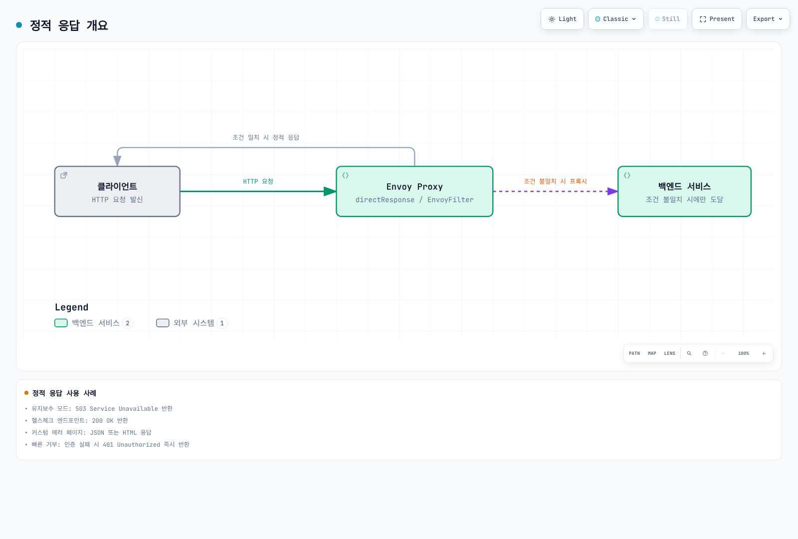

# EnvoyFilter

> **검증 기준**: Istio 1.31.0, Kubernetes 1.32–1.36; Sidecar와 Istio ingress gateway
> **마지막 검토**: 2026년 9월 11일

EnvoyFilter는 Envoy 프록시의 구성을 직접 커스터마이즈할 수 있는 고급 기능입니다.

## 목차

1. [개요](#개요)
2. [구조](#구조)
3. [주요 사용 사례](#주요-사용-사례)
4. [X-Forwarded-For 및 Hop 설정](#x-forwarded-for-및-hop-설정)
5. [정적 응답 설정](#정적-응답-설정)
6. [실전 예제](#실전-예제)
7. [모범 사례](#모범-사례)
8. [문제 해결](#문제-해결)

## 개요

아래 예제는 서로 독립적인 설정입니다. 같은 워크로드에 모두 적용하면 필터·라우트·정책이 중첩됩니다. 실제 네임스페이스/라벨/리스너를 확인하고 기존 구성과 병합한 뒤, 테스트 환경에서 생성된 Envoy 설정과 요청 결과를 확인하세요. EnvoyFilter는 내부 Envoy API에 의존하므로 Istio 업그레이드마다 재검증해야 하며, Ambient waypoint에는 지원되지 않습니다.

EnvoyFilter를 사용하면:
- 커스텀 헤더 추가/수정/삭제
- Rate Limiting
- External Authorization
- WASM 플러그인 통합

## 구조

```yaml
apiVersion: networking.istio.io/v1alpha3
kind: EnvoyFilter
metadata:
  name: custom-filter
  namespace: default
spec:
  workloadSelector:
    labels:
      app: myapp
  configPatches:
  - applyTo: HTTP_FILTER
    match:
      context: SIDECAR_OUTBOUND
      listener:
        filterChain:
          filter:
            name: "envoy.filters.network.http_connection_manager"
            subFilter:
              name: envoy.filters.http.router
    patch:
      operation: INSERT_BEFORE
      value:
        name: envoy.filters.http.lua
        typed_config:
          "@type": type.googleapis.com/envoy.extensions.filters.http.lua.v3.Lua
          default_source_code:
            inline_string: |
              function envoy_on_request(request_handle)
                request_handle:headers():replace("x-custom-header", "value")
              end
```

## 주요 사용 사례

### 1. 커스텀 헤더 추가

```yaml
apiVersion: networking.istio.io/v1alpha3
kind: EnvoyFilter
metadata:
  name: add-header
  namespace: default
spec:
  workloadSelector:
    labels:
      app: myapp
  configPatches:
  - applyTo: HTTP_FILTER
    match:
      context: SIDECAR_OUTBOUND
      listener:
        filterChain:
          filter:
            name: envoy.filters.network.http_connection_manager
            subFilter:
              name: envoy.filters.http.router
    patch:
      operation: INSERT_BEFORE
      value:
        name: envoy.filters.http.lua
        typed_config:
          "@type": type.googleapis.com/envoy.extensions.filters.http.lua.v3.Lua
          default_source_code:
            inline_string: |
              function envoy_on_request(request_handle)
                request_handle:headers():replace("x-client-service", "myapp")
              end
```

### 2. Rate Limiting

```yaml
apiVersion: networking.istio.io/v1alpha3
kind: EnvoyFilter
metadata:
  name: ratelimit
  namespace: default
spec:
  workloadSelector:
    labels:
      app: api-service
  configPatches:
  - applyTo: HTTP_FILTER
    match:
      context: SIDECAR_INBOUND
      listener:
        filterChain:
          filter:
            name: envoy.filters.network.http_connection_manager
            subFilter:
              name: envoy.filters.http.router
    patch:
      operation: INSERT_BEFORE
      value:
        name: envoy.filters.http.local_ratelimit
        typed_config:
          "@type": type.googleapis.com/envoy.extensions.filters.http.local_ratelimit.v3.LocalRateLimit
          stat_prefix: http_local_rate_limiter
          token_bucket:
            max_tokens: 100
            tokens_per_fill: 10
            fill_interval: 1s
          filter_enabled:
            default_value: {numerator: 100, denominator: HUNDRED}
          filter_enforced:
            default_value: {numerator: 100, denominator: HUNDRED}
```

100개 초기 버스트, 초당 10개 보충의 **프록시 프로세스별** 버킷입니다. 복제본 전체의 전역 한도가 아니며 `filter_enabled`와 `filter_enforced`를 명시해야 요청을 제한합니다.

### 3. WASM 플러그인

```yaml
apiVersion: networking.istio.io/v1alpha3
kind: EnvoyFilter
metadata:
  name: wasm-filter
  namespace: default
spec:
  workloadSelector:
    labels:
      app: myapp
  configPatches:
  - applyTo: HTTP_FILTER
    match:
      context: SIDECAR_INBOUND
      listener:
        filterChain:
          filter:
            name: envoy.filters.network.http_connection_manager
            subFilter:
              name: envoy.filters.http.router
    patch:
      operation: INSERT_BEFORE
      value:
        name: envoy.filters.http.wasm
        typed_config:
          "@type": type.googleapis.com/envoy.extensions.filters.http.wasm.v3.Wasm
          config:
            vm_config:
              runtime: "envoy.wasm.runtime.v8"
              code:
                local:
                  filename: "/var/local/lib/wasm-filters/my_plugin.wasm"
```

로컬 Wasm 예제는 호환되는 모듈을 해당 경로에 프록시 컨테이너용 읽기 전용 볼륨으로 이미 마운트했다고 가정합니다. 일반 애플리케이션 컨테이너의 파일은 보이지 않으며 이 YAML은 모듈을 다운로드하지 않습니다. 모듈·ABI·런타임과 실패 시 동작을 검증하세요. 배포 관리는 [WasmPlugin API](https://istio.io/latest/docs/reference/config/proxy_extensions/wasm-plugin/)를 우선 검토합니다.

## X-Forwarded-For 및 Hop 설정

### X-Forwarded-For 개요

HTTP 프록시는 일반적으로 **자신에게 연결한 클라이언트의 주소**를 XFF에 추가합니다. 자신의 주소를 같은 요청에 추가하는 것이 아닙니다. ALB의 기본 `append` 모드에서 Gateway가 받는 XFF는 직접 접속이면 `203.0.113.5`, CloudFront 경유이면 `203.0.113.5, 192.0.2.20`입니다. 이때 Gateway의 직접 연결 상대는 ALB입니다. 주소는 설명용이며 CloudFront 실제 IP 목록이 아닙니다.

### XFF 설정 옵션

Gateway에는 [공식 topology 설정](https://istio.io/latest/docs/ops/configuration/traffic-management/network-topologies/)의 `gatewayTopology.numTrustedProxies`를 우선 사용합니다. 다음은 기존 ingress Deployment의 **Pod template에 병합할 조각**입니다. 적용 후 해당 Gateway Pod를 재시작하고 실제 구성을 확인해야 합니다.

```yaml
# Existing ingress Deployment: spec.template fragment, not a complete Deployment
metadata:
  annotations:
    proxy.istio.io/config: |
      gatewayTopology:
        numTrustedProxies: 1
```

저수준 대안은 다음 EnvoyFilter입니다. 위 설정과 동시에 서로 다른 값을 적용하지 마세요. 이 장의 Gateway 라벨 `istio: ingressgateway`와 네임스페이스는 실제 설치에서 확인해야 합니다.

```yaml
apiVersion: networking.istio.io/v1alpha3
kind: EnvoyFilter
metadata:
  name: gateway-xff-config
  namespace: istio-system
spec:
  workloadSelector:
    labels:
      istio: ingressgateway
  configPatches:
  - applyTo: NETWORK_FILTER
    match:
      context: GATEWAY
      listener:
        filterChain:
          filter:
            name: envoy.filters.network.http_connection_manager
    patch:
      operation: MERGE
      value:
        name: envoy.filters.network.http_connection_manager
        typed_config:
          "@type": type.googleapis.com/envoy.extensions.filters.network.http_connection_manager.v3.HttpConnectionManager
          use_remote_address: true
          xff_num_trusted_hops: 1
          skip_xff_append: false
          via: istio-gateway
```

| 옵션 | 실제 의미 |
|---|---|
| `use_remote_address: true`, hops 0 | 직접 연결 상대 주소 사용 |
| `true`, hops N>0 | **받은 XFF의 오른쪽에서 N번째** 주소 사용 |
| `false`, hops N | 받은 XFF의 오른쪽에서 N+1번째 주소 사용 |
| XFF 주소 부족 | 직접 연결 상대 주소로 대체; 접근 허용을 보장하지 않음 |
| `skip_xff_append: true` | 이 프록시에서 XFF 추가를 생략; 신뢰 판정과 별개 |
| `via` | 요청/응답에 프록시 식별용 Via 값을 추가; 인증 정보가 아님 |

`use_remote_address: false`를 내부라는 이유만으로 적용하면 공격자가 보낸 XFF를 신뢰할 수 있습니다. 설정을 일괄 변경하지 말고 실제 연결·헤더 변환을 확인하세요. Gateway의 판정은 **그 Gateway 요청 스트림의 속성**이며 백엔드 Envoy의 `remote.ip`로 자동 전달되지 않습니다.

### 실제 시나리오별 설정

아래는 Gateway에서 `use_remote_address: true`이고, 모든 HTTP 프록시가 XFF에 연결 상대 주소를 추가하며 우회 경로가 차단된 경우입니다.

| 경로 | Gateway가 받은 XFF 예시 | 직접 상대 | trusted hops |
|---|---|---|---|
| Client → ALB → Gateway | `203.0.113.5` | ALB | 1 |
| Client → CloudFront → ALB → Gateway | `203.0.113.5, 192.0.2.20` | ALB | 2 |
| Client → CloudFront → NLB → ALB → Gateway | 위와 같음, NLB의 ALB 대상 구성이 클라이언트 IP를 보존할 때 | ALB | 2 |
| Client → Gateway 직접 | 사용자가 임의로 넣을 수 있음 | Client | 0 |

NLB는 L4이므로 XFF를 편집하지 않습니다. 그렇다고 어떤 NLB 구성도 원본 소켓 주소를 보존한다는 뜻은 아닙니다. ALB 대상 유형, 지원 리스너/대상 포트, 클라이언트 IP 보존과 실제 Gateway 수신 헤더를 확인하세요. ALB `preserve`/`remove` 모드, 추가 CDN, PROXY protocol 또는 다른 경로에는 이 표의 숫자를 그대로 적용할 수 없습니다.

### 실제 클라이언트 IP 추출 예제

XFF의 왼쪽 첫 값을 직접 파싱하지 마세요. 앞의 신뢰 경계가 설정된 Gateway에서 Envoy가 판정한 주소를 진단용 헤더로 전달하려면 다음처럼 사용할 수 있습니다. Lua API는 주소 객체가 아닌 **문자열**을 반환하며 IPv6/포트 표기가 포함될 수 있습니다.

```yaml
apiVersion: networking.istio.io/v1alpha3
kind: EnvoyFilter
metadata:
  name: gateway-client-address
  namespace: istio-system
spec:
  workloadSelector:
    labels:
      istio: ingressgateway
  configPatches:
  - applyTo: HTTP_FILTER
    match:
      context: GATEWAY
      listener:
        filterChain:
          filter:
            name: envoy.filters.network.http_connection_manager
            subFilter:
              name: envoy.filters.http.router
    patch:
      operation: INSERT_BEFORE
      value:
        name: envoy.filters.http.lua
        typed_config:
          "@type": type.googleapis.com/envoy.extensions.filters.http.lua.v3.Lua
          default_source_code:
            inline_string: |
              function envoy_on_request(handle)
                local address = handle:streamInfo():downstreamRemoteAddress()
                handle:headers():replace("x-client-address", address)
              end
```

`x-client-address`는 애플리케이션 인증 수단이 아닙니다. 신뢰된 Gateway만 이 값을 설정하고 백엔드로 직접 접근할 수 없을 때만 진단용으로 사용하세요. 원본 XFF·주소 로그의 보관/개인정보 범위도 정해야 합니다.

### 선택적 앱별 IP 제한 (Gateway + AuthorizationPolicy)

App F/G에 대한 외부 IP 제한은 원본 IP를 판정한 **Gateway에** 적용하고 HTTP Host로 범위를 좁힙니다. App A–E는 이 DENY 규칙과 일치하지 않습니다. 기존 mesh/namespace/Gateway 정책과 애플리케이션 인증은 여전히 적용되므로 “정책 파일이 없는 앱은 무조건 허용”으로 해석하면 안 됩니다.

```yaml
apiVersion: security.istio.io/v1
kind: AuthorizationPolicy
metadata:
  name: restricted-app-ingress
  namespace: istio-system
spec:
  selector:
    matchLabels:
      istio: ingressgateway
  action: DENY
  rules:
  - from:
    - source:
        notRemoteIpBlocks: ["203.0.113.0/24"]
    to:
    - operation:
        hosts:
        - "app-f.example.com"
        - "app-f.example.com:*"
        - "app-g.example.com"
        - "app-g.example.com:*"
```

이 예제는 Gateway가 HTTP를 종료하고 Host별 route가 각 앱으로 정확히 연결된다고 가정합니다. HTTP를 종료하는 전용 Gateway용이며 TCP passthrough 리스너와 혼용하려면 실제 워크로드 포트로 정책 범위를 제한하세요. DENY 평가에서 누락된 HTTP 속성은 일치로 취급될 수 있습니다. Host 별칭·와일드카드·다른 경로로 F/G에 접근할 수 없도록 라우팅과 정책을 함께 검토하세요. 백엔드는 별도 mTLS/AuthorizationPolicy로 실제 Gateway 서비스 계정의 접근만 허용하는 등 우회 경로를 막아야 합니다. 소스 IP만으로 사용자 인증을 대신하지 않습니다.

### XFF 기반 IP 접근 제어

다음 두 예제는 서로 독립적인 **전용 API Gateway** 정책입니다. ALLOW 정책이 하나라도 선택되면 그 워크로드의 요청은 일치하는 ALLOW 규칙이 필요합니다. 여러 ALLOW 정책은 합집합이므로 공유 Gateway의 다른 앱에 그대로 누적 적용하지 마세요.

#### 1. IP 허용 목록과 거부 목록

```yaml
apiVersion: security.istio.io/v1
kind: AuthorizationPolicy
metadata:
  name: api-ip-allowlist
  namespace: istio-system
spec:
  selector:
    matchLabels:
      istio: ingressgateway
  action: ALLOW
  rules:
  - from:
    - source:
        remoteIpBlocks: ["203.0.113.10/32", "203.0.113.11/32", "2001:db8:1234::/48"]
    to:
    - operation:
        hosts: ["api.example.com", "api.example.com:*"]
---
apiVersion: security.istio.io/v1
kind: AuthorizationPolicy
metadata:
  name: api-ip-denylist
  namespace: istio-system
spec:
  selector:
    matchLabels:
      istio: ingressgateway
  action: DENY
  rules:
  - from:
    - source:
        remoteIpBlocks: ["203.0.113.11/32"]
    to:
    - operation:
        hosts: ["api.example.com", "api.example.com:*"]
```

허용 목록에 포함된 `203.0.113.11`도 DENY가 우선하여 거부됩니다. Istio 평가는 CUSTOM, DENY, ALLOW 순서이며 AUDIT는 허용 여부를 바꾸지 않습니다. `remoteIpBlocks`는 신뢰된 XFF/PROXY protocol에서 구한 원본 주소, `ipBlocks`는 수신 패킷 소스에 해당하므로 실제 연결에서 맞는 속성을 선택합니다.

#### 2. IP + 경로 + 메서드

```yaml
apiVersion: security.istio.io/v1
kind: AuthorizationPolicy
metadata:
  name: api-path-ip-policy
  namespace: istio-system
spec:
  selector:
    matchLabels:
      istio: ingressgateway
  action: ALLOW
  rules:
  - from:
    - source:
        remoteIpBlocks: ["203.0.113.10/32"]
    to:
    - operation:
        hosts: ["api.example.com", "api.example.com:*"]
        paths: ["/admin", "/admin/*"]
  - from:
    - source:
        remoteIpBlocks: ["10.0.0.0/8"]
    to:
    - operation:
        hosts: ["api.example.com", "api.example.com:*"]
        paths: ["/api/v1/*"]
        methods: ["GET"]
  - to:
    - operation:
        hosts: ["api.example.com", "api.example.com:*"]
        paths: ["/api/v1/public/*"]
        methods: ["GET", "POST"]
```

`/admin`과 `/admin/*`를 모두 보호합니다. 공개 경로에는 IP 조건을 생략하여 IPv4뿐 아니라 IPv6도 표현합니다. `10.0.0.0/8` 규칙은 실제로 그 주소가 관찰되는 사설 클라이언트 경로에만 의미가 있고 인터넷 NAT 뒤 주소를 복원하지 않습니다.

### XFF 검증 및 디버깅

```bash
# Local CLI reads the effective gateway configuration; no curl binary in proxy required.
istioctl proxy-config listeners <gateway-pod> -n istio-system -o json |
  jq '.. | objects |
      select(.["@type"]? == "type.googleapis.com/envoy.extensions.filters.network.http_connection_manager.v3.HttpConnectionManager") |
      {useRemoteAddress, xffNumTrustedHops, skipXffAppend}'

# Through the real ALB/CDN path, from a source outside the allowed NAT range:
curl -i https://app-f.example.com/
curl -i -H "X-Forwarded-For: 203.0.113.10" https://app-f.example.com/
# Both must be denied. A user-supplied header must not grant access.

# Run this separately from the real approved NAT egress:
curl -i https://app-f.example.com/

kubectl get authorizationpolicy -n istio-system
kubectl logs -n istio-system <gateway-pod> -c istio-proxy
```

차단된 출발지에서 허용 IP를 XFF 앞에 넣어도 차단되어야 합니다. 허용 테스트는 실제 허용된 NAT 출발지에서 수행하세요. Gateway 직통으로 위조 헤더를 보내 통과하는 것은 성공 검증이 아니라 우회 취약점입니다. IPv6, 빈/짧은 XFF, 직접 Gateway 접근, Host 별칭과 다른 경로도 확인합니다.

액세스 로그에는 `%DOWNSTREAM_DIRECT_REMOTE_ADDRESS%`(직접 소켓 상대), `%DOWNSTREAM_REMOTE_ADDRESS%`(판정 주소), `%REQ(X-FORWARDED-FOR)%`와 `%RESPONSE_CODE_DETAILS%`를 구분해 기록합니다. Telemetry로 활성화한 로그의 형식은 mesh의 해당 access-log provider에서 설정합니다. 뒤의 [ProxyConfig와 관측 설정](#proxyconfig로-envoy-설정)을 참고하세요.

### 보안 고려사항

ALB → Gateway, CloudFront → ALB처럼 **신뢰할 프록시만 각 다음 홉에 접근**하도록 보안 그룹/네트워크·origin 접근 제한을 구성해야 합니다. 단순 hop 수는 발신자를 인증하지 않으며 `use_remote_address: true`만으로 스푸핑이 차단되지 않습니다. 헤더를 Lua로 나중에 제거해도 이미 계산된 주소나 앞선 필터의 인가 판단이 되돌아가지 않습니다.

## 정적 응답 설정

특정 요청에 대해 백엔드 서비스를 거치지 않고 정적 응답을 직접 반환할 수 있습니다. 이는 유지보수 모드, 에러 페이지, 헬스체크 응답 등에 유용합니다.

### 정적 응답 개요



[🔍 인터랙티브 다이어그램 보기](https://www.atomai.click/kubernetes-docs/archmaps/ko-service-mesh-istio-advanced-03-envoy-filter-7.html)

### 사용 사례

1. **유지보수 모드**: 503 Service Unavailable 반환
2. **헬스체크 엔드포인트**: 200 OK 반환
3. **커스텀 에러 페이지**: JSON 또는 HTML 에러 응답
4. **테스트/모의 응답**: 특정 경로에 미리 정의된 응답
5. **빠른 거부**: 인증 실패 시 401 Unauthorized 즉시 반환

### 구현 방법 선택 가이드

Istio는 정적 응답을 구현하는 여러 방법을 제공합니다:

| 방법 | 사용 시기 | 장점 | 단점 |
|------|----------|------|------|
| **VirtualService** | 간단한 정적 응답, 라우팅 규칙과 통합 | 선언적, 이해하기 쉬움 | 제한된 커스터마이징 |
| **AuthorizationPolicy** | IP/헤더 기반 접근 제어 | 보안 정책과 통합 | 정적 응답 전용 아님 |
| **EnvoyFilter** | 위 방법으로 불가능한 경우만 | 최대 유연성 | 복잡, 업그레이드 위험 |

**권장**: 가능한 한 **VirtualService**와 **AuthorizationPolicy**를 먼저 사용하고, 필요한 경우에만 EnvoyFilter 사용

### VirtualService로 정적 응답 구현

#### 1. 기본 정적 응답 (directResponse)

본문 timestamp는 고정된 예시 문자열이며 현재 시각으로 갱신되지 않습니다. 생성된 route의 본문 한도와 처리 위치를 확인해야 합니다. Istio1.31은 이 outbound VirtualService route에1MiB를 설정하며 수정하지 않은 Envoy 기본값은4KiB입니다. 큰 정적 본문은 프록시 메모리를 사용합니다. 이 mesh outbound 예제들은 각각 독립적이며 같은 host의 VirtualService들을 중첩 적용하지 않습니다.

```yaml
apiVersion: networking.istio.io/v1
kind: VirtualService
metadata:
  name: api-service
  namespace: default
spec:
  hosts:
  - api-service
  http:
  # 유지보수 모드
  - match:
    - uri:
        exact: "/api/v1"
    - uri:
        prefix: "/api/v1/"
    directResponse:
      status: 503
      body:
        string: |
          {
            "error": {
              "code": "SERVICE_UNAVAILABLE",
              "message": "The service is currently under maintenance",
              "timestamp": "2025-11-26T10:00:00Z",
              "retry_after": 3600
            }
          }
    headers:
      response:
        set:
          content-type: "application/json"
          retry-after: "3600"
```

**결과**:
```text
$ curl -i http://api-service/api/v1/users
HTTP/1.1 503 Service Unavailable
content-type: application/json
retry-after: 3600

{
  "error": {
    "code": "SERVICE_UNAVAILABLE",
    "message": "The service is currently under maintenance",
    "timestamp": "2025-11-26T10:00:00Z",
    "retry_after": 3600
  }
}
```

#### 2. 헬스체크 엔드포인트

정적200은 프록시의 경로 처리만 확인합니다. Kubernetes readiness나 ALB target health가 애플리케이션 상태를 알아야 하는 경우 실제 백엔드 probe를 사용하세요.

```yaml
apiVersion: networking.istio.io/v1
kind: VirtualService
metadata:
  name: api-service-health
  namespace: default
spec:
  hosts:
  - api-service
  http:
  # 헬스체크 경로
  - match:
    - uri:
        exact: "/health"
    directResponse:
      status: 200
      body:
        string: "OK"

  # 일반 트래픽
  - route:
    - destination:
        host: api-service
    retries:
      attempts: 0
```

#### 3. 특정 경로 차단

```yaml
apiVersion: networking.istio.io/v1
kind: VirtualService
metadata:
  name: block-admin
  namespace: default
spec:
  hosts:
  - api-service
  http:
  # Admin 경로 차단
  - match:
    - uri:
        exact: "/admin"
    - uri:
        prefix: "/admin/"
    directResponse:
      status: 403
      body:
        string: |
          {
            "error": "Access to admin endpoints is forbidden"
          }
    headers:
      response:
        set:
          content-type: "application/json"

  # 일반 트래픽
  - route:
    - destination:
        host: api-service
    retries:
      attempts: 0
```

#### 4. Fault Injection으로 에러 시뮬레이션

```yaml
apiVersion: networking.istio.io/v1
kind: VirtualService
metadata:
  name: fault-injection
  namespace: default
spec:
  hosts:
  - api-service
  http:
  - fault:
      abort:
        httpStatus: 503
        percentage:
          value: 100  # 100% 트래픽에 적용
    route:
    - destination:
        host: api-service
    retries:
      attempts: 0
```

### AuthorizationPolicy로 접근 제어

`ipBlocks`는 수신 패킷 소스 주소를 평가합니다. 주소가 보존된 L4 ingress에서는 원본 클라이언트일 수 있지만 ALB 뒤나 다른 프록시 뒤에서는 프록시/NAT 주소일 수 있습니다. XFF 기반 원본 주소 제한은 앞의 Gateway `remoteIpBlocks` 예제를 사용하세요. 두 경우 모두 ALLOW가 선택되면 일치하지 않는 요청은 거부되므로 동일한 보완 DENY 규칙을 중복 생성할 필요가 없습니다.

#### 커스텀 거부 응답

다음은 해당 Gateway가 **직접 생성한 모든 HTTP403**의 형식을 통일합니다. 백엔드가 반환한403이나 모든 TCP 거부를 재작성하는 기능은 아닙니다. IP 거부 여부를 본문 문자열로 추측하지 않고 일반 `FORBIDDEN` 코드를 사용합니다. 앞선 RBAC 필터가 반환하면 뒤쪽 Lua가 실행되지 않을 수 있으므로 HCM의 `local_reply_config`를 사용합니다. 기존 mapper와의 순서/범위를 병합 검토하세요.

```yaml
apiVersion: networking.istio.io/v1alpha3
kind: EnvoyFilter
metadata:
  name: custom-local-forbidden
  namespace: istio-system
spec:
  workloadSelector:
    labels:
      istio: ingressgateway
  configPatches:
  - applyTo: NETWORK_FILTER
    match:
      context: GATEWAY
      listener:
        filterChain:
          filter:
            name: envoy.filters.network.http_connection_manager
    patch:
      operation: MERGE
      value:
        name: envoy.filters.network.http_connection_manager
        typed_config:
          "@type": type.googleapis.com/envoy.extensions.filters.network.http_connection_manager.v3.HttpConnectionManager
          local_reply_config:
            mappers:
            - filter:
                status_code_filter:
                  comparison:
                    op: EQ
                    value:
                      default_value: 403
                      runtime_key: local_reply_403
              body_format_override:
                json_format:
                  error: "Access denied"
                  code: "FORBIDDEN"
```

### ProxyConfig로 Envoy 설정

`networking.istio.io`의 ProxyConfig 리소스는 mesh의 `ProxyConfig` 메시지와 필드가 다릅니다. 리소스에는 `concurrency`, `environmentVariables`, `image` 등이 있으며 로그·tracing·connection pool을 임의의 필드로 추가할 수 없습니다. 변경에는 해당 Pod 재시작이 필요합니다.

#### 워크로드별 스레드와 관측 설정

```yaml
apiVersion: networking.istio.io/v1beta1
kind: ProxyConfig
metadata:
  name: api-service-config
  namespace: default
spec:
  selector:
    matchLabels:
      app: api-service
  concurrency: 4
---
apiVersion: telemetry.istio.io/v1
kind: Telemetry
metadata:
  name: api-observability
  namespace: default
spec:
  selector:
    matchLabels:
      app: api-service
  accessLogging:
  - providers:
    - name: envoy
  tracing:
  - providers:
    - name: otel-tracing
    randomSamplingPercentage: 1
```

Telemetry의 `envoy` access-log provider와 `otel-tracing` trace provider가 mesh extensionProviders에 이미 정의되어 있다고 가정합니다. 로그 형식/출력과 OTLP 주소·TLS는 그 provider에 설정합니다. `concurrency: 4`는 네 개의 worker thread를 요청하며 CPU 용량과 부하 검증이 필요합니다. 1% head sampling과 백엔드 수집 구성만으로 전체 trace 보존을 보장하지 않습니다.

#### 통계와 종료 유예

```yaml
# Existing application Deployment: spec.template fragment
metadata:
  annotations:
    proxy.istio.io/config: |
      terminationDrainDuration: 5s
      proxyStatsMatcher:
        inclusionRegexps:
        - ".*outlier_detection.*"
        - ".*upstream_rq_retry.*"
        inclusionSuffixes:
        - upstream_rq_timeout
```

기존 애플리케이션 Deployment의 Pod template에 병합하고 해당 Pod를 재시작합니다. Kubernetes 종료 유예 시간은 애플리케이션 종료와 프록시 drain을 수용해야 합니다. 추가 Envoy 통계는 시계열 수와 메모리 비용을 늘립니다.

#### 목적지 연결 풀

```yaml
apiVersion: networking.istio.io/v1
kind: DestinationRule
metadata:
  name: api-outbound-pool
  namespace: default
spec:
  host: api-service.default.svc.cluster.local
  trafficPolicy:
    connectionPool:
      tcp:
        connectTimeout: 10s
        maxConnections: 10000
```

이는 해당 목적지로 향하는 프록시별 outbound 연결 설정이며 Gateway 전체 동시 요청 제한이나 애플리케이션 timeout이 아닙니다. 예시 수치의 적합성은 부하 시험으로 확인해야 합니다.

### 통합 예제: VirtualService + AuthorizationPolicy

독립된 **HTTP 실습 조각**입니다. 기존 ingress Gateway Deployment/Service, 해당 Service가 노출하는80번 포트, `default/api-service`의8080번 Service/정상 Endpoint, 실제 DNS/ALB 경로와 앞에서 검증한 XFF 신뢰 설정이 필요합니다. 실제 외부 접속에는 검증된 TLS 종료와 백엔드 우회 방지도 별도로 구성해야 합니다. 이 감사에서 실행하거나 production 검증한 배포 묶음은 아닙니다.

정책과 라우트 모두 같은 Gateway에서 평가되며 public·health·retired 경로를 명시적으로 허용합니다. 나머지는 거부됩니다. `/health`는 프록시 경로 응답일 뿐 애플리케이션·DB 건강 상태가 아닙니다. 쓰기를 포함할 수 있는 일반 라우트의 mesh 재시도는0입니다.

```yaml
apiVersion: networking.istio.io/v1
kind: Gateway
metadata:
  name: api-lab
  namespace: istio-system
spec:
  selector:
    istio: ingressgateway
  servers:
  - port:
      number: 80
      name: http
      protocol: HTTP
    hosts: ["api.example.com"]
---
apiVersion: security.istio.io/v1
kind: AuthorizationPolicy
metadata:
  name: api-access-control
  namespace: istio-system
spec:
  selector:
    matchLabels:
      istio: ingressgateway
  action: ALLOW
  rules:
  - from:
    - source:
        remoteIpBlocks: ["203.0.113.10/32"]
    to:
    - operation:
        hosts: ["api.example.com", "api.example.com:*"]
        paths: ["/api/v1/admin", "/api/v1/admin/*"]
  - to:
    - operation:
        hosts: ["api.example.com", "api.example.com:*"]
        paths: ["/health", "/api/v0/*", "/api/v1/public/*"]
---
apiVersion: networking.istio.io/v1
kind: VirtualService
metadata:
  name: api-service-routes
  namespace: default
spec:
  hosts: ["api.example.com"]
  gateways: ["istio-system/api-lab"]
  http:
  - match:
    - uri:
        exact: /health
    directResponse:
      status: 200
      body:
        string: '{"status":"proxy-route-reachable"}'
    headers:
      response:
        set:
          content-type: application/json
          cache-control: no-store
  - match:
    - uri:
        prefix: /api/v0/
    directResponse:
      status: 410
      body:
        string: '{"error":"API v0 is retired","supported_versions":["v1","v2"]}'
    headers:
      response:
        set:
          content-type: application/json
          cache-control: no-store
  - route:
    - destination:
        host: api-service.default.svc.cluster.local
        port:
          number: 8080
    timeout: 30s
    retries:
      attempts: 0
```

### Lua를 사용한 동적 정적 응답

Lua 스크립트를 사용하면 조건에 따라 동적으로 정적 응답을 생성할 수 있습니다.

#### 유지보수 시간대 자동 감지

```yaml
apiVersion: networking.istio.io/v1alpha3
kind: EnvoyFilter
metadata:
  name: maintenance-window
  namespace: default
spec:
  workloadSelector:
    labels:
      app: api-service
  configPatches:
  - applyTo: HTTP_FILTER
    match:
      context: SIDECAR_INBOUND
      listener:
        filterChain:
          filter:
            name: "envoy.filters.network.http_connection_manager"
            subFilter:
              name: "envoy.filters.http.router"
    patch:
      operation: INSERT_BEFORE
      value:
        name: envoy.filters.http.lua
        typed_config:
          "@type": type.googleapis.com/envoy.extensions.filters.http.lua.v3.Lua
          default_source_code:
            inline_string: |
              local function is_maintenance(hour)
                return hour >= 2 and hour < 4
              end

              function envoy_on_request(request_handle)
                -- 현재 시간 (UTC)
                local current_hour = tonumber(os.date("!%H"))

                -- 매일 새벽 2-4시는 유지보수 시간
                if is_maintenance(current_hour) then
                  request_handle:respond(
                    {[":status"] = "503",
                     ["content-type"] = "application/json",
                     ["retry-after"] = "60",
                     ["cache-control"] = "no-store"},
                    '{"error": "Maintenance in progress", "window": "02:00-04:00 UTC"}'
                  )
                end
              end
```

#### 요청 헤더 기반 응답

```yaml
apiVersion: networking.istio.io/v1alpha3
kind: EnvoyFilter
metadata:
  name: header-based-response
  namespace: default
spec:
  workloadSelector:
    labels:
      app: api-service
  configPatches:
  - applyTo: HTTP_FILTER
    match:
      context: SIDECAR_INBOUND
      listener:
        filterChain:
          filter:
            name: "envoy.filters.network.http_connection_manager"
            subFilter:
              name: "envoy.filters.http.router"
    patch:
      operation: INSERT_BEFORE
      value:
        name: envoy.filters.http.lua
        typed_config:
          "@type": type.googleapis.com/envoy.extensions.filters.http.lua.v3.Lua
          default_source_code:
            inline_string: |
              function envoy_on_request(request_handle)
                local api_version = request_handle:headers():get("x-api-version")

                -- 지원하지 않는 API 버전
                if api_version and api_version == "v1" then
                  request_handle:respond(
                    {[":status"] = "410",
                     ["content-type"] = "application/json"},
                    '{"error": "API v1 is deprecated", "supported_versions": ["v2", "v3"]}'
                  )
                end
              end
```

### VirtualService와 통합

정적 유지보수 응답과 본문은 하나의 `directResponse`로 설정할 수 있습니다. source-side VirtualService에서 발생한 fault를 destination-side Lua로 바꿀 수 없으며, 응답 헤더에는 요청의 `:path`가 없습니다. 다음은 독립된 mesh outbound 예제입니다. 인가 수단이 아니며 Gateway에서 사용할 때는 앞의 예제처럼 `gateways`와 외부 host를 명시해야 합니다.

```yaml
apiVersion: networking.istio.io/v1
kind: VirtualService
metadata:
  name: maintenance-response
  namespace: default
spec:
  hosts: ["api-service"]
  http:
  - match:
    - uri:
        exact: /maintenance
    - uri:
        prefix: /maintenance/
    directResponse:
      status: 503
      body:
        string: '{"message":"Service under maintenance"}'
    headers:
      response:
        set:
          content-type: application/json
          cache-control: no-store
          retry-after: "60"
  - route:
    - destination:
        host: api-service
    retries:
      attempts: 0
```

### 실전 시나리오

#### 시나리오 1: Blue/Green 배포 중 트래픽 차단

선택한v1 워크로드의 모든 inbound HTTP route를503으로 바꾸는 명시적 차단 예제입니다. 무중단 전환이나 기존 연결 drain을 구현하지 않습니다. `MERGE`는 Envoy Route의 action oneof를 direct_response로 바꾸며, 다른 필터의 선행 거부나 TCP 경로까지 통제하지 않습니다. cutoff_date는 고정 예시값으로 실제 배포 일정에 맞춰 설정해야 합니다.

```yaml
apiVersion: networking.istio.io/v1alpha3
kind: EnvoyFilter
metadata:
  name: deployment-block
  namespace: production
spec:
  workloadSelector:
    labels:
      app: api-service
      version: v1  # 구버전만 차단
  configPatches:
  - applyTo: HTTP_ROUTE
    match:
      context: SIDECAR_INBOUND
    patch:
      operation: MERGE
      value:
        direct_response:
          status: 503
          body:
            inline_string: |
              {
                "message": "This version is being deprecated",
                "migration": {
                  "new_endpoint": "https://api-v2.example.com",
                  "cutoff_date": "2025-12-31"
                }
              }
        response_headers_to_add:
        - header:
            key: "Content-Type"
            value: "application/json"
        - header:
            key: "X-Migration-Required"
            value: "true"
```

#### 시나리오 2: Rate Limit 초과 시 429 응답

```yaml
apiVersion: networking.istio.io/v1alpha3
kind: EnvoyFilter
metadata:
  name: ratelimit-response
  namespace: default
spec:
  workloadSelector:
    labels:
      app: api-service
  configPatches:
  # Rate Limit 필터
  - applyTo: HTTP_FILTER
    match:
      context: SIDECAR_INBOUND
      listener:
        filterChain:
          filter:
            name: "envoy.filters.network.http_connection_manager"
            subFilter:
              name: "envoy.filters.http.router"
    patch:
      operation: INSERT_BEFORE
      value:
        name: envoy.filters.http.local_ratelimit
        typed_config:
          "@type": type.googleapis.com/envoy.extensions.filters.http.local_ratelimit.v3.LocalRateLimit
          stat_prefix: http_local_rate_limiter
          token_bucket:
            max_tokens: 100
            tokens_per_fill: 10
            fill_interval: 1s
          filter_enabled:
            runtime_key: local_rate_limit_enabled
            default_value:
              numerator: 100
              denominator: HUNDRED
          filter_enforced:
            runtime_key: local_rate_limit_enforced
            default_value:
              numerator: 100
              denominator: HUNDRED
          local_rate_limit_per_downstream_connection: false
          # 커스텀 429 응답
          status:
            code: 429
          response_headers_to_add:
          - header:
              key: x-local-rate-limit
              value: "true"
            append_action: OVERWRITE_IF_EXISTS_OR_ADD
```

```yaml
apiVersion: networking.istio.io/v1alpha3
kind: EnvoyFilter
metadata:
  name: local-rate-limit-json
  namespace: default
spec:
  workloadSelector:
    labels:
      app: api-service
  configPatches:
  - applyTo: NETWORK_FILTER
    match:
      context: SIDECAR_INBOUND
      listener:
        filterChain:
          filter:
            name: envoy.filters.network.http_connection_manager
    patch:
      operation: MERGE
      value:
        name: envoy.filters.network.http_connection_manager
        typed_config:
          "@type": type.googleapis.com/envoy.extensions.filters.network.http_connection_manager.v3.HttpConnectionManager
          local_reply_config:
            mappers:
            - filter:
                status_code_filter:
                  comparison:
                    op: EQ
                    value:
                      default_value: 429
                      runtime_key: local_reply_429
              body_format_override:
                json_format:
                  error: "Too many requests"
                  code: "RATE_LIMIT_EXCEEDED"
```

두 리소스는 같은 워크로드를 선택합니다. mapper는 이 프록시가 직접 생성한429를 JSON으로 바꾸며 upstream 429는 변경하지 않습니다. 토큰 보충 시간이 모든 호출자의 재시도 성공 시간을 보장하지 않으므로 고정 `Retry-After: 60`을 만들지 않습니다.

#### 시나리오 3: 카나리 배포 테스트 응답

격리된 테스트 워크로드에서만 사용합니다. 임의 클라이언트가 헤더를 보낼 수 있으므로 이200 응답은 사용자 인증·백엔드 실행·새 버전 건강 상태를 증명하지 않습니다. 운영 경로에 노출하려면 별도 인증과 헤더 신뢰 경계를 먼저 검증해야 합니다.

```yaml
apiVersion: networking.istio.io/v1alpha3
kind: EnvoyFilter
metadata:
  name: canary-test-response
  namespace: default
spec:
  workloadSelector:
    labels:
      app: api-service
      version: canary
  configPatches:
  - applyTo: HTTP_FILTER
    match:
      context: SIDECAR_INBOUND
      listener:
        filterChain:
          filter:
            name: "envoy.filters.network.http_connection_manager"
            subFilter:
              name: "envoy.filters.http.router"
    patch:
      operation: INSERT_BEFORE
      value:
        name: envoy.filters.http.lua
        typed_config:
          "@type": type.googleapis.com/envoy.extensions.filters.http.lua.v3.Lua
          default_source_code:
            inline_string: |
              function envoy_on_request(request_handle)
                local test_header = request_handle:headers():get("x-canary-test")

                -- 카나리 테스트 헤더가 있으면 미리 정의된 응답 반환
                if test_header == "dry-run" then
                  request_handle:respond(
                    {[":status"] = "200",
                     ["content-type"] = "application/json",
                     ["x-canary-version"] = "v2.0.0"},
                    '{"message": "Canary version response", "version": "v2.0.0"}'
                  )
                end
              end
```

### 테스트 및 검증

#### 정적 응답 테스트

실제로 선택한 예제의 처리 프록시를 통과하는 테스트 client에서 수행합니다. `/health`나 정보성 헤더만으로 인증·인가를 검증하지 않습니다.

```bash
curl -i http://api-service:8080/api/v1
curl -i http://api-service:8080/health
curl -i http://api-service:8080/admin
curl -i http://api-service:8080/admin/users
```

유지보수 함수는 격리된 Lua 테스트에서 UTC1,2,3,4시를 입력해 각각 false,true,true,false를 확인합니다. Pod/노드의 시계를 변경하지 않습니다. 실제 필터 통합 시험은 테스트 환경에서 시간을 주입하는 harness나 검토한 임시 함수로 수행하고, 기본 함수로 복원합니다.

Rate limit은 단일 프록시로 고정한 테스트에서 초기100개와 초당10개 보충, 경과 시간, 실제429 수를 함께 측정합니다. 순차 curl150회만으로429가 반드시 발생한다고 판단할 수 없습니다. 복제본 수와 분산 상태를 바꾸는 시험은 별도입니다.

#### Envoy 구성 확인

```bash
# 1. 정적 응답 라우트 확인
istioctl proxy-config routes <pod-name> -n default -o json | \
  jq '.[] | .virtualHosts[]? | .routes[]? | select(.directResponse != null)'

# 2. 전체 라우트 구성 확인
istioctl proxy-config routes <pod-name> -n default

# 3. EnvoyFilter 적용 확인
kubectl get envoyfilter -n default maintenance-window -o yaml

# 4. Envoy Admin API로 확인
kubectl port-forward -n default <pod-name> 15000:15000
# Run in a second local terminal while port-forward is active:
curl http://127.0.0.1:15000/config_dump | jq '.configs[] | select(.["@type"] == "type.googleapis.com/envoy.admin.v3.RoutesConfigDump")'
```

### 모범 사례

1. **명확한 에러 메시지**:
   - 사용자에게 문제의 원인과 해결 방법 제공
   - `Retry-After` 헤더로 재시도 시간 명시

2. **일관된 에러 형식**:
   - 모든 에러 응답에 동일한 JSON 스키마 사용
   - HTTP 상태 코드와 에러 코드 일관성 유지

3. **로깅 및 모니터링**:
   - 정적 응답 반환 시 로그 기록
   - 메트릭으로 정적 응답 빈도 추적

4. **점진적 적용**:
   - 유지보수 모드 전환 시 단계적으로 적용
   - 카나리 배포로 테스트 후 전체 적용

5. **롤백 계획**:
   - 검토한 구성으로 복원한 후 xDS 수락·라우트·실제 요청을 확인
   - 긴급 상황 대비 자동화된 롤백 스크립트

### 주의사항

1. **우선순위**: 응답 동작은 처리 프록시·필터 순서·생성된 route에 따라 달라짐
2. **성능**: Lua 스크립트는 모든 요청에 실행되므로 성능 영향 고려
3. **보안**: 에러 메시지에 민감한 정보 노출 주의
4. **캐싱**: 정적 응답도 `Cache-Control` 헤더 설정 필요
5. **메트릭**: response_code/details/flags와 reporter를 확인; 정적 응답 전용 metric family가 자동 생성되는 것은 아님

## 실전 예제

### 예제 1: 요청/응답 로깅

```yaml
apiVersion: networking.istio.io/v1alpha3
kind: EnvoyFilter
metadata:
  name: request-response-logging
  namespace: default
spec:
  workloadSelector:
    labels:
      app: api-service
  configPatches:
  - applyTo: HTTP_FILTER
    match:
      context: SIDECAR_INBOUND
      listener:
        filterChain:
          filter:
            name: envoy.filters.network.http_connection_manager
            subFilter:
              name: envoy.filters.http.router
    patch:
      operation: INSERT_BEFORE
      value:
        name: envoy.filters.http.lua
        typed_config:
          "@type": type.googleapis.com/envoy.extensions.filters.http.lua.v3.Lua
          default_source_code:
            inline_string: |
              function envoy_on_request(request_handle)
                request_handle:logInfo("Request method: " .. (request_handle:headers():get(":method") or "unknown"))
              end

              function envoy_on_response(response_handle)
                response_handle:logInfo("Response: " .. (response_handle:headers():get(":status") or "unknown"))
              end
```

### 예제 2: JWT 검증

Istio의 RequestAuthentication과 AuthorizationPolicy를 사용합니다. 예시 issuer/audience/JWKS 주소를 실제 공급자 값으로 바꾸고, 검증 주체의 DNS/TLS/JWKS 접근을 확인하세요. RequestAuthentication만으로는 토큰 없는 요청을 거부하지 않으므로 검증된 principal을 요구하는 ALLOW 정책을 함께 사용합니다. 동일 워크로드의 다른 ALLOW 정책이 더 넓은 접근을 허용하지 않는지도 확인해야 합니다.

```yaml
apiVersion: security.istio.io/v1
kind: RequestAuthentication
metadata:
  name: api-jwt
  namespace: default
spec:
  selector:
    matchLabels:
      app: api-service
  jwtRules:
  - issuer: https://issuer.example.com/
    audiences: ["api.example.com"]
    jwksUri: https://issuer.example.com/.well-known/jwks.json
---
apiVersion: security.istio.io/v1
kind: AuthorizationPolicy
metadata:
  name: api-require-jwt
  namespace: default
spec:
  selector:
    matchLabels:
      app: api-service
  action: ALLOW
  rules:
  - from:
    - source:
        requestPrincipals: ["*"]
```


## 모범 사례

1. **workloadSelector 사용**: 특정 워크로드에만 적용
2. **테스트 환경 우선**: 프로덕션 전 충분한 테스트
3. **Istio 버전 호환성**: 버전별 API 확인
4. **성능 모니터링**: EnvoyFilter 추가 후 성능 확인

## 문제 해결

```bash
# EnvoyFilter 확인
kubectl get envoyfilter -A

# Envoy 구성 확인
istioctl proxy-config listeners <pod-name> -n <namespace> -o json

# 로그 확인
kubectl logs -n <namespace> <pod-name> -c istio-proxy
```

## 참고 자료

- [EnvoyFilter Reference](https://istio.io/latest/docs/reference/config/networking/envoy-filter/)
- [Envoy Documentation](https://www.envoyproxy.io/docs/envoy/latest/)
- [WASM Plugins](https://istio.io/latest/docs/concepts/wasm/)
- [XFF / trusted addresses](https://www.envoyproxy.io/docs/envoy/latest/configuration/http/http_conn_man/headers)
- [Istio ingress authorization](https://istio.io/latest/docs/tasks/security/authorization/authz-ingress/)
- [ALB X-Forwarded headers](https://docs.aws.amazon.com/elasticloadbalancing/latest/application/x-forwarded-headers.html)
- [CloudFront request behavior](https://docs.aws.amazon.com/AmazonCloudFront/latest/DeveloperGuide/RequestAndResponseBehaviorCustomOrigin.html)
- [NLB application-load-balancer targets](https://docs.aws.amazon.com/elasticloadbalancing/latest/network/application-load-balancer-target.html)
- [Lua filter API](https://www.envoyproxy.io/docs/envoy/latest/configuration/http/http_filters/lua_filter)
- [Local reply configuration](https://www.envoyproxy.io/docs/envoy/latest/configuration/http/http_conn_man/local_reply)
- [ProxyConfig resource](https://istio.io/latest/docs/reference/config/networking/proxy-config/)
- [Telemetry API](https://istio.io/latest/docs/reference/config/telemetry/)
- [Mesh ProxyConfig and statistics](https://istio.io/latest/docs/reference/config/istio.mesh.v1alpha1/)
- [RequestAuthentication](https://istio.io/latest/docs/reference/config/security/request_authentication/)
- [Istio 1.31 direct-response limit](https://raw.githubusercontent.com/istio/istio/1.31.0/pilot/pkg/networking/core/route/route.go)
