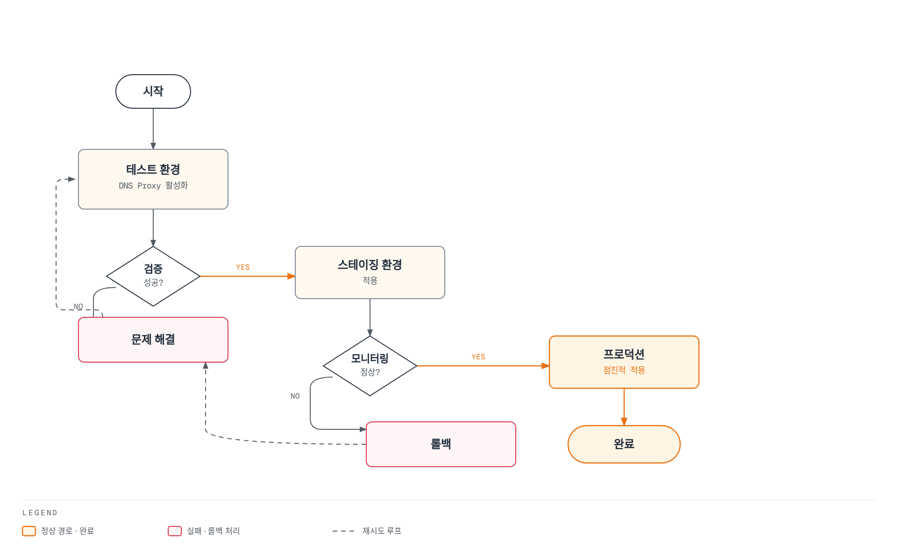

# DNS Proxy 및 DNS Caching

> **검증 기준**: Istio 1.31.0, Kubernetes 1.32–1.36
> **마지막 검토**: 2026년 9월 11일

Istio의 DNS 관리 기능을 통해 외부 서비스 접근 성능을 최적화하고 DNS 조회를 제어합니다.

## 목차

1. [DNS Proxy 개요](#dns-proxy-개요)
2. [DNS Proxy vs DNS Caching](#dns-proxy-vs-dns-caching)
3. [DNS Proxy 설정](#dns-proxy-설정)
4. [ServiceEntry 통합](#serviceentry-통합)
5. [DNS Caching 설정](#dns-caching-설정)
6. [자동 주소 할당](#자동-주소-할당)
7. [문제 해결](#문제-해결)
8. [모범 사례](#모범-사례)

## DNS Proxy 개요

Sidecar 모드에서 애플리케이션 DNS 요청은 **istio-agent의 Go DNS 서버**로 전달됩니다. Envoy의 HTTP/DNS listener가 응답하는 구조가 아닙니다. agent는 Istiod가 전달한 이름/IP 테이블에 있는 항목을 로컬에서 응답하고, 모르는 이름은 `/etc/resolv.conf`의 upstream resolver로 전달합니다. UDP와 TCP DNS를 지원하며 일반 sidecar DNS 포트는15053입니다.

Ambient는 ztunnel이 DNS를 처리하며 Istio 1.25부터 DNS capture가 기본 활성화됩니다. Sidecar 모드는 여전히 명시적으로 켜야 합니다. DNS-over-HTTPS/TLS나 애플리케이션 자체 캐시는 일반53번 포트 capture와 별개의 동작입니다. 아래 EnvoyFilter/agent 진단 예제는 **sidecar 모드**를 대상으로 합니다.

## DNS Proxy vs DNS Caching

| 계층 | 담당 범위 | 조정 위치 |
|---|---|---|
| 애플리케이션/OS resolver 캐시 | 앱이 사용하는 이름과 TTL/음수 캐시 | 앱 런타임·OS·DNS resolver |
| Istio DNS proxy | 알려진 mesh 이름/IP 테이블 응답, 그 외 upstream 전달 | Sidecar `ISTIO_META_DNS_CAPTURE`, ambient CNI/ztunnel |
| Envoy DNS service discovery | DNS 기반 upstream cluster의 endpoint 갱신 | ServiceEntry와 생성된 DNS cluster 설정 |
| Envoy dynamic forward proxy DNS cache | 요청 Host/SNI 기반 동적 목적지 해석 | 별도의 DYNAMIC_DNS/DFP 구성 |

`dns_refresh_rate`는 애플리케이션의 모든 DNS 응답을 캐시하는 스위치가 아닙니다. Sidecar agent의 미등록 이름 upstream 응답도 일반 응답 캐시로 저장되지 않습니다. 등록된 이름은 CoreDNS 왕복을 줄일 수 있지만 endpoint DNS 갱신은 별도로 발생하므로 두 기능을 켜면 항상 최적 성능이 된다고 단정할 수 없습니다.

## DNS Proxy 설정

### 1. 전역 활성화

기존 설치 방식/값에 다음 `istioctl` 입력을 병합합니다. 이는 제거된 in-cluster Operator에 `kubectl apply`할 리소스가 아닙니다. Helm 설치라면 동등한 meshConfig 값을 기존 chart 설정에 반영하세요. 이미 실행 중인 sidecar Pod의 capture 규칙은 새로 주입/시작할 때 반영되므로 검토한 워크로드만 점진적으로 롤아웃합니다.

```yaml
apiVersion: install.istio.io/v1alpha1
kind: IstioOperator
metadata:
  name: istio
  namespace: istio-system
spec:
  meshConfig:
    defaultConfig:
      proxyMetadata:
        ISTIO_META_DNS_CAPTURE: "true"
```

현재 주소 할당은 기본 활성화된 Istiod controller가 담당합니다. 옛 `ISTIO_META_DNS_AUTO_ALLOCATE` metadata에 의존하는 설정을 새 설치에 추가하지 않습니다.

### 2. 네임스페이스별 활성화

네임스페이스의 injection label만으로 DNS capture가 켜지지는 않습니다. 선택한 네임스페이스 안의 Deployment Pod template들에 아래 조각을 GitOps/Kustomize/Helm으로 일관되게 병합하세요. 중앙 `istio-sidecar-injector` ConfigMap을 일부 값으로 덮어쓰는 것은 네임스페이스 한정 설정이 아닙니다. 기존 `proxy.istio.io/config`의 다른 필드를 보존해야 합니다.

### 3. 파드별 활성화

```yaml
# Existing Deployment: merge into spec.template, not a complete workload
metadata:
  annotations:
    proxy.istio.io/config: |
      proxyMetadata:
        ISTIO_META_DNS_CAPTURE: "true"
```

기존 legacy 또는 revision injection을 유지하고 대상 Pod를 새로 생성해야 합니다. 독립적인 Pod spec이나 존재하지 않는 `myapp:v1` 이미지로 실행 가능한 예제라고 가정하지 않습니다. Ambient Pod에서는 이 sidecar 설정 대신 기본 capture와 `ambient.istio.io/dns-capture: "false"` opt-out의 영향을 확인하세요.

### 4. 리다이렉트와 응답 확인

Pod netns의 DNS 리다이렉트는 설치 모드와 CNI에 따라 달라집니다. 기본 proxy 이미지에 bash/iptables/tcpdump나 net-admin 권한이 있다고 가정하지 마세요. 운영 Pod 권한을 높여 규칙을 읽는 대신 뒤의 agent 이름 테이블·DNS 질의·upstream endpoint 검사를 먼저 수행합니다. 필요하면 승인된 진단 환경에서 UDP/TCP53과15053 경로를 모두 확인합니다.

## ServiceEntry 통합

DNS Proxy는 ServiceEntry와 긴밀히 통합되어 작동합니다.

### 기본 ServiceEntry

```yaml
apiVersion: networking.istio.io/v1
kind: ServiceEntry
metadata:
  name: external-api
  namespace: default
spec:
  hosts:
  - api.example.com
  ports:
  - number: 443
    name: https
    protocol: HTTPS
  location: MESH_EXTERNAL
  resolution: DNS
```

**DNS Proxy 동작**:

1. 애플리케이션이 `api.example.com` DNS 조회
2. agent DNS proxy가 할당된 VIP (예: `240.240.0.1`) 반환
3. 애플리케이션이 가상 IP로 요청
4. Envoy가 이 목적지를 별도로 해석한 실제 upstream endpoint로 라우팅

### 여러 호스트 등록

독립된 upstream은 각각의 구체적인 DNS 이름으로 등록합니다. 여기의 example.com 이름들은 구성용 예시이며 실제 DNS·TLS·접근 가능한 backend로 교체해야 합니다.

```yaml
apiVersion: networking.istio.io/v1
kind: ServiceEntry
metadata:
  name: partner-api
  namespace: default
spec:
  hosts: ["api.partner.example.com"]
  ports:
  - number: 443
    name: https
    protocol: HTTPS
  location: MESH_EXTERNAL
  resolution: DNS
---
apiVersion: networking.istio.io/v1
kind: ServiceEntry
metadata:
  name: assets-cdn
  namespace: default
spec:
  hosts: ["cdn.example.com"]
  ports:
  - number: 443
    name: https
    protocol: HTTPS
  location: MESH_EXTERNAL
  resolution: DNS
```

`resolution: DNS`에 endpoint 없이 `*.example.com`을 넣어 모든 subdomain을 조회할 수는 없습니다. 원래 목적지 IP로 전달하는 sidecar wildcard는 별도 `resolution: NONE` 패턴이며 DNS 조회/응답을 만들어 주지 않습니다. Istio 1.31의 `DYNAMIC_DNS`는 별도 모드로 Host/SNI를 복원해 해석하고, ambient에서는 waypoint가 필요하며 raw TCP에는 사용할 수 없습니다. 현재 API와 생성된 구성을 확인하여 선택하세요.

### 엔드포인트 명시

`addresses`는 애플리케이션이 사용할 VIP, `endpoints`는 실제 연결할 backend입니다. CIDR prefix는 트래픽 매칭에는 사용할 수 있지만 한 개 DNS A/AAAA 응답이 아닙니다. 아래 TEST-NET 주소는 배포 가능한 데이터베이스가 아니며 실제 충돌 없는 VIP/backend/TLS 설정이 필요합니다.

```yaml
apiVersion: networking.istio.io/v1
kind: ServiceEntry
metadata:
  name: external-database
  namespace: default
spec:
  hosts:
  - database.external.com
  addresses:
  - 198.51.100.10  # Explicit example VIP
  ports:
  - number: 3306
    name: mysql
    protocol: TCP
  location: MESH_EXTERNAL
  resolution: STATIC
  endpoints:
  - address: 203.0.113.10
  - address: 203.0.113.11
  - address: 203.0.113.12
```

## DNS Caching 설정

### DNS 기반 upstream 갱신

Istio 1.31은 일반 DNS cluster에 `respect_dns_ttl: true`를 설정하고 mesh의 기본 `dnsRefreshRate`는60초입니다. 성공한 응답은 DNS TTL을 사용하고 실패/TTL0 등은 생성된 resolver/cluster 설정에 따라 처리됩니다. 공식 DNS 개념 페이지의 “고정30초, 변경 불가” 문장은 이 릴리스 소스와 맞지 않으므로 실제 생성 값을 확인하세요.

다음은 `default`의 `app: frontend`가 사용하는 **api.example.com:443 DNS cluster 하나**만 조정하는 저수준 대안입니다. `cluster.service`는 실제 이름과 일치해야 하며 glob 선택자가 아닙니다. root namespace에서 모든 cluster에 무차별 적용하지 않습니다.

```yaml
apiVersion: networking.istio.io/v1alpha3
kind: EnvoyFilter
metadata:
  name: external-api-dns-refresh
  namespace: default
spec:
  workloadSelector:
    labels:
      app: frontend
  configPatches:
  - applyTo: CLUSTER
    match:
      context: SIDECAR_OUTBOUND
      cluster:
        service: api.example.com
        portNumber: 443
    patch:
      operation: MERGE
      value:
        dns_refresh_rate: 30s
        respect_dns_ttl: true
        dns_failure_refresh_rate:
          base_interval: 5s
          max_interval: 30s
```

### TTL·실패 갱신·resolver

이 예제는 `respect_dns_ttl: true`를 유지하므로 모든 성공 조회를30초마다 강제하지 않습니다. `dns_failure_refresh_rate`는 실패 후 재시도 간격의 범위이며 DNS 레코드 TTL이나 stale 응답 보존 시간을 설정하지 않습니다. `dns_query_timeout`은 Cluster 필드가 아니며 resolver별 typed config를 검증해야 합니다. IPv4-only/AUTO를 무조건 덮어쓰지 않고 Istio가 선택한 IP family를 보존합니다.

`MERGE`로 protobuf의 기본값인 `false`를 설정해 기존 `respect_dns_ttl: true`를 지운다고 가정하지 마세요. DNS cluster 필드는 Envoy에서 일부 deprecated되었으나 Istio 1.31은 실제로 이 형식을 생성합니다. 이후 업그레이드에서는 DNS cluster extension과 resolver 구성이 바뀌었는지 재검증해야 합니다.

### 적용 결과 확인

```bash
istioctl proxy-config clusters <client-pod> -n default --fqdn api.example.com -o json |
  jq '.[] | {name,type,dnsRefreshRate,respectDnsTtl,dnsFailureRefreshRate,dnsLookupFamily,typedDnsResolverConfig,loadAssignment}'
```

## 자동 주소 할당

### 현재 할당 주체와 상태

기본 활성화된 Istiod IP allocation controller는 적격 ServiceEntry의 각 host에 VIP를 할당하여 `status.addresses`의 `host`/`value`에 기록합니다. 일반 `resolution: DNS` wildcard는 대상이 아니며, `DYNAMIC_DNS` wildcard는 별도 지원 경로입니다. `spec.addresses`가 있거나 `networking.istio.io/enable-autoallocate-ip: "false"`로 제외한 항목은 동일하게 취급하지 않습니다.

### 주소 범위

릴리스 기본 prefix는 IPv4 `240.240.0.0/16`, IPv6 `2001:2::/48`입니다. 다음은 **그 기본값을 보여주는** 실제 control-plane 설정입니다. 사용자 네트워크·VPN·service CIDR과 충돌하지 않아야 합니다.

```yaml
# Advanced istioctl input: these are the released defaults, not new ranges.
apiVersion: install.istio.io/v1alpha1
kind: IstioOperator
spec:
  values:
    pilot:
      env:
        PILOT_ENABLE_IP_AUTOALLOCATE: "true"
        PILOT_IP_AUTOALLOCATE_IPV4_PREFIX: "240.240.0.0/16"
        PILOT_IP_AUTOALLOCATE_IPV6_PREFIX: "2001:2::/48"
```

`defaultServiceExportTo`는 가시성, `outboundTrafficPolicy`는 미등록 outbound 트래픽 처리와 관련된 설정으로 할당 prefix를 바꾸지 않습니다. 이미 할당된 VIP의 변경은 기존 DNS 캐시·연결·라우팅에 영향을 줄 수 있으므로 단순한 prefix 변경을 무중단 마이그레이션으로 제시하지 않습니다. controller status를 수동 편집하지 마세요.

### 할당된 IP 확인

```bash
kubectl get serviceentry external-api -n default -o json |
  jq '{hosts:.spec.hosts, explicitAddresses:.spec.addresses, allocatedAddresses:.status.addresses}'

# Inspect the client's mapping and the actual upstream separately.
istioctl proxy-config listeners <client-pod> -n default
istioctl proxy-config clusters <client-pod> -n default --fqdn api.example.com -o json
istioctl proxy-config endpoints <client-pod> -n default --cluster 'outbound|443||api.example.com'
```

할당 VIP는 애플리케이션 DNS 응답과 목적지 매칭용입니다. DNS cluster의 `loadAssignment`에는 실제 backend를 해석할 DNS 이름이 있고 runtime endpoint에는 해석된 IP가 나타납니다. VIP를 실제 외부 upstream IP인 것처럼 표시하면 안 됩니다.

## 문제 해결

### DNS Proxy 작동 확인

```bash
# Inspect classic or native sidecar metadata without assuming a shell in the image.
kubectl get pod <client-pod> -n default -o json |
  jq '[.spec.containers[], .spec.initContainers[]?] |
      .[] | select(.name == "istio-proxy") |
      {name,env:[.env[]? | select(.name == "ISTIO_META_DNS_CAPTURE")]}'

istioctl analyze -n default
istioctl proxy-status
kubectl get serviceentry external-api -n default -o yaml
kubectl logs -n default <client-pod> -c istio-proxy --tail=100

# Requires a reviewed diagnostic container with nslookup in this Pod's network namespace.
kubectl exec -n default <client-pod> -c <diagnostic-container> -- nslookup api.example.com
```

```bash
# Terminal1: sidecar agent's local status server (not Envoy admin15000)
kubectl port-forward -n default <client-pod> 15020:15020
```

```bash
# Terminal2 while the forward remains active
curl --fail --silent http://127.0.0.1:15020/debug/ndsz |
  jq '.table["api.example.com"]'
curl --fail --silent http://127.0.0.1:15020/stats/prometheus |
  grep '^istio_agent_dns_'
```

agent의 `/debug/ndsz`는 localhost 요청만 허용하고 DNS 서버/이름 테이블이 없으면404를 반환할 수 있습니다. Envoy15000의 listener dump에서 agent15053을 찾는 것은 올바른 검사 방법이 아닙니다. `nslookup`이 앱에 없으면 도구를 기본 이미지에 임의 설치하거나 권한을 높이지 말고 기존 진단 절차를 사용합니다.

### 일반적인 문제

1. **CoreDNS 쿼리가 계속 보임**: 미등록 이름 upstream 전달은 정상입니다. 이름 테이블에 있는 host와 없는 host를 구분하고 agent capture, search/ndots, TCP fallback, 앱의 DoH/TLS를 확인합니다.
2. **ServiceEntry 미반영**: `exportTo`, namespace discovery/Sidecar 범위, resolution, status 할당, injection/revision, NDS/xDS 동기화를 확인합니다. 위의 `istioctl analyze -n default`를 사용하며 리소스 종류/이름을 위치 인자로 넘기지 않습니다. Pod 삭제를 “강제 동기화” 첫 조치로 사용하지 마세요.
3. **VIP 접속 실패**: VIP 매칭과 upstream DNS/endpoint, 네트워크 경로, TLS Host/SNI/인증서를 따로 점검합니다. port 443 HTTPS 서비스에 `http://VIP`를 호출하는 것은 유효한 테스트가 아닙니다.

```bash
# Run inside an approved diagnostic container sharing the captured Pod network namespace.
# Replace VIP4 with the actual IPv4 status.addresses value, and keep the real Host/SNI.
VIP4=240.240.0.1
curl --fail --show-error --resolve "api.example.com:443:${VIP4}" https://api.example.com/
```

예시 VIP는 실제 할당값으로 바꾸어야 합니다. 명령은 DNS capture된 Pod 내부에서 실행해야 하며 다른 호스트에서 이 비라우팅 VIP로 접근할 수 있다고 가정하지 않습니다. 인증서 검증을 끄지 않습니다. 실제 앱 DNS 경로와 직접 VIP 테스트 결과를 둘 다 확인하세요.

### Envoy Admin API와 패킷 검사

```bash
# Terminal1
kubectl port-forward -n default <client-pod> 15000:15000
```

```bash
# Terminal2: Envoy endpoint discovery, distinct from agent name-table metrics
curl --fail --silent http://127.0.0.1:15000/clusters
curl --fail --silent http://127.0.0.1:15000/config_dump > envoy-config.json
```

패킷 캡처가 필요하면 운영 정책에 따라 승인된 진단 컨테이너/노드 도구로 해당 Pod netns의 UDP/TCP53과15053을 관찰합니다. 기본 istio-proxy에 tcpdump·tar·캡처 권한이 있다고 가정하지 않습니다. DNS 이름도 민감할 수 있으므로 캡처 시간·대상·보관 범위를 제한하고 분석 후 처리 절차를 따릅니다.

## 모범 사례

### 1. DNS Proxy 활성화 전략

**권장 접근법**: 단계적 롤아웃



[🔍 인터랙티브 다이어그램 보기](https://www.atomai.click/kubernetes-docs/archmaps/ko-service-mesh-istio-advanced-04-dns-cache-3.html)

### 2. ServiceEntry 관리

```yaml
# 외부 서비스별로 별도 ServiceEntry 생성
apiVersion: networking.istio.io/v1
kind: ServiceEntry
metadata:
  name: payment-api
  namespace: default
  labels:
    app: payment
    team: platform
spec:
  hosts:
  - payments.example.com
  ports:
  - number: 443
    name: https
    protocol: HTTPS
  location: MESH_EXTERNAL
  resolution: DNS
---
apiVersion: networking.istio.io/v1
kind: ServiceEntry
metadata:
  name: analytics-api
  namespace: default
  labels:
    app: analytics
    team: data
spec:
  hosts:
  - analytics.example.com
  ports:
  - number: 443
    name: https
    protocol: HTTPS
  location: MESH_EXTERNAL
  resolution: DNS
```

### 3. DNS Cache TTL 설정

DNS 레코드 TTL, 애플리케이션 캐시, agent 이름 테이블, Envoy endpoint 갱신을 각각 관찰합니다. CDN이라는 이유만으로300초, API라는 이유만으로10초를 모든 cluster에 설정하지 마세요. 권한이 있는 DNS zone에서는 실제 failover 목표와 query 부하에 맞는 TTL을 정하고, mesh에서는 ServiceEntry `exportTo`/Sidecar 범위를 줄여 불필요한 per-proxy 조회를 줄일 수 있습니다. 두 설정은 네트워크 보안 경계가 아닙니다.

특정 DNS cluster의 실패 갱신 조정이 필요하면 앞의 workload/host/port 한정 예제를 사용하고 생성된 설정과 실패 시 동작을 시험합니다.

### 4. 모니터링 메트릭

다음은 Istio 1.31 **sidecar agent**의 실제 metric입니다.15020의 `/stats/prometheus`를 수집하고 `namespace`/`pod` target label을 붙인 Prometheus를 가정합니다. ztunnel이나 Envoy DFP cache metric과 혼용하지 않습니다.

```promql
# Application queries handled by the sidecar agent
sum by (namespace, pod) (
  rate(istio_agent_dns_requests_total{namespace="default"}[5m])
)

# Fraction forwarded upstream; not a DNS response-cache hit/miss ratio
100 *
sum by (namespace, pod) (
  rate(istio_agent_dns_upstream_requests_total{namespace="default"}[5m])
) /
sum by (namespace, pod) (
  rate(istio_agent_dns_requests_total{namespace="default"}[5m])
)

# Requests for which the agent synthesized SERVFAIL after upstream exchange failures
100 *
sum by (namespace, pod) (
  rate(istio_agent_dns_upstream_failures_total{namespace="default"}[5m])
) /
sum by (namespace, pod) (
  rate(istio_agent_dns_upstream_requests_total{namespace="default"}[5m])
)

# Upstream request duration p99, in seconds
histogram_quantile(0.99,
  sum by (le, namespace, pod) (
    rate(istio_agent_dns_upstream_request_duration_seconds_bucket{namespace="default"}[5m])
  )
)
```

`dns_upstream_failures_total`은 agent가 upstream 교환 실패 후 생성한 SERVFAIL을 셉니다. upstream이 정상 응답 패킷으로 반환한 NXDOMAIN/SERVFAIL 전체를 세는 metric이 아닙니다. 요청이 없으면 비율/quantile은 NaN 또는 빈 결과일 수 있으므로 트래픽 존재와 scrape 성공을 함께 확인합니다. 위 값에서 임의의 “캐시 히트율”을 만들지 않습니다.

### 5. 보안 고려사항

DNS capture·ServiceEntry 등록·VIP 할당은 외부 접속 허용 목록을 강제하지 않습니다. Sidecar workload를 선택한 AuthorizationPolicy는 그 workload의 **수신** 트래픽을 검사하며 애플리케이션의 outbound DNS/HTTPS 허용 목록이 아닙니다. namespace 전체의 `DENY/notHosts`는 내부 요청이나 HTTP 속성이 없는 TCP를 차단할 수 있습니다.

실제 egress 제한은 CNI/NetworkPolicy·방화벽·보안 그룹 등 네트워크 경계와, 필요한 경우 우회가 차단된 egress gateway 및 해당 gateway의 인가 정책을 함께 설계합니다. TLS를 통과시키는 경로에서는 HTTP Host를 읽을 수 없고 SNI/목적지 제약과 인증서 검증이 별도로 필요합니다. [Egress 제어](../traffic-management/11-egress-control.md)의 전체 전제조건을 따르세요.

### 6. 성능 튜닝

DNS 부하·실패율·lookup 지연과 Istiod push 지연, sidecar agent/Envoy CPU·메모리를 측정한 뒤 병목을 조정합니다. agent의 Go DNS 서버는 Envoy worker thread 수로 크기가 결정되지 않으며 Istiod replica/HPA 예시만 늘려 모든 DNS 경로가 빨라지지는 않습니다.

애플리케이션별 캐시/ndots와 DNS TTL, ServiceEntry 개수·가시성, 프록시 수에 따른 주기적 조회량, 장애 복구 시 stale endpoint/연결 유지 동작을 함께 시험하세요. 측정 없는 고정 CPU/메모리/HPA 값을 production 최적화로 제시하지 않습니다.

## 참고 자료

### 공식 문서
- [Istio DNS Proxy](https://istio.io/latest/docs/ops/configuration/traffic-management/dns-proxy/)
- [Envoy DNS Cache](https://www.envoyproxy.io/docs/envoy/latest/intro/arch_overview/upstream/service_discovery)
- [ServiceEntry](https://istio.io/latest/docs/reference/config/networking/service-entry/)

- [Istio 1.31 DNS server](https://raw.githubusercontent.com/istio/istio/1.31.0/pkg/dns/client/dns.go)
- [Istio 1.31 IP allocation and prefixes](https://raw.githubusercontent.com/istio/istio/1.31.0/pilot/pkg/features/pilot.go)
- [Istio 1.31 allocation status](https://raw.githubusercontent.com/istio/istio/1.31.0/pilot/pkg/controllers/ipallocate/ipallocate.go)
- [Istio 1.31 DNS cluster generation](https://raw.githubusercontent.com/istio/istio/1.31.0/pilot/pkg/networking/core/cluster_builder.go)
- [Istio 1.31 mesh defaults](https://raw.githubusercontent.com/istio/istio/1.31.0/pkg/config/mesh/mesh.go)
- [Istio 1.31 agent DNS metrics](https://raw.githubusercontent.com/istio/istio/1.31.0/pkg/dns/client/monitoring.go)
- [Istio 1.31 agent status endpoint](https://raw.githubusercontent.com/istio/istio/1.31.0/pilot/cmd/pilot-agent/status/server.go)
- [Envoy Cluster API](https://www.envoyproxy.io/docs/envoy/latest/api-v3/config/cluster/v3/cluster.proto)

### 관련 문서
- [Istio 아키텍처 - DNS 처리 메커니즘](../03-architecture.md)
- [ServiceEntry](../traffic-management/12-service-entry.md)
- [Egress 제어](../traffic-management/11-egress-control.md)
