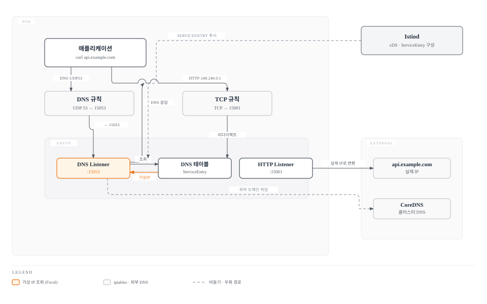
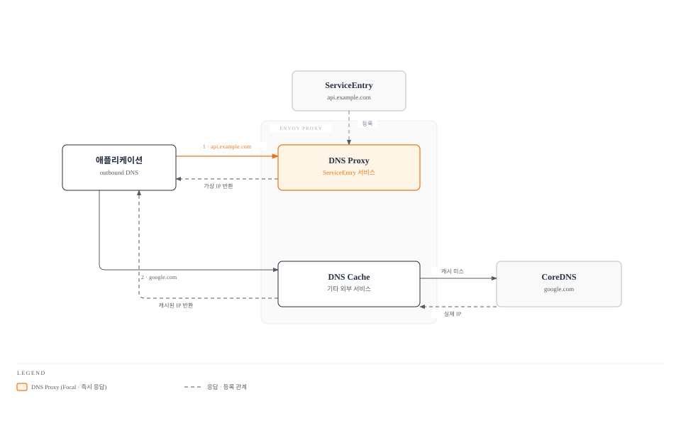
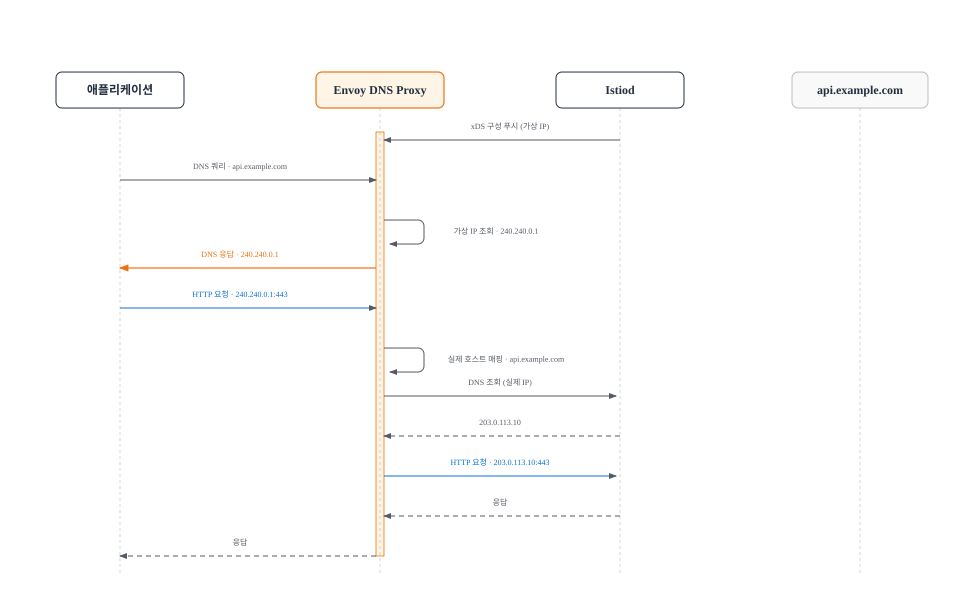
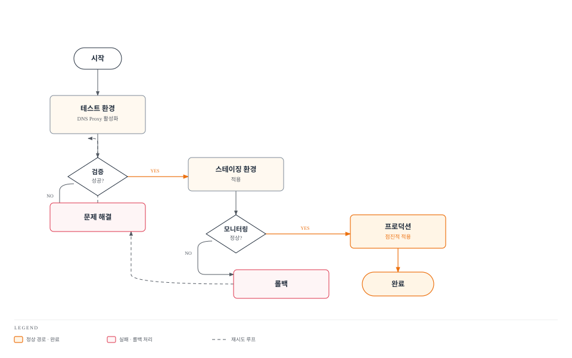

# DNS Proxy 및 DNS Caching

> **지원 버전**: Istio 1.28+
> **마지막 업데이트**: 2026년 2월 23일

Istio의 DNS 관리 기능을 통해 외부 서비스 접근 성능을 최적화하고 DNS 조회를 제어합니다.

## 목차

1. [DNS Proxy 개요](#dns-proxy-개요)
2. [DNS Proxy vs DNS Caching](#dns-proxy-vs-dns-caching)
3. [DNS Proxy 설정](#dns-proxy-설정)
4. [ServiceEntry 통합](#serviceentry-통합)
5. [DNS Caching 설정](#dns-caching-설정)
6. [자동 주소 할당](#자동-주소-할당)
7. [문제 해결](#문제-해결)
8. [모범 사례](#모범-사례)

## DNS Proxy 개요

Istio DNS Proxy는 Envoy가 DNS 서버 역할을 하여 애플리케이션의 DNS 요청을 가로채고 처리하는 기능입니다.

### 주요 기능

1. **DNS 쿼리 가로채기**: UDP 53번 포트의 DNS 요청을 Envoy가 처리
2. **ServiceEntry 기반 해석**: 외부 서비스를 ServiceEntry로 등록하면 자동으로 DNS 응답 생성
3. **자동 IP 할당**: 외부 서비스에 가상 IP 자동 할당
4. **CoreDNS 우회**: Kubernetes DNS 서버 부하 감소

### 아키텍처



## DNS Proxy vs DNS Caching

두 기능은 서로 다른 목적과 동작 방식을 가집니다:

| 특성 | DNS Proxy | DNS Caching |
|------|-----------|-------------|
| **역할** | DNS 서버 역할 수행 | DNS 조회 결과 캐싱 |
| **동작** | DNS 쿼리 가로채기 및 직접 응답 | 외부 DNS 조회 후 결과 저장 |
| **구성** | `ISTIO_META_DNS_CAPTURE` | `dns_refresh_rate` |
| **대상** | ServiceEntry 등록된 서비스 | 모든 외부 DNS 조회 |
| **IP 할당** | 가상 IP 자동 할당 | 실제 DNS 응답 사용 |
| **CoreDNS** | 우회 가능 | 여전히 사용 |
| **Istio 버전** | 1.8+ | 모든 버전 |

### 통합 사용

두 기능을 함께 사용하면 최적의 성능을 얻을 수 있습니다:



## DNS Proxy 설정

### 1. 전역 활성화

모든 네임스페이스에 DNS Proxy 적용:

```yaml
apiVersion: install.istio.io/v1alpha1
kind: IstioOperator
metadata:
  name: istio
  namespace: istio-system
spec:
  meshConfig:
    defaultConfig:
      proxyMetadata:
        # DNS Proxy 활성화
        ISTIO_META_DNS_CAPTURE: "true"
        # 자동 IP 할당 활성화
        ISTIO_META_DNS_AUTO_ALLOCATE: "true"
```

### 2. 네임스페이스별 활성화

특정 네임스페이스만 활성화:

```yaml
apiVersion: v1
kind: Namespace
metadata:
  name: production
  labels:
    istio-injection: enabled
---
apiVersion: v1
kind: ConfigMap
metadata:
  name: istio-sidecar-injector
  namespace: istio-system
data:
  values: |
    global:
      proxy:
        holdApplicationUntilProxyStarts: true
    sidecarInjectorWebhook:
      templates:
        custom: |
          spec:
            containers:
            - name: istio-proxy
              env:
              - name: ISTIO_META_DNS_CAPTURE
                value: "true"
              - name: ISTIO_META_DNS_AUTO_ALLOCATE
                value: "true"
```

### 3. 파드별 활성화

특정 파드에만 활성화:

```yaml
apiVersion: v1
kind: Pod
metadata:
  name: myapp
  annotations:
    proxy.istio.io/config: |
      proxyMetadata:
        ISTIO_META_DNS_CAPTURE: "true"
        ISTIO_META_DNS_AUTO_ALLOCATE: "true"
spec:
  containers:
  - name: app
    image: myapp:v1
```

### 4. iptables 규칙 확인

DNS Proxy가 활성화되면 다음 iptables 규칙이 추가됩니다:

```bash
# 파드 진입
kubectl exec -it <pod-name> -c istio-proxy -- /bin/bash

# DNS 리다이렉트 규칙 확인
iptables -t nat -L ISTIO_OUTPUT -n -v

# 예상 출력
Chain ISTIO_OUTPUT (1 references)
pkts bytes target     prot opt in     out     source               destination
   0     0 RETURN     udp  --  *      *       0.0.0.0/0            127.0.0.53           udp dpt:53
   0     0 REDIRECT   udp  --  *      *       0.0.0.0/0            0.0.0.0/0            udp dpt:53 redir ports 15053
```

## ServiceEntry 통합

DNS Proxy는 ServiceEntry와 긴밀히 통합되어 작동합니다.

### 기본 ServiceEntry

```yaml
apiVersion: networking.istio.io/v1
kind: ServiceEntry
metadata:
  name: external-api
  namespace: default
spec:
  hosts:
  - api.example.com
  ports:
  - number: 443
    name: https
    protocol: HTTPS
  location: MESH_EXTERNAL
  resolution: DNS
```

**DNS Proxy 동작**:
1. 애플리케이션이 `api.example.com` DNS 조회
2. Envoy DNS Proxy가 가상 IP (예: `240.240.0.1`) 반환
3. 애플리케이션이 가상 IP로 요청
4. Envoy가 실제 IP로 변환하여 전송

### 여러 호스트 등록

```yaml
apiVersion: networking.istio.io/v1
kind: ServiceEntry
metadata:
  name: external-services
spec:
  hosts:
  - "*.example.com"  # 와일드카드 지원
  - api.partner.com
  - cdn.assets.com
  ports:
  - number: 443
    name: https
    protocol: HTTPS
  - number: 80
    name: http
    protocol: HTTP
  location: MESH_EXTERNAL
  resolution: DNS
```

### 엔드포인트 명시

```yaml
apiVersion: networking.istio.io/v1
kind: ServiceEntry
metadata:
  name: external-database
spec:
  hosts:
  - database.external.com
  addresses:
  - 203.0.113.0/24  # 외부 네트워크 대역
  ports:
  - number: 3306
    name: mysql
    protocol: TCP
  location: MESH_EXTERNAL
  resolution: STATIC
  endpoints:
  - address: 203.0.113.10
  - address: 203.0.113.11
  - address: 203.0.113.12
```

## DNS Caching 설정

DNS Caching은 외부 DNS 조회 성능을 향상시킵니다.

### Envoy DNS Cache 활성화

```yaml
apiVersion: networking.istio.io/v1alpha3
kind: EnvoyFilter
metadata:
  name: dns-cache-filter
  namespace: istio-system
spec:
  configPatches:
  - applyTo: CLUSTER
    match:
      context: SIDECAR_OUTBOUND
      cluster:
        service: "*.example.com"
    patch:
      operation: MERGE
      value:
        dns_refresh_rate: 30s  # DNS 캐시 갱신 주기
        dns_lookup_family: V4_ONLY  # IPv4만 사용
        dns_failure_refresh_rate:
          base_interval: 5s  # 실패 시 재시도 간격
          max_interval: 30s
```

### 고급 DNS Cache 설정

```yaml
apiVersion: networking.istio.io/v1alpha3
kind: EnvoyFilter
metadata:
  name: advanced-dns-cache
  namespace: istio-system
spec:
  configPatches:
  - applyTo: CLUSTER
    match:
      context: SIDECAR_OUTBOUND
    patch:
      operation: MERGE
      value:
        # DNS 캐시 TTL 설정
        dns_refresh_rate: 60s

        # DNS 조회 타임아웃
        dns_query_timeout: 5s

        # IP 버전 우선순위
        dns_lookup_family: AUTO  # IPv4/IPv6 자동 선택

        # 실패 시 캐시 정책
        dns_failure_refresh_rate:
          base_interval: 2s
          max_interval: 10s

        # Respect DNS TTL
        respect_dns_ttl: true
```

### 특정 서비스에만 적용

```yaml
apiVersion: networking.istio.io/v1alpha3
kind: EnvoyFilter
metadata:
  name: api-dns-cache
  namespace: default
spec:
  workloadSelector:
    labels:
      app: frontend
  configPatches:
  - applyTo: CLUSTER
    match:
      cluster:
        service: api.external.com
    patch:
      operation: MERGE
      value:
        dns_refresh_rate: 30s
        dns_lookup_family: V4_ONLY
```

## 자동 주소 할당

DNS Proxy는 ServiceEntry에 등록된 서비스에 가상 IP를 자동으로 할당합니다.

### 자동 할당 동작



### 주소 범위 설정

기본적으로 `240.240.0.0/16` 대역이 사용됩니다. 변경이 필요한 경우:

```yaml
apiVersion: install.istio.io/v1alpha1
kind: IstioOperator
spec:
  meshConfig:
    defaultConfig:
      proxyMetadata:
        ISTIO_META_DNS_CAPTURE: "true"
        ISTIO_META_DNS_AUTO_ALLOCATE: "true"
    # 자동 할당 주소 범위 변경
    defaultServiceExportTo:
    - "*"
    # 주소 범위 (예시, 실제로는 Envoy 내부에서 관리)
    outboundTrafficPolicy:
      mode: ALLOW_ANY
```

### 할당된 IP 확인

```bash
# Envoy 설정에서 할당된 가상 IP 확인
istioctl proxy-config clusters <pod-name> -n <namespace> --fqdn api.example.com -o json

# 출력 예시
{
  "name": "outbound|443||api.example.com",
  "type": "STRICT_DNS",
  "connectTimeout": "10s",
  "loadAssignment": {
    "clusterName": "outbound|443||api.example.com",
    "endpoints": [{
      "lbEndpoints": [{
        "endpoint": {
          "address": {
            "socketAddress": {
              "address": "240.240.0.1",  # 가상 IP
              "portValue": 443
            }
          }
        }
      }]
    }]
  }
}
```

## 문제 해결

### DNS Proxy 작동 확인

```bash
# 1. DNS Proxy 환경 변수 확인
kubectl get pod <pod-name> -o jsonpath='{.spec.containers[?(@.name=="istio-proxy")].env[?(@.name=="ISTIO_META_DNS_CAPTURE")].value}'

# 2. iptables 규칙 확인
kubectl exec -it <pod-name> -c istio-proxy -- iptables -t nat -L ISTIO_OUTPUT -n | grep 15053

# 3. Envoy DNS Listener 확인
istioctl proxy-config listeners <pod-name> --port 15053

# 4. DNS 쿼리 테스트
kubectl exec -it <pod-name> -c app -- nslookup api.example.com

# 5. Envoy 로그 확인
kubectl logs <pod-name> -c istio-proxy | grep -i dns
```

### 일반적인 문제

#### 문제 1: DNS 쿼리가 여전히 CoreDNS로 감

**원인**: DNS Proxy가 활성화되지 않음

**해결책**:
```bash
# 환경 변수 확인
kubectl get pod <pod-name> -o yaml | grep ISTIO_META_DNS_CAPTURE

# 없으면 annotation 추가
kubectl patch deployment <deployment-name> -p '
spec:
  template:
    metadata:
      annotations:
        proxy.istio.io/config: |
          proxyMetadata:
            ISTIO_META_DNS_CAPTURE: "true"
'

# 파드 재시작
kubectl rollout restart deployment <deployment-name>
```

#### 문제 2: ServiceEntry가 DNS Proxy에 반영되지 않음

**원인**: ServiceEntry 구성 오류 또는 xDS 동기화 지연

**해결책**:
```bash
# ServiceEntry 검증
istioctl analyze serviceentry <name> -n <namespace>

# xDS 동기화 확인
istioctl proxy-status

# Envoy 구성 확인
istioctl proxy-config clusters <pod-name> | grep <service-name>

# 강제 xDS 재동기화
kubectl delete pod -n <namespace> <pod-name>
```

#### 문제 3: 가상 IP로 연결 실패

**원인**: 주소 충돌 또는 라우팅 문제

**해결책**:
```bash
# 가상 IP 할당 확인
istioctl proxy-config clusters <pod-name> --fqdn <service-host> -o json

# Listener 구성 확인
istioctl proxy-config listeners <pod-name> --address 240.240.0.1

# Envoy 로그 확인
kubectl logs <pod-name> -c istio-proxy --tail=100 | grep -i "240.240"

# 테스트 요청
kubectl exec -it <pod-name> -c app -- curl -v http://240.240.0.1
```

### 디버깅 도구

#### Envoy Admin API 활용

```bash
# 파드로 포트포워드
kubectl port-forward <pod-name> 15000:15000

# DNS Cache 통계
curl http://localhost:15000/stats | grep dns

# Cluster 상태
curl http://localhost:15000/clusters

# 전체 구성 덤프
curl http://localhost:15000/config_dump > config.json
```

#### 패킷 캡처

```bash
# DNS 트래픽 캡처
kubectl exec -it <pod-name> -c istio-proxy -- tcpdump -i any -n port 53 -w /tmp/dns.pcap

# 파일 다운로드
kubectl cp <pod-name>:/tmp/dns.pcap ./dns.pcap -c istio-proxy

# Wireshark로 분석
wireshark dns.pcap
```

## 모범 사례

### 1. DNS Proxy 활성화 전략

**권장 접근법**: 단계적 롤아웃



### 2. ServiceEntry 관리

```yaml
# 외부 서비스별로 별도 ServiceEntry 생성
apiVersion: networking.istio.io/v1
kind: ServiceEntry
metadata:
  name: payment-api
  namespace: default
  labels:
    app: payment
    team: platform
spec:
  hosts:
  - api.payment-provider.com
  ports:
  - number: 443
    name: https
    protocol: HTTPS
  location: MESH_EXTERNAL
  resolution: DNS
---
apiVersion: networking.istio.io/v1
kind: ServiceEntry
metadata:
  name: analytics-api
  namespace: default
  labels:
    app: analytics
    team: data
spec:
  hosts:
  - api.analytics-provider.com
  ports:
  - number: 443
    name: https
    protocol: HTTPS
  location: MESH_EXTERNAL
  resolution: DNS
```

### 3. DNS Cache TTL 설정

```yaml
# 서비스 특성에 따라 TTL 조정
apiVersion: networking.istio.io/v1alpha3
kind: EnvoyFilter
metadata:
  name: dns-cache-ttl
  namespace: istio-system
spec:
  configPatches:
  # 정적 콘텐츠 (긴 TTL)
  - applyTo: CLUSTER
    match:
      cluster:
        service: cdn.static-assets.com
    patch:
      operation: MERGE
      value:
        dns_refresh_rate: 300s  # 5분

  # 동적 API (짧은 TTL)
  - applyTo: CLUSTER
    match:
      cluster:
        service: api.dynamic-service.com
    patch:
      operation: MERGE
      value:
        dns_refresh_rate: 10s  # 10초
```

### 4. 모니터링 메트릭

```promql
# DNS Proxy 활동
sum(rate(envoy_dns_cache_dns_query_attempt[5m])) by (pod)

# DNS Cache 히트율
sum(rate(envoy_dns_cache_hit[5m]))
/
sum(rate(envoy_dns_cache_dns_query_attempt[5m]))
* 100

# DNS 조회 지연시간
histogram_quantile(0.99,
  sum(rate(envoy_dns_cache_dns_query_duration_bucket[5m])) by (le)
)

# DNS 조회 실패율
sum(rate(envoy_dns_cache_dns_query_failure[5m]))
/
sum(rate(envoy_dns_cache_dns_query_attempt[5m]))
* 100
```

### 5. 보안 고려사항

```yaml
# DNS Proxy와 AuthorizationPolicy 통합
apiVersion: security.istio.io/v1
kind: AuthorizationPolicy
metadata:
  name: external-api-access
  namespace: default
spec:
  selector:
    matchLabels:
      app: frontend
  action: ALLOW
  rules:
  - to:
    - operation:
        hosts:
        - api.approved-partner.com  # 승인된 외부 서비스만
        - cdn.trusted-cdn.com
        ports:
        - "443"
---
apiVersion: security.istio.io/v1
kind: AuthorizationPolicy
metadata:
  name: deny-all-external
  namespace: default
spec:
  action: DENY
  rules:
  - to:
    - operation:
        notHosts:
        - "*.svc.cluster.local"  # 클러스터 내부가 아닌 모든 요청 거부
```

### 6. 성능 튜닝

```yaml
# 고성능 환경을 위한 최적화
apiVersion: install.istio.io/v1alpha1
kind: IstioOperator
spec:
  meshConfig:
    defaultConfig:
      proxyMetadata:
        ISTIO_META_DNS_CAPTURE: "true"
        ISTIO_META_DNS_AUTO_ALLOCATE: "true"
      concurrency: 4  # Envoy worker 스레드 수
  components:
    pilot:
      k8s:
        resources:
          requests:
            cpu: 500m
            memory: 2Gi
          limits:
            cpu: 2000m
            memory: 4Gi
        hpaSpec:
          minReplicas: 2
          maxReplicas: 5
```

## 참고 자료

### 공식 문서
- [Istio DNS Proxy](https://istio.io/latest/docs/ops/configuration/traffic-management/dns-proxy/)
- [Envoy DNS Cache](https://www.envoyproxy.io/docs/envoy/latest/intro/arch_overview/upstream/service_discovery#dns-cache)
- [ServiceEntry](https://istio.io/latest/docs/reference/config/networking/service-entry/)

### 관련 문서
- [Istio 아키텍처 - DNS 처리 메커니즘](../03-architecture.md#dns-처리-메커니즘)
- [ServiceEntry](../traffic-management/12-service-entry.md)
- [Egress 제어](../traffic-management/11-egress-control.md)
