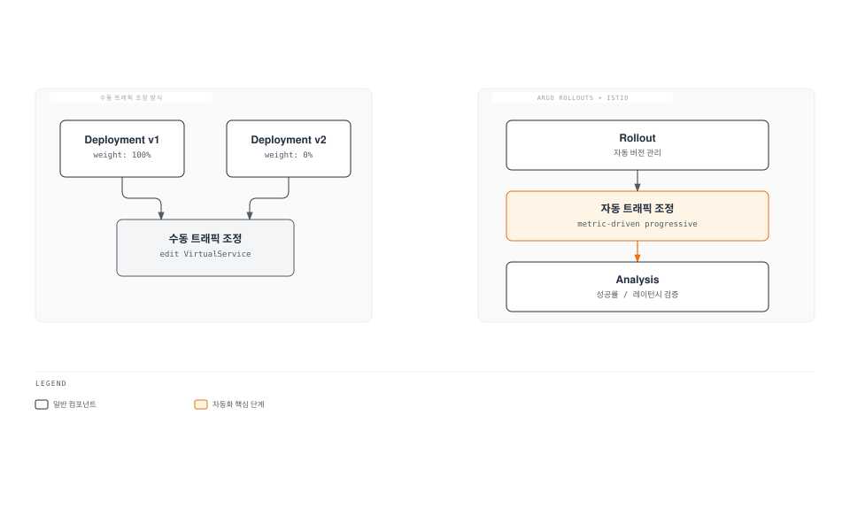
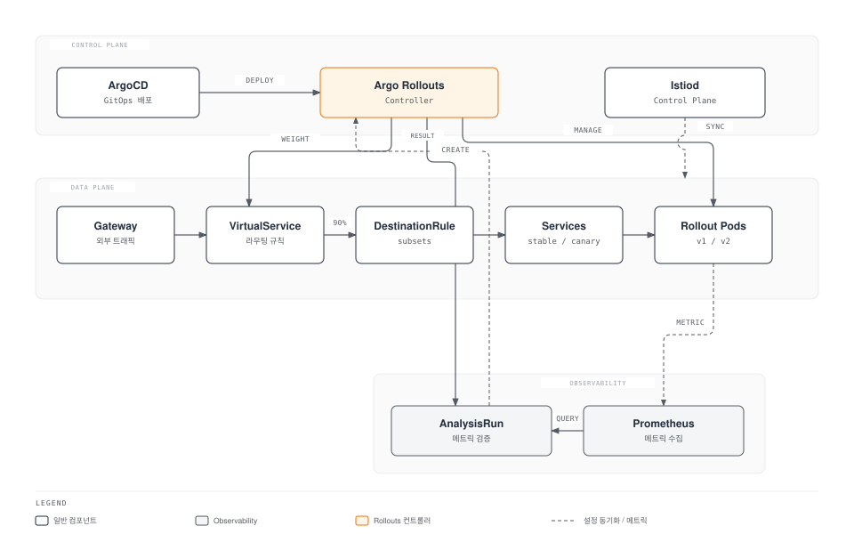
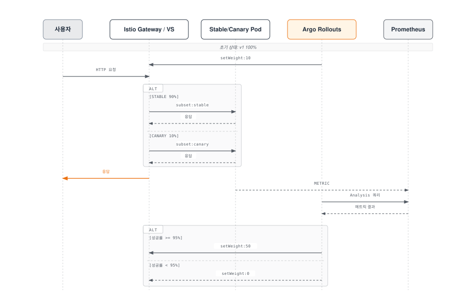
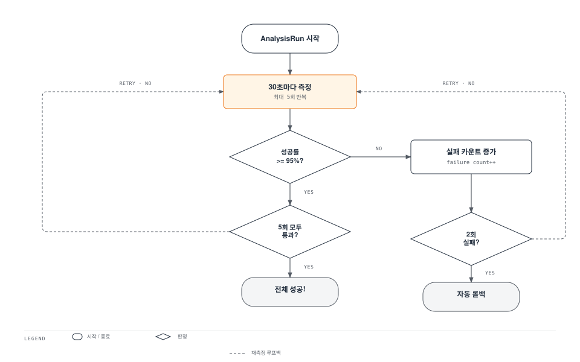
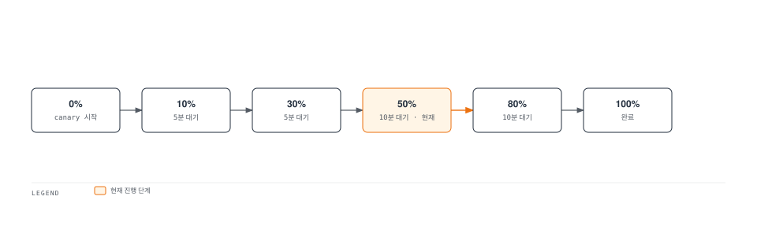
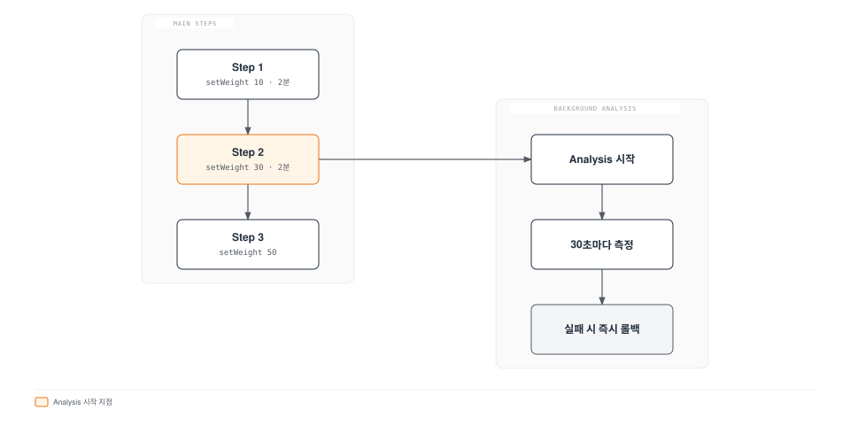
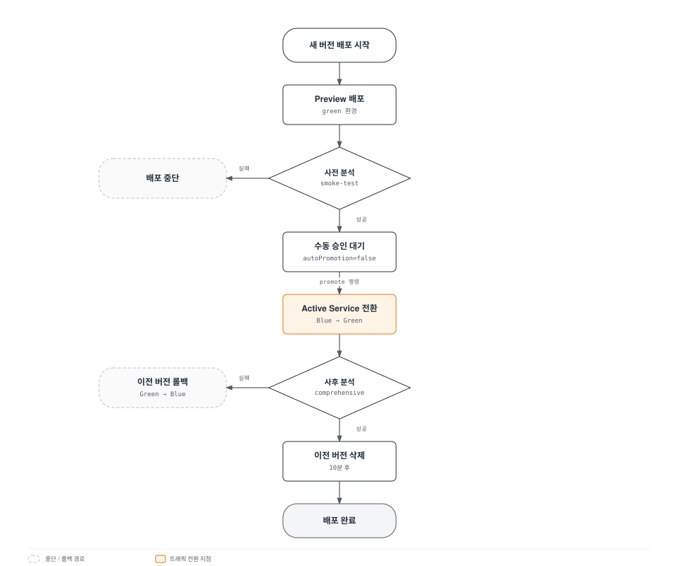

# Argo Rollouts와 Istio 통합

> **지원 버전**: Argo Rollouts 1.6+, Istio 1.18+
> **마지막 업데이트**: 2026년 2월 19일
> **난이도**: ⭐⭐⭐⭐ (고급)

이 문서는 Argo Rollouts와 Istio Service Mesh를 통합하여 Progressive Delivery를 구현하는 방법을 상세히 설명합니다.

## 목차

1. [개요](#개요)
2. [아키텍처](#아키텍처)
3. [핵심 개념](#핵심-개념)
4. [설정 및 구성](#설정-및-구성)
5. [트래픽 라우팅 전략](#트래픽-라우팅-전략)
6. [Analysis 및 메트릭](#analysis-및-메트릭)
7. [고급 배포 패턴](#고급-배포-패턴)
8. [문제 해결](#문제-해결)
9. [모범 사례](#모범-사례)

## 개요

### Argo Rollouts란?

Argo Rollouts는 Kubernetes를 위한 Progressive Delivery 컨트롤러로, 고급 배포 전략을 제공합니다:

- **Canary 배포**: 점진적 트래픽 전환
- **Blue/Green 배포**: 즉시 전환 및 롤백
- **분석 기반 자동화**: 메트릭 기반 자동 진행/롤백
- **트래픽 관리 통합**: Istio, Nginx, ALB 등 지원

### Istio 통합의 장점



**주요 이점**:
- ✅ **자동화된 Canary 배포**: VirtualService weight 자동 조정
- ✅ **메트릭 기반 검증**: Prometheus 메트릭으로 자동 진행/롤백
- ✅ **세밀한 트래픽 제어**: Istio의 L7 라우팅 활용
- ✅ **무중단 배포**: 트래픽 전환 중 다운타임 없음
- ✅ **자동 롤백**: 에러율 증가 시 자동 롤백

### 지원하는 Istio 리소스

| 리소스 | 용도 | Argo Rollouts 관리 |
|--------|------|-------------------|
| **VirtualService** | 트래픽 라우팅 규칙 | ✅ routes의 weight 자동 조정 |
| **DestinationRule** | Subset 정의 | ⚠️ 수동 생성 필요 |
| **Service** | Stable/Canary 엔드포인트 | ⚠️ 수동 생성 필요 |

## 아키텍처

### 전체 아키텍처



### 트래픽 흐름



## 핵심 개념

### 1. Rollout 리소스

Rollout은 Deployment를 대체하는 커스텀 리소스로, 고급 배포 전략을 지원합니다.

**Deployment와 비교**:

| 기능 | Deployment | Rollout |
|------|-----------|---------|
| **기본 롤아웃** | ✅ RollingUpdate | ✅ RollingUpdate |
| **Canary 배포** | ❌ | ✅ 트래픽 가중치 제어 |
| **Blue/Green** | ❌ | ✅ 즉시 전환 |
| **분석 기반 자동화** | ❌ | ✅ AnalysisTemplate |
| **트래픽 관리 통합** | ❌ | ✅ Istio, Nginx, ALB |
| **자동 롤백** | ❌ | ✅ 메트릭 기반 |

### 2. VirtualService 관리 방식

**중요**: Argo Rollouts는 지정된 route 이름의 **전체 destinations 배열을 덮어씁니다**.

```yaml
# VirtualService 초기 상태
apiVersion: networking.istio.io/v1
kind: VirtualService
metadata:
  name: test
spec:
  http:
  - name: primary  # Rollout이 관리하는 route
    route:
    - destination: {host: test, subset: stable}
      weight: 100
    - destination: {host: test, subset: canary}
      weight: 0
```

**Rollout 설정**:
```yaml
apiVersion: argoproj.io/v1alpha1
kind: Rollout
spec:
  strategy:
    canary:
      trafficRouting:
        istio:
          virtualService:
            name: test          # VirtualService 이름
            routes:
            - primary           # 관리할 route 이름
          destinationRule:
            name: test          # DestinationRule 이름
            canarySubsetName: canary
            stableSubsetName: stable
      steps:
      - setWeight: 10  # → VirtualService의 primary route를 수정
```

**setWeight: 10 실행 시**:
```yaml
# Argo Rollouts가 자동으로 수정
http:
- name: primary
  route:
  - destination: {host: test, subset: stable}
    weight: 90   # ← 자동 조정
  - destination: {host: test, subset: canary}
    weight: 10   # ← 자동 조정
```

**주의사항**:
- ⚠️ 여러 Rollout이 같은 route 이름을 참조하면 충돌 발생
- ⚠️ Rollout은 route의 **모든 destination**을 관리
- ⚠️ Subset 이름이 다르더라도 같은 route는 공유 불가

### 3. Subset과 Service

**DestinationRule Subset**:
```yaml
apiVersion: networking.istio.io/v1
kind: DestinationRule
metadata:
  name: test
spec:
  host: test  # Service 이름과 일치
  subsets:
  - name: stable
    labels: {}  # ← 빈 레이블 (Service selector 사용)
  - name: canary
    labels: {}  # ← 빈 레이블 (Service selector 사용)
```

**Stable/Canary Service**:
```yaml
# Stable Service
apiVersion: v1
kind: Service
metadata:
  name: test-stable
spec:
  selector:
    app: test
    # Rollout이 자동으로 추가하는 레이블
    rollouts-pod-template-hash: <stable-hash>
  ports:
  - port: 8080

---
# Canary Service
apiVersion: v1
kind: Service
metadata:
  name: test-canary
spec:
  selector:
    app: test
    # Rollout이 자동으로 추가하는 레이블
    rollouts-pod-template-hash: <canary-hash>
  ports:
  - port: 8080
```

**동작 방식**:
1. Rollout이 새 버전 배포 시 새로운 `rollouts-pod-template-hash` 레이블 생성
2. Canary 파드에 해당 hash 레이블 자동 추가
3. Canary Service가 해당 파드만 선택
4. Rollout 완료 시 Stable Service가 새 hash로 업데이트

### 4. Analysis 및 메트릭

**AnalysisTemplate**:
```yaml
apiVersion: argoproj.io/v1alpha1
kind: AnalysisTemplate
metadata:
  name: success-rate
spec:
  args:
  - name: service-name
  - name: canary-hash
  metrics:
  - name: success-rate
    interval: 30s              # 30초마다 측정
    count: 5                   # 5번 측정
    successCondition: result >= 0.95  # 95% 이상이어야 성공
    failureLimit: 2            # 2번 실패하면 전체 실패
    provider:
      prometheus:
        address: http://prometheus.istio-system:9090
        query: |
          sum(rate(
            istio_requests_total{
              destination_service_name="{{args.service-name}}",
              destination_workload_label_rollouts_pod_template_hash="{{args.canary-hash}}",
              response_code!~"5.*"
            }[2m]
          ))
          /
          sum(rate(
            istio_requests_total{
              destination_service_name="{{args.service-name}}",
              destination_workload_label_rollouts_pod_template_hash="{{args.canary-hash}}"
            }[2m]
          ))
```

**AnalysisRun**:


## 설정 및 구성

### 필수 리소스 생성

#### 1. Rollout 리소스

```yaml
apiVersion: argoproj.io/v1alpha1
kind: Rollout
metadata:
  name: test
  namespace: default
spec:
  replicas: 3
  revisionHistoryLimit: 2  # 유지할 ReplicaSet 수
  selector:
    matchLabels:
      app: test
  template:
    metadata:
      labels:
        app: test
    spec:
      containers:
      - name: app
        image: myapp:v1
        ports:
        - containerPort: 8080
        resources:
          requests:
            cpu: 100m
            memory: 128Mi
          limits:
            cpu: 200m
            memory: 256Mi
  strategy:
    canary:
      # Stable/Canary Service 지정
      canaryService: test-canary
      stableService: test-stable

      # Istio 트래픽 라우팅
      trafficRouting:
        istio:
          virtualService:
            name: test              # VirtualService 이름
            routes:
            - primary               # 관리할 route 이름
          destinationRule:
            name: test              # DestinationRule 이름
            canarySubsetName: canary
            stableSubsetName: stable

      # 배포 단계
      steps:
      - setWeight: 10
      - pause: {duration: 5m}
      - setWeight: 20
      - pause: {duration: 5m}
      - setWeight: 50
      - pause: {duration: 5m}
      - setWeight: 80
      - pause: {duration: 5m}
```

#### 2. Stable/Canary Service

```yaml
# Stable Service
apiVersion: v1
kind: Service
metadata:
  name: test-stable
  namespace: default
spec:
  selector:
    app: test
    # rollouts-pod-template-hash는 Rollout이 자동 추가
  ports:
  - name: http
    port: 8080
    targetPort: 8080

---
# Canary Service
apiVersion: v1
kind: Service
metadata:
  name: test-canary
  namespace: default
spec:
  selector:
    app: test
    # rollouts-pod-template-hash는 Rollout이 자동 추가
  ports:
  - name: http
    port: 8080
    targetPort: 8080

---
# 통합 Service (VirtualService가 참조)
apiVersion: v1
kind: Service
metadata:
  name: test
  namespace: default
spec:
  selector:
    app: test
  ports:
  - name: http
    port: 8080
    targetPort: 8080
```

#### 3. VirtualService

```yaml
apiVersion: networking.istio.io/v1
kind: VirtualService
metadata:
  name: test
  namespace: default
spec:
  hosts:
  - test
  - test.default.svc.cluster.local
  http:
  - name: primary  # Rollout이 관리하는 route
    route:
    - destination:
        host: test
        subset: stable
      weight: 100  # ← Rollout이 자동 조정
    - destination:
        host: test
        subset: canary
      weight: 0    # ← Rollout이 자동 조정
```

#### 4. DestinationRule

```yaml
apiVersion: networking.istio.io/v1
kind: DestinationRule
metadata:
  name: test
  namespace: default
spec:
  host: test
  trafficPolicy:
    loadBalancer:
      simple: LEAST_REQUEST
  subsets:
  - name: stable
    labels: {}  # 빈 레이블 (Service selector 사용)
  - name: canary
    labels: {}  # 빈 레이블 (Service selector 사용)
```

### 배포 워크플로우

```bash
# 1. 새 버전 배포
kubectl argo rollouts set image test app=myapp:v2

# 2. 상태 확인 (실시간 모니터링)
kubectl argo rollouts get rollout test --watch

# 출력 예시:
# Name:            test
# Namespace:       default
# Status:          ॥ Paused
# Strategy:        Canary
#   Step:          1/8
#   SetWeight:     10
#   ActualWeight:  10
# Images:          myapp:v1 (stable)
#                  myapp:v2 (canary)
# Replicas:
#   Desired:       3
#   Current:       4
#   Updated:       1
#   Ready:         4
#   Available:     4

# 3. 다음 단계로 수동 진행 (pause 후)
kubectl argo rollouts promote test

# 4. 즉시 롤백 (문제 발생 시)
kubectl argo rollouts abort test

# 5. 롤백 후 재시도
kubectl argo rollouts retry rollout test
```

## 트래픽 라우팅 전략

### 1. 기본 Canary (가중치 기반)

```yaml
spec:
  strategy:
    canary:
      steps:
      - setWeight: 10   # 10% 트래픽
      - pause: {duration: 5m}
      - setWeight: 30
      - pause: {duration: 5m}
      - setWeight: 50
      - pause: {duration: 10m}
      - setWeight: 80
      - pause: {duration: 10m}
      # 100% 자동 전환
```

**트래픽 전환 그래프**:


### 2. Header 기반 라우팅

**사용 사례**: 특정 사용자 그룹(내부 테스터)에게만 Canary 버전 노출

```yaml
# VirtualService 설정
apiVersion: networking.istio.io/v1
kind: VirtualService
metadata:
  name: test
spec:
  http:
  # 1순위: 헤더 매칭 (Beta 사용자 → Canary)
  - name: header-route
    match:
    - headers:
        x-beta-user:
          exact: "true"
    route:
    - destination:
        host: test
        subset: canary
      weight: 100

  # 2순위: 일반 트래픽 (가중치 기반)
  - name: primary
    route:
    - destination:
        host: test
        subset: stable
      weight: 90
    - destination:
        host: test
        subset: canary
      weight: 10
```

```yaml
# Rollout 설정
spec:
  strategy:
    canary:
      trafficRouting:
        istio:
          virtualService:
            name: test
            routes:
            - primary  # primary route만 관리
      steps:
      - setWeight: 10
      - pause: {duration: 5m}
      - setWeight: 50
      - pause: {duration: 10m}
```

**동작**:
- `x-beta-user: true` 헤더가 있는 요청 → 100% Canary
- 일반 요청 → Rollout이 관리하는 가중치 (10% → 50% → 100%)

### 3. Mirror Traffic (섀도우 테스팅)

**사용 사례**: 프로덕션 트래픽을 복사하여 Canary로 전송 (응답은 무시)

```yaml
apiVersion: networking.istio.io/v1
kind: VirtualService
metadata:
  name: test
spec:
  http:
  - name: primary
    route:
    - destination:
        host: test
        subset: stable
      weight: 100  # 실제 트래픽은 100% Stable
    mirror:
      host: test
      subset: canary
    mirrorPercentage:
      value: 10.0  # 10%를 Canary로 복사 (응답 무시)
```

**특징**:
- ✅ 실제 사용자에게 영향 없음 (응답은 Stable에서만)
- ✅ 프로덕션 트래픽으로 Canary 성능/에러 검증
- ⚠️ Canary의 write 작업 주의 (데이터 중복 생성 가능)

### 4. 여러 route 관리

**사용 사례**: 여러 경로의 트래픽을 동시에 조정

```yaml
# VirtualService 설정
apiVersion: networking.istio.io/v1
kind: VirtualService
metadata:
  name: test
spec:
  http:
  - name: api-route  # API 경로
    match:
    - uri:
        prefix: /api
    route:
    - destination: {host: test, subset: stable}
      weight: 100
    - destination: {host: test, subset: canary}
      weight: 0

  - name: web-route  # 웹 경로
    match:
    - uri:
        prefix: /web
    route:
    - destination: {host: test, subset: stable}
      weight: 100
    - destination: {host: test, subset: canary}
      weight: 0
```

```yaml
# Rollout 설정
spec:
  strategy:
    canary:
      trafficRouting:
        istio:
          virtualService:
            name: test
            routes:
            - api-route  # 두 route 모두 관리
            - web-route
      steps:
      - setWeight: 10  # 두 route 모두 10%로 조정
```

## Analysis 및 메트릭

Argo Rollouts는 Istio가 수집하는 Prometheus 메트릭을 활용하여 Canary 배포의 성공 여부를 자동으로 판단합니다. 다음은 Argo Rollouts와 Istio 메트릭의 통합 아키텍처입니다:


*출처: [Argo Rollouts 공식 문서](https://argo-rollouts.readthedocs.io/en/stable/features/traffic-management/istio/)*

### 1. 기본 Analysis 통합

```yaml
apiVersion: argoproj.io/v1alpha1
kind: Rollout
spec:
  strategy:
    canary:
      analysis:
        templates:
        - templateName: success-rate
        args:
        - name: service-name
          value: test
      steps:
      - setWeight: 10
      - pause: {duration: 5m}
      - analysis:  # ← 이 단계에서 Analysis 실행
          templates:
          - templateName: success-rate
          args:
          - name: service-name
            value: test
      - setWeight: 50
```

### 2. 백그라운드 Analysis

```yaml
spec:
  strategy:
    canary:
      analysis:
        templates:
        - templateName: success-rate
        startingStep: 2  # 2단계부터 백그라운드에서 계속 실행
        args:
        - name: service-name
          value: test
      steps:
      - setWeight: 10
      - pause: {duration: 2m}
      - setWeight: 30
      - pause: {duration: 2m}
      - setWeight: 50
```

**동작**:


### 3. 복합 메트릭 분석

```yaml
apiVersion: argoproj.io/v1alpha1
kind: AnalysisTemplate
metadata:
  name: comprehensive-analysis
spec:
  args:
  - name: service-name
  - name: canary-hash
  metrics:
  # 메트릭 1: 성공률
  - name: success-rate
    interval: 30s
    count: 5
    successCondition: result >= 0.95
    failureLimit: 2
    provider:
      prometheus:
        address: http://prometheus.istio-system:9090
        query: |
          sum(rate(
            istio_requests_total{
              destination_service_name="{{args.service-name}}",
              destination_workload_label_rollouts_pod_template_hash="{{args.canary-hash}}",
              response_code!~"5.*"
            }[2m]
          ))
          /
          sum(rate(
            istio_requests_total{
              destination_service_name="{{args.service-name}}",
              destination_workload_label_rollouts_pod_template_hash="{{args.canary-hash}}"
            }[2m]
          ))

  # 메트릭 2: P95 레이턴시
  - name: latency-p95
    interval: 30s
    count: 5
    successCondition: result <= 0.5  # 500ms 이하
    failureLimit: 2
    provider:
      prometheus:
        address: http://prometheus.istio-system:9090
        query: |
          histogram_quantile(0.95,
            sum(rate(
              istio_request_duration_milliseconds_bucket{
                destination_service_name="{{args.service-name}}",
                destination_workload_label_rollouts_pod_template_hash="{{args.canary-hash}}"
              }[2m]
            )) by (le)
          ) / 1000

  # 메트릭 3: 에러율
  - name: error-rate
    interval: 30s
    count: 5
    successCondition: result <= 0.01  # 1% 이하
    failureLimit: 2
    provider:
      prometheus:
        address: http://prometheus.istio-system:9090
        query: |
          sum(rate(
            istio_requests_total{
              destination_service_name="{{args.service-name}}",
              destination_workload_label_rollouts_pod_template_hash="{{args.canary-hash}}",
              response_code=~"5.*"
            }[2m]
          ))
          /
          sum(rate(
            istio_requests_total{
              destination_service_name="{{args.service-name}}",
              destination_workload_label_rollouts_pod_template_hash="{{args.canary-hash}}"
            }[2m]
          ))
```

### 4. 사전/사후 Analysis

```yaml
spec:
  strategy:
    canary:
      # 사전 분석 (배포 전)
      analysis:
        templates:
        - templateName: pre-deployment-check
        args:
        - name: service-name
          value: test

      steps:
      - setWeight: 10
      - pause: {duration: 5m}
      - setWeight: 50

      # 사후 분석 (배포 후)
      analysis:
        templates:
        - templateName: post-deployment-check
        args:
        - name: service-name
          value: test
```

## 고급 배포 패턴

### 1. Blue/Green 배포

```yaml
apiVersion: argoproj.io/v1alpha1
kind: Rollout
metadata:
  name: test
spec:
  replicas: 3
  strategy:
    blueGreen:
      # Preview/Active Service 지정
      previewService: test-preview
      activeService: test-active

      # 자동 승급 (기본: 수동)
      autoPromotionEnabled: false

      # 사전 분석
      prePromotionAnalysis:
        templates:
        - templateName: smoke-test

      # 사후 분석
      postPromotionAnalysis:
        templates:
        - templateName: comprehensive-analysis
        args:
        - name: service-name
          value: test

      # 이전 버전 유지 시간
      scaleDownDelaySeconds: 600  # 10분 후 이전 버전 삭제
```

**VirtualService (Blue/Green)**:
```yaml
apiVersion: networking.istio.io/v1
kind: VirtualService
metadata:
  name: test
spec:
  http:
  - route:
    - destination:
        host: test-active  # ← Rollout이 자동 전환
      weight: 100
```

**동작 흐름**:


### 2. Canary with Experiment

**사용 사례**: Canary 배포 중 여러 버전을 동시에 테스트

```yaml
apiVersion: argoproj.io/v1alpha1
kind: Rollout
spec:
  strategy:
    canary:
      steps:
      - setWeight: 10
      - pause: {duration: 2m}

      # Experiment 실행
      - experiment:
          duration: 10m
          templates:
          - name: canary-v2
            specRef: canary
            weight: 10
          - name: experimental-v3
            specRef: experimental
            weight: 5
          analyses:
          - name: compare-versions
            templateName: version-comparison

      - setWeight: 50
      - pause: {duration: 5m}
```

### 3. 점진적 롤아웃 (Progressive)

```yaml
spec:
  strategy:
    canary:
      # 매우 느린 롤아웃
      steps:
      - setWeight: 1    # 1% 부터 시작
      - pause: {duration: 1h}
      - setWeight: 5
      - pause: {duration: 1h}
      - setWeight: 10
      - pause: {duration: 2h}
      - setWeight: 25
      - pause: {duration: 4h}
      - setWeight: 50
      - pause: {duration: 8h}
      - setWeight: 75
      - pause: {duration: 8h}
      # 100% (총 24시간 이상)

      # 백그라운드 Analysis
      analysis:
        templates:
        - templateName: comprehensive-analysis
        startingStep: 1
```

## 문제 해결

### 1. VirtualService가 업데이트되지 않음

**증상**:
```bash
kubectl argo rollouts get rollout test
# Status: ॥ Paused
# Message: CannotUpdateVirtualService: ...
```

**원인**:
- VirtualService가 존재하지 않음
- Route 이름이 잘못됨
- Istio가 설치되지 않음

**해결**:
```bash
# 1. VirtualService 확인
kubectl get virtualservice test -o yaml

# 2. Route 이름 확인
kubectl get virtualservice test -o jsonpath='{.spec.http[*].name}'

# 3. Rollout 설정 확인
kubectl get rollout test -o jsonpath='{.spec.strategy.canary.trafficRouting.istio}'
```

### 2. Canary 파드가 트래픽을 받지 못함

**증상**: setWeight: 10인데도 Canary 파드에 트래픽 없음

**원인**:
- DestinationRule subset이 잘못 설정됨
- Service selector가 파드를 찾지 못함

**확인**:
```bash
# 1. 파드 레이블 확인
kubectl get pods -l app=test --show-labels

# 출력:
# NAME                    LABELS
# test-abc123-xyz         app=test,rollouts-pod-template-hash=abc123
# test-def456-xyz         app=test,rollouts-pod-template-hash=def456

# 2. Canary Service가 올바른 파드 선택하는지 확인
kubectl get endpoints test-canary

# 3. VirtualService → DestinationRule → Service 경로 확인
istioctl proxy-config clusters <pod-name> | grep test
```

### 3. Analysis 실패

**증상**:
```bash
kubectl get analysisrun
# NAME                       STATUS   AGE
# test-abc123-1              Failed   5m
```

**확인**:
```bash
# Analysis 로그 확인
kubectl describe analysisrun test-abc123-1

# Prometheus 쿼리 테스트
kubectl port-forward -n istio-system svc/prometheus 9090:9090

# 브라우저에서 쿼리 실행
# http://localhost:9090/graph
```

**일반적인 문제**:
- Prometheus 주소가 잘못됨
- 메트릭이 존재하지 않음 (트래픽 부족)
- 쿼리 구문 오류

### 4. 롤백이 작동하지 않음

**증상**: `kubectl argo rollouts abort`가 작동하지 않음

**원인**: 이미 모든 단계가 완료됨 (100%)

**해결**:
```bash
# 1. 현재 상태 확인
kubectl argo rollouts status test

# 2. 이전 버전으로 되돌리기
kubectl argo rollouts undo test

# 또는 특정 revision으로
kubectl argo rollouts undo test --to-revision=2
```

### 5. 디버깅 명령어

```bash
# 1. Rollout 상태 (상세)
kubectl argo rollouts get rollout test

# 2. Rollout 이벤트
kubectl describe rollout test

# 3. ReplicaSet 확인
kubectl get replicaset -l app=test

# 4. VirtualService weight 확인
kubectl get virtualservice test -o yaml | grep -A 10 "name: primary"

# 5. Istio 프록시 설정 확인
istioctl proxy-config route <pod-name> --name 8080

# 6. AnalysisRun 확인
kubectl get analysisrun -l rollout=test

# 7. Rollout Controller 로그
kubectl logs -n argo-rollouts deployment/argo-rollouts
```

## 모범 사례

### 1. 배포 단계 설계

**권장 단계**:
```yaml
steps:
- setWeight: 5      # 매우 작은 시작
  pause: {duration: 5m}
- setWeight: 10     # 소규모 검증
  pause: {duration: 10m}
- setWeight: 25     # 의미 있는 트래픽
  pause: {duration: 15m}
- setWeight: 50     # 절반 전환
  pause: {duration: 30m}
- setWeight: 75     # 대부분 전환
  pause: {duration: 30m}
# 100% 자동 완료
```

**원칙**:
- ✅ 작은 단계부터 시작 (5-10%)
- ✅ 각 단계마다 충분한 검증 시간
- ✅ 50% 이후는 긴 대기 시간 (대부분의 트래픽)
- ✅ 마지막 20-30%는 빠르게 전환

### 2. Analysis 설정

```yaml
metrics:
- name: success-rate
  interval: 30s        # 너무 짧지 않게 (최소 30초)
  count: 5             # 충분한 샘플 (최소 5개)
  successCondition: result >= 0.95  # 합리적 임계값
  failureLimit: 2      # 즉시 실패하지 않음
```

**원칙**:
- ✅ 여러 메트릭 조합 (성공률 + 레이턴시 + 에러율)
- ✅ 충분한 측정 시간 (최소 2-3분)
- ✅ `failureLimit`으로 일시적 오류 허용
- ✅ 백그라운드 Analysis로 전체 배포 모니터링

### 3. Service 구성

```yaml
# ❌ 잘못된 예: selector에 version 레이블
apiVersion: v1
kind: Service
metadata:
  name: test-stable
spec:
  selector:
    app: test
    version: v1  # ← 잘못됨! Rollout이 관리하는 hash 사용해야 함

---
# ✅ 올바른 예: Rollout이 hash 관리
apiVersion: v1
kind: Service
metadata:
  name: test-stable
spec:
  selector:
    app: test
    # rollouts-pod-template-hash는 자동 추가
```

### 4. 리소스 관리

```yaml
spec:
  revisionHistoryLimit: 2  # 최소 2개 (롤백용)
  progressDeadlineSeconds: 600  # 10분 타임아웃

  template:
    spec:
      containers:
      - name: app
        resources:
          requests:
            cpu: 100m
            memory: 128Mi
          limits:
            cpu: 200m      # request의 2배
            memory: 256Mi  # request의 2배
```

### 5. HA 구성

```yaml
spec:
  replicas: 3  # 최소 3개 (AZ별 1개)

  strategy:
    canary:
      maxSurge: 1         # 최대 1개 추가 파드
      maxUnavailable: 0   # 최소 replicas 유지
```

**PodDisruptionBudget**:
```yaml
apiVersion: policy/v1
kind: PodDisruptionBudget
metadata:
  name: test-pdb
spec:
  minAvailable: 2  # 최소 2개 유지
  selector:
    matchLabels:
      app: test
```

### 6. 배포 체크리스트

배포 전:
- [ ] Stable/Canary Service 생성됨
- [ ] VirtualService와 DestinationRule 생성됨
- [ ] AnalysisTemplate 정의됨
- [ ] Prometheus 메트릭 수집 확인
- [ ] Rollout steps 검토

배포 중:
- [ ] `kubectl argo rollouts get rollout --watch` 모니터링
- [ ] Canary 파드 트래픽 수신 확인
- [ ] Analysis 메트릭 정상 확인
- [ ] 에러 로그 모니터링

배포 후:
- [ ] 100% 전환 확인
- [ ] 이전 ReplicaSet 삭제 확인
- [ ] 최종 메트릭 검증

### 7. 점진적 도입

**1단계**: 기본 Canary
```yaml
steps:
- setWeight: 10
- pause: {}  # 수동 승인
```

**2단계**: 자동 Analysis 추가
```yaml
steps:
- setWeight: 10
- pause: {duration: 5m}
- analysis:
    templates:
    - templateName: success-rate
```

**3단계**: 백그라운드 Analysis
```yaml
analysis:
  templates:
  - templateName: success-rate
  startingStep: 1
```

**4단계**: 복합 메트릭
```yaml
analysis:
  templates:
  - templateName: comprehensive-analysis  # 성공률 + 레이턴시 + 에러율
```

## 참고 자료

### 관련 문서
- [트래픽 분할 - Canary 배포](../traffic-management/04-traffic-splitting.md)
- [Zone-Aware Argo Rollouts](09-zone-aware-argo-rollouts.md)
- [VirtualService](../traffic-management/01-gateway-virtualservice.md)
- [DestinationRule](../traffic-management/03-destination-rule.md)

### 외부 링크
- [Argo Rollouts 공식 문서](https://argo-rollouts.readthedocs.io/)
- [Istio 트래픽 관리](https://argo-rollouts.readthedocs.io/en/stable/features/traffic-management/istio/)
- [AnalysisTemplate 예제](https://github.com/argoproj/argo-rollouts/tree/master/examples)

## 다음 단계

1. [Zone-Aware Rollout 구현](09-zone-aware-argo-rollouts.md)
