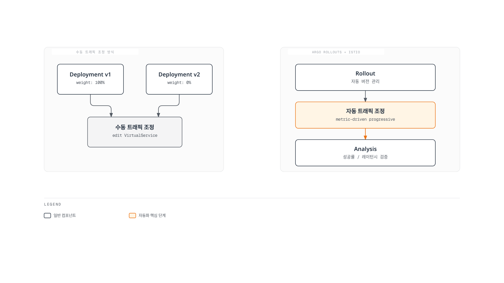
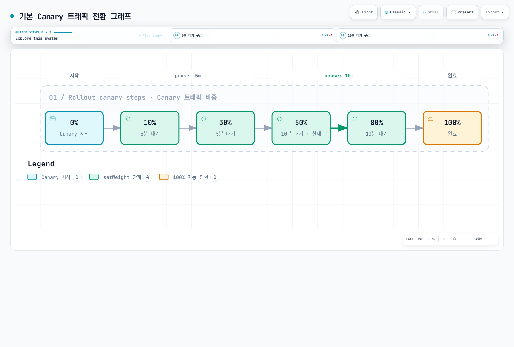
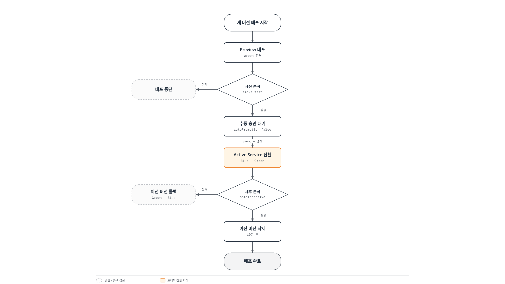

# Argo Rollouts와 Istio 통합

> **검증 기준**: Argo Rollouts 1.10.0, Istio 1.31.0, Kubernetes 1.32–1.36
> **마지막 검토**: 2026년 9월 11일
> **난이도**: 고급

Argo Rollouts는 progressive delivery 중 replica 선택과 Istio traffic weight를 조정합니다. Analysis를 명시적으로 설정하고 신뢰할 수 있는 관측값을 공급해야 합니다. 두 controller를 설치하는 것만으로 자동 품질 검증이나 가용성이 보장되지는 않습니다.

## 목차

1. [개요](#개요)
2. [아키텍처](#아키텍처)
3. [핵심 개념](#핵심-개념)
4. [설정 및 구성](#설정-및-구성)
5. [트래픽 라우팅 전략](#트래픽-라우팅-전략)
6. [Analysis 및 메트릭](#analysis-및-메트릭)
7. [고급 배포 패턴](#고급-배포-패턴)
8. [문제 해결](#문제-해결)
9. [모범 사례](#모범-사례)

## 개요

Canary는 적격 트래픽을 점진적으로 전환하고, blue/green은 active Service selector를 바꿉니다. 설정한 Analysis 결과에 따라 update를 계속하거나 abort 또는 pause할 수 있습니다. 실제 사용자에게 보이는 결과는 설정 전파, readiness, surge 용량, 장시간 연결, 앱·데이터 호환성에도 의존합니다.



[인터랙티브 다이어그램 보기](https://www.atomai.click/kubernetes-docs/archmaps/ko-service-mesh-istio-advanced-08-argo-rollouts-0.html)

그림은 Analysis가 구성된 경우입니다. Update 중 abort하면 controller가 관리하는 트래픽을 stable revision으로 돌릴 수 있지만 Git의 desired image까지 되돌리지는 않습니다. 다른 traffic router 통합도 각각의 구현·유지보수 상태를 확인해야 합니다.

## 아키텍처

Argo CD/GitOps는 선택 사항입니다. Rollouts controller가 Rollout/Analysis 리소스를 읽고 설정한 Service 또는 DestinationRule subset label과 VirtualService weight를 수정합니다. Istiod는 이 리소스들을 proxy 설정으로 변환합니다. 요청은 Envoy에서 application endpoint로 전달되며 VirtualService·DestinationRule 객체를 네트워크 hop처럼 통과하지 않습니다.

Prometheus가 해당 proxy를 scrape하고 Analysis provider가 Prometheus를 조회합니다. Controller는 AnalysisRun phase에 따라 동작합니다. 설정한 mesh proxy/gateway를 지나는 트래픽만 Istio 분할을 따릅니다. Mesh 밖의 client, Pod 직접 접근, port-forward는 이를 우회할 수 있습니다.

## 핵심 개념

### 1. Rollout 리소스

Rollout은 canary 또는 blue/green 전략으로 ReplicaSet을 관리하는 별도 API입니다. Deployment의 이름만 바꾸거나 `strategy: RollingUpdate`를 그대로 사용하는 리소스가 아닙니다. 기존 Deployment 전환에는 migration/workloadRef 절차를 검토하고 두 controller가 같은 Pod를 관리하지 않도록 해야 합니다.

### 2. VirtualService 관리 범위

Rollouts는 지정한 named route의 weight를 조정하고 자신이 관리하는 Experiment destination을 추가/제거할 수 있습니다. 지원되는 라우팅 필드를 보존하며 전체 destination 배열을 무조건 덮어쓰지는 않습니다. 추가 subset은 `additionalSubsetNames`와 올바른 weight 합계가 필요하고, 등록하지 않은 destination은 제거될 수 있습니다. Managed route마다 하나의 Rollout을 지정하고 GitOps와 수정 범위를 조율하세요.

### 3. Host-level과 Subset-level 분할

| 방식 | 사용자가 생성하는 리소스 | Rollouts가 조정하는 필드 |
|---|---|---|
| 본문의 Host-level 실습 | Rollout, stable/canary Service, VirtualService | Service hash selector와 named-route weight |
| Subset-level 대안 | Rollout, Service 하나, VirtualService, DestinationRule | Stable/canary subset hash label과 named-route weight |

ReplicaSet hash placeholder를 수동 입력하지 마세요. Host-level에서는 controller가 두 Service selector에 `rollouts-pod-template-hash`를 추가합니다. Subset-level에서는 지정한 DestinationRule subset label에 hash를 추가하며 Service 하나는 workload 전체를 계속 선택합니다.

다음은 host-level 실습에 추가하는 설정이 아닌 **별도의 subset-level 대안**입니다. Service와 VirtualService 모두 `test`를 사용합니다.

```yaml
apiVersion: v1
kind: Service
metadata:
  name: test
  namespace: rollouts-demo
spec:
  selector:
    app: test
  ports:
  - name: http
    port: 8080
    targetPort: http
---
apiVersion: networking.istio.io/v1
kind: VirtualService
metadata:
  name: test-subsets
  namespace: rollouts-demo
spec:
  hosts:
  - test
  - test.rollouts-demo.svc.cluster.local
  http:
  - name: primary
    route:
    - destination:
        host: test
        port:
          number: 8080
        subset: stable
      weight: 100
    - destination:
        host: test
        port:
          number: 8080
        subset: canary
      weight: 0
    retries:
      attempts: 0
---
apiVersion: networking.istio.io/v1
kind: DestinationRule
metadata:
  name: test-subsets
  namespace: rollouts-demo
spec:
  host: test
  subsets:
  - name: stable
    labels:
      app: test
  - name: canary
    labels:
      app: test
```

실제 workload/template을 유지하면서 본문 Rollout의 canary strategy를 다음 조각으로 교체합니다. 이 대안에서는 host-level의 `stableService`/`canaryService` 필드를 생략합니다.

```yaml
spec:
  strategy:
    canary:
      trafficRouting:
        istio:
          virtualService:
            name: test-subsets
            routes:
            - primary
          destinationRule:
            name: test-subsets
            canarySubsetName: canary
            stableSubsetName: stable
      steps:
      - setWeight: 10
      - pause: {}
```

Controller가 서로 다른 hash를 기록하기 전에는 동일하거나 빈 subset selector가 revision을 분리하지 않습니다. 실제 반영된 label과 readiness를 확인한 뒤 테스트 트래픽을 보내세요. Subset은 자동으로 별도 `destination_service_name`이 되지 않으므로 이 대안의 Analysis에는 검증된 revision/workload telemetry가 필요합니다. `destination_workload_label_rollouts_pod_template_hash`는 **기본 Istio metric label이 아닙니다**.

### 4. Analysis 결과

Prometheus는 vector를 반환하므로 길이와 유한값 여부를 확인한 뒤 `result[0]`에 접근합니다. `successCondition`만 설정했다면 false인 결과는 실패한 measurement이며 provider/expression 오류는 별도 error입니다. Success/failure 조건을 둘 다 설정하고 어느 쪽도 맞지 않으면 inconclusive입니다.

`failureLimit: 2`는 실패 두 번을 허용하고 세 번째 실패에서 실패 처리합니다(`failed > failureLimit`). 따라서 이 limit의 `count: 5`는 성공 다섯 번을 요구하지 않습니다. 본문은 누락/non-finite 값도 통과시키지 않는 `failureLimit: 0`과 최소 관측 트래픽 조건을 사용합니다. 아래 임계값·샘플 수는 설명용이며 통계적 신뢰도나 production SLO 보장이 아닙니다.

## 설정 및 구성

### 전제조건과 범위

맞는 버전의 Rollouts controller/CRD·CLI plugin, 호환되는 Istio sidecar data plane, Analysis provider에서 접근 가능한 Prometheus DNS/RBAC/network·scrape 구성이 필요합니다. [관측성 가이드](../observability/README.md)와 [주입 가이드](07-sidecar-injection.md)를 참고하고 실제 metric을 확인한 뒤 Analysis를 켜세요.

이 격리된 HTTP demo는 공식 blue/green 이미지를 digest로 고정합니다. 확인한 이미지는 **Linux amd64 전용**이므로 Pod template에 해당 architecture selector를 둡니다. Arm64/Graviton에서는 별도로 검증한 Arm64 또는 multi-platform 앱 이미지를 사용해야 합니다. 이 감사에서는 cluster 배포·image runtime·production 부하·live rollout을 시험하지 않았습니다.

새 `rollouts-demo` namespace에 default/legacy sidecar injection을 사용하는 예제입니다. Revision 설치라면 주입 가이드의 규칙에 따라 실제 설치한 revision/tag를 대신 선택하세요.

### 1. Namespace와 Rollout

```yaml
apiVersion: v1
kind: Namespace
metadata:
  name: rollouts-demo
  labels:
    istio-injection: enabled
---
apiVersion: argoproj.io/v1alpha1
kind: Rollout
metadata:
  name: test
  namespace: rollouts-demo
spec:
  replicas: 3
  revisionHistoryLimit: 2
  selector:
    matchLabels:
      app: test
  template:
    metadata:
      labels:
        app: test
    spec:
      nodeSelector:
        kubernetes.io/os: linux
        kubernetes.io/arch: amd64
      terminationGracePeriodSeconds: 45
      containers:
      - name: app
        image: argoproj/rollouts-demo@sha256:3225193a6415b14b3fcdd160c40248b2bfd62f8c77326480559b91a41ced6e20
        ports:
        - name: http
          containerPort: 8080
        readinessProbe:
          httpGet:
            path: /
            port: http
          initialDelaySeconds: 3
          periodSeconds: 5
          timeoutSeconds: 1
        resources:
          requests:
            cpu: 100m
            memory: 128Mi
          limits:
            cpu: 200m
            memory: 256Mi
  strategy:
    canary:
      stableService: test-stable
      canaryService: test-canary
      maxSurge: 1
      maxUnavailable: 0
      trafficRouting:
        istio:
          virtualService:
            name: test
            routes:
            - primary
      steps:
      - setWeight: 10
      - pause:
          duration: 5m
      - analysis:
          templates:
          - templateName: success-rate
          args:
          - name: service-name
            value: test-canary
          - name: namespace
            value: rollouts-demo
      - setWeight: 50
      - pause:
          duration: 5m
      - analysis:
          templates:
          - templateName: success-rate
          args:
          - name: service-name
            value: test-canary
          - name: namespace
            value: rollouts-demo
      - setWeight: 80
      - pause:
          duration: 5m
      - analysis:
          templates:
          - templateName: success-rate
          args:
          - name: service-name
            value: test-canary
          - name: namespace
            value: rollouts-demo
```

이미지·CPU/메모리·replica 수는 demo 입력값입니다.45초 종료 유예는 demo 소스의 종료 지연을 고려한 값이며 실제 앱의 lifecycle을 따로 검증해야 합니다. 이 전략은 primary VirtualService route에서 mesh 재시도를 끄고 warm-up pause 뒤에 inline Analysis를 수행합니다.

### 2. Stable/Canary Service

```yaml
apiVersion: v1
kind: Service
metadata:
  name: test-stable
  namespace: rollouts-demo
spec:
  selector:
    app: test
  ports:
  - name: http
    port: 8080
    targetPort: http
---
apiVersion: v1
kind: Service
metadata:
  name: test-canary
  namespace: rollouts-demo
spec:
  selector:
    app: test
  ports:
  - name: http
    port: 8080
    targetPort: http
```

각 Service에 추가하는 hash selector는 Rollouts가 관리합니다. `version: v1` 같은 고정 selector를 추가하면 승급한 새 revision을 stable Service가 선택하지 못할 수 있습니다.

### 3. VirtualService

```yaml
apiVersion: networking.istio.io/v1
kind: VirtualService
metadata:
  name: test
  namespace: rollouts-demo
spec:
  hosts:
  - test-stable
  - test-stable.rollouts-demo.svc.cluster.local
  http:
  - name: primary
    route:
    - destination:
        host: test-stable
        port:
          number: 8080
      weight: 100
    - destination:
        host: test-canary
        port:
          number: 8080
      weight: 0
    retries:
      attempts: 0
```

Ingress Gateway를 가정하지 않는 **mesh 내부 HTTP 라우팅**입니다. 주입된 client에서 `http://test-stable.rollouts-demo.svc.cluster.local:8080/color`로 테스트 트래픽을 계속 공급합니다. Canary Service 직접 호출, Pod port-forward, mesh 밖 client는 weighted route 검증이 아닙니다.

### 4. AnalysisTemplate과 데이터 전제조건

표준 Service-level metric에 `reporter="source"`와 destination Service namespace를 지정합니다. 이 데이터셋에서 source proxy를 중복 scrape하지 않고 실제 label 값이 selector와 일치한다고 가정합니다.

Rollout 전체에 실제 테스트 트래픽을 유지하세요.5분 warm-up은2분 lookback보다 길어 이전 selector 데이터가 첫 gate에 섞이지 않도록 합니다. 최소 트래픽 조건은 counter increase의 추정값이며 통계적 유의성을 증명하지 않습니다. 트래픽 부족이나 telemetry 누락을 성공으로 처리하지 않아야 합니다.

```yaml
apiVersion: argoproj.io/v1alpha1
kind: AnalysisTemplate
metadata:
  name: success-rate
  namespace: rollouts-demo
spec:
  args:
  - name: service-name
  - name: namespace
  metrics:
  - name: request-volume
    interval: 30s
    successCondition: len(result) == 1 && !isNaN(result[0]) && !isInf(result[0]) && result[0] >= 20
    failureLimit: 0
    provider:
      prometheus:
        address: http://prometheus.istio-system.svc.cluster.local:9090
        query: sum(increase(istio_requests_total{reporter="source",destination_service_name="{{args.service-name}}",destination_service_namespace="{{args.namespace}}"}[2m]))
    count: 5
  - name: http-availability
    interval: 30s
    successCondition: len(result) == 1 && !isNaN(result[0]) && !isInf(result[0]) && result[0] >= 0.95
    failureLimit: 0
    provider:
      prometheus:
        address: http://prometheus.istio-system.svc.cluster.local:9090
        query: |-
          (sum(rate(istio_requests_total{reporter="source",destination_service_name="{{args.service-name}}",destination_service_namespace="{{args.namespace}}",response_code!~"5..|0"}[2m])) or vector(0))
          /
          sum(rate(istio_requests_total{reporter="source",destination_service_name="{{args.service-name}}",destination_service_namespace="{{args.namespace}}"}[2m]))
    count: 5
```

Availability 계산은4xx를 포함한 non-5xx/non-zero HTTP 응답 비율이며 업무 성공을 증명하지 않습니다. gRPC status SLO가 아닌 HTTP demo입니다. 중복 scrape·지연·counter reset·겹치는 시간 창도 결과 해석에 고려해야 합니다.

### 배포 워크플로우

검토한 리소스를 별도 파일로 저장하고 Rollout보다 의존성을 먼저 생성합니다.

```bash
kubectl argo rollouts lint -f rollout.yaml
kubectl apply -f namespace.yaml
kubectl apply -f analysis-templates.yaml -f services.yaml -f virtualservice.yaml
kubectl apply -f rollout.yaml

kubectl argo rollouts get rollout test -n rollouts-demo --watch
```

최초 생성은 stable revision을 만듭니다. 테스트 트래픽이 흐르는 동안 이후 image 변경으로 canary 전략을 시험하세요. GitOps 환경에서는 Git의 desired image를 변경합니다. 다음 직접 CLI 명령은 lab 대안입니다.

```bash
kubectl argo rollouts set image test app=argoproj/rollouts-demo@sha256:e32df3d15f759d36c323b3dccb7003d38df1a4274d37217715151f085c24c58f -n rollouts-demo
kubectl argo rollouts get rollout test -n rollouts-demo --watch

# 관측한 상태에 맞는 동작 하나를 선택하며, 아래 명령을 순서대로 실행하지 않습니다.
kubectl argo rollouts promote test -n rollouts-demo
kubectl argo rollouts abort test -n rollouts-demo
kubectl argo rollouts retry rollout test -n rollouts-demo
```

Promote는 의도한 pause를 재개하며 실패한 Analysis 조사 대신 사용할 명령이 아닙니다. Abort는 desired Pod template을 바꾸지 않습니다. 특히 GitOps controller가 이를 다시 적용할 수 있으므로 retry/undo 전에 원하는 버전을 일치시키세요.

## 트래픽 라우팅 전략

이 절의 조각은 모두 **본문 canary strategy의 대안**입니다. 기존 Service·traffic-routing 참조·workload template과 병합하며 독립 리소스로 apply하지 않습니다.

### 1. 가중치 기반 Canary

`setWeight`와 `pause`는 서로 다른 step 객체에 둡니다. 백분율은 라우팅 목표이며 적은 표본에서 정확한 비율을 보장하지 않습니다. Session affinity·장시간 요청도 관측 분포에 영향을 줍니다.



[인터랙티브 다이어그램 보기](https://www.atomai.click/kubernetes-docs/archmaps/ko-service-mesh-istio-advanced-08-argo-rollouts-4.html)

### 2. 관리되는 Header 라우팅

`managedRoutes`/`setHeaderRoute`로 Rollouts가 생성한 route를 정렬·제거하도록 합니다. Header-only 단계에는 canary replica를 확보하고 이후 replica 제어를 traffic weight로 돌립니다.

```yaml
spec:
  strategy:
    canary:
      trafficRouting:
        managedRoutes:
        - name: beta-header
        istio:
          virtualService:
            name: test
            routes:
            - primary
      steps:
      - setCanaryScale:
          replicas: 1
      - setWeight: 0
      - setHeaderRoute:
          name: beta-header
          match:
          - headerName: x-beta-user
            headerValue:
              exact: 'true'
      - pause:
          duration: 5m
      - setHeaderRoute:
          name: beta-header
      - setCanaryScale:
          matchTrafficWeight: true
      - setWeight: 10
      - pause: {}
```

Released1.10은 primary의 retry policy를 복사하지 않고 이 header route를 생성합니다. 멱등적인 demo 요청에만 사용하고 생성된 route를 확인하세요. 이 조각은 읽기 method를 강제하거나 쓰기 재시도를 막는 보장이 아닙니다. 실제 쓰기 서비스에는 별도로 제어·검증한 retry/authorization 설계가 필요합니다.

`x-beta-user` 헤더는 인증된 tester 신원이 아닙니다. 노출 대상을 제한해야 한다면 신뢰할 수 있는 인증 경계를 사용하세요. Rollouts의 managed-route 목록 밖에 직접 만든 header route는 abort/완료 시 자동 제거되지 않으며 계속 canary endpoint로 연결될 수 있습니다.

### 3. 관리되는 Mirror Traffic

GET 요청만 mirror하고 shadow 단계의 사용자 응답은 stable route에서 받으며, 일반 canary 트래픽으로 전환하기 전에 mirror를 제거하는 예제입니다.

```yaml
spec:
  strategy:
    canary:
      trafficRouting:
        managedRoutes:
        - name: shadow-read
        istio:
          virtualService:
            name: test
            routes:
            - primary
      steps:
      - setCanaryScale:
          replicas: 1
      - setWeight: 0
      - setMirrorRoute:
          name: shadow-read
          percentage: 10
          match:
          - method:
              exact: GET
      - pause:
          duration: 5m
      - setMirrorRoute:
          name: shadow-read
      - setCanaryScale:
          matchTrafficWeight: true
      - setWeight: 10
      - pause: {}
```

생성되는 mirror route도 primary retry policy를 상속하지 않으므로 실제 mesh 기본값을 확인해야 합니다. Mirror 응답은 버리지만 요청은 실제로 실행됩니다. GET도 앱에서 부수 효과가 있을 수 있으므로 의미를 확인하고 필요하면 데이터·의존성을 격리하세요. Mirror는 리소스·네트워크 부하를 추가하며 사용자 영향이 없다고 보장하지 않습니다. 실제 mirror Host 동작과 앱의 요청 수락 여부도 검증합니다.

### 4. 여러 Named Route

```yaml
apiVersion: networking.istio.io/v1
kind: VirtualService
metadata:
  name: test
  namespace: rollouts-demo
spec:
  hosts:
  - test-stable
  - test-stable.rollouts-demo.svc.cluster.local
  http:
  - name: api-route
    match:
    - uri:
        exact: /api
    - uri:
        prefix: /api/
    route:
    - destination:
        host: test-stable
        port:
          number: 8080
      weight: 100
    - destination:
        host: test-canary
        port:
          number: 8080
      weight: 0
    retries:
      attempts: 0
  - name: web-route
    match:
    - uri:
        exact: /web
    - uri:
        prefix: /web/
    route:
    - destination:
        host: test-stable
        port:
          number: 8080
      weight: 100
    - destination:
        host: test-canary
        port:
          number: 8080
      weight: 0
    retries:
      attempts: 0
---
spec:
  strategy:
    canary:
      trafficRouting:
        istio:
          virtualService:
            name: test
            routes:
            - api-route
            - web-route
      steps:
      - setWeight: 10
      - pause: {}
```

두 route 모두 같은 canary 목표 weight를 사용합니다. `/api`와 `/api/…`를 별도 조건으로 매칭하여 무관한 prefix를 포함하지 않습니다. 이 경로 밖 요청에는 별도 route 설계가 필요합니다.

## Analysis 및 메트릭

아래 과거 upstream 화면은 Service-level 구분 예시이며 통합 아키텍처나 현재 benchmark가 아닙니다.


### 1. Inline Analysis

본문 Rollout은 `success-rate` inline step이 완료될 때까지 기다리고, 호출마다 두 필수 argument를 전달합니다. 실패한 run은 abort하고 inconclusive는 pause할 수 있습니다. Analysis provider가 없는 앱 트래픽을 만들거나 잘못된 metric selector를 보정하지는 않습니다.

### 2. 지속적인 Background Analysis

Background template에 `count: 5`를 두면 정해진 측정 후 끝납니다. 지속적인 gate에는 count를 생략합니다.

```yaml
apiVersion: argoproj.io/v1alpha1
kind: AnalysisTemplate
metadata:
  name: success-rate-continuous
  namespace: rollouts-demo
spec:
  args:
  - name: service-name
  - name: namespace
  metrics:
  - name: request-volume
    interval: 30s
    successCondition: len(result) == 1 && !isNaN(result[0]) && !isInf(result[0]) && result[0] >= 20
    failureLimit: 0
    provider:
      prometheus:
        address: http://prometheus.istio-system.svc.cluster.local:9090
        query: sum(increase(istio_requests_total{reporter="source",destination_service_name="{{args.service-name}}",destination_service_namespace="{{args.namespace}}"}[2m]))
  - name: http-availability
    interval: 30s
    successCondition: len(result) == 1 && !isNaN(result[0]) && !isInf(result[0]) && result[0] >= 0.95
    failureLimit: 0
    provider:
      prometheus:
        address: http://prometheus.istio-system.svc.cluster.local:9090
        query: |-
          (sum(rate(istio_requests_total{reporter="source",destination_service_name="{{args.service-name}}",destination_service_namespace="{{args.namespace}}",response_code!~"5..|0"}[2m])) or vector(0))
          /
          sum(rate(istio_requests_total{reporter="source",destination_service_name="{{args.service-name}}",destination_service_namespace="{{args.namespace}}"}[2m]))
---
spec:
  strategy:
    canary:
      analysis:
        templates:
        - templateName: success-rate-continuous
        startingStep: 2
        args:
        - name: service-name
          value: test-canary
        - name: namespace
          value: rollouts-demo
      steps:
      - setWeight: 10
      - pause:
          duration: 5m
      - setWeight: 30
      - pause:
          duration: 5m
      - setWeight: 50
      - pause: {}
```

`startingStep: 2`는0-based이므로 이 조각의 세 번째 step(`setWeight: 30`)입니다. 앞선 pause가2분 데이터 창을 준비합니다. 이후 step과 함께 실행되며 rollout에 의해 종료/완료되거나 실패 조건에 도달할 때까지 동작합니다. 전체 경로의 즉각적인 rollback 보장이 아닙니다.

### 3. 복합 메트릭

더 엄격한 대안으로 트래픽 수,99% non-5xx/non-zero availability,0.5초 이하 p95,1% 이하 error rate를 요구합니다. 여기의 availability와 error-rate 조건은 서로 보완적이며 수치는 여전히 workload별 근거가 필요합니다.

```yaml
apiVersion: argoproj.io/v1alpha1
kind: AnalysisTemplate
metadata:
  name: comprehensive-analysis
  namespace: rollouts-demo
spec:
  args:
  - name: service-name
  - name: namespace
  metrics:
  - name: request-volume
    interval: 30s
    successCondition: len(result) == 1 && !isNaN(result[0]) && !isInf(result[0]) && result[0] >= 20
    failureLimit: 0
    provider:
      prometheus:
        address: http://prometheus.istio-system.svc.cluster.local:9090
        query: sum(increase(istio_requests_total{reporter="source",destination_service_name="{{args.service-name}}",destination_service_namespace="{{args.namespace}}"}[2m]))
    count: 5
  - name: http-availability
    interval: 30s
    successCondition: len(result) == 1 && !isNaN(result[0]) && !isInf(result[0]) && result[0] >= 0.99
    failureLimit: 0
    provider:
      prometheus:
        address: http://prometheus.istio-system.svc.cluster.local:9090
        query: |-
          (sum(rate(istio_requests_total{reporter="source",destination_service_name="{{args.service-name}}",destination_service_namespace="{{args.namespace}}",response_code!~"5..|0"}[2m])) or vector(0))
          /
          sum(rate(istio_requests_total{reporter="source",destination_service_name="{{args.service-name}}",destination_service_namespace="{{args.namespace}}"}[2m]))
    count: 5
  - name: latency-p95
    interval: 30s
    successCondition: len(result) == 1 && !isNaN(result[0]) && !isInf(result[0]) && result[0] <= 0.5
    failureLimit: 0
    provider:
      prometheus:
        address: http://prometheus.istio-system.svc.cluster.local:9090
        query: |-
          histogram_quantile(0.95,
            sum by (le) (rate(istio_request_duration_milliseconds_bucket{reporter="source",destination_service_name="{{args.service-name}}",destination_service_namespace="{{args.namespace}}"}[2m]))
          ) / 1000
    count: 5
  - name: http-error-rate
    interval: 30s
    successCondition: len(result) == 1 && !isNaN(result[0]) && !isInf(result[0]) && result[0] <= 0.01
    failureLimit: 0
    provider:
      prometheus:
        address: http://prometheus.istio-system.svc.cluster.local:9090
        query: |-
          (sum(rate(istio_requests_total{reporter="source",destination_service_name="{{args.service-name}}",destination_service_namespace="{{args.namespace}}",response_code=~"5..|0"}[2m])) or vector(0))
          /
          sum(rate(istio_requests_total{reporter="source",destination_service_name="{{args.service-name}}",destination_service_namespace="{{args.namespace}}"}[2m]))
    count: 5
```

Istio duration histogram은 milliseconds이므로 query에서1000으로 나눈 뒤 seconds와 비교합니다. Instant-vector의 빈 값·복수 값·NaN·Inf를 방어합니다. 겹치는 lookback 창은 독립적인 통계 표본이 아닙니다.

### 4. 사전/사후 검사

Canary에는 background `analysis` 필드 하나가 있습니다. 같은 YAML 객체에 `analysis` 키를 두 번 적으면 사전/사후 검사가 되지 않습니다. 적절한 트래픽·전제조건을 갖춰 의도한 위치의 inline step을 사용하거나 아래 blue/green의 `prePromotionAnalysis`/`postPromotionAnalysis` hook을 사용하세요.

## 고급 배포 패턴

### 1. Blue/Green

**독립적인 strategy 설계 조각**입니다. 검토한 workload template을 사용하되 canary strategy와 client-facing Service 참조를 교체합니다. 실행 전에 active/preview Service를 모두 생성해야 합니다.

```yaml
apiVersion: v1
kind: Service
metadata:
  name: test-active
  namespace: rollouts-demo
spec:
  selector:
    app: test
  ports:
  - name: http
    port: 8080
    targetPort: http
---
apiVersion: v1
kind: Service
metadata:
  name: test-preview
  namespace: rollouts-demo
spec:
  selector:
    app: test
  ports:
  - name: http
    port: 8080
    targetPort: http
---
spec:
  strategy:
    blueGreen:
      activeService: test-active
      previewService: test-preview
      autoPromotionEnabled: false
      prePromotionAnalysis:
        templates:
        - templateName: smoke-test
        args:
        - name: service-name
          value: test-preview
        - name: namespace
          value: rollouts-demo
      postPromotionAnalysis:
        templates:
        - templateName: post-promotion-analysis
        args:
        - name: service-name
          value: test-active
        - name: namespace
          value: rollouts-demo
      scaleDownDelaySeconds: 600
---
apiVersion: networking.istio.io/v1
kind: VirtualService
metadata:
  name: test-bluegreen
  namespace: rollouts-demo
spec:
  hosts:
  - test-active
  - test-active.rollouts-demo.svc.cluster.local
  http:
  - name: active
    route:
    - destination:
        host: test-active
        port:
          number: 8080
      weight: 100
    retries:
      attempts: 0
---
apiVersion: argoproj.io/v1alpha1
kind: AnalysisTemplate
metadata:
  name: post-promotion-analysis
  namespace: rollouts-demo
spec:
  args:
  - name: service-name
  - name: namespace
  metrics:
  - name: request-volume
    interval: 30s
    successCondition: len(result) == 1 && !isNaN(result[0]) && !isInf(result[0]) && result[0] >= 20
    failureLimit: 0
    provider:
      prometheus:
        address: http://prometheus.istio-system.svc.cluster.local:9090
        query: sum(increase(istio_requests_total{reporter="source",destination_service_name="{{args.service-name}}",destination_service_namespace="{{args.namespace}}"}[2m]))
    count: 5
    initialDelay: 5m
  - name: http-availability
    interval: 30s
    successCondition: len(result) == 1 && !isNaN(result[0]) && !isInf(result[0]) && result[0] >= 0.99
    failureLimit: 0
    provider:
      prometheus:
        address: http://prometheus.istio-system.svc.cluster.local:9090
        query: |-
          (sum(rate(istio_requests_total{reporter="source",destination_service_name="{{args.service-name}}",destination_service_namespace="{{args.namespace}}",response_code!~"5..|0"}[2m])) or vector(0))
          /
          sum(rate(istio_requests_total{reporter="source",destination_service_name="{{args.service-name}}",destination_service_namespace="{{args.namespace}}"}[2m]))
    count: 5
    initialDelay: 5m
  - name: latency-p95
    interval: 30s
    successCondition: len(result) == 1 && !isNaN(result[0]) && !isInf(result[0]) && result[0] <= 0.5
    failureLimit: 0
    provider:
      prometheus:
        address: http://prometheus.istio-system.svc.cluster.local:9090
        query: |-
          histogram_quantile(0.95,
            sum by (le) (rate(istio_request_duration_milliseconds_bucket{reporter="source",destination_service_name="{{args.service-name}}",destination_service_namespace="{{args.namespace}}"}[2m]))
          ) / 1000
    count: 5
    initialDelay: 5m
  - name: http-error-rate
    interval: 30s
    successCondition: len(result) == 1 && !isNaN(result[0]) && !isInf(result[0]) && result[0] <= 0.01
    failureLimit: 0
    provider:
      prometheus:
        address: http://prometheus.istio-system.svc.cluster.local:9090
        query: |-
          (sum(rate(istio_requests_total{reporter="source",destination_service_name="{{args.service-name}}",destination_service_namespace="{{args.namespace}}",response_code=~"5..|0"}[2m])) or vector(0))
          /
          sum(rate(istio_requests_total{reporter="source",destination_service_name="{{args.service-name}}",destination_service_namespace="{{args.namespace}}"}[2m]))
    count: 5
    initialDelay: 5m
```

앱이 소유한 `smoke-test` AnalysisTemplate을 구현·검증해야 하며 이 가이드에서 제공하지 않습니다. `service-name`/`namespace` argument를 선언하고 적절한 identity·network 접근·기능 검증으로 preview revision을 검사해야 합니다. Post-promotion template은5분 기다린 뒤2분 창을 조회합니다. 이전 연결/데이터가 즉시 사라진다고 가정하지 말고 전파 상태와 `test-active`의 지속적인 트래픽을 확인하세요. 이 조각을 완성된 smoke-test 배포로 복사하지 마세요.

`autoPromotionEnabled` 기본값은 true이며 예제는 명시적으로 비활성화합니다. `scaleDownDelaySeconds`는 이전 ReplicaSet의 scale-down을 늦추며 모든 revision history 삭제나 기존 연결 이동을 뜻하지 않습니다. Service/endpoint 전파와 upstream load balancer 동작으로 장애가 생길 수 있습니다.



[인터랙티브 다이어그램 보기](https://www.atomai.click/kubernetes-docs/archmaps/ko-service-mesh-istio-advanced-08-argo-rollouts-6.html)

### 2. 가중치 Experiment

Istio는 traffic-routed Experiment를 지원합니다. 여기서 유효한 `specRef`는 `stable`·`canary`이며 `experimental`이라는 원본 revision은 없습니다.

```yaml
spec:
  strategy:
    canary:
      steps:
      - experiment:
          duration: 10m
          templates:
          - name: baseline
            specRef: stable
            weight: 5
          - name: candidate
            specRef: canary
            weight: 5
      - setWeight: 10
      - pause: {}
```

첫 Experiment step에서 controller가 Experiment ReplicaSet/Service를 만들고 각각5%씩 전달하여 stable 대상에90%를 남깁니다. Experiment Pod hash는 부모 Rollout hash와 다릅니다. 이 조각은10분 노출을 구성할 뿐 통계적으로 유효한 비교를 자동 수행하지 않습니다. 실제 비교 AnalysisTemplate을 추가하고 Experiment가 생성한 자체 identity/Service를 argument로 사용하세요.

### 3. 느린 점진적 Rollout

```yaml
spec:
  strategy:
    canary:
      steps:
      - setWeight: 1
      - pause:
          duration: 1h
      - setWeight: 5
      - pause:
          duration: 1h
      - setWeight: 10
      - pause:
          duration: 2h
      - setWeight: 25
      - pause:
          duration: 4h
      - setWeight: 50
      - pause:
          duration: 8h
      - setWeight: 75
      - pause:
          duration: 8h
      analysis:
        templates:
        - templateName: success-rate-continuous
        startingStep: 2
        args:
        - name: service-name
          value: test-canary
        - name: namespace
          value: rollouts-demo
```

표시한 pause 합은24시간이며 readiness·Analysis·전파 시간이 추가됩니다. 긴 시간표가 대표성 있는 트래픽, 실패 감지, 용량과 검토한 복구 절차를 대신하지 않습니다.

## 문제 해결

Namespace를 명시하여 리소스와 실제 proxy 라우팅을 확인합니다.

```bash
kubectl argo rollouts get rollout test -n rollouts-demo
kubectl describe rollout test -n rollouts-demo
kubectl get virtualservice test -n rollouts-demo -o yaml
kubectl get services test-stable test-canary -n rollouts-demo -o yaml
kubectl get pods -n rollouts-demo -l app=test --show-labels
kubectl get endpointslices -n rollouts-demo -l kubernetes.io/service-name=test-canary
istioctl proxy-config routes <client-pod> -n rollouts-demo
istioctl proxy-config clusters <client-pod> -n rollouts-demo
kubectl get analysisruns -n rollouts-demo
kubectl logs -n argo-rollouts deployment/argo-rollouts
```

Weight가 바뀌지 않으면 RBAC, 참조한 route 이름, controller event와 경쟁하는 GitOps 쓰기를 확인합니다. Canary 트래픽이 없으면 Service/subset hash selector, 준비된 EndpointSlice, 실제 mesh client/gateway 경로와 표본 크기를 확인하세요.

Analysis 실패는 AnalysisRun의 measurement 값·메시지와 같은 Prometheus datasource의 동일 query로 조사합니다. Source reporter, namespace/Service label, 트래픽량, lookback과 provider 인증/network를 확인하고 임계값 실패·inconclusive·provider error를 구분합니다.

완료된 Rollout에 abort를 실행하는 것은 일반적인 history rollback이 아닙니다. 기록을 확인하고 원하는 template/version을 복원합니다.

```bash
kubectl argo rollouts get rollout test -n rollouts-demo
kubectl argo rollouts undo test --to-revision=<reviewed-revision> -n rollouts-demo
```

GitOps라면 Git의 desired version도 변경·조정해야 합니다. 보존된 ReplicaSet과 DB/API 호환성에 따라 안전하게 복원할 수 있는 범위가 달라집니다.

## 모범 사례

### GitOps 필드 관리 범위

Argo CD Application은 Rollouts가 관리하는 runtime 필드만 차이 비교에서 제외하고 sync에서도 이를 존중하게 설정할 수 있습니다.

```yaml
spec:
  ignoreDifferences:
  - group: networking.istio.io
    kind: VirtualService
    name: test
    namespace: rollouts-demo
    jqPathExpressions:
    - .spec.http[] | select(.name == "primary") | .route[].weight
  - group: ''
    kind: Service
    name: test-stable
    namespace: rollouts-demo
    jqPathExpressions:
    - .spec.selector["rollouts-pod-template-hash"]
  - group: ''
    kind: Service
    name: test-canary
    namespace: rollouts-demo
    jqPathExpressions:
    - .spec.selector["rollouts-pod-template-hash"]
  syncPolicy:
    syncOptions:
    - RespectIgnoreDifferences=true
```

독립 Application이 아닌 `spec` 조각입니다. 최초 리소스 생성에는 여전히 올바른 weight/selector가 필요합니다. Subset 방식은 관리 대상 DestinationRule subset의 hash label도 좁은 범위로 제외합니다. Managed header/mirror route는 해당 runtime entry 이름을 명시적으로 다루세요. VirtualService 전체 spec을 제외하면 안 되며 hosts·destinations·보안 관련 routing은 계속 검토 가능해야 합니다.

### Step·측정·용량

요청량·위험·복구 시간을 바탕으로 비율과 pause를 정합니다. 보편적인 최소30초 interval,5회 샘플 신뢰도, 마지막 구간의 빠른 승급 규칙은 없습니다. CanaryStep마다 동작 하나를 두고 retry와 schema/data 호환성을 함께 조율하세요.

```yaml
spec:
  revisionHistoryLimit: 2
  progressDeadlineSeconds: 600
  progressDeadlineAbort: false
  template:
    spec:
      containers:
      - name: app
        resources:
          requests:
            cpu: 100m
            memory: 128Mi
          limits:
            cpu: 200m
            memory: 256Mi
```

`revisionHistoryLimit`는 보존 설정이지 최소 두 개라는 보편적 규칙이 아닙니다. `progressDeadlineSeconds`는 진행 부족을 다루며 pause와 Analysis lifecycle은 별도로 이해해야 합니다. 명시적으로 false인 `progressDeadlineAbort`는 진행 deadline에 자동 abort하지 않습니다. Request/limit2배 비율도 기존 예시 입력일 뿐입니다.

Replica 세 개가 AZ별 하나를 의미하지 않습니다. Zone 분산에는 검토한 topology 제약·용량이 필요하며 [Zone-Aware Argo Rollouts](09-zone-aware-argo-rollouts.md)를 참고하세요. Traffic routing은 단순 surge 계산보다 더 많은 stable/canary 용량을 요구할 수 있습니다. PDB는 자발적 eviction을 제한하며 모든 장애나 controller scaling을 막지 않습니다.

```yaml
apiVersion: policy/v1
kind: PodDisruptionBudget
metadata:
  name: test-pdb
  namespace: rollouts-demo
spec:
  minAvailable: 2
  selector:
    matchLabels:
      app: test
```

Update 전에는 controller/CRD·주입·DNS·image platform·Service/route·provider 접근·metric label·지속적인 테스트 트래픽을 확인합니다. 진행 중에는 실제 endpoint 선택과 AnalysisRun 결과를 확인하고, 승급 후에는 원하는 image·managed weight·endpoint readiness·이전 ReplicaSet scale/보존 상태를 확인합니다. 모든 이전 ReplicaSet 삭제를 기대하면 안 됩니다.

## 참고 자료

- [Argo Rollouts Istio 통합](https://argoproj.github.io/argo-rollouts/features/traffic-management/istio/)
- [Analysis lifecycle](https://argoproj.github.io/argo-rollouts/features/analysis/)
- [Prometheus provider](https://argoproj.github.io/argo-rollouts/analysis/prometheus/)
- [Traffic routing과 managed route](https://argoproj.github.io/argo-rollouts/features/traffic-management/)
- [Blue/green](https://argoproj.github.io/argo-rollouts/features/bluegreen/)
- [Experiment](https://argoproj.github.io/argo-rollouts/features/experiment/)
- [Rollout specification](https://argoproj.github.io/argo-rollouts/features/specification/)
- [Rollouts FAQ](https://argoproj.github.io/argo-rollouts/FAQ/)
- [Released1.10 Istio reconciler](https://raw.githubusercontent.com/argoproj/argo-rollouts/v1.10.0/rollout/trafficrouting/istio/istio.go)
- [Released1.10 Analysis 실패 판정](https://raw.githubusercontent.com/argoproj/argo-rollouts/v1.10.0/analysis/analysis.go)
- [Argo CD sync options source](https://raw.githubusercontent.com/argoproj/argo-cd/master/docs/user-guide/sync-options.md)
- [트래픽 분할](../traffic-management/04-traffic-splitting.md)
- [VirtualService](../traffic-management/01-gateway-virtualservice.md)
- [DestinationRule](../traffic-management/03-destination-rule.md)
