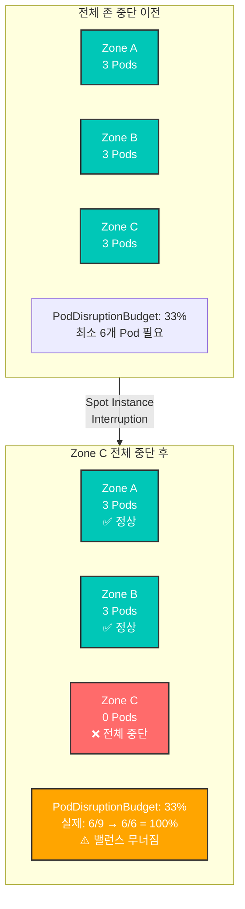
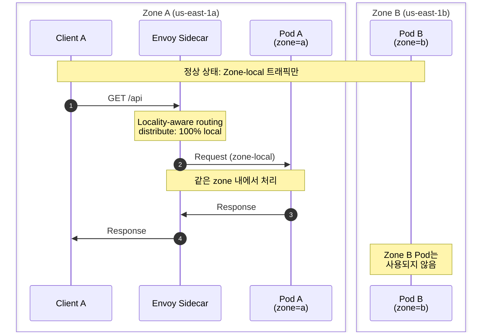
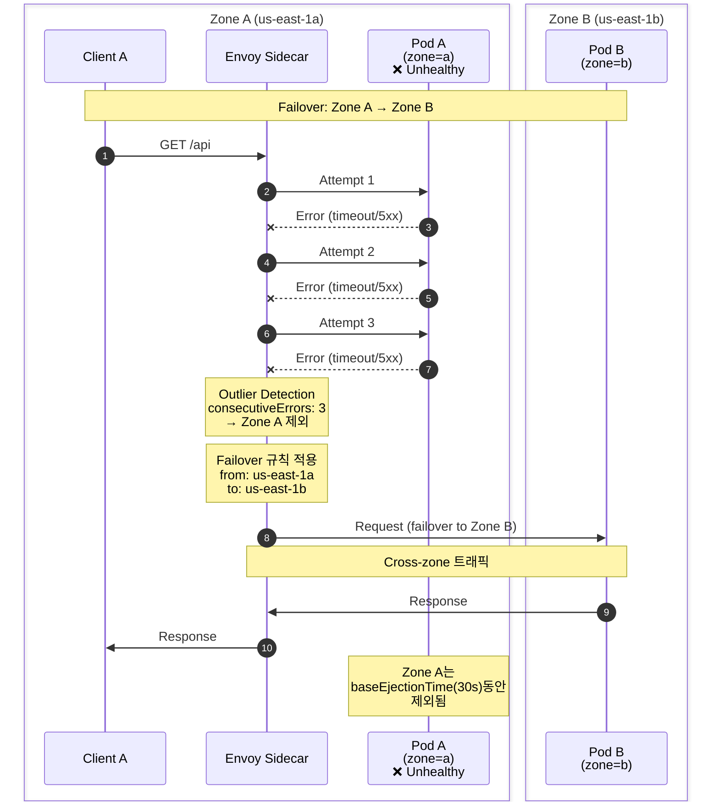
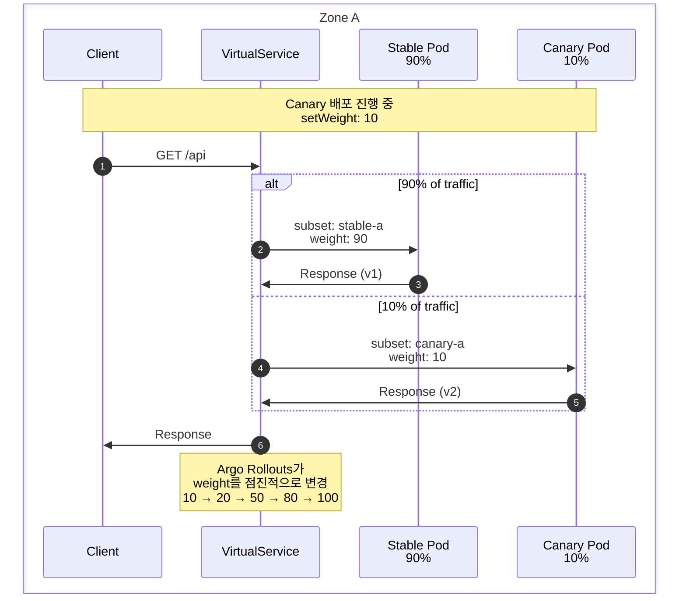

# Zone-Aware Argo Rollouts

> **지원 버전**: Istio 1.18+, Argo Rollouts 1.6+
> **마지막 업데이트**: 2026년 2월 19일
> **난이도**: ⭐⭐⭐⭐⭐ (고급)

이 문서는 AWS 가용 영역(Availability Zone)별로 독립적인 Argo Rollouts Canary 배포를 설정하면서, Istio의 locality-aware 라우팅을 활용하여 자동 failover를 구현하는 방법을 설명합니다.

## 목차

1. [문제 정의](#문제-정의)
2. [아키텍처 개요](#아키텍처-개요)
3. [핵심 설계 결정](#핵심-설계-결정)
4. [구현 가이드](#구현-가이드)
5. [트래픽 흐름](#트래픽-흐름)
6. [문제 해결](#문제-해결)
7. [모범 사례](#모범-사례)

## 문제 정의

### 실제 사용 사례: Spot Instance 환경에서의 PDB 관리

**배경**: AWS Spot Instance를 사용하는 환경에서는 특정 가용 영역(Zone)의 모든 노드가 갑자기 중단될 수 있습니다.

**문제 시나리오**:



**왜 Zone별 Rollout이 필요한가?**

1. **Rollout당 독립적인 PDB 관리**
   - 각 Zone의 Rollout이 자체 PDB를 관리
   - Zone C가 완전히 사라져도 Zone A, B의 PDB는 영향 없음

2. **Zone 단위 복구**
   - Zone C가 복구되면 해당 Rollout만 재시작
   - 다른 Zone의 배포 상태에 영향 없음

3. **Spot Instance 중단 대응**
   - 특정 Zone의 Spot Instance가 모두 중단되어도
   - 다른 Zone의 서비스는 계속 운영
   - Istio locality failover로 자동 트래픽 전환

**PDB 설정 예시** (Zone별):

```yaml
# Zone A - PDB (Rollout별 독립)
apiVersion: policy/v1
kind: PodDisruptionBudget
metadata:
  name: test-a-pdb
  namespace: default
spec:
  minAvailable: 1  # Zone A에서 최소 1개
  selector:
    matchLabels:
      app: test
      zone: a
---
# Zone B - PDB
apiVersion: policy/v1
kind: PodDisruptionBudget
metadata:
  name: test-b-pdb
  namespace: default
spec:
  minAvailable: 1  # Zone B에서 최소 1개
  selector:
    matchLabels:
      app: test
      zone: b
---
# Zone C - PDB
apiVersion: policy/v1
kind: PodDisruptionBudget
metadata:
  name: test-c-pdb
  namespace: default
spec:
  minAvailable: 1  # Zone C에서 최소 1개
  selector:
    matchLabels:
      app: test
      zone: c
```

**장점**:
- Zone C 전체 중단 시에도 Zone A, B의 PDB는 정상 동작
- 각 Zone이 독립적으로 복구 가능
- Canary 배포도 Zone별로 독립적으로 진행

### 요구사항

1. **Zone별 독립 배포**: 3개의 가용 영역(a, b, c)에 각각 독립적인 Canary 배포
2. **Zone 격리**: 각 zone의 트래픽은 기본적으로 해당 zone 내에서만 처리
3. **Failover 전용**: 장애 발생 시에만 다른 zone으로 트래픽 전환 (a→b, b→c, c→a)
4. **통합 호출**: 클라이언트는 단일 서비스 이름으로 호출
5. **Spot Instance 대응**: Zone 단위 중단에도 서비스 연속성 보장

### 일반적인 문제

**문제**: 여러 Argo Rollouts가 같은 VirtualService를 참조하면 충돌 발생

```yaml
# ❌ 잘못된 접근: 모든 Rollouts가 같은 route 수정 시도
apiVersion: argoproj.io/v1alpha1
kind: Rollout
metadata:
  name: test-a
spec:
  strategy:
    canary:
      trafficRouting:
        istio:
          virtualService:
            name: test  # 모든 zone의 Rollout이 같은 VirtualService 참조
            routes:
            - primary  # 같은 route를 동시에 수정 시도 → 충돌!
```

**해결책**: Zone별 별도 route를 사용한 분리

**중요**: Argo Rollouts는 지정된 route 이름의 **전체 destinations 배열을 관리**합니다. 따라서 여러 Rollout이 같은 route 이름을 참조하면, 각 Rollout이 서로의 설정을 덮어쓰게 됩니다. subset을 다르게 설정해도 충돌이 발생합니다.

## 아키텍처 개요

### 전체 구조

```mermaid
flowchart TB
    subgraph Clients["클라이언트"]
        ClientA[Client A<br/>Zone: us-east-1a]
        ClientB[Client B<br/>Zone: us-east-1b]
        ClientC[Client C<br/>Zone: us-east-1c]
    end

    subgraph Istio["Istio Control Plane"]
        VS[VirtualService: test<br/>단일 VirtualService]
        DR[DestinationRule: test<br/>locality-aware routing]
    end

    subgraph ZoneA["Zone A (us-east-1a)"]
        RolloutA[Rollout: test-a<br/>subset: stable-a/canary-a]
        StableA[Stable Pods<br/>label: zone=a]
        CanaryA[Canary Pods<br/>label: zone=a]
    end

    subgraph ZoneB["Zone B (us-east-1b)"]
        RolloutB[Rollout: test-b<br/>subset: stable-b/canary-b]
        StableB[Stable Pods<br/>label: zone=b]
        CanaryB[Canary Pods<br/>label: zone=b]
    end

    subgraph ZoneC["Zone C (us-east-1c)"]
        RolloutC[Rollout: test-c<br/>subset: stable-c/canary-c]
        StableC[Stable Pods<br/>label: zone=c]
        CanaryC[Canary Pods<br/>label: zone=c]
    end

    ClientA -->|test.default| VS
    ClientB -->|test.default| VS
    ClientC -->|test.default| VS

    VS -->|90% stable-a| StableA
    VS -->|10% canary-a| CanaryA
    VS -->|90% stable-b| StableB
    VS -->|10% canary-b| CanaryB
    VS -->|90% stable-c| StableC
    VS -->|10% canary-c| CanaryC

    DR -.->|localityLbSetting| VS

    RolloutA -.->|manages weights| VS
    RolloutB -.->|manages weights| VS
    RolloutC -.->|manages weights| VS

    classDef istio fill:#326CE5,stroke:#333,stroke-width:2px,color:white;
    classDef rollout fill:#E6522C,stroke:#333,stroke-width:2px,color:white;
    classDef pod fill:#00C7B7,stroke:#333,stroke-width:1px,color:white;
    classDef client fill:#f9f9f9,stroke:#333,stroke-width:1px,color:black;

    class VS,DR istio;
    class RolloutA,RolloutB,RolloutC rollout;
    class StableA,CanaryA,StableB,CanaryB,StableC,CanaryC pod;
    class ClientA,ClientB,ClientC client;
```



### 핵심 컴포넌트

1. **단일 VirtualService**: 모든 zone의 트래픽 라우팅 규칙 정의
2. **Zone별 Rollout**: 각 zone에서 독립적인 Canary 배포 관리
3. **Subset 기반 분리**: 각 Rollout은 고유한 subset 쌍 관리 (stable-a/canary-a 등)
4. **Locality-aware DestinationRule**: 자동 zone-local 라우팅 및 failover

## 핵심 설계 결정

### 1. 단일 VirtualService + Zone별 Route 분리

**왜 이 방식이 필요한가?**

Argo Rollouts는 지정된 route 이름의 전체 destinations 배열을 덮어쓰는 방식으로 동작합니다. 따라서 **각 Zone의 Rollout이 독립적인 route 이름을 관리**해야 충돌이 발생하지 않습니다:

```yaml
# VirtualService: 단일 VirtualService에 Zone별 route 정의
http:
- name: zone-a-route  # Rollout A가 이 route의 stable-a/canary-a 관리
  match:
  - sourceLabels:
      topology.istio.io/zone: us-east-1a
  route:
  - destination: {host: test, subset: stable-a}
    weight: 90
  - destination: {host: test, subset: canary-a}
    weight: 10

- name: zone-b-route  # Rollout B가 이 route의 stable-b/canary-b 관리
  match:
  - sourceLabels:
      topology.istio.io/zone: us-east-1b
  route:
  - destination: {host: test, subset: stable-b}
    weight: 90
  - destination: {host: test, subset: canary-b}
    weight: 10
```

**핵심 원리**:
- 각 Rollout은 **서로 다른 route 이름**을 참조 (`zone-a-route`, `zone-b-route`, `zone-c-route`)
- 각 route는 **sourceLabels match**를 통해 해당 Zone의 트래픽만 처리
- Locality-aware 라우팅이 자동으로 zone-local 엔드포인트를 우선 선택

### 2. Locality-aware 라우팅

**기본 동작**:
- Zone A의 클라이언트 → Zone A의 Pod (100%)
- Zone B의 클라이언트 → Zone B의 Pod (100%)
- Zone C의 클라이언트 → Zone C의 Pod (100%)

**Failover 시**:
- Zone A 장애 → Zone B로 자동 전환
- Zone B 장애 → Zone C로 자동 전환
- Zone C 장애 → Zone A로 자동 전환

### 3. 통합 서비스 호출

클라이언트는 단일 DNS 이름 사용:
```bash
# 이렇게 호출
curl http://test.default.svc.cluster.local:8080

# Istio가 자동으로 zone-local 엔드포인트로 라우팅
```

## 구현 가이드

### 1. 공통 Service 생성

**중요**: `selector`에 zone 레이블을 포함하지 마세요 (모든 zone의 Pod 선택)

```yaml
apiVersion: v1
kind: Service
metadata:
  name: test
  namespace: default
spec:
  selector:
    app: test  # zone 레이블 없음 - 모든 zone의 Pod 선택
  ports:
  - name: http
    port: 8080
    targetPort: 8080
```

### 2. Zone별 Rollout Service

각 Rollout이 관리하는 stable/canary Service:

```yaml
# Zone A - Stable Service
apiVersion: v1
kind: Service
metadata:
  name: test-stable-a
  namespace: default
spec:
  selector:
    app: test
    zone: a  # Zone A의 stable Pod만 선택
  ports:
  - name: http
    port: 8080
    targetPort: 8080
---
# Zone A - Canary Service
apiVersion: v1
kind: Service
metadata:
  name: test-canary-a
  namespace: default
spec:
  selector:
    app: test
    zone: a  # Zone A의 canary Pod만 선택
  ports:
  - name: http
    port: 8080
    targetPort: 8080
---
# Zone B - Stable Service
apiVersion: v1
kind: Service
metadata:
  name: test-stable-b
  namespace: default
spec:
  selector:
    app: test
    zone: b
  ports:
  - name: http
    port: 8080
    targetPort: 8080
---
# Zone B - Canary Service
apiVersion: v1
kind: Service
metadata:
  name: test-canary-b
  namespace: default
spec:
  selector:
    app: test
    zone: b
  ports:
  - name: http
    port: 8080
    targetPort: 8080
---
# Zone C - Stable Service
apiVersion: v1
kind: Service
metadata:
  name: test-stable-c
  namespace: default
spec:
  selector:
    app: test
    zone: c
  ports:
  - name: http
    port: 8080
    targetPort: 8080
---
# Zone C - Canary Service
apiVersion: v1
kind: Service
metadata:
  name: test-canary-c
  namespace: default
spec:
  selector:
    app: test
    zone: c
  ports:
  - name: http
    port: 8080
    targetPort: 8080
```

### 3. Zone별 Route가 있는 단일 VirtualService

모든 zone의 트래픽을 처리하는 단일 VirtualService (Zone별 route 분리):

```yaml
apiVersion: networking.istio.io/v1
kind: VirtualService
metadata:
  name: test
  namespace: default
spec:
  hosts:
  - test
  - test.default.svc.cluster.local
  http:
  # Zone A route (Rollout A가 관리)
  - name: zone-a-route
    match:
    - sourceLabels:
        topology.kubernetes.io/zone: us-east-1a
    route:
    - destination:
        host: test
        subset: stable-a
      weight: 90
    - destination:
        host: test
        subset: canary-a
      weight: 10
  # Zone B route (Rollout B가 관리)
  - name: zone-b-route
    match:
    - sourceLabels:
        topology.kubernetes.io/zone: us-east-1b
    route:
    - destination:
        host: test
        subset: stable-b
      weight: 90
    - destination:
        host: test
        subset: canary-b
      weight: 10
  # Zone C route (Rollout C가 관리)
  - name: zone-c-route
    match:
    - sourceLabels:
        topology.kubernetes.io/zone: us-east-1c
    route:
    - destination:
        host: test
        subset: stable-c
      weight: 90
    - destination:
        host: test
        subset: canary-c
      weight: 10
```

**중요 변경사항**:
- ❌ 이전: 모든 Zone이 같은 `primary` route 공유 → **충돌 발생**
- ✅ 수정: 각 Zone이 독립적인 route 이름 사용 (`zone-a-route`, `zone-b-route`, `zone-c-route`)
- ✅ 추가: `sourceLabels.topology.kubernetes.io/zone` match로 Zone별 트래픽 분리

**동작 방식**:
1. Zone A의 파드에서 발생한 요청 → `zone-a-route` 매칭
2. Rollout A는 `zone-a-route`의 weight만 수정 (다른 Zone 영향 없음)
3. Locality-aware 라우팅이 자동으로 zone-local 엔드포인트 우선 선택

### 4. DestinationRule with Locality Settings

```yaml
apiVersion: networking.istio.io/v1
kind: DestinationRule
metadata:
  name: test
  namespace: default
spec:
  host: test
  trafficPolicy:
    loadBalancer:
      localityLbSetting:
        enabled: true
        # 각 zone은 기본적으로 로컬 트래픽만 처리
        distribute:
        - from: us-east-1/us-east-1a/*
          to:
            "us-east-1/us-east-1a/*": 100  # Zone A → Zone A (100%)
        - from: us-east-1/us-east-1b/*
          to:
            "us-east-1/us-east-1b/*": 100  # Zone B → Zone B (100%)
        - from: us-east-1/us-east-1c/*
          to:
            "us-east-1/us-east-1c/*": 100  # Zone C → Zone C (100%)
        # Failover 설정: a→b, b→c, c→a
        failover:
        - from: us-east-1/us-east-1a
          to: us-east-1/us-east-1b  # Zone A 장애 시 Zone B로
        - from: us-east-1/us-east-1b
          to: us-east-1/us-east-1c  # Zone B 장애 시 Zone C로
        - from: us-east-1/us-east-1c
          to: us-east-1/us-east-1a  # Zone C 장애 시 Zone A로
    # 빠른 장애 감지를 위한 Outlier Detection
    outlierDetection:
      consecutiveErrors: 3        # 3번 연속 실패 시
      interval: 10s               # 10초마다 확인
      baseEjectionTime: 30s       # 30초간 제외
      maxEjectionPercent: 100     # 최대 100% 제외 가능
  # 각 zone별 stable/canary subset 정의
  subsets:
  # Zone A subsets
  - name: stable-a
    labels:
      app: test
      zone: a
  - name: canary-a
    labels:
      app: test
      zone: a
  # Zone B subsets
  - name: stable-b
    labels:
      app: test
      zone: b
  - name: canary-b
    labels:
      app: test
      zone: b
  # Zone C subsets
  - name: stable-c
    labels:
      app: test
      zone: c
  - name: canary-c
    labels:
      app: test
      zone: c
```

### 5. Zone별 Rollout 설정

#### Zone A Rollout

```yaml
apiVersion: argoproj.io/v1alpha1
kind: Rollout
metadata:
  name: test-a
  namespace: default
spec:
  replicas: 3
  selector:
    matchLabels:
      app: test
      zone: a
  template:
    metadata:
      labels:
        app: test
        zone: a
    spec:
      # Zone A에만 Pod 배포
      affinity:
        nodeAffinity:
          requiredDuringSchedulingIgnoredDuringExecution:
            nodeSelectorTerms:
            - matchExpressions:
              - key: topology.kubernetes.io/zone
                operator: In
                values:
                - us-east-1a
      containers:
      - name: app
        image: myapp:v1
        ports:
        - containerPort: 8080
        env:
        - name: ZONE
          value: "a"
  strategy:
    canary:
      # Zone A 전용 Service
      canaryService: test-canary-a
      stableService: test-stable-a
      trafficRouting:
        istio:
          virtualService:
            name: test              # 공통 VirtualService
            routes:
            - zone-a-route          # Zone A 전용 route
          destinationRule:
            name: test              # 공통 DestinationRule
            canarySubsetName: canary-a  # Zone A 전용 subset
            stableSubsetName: stable-a  # Zone A 전용 subset
      steps:
      - setWeight: 10
      - pause: {duration: 5m}
      - setWeight: 20
      - pause: {duration: 5m}
      - setWeight: 50
      - pause: {duration: 5m}
      - setWeight: 80
      - pause: {duration: 5m}
```

#### Zone B Rollout

```yaml
apiVersion: argoproj.io/v1alpha1
kind: Rollout
metadata:
  name: test-b
  namespace: default
spec:
  replicas: 3
  selector:
    matchLabels:
      app: test
      zone: b
  template:
    metadata:
      labels:
        app: test
        zone: b
    spec:
      # Zone B에만 Pod 배포
      affinity:
        nodeAffinity:
          requiredDuringSchedulingIgnoredDuringExecution:
            nodeSelectorTerms:
            - matchExpressions:
              - key: topology.kubernetes.io/zone
                operator: In
                values:
                - us-east-1b
      containers:
      - name: app
        image: myapp:v1
        ports:
        - containerPort: 8080
        env:
        - name: ZONE
          value: "b"
  strategy:
    canary:
      # Zone B 전용 Service
      canaryService: test-canary-b
      stableService: test-stable-b
      trafficRouting:
        istio:
          virtualService:
            name: test              # 공통 VirtualService
            routes:
            - zone-b-route          # Zone B 전용 route
          destinationRule:
            name: test              # 공통 DestinationRule
            canarySubsetName: canary-b  # Zone B 전용 subset
            stableSubsetName: stable-b  # Zone B 전용 subset
      steps:
      - setWeight: 10
      - pause: {duration: 5m}
      - setWeight: 20
      - pause: {duration: 5m}
      - setWeight: 50
      - pause: {duration: 5m}
      - setWeight: 80
      - pause: {duration: 5m}
```

#### Zone C Rollout

```yaml
apiVersion: argoproj.io/v1alpha1
kind: Rollout
metadata:
  name: test-c
  namespace: default
spec:
  replicas: 3
  selector:
    matchLabels:
      app: test
      zone: c
  template:
    metadata:
      labels:
        app: test
        zone: c
    spec:
      # Zone C에만 Pod 배포
      affinity:
        nodeAffinity:
          requiredDuringSchedulingIgnoredDuringExecution:
            nodeSelectorTerms:
            - matchExpressions:
              - key: topology.kubernetes.io/zone
                operator: In
                values:
                - us-east-1c
      containers:
      - name: app
        image: myapp:v1
        ports:
        - containerPort: 8080
        env:
        - name: ZONE
          value: "c"
  strategy:
    canary:
      # Zone C 전용 Service
      canaryService: test-canary-c
      stableService: test-stable-c
      trafficRouting:
        istio:
          virtualService:
            name: test              # 공통 VirtualService
            routes:
            - zone-c-route          # Zone C 전용 route
          destinationRule:
            name: test              # 공통 DestinationRule
            canarySubsetName: canary-c  # Zone C 전용 subset
            stableSubsetName: stable-c  # Zone C 전용 subset
      steps:
      - setWeight: 10
      - pause: {duration: 5m}
      - setWeight: 20
      - pause: {duration: 5m}
      - setWeight: 50
      - pause: {duration: 5m}
      - setWeight: 80
      - pause: {duration: 5m}
```

## 트래픽 흐름

### 정상 상태 (Zone-local 트래픽)



### Failover 시나리오



### Canary 배포 중 트래픽 흐름



## 문제 해결

### 1. VirtualService 충돌 오류

**증상**:
```bash
Error: VirtualService update conflict
```

**원인**: 여러 Rollout이 같은 route를 동시에 수정 시도

**해결**:
```yaml
# ✅ 각 Rollout이 고유한 subset 관리하도록 설정
spec:
  strategy:
    canary:
      trafficRouting:
        istio:
          destinationRule:
            canarySubsetName: canary-a  # Zone별로 다른 subset
            stableSubsetName: stable-a
```

### 2. Cross-zone 트래픽 발생

**증상**: Failover가 아닌데도 다른 zone으로 트래픽 전송

**원인**: `distribute` 설정이 잘못됨

**해결**:
```yaml
# ✅ 올바른 distribute 설정
distribute:
- from: us-east-1/us-east-1a/*
  to:
    "us-east-1/us-east-1a/*": 100  # 100% local만
```

### 3. Failover가 작동하지 않음

**증상**: Zone 장애 시에도 다른 zone으로 failover되지 않음

**원인**: Outlier detection이 비활성화되어 있거나 설정이 너무 느림

**해결**:
```yaml
# ✅ 빠른 장애 감지
outlierDetection:
  consecutiveErrors: 3      # 3번만 실패해도 감지
  interval: 10s             # 10초마다 확인
  baseEjectionTime: 30s     # 30초간 제외
```

### 4. Rollout이 멈춤

**증상**: Canary 배포가 진행되지 않음

**확인**:
```bash
# Rollout 상태 확인
kubectl argo rollouts get rollout test-a -n default

# VirtualService 가중치 확인
kubectl get virtualservice test -n default -o yaml | grep weight

# DestinationRule subset 확인
kubectl get destinationrule test -n default -o yaml
```

### 5. 디버깅 명령어

```bash
# 1. Pod가 올바른 zone에 배포되었는지 확인
kubectl get pods -l app=test -o wide
kubectl get nodes --show-labels | grep topology.kubernetes.io/zone

# 2. Locality 라우팅 설정 확인
istioctl proxy-config endpoint <pod-name> --cluster "outbound|8080||test.default.svc.cluster.local"

# 3. VirtualService 동기화 확인
istioctl proxy-config route <pod-name> --name 8080

# 4. Outlier detection 상태 확인
kubectl exec <pod-name> -c istio-proxy -- curl localhost:15000/clusters | grep outlier

# 5. Argo Rollouts 로그 확인
kubectl logs -n argo-rollouts deployment/argo-rollouts
```

## 모범 사례

### 1. Rollout 동기화

**문제**: 여러 zone의 Rollout을 동시에 배포하면 복잡도 증가

**권장**:
```bash
# Zone별 순차 배포
kubectl argo rollouts promote test-a -n default
# 5분 대기 및 모니터링
kubectl argo rollouts promote test-b -n default
# 5분 대기 및 모니터링
kubectl argo rollouts promote test-c -n default
```

### 2. Canary 분석

각 zone별로 독립적인 분석 수행:

```yaml
apiVersion: argoproj.io/v1alpha1
kind: AnalysisTemplate
metadata:
  name: success-rate-zone-a
spec:
  metrics:
  - name: success-rate
    interval: 1m
    successCondition: result[0] >= 0.95
    provider:
      prometheus:
        address: http://prometheus:9090
        query: |
          sum(rate(
            istio_requests_total{
              destination_service="test.default.svc.cluster.local",
              destination_workload_namespace="default",
              response_code=~"2..",
              destination_pod_label_zone="a"
            }[5m]
          )) /
          sum(rate(
            istio_requests_total{
              destination_service="test.default.svc.cluster.local",
              destination_workload_namespace="default",
              destination_pod_label_zone="a"
            }[5m]
          ))
```

### 3. 점진적 Rollout 단계

```yaml
steps:
- setWeight: 5      # 매우 작은 트래픽부터 시작
- pause: {duration: 5m}
- analysis:
    templates:
    - templateName: success-rate-zone-a
- setWeight: 10
- pause: {duration: 5m}
- setWeight: 25
- pause: {duration: 10m}
- setWeight: 50
- pause: {duration: 10m}
- setWeight: 75
- pause: {duration: 10m}
```

### 4. 자동 롤백

```yaml
spec:
  strategy:
    canary:
      analysis:
        templates:
        - templateName: success-rate-zone-a
        startingStep: 2  # 두 번째 단계부터 분석 시작
      trafficRouting:
        istio:
          virtualService:
            name: test
          destinationRule:
            name: test
            canarySubsetName: canary-a
            stableSubsetName: stable-a
```

### 5. 모니터링 및 알림

**Prometheus Alerts**:

```yaml
apiVersion: monitoring.coreos.com/v1
kind: PrometheusRule
metadata:
  name: zone-aware-rollout-alerts
spec:
  groups:
  - name: rollout
    rules:
    # Zone A Canary 실패율 높음
    - alert: HighErrorRateZoneA
      expr: |
        sum(rate(istio_requests_total{
          destination_service="test.default.svc.cluster.local",
          response_code=~"5..",
          destination_pod_label_zone="a"
        }[5m])) /
        sum(rate(istio_requests_total{
          destination_service="test.default.svc.cluster.local",
          destination_pod_label_zone="a"
        }[5m])) > 0.05
      for: 2m
      annotations:
        summary: "Zone A Canary has high error rate"

    # Cross-zone 트래픽 발생 (예상치 못한)
    - alert: UnexpectedCrossZoneTraffic
      expr: |
        sum(rate(istio_requests_total{
          destination_service="test.default.svc.cluster.local",
          source_workload_zone="a",
          destination_pod_label_zone!="a"
        }[5m])) > 0
      for: 5m
      annotations:
        summary: "Unexpected cross-zone traffic from Zone A"
```

### 6. 배포 체크리스트

- [ ] 모든 zone의 Node가 준비됨
- [ ] VirtualService가 모든 subset 포함
- [ ] DestinationRule의 locality 설정 확인
- [ ] Outlier detection 활성화
- [ ] 각 Rollout이 고유한 subset 관리
- [ ] Zone별 Service 정의됨
- [ ] Prometheus 메트릭 수집 확인
- [ ] 알림 규칙 설정됨

## 성능 고려사항

### 리소스 요구사항

**Control Plane**:
- Istiod: CPU 500m, Memory 2GB (추가 VirtualService/DestinationRule로 인한 부하)

**Data Plane**:
- Envoy Sidecar: CPU 100-500m, Memory 50-150MB (zone 정보 및 locality 라우팅 오버헤드)

**Argo Rollouts Controller**:
- CPU 100m, Memory 128MB (3개 Rollout 관리)

### 네트워크 오버헤드

- **Zone-local 트래픽**: 추가 latency 1-2ms (Envoy overhead)
- **Cross-zone 트래픽** (failover 시): 추가 latency 5-10ms (zone 간 네트워크)

## 참고 자료

### 관련 문서
- [Argo Rollouts 통합](08-argo-rollouts.md)
- [Zone Aware Routing](../resilience/03-zone-aware-routing.md)
- [Outlier Detection](../resilience/01-outlier-detection.md)
- [DestinationRule](../traffic-management/03-destination-rule.md)

### 외부 링크
- [Istio Locality Load Balancing](https://istio.io/latest/docs/tasks/traffic-management/locality-load-balancing/)
- [Argo Rollouts Istio Integration](https://argoproj.github.io/argo-rollouts/features/traffic-management/istio/)
- [AWS Availability Zones](https://docs.aws.amazon.com/AWSEC2/latest/UserGuide/using-regions-availability-zones.html)

## 다음 단계

1. [Lab: Zone-aware Rollout 실습](../../labs/zone-aware-rollout/)
2. [Multi-cluster](02-multi-cluster.md)로 확장하여 region 간 failover 구현
3. [Progressive Delivery](../../advanced/progressive-delivery.md)로 자동화된 분석 및 롤백
