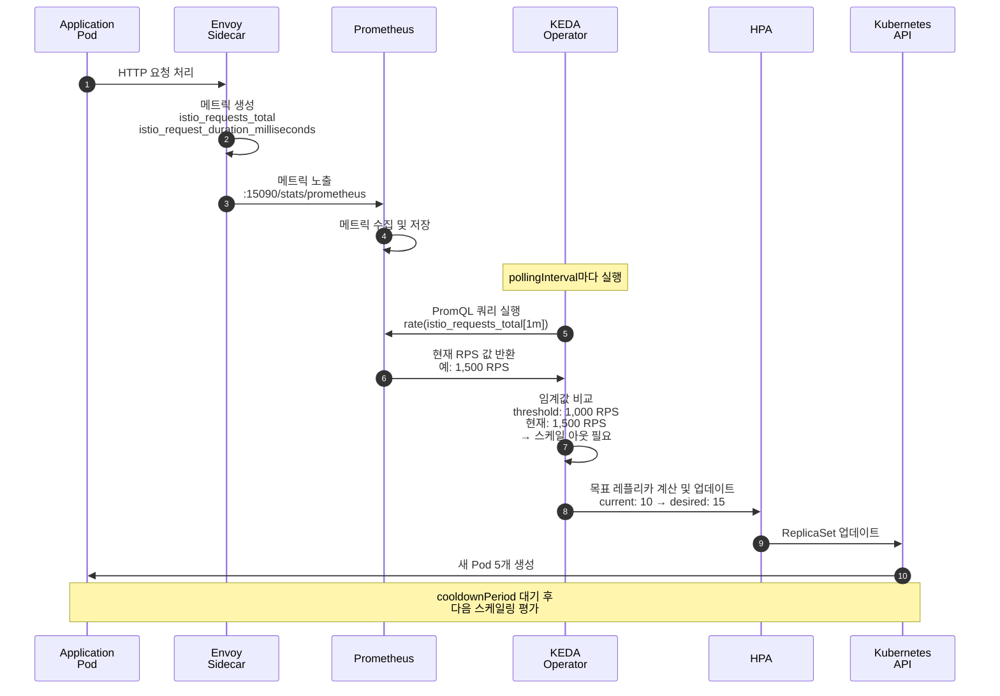
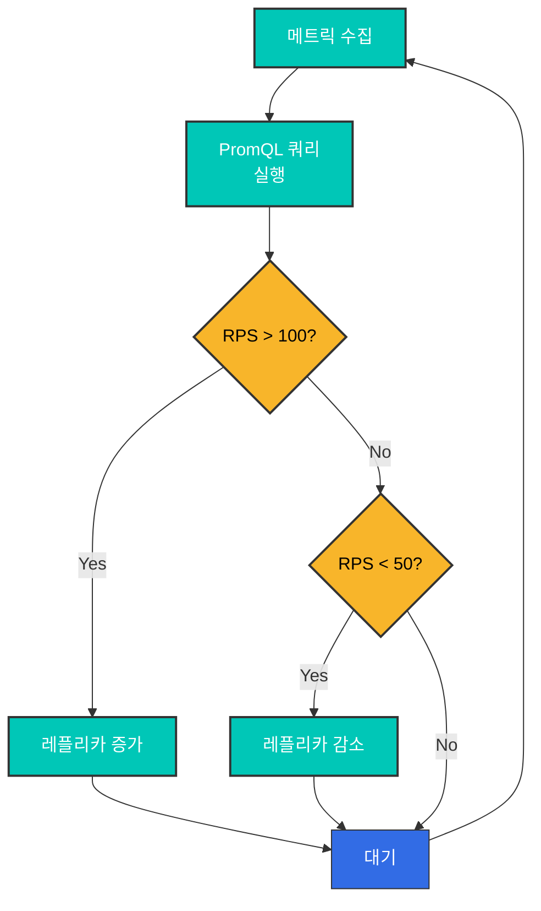
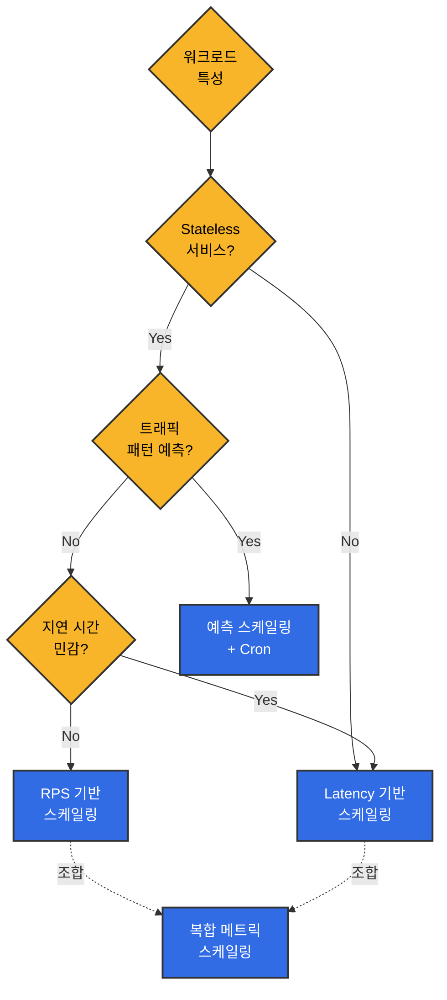

# KEDA를 활용한 Istio 메트릭 기반 오토스케일링

> **지원 버전**: KEDA 2.18, Istio 1.28
> **마지막 업데이트**: 2025년 11월 27일
> **Kubernetes 호환성**: 1.34

이 문서는 **Istio 메트릭을 활용한 실전 오토스케일링 전략**을 다룹니다. KEDA를 사용하여 Prometheus 및 CloudWatch 메트릭을 기반으로 워크로드를 스케일링하는 다양한 패턴과 실무 사례를 제공합니다.

**학습 목표**:
- Prometheus PromQL을 활용한 정교한 스케일링 정책 작성
- CloudWatch 메트릭 통합 및 AWS 서비스 조합
- RPS, Latency, 에러율 등 다양한 메트릭 기반 전략
- Circuit Breaker 및 시간대별 예측 스케일링
- 프로덕션 환경을 위한 안정화 및 모니터링

## 목차

1. [개요](#개요)
2. [아키텍처](#아키텍처)
3. [Prometheus 메트릭 기반 스케일링](#prometheus-메트릭-기반-스케일링)
4. [CloudWatch 메트릭 기반 스케일링](#cloudwatch-메트릭-기반-스케일링)
5. [실전 스케일링 전략](#실전-스케일링-전략)
6. [모범 사례](#모범-사례)
7. [문제 해결](#문제-해결)
8. [참고: KEDA 설치](#참고-keda-설치)

## 개요

이 문서는 **Istio 메트릭을 활용한 실전 오토스케일링 전략**에 초점을 맞춥니다. KEDA는 Kubernetes HPA를 확장하여 Prometheus 및 CloudWatch의 복잡한 메트릭 쿼리를 기반으로 스케일링할 수 있게 해줍니다.

### 핵심 Istio 메트릭

Istio Envoy 프록시가 제공하는 메트릭을 스케일링에 활용합니다:

| 메트릭 | 설명 | 스케일링 활용 |
|--------|------|---------------|
| **istio_requests_total** | 총 요청 수 | RPS 기반 스케일링 |
| **istio_request_duration_milliseconds** | 요청 지연 시간 | 지연 기반 스케일링 |
| **istio_tcp_connections_opened_total** | TCP 연결 수 | 연결 기반 스케일링 |
| **istio_request_bytes_sum** | 요청 바이트 | 처리량 기반 스케일링 |
| **envoy_cluster_upstream_rq_pending_overflow** | Circuit Breaker overflow | 과부하 감지 |

### 왜 KEDA를 사용하는가?

기본 Kubernetes HPA와 비교했을 때 KEDA의 장점:

| 기능 | Kubernetes HPA | KEDA |
|------|---------------|------|
| **메트릭 소스** | CPU/Memory + Custom Metrics API | 60+ Scaler 직접 지원 |
| **PromQL 쿼리** | ⚠️ Custom Metrics Adapter 필요 | ✅ 네이티브 지원 |
| **CloudWatch 통합** | ❌ 불가능 | ✅ 직접 쿼리 |
| **Scale to Zero** | ❌ 최소 1개 | ✅ 0개 가능 |
| **다중 메트릭** | ⚠️ 제한적 | ✅ 여러 트리거 조합 |
| **Cron 스케줄** | ❌ 미지원 | ✅ 시간대별 스케일링 |

**이 문서의 초점**: KEDA 설치보다는 **Prometheus와 CloudWatch 메트릭을 활용한 실전 스케일링 패턴과 전략**에 집중합니다.

### 주요 스케일링 전략

이 문서에서 다루는 실전 스케일링 패턴:

| 전략 | 주 메트릭 | 적합한 시나리오 | 핵심 장점 |
|------|----------|----------------|----------|
| **RPS 기반** | `istio_requests_total` | API 서버, 웹 서비스 | 직관적, 구현 간단 |
| **Latency 기반** | P50/P95/P99 지연 시간 | 결제, 주문 등 지연 민감 서비스 | 사용자 경험 보장 |
| **에러율 기반** | 5xx 응답 비율 | 고가용성 필수 서비스 | 빠른 장애 대응 |
| **복합 메트릭** | RPS + Latency + Error | 프로덕션 서비스 | 안정적, 정확한 스케일링 |
| **Circuit Breaker 기반** | overflow, connection pool | 외부 의존성 많은 서비스 | 연쇄 장애 방지 |
| **시간대별 예측** | Cron + 메트릭 | 트래픽 패턴 예측 가능 | 비용 최적화, 사전 대응 |

## 아키텍처

### 메트릭 기반 스케일링 흐름



### ScaledObject 기본 구조

KEDA의 핵심은 **ScaledObject** CRD입니다. Prometheus나 CloudWatch 메트릭을 기반으로 HPA를 자동 생성/관리합니다:

```yaml
apiVersion: keda.sh/v1alpha1
kind: ScaledObject
metadata:
  name: my-app-scaler
  namespace: default
spec:
  # 스케일 대상
  scaleTargetRef:
    name: my-app           # Deployment 이름
    kind: Deployment

  # 스케일링 정책
  pollingInterval: 30      # 30초마다 메트릭 확인
  cooldownPeriod: 300      # 스케일 다운 후 5분 대기
  minReplicaCount: 2       # 최소 Pod 수
  maxReplicaCount: 20      # 최대 Pod 수

  # 메트릭 트리거
  triggers:
  - type: prometheus       # 또는 aws-cloudwatch
    metadata:
      serverAddress: http://prometheus.istio-system.svc:9090
      query: |             # PromQL 쿼리
        sum(rate(istio_requests_total{
          destination_workload="my-app"
        }[1m]))
      threshold: '1000'    # 임계값: 1000 RPS
```

## Prometheus 메트릭 기반 스케일링

### 1. RPS (Requests Per Second) 기반 스케일링

#### ScaledObject 정의

```yaml
apiVersion: keda.sh/v1alpha1
kind: ScaledObject
metadata:
  name: reviews-rps-scaler
  namespace: default
spec:
  scaleTargetRef:
    name: reviews
    kind: Deployment

  # 스케일링 정책
  pollingInterval: 30  # 30초마다 메트릭 확인
  cooldownPeriod: 300  # 스케일 다운 후 5분 대기
  minReplicaCount: 2   # 최소 레플리카
  maxReplicaCount: 20  # 최대 레플리카

  triggers:
  - type: prometheus
    metadata:
      serverAddress: http://prometheus.istio-system.svc:9090
      query: |
        sum(rate(istio_requests_total{
          destination_workload="reviews",
          destination_workload_namespace="default",
          response_code=~"2.*"
        }[1m]))
      threshold: '100'  # 100 RPS 이상이면 스케일 아웃
      activationThreshold: '50'  # 50 RPS 이상이면 활성화
```

#### 동작 방식



### 2. Latency (지연 시간) 기반 스케일링

#### P95 지연 시간으로 스케일링

```yaml
apiVersion: keda.sh/v1alpha1
kind: ScaledObject
metadata:
  name: reviews-latency-scaler
  namespace: default
spec:
  scaleTargetRef:
    name: reviews
    kind: Deployment

  pollingInterval: 30
  cooldownPeriod: 300
  minReplicaCount: 2
  maxReplicaCount: 20

  triggers:
  - type: prometheus
    metadata:
      serverAddress: http://prometheus.istio-system.svc:9090
      # P95 지연 시간 (95th percentile)
      query: |
        histogram_quantile(0.95,
          sum(rate(istio_request_duration_milliseconds_bucket{
            destination_workload="reviews",
            destination_workload_namespace="default"
          }[2m])) by (le)
        )
      threshold: '200'  # 200ms 이상이면 스케일 아웃
      activationThreshold: '100'
```

#### P50 및 P99 조합 스케일링

```yaml
apiVersion: keda.sh/v1alpha1
kind: ScaledObject
metadata:
  name: reviews-multi-latency-scaler
  namespace: default
spec:
  scaleTargetRef:
    name: reviews
    kind: Deployment

  pollingInterval: 30
  cooldownPeriod: 300
  minReplicaCount: 2
  maxReplicaCount: 20

  # 여러 트리거 중 하나라도 임계값 초과 시 스케일링
  triggers:
  # P50 지연 시간
  - type: prometheus
    metadata:
      serverAddress: http://prometheus.istio-system.svc:9090
      query: |
        histogram_quantile(0.50,
          sum(rate(istio_request_duration_milliseconds_bucket{
            destination_workload="reviews",
            destination_workload_namespace="default"
          }[2m])) by (le)
        )
      threshold: '50'  # P50 > 50ms

  # P95 지연 시간
  - type: prometheus
    metadata:
      serverAddress: http://prometheus.istio-system.svc:9090
      query: |
        histogram_quantile(0.95,
          sum(rate(istio_request_duration_milliseconds_bucket{
            destination_workload="reviews",
            destination_workload_namespace="default"
          }[2m])) by (le)
        )
      threshold: '200'  # P95 > 200ms

  # P99 지연 시간 (극단적 상황)
  - type: prometheus
    metadata:
      serverAddress: http://prometheus.istio-system.svc:9090
      query: |
        histogram_quantile(0.99,
          sum(rate(istio_request_duration_milliseconds_bucket{
            destination_workload="reviews",
            destination_workload_namespace="default"
          }[2m])) by (le)
        )
      threshold: '500'  # P99 > 500ms
```

### 3. 성공률 기반 스케일링

에러율이 높을 때 스케일 아웃하여 부하 분산:

```yaml
apiVersion: keda.sh/v1alpha1
kind: ScaledObject
metadata:
  name: reviews-error-rate-scaler
  namespace: default
spec:
  scaleTargetRef:
    name: reviews
    kind: Deployment

  pollingInterval: 30
  cooldownPeriod: 300
  minReplicaCount: 2
  maxReplicaCount: 20

  triggers:
  # 에러율이 5% 이상이면 스케일 아웃
  - type: prometheus
    metadata:
      serverAddress: http://prometheus.istio-system.svc:9090
      query: |
        (
          sum(rate(istio_requests_total{
            destination_workload="reviews",
            response_code=~"5.*"
          }[2m]))
          /
          sum(rate(istio_requests_total{
            destination_workload="reviews"
          }[2m]))
        ) * 100
      threshold: '5'  # 5% 에러율
      activationThreshold: '2'
```

### 4. 복합 메트릭 스케일링

RPS와 Latency를 함께 고려:

```yaml
apiVersion: keda.sh/v1alpha1
kind: ScaledObject
metadata:
  name: reviews-composite-scaler
  namespace: default
spec:
  scaleTargetRef:
    name: reviews
    kind: Deployment

  pollingInterval: 30
  cooldownPeriod: 300
  minReplicaCount: 2
  maxReplicaCount: 20

  # 고급 스케일링 동작
  advanced:
    horizontalPodAutoscalerConfig:
      behavior:
        scaleDown:
          stabilizationWindowSeconds: 300  # 5분 안정화
          policies:
          - type: Percent
            value: 10  # 최대 10%씩 감소
            periodSeconds: 60
        scaleUp:
          stabilizationWindowSeconds: 0  # 즉시 스케일 아웃
          policies:
          - type: Percent
            value: 50  # 최대 50%씩 증가
            periodSeconds: 60
          - type: Pods
            value: 5  # 한 번에 최대 5개 추가
            periodSeconds: 60
          selectPolicy: Max  # 더 큰 값 선택

  triggers:
  # RPS 기반
  - type: prometheus
    metricType: AverageValue
    metadata:
      serverAddress: http://prometheus.istio-system.svc:9090
      query: |
        sum(rate(istio_requests_total{
          destination_workload="reviews",
          destination_workload_namespace="default"
        }[1m])) / count(kube_pod_info{pod=~"reviews-.*"})
      threshold: '50'  # Pod당 50 RPS

  # P95 Latency 기반
  - type: prometheus
    metricType: Value
    metadata:
      serverAddress: http://prometheus.istio-system.svc:9090
      query: |
        histogram_quantile(0.95,
          sum(rate(istio_request_duration_milliseconds_bucket{
            destination_workload="reviews"
          }[2m])) by (le)
        )
      threshold: '200'  # P95 > 200ms
```

## CloudWatch 메트릭 기반 스케일링

### 개요

CloudWatch는 Prometheus보다 **응답 속도가 느리지만** (1-3분 지연), AWS 네이티브 서비스와의 통합과 **장기 보관**에 유리합니다.

**사용 시나리오**:
- ✅ AWS 서비스 메트릭과 조합 (ALB, RDS, SQS 등)
- ✅ 장기 추세 분석 및 비용 최적화
- ✅ 멀티 리전 환경에서 중앙 집중 모니터링
- ❌ 실시간 스케일링 (Prometheus 권장)

> **전제 조건**: Istio 메트릭이 CloudWatch로 전송되고 있어야 합니다. ADOT Collector 설정은 [참고: KEDA 설치](#참고-keda-설치) 섹션을 참조하세요.

### CloudWatch 메트릭으로 스케일링

#### RPS 기반 스케일링

```yaml
apiVersion: keda.sh/v1alpha1
kind: ScaledObject
metadata:
  name: reviews-cloudwatch-rps
  namespace: default
spec:
  scaleTargetRef:
    name: reviews
    kind: Deployment

  pollingInterval: 60  # CloudWatch는 1분 간격 권장
  cooldownPeriod: 300
  minReplicaCount: 2
  maxReplicaCount: 20

  triggers:
  - type: aws-cloudwatch
    metadata:
      namespace: IstioMetrics
      metricName: IstioRequestsTotal
      dimensionName: destination_workload
      dimensionValue: reviews
      targetMetricValue: '1000'  # 1000 요청/분
      minMetricValue: '100'

      # 통계 유형
      metricStatPeriod: '60'  # 1분
      metricStat: Sum

      # AWS 리전
      awsRegion: us-west-2

      # IRSA 사용
      identityOwner: operator
```

#### Latency 기반 스케일링

```yaml
apiVersion: keda.sh/v1alpha1
kind: ScaledObject
metadata:
  name: reviews-cloudwatch-latency
  namespace: default
spec:
  scaleTargetRef:
    name: reviews
    kind: Deployment

  pollingInterval: 60
  cooldownPeriod: 300
  minReplicaCount: 2
  maxReplicaCount: 20

  triggers:
  - type: aws-cloudwatch
    metadata:
      namespace: IstioMetrics
      metricName: IstioRequestDuration
      dimensionName: destination_workload
      dimensionValue: reviews

      # P95 지연 시간 (CloudWatch에서 계산)
      targetMetricValue: '200'  # 200ms
      minMetricValue: '50'

      metricStatPeriod: '60'
      metricStat: 'p95'  # 95th percentile

      awsRegion: us-west-2
      identityOwner: operator
```

## 실전 스케일링 전략

### 전략 1: 트래픽 패턴 기반 예측 스케일링

시간대별 트래픽 패턴을 고려한 사전 스케일링:

```yaml
apiVersion: keda.sh/v1alpha1
kind: ScaledObject
metadata:
  name: frontend-predictive-scaler
  namespace: default
spec:
  scaleTargetRef:
    name: frontend
    kind: Deployment

  pollingInterval: 30
  cooldownPeriod: 300
  minReplicaCount: 2
  maxReplicaCount: 50

  # 고급 HPA 동작 설정
  advanced:
    horizontalPodAutoscalerConfig:
      behavior:
        scaleDown:
          stabilizationWindowSeconds: 600  # 10분 안정화
          policies:
          - type: Percent
            value: 10
            periodSeconds: 120  # 2분마다 10%씩 감소
        scaleUp:
          stabilizationWindowSeconds: 0
          policies:
          - type: Percent
            value: 100  # 한 번에 2배까지 증가 가능
            periodSeconds: 30
          - type: Pods
            value: 10  # 한 번에 최대 10개 추가
            periodSeconds: 30
          selectPolicy: Max

  triggers:
  # RPS 기반
  - type: prometheus
    metadata:
      serverAddress: http://prometheus.istio-system.svc:9090
      query: |
        sum(rate(istio_requests_total{
          destination_workload="frontend"
        }[1m])) / scalar(count(up{job="frontend"}))
      threshold: '100'  # Pod당 100 RPS

  # P95 지연 시간
  - type: prometheus
    metadata:
      serverAddress: http://prometheus.istio-system.svc:9090
      query: |
        histogram_quantile(0.95,
          sum(rate(istio_request_duration_milliseconds_bucket{
            destination_workload="frontend"
          }[2m])) by (le)
        )
      threshold: '300'

  # Cron 기반 사전 스케일링 (피크 시간대)
  - type: cron
    metadata:
      timezone: Asia/Seoul
      start: 0 9 * * 1-5  # 평일 오전 9시
      end: 0 18 * * 1-5   # 평일 오후 6시
      desiredReplicas: '20'  # 피크 시간대는 최소 20개
```

### 전략 2: Circuit Breaker 상태 기반 스케일링

Circuit이 Open될 때 자동으로 스케일 아웃:

```yaml
apiVersion: keda.sh/v1alpha1
kind: ScaledObject
metadata:
  name: backend-circuit-breaker-scaler
  namespace: default
spec:
  scaleTargetRef:
    name: backend
    kind: Deployment

  pollingInterval: 15  # Circuit Breaker는 빠른 반응 필요
  cooldownPeriod: 180
  minReplicaCount: 3
  maxReplicaCount: 30

  triggers:
  # Circuit Breaker Overflow 감지
  - type: prometheus
    metadata:
      serverAddress: http://prometheus.istio-system.svc:9090
      query: |
        sum(increase(envoy_cluster_upstream_rq_pending_overflow{
          cluster_name=~"outbound.*backend.*"
        }[1m]))
      threshold: '10'  # 1분에 10개 이상 overflow
      activationThreshold: '5'

  # Upstream connection pool saturation
  - type: prometheus
    metadata:
      serverAddress: http://prometheus.istio-system.svc:9090
      query: |
        sum(envoy_cluster_upstream_cx_active{
          cluster_name=~"outbound.*backend.*"
        })
        /
        sum(envoy_cluster_circuit_breakers_default_cx_open{
          cluster_name=~"outbound.*backend.*"
        }) * 100
      threshold: '80'  # Connection pool 80% 이상 사용
```

### 전략 3: 다단계 스케일링 (Tiered Scaling)

부하 수준에 따라 다른 스케일링 속도 적용:

```yaml
apiVersion: keda.sh/v1alpha1
kind: ScaledObject
metadata:
  name: payment-tiered-scaler
  namespace: default
spec:
  scaleTargetRef:
    name: payment-service
    kind: Deployment

  pollingInterval: 30
  cooldownPeriod: 300
  minReplicaCount: 3
  maxReplicaCount: 50

  advanced:
    horizontalPodAutoscalerConfig:
      behavior:
        scaleUp:
          policies:
          # 낮은 부하 (< 임계값 150%): 천천히 증가
          - type: Percent
            value: 20
            periodSeconds: 120
          # 중간 부하 (150-200%): 빠르게 증가
          - type: Percent
            value: 50
            periodSeconds: 60
          # 높은 부하 (> 200%): 매우 빠르게 증가
          - type: Pods
            value: 10
            periodSeconds: 30
          selectPolicy: Max

        scaleDown:
          policies:
          - type: Percent
            value: 5  # 천천히 감소 (5%씩)
            periodSeconds: 180  # 3분마다

  triggers:
  - type: prometheus
    metadata:
      serverAddress: http://prometheus.istio-system.svc:9090
      query: |
        sum(rate(istio_requests_total{
          destination_workload="payment-service",
          response_code=~"2.*"
        }[1m]))
      threshold: '500'  # 500 RPS
```

### 전략 4: 비용 최적화 스케일링

업무 시간과 비업무 시간을 구분:

```yaml
apiVersion: keda.sh/v1alpha1
kind: ScaledObject
metadata:
  name: analytics-cost-optimized-scaler
  namespace: default
spec:
  scaleTargetRef:
    name: analytics-service
    kind: Deployment

  pollingInterval: 60
  cooldownPeriod: 600  # 비용 최적화를 위해 더 긴 대기
  minReplicaCount: 1
  maxReplicaCount: 30

  triggers:
  # 업무 시간 (09:00-18:00): 적극적 스케일링
  - type: prometheus
    metadata:
      serverAddress: http://prometheus.istio-system.svc:9090
      query: |
        (
          sum(rate(istio_requests_total{
            destination_workload="analytics-service"
          }[2m]))
          and
          (hour() >= 9 and hour() < 18)
        )
      threshold: '50'
      activationThreshold: '20'

  # 비업무 시간: Scale to Zero 허용
  - type: cron
    metadata:
      timezone: Asia/Seoul
      start: 0 18 * * *  # 오후 6시
      end: 0 9 * * *     # 오전 9시
      desiredReplicas: '0'  # Scale to Zero
```

### 전략 5: Gateway 메트릭 기반 스케일링

Istio Gateway의 부하를 모니터링하여 백엔드 스케일링:

```yaml
apiVersion: keda.sh/v1alpha1
kind: ScaledObject
metadata:
  name: backend-gateway-based-scaler
  namespace: default
spec:
  scaleTargetRef:
    name: backend
    kind: Deployment

  pollingInterval: 30
  cooldownPeriod: 300
  minReplicaCount: 2
  maxReplicaCount: 40

  triggers:
  # Gateway를 통한 유입 트래픽 모니터링
  - type: prometheus
    metadata:
      serverAddress: http://prometheus.istio-system.svc:9090
      query: |
        sum(rate(istio_requests_total{
          source_workload="istio-ingressgateway",
          destination_service="backend.default.svc.cluster.local"
        }[1m]))
      threshold: '1000'

  # Gateway의 pending 연결 수
  - type: prometheus
    metadata:
      serverAddress: http://prometheus.istio-system.svc:9090
      query: |
        sum(envoy_http_downstream_rq_active{
          app="istio-ingressgateway"
        })
      threshold: '500'  # 500개 이상의 동시 요청
```

## 모범 사례

### 1. 메트릭 선택 가이드



**권장 메트릭**:

| 워크로드 유형 | 주 메트릭 | 보조 메트릭 | 이유 |
|-------------|----------|-----------|------|
| **API 서버** | RPS | P95 Latency | 요청 수가 부하의 직접적 지표 |
| **웹 서버** | RPS | 에러율 | 동시 연결 수보다 요청 수가 중요 |
| **데이터 처리** | P95 Latency | CPU/Memory | 처리 시간이 부하 지표 |
| **Streaming** | TCP 연결 수 | 처리량 | 연결 수가 리소스 소비의 핵심 |
| **배치 작업** | 큐 길이 | 처리 시간 | 작업 대기 수가 스케일링 기준 |

### 2. 임계값 설정 가이드

```yaml
# 적절한 임계값 찾기 프로세스

# 1단계: 현재 워크로드 측정
# 평상시 RPS
kubectl exec -it prometheus-xxx -n istio-system -- promtool query instant \
  'sum(rate(istio_requests_total{destination_workload="reviews"}[5m]))'

# 피크 시간대 RPS
# 평상시: ~500 RPS
# 피크: ~2000 RPS

# 2단계: Pod당 처리 능력 측정
# 부하 테스트 수행
kubectl run load-test --image=fortio/fortio -- load -c 50 -qps 0 -t 60s http://reviews:9080

# 결과: Pod당 약 200 RPS까지 P95 < 100ms 유지

# 3단계: 임계값 계산
# 목표 P95: 100ms
# Pod당 처리 능력: 200 RPS
# 안전 마진: 70% (140 RPS/pod)
# → threshold: '140'

# 4단계: ScaledObject 작성
apiVersion: keda.sh/v1alpha1
kind: ScaledObject
metadata:
  name: reviews-optimized-scaler
spec:
  scaleTargetRef:
    name: reviews
  minReplicaCount: 3  # 평상시 500 RPS / 140 = 3.5 → 4개
  maxReplicaCount: 20  # 피크 2000 RPS / 140 = 14.2 → 20개 (여유)
  triggers:
  - type: prometheus
    metadata:
      query: |
        sum(rate(istio_requests_total{destination_workload="reviews"}[1m]))
        / count(kube_pod_info{pod=~"reviews-.*"})
      threshold: '140'  # Pod당 140 RPS
```

### 3. 스케일링 속도 조정

```yaml
apiVersion: keda.sh/v1alpha1
kind: ScaledObject
metadata:
  name: balanced-scaler
  namespace: default
spec:
  scaleTargetRef:
    name: myapp
    kind: Deployment

  pollingInterval: 30
  cooldownPeriod: 300
  minReplicaCount: 2
  maxReplicaCount: 50

  advanced:
    horizontalPodAutoscalerConfig:
      behavior:
        # 스케일 다운: 보수적 (서비스 안정성 우선)
        scaleDown:
          stabilizationWindowSeconds: 600  # 10분 관찰
          policies:
          - type: Percent
            value: 10  # 10%씩 감소
            periodSeconds: 180  # 3분마다
          - type: Pods
            value: 2  # 또는 최대 2개씩
            periodSeconds: 180
          selectPolicy: Min  # 더 보수적인 값 선택

        # 스케일 업: 적극적 (빠른 대응)
        scaleUp:
          stabilizationWindowSeconds: 0  # 즉시
          policies:
          - type: Percent
            value: 100  # 2배까지 증가
            periodSeconds: 30
          - type: Pods
            value: 10  # 또는 10개씩
            periodSeconds: 30
          selectPolicy: Max  # 더 적극적인 값 선택

  triggers:
  - type: prometheus
    metadata:
      serverAddress: http://prometheus.istio-system.svc:9090
      query: sum(rate(istio_requests_total{destination_workload="myapp"}[1m]))
      threshold: '1000'
```

### 4. 멀티 클러스터 환경에서의 스케일링

```yaml
# Cluster 1: 주 트래픽 처리
apiVersion: keda.sh/v1alpha1
kind: ScaledObject
metadata:
  name: frontend-cluster1-scaler
  namespace: default
spec:
  scaleTargetRef:
    name: frontend
  minReplicaCount: 5
  maxReplicaCount: 30

  triggers:
  - type: prometheus
    metadata:
      serverAddress: http://prometheus.istio-system.svc:9090
      # 글로벌 트래픽의 60%를 이 클러스터에서 처리
      query: |
        sum(rate(istio_requests_total{
          destination_workload="frontend",
          source_cluster="cluster1"
        }[1m])) * 0.6
      threshold: '600'
---
# Cluster 2: 보조 트래픽 처리
apiVersion: keda.sh/v1alpha1
kind: ScaledObject
metadata:
  name: frontend-cluster2-scaler
  namespace: default
spec:
  scaleTargetRef:
    name: frontend
  minReplicaCount: 3
  maxReplicaCount: 20

  triggers:
  - type: prometheus
    metadata:
      serverAddress: http://prometheus.istio-system.svc:9090
      # 글로벌 트래픽의 40%
      query: |
        sum(rate(istio_requests_total{
          destination_workload="frontend",
          source_cluster="cluster2"
        }[1m])) * 0.4
      threshold: '400'
```

## 모범 사례

### 1. 메트릭 수집 최적화

```yaml
# Prometheus scrape 간격 조정
apiVersion: v1
kind: ConfigMap
metadata:
  name: prometheus
  namespace: istio-system
data:
  prometheus.yml: |
    global:
      scrape_interval: 15s  # 기본 15초
      evaluation_interval: 15s

    scrape_configs:
    # Istio 메트릭은 더 자주 수집
    - job_name: 'istio-mesh'
      scrape_interval: 10s  # 10초
      kubernetes_sd_configs:
      - role: endpoints
        namespaces:
          names:
          - default
          - production
      relabel_configs:
      - source_labels: [__meta_kubernetes_pod_annotation_prometheus_io_scrape]
        action: keep
        regex: true
```

### 2. 스케일링 안정성 확보

```yaml
apiVersion: keda.sh/v1alpha1
kind: ScaledObject
metadata:
  name: stable-scaler
  namespace: default
spec:
  scaleTargetRef:
    name: myapp

  # 1. 적절한 폴링 간격
  pollingInterval: 30  # 너무 짧으면 불안정, 너무 길면 반응 느림

  # 2. 충분한 쿨다운
  cooldownPeriod: 300  # 5분은 일반적으로 적절

  # 3. 안전한 최소/최대값
  minReplicaCount: 2  # 0은 위험, 최소 2개 권장
  maxReplicaCount: 20  # 클러스터 용량의 70% 이하

  advanced:
    horizontalPodAutoscalerConfig:
      behavior:
        scaleDown:
          # 4. 긴 안정화 윈도우
          stabilizationWindowSeconds: 600
          policies:
          - type: Percent
            value: 10
            periodSeconds: 120
```

### 3. 모니터링 및 알림

```yaml
apiVersion: monitoring.coreos.com/v1
kind: PrometheusRule
metadata:
  name: keda-scaling-alerts
  namespace: keda
spec:
  groups:
  - name: keda-scaling
    interval: 30s
    rules:
    # 최대 레플리카에 도달
    - alert: KEDAMaxReplicasReached
      expr: |
        kube_horizontalpodautoscaler_status_current_replicas
        >= kube_horizontalpodautoscaler_spec_max_replicas
      for: 5m
      labels:
        severity: warning
      annotations:
        summary: "KEDA scaled to maximum replicas"
        description: "{{ $labels.horizontalpodautoscaler }} has reached max replicas ({{ $value }})"

    # 스케일링 실패
    - alert: KEDAScalingFailed
      expr: |
        increase(keda_scaler_errors_total[5m]) > 0
      labels:
        severity: critical
      annotations:
        summary: "KEDA scaling failed"
        description: "KEDA scaler {{ $labels.scaledObject }} has errors"

    # 빈번한 스케일링 (Flapping)
    - alert: KEDAFlapping
      expr: |
        rate(keda_scaler_active[10m]) > 0.1
      for: 10m
      labels:
        severity: warning
      annotations:
        summary: "KEDA is flapping"
        description: "ScaledObject {{ $labels.scaledObject }} is scaling too frequently"
```

### 4. 리소스 제한 설정

```yaml
apiVersion: apps/v1
kind: Deployment
metadata:
  name: reviews
  namespace: default
spec:
  replicas: 3
  template:
    spec:
      containers:
      - name: reviews
        image: istio/examples-bookinfo-reviews-v1:1.17.0

        # 리소스 요청/제한 (스케일링 계산에 중요)
        resources:
          requests:
            cpu: 100m
            memory: 128Mi
          limits:
            cpu: 200m
            memory: 256Mi

        # Readiness Probe (스케일 아웃 시 안전성)
        readinessProbe:
          httpGet:
            path: /health
            port: 9080
          initialDelaySeconds: 10
          periodSeconds: 5
          timeoutSeconds: 3
          successThreshold: 1
          failureThreshold: 3

        # Liveness Probe
        livenessProbe:
          httpGet:
            path: /health
            port: 9080
          initialDelaySeconds: 30
          periodSeconds: 10
```

## 문제 해결

### 1. KEDA가 메트릭을 가져오지 못함

**증상**:
```bash
kubectl get scaledobject -n default
# STATUS: Unknown
```

**원인 분석**:

```bash
# 1. KEDA Operator 로그 확인
kubectl logs -n keda -l app=keda-operator

# 2. ScaledObject 상태 확인
kubectl describe scaledobject reviews-rps-scaler -n default

# 3. Prometheus 연결 테스트
kubectl run curl-test --image=curlimages/curl -it --rm -- \
  curl -s http://prometheus.istio-system.svc:9090/api/v1/query \
  --data-urlencode 'query=up'
```

**해결 방법**:

1. **Prometheus 주소 확인**:
```bash
# Prometheus Service 확인
kubectl get svc -n istio-system | grep prometheus

# ScaledObject에서 올바른 주소 사용
serverAddress: http://prometheus.istio-system.svc:9090
```

2. **PromQL 쿼리 테스트**:
```bash
# Prometheus UI에서 직접 쿼리 테스트
kubectl port-forward -n istio-system svc/prometheus 9090:9090

# 브라우저: http://localhost:9090
# 쿼리 입력 후 결과 확인
```

### 2. 스케일링이 너무 느림

**증상**: 트래픽 급증 시 스케일 아웃이 늦음

**해결 방법**:

```yaml
apiVersion: keda.sh/v1alpha1
kind: ScaledObject
metadata:
  name: fast-scaler
spec:
  # 1. 폴링 간격 단축
  pollingInterval: 15  # 30초 → 15초

  # 2. 스케일 업 안정화 윈도우 제거
  advanced:
    horizontalPodAutoscalerConfig:
      behavior:
        scaleUp:
          stabilizationWindowSeconds: 0  # 즉시 반응
          policies:
          - type: Pods
            value: 5  # 한 번에 5개씩
            periodSeconds: 30

  # 3. 낮은 activation threshold
  triggers:
  - type: prometheus
    metadata:
      query: sum(rate(istio_requests_total{...}[1m]))
      threshold: '100'
      activationThreshold: '30'  # 낮은 임계값으로 조기 활성화
```

### 3. Flapping (불안정한 스케일링)

**증상**: Pod 수가 계속 증가/감소 반복

**원인**: 임계값이 너무 민감하거나 안정화 기간 부족

**해결 방법**:

```yaml
apiVersion: keda.sh/v1alpha1
kind: ScaledObject
metadata:
  name: stable-scaler
spec:
  # 1. 더 긴 쿨다운
  cooldownPeriod: 600  # 10분

  # 2. 더 긴 PromQL 평가 기간
  triggers:
  - type: prometheus
    metadata:
      query: |
        sum(rate(istio_requests_total{...}[5m]))  # 1m → 5m
      threshold: '100'

  # 3. 보수적인 스케일 다운
  advanced:
    horizontalPodAutoscalerConfig:
      behavior:
        scaleDown:
          stabilizationWindowSeconds: 600
          policies:
          - type: Percent
            value: 5  # 5%씩만 감소
            periodSeconds: 180
```

### 4. CloudWatch 지연 시간

**증상**: CloudWatch 메트릭이 실시간이 아님 (1-3분 지연)

**해결 방법**:

```yaml
# Prometheus 메트릭을 주로 사용하고, CloudWatch는 보조로
apiVersion: keda.sh/v1alpha1
kind: ScaledObject
metadata:
  name: hybrid-metrics-scaler
spec:
  triggers:
  # 주 메트릭: Prometheus (실시간)
  - type: prometheus
    metadata:
      serverAddress: http://prometheus.istio-system.svc:9090
      query: sum(rate(istio_requests_total{...}[1m]))
      threshold: '1000'

  # 보조 메트릭: CloudWatch (추세 분석)
  - type: aws-cloudwatch
    metadata:
      namespace: IstioMetrics
      metricName: IstioRequestsTotal
      targetMetricValue: '5000'  # 더 높은 임계값
      metricStatPeriod: '300'  # 5분 집계
```

## 실전 예제

### 예제 1: 이커머스 결제 서비스

지연 시간이 매우 중요한 서비스:

```yaml
apiVersion: keda.sh/v1alpha1
kind: ScaledObject
metadata:
  name: payment-service-scaler
  namespace: production
spec:
  scaleTargetRef:
    name: payment-service
    kind: Deployment

  pollingInterval: 15  # 빠른 반응
  cooldownPeriod: 180  # 3분 쿨다운
  minReplicaCount: 5   # 항상 5개 이상 유지
  maxReplicaCount: 50

  advanced:
    horizontalPodAutoscalerConfig:
      behavior:
        scaleUp:
          stabilizationWindowSeconds: 0
          policies:
          - type: Percent
            value: 100  # 빠르게 2배로
            periodSeconds: 30
        scaleDown:
          stabilizationWindowSeconds: 900  # 15분 안정화
          policies:
          - type: Percent
            value: 5
            periodSeconds: 300  # 5분마다 5%씩

  triggers:
  # P50 지연 시간 (일반적인 경우)
  - type: prometheus
    metadata:
      serverAddress: http://prometheus.istio-system.svc:9090
      query: |
        histogram_quantile(0.50,
          sum(rate(istio_request_duration_milliseconds_bucket{
            destination_workload="payment-service",
            destination_workload_namespace="production"
          }[1m])) by (le)
        )
      threshold: '50'  # P50 > 50ms
      activationThreshold: '30'

  # P95 지연 시간 (품질 보장)
  - type: prometheus
    metadata:
      serverAddress: http://prometheus.istio-system.svc:9090
      query: |
        histogram_quantile(0.95,
          sum(rate(istio_request_duration_milliseconds_bucket{
            destination_workload="payment-service",
            destination_workload_namespace="production"
          }[1m])) by (le)
        )
      threshold: '200'  # P95 > 200ms

  # 에러율 (5% 이상이면 긴급 스케일 아웃)
  - type: prometheus
    metadata:
      serverAddress: http://prometheus.istio-system.svc:9090
      query: |
        (
          sum(rate(istio_requests_total{
            destination_workload="payment-service",
            response_code=~"5.*"
          }[1m]))
          /
          sum(rate(istio_requests_total{
            destination_workload="payment-service"
          }[1m]))
        ) * 100
      threshold: '5'
```

### 예제 2: 데이터 처리 서비스

배치 처리 및 큐 기반 스케일링:

```yaml
apiVersion: keda.sh/v1alpha1
kind: ScaledObject
metadata:
  name: data-processor-scaler
  namespace: default
spec:
  scaleTargetRef:
    name: data-processor
    kind: Deployment

  pollingInterval: 60  # 배치는 느린 반응 허용
  cooldownPeriod: 600  # 10분 쿨다운
  minReplicaCount: 0   # Scale to Zero 허용
  maxReplicaCount: 30

  triggers:
  # SQS 큐 길이 (주 메트릭)
  - type: aws-sqs-queue
    metadata:
      queueURL: https://sqs.us-west-2.amazonaws.com/123456789/data-processing-queue
      queueLength: '10'  # 큐에 10개 이상이면 활성화
      awsRegion: us-west-2
      identityOwner: operator

  # Istio 처리 시간 (보조 메트릭)
  - type: prometheus
    metadata:
      serverAddress: http://prometheus.istio-system.svc:9090
      query: |
        histogram_quantile(0.95,
          sum(rate(istio_request_duration_milliseconds_bucket{
            destination_workload="data-processor"
          }[5m])) by (le)
        )
      threshold: '5000'  # 5초 이상 소요 시 스케일 아웃
```

### 예제 3: 멀티 리전 글로벌 서비스

지연 시간 기반 지역별 스케일링:

```yaml
# US Region
apiVersion: keda.sh/v1alpha1
kind: ScaledObject
metadata:
  name: api-us-scaler
  namespace: default
  labels:
    region: us-east-1
spec:
  scaleTargetRef:
    name: api-service
  minReplicaCount: 3
  maxReplicaCount: 30

  triggers:
  - type: prometheus
    metadata:
      serverAddress: http://prometheus.istio-system.svc:9090
      # US 사용자 트래픽만 집계
      query: |
        sum(rate(istio_requests_total{
          destination_workload="api-service",
          source_canonical_service=~".*-us-.*"
        }[1m]))
      threshold: '500'

  - type: prometheus
    metadata:
      serverAddress: http://prometheus.istio-system.svc:9090
      # US 지역 P95 지연 시간
      query: |
        histogram_quantile(0.95,
          sum(rate(istio_request_duration_milliseconds_bucket{
            destination_workload="api-service",
            destination_region="us-east-1"
          }[2m])) by (le)
        )
      threshold: '100'  # US 사용자는 100ms 목표
---
# EU Region
apiVersion: keda.sh/v1alpha1
kind: ScaledObject
metadata:
  name: api-eu-scaler
  namespace: default
  labels:
    region: eu-west-1
spec:
  scaleTargetRef:
    name: api-service
  minReplicaCount: 2
  maxReplicaCount: 20

  triggers:
  - type: prometheus
    metadata:
      serverAddress: http://prometheus.istio-system.svc:9090
      query: |
        sum(rate(istio_requests_total{
          destination_workload="api-service",
          source_canonical_service=~".*-eu-.*"
        }[1m]))
      threshold: '300'

  - type: prometheus
    metadata:
      serverAddress: http://prometheus.istio-system.svc:9090
      query: |
        histogram_quantile(0.95,
          sum(rate(istio_request_duration_milliseconds_bucket{
            destination_workload="api-service",
            destination_region="eu-west-1"
          }[2m])) by (le)
        )
      threshold: '150'  # EU는 150ms 허용
```

## 참고: KEDA 설치

> **참고**: 이 섹션은 KEDA를 처음 설치하는 경우에만 필요합니다. 이미 설치되어 있다면 [Prometheus 메트릭 기반 스케일링](#prometheus-메트릭-기반-스케일링)부터 시작하세요.

### Helm으로 설치

```bash
# KEDA Helm 레포지토리 추가
helm repo add kedacore https://kedacore.github.io/charts
helm repo update

# KEDA 설치
helm install keda kedacore/keda \
  --namespace keda \
  --create-namespace \
  --set prometheus.metricServer.enabled=true \
  --set prometheus.metricServer.port=9022 \
  --set operator.replicaCount=2

# 설치 확인
kubectl get pods -n keda
# 출력:
# NAME                                      READY   STATUS
# keda-operator-xxxxx                       1/1     Running
# keda-operator-metrics-apiserver-xxxxx     1/1     Running
```

### AWS IRSA 설정 (CloudWatch 사용 시)

CloudWatch 메트릭을 사용하는 경우 KEDA Operator에 IAM 권한이 필요합니다:

```bash
# IRSA 설정
eksctl create iamserviceaccount \
  --name keda-operator \
  --namespace keda \
  --cluster my-cluster \
  --attach-policy-arn arn:aws:iam::aws:policy/CloudWatchReadOnlyAccess \
  --approve \
  --override-existing-serviceaccounts

# ServiceAccount 확인
kubectl get sa keda-operator -n keda -o yaml | grep eks.amazonaws.com/role-arn
```

### CloudWatch 메트릭 전송 설정 (선택 사항)

CloudWatch 메트릭 기반 스케일링을 사용하려면 ADOT Collector로 Istio 메트릭을 전송해야 합니다:

#### 1단계: ADOT Collector 설치

```yaml
apiVersion: opentelemetry.io/v1alpha1
kind: OpenTelemetryCollector
metadata:
  name: istio-metrics-collector
  namespace: istio-system
spec:
  mode: deployment
  serviceAccount: adot-collector
  config: |
    receivers:
      prometheus:
        config:
          scrape_configs:
          - job_name: 'istio-mesh'
            scrape_interval: 60s  # CloudWatch는 1분 단위 권장
            kubernetes_sd_configs:
            - role: endpoints
              namespaces:
                names:
                - default
            relabel_configs:
            - source_labels: [__meta_kubernetes_pod_annotation_prometheus_io_scrape]
              action: keep
              regex: true

    processors:
      batch:
        timeout: 60s
      metricstransform:
        transforms:
        - include: istio_requests_total
          action: update
          new_name: IstioRequestsTotal
        - include: istio_request_duration_milliseconds
          action: update
          new_name: IstioRequestDuration

    exporters:
      awsemf:
        namespace: IstioMetrics
        region: us-west-2
        dimension_rollup_option: NoDimensionRollup
        metric_declarations:
        - dimensions: [[destination_workload, destination_workload_namespace]]
          metric_name_selectors:
          - IstioRequestsTotal
          - IstioRequestDuration

    service:
      pipelines:
        metrics:
          receivers: [prometheus]
          processors: [batch, metricstransform]
          exporters: [awsemf]
```

#### 2단계: IRSA 설정

```bash
# IRSA 정책 생성
cat > adot-cloudwatch-policy.json <<EOF
{
  "Version": "2012-10-17",
  "Statement": [
    {
      "Effect": "Allow",
      "Action": ["cloudwatch:PutMetricData"],
      "Resource": "*",
      "Condition": {
        "StringEquals": {
          "cloudwatch:namespace": "IstioMetrics"
        }
      }
    }
  ]
}
EOF

aws iam create-policy \
  --policy-name ADOTCollectorCloudWatchPolicy \
  --policy-document file://adot-cloudwatch-policy.json

eksctl create iamserviceaccount \
  --name adot-collector \
  --namespace istio-system \
  --cluster my-cluster \
  --attach-policy-arn arn:aws:iam::${ACCOUNT_ID}:policy/ADOTCollectorCloudWatchPolicy \
  --approve
```

**설치 완료 후** [Prometheus 메트릭 기반 스케일링](#prometheus-메트릭-기반-스케일링) 또는 [CloudWatch 메트릭 기반 스케일링](#cloudwatch-메트릭-기반-스케일링) 섹션으로 돌아가세요.

---

## 참고 자료

### 공식 문서

- [KEDA 공식 문서](https://keda.sh/docs/)
- [KEDA Prometheus Scaler](https://keda.sh/docs/scalers/prometheus/)
- [KEDA AWS CloudWatch Scaler](https://keda.sh/docs/scalers/aws-cloudwatch/)
- [Istio 메트릭](https://istio.io/latest/docs/reference/config/metrics/)

### 관련 문서

- [Observability](../observability/README.md) - Prometheus 및 메트릭 수집
- [Resilience](../resilience/README.md) - Circuit Breaker 및 복원력
- [Traffic Management](../traffic-management/README.md) - Istio 트래픽 관리

## 요약

### 메트릭 소스 선택 가이드

| 메트릭 소스 | 장점 | 단점 | 권장 사용 |
|------------|------|------|----------|
| **Prometheus** | • 실시간 반응 (15-30초)<br>• PromQL 강력한 쿼리<br>• 클러스터 내부 통신 | • 장기 보관 비용<br>• 클러스터 의존성 | 실시간 스케일링, 대부분의 워크로드 |
| **CloudWatch** | • AWS 서비스 통합<br>• 장기 보관<br>• 멀티 리전 지원 | • 1-3분 지연<br>• 비용 (메트릭 수에 비례) | 추세 분석, AWS 서비스 조합 |

### 스케일링 전략 선택 가이드

| 워크로드 유형 | 주 메트릭 | 보조 메트릭 | 권장 설정 |
|-------------|----------|-----------|----------|
| **API 서버** | RPS (Pod당) | P95 Latency | `pollingInterval: 30`, `cooldownPeriod: 300` |
| **결제/주문** | P50/P95 Latency | 에러율 | `pollingInterval: 15`, 빠른 스케일 아웃 |
| **데이터 처리** | 큐 길이, P95 Latency | CPU/Memory | `pollingInterval: 60`, Scale to Zero 허용 |
| **웹 프론트엔드** | RPS, P95 Latency | Gateway 메트릭 | Cron 기반 사전 스케일링 |
| **마이크로서비스** | RPS, Circuit Breaker | 에러율 | 다단계 스케일링 정책 |

### 프로덕션 체크리스트

스케일링 정책을 프로덕션에 적용하기 전 확인 사항:

- [ ] **임계값 검증**: 부하 테스트로 적절한 threshold 값 확인
- [ ] **안정화 설정**: `stabilizationWindowSeconds` 충분히 설정 (스케일 다운 최소 300초)
- [ ] **리소스 제한**: Pod의 `requests`와 `limits` 명확히 정의
- [ ] **Health Check**: Readiness/Liveness Probe 설정
- [ ] **모니터링**: `KEDAMaxReplicasReached`, `KEDAScalingFailed` 알림 설정
- [ ] **Flapping 방지**: 긴 PromQL 평가 기간 (`[5m]`) 및 보수적 스케일 다운
- [ ] **최소/최대값**: 클러스터 용량의 70% 이하로 `maxReplicaCount` 설정
- [ ] **Fallback**: Prometheus 장애 시 CPU/Memory 기반 HPA 백업

### 권장 시작 경로

```
1단계: RPS 기반 스케일링 구현
   └─> 단일 메트릭으로 시작, 임계값 조정

2단계: Latency 메트릭 추가
   └─> P95 지연 시간 모니터링 및 스케일링

3단계: 복합 메트릭 전략
   └─> RPS + Latency 조합으로 안정성 확보

4단계: 고급 전략 적용
   └─> Circuit Breaker, Cron, 에러율 등 추가
```

**핵심 원칙**:
- Prometheus로 실시간 반응
- 복합 메트릭으로 안정성 확보
- 보수적인 스케일 다운, 적극적인 스케일 아웃
- 지속적인 모니터링과 임계값 조정
