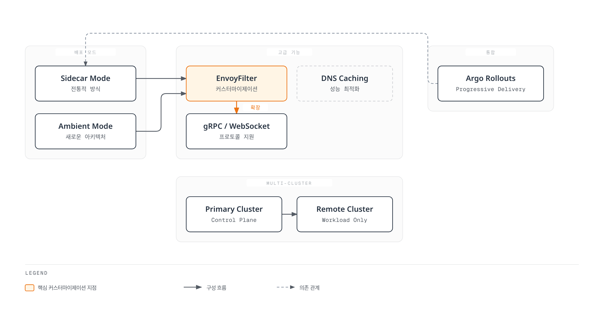
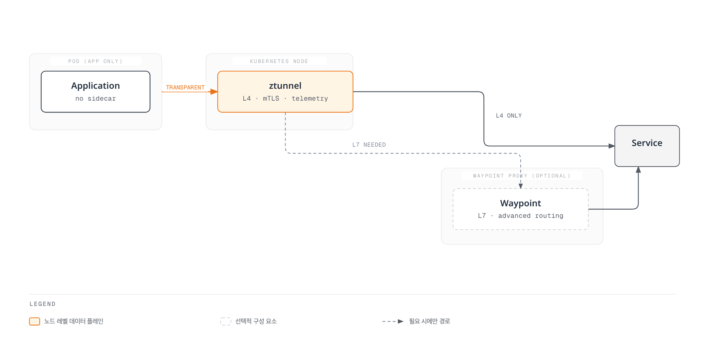
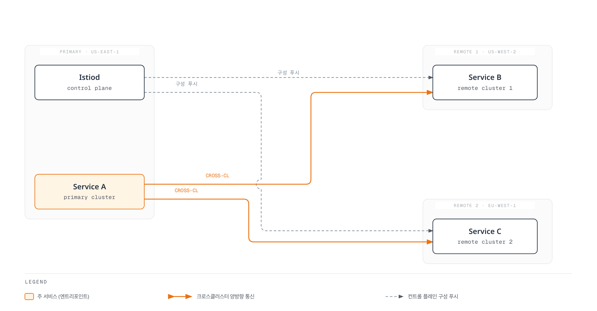
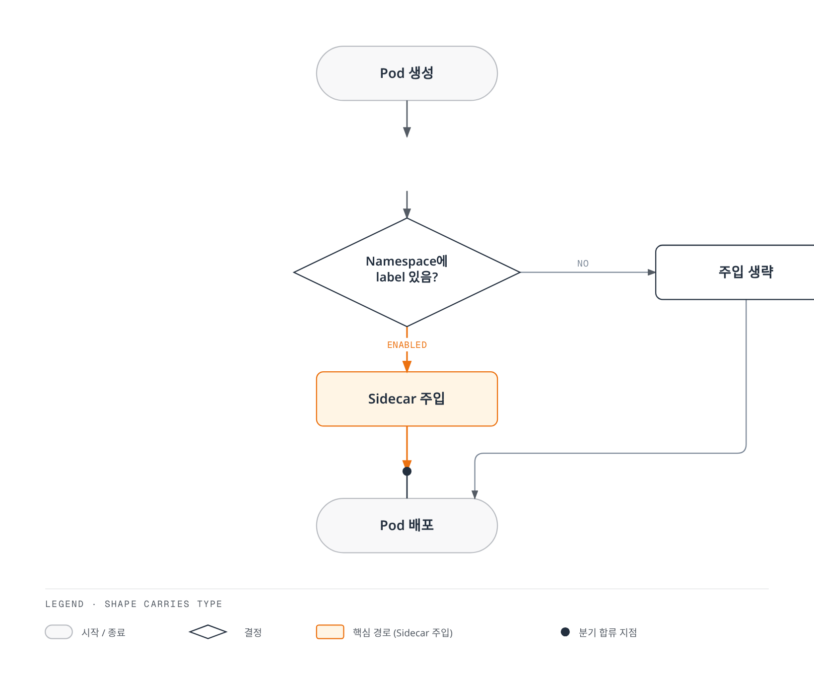
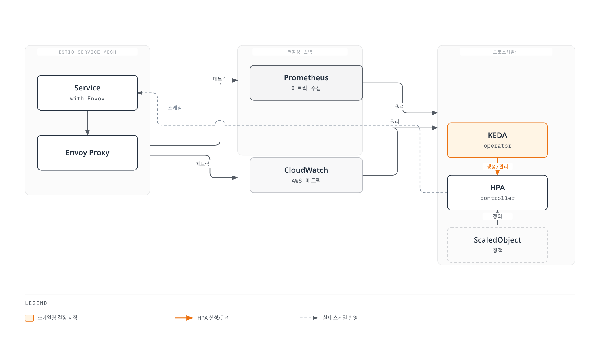

# Advanced

Istio의 고급 기능들을 다룹니다. 이 섹션에서는 Ambient Mode, Multi-cluster, EnvoyFilter, gRPC/WebSocket 지원 등 고급 주제들을 다룹니다.

## 목차

1. [Ambient Mode](01-ambient-mode.md)
2. [Multi-cluster](02-multi-cluster.md)
3. [EnvoyFilter](03-envoy-filter.md)
4. [DNS Caching](04-dns-cache.md)
5. [gRPC](05-grpc.md)
6. [WebSocket](06-websocket.md)
7. [Sidecar Injection](07-sidecar-injection.md)
8. [Argo Rollouts Integration](08-argo-rollouts.md)
9. [Zone-Aware Argo Rollouts](09-zone-aware-argo-rollouts.md)
10. [KEDA Autoscaling](10-keda-autoscaling.md)

## 개요

이 섹션은 Istio의 고급 기능과 프로덕션 환경에서 필요한 심화 주제들을 다룹니다.

### 주요 주제



## 1. Ambient Mode

Istio 1.28+에서 도입된 새로운 데이터 플레인 아키텍처입니다.

### Sidecar Mode vs Ambient Mode

| 특성 | Sidecar Mode | Ambient Mode |
|------|-------------|--------------|
| **아키텍처** | 각 파드에 Envoy 프록시 주입 | ztunnel (node-level) + waypoint (optional) |
| **리소스 사용** | 높음 (파드당 프록시) | 낮음 (노드당 프록시) |
| **배포 복잡도** | 높음 (재배포 필요) | 낮음 (투명하게 적용) |
| **성능** | 약간 느림 (hop 추가) | 빠름 (L4만 필요 시) |
| **기능** | 모든 기능 지원 | L4 기본, L7은 waypoint 필요 |

### Ambient Mode 아키텍처



**자세한 내용**: [Ambient Mode 상세 가이드](01-ambient-mode.md)

## 2. Multi-cluster

여러 Kubernetes 클러스터를 하나의 서비스 메시로 연결합니다.

### Multi-cluster 토폴로지



**사용 사례**:
- 다중 리전 배포
- 재해 복구 (DR)
- Blue/Green 클러스터 배포
- 환경 분리 (dev/staging/prod)

**자세한 내용**: [Multi-cluster 설정 가이드](02-multi-cluster.md)

## 3. EnvoyFilter

Envoy 프록시 구성을 직접 커스터마이즈합니다.

### EnvoyFilter 사용 사례

```yaml
# 커스텀 헤더 추가
apiVersion: networking.istio.io/v1alpha3
kind: EnvoyFilter
metadata:
  name: custom-header
spec:
  workloadSelector:
    labels:
      app: myapp
  configPatches:
  - applyTo: HTTP_FILTER
    match:
      context: SIDECAR_OUTBOUND
    patch:
      operation: INSERT_BEFORE
      value:
        name: envoy.filters.http.lua
        typed_config:
          "@type": type.googleapis.com/envoy.extensions.filters.http.lua.v3.Lua
          inline_code: |
            function envoy_on_request(request_handle)
              request_handle:headers():add("x-custom-header", "value")
            end
```

**주요 사용 사례**:
- Rate Limiting
- 커스텀 인증/권한 부여
- 헤더 조작
- 요청/응답 변환
- WASM 플러그인

**자세한 내용**: [EnvoyFilter 가이드](03-envoy-filter.md)

## 4. DNS Caching

DNS 조회를 캐싱하여 성능을 최적화합니다.

```yaml
apiVersion: networking.istio.io/v1
kind: DestinationRule
metadata:
  name: dns-cache
spec:
  host: external-api.example.com
  trafficPolicy:
    connectionPool:
      tcp:
        maxConnections: 100
      http:
        http1MaxPendingRequests: 100
```

**이점**:
- DNS 조회 지연시간 감소
- 외부 DNS 서버 부하 감소
- 일관된 DNS 응답

**자세한 내용**: [DNS Caching 가이드](04-dns-cache.md)

## 5. gRPC 지원

gRPC 프로토콜을 위한 최적화된 라우팅과 로드 밸런싱을 제공합니다.

```yaml
apiVersion: networking.istio.io/v1
kind: VirtualService
metadata:
  name: grpc-service
spec:
  hosts:
  - grpc-service
  http:
  - match:
    - uri:
        prefix: /mypackage.MyService/
    route:
    - destination:
        host: grpc-service
        subset: v2
```

**주요 기능**:
- HTTP/2 기반 로드 밸런싱
- gRPC 헬스 체크
- Deadlines 및 Retries
- 메타데이터 기반 라우팅

**자세한 내용**: [gRPC 가이드](05-grpc.md)

## 6. WebSocket 지원

WebSocket 연결을 위한 특별한 처리를 제공합니다.

```yaml
apiVersion: networking.istio.io/v1
kind: VirtualService
metadata:
  name: websocket-service
spec:
  hosts:
  - ws.example.com
  http:
  - match:
    - headers:
        upgrade:
          exact: websocket
    route:
    - destination:
        host: websocket-service
```

**주요 기능**:
- 장시간 연결 유지
- Connection Pool 설정
- Idle Timeout 관리

**자세한 내용**: [WebSocket 가이드](06-websocket.md)

## 7. Sidecar Injection

Sidecar 프록시 주입 메커니즘과 커스터마이제이션을 다룹니다.

### Injection 방식



**자세한 내용**: [Sidecar Injection 가이드](07-sidecar-injection.md)

## 8. Argo Rollouts Integration

Argo Rollouts와 Istio를 통합하여 고급 배포 전략을 구현합니다.

```yaml
apiVersion: argoproj.io/v1alpha1
kind: Rollout
metadata:
  name: myapp
spec:
  strategy:
    canary:
      trafficRouting:
        istio:
          virtualService:
            name: myapp-vsvc
            routes:
            - primary
      steps:
      - setWeight: 10
      - pause: {duration: 2m}
      - setWeight: 50
      - pause: {duration: 2m}
```

**주요 기능**:
- 메트릭 기반 자동 Canary 배포
- Analysis 및 자동 롤백
- Blue/Green 배포
- Progressive Delivery

**자세한 내용**: [Argo Rollouts 통합 가이드](08-argo-rollouts.md)

## 9. Zone-Aware Argo Rollouts

Zone을 인식하여 가용 영역별로 Canary 배포를 수행합니다.

**자세한 내용**: [Zone-Aware Argo Rollouts 가이드](09-zone-aware-argo-rollouts.md)

## 10. KEDA Autoscaling

KEDA를 활용하여 Istio 메트릭 기반 오토스케일링을 구현합니다.

### KEDA vs HPA

| 기능 | Kubernetes HPA | KEDA |
|------|---------------|------|
| **메트릭 소스** | CPU/Memory + Custom Metrics | 60+ Scaler (Prometheus, CloudWatch, Kafka 등) |
| **Scale to Zero** | ❌ 미지원 (최소 1) | ✅ 지원 (Pod 0개 가능) |
| **외부 메트릭** | ⚠️ Metrics Server 필요 | ✅ 네이티브 지원 |
| **복잡한 쿼리** | ❌ 제한적 | ✅ PromQL, CloudWatch Insights |

### KEDA 아키텍처



### 주요 스케일링 전략

```yaml
# RPS 기반 스케일링
apiVersion: keda.sh/v1alpha1
kind: ScaledObject
metadata:
  name: reviews-rps-scaler
spec:
  scaleTargetRef:
    name: reviews
  triggers:
  - type: prometheus
    metadata:
      query: |
        sum(rate(istio_requests_total{
          destination_workload="reviews"
        }[1m]))
      threshold: '100'
```

**스케일링 메트릭**:
- **RPS (Requests Per Second)**: 초당 요청 수 기반
- **Latency (P50/P95/P99)**: 지연 시간 백분위수 기반
- **Error Rate**: 5xx 에러율 기반
- **Circuit Breaker**: Circuit Breaker 상태 기반
- **Composite Metrics**: 복합 메트릭 조합

**메트릭 소스**:
- **Prometheus**: 실시간 Istio/Envoy 메트릭
- **AWS CloudWatch**: ADOT Collector를 통한 CloudWatch 메트릭

**자세한 내용**: [KEDA Autoscaling 가이드](10-keda-autoscaling.md)

## 학습 순서

1. **[Ambient Mode](01-ambient-mode.md)** - 새로운 아키텍처 이해
2. **[Multi-cluster](02-multi-cluster.md)** - 다중 클러스터 구성
3. **[EnvoyFilter](03-envoy-filter.md)** - 고급 커스터마이제이션
4. **[Sidecar Injection](07-sidecar-injection.md)** - Injection 메커니즘
5. **[gRPC](05-grpc.md)** - gRPC 프로토콜 지원
6. **[WebSocket](06-websocket.md)** - WebSocket 지원
7. **[DNS Caching](04-dns-cache.md)** - 성능 최적화
8. **[Argo Rollouts](08-argo-rollouts.md)** - Progressive Delivery
9. **[Zone-Aware Argo Rollouts](09-zone-aware-argo-rollouts.md)** - 가용 영역별 배포
10. **[KEDA Autoscaling](10-keda-autoscaling.md)** - 메트릭 기반 오토스케일링

## 참고 자료

- [Istio Advanced Features](https://istio.io/latest/docs/ops/)
- [Ambient Mode Documentation](https://istio.io/latest/docs/ops/ambient/)
- [Multi-cluster Documentation](https://istio.io/latest/docs/setup/install/multicluster/)
- [EnvoyFilter Reference](https://istio.io/latest/docs/reference/config/networking/envoy-filter/)

## 퀴즈

이 장에서 배운 내용을 테스트하려면 [Istio Advanced 퀴즈](../../../quizzes/service-mesh/istio/advanced.md)를 풀어보세요.
