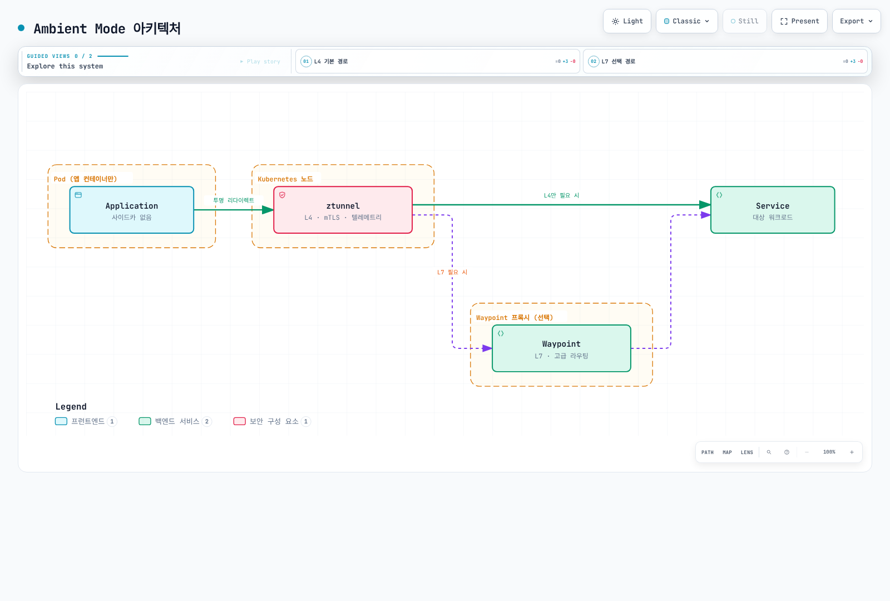
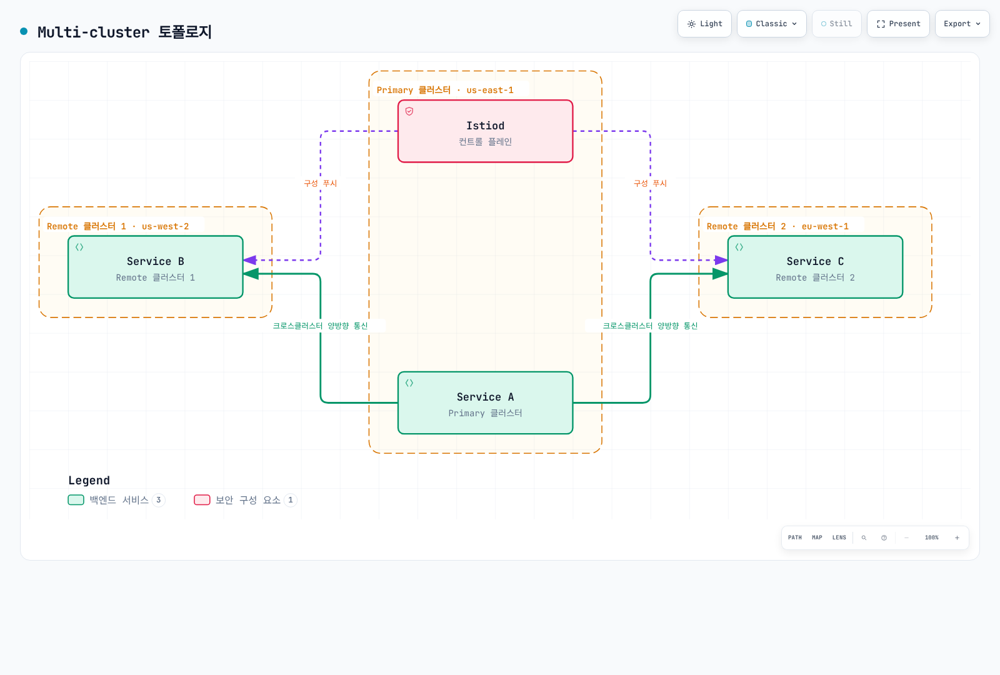
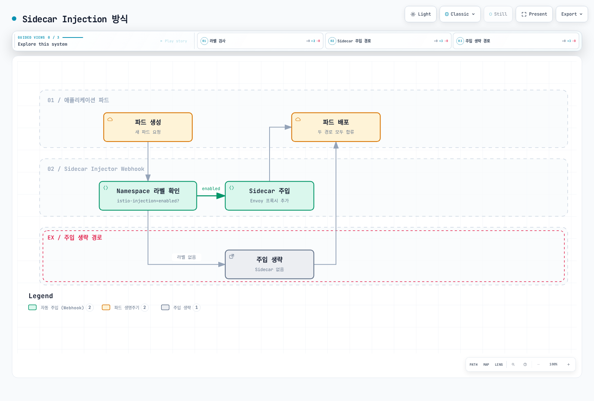
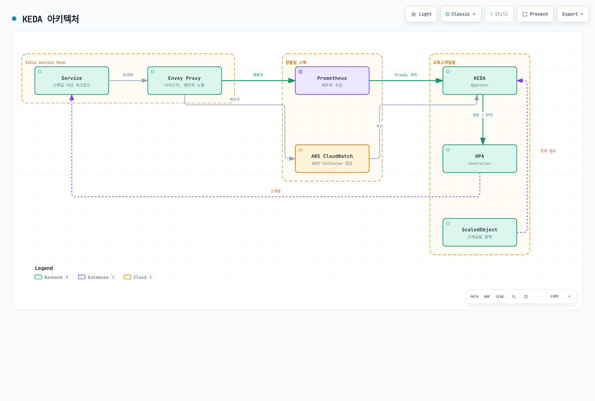

# Advanced

> **검토일**: 2026년 9월 11일 · Istio1.31. 독립적인 예제이며 지정한 workload·Service·controller가 있다고 가정합니다. 설치·호환성·검증은 상세 장을 따르며 운영에서 검증된 전체 스택이 아닙니다.

Istio의 고급 기능들을 다룹니다. 이 섹션에서는 Ambient Mode, Multi-cluster, EnvoyFilter, gRPC/WebSocket 지원 등 고급 주제들을 다룹니다.

## 목차

1. [Ambient Mode](01-ambient-mode.md)
2. [Multi-cluster](02-multi-cluster.md)
3. [EnvoyFilter](03-envoy-filter.md)
4. [DNS Caching](04-dns-cache.md)
5. [gRPC](05-grpc.md)
6. [WebSocket](06-websocket.md)
7. [Sidecar Injection](07-sidecar-injection.md)
8. [Argo Rollouts Integration](08-argo-rollouts.md)
9. [Zone-Aware Argo Rollouts](09-zone-aware-argo-rollouts.md)
10. [KEDA Autoscaling](10-keda-autoscaling.md)

## 개요

이 섹션은 Istio의 고급 기능과 프로덕션 환경에서 필요한 심화 주제들을 다룹니다.

### 주요 주제

배포 모드·프로토콜 routing·커스터마이즈·rollout 제어·autoscaling은 관련되지만 별도의 선택입니다. EnvoyFilter는 Rust 기반 ztunnel을 설정하지 않으며 Argo Rollouts의 Istio routing이 반드시 앱 sidecar injection에 의존하지도 않습니다.

## 1. Ambient Mode

Ambient는 Istio1.18에서 alpha로 처음 제공되어1.24에서 GA가 되었습니다. Node 수준의 L4 secure overlay와 선택적인 waypoint L7 처리를 분리합니다.

### Sidecar Mode vs Ambient Mode

| 특성 | Sidecar Mode | Ambient Mode |
|------|-------------|--------------|
| **아키텍처** | 각 파드에 Envoy 프록시 주입 | ztunnel (node-level) + waypoint (optional) |
| **리소스 모델** | Pod별 Envoy 할당 | 공유 ztunnel·필요한 waypoint 할당; 전체 사용량 실측 |
| **등록** | 주입에는 보통 새 Pod 생성 필요 | CNI/ztunnel 전제의 레이블 등록; waypoint 등록은 별도 |
| **성능** | 프록시·workload 설정에 의존 | 경로·waypoint·용량에 의존하며 항상 빠르지는 않음 |
| **기능** | 성숙한 L4/L7 기능 | L4 기본·L7은 waypoint 필요; 릴리스별 지원 확인 |

### Ambient Mode 아키텍처



[🔍 인터랙티브 다이어그램 보기](https://www.atomai.click/kubernetes-docs/archmaps/ko-service-mesh-istio-advanced-readme-1.html)

구조 그림은 개념도입니다. Resource를 waypoint에 등록해야 하며 설정한 범위의 트래픽이 이를 통과합니다. Ztunnel이 HTTP를 검사해 요청마다 L7 필요 여부를 고르는 것은 아닙니다.

**자세한 내용**: [Ambient Mode 상세 가이드](01-ambient-mode.md)

## 2. Multi-cluster

여러 Kubernetes 클러스터를 하나의 서비스 메시로 연결합니다.

### Multi-cluster 토폴로지



[🔍 인터랙티브 다이어그램 보기](https://www.atomai.click/kubernetes-docs/archmaps/ko-service-mesh-istio-advanced-readme-2.html)

**사용 사례**:
- 다중 리전 배포
- 재해 복구 (DR)
- Blue/Green 클러스터 배포
- 필요한 환경 간 연결; 격리에는 별도 신원·네트워크·권한 경계 필요

그림은 연결을 전제한 primary/remote 구성입니다. Multi-primary 대안도 있으며 서로 다른 네트워크에는 east-west gateway/routing·신뢰 구성이 필요합니다. 연결만으로 DR·환경 격리가 구현되지는 않습니다.

**자세한 내용**: [Multi-cluster 설정 가이드](02-multi-cluster.md)

## 3. EnvoyFilter

Envoy 프록시 구성을 직접 커스터마이즈합니다.

### EnvoyFilter 사용 사례

요구를 표현할 수 있으면 VirtualService headers·AuthorizationPolicy·WasmPlugin 같은 API를 우선합니다. Lua 예제는 버전에 민감한 sidecar 확장이며 일반적인 ambient 설정·인증 시스템이 아닙니다.


```yaml
apiVersion: networking.istio.io/v1alpha3
kind: EnvoyFilter
metadata:
  name: custom-header
  namespace: default
spec:
  workloadSelector:
    labels:
      app: myapp
  configPatches:
  - applyTo: HTTP_FILTER
    match:
      context: SIDECAR_OUTBOUND
      listener:
        filterChain:
          filter:
            name: envoy.filters.network.http_connection_manager
            subFilter:
              name: envoy.filters.http.router
    patch:
      operation: INSERT_BEFORE
      value:
        name: envoy.filters.http.lua
        typed_config:
          '@type': type.googleapis.com/envoy.extensions.filters.http.lua.v3.Lua
          default_source_code:
            inline_string: "function envoy_on_request(request_handle)\n  request_handle:headers():replace(\"x-custom-header\", \"value\")\nend\n"
```

**주요 사용 사례**:
- Rate Limiting
- 커스텀 인증/권한 부여
- 헤더 조작
- 요청/응답 변환
- WASM 플러그인

**자세한 내용**: [EnvoyFilter 가이드](03-envoy-filter.md)

## 4. DNS Caching

Istio DNS proxy는 앱 DNS 질의를 캡처해 mesh/service entry 정보를 로컬에서 응답할 수 있습니다. DestinationRule connection pool은 DNS 캐싱을 켜지 않습니다. 다음 Pod-template 조각을 병합한 뒤 새 sidecar Pod를 생성합니다:

```yaml
spec:
  template:
    metadata:
      annotations:
        proxy.istio.io/config: "proxyMetadata:\n  ISTIO_META_DNS_CAPTURE: \"true\"\n"
```

**이점**:
- DNS 조회 지연시간 감소
- 외부 DNS 서버 부하 감소
- Discovery·TTL·갱신 동작을 따르는 registry 기반 응답

Sidecar DNS capture는 opt-in이고 ambient는1.25부터 기본으로 DNS proxy를 켭니다. Capture·registry 주소 할당·upstream DNS 갱신은 별도 동작이며 영구히 같은 응답이나 모든 외부 질의 제거를 보장하지 않습니다.

**자세한 내용**: [DNS Caching 가이드](04-dns-cache.md)

## 5. gRPC 지원

gRPC는 HTTP/2 routing을 사용합니다. `grpc-service` Service의 gRPC 이름 포트9090·`version: v2` ready Pod를 전제합니다. RPC는 본질적으로 멱등하지 않으므로 여기서는 mesh retry를 명시적으로 끄며 client deadline/context 전파는 별도로 필요합니다.

```yaml
apiVersion: networking.istio.io/v1
kind: VirtualService
metadata:
  name: grpc-service
  namespace: default
spec:
  hosts:
  - grpc-service
  http:
  - match:
    - uri:
        prefix: /mypackage.MyService/
    route:
    - destination:
        host: grpc-service
        subset: v2
        port:
          number: 9090
    retries:
      attempts: 0
  - route:
    - destination:
        host: grpc-service
        port:
          number: 9090
    retries:
      attempts: 0
---
apiVersion: networking.istio.io/v1
kind: DestinationRule
metadata:
  name: grpc-service
  namespace: default
spec:
  host: grpc-service
  subsets:
  - name: v2
    labels:
      version: v2
```

**주요 기능**:
- HTTP/2 기반 로드 밸런싱
- 명시적으로 구성한 애플리케이션 health protocol/Kubernetes probe
- Deadlines 및 Retries
- 메타데이터 기반 라우팅

**자세한 내용**: [gRPC 가이드](05-grpc.md)

## 6. WebSocket 지원

Istio는 HTTP WebSocket upgrade를 지원합니다. `default`에 `ws.example.com`용 `my-gateway`가 있고 HTTP8080 backend Service가 `/ws`를 제공한다고 가정합니다. 대소문자를 구분하는 정확한 Upgrade 헤더 매칭은 필요하지 않습니다.

```yaml
apiVersion: networking.istio.io/v1
kind: VirtualService
metadata:
  name: websocket-service
  namespace: default
spec:
  hosts:
  - ws.example.com
  http:
  - match:
    - uri:
        prefix: /ws
    route:
    - destination:
        host: websocket-service
        port:
          number: 8080
    retries:
      attempts: 0
  gateways:
  - my-gateway
```

**주요 기능**:
- 장시간 연결 유지
- Connection Pool 설정
- Idle Timeout 관리

예제는 Istio에서 기본 비활성화된 HTTP route timeout을 생략합니다. LB/proxy/앱의 모든 idle·최대 연결 기간 제한이 꺼지는 것은 아닙니다. Rollout의 연결 drain·재연결도 설계합니다.

**자세한 내용**: [WebSocket 가이드](06-websocket.md)

## 7. Sidecar Injection

Sidecar 프록시 주입 메커니즘과 커스터마이제이션을 다룹니다.

### Injection 방식



[🔍 인터랙티브 다이어그램 보기](https://www.atomai.click/kubernetes-docs/archmaps/ko-service-mesh-istio-advanced-readme-3.html)

그림은 단순 namespace-label 분기만 보여줍니다. 실제 주입은 Pod 레이블·revision/webhook selector·제외 조건·sidecar lifecycle에도 달려 있으며 namespace 레이블 변경만으로 실행 중인 Pod에 주입되지는 않습니다.

**자세한 내용**: [Sidecar Injection 가이드](07-sidecar-injection.md)

## 8. Argo Rollouts Integration

다음은 selector·Pod template·container가 있는 완전한 Rollout에 넣는 **strategy 조각**입니다. Controller·stable/canary Service와 일치하는 목적지를 가진 VirtualService `primary` route도 필요합니다. 분석·자동 rollback에는 별도 AnalysisTemplate·정책이 필요하며 steps만으로 메트릭 분석이 설정되지는 않습니다. 의도한 Istio routing 경로에서 처리하는 트래픽에만 가중치가 적용됩니다.

```yaml
spec:
  strategy:
    canary:
      trafficRouting:
        istio:
          virtualService:
            name: myapp-vsvc
            routes:
            - primary
      steps:
      - setWeight: 10
      - pause:
          duration: 2m
      - setWeight: 50
      - pause:
          duration: 2m
      stableService: myapp-stable
      canaryService: myapp-canary
```

**주요 기능**:
- 메트릭 기반 자동 Canary 배포
- Analysis 및 자동 롤백
- Blue/Green 배포
- Progressive Delivery

**자세한 내용**: [Argo Rollouts 통합 가이드](08-argo-rollouts.md)

## 9. Zone-Aware Argo Rollouts

Zone을 인식하여 가용 영역별로 Canary 배포를 수행합니다.

**자세한 내용**: [Zone-Aware Argo Rollouts 가이드](09-zone-aware-argo-rollouts.md)

## 10. KEDA Autoscaling

KEDA를 활용하여 Istio 메트릭 기반 오토스케일링을 구현합니다.

### KEDA vs HPA

| 구분 | Kubernetes HPA | KEDA |
|---|---|---|
|메트릭 입력|Resource/custom/external metrics API|Scaler가 backend 메트릭을 HPA에 제공|
|Scaling 역할|Replica 조정, 보통 minReplicas1|활성/비활성화와1→N용 HPA 관리|
|외부 메트릭|External-metrics adapter 필요|자체 metrics API adapter 제공|
|쿼리 로직|수치 메트릭 소비|Scaler에 따라 PromQL·CloudWatch metric/math/Metrics Insights 쿼리|

Metrics Server는 resource 메트릭 제공자이며 일반적인 external-metrics adapter가 아닙니다. KEDA2.20은 Kubernetes≥1.30이 필요하며 Istio와 별개로 선택 릴리스·API·platform 지원을 확인합니다. Scale-to-zero에는0에서도 관측되는 신호·정상 활성화 경로가 필요합니다. CloudWatch Metrics Insights와 Logs Insights는 다릅니다.

### KEDA 아키텍처



[🔍 인터랙티브 다이어그램 보기](https://www.atomai.click/kubernetes-docs/archmaps/ko-service-mesh-istio-advanced-readme-4.html)

### 주요 스케일링 전략

KEDA2.20 API 예제는 `default`의 실제 `reviews` Deployment·수집된 destination-workload 메트릭·접근 가능한 private Prometheus endpoint를 전제합니다. Backend에 맞는 인증/TLS를 구성합니다. 하나의 집계 값을 반환하고 AverageValue로 replica당100 요청/s를 목표로 합니다.


```yaml
apiVersion: keda.sh/v1alpha1
kind: ScaledObject
metadata:
  name: reviews-rps-scaler
  namespace: default
spec:
  scaleTargetRef:
    name: reviews
  triggers:
  - type: prometheus
    metadata:
      query: sum(rate(istio_requests_total{reporter="destination",destination_workload="reviews",destination_workload_namespace="default"}[1m]))
      threshold: '100'
      serverAddress: http://prometheus.istio-system.svc.cluster.local:9090
      ignoreNullValues: 'false'
    metricType: AverageValue
  minReplicaCount: 1
  maxReplicaCount: 10
```

대상 Pod가0이면 destination 트래픽 메트릭도 없어지므로 최소1을 유지합니다. 이 예제는0에서 스스로 활성화되지 않습니다. `ignoreNullValues: false`는 빈 결과를 오류로 처리해 관측 손실을 조용히0으로 간주하지 않습니다. 같은 workload에 경쟁하는 HPA를 붙이지 않습니다. 지연·오류 비율·breaker gauge는 replica 용량과 선형 관계가 아니므로 임의 신호로 추가하지 말고 제어 동작을 검증합니다.

**스케일링 메트릭**:
- **RPS (Requests Per Second)**: 초당 요청 수 기반
- **Latency (P50/P95/P99)**: 지연 시간 백분위수 기반
- **Error Rate**: 5xx 에러율 기반
- **Circuit Breaker**: Circuit Breaker 상태 기반
- **Composite Metrics**: 복합 메트릭 조합

**메트릭 소스**:
- **Prometheus**: 실시간 Istio/Envoy 메트릭
- **AWS CloudWatch**: ADOT Collector를 통한 CloudWatch 메트릭

**자세한 내용**: [KEDA Autoscaling 가이드](10-keda-autoscaling.md)

## 학습 순서

1. **[Ambient Mode](01-ambient-mode.md)** - 새로운 아키텍처 이해
2. **[Multi-cluster](02-multi-cluster.md)** - 다중 클러스터 구성
3. **[EnvoyFilter](03-envoy-filter.md)** - 고급 커스터마이제이션
4. **[Sidecar Injection](07-sidecar-injection.md)** - Injection 메커니즘
5. **[gRPC](05-grpc.md)** - gRPC 프로토콜 지원
6. **[WebSocket](06-websocket.md)** - WebSocket 지원
7. **[DNS Caching](04-dns-cache.md)** - 성능 최적화
8. **[Argo Rollouts](08-argo-rollouts.md)** - Progressive Delivery
9. **[Zone-Aware Argo Rollouts](09-zone-aware-argo-rollouts.md)** - 가용 영역별 배포
10. **[KEDA Autoscaling](10-keda-autoscaling.md)** - 메트릭 기반 오토스케일링

## 참고 자료

- [Istio Advanced Features](https://istio.io/latest/docs/ops/)
- [Ambient Mode Documentation](https://istio.io/latest/docs/ambient/overview/)
- [Multi-cluster Documentation](https://istio.io/latest/docs/setup/install/multicluster/)
- [EnvoyFilter Reference](https://istio.io/latest/docs/reference/config/networking/envoy-filter/)

## 퀴즈

이 장에서 배운 내용을 테스트하려면 [Istio Advanced 퀴즈](../../../quizzes/service-mesh/istio/advanced.md)를 풀어보세요.
