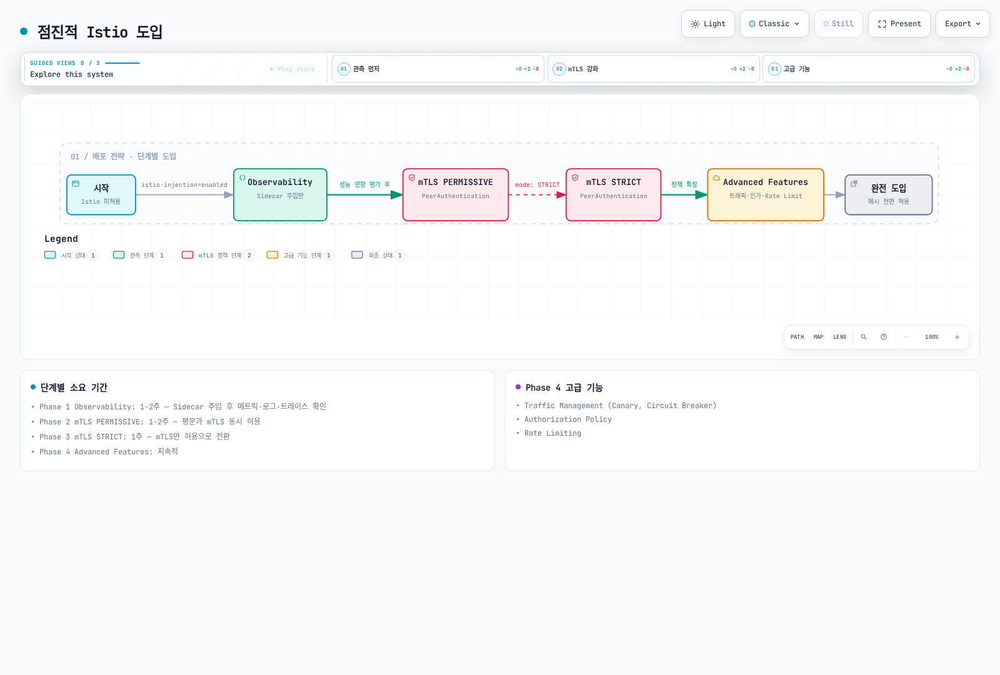

# Istio 모범 사례

프로덕션 환경에서 Istio를 성공적으로 운영하기 위한 모범 사례와 권장 사항을 다룹니다.

## 목차

1. [성능 최적화](#성능-최적화)
2. [보안 강화](#보안-강화)
3. [운영 가이드](#운영-가이드)
4. [모니터링 및 관찰성](#모니터링-및-관찰성)
5. [프로덕션 체크리스트](#프로덕션-체크리스트)

2026-09-11 기준 Istio 1.31을 검토했습니다. `IstioOperator` 발췌는 kubectl로 적용할 리소스가 아니라 `istioctl install -f`의 입력입니다. 기존 설치 설정에 병합하고 Helm에서는 동등한 차트 values를 사용하세요. 대부분 Sidecar 예제이며 Ambient는 waypoint/Gateway API 정책을 사용합니다. 리소스 값과 도입 기간은 부하 검증할 시작점입니다.

## 성능 최적화

### 1. Control Plane 리소스 최적화

```yaml
apiVersion: install.istio.io/v1alpha1
kind: IstioOperator
spec:
  components:
    pilot:
      k8s:
        resources:
          requests:
            cpu: 500m
            memory: 2Gi
          limits:
            cpu: 1000m
            memory: 4Gi
        hpaSpec:
          minReplicas: 2
          maxReplicas: 5
          metrics:
          - type: Resource
            resource:
              name: cpu
              target:
                type: Utilization
                averageUtilization: 80
```

**권장 사항**:
- Istiod는 최소 2개 이상의 replicas
- CPU: 클러스터 크기에 따라 조정
- 메모리: 서비스·프록시 수, 구성 크기, 변경률을 측정하며 고정된 서비스당 공식은 없음

### 2. Data Plane 리소스 최적화

```yaml
apiVersion: v1
kind: Pod
metadata:
  name: myapp
  labels:
    sidecar.istio.io/inject: "true"
  annotations:
    # Sidecar 리소스 최적화
    sidecar.istio.io/proxyCPU: "100m"
    sidecar.istio.io/proxyMemory: "128Mi"
    sidecar.istio.io/proxyCPULimit: "200m"
    sidecar.istio.io/proxyMemoryLimit: "256Mi"
spec:
  containers:
  - name: myapp
    image: myapp:latest
```

**권장 사항**:
- 일반 워크로드: CPU 100m, Memory 128Mi
- 고트래픽 워크로드: CPU 500m, Memory 512Mi
- Sidecar 동시성: 일반적으로 설정하지 않아 CPU requests/limits에 맞게 스레드 수가 결정되도록 함

### 3. Connection Pool 최적화

```yaml
apiVersion: networking.istio.io/v1
kind: DestinationRule
metadata:
  name: optimized-pool
spec:
  host: myapp
  trafficPolicy:
    connectionPool:
      tcp:
        maxConnections: 100
        connectTimeout: 30ms
      http:
        http1MaxPendingRequests: 50
        http2MaxRequests: 100
        maxRequestsPerConnection: 0
        idleTimeout: 300s
```

**권장 사항**:
- `maxConnections`: 워크로드 동시 연결 수 고려
- `maxRequestsPerConnection`: 0은 무제한이며 작은 값은 연결 재생성과 TLS 핸드셰이크를 늘림
- `idleTimeout`: 장시간 연결 필요 시 증가

### 4. Locality Load Balancing

```yaml
apiVersion: networking.istio.io/v1
kind: DestinationRule
metadata:
  name: locality-lb
spec:
  host: myapp
  trafficPolicy:
    loadBalancer:
      localityLbSetting:
        enabled: true
        distribute:
        - from: us-east-1/us-east-1a/*
          to:
            "us-east-1/us-east-1a/*": 80  # 같은 AZ 우선
            "us-east-1/us-east-1b/*": 20
    outlierDetection:
      consecutive5xxErrors: 5
      interval: 5s
      baseEjectionTime: 30s
```

**이점**:
- 크로스 AZ 트래픽 감소 가능; 절감 효과는 트래픽 분포와 과금에 따라 다름
- 네트워크 지연시간 감소
- Outlier Detection과 다른 AZ의 정상 용량을 함께 검증해 장애 처리

### 5. Sidecar Scope 제한

```yaml
apiVersion: networking.istio.io/v1
kind: Sidecar
metadata:
  name: default
  namespace: default
spec:
  egress:
  - hosts:
    - "default/*"
    - "istio-system/*"
```

**이점**:
- Envoy 구성 크기 감소
- 메모리 사용량 감소
- 구성 푸시 속도 향상

## 보안 강화

### 1. Strict mTLS 적용

```yaml
apiVersion: security.istio.io/v1
kind: PeerAuthentication
metadata:
  name: default
  namespace: istio-system
spec:
  mtls:
    mode: STRICT  # 프로덕션은 STRICT 권장
```

**체크리스트**:
- ✅ 모든 서비스에 STRICT mTLS 적용
- ✅ PERMISSIVE는 마이그레이션 기간에만 사용
- ✅ PeerAuthentication은 워크로드 인바운드 mTLS를 제어합니다. 외부 HTTPS/TLS는 ServiceEntry와 필요 시 DestinationRule로 구성하며 메시 mTLS를 전역 해제하지 않습니다.

### 2. Authorization Policy

```yaml
# Deny by default
apiVersion: security.istio.io/v1
kind: AuthorizationPolicy
metadata:
  name: deny-all
  namespace: default
spec: {}  # 모든 요청 거부
---
# Allow specific
apiVersion: security.istio.io/v1
kind: AuthorizationPolicy
metadata:
  name: allow-frontend
  namespace: default
spec:
  selector:
    matchLabels:
      app: backend
  action: ALLOW
  rules:
  - from:
    - source:
        principals: ["cluster.local/ns/default/sa/frontend"]
```

**모범 사례**:
- Deny-by-default 정책 사용
- 최소 권한 원칙 적용
- Service Account 기반 인증
- Namespace 격리

### 3. Egress 트래픽 제어

```yaml
# 미등록 목적지 탐지; Egress 방화벽이 아님
apiVersion: install.istio.io/v1alpha1
kind: IstioOperator
spec:
  meshConfig:
    outboundTrafficPolicy:
      mode: REGISTRY_ONLY  # 알려진 Kubernetes 서비스와 ServiceEntry
```

아래 ServiceEntry는 별도로 kubectl로 적용합니다. Egress 격리는 네트워크 정책으로 집행하며 REGISTRY_ONLY는 보안 경계가 아닙니다.

```yaml
# 허용된 외부 서비스
apiVersion: networking.istio.io/v1
kind: ServiceEntry
metadata:
  name: external-api
spec:
  hosts:
  - api.external.com
  ports:
  - number: 443
    name: https
    protocol: HTTPS
  location: MESH_EXTERNAL
  resolution: DNS
```

### 4. JWT 인증

```yaml
apiVersion: security.istio.io/v1
kind: RequestAuthentication
metadata:
  name: jwt-auth
spec:
  selector:
    matchLabels:
      app: api-service
  jwtRules:
  - issuer: "https://auth.example.com"
    jwksUri: "https://auth.example.com/.well-known/jwks.json"
---
apiVersion: security.istio.io/v1
kind: AuthorizationPolicy
metadata:
  name: require-jwt
spec:
  selector:
    matchLabels:
      app: api-service
  action: ALLOW
  rules:
  - when:
    - key: request.auth.claims[iss]
      values: ["https://auth.example.com"]
```

## 운영 가이드

### 1. 배포 전략

#### 점진적 Istio 도입



[🔍 인터랙티브 다이어그램 보기](https://www.atomai.click/kubernetes-docs/archmaps/ko-service-mesh-istio-best-practices-0.html)

**Phase 1: Observability (1-2주)**
```bash
# Sidecar 주입만 활성화
kubectl label namespace default istio-injection=enabled --overwrite
kubectl rollout restart deployment -n default

# 메트릭, 로그, 트레이스 확인
# 성능 영향 평가
```

**Phase 2: mTLS PERMISSIVE (1-2주)**
```yaml
# PERMISSIVE 모드 활성화
apiVersion: security.istio.io/v1
kind: PeerAuthentication
metadata:
  name: default
spec:
  mtls:
    mode: PERMISSIVE
```

**Phase 3: mTLS STRICT (1주)**
```yaml
# STRICT 모드로 전환
apiVersion: security.istio.io/v1
kind: PeerAuthentication
metadata:
  name: default
spec:
  mtls:
    mode: STRICT
```

**Phase 4: Advanced Features (지속적)**
- Traffic Management (Canary, Circuit Breaker)
- Authorization Policy
- Rate Limiting

### 2. 업그레이드 전략

#### Canary Upgrade

설치 가이드의 대상 버전 1.31.0 istioctl 바이너리를 사용하세요. revision 이름만으로 이미지 버전이 선택되지는 않습니다. 아래는 1.30.4에서 기존 설치 설정을 보존하며 업그레이드하는 예시로 각 단계 검증이 필요합니다. default 프로필의 게이트웨이는 in-place로 변경될 수 있으므로 별도 롤아웃을 계획하세요. Helm 설치는 Helm 업그레이드 절차를 사용합니다.

```bash
# 1. 새 버전 Control Plane 설치
istioctl install --set revision=1-31-0 -f existing-install.yaml

# 2. 테스트 네임스페이스 이동
kubectl label namespace test istio-injection- istio.io/rev=1-31-0 --overwrite
kubectl rollout restart deployment -n test

# 3. 검증 후 프로덕션 이동
kubectl label namespace prod istio-injection- istio.io/rev=1-31-0 --overwrite
kubectl rollout restart deployment -n prod

# 4. 이전 버전 제거
istioctl proxy-status
# Only after every proxy/gateway has migrated; substitute the actual old revision
istioctl uninstall --revision=1-30-4
```

### 3. High Availability

```yaml
# Control Plane HA
apiVersion: install.istio.io/v1alpha1
kind: IstioOperator
spec:
  components:
    pilot:
      k8s:
        hpaSpec:
          minReplicas: 3
          maxReplicas: 5
        affinity:
          podAntiAffinity:
            preferredDuringSchedulingIgnoredDuringExecution:
            - weight: 100
              podAffinityTerm:
                labelSelector:
                  matchLabels:
                    app: istiod
                topologyKey: topology.kubernetes.io/zone
```

**권장 사항**:
- Istiod: 최소 3개 replica
- 각 AZ에 고르게 분산
- PodDisruptionBudget 설정

### 4. 백업 및 복구

```bash
# Preserve the versioned installation input in source control
cp existing-install.yaml istio-install-backup.yaml
# Snapshot mesh configuration; this does not include Secrets or Gateway API resources
kubectl get virtualservices.networking.istio.io,destinationrules.networking.istio.io,gateways.networking.istio.io,serviceentries.networking.istio.io,sidecars.networking.istio.io,workloadentries.networking.istio.io,workloadgroups.networking.istio.io,peerauthentications.security.istio.io,requestauthentications.security.istio.io,authorizationpolicies.security.istio.io,telemetries.telemetry.istio.io -A -o yaml > istio-config-backup.yaml

# Restore the matching Istio version and CRDs first, then declarative resources
istioctl install -f istio-install-backup.yaml
kubectl apply -f istio-config-backup.yaml
```

Helm 설치는 차트 버전과 `helm get values <release> -n <namespace> -o yaml` 결과를 보존하세요. CA/TLS Secret은 안전하게 백업하고 사용 중인 Gateway API, EnvoyFilter, WasmPlugin 리소스도 포함하세요. 복구 전에 필요한 네임스페이스를 생성하고 스냅샷을 검토하세요.

## 모니터링 및 관찰성

### 1. Golden Signals

```promql
# 1. Latency (P50, P95, P99)
histogram_quantile(0.95,
  sum(rate(istio_request_duration_milliseconds_bucket{reporter="destination"}[5m])) by (le)
)

# 2. Traffic (요청 수)
sum(rate(istio_requests_total{reporter="destination"}[5m]))

# 3. Errors (에러율)
sum(rate(istio_requests_total{reporter="destination",response_code=~"5.."}[5m]))
/
sum(rate(istio_requests_total{reporter="destination"}[5m]))

# 4. Saturation (리소스 사용률)
sum(rate(container_cpu_usage_seconds_total{container="istio-proxy"}[5m]))
```

### 2. Control Plane 모니터링

```promql
# Pilot 구성 푸시 시간
histogram_quantile(0.95, sum(rate(pilot_proxy_convergence_time_bucket[5m])) by (le))

# xDS 연결 수
pilot_xds

# 메모리 사용량
process_resident_memory_bytes{job="istiod"}
```

### 3. Data Plane 모니터링

프록시 stats matcher에서 아래 Envoy 통계를 활성화했는지 확인하세요. 스크래핑 job 레이블은 설정에 따라 다르며 예제는 `job="istiod"`를 가정합니다. `up` 경고는 스크래핑 가능 여부를 검사하며 모든 readiness 오류를 탐지하지는 않습니다.

```promql
# Envoy 연결 수
envoy_cluster_upstream_cx_active

# Circuit Breaker 열림
envoy_cluster_circuit_breakers_default_rq_open

# Outlier Detection
envoy_cluster_outlier_detection_ejections_active
```

### 4. Alerting Rules

```yaml
groups:
- name: istio
  rules:
  # High error rate
  - alert: HighErrorRate
    expr: |
      (sum(rate(istio_requests_total{reporter="destination",response_code=~"5.."}[5m]))
      /
      sum(rate(istio_requests_total{reporter="destination"}[5m]))) > 0.05
    for: 5m
    labels:
      severity: warning
    annotations:
      summary: "High error rate detected"

  # High latency
  - alert: HighLatency
    expr: |
      histogram_quantile(0.95,
        sum(rate(istio_request_duration_milliseconds_bucket{reporter="destination"}[5m])) by (le)
      ) > 1000
    for: 5m
    labels:
      severity: warning
    annotations:
      summary: "High latency detected (P95 > 1s)"

  # Pilot not ready
  - alert: IstiodScrapeUnavailable
    expr: up{job="istiod"} == 0 or absent(up{job="istiod"})
    for: 5m
    labels:
      severity: critical
    annotations:
      summary: "Istiod scrape target is unavailable"
```

## 프로덕션 체크리스트

### 설치 전

- [ ] Istio/Kubernetes/EKS 지원 범위 교집합 확인 (1.31 예제: EKS 1.34–1.36)
- [ ] Istio 버전 선택 (안정 버전 권장)
- [ ] 리소스 요구사항 계산
- [ ] 네트워크 정책 확인
- [ ] 백업 및 복구 계획 수립

### 설치

- [ ] 프로덕션 프로파일 사용
- [ ] Control Plane HA 구성 (replica ≥ 3)
- [ ] 리소스 제한 설정
- [ ] PodDisruptionBudget 설정
- [ ] 모니터링 스택 준비

### 보안

- [ ] mTLS STRICT 모드 활성화
- [ ] Authorization Policy 적용
- [ ] Egress 트래픽 제어
- [ ] JWT 인증 설정 (필요 시)
- [ ] Network Policy 통합

### 트래픽 관리

- [ ] VirtualService 구성
- [ ] DestinationRule 구성
- [ ] Circuit Breaker 설정
- [ ] Retry/Timeout 설정
- [ ] Rate Limiting 구성

### 관찰성

- [ ] Prometheus 통합
- [ ] Grafana 대시보드 설정
- [ ] Jaeger/Zipkin 트레이싱
- [ ] Kiali 설치
- [ ] Alerting 룰 설정

### 운영

- [ ] 업그레이드 계획 수립
- [ ] 백업 자동화
- [ ] 문서화
- [ ] On-call 가이드 작성
- [ ] Runbook 준비

### 성능

- [ ] Sidecar 리소스 최적화
- [ ] Connection Pool 튜닝
- [ ] Locality Load Balancing 설정
- [ ] Sidecar Scope 제한
- [ ] 성능 테스트 수행

### 테스트

- [ ] 기능 테스트
- [ ] 성능 테스트
- [ ] 장애 복구 테스트
- [ ] 카오스 엔지니어링
- [ ] 업그레이드 시나리오 테스트

## 일반적인 안티패턴

### ❌ 피해야 할 것들

1. **모든 것을 한번에 도입**
   ```
   ❌ Day 1에 모든 Istio 기능 활성화
   ✅ 점진적으로 기능 추가 (Observability → Security → Traffic Management)
   ```

2. **리소스 제한 없음**
   ```yaml
   ❌ Sidecar에 리소스 제한 없음
   ✅ 적절한 requests/limits 설정
   ```

3. **PERMISSIVE 모드 장기 사용**
   ```
   ❌ PERMISSIVE를 계속 사용
   ✅ 빠르게 STRICT로 전환
   ```

4. **Wildcard match 남용**
   ```yaml
   ❌ hosts: ["*"]  # 모든 서비스
   ✅ hosts: ["myapp.default.svc.cluster.local"]  # 명시적
   ```

5. **모니터링 없이 배포**
   ```
   ❌ 메트릭 확인 없이 프로덕션 배포
   ✅ Golden Signals 모니터링 필수
   ```

## 비용 최적화

- 측정한 Sidecar 리소스 요청량을 ztunnel 및 필요한 waypoint 용량과 비교하세요. 파드 수만으로 고정 절감률을 계산할 수 없습니다.
- 크로스 AZ 바이트와 실제 경로의 현재 AWS 리전 요금을 확인하세요. locality 가중치가 공통 과금 절감률을 뜻하지는 않습니다.
- 불필요한 프록시 구성을 줄이고 대표 부하에서 메모리·푸시 시간 변화를 측정하세요.

## 참고 자료

### 공식 문서
- [Istio Best Practices](https://istio.io/latest/docs/ops/best-practices/)
- [Performance and Scalability](https://istio.io/latest/docs/ops/deployment/performance-and-scalability/)
- [Security Best Practices](https://istio.io/latest/docs/ops/best-practices/security/)

### 커뮤니티
- [Istio community](https://istio.io/latest/get-involved/)
- [Istio Slack](https://slack.istio.io/)
- [GitHub Issues](https://github.com/istio/istio/issues)

### 추가 자료
- [Istio deployment best practices](https://istio.io/latest/docs/ops/best-practices/deployment/)
- [Istio traffic management best practices](https://istio.io/latest/docs/ops/best-practices/traffic-management/)

- [Canary Upgrades](https://istio.io/latest/docs/setup/upgrade/canary/)
- [IstioOperator Options](https://istio.io/latest/docs/reference/config/istio.operator.v1alpha1/)
- [Global Mesh Options](https://istio.io/latest/docs/reference/config/istio.mesh.v1alpha1/)
- [Istio xDS metric definitions (1.31.0)](https://raw.githubusercontent.com/istio/istio/1.31.0/pilot/pkg/xds/monitoring.go)
- [Locality failover](https://istio.io/latest/docs/tasks/traffic-management/locality-load-balancing/failover/)
- [Envoy Statistics](https://istio.io/latest/docs/ops/configuration/telemetry/envoy-stats/)
- [Sidecar](https://istio.io/latest/docs/reference/config/networking/sidecar/)
- [supported releases](https://istio.io/latest/docs/releases/supported-releases/)
