# Service Mesh 솔루션 비교

> **마지막 업데이트**: 2026년 2월 19일 **비교 대상**: Istio 1.24, Linkerd 2.15, Kong Mesh 2.8, Consul Connect 1.19

이 문서는 Kubernetes 환경에서 사용 가능한 주요 Service Mesh 솔루션을 다각도로 비교합니다.

## 목차

1. [개요 및 아키텍처](01-service-mesh-comparison.md#개요-및-아키텍처)
2. [성능 비교](01-service-mesh-comparison.md#성능-비교)
3. [기능 비교](01-service-mesh-comparison.md#기능-비교)
4. [운영 복잡도](01-service-mesh-comparison.md#운영-복잡도)
5. [보안 기능](01-service-mesh-comparison.md#보안-기능)
6. [관찰성 기능](01-service-mesh-comparison.md#관찰성-기능)
7. [멀티 클러스터 지원](01-service-mesh-comparison.md#멀티-클러스터-지원)
8. [비용 분석](01-service-mesh-comparison.md#비용-분석)
9. [사용 사례별 권장](01-service-mesh-comparison.md#사용-사례별-권장)

## 개요 및 아키텍처

### Service Mesh란?

Service Mesh는 마이크로서비스 간의 통신을 관리하는 인프라 계층입니다. 애플리케이션 코드를 수정하지 않고도 트래픽 관리, 보안, 관찰성 기능을 제공합니다.

#### Service Mesh의 기본 개념

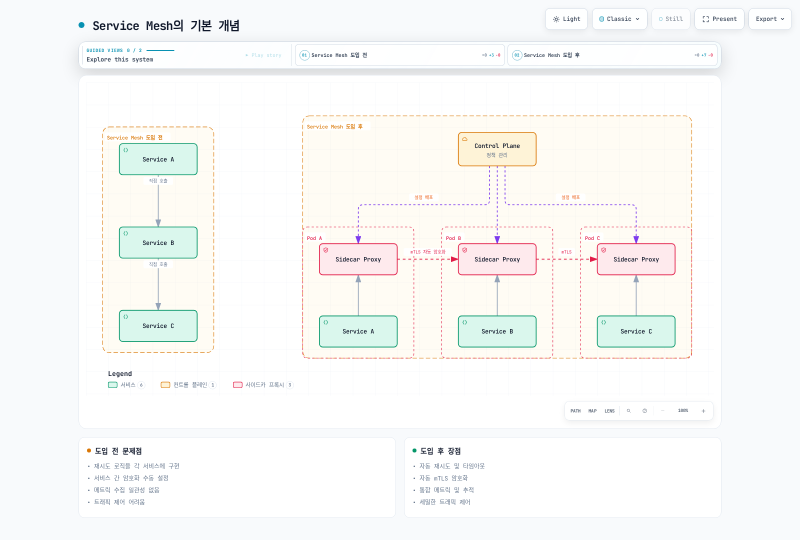

[🔍 인터랙티브 다이어그램 보기](https://www.atomai.click/kubernetes-docs/archmaps/ko-service-mesh-istio-comparison-01-service-mesh-comparison-0.html)

#### 아키텍처 패턴 비교

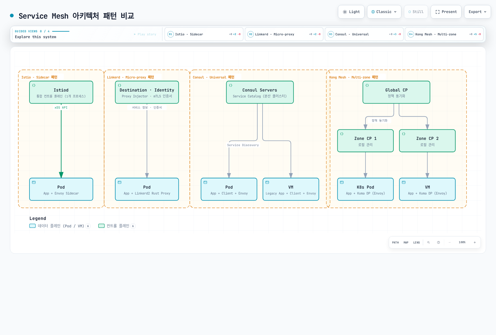

[🔍 인터랙티브 다이어그램 보기](https://www.atomai.click/kubernetes-docs/archmaps/ko-service-mesh-istio-comparison-01-service-mesh-comparison-1.html)

### 상세 아키텍처

#### Istio

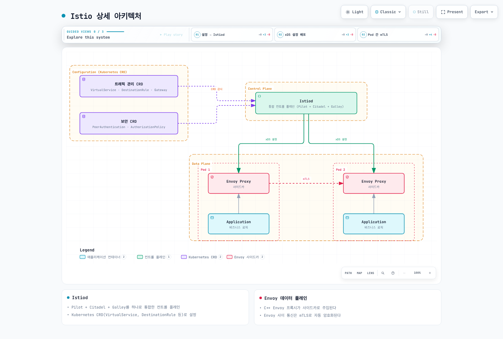

[🔍 인터랙티브 다이어그램 보기](https://www.atomai.click/kubernetes-docs/archmaps/ko-service-mesh-istio-comparison-01-service-mesh-comparison-2.html)

**특징**:

* **프록시**: Envoy (C++)
* **아키텍처**: 통합 컨트롤 플레인 (Istiod)
* **설정**: Kubernetes CRD (VirtualService, DestinationRule 등)
* **강점**: 가장 풍부한 기능, 대규모 엔터프라이즈 지원
* **약점**: 높은 학습 곡선, 리소스 오버헤드

**핵심 구성 요소**:

* **Istiod**: Pilot + Citadel + Galley 통합
* **Envoy Proxy**: 데이터 플레인
* **Ingress/Egress Gateway**: 클러스터 경계 트래픽 제어

### Linkerd

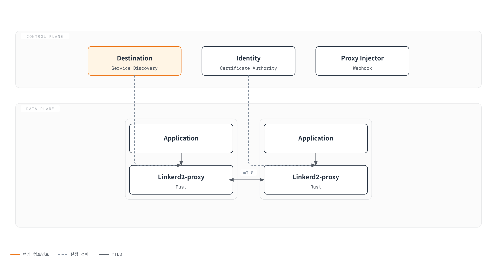

[🔍 인터랙티브 다이어그램 보기](https://www.atomai.click/kubernetes-docs/archmaps/ko-service-mesh-istio-comparison-01-service-mesh-comparison-3.html)

**특징**:

* **프록시**: Linkerd2-proxy (Rust, 맞춤 제작)
* **아키텍처**: 마이크로서비스 컨트롤 플레인
* **설정**: Kubernetes 네이티브 리소스 + 간단한 Annotation
* **강점**: 초경량, 쉬운 설치 및 운영, 빠른 성능
* **약점**: 기능 제한적, VM 지원 없음

**핵심 구성 요소**:

* **Destination**: Service Discovery 및 라우팅 정책
* **Identity**: 자동 mTLS 인증서 발급
* **Proxy Injector**: 자동 Sidecar 주입

### Kong Mesh

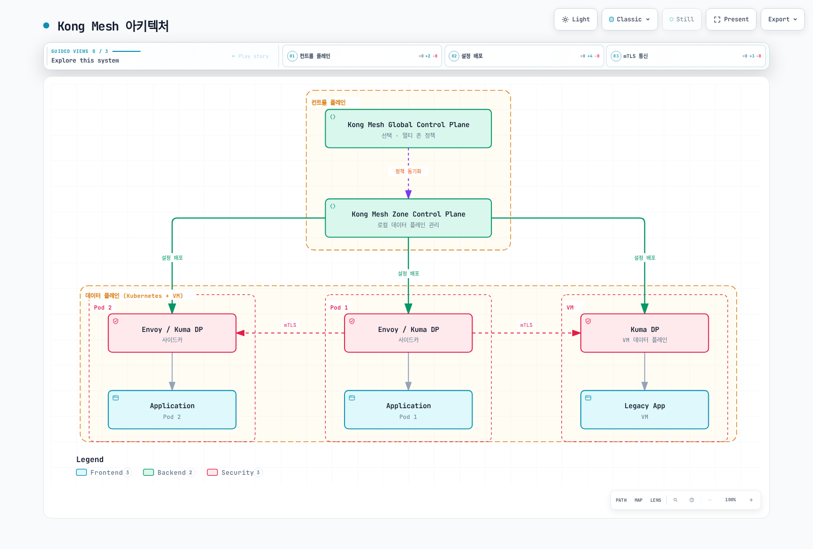

[🔍 인터랙티브 다이어그램 보기](https://www.atomai.click/kubernetes-docs/archmaps/ko-service-mesh-istio-comparison-01-service-mesh-comparison-4.html)

**특징**:

* **프록시**: Envoy (Kuma 데이터 플레인)
* **아키텍처**: Universal Control Plane (K8s + VM)
* **설정**: Kuma CRD + Kong Mesh UI
* **강점**: VM 지원 우수, 멀티 존/멀티 클라우드, 엔터프라이즈 기능
* **약점**: 상용 기능은 유료, 상대적으로 작은 커뮤니티

**핵심 구성 요소**:

* **Global Control Plane**: 멀티 존 정책 동기화
* **Zone Control Plane**: 로컬 데이터 플레인 관리
* **Kuma DP**: Kubernetes 및 VM용 데이터 플레인

#### Kong Mesh 상세 아키텍처

Kong Mesh는 Kuma를 기반으로 하는 Universal Service Mesh로, 멀티 존 아키텍처를 통해 여러 클러스터와 환경을 하나의 메시로 통합합니다.

**Multi-Zone 배포 아키텍처**

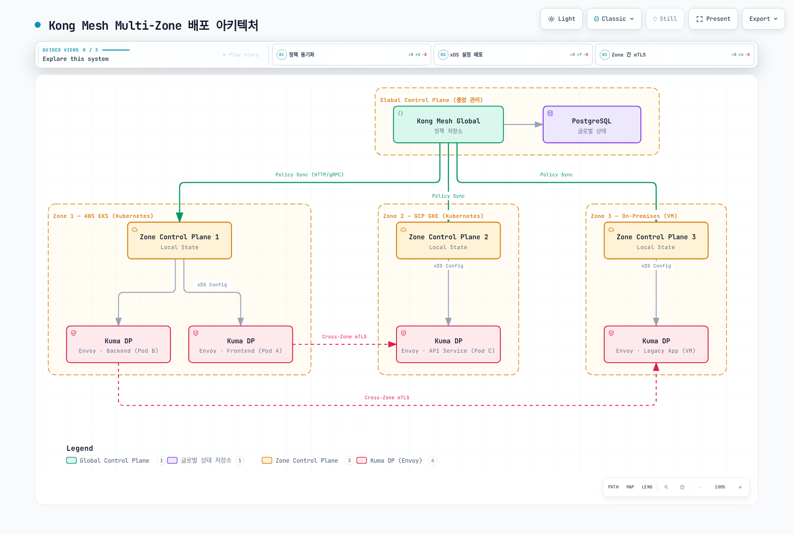

[🔍 인터랙티브 다이어그램 보기](https://www.atomai.click/kubernetes-docs/archmaps/ko-service-mesh-istio-comparison-01-service-mesh-comparison-5.html)

**주요 특징**:

* **Global Control Plane**: 모든 존의 정책을 중앙에서 관리
* **Zone Control Plane**: 각 존에서 독립적으로 데이터 플레인 관리
* **자동 서비스 디스커버리**: 존 간 서비스 자동 검색
* **통합 mTLS**: 존 간 통신도 자동으로 암호화

**서비스 연결 및 트래픽 흐름**

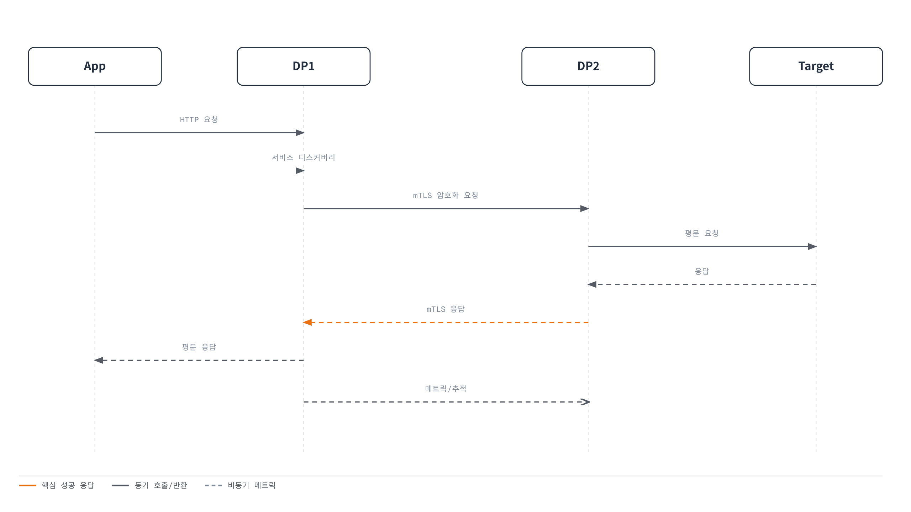

[🔍 인터랙티브 다이어그램 보기](https://www.atomai.click/kubernetes-docs/archmaps/ko-service-mesh-istio-comparison-01-service-mesh-comparison-6.html)

**정책 전파 메커니즘**

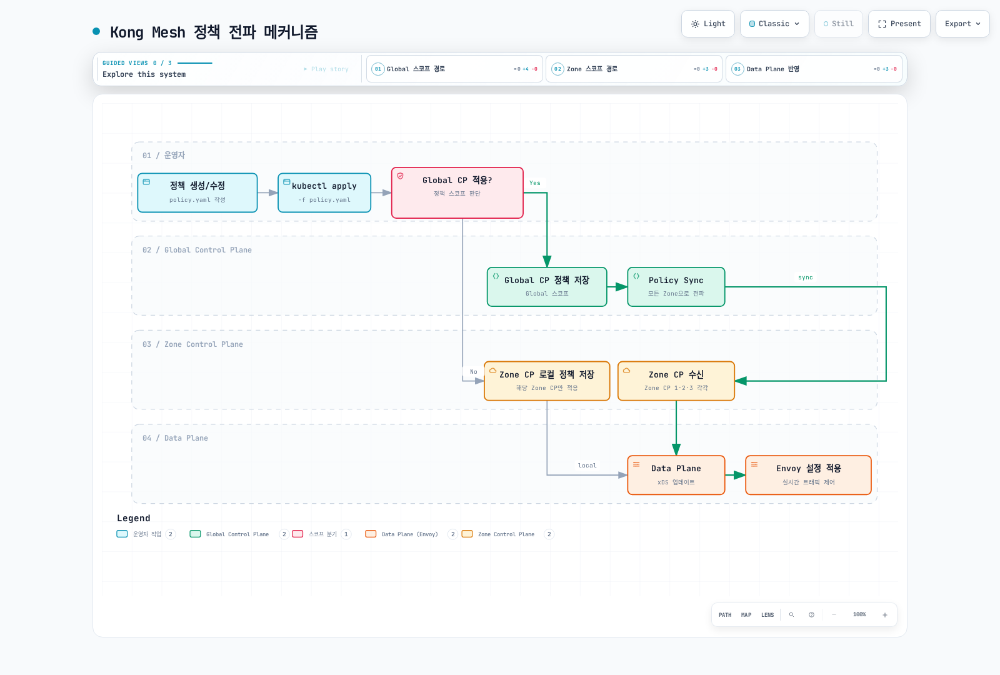

[🔍 인터랙티브 다이어그램 보기](https://www.atomai.click/kubernetes-docs/archmaps/ko-service-mesh-istio-comparison-01-service-mesh-comparison-7.html)

**정책 유형별 전파 범위**:

| 정책 타입                 | Scope  | 전파 방식    | 사용 예           |
| --------------------- | ------ | -------- | -------------- |
| **Mesh**              | Global | 모든 Zone  | 전역 mTLS 설정     |
| **TrafficRoute**      | Global | 모든 Zone  | 글로벌 라우팅 규칙     |
| **TrafficPermission** | Global | 모든 Zone  | 서비스 간 접근 제어    |
| **HealthCheck**       | Zone   | 로컬 Zone만 | Zone별 헬스체크     |
| **ProxyTemplate**     | Zone   | 로컬 Zone만 | Zone별 Envoy 설정 |

**데이터 플레인 라이프사이클**

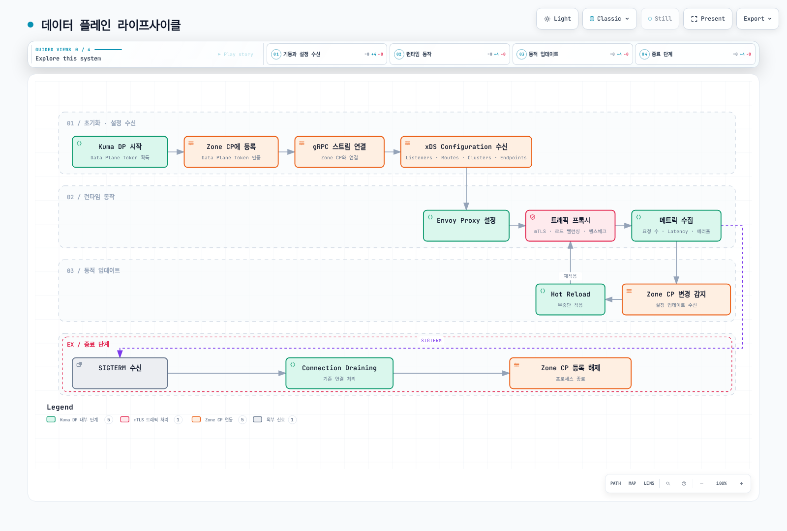

[🔍 인터랙티브 다이어그램 보기](https://www.atomai.click/kubernetes-docs/archmaps/ko-service-mesh-istio-comparison-01-service-mesh-comparison-8.html)

**Zone 간 서비스 디스커버리**

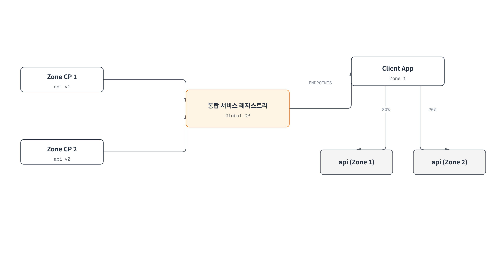

[🔍 인터랙티브 다이어그램 보기](https://www.atomai.click/kubernetes-docs/archmaps/ko-service-mesh-istio-comparison-01-service-mesh-comparison-9.html)

**서비스 디스커버리 특징**:

* **자동 등록**: 각 Zone의 서비스가 Zone CP에 자동 등록
* **글로벌 뷰**: Global CP가 모든 Zone의 서비스 통합
* **로컬 우선**: 같은 Zone 내 서비스를 우선 라우팅
* **자동 페일오버**: 로컬 서비스 실패 시 다른 Zone으로 자동 전환
* **태그 기반 라우팅**: 서비스 태그를 사용한 세밀한 라우팅 제어

**Kong Mesh 설정 예제**

**Mesh 리소스 (전역 mTLS 설정)**:

```yaml
apiVersion: kuma.io/v1alpha1
kind: Mesh
metadata:
  name: default
spec:
  # 전역 mTLS 활성화
  mtls:
    enabledBackend: ca-1
    backends:
    - name: ca-1
      type: builtin
      dpCert:
        rotation:
          expiration: 24h
      conf:
        caCert:
          RSAbits: 2048
          expiration: 10y
  # 전역 메트릭 수집
  metrics:
    enabledBackend: prometheus-1
    backends:
    - name: prometheus-1
      type: prometheus
      conf:
        port: 5670
        path: /metrics
```

**TrafficRoute (Zone 간 라우팅)**:

```yaml
apiVersion: kuma.io/v1alpha1
kind: TrafficRoute
metadata:
  name: api-route
  namespace: kuma-system
spec:
  sources:
  - match:
      kuma.io/service: '*'
  destinations:
  - match:
      kuma.io/service: api
  conf:
    # 로컬 Zone 우선 (80%)
    loadBalancer:
      roundRobin: {}
    split:
    - weight: 80
      destination:
        kuma.io/service: api
        kuma.io/zone: zone-1
    - weight: 20
      destination:
        kuma.io/service: api
        kuma.io/zone: zone-2
```

**TrafficPermission (서비스 간 접근 제어)**:

```yaml
apiVersion: kuma.io/v1alpha1
kind: TrafficPermission
metadata:
  name: api-to-database
  namespace: kuma-system
spec:
  sources:
  - match:
      kuma.io/service: api
      kuma.io/zone: '*'  # 모든 Zone의 api 서비스
  destinations:
  - match:
      kuma.io/service: database
      kuma.io/zone: zone-3  # Zone 3의 database만
```

**Kong Mesh 아키텍처 장점**

**멀티 존 아키텍처**:

* ✅ **글로벌 서비스 메시**: 여러 클러스터와 환경을 하나의 메시로 통합
* ✅ **독립적 Zone 관리**: 각 Zone이 독립적으로 동작, Global CP 장애 시에도 로컬 트래픽 정상 동작
* ✅ **자동 페일오버**: Zone 장애 시 다른 Zone으로 자동 전환
* ✅ **정책 일관성**: 모든 Zone에 동일한 정책 자동 적용

**Universal 지원**:

* ✅ **Kubernetes + VM**: K8s와 VM을 동등하게 지원
* ✅ **멀티 클라우드**: AWS, GCP, Azure, On-Premises 통합
* ✅ **레거시 통합**: 기존 VM 워크로드를 점진적으로 메시에 추가

**운영 편의성**:

* ✅ **GUI 제공**: Kong Mesh GUI로 시각적 관리
* ✅ **정책 템플릿**: 사전 정의된 정책 템플릿 제공
* ✅ **자동 서비스 디스커버리**: 수동 설정 없이 서비스 자동 검색

**엔터프라이즈 기능** (유료):

* ✅ **RBAC**: 세밀한 역할 기반 접근 제어
* ✅ **멀티 테넌시**: Zone별 격리 및 관리
* ✅ **24/7 지원**: 프로덕션 환경 전문 지원
* ✅ **고급 관찰성**: 상세한 메트릭 및 추적

### Consul Connect

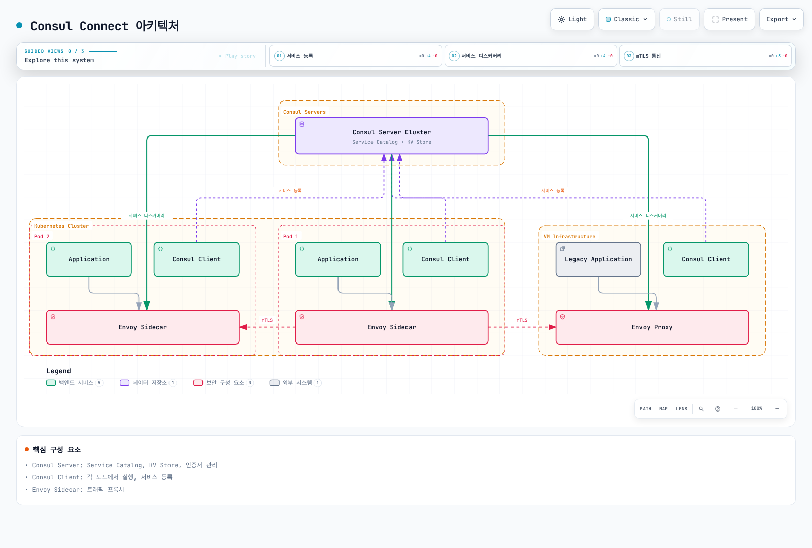

[🔍 인터랙티브 다이어그램 보기](https://www.atomai.click/kubernetes-docs/archmaps/ko-service-mesh-istio-comparison-01-service-mesh-comparison-10.html)

**특징**:

* **프록시**: Envoy 또는 Built-in Proxy
* **아키텍처**: Consul 서버 클러스터 + Consul 클라이언트
* **설정**: HCL 또는 Kubernetes CRD
* **강점**: 강력한 Service Discovery, VM 우선 설계, 멀티 데이터센터
* **약점**: Consul 인프라 관리 필요, Kubernetes 통합이 Istio보다 복잡

**핵심 구성 요소**:

* **Consul Server**: Service Catalog, KV Store, 인증서 관리
* **Consul Client**: 각 노드에서 실행, 서비스 등록
* **Envoy Sidecar**: 트래픽 프록시

## 성능 비교

### Latency 오버헤드

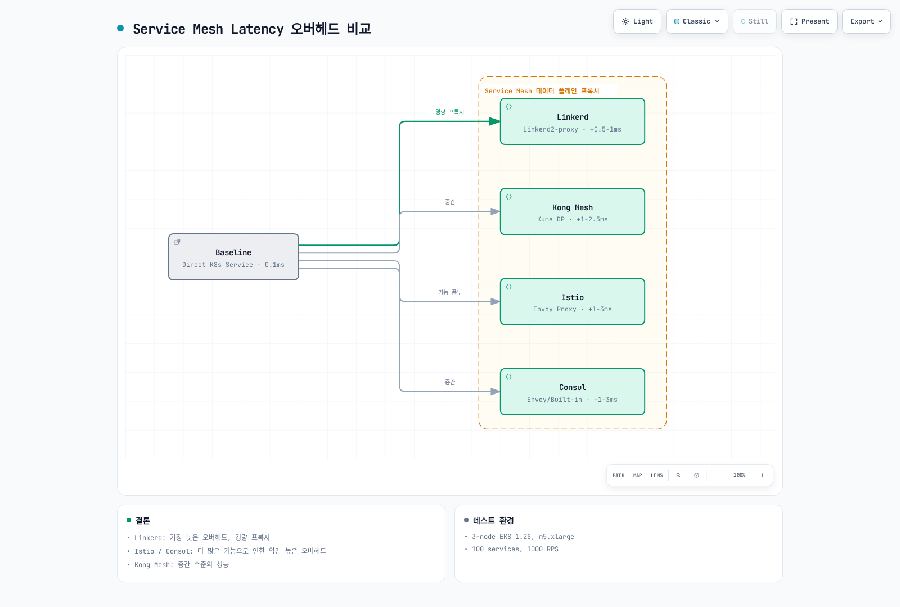

[🔍 인터랙티브 다이어그램 보기](https://www.atomai.click/kubernetes-docs/archmaps/ko-service-mesh-istio-comparison-01-service-mesh-comparison-11.html)

**벤치마크 결과** (P99 Latency 증가, 1000 RPS):

| Service Mesh       | P50    | P95    | P99    | CPU 사용량 | 메모리 사용량   |
| ------------------ | ------ | ------ | ------ | ------- | --------- |
| **Baseline**       | 0.1ms  | 0.2ms  | 0.3ms  | -       | -         |
| **Linkerd**        | +0.5ms | +0.8ms | +1.2ms | +3-8%   | +20-50MB  |
| **Istio**          | +1.0ms | +2.5ms | +3.5ms | +5-15%  | +50-150MB |
| **Kong Mesh**      | +0.8ms | +2.0ms | +3.0ms | +5-12%  | +40-120MB |
| **Consul Connect** | +1.0ms | +2.5ms | +3.5ms | +6-14%  | +50-140MB |

**테스트 환경**: 3-node EKS 1.28, m5.xlarge, 100 services, 1000 RPS

### 리소스 사용량 비교

#### Control Plane 리소스

| 구성 요소        | Istio      | Linkerd       | Kong Mesh     | Consul Connect       |
| ------------ | ---------- | ------------- | ------------- | -------------------- |
| **CPU**      | 500m-1     | 100m-300m     | 200m-500m     | 500m-1               |
| **Memory**   | 1-2GB      | 200-500MB     | 500MB-1GB     | 1-2GB                |
| **Replicas** | 1 (Istiod) | 3-5 (마이크로서비스) | 1-2 (Zone CP) | 3-5 (Consul Servers) |

#### Data Plane 리소스 (파드당)

| 프록시        | Istio Envoy | Linkerd2-proxy | Kuma DP  | Consul Envoy |
| ---------- | ----------- | -------------- | -------- | ------------ |
| **CPU**    | 100-500m    | 20-100m        | 100-400m | 100-500m     |
| **Memory** | 50-150MB    | 20-50MB        | 40-120MB | 50-140MB     |

### 처리량 비교

**최대 RPS (Requests Per Second)**:

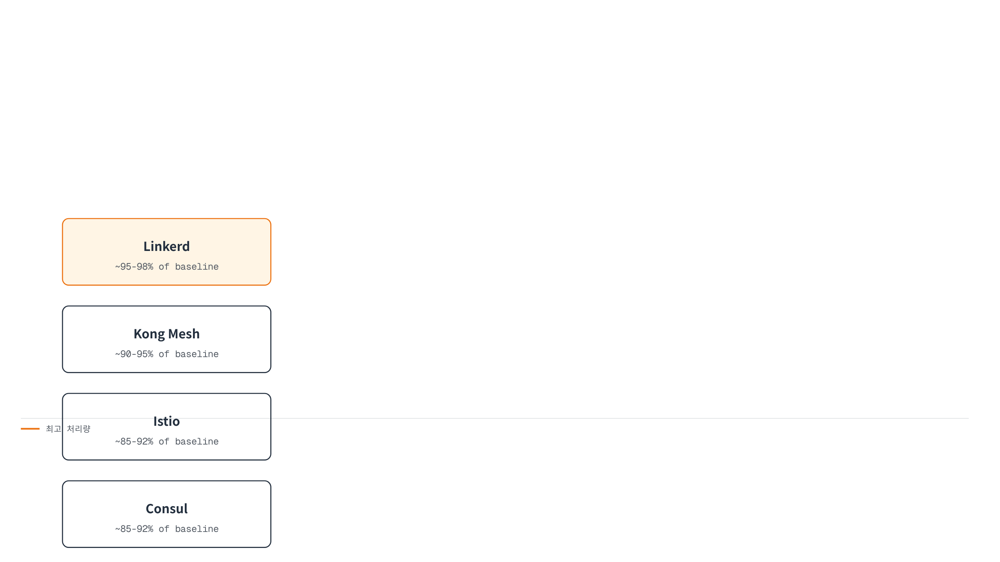

[🔍 인터랙티브 다이어그램 보기](https://www.atomai.click/kubernetes-docs/archmaps/ko-service-mesh-istio-comparison-01-service-mesh-comparison-12.html)

**결론**:

* **Linkerd**: 가장 낮은 오버헤드, 경량 프록시
* **Istio/Consul**: 더 많은 기능으로 인한 약간 높은 오버헤드
* **Kong Mesh**: 중간 수준의 성능

## 기능 비교

### 종합 기능 비교표

| 기능 영역                  | Istio         | Linkerd     | Kong Mesh   | Consul Connect  |
| ---------------------- | ------------- | ----------- | ----------- | --------------- |
| **트래픽 관리**             |               |             |             |                 |
| 트래픽 분할 (Canary)        | ✅ 세밀함         | ✅ 기본        | ✅ 세밀함       | ✅ 기본            |
| A/B 테스팅                | ✅ Header 기반   | ⚠️ 제한적      | ✅ Header 기반 | ⚠️ 제한적          |
| Blue-Green             | ✅             | ✅           | ✅           | ✅               |
| Traffic Mirroring      | ✅             | ❌           | ✅           | ⚠️ Enterprise   |
| Circuit Breaking       | ✅             | ✅ 기본        | ✅           | ✅               |
| Retry                  | ✅ 세밀함         | ✅ 기본        | ✅ 세밀함       | ✅ 기본            |
| Timeout                | ✅             | ✅           | ✅           | ✅               |
| Fault Injection        | ✅             | ⚠️ 제한적      | ✅           | ⚠️ 제한적          |
| **보안**                 |               |             |             |                 |
| mTLS 자동화               | ✅             | ✅           | ✅           | ✅               |
| Authorization Policies | ✅ 매우 세밀함      | ✅ 기본        | ✅ 세밀함       | ✅ Intentions    |
| External CA 통합         | ✅             | ✅           | ✅           | ✅               |
| JWT 인증                 | ✅             | ⚠️ 제한적      | ✅           | ✅               |
| Rate Limiting          | ✅ EnvoyFilter | ❌           | ✅           | ⚠️ Enterprise   |
| **관찰성**                |               |             |             |                 |
| Metrics (Prometheus)   | ✅ 풍부함         | ✅ 기본        | ✅ 풍부함       | ✅ 기본            |
| Distributed Tracing    | ✅ 모든 백엔드      | ✅ Jaeger    | ✅ 모든 백엔드    | ✅ Jaeger/Zipkin |
| Access Logs            | ✅ 매우 상세함      | ✅ 기본        | ✅ 상세함       | ✅ 기본            |
| Topology 시각화           | ✅ Kiali       | ✅ Dashboard | ✅ GUI       | ✅ UI            |
| OpenTelemetry          | ✅             | ✅           | ✅           | ✅               |
| **플랫폼 지원**             |               |             |             |                 |
| Kubernetes             | ✅             | ✅           | ✅           | ✅               |
| Virtual Machines       | ⚠️ 제한적        | ❌           | ✅ 우수        | ✅ 우수            |
| Multi-cluster          | ✅ 우수          | ✅ 지원        | ✅ 우수        | ✅ 우수            |
| Service Discovery      | ✅             | ✅           | ✅           | ✅ 매우 강력         |
| **운영**                 |               |             |             |                 |
| 설치 복잡도                 | 높음            | 낮음          | 중간          | 중간              |
| 업그레이드                  | 중간            | 쉬움          | 중간          | 중간              |
| 트러블슈팅                  | 어려움           | 쉬움          | 중간          | 중간              |
| CLI 도구                 | istioctl      | linkerd     | kumactl     | consul          |

**범례**:

* ✅ 완전 지원
* ⚠️ 제한적 지원 또는 Enterprise 기능
* ❌ 미지원

### 트래픽 관리 상세 비교

#### Canary 배포 예제

**Istio**:

```yaml
apiVersion: networking.istio.io/v1
kind: VirtualService
metadata:
  name: reviews
spec:
  hosts:
  - reviews
  http:
  - match:
    - headers:
        user-agent:
          regex: ".*Mobile.*"
    route:
    - destination:
        host: reviews
        subset: v2
      weight: 100
  - route:
    - destination:
        host: reviews
        subset: v1
      weight: 90
    - destination:
        host: reviews
        subset: v2
      weight: 10
---
apiVersion: networking.istio.io/v1
kind: DestinationRule
metadata:
  name: reviews
spec:
  host: reviews
  subsets:
  - name: v1
    labels:
      version: v1
  - name: v2
    labels:
      version: v2
```

**Linkerd**:

```yaml
apiVersion: split.smi-spec.io/v1alpha2
kind: TrafficSplit
metadata:
  name: reviews-split
spec:
  service: reviews
  backends:
  - service: reviews-v1
    weight: 90
  - service: reviews-v2
    weight: 10
---
# 별도의 Service 생성 필요
apiVersion: v1
kind: Service
metadata:
  name: reviews-v1
spec:
  selector:
    app: reviews
    version: v1
---
apiVersion: v1
kind: Service
metadata:
  name: reviews-v2
spec:
  selector:
    app: reviews
    version: v2
```

**Kong Mesh**:

```yaml
apiVersion: kuma.io/v1alpha1
kind: TrafficRoute
metadata:
  name: reviews-route
spec:
  sources:
  - match:
      kuma.io/service: '*'
  destinations:
  - match:
      kuma.io/service: reviews
  conf:
    split:
    - weight: 90
      destination:
        kuma.io/service: reviews
        version: v1
    - weight: 10
      destination:
        kuma.io/service: reviews
        version: v2
```

**Consul Connect**:

```hcl
Kind = "service-splitter"
Name = "reviews"
Splits = [
  {
    Weight        = 90
    ServiceSubset = "v1"
  },
  {
    Weight        = 10
    ServiceSubset = "v2"
  },
]
```

**비교**:

* **Istio**: 가장 세밀한 제어 (Header 기반 라우팅, 다양한 match 조건)
* **Linkerd**: 간단하지만 별도 Service 필요
* **Kong Mesh**: Kuma CRD, 직관적
* **Consul**: HCL 구성, Service Discovery와 통합

## 보안 기능

### mTLS 구성 비교

**Istio**:

```yaml
apiVersion: security.istio.io/v1
kind: PeerAuthentication
metadata:
  name: default
  namespace: istio-system
spec:
  mtls:
    mode: STRICT
---
apiVersion: networking.istio.io/v1
kind: DestinationRule
metadata:
  name: default
  namespace: istio-system
spec:
  host: "*.local"
  trafficPolicy:
    tls:
      mode: ISTIO_MUTUAL
```

**Linkerd**:

```bash
# 자동으로 mTLS 활성화 (설정 불필요)
linkerd install | kubectl apply -f -

# 네임스페이스에 annotation 추가
kubectl annotate namespace default linkerd.io/inject=enabled
```

**Kong Mesh**:

```yaml
apiVersion: kuma.io/v1alpha1
kind: Mesh
metadata:
  name: default
spec:
  mtls:
    enabledBackend: ca-1
    backends:
    - name: ca-1
      type: builtin
      dpCert:
        rotation:
          expiration: 24h
      conf:
        caCert:
          RSAbits: 2048
          expiration: 10y
```

**Consul Connect**:

```hcl
Kind = "mesh"
Meta = {
  "consul.hashicorp.com/gateway-kind" = "mesh-gateway"
}
TLS {
  Incoming {
    TLSMinVersion = "TLSv1_2"
  }
}
```

### Authorization 정책 비교

**Istio** (가장 세밀함):

```yaml
apiVersion: security.istio.io/v1
kind: AuthorizationPolicy
metadata:
  name: reviews-policy
spec:
  selector:
    matchLabels:
      app: reviews
  action: ALLOW
  rules:
  - from:
    - source:
        principals: ["cluster.local/ns/default/sa/productpage"]
    to:
    - operation:
        methods: ["GET"]
        paths: ["/reviews/*"]
    when:
    - key: request.headers[user-agent]
      values: ["*Mobile*"]
```

**Linkerd**:

```yaml
apiVersion: policy.linkerd.io/v1beta1
kind: Server
metadata:
  name: reviews-server
spec:
  podSelector:
    matchLabels:
      app: reviews
  port: 9080
  proxyProtocol: HTTP/1
---
apiVersion: policy.linkerd.io/v1alpha1
kind: AuthorizationPolicy
metadata:
  name: reviews-policy
spec:
  targetRef:
    kind: Server
    name: reviews-server
  requiredAuthenticationRefs:
  - kind: ServiceAccount
    name: productpage
```

**Kong Mesh**:

```yaml
apiVersion: kuma.io/v1alpha1
kind: TrafficPermission
metadata:
  name: reviews-permission
spec:
  sources:
  - match:
      kuma.io/service: productpage
  destinations:
  - match:
      kuma.io/service: reviews
```

**Consul Connect** (Intentions):

```hcl
Kind = "service-intentions"
Name = "reviews"
Sources = [
  {
    Name   = "productpage"
    Action = "allow"
  }
]
```

**비교**:

* **Istio**: L7 수준의 매우 세밀한 제어 (Method, Path, Header)
* **Linkerd**: Service Account 기반, 간단함
* **Kong Mesh**: Service 레벨 권한
* **Consul**: Intentions 기반, 직관적

## 관찰성 기능

### Metrics 수집

**Istio**:

* **메트릭 수**: 50+ 기본 메트릭
* **커스터마이징**: EnvoyFilter로 무제한 확장
* **통합**: Prometheus, Grafana, Kiali

**Linkerd**:

* **메트릭 수**: 20+ 기본 메트릭 (골든 시그널 중심)
* **커스터마이징**: 제한적
* **통합**: Prometheus, Grafana, Linkerd Dashboard

**Kong Mesh**:

* **메트릭 수**: 40+ 기본 메트릭
* **커스터마이징**: Datadog, Prometheus
* **통합**: Kong Mesh GUI, Grafana

**Consul Connect**:

* **메트릭 수**: 30+ 기본 메트릭
* **커스터마이징**: Telegraf 통합
* **통합**: Consul UI, Prometheus, Grafana

### Distributed Tracing

**지원 백엔드**:

| Service Mesh  | Jaeger | Zipkin | Tempo | Datadog | AWS X-Ray |
| ------------- | ------ | ------ | ----- | ------- | --------- |
| **Istio**     | ✅      | ✅      | ✅     | ✅       | ✅         |
| **Linkerd**   | ✅      | ✅      | ✅     | ⚠️      | ⚠️        |
| **Kong Mesh** | ✅      | ✅      | ✅     | ✅       | ✅         |
| **Consul**    | ✅      | ✅      | ⚠️    | ⚠️      | ⚠️        |

### 시각화 도구

**Istio + Kiali**:

```yaml
apiVersion: kiali.io/v1alpha1
kind: Kiali
metadata:
  name: kiali
spec:
  deployment:
    accessible_namespaces: ["**"]
  external_services:
    prometheus:
      url: http://prometheus:9090
    grafana:
      url: http://grafana:3000
    tracing:
      url: http://jaeger-query:16686
```

**Linkerd Dashboard**:

```bash
linkerd viz install | kubectl apply -f -
linkerd viz dashboard
```

**Kong Mesh GUI**:

```yaml
apiVersion: kuma.io/v1alpha1
kind: Mesh
metadata:
  name: default
spec:
  metrics:
    enabledBackend: prometheus-1
    backends:
    - name: prometheus-1
      type: prometheus
```

**Consul UI**:

```hcl
ui_config {
  enabled = true
  metrics_provider = "prometheus"
  metrics_proxy {
    base_url = "http://prometheus:9090"
  }
}
```

## 멀티 클러스터 지원

### 아키텍처 비교

**Istio Multi-Primary**:

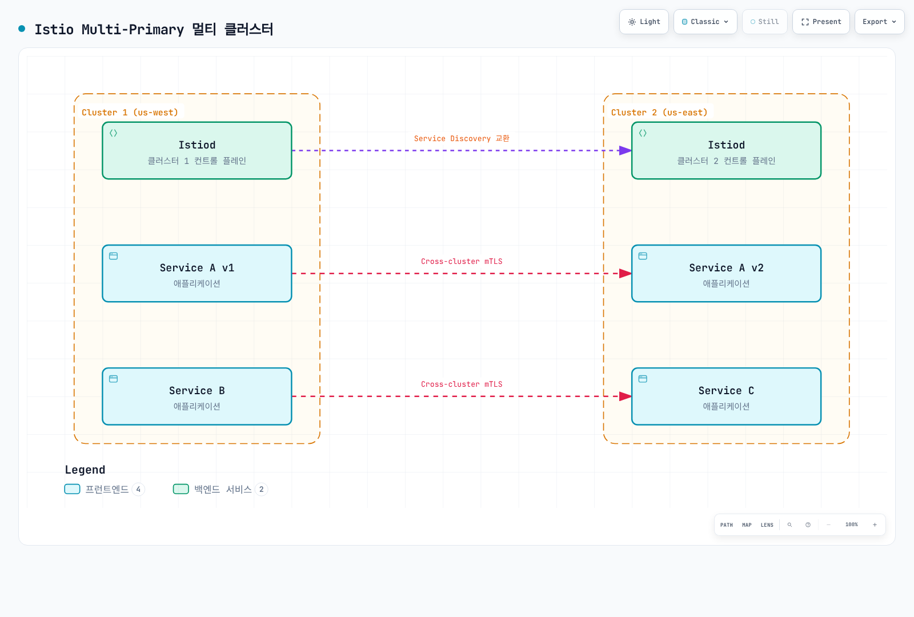

[🔍 인터랙티브 다이어그램 보기](https://www.atomai.click/kubernetes-docs/archmaps/ko-service-mesh-istio-comparison-01-service-mesh-comparison-13.html)

**Linkerd Multi-cluster**:

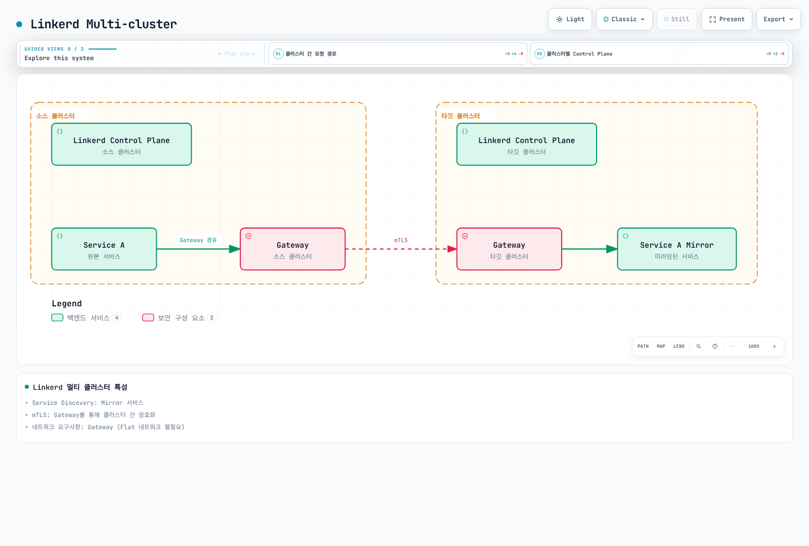

[🔍 인터랙티브 다이어그램 보기](https://www.atomai.click/kubernetes-docs/archmaps/ko-service-mesh-istio-comparison-01-service-mesh-comparison-14.html)

**Kong Mesh Multi-zone**:

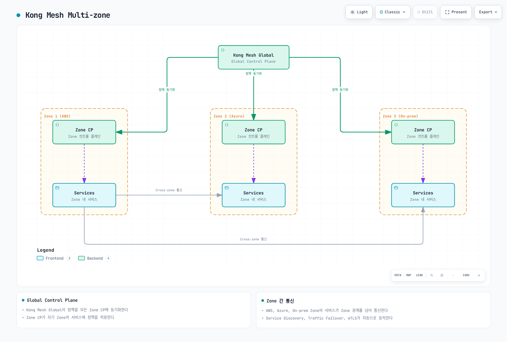

[🔍 인터랙티브 다이어그램 보기](https://www.atomai.click/kubernetes-docs/archmaps/ko-service-mesh-istio-comparison-01-service-mesh-comparison-15.html)

**Consul Multi-datacenter**:

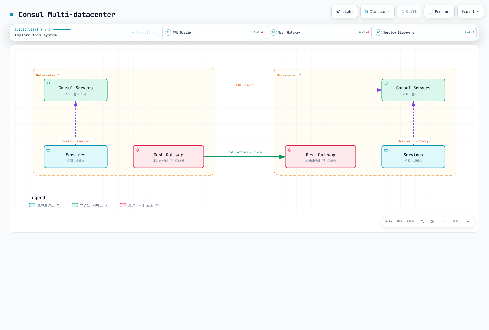

[🔍 인터랙티브 다이어그램 보기](https://www.atomai.click/kubernetes-docs/archmaps/ko-service-mesh-istio-comparison-01-service-mesh-comparison-16.html)

### 멀티 클러스터 기능 비교

| 기능                    | Istio           | Linkerd      | Kong Mesh       | Consul  |
| --------------------- | --------------- | ------------ | --------------- | ------- |
| **설정 복잡도**            | 중간              | 낮음           | 중간              | 중간      |
| **Service Discovery** | ✅ 자동            | ✅ Mirror 서비스 | ✅ 자동            | ✅ 강력함   |
| **Traffic Failover**  | ✅ 자동            | ⚠️ 수동        | ✅ 자동            | ✅ 자동    |
| **mTLS**              | ✅ 자동            | ✅ Gateway 통해 | ✅ 자동            | ✅ 자동    |
| **네트워크 요구사항**         | Flat 또는 Gateway | Gateway      | Flat 또는 Gateway | Gateway |
| **정책 동기화**            | ✅               | ⚠️ 제한적       | ✅ Global CP     | ✅       |
| **최대 클러스터 수**         | 수십 개            | \~10개        | 수십 개            | 수십 개    |

## 운영 복잡도

### 설치 및 업그레이드

**Istio**:

```bash
# 설치
istioctl install --set profile=default

# 업그레이드 (Canary)
istioctl install --set profile=default --revision=1-24-0

# 네임스페이스별로 순차 전환
kubectl label namespace default istio.io/rev=1-24-0 --overwrite
kubectl rollout restart deployment -n default
```

**Linkerd**:

```bash
# 설치
linkerd install | kubectl apply -f -

# 업그레이드 (In-place)
linkerd upgrade | kubectl apply -f -

# 자동 rollout
```

**Kong Mesh**:

```bash
# Helm 설치
helm install kong-mesh kong-mesh/kong-mesh

# 업그레이드
helm upgrade kong-mesh kong-mesh/kong-mesh
```

**Consul**:

```bash
# Helm 설치
helm install consul hashicorp/consul -f values.yaml

# 업그레이드
helm upgrade consul hashicorp/consul -f values.yaml
```

**비교**:

* **Linkerd**: 가장 간단한 설치 및 업그레이드
* **Istio**: Canary 업그레이드로 zero-downtime 가능하지만 복잡함
* **Kong/Consul**: Helm 기반, 중간 복잡도

### 트러블슈팅 도구

**Istio**:

```bash
# 프록시 상태 확인
istioctl proxy-status

# 설정 검증
istioctl analyze

# 프록시 설정 확인
istioctl proxy-config cluster <pod> -n <namespace>

# 로그 레벨 변경
istioctl proxy-config log <pod> --level debug
```

**Linkerd**:

```bash
# 상태 확인
linkerd check

# 통계 확인
linkerd stat deploy

# Tap (실시간 트래픽 관찰)
linkerd tap deploy/webapp

# 프로필 확인
linkerd profile --template deploy/webapp
```

**Kong Mesh**:

```bash
# 상태 확인
kumactl inspect dataplanes

# 메트릭 확인
kumactl inspect meshes

# 로그 확인
kubectl logs -n kong-mesh-system deployment/kong-mesh-control-plane
```

**Consul**:

```bash
# 상태 확인
consul members

# 서비스 확인
consul catalog services

# Intentions 확인
consul intention list

# 프록시 로그
kubectl logs <pod> -c consul-connect-envoy-sidecar
```

### 학습 곡선

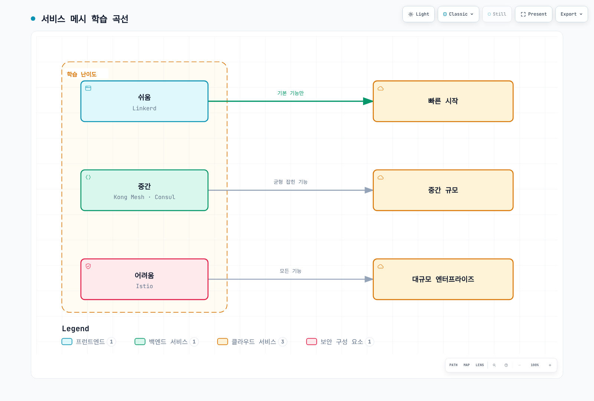

[🔍 인터랙티브 다이어그램 보기](https://www.atomai.click/kubernetes-docs/archmaps/ko-service-mesh-istio-comparison-01-service-mesh-comparison-17.html)

## 비용 분석

### 인프라 비용

**리소스 기반 비용 계산** (100 파드 환경, EKS m5.xlarge):

| Service Mesh  | Control Plane CPU | Control Plane Memory | Data Plane CPU (총) | Data Plane Memory (총) | 월 비용 (추정)      |
| ------------- | ----------------- | -------------------- | ------------------ | --------------------- | -------------- |
| **Baseline**  | -                 | -                    | -                  | -                     | $300           |
| **Linkerd**   | 300m              | 500MB                | 2 vCPU             | 5GB                   | +$50 (\~$350)  |
| **Istio**     | 1 vCPU            | 2GB                  | 10 vCPU            | 15GB                  | +$150 (\~$450) |
| **Kong Mesh** | 500m              | 1GB                  | 8 vCPU             | 12GB                  | +$120 (\~$420) |
| **Consul**    | 1 vCPU            | 2GB                  | 10 vCPU            | 14GB                  | +$145 (\~$445) |

**참고**: 실제 비용은 워크로드 패턴, 트래픽 양, 설정에 따라 크게 달라질 수 있습니다.

### 운영 비용

**엔지니어 시간 (월 기준)**:

| 작업        | Istio | Linkerd | Kong Mesh | Consul |
| --------- | ----- | ------- | --------- | ------ |
| **초기 설정** | 40h   | 8h      | 20h       | 24h    |
| **일상 운영** | 20h/월 | 5h/월    | 10h/월     | 12h/월  |
| **트러블슈팅** | 15h/월 | 3h/월    | 8h/월      | 10h/월  |
| **업그레이드** | 8h/분기 | 2h/분기   | 4h/분기     | 5h/분기  |

### 라이선스 비용

| 제품            | 오픈소스              | 엔터프라이즈                             |
| ------------- | ----------------- | ---------------------------------- |
| **Istio**     | ✅ 무료 (Apache 2.0) | Google Cloud Service Mesh (사용량 기반) |
| **Linkerd**   | ✅ 무료 (Apache 2.0) | Buoyant Enterprise (\$$$)          |
| **Kong Mesh** | ✅ Kuma 오픈소스       | Kong Mesh Enterprise (문의 필요)       |
| **Consul**    | ✅ 무료 (MPL 2.0)    | Consul Enterprise (\$$$)           |

**엔터프라이즈 기능 예시**:

* **Kong Mesh Enterprise**: Multi-zone GUI, RBAC, 24/7 support
* **Consul Enterprise**: Audit logging, Namespaces, Redundancy zones
* **Buoyant Enterprise**: HA control plane, 24/7 support, SLA

## 사용 사례별 권장

### 1. 대규모 엔터프라이즈 (1000+ 서비스)

**권장: Istio**

**이유**:

* 가장 풍부한 기능 세트
* 세밀한 트래픽 제어 (A/B 테스팅, Canary)
* 강력한 보안 (L7 Authorization)
* 멀티 클러스터 페더레이션
* 광범위한 커뮤니티 및 도구 생태계

**설정 예시**:

```yaml
apiVersion: install.istio.io/v1alpha1
kind: IstioOperator
spec:
  profile: production
  components:
    pilot:
      k8s:
        hpaSpec:
          minReplicas: 3
          maxReplicas: 10
        resources:
          requests:
            cpu: 2000m
            memory: 4Gi
```

### 2. 중소 규모 스타트업 (10-100 서비스)

**권장: Linkerd**

**이유**:

* 빠른 설치 (5분 이내)
* 낮은 리소스 오버헤드
* 간단한 운영
* 자동 mTLS 및 메트릭

**설정 예시**:

```bash
linkerd install | kubectl apply -f -
linkerd viz install | kubectl apply -f -

# 네임스페이스별 활성화
kubectl annotate namespace default linkerd.io/inject=enabled
```

### 3. 하이브리드 클라우드 (K8s + VM)

**권장: Consul Connect 또는 Kong Mesh**

**이유**:

* VM 워크로드 우선 지원
* 강력한 Service Discovery
* 멀티 플랫폼 일관성

**Consul 설정 예시**:

```hcl
# Kubernetes에서
service {
  name = "web"
  port = 8080
  connect {
    sidecar_service {}
  }
}

# VM에서
service {
  name = "database"
  port = 5432
  connect {
    sidecar_service {
      proxy {
        upstreams = [
          {
            destination_name = "web"
            local_bind_port  = 8080
          }
        ]
      }
    }
  }
}
```

### 4. 멀티 클라우드 전략

**권장: Istio 또는 Kong Mesh**

**이유**:

* 클라우드 중립적
* 일관된 정책 및 관찰성
* 멀티 클러스터 페더레이션

**Istio 멀티 클러스터**:

```bash
# Cluster 1 (AWS)
istioctl install --set values.global.meshID=mesh1 \
  --set values.global.multiCluster.clusterName=aws-cluster \
  --set values.global.network=aws-network

# Cluster 2 (GCP)
istioctl install --set values.global.meshID=mesh1 \
  --set values.global.multiCluster.clusterName=gcp-cluster \
  --set values.global.network=gcp-network

# Service Discovery 공유
istioctl create-remote-secret \
  --context=aws-cluster --name=aws-cluster | \
  kubectl apply -f - --context=gcp-cluster
```

### 5. 레거시 마이그레이션

**권장: Kong Mesh 또는 Consul**

**이유**:

* VM 및 컨테이너 동시 지원
* 점진적 마이그레이션
* 기존 Service Discovery 통합

**Kong Mesh 하이브리드**:

```yaml
# Kubernetes Service
apiVersion: v1
kind: Service
metadata:
  name: legacy-db
  annotations:
    kuma.io/mesh: default
spec:
  type: ExternalName
  externalName: legacy-db.vm.local
---
# VM에서 Kuma DP 실행
kuma-dp run \
  --cp-address=https://kong-mesh-cp:5678 \
  --dataplane-token-file=/tmp/token \
  --dataplane-file=/etc/kuma/dataplane.yaml
```

### 6. 강력한 관찰성 요구

**권장: Istio**

**이유**:

* 50+ 기본 메트릭
* 상세한 액세스 로그
* 모든 트레이싱 백엔드 지원
* Kiali 통합

**관찰성 스택**:

```yaml
# Prometheus + Grafana + Jaeger + Kiali
istioctl install --set profile=demo \
  --set values.prometheus.enabled=true \
  --set values.grafana.enabled=true \
  --set values.tracing.enabled=true \
  --set values.kiali.enabled=true
```

## 최종 결론 및 추천

### 의사 결정 트리

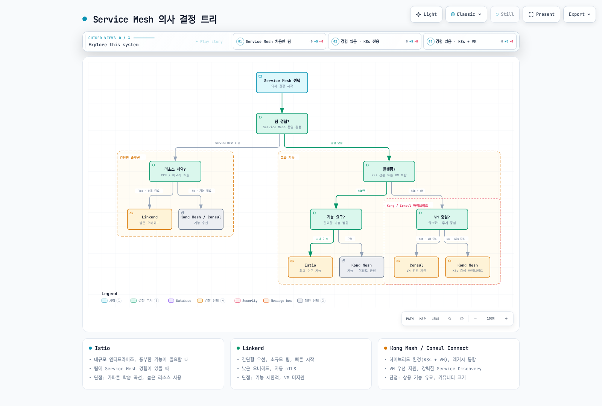

[🔍 인터랙티브 다이어그램 보기](https://www.atomai.click/kubernetes-docs/archmaps/ko-service-mesh-istio-comparison-01-service-mesh-comparison-18.html)

### 빠른 추천 가이드

| 상황             | 1순위     | 2순위       | 피해야 할 것         |
| -------------- | ------- | --------- | --------------- |
| **처음 시작**      | Linkerd | Kong Mesh | Istio (복잡함)     |
| **대규모 엔터프라이즈** | Istio   | Kong Mesh | Linkerd (기능 제한) |
| **리소스 제약**     | Linkerd | -         | Istio (오버헤드)    |
| **VM 워크로드**    | Consul  | Kong Mesh | Linkerd (지원 없음) |
| **멀티 클라우드**    | Istio   | Consul    | 단일 클라우드 솔루션     |
| **빠른 ROI**     | Linkerd | -         | Istio (학습 곡선)   |
| **세밀한 제어**     | Istio   | Kong Mesh | Linkerd (제한적)   |

### 최종 추천

**🥇 Istio**:

* **언제**: 대규모 엔터프라이즈, 풍부한 기능 필요, 팀에 Service Mesh 경험 있음
* **장점**: 최고 수준의 기능, 강력한 커뮤니티, 미래 지향적
* **단점**: 가파른 학습 곡선, 높은 리소스 사용

**🥈 Linkerd**:

* **언제**: 간단함 우선, 소규모 팀, 빠른 시작, 리소스 효율성
* **장점**: 설치/운영 간단, 낮은 오버헤드, 자동 mTLS
* **단점**: 기능 제한적, VM 미지원

**🥉 Kong Mesh / Consul Connect**:

* **언제**: 하이브리드 환경 (K8s + VM), 멀티 플랫폼, 레거시 통합
* **장점**: VM 우선 지원, 유연한 아키텍처, 강력한 Service Discovery
* **단점**: 상용 기능 유료, 커뮤니티 크기

***

**다음 단계**:

1. PoC 환경에서 2-3개 솔루션 테스트
2. 실제 워크로드 패턴으로 성능 벤치마크
3. 팀 피드백 수집
4. 프로덕션 롤아웃 계획 수립

**관련 문서**:

* [Istio vs VPC Lattice 비교](02-istio-vs-lattice.md)
* [Istio 아키텍처](https://github.com/Atom-oh/kubernetes-docs/blob/main/ko/service-mesh/istio/istio/architecture/README.md)
