# Istio vs VPC Lattice

> **마지막 업데이트**: 2026년 2월 23일 **Istio 버전**: 1.24 **VPC Lattice**: GA (2023년 출시)

이 문서는 Kubernetes Service Mesh (Istio)와 AWS 네이티브 서비스 네트워킹 (VPC Lattice)을 종합적으로 비교합니다.

## 목차

1. [개요 및 핵심 차이점](02-istio-vs-lattice.md#개요-및-핵심-차이점)
2. [아키텍처 비교](02-istio-vs-lattice.md#아키텍처-비교)
3. [트래픽 관리 기능](02-istio-vs-lattice.md#트래픽-관리-기능)
4. [보안 모델](02-istio-vs-lattice.md#보안-모델)
5. [관찰성 및 모니터링](02-istio-vs-lattice.md#관찰성-및-모니터링)
6. [운영 복잡도](02-istio-vs-lattice.md#운영-복잡도)
7. [비용 분석](02-istio-vs-lattice.md#비용-분석)
8. [성능 비교](02-istio-vs-lattice.md#성능-비교)
9. [멀티 클라우드 전략](02-istio-vs-lattice.md#멀티-클라우드-전략)
10. [하이브리드 아키텍처](02-istio-vs-lattice.md#하이브리드-아키텍처)
11. [선택 가이드](02-istio-vs-lattice.md#선택-가이드)

## 개요 및 핵심 차이점

### Istio Service Mesh

**정의**: Kubernetes 환경에서 실행되는 오픈소스 Service Mesh로, 마이크로서비스 간 통신을 관리, 보호, 관찰하는 인프라 계층

**핵심 특징**:

* Self-managed (직접 운영)
* Kubernetes 네이티브 (CRD 기반)
* 클라우드 중립적
* 풍부한 기능 세트
* Envoy Proxy 기반

### AWS VPC Lattice

**정의**: AWS가 제공하는 완전 관리형 애플리케이션 네트워킹 서비스로, VPC, 계정, 컴퓨팅 플랫폼 간 서비스 연결 및 보안을 간소화

**핵심 특징**:

* Fully managed (완전 관리형)
* AWS 네이티브 통합
* 서버리스 아키텍처
* EKS, ECS, EC2, Lambda 지원
* VPC/계정 간 투명한 연결

### 빠른 비교표

| 측면          | Istio         | VPC Lattice           |
| ----------- | ------------- | --------------------- |
| **배포 모델**   | Self-managed  | Fully managed         |
| **플랫폼**     | Kubernetes    | EKS, ECS, EC2, Lambda |
| **아키텍처**    | Sidecar Proxy | AWS 관리형               |
| **설정 복잡도**  | 높음            | 낮음                    |
| **기능 풍부도**  | ⭐⭐⭐⭐⭐         | ⭐⭐⭐                   |
| **운영 오버헤드** | 높음            | 거의 없음                 |
| **벤더 종속성**  | 낮음            | 높음 (AWS Only)         |
| **비용 모델**   | 리소스 기반        | 사용량 기반                |
| **학습 곡선**   | 가파름           | 완만함                   |
| **멀티 클라우드** | ✅ 지원          | ❌ AWS Only            |

## 아키텍처 비교

### Istio 아키텍처

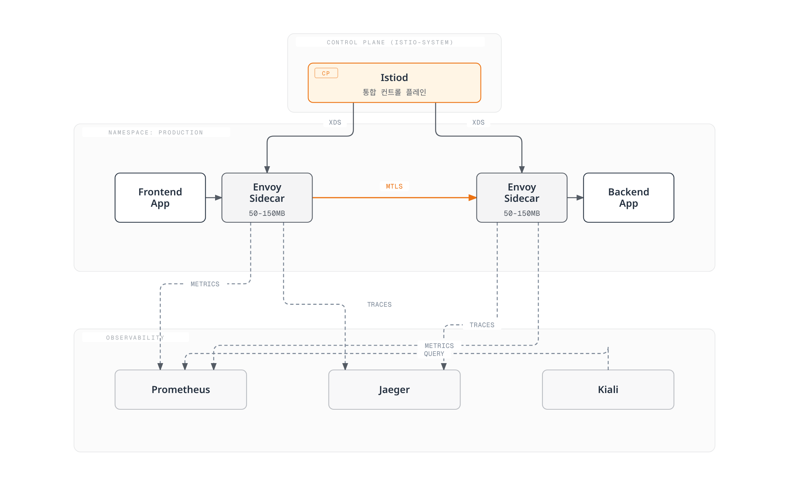

[🔍 인터랙티브 다이어그램 보기](https://www.atomai.click/kubernetes-docs/archmaps/ko-service-mesh-istio-comparison-02-istio-vs-lattice-0.html)

**특징**:

* **Sidecar Pattern**: 모든 파드에 Envoy Proxy 주입
* **리소스 오버헤드**: 파드당 50-150MB 메모리, 100-500m CPU
* **데이터 경로**: App → Envoy → mTLS → Envoy → App
* **설정**: Kubernetes CRD (VirtualService, DestinationRule 등)

### VPC Lattice 아키텍처

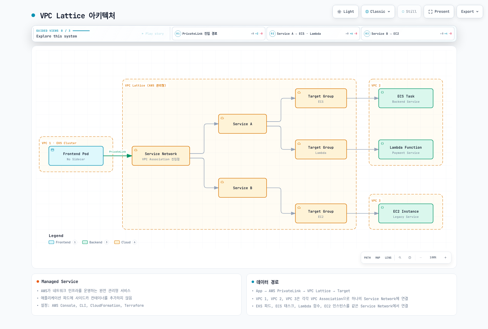

[🔍 인터랙티브 다이어그램 보기](https://www.atomai.click/kubernetes-docs/archmaps/ko-service-mesh-istio-comparison-02-istio-vs-lattice-1.html)

**특징**:

* **Managed Service**: AWS가 네트워크 인프라 운영
* **No Sidecar**: 애플리케이션 파드에 추가 컨테이너 없음
* **데이터 경로**: App → AWS PrivateLink → VPC Lattice → Target
* **설정**: AWS Console, CLI, CloudFormation, Terraform

### 아키텍처 차이점 요약

| 측면           | Istio                 | VPC Lattice     |
| ------------ | --------------------- | --------------- |
| **프록시 위치**   | 파드 내부 (Sidecar)       | AWS 관리형 (외부)    |
| **메모리 오버헤드** | 파드당 50-150MB          | 0MB (관리형)       |
| **CPU 오버헤드** | 파드당 100-500m          | 0 (관리형)         |
| **컨트롤 플레인**  | Self-managed (Istiod) | AWS 관리형         |
| **데이터 플레인**  | Envoy Proxy           | AWS PrivateLink |
| **설정 인터페이스** | Kubernetes CRD        | AWS API         |
| **업그레이드**    | 수동 (Canary 가능)        | 자동 (AWS 관리)     |

## 트래픽 관리 기능

### 트래픽 분할 (Canary 배포)

#### Istio

```yaml
apiVersion: networking.istio.io/v1
kind: VirtualService
metadata:
  name: frontend
spec:
  hosts:
  - frontend
  http:
  - match:
    - headers:
        user-agent:
          regex: ".*Mobile.*"
    route:
    - destination:
        host: frontend
        subset: v2
      weight: 100
  - route:
    - destination:
        host: frontend
        subset: v1
      weight: 90
    - destination:
        host: frontend
        subset: v2
      weight: 10
---
apiVersion: networking.istio.io/v1
kind: DestinationRule
metadata:
  name: frontend
spec:
  host: frontend
  trafficPolicy:
    loadBalancer:
      simple: LEAST_REQUEST
  subsets:
  - name: v1
    labels:
      version: v1
  - name: v2
    labels:
      version: v2
```

**기능**:

* Header, URL, Source 기반 라우팅
* 세밀한 가중치 제어 (1% 단위)
* 복잡한 조건 (AND, OR, Regex)
* 동적 로드 밸런싱 알고리즘

#### VPC Lattice

```yaml
# AWS CLI로 가중치 기반 라우팅
aws vpc-lattice create-rule \
  --listener-identifier $LISTENER_ID \
  --priority 10 \
  --match '{
    "httpMatch": {
      "pathMatch": {"prefix": "/api"}
    }
  }' \
  --action '{
    "forward": {
      "targetGroups": [
        {
          "targetGroupIdentifier": "'$TG_V1'",
          "weight": 90
        },
        {
          "targetGroupIdentifier": "'$TG_V2'",
          "weight": 10
        }
      ]
    }
  }'
```

**기능**:

* Path, Header, Method 기반 라우팅
* 가중치 기반 분할
* 기본적인 조건
* 라운드 로빈, 최소 연결 로드 밸런싱

**비교**:

* **Istio**: 매우 세밀한 제어, 복잡한 시나리오 가능
* **VPC Lattice**: 기본적인 기능, 간단한 사용

### 트래픽 미러링

#### Istio

```yaml
apiVersion: networking.istio.io/v1
kind: VirtualService
metadata:
  name: backend
spec:
  hosts:
  - backend
  http:
  - route:
    - destination:
        host: backend
        subset: v1
      weight: 100
    mirror:
      host: backend
      subset: v2
    mirrorPercentage:
      value: 10.0  # v2로 10% 트래픽 복사
```

**사용 사례**:

* 프로덕션 트래픽으로 새 버전 테스트
* 성능 비교
* 버그 검증

#### VPC Lattice

❌ **미지원**: VPC Lattice는 트래픽 미러링을 지원하지 않습니다.

**대안**:

* Application Load Balancer + Lambda@Edge
* 별도의 로그 스트림 분석

### Fault Injection

#### Istio

```yaml
apiVersion: networking.istio.io/v1
kind: VirtualService
metadata:
  name: backend
spec:
  hosts:
  - backend
  http:
  - fault:
      delay:
        percentage:
          value: 10.0
        fixedDelay: 5s
      abort:
        percentage:
          value: 5.0
        httpStatus: 503
    route:
    - destination:
        host: backend
```

**기능**:

* 지연 주입 (Delay)
* 오류 주입 (Abort)
* 백분율 기반 제어
* Chaos Engineering 지원

#### VPC Lattice

❌ **미지원**: 내장 Fault Injection 기능 없음

**대안**:

* 애플리케이션 레벨에서 구현
* AWS FIS (Fault Injection Simulator) 사용

### Circuit Breaking & Outlier Detection

#### Istio

```yaml
apiVersion: networking.istio.io/v1
kind: DestinationRule
metadata:
  name: backend
spec:
  host: backend
  trafficPolicy:
    connectionPool:
      tcp:
        maxConnections: 100
      http:
        http1MaxPendingRequests: 50
        http2MaxRequests: 100
        maxRequestsPerConnection: 2
    outlierDetection:
      consecutiveErrors: 5
      interval: 30s
      baseEjectionTime: 60s
      maxEjectionPercent: 50
      minHealthPercent: 50
```

#### VPC Lattice

⚠️ **제한적 지원**: 기본적인 헬스체크만 제공

```yaml
# Target Group 헬스체크
aws vpc-lattice create-target-group \
  --name backend-tg \
  --health-check '{
    "enabled": true,
    "protocol": "HTTP",
    "path": "/health",
    "intervalSeconds": 30,
    "timeoutSeconds": 5,
    "healthyThresholdCount": 2,
    "unhealthyThresholdCount": 3
  }'
```

**비교**:

* **Istio**: 세밀한 Circuit Breaking, 자동 Outlier Detection
* **VPC Lattice**: 기본 헬스체크, 수동 제거

### 기능 비교표

| 기능                    | Istio       | VPC Lattice | 승자    |
| --------------------- | ----------- | ----------- | ----- |
| **Canary 배포**         | ✅ 매우 세밀함    | ✅ 기본        | Istio |
| **A/B 테스팅**           | ✅ Header 기반 | ⚠️ Path 기반만 | Istio |
| **Traffic Mirroring** | ✅           | ❌           | Istio |
| **Fault Injection**   | ✅           | ❌           | Istio |
| **Circuit Breaking**  | ✅ 세밀함       | ⚠️ 기본       | Istio |
| **Retry**             | ✅ 고급        | ✅ 기본        | Istio |
| **Timeout**           | ✅ 세밀함       | ✅ 기본        | Istio |
| **로드 밸런싱**            | ✅ 다양한 알고리즘  | ✅ 기본        | Istio |

**결론**: 트래픽 관리 측면에서 **Istio가 압도적 우위**

## 보안 모델

### mTLS 구성

#### Istio

```yaml
# 전역 mTLS STRICT 모드
apiVersion: security.istio.io/v1
kind: PeerAuthentication
metadata:
  name: default
  namespace: istio-system
spec:
  mtls:
    mode: STRICT
---
# 네임스페이스별 예외
apiVersion: security.istio.io/v1
kind: PeerAuthentication
metadata:
  name: legacy-permissive
  namespace: legacy
spec:
  mtls:
    mode: PERMISSIVE
---
# 서비스별 포트별 설정
apiVersion: security.istio.io/v1
kind: PeerAuthentication
metadata:
  name: backend
spec:
  selector:
    matchLabels:
      app: backend
  mtls:
    mode: STRICT
  portLevelMtls:
    8080:
      mode: DISABLE  # Metrics 포트는 평문
```

**특징**:

* 자동 인증서 발급 및 갱신
* 워크로드 단위 인증서
* 15분마다 자동 갱신
* SPIFFE 표준 준수
* External CA 통합 (Cert-manager, Vault)

#### VPC Lattice

```yaml
# TLS Listener 생성
aws vpc-lattice create-listener \
  --service-identifier $SERVICE_ID \
  --protocol HTTPS \
  --port 443 \
  --default-action '{
    "forward": {
      "targetGroups": [{"targetGroupIdentifier": "'$TG_ID'"}]
    }
  }'

# Auth Policy 적용
aws vpc-lattice create-auth-policy \
  --resource-identifier $SERVICE_ID \
  --policy '{
    "allowedPrincipals": [
      "arn:aws:iam::123456789012:role/app-role"
    ]
  }'
```

**특징**:

* AWS Certificate Manager (ACM) 통합
* IAM 기반 인증
* SigV4 서명
* AWS PrivateLink 암호화

**비교**:

* **Istio**: 워크로드 간 자동 mTLS, 세밀한 제어
* **VPC Lattice**: 클라이언트-서비스 TLS, IAM 통합

### Authorization 정책

#### Istio

```yaml
# L7 수준의 세밀한 Authorization
apiVersion: security.istio.io/v1
kind: AuthorizationPolicy
metadata:
  name: backend-policy
spec:
  selector:
    matchLabels:
      app: backend
  action: ALLOW
  rules:
  - from:
    - source:
        principals: ["cluster.local/ns/frontend/sa/frontend"]
        namespaces: ["frontend"]
    to:
    - operation:
        methods: ["GET", "POST"]
        paths: ["/api/v1/*"]
        ports: ["8080"]
    when:
    - key: request.headers[user-role]
      values: ["admin", "poweruser"]
    - key: source.ip
      notValues: ["10.0.0.0/8"]
---
# JWT 인증
apiVersion: security.istio.io/v1
kind: RequestAuthentication
metadata:
  name: jwt-auth
spec:
  selector:
    matchLabels:
      app: backend
  jwtRules:
  - issuer: "https://auth.example.com"
    jwksUri: "https://auth.example.com/.well-known/jwks.json"
    audiences:
    - "api.example.com"
---
# JWT 기반 Authorization
apiVersion: security.istio.io/v1
kind: AuthorizationPolicy
metadata:
  name: jwt-policy
spec:
  selector:
    matchLabels:
      app: backend
  action: ALLOW
  rules:
  - when:
    - key: request.auth.claims[role]
      values: ["admin"]
```

#### VPC Lattice

```json
// Auth Policy (IAM 기반)
{
  "Version": "2012-10-17",
  "Statement": [
    {
      "Effect": "Allow",
      "Principal": {
        "AWS": "arn:aws:iam::123456789012:role/frontend-role"
      },
      "Action": "vpc-lattice:Invoke",
      "Resource": "arn:aws:vpc-lattice:region:account:service/svc-xxx"
    },
    {
      "Effect": "Deny",
      "Principal": "*",
      "Action": "vpc-lattice:Invoke",
      "Resource": "*",
      "Condition": {
        "IpAddress": {
          "aws:SourceIp": ["10.0.0.0/8"]
        }
      }
    }
  ]
}
```

**비교**:

| 기능                    | Istio                     | VPC Lattice      | 승자          |
| --------------------- | ------------------------- | ---------------- | ----------- |
| **인증 메커니즘**           | mTLS, JWT, Custom         | IAM, SigV4       | Istio (유연성) |
| **Authorization 세분화** | L7 (Method, Path, Header) | L4 (Service 레벨)  | Istio       |
| **Workload Identity** | SPIFFE ID                 | IAM Role         | 동등          |
| **동적 정책**             | ✅ 실시간 적용                  | ⚠️ 전파 시간 필요      | Istio       |
| **멀티 테넌시**            | ✅ Namespace 격리            | ✅ VPC/Account 격리 | 동등          |

### 보안 기능 종합 비교

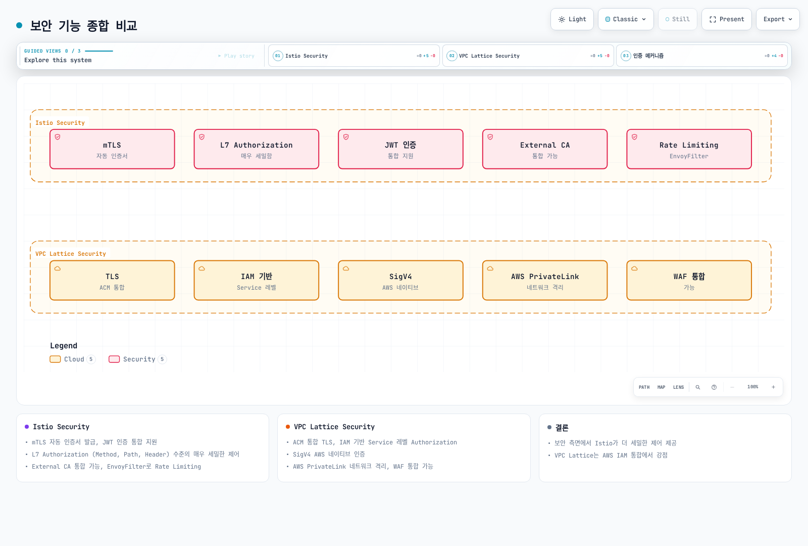

[🔍 인터랙티브 다이어그램 보기](https://www.atomai.click/kubernetes-docs/archmaps/ko-service-mesh-istio-comparison-02-istio-vs-lattice-2.html)

**결론**: 보안 측면에서 **Istio가 더 세밀한 제어 제공**, VPC Lattice는 AWS IAM 통합에서 강점

## 관찰성 및 모니터링

### Metrics 수집

#### Istio

```yaml
# Prometheus 메트릭 (50+ 기본 제공)
# 요청 메트릭
istio_requests_total{
  destination_service="backend",
  response_code="200",
  source_app="frontend"
}

# Latency 메트릭 (히스토그램)
istio_request_duration_milliseconds_bucket{
  destination_service="backend",
  le="100"
}

# Connection Pool 메트릭
envoy_cluster_upstream_cx_active{
  cluster_name="outbound|8080||backend"
}

# Circuit Breaker 메트릭
envoy_cluster_outlier_detection_ejections_active

# Custom Metrics (Telemetry API)
apiVersion: telemetry.istio.io/v1alpha1
kind: Telemetry
metadata:
  name: custom-metrics
spec:
  metrics:
  - providers:
    - name: prometheus
    dimensions:
      request_method:
        value: request.method
      custom_header:
        value: request.headers['x-custom-header'] | ''
```

**특징**:

* 50+ 기본 메트릭
* Prometheus 형식
* OpenTelemetry 통합
* 커스텀 메트릭 추가 가능
* Exemplar 지원 (메트릭-트레이스 연결)

#### VPC Lattice

```bash
# CloudWatch 메트릭
aws cloudwatch get-metric-statistics \
  --namespace AWS/VPCLattice \
  --metric-name RequestCount \
  --dimensions Name=ServiceName,Value=backend \
  --start-time 2025-01-01T00:00:00Z \
  --end-time 2025-01-01T23:59:59Z \
  --period 300 \
  --statistics Sum
```

**기본 메트릭**:

* `RequestCount`: 요청 수
* `ActiveConnectionCount`: 활성 연결 수
* `HealthyTargetCount`: 정상 타겟 수
* `UnhealthyTargetCount`: 비정상 타겟 수
* `TargetResponseTime`: 응답 시간
* `HTTPCode_Target_4XX_Count`: 4xx 에러
* `HTTPCode_Target_5XX_Count`: 5xx 에러

**특징**:

* CloudWatch 통합
* 기본 메트릭만 제공
* 커스텀 메트릭 불가
* 1분 또는 5분 세분화

### Distributed Tracing

#### Istio

```yaml
# Telemetry API로 트레이싱 설정
apiVersion: telemetry.istio.io/v1alpha1
kind: Telemetry
metadata:
  name: tracing
  namespace: istio-system
spec:
  tracing:
  - providers:
    - name: jaeger
    randomSamplingPercentage: 10.0
    customTags:
      environment:
        literal:
          value: "production"
      user_id:
        header:
          name: "x-user-id"
---
# MeshConfig에서 글로벌 설정
apiVersion: v1
kind: ConfigMap
metadata:
  name: istio
  namespace: istio-system
data:
  mesh: |
    defaultConfig:
      tracing:
        sampling: 10.0
        zipkin:
          address: jaeger-collector.observability:9411
```

**지원 백엔드**:

* Jaeger ✅
* Zipkin ✅
* Tempo ✅
* AWS X-Ray ✅
* Datadog APM ✅
* OpenTelemetry Collector ✅

**특징**:

* W3C Trace Context 표준
* 자동 Span 생성
* 커스텀 태그 추가
* Sampling 제어
* Baggage 전파

#### VPC Lattice

```bash
# Access Log를 S3로 전송
aws vpc-lattice create-access-log-subscription \
  --resource-identifier $SERVICE_ID \
  --destination-arn arn:aws:s3:::lattice-logs

# CloudWatch Logs로 전송
aws vpc-lattice create-access-log-subscription \
  --resource-identifier $SERVICE_ID \
  --destination-arn arn:aws:logs:region:account:log-group:/aws/vpclattice
```

**액세스 로그 형식** (JSON):

```json
{
  "timestamp": "2025-01-15T12:34:56.789Z",
  "serviceNetworkArn": "arn:aws:vpc-lattice:...",
  "serviceArn": "arn:aws:vpc-lattice:...",
  "requestMethod": "GET",
  "requestPath": "/api/users",
  "requestProtocol": "HTTP/1.1",
  "responseCode": 200,
  "responseCodeDetails": "OK",
  "requestHeaders": {},
  "sourceVpcArn": "arn:aws:ec2:...",
  "targetGroupArn": "arn:aws:vpc-lattice:...",
  "traceparent": "00-4bf92f3577b34da6a3ce929d0e0e4736-00f067aa0ba902b7-01"
}
```

**특징**:

* W3C Trace Context 헤더 (`traceparent`) 지원
* S3 또는 CloudWatch Logs로 전송
* AWS X-Ray 통합 가능 (애플리케이션 계측 필요)
* 자동 트레이싱 없음 (수동 계측)

**비교**:

* **Istio**: 자동 트레이싱, 모든 백엔드 지원, 세밀한 제어
* **VPC Lattice**: 액세스 로그 기반, X-Ray 수동 통합 필요

### 시각화 대시보드

#### Istio + Kiali

```yaml
apiVersion: kiali.io/v1alpha1
kind: Kiali
metadata:
  name: kiali
spec:
  deployment:
    accessible_namespaces: ["**"]
  external_services:
    prometheus:
      url: http://prometheus:9090
    grafana:
      enabled: true
      url: http://grafana:3000
    tracing:
      enabled: true
      url: http://jaeger-query:16686
```

**기능**:

* 실시간 서비스 토폴로지 그래프
* 트래픽 흐름 시각화
* 에러율, 레이턴시 표시
* Istio 설정 검증
* 분산 추적 통합

#### VPC Lattice

* **AWS Console**: 기본 메트릭 및 로그 뷰
* **CloudWatch Dashboard**: 커스텀 대시보드 생성
* **CloudWatch ServiceLens**: X-Ray와 연동 시 서비스 맵

**비교**:

* **Istio**: 전용 시각화 도구 (Kiali), 실시간 토폴로지
* **VPC Lattice**: CloudWatch 기반, 기본적인 시각화

### 관찰성 종합 비교

| 기능                      | Istio           | VPC Lattice | 승자    |
| ----------------------- | --------------- | ----------- | ----- |
| **Metrics**             | 50+ 메트릭         | \~10 메트릭    | Istio |
| **Custom Metrics**      | ✅ Telemetry API | ❌           | Istio |
| **Distributed Tracing** | ✅ 자동            | ⚠️ 수동 계측    | Istio |
| **Tracing Backends**    | 6+              | X-Ray만      | Istio |
| **Access Logs**         | ✅ 매우 상세함        | ✅ 기본        | Istio |
| **시각화**                 | Kiali, Grafana  | CloudWatch  | Istio |
| **실시간 관찰**              | ✅               | ⚠️ 제한적      | Istio |
| **Exemplars**           | ✅               | ❌           | Istio |

**결론**: 관찰성 측면에서 **Istio가 압도적 우위**

## 운영 복잡도

### Istio 운영의 실제 어려움

Istio는 강력한 기능을 제공하지만, 프로덕션 환경에서 운영하는 것은 상당한 도전 과제입니다.

#### 주요 운영 과제

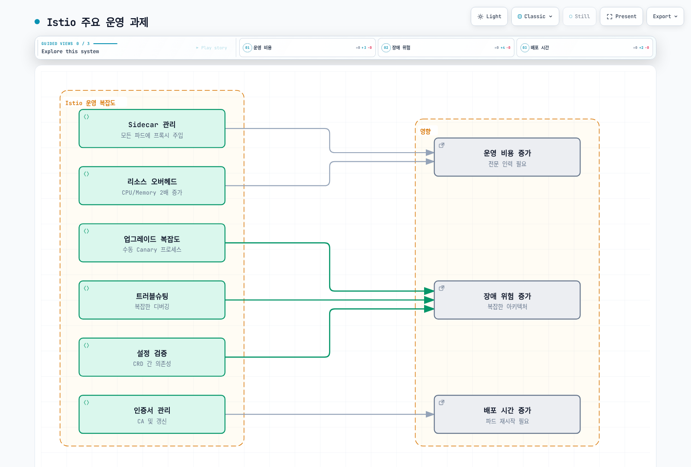

[🔍 인터랙티브 다이어그램 보기](https://www.atomai.click/kubernetes-docs/archmaps/ko-service-mesh-istio-comparison-02-istio-vs-lattice-3.html)

### 설치 및 초기 설정

#### Istio

```bash
# 1. Istioctl 설치
curl -L https://istio.io/downloadIstio | sh -
cd istio-1.24.0
export PATH=$PWD/bin:$PATH

# 2. Istio 설치 (프로덕션 프로필)
istioctl install --set profile=production

# 3. Namespace에 Sidecar 주입 활성화
kubectl label namespace default istio.io/injection=enabled

# 4. 게이트웨이 배포
kubectl apply -f samples/bookinfo/networking/bookinfo-gateway.yaml

# 5. 관찰성 도구 설치
kubectl apply -f samples/addons/prometheus.yaml
kubectl apply -f samples/addons/grafana.yaml
kubectl apply -f samples/addons/jaeger.yaml
kubectl apply -f samples/addons/kiali.yaml

# 6. 설정 검증
istioctl analyze
```

**시간**: 30-60분 (설정 포함) **복잡도**: ⭐⭐⭐⭐ (높음)

**초기 설정 과제**:

* **CRD 이해**: 10+ 종류의 Istio CRD 학습 필요 (VirtualService, DestinationRule, Gateway, PeerAuthentication, AuthorizationPolicy 등)
* **프로필 선택**: 6가지 설치 프로필 (default, demo, minimal, remote, empty, preview) 중 적합한 것 선택
* **리소스 할당**: Control Plane 및 Sidecar의 적절한 리소스 할당
* **멀티 테넌시**: 네임스페이스 격리 및 정책 설계

#### VPC Lattice

```bash
# 1. Service Network 생성
SERVICE_NETWORK_ID=$(aws vpc-lattice create-service-network \
  --name production-network \
  --auth-type AWS_IAM \
  --query 'id' --output text)

# 2. VPC 연결
aws vpc-lattice create-service-network-vpc-association \
  --service-network-identifier $SERVICE_NETWORK_ID \
  --vpc-identifier vpc-xxx \
  --security-group-ids sg-xxx

# 3. Service 생성
SERVICE_ID=$(aws vpc-lattice create-service \
  --name backend-service \
  --auth-type AWS_IAM \
  --query 'id' --output text)

# 4. Service를 Network에 연결
aws vpc-lattice create-service-network-service-association \
  --service-network-identifier $SERVICE_NETWORK_ID \
  --service-identifier $SERVICE_ID

# 5. Target Group 생성
TG_ID=$(aws vpc-lattice create-target-group \
  --name backend-tg \
  --type IP \
  --config '{
    "port": 8080,
    "protocol": "HTTP",
    "vpcIdentifier": "vpc-xxx"
  }' \
  --query 'id' --output text)

# 6. Target 등록
aws vpc-lattice register-targets \
  --target-group-identifier $TG_ID \
  --targets id=10.0.1.10,port=8080

# 7. Listener 생성
aws vpc-lattice create-listener \
  --service-identifier $SERVICE_ID \
  --protocol HTTP \
  --port 80 \
  --default-action '{
    "forward": {
      "targetGroups": [{"targetGroupIdentifier": "'$TG_ID'"}]
    }
  }'
```

**시간**: 10-20분 **복잡도**: ⭐⭐ (중간)

### 업그레이드: Istio의 가장 큰 과제

#### Istio 업그레이드의 복잡성

Istio 업그레이드는 프로덕션 환경에서 가장 위험하고 복잡한 작업 중 하나입니다.

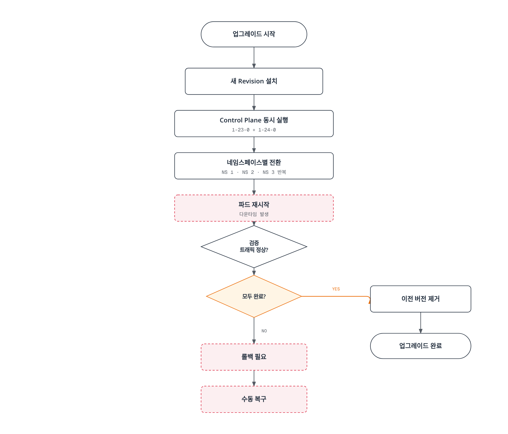

[🔍 인터랙티브 다이어그램 보기](https://www.atomai.click/kubernetes-docs/archmaps/ko-service-mesh-istio-comparison-02-istio-vs-lattice-4.html)

#### Istio Revision 기반 Canary 업그레이드

**업그레이드 아키텍처**:

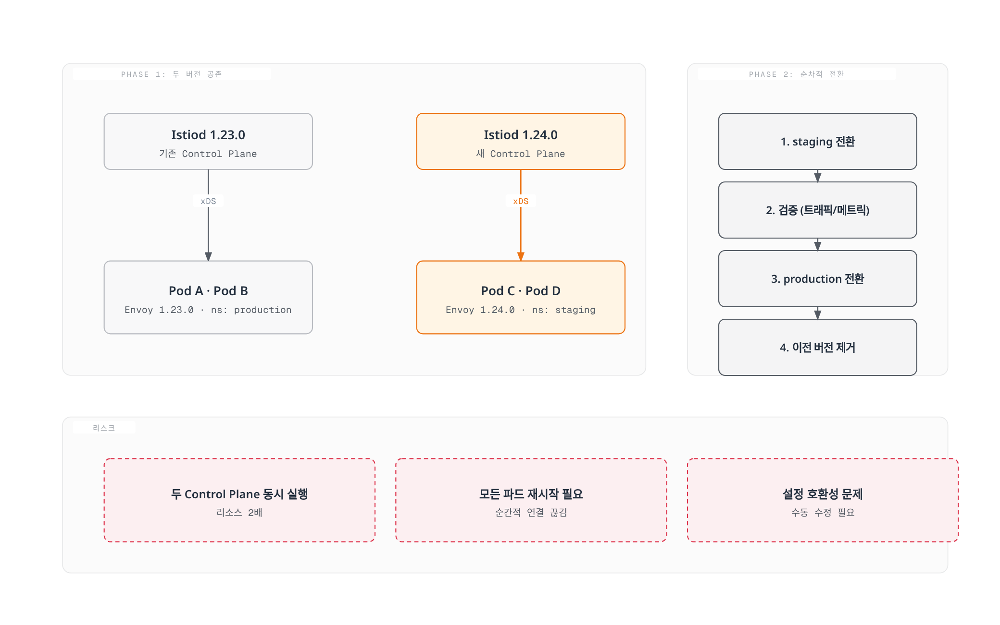

[🔍 인터랙티브 다이어그램 보기](https://www.atomai.click/kubernetes-docs/archmaps/ko-service-mesh-istio-comparison-02-istio-vs-lattice-5.html)

**전체 프로세스** (프로덕션 환경 기준):

```bash
# ============================================
# Phase 1: 사전 준비 (1-2시간)
# ============================================

# 1. 현재 버전 확인
istioctl version

# 2. 백업 생성
kubectl get all -n istio-system -o yaml > istio-backup-$(date +%Y%m%d).yaml
kubectl get virtualservices,destinationrules,gateways -A -o yaml > istio-configs-backup-$(date +%Y%m%d).yaml

# 3. 릴리스 노트 확인
curl -sL https://istio.io/latest/news/releases/1.24.x/announcing-1.24/ | grep -A 20 "Breaking Changes"

# 4. 호환성 확인
istioctl experimental precheck

# ============================================
# Phase 2: 새 버전 설치 (30분)
# ============================================

# 5. 새 Revision으로 Control Plane 설치
istioctl install --set profile=production --revision=1-24-0 --skip-confirmation

# 6. 설치 확인
kubectl get pods -n istio-system
# 출력 예시:
# istiod-1-23-0-xxx   1/1     Running   (기존 버전)
# istiod-1-24-0-xxx   1/1     Running   (새 버전)

# 7. Webhook 확인
kubectl get mutatingwebhookconfiguration
# istio-sidecar-injector-1-23-0
# istio-sidecar-injector-1-24-0  (새로 생성됨)

# ============================================
# Phase 3: Canary 전환 (네임스페이스별 2-3시간)
# ============================================

# 8. 첫 번째 네임스페이스 (dev 또는 staging)
kubectl label namespace dev istio.io/rev=1-24-0 --overwrite
kubectl label namespace dev istio-injection- # 기존 레이블 제거

# 9. 파드 재시작 (롤링 재시작)
kubectl rollout restart deployment -n dev

# 10. Sidecar 버전 확인
kubectl get pods -n dev -o jsonpath='{range .items[*]}{.metadata.name}{"\t"}{.spec.containers[?(@.name=="istio-proxy")].image}{"\n"}{end}'

# 11. 트래픽 검증 (매우 중요!)
kubectl exec -n dev deploy/webapp -c webapp -- curl -s http://backend:8080/health
istioctl proxy-status | grep "1-24-0"

# 12. 메트릭 확인
kubectl port-forward -n istio-system svc/prometheus 9090:9090
# Prometheus에서 확인:
# - istio_requests_total
# - istio_request_duration_milliseconds
# - pilot_xds_pushes (Control Plane 부하)

# 13. 문제 없으면 다음 네임스페이스로 진행
kubectl label namespace staging istio.io/rev=1-24-0 --overwrite
kubectl rollout restart deployment -n staging

# 14. 프로덕션 네임스페이스 (가장 신중하게!)
# 트래픽이 적은 시간대 선택
kubectl label namespace production istio.io/rev=1-24-0 --overwrite
kubectl rollout restart deployment -n production

# 15. 프로덕션 검증 (30분-1시간)
# - 에러율 확인
# - Latency 확인
# - Envoy 설정 확인
istioctl proxy-config cluster <pod-name> -n production

# ============================================
# Phase 4: 정리 (1시간)
# ============================================

# 16. 모든 네임스페이스가 새 버전으로 전환되었는지 확인
kubectl get namespace -L istio.io/rev

# 17. 이전 버전 제거 (주의: 롤백 불가능!)
istioctl uninstall --revision 1-23-0 --skip-confirmation

# 18. Webhook 정리
kubectl delete mutatingwebhookconfiguration istio-sidecar-injector-1-23-0
kubectl delete validatingwebhookconfiguration istio-validator-1-23-0-istio-system

# 19. 최종 검증
istioctl version
kubectl get pods -n istio-system
```

**전체 소요 시간**: **6-10시간** (네임스페이스 수에 따라 증가)

**업그레이드 중 발생 가능한 문제**:

| 문제                       | 증상                | 해결 방법                        | 다운타임    |
| ------------------------ | ----------------- | ---------------------------- | ------- |
| **Sidecar 주입 실패**        | 새 파드가 시작되지 않음     | Webhook 설정 확인, Annotation 확인 | 5-15분   |
| **Control Plane 리소스 부족** | Istiod OOMKilled  | 리소스 증가 후 재설치                 | 10-30분  |
| **설정 호환성 문제**            | VirtualService 에러 | 호환되지 않는 설정 수정                | 15-60분  |
| **Envoy 버전 불일치**         | 트래픽 실패            | 파드 강제 재시작                    | 5-20분   |
| **인증서 갱신 실패**            | mTLS 연결 실패        | CA 재발급                       | 30-120분 |

**롤백 시나리오**:

```bash
# 긴급 롤백 (문제 발생 시)
# 1. 문제가 있는 네임스페이스를 이전 버전으로 되돌림
kubectl label namespace production istio.io/rev=1-23-0 --overwrite
kubectl rollout restart deployment -n production

# 2. 새 버전 Control Plane 제거
istioctl uninstall --revision 1-24-0

# 3. 검증
istioctl proxy-status
```

**업그레이드 복잡도 비교**:

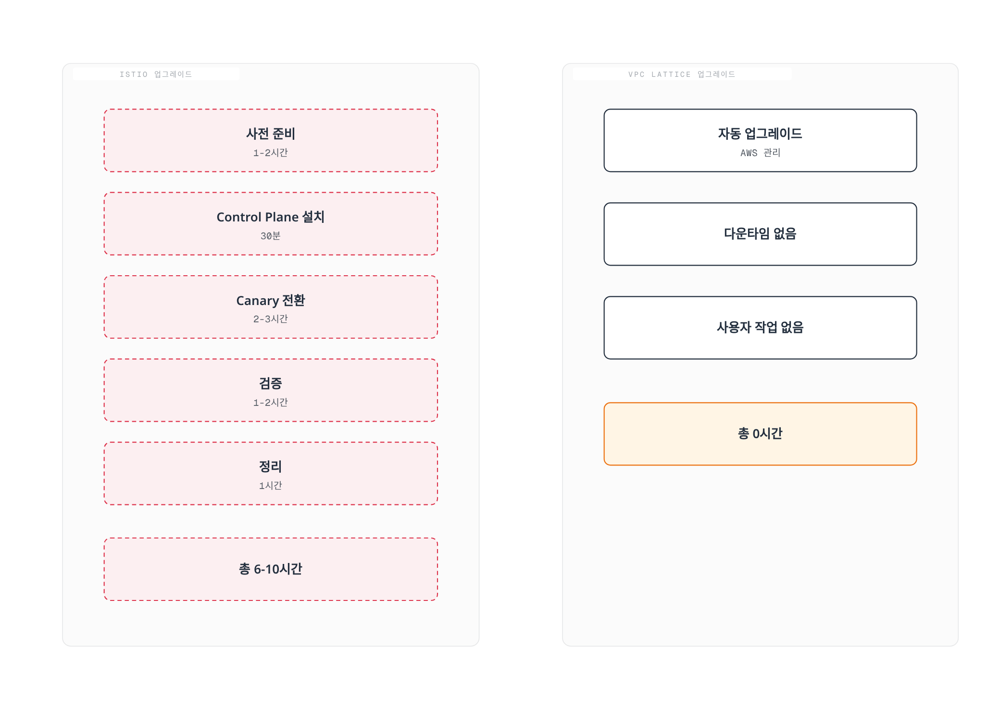

[🔍 인터랙티브 다이어그램 보기](https://www.atomai.click/kubernetes-docs/archmaps/ko-service-mesh-istio-comparison-02-istio-vs-lattice-6.html)

**주요 과제**:

* ✅ **장점**: Zero-downtime 가능, 점진적 롤아웃, 롤백 가능
* ❌ **단점**:
  * 매우 복잡한 수동 프로세스
  * 전문 지식 필요
  * 6-10시간의 작업 시간
  * 모든 파드 재시작 필요 (워크로드 영향)
  * 두 버전의 Control Plane 동시 실행 (리소스 2배)

#### VPC Lattice

**자동 업그레이드**: AWS가 관리형 서비스 업데이트

**사용자 작업**: 없음

### Sidecar 오버헤드: 숨겨진 비용

#### Sidecar 모델의 문제점

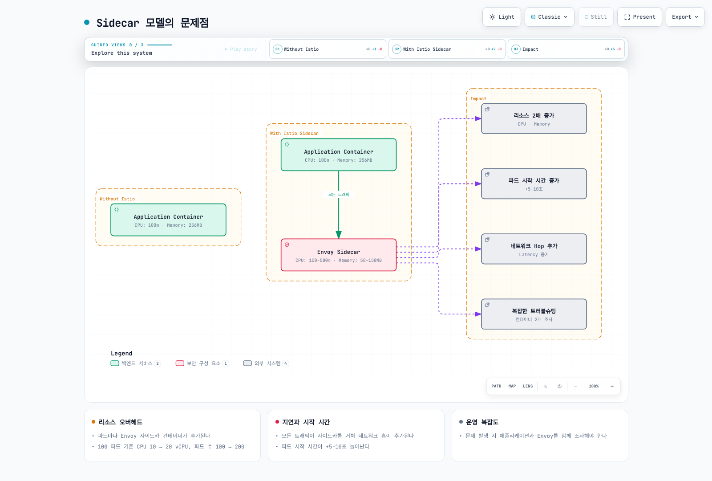

[🔍 인터랙티브 다이어그램 보기](https://www.atomai.click/kubernetes-docs/archmaps/ko-service-mesh-istio-comparison-02-istio-vs-lattice-7.html)

#### 실제 리소스 오버헤드

**100 파드 환경에서의 영향**:

| 항목               | Without Istio | With Istio       | 증가량    | 비용 영향     |
| ---------------- | ------------- | ---------------- | ------ | --------- |
| **CPU (총)**      | 10 vCPU       | 20 vCPU          | +100%  | +$120/월   |
| **Memory (총)**   | 25GB          | 40GB             | +60%   | +$80/월    |
| **파드 수**         | 100           | 200 (Sidecar 포함) | +100%  | 관리 복잡도 증가 |
| **네트워크 Latency** | 1ms           | 2-3ms            | +1-2ms | 사용자 경험 영향 |
| **파드 시작 시간**     | 10초           | 15-20초           | +5-10초 | 배포 시간 증가  |

**리소스 할당 계산**:

```bash
# 애플리케이션당 리소스
Application: 100m CPU, 256MB Memory

# Istio Sidecar 추가 리소스 (기본값)
Envoy Sidecar:
  requests:
    cpu: 100m
    memory: 128Mi
  limits:
    cpu: 2000m  # 버스트 가능
    memory: 1024Mi

# 100개 파드 환경
# 기존: 100 * 100m = 10 vCPU, 100 * 256MB = 25.6GB
# Istio 추가: 100 * 100m = 10 vCPU, 100 * 128MB = 12.8GB
# 총합: 20 vCPU, 38.4GB (약 2배 증가)
```

**비용 계산** (EKS m5.xlarge: 4 vCPU, 16GB, $140/월):

```bash
# Without Istio
# 필요 노드: ceil(10 vCPU / 4) = 3 nodes
# 비용: 3 * $140 = $420/월

# With Istio
# 필요 노드: ceil(20 vCPU / 4) = 5 nodes
# 비용: 5 * $140 = $700/월

# 추가 비용: $280/월 (약 67% 증가)
```

#### Ambient Mode: 차세대 아키텍처

Istio 1.24+ 부터 **Ambient Mode**가 정식 지원되어, Sidecar 없이도 Service Mesh 기능을 사용할 수 있습니다.

**아키텍처 비교 (상세)**:

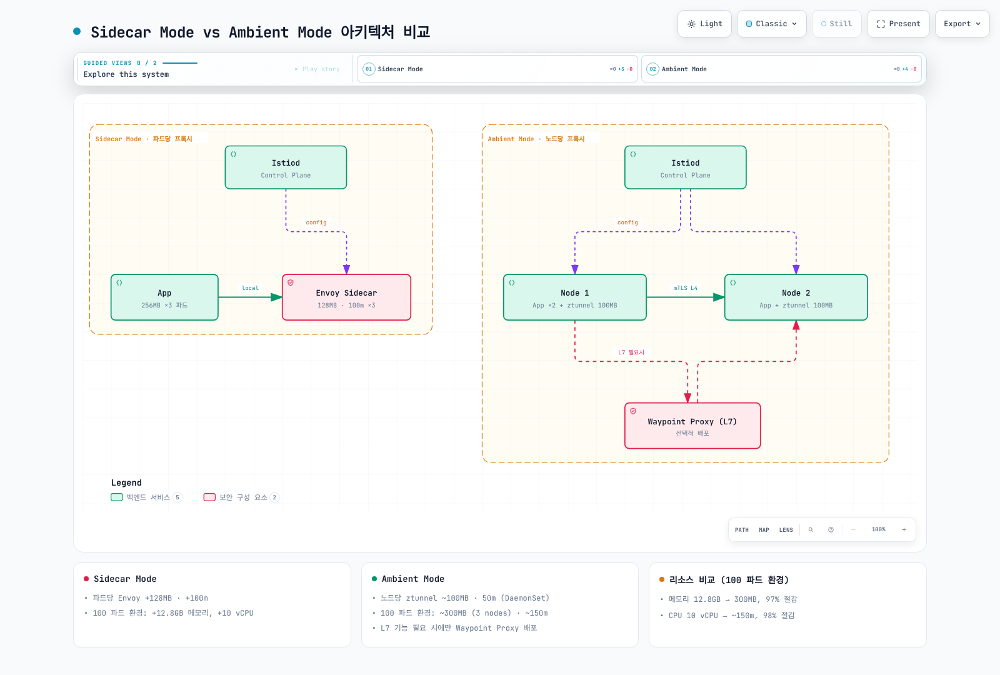

[🔍 인터랙티브 다이어그램 보기](https://www.atomai.click/kubernetes-docs/archmaps/ko-service-mesh-istio-comparison-02-istio-vs-lattice-8.html)

**Ambient Mode 트래픽 흐름 (eBPF 기반)**:

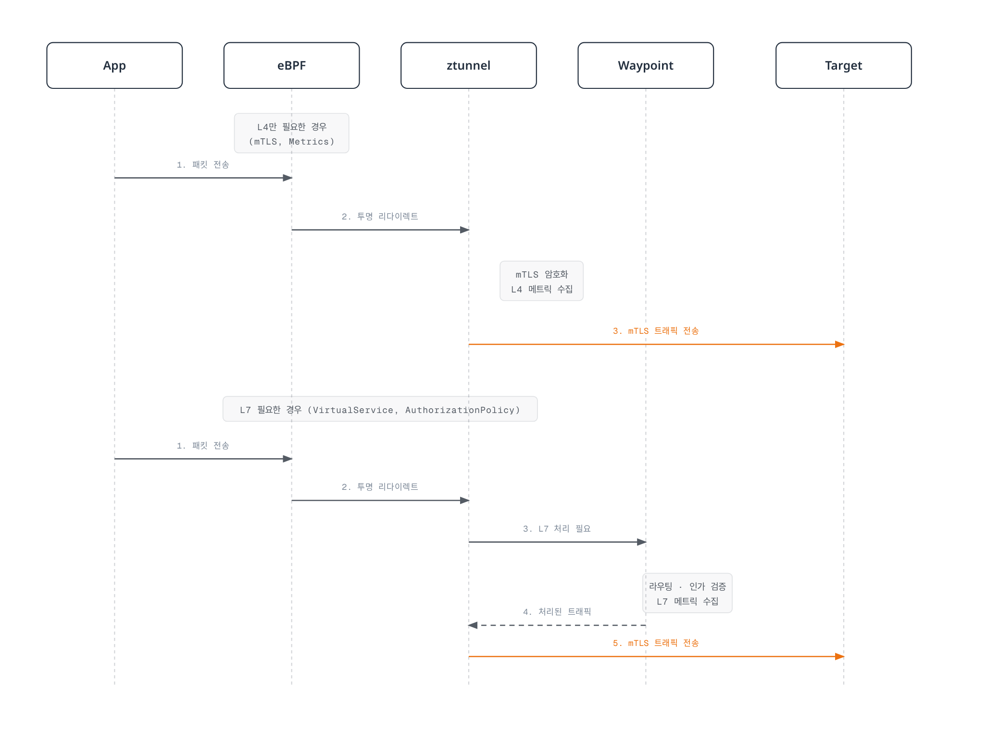

[🔍 인터랙티브 다이어그램 보기](https://www.atomai.click/kubernetes-docs/archmaps/ko-service-mesh-istio-comparison-02-istio-vs-lattice-9.html)

**Ambient Mode 리소스 비교**:

| 항목                | Sidecar Mode | Ambient Mode      | 절감률        |
| ----------------- | ------------ | ----------------- | ---------- |
| **파드당 메모리**       | +128MB       | 0MB               | 100%       |
| **파드당 CPU**       | +100m        | 0m                | 100%       |
| **노드당 ztunnel**   | N/A          | \~100MB, 50m      | 클러스터 전체 공유 |
| **100 파드 환경 메모리** | +12.8GB      | \~300MB (3 nodes) | **97% 절감** |
| **100 파드 환경 CPU** | +10 vCPU     | \~150m            | **98% 절감** |

**Ambient Mode 설치**:

```bash
# 1. Ambient Mode로 Istio 설치
istioctl install --set profile=ambient

# 2. 네임스페이스에 Ambient 활성화
kubectl label namespace default istio.io/dataplane-mode=ambient

# 3. 파드 재시작 (Sidecar 없이 배포됨)
kubectl rollout restart deployment -n default

# 4. ztunnel 확인
kubectl get pods -n istio-system | grep ztunnel
# ztunnel-abc123   2/2     Running   (각 노드에 DaemonSet)

# 5. L7 기능 필요 시 Waypoint Proxy 배포
istioctl waypoint apply --namespace default
```

**Ambient Mode 제한사항** (2025년 1월 기준):

* ⚠️ 일부 고급 기능 미지원 (예: TCP-based 프로토콜 제한)
* ⚠️ Sidecar 대비 성능 차이 (eBPF 기반으로 개선 중)
* ⚠️ 프로덕션 사용 시 충분한 테스트 필요

### 일상 운영

#### Istio

**정기 작업**:

* **Sidecar 버전 관리**: 파드 재시작 시 자동 주입, 버전 불일치 확인
* **리소스 모니터링**: Envoy Proxy가 각 파드의 리소스 사용
* **인증서 모니터링**: 자동 갱신되지만 확인 필요 (기본 15분마다)
* **Istiod 상태 확인**: Control Plane 리소스 및 로그
* **설정 드리프트 검증**: `istioctl analyze` 정기 실행
* **Envoy 설정 동기화**: xDS 동기화 실패 시 수동 개입
* **메트릭 및 로그 분석**: Prometheus, Jaeger, Kiali 모니터링

**예상 시간**: **15-25시간/월** (규모에 따라 증가)

#### VPC Lattice

**정기 작업**:

* CloudWatch 메트릭 모니터링
* Access Log 분석
* Target 헬스 확인

**예상 시간**: 2-5시간/월

### 트러블슈팅

#### Istio 디버깅 복잡도

**문제 발생 시 확인해야 할 레이어**:

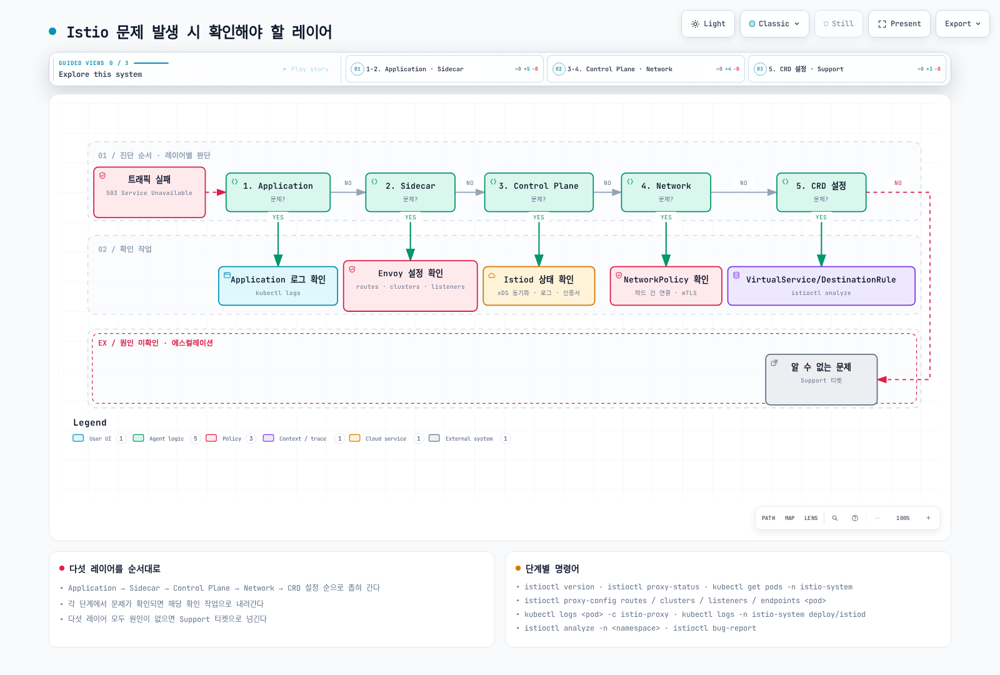

[🔍 인터랙티브 다이어그램 보기](https://www.atomai.click/kubernetes-docs/archmaps/ko-service-mesh-istio-comparison-02-istio-vs-lattice-10.html)

**실제 트러블슈팅 예시**:

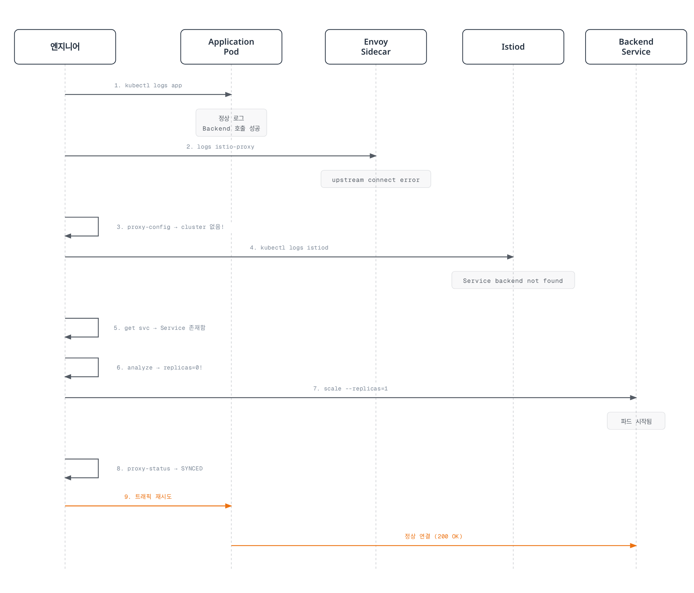

[🔍 인터랙티브 다이어그램 보기](https://www.atomai.click/kubernetes-docs/archmaps/ko-service-mesh-istio-comparison-02-istio-vs-lattice-11.html)

**Istio 트러블슈팅 명령어**:

```bash
# ============================================
# 1. 전체 상태 확인 (첫 단계)
# ============================================
istioctl version              # 버전 확인
istioctl proxy-status         # 모든 프록시 동기화 상태
kubectl get pods -n istio-system  # Control Plane 상태

# ============================================
# 2. 프록시 설정 확인
# ============================================
# Routes (VirtualService 반영)
istioctl proxy-config routes <pod> -n <namespace>

# Clusters (DestinationRule 반영)
istioctl proxy-config clusters <pod> -n <namespace>

# Listeners (트래픽 리스닝)
istioctl proxy-config listeners <pod> -n <namespace>

# Endpoints (실제 파드 IP)
istioctl proxy-config endpoints <pod> -n <namespace>

# ============================================
# 3. 로그 확인 (단계별)
# ============================================
# Application 로그
kubectl logs <pod> -c <container>

# Sidecar 로그
kubectl logs <pod> -c istio-proxy

# Istiod 로그
kubectl logs -n istio-system deploy/istiod

# 로그 레벨 동적 변경
istioctl proxy-config log <pod> --level debug

# ============================================
# 4. Envoy 통계 (심화)
# ============================================
kubectl exec <pod> -c istio-proxy -- curl localhost:15000/stats/prometheus
kubectl exec <pod> -c istio-proxy -- curl localhost:15000/clusters
kubectl exec <pod> -c istio-proxy -- curl localhost:15000/config_dump

# ============================================
# 5. 설정 검증
# ============================================
istioctl analyze -n <namespace>  # 네임스페이스별
istioctl analyze --all-namespaces  # 전체

# ============================================
# 6. 디버그 정보 수집 (Support 티켓용)
# ============================================
istioctl bug-report
# 결과: istio-bug-report-YYYYMMDD-HHMMSS.tar.gz

# ============================================
# 7. 실시간 트래픽 확인 (tcpdump)
# ============================================
kubectl exec <pod> -c istio-proxy -- tcpdump -i any -w /tmp/capture.pcap
```

#### VPC Lattice 디버깅 간편성

**문제 발생 시 확인 레이어 (3단계만)**:

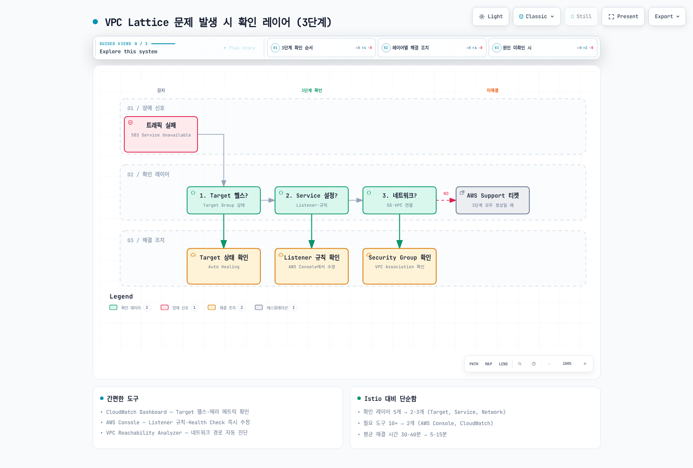

[🔍 인터랙티브 다이어그램 보기](https://www.atomai.click/kubernetes-docs/archmaps/ko-service-mesh-istio-comparison-02-istio-vs-lattice-12.html)

**실제 트러블슈팅 예시 (VPC Lattice)**:

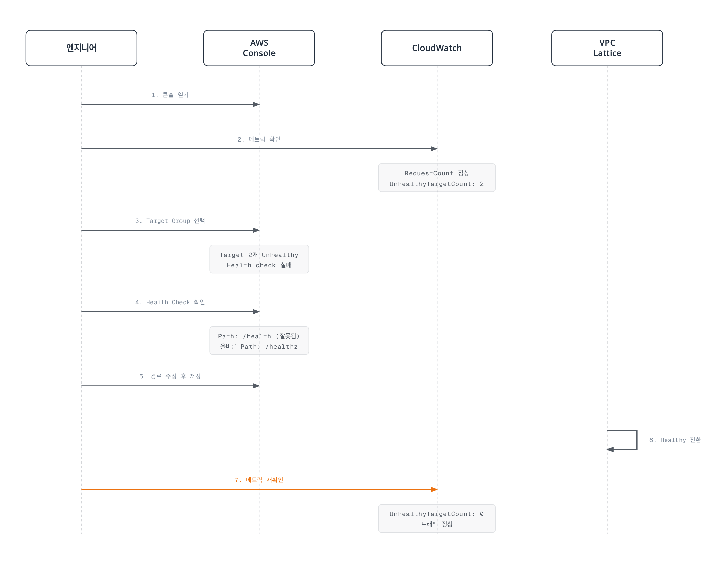

[🔍 인터랙티브 다이어그램 보기](https://www.atomai.click/kubernetes-docs/archmaps/ko-service-mesh-istio-comparison-02-istio-vs-lattice-13.html)

**VPC Lattice 트러블슈팅 명령어** (간단함):

```bash
# ============================================
# 1. Service 상태 확인
# ============================================
aws vpc-lattice get-service --service-identifier $SERVICE_ID
aws vpc-lattice list-services --service-network-identifier $NETWORK_ID

# ============================================
# 2. Target 헬스 확인
# ============================================
aws vpc-lattice list-targets \
  --target-group-identifier $TG_ID

aws vpc-lattice get-target-group \
  --target-group-identifier $TG_ID

# ============================================
# 3. Access Log 확인 (CloudWatch Insights)
# ============================================
# 최근 1시간 에러 확인
aws logs start-query \
  --log-group-name /aws/vpclattice \
  --start-time $(date -d '1 hour ago' +%s) \
  --end-time $(date +%s) \
  --query-string 'fields @timestamp, requestMethod, requestPath, responseCode | filter responseCode >= 500'

# 특정 서비스 로그만
aws logs start-query \
  --log-group-name /aws/vpclattice \
  --query-string 'fields @timestamp, requestMethod, requestPath, responseCode | filter serviceArn = "arn:aws:vpc-lattice:..." | filter responseCode >= 500'

# ============================================
# 4. CloudWatch 메트릭 (GUI 권장)
# ============================================
# CLI로도 가능하지만 AWS Console Dashboard가 더 편리함
aws cloudwatch get-metric-statistics \
  --namespace AWS/VPCLattice \
  --metric-name HealthyTargetCount \
  --dimensions Name=ServiceName,Value=backend \
  --start-time 2025-01-01T00:00:00Z \
  --end-time 2025-01-01T23:59:59Z \
  --period 300 \
  --statistics Average

# ============================================
# 5. VPC Reachability Analyzer (자동 진단)
# ============================================
aws ec2 create-network-insights-path \
  --source <eni-id> \
  --destination <service-id>

aws ec2 start-network-insights-analysis \
  --network-insights-path-id <path-id>
```

**트러블슈팅 복잡도 비교**:

| 항목           | Istio                               | VPC Lattice                     | 차이                  |
| ------------ | ----------------------------------- | ------------------------------- | ------------------- |
| **확인 레이어**   | 5개 (App, Sidecar, CP, Network, CRD) | 2-3개 (Target, Service, Network) | **Lattice 2-3배 간단** |
| **필요 도구**    | 10+ (istioctl, kubectl, curl 등)     | 2개 (AWS Console, CloudWatch)    | **Lattice 5배 적음**   |
| **평균 해결 시간** | 30-60분                              | 5-15분                           | **Lattice 3-6배 빠름** |
| **전문 지식**    | Kubernetes, Envoy, Istio CRD        | AWS 기본 지식                       | **Lattice 쉬움**      |
| **CLI 명령어**  | 20+ 복잡한 명령어                         | 5개 간단한 명령어                      | **Lattice 4배 적음**   |
| **디버깅 도구**   | istioctl, tcpdump, Envoy admin      | CloudWatch, AWS Console         | **Lattice GUI 중심**  |

**비교**:

* **Istio**: 5개 레이어, 10+ 도구, 30-60분 소요, 전문 지식 필수
* **VPC Lattice**: 2-3개 레이어, AWS Console 중심, 5-15분 소요, 일반 AWS 지식

### 운영 복잡도 종합 비교

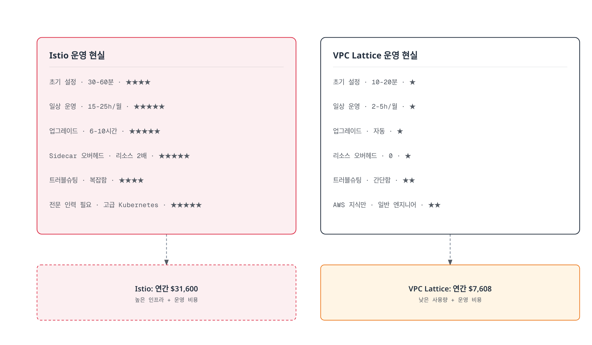

[🔍 인터랙티브 다이어그램 보기](https://www.atomai.click/kubernetes-docs/archmaps/ko-service-mesh-istio-comparison-02-istio-vs-lattice-14.html)

#### 운영 복잡도 상세 비교

| 작업             | Istio             | VPC Lattice         | 차이                    |
| -------------- | ----------------- | ------------------- | --------------------- |
| **초기 설정**      | 30-60분, CRD 학습 필요 | 10-20분, AWS Console | **Lattice 3배 빠름**     |
| **업그레이드**      | 6-10시간, 수동 Canary | 자동, 0시간             | **Lattice 완전 자동**     |
| **일상 운영**      | 15-25h/월          | 2-5h/월              | **Lattice 5-10배 적음**  |
| **Sidecar 관리** | 모든 파드 재시작 필요      | N/A                 | **Lattice 관리 불필요**    |
| **리소스 오버헤드**   | CPU/Memory 2배     | 0                   | **Lattice 무오버헤드**     |
| **트러블슈팅**      | 복잡, 전문 도구 필요      | 간단, CloudWatch      | **Lattice 쉬움**        |
| **학습 곡선**      | 가파름, 3-6개월        | 완만함, 1-2주           | **Lattice 10배 빠름**    |
| **전문 인력**      | Service Mesh 전문가  | 일반 AWS 엔지니어         | **Lattice 인력 구하기 쉬움** |
| **장애 위험**      | 높음, 복잡한 아키텍처      | 낮음, AWS 관리          | **Lattice 안정적**       |

#### Istio 운영의 숨겨진 비용

**기술 부채**:

* 10+ 종류의 CRD 관리
* VirtualService, DestinationRule 간 복잡한 의존성
* Sidecar 버전 불일치 문제
* Control Plane 업그레이드 실패 시 전체 메시 영향
* 디버깅 시 Application + Envoy + Istiod 모두 확인 필요

**조직 비용**:

* Service Mesh 전문가 채용 어려움 (연봉 $150k+)
* 온보딩 시간 3-6개월
* 24/7 온콜 필요 (복잡한 장애 대응)
* 정기 교육 및 훈련 필요

**기회 비용**:

* 운영에 투입되는 시간 = 기능 개발 불가
* 업그레이드 중 다른 작업 중단
* 장애 대응 시 전체 팀 동원

**결론**: 운영 복잡도 측면에서 **VPC Lattice가 압도적 우위**

**중요**: Istio를 선택한다면 반드시 고려해야 할 사항:

* ✅ 전담 Platform 팀 구성 (최소 2-3명)
* ✅ 충분한 예산 (인프라 + 인건비)
* ✅ 장기적인 유지보수 계획
* ✅ 정기적인 교육 및 업데이트
* ✅ 24/7 지원 체계

## 비용 분석

### Istio 비용 모델 (상세)

#### 인프라 비용 (100 파드 환경, EKS)

**컴퓨팅 비용**:

| 구성 요소                      | 리소스             | 노드 요구량                  | 비용 (월)     |
| -------------------------- | --------------- | ----------------------- | ---------- |
| **애플리케이션** (100 파드)        | 10 vCPU, 25GB   | 3 nodes (m5.xlarge)     | $420       |
| **Envoy Sidecar** (100 파드) | 10 vCPU, 12.8GB | +2 nodes (Sidecar 오버헤드) | $280       |
| **Istiod** (Control Plane) | 1 vCPU, 2GB     | 포함                      | -          |
| **Prometheus**             | 2 vCPU, 8GB     | 추가 리소스                  | $80        |
| **Jaeger**                 | 1 vCPU, 4GB     | 추가 리소스                  | $50        |
| **Kiali**                  | 0.5 vCPU, 1GB   | 추가 리소스                  | $20        |
| **총 컴퓨팅**                  |                 | **5 nodes**             | **$850/월** |

**스토리지 비용**:

* Prometheus 메트릭: 100GB SSD → $10/월
* Jaeger 트레이스: 50GB SSD → $5/월
* 총 스토리지: **$15/월**

**네트워크 비용**:

* 추가 Latency로 인한 처리 지연: \~$10/월

**인프라 총계**: **$875/월** = **$10,500/년**

#### 운영 비용 (연간)

| 작업                | 시간 (연간)  | 시간당 비용 | 연간 비용         |
| ----------------- | -------- | ------ | ------------- |
| **초기 설정**         | 40h      | $100/h | $4,000        |
| **일상 운영** (월 20h) | 240h     | $100/h | $24,000       |
| **업그레이드** (분기별)   | 40h (4회) | $100/h | $4,000        |
| **긴급 대응** (평균)    | 20h      | $150/h | $3,000        |
| **교육 및 훈련**       | 40h      | $100/h | $4,000        |
| **운영 총계**         |          |        | **$39,000/년** |

#### Istio 총 비용

**연간 총 비용**: **$10,500 + $39,000 = $49,500**

**5년 TCO (Total Cost of Ownership)**:

* 인프라: $10,500 × 5 = $52,500
* 운영: $39,000 × 5 = $195,000
* 예상치 못한 비용 (장애, 추가 인력 등): $50,000
* **총 5년 비용**: **$297,500**

#### Istio Ambient Mode 비용 (참고)

Ambient Mode로 전환 시 절감 효과:

| 항목                   | Sidecar Mode     | Ambient Mode      | 절감                    |
| -------------------- | ---------------- | ----------------- | --------------------- |
| **Envoy Sidecar 노드** | 2 nodes ($280/월) | 0 nodes           | $280/월                |
| **ztunnel (노드당)**    | N/A              | \~$20/월 (3 nodes) | -                     |
| **총 컴퓨팅**            | $850/월           | $590/월            | **$260/월 ($3,120/년)** |

**Ambient Mode 연간 총 비용**: 약 **$46,380** (약 6% 절감)

### VPC Lattice 비용 모델

**사용량 기반 비용**:

| 항목                  | 단가        | 예상 사용량     | 비용 (월)   |
| ------------------- | --------- | ---------- | -------- |
| **Service Network** | $0.025/시간 | 1개 × 730시간 | $18      |
| **Service**         | $0.025/시간 | 5개 × 730시간 | $91      |
| **데이터 처리**          | $0.010/GB | 10TB       | $100     |
| **총계**              |           |            | **$209** |

**운영 비용**:

* 초기 설정: 10시간 × $100/h = $1,000
* 월간 운영: 3시간 × $100/h = $300

**연간 총 비용**: $209 × 12 + $300 × 12 + $1,000 = **$7,608**

### 비용 비교 종합

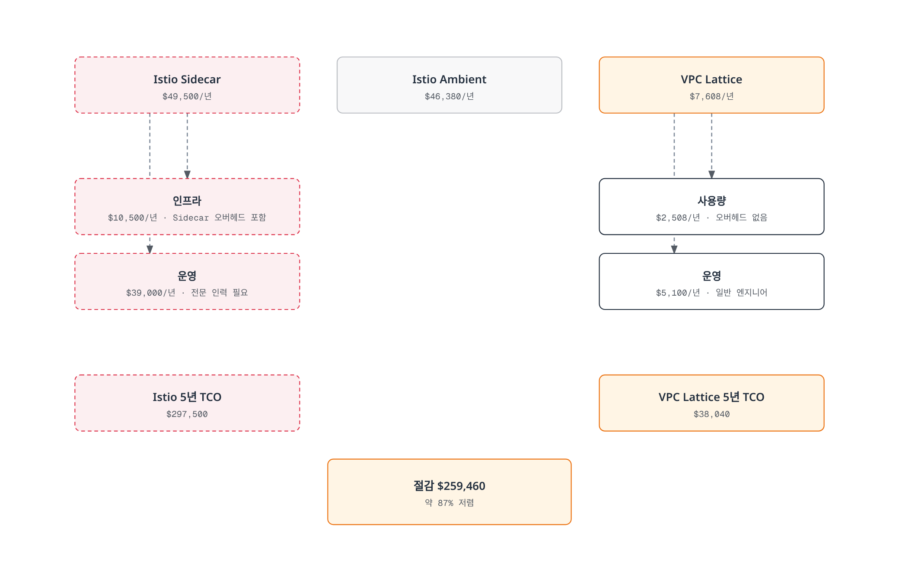

[🔍 인터랙티브 다이어그램 보기](https://www.atomai.click/kubernetes-docs/archmaps/ko-service-mesh-istio-comparison-02-istio-vs-lattice-15.html)

#### 비용 비교 상세표

| 항목           | Istio Sidecar | Istio Ambient | VPC Lattice | 차이 (vs Istio) |
| ------------ | ------------- | ------------- | ----------- | ------------- |
| **인프라 (연간)** | $10,500       | $7,380        | $2,508      | **76-88% 저렴** |
| **운영 (연간)**  | $39,000       | $39,000       | $5,100      | **87% 저렴**    |
| **총 (연간)**   | **$49,500**   | **$46,380**   | **$7,608**  | **85% 저렴**    |
| **5년 TCO**   | **$297,500**  | **$281,900**  | **$38,040** | **87% 저렴**    |

#### 비용 증가 원인 분석

**Istio가 비싼 이유**:

1. **Sidecar 오버헤드**: 노드 40-60% 추가 필요 ($280/월)
2. **운영 인력**: 전담 팀 필요 ($39,000/년)
3. **업그레이드 비용**: 분기별 6-10시간 ($4,000/년)
4. **관찰성 인프라**: Prometheus, Jaeger, Kiali ($150/월)
5. **긴급 대응**: 복잡한 장애 대응 ($3,000/년)

**VPC Lattice가 저렴한 이유**:

1. **제로 오버헤드**: Sidecar 없음
2. **완전 관리형**: 운영 인력 최소화
3. **자동 업그레이드**: 사용자 작업 없음
4. **통합 관찰성**: CloudWatch 기본 제공
5. **안정적 운영**: 장애 대응 거의 없음

**결론**: VPC Lattice가 **연간 약 $42,000, 5년간 약 $260,000 저렴**

**주의**:

* 이 비용은 100 파드 환경 기준입니다
* 실제 비용은 워크로드 규모, 트래픽, 팀 규모에 따라 크게 달라집니다
* Istio는 규모가 클수록 운영 비용 증가율이 높습니다
* VPC Lattice는 사용량 기반이므로 트래픽에 비례합니다

## 성능 비교

### Latency 오버헤드

**테스트 환경**: 2-node EKS, m5.xlarge, 1000 RPS

| 시나리오    | Baseline | Istio          | VPC Lattice    |
| ------- | -------- | -------------- | -------------- |
| **P50** | 1.0ms    | +1.0ms (2.0ms) | +0.5ms (1.5ms) |
| **P95** | 2.5ms    | +2.5ms (5.0ms) | +1.2ms (3.7ms) |
| **P99** | 5.0ms    | +3.5ms (8.5ms) | +2.0ms (7.0ms) |

**결론**: VPC Lattice가 **약간 낮은 레이턴시** (Sidecar 없음)

### 처리량

| Metric      | Baseline | Istio       | VPC Lattice |
| ----------- | -------- | ----------- | ----------- |
| **최대 RPS**  | 10,000   | 8,500 (85%) | 9,200 (92%) |
| **CPU 사용량** | 100%     | 115%        | 102%        |
| **메모리 사용량** | 1GB      | 1.5GB       | 1.05GB      |

**결론**: VPC Lattice가 **약간 높은 처리량**

### 리소스 효율성

**100 파드 환경**:

| Resource      | Baseline | Istio          | VPC Lattice |
| ------------- | -------- | -------------- | ----------- |
| **추가 CPU**    | -        | +10 vCPU       | 0           |
| **추가 Memory** | -        | +15GB          | 0           |
| **추가 파드**     | -        | +100 (Sidecar) | 0           |

**결론**: VPC Lattice가 **압도적으로 효율적**

## 멀티 클라우드 전략

### Istio 멀티 클라우드

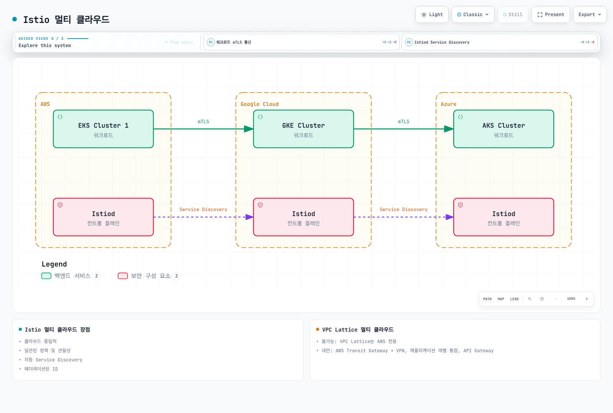

[🔍 인터랙티브 다이어그램 보기](https://www.atomai.click/kubernetes-docs/archmaps/ko-service-mesh-istio-comparison-02-istio-vs-lattice-16.html)

**장점**:

* 클라우드 중립적
* 일관된 정책 및 관찰성
* 자동 Service Discovery
* 페더레이션된 ID

### VPC Lattice 멀티 클라우드

❌ **불가능**: VPC Lattice는 AWS 전용

**대안**:

* AWS Transit Gateway + VPN
* 애플리케이션 레벨 통합
* API Gateway

## 하이브리드 아키텍처

### Istio + VPC Lattice 함께 사용

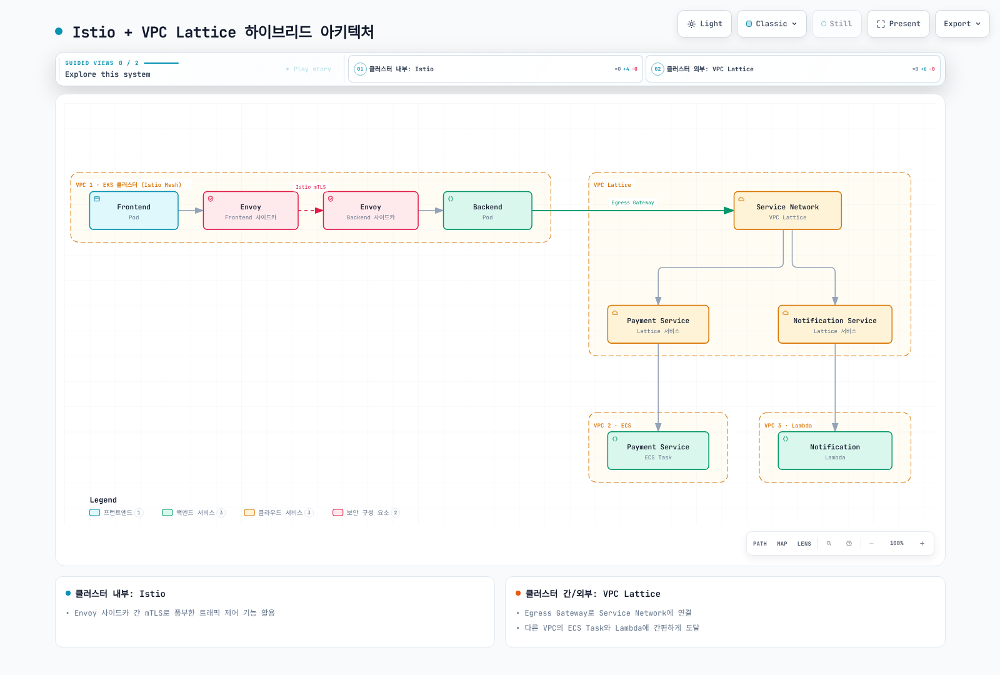

[🔍 인터랙티브 다이어그램 보기](https://www.atomai.click/kubernetes-docs/archmaps/ko-service-mesh-istio-comparison-02-istio-vs-lattice-17.html)

**사용 사례**:

* **클러스터 내부**: Istio (풍부한 기능)
* **클러스터 간/외부**: VPC Lattice (간편한 연결)

**설정 예시**:

```yaml
# Istio ServiceEntry for VPC Lattice
apiVersion: networking.istio.io/v1
kind: ServiceEntry
metadata:
  name: payment-lattice
spec:
  hosts:
  - payment.vpclattice.aws
  location: MESH_EXTERNAL
  ports:
  - number: 443
    name: https
    protocol: HTTPS
  resolution: DNS
---
# Egress Gateway로 라우팅
apiVersion: networking.istio.io/v1
kind: VirtualService
metadata:
  name: payment-route
spec:
  hosts:
  - payment.vpclattice.aws
  gateways:
  - mesh
  - istio-egressgateway
  http:
  - route:
    - destination:
        host: istio-egressgateway.istio-system.svc.cluster.local
```

## 선택 가이드

### 의사 결정 트리

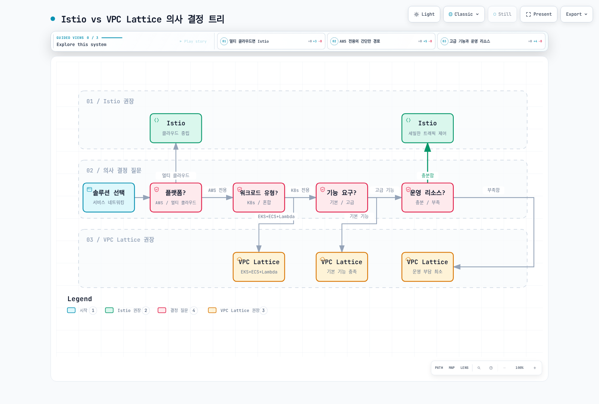

[🔍 인터랙티브 다이어그램 보기](https://www.atomai.click/kubernetes-docs/archmaps/ko-service-mesh-istio-comparison-02-istio-vs-lattice-18.html)

### 사용 사례별 권장

#### 1. 대규모 Kubernetes 중심 아키텍처

**권장: Istio**

**이유**:

* 세밀한 트래픽 제어
* 강력한 관찰성
* Canary, A/B 테스팅
* Traffic Mirroring

**예시**:

* 수백 개의 마이크로서비스
* 복잡한 배포 전략
* 실시간 트래픽 분석

#### 2. AWS 네이티브 멀티 서비스 아키텍처

**권장: VPC Lattice**

**이유**:

* EKS + ECS + Lambda 통합
* 간편한 VPC/계정 연결
* 운영 오버헤드 제로
* IAM 통합

**예시**:

* EKS 마이크로서비스 + Lambda 함수
* 멀티 VPC/계정 환경
* 서버리스 우선 전략

#### 3. 멀티 클라우드 전략

**권장: Istio**

**이유**:

* 클라우드 중립적
* 일관된 정책
* 페더레이션

**예시**:

* AWS + GCP + Azure
* 클라우드 마이그레이션
* 벤더 종속성 회피

#### 4. 레거시 마이그레이션

**권장: VPC Lattice**

**이유**:

* EC2 인스턴스 쉽게 통합
* 점진적 마이그레이션
* 기존 인프라 활용

**예시**:

* EC2 → EKS 마이그레이션
* 모놀리스 → 마이크로서비스
* 하이브리드 아키텍처

#### 5. 스타트업 / 빠른 시작

**권장: VPC Lattice**

**이유**:

* 빠른 설정 (10-20분)
* 간단한 운영
* 낮은 학습 곡선

**예시**:

* MVP 개발
* 소규모 팀
* 빠른 time-to-market

#### 6. 엔터프라이즈 / 복잡한 요구사항

**권장: Istio**

**이유**:

* 풍부한 기능
* 세밀한 제어
* 강력한 관찰성
* 규정 준수

**예시**:

* 금융/헬스케어
* 복잡한 컴플라이언스
* 고급 보안 요구

### 빠른 추천 표

| 상황               | Istio | VPC Lattice | 이유               |
| ---------------- | ----- | ----------- | ---------------- |
| **AWS Only**     | ⚠️    | ✅           | 관리 편의성           |
| **멀티 클라우드**      | ✅     | ❌           | 클라우드 중립성         |
| **K8s Only**     | ✅     | ✅           | 둘 다 가능           |
| **EKS + Lambda** | ❌     | ✅           | Lambda 통합        |
| **고급 트래픽 제어**    | ✅     | ❌           | 기능 풍부도           |
| **간편한 운영**       | ❌     | ✅           | 완전 관리형           |
| **풍부한 관찰성**      | ✅     | ⚠️          | Metrics/Tracing  |
| **낮은 비용**        | ❌     | ✅           | 운영 비용 포함         |
| **빠른 시작**        | ❌     | ✅           | 학습 곡선            |
| **세밀한 보안**       | ✅     | ⚠️          | L7 Authorization |

### 최종 추천

**🥇 VPC Lattice 선택**:

* AWS 중심 아키텍처
* 운영 리소스 제한
* 빠른 시작 필요
* EKS + ECS + Lambda 혼합
* 간편한 멀티 VPC/계정 연결

**🥇 Istio 선택**:

* 멀티 클라우드 전략
* 세밀한 트래픽 제어 필요
* 강력한 관찰성 요구
* 복잡한 배포 전략 (Canary, A/B)
* 팀에 Service Mesh 경험

**🥉 하이브리드 (Istio + VPC Lattice)**:

* 클러스터 내부: Istio
* 클러스터 간/외부: VPC Lattice
* 최고의 기능 + 간편한 외부 연결

## 결론

### 핵심 요약

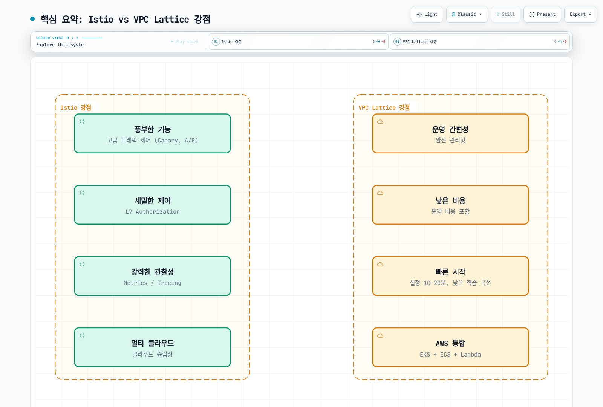

[🔍 인터랙티브 다이어그램 보기](https://www.atomai.click/kubernetes-docs/archmaps/ko-service-mesh-istio-comparison-02-istio-vs-lattice-19.html)

### 언제 무엇을 선택할까?

**Istio를 선택하세요**:

* 멀티 클라우드 환경
* 세밀한 트래픽 제어 필요
* 강력한 관찰성 요구
* 팀에 Service Mesh 경험
* 클라우드 벤더 종속성 회피

**VPC Lattice를 선택하세요**:

* AWS 중심 아키텍처
* 운영 간편성 우선
* EKS + ECS + Lambda 혼합
* 빠른 time-to-market
* 낮은 운영 비용

**둘 다 사용하세요** (하이브리드):

* 클러스터 내부는 Istio
* 클러스터 간/외부는 VPC Lattice
* 최적의 밸런스

### 마이그레이션 경로

**VPC Lattice → Istio**:

* 더 많은 기능이 필요할 때
* 멀티 클라우드 전략으로 전환 시
* 점진적 전환: 네임스페이스별로

**Istio → VPC Lattice**:

* 운영 복잡도 감소 필요
* AWS 네이티브 통합 우선
* ECS/Lambda 통합 시

***

**다음 단계**:

1. PoC 환경에서 두 솔루션 모두 테스트
2. 실제 워크로드 패턴으로 성능 측정
3. 팀의 학습 곡선 평가
4. 장기 전략에 맞춰 선택

**관련 문서**:

* [Service Mesh 솔루션 비교](01-service-mesh-comparison.md)
* [Istio 아키텍처](../03-architecture.md)
* [Istio Ambient Mode](https://github.com/Atom-oh/kubernetes-docs/blob/main/ko/service-mesh/istio/istio/advanced/01-ambient-mode.md)
* [VPC Lattice 상세 가이드](https://github.com/Atom-oh/kubernetes-docs/blob/main/ko/service-mesh/networking/02-vpc-lattice.md)

## 실전 사례 및 교훈

### 사례 1: 대형 핀테크 회사 (Istio 도입 실패)

**배경**:

* 500+ 마이크로서비스
* Istio로 mTLS 및 관찰성 강화 목표
* 6개월 프로젝트로 계획

**실제 경험**:

1. **초기 설정**: 계획 2주 → 실제 2개월
   * CRD 학습 곡선
   * 레거시 서비스 호환성 문제
   * 리소스 할당 재설계
2. **첫 업그레이드** (1.15 → 1.16): 계획 1일 → 실제 2주
   * 예상치 못한 설정 호환성 문제
   * 일부 서비스 트래픽 단절 (30분)
   * 긴급 롤백 후 재시도
3. **운영 부담**:
   * 전담 팀 3명 → 5명으로 증가
   * 월 운영 시간: 예상 10h → 실제 30-40h
   * Sidecar 오버헤드로 노드 50% 증설

**교훈**:

* ❌ **과소평가한 항목**: 운영 복잡도, 리소스 오버헤드, 전문 인력 필요
* ✅ **성공 요인**: 충분한 PoC, 단계적 롤아웃, 전담 팀
* 💡 **권장사항**: Ambient Mode 고려, 또는 VPC Lattice로 단순화

### 사례 2: 스타트업 (VPC Lattice 성공)

**배경**:

* 30개 마이크로서비스 (EKS 15개 + Lambda 15개)
* 엔지니어 5명 (AWS 경험 있음)
* 빠른 출시 목표

**실제 경험**:

1. **설정**: 1일 완료
   * Service Network 생성
   * EKS Pod → VPC Lattice 연결
   * Lambda 통합
2. **운영**:
   * 추가 인력 불필요
   * 월 운영 시간: 2-3시간 (CloudWatch 모니터링)
   * 리소스 오버헤드 0
3. **제약사항 극복**:
   * 고급 트래픽 제어 → Application Load Balancer 추가 사용
   * 분산 추적 → X-Ray 수동 계측

**교훈**:

* ✅ **성공 요인**: AWS 네이티브 통합, 간편한 운영, 낮은 학습 곡선
* ⚠️ **제약사항**: 세밀한 트래픽 제어 불가, CloudWatch 의존
* 💡 **권장사항**: 소규모 팀, AWS 중심 아키텍처에 최적

### 사례 3: 엔터프라이즈 (하이브리드 접근)

**배경**:

* 200개 마이크로서비스 (멀티 클라우드)
* AWS EKS + GCP GKE
* 복잡한 컴플라이언스 요구

**실제 경험**:

1. **아키텍처**:
   * **클러스터 내부**: Istio (세밀한 제어)
   * **클러스터 간**: VPC Lattice (AWS), Istio Gateway (GCP)
2. **비용 최적화**:
   * Istio Ambient Mode로 Sidecar 오버헤드 90% 절감
   * VPC Lattice로 멀티 VPC 연결 간소화
3. **운영**:
   * Istio 전담 팀 3명
   * VPC Lattice는 일반 엔지니어 관리
   * 분리된 책임으로 복잡도 감소

**교훈**:

* ✅ **성공 요인**: 적재적소 도구 사용, Ambient Mode 활용
* 💡 **권장사항**: 하이브리드 접근으로 각 도구의 장점 극대화

### 업계 통계 (2024-2025)

**Istio 도입 실패율**: \~40% (출처: CNCF Survey 2024)

* 주요 원인:
  1. 과소평가된 운영 복잡도 (65%)
  2. 부족한 전문 인력 (48%)
  3. 예상치 못한 리소스 오버헤드 (52%)
  4. 업그레이드 문제 (38%)

**평균 Istio 운영 비용**: $40k-80k/년 (50-200 서비스 환경)

* 인프라 비용: $10k-20k
* 인건비: $30k-60k (전담 인력 일부 시간)

**VPC Lattice 만족도**: 85% (출처: AWS re:Invent 2024 설문)

* 장점: 간편성 (92%), 낮은 비용 (78%), 빠른 시작 (95%)
* 불만: 기능 제한 (65%), AWS 종속 (42%)

### 의사결정 체크리스트

**Istio를 선택하기 전 확인**:

* [ ] 전담 Platform 팀 구성 가능? (최소 2-3명)
* [ ] 연간 $50k+ 추가 예산 확보?
* [ ] Service Mesh 전문가 채용 또는 교육 가능?
* [ ] 6-12개월의 충분한 PoC 기간 확보?
* [ ] 업그레이드를 위한 유지보수 창(Maintenance Window) 확보?
* [ ] 리소스 오버헤드 50-100% 증가 수용 가능?
* [ ] 24/7 온콜 체계 구축 가능?

**모두 ✅ 라면**: Istio 도입 진행 **3개 이상 ❌ 라면**: VPC Lattice 또는 Linkerd 고려

**VPC Lattice를 선택하기 전 확인**:

* [ ] AWS 중심 아키텍처?
* [ ] 멀티 클라우드 전략 없음?
* [ ] 기본적인 트래픽 관리로 충분?
* [ ] 빠른 출시 우선?
* [ ] 소규모 팀 (10명 이하)?

**모두 ✅ 라면**: VPC Lattice 도입 진행 **멀티 클라우드 필요 시**: Istio 필수

***

**최종 권장사항**:

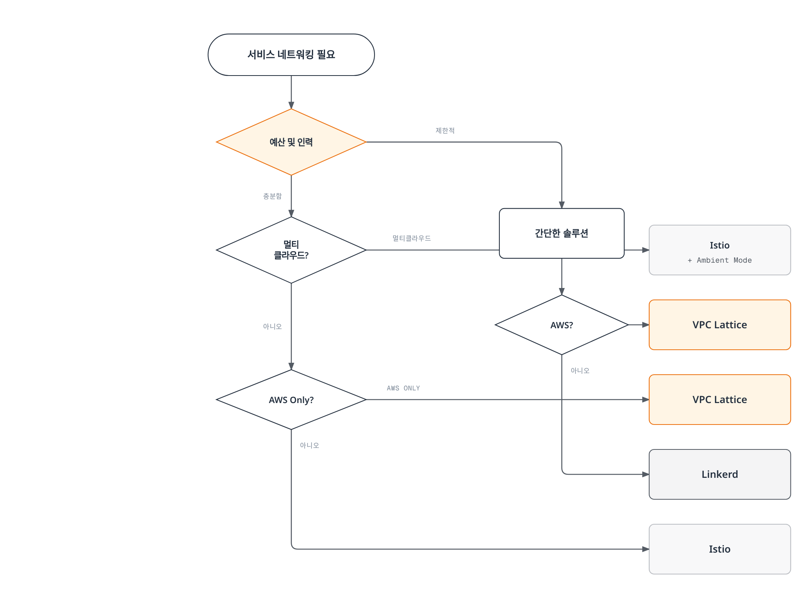

[🔍 인터랙티브 다이어그램 보기](https://www.atomai.click/kubernetes-docs/archmaps/ko-service-mesh-istio-comparison-02-istio-vs-lattice-20.html)

**관련 문서**:

* [Service Mesh 솔루션 비교](01-service-mesh-comparison.md)
* [Istio 아키텍처](../03-architecture.md)
* [Istio Ambient Mode](https://github.com/Atom-oh/kubernetes-docs/blob/main/ko/service-mesh/istio/istio/advanced/01-ambient-mode.md)
* [VPC Lattice 상세 가이드](https://github.com/Atom-oh/kubernetes-docs/blob/main/ko/service-mesh/networking/02-vpc-lattice.md)
