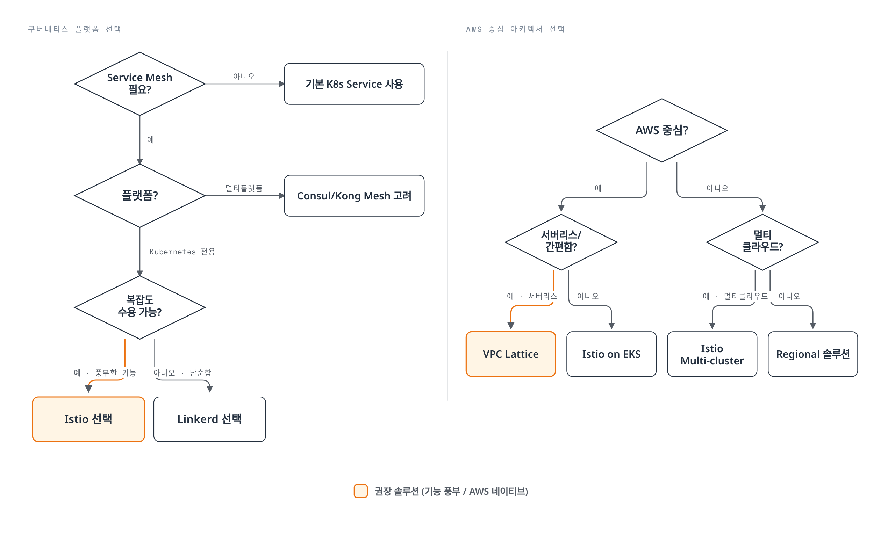

# 비교 가이드

> **마지막 업데이트**: 2026년 7월 7일 **대상 독자**: 아키텍트, DevOps 엔지니어, Platform 엔지니어

이 섹션은 다양한 Service Mesh 및 네트워킹 솔루션을 비교하여 각 솔루션의 장단점과 적합한 사용 사례를 제시합니다.

## 📚 목차

### 1. [Service Mesh 솔루션 비교](01-service-mesh-comparison.md)

Kubernetes 환경에서 사용 가능한 주요 Service Mesh 솔루션 비교:

* **Istio** - 기능이 풍부한 엔터프라이즈급 Service Mesh
* **Linkerd** - 경량화되고 사용이 간편한 Service Mesh
* **Kong Mesh** - Kuma 기반의 Universal Service Mesh
* **Consul Connect** - HashiCorp의 Service Mesh 솔루션

**비교 기준**:

* 아키텍처 및 구성 요소
* 성능 및 리소스 사용량
* 기능 세트 (트래픽 관리, 보안, 관찰성)
* 학습 곡선 및 운영 복잡도
* 멀티 클러스터 지원
* 확장성 및 플랫폼 지원

### 2. [Istio vs VPC Lattice](02-istio-vs-lattice.md)

Kubernetes Service Mesh (Istio)와 AWS 네이티브 서비스 네트워킹 (VPC Lattice) 비교:

**Istio Service Mesh**:

* Kubernetes 중심의 서비스 메시
* 풍부한 트래픽 관리 및 관찰성 기능
* 클라우드 중립적

**AWS VPC Lattice**:

* AWS 네이티브 서비스 네트워킹
* 서버리스 아키텍처
* 멀티 계정/VPC 연결 간소화

**비교 기준**:

* 아키텍처 및 배포 모델
* 트래픽 관리 기능
* 보안 모델
* 운영 오버헤드
* 비용 구조
* 하이브리드 및 멀티 클라우드 지원

### 3. [Sidecar vs Ambient Mode 선택 가이드](03-sidecar-vs-ambient.md)

Istio 내부에서 sidecar 모드와 ambient 모드 중 무엇을 선택할지, EKS 1.36 실측 결과 기반 의사결정 가이드:

* mTLS, NetworkPolicy, latency, 무중단 rollout(waypoint 503) 4가지 요구사항별 실측 결과
* ambient waypoint 경유 시 503 비율이 sidecar보다 높다는 실측 데이터
* 워크로드 계층별(코어/준코어/주변부) 혼합 배치 권장안

**비교 기준**:

* mTLS 적용 방식 및 검증
* NetworkPolicy와 HBONE 포트 상호작용
* Rollout 중 503 발생률 (실측)
* Retry 정책의 비멱등 API 리스크

## 🎯 선택 가이드

### Service Mesh 선택 기준

### 사용 사례별 권장 사항

#### 🏢 대규모 엔터프라이즈

**권장**: Istio

* 풍부한 기능 세트
* 세밀한 트래픽 제어
* 강력한 보안 (Authorization Policies, mTLS)
* 멀티 클러스터 페더레이션
* 광범위한 생태계 및 커뮤니티

**대안**: Kong Mesh (Universal control plane 필요 시)

#### 🚀 스타트업 / 빠른 시작

**권장**: Linkerd

* 간단한 설치 및 운영
* 낮은 리소스 오버헤드
* 빠른 학습 곡선
* 자동 mTLS 및 메트릭

**대안**: VPC Lattice (AWS 중심 아키텍처인 경우)

#### ☁️ AWS 네이티브 아키텍처

**권장**: VPC Lattice

* 완전 관리형 서비스
* 운영 오버헤드 제로
* AWS 서비스 통합 (Lambda, ECS, EKS)
* VPC/계정 간 간편한 연결

**대안**: Istio on EKS (더 풍부한 기능 필요 시)

#### 🌐 멀티 클라우드 / 하이브리드

**권장**: Istio 또는 Consul Connect

* 클라우드 중립적
* VM 워크로드 지원
* 멀티 클러스터 페더레이션
* 일관된 정책 및 관찰성

#### 🔧 레거시 시스템 통합

**권장**: Consul Connect 또는 Kong Mesh

* VM 워크로드 우선 지원
* 점진적 마이그레이션 가능
* Service Discovery 통합
* 다양한 플랫폼 지원

#### 📊 강력한 관찰성 요구

**권장**: Istio

* 풍부한 메트릭 (Prometheus, OpenTelemetry)
* 분산 추적 (Jaeger, Zipkin, Tempo)
* 상세한 액세스 로그
* Kiali 통합
* Grafana 대시보드

**대안**: Linkerd (간단한 관찰성 요구 시)

## 📊 빠른 비교표

### Service Mesh 비교

| 기준            | Istio          | Linkerd        | Kong Mesh | Consul Connect |
| ------------- | -------------- | -------------- | --------- | -------------- |
| **아키텍처**      | Envoy 프록시      | Linkerd2-proxy | Envoy 프록시 | Consul 프록시     |
| **리소스 사용**    | 높음             | 낮음             | 중간        | 중간             |
| **학습 곡선**     | 가파름            | 완만함            | 중간        | 중간             |
| **기능 풍부도**    | ⭐⭐⭐⭐⭐          | ⭐⭐⭐            | ⭐⭐⭐⭐      | ⭐⭐⭐⭐           |
| **멀티 클러스터**   | ✅ 우수           | ✅ 지원           | ✅ 우수      | ✅ 우수           |
| **VM 지원**     | ✅ 제한적          | ❌ 없음           | ✅ 우수      | ✅ 우수           |
| **커뮤니티**      | 매우 큼           | 중간             | 중간        | 큼              |
| **엔터프라이즈 지원** | ✅ Google Cloud | ✅ Buoyant      | ✅ Kong    | ✅ HashiCorp    |

### Istio vs VPC Lattice 비교

| 기준          | Istio        | VPC Lattice                 |
| ----------- | ------------ | --------------------------- |
| **배포 모델**   | Self-managed | Fully managed               |
| **플랫폼**     | Kubernetes   | AWS (EKS, ECS, EC2, Lambda) |
| **운영 복잡도**  | 높음           | 낮음                          |
| **기능 풍부도**  | ⭐⭐⭐⭐⭐        | ⭐⭐⭐                         |
| **트래픽 제어**  | 매우 세밀함       | 기본적                         |
| **비용 모델**   | 리소스 기반       | 사용량 기반                      |
| **벤더 종속성**  | 낮음           | 높음 (AWS)                    |
| **멀티 클라우드** | ✅ 지원         | ❌ AWS Only                  |

## 🔗 관련 자료

### Istio 문서

* [Istio 아키텍처](https://github.com/Atom-oh/kubernetes-docs/blob/main/ko/service-mesh/istio/istio/architecture/README.md)
* [Istio 트래픽 관리](https://github.com/Atom-oh/kubernetes-docs/blob/main/ko/service-mesh/istio/istio/traffic-management/README.md)
* [Istio 보안](https://github.com/Atom-oh/kubernetes-docs/blob/main/ko/service-mesh/istio/istio/security/README.md)
* [Istio 관찰성](https://github.com/Atom-oh/kubernetes-docs/blob/main/ko/service-mesh/istio/istio/observability/README.md)

### VPC Lattice 문서

* [VPC Lattice 개요](https://github.com/Atom-oh/kubernetes-docs/blob/main/ko/service-mesh/istio/vpc-lattice.md)

### 외부 참조

* [Istio 공식 문서](https://istio.io/latest/docs/)
* [Linkerd 공식 문서](https://linkerd.io/2.15/overview/)
* [Kong Mesh 공식 문서](https://docs.konghq.com/mesh/)
* [Consul Connect 문서](https://www.consul.io/docs/connect)
* [AWS VPC Lattice 문서](https://docs.aws.amazon.com/vpc-lattice/)

## 💡 마이그레이션 가이드

### Linkerd → Istio

* 더 많은 기능이 필요한 경우
* 점진적 마이그레이션: 네임스페이스별로 전환
* Annotation 기반 설정 → Istio CRD 전환

### 기본 Kubernetes → Service Mesh

* 트래픽 관리, 보안, 관찰성 요구 증가
* Canary 배포: 일부 서비스부터 시작
* Sidecar 주입 영향 평가

### VPC Lattice → Istio (또는 반대)

* 멀티 클라우드 요구 vs AWS 네이티브 선호
* 기능 풍부도 vs 운영 간편함
* 하이브리드 접근: 동시 사용 가능

## ❓ FAQ

Q1: Service Mesh가 꼭 필요한가요?

**답변**: Service Mesh는 다음과 같은 경우에 권장됩니다:

* 수십 개 이상의 마이크로서비스
* 세밀한 트래픽 제어 필요 (Canary, A/B Testing)
* 강력한 보안 요구 (mTLS, Authorization)
* 분산 추적 및 관찰성
* 멀티 클러스터 통신

**소규모 서비스**나 **단순한 아키텍처**에서는 기본 Kubernetes Service와 Ingress로 충분할 수 있습니다.

Q2: Istio와 Linkerd 중 어떤 것을 선택해야 하나요?

**Istio 선택**:

* 풍부한 기능이 필요한 경우
* 대규모 엔터프라이즈 환경
* 세밀한 트래픽 제어 및 정책
* 멀티 클러스터 페더레이션

**Linkerd 선택**:

* 간단하고 빠른 시작이 필요한 경우
* 리소스 효율성이 중요한 경우
* 기본적인 Service Mesh 기능만 필요한 경우
* 운영 복잡도를 최소화하고 싶은 경우

Q3: VPC Lattice를 사용해야 하는 경우는?

**VPC Lattice 권장**:

* AWS 중심 아키텍처
* EKS + ECS + Lambda 혼합 환경
* 서버리스 우선 전략
* 운영 오버헤드 최소화
* 멀티 VPC/계정 연결 간소화

**Istio 권장** (VPC Lattice 대신):

* 멀티 클라우드 전략
* 세밀한 트래픽 제어 필요
* 풍부한 관찰성 요구
* Kubernetes 중심 아키텍처

Q4: Service Mesh 성능 오버헤드는 얼마나 되나요?

**Istio**:

* Latency 증가: 1-3ms (평균)
* CPU 오버헤드: 5-15%
* 메모리: 파드당 50-150MB 추가

**Linkerd**:

* Latency 증가: 0.5-1ms (평균)
* CPU 오버헤드: 3-8%
* 메모리: 파드당 20-50MB 추가

**VPC Lattice**:

* 관리형 서비스로 인프라 오버헤드 없음
* 네트워크 hop 추가로 latency 약간 증가
* 사용량 기반 비용 발생

Q5: 여러 Service Mesh를 동시에 사용할 수 있나요?

**답변**: 기술적으로 가능하지만 권장하지 않습니다.

**문제점**:

* Sidecar 충돌 가능성
* 복잡한 트러블슈팅
* 이중 오버헤드
* 불명확한 책임 분리

**예외적 사용 사례**:

* **Istio + VPC Lattice**: 클러스터 내부는 Istio, 클러스터 간/외부 연결은 VPC Lattice
* **점진적 마이그레이션**: Linkerd → Istio (네임스페이스별로 전환)

***

**다음 단계**: 상세 비교 문서를 읽고 환경에 가장 적합한 솔루션을 선택하세요.
