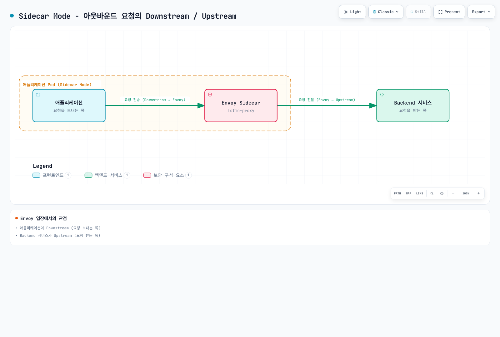
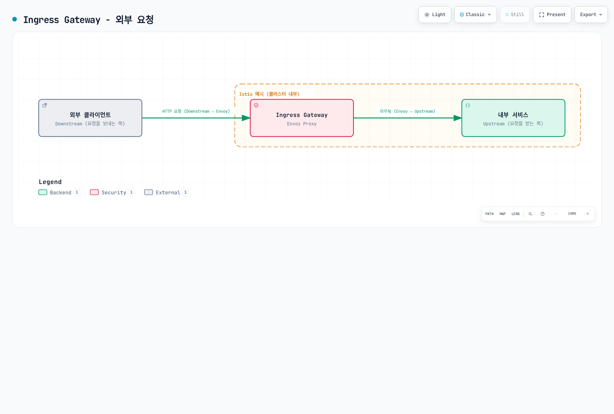
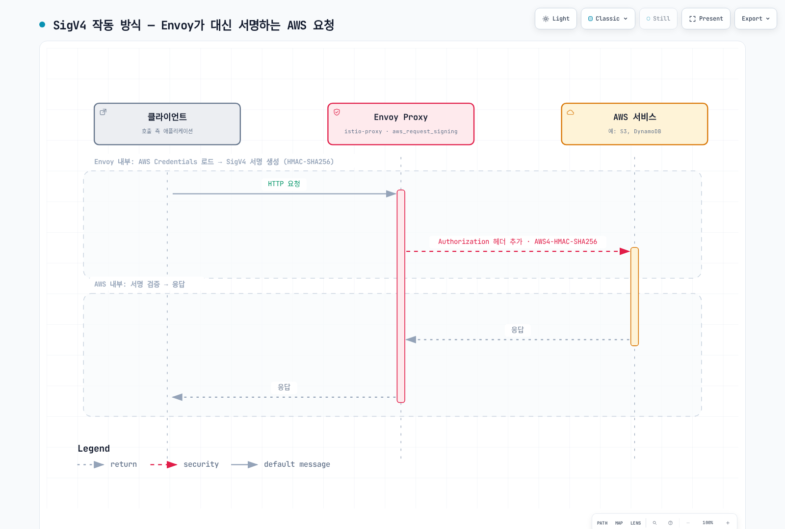

# Istio 용어집

> **검토 버전**: Istio 1.31.0
> **마지막 업데이트**: 2026년 9월 11일

Istio와 Service Mesh 관련 주요 용어들을 주제별 참조 섹션으로 정리한 용어집입니다.

## 목차

- [A-C](#a-c)
- [D-F](#d-f)
- [G-I](#g-i)
- [J-L](#j-l)
- [M-O](#m-o)
- [P-R](#p-r)
- [S-U](#s-u)
- [V-Z](#v-z)

---

## A-C

### AuthorizationPolicy

선택한 워크로드/대상 리소스에 ALLOW, DENY, CUSTOM, AUDIT 동작을 정의하는 Istio 보안 정책입니다. 인증과 인가는 별개이며 waypoint 정책은 targetRefs를 사용합니다.

### Control Plane

istiod가 구현하는 구성·디스커버리·ID 관리 계층입니다. 애플리케이션 페이로드는 istiod가 아닌 Data Plane 프록시를 통과합니다.

### Ambient Mode

Istio 1.18에서 alpha로 처음 배포되고 1.24에서 GA가 된 데이터 플레인 모드로, Sidecar Proxy 없이 서비스 메시 기능을 제공합니다.

**특징**:
- Sidecar 컨테이너 불필요
- 노드 레벨에서 ztunnel 사용
- 리소스 효율성 향상
- L4와 L7 기능 분리

**관련 문서**: [Ambient Mode](advanced/01-ambient-mode.md)

---

### Certificate Authority (CA)

서비스 간 mTLS 통신을 위한 인증서를 발급하고 관리하는 기관입니다.

**Istio에서의 역할**:
- Istiod의 Citadel 기능이 CA 역할 수행
- SPIFFE ID 기반 인증서 발급
- 자동 인증서 갱신 (기본 TTL: 24시간)

**관련 항목**: [Citadel](#citadel), [SPIFFE](#spiffe-secure-production-identity-framework-for-everyone), [mTLS](#mtls-mutual-tls)

---

### Circuit Breaker

장애가 발생한 서비스로의 요청을 차단하여 전체 시스템의 장애 전파를 방지하는 패턴입니다.

**작동 방식**:
1. **Closed**: 정상 동작
2. **Open**: 연속 실패 시 요청 차단
3. **Half-Open**: 일정 시간 후 일부 요청 허용

**Istio 구현**: Connection Pool 제한과 엔드포인트별 Outlier Ejection을 사용하며 위의 3단계 상태 머신을 그대로 제공하지는 않습니다.
```yaml
apiVersion: networking.istio.io/v1
kind: DestinationRule
metadata:
  name: glossary-example-1
spec:
  host: reviews
  trafficPolicy:
    outlierDetection:
      consecutive5xxErrors: 5
      interval: 30s
      baseEjectionTime: 30s
```

**관련 문서**: [Circuit Breaker](traffic-management/07-circuit-breaker.md)

---

### Citadel

Istio 1.4까지 독립적으로 존재했던 보안 컴포넌트입니다. 현재는 Istiod에 통합되어 있습니다.

**주요 기능**:
- Certificate Authority (CA) 관리
- SPIFFE ID 발급 및 관리
- X.509 인증서 생성 및 갱신

**현재 상태**: Istio 1.5+에서는 Istiod 내부 기능으로 존재

**관련 항목**: [Istiod](#istiod), [Certificate Authority](#certificate-authority-ca)

---

### CDS (Cluster Discovery Service)

xDS API의 하나로, Envoy가 업스트림 서비스(클러스터)의 구성을 동적으로 받아오는 서비스입니다.

**제공 정보**:
- 클러스터 이름 및 타입
- 로드 밸런싱 정책
- Health check 설정
- Circuit breaker 설정
- TLS 설정

**관련 항목**: [xDS](#xds-discovery-service), [Envoy](#envoy-proxy)

---

## D-F

### Data Plane

서비스 메시에서 실제 트래픽을 처리하는 계층입니다.

**Istio의 Data Plane**:
- Envoy 사이드카 또는 Ambient ztunnel과 선택적 L7 waypoint
- 등록된 메시 트래픽 처리; 제외 규칙과 프로토콜 제약 적용
- mTLS 암호화/복호화
- 메트릭 수집

**관련 항목**: [Control Plane](#control-plane), [Envoy](#envoy-proxy)

---

### DestinationRule

VirtualService가 라우팅한 트래픽에 대한 정책을 정의하는 Istio CRD입니다.

**주요 기능**:
- Subset 정의 (버전, 지역 등)
- 로드 밸런싱 정책
- Connection Pool 설정
- Circuit Breaker 설정
- TLS 설정

```yaml
apiVersion: networking.istio.io/v1
kind: DestinationRule
metadata:
  name: reviews
spec:
  host: reviews
  subsets:
  - name: v1
    labels:
      version: v1
  - name: v2
    labels:
      version: v2
```

**관련 문서**: [DestinationRule](traffic-management/03-destination-rule.md)

---

### eBPF (Extended Berkeley Packet Filter)

Linux 커널 내부에서 안전하게 프로그램을 실행할 수 있는 기술입니다.

Istio는 Cilium 같은 eBPF 기반 기본 CNI와 함께 사용할 수 있습니다. Istio CNI는 리다이렉션을 구성하는 별도 체인 플러그인/노드 에이전트이며 Ambient는 eBPF를 요구하거나 기본 CNI를 대체하지 않습니다.

**장점**:
- 낮은 오버헤드
- 커널 레벨 처리
- 동적 프로그래밍 가능

**관련 항목**: [Ambient Mode](#ambient-mode), [iptables](#iptables)

---

### EDS (Endpoint Discovery Service)

xDS API의 하나로, 클러스터 내 실제 엔드포인트(파드 IP)를 동적으로 제공하는 서비스입니다.

**제공 정보**:
- 엔드포인트 IP 주소 및 포트
- Health 상태
- 로드 밸런싱 가중치
- Locality 정보

**예시**:
```json
{
  "cluster_name": "outbound|9080||reviews",
  "endpoints": [
    {
      "lb_endpoints": [
        {"endpoint": {"address": {"socket_address": {"address": "10.244.1.5", "port_value": 9080}}}},
        {"endpoint": {"address": {"socket_address": {"address": "10.244.2.8", "port_value": 9080}}}}
      ]
    }
  ]
}
```

**관련 항목**: [xDS](#xds-discovery-service), [CDS](#cds-cluster-discovery-service)

---

### Envoy Proxy

Istio의 Data Plane을 구성하는 고성능 L7 프록시입니다.

**역사**:
- 2016년 Matt Klein이 Lyft에서 개발
- 2017년 CNCF Incubating 프로젝트
- 2018년 CNCF Graduated 프로젝트

**주요 특징**:
- C++로 작성된 고성능 프록시
- xDS API를 통한 동적 구성
- HTTP/1.1, HTTP/2, gRPC 지원
- 풍부한 observability

**구성 요소**:
- Listeners: 포트 수신
- Filters: 요청/응답 처리
- Routers: 라우팅 결정
- Clusters: 업스트림 서비스

**관련 문서**: [아키텍처 - Envoy Proxy](03-architecture.md#data-plane-envoy-proxy)

---

## G-I

### Galley

Istio 1.4까지 독립적으로 존재했던 구성 검증 컴포넌트입니다. 현재는 Istiod에 통합되어 있습니다.

**주요 기능**:
- Istio 구성 검증
- Kubernetes 리소스 처리
- 구성 배포 전 오류 검사

**현재 상태**: Istio 1.5+에서는 Istiod 내부 기능으로 존재

**관련 항목**: [Istiod](#istiod)

---

### Gateway

Service Mesh로 들어오는 외부 트래픽의 진입점을 정의하는 Istio CRD입니다.

**종류**:
1. **Ingress Gateway**: 외부 → 내부 트래픽
2. **Egress Gateway**: 내부 → 외부 트래픽

```yaml
apiVersion: networking.istio.io/v1
kind: Gateway
metadata:
  name: my-gateway
spec:
  selector:
    istio: ingressgateway
  servers:
  - port:
      number: 80
      name: http
      protocol: HTTP
    hosts:
    - "example.com"
```

**관련 문서**: [Gateway와 VirtualService](traffic-management/01-gateway-virtualservice.md)

---

### gRPC

Google이 개발한 고성능 RPC (Remote Procedure Call) 프레임워크입니다.

**Istio와의 관계**:
- xDS API는 gRPC 기반
- Istiod ↔ Envoy 통신에 사용
- HTTP/2 기반 (멀티플렉싱 지원)

**장점**:
- 양방향 스트리밍
- 낮은 지연 시간
- Protocol Buffers 사용

**관련 항목**: [xDS](#xds-discovery-service)

---

### Identity

Service Mesh 내에서 워크로드의 신원을 나타냅니다.

**Istio의 Identity**:
- SPIFFE ID 형식 사용
- Kubernetes ServiceAccount 기반
- X.509 인증서로 증명

**예시**:
```
spiffe://cluster.local/ns/default/sa/reviews
```

**관련 항목**: [SPIFFE](#spiffe-secure-production-identity-framework-for-everyone), [mTLS](#mtls-mutual-tls)

---

### iptables

Linux에서 네트워크 트래픽을 제어하는 방화벽 도구입니다.

**Istio에서의 역할**:
- istio-init 또는 Istio CNI 노드 에이전트가 트래픽 리다이렉션 설정
- 파드의 모든 트래픽을 Envoy로 리다이렉트
- NAT 테이블 사용 (PREROUTING, OUTPUT 체인)

**단순화한 규칙 (설명용이며 설치 스크립트가 아님)**:
```bash
# 아웃바운드: Envoy 제외한 모든 트래픽 → 15001
iptables -t nat -A OUTPUT -p tcp -m owner ! --uid-owner 1337 -j REDIRECT --to-port 15001

# 인바운드: 모든 트래픽 → 15006
iptables -t nat -A PREROUTING -p tcp -j REDIRECT --to-port 15006
```

**설정 대안**: Istio CNI가 특권 네트워크 설정을 노드 레벨에서 수행합니다.

**관련 문서**: [아키텍처 - iptables](03-architecture.md#iptables와-트래픽-가로채기)

---

### Istiod

Istio 1.5+의 통합된 Control Plane 컴포넌트입니다.

**통합된 기능**:
- **Pilot**: Service Discovery, Traffic Management
- **Citadel**: Certificate Authority, Identity
- **Galley**: Configuration Validation

**실행 방식**:
- 단일 Go 바이너리: `pilot-discovery`
- 모든 기능이 하나의 프로세스 내에서 실행
- 기본 포트: 15012 (xDS), 15017 (Webhook)

**장점**:
- 복잡도 감소
- 운영 단순화
- 리소스 효율성

**관련 문서**: [아키텍처 - Istiod](03-architecture.md#control-plane-istiod)

---

## J-L

### LDS (Listener Discovery Service)

xDS API의 하나로, Envoy가 수신 대기할 포트와 필터 체인을 동적으로 받아오는 서비스입니다.

**제공 정보**:
- 리스너 주소 및 포트
- 프로토콜 (HTTP, TCP)
- 필터 체인 구성
- TLS 설정

**Istio의 기본 Listeners**:
- `0.0.0.0:15001`: 아웃바운드 TCP
- `0.0.0.0:15006`: 인바운드 TCP
- `0.0.0.0:15021`: Health check
- `0.0.0.0:15090`: Prometheus 메트릭

**관련 항목**: [xDS](#xds-discovery-service), [Envoy](#envoy-proxy)

---

### Locality-aware Load Balancing

지역(Region, Zone) 정보를 고려한 로드 밸런싱 방식입니다.

**우선순위**:
1. 같은 Zone의 엔드포인트
2. 같은 Region의 다른 Zone
3. 다른 Region

**설정 예시**:
```yaml
apiVersion: networking.istio.io/v1
kind: DestinationRule
metadata:
  name: glossary-example-2
spec:
  host: reviews
  trafficPolicy:
    loadBalancer:
      localityLbSetting:
        enabled: true
        distribute:
        - from: us-west/zone-1a/*
          to:
            "us-west/zone-1a/*": 80
            "us-west/zone-1b/*": 20
```

**관련 문서**: [Zone Aware Routing](resilience/03-zone-aware-routing.md)

---

## M-O

### Mixer

Istio 1.4까지 존재했던 정책 및 텔레메트리 컴포넌트입니다.

**주요 기능**:
- 정책 적용 (Rate Limiting, 접근 제어)
- 텔레메트리 수집

**제거 이유**:
- 성능 오버헤드 (모든 요청마다 Mixer 호출)
- 복잡한 아키텍처

**현재 상태**: 1.5 전환기에 사용 중단; 남은 Mixer 기능은 1.8에서 제거

**관련 항목**: [Istiod](#istiod)

---

### mTLS (Mutual TLS)

클라이언트와 서버가 서로를 인증하는 양방향 TLS 통신 방식입니다.

**Istio의 mTLS**:
- 자동 인증서 발급 및 갱신
- SPIFFE ID 기반 인증
- TLS 암호군은 협상되며 AES-256-GCM으로 고정되지 않음

**모드**:
1. **STRICT**: mTLS만 허용
2. **PERMISSIVE**: mTLS + 평문 허용 (마이그레이션용)
3. **DISABLE**: Sidecar의 Istio 전송 mTLS 해제; Ambient에서는 미지원

```yaml
apiVersion: security.istio.io/v1
kind: PeerAuthentication
metadata:
  name: default
spec:
  mtls:
    mode: STRICT
```

**관련 문서**: [mTLS](security/01-mtls.md)

---

### Outlier Detection

비정상적인 동작을 보이는 엔드포인트를 자동으로 제외하는 기능입니다.

**감지 조건**:
- 연속 오류 횟수
- 오류 비율
- 연결 실패/타임아웃; 지연 시간 자체는 엔드포인트 제외 임계값이 아님

```yaml
apiVersion: networking.istio.io/v1
kind: DestinationRule
metadata:
  name: glossary-example-3
spec:
  host: reviews
  trafficPolicy:
    outlierDetection:
      consecutive5xxErrors: 5
      interval: 30s
      baseEjectionTime: 30s
      maxEjectionPercent: 50
```

**관련 문서**: [Outlier Detection](resilience/01-outlier-detection.md)

---

## P-R

### Downstream

Envoy 관점에서 **요청을 보내는 쪽**을 의미합니다. 즉, Envoy에게 연결을 시작하는 클라이언트입니다.

**Envoy의 Downstream**:
- Envoy로 들어오는 연결 (Inbound)
- 요청을 보내는 클라이언트
- Listener가 수신하는 연결

**트래픽 흐름**:
```
Downstream (클라이언트)  →  Envoy Proxy  →  Upstream (백엔드)
```

**예시 시나리오**:

#### 1. Sidecar Mode - 아웃바운드 요청



[🔍 인터랙티브 다이어그램 보기](https://www.atomai.click/kubernetes-docs/archmaps/ko-service-mesh-istio-glossary-0.html)

**관점**:
- **Envoy 입장**: 애플리케이션이 Downstream (요청 보내는 쪽)
- **Envoy 입장**: Backend 서비스가 Upstream (요청 받는 쪽)

#### 2. Ingress Gateway - 외부 요청



[🔍 인터랙티브 다이어그램 보기](https://www.atomai.click/kubernetes-docs/archmaps/ko-service-mesh-istio-glossary-1.html)

**Downstream 관련 Envoy 설정**:

```yaml
# Listener - Downstream 연결 수신
apiVersion: networking.istio.io/v1alpha3
kind: EnvoyFilter
metadata:
  name: downstream-config
  namespace: default
spec:
  workloadSelector:
    labels:
      app: reviews
  configPatches:
  - applyTo: LISTENER
    match:
      context: SIDECAR_INBOUND
    patch:
      operation: MERGE
      value:
        per_connection_buffer_limit_bytes: 32768  # Downstream 버퍼
```

**Downstream 메트릭**:
```bash
# Downstream 연결 수
envoy_listener_downstream_cx_active

# Downstream 요청 수
envoy_http_downstream_rq_total

# Downstream 응답 시간
envoy_http_downstream_rq_time
```

**관련 항목**: [Upstream](#upstream), [Envoy](#envoy-proxy), [Listener](#lds-listener-discovery-service)

---

### Upstream

Envoy 관점에서 **요청을 받는 쪽**을 의미합니다. 즉, Envoy가 연결을 시작하는 백엔드 서비스입니다.

**Envoy의 Upstream**:
- Envoy에서 나가는 연결 (Outbound)
- 요청을 처리하는 백엔드 서비스
- Cluster가 관리하는 엔드포인트들

**트래픽 흐름**:
```
Downstream (클라이언트)  →  Envoy Proxy  →  Upstream (백엔드)
```

**Upstream 구성 요소**:

#### 1. Cluster (Upstream 그룹)

```yaml
# DestinationRule로 Upstream Cluster 정의
apiVersion: networking.istio.io/v1
kind: DestinationRule
metadata:
  name: reviews
spec:
  host: reviews  # Upstream 서비스
  trafficPolicy:
    loadBalancer:
      simple: ROUND_ROBIN
    connectionPool:
      tcp:
        maxConnections: 100      # Upstream 연결 제한
      http:
        http1MaxPendingRequests: 50
        http2MaxRequests: 100
    outlierDetection:
      consecutive5xxErrors: 5        # Upstream 장애 감지
      interval: 30s
```

#### 2. Endpoint (실제 Upstream 인스턴스)

```bash
# Upstream 엔드포인트 확인
istioctl proxy-config endpoints <pod-name> | grep reviews

# 출력 예시:
# ENDPOINT              STATUS      CLUSTER
# 10.244.1.5:9080       HEALTHY     outbound|9080||reviews.default.svc.cluster.local
# 10.244.2.8:9080       HEALTHY     outbound|9080||reviews.default.svc.cluster.local
# 10.244.3.12:9080      UNHEALTHY   outbound|9080||reviews.default.svc.cluster.local
```

**Upstream 트래픽 정책**:

```yaml
apiVersion: networking.istio.io/v1
kind: DestinationRule
metadata:
  name: glossary-example-4
spec:
  host: reviews
  trafficPolicy:
    # Upstream 로드 밸런싱
    loadBalancer:
      consistentHash:
        httpHeaderName: "x-user-id"

    # Upstream 연결 풀
    connectionPool:
      tcp:
        maxConnections: 100
        connectTimeout: 30s
      http:
        h2UpgradePolicy: UPGRADE

    # Upstream TLS
    tls:
      mode: ISTIO_MUTUAL

    # Upstream Circuit Breaker
    outlierDetection:
      consecutive5xxErrors: 5
      interval: 10s
      baseEjectionTime: 30s
```

**Upstream vs Downstream 비교**:

| 항목 | Downstream | Upstream |
|------|-----------|----------|
| **방향** | Envoy로 들어옴 (Inbound) | Envoy에서 나감 (Outbound) |
| **역할** | 요청 보내는 쪽 (클라이언트) | 요청 받는 쪽 (서버) |
| **Envoy 구성** | Listener, Filter Chain | Cluster, Endpoint |
| **예시** | 외부 사용자, 다른 서비스 | Backend API, 데이터베이스 |
| **메트릭** | `downstream_cx_*`, `downstream_rq_*` | `upstream_cx_*`, `upstream_rq_*` |

**실제 예시**:

#### 시나리오 1: 서비스 A → 서비스 B 호출

```
┌─────────────────────────────────────────────────────┐
│ Service A Pod                                       │
│                                                     │
│  App ──► Envoy Sidecar                             │
│          │                                          │
│          │ Downstream: App                          │
│          │ Upstream: Service B                      │
└──────────┼──────────────────────────────────────────┘
           │
           ▼
┌─────────────────────────────────────────────────────┐
│ Service B Pod                                       │
│                                                     │
│          Envoy Sidecar ──► App                      │
│          │                                          │
│          │ Downstream: Service A Envoy              │
│          │ Upstream: Local App (Service B)          │
└─────────────────────────────────────────────────────┘
```

**Service A의 Envoy 관점**:
- Downstream: Service A의 애플리케이션
- Upstream: Service B

**Service B의 Envoy 관점**:
- Downstream: Service A의 Envoy
- Upstream: Service B의 애플리케이션 (로컬)

#### 시나리오 2: Ingress Gateway

```
External Client (Downstream)
        ↓
Ingress Gateway (Envoy)
        ↓
Internal Service (Upstream)
```

**Upstream 메트릭**:

```bash
# Upstream 연결 수
envoy_cluster_upstream_cx_active

# Upstream 요청 카운터; 응답 분류 카운터로 성공/오류율 계산
envoy_cluster_upstream_rq_total

# Upstream 응답 시간
envoy_cluster_upstream_rq_time

# Upstream Health 체크
envoy_cluster_health_check_success

# Upstream Circuit Breaker
envoy_cluster_circuit_breakers_default_remaining_rq
```

**Passive Upstream Health Detection**: Active health-check statistics require separate configuration.

```yaml
apiVersion: networking.istio.io/v1
kind: DestinationRule
metadata:
  name: glossary-example-5
spec:
  host: reviews
  trafficPolicy:
    outlierDetection:
      # Upstream Health 감지
      consecutiveGatewayErrors: 5
      consecutive5xxErrors: 5
      interval: 10s
      baseEjectionTime: 30s
      maxEjectionPercent: 50
```

**디버깅**:

```bash
# 1. Upstream Cluster 확인
istioctl proxy-config clusters <pod-name> --fqdn reviews.default.svc.cluster.local

# 2. Upstream Endpoint 상태 확인
istioctl proxy-config endpoints <pod-name> --cluster "outbound|9080||reviews.default.svc.cluster.local"

# 3. Upstream 메트릭 확인
kubectl exec <pod-name> -c istio-proxy -- \
  curl -s localhost:15000/stats/prometheus | grep upstream

# 4. Upstream 연결 확인
istioctl proxy-config all <pod-name> -o json | \
  jq '.configs[] | select(.["@type"] | contains("ClustersConfigDump"))'
```

**관련 항목**: [Downstream](#downstream), [Envoy](#envoy-proxy), [Cluster](#cds-cluster-discovery-service), [Endpoint](#eds-endpoint-discovery-service)

---

### Pilot

Istio 1.4까지 독립적으로 존재했던 트래픽 관리 컴포넌트입니다. 현재는 Istiod에 통합되어 있습니다.

**주요 기능**:
- Service Discovery
- Traffic Management (VirtualService, DestinationRule 처리)
- xDS Server

**현재 상태**: Istio 1.5+에서는 Istiod 내부 기능으로 존재

**관련 항목**: [Istiod](#istiod), [xDS](#xds-discovery-service)

---

### RDS (Route Discovery Service)

xDS API의 하나로, HTTP 라우팅 규칙을 동적으로 제공하는 서비스입니다.

**제공 정보**:
- 라우트 매칭 규칙 (경로, 헤더 등)
- 가중치 기반 라우팅
- 리다이렉트 및 재작성 규칙
- Timeout 및 Retry 설정

**VirtualService와의 관계**:
- VirtualService → Istiod에서 변환 → RDS 구성

**관련 항목**: [xDS](#xds-discovery-service), [VirtualService](#virtualservice)

---

### Rate Limiting

단위 시간당 허용되는 요청 수를 제한하는 기능입니다.

**구현 방법**:
1. **Local Rate Limiting**: Envoy 로컬에서 처리
2. **Global Rate Limiting**: 외부 Rate Limit 서비스 사용

```yaml
apiVersion: networking.istio.io/v1alpha3
kind: EnvoyFilter
metadata:
  name: filter-local-ratelimit
  namespace: default
spec:
  workloadSelector:
    labels:
      app: reviews
  configPatches:
  - applyTo: HTTP_FILTER
    match:
      context: SIDECAR_INBOUND
      listener:
        filterChain:
          filter:
            name: envoy.filters.network.http_connection_manager
            subFilter:
              name: envoy.filters.http.router
    patch:
      operation: INSERT_BEFORE
      value:
        name: envoy.filters.http.local_ratelimit
        typed_config:
          "@type": type.googleapis.com/envoy.extensions.filters.http.local_ratelimit.v3.LocalRateLimit
          stat_prefix: http_local_rate_limiter
          token_bucket:
            max_tokens: 100
            tokens_per_fill: 100
            fill_interval: 1s
          filter_enabled:
            default_value:
              numerator: 100
              denominator: HUNDRED
          filter_enforced:
            default_value:
              numerator: 100
              denominator: HUNDRED
```

**관련 문서**: [Rate Limiting](resilience/02-rate-limiting.md)

---

## S-U

### SDS (Secret Discovery Service)

xDS API의 하나로, TLS 인증서와 키를 동적으로 제공하는 서비스입니다.

**제공 정보**:
- X.509 인증서
- Private Key
- CA Root Certificate

**장점**:
- 파일 시스템 불필요
- 자동 인증서 갱신
- 무중단 갱신

**관련 항목**: [xDS](#xds-discovery-service), [mTLS](#mtls-mutual-tls)

---

### Service Entry

Service Mesh 외부의 서비스를 메시에 등록하는 Istio CRD입니다.

**사용 목적**:
- 외부 API 접근 제어
- 외부 서비스에 Istio 기능 적용 (Retry, Timeout 등)
- Egress Gateway 통합

```yaml
apiVersion: networking.istio.io/v1
kind: ServiceEntry
metadata:
  name: external-api
spec:
  hosts:
  - api.external.com
  ports:
  - number: 443
    name: https
    protocol: HTTPS
  location: MESH_EXTERNAL
  resolution: DNS
```

**관련 문서**: [ServiceEntry](traffic-management/12-service-entry.md)

---

### Service Mesh

마이크로서비스 간 통신을 관리하는 인프라 계층입니다.

**핵심 기능**:
- 트래픽 관리 (라우팅, 로드 밸런싱)
- 보안 (mTLS, 인증/인가)
- Observability (메트릭, 로그, 추적)
- 복원력 (Retry, Circuit Breaker)

**주요 구현체**:
- Istio
- Linkerd
- Consul Connect
- AWS App Mesh ([support ends September 30, 2026](https://docs.aws.amazon.com/app-mesh/latest/userguide/what-is-app-mesh.html))

---

### SigV4 (AWS Signature Version 4)

AWS API 요청을 인증하기 위한 서명 프로토콜입니다.

**작동 방식**:



[🔍 인터랙티브 다이어그램 보기](https://www.atomai.click/kubernetes-docs/archmaps/ko-service-mesh-istio-glossary-2.html)

**서명 구성 요소**:

1. **Canonical Request**: 요청의 표준화된 형식
   - HTTP 메서드
   - URI 경로
   - 쿼리 문자열
   - 헤더
   - 페이로드 해시

2. **String to Sign**: 서명할 문자열
   - 알고리즘: `AWS4-HMAC-SHA256`
   - 타임스탬프
   - Credential Scope
   - Canonical Request 해시

3. **Signing Key**: 서명 키 계산
   ```
   HMAC(HMAC(HMAC(HMAC("AWS4" + SecretKey, Date), Region), Service), "aws4_request")
   ```

4. **Signature**: 최종 서명
   ```
   HMAC(SigningKey, StringToSign)
   ```

**Istio와의 통합**:

AWS SDK와 AWS CLI는 IRSA 또는 EKS Pod Identity가 제공한 임시 자격 증명으로 HTTPS 요청에 서명합니다. 서명 권한은 워크로드의 AWS 권한과 연결되며 Istio mTLS ID와 AWS IAM ID는 별개입니다.

Envoy의 `aws_request_signing` HTTP 필터는 고급 대안입니다. 해당 확장을 포함한 Envoy 빌드, **프록시 컨테이너**가 사용할 자격 증명, 올바른 AWS 서비스/리전, 의도한 AWS 목적지만 선택하는 필터 match가 필요합니다. 서명에 영향을 주는 헤더·경로 재작성 이후, router 이전에 배치하세요. 애플리케이션이 시작한 HTTPS는 암호화되어 있으므로 이 HTTP 필터가 TLS 내부에 서명을 추가할 수 없습니다. 프록시 서명은 서명 프록시에 HTTP를 전달한 뒤 업스트림에 검증된 TLS를 시작하도록 설계해야 합니다. 이중 TLS나 의도한 로컬 프록시 경로 밖의 서명 전 HTTP 노출을 피하세요.

위 그림은 이러한 서명 프록시를 명시적으로 구성한 경로이며 Istio 기본 기능이 아닙니다. 앱 ServiceAccount의 IRSA annotation만으로 별도 게이트웨이/사이드카의 자격 증명 환경 변수와 토큰 마운트까지 보장되지는 않습니다.

**JWT 검증과의 구분**:

SigV4는 JWT가 아닌 HMAC 요청 서명입니다. `https://sts.amazonaws.com/.well-known/jwks`는 AWS API 서명을 검증하는 JWT 발급자 엔드포인트가 아닙니다. Istio RequestAuthentication은 실제 OIDC 발급자의 JWT를 검증합니다. CUSTOM AuthorizationPolicy에는 외부 인가를 구현하는 `extensionProviders` 서비스가 별도로 필요하며 그 구현 없이 SigV4가 검증되지는 않습니다. AWS API 접근에는 IAM 인증 엔드포인트 또는 AWS SDK를 사용하세요.

**읽기 전용 검증 예시** (의도한 IAM 역할과 AWS CLI를 사용하는 워크로드 내부):

```bash
aws sts get-caller-identity
aws s3api head-object --bucket my-bucket --key object.txt --region us-west-2
```

**운영 고려사항**:

- 워크로드에 필요한 AWS 작업과 리소스만 허용하고 공유 노드 역할에 의존하지 마세요.
- 자격 증명 제공자가 임시 자격 증명과 갱신을 지원하는지 확인하세요. 세션 수명은 설정에 따라 다르며 항상 1시간이 아닙니다.
- CloudTrail 관리 이벤트와 데이터 이벤트의 범위는 다릅니다. S3 객체 접근은 해당 데이터 이벤트 설정이 필요합니다.
- 프록시 구성으로 필터 배치를 확인하세요. Config dump는 실시간 요청의 Authorization 헤더를 보여주지 않으며 HTTPS에 대한 서명 없는 curl은 SigV4 검증이 아닙니다.
- 요청 크기에 따라 서명·버퍼링·자격 증명 조회 오버헤드를 측정하세요. 고정된 밀리초 보장값은 없습니다.

**관련 항목**: [AuthorizationPolicy](#authorizationpolicy), [ServiceEntry](#service-entry), [EnvoyFilter](advanced/03-envoy-filter.md)

**참고 자료**:
- [AWS Signature Version 4](https://docs.aws.amazon.com/general/latest/gr/signature-version-4.html)
- [Envoy AWS Request Signing](https://www.envoyproxy.io/docs/envoy/latest/configuration/http/http_filters/aws_request_signing_filter)
- [AWS 통합](04-aws-integration.md)

---

### Sidecar

애플리케이션 컨테이너와 함께 배포되는 보조 컨테이너 패턴입니다.

**Istio의 Sidecar**:
- 컨테이너 이름: `istio-proxy`
- 이미지: `istio/proxyv2`
- Envoy Proxy 실행
- Init 컨테이너 또는 Istio CNI 리다이렉션으로 설정된 트래픽 가로채기

**Injection 방법**:
1. **Automatic**: Namespace 레이블
2. **Manual**: `istioctl kube-inject`

```yaml
apiVersion: v1
kind: Namespace
metadata:
  name: example-mesh
  labels:
    istio-injection: enabled  # Automatic injection
```

**관련 문서**: [Sidecar Injection](advanced/07-sidecar-injection.md)

---

### Sidecar Resource

Envoy가 수신할 서비스 정보를 제한하는 Istio CRD입니다.

**목적**:
- 메모리 사용량 감소
- 구성 푸시 시간 단축
- 구성 범위 제한; 네트워크 보안 경계가 아님

```yaml
apiVersion: networking.istio.io/v1
kind: Sidecar
metadata:
  name: default
  namespace: default
spec:
  egress:
  - hosts:
    - "./*"  # 같은 네임스페이스만
    - "istio-system/*"
```

**효과**:
- 가져오는 서비스를 줄이면 메모리와 구성 작업량을 줄일 수 있으며 실제 절감량은 측정해야 합니다.

**관련 문서**: [아키텍처 - Sidecar 리소스](03-architecture.md#sidecar-리소스를-통한-최적화)

---

### SPIFFE (Secure Production Identity Framework for Everyone)

클라우드 네이티브 환경에서 워크로드 신원을 증명하는 표준입니다.

**SPIFFE ID 형식**:
```
spiffe://trust-domain/path
```

**Istio 예시**:
```
spiffe://cluster.local/ns/default/sa/reviews
  │         │           │     │      │    │
  │         │           │     │      │    └─ ServiceAccount 이름
  │         │           │     │      └────── "sa" (ServiceAccount)
  │         │           │     └───────────── Namespace 이름
  │         │           └─────────────────── "ns" (Namespace)
  │         └─────────────────────────────── Trust Domain
  └───────────────────────────────────────── 프로토콜
```

**구성 요소**:
- **SPIFFE ID**: 워크로드 식별자
- **SVID (SPIFFE Verifiable Identity Document)**: X.509-SVID 또는 JWT-SVID; Istio mTLS는 X.509-SVID 사용

**관련 항목**: [Identity](#identity), [mTLS](#mtls-mutual-tls)

---

### Subset

DestinationRule에서 정의하는 서비스의 논리적 그룹입니다.

**일반적인 사용**:
- 버전별: `v1`, `v2`, `v3`
- 배포 단계별: `stable`, `canary`, `test`
- 지역별: `us-west`, `us-east`, `eu-central`

```yaml
apiVersion: networking.istio.io/v1
kind: DestinationRule
metadata:
  name: glossary-example-6
spec:
  host: reviews
  subsets:
  - name: v1
    labels:
      version: v1
  - name: v2
    labels:
      version: v2
```

**관련 문서**: [DestinationRule - Subset 개념](traffic-management/03-destination-rule.md#subset-개념)

---

## V-Z

### Waypoint Proxy

Ambient Mode에서 L7 기능을 제공하는 선택적 프록시입니다.

**역할**:
- 네임스페이스·Service·Pod 레이블로 선택; ServiceAccount별 자동 배포가 아님
- Envoy Proxy 기반
- L7 트래픽 관리 기능 전담
- ztunnel과 함께 동작

**제공 기능**:
- L7 라우팅 (Path, Header 기반)
- Retry 및 Timeout
- Circuit Breaker
- Fault Injection
- Header 조작

**배포 예시**:
```yaml
apiVersion: gateway.networking.k8s.io/v1
kind: Gateway
metadata:
  name: reviews-waypoint
  namespace: default
spec:
  gatewayClassName: istio-waypoint
  listeners:
  - name: mesh
    port: 15008
    protocol: HBONE
```

**특징**:
- ztunnel이 L4만 처리하고 L7은 waypoint가 담당
- 필요한 서비스만 선택적 사용 가능
- Sidecar보다 리소스 효율적 (공유 방식)
- 네임스페이스·Service·Pod별로 선택해 사용

**관련 항목**: [Ambient Mode](#ambient-mode), [ztunnel](#ztunnel-zero-trust-tunnel)

---

Waypoint 생성 후 `kubectl label service reviews istio.io/use-waypoint=reviews-waypoint --overwrite` 등으로 대상을 등록하세요. Gateway 생성만으로 트래픽이 자동 경유하지는 않습니다.

### VirtualService

Service Mesh 내에서 트래픽을 어떻게 라우팅할지 정의하는 Istio CRD입니다.

**주요 기능**:
- URI, 헤더, 쿼리 파라미터 기반 라우팅
- 가중치 기반 트래픽 분배
- Retry 및 Timeout 설정
- Fault Injection

```yaml
apiVersion: networking.istio.io/v1
kind: VirtualService
metadata:
  name: reviews
spec:
  hosts:
  - reviews
  http:
  - match:
    - uri:
        prefix: "/v2"
    route:
    - destination:
        host: reviews
        subset: v2
  - route:
    - destination:
        host: reviews
        subset: v1
```

**관련 문서**: [Gateway와 VirtualService](traffic-management/01-gateway-virtualservice.md)

---

### WASM (WebAssembly)

웹 브라우저에서 실행될 수 있도록 설계된 바이너리 명령 형식입니다. Istio에서는 Envoy 프록시의 기능을 확장하는 데 사용됩니다.

**Istio에서의 활용**:
- Envoy Filter로 커스텀 로직 추가
- 재배포 없이 동적으로 기능 확장
- 다양한 언어로 작성 가능 (Rust, C++, Go 등)
- 샌드박스 환경에서 안전하게 실행

**주요 사용 사례**:
1. **커스텀 인증/인가**: 복잡한 비즈니스 로직 구현
2. **요청/응답 변환**: 헤더 조작, 페이로드 변환
3. **고급 라우팅**: 커스텀 라우팅 로직
4. **메트릭 수집**: 특화된 텔레메트리

아래 레지스트리 URL·다이제스트·자격 증명·pluginConfig는 직접 빌드한 플러그인으로 교체할 예시입니다. Istio는 예시 이미지를 제공하거나 플러그인 전용 옵션을 해석하지 않습니다. file:// 모듈은 프록시 컨테이너 내부에 있어야 합니다.

**WASM 플러그인 예시**:
```yaml
apiVersion: extensions.istio.io/v1alpha1
kind: WasmPlugin
metadata:
  name: custom-auth
  namespace: istio-system
spec:
  selector:
    matchLabels:
      istio: ingressgateway
  url: oci://ghcr.io/my-org/custom-auth:v1.0.0
  phase: AUTHN
  pluginConfig:
    api_key_header: "X-API-Key"
    validate_endpoint: "https://auth.example.com/validate"
```

**배포 방법**:

#### 1. OCI 레지스트리를 통한 배포 (권장)

```yaml
apiVersion: extensions.istio.io/v1alpha1
kind: WasmPlugin
metadata:
  name: rate-limiter
spec:
  url: oci://ghcr.io/my-org/rate-limit:v1.0.0
  imagePullPolicy: Always
  imagePullSecret: registry-credential
```

#### 2. HTTP URL을 통한 배포

```yaml
apiVersion: extensions.istio.io/v1alpha1
kind: WasmPlugin
metadata:
  name: custom-filter
spec:
  url: https://example.com/filters/custom-filter.wasm
  # Add sha256: with the actual 64-character module digest before deployment
```

#### 3. 로컬 파일 배포

```yaml
apiVersion: extensions.istio.io/v1alpha1
kind: WasmPlugin
metadata:
  name: local-filter
spec:
  url: file:///etc/istio/filters/custom.wasm
```

**WASM 개발 예시 (Rust)**:

```rust
use proxy_wasm::traits::*;
use proxy_wasm::types::*;

proxy_wasm::main! {{
    proxy_wasm::set_http_context(|_, _| -> Box<dyn HttpContext> {
        Box::new(CustomFilter)
    });
}}

struct CustomFilter;
impl Context for CustomFilter {}

impl HttpContext for CustomFilter {
    fn on_http_request_headers(&mut self, _: usize, _: bool) -> Action {
        // Demonstrate header mutation, not production API-key authentication.
        self.set_http_request_header("x-mesh-demo", Some("wasm"));
        Action::Continue
    }
}
```

**빌드 및 배포 사전 요구사항**:

호환 `proxy-wasm` 의존성과 잠근 의존성 버전을 가진 Rust `cdylib` 크레이트를 준비하세요. 위 콜백은 [공식 Rust SDK 예제](https://github.com/proxy-wasm/proxy-wasm-rust-sdk/tree/main/examples/http_headers)의 인터페이스를 따릅니다. `wasm32-unknown-unknown` 타깃으로 모듈을 빌드한 후 `.wasm`을 지원되는 OCI Wasm 이미지로 패키징해 WasmPlugin에서 참조하세요. Dockerfile 없는 일반 `docker build`만으로 패키징되지는 않습니다.

```bash
rustup target add wasm32-unknown-unknown
cargo build --target wasm32-unknown-unknown --release
```

시작 시간·메모리·요청당 오버헤드는 플러그인별로 측정하세요. Wasm은 프록시 프로세스 내부 런타임 샌드박스에서 실행되며 별도 프로세스나 무조건적인 보안·성능 보장이 아닙니다.

**Ambient Mode 지원**:

```yaml
apiVersion: extensions.istio.io/v1alpha1
kind: WasmPlugin
metadata:
  name: waypoint-filter
spec:
  targetRefs:
  - group: gateway.networking.k8s.io
    kind: Gateway
    name: reviews-waypoint
  url: oci://ghcr.io/filters/custom:latest
  phase: AUTHN
```

**디버깅**:

```bash
# WASM 플러그인 상태 확인
kubectl get wasmplugin -A

# Envoy 로그에서 WASM 관련 로그 확인
kubectl logs <pod-name> -c istio-proxy | grep wasm

# WASM 모듈 로드 확인
istioctl proxy-config all <pod-name> -o json | jq '.. | objects | select(has("@type")) | select(.["@type"] | test("wasm"; "i"))'
```

**보안 고려사항**:
1. **샌드박스 격리**: Envoy 내부 런타임 샌드박스; 플러그인 신뢰성과 리소스 사용량 검토
2. **리소스 제한**: CPU 및 메모리 제한 설정 가능
3. **무결성 검증**: SHA256은 내용 일치를 검사하며 게시자 서명을 인증하지 않음
4. **최소 권한**: 필요한 권한만 부여

**장점**:
- 🚀 고성능 (네이티브 코드 수준)
- 🔒 안전한 샌드박스 실행
- 🔄 재배포 없이 업데이트 가능
- 🌐 다양한 언어 지원
- 📦 표준 OCI 이미지 형식

**제한사항**:
- 일부 시스템 콜 제한
- 파일 I/O 제한적
- 네트워크 호출은 Envoy API 통해서만 가능

**관련 항목**: [Envoy](#envoy-proxy), [Waypoint Proxy](#waypoint-proxy), [Ambient Mode](#ambient-mode)

**참고 자료**:
- [Istio WASM Plugin](https://istio.io/latest/docs/reference/config/proxy_extensions/wasm-plugin/)
- [Proxy-Wasm SDK](https://github.com/proxy-wasm)
- [WebAssembly 공식 사이트](https://webassembly.org/)
- [Ambient Mode - WASM](https://istio.io/latest/docs/ambient/usage/extend-waypoint-wasm/)

---

### xDS (Discovery Service)

Envoy Proxy의 동적 구성을 위한 API 세트입니다.

**"xDS"의 의미**:
- `x`: 다양한 타입을 대표하는 변수
- `DS`: Discovery Service

**xDS API 종류**:

| API | 이름 | 역할 |
|-----|------|------|
| **LDS** | Listener Discovery Service | 수신 포트 및 필터 체인 |
| **RDS** | Route Discovery Service | HTTP 라우팅 규칙 |
| **CDS** | Cluster Discovery Service | 업스트림 서비스 구성 |
| **EDS** | Endpoint Discovery Service | 실제 파드 IP 목록 |
| **SDS** | Secret Discovery Service | TLS 인증서 및 키 |

**통신 방식**:
- 프로토콜: gRPC
- 포트: 15012 (Istiod)
- 양방향 스트리밍

**순서**:
```
에이전트 ID 초기화 → Envoy의 ADS 리소스 구독
istiod가 LDS/CDS/EDS/RDS 갱신 배포; 로컬 에이전트가 SDS 인증서 제공
```

**관련 문서**: [아키텍처 - xDS API 통신](03-architecture.md#xds-api-통신)

---

### Zone

Kubernetes의 가용 영역(Availability Zone)을 나타냅니다.

**레이블 형식**:
```yaml
topology.kubernetes.io/zone: us-west-1a
```

**Istio에서의 활용**:
- Locality-aware Load Balancing
- Zone Aware Routing
- 같은 Zone 우선 라우팅

**관련 항목**: [Locality-aware Load Balancing](#locality-aware-load-balancing)

---

### ztunnel (Zero Trust Tunnel)

Ambient Mode의 핵심 구성 요소로, 노드 레벨에서 실행되는 경량 L4 프록시입니다.

**역할**:
- DaemonSet으로 각 노드에 배포
- 모든 파드의 L4 트래픽 처리
- Sidecar 없이 서비스 메시 기능 제공
- CNI 플러그인과 통합

**제공 기능**:
- **mTLS**: 자동 암호화/복호화
- **L4 Telemetry**: 메트릭 수집
- **Identity**: Service Account 기반 인증
- **L4 Load Balancing**: 기본 로드 밸런싱

**기술 특징**:
- Rust로 작성 (고성능)
- Istio CNI가 관리하는 트래픽 리다이렉션
- Init Container 불필요
- 공유 L4 프록시 리소스; 노드 워크로드 측정으로 산정

**배포 예시**:
```bash
# Use the reviewed istioctl version and the complete ambient installation profile
istioctl install --set profile=ambient
kubectl rollout status daemonset/ztunnel -n istio-system
```

기존 Sidecar 워크로드는 주입/revision 레이블 제거 후 파드를 재시작해 사이드카를 제거해야 Ambient로 전환됩니다. 이미 사이드카가 없는 워크로드는 재시작이 필요 없습니다.

**Namespace 활성화**:
```bash
# Ambient Mode 활성화
kubectl label namespace default istio-injection- istio.io/rev-
kubectl label namespace default istio.io/dataplane-mode=ambient --overwrite
```

**장점**:
- 메모리 절감은 노드·워크로드 및 waypoint 용량에 따라 다름
- 파드 재시작 불필요
- 애플리케이션 투명성
- 초기 지연 최소화

**제한사항**:
- L7 기능은 Waypoint Proxy 필요
- 지원되는 Linux Kubernetes 플랫폼, 기본 CNI 및 Istio CNI 사전 요구사항 필요

**관련 항목**: [Ambient Mode](#ambient-mode), [Waypoint Proxy](#waypoint-proxy), [eBPF](#ebpf-extended-berkeley-packet-filter)

---

## 참고 자료

### 공식 문서
- [Istio Glossary](https://istio.io/latest/docs/reference/glossary/)
- [Envoy Terminology](https://www.envoyproxy.io/docs/envoy/latest/intro/arch_overview/intro/terminology)
- [SPIFFE Specification](https://github.com/spiffe/spiffe/tree/main/standards)

### 관련 문서
- [Istio 아키텍처](03-architecture.md)
- [Traffic Management](traffic-management/README.md)
- [Security](security/README.md)
- [Observability](observability/README.md)

---

**마지막 업데이트**: 2026년 9월 11일

- [Destination Rule](https://istio.io/latest/docs/reference/config/networking/destination-rule/)
- [Install the Istio CNI node agent](https://istio.io/latest/docs/setup/additional-setup/cni/)
- [Ztunnel traffic redirection](https://istio.io/latest/docs/ambient/architecture/traffic-redirection/)
- [Install with istioctl](https://istio.io/latest/docs/ambient/install/istioctl/)
- [Configure waypoint proxies](https://istio.io/latest/docs/ambient/usage/waypoint/)
- [Enabling Rate Limits using Envoy](https://istio.io/latest/docs/tasks/policy-enforcement/rate-limit/)
- [Wasm Plugin](https://istio.io/latest/docs/reference/config/proxy_extensions/wasm-plugin/)
- [Proxy-Wasm Rust SDK HTTP example](https://raw.githubusercontent.com/proxy-wasm/proxy-wasm-rust-sdk/main/examples/http_headers/src/lib.rs)
- [AWS Signature Version 4 for API requests - AWS Identity and Access Management](https://docs.aws.amazon.com/IAM/latest/UserGuide/reference_sigv.html)
- [AWS Request Signing](https://www.envoyproxy.io/docs/envoy/latest/configuration/http/http_filters/aws_request_signing_filter)
- [Statistics](https://www.envoyproxy.io/docs/envoy/latest/configuration/upstream/cluster_manager/cluster_stats)
- [Istio 1.8 Change Notes](https://istio.io/latest/news/releases/1.8.x/announcing-1.8/change-notes/)
- [What Is AWS App Mesh? - AWS App Mesh](https://docs.aws.amazon.com/app-mesh/latest/userguide/what-is-app-mesh.html)

- [CloudTrail data event coverage](https://docs.aws.amazon.com/awscloudtrail/latest/userguide/logging-data-events-with-cloudtrail.html)
