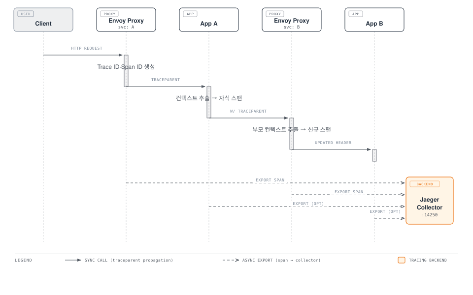

# Istio 분산 추적 (Distributed Tracing)

> **지원 버전**: Istio 1.28
> **마지막 업데이트**: 2026년 2월 19일

분산 추적은 마이크로서비스 간 요청 흐름을 추적하고 시각화하여, 레이턴시 병목 지점 파악, 에러 원인 분석, 서비스 의존성 이해를 가능하게 합니다.

## 목차

1. [분산 추적 개요](#분산 추적-개요)
2. [OpenTelemetry 통합](#opentelemetry-통합)
3. [Jaeger 통합](#jaeger-통합)
4. [Zipkin 통합](#zipkin-통합)
5. [Context Propagation](#context-propagation)
6. [샘플링 전략](#샘플링-전략)
7. [Trace 분석](#trace-분석)
8. [커스텀 스팬 추가](#커스텀-스팬-추가)
9. [성능 최적화](#성능-최적화)
10. [문제 해결](#문제-해결)

## 분산 추적 개요

### W3C Trace Context

Istio는 W3C Trace Context 표준을 지원하여 표준화된 trace 전파를 보장합니다.



### 핵심 개념

#### Trace

단일 요청이 시스템을 통과하는 전체 경로를 나타내는 스팬들의 집합

#### Span

특정 작업(operation)의 시작과 끝을 나타내는 단위
- **Span ID**: 고유 식별자
- **Parent Span ID**: 부모 스팬 참조
- **Trace ID**: 전체 trace 식별자
- **Operation Name**: 작업 이름 (e.g., `HTTP GET /api/products`)
- **Duration**: 작업 소요 시간
- **Tags**: 메타데이터 (service name, HTTP status, etc.)
- **Logs**: 타임스탬프가 있는 이벤트

#### Baggage

trace 전체에 걸쳐 전달되는 키-값 쌍

## OpenTelemetry 통합

OpenTelemetry는 최신 관찰성 표준으로, Istio 1.28에서 권장하는 추적 백엔드입니다.

### 1. OpenTelemetry Collector 설치

```yaml
apiVersion: v1
kind: ConfigMap
metadata:
  name: otel-collector-config
  namespace: observability
data:
  config.yaml: |
    receivers:
      otlp:
        protocols:
          grpc:
            endpoint: 0.0.0.0:4317
          http:
            endpoint: 0.0.0.0:4318

    processors:
      batch:
        timeout: 10s
        send_batch_size: 1024
        send_batch_max_size: 2048

      memory_limiter:
        check_interval: 1s
        limit_mib: 1024

      # Span 속성 추가
      attributes:
        actions:
        - key: cluster.name
          value: production-k8s
          action: insert
        - key: deployment.environment
          value: production
          action: insert

      # Span 필터링
      filter:
        spans:
          include:
            match_type: regexp
            services:
            - ".*"
          exclude:
            match_type: strict
            span_names:
            - /health
            - /readiness
            - /liveness

      # Tail sampling (지능형 샘플링)
      tail_sampling:
        policies:
        # 에러가 있는 trace는 100% 샘플링
        - name: errors-policy
          type: status_code
          status_code:
            status_codes:
            - ERROR
        # 느린 요청은 100% 샘플링
        - name: slow-requests-policy
          type: latency
          latency:
            threshold_ms: 1000
        # 정상 요청은 10% 샘플링
        - name: probabilistic-policy
          type: probabilistic
          probabilistic:
            sampling_percentage: 10

    exporters:
      # Jaeger로 export
      jaeger:
        endpoint: jaeger-collector.observability.svc.cluster.local:14250
        tls:
          insecure: true

      # Zipkin으로 export
      zipkin:
        endpoint: http://zipkin.observability.svc.cluster.local:9411/api/v2/spans

      # Tempo로 export (Grafana 생태계)
      otlp/tempo:
        endpoint: tempo.observability.svc.cluster.local:4317
        tls:
          insecure: true

      # 디버깅용 로깅
      logging:
        loglevel: info
        sampling_initial: 5
        sampling_thereafter: 200

    service:
      pipelines:
        traces:
          receivers: [otlp]
          processors: [memory_limiter, batch, attributes, filter, tail_sampling]
          exporters: [jaeger, otlp/tempo, logging]

      telemetry:
        logs:
          level: info
        metrics:
          address: :8888
---
apiVersion: apps/v1
kind: Deployment
metadata:
  name: otel-collector
  namespace: observability
spec:
  replicas: 3
  selector:
    matchLabels:
      app: otel-collector
  template:
    metadata:
      labels:
        app: otel-collector
    spec:
      containers:
      - name: otel-collector
        image: otel/opentelemetry-collector-contrib:0.96.0
        args:
        - --config=/etc/otel/config.yaml
        ports:
        - containerPort: 4317
          name: otlp-grpc
          protocol: TCP
        - containerPort: 4318
          name: otlp-http
          protocol: TCP
        - containerPort: 8888
          name: metrics
          protocol: TCP
        volumeMounts:
        - name: config
          mountPath: /etc/otel
        resources:
          requests:
            cpu: 500m
            memory: 1Gi
          limits:
            cpu: 2000m
            memory: 4Gi
        livenessProbe:
          httpGet:
            path: /
            port: 13133
        readinessProbe:
          httpGet:
            path: /
            port: 13133
      volumes:
      - name: config
        configMap:
          name: otel-collector-config
---
apiVersion: v1
kind: Service
metadata:
  name: otel-collector
  namespace: observability
spec:
  selector:
    app: otel-collector
  ports:
  - name: otlp-grpc
    port: 4317
    targetPort: 4317
  - name: otlp-http
    port: 4318
    targetPort: 4318
  - name: metrics
    port: 8888
    targetPort: 8888
  type: ClusterIP
```

### 2. Istio에서 OpenTelemetry 활성화

#### MeshConfig 설정

```yaml
apiVersion: v1
kind: ConfigMap
metadata:
  name: istio
  namespace: istio-system
data:
  mesh: |
    defaultConfig:
      tracing:
        sampling: 100.0  # 초기에는 100% 샘플링, collector에서 tail sampling
        max_path_tag_length: 256
    extensionProviders:
    - name: otel-tracing
      opentelemetry:
        service: otel-collector.observability.svc.cluster.local
        port: 4317
        resource_detectors:
          environment: {}
          dynatrace: {}
```

#### Telemetry API로 추적 활성화

```yaml
apiVersion: telemetry.istio.io/v1alpha1
kind: Telemetry
metadata:
  name: otel-tracing
  namespace: istio-system
spec:
  tracing:
  - providers:
    - name: otel-tracing
    randomSamplingPercentage: 100.0
    customTags:
      cluster_id:
        literal:
          value: "production-cluster"
      environment:
        literal:
          value: "production"
```

### 3. 네임스페이스별 추적 설정

```yaml
apiVersion: telemetry.istio.io/v1alpha1
kind: Telemetry
metadata:
  name: namespace-tracing
  namespace: production
spec:
  tracing:
  - providers:
    - name: otel-tracing
    randomSamplingPercentage: 100.0
    customTags:
      namespace:
        literal:
          value: "production"
      team:
        literal:
          value: "backend-team"
      # 요청 헤더를 태그로 추가
      user_id:
        header:
          name: x-user-id
          defaultValue: "unknown"
      request_id:
        header:
          name: x-request-id
      # 환경 변수를 태그로 추가
      pod_name:
        environment:
          name: POD_NAME
          defaultValue: "unknown"
```

## Jaeger 통합

Jaeger는 가장 널리 사용되는 오픈소스 분산 추적 시스템입니다.

### Jaeger All-in-One 배포 (개발/테스트용)

```yaml
apiVersion: apps/v1
kind: Deployment
metadata:
  name: jaeger
  namespace: observability
spec:
  replicas: 1
  selector:
    matchLabels:
      app: jaeger
  template:
    metadata:
      labels:
        app: jaeger
    spec:
      containers:
      - name: jaeger
        image: jaegertracing/all-in-one:1.55
        env:
        - name: COLLECTOR_ZIPKIN_HOST_PORT
          value: :9411
        - name: COLLECTOR_OTLP_ENABLED
          value: "true"
        ports:
        - containerPort: 5775
          protocol: UDP
        - containerPort: 6831
          protocol: UDP
        - containerPort: 6832
          protocol: UDP
        - containerPort: 5778
          protocol: TCP
        - containerPort: 16686
          protocol: TCP
        - containerPort: 14250
          protocol: TCP
        - containerPort: 14268
          protocol: TCP
        - containerPort: 14269
          protocol: TCP
        - containerPort: 4317  # OTLP gRPC
          protocol: TCP
        - containerPort: 4318  # OTLP HTTP
          protocol: TCP
        - containerPort: 9411
          protocol: TCP
        resources:
          requests:
            cpu: 100m
            memory: 256Mi
          limits:
            cpu: 500m
            memory: 1Gi
---
apiVersion: v1
kind: Service
metadata:
  name: jaeger-collector
  namespace: observability
spec:
  selector:
    app: jaeger
  ports:
  - name: jaeger-collector-http
    port: 14268
    targetPort: 14268
  - name: jaeger-collector-grpc
    port: 14250
    targetPort: 14250
  - name: otlp-grpc
    port: 4317
    targetPort: 4317
  - name: otlp-http
    port: 4318
    targetPort: 4318
  - name: zipkin
    port: 9411
    targetPort: 9411
---
apiVersion: v1
kind: Service
metadata:
  name: jaeger-query
  namespace: observability
spec:
  selector:
    app: jaeger
  ports:
  - name: query-http
    port: 16686
    targetPort: 16686
  type: LoadBalancer
```

### Jaeger Production 배포 (Elasticsearch 백엔드)

```yaml
# Elasticsearch (스토리지 백엔드)
apiVersion: elasticsearch.k8s.elastic.co/v1
kind: Elasticsearch
metadata:
  name: jaeger-es
  namespace: observability
spec:
  version: 8.12.0
  nodeSets:
  - name: default
    count: 3
    config:
      node.store.allow_mmap: false
    volumeClaimTemplates:
    - metadata:
        name: elasticsearch-data
      spec:
        accessModes:
        - ReadWriteOnce
        resources:
          requests:
            storage: 100Gi
        storageClassName: gp3
---
# Jaeger Collector (수집)
apiVersion: apps/v1
kind: Deployment
metadata:
  name: jaeger-collector
  namespace: observability
spec:
  replicas: 3
  selector:
    matchLabels:
      app: jaeger-collector
  template:
    metadata:
      labels:
        app: jaeger-collector
    spec:
      containers:
      - name: jaeger-collector
        image: jaegertracing/jaeger-collector:1.55
        env:
        - name: SPAN_STORAGE_TYPE
          value: elasticsearch
        - name: ES_SERVER_URLS
          value: https://jaeger-es-es-http:9200
        - name: ES_USERNAME
          value: elastic
        - name: ES_PASSWORD
          valueFrom:
            secretKeyRef:
              name: jaeger-es-elastic-user
              key: elastic
        - name: COLLECTOR_OTLP_ENABLED
          value: "true"
        - name: COLLECTOR_ZIPKIN_HOST_PORT
          value: :9411
        ports:
        - containerPort: 14250
          name: grpc
        - containerPort: 14268
          name: http
        - containerPort: 4317
          name: otlp-grpc
        - containerPort: 4318
          name: otlp-http
        resources:
          requests:
            cpu: 500m
            memory: 1Gi
          limits:
            cpu: 2000m
            memory: 4Gi
---
# Jaeger Query (UI)
apiVersion: apps/v1
kind: Deployment
metadata:
  name: jaeger-query
  namespace: observability
spec:
  replicas: 2
  selector:
    matchLabels:
      app: jaeger-query
  template:
    metadata:
      labels:
        app: jaeger-query
    spec:
      containers:
      - name: jaeger-query
        image: jaegertracing/jaeger-query:1.55
        env:
        - name: SPAN_STORAGE_TYPE
          value: elasticsearch
        - name: ES_SERVER_URLS
          value: https://jaeger-es-es-http:9200
        - name: ES_USERNAME
          value: elastic
        - name: ES_PASSWORD
          valueFrom:
            secretKeyRef:
              name: jaeger-es-elastic-user
              key: elastic
        ports:
        - containerPort: 16686
          name: query
        resources:
          requests:
            cpu: 200m
            memory: 512Mi
          limits:
            cpu: 1000m
            memory: 2Gi
```

### Istio에서 Jaeger 직접 사용

```yaml
apiVersion: v1
kind: ConfigMap
metadata:
  name: istio
  namespace: istio-system
data:
  mesh: |
    defaultConfig:
      tracing:
        sampling: 100.0
        zipkin:
          address: jaeger-collector.observability:9411
    extensionProviders:
    - name: jaeger
      zipkin:
        service: jaeger-collector.observability.svc.cluster.local
        port: 9411
        maxTagLength: 256
```

```yaml
apiVersion: telemetry.istio.io/v1alpha1
kind: Telemetry
metadata:
  name: jaeger-tracing
  namespace: istio-system
spec:
  tracing:
  - providers:
    - name: jaeger
    randomSamplingPercentage: 100.0
```

## Zipkin 통합

Zipkin은 또 다른 인기 있는 분산 추적 시스템입니다.

### Zipkin 배포

```yaml
apiVersion: apps/v1
kind: Deployment
metadata:
  name: zipkin
  namespace: observability
spec:
  replicas: 1
  selector:
    matchLabels:
      app: zipkin
  template:
    metadata:
      labels:
        app: zipkin
    spec:
      containers:
      - name: zipkin
        image: openzipkin/zipkin:2.24
        ports:
        - containerPort: 9411
        env:
        - name: STORAGE_TYPE
          value: elasticsearch
        - name: ES_HOSTS
          value: elasticsearch:9200
        resources:
          requests:
            cpu: 200m
            memory: 512Mi
          limits:
            cpu: 1000m
            memory: 2Gi
---
apiVersion: v1
kind: Service
metadata:
  name: zipkin
  namespace: observability
spec:
  selector:
    app: zipkin
  ports:
  - port: 9411
    targetPort: 9411
  type: LoadBalancer
```

### Istio에서 Zipkin 설정

```yaml
apiVersion: telemetry.istio.io/v1alpha1
kind: Telemetry
metadata:
  name: zipkin-tracing
  namespace: istio-system
spec:
  tracing:
  - providers:
    - name: zipkin
    randomSamplingPercentage: 100.0
```

## Context Propagation

분산 추적의 핵심은 서비스 간 trace context를 올바르게 전파하는 것입니다.

### 필수 HTTP 헤더

애플리케이션 코드에서 다음 헤더를 반드시 전파해야 합니다:

#### W3C Trace Context (권장)

```
traceparent: 00-0af7651916cd43dd8448eb211c80319c-b7ad6b7169203331-01
tracestate: congo=t61rcWkgMzE
```

#### B3 헤더 (기존 방식)

**Single Header Format (권장)**:
```
b3: 80f198ee56343ba864fe8b2a57d3eff7-e457b5a2e4d86bd1-1-05e3ac9a4f6e3b90
```

**Multi Header Format**:
```
X-B3-TraceId: 80f198ee56343ba864fe8b2a57d3eff7
X-B3-SpanId: e457b5a2e4d86bd1
X-B3-ParentSpanId: 05e3ac9a4f6e3b90
X-B3-Sampled: 1
X-B3-Flags: 0
```

### 애플리케이션별 Context Propagation

#### Python (Flask + OpenTelemetry)

```python
from flask import Flask, request
from opentelemetry import trace
from opentelemetry.extr actor import extract
from opentelemetry.instrumentation.requests import RequestsInstrumentor
from opentelemetry.propagate import inject
import requests

app = Flask(__name__)

# 자동 계측 활성화
RequestsInstrumentor().instrument()

@app.route('/api/service-a')
def service_a():
    # 들어오는 trace context 추출
    ctx = extract(request.headers)

    with trace.get_tracer(__name__).start_as_current_span("process-request", context=ctx):
        # 비즈니스 로직
        result = do_something()

        # 다른 서비스 호출
        headers = {}
        inject(headers)  # 자동으로 traceparent 헤더 추가

        response = requests.get(
            'http://service-b:8080/api/service-b',
            headers=headers
        )

    return result
```

#### Go (Gin + OpenTelemetry)

```go
package main

import (
    "context"
    "net/http"

    "github.com/gin-gonic/gin"
    "go.opentelemetry.io/otel"
    "go.opentelemetry.io/otel/propagation"
    "go.opentelemetry.io/contrib/instrumentation/github.com/gin-gonic/gin/otelgin"
    "go.opentelemetry.io/contrib/instrumentation/net/http/otelhttp"
)

func main() {
    router := gin.Default()

    // OpenTelemetry 미들웨어 추가 (자동 context 추출/전파)
    router.Use(otelgin.Middleware("service-a"))

    router.GET("/api/service-a", func(c *gin.Context) {
        ctx := c.Request.Context()

        // 자식 span 생성
        _, span := otel.Tracer("service-a").Start(ctx, "process-request")
        defer span.End()

        // 다른 서비스 호출 (자동으로 trace context 전파)
        client := http.Client{Transport: otelhttp.NewTransport(http.DefaultTransport)}
        req, _ := http.NewRequestWithContext(ctx, "GET", "http://service-b:8080/api/service-b", nil)
        resp, _ := client.Do(req)

        c.JSON(200, gin.H{"status": "ok"})
    })

    router.Run(":8080")
}
```

#### Java (Spring Boot + OpenTelemetry)

```java
@RestController
@RequestMapping("/api")
public class ServiceAController {

    @Autowired
    private WebClient webClient;

    @Autowired
    private Tracer tracer;

    @GetMapping("/service-a")
    public Mono<String> serviceA(@RequestHeader HttpHeaders headers) {
        // Spring Boot + OpenTelemetry 자동 계측은 자동으로 context를 추출하고 전파합니다

        Span span = tracer.spanBuilder("process-request")
                .setSpanKind(SpanKind.INTERNAL)
                .startSpan();

        try (Scope scope = span.makeCurrent()) {
            // WebClient는 자동으로 trace context를 전파합니다
            return webClient.get()
                    .uri("http://service-b:8080/api/service-b")
                    .retrieve()
                    .bodyToMono(String.class);
        } finally {
            span.end();
        }
    }
}
```

#### Node.js (Express + OpenTelemetry)

```javascript
const express = require('express');
const { trace, context, propagation } = require('@opentelemetry/api');
const axios = require('axios');

const app = express();
const tracer = trace.getTracer('service-a');

app.get('/api/service-a', async (req, res) => {
  // Express instrumentation이 자동으로 context 추출
  const span = tracer.startSpan('process-request');

  try {
    await context.with(trace.setSpan(context.active(), span), async () => {
      // axios 호출 시 자동으로 trace context 전파
      const response = await axios.get('http://service-b:8080/api/service-b');
      res.json({ result: response.data });
    });
  } finally {
    span.end();
  }
});

app.listen(8080);
```

### Trace Context 검증

```bash
# 1. 요청 헤더에 trace context가 포함되었는지 확인
kubectl logs -n <namespace> <pod-name> -c istio-proxy --tail=50 | grep -i traceparent

# 2. Envoy 접근 로그에서 trace ID 확인
istioctl proxy-config log <pod-name> -n <namespace> --level debug
kubectl logs -n <namespace> <pod-name> -c istio-proxy | grep "x-b3-traceid"

# 3. 애플리케이션 로그에 trace ID 포함 확인
kubectl logs -n <namespace> <pod-name> -c <container-name>
```

## 샘플링 전략

### 샘플링 레벨

#### 1. Head Sampling (초기 샘플링)

요청이 시스템에 들어오는 시점에 샘플링 결정:

**전체 메시 레벨**:
```yaml
apiVersion: v1
kind: ConfigMap
metadata:
  name: istio
  namespace: istio-system
data:
  mesh: |
    defaultConfig:
      tracing:
        sampling: 10.0  # 10% 샘플링
```

**네임스페이스 레벨**:
```yaml
apiVersion: telemetry.istio.io/v1alpha1
kind: Telemetry
metadata:
  name: sampling-config
  namespace: production
spec:
  tracing:
  - providers:
    - name: otel-tracing
    randomSamplingPercentage: 25.0  # 25% 샘플링
```

**워크로드 레벨**:
```yaml
apiVersion: telemetry.istio.io/v1alpha1
kind: Telemetry
metadata:
  name: critical-service-tracing
  namespace: production
spec:
  selector:
    matchLabels:
      app: payment-service
  tracing:
  - providers:
    - name: otel-tracing
    randomSamplingPercentage: 100.0  # 중요한 서비스는 100% 샘플링
```

#### 2. Tail Sampling (사후 샘플링)

trace가 완료된 후 collector에서 샘플링 결정:

```yaml
# OpenTelemetry Collector의 tail_sampling processor
processors:
  tail_sampling:
    decision_wait: 10s  # trace 완료 대기 시간
    num_traces: 100000  # 메모리에 유지할 trace 수
    expected_new_traces_per_sec: 1000
    policies:
      # 에러가 있는 trace는 모두 보관
      - name: errors
        type: status_code
        status_code:
          status_codes: [ERROR]

      # 느린 요청 (> 1초)은 모두 보관
      - name: slow-traces
        type: latency
        latency:
          threshold_ms: 1000

      # 특정 서비스는 100% 샘플링
      - name: critical-services
        type: string_attribute
        string_attribute:
          key: service.name
          values:
          - payment-service
          - auth-service

      # HTTP 5xx 에러는 모두 보관
      - name: http-errors
        type: numeric_attribute
        numeric_attribute:
          key: http.status_code
          min_value: 500
          max_value: 599

      # 나머지는 5% 샘플링
      - name: probabilistic
        type: probabilistic
        probabilistic:
          sampling_percentage: 5
```

### 적응형 샘플링 (Adaptive Sampling)

트래픽 패턴에 따라 자동으로 샘플링 비율 조정:

```yaml
processors:
  tail_sampling:
    policies:
      - name: adaptive-sampling
        type: rate_limiting
        rate_limiting:
          spans_per_second: 1000  # 초당 최대 1000개 span 보관
```

### 샘플링 전략 가이드

| 환경 | 권장 샘플링 비율 | 전략 |
|------|-----------------|------|
| 개발 | 100% | Head sampling |
| 스테이징 | 50% | Head sampling |
| 프로덕션 (저트래픽) | 100% | Head sampling |
| 프로덕션 (고트래픽) | 1-10% | Tail sampling |
| 중요 서비스 | 100% | Tail sampling (에러/느린 요청 모두 보관) |

## Trace 분석

### Jaeger UI에서 Trace 검색

```bash
# Jaeger UI 접속
kubectl port-forward -n observability svc/jaeger-query 16686:16686

# 브라우저: http://localhost:16686
```

**검색 옵션**:
- **Service**: 서비스 이름
- **Operation**: 작업 이름 (e.g., `GET /api/products`)
- **Tags**: 태그 필터 (e.g., `http.status_code=500`)
- **Min Duration**: 최소 지연시간
- **Max Duration**: 최대 지연시간
- **Limit Results**: 결과 수 제한

### 유용한 Trace 쿼리

#### 1. 에러가 있는 trace 찾기

```
Tags: error=true
```

또는

```
Tags: http.status_code=500
```

#### 2. 느린 요청 찾기

```
Min Duration: 1s
```

#### 3. 특정 사용자 요청 추적

```
Tags: user.id=12345
```

#### 4. 특정 API 엔드포인트 분석

```
Operation: GET /api/products/{id}
```

### Jaeger API로 프로그래밍 방식 분석

```bash
# 특정 서비스의 trace 조회
curl "http://jaeger-query:16686/api/traces?service=productpage&limit=10"

# 특정 trace ID 조회
curl "http://jaeger-query:16686/api/traces/0af7651916cd43dd8448eb211c80319c"

# 서비스 목록 조회
curl "http://jaeger-query:16686/api/services"

# 특정 서비스의 operation 목록
curl "http://jaeger-query:16686/api/services/productpage/operations"
```

### 레이턴시 병목 지점 파악

1. **Waterfall View에서 가장 긴 span 찾기**
2. **Critical Path 확인**: 전체 요청 시간에 가장 큰 영향을 미치는 경로
3. **병렬 vs 순차 실행**: 병렬로 실행 가능한 작업이 순차 실행되고 있는지 확인

### Grafana Tempo 통합

```yaml
apiVersion: v1
kind: ConfigMap
metadata:
  name: grafana-datasources
  namespace: observability
data:
  tempo.yaml: |
    apiVersion: 1
    datasources:
    - name: Tempo
      type: tempo
      access: proxy
      url: http://tempo:3100
      jsonData:
        tracesToLogs:
          datasourceUid: 'loki'
          tags: ['job', 'instance', 'pod', 'namespace']
          mappedTags: [{ key: 'service.name', value: 'service' }]
        tracesToMetrics:
          datasourceUid: 'prometheus'
          tags: [{ key: 'service.name', value: 'service' }]
          queries:
          - name: 'Request rate'
            query: 'sum(rate(istio_requests_total{$__tags}[5m]))'
        serviceMap:
          datasourceUid: 'prometheus'
        search:
          hide: false
        nodeGraph:
          enabled: true
```

## 커스텀 스팬 추가

애플리케이션 코드에 커스텀 span을 추가하여 더 상세한 추적을 제공합니다.

### Python 예제

```python
from opentelemetry import trace

tracer = trace.get_tracer(__name__)

def process_order(order_id):
    with tracer.start_as_current_span("process-order") as span:
        span.set_attribute("order.id", order_id)
        span.set_attribute("order.amount", 99.99)

        # 재고 확인
        with tracer.start_as_current_span("check-inventory"):
            inventory = check_inventory(order_id)
            span.set_attribute("inventory.available", inventory)

        # 결제 처리
        with tracer.start_as_current_span("process-payment") as payment_span:
            try:
                payment_result = process_payment(order_id)
                payment_span.set_attribute("payment.status", "success")
            except PaymentError as e:
                payment_span.set_status(Status(StatusCode.ERROR))
                payment_span.record_exception(e)
                raise

        # 이벤트 기록
        span.add_event("Order processed successfully", {
            "order.id": order_id,
            "timestamp": time.time()
        })

        return {"status": "success"}
```

### Go 예제

```go
import (
    "context"
    "go.opentelemetry.io/otel"
    "go.opentelemetry.io/otel/attribute"
    "go.opentelemetry.io/otel/codes"
)

func processOrder(ctx context.Context, orderID string) error {
    tracer := otel.Tracer("order-service")

    ctx, span := tracer.Start(ctx, "process-order")
    defer span.End()

    span.SetAttributes(
        attribute.String("order.id", orderID),
        attribute.Float64("order.amount", 99.99),
    )

    // 재고 확인
    ctx, inventorySpan := tracer.Start(ctx, "check-inventory")
    inventory, err := checkInventory(ctx, orderID)
    if err != nil {
        inventorySpan.RecordError(err)
        inventorySpan.SetStatus(codes.Error, err.Error())
        inventorySpan.End()
        return err
    }
    inventorySpan.SetAttributes(attribute.Bool("inventory.available", inventory))
    inventorySpan.End()

    // 결제 처리
    ctx, paymentSpan := tracer.Start(ctx, "process-payment")
    err = processPayment(ctx, orderID)
    if err != nil {
        paymentSpan.RecordError(err)
        paymentSpan.SetStatus(codes.Error, err.Error())
        paymentSpan.End()
        return err
    }
    paymentSpan.SetAttributes(attribute.String("payment.status", "success"))
    paymentSpan.End()

    // 이벤트 기록
    span.AddEvent("Order processed successfully")

    return nil
}
```

## 성능 최적화

### Trace 데이터 크기 최적화

```yaml
apiVersion: v1
kind: ConfigMap
metadata:
  name: istio
  namespace: istio-system
data:
  mesh: |
    defaultConfig:
      tracing:
        sampling: 10.0
        max_path_tag_length: 256  # URL 경로 길이 제한
        custom_tags:
          # 필요한 태그만 추가
          cluster_id:
            literal:
              value: "prod"
```

### Collector 성능 튜닝

```yaml
processors:
  batch:
    timeout: 10s
    send_batch_size: 1024
    send_batch_max_size: 2048

  memory_limiter:
    check_interval: 1s
    limit_mib: 2048
    spike_limit_mib: 512
```

### Storage 최적화

#### Elasticsearch Index 관리

```bash
# 오래된 인덱스 삭제 (Curator 사용)
curator --config curator.yml delete_indices.yml
```

```yaml
# delete_indices.yml
actions:
  1:
    action: delete_indices
    description: Delete jaeger indices older than 7 days
    options:
      ignore_empty_list: True
      disable_action: False
    filters:
    - filtertype: pattern
      kind: prefix
      value: jaeger-span-
    - filtertype: age
      source: name
      direction: older
      timestring: '%Y-%m-%d'
      unit: days
      unit_count: 7
```

## 문제 해결

### Trace가 보이지 않을 때

#### 1. Envoy가 trace를 생성하는지 확인

```bash
# Envoy 접근 로그 확인
kubectl logs -n <namespace> <pod-name> -c istio-proxy | grep -i trace

# Envoy 설정에서 tracing 확인
istioctl proxy-config bootstrap <pod-name> -n <namespace> -o json | jq '.bootstrap.tracing'
```

#### 2. Collector가 trace를 수신하는지 확인

```bash
# Collector 로그 확인
kubectl logs -n observability deployment/otel-collector

# Collector 메트릭 확인
kubectl port-forward -n observability svc/otel-collector 8888:8888
curl http://localhost:8888/metrics | grep otelcol_receiver_accepted_spans
```

#### 3. Jaeger/Zipkin에 trace가 저장되는지 확인

```bash
# Jaeger storage 확인
kubectl logs -n observability deployment/jaeger-query

# Elasticsearch에 인덱스 확인
curl -X GET "elasticsearch:9200/_cat/indices/jaeger-*?v"
```

### Trace Context가 전파되지 않을 때

```bash
# 1. 애플리케이션 로그에서 헤더 확인
kubectl logs -n <namespace> <pod-name> -c <container> | grep -i "traceparent\|x-b3"

# 2. Envoy access log 활성화
kubectl exec -n <namespace> <pod-name> -c istio-proxy -- \
  curl -X POST http://localhost:15000/logging?level=debug

# 3. 헤더 전파 검증을 위한 테스트
kubectl run -it --rm debug --image=curlimages/curl --restart=Never -- \
  curl -H "traceparent: 00-0af7651916cd43dd8448eb211c80319c-b7ad6b7169203331-01" \
  http://service-a:8080/api/test
```

### 샘플링 비율이 적용되지 않을 때

```bash
# 1. Telemetry 리소스 확인
kubectl get telemetry -A

# 2. Telemetry 설정 상세 확인
kubectl describe telemetry <name> -n <namespace>

# 3. Envoy 설정에 반영되었는지 확인
istioctl proxy-config bootstrap <pod-name> -n <namespace> -o json | \
  jq '.bootstrap.tracing.http.config.sampling'
```

## 참고 자료

- [Istio Distributed Tracing](https://istio.io/latest/docs/tasks/observability/distributed-tracing/)
- [OpenTelemetry Documentation](https://opentelemetry.io/docs/)
- [Jaeger Documentation](https://www.jaegertracing.io/docs/)
- [Zipkin Documentation](https://zipkin.io/)
- [W3C Trace Context](https://www.w3.org/TR/trace-context/)
- [B3 Propagation](https://github.com/openzipkin/b3-propagation)
- [Grafana Tempo](https://grafana.com/docs/tempo/latest/)
