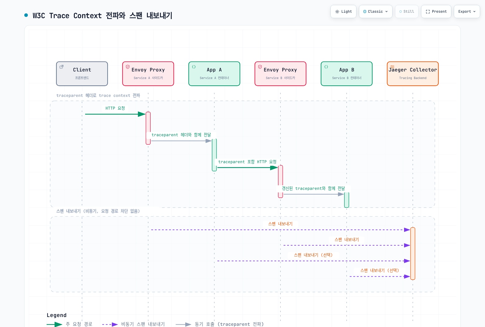

# Istio 분산 추적 (Distributed Tracing)

> **지원 버전**: Istio 1.31
> **마지막 업데이트**: 2026년 9월 11일

> **검증 범위**: 실습 설정은 공식 자료와 오프라인 검증기로 확인했으며 클러스터에 배포해 실행하지 않았습니다. 각 예제의 네임스페이스·신원·스토리지·백엔드·부하 전제 조건은 대상 환경에서 확인해야 합니다.

분산 추적은 마이크로서비스 간 요청 흐름을 추적하고 시각화하여, 레이턴시 병목 지점 파악, 에러 원인 분석, 서비스 의존성 이해를 가능하게 합니다.

## 목차

1. [분산 추적 개요](#분산-추적-개요)
2. [OpenTelemetry 통합](#opentelemetry-통합)
3. [Jaeger 통합](#jaeger-통합)
4. [Zipkin 통합](#zipkin-통합)
5. [Context Propagation](#context-propagation)
6. [샘플링 전략](#샘플링-전략)
7. [Trace 분석](#trace-분석)
8. [커스텀 스팬 추가](#커스텀-스팬-추가)
9. [성능 최적화](#성능-최적화)
10. [문제 해결](#문제-해결)

## 분산 추적 개요

### W3C Trace Context

Istio는 호환되는 추적 제공자로 W3C trace context를 지원합니다. 애플리케이션은 자신의 요청 간 context를 전파해야 하며 그림의 애플리케이션 span은 초기화된 SDK 또는 agent가 필요합니다. 예제는 사이드카·waypoint 기준이며 ztunnel은 HTTP trace span을 생성하지 않습니다.



[🔍 인터랙티브 다이어그램 보기](https://www.atomai.click/kubernetes-docs/archmaps/ko-service-mesh-istio-observability-02-tracing-0.html)

### 핵심 개념

#### Trace

단일 요청이 시스템을 통과하는 전체 경로를 나타내는 스팬들의 집합

#### Span

특정 작업(operation)의 시작과 끝을 나타내는 단위
- **Span ID**: 고유 식별자
- **Parent Span ID**: 부모 스팬 참조
- **Trace ID**: 전체 trace 식별자
- **Operation Name**: 작업 이름 (e.g., `HTTP GET /api/products`)
- **Duration**: 작업 소요 시간
- **Tags**: 메타데이터 (service name, HTTP status, etc.)
- **Logs**: 타임스탬프가 있는 이벤트

#### Baggage

애플리케이션·propagator가 지원할 때 전달되는 context 키-값입니다. Baggage가 자동으로 span 속성이 되지는 않으며 비밀을 넣지 않습니다.

## OpenTelemetry 통합

OpenTelemetry는 계측·프로토콜·수집기를 제공하며 trace 저장 백엔드가 아닙니다. 아래 예제는 OTLP를 collector로 보내고 Jaeger에 저장합니다. Zipkin·Tempo는 대안 백엔드입니다.

### 1. OpenTelemetry Collector 설치

검증 전에 `observability` 네임스페이스와 아래 Jaeger 백엔드를 준비합니다. 이 예제는 tail-sampling 상태를 메모리에 보관하는 단일 replica collector입니다. 여러 tail sampler 앞의 일반 Kubernetes Service만으로 같은 trace의 모든 span이 한곳에 모이지 않으므로 운영 확장에는 trace ID 기반 라우팅·용량 계획·지연 도착 span 처리가 필요합니다. 이 실습의 내부 OTLP는 평문이며 배포 시 네트워크를 제한하거나 TLS/mTLS를 구성합니다. Health extension과 내부 메트릭 listener를 명시적으로 활성화합니다.

```yaml
apiVersion: v1
kind: ConfigMap
metadata:
  name: otel-collector-config
  namespace: observability
data:
  config.yaml: |
    extensions:
      health_check:
        endpoint: 0.0.0.0:13133
    receivers:
      otlp:
        protocols:
          grpc:
            endpoint: 0.0.0.0:4317
          http:
            endpoint: 0.0.0.0:4318
    processors:
      memory_limiter:
        check_interval: 1s
        limit_mib: 1024
      resource:
        attributes:
        - key: k8s.cluster.name
          value: production-k8s
          action: upsert
        - key: deployment.environment.name
          value: production
          action: upsert
      filter/health:
        error_mode: ignore
        trace_conditions:
        - span.name == "/health" or span.name == "/readiness" or span.name == "/liveness"
      tail_sampling:
        decision_wait: 30s
        num_traces: 50000
        policies:
        - name: errors
          type: status_code
          status_code:
            status_codes:
            - ERROR
        - name: slow
          type: latency
          latency:
            threshold_ms: 1000
        - name: baseline
          type: probabilistic
          probabilistic:
            sampling_percentage: 10
      batch:
        timeout: 10s
        send_batch_size: 1024
        send_batch_max_size: 2048
    exporters:
      otlp_grpc/jaeger:
        endpoint: jaeger-collector.observability.svc.cluster.local:4317
        tls:
          insecure: true
      debug:
        verbosity: basic
    service:
      extensions:
      - health_check
      pipelines:
        traces:
          receivers:
          - otlp
          processors:
          - memory_limiter
          - resource
          - filter/health
          - tail_sampling
          - batch
          exporters:
          - otlp_grpc/jaeger
          - debug
      telemetry:
        logs:
          level: info
        metrics:
          readers:
          - pull:
              exporter:
                prometheus:
                  host: 0.0.0.0
                  port: 8888
---
apiVersion: apps/v1
kind: Deployment
metadata:
  name: otel-collector
  namespace: observability
spec:
  replicas: 1
  selector:
    matchLabels:
      app: otel-collector
  template:
    metadata:
      labels:
        app: otel-collector
      annotations:
        sidecar.istio.io/inject: 'false'
    spec:
      containers:
      - name: otel-collector
        image: otel/opentelemetry-collector-contrib:0.160.0
        args:
        - --config=/etc/otel/config.yaml
        ports:
        - containerPort: 4317
          name: otlp-grpc
          protocol: TCP
        - containerPort: 4318
          name: otlp-http
          protocol: TCP
        - containerPort: 8888
          name: metrics
          protocol: TCP
        - containerPort: 13133
          name: health
        volumeMounts:
        - name: config
          mountPath: /etc/otel
        resources:
          requests:
            cpu: 500m
            memory: 1Gi
          limits:
            cpu: 2000m
            memory: 2Gi
        livenessProbe:
          httpGet:
            path: /
            port: 13133
        readinessProbe:
          httpGet:
            path: /
            port: 13133
      volumes:
      - name: config
        configMap:
          name: otel-collector-config
---
apiVersion: v1
kind: Service
metadata:
  name: otel-collector
  namespace: observability
  labels:
    app: otel-collector
spec:
  selector:
    app: otel-collector
  ports:
  - name: otlp-grpc
    port: 4317
    targetPort: 4317
  - name: otlp-http
    port: 4318
    targetPort: 4318
  - name: metrics
    port: 8888
    targetPort: 8888
  type: ClusterIP
```

제거된 `jaeger` exporter는 OTLP/gRPC, `logging`은 `debug`로 대체했습니다. 필터는 실제 span 이름과 정확히 일치할 때 작동하므로 계측에 맞춰 조정하고 span 삭제가 trace 완전성에 미치는 영향을 고려합니다. Tail 정책은 실제 도착한 대상 trace만 보관하며 상류에서 버린 span은 복구하지 못합니다. 검증 후 진단 export는 제거합니다.

### 2. Istio에서 OpenTelemetry 활성화

#### MeshConfig 설정

이 제공자를 기존 설치 설정에 병합하고 `istioctl install -f`로 적용합니다. 전체 `istio` ConfigMap을 덮어쓰지 않습니다. `maxTagLength`는 모든 span 속성이 아닌 path 태그를 제한합니다.

```yaml
apiVersion: install.istio.io/v1alpha1
kind: IstioOperator
spec:
  meshConfig:
    enableTracing: true
    extensionProviders:
    - name: otel-tracing
      opentelemetry:
        service: otel-collector.observability.svc.cluster.local
        port: 4317
        maxTagLength: 256
```

#### Telemetry API로 추적 활성화

```yaml
apiVersion: telemetry.istio.io/v1
kind: Telemetry
metadata:
  name: otel-tracing
  namespace: istio-system
spec:
  tracing:
  - providers:
    - name: otel-tracing
    randomSamplingPercentage: 100.0
    customTags:
      cluster_id:
        literal:
          value: "production-cluster"
      environment:
        literal:
          value: "production"
```

네임스페이스별 selector 없는 Telemetry는 하나에 병합하고 충돌하는 예제를 함께 적용하지 않습니다. 헤더 태그는 인증된 신원이 아닌 신뢰할 수 없는 요청 메타데이터입니다. 사용자 상관관계에는 승인된 가명 값을 사용합니다. 환경 태그는 애플리케이션이 아닌 프록시 환경 변수를 읽습니다.

### 3. 네임스페이스별 추적 설정

```yaml
apiVersion: telemetry.istio.io/v1
kind: Telemetry
metadata:
  name: namespace-tracing
  namespace: production
spec:
  tracing:
  - providers:
    - name: otel-tracing
    randomSamplingPercentage: 100.0
    customTags:
      namespace:
        literal:
          value: "production"
      team:
        literal:
          value: "backend-team"
      # 요청 헤더를 태그로 추가
      user_id:
        header:
          name: x-user-id
          defaultValue: "unknown"
      request_id:
        header:
          name: x-request-id
      # 환경 변수를 태그로 추가
      pod_name:
        environment:
          name: POD_NAME
          defaultValue: "unknown"
```

## Jaeger 통합

### Jaeger 2 개발 배포

Jaeger 2는 `jaegertracing/jaeger` 이미지와 명시적 설정 파일을 사용합니다. 다음 메모리 저장 인스턴스는 개발용이며 재시작하면 trace가 사라집니다. Query·OTLP endpoint는 클러스터 내부로 유지하고 UI는 port-forward로 조회합니다.

```yaml
apiVersion: v1
kind: ConfigMap
metadata:
  name: jaeger-config
  namespace: observability
data:
  config.yaml: |
    extensions:
      jaeger_storage:
        backends:
          traces:
            memory:
              max_traces: 50000
      jaeger_query:
        storage:
          traces: traces
    receivers:
      otlp:
        protocols:
          grpc:
            endpoint: 0.0.0.0:4317
          http:
            endpoint: 0.0.0.0:4318
    processors:
      batch: {}
    exporters:
      jaeger_storage_exporter:
        trace_storage: traces
    service:
      extensions:
      - jaeger_storage
      - jaeger_query
      pipelines:
        traces:
          receivers:
          - otlp
          processors:
          - batch
          exporters:
          - jaeger_storage_exporter
---
apiVersion: apps/v1
kind: Deployment
metadata:
  name: jaeger
  namespace: observability
spec:
  replicas: 1
  selector:
    matchLabels:
      app: jaeger
  template:
    metadata:
      labels:
        app: jaeger
      annotations:
        sidecar.istio.io/inject: 'false'
    spec:
      containers:
      - name: jaeger
        image: jaegertracing/jaeger:2.20.0
        args:
        - --config=/etc/jaeger/config.yaml
        ports:
        - containerPort: 4317
          name: otlp-grpc
        - containerPort: 4318
          name: otlp-http
        - containerPort: 16686
          name: query-http
        volumeMounts:
        - name: config
          mountPath: /etc/jaeger
          readOnly: true
        resources:
          requests:
            cpu: 200m
            memory: 512Mi
          limits:
            cpu: 1000m
            memory: 2Gi
      volumes:
      - name: config
        configMap:
          name: jaeger-config
---
apiVersion: v1
kind: Service
metadata:
  name: jaeger-collector
  namespace: observability
spec:
  selector:
    app: jaeger
  ports:
  - name: otlp-grpc
    port: 4317
    targetPort: otlp-grpc
  - name: otlp-http
    port: 4318
    targetPort: otlp-http
---
apiVersion: v1
kind: Service
metadata:
  name: jaeger-query
  namespace: observability
spec:
  selector:
    app: jaeger
  ports:
  - name: query-http
    port: 16686
    targetPort: query-http
  type: ClusterIP
```

### 운영 스토리지와 확장

영속 저장에는 지원되는 Elasticsearch/OpenSearch 배포와 해당 Jaeger storage driver를 사용합니다. Jaeger 2.20의 공개 Elasticsearch 호환성 표는 **7.x/8.x**를 명시하므로 Elasticsearch 최신 major가 자동 지원된다고 추론하지 않습니다. 기존 ECK 배포는 operator·클러스터 호환성도 확인하며 EKS의 `gp3` 스토리지에는 EBS CSI driver와 실제 StorageClass가 필요합니다.

Elasticsearch를 사용하면 `jaeger-config`의 memory backend를 다음 조각으로 교체하고 `traces`를 참조하는 receiver·exporter·query·pipeline 설정을 유지합니다. 제한된 `jaeger` 사용자용 `password`와 서버 인증서에 맞는 공개 `ca.crt`를 가진 `jaeger-es-client` Secret을 생성합니다. 서버 호스트 이름 검증은 유지합니다.

```yaml
extensions:
  jaeger_storage:
    backends:
      traces:
        elasticsearch:
          server_urls:
          - https://jaeger-es-es-http.observability.svc.cluster.local:9200
          auth:
            basic:
              username: jaeger
              password_file: /etc/jaeger/es/password
          tls:
            ca_file: /etc/jaeger/es/ca.crt
          indices:
            index_prefix: production
```

다음 Deployment 조각을 기존 `jaeger` 배포에 병합하며 이미지·인자·설정 마운트·다른 필드를 유지합니다. 공유 영속 저장소를 사용하면 결합된 collector/query 인스턴스는 상태 없이 복제할 수 있습니다. 독립 확장이 필요하면 동일 Jaeger 2 바이너리로 collector/query 역할을 분리합니다.

```yaml
spec:
  replicas: 3
  template:
    spec:
      containers:
      - name: jaeger
        volumeMounts:
        - name: es-client
          mountPath: /etc/jaeger/es
          readOnly: true
      volumes:
      - name: es-client
        secret:
          secretName: jaeger-es-client
```

[Jaeger Elasticsearch 가이드](https://www.jaegertracing.io/docs/2.20/storage/elasticsearch/)와 릴리스 schema에 따라 저장소 초기화·인덱스 순환/보존·백업·저장소 권한을 구성합니다. 기존 1.x 환경 변수·이미지 배포는 Jaeger 2 설정이 아닙니다. 저장된 trace를 마이그레이션하기 전에 릴리스 노트를 확인합니다.

### Istio → Jaeger 직접 OTLP 대안

별도 collector와 그 tail-sampling 정책을 우회하므로 워크로드에 맞는 head sampling을 사용합니다. 대안 제공자이므로 기존 설치에 병합하고 해당 Telemetry에서 의도한 제공자만 선택합니다.

```yaml
apiVersion: install.istio.io/v1alpha1
kind: IstioOperator
spec:
  meshConfig:
    enableTracing: true
    extensionProviders:
    - name: jaeger
      opentelemetry:
        service: jaeger-collector.observability.svc.cluster.local
        port: 4317
        maxTagLength: 256
```

```yaml
apiVersion: telemetry.istio.io/v1
kind: Telemetry
metadata:
  name: jaeger-tracing
  namespace: istio-system
spec:
  tracing:
  - providers:
    - name: jaeger
    randomSamplingPercentage: 1
```

## Zipkin 통합

### Zipkin 개발 배포

이 대안은 Zipkin 3.6.1의 메모리 저장 테스트 구성이므로 재시작 시 데이터를 잃습니다. 운영에는 지원되는 영속 백엔드·인증/TLS·네트워크 제어가 필요합니다. [Zipkin 서버 설정](https://github.com/openzipkin/zipkin/blob/3.6.1/zipkin-server/README.md)에 맞는 백엔드를 선택하며 배포하지 않은 `elasticsearch:9200`을 지정하지 않습니다.

```yaml
apiVersion: apps/v1
kind: Deployment
metadata:
  name: zipkin
  namespace: observability
spec:
  replicas: 1
  selector:
    matchLabels:
      app: zipkin
  template:
    metadata:
      labels:
        app: zipkin
      annotations:
        sidecar.istio.io/inject: 'false'
    spec:
      containers:
      - name: zipkin
        image: openzipkin/zipkin:3.6.1
        ports:
        - containerPort: 9411
          name: http
        env:
        - name: STORAGE_TYPE
          value: mem
        resources:
          requests:
            cpu: 200m
            memory: 512Mi
          limits:
            cpu: 1000m
            memory: 2Gi
---
apiVersion: v1
kind: Service
metadata:
  name: zipkin
  namespace: observability
spec:
  selector:
    app: zipkin
  ports:
  - name: http
    port: 9411
    targetPort: http
  type: ClusterIP
```

### Istio 제공자 설정

Telemetry에서 참조하기 전에 제공자가 있어야 합니다. 다음 설치 입력을 병합하고 collector/Jaeger 선택의 대안으로 이 Telemetry를 사용합니다.

```yaml
apiVersion: install.istio.io/v1alpha1
kind: IstioOperator
spec:
  meshConfig:
    enableTracing: true
    extensionProviders:
    - name: zipkin
      zipkin:
        service: zipkin.observability.svc.cluster.local
        port: 9411
        maxTagLength: 256
```

```yaml
apiVersion: telemetry.istio.io/v1
kind: Telemetry
metadata:
  name: zipkin-tracing
  namespace: istio-system
spec:
  tracing:
  - providers:
    - name: zipkin
    randomSamplingPercentage: 1
```

## Context Propagation

분산 추적의 핵심은 서비스 간 trace context를 올바르게 전파하는 것입니다.

### 필수 HTTP 헤더

프록시·백엔드에 구성한 형식을 전파합니다. W3C와 B3는 대안이거나 명시적으로 구성한 다중 형식 전파이며 `x-request-id`도 전달합니다. B3는 계속 지원되고 debug용 `X-B3-Flags: 1`은 무조건 활성화하지 않습니다.

#### W3C Trace Context (권장)

```
traceparent: 00-0af7651916cd43dd8448eb211c80319c-b7ad6b7169203331-01
tracestate: congo=t61rcWkgMzE
```

#### B3 헤더

**Single Header Format (권장)**:
```
b3: 80f198ee56343ba864fe8b2a57d3eff7-e457b5a2e4d86bd1-1-05e3ac9a4f6e3b90
```

**Multi Header Format**:
```
X-B3-TraceId: 80f198ee56343ba864fe8b2a57d3eff7
X-B3-SpanId: e457b5a2e4d86bd1
X-B3-ParentSpanId: 05e3ac9a4f6e3b90
X-B3-Sampled: 1
```

### 애플리케이션별 Context Propagation

아래 예제는 기존 collector와 `service-b:8080/api/service-b` endpoint를 가정합니다. 호환되는 API/SDK/exporter/instrumentation 의존성을 설치하고 **요청 처리 전에** SDK를 초기화합니다. 실습의 클러스터 내부 OTLP는 평문이며 실제 배포에는 신뢰하는 TLS/mTLS와 네트워크 제한을 구성합니다. 자동 계측과 수동 전파를 중복해 client span을 만들지 않습니다. Istio 요청 상관관계용 `x-request-id`는 별도로 유지합니다.

#### Python (Flask + OpenTelemetry)

애플리케이션 환경에 Flask, requests, `opentelemetry-sdk`, `opentelemetry-exporter-otlp-proto-grpc`, `opentelemetry-instrumentation-flask`, `opentelemetry-instrumentation-requests`를 설치합니다. Flask/requests 계측이 context 추출·주입을 처리하며 수동 API는 기존 잘못된 import가 아닌 `opentelemetry.propagate.extract`입니다.

```python
import atexit
import requests
from flask import Flask, request
from opentelemetry import trace
from opentelemetry.sdk.resources import Resource
from opentelemetry.sdk.trace import TracerProvider
from opentelemetry.sdk.trace.export import BatchSpanProcessor
from opentelemetry.exporter.otlp.proto.grpc.trace_exporter import OTLPSpanExporter
from opentelemetry.instrumentation.flask import FlaskInstrumentor
from opentelemetry.instrumentation.requests import RequestsInstrumentor
from opentelemetry.propagate import set_global_textmap
from opentelemetry.trace.propagation.tracecontext import TraceContextTextMapPropagator

provider = TracerProvider(resource=Resource.create({"service.name": "service-a"}))
provider.add_span_processor(BatchSpanProcessor(OTLPSpanExporter(
    endpoint="otel-collector.observability.svc.cluster.local:4317", insecure=True
)))
trace.set_tracer_provider(provider)
set_global_textmap(TraceContextTextMapPropagator())
atexit.register(provider.shutdown)
app = Flask(__name__)
FlaskInstrumentor().instrument_app(app)
RequestsInstrumentor().instrument()
tracer = trace.get_tracer(__name__)

@app.get("/api/service-a")
def service_a():
    # Flask instrumentation extracted the parent; requests instrumentation injects its child.
    with tracer.start_as_current_span("process-request"):
        headers = {}
        if request.headers.get("x-request-id"):
            headers["x-request-id"] = request.headers["x-request-id"]
        response = requests.get("http://service-b:8080/api/service-b",
                                headers=headers, timeout=3)
        response.raise_for_status()
        return response.text, response.status_code, {
            "Content-Type": response.headers.get("Content-Type", "text/plain")
        }

if __name__ == "__main__":
    app.run(host="0.0.0.0", port=8080)
```

Flask 개발 서버는 로컬 테스트용이며 배포에는 애플리케이션 운영 서버와 SDK 종료 수명 주기를 적용합니다.

#### Go (Gin + OpenTelemetry)

실제 tracer provider와 W3C propagator를 초기화합니다. `Start`가 반환한 context로 downstream 요청을 만들고 오류 처리·응답 body 종료를 수행합니다. import 모듈을 애플리케이션 `go.mod`에 추가하고 context·error 반환값을 버리지 않습니다.

```go
package main

import (
	"context"
	"io"
	"log"
	"net/http"
	"time"

	"github.com/gin-gonic/gin"
	"go.opentelemetry.io/contrib/instrumentation/github.com/gin-gonic/gin/otelgin"
	"go.opentelemetry.io/contrib/instrumentation/net/http/otelhttp"
	"go.opentelemetry.io/otel"
	"go.opentelemetry.io/otel/attribute"
	"go.opentelemetry.io/otel/codes"
	"go.opentelemetry.io/otel/exporters/otlp/otlptrace/otlptracegrpc"
	"go.opentelemetry.io/otel/propagation"
	"go.opentelemetry.io/otel/sdk/resource"
	sdktrace "go.opentelemetry.io/otel/sdk/trace"
)

func main() {
	exporter, err := otlptracegrpc.New(context.Background(),
		otlptracegrpc.WithEndpoint("otel-collector.observability.svc.cluster.local:4317"),
		otlptracegrpc.WithInsecure())
	if err != nil {
		log.Fatal(err)
	}
	provider := sdktrace.NewTracerProvider(sdktrace.WithBatcher(exporter),
		sdktrace.WithResource(resource.NewSchemaless(attribute.String("service.name", "service-a"))))
	otel.SetTracerProvider(provider)
	otel.SetTextMapPropagator(propagation.TraceContext{})
	defer func() {
		ctx, cancel := context.WithTimeout(context.Background(), 5*time.Second)
		defer cancel()
		if err := provider.Shutdown(ctx); err != nil {
			log.Print(err)
		}
	}()
	client := &http.Client{Transport: otelhttp.NewTransport(http.DefaultTransport), Timeout: 3 * time.Second}
	router := gin.Default()
	router.Use(otelgin.Middleware("service-a"))
	router.GET("/api/service-a", func(c *gin.Context) {
		ctx, span := otel.Tracer("service-a").Start(c.Request.Context(), "process-request")
		defer span.End()
		req, err := http.NewRequestWithContext(ctx, http.MethodGet, "http://service-b:8080/api/service-b", nil)
		if err != nil {
			c.Status(http.StatusInternalServerError)
			return
		}
		if id := c.GetHeader("x-request-id"); id != "" {
			req.Header.Set("x-request-id", id)
		}
		resp, err := client.Do(req)
		if err != nil {
			span.RecordError(err)
			span.SetStatus(codes.Error, "downstream request failed")
			c.Status(http.StatusBadGateway)
			return
		}
		defer resp.Body.Close()
		// Bound this demonstration response to 1 MiB.
		body, err := io.ReadAll(io.LimitReader(resp.Body, (1<<20)+1))
		if err != nil || len(body) > 1<<20 {
			c.Status(http.StatusBadGateway)
			return
		}
		c.Data(resp.StatusCode, resp.Header.Get("Content-Type"), body)
	})
	if err := router.Run(":8080"); err != nil {
		log.Print(err)
	}
}
```

#### Java (Spring WebFlux + OpenTelemetry Java Agent)

호환되는 OpenTelemetry Java agent와 OTLP endpoint로 Spring WebFlux 애플리케이션을 실행합니다. Agent가 reactive 서버·클라이언트 수명 주기와 context 전파를 계측합니다. `try (Scope ...) { return Mono... } finally { span.end(); }`는 구독 완료 전에 span을 끝내므로 비동기 작업에 잘못된 방식입니다. 다음 컨트롤러는 지원되는 WebFlux/Reactor agent 계측을 사용합니다:

```bash
OTEL_SERVICE_NAME=service-a \
OTEL_EXPORTER_OTLP_PROTOCOL=grpc \
OTEL_EXPORTER_OTLP_ENDPOINT=http://otel-collector.observability.svc.cluster.local:4317 \
java -javaagent:/opt/otel/opentelemetry-javaagent.jar -jar app.jar
```

```java
import java.time.Duration;
import org.springframework.web.bind.annotation.GetMapping;
import org.springframework.web.bind.annotation.RequestHeader;
import org.springframework.web.bind.annotation.RestController;
import org.springframework.web.reactive.function.client.WebClient;
import reactor.core.publisher.Mono;

@RestController
public class ServiceAController {
    private final WebClient webClient;
    public ServiceAController(WebClient.Builder builder) {
        this.webClient = builder.baseUrl("http://service-b:8080").build();
    }

    @GetMapping("/api/service-a")
    public Mono<String> serviceA(@RequestHeader(value = "x-request-id", required = false) String requestId) {
        return webClient.get().uri("/api/service-b")
                .headers(headers -> { if (requestId != null) headers.set("x-request-id", requestId); })
                .retrieve().bodyToMono(String.class)
                .timeout(Duration.ofSeconds(3));
    }
}
```

#### Node.js (CommonJS Express + OpenTelemetry)

`express`, `axios`, `@opentelemetry/api`, `@opentelemetry/sdk-node`, `@opentelemetry/auto-instrumentations-node`, `@opentelemetry/exporter-trace-otlp-grpc`를 설치합니다. 애플리케이션 import 전에 계측을 로드해야 하며 API import만으로 SDK·exporter가 구성되지 않습니다.

```javascript
// instrumentation.cjs: load before Express, HTTP clients, or application modules.
const { NodeSDK } = require('@opentelemetry/sdk-node');
const { getNodeAutoInstrumentations } = require('@opentelemetry/auto-instrumentations-node');
const { OTLPTraceExporter } = require('@opentelemetry/exporter-trace-otlp-grpc');
const sdk = new NodeSDK({
  traceExporter: new OTLPTraceExporter(),
  instrumentations: [getNodeAutoInstrumentations()],
});
sdk.start();
process.once('SIGTERM', () => sdk.shutdown().finally(() => process.exit(0)));
```

```javascript
// app.cjs
const express = require('express');
const axios = require('axios');
const { trace, SpanStatusCode } = require('@opentelemetry/api');
const app = express();
const tracer = trace.getTracer('service-a');
app.get('/api/service-a', async (req, res) => {
  await tracer.startActiveSpan('process-request', async (span) => {
    try {
      const headers = {};
      if (req.headers['x-request-id']) headers['x-request-id'] = req.headers['x-request-id'];
      const response = await axios.get('http://service-b:8080/api/service-b', {headers, timeout: 3000});
      res.json({result: response.data});
    } catch (error) {
      span.recordException(error);
      span.setStatus({code: SpanStatusCode.ERROR});
      res.status(502).json({error: 'Downstream request failed'});
    } finally {
      span.end();
    }
  });
});
app.listen(8080);
```

```bash
OTEL_SERVICE_NAME=service-a \
OTEL_EXPORTER_OTLP_ENDPOINT=http://otel-collector.observability.svc.cluster.local:4317 \
node --require ./instrumentation.cjs app.cjs
```

### Trace Context 검증

테스트 요청의 span이 같은 trace ID와 의도한 부모·자식 관계로 백엔드에 나타나는지 확인합니다. 통제된 애플리케이션 테스트에서 수신·송신 헤더를 검사합니다. 기본 Envoy access log에 모든 추적 헤더가 포함되지는 않으며 proxy debug 로그를 켜도 access log나 헤더 출력이 보장되지 않습니다. 필요하면 access-log 형식을 명시하고 자격 증명·baggage를 기록하지 않습니다.

```bash
istioctl proxy-config listeners <pod-name> -n <namespace> -o json | \
  jq '.. | objects | select(has("tracing")) | .tracing'
istioctl proxy-config clusters <pod-name> -n <namespace> \
  --fqdn otel-collector.observability.svc.cluster.local
kubectl logs -n observability deployment/otel-collector --tail=100
```

## 샘플링 전략

### 샘플링 레벨

#### 1. Head Sampling (초기 샘플링)

Head sampling은 초기에 결정합니다. 아래 비율은 대안이며 상류의 샘플링 결정과 SDK sampler도 도착하는 span에 영향을 줍니다. Collector가 모든 trace의 오류·지연을 평가해야 하면 tail sampling 전에 90%를 버리지 말고 모든 대상 span을 전달합니다.

**전체 메시 레벨**:
```yaml
apiVersion: telemetry.istio.io/v1
kind: Telemetry
metadata:
  name: mesh-head-sampling
  namespace: istio-system
spec:
  tracing:
  - providers:
    - name: otel-tracing
    randomSamplingPercentage: 10.0
```

**네임스페이스 레벨**:
```yaml
apiVersion: telemetry.istio.io/v1
kind: Telemetry
metadata:
  name: sampling-config
  namespace: production
spec:
  tracing:
  - providers:
    - name: otel-tracing
    randomSamplingPercentage: 25.0  # 25% 샘플링
```

**워크로드 레벨**:
```yaml
apiVersion: telemetry.istio.io/v1
kind: Telemetry
metadata:
  name: critical-service-tracing
  namespace: production
spec:
  selector:
    matchLabels:
      app: payment-service
  tracing:
  - providers:
    - name: otel-tracing
    randomSamplingPercentage: 100.0  # 중요한 서비스는 100% 샘플링
```

#### 2. Tail Sampling (사후 샘플링)

Tail sampling은 완전한 trace가 보장된 상태가 아니라 결정 대기 동안 모인 span으로 판단합니다. 예상 지속 시간·양에 맞춰 대기·버퍼를 설정하고 같은 trace를 한 collector로 보내며 늦은 span·재시작·overflow를 고려합니다. 아래 정책은 collector에 도착한 일치 trace를 보관합니다. 이 processor는 traces pipeline의 batch 앞에 병합합니다.

```yaml
# OpenTelemetry Collector의 tail_sampling processor
processors:
  tail_sampling:
    decision_wait: 10s  # trace 완료 대기 시간
    num_traces: 100000  # 메모리에 유지할 trace 수
    expected_new_traces_per_sec: 1000
    policies:
      # 에러가 있는 trace는 모두 보관
      - name: errors
        type: status_code
        status_code:
          status_codes: [ERROR]

      # 느린 요청 (> 1초)은 모두 보관
      - name: slow-traces
        type: latency
        latency:
          threshold_ms: 1000

      # 특정 서비스는 100% 샘플링
      - name: critical-services
        type: string_attribute
        string_attribute:
          key: service.name
          values:
          - payment-service
          - auth-service

      # HTTP 5xx 에러는 모두 보관
      - name: http-errors
        type: numeric_attribute
        numeric_attribute:
          key: http.response.status_code
          min_value: 500
          max_value: 599
      - name: legacy-http-errors
        type: numeric_attribute
        numeric_attribute:
          key: http.status_code
          min_value: 500
          max_value: 599

      # 나머지는 5% 샘플링
      - name: probabilistic
        type: probabilistic
        probabilistic:
          sampling_percentage: 5
```

### 속도 제한 샘플링

Rate-limiting 정책은 span 속도 token bucket이며 오류·지연에 자동 적응하는 sampler가 아닙니다. 다음은 대안 정책 목록입니다. 다른 보관 정책 옆에 추가해도 그 정책이 보관하는 trace 전체에 상한을 강제하지 않습니다. Burst와 trace 단위 결정은 짧은 구간에 영향을 줍니다.

```yaml
processors:
  tail_sampling:
    policies:
      - name: rate-limited-sampling
        type: rate_limiting
        rate_limiting:
          spans_per_second: 1000  # 초당 최대 1000개 span 보관
```

### 샘플링 전략 가이드

| 목적 | Head 입력 | Collector·저장 결정 |
|------|-----------|--------------------|
| 작은 개발 테스트 | 100% | 모두 보관하며 전파 확인 |
| 제한된 운영 수집량 | 측정한 비율 | 수신된 샘플 저장 |
| 오류·느린 trace 보관 | 모든 대상 span | Tail 정책으로 일치 trace와 일부 기본 샘플 보관 |
| 보관량 제한 | Tail 판단용 모든 대상 span | 명시적 rate/composite 정책과 용량 제한 |

이는 설계 선택이며 환경별 보편적 기본값이 아닙니다. 낮은 head 비율과 tail sampling을 결합해도 모든 오류 보관을 보장하지 못합니다. 실제 span 상태·속성 이름을 확인합니다(현재 OpenTelemetry는 `http.response.status_code`, 일부 프록시·기존 span은 `http.status_code`).

## Trace 분석

### Jaeger UI에서 Trace 검색

```bash
# Jaeger UI 접속
kubectl port-forward -n observability svc/jaeger-query 16686:16686

# 브라우저: http://localhost:16686
```

**검색 옵션**:
- **Service**: 서비스 이름
- **Operation**: 작업 이름 (e.g., `GET /api/products`)
- **Tags**: 태그 필터 (e.g., `http.status_code=500`)
- **Min Duration**: 최소 지연시간
- **Max Duration**: 최대 지연시간
- **Limit Results**: 결과 수 제한

### 유용한 Trace 쿼리

#### 1. 에러가 있는 trace 찾기

```
Tags: error=true
```

또는

```
Tags: http.status_code=500
```

#### 2. 느린 요청 찾기

```
Min Duration: 1s
```

#### 3. 특정 사용자 요청 추적

```
Tags: user_id=12345
```

#### 4. 특정 API 엔드포인트 분석

```
Operation: GET /api/products/{id}
```

### Jaeger UI API 진단

위 port-forward 후 UI query endpoint를 대화형 진단에 사용할 수 있습니다. 이는 안정적인 애플리케이션 계약이 아닌 내부 UI API이며 장기 통합에는 Jaeger의 문서화된 query API를 사용합니다.

```bash
# 특정 서비스의 trace 조회
curl "http://localhost:16686/api/traces?service=productpage&limit=10"

# 특정 trace ID 조회
curl "http://localhost:16686/api/traces/0af7651916cd43dd8448eb211c80319c"

# 서비스 목록 조회
curl "http://localhost:16686/api/services"

# 특정 서비스의 operation 목록
curl "http://localhost:16686/api/services/productpage/operations"
```

### 레이턴시 병목 지점 파악

1. **Waterfall과 exclusive time 확인**: 부모 span은 자식 시간을 포함하므로 가장 긴 부모 span만으로 병목을 찾을 수 없습니다.
2. **Critical Path 확인**: 전체 요청 시간에 가장 큰 영향을 미치는 경로
3. **병렬 vs 순차 실행**: 병렬로 실행 가능한 작업이 순차 실행되고 있는지 확인

### Grafana Tempo 통합

Tempo는 대안 trace 백엔드입니다. 기본 HTTP **query** 포트는 3200이며 OTLP 수신은 4317 등 별도 receiver를 사용합니다. 다음 파일을 Grafana의 `provisioning/datasources`에 마운트하거나 차트의 datasource provisioning을 구성합니다. ConfigMap만으로 자동 로드되지는 않습니다.

```yaml
apiVersion: v1
kind: ConfigMap
metadata:
  name: grafana-datasources
  namespace: observability
data:
  tempo.yaml: |
    apiVersion: 1
    datasources:
    - name: Tempo
      uid: tempo
      type: tempo
      access: proxy
      url: http://tempo.observability.svc.cluster.local:3200
      jsonData:
        tracesToLogsV2:
          datasourceUid: loki
          tags:
          - key: service.name
            value: app
          filterByTraceID: false
          filterBySpanID: false
        tracesToMetrics:
          datasourceUid: prometheus
          tags:
          - key: service.name
            value: destination_canonical_service
          queries:
          - name: Request rate
            query: sum(rate(istio_requests_total{reporter="destination",$$__tags}[5m]))
        nodeGraph:
          enabled: true
```

기존 datasource UID `loki`·`prometheus`가 필요합니다. SDK `service.name`, Loki `app`, Istio `destination_canonical_service` 값을 맞추고 실제 값이 다르면 매핑을 변경합니다. 서비스 이름이 겹치면 namespace·cluster 매핑도 추가합니다. Grafana provisioning은 `$$__tags`를 쿼리 변수 `$__tags`로 처리합니다. 로그에 trace ID가 있을 때만 trace-ID 필터를 켭니다. Tempo Service graph에는 Prometheus에 생성된 service-graph/span 메트릭도 필요하며 일반 Istio 요청 메트릭만으로 해당 시계열이 생기지는 않습니다.

## 커스텀 스팬 추가

애플리케이션 코드에 커스텀 span을 추가하여 더 상세한 추적을 제공합니다.

### Python 예제

초기화된 애플리케이션에 넣는 함수이며 `check_inventory`, `process_payment`, `PaymentError`는 애플리케이션의 함수·타입입니다.

```python
from opentelemetry import trace
from opentelemetry.trace import Status, StatusCode

tracer = trace.get_tracer(__name__)

def process_order(order_id):
    with tracer.start_as_current_span("process-order") as span:
        span.set_attribute("order.id", order_id)
        span.set_attribute("order.amount", 99.99)

        # 재고 확인
        with tracer.start_as_current_span("check-inventory") as inventory_span:
            inventory = check_inventory(order_id)
            inventory_span.set_attribute("inventory.available", inventory)

        # 결제 처리
        with tracer.start_as_current_span("process-payment", record_exception=False,
                                          set_status_on_exception=False) as payment_span:
            try:
                payment_result = process_payment(order_id)
                payment_span.set_attribute("payment.status", "success")
            except PaymentError as e:
                payment_span.set_status(Status(StatusCode.ERROR))
                payment_span.record_exception(e)
                raise

        # 이벤트 기록
        span.add_event("Order processed successfully", {
            "order.id": order_id
        })

        return {"status": "success"}
```

### Go 예제

애플리케이션에 넣는 함수이며 `checkInventory`와 `processPayment`는 애플리케이션 함수입니다. 두 자식 span은 process 부모 context를 사용하므로 payment가 이미 끝난 inventory의 자식이 되지 않습니다.

```go
import (
    "context"
    "go.opentelemetry.io/otel"
    "go.opentelemetry.io/otel/attribute"
    "go.opentelemetry.io/otel/codes"
)

func processOrder(ctx context.Context, orderID string) error {
    tracer := otel.Tracer("order-service")

    ctx, span := tracer.Start(ctx, "process-order")
    defer span.End()

    span.SetAttributes(
        attribute.String("order.id", orderID),
        attribute.Float64("order.amount", 99.99),
    )

    // 재고 확인
    inventoryCtx, inventorySpan := tracer.Start(ctx, "check-inventory")
    inventory, err := checkInventory(inventoryCtx, orderID)
    if err != nil {
        inventorySpan.RecordError(err)
        inventorySpan.SetStatus(codes.Error, err.Error())
        inventorySpan.End()
        return err
    }
    inventorySpan.SetAttributes(attribute.Bool("inventory.available", inventory))
    inventorySpan.End()

    // 결제 처리
    paymentCtx, paymentSpan := tracer.Start(ctx, "process-payment")
    err = processPayment(paymentCtx, orderID)
    if err != nil {
        paymentSpan.RecordError(err)
        paymentSpan.SetStatus(codes.Error, err.Error())
        paymentSpan.End()
        return err
    }
    paymentSpan.SetAttributes(attribute.String("payment.status", "success"))
    paymentSpan.End()

    // 이벤트 기록
    span.AddEvent("Order processed successfully")

    return nil
}
```

## 성능 최적화

### Trace 데이터 크기 최적화

앞의 제공자 `maxTagLength`와 Telemetry custom tag를 사용합니다. 필요한 SDK·collector 속성/event 제한을 적용하되 path 잘라내기가 URL·태그의 비밀을 마스킹하지는 않습니다. 필요한 속성만 저장하고 가능하면 원시 식별자 대신 route template을 사용합니다.

### Collector 성능 튜닝

```yaml
processors:
  batch:
    timeout: 10s
    send_batch_size: 1024
    send_batch_max_size: 2048

  memory_limiter:
    check_interval: 1s
    limit_mib: 1024
    spike_limit_mib: 256
```

### Storage 최적화

영속 Jaeger 배포에서는 실제 `production` 인덱스 접두사와 선택한 rotation 모드에 맞는 보존 정책을 설정합니다. 측정한 수집·쿼리 부하에 따라 shard·replica를 정합니다. 버전에 맞는 Jaeger 인덱스 초기화와 Elasticsearch ILM(또는 저장소 수명 주기 기능)을 사용하고 데이터 만료 전에 백업·조회 기간을 확인합니다. 7일은 보존 정책 예시이며 보편적 기본값이 아닙니다.

기존 Curator 단독 예제는 설정된 인덱스 접두사와 맞지 않고 저장소 인증/TLS·rotation 전제 조건을 빠뜨렸습니다. [Jaeger 2.20 저장소 수명 주기](https://www.jaegertracing.io/docs/2.20/storage/elasticsearch/)와 릴리스 schema를 따르며 추적 진단 목적으로 광범위한 인덱스 삭제 명령을 실행하지 않습니다.

## 문제 해결

### Trace가 보이지 않을 때

실제 HTTP connection manager의 tracing 설정·제공자 클러스터를 확인한 뒤 수신·export·백엔드 저장을 구분합니다. `.bootstrap.tracing`만 확인하면 동적 tracing 설정을 놓칠 수 있습니다. 다음 읽기 전용 검사를 사용합니다:

```bash
istioctl proxy-config listeners <pod-name> -n <namespace> -o json | \
  jq '.. | objects | select(has("tracing")) | .tracing'
istioctl proxy-config clusters <pod-name> -n <namespace> \
  --fqdn otel-collector.observability.svc.cluster.local
kubectl logs -n observability deployment/otel-collector --tail=100
kubectl logs -n observability deployment/jaeger --tail=100
# Keep this running; use a second terminal for the curl command below.
kubectl port-forward -n observability svc/otel-collector 8888:8888
```

```bash
curl -fsS http://localhost:8888/metrics | \
  rg 'otelcol_(receiver_accepted|exporter_sent|exporter_send_failed)_spans'
```

수신 span만으로 export·영속 저장 성공이 증명되지는 않습니다. Exporter 오류, 백엔드 연결·인증, 실제 저장 trace ID를 확인합니다. Tail sampling과 메모리 저장은 의도적으로 보관량을 줄일 수 있으며 collector 텔레메트리 설정에 따라 메트릭 접미사도 달라집니다.

### Context 전파 실패

독립 요청마다 새 테스트 trace ID를 사용하고 백엔드에서 애플리케이션·서버 span을 검사합니다. 새 송신 호출에는 활성 자식 context를 주입해야 합니다. W3C/B3와 제공자·SDK propagator가 맞고 HTTP 라이브러리 로드 전에 계측이 시작됐는지 확인합니다. Proxy 로그 레벨 변경은 access log를 켜지 않으며 필요한 Telemetry access-log 제공자를 명시적으로 구성해야 합니다.

### 샘플링 비율 불일치

```bash
kubectl get telemetry -A
kubectl describe telemetry <name> -n <namespace>
istioctl analyze -n <namespace>
istioctl proxy-config listeners <pod-name> -n <namespace> -o json | \
  jq '.. | objects | select(has("tracing")) | .tracing'
```

루트·네임스페이스·워크로드 정책 상속, 상류 sampled flag, SDK sampler, collector 정책을 함께 검토합니다. Collector는 head sampling에서 버린 trace를 재구성하지 못합니다.

## 참고 자료

- [Istio Distributed Tracing](https://istio.io/latest/docs/tasks/observability/distributed-tracing/)
- [OpenTelemetry Documentation](https://opentelemetry.io/docs/)
- [Jaeger Documentation](https://www.jaegertracing.io/docs/)
- [Zipkin Documentation](https://zipkin.io/)
- [W3C Trace Context](https://www.w3.org/TR/trace-context/)
- [B3 Propagation](https://github.com/openzipkin/b3-propagation)
- [Grafana Tempo](https://grafana.com/docs/tempo/latest/)
