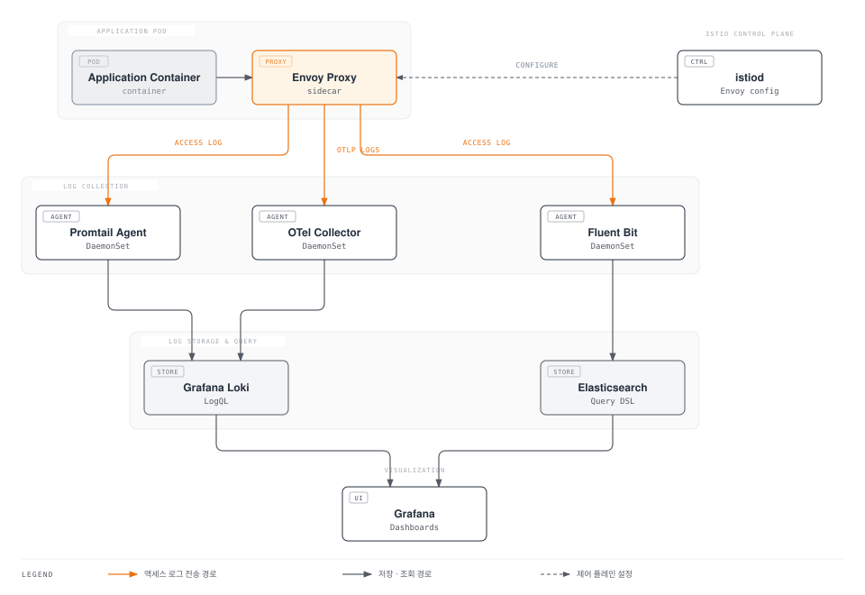

# Istio 로깅 (Logging)

> **지원 버전**: Istio 1.28
> **마지막 업데이트**: 2026년 2월 19일

Istio의 로깅 기능을 통해 서비스 메시의 모든 활동을 기록하고 분석할 수 있습니다. Access Log, Envoy 로그, 구조화된 로그를 활용하여 트래픽 분석, 디버깅, 보안 감사를 수행합니다.

## 목차

1. [로깅 개요](#로깅-개요)
2. [Access Log 설정](#access-log-설정)
3. [Telemetry API로 로그 커스터마이징](#telemetry-api로-로그-커스터마이징)
4. [로그 필터링 및 샘플링](#로그-필터링-및-샘플링)
5. [Envoy 로그 레벨 조정](#envoy-로그-레벨-조정)
6. [Promtail + Loki 통합](#promtail--loki-통합)
7. [Grafana 로그 대시보드](#grafana-로그-대시보드)
8. [로그와 메트릭/트레이스 연동](#로그와-메트릭트레이스-연동)
9. [성능 최적화](#성능-최적화)
10. [문제 해결](#문제-해결)

## 로깅 개요

### Istio 로그 계층



### 로그 유형

1. **Access Log**: 모든 HTTP/TCP 요청/응답 기록
2. **Envoy Proxy Log**: Envoy 내부 동작 로그
3. **Istiod Log**: 컨트롤 플레인 로그
4. **Application Log**: 애플리케이션 자체 로그

## Access Log 설정

### 1. MeshConfig로 전역 Access Log 활성화

#### 기본 텍스트 포맷

```yaml
apiVersion: v1
kind: ConfigMap
metadata:
  name: istio
  namespace: istio-system
data:
  mesh: |
    accessLogFile: /dev/stdout
    accessLogFormat: |
      [%START_TIME%] "%REQ(:METHOD)% %REQ(X-ENVOY-ORIGINAL-PATH?:PATH)% %PROTOCOL%"
      %RESPONSE_CODE% %RESPONSE_FLAGS% %BYTES_RECEIVED% %BYTES_SENT% %DURATION%
      "%REQ(X-FORWARDED-FOR)%" "%REQ(USER-AGENT)%" "%REQ(X-REQUEST-ID)%"
      "%REQ(:AUTHORITY)%" "%UPSTREAM_HOST%"
```

**적용**:
```bash
kubectl rollout restart deployment -n istio-system istiod

# 또는 기존 파드 재시작
kubectl rollout restart deployment -n <namespace> <deployment-name>
```

#### JSON 포맷 (구조화된 로그)

```yaml
apiVersion: v1
kind: ConfigMap
metadata:
  name: istio
  namespace: istio-system
data:
  mesh: |
    accessLogFile: /dev/stdout
    accessLogEncoding: JSON
    accessLogFormat: |
      {
        "start_time": "%START_TIME%",
        "method": "%REQ(:METHOD)%",
        "path": "%REQ(X-ENVOY-ORIGINAL-PATH?:PATH)%",
        "protocol": "%PROTOCOL%",
        "response_code": "%RESPONSE_CODE%",
        "response_flags": "%RESPONSE_FLAGS%",
        "bytes_received": "%BYTES_RECEIVED%",
        "bytes_sent": "%BYTES_SENT%",
        "duration": "%DURATION%",
        "upstream_service_time": "%RESP(X-ENVOY-UPSTREAM-SERVICE-TIME)%",
        "x_forwarded_for": "%REQ(X-FORWARDED-FOR)%",
        "user_agent": "%REQ(USER-AGENT)%",
        "request_id": "%REQ(X-REQUEST-ID)%",
        "authority": "%REQ(:AUTHORITY)%",
        "upstream_host": "%UPSTREAM_HOST%",
        "upstream_cluster": "%UPSTREAM_CLUSTER%",
        "upstream_local_address": "%UPSTREAM_LOCAL_ADDRESS%",
        "downstream_local_address": "%DOWNSTREAM_LOCAL_ADDRESS%",
        "downstream_remote_address": "%DOWNSTREAM_REMOTE_ADDRESS%",
        "requested_server_name": "%REQUESTED_SERVER_NAME%",
        "route_name": "%ROUTE_NAME%"
      }
```

### 2. Telemetry API로 세밀한 제어

Telemetry API를 사용하면 네임스페이스, 워크로드별로 로그를 제어할 수 있습니다.

#### 전체 메시에 JSON Access Log 활성화

```yaml
apiVersion: telemetry.istio.io/v1alpha1
kind: Telemetry
metadata:
  name: mesh-logging
  namespace: istio-system
spec:
  accessLogging:
  - providers:
    - name: envoy
    # JSON 포맷으로 모든 필드 포함
    filter:
      expression: "true"  # 모든 요청 로깅
```

#### 네임스페이스별 로그 설정

```yaml
apiVersion: telemetry.istio.io/v1alpha1
kind: Telemetry
metadata:
  name: production-logging
  namespace: production
spec:
  accessLogging:
  - providers:
    - name: envoy
    # 에러와 느린 요청만 로깅
    filter:
      expression: |
        response.code >= 400 ||
        duration > 1000
```

#### 워크로드별 상세 로깅

```yaml
apiVersion: telemetry.istio.io/v1alpha1
kind: Telemetry
metadata:
  name: payment-service-logging
  namespace: production
spec:
  selector:
    matchLabels:
      app: payment-service
  accessLogging:
  - providers:
    - name: envoy
    # 모든 요청 로깅 + 추가 커스텀 필드
    filter:
      expression: "true"
```

## Telemetry API로 로그 커스터마이징

### 커스텀 로그 제공자 (Custom Log Provider)

#### 1. OpenTelemetry로 로그 전송

```yaml
apiVersion: v1
kind: ConfigMap
metadata:
  name: istio
  namespace: istio-system
data:
  mesh: |
    extensionProviders:
    - name: otel-logging
      envoyOtelAls:
        service: opentelemetry-collector.observability.svc.cluster.local
        port: 4317
        logFormat:
          labels:
            start_time: "%START_TIME%"
            method: "%REQ(:METHOD)%"
            path: "%REQ(X-ENVOY-ORIGINAL-PATH?:PATH)%"
            protocol: "%PROTOCOL%"
            response_code: "%RESPONSE_CODE%"
            response_flags: "%RESPONSE_FLAGS%"
            duration: "%DURATION%"
            upstream_host: "%UPSTREAM_HOST%"
            user_agent: "%REQ(USER-AGENT)%"
            request_id: "%REQ(X-REQUEST-ID)%"
---
apiVersion: telemetry.istio.io/v1alpha1
kind: Telemetry
metadata:
  name: otel-access-logging
  namespace: istio-system
spec:
  accessLogging:
  - providers:
    - name: otel-logging
```

#### 2. 파일로 로그 저장 (Sidecar 볼륨 공유)

```yaml
apiVersion: telemetry.istio.io/v1alpha1
kind: Telemetry
metadata:
  name: file-logging
  namespace: production
spec:
  accessLogging:
  - providers:
    - name: envoy-file-logger
---
apiVersion: v1
kind: ConfigMap
metadata:
  name: istio
  namespace: istio-system
data:
  mesh: |
    extensionProviders:
    - name: envoy-file-logger
      envoyFileAccessLog:
        path: /var/log/istio/access.log
        logFormat:
          labels:
            timestamp: "%START_TIME%"
            method: "%REQ(:METHOD)%"
            path: "%REQ(:PATH)%"
            status: "%RESPONSE_CODE%"
```

### 로그 포맷 커스터마이징

#### CEL 표현식을 사용한 동적 필드

```yaml
apiVersion: telemetry.istio.io/v1alpha1
kind: Telemetry
metadata:
  name: custom-log-format
  namespace: production
spec:
  accessLogging:
  - providers:
    - name: envoy
    filter:
      expression: "true"
```

**사용 가능한 변수**:

| 변수 | 설명 | 예제 |
|------|------|------|
| `request.method` | HTTP 메서드 | GET, POST |
| `request.path` | 요청 경로 | /api/v1/users |
| `request.url_path` | URL 경로 (쿼리 제외) | /api/v1/users |
| `request.headers` | 요청 헤더 | `request.headers['user-agent']` |
| `response.code` | HTTP 상태 코드 | 200, 404, 500 |
| `response.headers` | 응답 헤더 | `response.headers['content-type']` |
| `response.flags` | Envoy 응답 플래그 | UH, UF, URX |
| `duration` | 요청 지속 시간 (ms) | 123 |
| `connection.mtls` | mTLS 사용 여부 | true, false |
| `source.principal` | 소스 서비스 계정 | spiffe://... |
| `destination.principal` | 대상 서비스 계정 | spiffe://... |

## 로그 필터링 및 샘플링

### 1. 조건부 로깅

#### 에러와 느린 요청만 로깅

```yaml
apiVersion: telemetry.istio.io/v1alpha1
kind: Telemetry
metadata:
  name: error-slow-logging
  namespace: production
spec:
  accessLogging:
  - providers:
    - name: envoy
    filter:
      expression: |
        response.code >= 400 ||
        response.code == 0 ||
        duration > 1000
```

#### 특정 경로 제외

```yaml
apiVersion: telemetry.istio.io/v1alpha1
kind: Telemetry
metadata:
  name: filter-health-checks
  namespace: production
spec:
  accessLogging:
  - providers:
    - name: envoy
    filter:
      expression: |
        !(request.url_path.startsWith('/health') ||
          request.url_path.startsWith('/ready') ||
          request.url_path.startsWith('/live') ||
          request.url_path == '/metrics')
```

#### HTTP 메서드 필터링

```yaml
apiVersion: telemetry.istio.io/v1alpha1
kind: Telemetry
metadata:
  name: critical-methods-only
  namespace: production
spec:
  accessLogging:
  - providers:
    - name: envoy
    filter:
      expression: |
        request.method in ['POST', 'PUT', 'DELETE', 'PATCH']
```

#### mTLS가 아닌 트래픽만 로깅 (보안 감사)

```yaml
apiVersion: telemetry.istio.io/v1alpha1
kind: Telemetry
metadata:
  name: non-mtls-logging
  namespace: production
spec:
  accessLogging:
  - providers:
    - name: envoy
    filter:
      expression: |
        !connection.mtls
```

### 2. 샘플링 (Sampling)

#### 확률적 샘플링 (10% 로깅)

```yaml
apiVersion: telemetry.istio.io/v1alpha1
kind: Telemetry
metadata:
  name: sampled-logging
  namespace: production
spec:
  accessLogging:
  - providers:
    - name: envoy
    filter:
      expression: |
        random() < 0.1  # 10% 샘플링
```

#### 조건부 + 샘플링 (에러는 100%, 정상은 1%)

```yaml
apiVersion: telemetry.istio.io/v1alpha1
kind: Telemetry
metadata:
  name: smart-sampling
  namespace: production
spec:
  accessLogging:
  - providers:
    - name: envoy
    filter:
      expression: |
        response.code >= 400 ||
        duration > 2000 ||
        random() < 0.01
```

### 3. 네임스페이스별 차등 로깅

```yaml
# Production: 에러만 로깅
apiVersion: telemetry.istio.io/v1alpha1
kind: Telemetry
metadata:
  name: production-logging
  namespace: production
spec:
  accessLogging:
  - providers:
    - name: envoy
    filter:
      expression: "response.code >= 400"
---
# Staging: 모든 요청 로깅
apiVersion: telemetry.istio.io/v1alpha1
kind: Telemetry
metadata:
  name: staging-logging
  namespace: staging
spec:
  accessLogging:
  - providers:
    - name: envoy
    filter:
      expression: "true"
---
# Development: 로깅 비활성화
apiVersion: telemetry.istio.io/v1alpha1
kind: Telemetry
metadata:
  name: dev-logging
  namespace: development
spec:
  accessLogging:
  - disabled: true
```

## Envoy 로그 레벨 조정

### 동적으로 로그 레벨 변경

#### 전체 Envoy 로그 레벨

```bash
# Debug 레벨로 변경
istioctl proxy-config log <pod-name> -n <namespace> --level debug

# Info 레벨로 복구
istioctl proxy-config log <pod-name> -n <namespace> --level info

# Warning 레벨로 변경
istioctl proxy-config log <pod-name> -n <namespace> --level warning
```

#### 컴포넌트별 로그 레벨

```bash
# HTTP 연결만 debug
istioctl proxy-config log <pod-name> -n <namespace> --level http:debug

# Router와 Connection 컴포넌트만 debug
istioctl proxy-config log <pod-name> -n <namespace> --level router:debug,connection:debug

# 여러 컴포넌트 조합
istioctl proxy-config log <pod-name> -n <namespace> \
  --level http:debug,router:info,upstream:debug,connection:trace
```

### 주요 Envoy 로그 컴포넌트

| 컴포넌트 | 설명 | 사용 사례 |
|----------|------|-----------|
| `admin` | Admin 인터페이스 | Admin API 디버깅 |
| `aws` | AWS 통합 | AWS 서비스 문제 |
| `connection` | TCP 연결 | 연결 문제 디버깅 |
| `filter` | HTTP 필터 | 필터 체인 분석 |
| `forward_proxy` | Forward 프록시 | 프록시 동작 추적 |
| `grpc` | gRPC | gRPC 통신 문제 |
| `hc` | Health check | Health check 실패 |
| `http` | HTTP | HTTP 요청/응답 추적 |
| `http2` | HTTP/2 | HTTP/2 프로토콜 이슈 |
| `jwt` | JWT 인증 | JWT 토큰 검증 |
| `lua` | Lua 스크립트 | Lua 필터 디버깅 |
| `main` | 메인 로직 | 일반적인 Envoy 동작 |
| `router` | 라우팅 | 라우팅 결정 추적 |
| `runtime` | 런타임 구성 | 동적 구성 변경 |
| `upstream` | Upstream 클러스터 | Backend 연결 문제 |
| `client` | HTTP 클라이언트 | 아웃바운드 요청 |
| `pool` | 연결 풀 | 연결 풀 관리 |
| `rbac` | RBAC 필터 | 권한 문제 디버깅 |

### 영구적인 로그 레벨 설정

```yaml
apiVersion: install.istio.io/v1alpha1
kind: IstioOperator
spec:
  meshConfig:
    defaultConfig:
      proxyLogLevel: "info"  # 기본 레벨
      componentLogLevel: "http:debug,router:info,upstream:debug"
```

### 특정 워크로드에만 디버그 로그 적용

```yaml
apiVersion: v1
kind: Pod
metadata:
  name: my-app
  annotations:
    sidecar.istio.io/componentLogLevel: "http:debug,router:debug"
    sidecar.istio.io/logLevel: "debug"
spec:
  containers:
  - name: app
    image: my-app:latest
```

## Promtail + Loki 통합

### 1. Grafana Loki 설치

#### Loki 배포 (Simple Scalable 모드)

```yaml
apiVersion: v1
kind: ConfigMap
metadata:
  name: loki-config
  namespace: observability
data:
  loki.yaml: |
    auth_enabled: false

    server:
      http_listen_port: 3100
      grpc_listen_port: 9096

    common:
      path_prefix: /loki
      storage:
        filesystem:
          chunks_directory: /loki/chunks
          rules_directory: /loki/rules
      replication_factor: 1
      ring:
        kvstore:
          store: inmemory

    schema_config:
      configs:
      - from: 2024-01-01
        store: tsdb
        object_store: filesystem
        schema: v13
        index:
          prefix: index_
          period: 24h

    limits_config:
      retention_period: 168h  # 7일
      ingestion_rate_mb: 16
      ingestion_burst_size_mb: 32
      max_query_length: 721h
      max_query_lookback: 721h
      max_streams_per_user: 10000
      max_global_streams_per_user: 0
      reject_old_samples: true
      reject_old_samples_max_age: 168h

    compactor:
      working_directory: /loki/compactor
      compaction_interval: 10m
      retention_enabled: true
      retention_delete_delay: 2h
      retention_delete_worker_count: 150

    querier:
      max_concurrent: 4
---
apiVersion: apps/v1
kind: StatefulSet
metadata:
  name: loki
  namespace: observability
spec:
  serviceName: loki
  replicas: 1
  selector:
    matchLabels:
      app: loki
  template:
    metadata:
      labels:
        app: loki
    spec:
      containers:
      - name: loki
        image: grafana/loki:2.9.4
        args:
        - -config.file=/etc/loki/loki.yaml
        ports:
        - containerPort: 3100
          name: http
        - containerPort: 9096
          name: grpc
        volumeMounts:
        - name: config
          mountPath: /etc/loki
        - name: storage
          mountPath: /loki
        resources:
          requests:
            cpu: 500m
            memory: 1Gi
          limits:
            cpu: 2000m
            memory: 4Gi
      volumes:
      - name: config
        configMap:
          name: loki-config
  volumeClaimTemplates:
  - metadata:
      name: storage
    spec:
      accessModes:
      - ReadWriteOnce
      resources:
        requests:
          storage: 100Gi
      storageClassName: gp3
---
apiVersion: v1
kind: Service
metadata:
  name: loki
  namespace: observability
spec:
  selector:
    app: loki
  ports:
  - name: http
    port: 3100
    targetPort: 3100
  - name: grpc
    port: 9096
    targetPort: 9096
  type: ClusterIP
```

### 2. Promtail 설치 (Istio Access Log 수집)

```yaml
apiVersion: v1
kind: ConfigMap
metadata:
  name: promtail-config
  namespace: observability
data:
  promtail.yaml: |
    server:
      http_listen_port: 3101

    clients:
    - url: http://loki:3100/loki/api/v1/push
      backoff_config:
        min_period: 1s
        max_period: 5m
        max_retries: 10

    positions:
      filename: /tmp/positions.yaml

    scrape_configs:
    # Istio Envoy Access Logs
    - job_name: istio-accesslog
      pipeline_stages:
      # JSON 파싱
      - json:
          expressions:
            start_time: start_time
            method: method
            path: path
            protocol: protocol
            response_code: response_code
            response_flags: response_flags
            duration: duration
            bytes_received: bytes_received
            bytes_sent: bytes_sent
            upstream_host: upstream_host
            user_agent: user_agent
            request_id: request_id

      # 타임스탬프 파싱
      - timestamp:
          source: start_time
          format: "2006-01-02T15:04:05.000Z"

      # 레이블 추가
      - labels:
          method:
          path:
          response_code:
          response_flags:

      # Duration을 숫자로 변환
      - metrics:
          request_duration_ms:
            type: Histogram
            description: "HTTP request duration"
            source: duration
            config:
              buckets: [10, 50, 100, 500, 1000, 5000]

      kubernetes_sd_configs:
      - role: pod

      relabel_configs:
      # Istio proxy 컨테이너만 선택
      - source_labels: [__meta_kubernetes_pod_container_name]
        action: keep
        regex: istio-proxy

      # 네임스페이스 레이블
      - source_labels: [__meta_kubernetes_namespace]
        target_label: namespace

      # 파드 이름 레이블
      - source_labels: [__meta_kubernetes_pod_name]
        target_label: pod

      # 서비스 레이블
      - source_labels: [__meta_kubernetes_pod_label_app]
        target_label: app

      # 버전 레이블
      - source_labels: [__meta_kubernetes_pod_label_version]
        target_label: version

    # Istio Pilot/Istiod Logs
    - job_name: istio-control-plane
      kubernetes_sd_configs:
      - role: pod
        namespaces:
          names:
          - istio-system

      relabel_configs:
      - source_labels: [__meta_kubernetes_pod_label_app]
        action: keep
        regex: istiod

      - source_labels: [__meta_kubernetes_namespace]
        target_label: namespace

      - source_labels: [__meta_kubernetes_pod_name]
        target_label: pod

      - source_labels: [__meta_kubernetes_pod_container_name]
        target_label: container

    # Application Logs
    - job_name: kubernetes-pods
      pipeline_stages:
      # JSON 로그 파싱 시도
      - json:
          expressions:
            level: level
            timestamp: timestamp
            logger: logger
            message: message

      - labels:
          level:
          logger:

      kubernetes_sd_configs:
      - role: pod

      relabel_configs:
      # Istio proxy 제외
      - source_labels: [__meta_kubernetes_pod_container_name]
        action: drop
        regex: istio-proxy

      # Istio init 제외
      - source_labels: [__meta_kubernetes_pod_container_name]
        action: drop
        regex: istio-init

      - source_labels: [__meta_kubernetes_namespace]
        target_label: namespace

      - source_labels: [__meta_kubernetes_pod_name]
        target_label: pod

      - source_labels: [__meta_kubernetes_pod_container_name]
        target_label: container
---
apiVersion: apps/v1
kind: DaemonSet
metadata:
  name: promtail
  namespace: observability
spec:
  selector:
    matchLabels:
      app: promtail
  template:
    metadata:
      labels:
        app: promtail
    spec:
      serviceAccountName: promtail
      containers:
      - name: promtail
        image: grafana/promtail:2.9.4
        args:
        - -config.file=/etc/promtail/promtail.yaml
        volumeMounts:
        - name: config
          mountPath: /etc/promtail
        - name: varlog
          mountPath: /var/log
        - name: varlibdockercontainers
          mountPath: /var/lib/docker/containers
          readOnly: true
        ports:
        - containerPort: 3101
          name: http-metrics
        resources:
          requests:
            cpu: 100m
            memory: 128Mi
          limits:
            cpu: 500m
            memory: 512Mi
      volumes:
      - name: config
        configMap:
          name: promtail-config
      - name: varlog
        hostPath:
          path: /var/log
      - name: varlibdockercontainers
        hostPath:
          path: /var/lib/docker/containers
---
apiVersion: v1
kind: ServiceAccount
metadata:
  name: promtail
  namespace: observability
---
apiVersion: rbac.authorization.k8s.io/v1
kind: ClusterRole
metadata:
  name: promtail
rules:
- apiGroups: [""]
  resources:
  - nodes
  - nodes/proxy
  - services
  - endpoints
  - pods
  verbs: ["get", "watch", "list"]
---
apiVersion: rbac.authorization.k8s.io/v1
kind: ClusterRoleBinding
metadata:
  name: promtail
roleRef:
  apiGroup: rbac.authorization.k8s.io
  kind: ClusterRole
  name: promtail
subjects:
- kind: ServiceAccount
  name: promtail
  namespace: observability
```

### 3. LogQL 쿼리 예제

#### 기본 쿼리

```logql
# 특정 네임스페이스의 모든 로그
{namespace="production"}

# 특정 앱의 로그
{app="payment-service"}

# Istio access log만
{container="istio-proxy"}

# 에러 로그만
{namespace="production"} |= "error" or "ERROR"

# 5xx 응답만
{namespace="production"} | json | response_code >= "500"
```

#### 고급 필터링

```logql
# HTTP POST 요청만
{container="istio-proxy"}
| json
| method="POST"

# 느린 요청 (> 1초)
{container="istio-proxy"}
| json
| duration > 1000

# Circuit breaker 발동 감지
{container="istio-proxy"}
| json
| response_flags =~ ".*UO.*|.*URX.*"

# mTLS 미사용 트래픽
{container="istio-proxy"}
| json
| connection_security_policy="none"

# 특정 경로 패턴
{container="istio-proxy"}
| json
| path =~ "/api/v1/.*"
```

#### 집계 및 통계

```logql
# 서비스별 요청률 (RPS)
sum(rate({container="istio-proxy"} | json [1m])) by (app)

# 응답 코드 분포
sum(count_over_time({container="istio-proxy"} | json [5m])) by (response_code)

# P95 레이턴시
quantile_over_time(0.95, {container="istio-proxy"} | json | unwrap duration [5m])

# 에러율
sum(rate({container="istio-proxy"} | json | response_code >= "500" [5m]))
/
sum(rate({container="istio-proxy"} | json [5m]))

# 평균 응답 시간
avg_over_time({container="istio-proxy"} | json | unwrap duration [5m])
```

## Grafana 로그 대시보드

### 1. Loki 데이터소스 추가

```yaml
apiVersion: v1
kind: ConfigMap
metadata:
  name: grafana-datasources
  namespace: observability
data:
  loki.yaml: |
    apiVersion: 1
    datasources:
    - name: Loki
      type: loki
      access: proxy
      url: http://loki:3100
      jsonData:
        maxLines: 1000
        derivedFields:
        # Trace ID 추출
        - datasourceUid: tempo
          matcherRegex: "request_id\":\"([^\"]+)"
          name: TraceID
          url: '$${__value.raw}'
        # 메트릭 연동
        - datasourceUid: prometheus
          matcherRegex: "app\":\"([^\"]+)"
          name: Metrics
          url: '/d/istio-service?var-service=$${__value.raw}'
```

### 2. Istio Access Log 대시보드

#### 대시보드 JSON

```json
{
  "dashboard": {
    "title": "Istio Access Logs",
    "tags": ["istio", "logs"],
    "timezone": "browser",
    "panels": [
      {
        "title": "Request Rate by Service",
        "type": "timeseries",
        "targets": [
          {
            "expr": "sum(rate({container=\"istio-proxy\"} | json [1m])) by (app)",
            "refId": "A"
          }
        ],
        "gridPos": {"h": 8, "w": 12, "x": 0, "y": 0}
      },
      {
        "title": "Response Code Distribution",
        "type": "piechart",
        "targets": [
          {
            "expr": "sum(count_over_time({container=\"istio-proxy\"} | json [5m])) by (response_code)",
            "refId": "A"
          }
        ],
        "gridPos": {"h": 8, "w": 12, "x": 12, "y": 0}
      },
      {
        "title": "P50/P95/P99 Latency",
        "type": "timeseries",
        "targets": [
          {
            "expr": "quantile_over_time(0.50, {container=\"istio-proxy\", app=\"$service\"} | json | unwrap duration [1m])",
            "legendFormat": "P50",
            "refId": "A"
          },
          {
            "expr": "quantile_over_time(0.95, {container=\"istio-proxy\", app=\"$service\"} | json | unwrap duration [1m])",
            "legendFormat": "P95",
            "refId": "B"
          },
          {
            "expr": "quantile_over_time(0.99, {container=\"istio-proxy\", app=\"$service\"} | json | unwrap duration [1m])",
            "legendFormat": "P99",
            "refId": "C"
          }
        ],
        "gridPos": {"h": 8, "w": 24, "x": 0, "y": 8}
      },
      {
        "title": "Error Rate",
        "type": "stat",
        "targets": [
          {
            "expr": "sum(rate({container=\"istio-proxy\"} | json | response_code >= \"500\" [5m])) / sum(rate({container=\"istio-proxy\"} | json [5m]))",
            "refId": "A"
          }
        ],
        "gridPos": {"h": 4, "w": 6, "x": 0, "y": 16}
      },
      {
        "title": "Top 10 Slowest Requests",
        "type": "table",
        "targets": [
          {
            "expr": "topk(10, avg_over_time({container=\"istio-proxy\", app=\"$service\"} | json | unwrap duration [5m])) by (path, method)",
            "refId": "A"
          }
        ],
        "gridPos": {"h": 8, "w": 12, "x": 0, "y": 20}
      },
      {
        "title": "Error Logs",
        "type": "logs",
        "targets": [
          {
            "expr": "{container=\"istio-proxy\", app=\"$service\"} | json | response_code >= \"400\"",
            "refId": "A"
          }
        ],
        "gridPos": {"h": 8, "w": 12, "x": 12, "y": 20}
      },
      {
        "title": "Circuit Breaker Events",
        "type": "logs",
        "targets": [
          {
            "expr": "{container=\"istio-proxy\"} | json | response_flags =~ \".*UO.*|.*URX.*\"",
            "refId": "A"
          }
        ],
        "gridPos": {"h": 8, "w": 24, "x": 0, "y": 28}
      },
      {
        "title": "Request Duration Heatmap",
        "type": "heatmap",
        "targets": [
          {
            "expr": "sum(rate({container=\"istio-proxy\", app=\"$service\"} | json | unwrap duration [1m])) by (le)",
            "format": "heatmap",
            "refId": "A"
          }
        ],
        "gridPos": {"h": 8, "w": 24, "x": 0, "y": 36}
      }
    ],
    "templating": {
      "list": [
        {
          "name": "namespace",
          "type": "query",
          "query": "label_values({container=\"istio-proxy\"}, namespace)",
          "datasource": "Loki"
        },
        {
          "name": "service",
          "type": "query",
          "query": "label_values({container=\"istio-proxy\", namespace=\"$namespace\"}, app)",
          "datasource": "Loki"
        }
      ]
    }
  }
}
```

### 3. Grafana Alert 설정

```yaml
apiVersion: v1
kind: ConfigMap
metadata:
  name: grafana-alerting
  namespace: observability
data:
  alerting.yaml: |
    groups:
    - name: istio-logging-alerts
      interval: 1m
      rules:
      # 높은 에러율
      - alert: HighErrorRate
        expr: |
          sum(rate({container="istio-proxy"} | json | response_code >= "500" [5m]))
          /
          sum(rate({container="istio-proxy"} | json [5m]))
          > 0.05
        for: 2m
        labels:
          severity: critical
        annotations:
          summary: "High error rate detected"
          description: "Error rate is {{ $value | humanizePercentage }}"

      # Circuit Breaker 발동
      - alert: CircuitBreakerTriggered
        expr: |
          count_over_time({container="istio-proxy"}
            | json
            | response_flags =~ ".*UO.*|.*URX.*" [1m])
          > 10
        for: 1m
        labels:
          severity: warning
        annotations:
          summary: "Circuit breaker triggered"
          description: "Circuit breaker has been triggered {{ $value }} times"

      # 느린 요청
      - alert: SlowRequests
        expr: |
          quantile_over_time(0.95,
            {container="istio-proxy"}
            | json
            | unwrap duration [5m])
          > 2000
        for: 5m
        labels:
          severity: warning
        annotations:
          summary: "P95 latency too high"
          description: "P95 latency is {{ $value }}ms"

      # mTLS 미사용 트래픽
      - alert: NonMTLSTraffic
        expr: |
          count_over_time({container="istio-proxy"}
            | json
            | connection_security_policy="none" [5m])
          > 0
        for: 1m
        labels:
          severity: warning
        annotations:
          summary: "Non-mTLS traffic detected"
          description: "{{ $value }} requests without mTLS in the last 5 minutes"
```

## 로그와 메트릭/트레이스 연동

### 1. 로그에서 트레이스로 점프

Grafana에서 Loki 로그를 보다가 특정 요청의 trace를 바로 확인할 수 있습니다.

```yaml
# Loki 데이터소스 설정
apiVersion: v1
kind: ConfigMap
metadata:
  name: grafana-datasources
  namespace: observability
data:
  loki.yaml: |
    apiVersion: 1
    datasources:
    - name: Loki
      type: loki
      jsonData:
        derivedFields:
        - datasourceUid: tempo
          matcherRegex: '"request_id":"([^"]+)"'
          name: TraceID
          url: '$${__value.raw}'
          urlDisplayLabel: 'View Trace'
```

**사용 방법**:
1. Grafana Explore에서 Loki 로그 확인
2. 로그 항목에서 "View Trace" 링크 클릭
3. 자동으로 Tempo로 이동하여 해당 trace 확인

### 2. 메트릭에서 로그로 드릴다운

```yaml
# Prometheus 데이터소스 설정
apiVersion: v1
kind: ConfigMap
metadata:
  name: grafana-datasources
  namespace: observability
data:
  prometheus.yaml: |
    apiVersion: 1
    datasources:
    - name: Prometheus
      type: prometheus
      jsonData:
        exemplarTraceIdDestinations:
        - datasourceUid: tempo
          name: TraceID
```

### 3. 통합 대시보드 예제

```json
{
  "panels": [
    {
      "title": "Request Rate (Metric)",
      "type": "timeseries",
      "datasource": "Prometheus",
      "targets": [
        {
          "expr": "rate(istio_requests_total{app=\"$service\"}[1m])"
        }
      ],
      "links": [
        {
          "title": "View Logs",
          "url": "/explore?left={\"datasource\":\"Loki\",\"queries\":[{\"expr\":\"{app=\\\"${service}\\\"}\"}]}"
        }
      ]
    },
    {
      "title": "Recent Logs",
      "type": "logs",
      "datasource": "Loki",
      "targets": [
        {
          "expr": "{container=\"istio-proxy\", app=\"$service\"} | json"
        }
      ]
    }
  ]
}
```

## 성능 최적화

### 1. 로그 볼륨 줄이기

#### 조건부 로깅으로 50-90% 감소

```yaml
apiVersion: telemetry.istio.io/v1alpha1
kind: Telemetry
metadata:
  name: optimized-logging
  namespace: production
spec:
  accessLogging:
  - providers:
    - name: envoy
    filter:
      expression: |
        response.code >= 400 ||
        duration > 1000 ||
        random() < 0.01  # 정상 요청의 1%만 샘플링
```

#### Health check 제외로 30-50% 감소

```yaml
filter:
  expression: |
    !(request.url_path.startsWith('/health') ||
      request.url_path.startsWith('/ready') ||
      request.url_path.startsWith('/live') ||
      request.url_path == '/metrics' ||
      request.url_path == '/favicon.ico')
```

### 2. Loki 성능 튜닝

```yaml
limits_config:
  # 청크 크기 최적화
  ingestion_rate_strategy: global
  ingestion_rate_mb: 32  # 기본값: 4
  ingestion_burst_size_mb: 64  # 기본값: 6

  # 쿼리 성능
  max_query_parallelism: 32
  max_query_series: 10000
  max_query_lookback: 720h

  # 스트림 제한
  max_streams_per_user: 10000
  max_global_streams_per_user: 0

  # 레이블 카디널리티 제한
  max_label_names_per_series: 30
  max_label_value_length: 2048
```

### 3. Promtail 최적화

```yaml
# Batching 설정
clients:
- url: http://loki:3100/loki/api/v1/push
  batchwait: 1s
  batchsize: 1048576  # 1MB

  # Retry 설정
  backoff_config:
    min_period: 500ms
    max_period: 5m
    max_retries: 10

  # 타임아웃
  timeout: 10s
```

## 문제 해결

### Access Log가 보이지 않을 때

```bash
# 1. MeshConfig 확인
kubectl get configmap istio -n istio-system -o yaml | grep -A 5 accessLog

# 2. Telemetry 리소스 확인
kubectl get telemetry -A

# 3. Envoy에서 로그 생성 확인
kubectl logs -n <namespace> <pod-name> -c istio-proxy | head -20

# 4. Envoy 설정 확인
istioctl proxy-config bootstrap <pod-name> -n <namespace> -o json | \
  jq '.bootstrap.staticResources.listeners[].accessLog'
```

### JSON 파싱 실패

```bash
# 1. 로그 포맷 확인
kubectl logs -n <namespace> <pod-name> -c istio-proxy | head -1

# 2. accessLogEncoding 확인
kubectl get configmap istio -n istio-system -o yaml | grep accessLogEncoding

# 3. 수동으로 JSON 파싱 테스트
kubectl logs -n <namespace> <pod-name> -c istio-proxy | head -1 | jq .
```

### Promtail이 로그를 수집하지 못할 때

```bash
# 1. Promtail 로그 확인
kubectl logs -n observability daemonset/promtail

# 2. Promtail 메트릭 확인
kubectl port-forward -n observability daemonset/promtail 3101:3101
curl http://localhost:3101/metrics | grep promtail_

# 3. Loki에 데이터가 들어오는지 확인
kubectl port-forward -n observability svc/loki 3100:3100
curl -G -s "http://localhost:3100/loki/api/v1/query" --data-urlencode 'query={job="istio-accesslog"}' | jq .
```

### 로그 볼륨이 너무 클 때

```bash
# 1. 네임스페이스별 로그 볼륨 확인
kubectl top pods -n <namespace> --containers | grep istio-proxy

# 2. 로그 스트림 수 확인
curl -G -s "http://localhost:3100/loki/api/v1/labels" | jq '.data | length'

# 3. 가장 많은 로그를 생성하는 서비스 찾기
# LogQL:
topk(10, sum(count_over_time({container="istio-proxy"} [1h])) by (app))
```

## 참고 자료

- [Istio Access Logging](https://istio.io/latest/docs/tasks/observability/logs/access-log/)
- [Telemetry API](https://istio.io/latest/docs/reference/config/telemetry/)
- [Envoy Access Logging](https://www.envoyproxy.io/docs/envoy/latest/configuration/observability/access_log/usage)
- [Grafana Loki Documentation](https://grafana.com/docs/loki/latest/)
- [Promtail Configuration](https://grafana.com/docs/loki/latest/send-data/promtail/)
- [LogQL Query Language](https://grafana.com/docs/loki/latest/query/)
- [CEL Expression Language](https://github.com/google/cel-spec)
