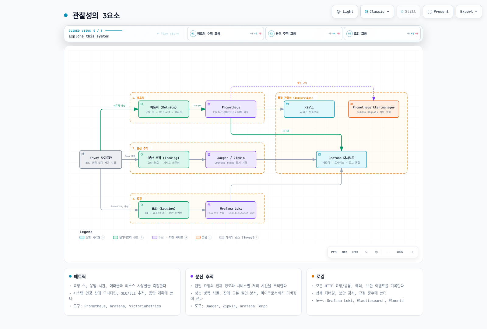
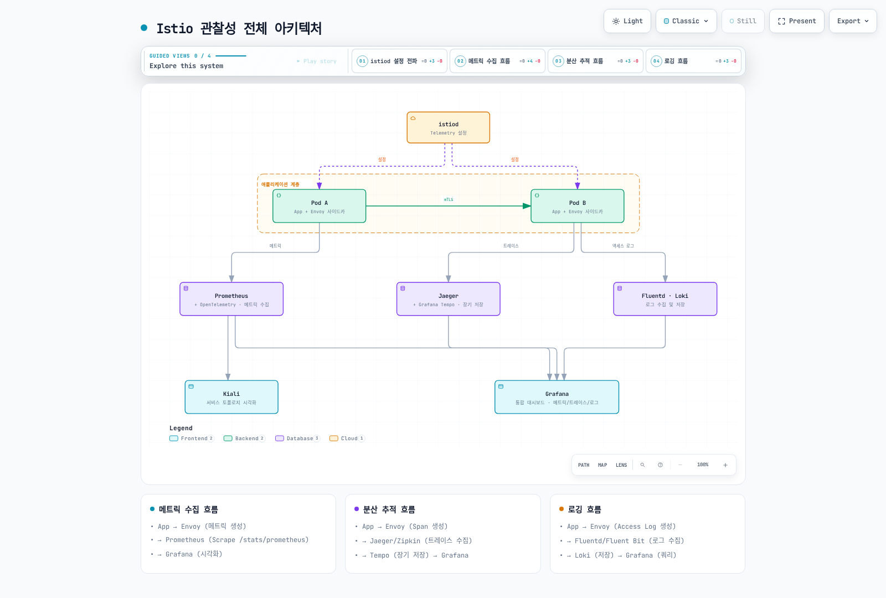

# Observability

> **지원 버전**: Istio 1.28
> **마지막 업데이트**: 2026년 2월 19일

Istio는 서비스 메시 내에서 포괄적인 관찰성(Observability)을 제공합니다. 애플리케이션 코드를 변경하지 않고도 모든 서비스 간 통신에 대한 메트릭, 로그, 트레이스를 자동으로 수집합니다.

## 목차

1. [관찰성 개요](#관찰성-개요)
2. [Three Pillars of Observability](#three-pillars-of-observability)
3. [관찰성 아키텍처](#관찰성-아키텍처)
4. [Golden Signals](#golden-signals)
5. [상세 문서](#상세-문서)
6. [관찰성 베스트 프랙티스](#관찰성-베스트-프랙티스)
7. [다음 단계](#다음-단계)

## 관찰성 개요

<p align="center">
  
</p>

Istio의 관찰성 기능은 **Zero Instrumentation** 원칙을 따릅니다:
- ✅ 애플리케이션 코드 변경 불필요
- ✅ 자동 메트릭 수집 및 전송
- ✅ 분산 추적 자동 생성
- ✅ 표준화된 로그 포맷

## Three Pillars of Observability

### 관찰성의 3요소



[🔍 인터랙티브 다이어그램 보기](https://www.atomai.click/kubernetes-docs/archmaps/ko-service-mesh-istio-observability-readme-0.html)

### 1. 메트릭 (Metrics)

**무엇을 측정하는가?**
- 요청 수, 응답 시간, 에러율
- 리소스 사용률 (CPU, 메모리)
- 네트워크 트래픽 (Bytes, Packets)

**언제 사용하는가?**
- 시스템 건강 상태 모니터링
- SLO/SLI 추적
- 용량 계획

**주요 도구**: Prometheus, Grafana, VictoriaMetrics

### 2. 분산 추적 (Distributed Tracing)

**무엇을 추적하는가?**
- 단일 요청의 전체 경로
- 각 서비스의 처리 시간
- 서비스 간 의존성

**언제 사용하는가?**
- 성능 병목 식별
- 장애 근본 원인 분석
- 마이크로서비스 디버깅

**주요 도구**: Jaeger, Zipkin, Grafana Tempo

### 3. 로깅 (Logging)

**무엇을 기록하는가?**
- 모든 HTTP 요청/응답
- 에러 및 예외 상황
- 보안 이벤트

**언제 사용하는가?**
- 상세 디버깅
- 보안 감사
- 규정 준수

**주요 도구**: Grafana Loki, Elasticsearch, Fluentd

## 관찰성 아키텍처

### 전체 아키텍처



[🔍 인터랙티브 다이어그램 보기](https://www.atomai.click/kubernetes-docs/archmaps/ko-service-mesh-istio-observability-readme-1.html)

### 데이터 흐름

**1. 메트릭 수집 흐름**:
```
App → Envoy (메트릭 생성)
    → Prometheus (Scrape /stats/prometheus)
    → Grafana (시각화)
```

**2. 분산 추적 흐름**:
```
App → Envoy (Span 생성)
    → Jaeger/Zipkin (트레이스 수집)
    → Tempo (장기 저장)
    → Grafana (트레이스 시각화)
```

**3. 로깅 흐름**:
```
App → Envoy (Access Log 생성)
    → Fluentd/Fluent Bit (로그 수집)
    → Loki (로그 저장)
    → Grafana (로그 쿼리 및 시각화)
```

## Golden Signals

Google SRE 원칙에 따른 핵심 메트릭:

### 1. Latency (지연시간)

```promql
# P50 레이턴시
histogram_quantile(0.50,
  sum(rate(istio_request_duration_milliseconds_bucket[5m])) by (le)
)

# P95 레이턴시
histogram_quantile(0.95,
  sum(rate(istio_request_duration_milliseconds_bucket[5m])) by (le)
)

# P99 레이턴시
histogram_quantile(0.99,
  sum(rate(istio_request_duration_milliseconds_bucket[5m])) by (le)
)
```

### 2. Traffic (트래픽)

```promql
# 초당 요청 수 (RPS)
sum(rate(istio_requests_total[5m]))

# 서비스별 트래픽
sum(rate(istio_requests_total[5m])) by (destination_service)
```

### 3. Errors (에러)

```promql
# 에러율 (%)
sum(rate(istio_requests_total{response_code=~"5.."}[5m]))
/
sum(rate(istio_requests_total[5m]))
* 100

# 4xx vs 5xx 에러
sum(rate(istio_requests_total{response_code=~"4.."}[5m])) by (response_code)
sum(rate(istio_requests_total{response_code=~"5.."}[5m])) by (response_code)
```

### 4. Saturation (포화도)

```promql
# CPU 사용률
rate(container_cpu_usage_seconds_total{pod=~".*"}[5m])

# 메모리 사용률
container_memory_working_set_bytes{pod=~".*"}
/
container_spec_memory_limit_bytes{pod=~".*"}
* 100
```

## 관찰성 베스트 프랙티스

### 1. 표준 메트릭 활용

✅ **권장**:
- Istio 표준 메트릭을 우선 활용
- 커스텀 메트릭은 필요시에만 추가
- 라벨은 카디널리티를 고려하여 최소화

❌ **지양**:
- 불필요한 커스텀 메트릭 남발
- 높은 카디널리티 라벨 (user_id, request_id 등)

### 2. Trace Sampling

프로덕션 환경에서는 적절한 샘플링 비율 설정:

```yaml
apiVersion: install.istio.io/v1alpha1
kind: IstioOperator
spec:
  meshConfig:
    defaultConfig:
      tracing:
        sampling: 1.0  # Dev: 100%, Prod: 1-10%
```

**권장 샘플링 비율**:
- 개발: 100%
- 스테이징: 10-50%
- 프로덕션: 1-10%

### 3. Access Log 최적화

필요한 필드만 선택적으로 기록:

```yaml
apiVersion: telemetry.istio.io/v1alpha1
kind: Telemetry
metadata:
  name: mesh-default
  namespace: istio-system
spec:
  accessLogging:
  - providers:
    - name: envoy
    filter:
      expression: response.code >= 400  # 에러만 기록
```

### 4. 메트릭 보관 정책

데이터 보관 기간 설정:
- **실시간 메트릭**: 1-7일 (고해상도)
- **장기 메트릭**: 30-90일 (다운샘플링)
- **트레이스**: 7-30일
- **로그**: 규정에 따라 (30-365일)

### 5. 알림 설정

**Critical Alerts** (즉시 대응):
- 에러율 > 5%
- P99 레이턴시 > 임계값
- 서비스 다운

**Warning Alerts** (모니터링):
- 에러율 > 1%
- P95 레이턴시 증가
- 리소스 사용률 > 80%

## 상세 문서

관찰성의 각 영역에 대한 상세 가이드:

### 1. 메트릭 (Metrics)

**[메트릭 가이드](01-metrics.md)**에서 다음을 학습합니다:
- Istio 표준 메트릭
- Prometheus 통합
- OpenTelemetry 통합
- 커스텀 메트릭 추가
- 메트릭 최적화

**주요 내용**:
- `istio_requests_total`: 총 요청 수
- `istio_request_duration_milliseconds`: 요청 지연시간
- `istio_request_bytes`: 요청/응답 크기
- Circuit Breaker 메트릭
- Telemetry API 커스터마이징

### 2. 분산 추적 (Distributed Tracing)

**[분산 추적 가이드](02-tracing.md)**에서 다음을 학습합니다:
- Jaeger 통합
- Zipkin 통합
- 트레이스 샘플링
- 컨텍스트 전파
- 성능 분석

**주요 내용**:
- Trace Context 전파 (W3C Trace Context)
- Span 생성 및 관리
- 백엔드 선택 (Jaeger, Zipkin, Tempo)
- 샘플링 전략
- 트레이스 분석

### 3. 로깅 (Logging)

**[로깅 가이드](03-logging.md)**에서 다음을 학습합니다:
- Access Log 설정
- 로그 포맷 커스터마이징
- Grafana Loki 통합
- 로그 필터링
- 로그 집계

**주요 내용**:
- Envoy Access Log 형식
- JSON 구조화 로그
- 로그 레벨 설정
- 로그 수집 (Fluentd, Fluent Bit)
- 로그 쿼리 (LogQL)

### 4. 대시보드 (Dashboards)

**[대시보드 가이드](04-dashboards.md)**에서 다음을 학습합니다:
- Grafana 대시보드
- Kiali 서비스 그래프
- 커스텀 대시보드 생성
- 알림 규칙 설정

**주요 내용**:
- Istio 표준 대시보드
- Service Mesh 대시보드
- Workload 대시보드
- Kiali 트래픽 시각화
- SLO 대시보드

## 다음 단계

1. **[메트릭](01-metrics.md)**: Prometheus 메트릭 수집 및 쿼리
2. **[분산 추적](02-tracing.md)**: Jaeger/Zipkin 트레이스 분석
3. **[로깅](03-logging.md)**: Access Log 및 Loki 통합
4. **[대시보드](04-dashboards.md)**: Grafana 및 Kiali 대시보드

## 참고 자료

### 공식 문서
- [Istio Observability](https://istio.io/latest/docs/tasks/observability/)
- [Metrics](https://istio.io/latest/docs/tasks/observability/metrics/)
- [Distributed Tracing](https://istio.io/latest/docs/tasks/observability/distributed-tracing/)
- [Logs](https://istio.io/latest/docs/tasks/observability/logs/)

### 관련 프로젝트
- [Prometheus](https://prometheus.io/)
- [Grafana](https://grafana.com/)
- [Jaeger](https://www.jaegertracing.io/)
- [Grafana Loki](https://grafana.com/oss/loki/)
- [Kiali](https://kiali.io/)

### 표준 및 사양
- [OpenTelemetry](https://opentelemetry.io/)
- [W3C Trace Context](https://www.w3.org/TR/trace-context/)
- [Google SRE - Golden Signals](https://sre.google/sre-book/monitoring-distributed-systems/)

## 퀴즈

이 장에서 배운 내용을 테스트하려면 [Istio Observability 퀴즈](../../../quizzes/service-mesh/istio/observability.md)를 풀어보세요.
