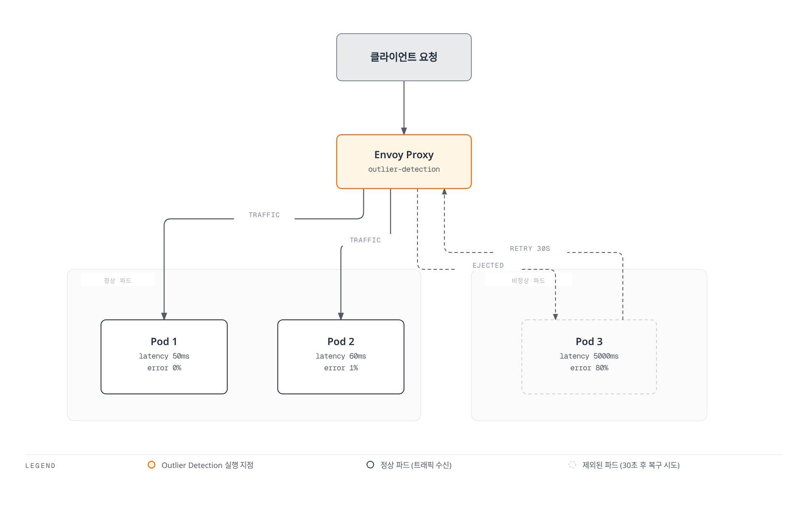
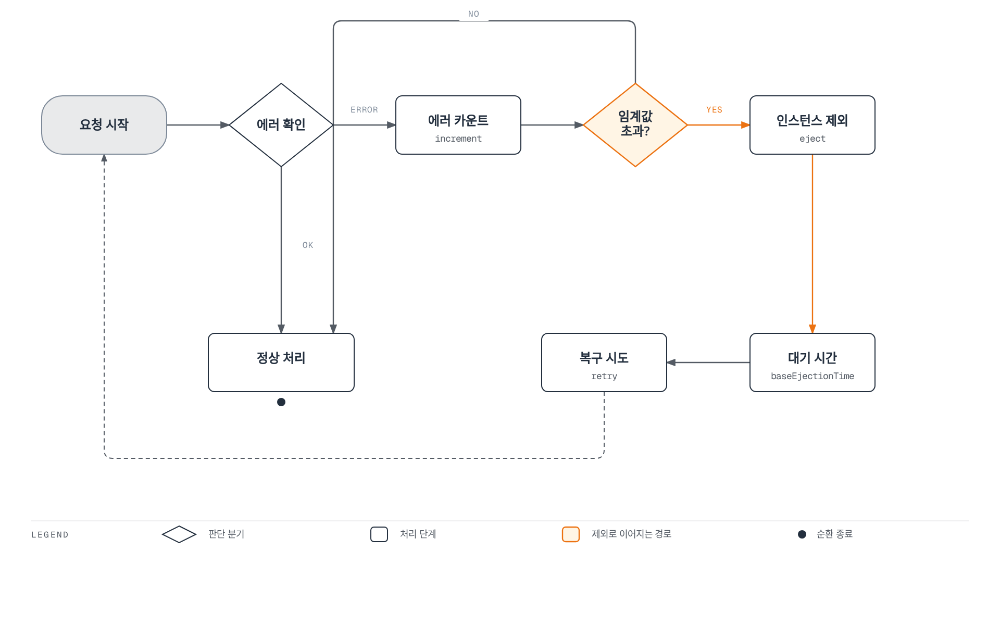
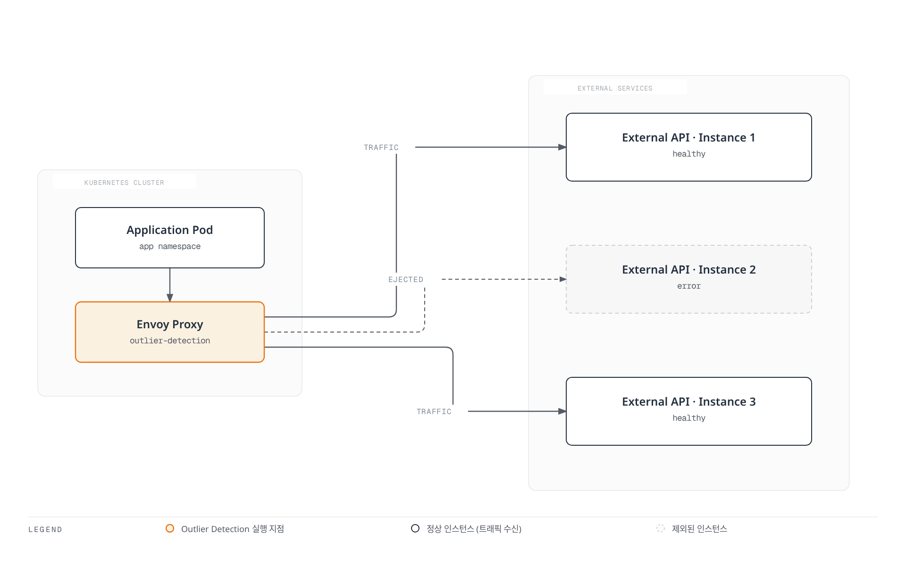

# Outlier Detection

Outlier Detection은 비정상적으로 동작하는 서비스 인스턴스를 자동으로 감지하고 트래픽 풀에서 제외하는 Circuit Breaker 패턴의 한 형태입니다.

## 목차

1. [개요](#개요)
2. [작동 원리](#작동-원리)
3. [기본 설정](#기본-설정)
4. [고급 설정](#고급-설정)
5. [실전 예제](#실전-예제)
6. [모니터링](#모니터링)
7. [문제 해결](#문제-해결)

## 개요

Outlier Detection은 다음과 같은 상황에서 자동으로 인스턴스를 제외합니다:



### 주요 기능

1. **자동 감지**: 에러율, 지연시간, 응답 실패를 자동으로 모니터링
2. **자동 제외**: 임계값 초과 시 자동으로 트래픽 제외
3. **자동 복구**: 일정 시간 후 자동으로 복구 시도

## 작동 원리

### Outlier Detection 프로세스



### 감지 방식

| 방식 | 설명 | 사용 시나리오 |
|------|------|--------------|
| **연속 에러** | 연속된 5xx 에러 감지 | 애플리케이션 크래시 |
| **게이트웨이 에러** | 502, 503, 504 에러 감지 | 서비스 과부하 |
| **연결 실패** | TCP 연결 실패 감지 | 네트워크 문제 |
| **지연시간** | 응답 시간 임계값 초과 | 성능 저하 |

## 기본 설정

### 연속 에러 기반 감지

```yaml
apiVersion: networking.istio.io/v1
kind: DestinationRule
metadata:
  name: reviews-outlier
  namespace: default
spec:
  host: reviews
  trafficPolicy:
    outlierDetection:
      # 연속 에러 임계값
      consecutiveErrors: 5
      
      # 분석 주기 (30초마다 평가)
      interval: 30s
      
      # 제외 시간 (30초)
      baseEjectionTime: 30s
      
      # 최대 제외 비율 (50%)
      maxEjectionPercent: 50
      
      # 최소 요청 수 (10개 이상일 때만 평가)
      minHealthPercent: 50
```

### 주요 파라미터 설명

#### consecutiveErrors
- **설명**: 연속된 에러 발생 횟수 임계값
- **기본값**: 5
- **권장값**: 3-10 (서비스 특성에 따라)

```yaml
# 민감한 서비스 (빠른 감지)
consecutiveErrors: 3

# 일반 서비스
consecutiveErrors: 5

# 관대한 설정 (오탐 방지)
consecutiveErrors: 10
```

#### interval
- **설명**: Outlier Detection 분석 주기
- **기본값**: 10s
- **권장값**: 10s-60s

```yaml
# 빠른 감지 (높은 부하)
interval: 10s

# 일반적인 경우
interval: 30s

# 안정적인 서비스
interval: 60s
```

#### baseEjectionTime
- **설명**: 인스턴스가 제외되는 최소 시간
- **기본값**: 30s
- **권장값**: 30s-300s

```yaml
# 빠른 복구 시도
baseEjectionTime: 30s

# 일반적인 경우
baseEjectionTime: 60s

# 신중한 복구
baseEjectionTime: 300s
```

#### maxEjectionPercent
- **설명**: 동시에 제외할 수 있는 인스턴스의 최대 비율
- **기본값**: 10%
- **권장값**: 10%-50%

```yaml
# 보수적 (안정성 우선)
maxEjectionPercent: 10

# 균형잡힌 설정
maxEjectionPercent: 30

# 적극적 (품질 우선)
maxEjectionPercent: 50
```

## 고급 설정

### 게이트웨이 에러 기반 감지

```yaml
apiVersion: networking.istio.io/v1
kind: DestinationRule
metadata:
  name: reviews-gateway-errors
spec:
  host: reviews
  trafficPolicy:
    outlierDetection:
      # 연속 게이트웨이 에러
      consecutiveGatewayErrors: 3
      
      # 502, 503, 504 에러에 민감하게 반응
      interval: 10s
      baseEjectionTime: 60s
      
      # 게이트웨이 에러는 더 빠르게 제외
      maxEjectionPercent: 50
```

### Split Brain 방지

```yaml
apiVersion: networking.istio.io/v1
kind: DestinationRule
metadata:
  name: reviews-split-brain-safe
spec:
  host: reviews
  trafficPolicy:
    outlierDetection:
      consecutiveErrors: 5
      interval: 30s
      baseEjectionTime: 30s
      
      # 최소 건강한 인스턴스 비율 유지
      minHealthPercent: 50
      
      # 최대 제외 비율 제한
      maxEjectionPercent: 30
```

**중요**: `minHealthPercent`와 `maxEjectionPercent`를 함께 사용하여 모든 인스턴스가 제외되는 것을 방지합니다.

### 연결 실패 기반 감지

```yaml
apiVersion: networking.istio.io/v1
kind: DestinationRule
metadata:
  name: reviews-connection-errors
spec:
  host: reviews
  trafficPolicy:
    connectionPool:
      tcp:
        maxConnections: 100
      http:
        http1MaxPendingRequests: 10
        maxRequestsPerConnection: 2
    
    outlierDetection:
      # 연속 연결 실패 감지
      consecutiveLocalOriginFailures: 5
      
      interval: 10s
      baseEjectionTime: 30s
      maxEjectionPercent: 50
```

### 성공률 기반 감지 (고급)

```yaml
apiVersion: networking.istio.io/v1
kind: DestinationRule
metadata:
  name: reviews-success-rate
spec:
  host: reviews
  trafficPolicy:
    outlierDetection:
      # 분석에 필요한 최소 요청 수
      splitExternalLocalOriginErrors: true
      
      # 성공률 임계값 (95% 미만이면 제외)
      consecutiveErrors: 5
      interval: 30s
      baseEjectionTime: 60s
      
      # 최소 요청 수
      enforcingConsecutiveErrors: 100
      enforcingSuccessRate: 100
```

## 외부 서비스 보호 (ServiceEntry)

외부 API나 레거시 시스템을 ServiceEntry로 등록하고 Outlier Detection을 적용하여 장애 전파를 방지합니다.

### 외부 API 보호 아키텍처



### 예제 1: 단일 외부 API (DNS 기반)

```yaml
# 외부 REST API 서비스 등록
apiVersion: networking.istio.io/v1
kind: ServiceEntry
metadata:
  name: external-payment-api
  namespace: payment
spec:
  hosts:
  - api.payment-provider.com

  # DNS를 통한 로드밸런싱
  resolution: DNS

  # HTTPS 포트
  ports:
  - number: 443
    name: https
    protocol: HTTPS

  # 외부 서비스
  location: MESH_EXTERNAL
---
# Outlier Detection 적용
apiVersion: networking.istio.io/v1
kind: DestinationRule
metadata:
  name: external-payment-api
  namespace: payment
spec:
  host: api.payment-provider.com

  trafficPolicy:
    # TLS 설정
    tls:
      mode: SIMPLE

    # Connection Pool (Circuit Breaker)
    connectionPool:
      tcp:
        maxConnections: 100
        connectTimeout: 3s
      http:
        http1MaxPendingRequests: 50
        http2MaxRequests: 100
        maxRequestsPerConnection: 10
        maxRetries: 3

    # Outlier Detection
    outlierDetection:
      # 외부 API는 빠르게 감지
      consecutiveErrors: 3
      consecutiveGatewayErrors: 2

      # 10초마다 평가
      interval: 10s

      # 30초 동안 제외
      baseEjectionTime: 30s

      # 최대 50%까지 제외 가능
      maxEjectionPercent: 50

      # 로컬 오류도 감지 (timeout, connection failure)
      splitExternalLocalOriginErrors: true
      consecutiveLocalOriginFailures: 3
```

**사용 예제**:
```go
// Go 애플리케이션 코드
func processPayment(ctx context.Context, amount float64) error {
    // Istio가 자동으로 api.payment-provider.com으로 라우팅
    // 에러 발생 시 자동으로 다른 인스턴스로 재시도
    resp, err := http.Post(
        "https://api.payment-provider.com/v1/charge",
        "application/json",
        bytes.NewBuffer(paymentData),
    )

    if err != nil {
        // 연속 3회 에러 발생 시 Outlier Detection 발동
        return fmt.Errorf("payment failed: %w", err)
    }

    return nil
}
```

### 예제 2: 다중 외부 API 엔드포인트

```yaml
# 여러 리전의 외부 API 엔드포인트
apiVersion: networking.istio.io/v1
kind: ServiceEntry
metadata:
  name: external-weather-api
  namespace: weather
spec:
  hosts:
  - weather.api.com

  # 정적 IP 주소 지정
  resolution: STATIC

  ports:
  - number: 443
    name: https
    protocol: HTTPS

  location: MESH_EXTERNAL

  # 다중 엔드포인트
  endpoints:
  - address: 203.0.113.10
    labels:
      region: us-east-1
  - address: 203.0.113.20
    labels:
      region: us-west-2
  - address: 203.0.113.30
    labels:
      region: eu-central-1
---
apiVersion: networking.istio.io/v1
kind: DestinationRule
metadata:
  name: external-weather-api
  namespace: weather
spec:
  host: weather.api.com

  trafficPolicy:
    tls:
      mode: SIMPLE

    # 로드밸런서 설정
    loadBalancer:
      simple: LEAST_REQUEST

    connectionPool:
      tcp:
        maxConnections: 50
        connectTimeout: 5s
      http:
        http1MaxPendingRequests: 20
        maxRequestsPerConnection: 5

    outlierDetection:
      # 외부 API 특성에 맞게 조정
      consecutiveErrors: 5
      consecutiveGatewayErrors: 3
      consecutiveLocalOriginFailures: 5

      interval: 30s
      baseEjectionTime: 60s

      # 각 리전별로 최대 1개까지 제외
      maxEjectionPercent: 33  # 3개 중 1개

      splitExternalLocalOriginErrors: true
```

### 예제 3: 레거시 데이터베이스 보호

```yaml
# 외부 PostgreSQL 데이터베이스
apiVersion: networking.istio.io/v1
kind: ServiceEntry
metadata:
  name: legacy-postgres
  namespace: database
spec:
  hosts:
  - legacy-db.company.internal

  resolution: DNS

  ports:
  - number: 5432
    name: tcp-postgres
    protocol: TCP

  location: MESH_EXTERNAL
---
apiVersion: networking.istio.io/v1
kind: DestinationRule
metadata:
  name: legacy-postgres
  namespace: database
spec:
  host: legacy-db.company.internal

  trafficPolicy:
    connectionPool:
      tcp:
        maxConnections: 50
        connectTimeout: 10s

    outlierDetection:
      # 데이터베이스는 신중하게 감지
      consecutiveErrors: 10

      # TCP 연결 실패 감지
      consecutiveLocalOriginFailures: 5

      interval: 60s
      baseEjectionTime: 300s  # 5분

      # 데이터베이스는 보수적으로
      maxEjectionPercent: 20

      splitExternalLocalOriginErrors: true
```

### 예제 4: 외부 API with Retry

```yaml
# 외부 RESTful API
apiVersion: networking.istio.io/v1
kind: ServiceEntry
metadata:
  name: external-geocoding-api
  namespace: location
spec:
  hosts:
  - maps.googleapis.com

  resolution: DNS

  ports:
  - number: 443
    name: https
    protocol: HTTPS

  location: MESH_EXTERNAL
---
apiVersion: networking.istio.io/v1
kind: VirtualService
metadata:
  name: external-geocoding-api
  namespace: location
spec:
  hosts:
  - maps.googleapis.com

  http:
  - timeout: 5s
    retries:
      attempts: 3
      perTryTimeout: 2s
      retryOn: 5xx,reset,connect-failure,refused-stream
    route:
    - destination:
        host: maps.googleapis.com
---
apiVersion: networking.istio.io/v1
kind: DestinationRule
metadata:
  name: external-geocoding-api
  namespace: location
spec:
  host: maps.googleapis.com

  trafficPolicy:
    tls:
      mode: SIMPLE

    connectionPool:
      tcp:
        maxConnections: 100
        connectTimeout: 3s
      http:
        http1MaxPendingRequests: 50
        maxRequestsPerConnection: 10
        maxRetries: 3

    outlierDetection:
      # 빠른 감지
      consecutiveErrors: 3
      consecutiveGatewayErrors: 2
      consecutiveLocalOriginFailures: 3

      interval: 10s
      baseEjectionTime: 30s
      maxEjectionPercent: 50

      # 로컬 오류 (timeout, connection failure) 별도 추적
      splitExternalLocalOriginErrors: true
```

### 예제 5: 외부 서비스 with Rate Limiting

```yaml
# 외부 API with Rate Limiting
apiVersion: networking.istio.io/v1
kind: ServiceEntry
metadata:
  name: external-rate-limited-api
  namespace: api
spec:
  hosts:
  - api.third-party.com

  resolution: DNS

  ports:
  - number: 443
    name: https
    protocol: HTTPS

  location: MESH_EXTERNAL
---
# Rate Limiting 설정
apiVersion: v1
kind: ConfigMap
metadata:
  name: ratelimit-config
  namespace: api
data:
  config.yaml: |
    domain: external-api-ratelimit
    descriptors:
    - key: destination_cluster
      value: outbound|443||api.third-party.com
      rate_limit:
        unit: second
        requests_per_unit: 100
---
apiVersion: networking.istio.io/v1
kind: DestinationRule
metadata:
  name: external-rate-limited-api
  namespace: api
spec:
  host: api.third-party.com

  trafficPolicy:
    tls:
      mode: SIMPLE

    connectionPool:
      tcp:
        maxConnections: 100
      http:
        http1MaxPendingRequests: 50
        http2MaxRequests: 100
        maxRequestsPerConnection: 10

    outlierDetection:
      # Rate limit 초과 시 빠르게 감지
      consecutiveErrors: 3
      consecutiveGatewayErrors: 2  # 429 Too Many Requests

      interval: 10s
      baseEjectionTime: 60s  # Rate limit 재설정 대기
      maxEjectionPercent: 50

      splitExternalLocalOriginErrors: true
      consecutiveLocalOriginFailures: 3
```

### 외부 서비스 Outlier Detection 모범 사례

#### 1. 에러 유형 구분

```yaml
outlierDetection:
  # Gateway 에러 (502, 503, 504)
  consecutiveGatewayErrors: 2  # 빠르게 감지

  # 5xx 에러 (500, 501, etc.)
  consecutiveErrors: 3

  # Local 오류 (timeout, connection failure)
  consecutiveLocalOriginFailures: 3

  # 로컬 오류와 원격 오류 분리 추적
  splitExternalLocalOriginErrors: true
```

**중요**: `splitExternalLocalOriginErrors: true`를 설정하면:
- **Local Origin Failures**: 연결 타임아웃, DNS 실패, 연결 거부
- **Upstream Failures**: 외부 API가 반환한 5xx 에러

이 둘을 별도로 카운트하여 더 정확한 감지가 가능합니다.

#### 2. Timeout 설정

```yaml
apiVersion: networking.istio.io/v1
kind: VirtualService
metadata:
  name: external-api
spec:
  hosts:
  - api.external.com
  http:
  - timeout: 5s  # 전체 요청 타임아웃
    retries:
      attempts: 3
      perTryTimeout: 2s  # 각 재시도 타임아웃
    route:
    - destination:
        host: api.external.com
---
apiVersion: networking.istio.io/v1
kind: DestinationRule
metadata:
  name: external-api
spec:
  host: api.external.com
  trafficPolicy:
    connectionPool:
      tcp:
        connectTimeout: 3s  # TCP 연결 타임아웃
    outlierDetection:
      consecutiveLocalOriginFailures: 3  # timeout도 카운트
      splitExternalLocalOriginErrors: true
```

#### 3. 외부 서비스 모니터링

```promql
# Outlier Detection 메트릭
# 1. 제외된 외부 엔드포인트
envoy_cluster_outlier_detection_ejections_active{
  cluster_name=~"outbound.*api\\.external\\.com.*"
}

# 2. 로컬 오류 (timeout, connection failure)
rate(envoy_cluster_upstream_rq_timeout{
  cluster_name=~"outbound.*api\\.external\\.com.*"
}[5m])

# 3. 외부 API 5xx 에러
rate(istio_requests_total{
  destination_service="api.external.com",
  response_code=~"5.."
}[5m])

# 4. 외부 API 응답 시간
histogram_quantile(0.95,
  sum(rate(istio_request_duration_milliseconds_bucket{
    destination_service="api.external.com"
  }[5m])) by (le)
)
```

#### 4. 알림 설정

```yaml
# Prometheus Alert Rules
groups:
- name: external_api_alerts
  interval: 1m
  rules:
  # 외부 API 에러율 높음
  - alert: ExternalAPIHighErrorRate
    expr: |
      (sum(rate(istio_requests_total{
        destination_service=~".*external.*",
        response_code=~"5.."
      }[5m])) by (destination_service)
      /
      sum(rate(istio_requests_total{
        destination_service=~".*external.*"
      }[5m])) by (destination_service))
      * 100 > 5
    for: 2m
    labels:
      severity: warning
    annotations:
      summary: "High error rate for external API {{ $labels.destination_service }}"
      description: "Error rate is {{ $value }}%"

  # 외부 API 제외됨
  - alert: ExternalAPIInstanceEjected
    expr: |
      envoy_cluster_outlier_detection_ejections_active{
        cluster_name=~"outbound.*external.*"
      } > 0
    for: 1m
    labels:
      severity: warning
    annotations:
      summary: "External API instance ejected"
      description: "{{ $value }} instances ejected from {{ $labels.cluster_name }}"

  # 외부 API 타임아웃 증가
  - alert: ExternalAPIHighTimeout
    expr: |
      rate(envoy_cluster_upstream_rq_timeout{
        cluster_name=~"outbound.*external.*"
      }[5m]) > 0.1
    for: 2m
    labels:
      severity: warning
    annotations:
      summary: "High timeout rate for external API"
      description: "Timeout rate is {{ $value }} req/s"
```

#### 5. 문제 해결

```bash
# 1. ServiceEntry 확인
kubectl get serviceentry -A
kubectl describe serviceentry external-api -n <namespace>

# 2. DestinationRule 적용 확인
istioctl proxy-config clusters <pod-name> -n <namespace> --fqdn api.external.com -o json | \
  jq '.[] | {name: .name, outlierDetection: .outlierDetection}'

# 3. 외부 API 연결 테스트
kubectl exec -it <pod-name> -n <namespace> -c istio-proxy -- \
  curl -v https://api.external.com/health

# 4. Envoy 통계 확인
kubectl exec -it <pod-name> -n <namespace> -c istio-proxy -- \
  curl localhost:15000/stats/prometheus | grep "outbound.*external"

# 5. Outlier Detection 상태
kubectl exec -it <pod-name> -n <namespace> -c istio-proxy -- \
  curl localhost:15000/clusters | grep -A 20 "outbound|443||api.external.com"
```

### 외부 서비스 장애 시나리오

#### 시나리오 1: 외부 API 일시적 장애

```yaml
# 설정: 빠른 감지 및 복구
outlierDetection:
  consecutiveErrors: 3           # 3회 연속 에러
  consecutiveGatewayErrors: 2    # 2회 게이트웨이 에러
  interval: 10s                  # 10초마다 평가
  baseEjectionTime: 30s          # 30초 후 복구 시도
  maxEjectionPercent: 50         # 최대 50% 제외
```

**결과**:
1. 외부 API가 502/503 에러 반환
2. 2회 연속 에러 발생 시 즉시 제외
3. 30초 후 자동으로 복구 시도
4. 복구 실패 시 다시 30초 제외 (지수 백오프)

#### 시나리오 2: 외부 API 완전 다운

```yaml
# 설정: 여러 엔드포인트로 failover
apiVersion: networking.istio.io/v1
kind: ServiceEntry
metadata:
  name: external-api-ha
spec:
  hosts:
  - api.external.com
  resolution: STATIC
  endpoints:
  - address: 203.0.113.10    # Primary
    labels:
      tier: primary
  - address: 203.0.113.20    # Secondary
    labels:
      tier: secondary
  - address: 203.0.113.30    # Tertiary
    labels:
      tier: tertiary
---
apiVersion: networking.istio.io/v1
kind: DestinationRule
metadata:
  name: external-api-ha
spec:
  host: api.external.com
  trafficPolicy:
    outlierDetection:
      consecutiveErrors: 3
      consecutiveLocalOriginFailures: 3
      interval: 10s
      baseEjectionTime: 60s
      maxEjectionPercent: 66  # 3개 중 2개까지 제외 가능
      minHealthPercent: 33    # 최소 1개는 유지
```

**결과**:
1. Primary 엔드포인트 다운 → 제외
2. 트래픽이 자동으로 Secondary로 이동
3. Secondary도 실패 시 Tertiary로 이동
4. Primary가 60초 후 복구되면 자동으로 재포함

## 실전 예제

### 예제 1: 마이크로서비스 체인

```yaml
# Frontend → Backend → Database
apiVersion: networking.istio.io/v1
kind: DestinationRule
metadata:
  name: backend-outlier
spec:
  host: backend
  trafficPolicy:
    outlierDetection:
      # Backend 서비스는 빠른 감지
      consecutiveErrors: 3
      interval: 10s
      baseEjectionTime: 30s
      maxEjectionPercent: 50
---
apiVersion: networking.istio.io/v1
kind: DestinationRule
metadata:
  name: database-outlier
spec:
  host: database
  trafficPolicy:
    outlierDetection:
      # Database는 신중하게 감지
      consecutiveErrors: 10
      interval: 60s
      baseEjectionTime: 300s
      maxEjectionPercent: 20
```

### 예제 2: Canary 배포와 함께 사용

```yaml
apiVersion: networking.istio.io/v1
kind: VirtualService
metadata:
  name: reviews-canary
spec:
  hosts:
  - reviews
  http:
  - route:
    - destination:
        host: reviews
        subset: v1
      weight: 90
    - destination:
        host: reviews
        subset: v2
      weight: 10
---
apiVersion: networking.istio.io/v1
kind: DestinationRule
metadata:
  name: reviews
spec:
  host: reviews
  subsets:
  - name: v1
    labels:
      version: v1
  - name: v2
    labels:
      version: v2
    trafficPolicy:
      # Canary 버전은 엄격하게 감지
      outlierDetection:
        consecutiveErrors: 3
        interval: 10s
        baseEjectionTime: 60s
        maxEjectionPercent: 100  # Canary는 전체 제외 가능
```

### 예제 3: 다중 리전 배포

```yaml
apiVersion: networking.istio.io/v1
kind: DestinationRule
metadata:
  name: api-multi-region
spec:
  host: api
  trafficPolicy:
    loadBalancer:
      localityLbSetting:
        enabled: true
        distribute:
        - from: us-east-1/*
          to:
            "us-east-1/*": 80
            "us-west-2/*": 20
    
    outlierDetection:
      # 크로스 리전에서는 더 관대하게
      consecutiveErrors: 10
      interval: 60s
      baseEjectionTime: 120s
      maxEjectionPercent: 30
```

### 예제 4: Connection Pool + Outlier Detection

```yaml
apiVersion: networking.istio.io/v1
kind: DestinationRule
metadata:
  name: reviews-full-protection
spec:
  host: reviews
  trafficPolicy:
    # Connection Pool (Circuit Breaker)
    connectionPool:
      tcp:
        maxConnections: 100
      http:
        http1MaxPendingRequests: 50
        http2MaxRequests: 100
        maxRequestsPerConnection: 2
    
    # Outlier Detection
    outlierDetection:
      consecutiveErrors: 5
      consecutiveGatewayErrors: 3
      interval: 30s
      baseEjectionTime: 30s
      maxEjectionPercent: 50
      minHealthPercent: 50
```

## 모니터링

### Prometheus 메트릭

```yaml
# Grafana Dashboard용 Prometheus 쿼리

# 1. 제외된 인스턴스 수
envoy_cluster_outlier_detection_ejections_active

# 2. 총 제외 횟수
rate(envoy_cluster_outlier_detection_ejections_total[5m])

# 3. 제외 비율
(envoy_cluster_outlier_detection_ejections_active 
 / 
 envoy_cluster_membership_healthy) * 100

# 4. 연속 5xx 에러로 인한 제외
rate(envoy_cluster_outlier_detection_ejections_consecutive_5xx[5m])

# 5. 게이트웨이 에러로 인한 제외
rate(envoy_cluster_outlier_detection_ejections_consecutive_gateway_failure[5m])
```

### Grafana 대시보드 예제

```json
{
  "dashboard": {
    "title": "Istio Outlier Detection",
    "panels": [
      {
        "title": "Ejected Instances",
        "targets": [
          {
            "expr": "envoy_cluster_outlier_detection_ejections_active",
            "legendFormat": "{{cluster_name}}"
          }
        ]
      },
      {
        "title": "Ejection Rate",
        "targets": [
          {
            "expr": "rate(envoy_cluster_outlier_detection_ejections_total[5m])",
            "legendFormat": "{{cluster_name}}"
          }
        ]
      },
      {
        "title": "Ejection Percentage",
        "targets": [
          {
            "expr": "(envoy_cluster_outlier_detection_ejections_active / envoy_cluster_membership_healthy) * 100",
            "legendFormat": "{{cluster_name}}"
          }
        ]
      }
    ]
  }
}
```

### 실시간 모니터링

```bash
# Envoy 통계 확인
kubectl exec -n <namespace> <pod-name> -c istio-proxy -- \
  curl localhost:15000/stats/prometheus | grep outlier

# 주요 메트릭:
# envoy_cluster_outlier_detection_ejections_active: 현재 제외된 인스턴스
# envoy_cluster_outlier_detection_ejections_total: 총 제외 횟수
# envoy_cluster_outlier_detection_ejections_consecutive_5xx: 5xx 에러로 제외된 횟수
```

### Kiali에서 확인

```bash
# Kiali 접속
istioctl dashboard kiali

# 확인 사항:
# 1. Graph → 서비스 선택 → Traffic 탭
# 2. 비정상 인스턴스는 빨간색으로 표시
# 3. Outlier Detection 메트릭 확인
```

## 문제 해결

### Outlier Detection이 작동하지 않음

```bash
# 1. DestinationRule 확인
kubectl get destinationrule -n <namespace>
kubectl describe destinationrule <name> -n <namespace>

# 2. Envoy 클러스터 설정 확인
istioctl proxy-config clusters <pod-name> -n <namespace> --fqdn <service-fqdn> -o json | \
  jq '.[] | .outlierDetection'

# 3. Envoy 로그 확인
kubectl logs -n <namespace> <pod-name> -c istio-proxy | grep outlier

# 4. Pilot 로그 확인
kubectl logs -n istio-system -l app=istiod | grep outlier
```

### 너무 많은 인스턴스가 제외됨

```yaml
# 해결 방법 1: maxEjectionPercent 조정
outlierDetection:
  maxEjectionPercent: 30  # 50에서 30으로 줄임

# 해결 방법 2: consecutiveErrors 증가
outlierDetection:
  consecutiveErrors: 10  # 5에서 10으로 증가

# 해결 방법 3: interval 증가
outlierDetection:
  interval: 60s  # 30s에서 60s로 증가
```

### Split Brain (모든 인스턴스 제외)

```yaml
# 해결 방법: minHealthPercent 설정
outlierDetection:
  consecutiveErrors: 5
  interval: 30s
  baseEjectionTime: 30s
  maxEjectionPercent: 50
  minHealthPercent: 50  # 최소 50%는 유지
```

### 제외 후 복구가 너무 느림

```yaml
# 해결 방법: baseEjectionTime 감소
outlierDetection:
  baseEjectionTime: 15s  # 30s에서 15s로 감소
```

### 임시 에러로 인한 오탐

```yaml
# 해결 방법: consecutiveErrors 증가 + interval 증가
outlierDetection:
  consecutiveErrors: 10  # 임계값 증가
  interval: 60s          # 분석 주기 증가
```

## 모범 사례

### 1. 서비스 유형별 설정

```yaml
# 중요 서비스 (빠른 감지)
outlierDetection:
  consecutiveErrors: 3
  interval: 10s
  baseEjectionTime: 30s
  maxEjectionPercent: 50

# 일반 서비스
outlierDetection:
  consecutiveErrors: 5
  interval: 30s
  baseEjectionTime: 60s
  maxEjectionPercent: 30

# 안정적인 서비스 (관대한 설정)
outlierDetection:
  consecutiveErrors: 10
  interval: 60s
  baseEjectionTime: 120s
  maxEjectionPercent: 20
```

### 2. Connection Pool과 함께 사용

```yaml
# ✅ 항상 Connection Pool과 함께 사용
trafficPolicy:
  connectionPool:
    tcp:
      maxConnections: 100
    http:
      http1MaxPendingRequests: 50
  outlierDetection:
    consecutiveErrors: 5
    interval: 30s
```

### 3. 최소 헬스 비율 설정

```yaml
# ✅ Split Brain 방지
outlierDetection:
  minHealthPercent: 50  # 최소 50% 유지
  maxEjectionPercent: 30
```

### 4. 단계적 롤아웃

```yaml
# 1단계: 관찰 모드 (제외하지 않음)
outlierDetection:
  consecutiveErrors: 5
  interval: 30s
  baseEjectionTime: 30s
  maxEjectionPercent: 0  # 제외하지 않음

# 2단계: 소수 제외
outlierDetection:
  maxEjectionPercent: 10

# 3단계: 일반 운영
outlierDetection:
  maxEjectionPercent: 30
```

### 5. 모니터링 및 알림

```yaml
# Prometheus Alerting Rule
groups:
- name: istio_outlier_detection
  rules:
  - alert: HighEjectionRate
    expr: rate(envoy_cluster_outlier_detection_ejections_total[5m]) > 0.1
    for: 5m
    labels:
      severity: warning
    annotations:
      summary: "High outlier ejection rate"
      description: "{{ $labels.cluster_name }} has ejection rate > 0.1 req/s"
```

## 참고 자료

- [Istio Outlier Detection](https://istio.io/latest/docs/reference/config/networking/destination-rule/#OutlierDetection)
- [Envoy Outlier Detection](https://www.envoyproxy.io/docs/envoy/latest/intro/arch_overview/upstream/outlier)
- [Circuit Breaking](https://istio.io/latest/docs/tasks/traffic-management/circuit-breaking/)
