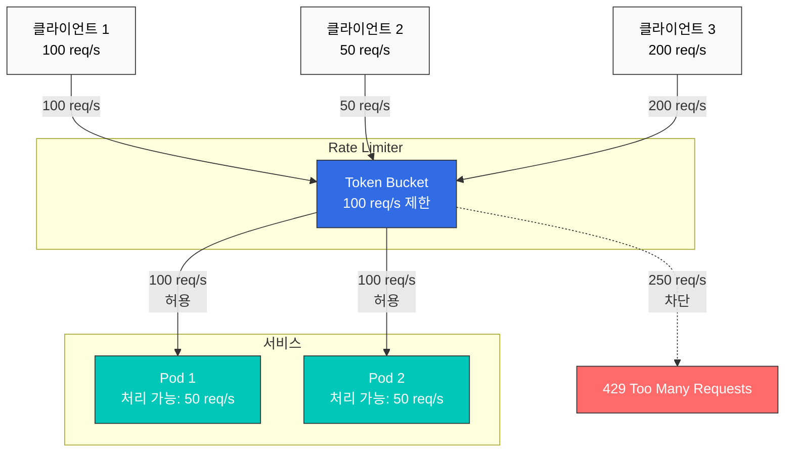
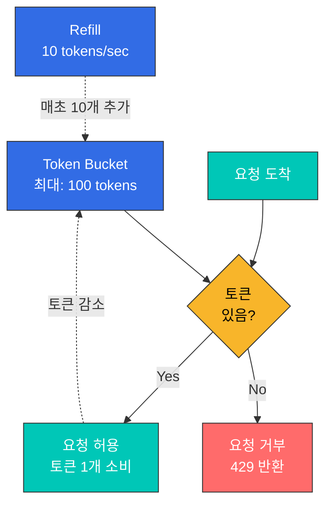
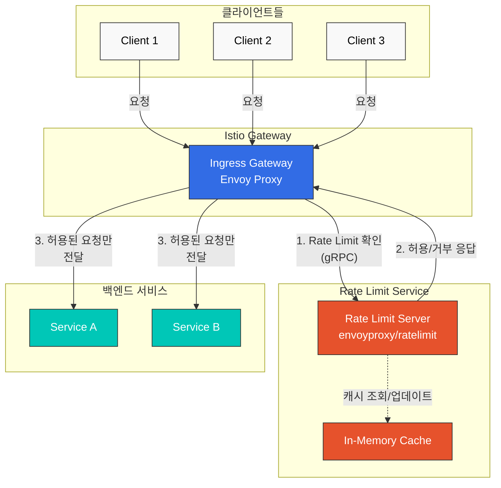

# Rate Limiting

Rate Limiting은 서비스를 과부하로부터 보호하고, 공정한 리소스 사용을 보장하며, 비용을 제어하기 위해 요청 속도를 제한하는 기능입니다.

## 목차

1. [개요](#개요)
2. [Rate Limiting 유형](#rate-limiting-유형)
3. [로컬 Rate Limiting](#로컬-rate-limiting)
4. [글로벌 Rate Limiting](#글로벌-rate-limiting)
5. [실전 예제](#실전-예제)
6. [모니터링](#모니터링)
7. [문제 해결](#문제-해결)

## 개요

Rate Limiting은 다음과 같은 상황에서 필요합니다:



### Rate Limiting의 목적

1. **서비스 보호**: 과부하 방지
2. **공정성**: 모든 클라이언트에게 공평한 리소스 분배
3. **비용 제어**: 외부 API 호출 비용 관리
4. **보안**: DDoS 공격 방어

## Rate Limiting 유형

### 1. 로컬 Rate Limiting

**특징**:
- 각 Envoy 프록시가 독립적으로 제한
- 빠른 응답 (추가 네트워크 호출 없음)
- 분산 환경에서는 전체 제한이 각 인스턴스별로 적용

```yaml
# 각 파드당 100 req/s 제한
# 파드 3개면 전체 300 req/s까지 허용
```

### 2. 글로벌 Rate Limiting

**특징**:
- 중앙 집중식 Rate Limit 서버 사용
- 정확한 전체 제한 (모든 인스턴스 공유)
- 약간의 지연 발생 (외부 서비스 호출)

```yaml
# 전체 100 req/s 제한
# 파드 개수와 무관하게 100 req/s까지만 허용
```

### 비교

| 특성 | 로컬 Rate Limiting | 글로벌 Rate Limiting |
|------|-------------------|---------------------|
| **정확도** | 낮음 (인스턴스별) | 높음 (전체) |
| **성능** | 매우 빠름 | 약간 느림 |
| **복잡도** | 낮음 | 높음 (외부 서비스 필요) |
| **사용 사례** | 일반적인 보호 | 정확한 제한 필요 시 |

## 로컬 Rate Limiting

### Token Bucket 알고리즘



### 기본 설정

```yaml
apiVersion: networking.istio.io/v1
kind: EnvoyFilter
metadata:
  name: local-ratelimit
  namespace: default
spec:
  workloadSelector:
    labels:
      app: myapp
  configPatches:
  - applyTo: HTTP_FILTER
    match:
      context: SIDECAR_INBOUND
      listener:
        filterChain:
          filter:
            name: "envoy.filters.network.http_connection_manager"
            subFilter:
              name: "envoy.filters.http.router"
    patch:
      operation: INSERT_BEFORE
      value:
        name: envoy.filters.http.local_ratelimit
        typed_config:
          "@type": type.googleapis.com/envoy.extensions.filters.http.local_ratelimit.v3.LocalRateLimit
          stat_prefix: http_local_rate_limiter
          token_bucket:
            max_tokens: 100        # 최대 토큰 수
            tokens_per_fill: 10    # 채울 토큰 수
            fill_interval: 1s      # 채우기 간격
          filter_enabled:
            runtime_key: local_rate_limit_enabled
            default_value:
              numerator: 100
              denominator: HUNDRED
          filter_enforced:
            runtime_key: local_rate_limit_enforced
            default_value:
              numerator: 100
              denominator: HUNDRED
          response_headers_to_add:
          - append: false
            header:
              key: x-local-rate-limit
              value: 'true'
```

**주요 파라미터**:
- `max_tokens`: 버킷에 저장할 수 있는 최대 토큰 수 (버스트 허용)
- `tokens_per_fill`: 매 fill_interval마다 추가할 토큰 수
- `fill_interval`: 토큰 추가 주기

**예시**:
```yaml
# 초당 10개 요청, 버스트 100개 허용
token_bucket:
  max_tokens: 100
  tokens_per_fill: 10
  fill_interval: 1s

# 결과:
# - 평균: 10 req/s
# - 버스트: 100 req/s (짧은 순간)
```

### 경로별 Rate Limiting

```yaml
apiVersion: networking.istio.io/v1
kind: EnvoyFilter
metadata:
  name: path-based-ratelimit
  namespace: default
spec:
  workloadSelector:
    labels:
      app: api-service
  configPatches:
  - applyTo: HTTP_FILTER
    match:
      context: SIDECAR_INBOUND
    patch:
      operation: INSERT_BEFORE
      value:
        name: envoy.filters.http.local_ratelimit
        typed_config:
          "@type": type.googleapis.com/envoy.extensions.filters.http.local_ratelimit.v3.LocalRateLimit
          stat_prefix: http_local_rate_limiter
          
          # 경로별 다른 제한
          descriptors:
          # /api/v1/users - 높은 제한
          - entries:
            - key: header_match
              value: "/api/v1/users"
            token_bucket:
              max_tokens: 1000
              tokens_per_fill: 100
              fill_interval: 1s
          
          # /api/v1/admin - 낮은 제한
          - entries:
            - key: header_match
              value: "/api/v1/admin"
            token_bucket:
              max_tokens: 100
              tokens_per_fill: 10
              fill_interval: 1s
```

### 헤더 기반 Rate Limiting

```yaml
apiVersion: networking.istio.io/v1
kind: EnvoyFilter
metadata:
  name: user-based-ratelimit
  namespace: default
spec:
  workloadSelector:
    labels:
      app: api-service
  configPatches:
  - applyTo: HTTP_FILTER
    match:
      context: SIDECAR_INBOUND
    patch:
      operation: INSERT_BEFORE
      value:
        name: envoy.filters.http.local_ratelimit
        typed_config:
          "@type": type.googleapis.com/envoy.extensions.filters.http.local_ratelimit.v3.LocalRateLimit
          stat_prefix: http_local_rate_limiter
          
          # 사용자 등급별 제한
          descriptors:
          # Premium 사용자
          - entries:
            - key: header_match
              value: "x-user-tier:premium"
            token_bucket:
              max_tokens: 1000
              tokens_per_fill: 100
              fill_interval: 1s
          
          # 무료 사용자
          - entries:
            - key: header_match
              value: "x-user-tier:free"
            token_bucket:
              max_tokens: 100
              tokens_per_fill: 10
              fill_interval: 1s
```

## 글로벌 Rate Limiting

글로벌 Rate Limiting은 중앙 집중식 Rate Limit 서비스를 사용하여 클러스터 전체에 걸쳐 정확한 속도 제한을 적용합니다.

### 아키텍처



### 구성 방법

글로벌 Rate Limiting은 외부 Rate Limit 서비스를 배포하고 EnvoyFilter로 연동합니다.

#### 1. Rate Limit Service 배포

**참고**: Istio는 [envoyproxy/ratelimit](https://github.com/envoyproxy/ratelimit) 서비스를 외부 의존성으로 사용합니다.

```yaml
apiVersion: v1
kind: ConfigMap
metadata:
  name: ratelimit-config
  namespace: istio-system
data:
  config.yaml: |
    domain: production-ratelimit
    descriptors:
      # 전역 제한: 초당 100개
      - key: generic_key
        value: "global"
        rate_limit:
          unit: second
          requests_per_unit: 100

      # 경로별 제한
      - key: header_match
        value: "/api/v1/*"
        rate_limit:
          unit: second
          requests_per_unit: 50

      # 사용자별 제한 (분당)
      - key: remote_address
        rate_limit:
          unit: minute
          requests_per_unit: 1000
---
apiVersion: apps/v1
kind: Deployment
metadata:
  name: ratelimit
  namespace: istio-system
spec:
  replicas: 1
  selector:
    matchLabels:
      app: ratelimit
  template:
    metadata:
      labels:
        app: ratelimit
    spec:
      containers:
      - name: ratelimit
        image: envoyproxy/ratelimit:19f2079f  # 안정 버전 사용
        ports:
        - containerPort: 8080
          name: http
        - containerPort: 8081
          name: grpc
        env:
        - name: LOG_LEVEL
          value: debug
        - name: RUNTIME_ROOT
          value: /data
        - name: RUNTIME_SUBDIRECTORY
          value: ratelimit
        - name: RUNTIME_IGNOREDOTFILES
          value: "true"
        - name: USE_STATSD
          value: "false"
        volumeMounts:
        - name: config-volume
          mountPath: /data/ratelimit/config
          readOnly: true
        command: ["/bin/ratelimit"]
        resources:
          requests:
            memory: "128Mi"
            cpu: "100m"
          limits:
            memory: "512Mi"
            cpu: "500m"
      volumes:
      - name: config-volume
        configMap:
          name: ratelimit-config
---
apiVersion: v1
kind: Service
metadata:
  name: ratelimit
  namespace: istio-system
spec:
  ports:
  - port: 8080
    name: http
    targetPort: 8080
  - port: 8081
    name: grpc
    targetPort: 8081
  selector:
    app: ratelimit
```

#### 2. EnvoyFilter로 글로벌 Rate Limiting 구성

```yaml
apiVersion: networking.istio.io/v1alpha3
kind: EnvoyFilter
metadata:
  name: filter-ratelimit
  namespace: istio-system
spec:
  workloadSelector:
    labels:
      istio: ingressgateway
  configPatches:
    # HTTP 필터 추가
    - applyTo: HTTP_FILTER
      match:
        context: GATEWAY
        listener:
          filterChain:
            filter:
              name: "envoy.filters.network.http_connection_manager"
              subFilter:
                name: "envoy.filters.http.router"
      patch:
        operation: INSERT_BEFORE
        value:
          name: envoy.filters.http.ratelimit
          typed_config:
            "@type": type.googleapis.com/envoy.extensions.filters.http.ratelimit.v3.RateLimit
            domain: production-ratelimit
            failure_mode_deny: true
            timeout: 5s
            rate_limit_service:
              grpc_service:
                envoy_grpc:
                  cluster_name: rate_limit_cluster
              transport_api_version: V3

    # Rate Limit 클러스터 추가
    - applyTo: CLUSTER
      match:
        context: GATEWAY
      patch:
        operation: ADD
        value:
          name: rate_limit_cluster
          type: STRICT_DNS
          connect_timeout: 5s
          lb_policy: ROUND_ROBIN
          http2_protocol_options: {}
          load_assignment:
            cluster_name: rate_limit_cluster
            endpoints:
            - lb_endpoints:
              - endpoint:
                  address:
                    socket_address:
                      address: ratelimit.istio-system.svc.cluster.local
                      port_value: 8081
---
apiVersion: networking.istio.io/v1alpha3
kind: EnvoyFilter
metadata:
  name: filter-ratelimit-svc
  namespace: istio-system
spec:
  workloadSelector:
    labels:
      istio: ingressgateway
  configPatches:
    # VirtualHost에 rate limit action 추가
    - applyTo: VIRTUAL_HOST
      match:
        context: GATEWAY
      patch:
        operation: MERGE
        value:
          rate_limits:
            # 전역 제한
            - actions:
              - generic_key:
                  descriptor_value: "global"
```

#### 3. VirtualService에 Rate Limit 액션 추가

```yaml
apiVersion: networking.istio.io/v1alpha3
kind: EnvoyFilter
metadata:
  name: filter-ratelimit-actions
  namespace: default
spec:
  workloadSelector:
    labels:
      istio: ingressgateway
  configPatches:
    - applyTo: VIRTUAL_HOST
      match:
        context: GATEWAY
        routeConfiguration:
          vhost:
            name: "*:80"
      patch:
        operation: MERGE
        value:
          rate_limits:
            # 경로별 Rate Limiting
            - actions:
              - header_value_match:
                  descriptor_value: "/api/v1/*"
                  headers:
                  - name: ":path"
                    string_match:
                      prefix: "/api/v1/"

            # IP 기반 Rate Limiting
            - actions:
              - remote_address: {}
```

### 주요 파라미터 설명

| 파라미터 | 설명 |
|---------|------|
| `domain` | Rate Limit Service 구성 도메인 (ConfigMap과 일치해야 함) |
| `failure_mode_deny` | Rate Limit Service 실패 시 요청 거부 여부 |
| `timeout` | Rate Limit Service 응답 대기 시간 |
| `rate_limit_service` | 외부 Rate Limit Service의 gRPC 엔드포인트 |

### 글로벌 vs 로컬 Rate Limiting 선택 기준

**로컬 Rate Limiting 사용**:
- ✅ 간단한 구성
- ✅ 빠른 응답 속도
- ✅ 외부 의존성 없음
- ❌ 파드별 제한 (전체 제한 부정확)

**글로벌 Rate Limiting 사용**:
- ✅ 정확한 전체 제한
- ✅ 복잡한 규칙 (사용자별, IP별, 경로별)
- ✅ 중앙 집중식 관리
- ❌ 외부 서비스 필요 (복잡도 증가)
- ❌ 약간의 지연 (gRPC 호출)

**권장 사항**:
- **프로덕션 API Gateway**: 글로벌 Rate Limiting (정확한 제어 필요)
- **마이크로서비스 보호**: 로컬 Rate Limiting (빠른 응답)
- **하이브리드**: Gateway는 글로벌, 내부 서비스는 로컬

## 실전 예제

### 예제 1: API Gateway Rate Limiting

```yaml
apiVersion: networking.istio.io/v1
kind: EnvoyFilter
metadata:
  name: api-gateway-ratelimit
  namespace: istio-system
spec:
  workloadSelector:
    labels:
      istio: ingressgateway
  configPatches:
  - applyTo: HTTP_FILTER
    match:
      context: GATEWAY
    patch:
      operation: INSERT_BEFORE
      value:
        name: envoy.filters.http.local_ratelimit
        typed_config:
          "@type": type.googleapis.com/envoy.extensions.filters.http.local_ratelimit.v3.LocalRateLimit
          stat_prefix: http_local_rate_limiter
          
          # 공개 API: 낮은 제한
          descriptors:
          - entries:
            - key: header_match
              value: "/api/v1/public/*"
            token_bucket:
              max_tokens: 100
              tokens_per_fill: 10
              fill_interval: 1s
          
          # 인증된 API: 높은 제한
          - entries:
            - key: header_match
              value: "/api/v1/protected/*"
            token_bucket:
              max_tokens: 1000
              tokens_per_fill: 100
              fill_interval: 1s
          
          # GraphQL: 중간 제한
          - entries:
            - key: header_match
              value: "/graphql"
            token_bucket:
              max_tokens: 500
              tokens_per_fill: 50
              fill_interval: 1s
```

### 예제 2: 사용자 등급별 Rate Limiting

```yaml
apiVersion: networking.istio.io/v1
kind: EnvoyFilter
metadata:
  name: tiered-ratelimit
  namespace: default
spec:
  workloadSelector:
    labels:
      app: api-service
  configPatches:
  - applyTo: HTTP_FILTER
    match:
      context: SIDECAR_INBOUND
    patch:
      operation: INSERT_BEFORE
      value:
        name: envoy.filters.http.local_ratelimit
        typed_config:
          "@type": type.googleapis.com/envoy.extensions.filters.http.local_ratelimit.v3.LocalRateLimit
          stat_prefix: http_local_rate_limiter
          
          descriptors:
          # Enterprise: 1000 req/s
          - entries:
            - key: header_match
              value: "x-api-tier:enterprise"
            token_bucket:
              max_tokens: 10000
              tokens_per_fill: 1000
              fill_interval: 1s
          
          # Premium: 100 req/s
          - entries:
            - key: header_match
              value: "x-api-tier:premium"
            token_bucket:
              max_tokens: 1000
              tokens_per_fill: 100
              fill_interval: 1s
          
          # Free: 10 req/s
          - entries:
            - key: header_match
              value: "x-api-tier:free"
            token_bucket:
              max_tokens: 100
              tokens_per_fill: 10
              fill_interval: 1s
```

### 예제 3: 외부 API 보호

```yaml
# 외부 API 호출 제한 (Egress)
apiVersion: networking.istio.io/v1
kind: EnvoyFilter
metadata:
  name: external-api-ratelimit
  namespace: default
spec:
  workloadSelector:
    labels:
      app: myapp
  configPatches:
  - applyTo: HTTP_FILTER
    match:
      context: SIDECAR_OUTBOUND
    patch:
      operation: INSERT_BEFORE
      value:
        name: envoy.filters.http.local_ratelimit
        typed_config:
          "@type": type.googleapis.com/envoy.extensions.filters.http.local_ratelimit.v3.LocalRateLimit
          stat_prefix: egress_rate_limiter
          
          # 외부 API 제한 (비용 절감)
          token_bucket:
            max_tokens: 1000   # 버스트 허용
            tokens_per_fill: 10  # 초당 10개
            fill_interval: 1s
          
          # 제한 초과 시 로깅
          response_headers_to_add:
          - header:
              key: x-rate-limit-exceeded
              value: "true"
```

## 모니터링

### Prometheus 메트릭

```yaml
# Rate Limiting 메트릭

# 1. 제한된 요청 수
rate(envoy_http_local_rate_limit_rate_limited[5m])

# 2. 허용된 요청 수
rate(envoy_http_local_rate_limit_ok[5m])

# 3. Rate Limit 적용률
(rate(envoy_http_local_rate_limit_rate_limited[5m]) 
 / 
 (rate(envoy_http_local_rate_limit_rate_limited[5m]) + rate(envoy_http_local_rate_limit_ok[5m]))) * 100

# 4. 글로벌 Rate Limit 호출
rate(envoy_cluster_ratelimit_over_limit[5m])
```

### Grafana 대시보드

```json
{
  "dashboard": {
    "title": "Istio Rate Limiting",
    "panels": [
      {
        "title": "Rate Limited Requests",
        "targets": [
          {
            "expr": "rate(envoy_http_local_rate_limit_rate_limited[5m])",
            "legendFormat": "{{pod_name}}"
          }
        ]
      },
      {
        "title": "Rate Limit Hit Rate",
        "targets": [
          {
            "expr": "(rate(envoy_http_local_rate_limit_rate_limited[5m]) / (rate(envoy_http_local_rate_limit_rate_limited[5m]) + rate(envoy_http_local_rate_limit_ok[5m]))) * 100",
            "legendFormat": "Hit Rate %"
          }
        ]
      }
    ]
  }
}
```

## 문제 해결

### Rate Limiting이 작동하지 않음

```bash
# 1. EnvoyFilter 확인
kubectl get envoyfilter -A

# 2. Envoy 구성 확인
istioctl proxy-config listeners <pod-name> -n <namespace> -o json | \
  jq '.[] | select(.name | contains("0.0.0.0")) | .filterChains[].filters[] | select(.name == "envoy.filters.network.http_connection_manager") | .typedConfig.httpFilters[] | select(.name == "envoy.filters.http.local_ratelimit")'

# 3. 로그 확인
kubectl logs -n <namespace> <pod-name> -c istio-proxy | grep ratelimit
```

### 글로벌 Rate Limiting 연결 실패

```bash
# Rate Limit Service 확인
kubectl get pods -n istio-system -l app=ratelimit
kubectl logs -n istio-system -l app=ratelimit

# Redis 연결 확인
kubectl exec -n istio-system -it deploy/ratelimit -- redis-cli -h redis-ratelimit ping
```

## 참고 자료

- [Istio Rate Limiting](https://istio.io/latest/docs/tasks/policy-enforcement/rate-limit/)
- [Envoy Rate Limiting](https://www.envoyproxy.io/docs/envoy/latest/configuration/http/http_filters/local_rate_limit_filter)
- [Envoy Global Rate Limiting](https://github.com/envoyproxy/ratelimit)
