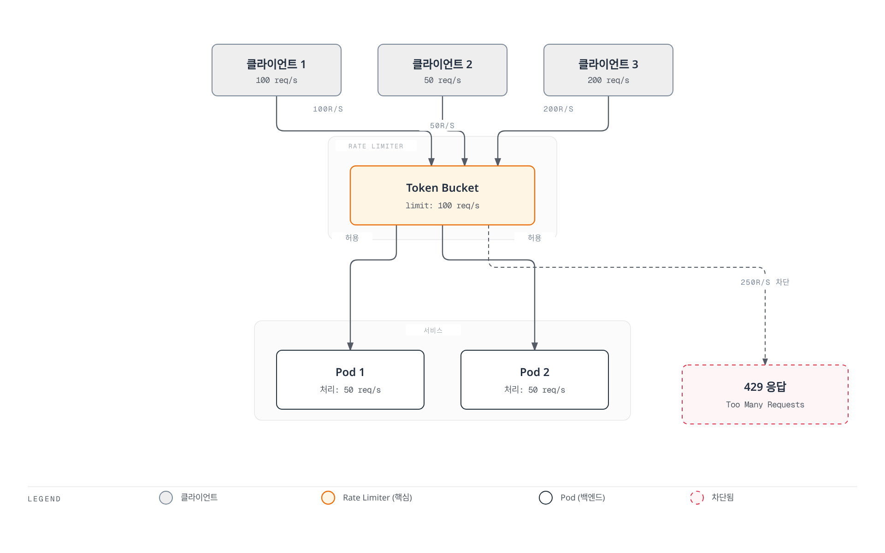
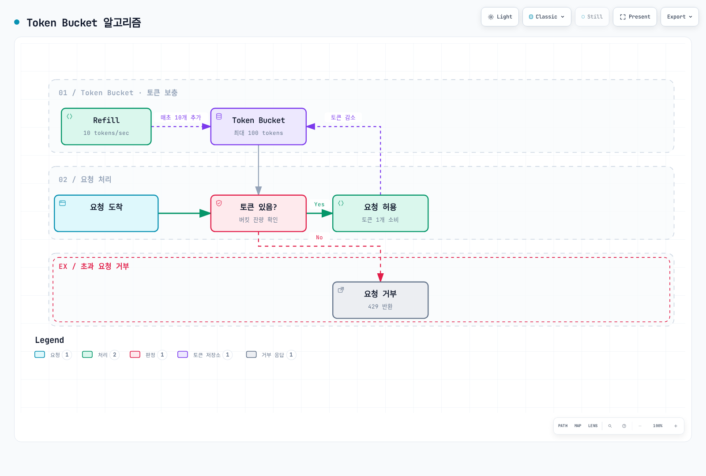
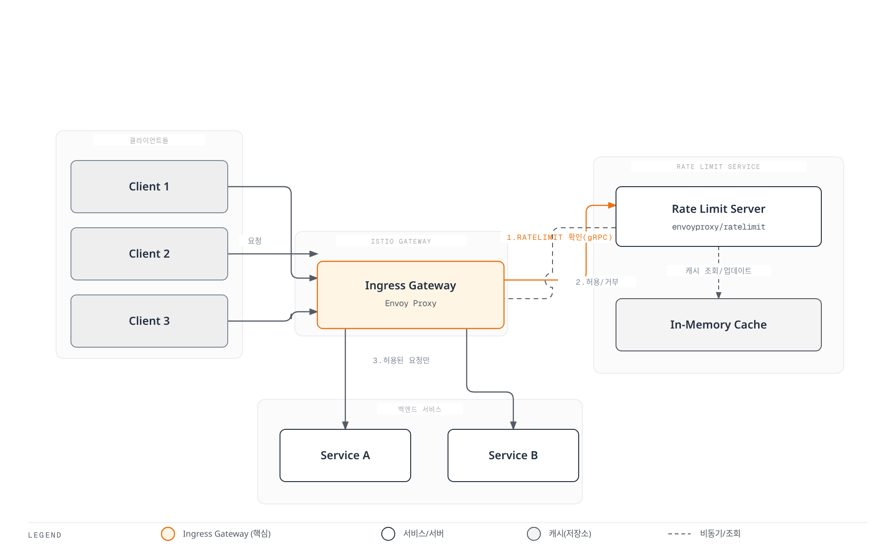

# Rate Limiting

> **마지막 업데이트**: 2026년 9월 11일 · Istio1.31. 독립적인 예제이며 workload/listener별 local 정책을 하나 선택합니다. 사이드카 앱은 `default`의 HTTP8080, gateway 예제는 `istio-system`의 `istio: ingressgateway` 전용 gateway를 가정합니다. 실제 레이블·listener를 확인해야 하며 배포·부하 검증한 구성이 아닙니다.

Rate Limiting은 서비스를 과부하로부터 보호하고, 공정한 리소스 사용을 보장하며, 비용을 제어하기 위해 요청 속도를 제한하는 기능입니다.

## 목차

1. [개요](#개요)
2. [Rate Limiting 유형](#rate-limiting-유형)
3. [로컬 Rate Limiting](#로컬-rate-limiting)
4. [글로벌 Rate Limiting](#글로벌-rate-limiting)
5. [실전 예제](#실전-예제)
6. [모니터링](#모니터링)
7. [문제 해결](#문제-해결)

## 개요

Rate Limiting은 다음과 같은 상황에서 필요합니다:



[🔍 인터랙티브 다이어그램 보기](https://www.atomai.click/kubernetes-docs/archmaps/ko-service-mesh-istio-resilience-02-rate-limiting-0.html)

### Rate Limiting의 목적

1. **서비스 보호**: 과부하 방지
2. **공정성**: Descriptor·신원 모델이 필요하며 공유 bucket만으로 클라이언트별 공정성이 보장되지는 않습니다.
3. **비용 제어**: 외부 API 호출 비용 관리
4. **남용 완화**: 선택한 HTTP 요청을 제한하며 edge/DDoS 방어나 연결·TLS 자원 고갈 대책을 대체하지는 않습니다.

## Rate Limiting 유형

### 1. 로컬 Rate Limiting

**특징**:
- 각 Envoy 프록시가 독립적으로 제한
- 빠른 응답 (추가 네트워크 호출 없음)
- 분산 환경에서는 전체 제한이 각 인스턴스별로 적용

```yaml
# 각 파드당 100 req/s 제한
# 독립 bucket 3개면 분산 상태에 따라 합계 약300 req/s 지속 처리 가능;
# 각 bucket의 초기 burst는 별도이며 전역300 req/s quota가 아님
```

### 2. 글로벌 Rate Limiting

**특징**:
- 중앙 집중식 Rate Limit 서버 사용
- Domain/descriptor·window별 counter 공유; backend·장애 동작의 영향을 받음
- 약간의 지연 발생 (외부 서비스 호출)

```yaml
# 공유 descriptor quota: backend의 초 단위 window당100개
# Replica가 같은 counter를 사용해야 하며 window 경계·backend 장애 검증 필요
```

### 비교

| 특성 | 로컬 Rate Limiting | 글로벌 Rate Limiting |
|------|-------------------|---------------------|
| **Quota 범위** | 설정된 로컬 bucket별 | 공유 domain/descriptor별 |
| **성능** | 매우 빠름 | 약간 느림 |
| **복잡도** | 낮음 | 높음 (외부 서비스 필요) |
| **사용 사례** | 일반적인 보호 | 정확한 제한 필요 시 |

## 로컬 Rate Limiting

### Token Bucket 알고리즘



[🔍 인터랙티브 다이어그램 보기](https://www.atomai.click/kubernetes-docs/archmaps/ko-service-mesh-istio-resilience-02-rate-limiting-1.html)

### 기본 설정

```yaml
apiVersion: networking.istio.io/v1alpha3
kind: EnvoyFilter
metadata:
  name: local-ratelimit
  namespace: default
spec:
  workloadSelector:
    labels:
      app: myapp
  configPatches:
  - applyTo: HTTP_FILTER
    match:
      context: SIDECAR_INBOUND
      listener:
        filterChain:
          filter:
            name: envoy.filters.network.http_connection_manager
            subFilter:
              name: envoy.filters.http.router
        portNumber: 8080
    patch:
      operation: INSERT_BEFORE
      value:
        name: envoy.filters.http.local_ratelimit
        typed_config:
          '@type': type.googleapis.com/envoy.extensions.filters.http.local_ratelimit.v3.LocalRateLimit
          stat_prefix: http_local_rate_limiter
          token_bucket:
            max_tokens: 100
            tokens_per_fill: 10
            fill_interval: 1s
          filter_enabled:
            default_value:
              numerator: 100
              denominator: HUNDRED
          filter_enforced:
            default_value:
              numerator: 100
              denominator: HUNDRED
          response_headers_to_add:
          - header:
              key: x-local-rate-limit
              value: 'true'
            append_action: OVERWRITE_IF_EXISTS_OR_ADD
```

**주요 파라미터**:
- `max_tokens`: 버킷에 저장할 수 있는 최대 토큰 수 (버스트 허용)
- `tokens_per_fill`: 매 fill_interval마다 추가할 토큰 수
- `fill_interval`: 토큰 추가 주기

**예시**:
```yaml
# 초당 10개 요청, 버스트 100개 허용
token_bucket:
  max_tokens: 100
  tokens_per_fill: 10
  fill_interval: 1s

# 결과:
# - 평균: 10 req/s
# - 버스트: 즉시 사용할 수 있는 최대100 token이며 별도 지속 req/s가 아님
```

### 경로별 Rate Limiting

```yaml
apiVersion: networking.istio.io/v1alpha3
kind: EnvoyFilter
metadata:
  name: path-based-ratelimit
  namespace: default
spec:
  workloadSelector:
    labels:
      app: api-service
  configPatches:
  - applyTo: HTTP_FILTER
    match:
      context: SIDECAR_INBOUND
      listener:
        filterChain:
          filter:
            name: envoy.filters.network.http_connection_manager
            subFilter:
              name: envoy.filters.http.router
        portNumber: 8080
    patch:
      operation: INSERT_BEFORE
      value:
        name: envoy.filters.http.local_ratelimit
        typed_config:
          '@type': type.googleapis.com/envoy.extensions.filters.http.local_ratelimit.v3.LocalRateLimit
          stat_prefix: http_local_rate_limiter
          descriptors:
          - entries:
            - key: header_match
              value: /api/v1/users
            token_bucket:
              max_tokens: 1000
              tokens_per_fill: 100
              fill_interval: 1s
          - entries:
            - key: header_match
              value: /api/v1/admin
            token_bucket:
              max_tokens: 100
              tokens_per_fill: 10
              fill_interval: 1s
          filter_enabled:
            default_value:
              numerator: 100
              denominator: HUNDRED
          filter_enforced:
            default_value:
              numerator: 100
              denominator: HUNDRED
          token_bucket:
            max_tokens: 100
            tokens_per_fill: 10
            fill_interval: 1s
          always_consume_default_token_bucket: false
          rate_limits:
          - actions:
            - header_value_match:
                descriptor_value: /api/v1/users
                headers:
                - name: :path
                  string_match:
                    prefix: /api/v1/users
          - actions:
            - header_value_match:
                descriptor_value: /api/v1/admin
                headers:
                - name: :path
                  string_match:
                    prefix: /api/v1/admin
```

`rate_limits`가 `header_match`를 만들고 `descriptors`가 일치하는 bucket을 선택합니다. Istio1.31 고정 Envoy API에 이 필드가 있으며 지정하면 local filter는 route/vhost action 대신 이를 사용합니다. Path 값은 descriptor의 문자 그대로인 key이고 실제 prefix 매칭은 `headers`에 있습니다. Prefix로 시작하는 더 긴 경로도 일치합니다. Fallback은 미매칭 요청을 제한하며 `always_consume_default_token_bucket: false`로100 req/s bucket에10 req/s fallback 한도가 중복 적용되지 않게 합니다.

### 헤더 기반 Rate Limiting

```yaml
apiVersion: networking.istio.io/v1alpha3
kind: EnvoyFilter
metadata:
  name: user-based-ratelimit
  namespace: default
spec:
  workloadSelector:
    labels:
      app: api-service
  configPatches:
  - applyTo: HTTP_FILTER
    match:
      context: SIDECAR_INBOUND
      listener:
        filterChain:
          filter:
            name: envoy.filters.network.http_connection_manager
            subFilter:
              name: envoy.filters.http.router
        portNumber: 8080
    patch:
      operation: INSERT_BEFORE
      value:
        name: envoy.filters.http.local_ratelimit
        typed_config:
          '@type': type.googleapis.com/envoy.extensions.filters.http.local_ratelimit.v3.LocalRateLimit
          stat_prefix: http_local_rate_limiter
          descriptors:
          - entries:
            - key: header_match
              value: x-user-tier:premium
            token_bucket:
              max_tokens: 1000
              tokens_per_fill: 100
              fill_interval: 1s
          - entries:
            - key: header_match
              value: x-user-tier:free
            token_bucket:
              max_tokens: 100
              tokens_per_fill: 10
              fill_interval: 1s
          filter_enabled:
            default_value:
              numerator: 100
              denominator: HUNDRED
          filter_enforced:
            default_value:
              numerator: 100
              denominator: HUNDRED
          token_bucket:
            max_tokens: 100
            tokens_per_fill: 10
            fill_interval: 1s
          always_consume_default_token_bucket: false
          rate_limits:
          - actions:
            - header_value_match:
                descriptor_value: x-user-tier:premium
                headers:
                - name: x-user-tier
                  string_match:
                    exact: premium
          - actions:
            - header_value_match:
                descriptor_value: x-user-tier:free
                headers:
                - name: x-user-tier
                  string_match:
                    exact: free
```

Tier descriptor는 로컬 프록시의 등급별 공유 bucket이며 사용자 한 명마다의 bucket이 아닙니다. 인증된 upstream이 외부 tier 헤더를 제거하고 신뢰할 등급을 넣어야 하며 서비스로의 우회 경로도 막아야 합니다. 없거나 알 수 없는 등급은 제한된 fallback을 사용합니다. Premium 헤더 자체가 인증은 아닙니다.

## 글로벌 Rate Limiting

글로벌 rate limiting은 공유 판정 서비스에 domain/descriptor를 조회합니다. Gateway replica 간 quota를 공유할 수 있지만 자동으로 클러스터의 모든 요청에 적용되지는 않습니다. Counter 저장소·window 경계·failover·장애 정책에 따라 실제 보장이 달라집니다.

### 아키텍처



[🔍 인터랙티브 다이어그램 보기](https://www.atomai.click/kubernetes-docs/archmaps/ko-service-mesh-istio-resilience-02-rate-limiting-2.html)

### 구성 방법

글로벌 Rate Limiting은 외부 Rate Limit 서비스를 배포하고 EnvoyFilter로 연동합니다.

그림의 cache는 Redis 같은 공유 counter 저장소여야 하며 process별 메모리 cache만으로 전역 quota가 되지는 않습니다. 다음 Deployment는 격리된 실습에 **이미 준비된 Redis TCP 서비스** `redis-ratelimit.istio-system.svc.cluster.local:6379`을 전제합니다. Backend 생성·인증/TLS·영속성/HA·failover는 별도 요구이며 아래에서 생성하지 않습니다. 보호된 backend에는 고정 서비스의 REDIS_AUTH/REDIS_TLS/인증서 설정을 적절한 Secret·mount로 연결합니다.

이미지는 게시된 commit8fe6ea42(2026년8월24일)의 manifest digest를 고정했으며 linux/amd64·linux/arm64를 지원합니다. Upstream은 v1.4.0 이후 semantic release 대신 commit tag를 사용하므로 검증된 운영 안정 릴리스라는 뜻은 아닙니다. Upgrade를 검토·시험합니다. Deployment는 sidecar injection을 명시적으로 요청하므로 injector 매칭과 실제 mesh/network 정책 아래 gateway→gRPC 연결을 확인합니다.

#### 1. Rate Limit Service 배포

**참고**: Istio는 [envoyproxy/ratelimit](https://github.com/envoyproxy/ratelimit) 서비스를 외부 의존성으로 사용합니다.

```yaml
apiVersion: v1
kind: ConfigMap
metadata:
  name: ratelimit-config
  namespace: istio-system
data:
  config.yaml: "domain: production-ratelimit\ndescriptors:\n  # \uC804\uC5ED \uC81C\uD55C: \uCD08\uB2F9 100\uAC1C\n  - key: generic_key\n    value: \"global\"\n    rate_limit:\n      unit: second\n      requests_per_unit: 100\n\n  # \uACBD\uB85C\uBCC4 \uC81C\uD55C\n  - key: header_match\n    value: \"/api/v1/*\"\n    rate_limit:\n      unit: second\n      requests_per_unit: 50\n\n  # \uC0AC\uC6A9\uC790\uBCC4 \uC81C\uD55C (\uBD84\uB2F9)\n  - key: remote_address\n    rate_limit:\n      unit: minute\n      requests_per_unit: 1000\n"
---
apiVersion: apps/v1
kind: Deployment
metadata:
  name: ratelimit
  namespace: istio-system
spec:
  replicas: 1
  selector:
    matchLabels:
      app: ratelimit
  template:
    metadata:
      labels:
        app: ratelimit
      annotations:
        sidecar.istio.io/inject: 'true'
    spec:
      containers:
      - name: ratelimit
        image: docker.io/envoyproxy/ratelimit:8fe6ea42@sha256:a61547259607d40aff153050c2a87873ca1676d1d9f5f06937d412000dcc2df1
        ports:
        - containerPort: 8080
          name: http
        - containerPort: 8081
          name: grpc
        env:
        - name: LOG_LEVEL
          value: info
        - name: CONFIG_TYPE
          value: FILE
        - name: RUNTIME_ROOT
          value: /data
        - name: RUNTIME_SUBDIRECTORY
          value: ratelimit
        - name: RUNTIME_APPDIRECTORY
          value: config
        - name: RUNTIME_WATCH_ROOT
          value: 'false'
        - name: RUNTIME_IGNOREDOTFILES
          value: 'true'
        - name: USE_STATSD
          value: 'false'
        - name: REDIS_SOCKET_TYPE
          value: tcp
        - name: REDIS_URL
          value: redis-ratelimit.istio-system.svc.cluster.local:6379
        - name: HOST
          value: '::'
        - name: GRPC_HOST
          value: '::'
        - name: HEALTHY_WITH_AT_LEAST_ONE_CONFIG_LOADED
          value: 'true'
        volumeMounts:
        - name: config-volume
          mountPath: /data/ratelimit/config
          readOnly: true
        command:
        - /bin/ratelimit
        resources:
          requests:
            memory: 128Mi
            cpu: 100m
          limits:
            memory: 512Mi
            cpu: 500m
        readinessProbe:
          httpGet:
            path: /healthcheck
            port: 8080
          initialDelaySeconds: 5
          periodSeconds: 5
      volumes:
      - name: config-volume
        configMap:
          name: ratelimit-config
---
apiVersion: v1
kind: Service
metadata:
  name: ratelimit
  namespace: istio-system
spec:
  ports:
  - port: 8080
    name: http
    targetPort: 8080
  - port: 8081
    name: grpc
    targetPort: 8081
  selector:
    app: ratelimit
```

#### 2. EnvoyFilter로 글로벌 Rate Limiting 구성

```yaml
apiVersion: networking.istio.io/v1alpha3
kind: EnvoyFilter
metadata:
  name: filter-ratelimit
  namespace: istio-system
spec:
  workloadSelector:
    labels:
      istio: ingressgateway
  configPatches:
  - applyTo: HTTP_FILTER
    match:
      context: GATEWAY
      listener:
        filterChain:
          filter:
            name: envoy.filters.network.http_connection_manager
            subFilter:
              name: envoy.filters.http.router
    patch:
      operation: INSERT_BEFORE
      value:
        name: envoy.filters.http.ratelimit
        typed_config:
          '@type': type.googleapis.com/envoy.extensions.filters.http.ratelimit.v3.RateLimit
          domain: production-ratelimit
          failure_mode_deny: true
          timeout: 0.1s
          rate_limit_service:
            grpc_service:
              envoy_grpc:
                cluster_name: outbound|8081||ratelimit.istio-system.svc.cluster.local
                authority: ratelimit.istio-system.svc.cluster.local
            transport_api_version: V3
```

#### 3. Gateway VirtualHost에 Rate Limit 액션 추가

Filter와 같은 전용 gateway에 action 집합을 한 번 적용합니다. 의도적으로 모든 HTTP virtual host에 적용하므로 공유 gateway에서는 확인한 vhost로 매칭을 좁힙니다. ConfigMap과 일치하는 global·path prefix·client-IP descriptor를 만듭니다. `remote_address`는 사용자 신원이 아닌 신뢰한 downstream IP이므로 실제 proxy/XFF 신뢰 경로·NAT를 고려합니다.


```yaml
apiVersion: networking.istio.io/v1alpha3
kind: EnvoyFilter
metadata:
  name: filter-ratelimit-actions
  namespace: istio-system
spec:
  workloadSelector:
    labels:
      istio: ingressgateway
  configPatches:
  - applyTo: VIRTUAL_HOST
    match:
      context: GATEWAY
    patch:
      operation: MERGE
      value:
        rate_limits:
        - actions:
          - generic_key:
              descriptor_value: global
        - actions:
          - header_value_match:
              descriptor_value: /api/v1/*
              headers:
              - name: :path
                string_match:
                  prefix: /api/v1/
        - actions:
          - remote_address: {}
```

Filter는 Istio가 생성한 gRPC cluster를 사용하므로 일반 discovery·mesh TLS 정책이 적용됩니다. 별도 평문 cluster를 만들지 않습니다. `failure_mode_deny: true`는 판정 서비스 오류에 보통HTTP500, quota 초과에는HTTP429를 반환하며 false는 fail open할 수 있습니다. 100ms는 예시이므로 Redis timeout·지연·호출자 deadline을 맞춥니다. Window 경계·Redis 재시작/failover·서비스 replica 변경에서 counter 동작을 검증합니다. ConfigMap 변경 후 reload 또는 restart를 확인하고 Running Pod만으로 정책 로딩을 판단하지 않습니다.

### 주요 파라미터 설명

| 파라미터 | 설명 |
|---------|------|
| `domain` | Rate Limit Service 구성 도메인 (ConfigMap과 일치해야 함) |
| `failure_mode_deny` | Rate Limit Service 실패 시 요청 거부 여부 |
| `timeout` | Rate Limit Service 응답 대기 시간 |
| `rate_limit_service` | 외부 Rate Limit Service의 gRPC 엔드포인트 |

### 글로벌 vs 로컬 Rate Limiting 선택 기준

**로컬 Rate Limiting 사용**:
- ✅ 간단한 구성
- ✅ 빠른 응답 속도
- ✅ 외부 의존성 없음
- Bucket별 범위이며 replica 수·분산 상태가 총량에 영향

**글로벌 Rate Limiting 사용**:
- 선택한 descriptor의 공유 제한
- ✅ 복잡한 규칙 (사용자별, IP별, 경로별)
- ✅ 중앙 집중식 관리
- ❌ 외부 서비스 필요 (복잡도 증가)
- ❌ 약간의 지연 (gRPC 호출)

**권장 사항**:
- **프로덕션 API Gateway**: 글로벌 Rate Limiting (정확한 제어 필요)
- **마이크로서비스 보호**: 로컬 Rate Limiting (빠른 응답)
- **하이브리드**: Gateway는 글로벌, 내부 서비스는 로컬

## 실전 예제

### 예제 1: API Gateway Rate Limiting

```yaml
apiVersion: networking.istio.io/v1alpha3
kind: EnvoyFilter
metadata:
  name: api-gateway-ratelimit
  namespace: istio-system
spec:
  workloadSelector:
    labels:
      istio: ingressgateway
  configPatches:
  - applyTo: HTTP_FILTER
    match:
      context: GATEWAY
      listener:
        filterChain:
          filter:
            name: envoy.filters.network.http_connection_manager
            subFilter:
              name: envoy.filters.http.router
    patch:
      operation: INSERT_BEFORE
      value:
        name: envoy.filters.http.local_ratelimit
        typed_config:
          '@type': type.googleapis.com/envoy.extensions.filters.http.local_ratelimit.v3.LocalRateLimit
          stat_prefix: http_local_rate_limiter
          descriptors:
          - entries:
            - key: header_match
              value: /api/v1/public/*
            token_bucket:
              max_tokens: 100
              tokens_per_fill: 10
              fill_interval: 1s
          - entries:
            - key: header_match
              value: /api/v1/protected/*
            token_bucket:
              max_tokens: 1000
              tokens_per_fill: 100
              fill_interval: 1s
          - entries:
            - key: header_match
              value: /graphql
            token_bucket:
              max_tokens: 500
              tokens_per_fill: 50
              fill_interval: 1s
          filter_enabled:
            default_value:
              numerator: 100
              denominator: HUNDRED
          filter_enforced:
            default_value:
              numerator: 100
              denominator: HUNDRED
          token_bucket:
            max_tokens: 100
            tokens_per_fill: 10
            fill_interval: 1s
          always_consume_default_token_bucket: false
          rate_limits:
          - actions:
            - header_value_match:
                descriptor_value: /api/v1/public/*
                headers:
                - name: :path
                  string_match:
                    prefix: /api/v1/public/
          - actions:
            - header_value_match:
                descriptor_value: /api/v1/protected/*
                headers:
                - name: :path
                  string_match:
                    prefix: /api/v1/protected/
          - actions:
            - header_value_match:
                descriptor_value: /graphql
                headers:
                - name: :path
                  string_match:
                    prefix: /graphql
```

이 로컬 gateway 예제는 path prefix를 분류하며 `/protected`라는 경로 자체가 인증을 강제하지 않습니다. Gateway replica별 독립 bucket이며 모르는 경로는 fallback을 사용합니다. Local filter 자체의 `rate_limits`를 사용하므로 추측한 route 이름에 의존하지 않습니다.

### 예제 2: 사용자 등급별 Rate Limiting

```yaml
apiVersion: networking.istio.io/v1alpha3
kind: EnvoyFilter
metadata:
  name: tiered-ratelimit
  namespace: default
spec:
  workloadSelector:
    labels:
      app: api-service
  configPatches:
  - applyTo: HTTP_FILTER
    match:
      context: SIDECAR_INBOUND
      listener:
        filterChain:
          filter:
            name: envoy.filters.network.http_connection_manager
            subFilter:
              name: envoy.filters.http.router
        portNumber: 8080
    patch:
      operation: INSERT_BEFORE
      value:
        name: envoy.filters.http.local_ratelimit
        typed_config:
          '@type': type.googleapis.com/envoy.extensions.filters.http.local_ratelimit.v3.LocalRateLimit
          stat_prefix: http_local_rate_limiter
          descriptors:
          - entries:
            - key: header_match
              value: x-api-tier:enterprise
            token_bucket:
              max_tokens: 10000
              tokens_per_fill: 1000
              fill_interval: 1s
          - entries:
            - key: header_match
              value: x-api-tier:premium
            token_bucket:
              max_tokens: 1000
              tokens_per_fill: 100
              fill_interval: 1s
          - entries:
            - key: header_match
              value: x-api-tier:free
            token_bucket:
              max_tokens: 100
              tokens_per_fill: 10
              fill_interval: 1s
          filter_enabled:
            default_value:
              numerator: 100
              denominator: HUNDRED
          filter_enforced:
            default_value:
              numerator: 100
              denominator: HUNDRED
          token_bucket:
            max_tokens: 100
            tokens_per_fill: 10
            fill_interval: 1s
          always_consume_default_token_bucket: false
          rate_limits:
          - actions:
            - header_value_match:
                descriptor_value: x-api-tier:enterprise
                headers:
                - name: x-api-tier
                  string_match:
                    exact: enterprise
          - actions:
            - header_value_match:
                descriptor_value: x-api-tier:premium
                headers:
                - name: x-api-tier
                  string_match:
                    exact: premium
          - actions:
            - header_value_match:
                descriptor_value: x-api-tier:free
                headers:
                - name: x-api-tier
                  string_match:
                    exact: free
```

다음 enterprise/premium/free quota는 설정된 프록시 bucket의 등급별 공유 값입니다. 앞의 헤더 예제와 같은 신뢰 헤더·우회 방지 통제가 필요하며1000 req/s를 enterprise 사용자별 할당으로 해석하지 않습니다.

### 예제 3: 외부 API 보호

```yaml
apiVersion: networking.istio.io/v1alpha3
kind: EnvoyFilter
metadata:
  name: external-api-ratelimit
  namespace: default
spec:
  workloadSelector:
    labels:
      app: myapp
  configPatches:
  - applyTo: HTTP_FILTER
    match:
      context: SIDECAR_OUTBOUND
      listener:
        filterChain:
          filter:
            name: envoy.filters.network.http_connection_manager
            subFilter:
              name: envoy.filters.http.router
    patch:
      operation: INSERT_BEFORE
      value:
        name: envoy.filters.http.local_ratelimit
        typed_config:
          '@type': type.googleapis.com/envoy.extensions.filters.http.local_ratelimit.v3.LocalRateLimit
          stat_prefix: egress_rate_limiter
  - applyTo: VIRTUAL_HOST
    match:
      context: SIDECAR_OUTBOUND
      routeConfiguration:
        vhost:
          name: api.external.com:80
    patch:
      operation: MERGE
      value:
        typed_per_filter_config:
          envoy.filters.http.local_ratelimit:
            '@type': type.googleapis.com/envoy.extensions.filters.http.local_ratelimit.v3.LocalRateLimit
            stat_prefix: egress_rate_limiter
            token_bucket:
              max_tokens: 1000
              tokens_per_fill: 10
              fill_interval: 1s
            response_headers_to_add:
            - header:
                key: x-rate-limit-exceeded
                value: 'true'
              append_action: OVERWRITE_IF_EXISTS_OR_ADD
            filter_enabled:
              default_value:
                numerator: 100
                denominator: HUNDRED
            filter_enforced:
              default_value:
                numerator: 100
                denominator: HUNDRED
```

이 egress 예제는 [외부 outlier 보호](01-outlier-detection.md#외부-서비스-보호-serviceentry)의 `api.external.com` HTTP80→TLS443 ServiceEntry/DestinationRule을 전제합니다. 실제 vhost가 `api.external.com:80`인지 확인합니다. Listener에는 비활성 filter를 넣고 이 vhost에만 활성 bucket을 적용하므로 다른 송신 HTTP host는 이 예제로 제한되지 않습니다. 앱의 불투명 HTTPS는 HTTP filter로 분류할 수 없습니다. 호출자별 bucket이므로 vendor/account의 공유 quota가 아니며 응답 헤더는 거부 표시이지 로깅 설정이 아닙니다.

## 모니터링

### Prometheus 메트릭

다음 annotation을 해당 앱/gateway Pod template에 병합하고 새 프록시를 배포합니다. [메트릭 장](../observability/01-metrics.md)의 수집 설정과 `namespace`/`pod` scrape 레이블·프록시별 한 번의 수집을 전제합니다. Local 접두사는 `stat_prefix`에 따라 달라지므로 실제 이름을 확인합니다.

```yaml
spec:
  template:
    metadata:
      annotations:
        proxy.istio.io/config: |
          proxyStatsMatcher:
            inclusionRegexps:
            - ".*http_local_rate_limit.*"
            - ".*ratelimit.*"
```

순서대로 로컬 강제 거부/초·under-limit 판정/초·조회 요청 중 강제 비율, 전역 over-limit/OK/오류/fail-open 결과/초입니다. `rate_limited`는 강제하지 않은 token 부족도 세고 `enforced`는 적용한 거부를 셉니다. `over_limit`는 전역 호출 총수가 아닙니다. 전역 filter counter는 rate-limit-service cluster가 아닌 실제 route 목적지 cluster에 속합니다.

```promql
sum by (namespace, pod) (rate({__name__=~"envoy_.*http_local_rate_limit_enforced",namespace="default"}[5m]))

sum by (namespace, pod) (rate({__name__=~"envoy_.*http_local_rate_limit_ok",namespace="default"}[5m]))

100 * sum by (namespace, pod) (rate({__name__=~"envoy_.*http_local_rate_limit_enforced",namespace="default"}[5m])) / sum by (namespace, pod) (rate({__name__=~"envoy_.*http_local_rate_limit_enabled",namespace="default"}[5m]))

rate(envoy_cluster_ratelimit_over_limit{namespace="istio-system"}[5m])

rate(envoy_cluster_ratelimit_ok{namespace="istio-system"}[5m])

rate(envoy_cluster_ratelimit_error{namespace="istio-system"}[5m])

rate(envoy_cluster_ratelimit_failure_mode_allowed{namespace="istio-system"}[5m])
```

Gateway 로컬 정책에는 `namespace="istio-system"`을 사용하고 선택한 정책에 맞게 Pod/cluster/prefix를 좁힙니다. 분모0·누락 통계·scrape 실패에는 no-data 처리가 필요합니다. 앱도429를 반환할 수 있으므로 HTTP429만으로 이 filter의 quota 강제를 증명하지 못합니다.

### Grafana 대시보드

다음 dashboard 객체는 datasource UID `prometheus`·앞의 레이블을 전제합니다. [Dashboard 파일 provisioning](../observability/04-dashboards.md) 절차를 사용하며 ConfigMap 레이블만으로 loader가 생기지는 않습니다.

```json
{
  "uid": "istio-rate-limiting",
  "title": "Istio Rate Limiting",
  "panels": [
    {
      "id": 1,
      "title": "Local Enforced Rejections per Second",
      "type": "timeseries",
      "datasource": {
        "type": "prometheus",
        "uid": "prometheus"
      },
      "targets": [
        {
          "expr": "sum by (namespace, pod) (rate({__name__=~\"envoy_.*http_local_rate_limit_enforced\",namespace=\"default\"}[5m]))",
          "legendFormat": "{{namespace}} / {{pod}}",
          "refId": "A"
        }
      ],
      "gridPos": {
        "x": 0,
        "y": 0,
        "w": 24,
        "h": 8
      },
      "fieldConfig": {
        "defaults": {
          "unit": "short"
        }
      }
    },
    {
      "id": 2,
      "title": "Local Enforced Fraction",
      "type": "timeseries",
      "datasource": {
        "type": "prometheus",
        "uid": "prometheus"
      },
      "targets": [
        {
          "expr": "100 * sum by (namespace, pod) (rate({__name__=~\"envoy_.*http_local_rate_limit_enforced\",namespace=\"default\"}[5m])) / sum by (namespace, pod) (rate({__name__=~\"envoy_.*http_local_rate_limit_enabled\",namespace=\"default\"}[5m]))",
          "legendFormat": "{{namespace}} / {{pod}}",
          "refId": "A"
        }
      ],
      "gridPos": {
        "x": 0,
        "y": 8,
        "w": 24,
        "h": 8
      },
      "fieldConfig": {
        "defaults": {
          "unit": "percent"
        }
      }
    }
  ],
  "time": {
    "from": "now-1h",
    "to": "now"
  },
  "refresh": "30s"
}
```

## 문제 해결

### Rate Limiting이 작동하지 않음

```bash
# 1. EnvoyFilter 확인
kubectl get envoyfilter -A

# 2. Envoy 구성 확인
istioctl proxy-config listeners <pod-name> -n <namespace> -o json | \
  jq '.. | objects | select(.name? == "envoy.filters.http.local_ratelimit" or .name? == "envoy.filters.http.ratelimit")'

# 3. Route/vhost override·실제 선택적 counter 확인
istioctl proxy-config routes <pod-name> -n <namespace> -o json
istioctl x envoy-stats <pod-name> -n <namespace> --output prom | grep -E "rate_limit|ratelimit"
```

### 글로벌 Rate Limiting 연결 실패

```bash
# Rate Limit Service 확인
kubectl get pods -n istio-system -l app=ratelimit
kubectl logs -n istio-system -l app=ratelimit

# Redis 연결 확인
kubectl exec <redis-client-pod> -n istio-system -c <client-container> -- \
  redis-cli -h redis-ratelimit.istio-system.svc.cluster.local -p 6379 PING

# Check the gateway-to-service cluster and ready backend endpoints
istioctl proxy-config clusters <gateway-pod> -n istio-system --fqdn ratelimit.istio-system.svc.cluster.local
kubectl get endpointslice -n istio-system -l kubernetes.io/service-name=ratelimit
```

Redis 명령은 redis-cli가 있는 승인된 기존 client container와 backend TLS/인증 설정이 필요합니다. 고정한 rate-limit 이미지는 distroless로 shell·redis-cli를 제공하지 않습니다. 서비스 로그·`/healthcheck`·로딩한 config·namespace selector·mesh 정책·descriptor 일치를 확인합니다. 정상 Pod나 빈 기본 proxy 로그만으로 강제를 증명하지 못합니다.

## 참고 자료

- [Istio Rate Limiting](https://istio.io/latest/docs/tasks/policy-enforcement/rate-limit/)
- [Envoy Rate Limiting](https://www.envoyproxy.io/docs/envoy/latest/configuration/http/http_filters/local_rate_limit_filter)
- [Envoy Global Rate Limiting](https://github.com/envoyproxy/ratelimit)
