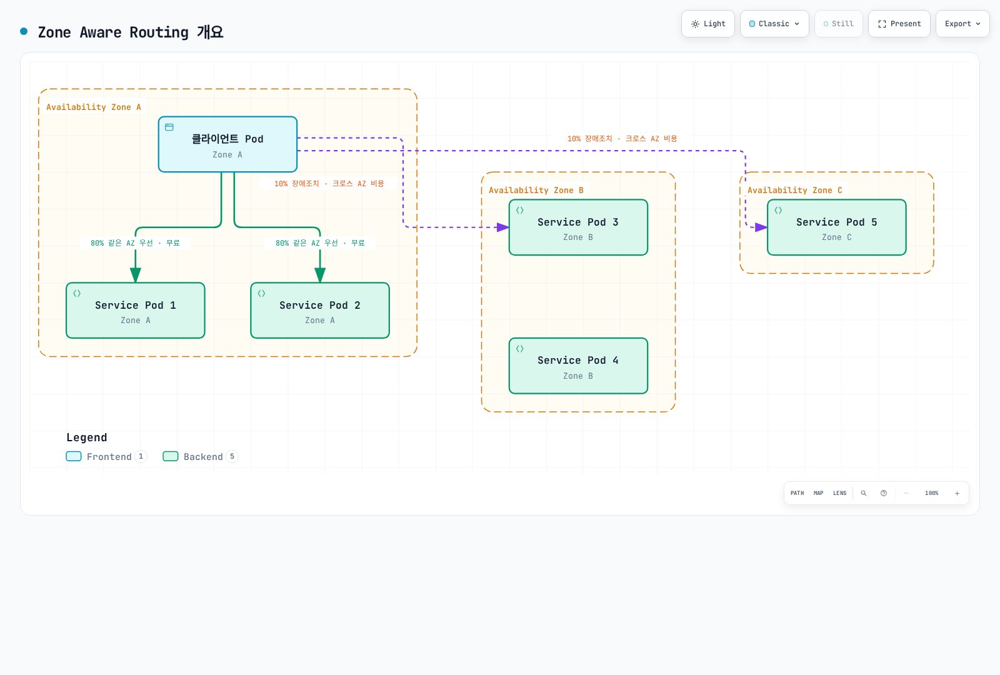
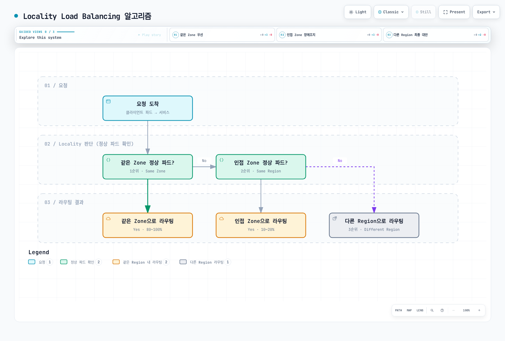
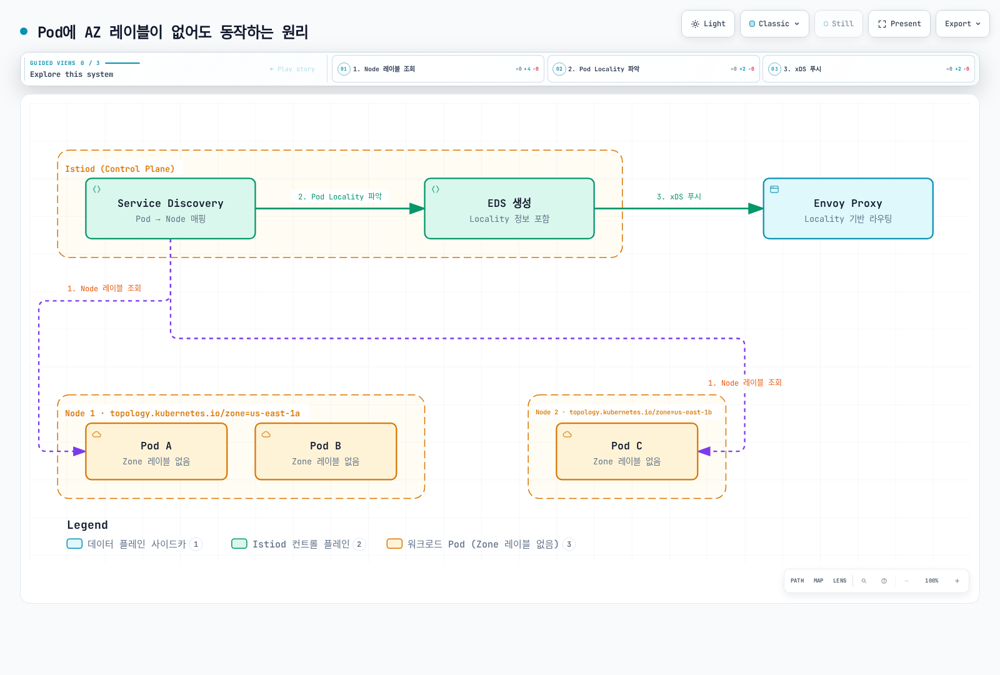

# Zone Aware Routing

Zone Aware Routing은 Kubernetes 가용 영역(Availability Zone)을 인식하여 트래픽을 최적화하는 기능입니다. 같은 AZ 내 통신을 우선하여 지연시간을 줄이고 크로스 AZ 데이터 전송 비용을 절감합니다.

## 목차

1. [개요](#개요)
2. [작동 원리](#작동-원리)
3. [기본 설정](#기본-설정)
4. [고급 설정](#고급-설정)
5. [AWS EKS에서 설정](#aws-eks에서-설정)
6. [실전 예제](#실전-예제)
7. [모니터링](#모니터링)
8. [문제 해결](#문제-해결)

## 개요

Zone Aware Routing은 다음과 같은 이점을 제공합니다:



[🔍 인터랙티브 다이어그램 보기](https://www.atomai.click/kubernetes-docs/archmaps/ko-service-mesh-istio-resilience-03-zone-aware-routing-0.html)

### 이점

1. **지연시간 감소**: 같은 AZ 내 통신으로 네트워크 지연 최소화
2. **비용 절감**: 크로스 AZ 데이터 전송 비용 절감
   - AWS: 크로스 AZ 전송 GB당 $0.01-0.02
3. **가용성 향상**: 장애 시 자동으로 다른 AZ로 장애조치
4. **성능 최적화**: 네트워크 대역폭 최적화

## 작동 원리

### Locality Load Balancing 알고리즘



[🔍 인터랙티브 다이어그램 보기](https://www.atomai.click/kubernetes-docs/archmaps/ko-service-mesh-istio-resilience-03-zone-aware-routing-1.html)

### Locality 계층 구조

Istio는 다음과 같은 계층적 Locality를 사용합니다:

```
Region/Zone/SubZone

예시:
us-east-1/us-east-1a/*
us-east-1/us-east-1b/*
us-west-2/us-west-2a/*
```

**우선순위**:
1. **Same Zone**: 같은 Region, 같은 Zone
2. **Same Region**: 같은 Region, 다른 Zone
3. **Different Region**: 다른 Region

### Pod에 AZ 레이블이 없어도 동작하는 원리

**중요**: Pod 자체에는 AZ 레이블이 필요하지 않습니다. Istio는 **노드의 Topology 레이블**을 읽어서 Pod의 Locality를 자동으로 파악합니다.

#### 동작 방식



[🔍 인터랙티브 다이어그램 보기](https://www.atomai.click/kubernetes-docs/archmaps/ko-service-mesh-istio-resilience-03-zone-aware-routing-2.html)

#### 단계별 프로세스

**1단계: Istiod가 Pod 정보 수집**

```bash
# Istiod는 Kubernetes API를 통해 Pod 정보 조회
kubectl get pod <pod-name> -o json | jq '.spec.nodeName'
# 출력: "ip-10-0-1-10.ec2.internal"
```

**2단계: Pod가 실행 중인 Node의 Topology 레이블 조회**

```bash
# Pod의 nodeName으로 Node 정보 조회
kubectl get node ip-10-0-1-10.ec2.internal -o json | \
  jq '.metadata.labels."topology.kubernetes.io/zone"'
# 출력: "us-east-1a"
```

**3단계: EDS (Endpoint Discovery Service) 생성**

Istiod는 Pod IP와 함께 Locality 정보를 EDS로 생성합니다:

```json
{
  "cluster_name": "outbound|8080||myapp.default.svc.cluster.local",
  "endpoints": [
    {
      "locality": {
        "region": "us-east-1",
        "zone": "us-east-1a"
      },
      "lb_endpoints": [
        {
          "endpoint": {
            "address": {
              "socket_address": {
                "address": "10.0.1.10",
                "port_value": 8080
              }
            }
          }
        }
      ]
    },
    {
      "locality": {
        "region": "us-east-1",
        "zone": "us-east-1b"
      },
      "lb_endpoints": [
        {
          "endpoint": {
            "address": {
              "socket_address": {
                "address": "10.0.2.20",
                "port_value": 8080
              }
            }
          }
        }
      ]
    }
  ]
}
```

**4단계: Envoy가 Locality 기반 라우팅**

Envoy는 받은 EDS 정보를 바탕으로 자신의 Locality와 비교하여 라우팅:

```bash
# Envoy의 Locality 확인 (자신이 실행 중인 노드 기준)
kubectl exec <pod-name> -c istio-proxy -- \
  curl -s localhost:15000/config_dump | \
  jq '.configs[] | select(.["@type"] | contains("BootstrapConfigDump")) | .bootstrap.node.locality'

# 출력:
# {
#   "region": "us-east-1",
#   "zone": "us-east-1a"
# }
```

#### 실제 확인 방법

```bash
# 1. Pod가 어느 Node에서 실행 중인지 확인
kubectl get pod <pod-name> -o wide
# NAME        READY   STATUS    NODE
# myapp-abc   2/2     Running   ip-10-0-1-10.ec2.internal

# 2. 해당 Node의 Zone 레이블 확인
kubectl get node ip-10-0-1-10.ec2.internal \
  -o jsonpath='{.metadata.labels.topology\.kubernetes\.io/zone}'
# 출력: us-east-1a

# 3. Envoy가 인식한 Endpoint Locality 확인
istioctl proxy-config endpoints <pod-name> | grep myapp
# ENDPOINT          STATUS    OUTLIER CHECK     CLUSTER                    LOCALITY
# 10.0.1.10:8080    HEALTHY   OK                myapp.default              us-east-1/us-east-1a
# 10.0.2.20:8080    HEALTHY   OK                myapp.default              us-east-1/us-east-1b
```

#### 왜 Pod 레이블이 필요 없는가?

**전통적인 접근 (불필요)**:
```yaml
# ❌ 필요 없음
apiVersion: v1
kind: Pod
metadata:
  labels:
    topology.kubernetes.io/zone: us-east-1a  # 불필요!
```

**Istio 접근 (자동)**:
```yaml
# ✅ Node 레이블만 필요
apiVersion: v1
kind: Node
metadata:
  name: ip-10-0-1-10.ec2.internal
  labels:
    topology.kubernetes.io/zone: us-east-1a  # 이것만 있으면 됨!
    topology.kubernetes.io/region: us-east-1
```

**이유**:
1. **Pod는 이동하지 않음**: Pod가 생성된 후 다른 노드로 이동하지 않음
2. **Node가 진실의 원천**: Pod의 물리적 위치는 항상 Node가 결정
3. **중복 제거**: Pod마다 레이블을 추가할 필요 없이 Node 레이블만 관리
4. **자동 동기화**: Istiod가 항상 최신 Node 정보를 Kubernetes API에서 조회

#### AWS EKS의 자동 설정

AWS EKS는 노드 생성 시 자동으로 Topology 레이블을 추가합니다:

```bash
# EKS 노드 확인
kubectl get nodes -L topology.kubernetes.io/zone,topology.kubernetes.io/region

# 출력 예시:
# NAME                           ZONE         REGION
# ip-10-0-1-10.ec2.internal      us-east-1a   us-east-1
# ip-10-0-2-20.ec2.internal      us-east-1b   us-east-1
# ip-10-0-3-30.ec2.internal      us-east-1c   us-east-1
```

이러한 레이블은 다음 소스에서 자동으로 가져옵니다:
- **EC2 Instance Metadata**: `http://169.254.169.254/latest/meta-data/placement/availability-zone`
- **AWS API**: Node의 `spec.providerID`를 통해 EC2 정보 조회

## 기본 설정

### 1. Kubernetes 노드에 Topology 레이블 설정

AWS EKS는 자동으로 다음 레이블을 추가합니다:

```yaml
topology.kubernetes.io/region: us-east-1
topology.kubernetes.io/zone: us-east-1a
```

**확인 방법**:
```bash
kubectl get nodes -L topology.kubernetes.io/zone -L topology.kubernetes.io/region

# 출력 예시:
# NAME                          ZONE         REGION
# ip-10-0-1-10.ec2.internal     us-east-1a   us-east-1
# ip-10-0-2-20.ec2.internal     us-east-1b   us-east-1
# ip-10-0-3-30.ec2.internal     us-east-1c   us-east-1
```

### 2. DestinationRule에서 Zone Aware Routing 활성화

```yaml
apiVersion: networking.istio.io/v1
kind: DestinationRule
metadata:
  name: myapp
  namespace: default
spec:
  host: myapp
  trafficPolicy:
    loadBalancer:
      localityLbSetting:
        enabled: true  # Zone Aware Routing 활성화
```

### 3. 분산 비율 설정

```yaml
apiVersion: networking.istio.io/v1
kind: DestinationRule
metadata:
  name: myapp
  namespace: default
spec:
  host: myapp
  trafficPolicy:
    loadBalancer:
      localityLbSetting:
        enabled: true
        distribute:
        # us-east-1a에서 시작한 트래픽
        - from: us-east-1/us-east-1a/*
          to:
            "us-east-1/us-east-1a/*": 80   # 같은 AZ 80%
            "us-east-1/us-east-1b/*": 10   # 인접 AZ 10%
            "us-east-1/us-east-1c/*": 10   # 인접 AZ 10%
        
        # us-east-1b에서 시작한 트래픽
        - from: us-east-1/us-east-1b/*
          to:
            "us-east-1/us-east-1b/*": 80
            "us-east-1/us-east-1a/*": 10
            "us-east-1/us-east-1c/*": 10
        
        # us-east-1c에서 시작한 트래픽
        - from: us-east-1/us-east-1c/*
          to:
            "us-east-1/us-east-1c/*": 80
            "us-east-1/us-east-1a/*": 10
            "us-east-1/us-east-1b/*": 10
```

## 고급 설정

### 장애조치 설정

```yaml
apiVersion: networking.istio.io/v1
kind: DestinationRule
metadata:
  name: myapp-failover
  namespace: default
spec:
  host: myapp
  trafficPolicy:
    loadBalancer:
      localityLbSetting:
        enabled: true
        failover:
        # us-east-1a 장애 시 us-east-1b로
        - from: us-east-1/us-east-1a
          to: us-east-1/us-east-1b
        
        # us-east-1b 장애 시 us-east-1c로
        - from: us-east-1/us-east-1b
          to: us-east-1/us-east-1c
        
        # us-east-1c 장애 시 us-east-1a로
        - from: us-east-1/us-east-1c
          to: us-east-1/us-east-1a
```

### Outlier Detection과 함께 사용

```yaml
apiVersion: networking.istio.io/v1
kind: DestinationRule
metadata:
  name: myapp-resilient
  namespace: default
spec:
  host: myapp
  trafficPolicy:
    # Zone Aware Routing
    loadBalancer:
      localityLbSetting:
        enabled: true
        distribute:
        - from: us-east-1/us-east-1a/*
          to:
            "us-east-1/us-east-1a/*": 80
            "us-east-1/us-east-1b/*": 20
    
    # Outlier Detection
    outlierDetection:
      consecutiveErrors: 5
      interval: 30s
      baseEjectionTime: 30s
      maxEjectionPercent: 50
      
      # Zone별로 최소 정상 인스턴스 유지
      minHealthPercent: 50
```

### 다중 리전 설정

```yaml
apiVersion: networking.istio.io/v1
kind: DestinationRule
metadata:
  name: myapp-multi-region
  namespace: default
spec:
  host: myapp.global
  trafficPolicy:
    loadBalancer:
      localityLbSetting:
        enabled: true
        
        # 리전 간 분산
        distribute:
        # us-east-1에서 시작한 트래픽
        - from: us-east-1/*/*
          to:
            "us-east-1/*/*": 90      # 같은 리전 90%
            "us-west-2/*/*": 10      # 다른 리전 10%
        
        # us-west-2에서 시작한 트래픽
        - from: us-west-2/*/*
          to:
            "us-west-2/*/*": 90
            "us-east-1/*/*": 10
        
        # 리전 장애조치
        failover:
        - from: us-east-1
          to: us-west-2
        - from: us-west-2
          to: us-east-1
```

## AWS EKS에서 설정

### 1. 다중 AZ 노드 그룹 생성

```yaml
# eksctl 설정
apiVersion: eksctl.io/v1alpha5
kind: ClusterConfig

metadata:
  name: my-cluster
  region: us-east-1

nodeGroups:
  - name: ng-zone-a
    instanceType: t3.medium
    desiredCapacity: 2
    availabilityZones:
      - us-east-1a
    labels:
      zone: us-east-1a
  
  - name: ng-zone-b
    instanceType: t3.medium
    desiredCapacity: 2
    availabilityZones:
      - us-east-1b
    labels:
      zone: us-east-1b
  
  - name: ng-zone-c
    instanceType: t3.medium
    desiredCapacity: 2
    availabilityZones:
      - us-east-1c
    labels:
      zone: us-east-1c
```

### 2. Zone별로 파드 분산

```yaml
apiVersion: apps/v1
kind: Deployment
metadata:
  name: myapp
spec:
  replicas: 9
  selector:
    matchLabels:
      app: myapp
  template:
    metadata:
      labels:
        app: myapp
    spec:
      # Zone 간 균등 분산
      topologySpreadConstraints:
      - maxSkew: 1
        topologyKey: topology.kubernetes.io/zone
        whenUnsatisfiable: DoNotSchedule
        labelSelector:
          matchLabels:
            app: myapp
      
      containers:
      - name: myapp
        image: myapp:latest
        ports:
        - containerPort: 8080
        resources:
          requests:
            memory: "64Mi"
            cpu: "100m"
          limits:
            memory: "128Mi"
            cpu: "200m"
```

### 3. Istio에서 Zone Aware Routing 활성화

```yaml
apiVersion: networking.istio.io/v1
kind: DestinationRule
metadata:
  name: myapp
spec:
  host: myapp
  trafficPolicy:
    loadBalancer:
      localityLbSetting:
        enabled: true
        distribute:
        - from: us-east-1/us-east-1a/*
          to:
            "us-east-1/us-east-1a/*": 80
            "us-east-1/us-east-1b/*": 10
            "us-east-1/us-east-1c/*": 10
```

## 실전 예제

### 예제 1: 마이크로서비스 체인

```yaml
# Frontend → Backend → Database

# Frontend (모든 AZ)
apiVersion: apps/v1
kind: Deployment
metadata:
  name: frontend
spec:
  replicas: 6
  template:
    spec:
      topologySpreadConstraints:
      - maxSkew: 1
        topologyKey: topology.kubernetes.io/zone
        whenUnsatisfiable: DoNotSchedule
        labelSelector:
          matchLabels:
            app: frontend
---
# Backend (모든 AZ)
apiVersion: apps/v1
kind: Deployment
metadata:
  name: backend
spec:
  replicas: 9
  template:
    spec:
      topologySpreadConstraints:
      - maxSkew: 1
        topologyKey: topology.kubernetes.io/zone
        whenUnsatisfiable: DoNotSchedule
        labelSelector:
          matchLabels:
            app: backend
---
# Database (단일 AZ - StatefulSet)
apiVersion: apps/v1
kind: StatefulSet
metadata:
  name: database
spec:
  replicas: 1
  template:
    spec:
      affinity:
        nodeAffinity:
          requiredDuringSchedulingIgnoredDuringExecution:
            nodeSelectorTerms:
            - matchExpressions:
              - key: topology.kubernetes.io/zone
                operator: In
                values:
                - us-east-1a
---
# Zone Aware Routing 설정
apiVersion: networking.istio.io/v1
kind: DestinationRule
metadata:
  name: backend
spec:
  host: backend
  trafficPolicy:
    loadBalancer:
      localityLbSetting:
        enabled: true
        distribute:
        - from: us-east-1/us-east-1a/*
          to:
            "us-east-1/us-east-1a/*": 90
            "us-east-1/us-east-1b/*": 5
            "us-east-1/us-east-1c/*": 5
```

### 예제 2: 비용 최적화

```yaml
# 크로스 AZ 비용 최소화
apiVersion: networking.istio.io/v1
kind: DestinationRule
metadata:
  name: cost-optimized
spec:
  host: myapp
  trafficPolicy:
    loadBalancer:
      localityLbSetting:
        enabled: true
        distribute:
        # 같은 AZ에 95% 집중
        - from: us-east-1/us-east-1a/*
          to:
            "us-east-1/us-east-1a/*": 95
            "us-east-1/us-east-1b/*": 3
            "us-east-1/us-east-1c/*": 2
```

### 예제 3: 고가용성

```yaml
# 가용성 우선 (크로스 AZ 허용)
apiVersion: networking.istio.io/v1
kind: DestinationRule
metadata:
  name: high-availability
spec:
  host: myapp
  trafficPolicy:
    loadBalancer:
      localityLbSetting:
        enabled: true
        distribute:
        # 모든 AZ에 균등 분산
        - from: us-east-1/us-east-1a/*
          to:
            "us-east-1/us-east-1a/*": 34
            "us-east-1/us-east-1b/*": 33
            "us-east-1/us-east-1c/*": 33
        
        # 장애조치 설정
        failover:
        - from: us-east-1/us-east-1a
          to: us-east-1/us-east-1b
```

## 모니터링

### Prometheus 메트릭

```promql
# Zone 간 트래픽 분포
sum(rate(istio_requests_total[5m])) by (source_zone, destination_zone)

# 같은 Zone 내 트래픽 비율
(
  sum(rate(istio_requests_total{source_zone=destination_zone}[5m]))
  /
  sum(rate(istio_requests_total[5m]))
) * 100

# Zone별 에러율
sum(rate(istio_requests_total{response_code=~"5.."}[5m])) by (destination_zone)
/
sum(rate(istio_requests_total[5m])) by (destination_zone)

# Locality 정보 확인
envoy_cluster_upstream_cx_active{envoy_cluster_name=~".*myapp.*"}
```

### Grafana 대시보드

```json
{
  "dashboard": {
    "title": "Istio Zone Aware Routing",
    "panels": [
      {
        "title": "Traffic Distribution by Zone",
        "targets": [
          {
            "expr": "sum(rate(istio_requests_total[5m])) by (source_zone, destination_zone)",
            "legendFormat": "{{source_zone}} → {{destination_zone}}"
          }
        ]
      },
      {
        "title": "Same Zone Traffic Percentage",
        "targets": [
          {
            "expr": "(sum(rate(istio_requests_total{source_zone=destination_zone}[5m])) / sum(rate(istio_requests_total[5m]))) * 100",
            "legendFormat": "Same Zone %"
          }
        ]
      }
    ]
  }
}
```

### 실시간 확인

```bash
# Envoy 엔드포인트 확인
istioctl proxy-config endpoints <pod-name> -n <namespace>

# Locality 정보 확인
kubectl exec -n <namespace> <pod-name> -c istio-proxy -- \
  curl localhost:15000/clusters | grep myapp

# 예시 출력:
# myapp.default.svc.cluster.local::10.0.1.10:8080::region::us-east-1::zone::us-east-1a::
# myapp.default.svc.cluster.local::10.0.2.20:8080::region::us-east-1::zone::us-east-1b::
```

## 문제 해결

### Zone Aware Routing이 작동하지 않음

```bash
# 1. 노드 Topology 레이블 확인
kubectl get nodes -L topology.kubernetes.io/zone -L topology.kubernetes.io/region

# 레이블이 없으면 수동 추가:
kubectl label nodes <node-name> topology.kubernetes.io/zone=us-east-1a
kubectl label nodes <node-name> topology.kubernetes.io/region=us-east-1

# 2. DestinationRule 확인
kubectl get destinationrule -n <namespace>
kubectl describe destinationrule <name> -n <namespace>

# 3. Envoy 구성 확인
istioctl proxy-config clusters <pod-name> -n <namespace> -o json | \
  jq '.[] | select(.name | contains("myapp")) | .loadAssignment.endpoints[].locality'

# 4. 파드 Zone 분포 확인
kubectl get pods -n <namespace> -o wide \
  -L topology.kubernetes.io/zone
```

### 트래픽이 다른 Zone으로 가는 비율이 높음

```bash
# 원인 분석:
# 1. Zone별 파드 개수 불균형
kubectl get pods -n <namespace> -o wide | \
  awk '{print $7}' | sort | uniq -c

# 2. 일부 파드가 Unhealthy
kubectl get pods -n <namespace> -o wide | \
  grep -v "Running"

# 3. Outlier Detection으로 제외된 파드
kubectl exec -n <namespace> <pod-name> -c istio-proxy -- \
  curl localhost:15000/stats/prometheus | grep outlier_detection
```

### EKS에서 Topology 레이블 누락

```bash
# AWS Node Termination Handler 설치로 해결
kubectl apply -f https://github.com/aws/aws-node-termination-handler/releases/download/v1.19.0/all-resources.yaml

# 또는 수동으로 레이블 추가
for node in $(kubectl get nodes -o name); do
  ZONE=$(kubectl get $node -o jsonpath='{.metadata.labels.topology\.kubernetes\.io/zone}')
  if [ -z "$ZONE" ]; then
    # AWS EC2 메타데이터에서 AZ 가져오기
    ZONE=$(kubectl get $node -o jsonpath='{.spec.providerID}' | \
      xargs -I {} aws ec2 describe-instances --instance-ids {} --query 'Reservations[0].Instances[0].Placement.AvailabilityZone' --output text)
    kubectl label $node topology.kubernetes.io/zone=$ZONE
  fi
done
```

## 모범 사례

### 1. Zone별 균등 파드 배포

```yaml
# ✅ topologySpreadConstraints 사용
topologySpreadConstraints:
- maxSkew: 1
  topologyKey: topology.kubernetes.io/zone
  whenUnsatisfiable: DoNotSchedule
```

### 2. 비용 최적화

```yaml
# ✅ 같은 Zone 우선 (80% 이상)
distribute:
- from: us-east-1/us-east-1a/*
  to:
    "us-east-1/us-east-1a/*": 80
    "us-east-1/us-east-1b/*": 10
    "us-east-1/us-east-1c/*": 10
```

### 3. 고가용성 보장

```yaml
# ✅ 장애조치 설정 필수
failover:
- from: us-east-1/us-east-1a
  to: us-east-1/us-east-1b
```

### 4. StatefulSet은 단일 AZ 권장

```yaml
# ✅ StatefulSet (Database 등)은 단일 AZ에 배포
affinity:
  nodeAffinity:
    requiredDuringSchedulingIgnoredDuringExecution:
      nodeSelectorTerms:
      - matchExpressions:
        - key: topology.kubernetes.io/zone
          operator: In
          values:
          - us-east-1a
```

## 참고 자료

- [Istio Locality Load Balancing](https://istio.io/latest/docs/tasks/traffic-management/locality-load-balancing/)
- [Kubernetes Topology Aware Hints](https://kubernetes.io/docs/concepts/services-networking/topology-aware-hints/)
- [AWS EKS Multi-AZ](https://docs.aws.amazon.com/eks/latest/userguide/disaster-recovery-resiliency.html)
