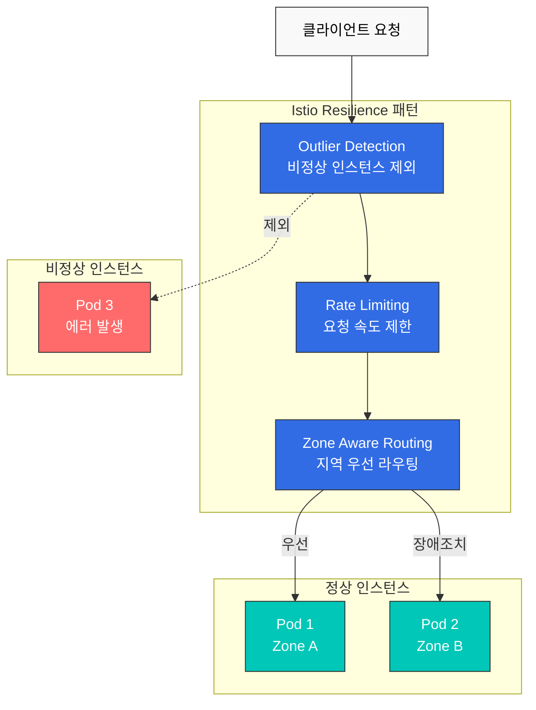
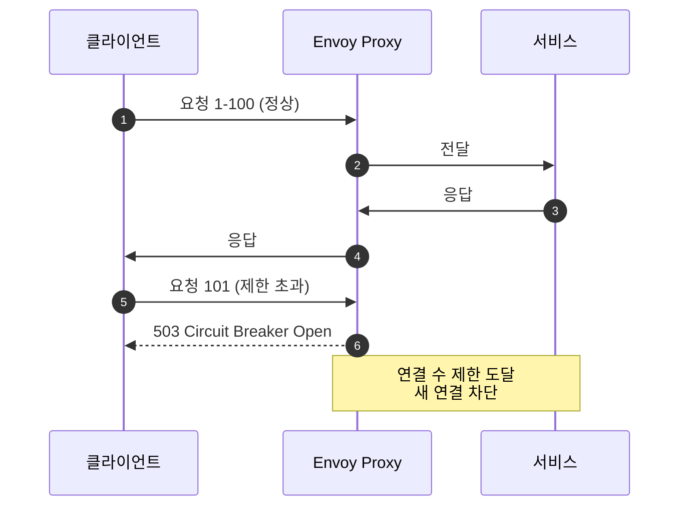
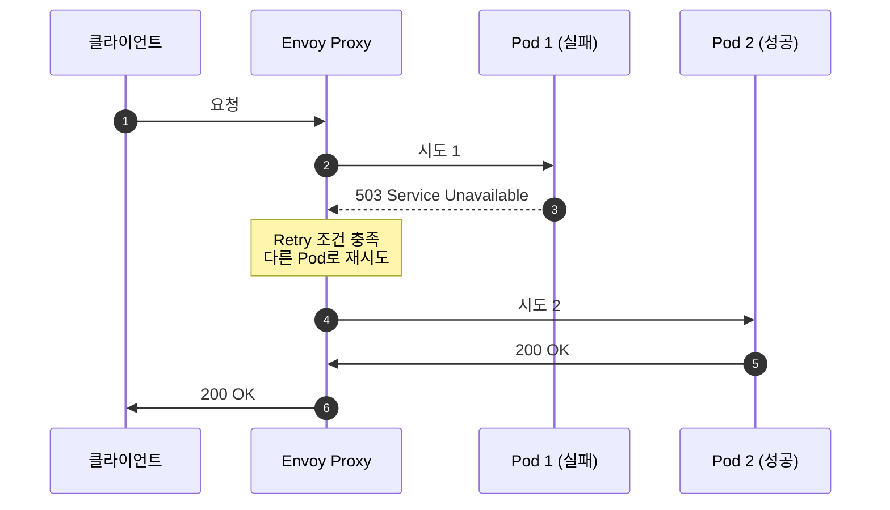
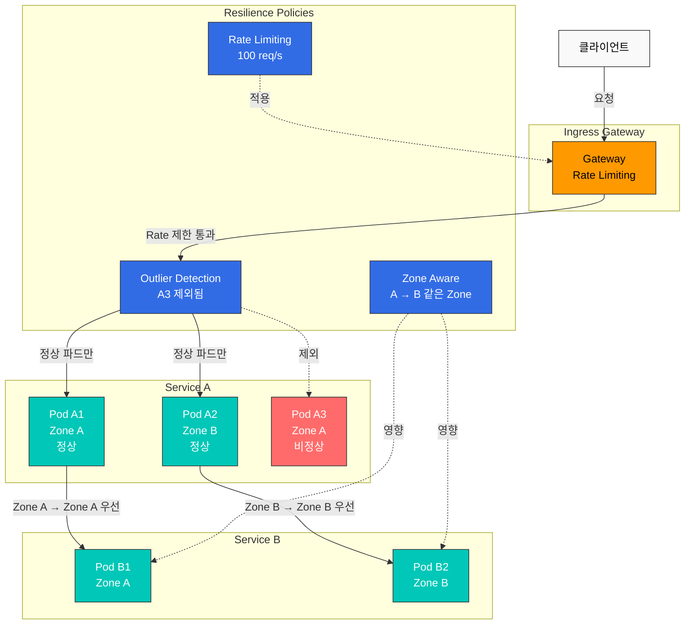

# Resilience

Istio의 복원력(Resilience) 기능은 서비스 메시가 장애 상황에서도 안정적으로 동작하도록 보장합니다.

## 목차

1. [Outlier Detection](01-outlier-detection.md)
2. [Rate Limiting](02-rate-limiting.md)
3. [Zone Aware Routing](03-zone-aware-routing.md)

### 추가 복원력 패턴

이 문서에서는 다음 패턴들도 다룹니다:
- **Circuit Breaker**: Connection Pool을 통한 회로 차단
- **Retry**: 재시도 정책
- **Timeout**: 요청 시간 제한
- **Fault Injection**: 장애 주입 테스트

## 개요

복원력은 분산 시스템에서 매우 중요한 특성입니다. Istio는 다양한 복원력 패턴을 자동으로 구현할 수 있습니다.

### 핵심 복원력 패턴



### 1. Outlier Detection (이상 감지)

비정상 동작을 하는 서비스 인스턴스를 자동으로 감지하고 트래픽 풀에서 제외합니다.

```yaml
apiVersion: networking.istio.io/v1
kind: DestinationRule
metadata:
  name: myapp
spec:
  host: myapp
  trafficPolicy:
    outlierDetection:
      consecutiveErrors: 5
      interval: 30s
      baseEjectionTime: 30s
      maxEjectionPercent: 50
```

**주요 기능**:
- 연속된 오류 감지
- 자동 제외 및 복구
- Circuit Breaker와 함께 작동

### 2. Rate Limiting (요청 속도 제한)

서비스를 과부하로부터 보호하기 위해 요청 속도를 제한합니다.

```yaml
apiVersion: networking.istio.io/v1
kind: EnvoyFilter
metadata:
  name: ratelimit
spec:
  configPatches:
  - applyTo: HTTP_FILTER
    match:
      context: SIDECAR_INBOUND
    patch:
      operation: INSERT_BEFORE
      value:
        name: envoy.filters.http.local_ratelimit
        typed_config:
          "@type": type.googleapis.com/envoy.extensions.filters.http.local_ratelimit.v3.LocalRateLimit
          stat_prefix: http_local_rate_limiter
          token_bucket:
            max_tokens: 100
            tokens_per_fill: 10
            fill_interval: 1s
```

**주요 기능**:
- Token Bucket 알고리즘
- 로컬 및 글로벌 Rate Limiting
- 클라이언트별, 경로별 제한

### 3. Zone Aware Routing (지역 인식 라우팅)

가용 영역(Availability Zone) 간 트래픽을 최적화하여 지연시간을 줄이고 비용을 절감합니다.

```yaml
apiVersion: networking.istio.io/v1
kind: DestinationRule
metadata:
  name: myapp
spec:
  host: myapp
  trafficPolicy:
    loadBalancer:
      localityLbSetting:
        enabled: true
        distribute:
        - from: us-east-1a/*
          to:
            "us-east-1a/*": 80
            "us-east-1b/*": 20
```

**주요 기능**:
- 같은 AZ 내 트래픽 우선
- 크로스 AZ 비용 절감
- 장애 시 자동 장애조치

### 4. Circuit Breaker (회로 차단기)

서비스 과부하를 방지하기 위해 연결 수와 요청 수를 제한합니다.

```yaml
apiVersion: networking.istio.io/v1
kind: DestinationRule
metadata:
  name: circuit-breaker
spec:
  host: myapp
  trafficPolicy:
    connectionPool:
      tcp:
        maxConnections: 100              # 최대 TCP 연결 수
      http:
        http1MaxPendingRequests: 10      # 대기 중인 최대 요청 수
        http2MaxRequests: 100            # HTTP/2 최대 요청 수
        maxRequestsPerConnection: 2       # 연결당 최대 요청 수
    outlierDetection:
      consecutiveErrors: 5
      interval: 30s
      baseEjectionTime: 30s
```

**작동 방식**:


**주요 기능**:
- TCP 연결 수 제한
- HTTP 요청 수 제한
- Pending 요청 제한
- Overflow 시 즉시 실패 (Fail Fast)

### 5. Retry (재시도)

일시적인 장애에 대해 자동으로 요청을 재시도합니다.

```yaml
apiVersion: networking.istio.io/v1
kind: VirtualService
metadata:
  name: myapp
spec:
  hosts:
  - myapp
  http:
  - route:
    - destination:
        host: myapp
    retries:
      attempts: 3                        # 최대 3회 재시도
      perTryTimeout: 2s                  # 각 시도당 타임아웃
      retryOn: 5xx,reset,connect-failure,refused-stream  # 재시도 조건
    timeout: 10s                         # 전체 요청 타임아웃
```

**재시도 조건** (`retryOn`):
- `5xx`: 서버 오류 (500, 502, 503, 504)
- `reset`: TCP 연결 리셋
- `connect-failure`: 연결 실패
- `refused-stream`: HTTP/2 스트림 거부
- `retriable-4xx`: 재시도 가능한 4xx (예: 409)
- `gateway-error`: Gateway 오류 (502, 503, 504)

**Exponential Backoff** (지수 백오프):
```yaml
retries:
  attempts: 5
  perTryTimeout: 2s
  retryOn: 5xx
  retryRemoteLocalities: true            # 다른 지역으로 재시도
```

**작동 방식**:


### 6. Timeout (타임아웃)

요청이 무한정 대기하지 않도록 시간 제한을 설정합니다.

```yaml
apiVersion: networking.istio.io/v1
kind: VirtualService
metadata:
  name: myapp
spec:
  hosts:
  - myapp
  http:
  - route:
    - destination:
        host: myapp
    timeout: 5s                          # 요청 타임아웃
    retries:
      attempts: 3
      perTryTimeout: 2s                  # 각 재시도 타임아웃
```

**타임아웃 계층**:
```yaml
# Gateway 레벨 타임아웃
apiVersion: networking.istio.io/v1
kind: VirtualService
metadata:
  name: gateway-timeout
spec:
  gateways:
  - my-gateway
  hosts:
  - example.com
  http:
  - route:
    - destination:
        host: frontend
    timeout: 30s                         # Gateway → Frontend: 30초

---
# Service 레벨 타임아웃
apiVersion: networking.istio.io/v1
kind: VirtualService
metadata:
  name: service-timeout
spec:
  hosts:
  - backend
  http:
  - route:
    - destination:
        host: backend
    timeout: 5s                          # Frontend → Backend: 5초
```

**권장 설정**:
- Gateway → Frontend: 30-60초 (사용자 대면)
- Service → Service: 5-10초 (내부 통신)
- Database 쿼리: 2-5초
- 외부 API: 10-30초

### 7. Fault Injection (장애 주입)

카오스 엔지니어링을 위해 의도적으로 장애를 주입합니다.

```yaml
apiVersion: networking.istio.io/v1
kind: VirtualService
metadata:
  name: fault-injection
spec:
  hosts:
  - myapp
  http:
  - fault:
      # 지연 주입
      delay:
        percentage:
          value: 10.0                    # 10% 요청에 지연 발생
        fixedDelay: 5s                   # 5초 지연

      # 오류 주입
      abort:
        percentage:
          value: 5.0                     # 5% 요청에 오류 발생
        httpStatus: 503                  # 503 에러 반환

    route:
    - destination:
        host: myapp
```

**사용 시나리오**:

1. **네트워크 지연 시뮬레이션**:
```yaml
fault:
  delay:
    percentage:
      value: 100.0
    fixedDelay: 7s
```

2. **간헐적 장애 테스트**:
```yaml
fault:
  abort:
    percentage:
      value: 20.0                        # 20% 실패율
    httpStatus: 500
```

3. **특정 사용자에게만 장애 주입**:
```yaml
apiVersion: networking.istio.io/v1
kind: VirtualService
metadata:
  name: fault-injection-user
spec:
  hosts:
  - myapp
  http:
  - match:
    - headers:
        end-user:
          exact: test-user               # test-user에게만 적용
    fault:
      abort:
        percentage:
          value: 100.0
        httpStatus: 503
    route:
    - destination:
        host: myapp
```

## 복원력 패턴 조합

### Outlier Detection + Circuit Breaker

```yaml
apiVersion: networking.istio.io/v1
kind: DestinationRule
metadata:
  name: myapp-resilient
spec:
  host: myapp
  trafficPolicy:
    # Connection Pool (Circuit Breaker)
    connectionPool:
      tcp:
        maxConnections: 100
      http:
        http1MaxPendingRequests: 50
        maxRequestsPerConnection: 2

    # Outlier Detection
    outlierDetection:
      consecutiveErrors: 5
      interval: 30s
      baseEjectionTime: 30s
      maxEjectionPercent: 50
      minHealthPercent: 50
```

### Rate Limiting + Retry

```yaml
apiVersion: networking.istio.io/v1
kind: VirtualService
metadata:
  name: myapp
spec:
  hosts:
  - myapp
  http:
  - route:
    - destination:
        host: myapp
    retries:
      attempts: 3
      perTryTimeout: 2s
      retryOn: 5xx,reset,connect-failure
    timeout: 10s
---
apiVersion: networking.istio.io/v1
kind: EnvoyFilter
metadata:
  name: ratelimit
spec:
  workloadSelector:
    labels:
      app: myapp
  configPatches:
  - applyTo: HTTP_FILTER
    match:
      context: SIDECAR_INBOUND
    patch:
      operation: INSERT_BEFORE
      value:
        name: envoy.filters.http.local_ratelimit
        typed_config:
          "@type": type.googleapis.com/envoy.extensions.filters.http.local_ratelimit.v3.LocalRateLimit
          stat_prefix: http_local_rate_limiter
          token_bucket:
            max_tokens: 1000
            tokens_per_fill: 100
            fill_interval: 1s
```

## 복원력 아키텍처



## 복원력 메트릭

### Prometheus 쿼리

```promql
# 1. Outlier Detection: 제외된 인스턴스 수
envoy_cluster_outlier_detection_ejections_active

# 2. Rate Limiting: 제한된 요청 수
rate(envoy_http_local_rate_limit_rate_limited[5m])

# 3. Zone Aware: Zone 간 트래픽 비율
sum(rate(istio_requests_total[5m])) by (source_zone, destination_zone)

# 4. Circuit Breaker: 열린 회로 수
envoy_cluster_circuit_breakers_default_rq_open

# 5. Circuit Breaker: Overflow로 거부된 요청
envoy_cluster_circuit_breakers_default_rq_overflow

# 6. Retry: 재시도된 요청 수
sum(rate(envoy_cluster_upstream_rq_retry[5m]))

# 7. Retry: 재시도 성공률
sum(rate(envoy_cluster_upstream_rq_retry_success[5m])) /
sum(rate(envoy_cluster_upstream_rq_retry[5m])) * 100

# 8. Timeout: 타임아웃 발생 수
sum(rate(envoy_cluster_upstream_rq_timeout[5m]))

# 9. 전체 요청 성공률
sum(rate(istio_requests_total{response_code!~"5.."}[5m])) /
sum(rate(istio_requests_total[5m])) * 100
```

### Grafana 대시보드 패널

**Circuit Breaker 상태**:
```promql
# 활성 연결 수 vs 최대 연결 수
envoy_cluster_upstream_cx_active /
envoy_cluster_circuit_breakers_default_cx_max * 100
```

**Retry 효과**:
```promql
# Retry가 없었다면의 에러율
sum(rate(envoy_cluster_upstream_rq_xx{envoy_response_code_class="5"}[5m])) /
sum(rate(envoy_cluster_upstream_rq_xx[5m])) * 100

# Retry 후 실제 에러율
sum(rate(istio_requests_total{response_code=~"5.."}[5m])) /
sum(rate(istio_requests_total[5m])) * 100
```

## 모범 사례

### 1. Outlier Detection 임계값 조정

```yaml
# ✅ 서비스 특성에 맞게 조정
outlierDetection:
  consecutiveErrors: 5          # 5회 연속 실패
  interval: 30s                 # 30초마다 평가
  baseEjectionTime: 30s         # 30초 제외
  maxEjectionPercent: 50        # 최대 50%만 제외
  minHealthPercent: 50          # 최소 50%는 유지
```

### 2. Rate Limiting 단계별 적용

```yaml
# ✅ Gateway → Service 단계별 제한
# Gateway: 전체 트래픽 제한
# Service: 개별 서비스 제한
```

### 3. Zone Aware Routing 우선순위

```yaml
# ✅ 같은 AZ 우선, 다른 AZ는 장애조치용
distribute:
- from: us-east-1a/*
  to:
    "us-east-1a/*": 80    # 같은 AZ 80%
    "us-east-1b/*": 20    # 다른 AZ 20% (장애조치)
```

### 4. Circuit Breaker 설정

```yaml
# ✅ 서비스 용량에 맞게 설정
connectionPool:
  tcp:
    maxConnections: 100              # 파드당 처리 가능한 최대 연결 수
  http:
    http1MaxPendingRequests: 10      # 대기열 크기 (작게 유지)
    http2MaxRequests: 100
    maxRequestsPerConnection: 2       # Keep-alive 제한

# ❌ 너무 큰 값 설정
connectionPool:
  tcp:
    maxConnections: 10000            # 과도하게 큼
  http:
    http1MaxPendingRequests: 1000    # 대기열 너무 김
```

**권장 값**:
- `maxConnections`: 파드 수 × 예상 동시 연결 수 × 1.5
- `http1MaxPendingRequests`: 10-50 (빠른 실패가 중요)
- `maxRequestsPerConnection`: 1-5 (연결 재사용 제한)

### 5. Retry 정책

```yaml
# ✅ 멱등성(Idempotent) 요청만 재시도
retries:
  attempts: 3
  perTryTimeout: 2s
  retryOn: 5xx,reset,connect-failure    # GET 요청

# ❌ POST/PUT 요청에 무분별한 재시도
retries:
  attempts: 5
  retryOn: 5xx                           # 중복 데이터 생성 위험
```

**재시도 가이드라인**:
- **GET, HEAD, OPTIONS**: 안전하게 재시도 가능
- **POST, PUT, PATCH**: 멱등성 보장된 경우만 재시도
- **DELETE**: 멱등성 있으므로 재시도 가능

### 6. Timeout 설정

```yaml
# ✅ 계층별 타임아웃 (상위 > 하위)
# Gateway
timeout: 30s
retries:
  perTryTimeout: 10s

# Service A → Service B
timeout: 10s
retries:
  perTryTimeout: 3s

# ❌ 하위가 상위보다 큰 타임아웃
timeout: 5s
retries:
  perTryTimeout: 10s                     # perTryTimeout > timeout
```

**타임아웃 공식**:
```
전체 timeout >= (perTryTimeout × attempts) + 오버헤드
```

예: `timeout: 10s`, `perTryTimeout: 2s`, `attempts: 3`
- 최소 필요: 2s × 3 = 6s
- 권장: 10s (여유 포함)

### 7. Fault Injection 테스트

```yaml
# ✅ 프로덕션 환경에서는 특정 사용자/헤더로 제한
- match:
  - headers:
      x-chaos-test:
        exact: "true"
  fault:
    delay:
      percentage:
        value: 100.0
      fixedDelay: 5s

# ❌ 프로덕션에 무분별한 장애 주입
fault:
  abort:
    percentage:
      value: 50.0                        # 50% 실패!
    httpStatus: 500
```

**테스트 단계**:
1. **개발 환경**: 100% 장애 주입으로 철저히 테스트
2. **스테이징**: 특정 사용자 그룹에만 적용
3. **프로덕션**: Canary 방식으로 점진적 적용 (1% → 5% → 10%)

## 문제 해결

### Outlier Detection이 작동하지 않음

```bash
# 1. DestinationRule 확인
kubectl get destinationrule -A

# 2. Envoy 클러스터 상태 확인
istioctl proxy-config clusters <pod-name> -n <namespace>

# 3. Outlier Detection 메트릭 확인
kubectl exec -n <namespace> <pod-name> -c istio-proxy -- \
  curl localhost:15000/stats/prometheus | grep outlier
```

### Rate Limiting이 적용되지 않음

```bash
# 1. EnvoyFilter 확인
kubectl get envoyfilter -A

# 2. Envoy 구성 확인
istioctl proxy-config listener <pod-name> -n <namespace> -o json

# 3. Rate Limit 메트릭 확인
kubectl exec -n <namespace> <pod-name> -c istio-proxy -- \
  curl localhost:15000/stats/prometheus | grep rate_limit
```

### Zone Aware Routing이 작동하지 않음

```bash
# 1. DestinationRule 확인
kubectl get destinationrule -A

# 2. 파드 Zone 레이블 확인
kubectl get pods -n <namespace> -o wide \
  -L topology.kubernetes.io/zone

# 3. Locality 정보 확인
istioctl proxy-config endpoints <pod-name> -n <namespace>
```

### Circuit Breaker가 열리지 않음

```bash
# 1. DestinationRule의 connectionPool 설정 확인
kubectl get destinationrule <name> -o yaml

# 2. Circuit Breaker 메트릭 확인
kubectl exec -n <namespace> <pod-name> -c istio-proxy -- \
  curl localhost:15000/stats/prometheus | grep circuit_breakers

# 3. Overflow 발생 확인
kubectl exec -n <namespace> <pod-name> -c istio-proxy -- \
  curl localhost:15000/stats/prometheus | grep overflow

# 4. 활성 연결 수 확인
kubectl exec -n <namespace> <pod-name> -c istio-proxy -- \
  curl localhost:15000/stats/prometheus | grep upstream_cx_active
```

### Retry가 작동하지 않음

```bash
# 1. VirtualService 확인
kubectl get virtualservice <name> -o yaml

# 2. Retry 메트릭 확인
kubectl exec -n <namespace> <pod-name> -c istio-proxy -- \
  curl localhost:15000/stats/prometheus | grep retry

# 3. Envoy 로그에서 재시도 확인
kubectl logs -n <namespace> <pod-name> -c istio-proxy | grep retry

# 4. Retry 조건 확인
istioctl proxy-config routes <pod-name> -n <namespace> -o json | \
  jq '.[] | select(.name | contains("your-service")) | .virtualHosts[].routes[].route.retryPolicy'
```

### Timeout이 적용되지 않음

```bash
# 1. VirtualService timeout 확인
kubectl get virtualservice <name> -o yaml | grep timeout

# 2. Timeout 메트릭 확인
kubectl exec -n <namespace> <pod-name> -c istio-proxy -- \
  curl localhost:15000/stats/prometheus | grep timeout

# 3. 요청 지속 시간 확인
kubectl exec -n <namespace> <pod-name> -c istio-proxy -- \
  curl localhost:15000/stats/prometheus | grep request_duration

# 4. Envoy 라우트 설정 확인
istioctl proxy-config routes <pod-name> -n <namespace> -o json | \
  jq '.[] | .virtualHosts[].routes[].route.timeout'
```

### Fault Injection이 작동하지 않음

```bash
# 1. VirtualService fault 설정 확인
kubectl get virtualservice <name> -o yaml | grep -A 10 fault

# 2. 요청 헤더 확인 (match 조건이 있는 경우)
curl -H "end-user: test-user" http://your-service/api

# 3. Envoy 필터 확인
istioctl proxy-config routes <pod-name> -n <namespace> -o json | \
  jq '.[] | .virtualHosts[].routes[].route.rateLimits'

# 4. Fault 메트릭 확인
kubectl exec -n <namespace> <pod-name> -c istio-proxy -- \
  curl localhost:15000/stats/prometheus | grep fault
```

## 다음 단계

1. **[Outlier Detection](01-outlier-detection.md)**: 비정상 인스턴스 자동 감지
2. **[Rate Limiting](02-rate-limiting.md)**: 요청 속도 제한
3. **[Zone Aware Routing](03-zone-aware-routing.md)**: 지역 인식 라우팅

## 참고 자료

### 공식 문서
- [Istio Resilience](https://istio.io/latest/docs/concepts/traffic-management/#network-resilience-and-testing)
- [Outlier Detection](https://istio.io/latest/docs/reference/config/networking/destination-rule/#OutlierDetection)
- [Circuit Breaking](https://istio.io/latest/docs/tasks/traffic-management/circuit-breaking/)
- [Request Timeouts](https://istio.io/latest/docs/tasks/traffic-management/request-timeouts/)
- [Retries](https://istio.io/latest/docs/concepts/traffic-management/#retries)
- [Rate Limiting](https://istio.io/latest/docs/tasks/policy-enforcement/rate-limit/)
- [Fault Injection](https://istio.io/latest/docs/tasks/traffic-management/fault-injection/)
- [Locality Load Balancing](https://istio.io/latest/docs/tasks/traffic-management/locality-load-balancing/)

### AWS 관련 자료
- [Enhancing Network Resilience with Istio on Amazon EKS](https://aws.amazon.com/blogs/opensource/enhancing-network-resilience-with-istio-on-amazon-eks/)
- [Amazon EKS Best Practices - Service Mesh](https://aws.github.io/aws-eks-best-practices/reliability/docs/networkmanagement/#service-mesh)

### 패턴 및 아키텍처
- [Microservices Patterns - Circuit Breaker](https://microservices.io/patterns/reliability/circuit-breaker.html)
- [Release It! - Stability Patterns](https://pragprog.com/titles/mnee2/release-it-second-edition/)
- [Chaos Engineering Principles](https://principlesofchaos.org/)

## 퀴즈

이 장에서 배운 내용을 테스트하려면 [Istio Resilience 퀴즈](../../../quizzes/service-mesh/istio/resilience.md)를 풀어보세요.
