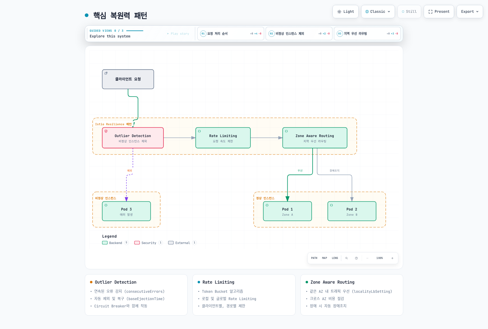
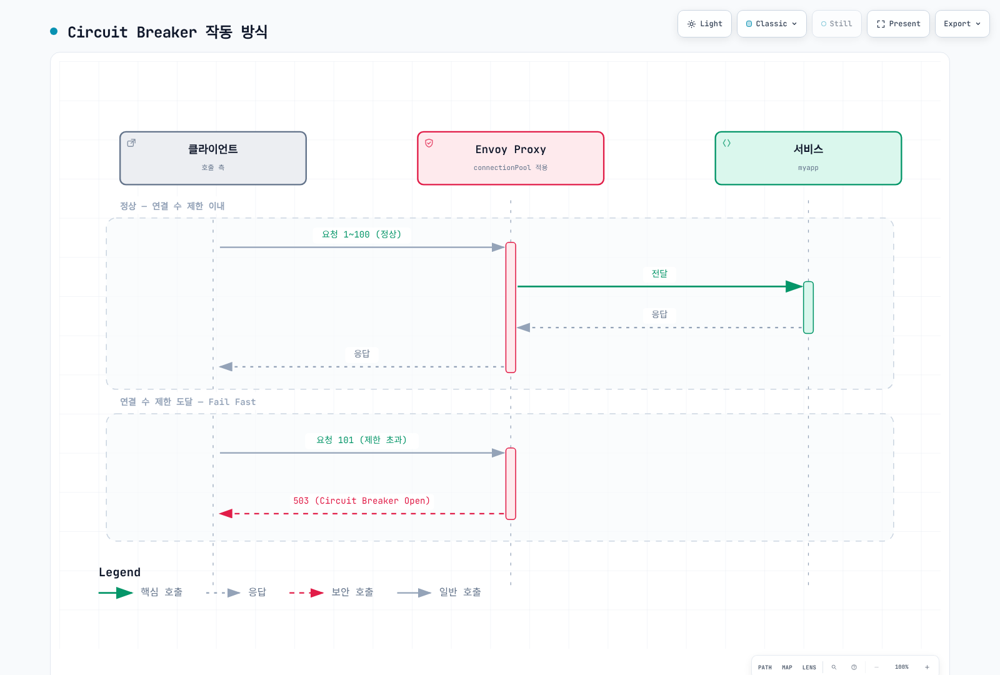
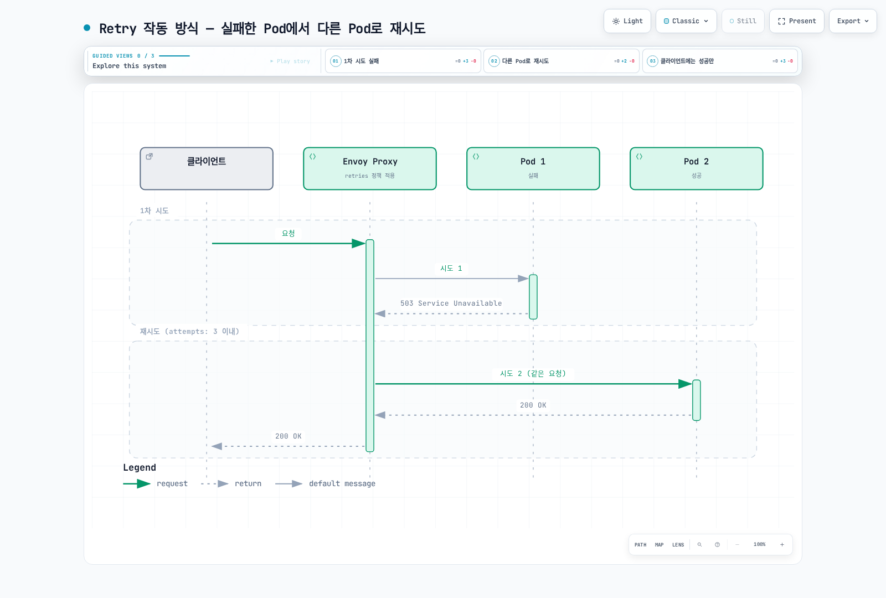
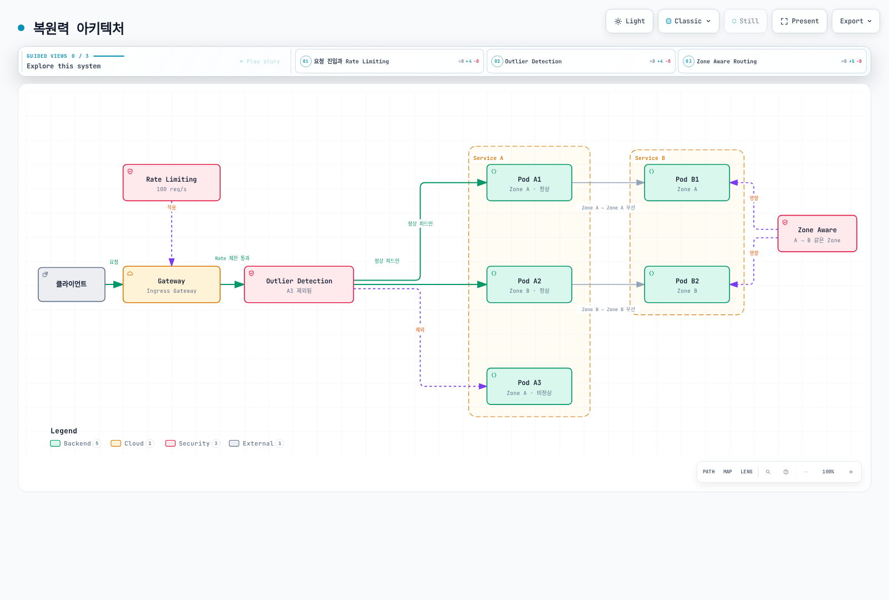

# Resilience

> **마지막 업데이트**: 2026년 9월 11일 · Istio 1.31. `default`의 HTTP `myapp`(8080 포트)을 가정한 독립적인 사이드카 예제입니다. 같은 host 예제를 한꺼번에 적용하지 말고 실제 프록시 설정·용량을 검증합니다. 배포·부하 검증된 예제가 아니며 ambient L7에는 waypoint와 지원되는 정책 연결이 필요합니다.

Istio의 복원력(Resilience) 기능은 애플리케이션 의미·용량에 맞게 설정할 때 장애 영향을 줄이는 데 도움을 줍니다.

## 목차

1. [Outlier Detection](01-outlier-detection.md)
2. [Rate Limiting](02-rate-limiting.md)
3. [Zone Aware Routing](03-zone-aware-routing.md)

### 추가 복원력 패턴

이 문서에서는 다음 패턴들도 다룹니다:

- **Circuit Breaker**: Connection Pool을 통한 회로 차단
- **Retry**: 재시도 정책
- **Timeout**: 요청 시간 제한
- **Fault Injection**: 장애 주입 테스트

## 개요

복원력은 분산 시스템에서 매우 중요한 특성입니다. Istio는 다양한 복원력 패턴을 자동으로 구현할 수 있습니다.

### 핵심 복원력 패턴



[🔍 인터랙티브 다이어그램 보기](https://www.atomai.click/kubernetes-docs/archmaps/ko-service-mesh-istio-resilience-readme-0.html)

그림은 개념 요약이며 고정된 네트워크 서비스 처리 순서가 아닙니다. Outlier detection·locality 선택은 프록시의 부하 분산 결정이고 HTTP rate-limit filter는 선택한 listener/route에 적용됩니다.

### 1. Outlier Detection (이상 감지)

비정상 동작을 하는 서비스 인스턴스를 자동으로 감지하고 트래픽 풀에서 제외합니다.

```yaml
apiVersion: networking.istio.io/v1
kind: DestinationRule
metadata:
  name: myapp
  namespace: default
spec:
  host: myapp
  trafficPolicy:
    outlierDetection:
      consecutive5xxErrors: 5
      interval: 30s
      baseEjectionTime: 30s
      maxEjectionPercent: 50
```

**주요 기능**:
- 연속된 오류 감지
- 일시적 제외와 이후 트래픽 후보 복귀
- Circuit Breaker와 함께 작동

Ejection은 관측 프록시별 동작이며 Pod 삭제나 메시 전체의 건강 판정이 아닙니다. 연속 실패는 즉시 감지를 유발할 수 있고 `interval`은 주기적 sweep 간격입니다. 제외 기간이 끝나도 다시 실패할 수 있으므로 복구를 보장하지 않습니다.

### 2. Rate Limiting (요청 속도 제한)

서비스를 과부하로부터 보호하기 위해 요청 속도를 제한합니다.

```yaml
apiVersion: networking.istio.io/v1alpha3
kind: EnvoyFilter
metadata:
  name: ratelimit
  namespace: default
spec:
  configPatches:
  - applyTo: HTTP_FILTER
    match:
      context: SIDECAR_INBOUND
      listener:
        portNumber: 8080
        filterChain:
          filter:
            name: envoy.filters.network.http_connection_manager
            subFilter:
              name: envoy.filters.http.router
    patch:
      operation: INSERT_BEFORE
      value:
        name: envoy.filters.http.local_ratelimit
        typed_config:
          '@type': type.googleapis.com/envoy.extensions.filters.http.local_ratelimit.v3.LocalRateLimit
          stat_prefix: http_local_rate_limiter
          token_bucket:
            max_tokens: 100
            tokens_per_fill: 10
            fill_interval: 1s
          filter_enabled:
            default_value:
              numerator: 100
              denominator: HUNDRED
          filter_enforced:
            default_value:
              numerator: 100
              denominator: HUNDRED
  workloadSelector:
    labels:
      app: myapp
```

**주요 기능**:
- Token Bucket 알고리즘
- 로컬 및 글로벌 Rate Limiting
- 클라이언트별, 경로별 제한

예제는 선택한 HTTP listener의 Envoy process별 local bucket을 강제합니다. 초기 100 token 후 초당 10 token을 보충하며 서비스 전체 quota가 아닙니다. Replica 수·분산에 따라 총량이 달라집니다. 전역 quota에는 rate-limit 서비스·descriptor, 클라이언트·경로별 제한에는 신뢰 가능한 추가 분류가 필요하며 임의 요청 헤더는 인증된 신원이 아닙니다.

### 3. Zone Aware Routing (지역 인식 라우팅)

가용 영역(Availability Zone) 간 트래픽을 최적화하여 지연시간을 줄이고 비용을 절감합니다.

```yaml
apiVersion: networking.istio.io/v1
kind: DestinationRule
metadata:
  name: myapp
  namespace: default
spec:
  host: myapp
  trafficPolicy:
    loadBalancer:
      localityLbSetting:
        enabled: true
        distribute:
        - from: us-east-1/us-east-1a/*
          to:
            us-east-1/us-east-1a/*: 80
            us-east-1/us-east-1b/*: 20
    outlierDetection:
      consecutive5xxErrors: 5
      interval: 10s
      baseEjectionTime: 30s
      maxEjectionPercent: 50
      minHealthPercent: 0
```

**주요 기능**:
- 같은 AZ 내 트래픽 우선
- 크로스 AZ 비용 절감
- 필요하면 별도의 locality failover 정책 구성

Locality 경로는 `region/zone/subzone`입니다. 이 예제는 두 AZ가 정상일 때도 80/20으로 분배하므로 20%는 대기 장애조치가 아닌 평상시 교차 AZ 트래픽입니다. 같은 AZ 우선·spillover에는 별도 locality failover 패턴을 사용하고 `distribute`와 `failover`/`failoverPriority`를 함께 설정하지 않습니다. Outlier detection·ready endpoint·목적지 여유 용량이 필요하며 비용 절감은 실제 과금 트래픽에 달려 있습니다.

### 4. Circuit Breaker (회로 차단기)

서비스 과부하를 방지하기 위해 연결 수와 요청 수를 제한합니다.

```yaml
apiVersion: networking.istio.io/v1
kind: DestinationRule
metadata:
  name: circuit-breaker
  namespace: default
spec:
  host: myapp
  trafficPolicy:
    connectionPool:
      tcp:
        maxConnections: 100
      http:
        http1MaxPendingRequests: 10
        http2MaxRequests: 100
        maxRequestsPerConnection: 2
    outlierDetection:
      consecutive5xxErrors: 5
      interval: 30s
      baseEjectionTime: 30s
```

**작동 방식**:


[🔍 인터랙티브 다이어그램 보기](https://www.atomai.click/kubernetes-docs/archmaps/ko-service-mesh-istio-resilience-readme-1.html)

**주요 기능**:
- TCP 연결 수 제한
- HTTP 요청 수 제한
- Pending 요청 제한
- Overflow 시 즉시 실패 (Fail Fast)

연결·요청 breaker는 각 프록시의 upstream cluster·priority 단위이며 서버 Pod의 전역 처리 한도가 아닙니다. `http2MaxRequests`는 HTTP/1.1에도 적용됩니다. 연결 한도에 도달하면 요청이 대기하다 pending/request 한도 초과 시 거부될 수 있습니다. 그림은 HTTP overflow의 503/UO 사례이며 모든 연결 한도 도달이 즉시 503인 것은 아닙니다. TCP overflow에는 HTTP 상태 코드가 없습니다.

### 5. Retry (재시도)

일시적인 장애에 대해 자동으로 요청을 재시도합니다.

```yaml
apiVersion: networking.istio.io/v1
kind: VirtualService
metadata:
  name: myapp
  namespace: default
spec:
  hosts:
  - myapp
  http:
  - name: writes-no-retry
    match:
    - method:
        regex: ^(POST|PUT|PATCH|DELETE)$
    route:
    - destination:
        host: myapp
    timeout: 10s
    retries:
      attempts: 0
  - route:
    - destination:
        host: myapp
    retries:
      attempts: 3
      perTryTimeout: 2s
      retryOn: gateway-error,connect-failure,refused-stream
    timeout: 10s
    name: idempotent-reads
    match:
    - method:
        regex: ^(GET|HEAD|OPTIONS)$
  - name: other-methods-no-retry
    route:
    - destination:
        host: myapp
    timeout: 10s
    retries:
      attempts: 0
```

**재시도 조건** (`retryOn`):
- `5xx`: 서버 오류 (500, 502, 503, 504)
- `reset`: TCP 연결 리셋
- `connect-failure`: 연결 실패
- `refused-stream`: HTTP/2 스트림 거부
- `retriable-4xx`: 이 Envoy 정책에서는 HTTP 409만 해당
- `gateway-error`: Gateway 오류 (502, 503, 504)

**Backoff·locality (앞의 읽기 route에 넣는 조각)**:
```yaml
retries:
  attempts: 5
  perTryTimeout: 2s
  retryOn: gateway-error,connect-failure,refused-stream
  backoff: 25ms
  retryRemoteLocalities: true
```

**작동 방식**:


[🔍 인터랙티브 다이어그램 보기](https://www.atomai.click/kubernetes-docs/archmaps/ko-service-mesh-istio-resilience-readme-2.html)

`attempts: 3`은 최초 요청 뒤 최대 3회 재시도이며 route timeout으로 더 일찍 종료될 수 있습니다. 읽기 메서드도 애플리케이션 멱등성을 전제하며 PUT/DELETE·idempotency key를 검증하기 전에는 재시도를 켜지 않습니다. 생략하면 mesh 기본 정책을 상속할 수 있어 쓰기·fallback에는 `attempts: 0`을 명시합니다. 재시도가 같은 host로 갈 수 있고 성공도 보장하지 않습니다. Backoff는 jitter를 포함한 지수 방식이며 remote locality 허용과 별개입니다.

### 6. Timeout (타임아웃)

요청이 무한정 대기하지 않도록 시간 제한을 설정합니다.

```yaml
apiVersion: networking.istio.io/v1
kind: VirtualService
metadata:
  name: myapp
  namespace: default
spec:
  hosts:
  - myapp
  http:
  - name: writes-no-retry
    match:
    - method:
        regex: ^(POST|PUT|PATCH|DELETE)$
    route:
    - destination:
        host: myapp
    timeout: 5s
    retries:
      attempts: 0
  - route:
    - destination:
        host: myapp
    timeout: 5s
    retries:
      attempts: 3
      perTryTimeout: 2s
      retryOn: gateway-error,connect-failure,refused-stream
    name: idempotent-reads
    match:
    - method:
        regex: ^(GET|HEAD|OPTIONS)$
  - name: other-methods-no-retry
    route:
    - destination:
        host: myapp
    timeout: 5s
    retries:
      attempts: 0
```

**타임아웃 계층** (`default`의 별도 `my-gateway` 구성이 필요):
```yaml
apiVersion: networking.istio.io/v1
kind: VirtualService
metadata:
  name: gateway-timeout
  namespace: default
spec:
  gateways:
  - my-gateway
  hosts:
  - example.com
  http:
  - route:
    - destination:
        host: frontend
    timeout: 30s
    retries:
      attempts: 0
---
apiVersion: networking.istio.io/v1
kind: VirtualService
metadata:
  name: service-timeout
  namespace: default
spec:
  hosts:
  - backend
  http:
  - route:
    - destination:
        host: backend
    timeout: 5s
    retries:
      attempts: 0
```

**시간 예산 예시 (실제 값은 SLO·의존성으로 산정)**:
- Gateway → Frontend: 30-60초 (사용자 대면)
- Service → Service: 5-10초 (내부 통신)
- Database 쿼리: 2-5초
- 외부 API: 10-30초

HTTP route timeout은 DB client/query timeout을 설정하거나 downstream 작업 취소를 보장하지 않습니다. 애플리케이션 deadline을 전파하며 전체 timeout이 작으면 허용한 횟수보다 재시도가 적어질 수 있습니다.

### 7. Fault Injection (장애 주입)

카오스 엔지니어링을 위해 의도적으로 장애를 주입합니다.

```yaml
apiVersion: networking.istio.io/v1
kind: VirtualService
metadata:
  name: fault-injection
  namespace: default
spec:
  hosts:
  - myapp
  http:
  - fault:
      delay:
        percentage:
          value: 10.0
        fixedDelay: 5s
      abort:
        percentage:
          value: 5.0
        httpStatus: 503
    route:
    - destination:
        host: myapp
```

**사용 시나리오**:

1. **네트워크 지연 시뮬레이션**:
```yaml
fault:
  delay:
    percentage:
      value: 100.0
    fixedDelay: 7s
```

2. **간헐적 장애 테스트**:
```yaml
fault:
  abort:
    percentage:
      value: 20.0
    httpStatus: 500
```

3. **특정 사용자에게만 장애 주입**:
```yaml
apiVersion: networking.istio.io/v1
kind: VirtualService
metadata:
  name: fault-injection-user
  namespace: default
spec:
  hosts:
  - myapp
  http:
  - match:
    - headers:
        end-user:
          exact: test-user
    fault:
      abort:
        percentage:
          value: 100.0
        httpStatus: 503
    route:
    - destination:
        host: myapp
  - name: ordinary-traffic
    route:
    - destination:
        host: myapp
    retries:
      attempts: 0
```

장애 주입은 통제된 실습입니다. 클라이언트 route에 `fault`를 설정하면 해당 route의 retry/timeout은 활성화되지 않습니다. 재시도 검증은 별도 downstream 홉에서 장애를 주입합니다. Test-user 헤더는 범위 선택일 뿐이므로 누가 지정할 수 있는지도 통제합니다. 일반 트래픽 fallback은 다른 요청의 route 미매칭을 방지합니다.

## 복원력 패턴 조합

### Outlier Detection + Circuit Breaker

```yaml
apiVersion: networking.istio.io/v1
kind: DestinationRule
metadata:
  name: myapp-resilient
  namespace: default
spec:
  host: myapp
  trafficPolicy:
    connectionPool:
      tcp:
        maxConnections: 100
      http:
        http1MaxPendingRequests: 50
        maxRequestsPerConnection: 2
    outlierDetection:
      consecutive5xxErrors: 5
      interval: 30s
      baseEjectionTime: 30s
      maxEjectionPercent: 50
      minHealthPercent: 0
```

### Rate Limiting + Retry

```yaml
apiVersion: networking.istio.io/v1
kind: VirtualService
metadata:
  name: myapp
  namespace: default
spec:
  hosts:
  - myapp
  http:
  - name: writes-no-retry
    match:
    - method:
        regex: ^(POST|PUT|PATCH|DELETE)$
    route:
    - destination:
        host: myapp
    timeout: 10s
    retries:
      attempts: 0
  - route:
    - destination:
        host: myapp
    retries:
      attempts: 3
      perTryTimeout: 2s
      retryOn: gateway-error,connect-failure,refused-stream
    timeout: 10s
    name: idempotent-reads
    match:
    - method:
        regex: ^(GET|HEAD|OPTIONS)$
  - name: other-methods-no-retry
    route:
    - destination:
        host: myapp
    timeout: 10s
    retries:
      attempts: 0
---
apiVersion: networking.istio.io/v1alpha3
kind: EnvoyFilter
metadata:
  name: ratelimit
  namespace: default
spec:
  workloadSelector:
    labels:
      app: myapp
  configPatches:
  - applyTo: HTTP_FILTER
    match:
      context: SIDECAR_INBOUND
      listener:
        portNumber: 8080
        filterChain:
          filter:
            name: envoy.filters.network.http_connection_manager
            subFilter:
              name: envoy.filters.http.router
    patch:
      operation: INSERT_BEFORE
      value:
        name: envoy.filters.http.local_ratelimit
        typed_config:
          '@type': type.googleapis.com/envoy.extensions.filters.http.local_ratelimit.v3.LocalRateLimit
          stat_prefix: http_local_rate_limiter
          token_bucket:
            max_tokens: 1000
            tokens_per_fill: 100
            fill_interval: 1s
          filter_enabled:
            default_value:
              numerator: 100
              denominator: HUNDRED
          filter_enforced:
            default_value:
              numerator: 100
              denominator: HUNDRED
```

## 복원력 아키텍처



[🔍 인터랙티브 다이어그램 보기](https://www.atomai.click/kubernetes-docs/archmaps/ko-service-mesh-istio-resilience-readme-3.html)

## 복원력 메트릭

[메트릭 장](../observability/01-metrics.md)처럼 Pod별 의도한 endpoint를 한 번 수집합니다. 모든 선택적 Envoy 통계가 기본 노출되지는 않습니다. 다음 annotation을 해당 Pod template에 병합하고 새 프록시를 배포한 뒤 실제 이름·레이블을 확인합니다:

```yaml
spec:
  template:
    metadata:
      annotations:
        proxy.istio.io/config: |
          proxyStatsMatcher:
            inclusionRegexps:
            - ".*outlier_detection.*"
            - ".*circuit_breakers.*"
            - ".*upstream_rq_retry.*"
            - ".*upstream_rq_timeout.*"
            - ".*upstream_rq_.*overflow.*"
            - ".*http_local_rate_limit.*"
            - ".*fault.*"
```

### Prometheus 쿼리

Rate는 초당 값, `_open`은 용량 한도를 나타내는 0/1 gauge, `ejections_active`는 현재 제외 host 수입니다. 단일 클러스터 예제는 `namespace`/`pod` scrape 레이블을 전제하며 특정 의존성을 볼 때는 destination cluster도 제한합니다. Local-rate-limit 접두사는 `stat_prefix`·실제 노출 이름에 따라 달라집니다. `rate_limited`는 강제하지 않은 token 부족도 세며 `enforced`가 실제 적용 수입니다. Active-request overflow는 Envoy 버전에 따라 별도 `upstream_rq_active_overflow`로 노출되므로 모든 overflow가 pending counter를 증가시킨다고 가정하지 않습니다.

```promql
# Active ejections per observed cluster
 envoy_cluster_outlier_detection_ejections_active{namespace="default"}

# Locally rate-limited requests per second, retaining Pod identity
sum by (namespace, pod) (rate({__name__=~"envoy_.*http_local_rate_limit_enforced",namespace="default"}[5m]))

# Request circuit breaker currently at capacity (not a cumulative count)
envoy_cluster_circuit_breakers_default_rq_open{namespace="default"}

# Pending-queue circuit-breaker overflows per second
sum(rate(envoy_cluster_upstream_rq_pending_overflow{namespace="default"}[5m]))

# Retry attempts and retry-success events per second (different event counters)
sum(rate(envoy_cluster_upstream_rq_retry{namespace="default"}[5m]))
sum(rate(envoy_cluster_upstream_rq_retry_success{namespace="default"}[5m]))

# Upstream request timeouts per second
sum(rate(envoy_cluster_upstream_rq_timeout{namespace="default"}[5m]))

# Observed destination HTTP 2xx/3xx fraction; define your own SLI for 4xx/gRPC
sum(rate(istio_requests_total{reporter="destination",destination_service_namespace="default",response_code=~"[23].."}[5m])) /
sum(rate(istio_requests_total{reporter="destination",destination_service_namespace="default"}[5m]))
```

`source_zone`·`destination_zone`은 Istio 표준 레이블이 아닙니다. AZ 집계에는 검증한 topology enrichment 또는 다른 zonal flow 데이터가 필요하며 cluster ID는 AZ ID가 아닙니다. 수신 메트릭에는 도착하지 못한 요청이 없으므로 송신 측 실패도 확인합니다.

### Grafana 대시보드 패널

활성 연결·open/closed 상태·overflow rate를 구분해 표시합니다. 표준 `envoy_cluster_circuit_breakers_default_cx_max` 용량 gauge나 `...rq_overflow` breaker gauge는 없습니다. 사용률에는 실제 cluster 한도를 사용하고 0/1 open 값으로 나누지 않습니다.

```promql
envoy_cluster_upstream_cx_active{namespace="default"}
envoy_cluster_circuit_breakers_default_cx_open{namespace="default"}

# Source-side observed final HTTP 5xx fraction, not hypothetical no-retry errors
sum(rate(istio_requests_total{reporter="source",destination_service_namespace="default",response_code=~"5.."}[5m])) /
sum(rate(istio_requests_total{reporter="source",destination_service_namespace="default"}[5m]))
```

Retry counter로 “재시도가 없었다면의 오류율”을 복원할 수 없습니다. 범위를 맞춘 시도 수·최종 결과·지연·부하를 함께 분석하고 무트래픽·누락 시계열은 별도로 처리합니다.

## 모범 사례

### 1. Outlier Detection 임계값 조정

```yaml
# ✅ 서비스 특성에 맞게 조정
outlierDetection:
  consecutive5xxErrors: 5          # 5회 연속 실패
  interval: 30s                 # 30초마다 평가
  baseEjectionTime: 30s         # 30초 제외
  maxEjectionPercent: 50        # 최대 50%만 제외
  minHealthPercent: 0           # 비정상 pool 전체로의 fail-open 임계값 비활성화
```

`minHealthPercent`는 정상 용량 보장이 아닙니다. 0이 아닌 임계치 아래에서는 outlier detection을 끄고 정상·비정상 host 전체에 분산할 수 있습니다. `0`은 이 임계치를 비활성화합니다. 반복 ejection은 `baseEjectionTime`보다 길어질 수 있으므로 실제 제외 host·남은 용량을 확인합니다.

### 2. Rate Limiting 단계별 적용

```yaml
# ✅ Gateway → Service 단계별 제한
# Gateway: 전체 트래픽 제한
# Service: 개별 서비스 제한
```

### 3. Zone Aware Routing 우선순위

같은 AZ 우선·장애조치에는 80/20 분배 대신 locality priority를 사용합니다. Node의 region/zone 레이블·사용 가능한 endpoint를 확인합니다. [Zone-aware 장](03-zone-aware-routing.md)은 분배와 failover를 별도 모드로 설명합니다.

### 4. Circuit Breaker 설정

각 호출 프록시의 destination-cluster 한도를 실측 동시성·목적지 용량에 맞춥니다. 호출자 수·HTTP multiplexing·분산·rollout surge도 영향을 줍니다. Pod 수에 임의 계수를 곱한 값은 전역 admission limit이 아니며 큰 대기열은 과부하를 숨길 수 있습니다.

```yaml
# DestinationRule trafficPolicy 조각; 예시 값은 부하 검증 필요
connectionPool:
  tcp:
    maxConnections: 100
  http:
    http1MaxPendingRequests: 10
    http2MaxRequests: 100
    maxRequestsPerConnection: 0
    maxRetries: 10
```

`maxRequestsPerConnection: 0`은 이 요청 수 제한 없이 연결 재사용을 허용하고 `1`은 keep-alive를 끕니다. 1–5가 일반적인 최적화 값은 아닙니다. `maxRetries`는 요청별 재시도 횟수가 아닌 upstream cluster의 동시 진행 중 재시도 한도입니다.

### 5. Retry 정책

앞의 완전한 예제처럼 쓰기 guard와 읽기 메서드 match를 명시합니다. “GET만”이라는 YAML 주석은 매칭을 제한하지 않습니다. 애플리케이션 의미상 반복해도 안전한 작업에만 횟수·backoff·전체 deadline을 제한해 적용합니다. 429·과부하 응답을 무조건 재시도하면 rate limit을 무력화하거나 장애를 악화할 수 있습니다. 조합 예제의 더 큰 local bucket(초기1000, 초당100 보충)도 전역 quota는 아닙니다.

### 6. Timeout 설정

최초 요청·재시도·backoff·애플리케이션 처리를 포함한 전체 호출 경로를 예산에 넣습니다. 모든 시도가 들어가게 하려면:

```text
route 예산 >= (1 + attempts) × perTryTimeout + backoff + 기타 오버헤드
```

`attempts: 3`·`perTryTimeout: 2s`이면 네 번의 전체 시도에만8초가 필요합니다. `timeout: 10s`는 예시 예산이며 backoff·오버헤드를 포함해 보장하지 않습니다. `timeout: 5s`에는 2초씩 네 번이 모두 들어가지 않습니다. 애플리케이션 deadline은 업로드·streaming 의미도 고려하고 적절히 취소를 전파해야 합니다.

### 7. Fault Injection 테스트

앞의 완전한 헤더 매칭 route·일반 트래픽 fallback을 사용합니다. Fault를 만드는 홉과 검증할 retry/timeout 홉을 분리합니다. 폐기 가능한 실습 환경에서 시작하고 staging에는 제한된 대상·중단 기준을 적용합니다. 운영 실험에는 워크로드별 승인·관찰성·rollback 기준이 필요하며 고정1%→5%→10% 단계가 항상 안전하지는 않습니다.

## 문제 해결

### Outlier Detection이 작동하지 않음

```bash
# 1. DestinationRule 확인
kubectl get destinationrule -A

# 2. Envoy 클러스터 상태 확인
istioctl proxy-config clusters <pod-name> -n <namespace>

# 3. Outlier Detection 메트릭 확인
istioctl x envoy-stats <pod-name> -n <namespace> --output prom | grep outlier
```

### Rate Limiting이 적용되지 않음

```bash
# 1. EnvoyFilter 확인
kubectl get envoyfilter -A

# 2. Envoy 구성 확인
istioctl proxy-config listener <pod-name> -n <namespace> -o json

# 3. Rate Limit 메트릭 확인
istioctl x envoy-stats <pod-name> -n <namespace> --output prom | grep rate_limit
```

### Zone Aware Routing이 작동하지 않음

```bash
# 1. DestinationRule 확인
kubectl get destinationrule -A

# 2. 파드가 배치된 Node의 topology 확인; Pod에 zone 레이블이 자동 복제되지 않음
kubectl get pods -n <namespace> -o wide
kubectl get nodes -L topology.kubernetes.io/region,topology.kubernetes.io/zone

# 3. Locality 정보 확인
istioctl proxy-config endpoints <pod-name> -n <namespace>
```

### Circuit Breaker가 열리지 않음

```bash
# 1. DestinationRule의 connectionPool 설정 확인
kubectl get destinationrule <name> -o yaml

# 2. Circuit Breaker 메트릭 확인
istioctl x envoy-stats <pod-name> -n <namespace> --output prom | grep circuit_breakers

# 3. Overflow 발생 확인
istioctl x envoy-stats <pod-name> -n <namespace> --output prom | grep overflow

# 4. 활성 연결 수 확인
istioctl x envoy-stats <pod-name> -n <namespace> --output prom | grep upstream_cx_active
```

### Retry가 작동하지 않음

```bash
# 1. VirtualService 확인
kubectl get virtualservice <name> -o yaml

# 2. Retry 메트릭 확인
istioctl x envoy-stats <pod-name> -n <namespace> --output prom | grep retry

# 3. 활성화한 access/debug 로그 확인; 기본 로그에 모든 retry가 기록되지는 않음
kubectl logs -n <namespace> <pod-name> -c istio-proxy | grep retry

# 4. Retry 조건 확인
istioctl proxy-config routes <pod-name> -n <namespace> -o json | \
  jq '.[] | .virtualHosts[]? | {name, domains, routes: [.routes[]? | {name, match, retryPolicy: .route.retryPolicy}]}'
```

### Timeout이 적용되지 않음

```bash
# 1. VirtualService timeout 확인
kubectl get virtualservice <name> -o yaml | grep timeout

# 2. Timeout 메트릭 확인
istioctl x envoy-stats <pod-name> -n <namespace> --output prom | grep timeout

# 3. 요청 지속 시간 확인
istioctl x envoy-stats <pod-name> -n <namespace> --output prom | grep request_duration

# 4. Envoy 라우트 설정 확인
istioctl proxy-config routes <pod-name> -n <namespace> -o json | \
  jq '.[] | .virtualHosts[].routes[].route.timeout'
```

### Fault Injection이 작동하지 않음

```bash
# 1. VirtualService fault 설정 확인
kubectl get virtualservice <name> -o yaml | grep -A 10 fault

# 2. 요청 헤더 확인 (match 조건이 있는 경우)
curl -H "end-user: test-user" http://your-service/api

# 3. Envoy 필터 확인
istioctl proxy-config routes <pod-name> -n <namespace> -o json | \
  jq '.[] | .virtualHosts[]?.routes[]? | select(.typedPerFilterConfig["envoy.filters.http.fault"] != null) | {name, fault: .typedPerFilterConfig["envoy.filters.http.fault"]}'

# 4. Fault 메트릭 확인
istioctl x envoy-stats <pod-name> -n <namespace> --output prom | grep fault
```

## 다음 단계

1. **[Outlier Detection](01-outlier-detection.md)**: 비정상 인스턴스 자동 감지
2. **[Rate Limiting](02-rate-limiting.md)**: 요청 속도 제한
3. **[Zone Aware Routing](03-zone-aware-routing.md)**: 지역 인식 라우팅

## 참고 자료

### 공식 문서
- [Istio Resilience](https://istio.io/latest/docs/concepts/traffic-management/#network-resilience-and-testing)
- [Outlier Detection](https://istio.io/latest/docs/reference/config/networking/destination-rule/#OutlierDetection)
- [Circuit Breaking](https://istio.io/latest/docs/tasks/traffic-management/circuit-breaking/)
- [Request Timeouts](https://istio.io/latest/docs/tasks/traffic-management/request-timeouts/)
- [Retries](https://istio.io/latest/docs/concepts/traffic-management/#retries)
- [Rate Limiting](https://istio.io/latest/docs/tasks/policy-enforcement/rate-limit/)
- [Fault Injection](https://istio.io/latest/docs/tasks/traffic-management/fault-injection/)
- [Locality Load Balancing](https://istio.io/latest/docs/tasks/traffic-management/locality-load-balancing/)

### AWS 관련 자료
- [Enhancing Network Resilience with Istio on Amazon EKS](https://aws.amazon.com/blogs/opensource/enhancing-network-resilience-with-istio-on-amazon-eks/)
- [Amazon EKS Best Practices - Reliability](https://docs.aws.amazon.com/eks/latest/best-practices/reliability.html)

### 패턴 및 아키텍처
- [Microservices Patterns - Circuit Breaker](https://microservices.io/patterns/reliability/circuit-breaker.html)
- [Release It! - Stability Patterns](https://pragprog.com/titles/mnee2/release-it-second-edition/)
- [Chaos Engineering Principles](https://principlesofchaos.org/)

## 퀴즈

이 장에서 배운 내용을 테스트하려면 [Istio Resilience 퀴즈](../../../quizzes/service-mesh/istio/resilience.md)를 풀어보세요.
