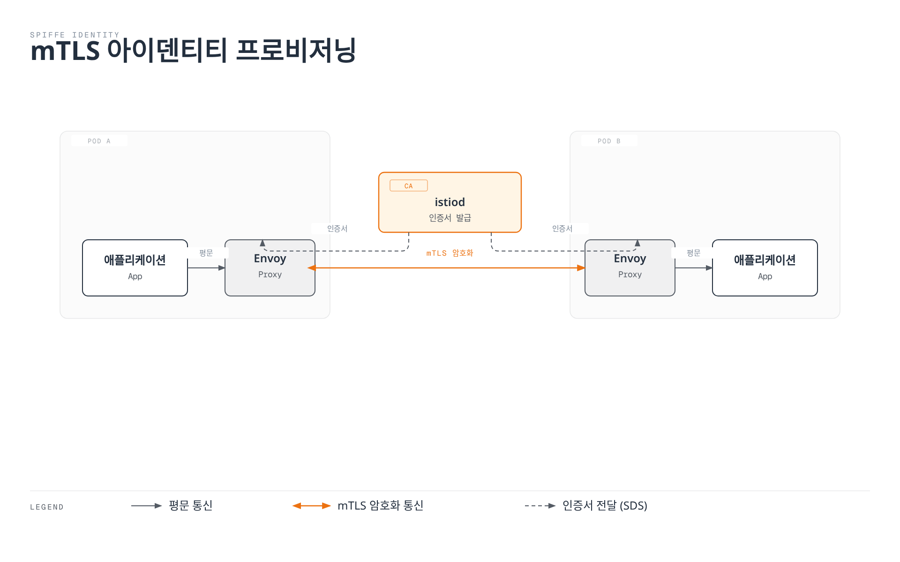
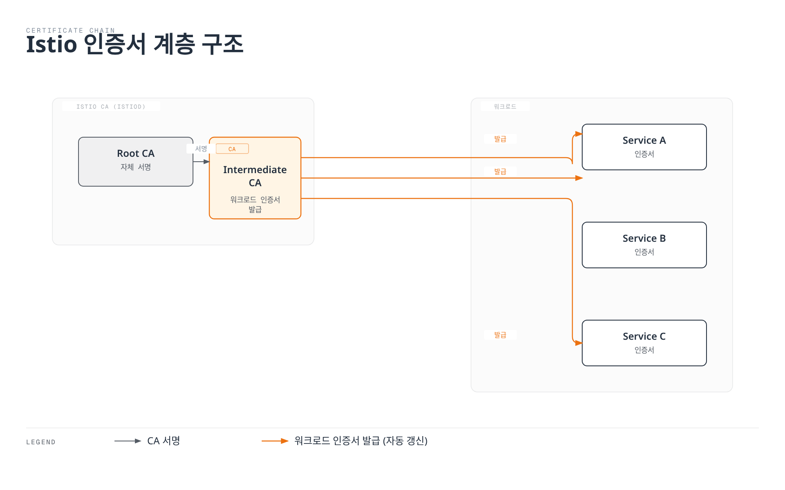
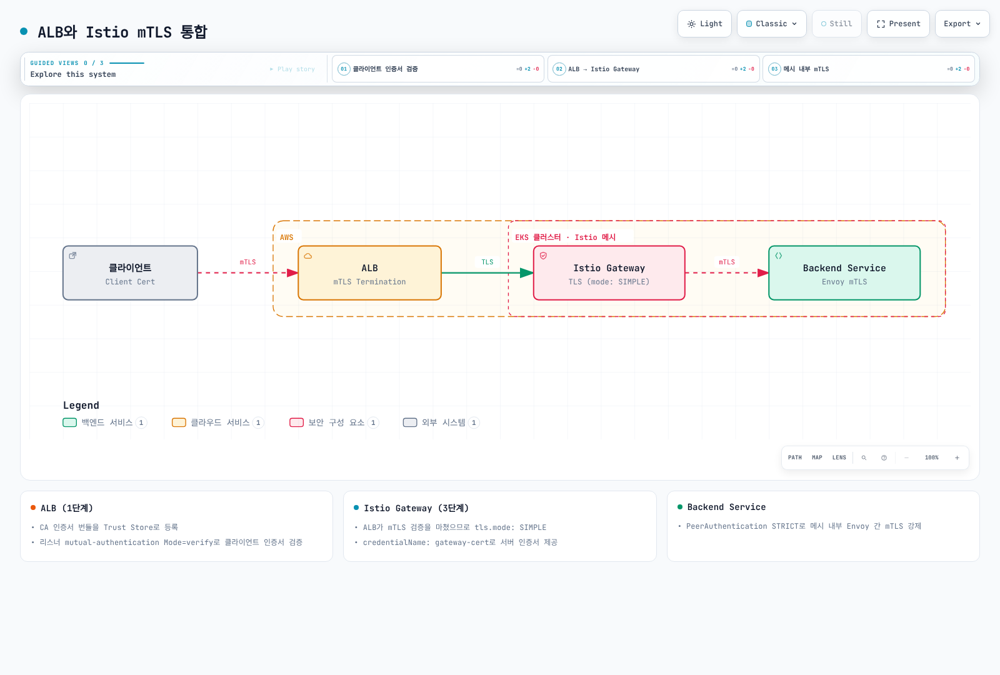
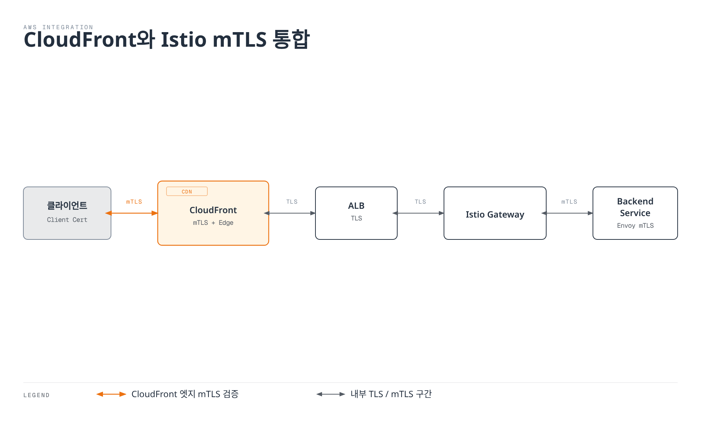
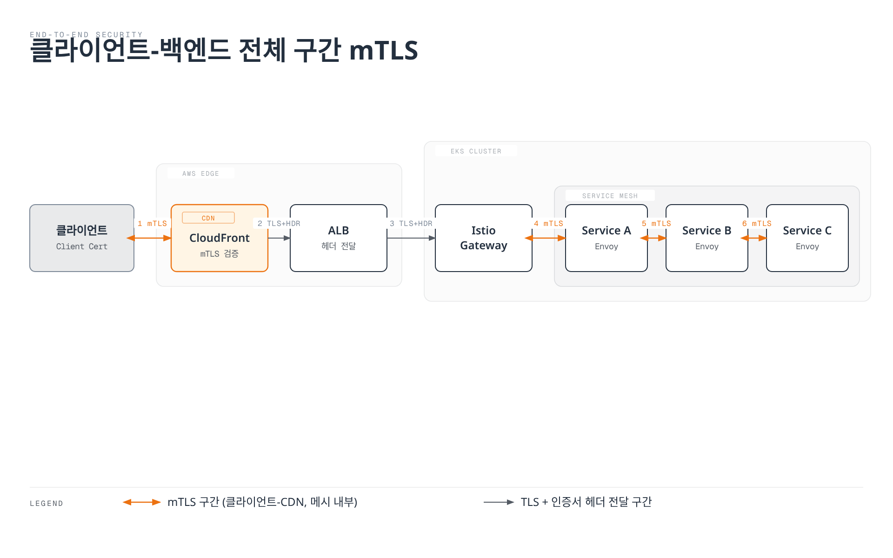

# mTLS

Mutual TLS (mTLS)는 Istio의 핵심 보안 기능으로, 서비스 간 통신을 자동으로 암호화하고 인증합니다.

> 📎 TLS 핸드셰이크와 인증서 검증이 생소하다면 [네트워크 기초 Part 2](../../../basics/06-network-fundamentals-part2.md)의 TLS 절을 먼저 읽어보세요.

## 목차

1. [mTLS 개요](#mtls-개요)
2. [mTLS 모드](#mtls-모드)
3. [인증서 관리](#인증서-관리)
4. [PeerAuthentication 설정](#peerauthentication-설정)
5. [AWS 서비스와 mTLS 통합](#aws-서비스와-mtls-통합)
6. [외부 서비스와 mTLS](#외부-서비스와-mtls)
7. [마이그레이션 전략](#마이그레이션-전략)
8. [일반적인 문제와 해결](#일반적인-문제와-해결)
9. [성능 및 모니터링](#성능-및-모니터링)

## mTLS 개요

<p align="center">
  
</p>

Istio는 서비스 간 통신에 자동으로 mTLS를 적용하여 Zero Trust 네트워크를 구현합니다.

### Identity 기반 보안

Istio는 **SPIFFE (Secure Production Identity Framework for Everyone)** 표준을 사용하여 각 워크로드에 강력한 신원을 부여합니다:

```
spiffe://cluster.local/ns/default/sa/productpage
  │         │           │     │      │    │
  │         │           │     │      │    └─ ServiceAccount 이름
  │         │           │     │      └────── "sa" (ServiceAccount)
  │         │           │     └───────────── Namespace 이름
  │         │           └─────────────────── "ns" (Namespace)
  │         └─────────────────────────────── Trust Domain
  └───────────────────────────────────────── 프로토콜
```

**Identity 프로비저닝 과정**:
1. Kubernetes가 파드를 생성하고 ServiceAccount를 할당
2. Istio Agent가 파드 내에서 시작
3. Agent가 Istiod에 CSR (Certificate Signing Request) 전송
4. Istiod가 SPIFFE ID 기반 X.509 인증서 발급
5. Agent가 Envoy에 인증서 전달 (SDS 프로토콜)
6. 인증서 자동 갱신 (기본 TTL: 24시간)



## mTLS 모드

### STRICT 모드 (권장)

```yaml
apiVersion: security.istio.io/v1
kind: PeerAuthentication
metadata:
  name: default
  namespace: istio-system
spec:
  mtls:
    mode: STRICT  # mTLS만 허용
```

### PERMISSIVE 모드 (마이그레이션용)

```yaml
apiVersion: security.istio.io/v1
kind: PeerAuthentication
metadata:
  name: default
  namespace: default
spec:
  mtls:
    mode: PERMISSIVE  # mTLS와 평문 모두 허용
```

### DISABLE 모드

```yaml
apiVersion: security.istio.io/v1
kind: PeerAuthentication
metadata:
  name: disable-mtls
  namespace: default
spec:
  mtls:
    mode: DISABLE  # mTLS 비활성화
```

## 인증서 관리

<p align="center">
  
</p>

### Istio 기본 CA 인증서

Istio는 설치 시 자동으로 자체 서명된 루트 CA를 생성합니다. 위 다이어그램은 Istio의 인증서 계층 구조를 보여줍니다:

- **Root CA**: 최상위 신뢰 앵커
- **Intermediate CA**: 워크로드 인증서 발급용 중간 CA
- **Workload Certificates**: 각 서비스의 mTLS 인증서 (자동 갱신)



**기본 인증서 속성**:
- 유효 기간: **90일** (자동 갱신: 만료 24시간 전)
- 키 크기: 2048-bit RSA
- 서명 알고리즘: SHA-256

### 인증서 확인

```bash
# 1. CA 인증서 확인
kubectl get secret istio-ca-secret -n istio-system -o yaml

# 2. 워크로드 인증서 확인
istioctl proxy-config secret <pod-name> -n <namespace>

# 3. 인증서 상세 정보
istioctl proxy-config secret <pod-name> -n <namespace> -o json | \
  jq -r '.dynamicActiveSecrets[0].secret.tlsCertificate.certificateChain.inlineBytes' | \
  base64 -d | openssl x509 -text -noout

# 4. 인증서 만료 날짜 확인
istioctl proxy-config secret <pod-name> -n <namespace> -o json | \
  jq -r '.dynamicActiveSecrets[0].secret.tlsCertificate.certificateChain.inlineBytes' | \
  base64 -d | openssl x509 -noout -dates
```

### 사용자 정의 CA 인증서 사용

프로덕션 환경에서는 기업 내부 CA 또는 공인 CA를 사용하는 것이 좋습니다.

#### 1단계: CA 인증서 및 키 생성

```bash
# 1. Root CA 생성
openssl genrsa -out root-key.pem 4096

openssl req -new -x509 -days 3650 -key root-key.pem \
  -out root-cert.pem \
  -subj "/C=KR/ST=Seoul/L=Seoul/O=MyOrg/OU=IT/CN=Root CA"

# 2. Intermediate CA 생성
openssl genrsa -out ca-key.pem 4096

openssl req -new -key ca-key.pem -out ca-cert.csr \
  -subj "/C=KR/ST=Seoul/L=Seoul/O=MyOrg/OU=IT/CN=Intermediate CA"

# 3. Intermediate CA를 Root CA로 서명
cat > ca-extensions.txt <<EOF
basicConstraints=CA:TRUE
keyUsage=keyCertSign,cRLSign
EOF

openssl x509 -req -days 1825 -in ca-cert.csr \
  -CA root-cert.pem -CAkey root-key.pem -CAcreateserial \
  -out ca-cert.pem -extfile ca-extensions.txt

# 4. Certificate Chain 생성
cat ca-cert.pem root-cert.pem > cert-chain.pem
```

#### 2단계: Kubernetes Secret 생성

```bash
kubectl create secret generic cacerts -n istio-system \
  --from-file=ca-cert.pem=ca-cert.pem \
  --from-file=ca-key.pem=ca-key.pem \
  --from-file=root-cert.pem=root-cert.pem \
  --from-file=cert-chain.pem=cert-chain.pem
```

#### 3단계: Istio 재시작

```bash
# istiod를 재시작하여 새 CA 인증서 로드
kubectl rollout restart deployment/istiod -n istio-system

# 모든 워크로드 재시작하여 새 인증서 발급
kubectl rollout restart deployment -n <namespace>
```

#### 4단계: 검증

```bash
# CA 인증서가 올바르게 로드되었는지 확인
kubectl logs -l app=istiod -n istio-system | grep "Use plugged-in cert"

# 워크로드 인증서가 새 CA로 발급되었는지 확인
istioctl proxy-config secret <pod-name> -n <namespace> -o json | \
  jq -r '.dynamicActiveSecrets[0].secret.tlsCertificate.certificateChain.inlineBytes' | \
  base64 -d | openssl x509 -noout -issuer
```

### AWS Certificate Manager (ACM) 통합

ACM Private CA를 사용하여 Istio 인증서를 관리할 수 있습니다.

#### 1단계: ACM Private CA 생성

```bash
# ACM Private CA 생성
aws acm-pca create-certificate-authority \
  --certificate-authority-configuration \
    "KeyAlgorithm=RSA_4096,SigningAlgorithm=SHA256WITHRSA,Subject={CommonName=Istio CA}" \
  --certificate-authority-type ROOT \
  --tags Key=Name,Value=istio-root-ca

# CA ARN 저장
CA_ARN=$(aws acm-pca list-certificate-authorities \
  --query 'CertificateAuthorities[0].Arn' --output text)

# Root CA 인증서 생성
aws acm-pca get-certificate-authority-csr \
  --certificate-authority-arn $CA_ARN \
  --output text > ca.csr

aws acm-pca issue-certificate \
  --certificate-authority-arn $CA_ARN \
  --csr fileb://ca.csr \
  --signing-algorithm SHA256WITHRSA \
  --template-arn arn:aws:acm-pca:::template/RootCACertificate/V1 \
  --validity Value=10,Type=YEARS

# 인증서 설치
CERT_ARN=$(aws acm-pca list-certificates \
  --certificate-authority-arn $CA_ARN \
  --query 'Certificates[0].Arn' --output text)

aws acm-pca get-certificate \
  --certificate-authority-arn $CA_ARN \
  --certificate-arn $CERT_ARN \
  --output text > root-cert.pem

aws acm-pca import-certificate-authority-certificate \
  --certificate-authority-arn $CA_ARN \
  --certificate fileb://root-cert.pem
```

#### 2단계: Cert-Manager + AWS PCA Issuer 설치

```bash
# Cert-Manager 설치
kubectl apply -f https://github.com/cert-manager/cert-manager/releases/download/v1.13.0/cert-manager.yaml

# AWS PCA Issuer 설치
helm repo add awspca https://cert-manager.github.io/aws-privateca-issuer
helm install aws-pca-issuer awspca/aws-privateca-issuer -n cert-manager
```

#### 3단계: AWSPCAIssuer 생성

```yaml
apiVersion: awspca.cert-manager.io/v1beta1
kind: AWSPCAClusterIssuer
metadata:
  name: istio-ca
spec:
  arn: ${CA_ARN}
  region: us-west-2
```

#### 4단계: Istio에서 사용

```yaml
apiVersion: cert-manager.io/v1
kind: Certificate
metadata:
  name: istio-ca-cert
  namespace: istio-system
spec:
  secretName: cacerts
  commonName: "Istio CA"
  isCA: true
  duration: 87600h  # 10 years
  renewBefore: 720h  # 30 days
  issuerRef:
    kind: AWSPCAClusterIssuer
    name: istio-ca
```

### 인증서 갱신 정책

```yaml
# Istio Operator로 인증서 정책 설정
apiVersion: install.istio.io/v1alpha1
kind: IstioOperator
metadata:
  name: istio-control-plane
  namespace: istio-system
spec:
  meshConfig:
    certificates:
      - secretName: dns.istio-system-service-account
        dnsNames:
          - istiod.istio-system.svc
          - istiod.istio-system
    caCertificates:
      - secretName: cacerts
        certProvider: cert-manager
  values:
    pilot:
      env:
        # 워크로드 인증서 TTL (기본: 24시간)
        CITADEL_CERT_TTL: "24h"
        # 인증서 갱신 Grace Period (기본: 15분)
        CITADEL_GRACE_PERIOD: "15m"
```

### 인증서 순환 (Rotation)

```bash
# 1. 새 CA 인증서 생성 (위의 단계 반복)

# 2. 기존 Secret 업데이트
kubectl create secret generic cacerts -n istio-system \
  --from-file=ca-cert.pem=new-ca-cert.pem \
  --from-file=ca-key.pem=new-ca-key.pem \
  --from-file=root-cert.pem=new-root-cert.pem \
  --from-file=cert-chain.pem=new-cert-chain.pem \
  --dry-run=client -o yaml | kubectl apply -f -

# 3. istiod 재시작 (무중단 롤링 업데이트)
kubectl rollout restart deployment/istiod -n istio-system

# 4. 점진적 워크로드 인증서 갱신
# 방법 1: 자동 갱신 대기 (24시간 이내)
# 방법 2: 수동 롤링 재시작
for ns in $(kubectl get ns -o jsonpath='{.items[*].metadata.name}'); do
  echo "Restarting deployments in namespace: $ns"
  kubectl rollout restart deployment -n $ns
done
```

## PeerAuthentication 설정

### 전역 설정

```yaml
apiVersion: security.istio.io/v1
kind: PeerAuthentication
metadata:
  name: default
  namespace: istio-system
spec:
  mtls:
    mode: STRICT
```

### 네임스페이스별 설정

```yaml
apiVersion: security.istio.io/v1
kind: PeerAuthentication
metadata:
  name: namespace-policy
  namespace: production
spec:
  mtls:
    mode: STRICT
```

### 워크로드별 설정

```yaml
apiVersion: security.istio.io/v1
kind: PeerAuthentication
metadata:
  name: workload-policy
  namespace: default
spec:
  selector:
    matchLabels:
      app: reviews
      version: v1
  mtls:
    mode: STRICT
```

### 포트별 설정

```yaml
apiVersion: security.istio.io/v1
kind: PeerAuthentication
metadata:
  name: port-policy
  namespace: default
spec:
  selector:
    matchLabels:
      app: myapp
  mtls:
    mode: STRICT
  portLevelMtls:
    8080:
      mode: DISABLE  # 8080 포트는 mTLS 비활성화
```

## AWS 서비스와 mTLS 통합

### AWS Application Load Balancer (ALB)와 mTLS

ALB는 클라이언트 인증서 기반 mTLS를 지원합니다.



#### 1단계: ALB에 mTLS 설정

```bash
# 1. Trust Store 생성 (CA 인증서 업로드)
aws elbv2 create-trust-store \
  --name istio-client-trust-store \
  --ca-certificates-bundle-s3-bucket my-bucket \
  --ca-certificates-bundle-s3-key ca-bundle.pem

# 2. ALB 리스너에 mTLS 설정
aws elbv2 modify-listener \
  --listener-arn arn:aws:elasticloadbalancing:region:account:listener/app/my-alb/xxx \
  --mutual-authentication Mode=verify,TrustStoreArn=arn:aws:elasticloadbalancing:region:account:truststore/istio-client-trust-store/xxx
```

#### 2단계: AWS Load Balancer Controller 설정

```yaml
apiVersion: v1
kind: Service
metadata:
  name: istio-gateway
  namespace: istio-system
  annotations:
    service.beta.kubernetes.io/aws-load-balancer-type: "external"
    service.beta.kubernetes.io/aws-load-balancer-nlb-target-type: "ip"
    service.beta.kubernetes.io/aws-load-balancer-scheme: "internet-facing"
    # mTLS 설정
    service.beta.kubernetes.io/aws-load-balancer-ssl-cert: "arn:aws:acm:region:account:certificate/xxx"
    service.beta.kubernetes.io/aws-load-balancer-ssl-negotiation-policy: "ELBSecurityPolicy-TLS13-1-2-2021-06"
    service.beta.kubernetes.io/aws-load-balancer-mutual-authentication: '[{"port": 443, "mode": "verify", "trustStore": "arn:aws:elasticloadbalancing:region:account:truststore/istio-client-trust-store/xxx"}]'
spec:
  type: LoadBalancer
  selector:
    istio: ingressgateway
  ports:
  - name: https
    port: 443
    targetPort: 8443
```

#### 3단계: Istio Gateway에서 클라이언트 인증서 검증

```yaml
apiVersion: networking.istio.io/v1
kind: Gateway
metadata:
  name: public-gateway
  namespace: istio-system
spec:
  selector:
    istio: ingressgateway
  servers:
  - port:
      number: 8443
      name: https
      protocol: HTTPS
    tls:
      mode: SIMPLE  # ALB가 이미 mTLS 검증 완료
      credentialName: gateway-cert
    hosts:
    - "*.example.com"
---
apiVersion: v1
kind: ConfigMap
metadata:
  name: istio-envoy-custom
  namespace: istio-system
data:
  custom-bootstrap.yaml: |
    static_resources:
      listeners:
      - name: http_listener
        address:
          socket_address:
            address: 0.0.0.0
            port_value: 8443
        filter_chains:
        - filters:
          - name: envoy.filters.network.http_connection_manager
            typed_config:
              "@type": type.googleapis.com/envoy.extensions.filters.network.http_connection_manager.v3.HttpConnectionManager
              # ALB에서 전달된 클라이언트 인증서 헤더 검증
              forward_client_cert_details: APPEND_FORWARD
              set_current_client_cert_details:
                subject: true
                cert: true
                chain: true
                dns: true
                uri: true
```

#### 4단계: 클라이언트 인증서 정보 전달

ALB는 클라이언트 인증서 정보를 HTTP 헤더로 전달합니다:

```yaml
apiVersion: security.istio.io/v1beta1
kind: AuthorizationPolicy
metadata:
  name: verify-client-cert
  namespace: default
spec:
  action: ALLOW
  rules:
  - when:
    - key: request.headers[x-amzn-mtls-clientcert-serial-number]
      values: ["*"]
    - key: request.headers[x-amzn-mtls-clientcert-subject]
      values: ["CN=trusted-client,O=MyOrg*"]
```

**ALB가 전달하는 헤더**:
- `X-Amzn-Mtls-Clientcert-Serial-Number`: 인증서 시리얼 번호
- `X-Amzn-Mtls-Clientcert-Subject`: 인증서 Subject DN
- `X-Amzn-Mtls-Clientcert-Issuer`: 인증서 Issuer DN
- `X-Amzn-Mtls-Clientcert-Validity`: 유효 기간
- `X-Amzn-Mtls-Clientcert-Leaf`: 클라이언트 인증서 (PEM)

### Amazon CloudFront와 mTLS

CloudFront는 클라이언트 인증서 검증을 지원합니다.



#### 1단계: CloudFront 배포 생성

```bash
# 1. S3에 Trust Store (CA 인증서) 업로드
aws s3 cp ca-bundle.pem s3://my-bucket/ca-bundle.pem

# 2. CloudFront 배포 생성
cat > cloudfront-config.json <<EOF
{
  "CallerReference": "istio-mtls-$(date +%s)",
  "Origins": {
    "Quantity": 1,
    "Items": [
      {
        "Id": "istio-gateway",
        "DomainName": "k8s-istiosystem-istiogateway-xxx.elb.us-west-2.amazonaws.com",
        "CustomOriginConfig": {
          "HTTPPort": 80,
          "HTTPSPort": 443,
          "OriginProtocolPolicy": "https-only",
          "OriginSslProtocols": {
            "Quantity": 1,
            "Items": ["TLSv1.2"]
          }
        }
      }
    ]
  },
  "DefaultCacheBehavior": {
    "TargetOriginId": "istio-gateway",
    "ViewerProtocolPolicy": "https-only",
    "TrustedSigners": {
      "Enabled": false,
      "Quantity": 0
    },
    "ForwardedValues": {
      "QueryString": true,
      "Headers": {
        "Quantity": 1,
        "Items": ["*"]
      }
    },
    "MinTTL": 0
  },
  "ViewerCertificate": {
    "CloudFrontDefaultCertificate": false,
    "ACMCertificateArn": "arn:aws:acm:us-east-1:account:certificate/xxx",
    "SSLSupportMethod": "sni-only",
    "MinimumProtocolVersion": "TLSv1.2_2021"
  }
}
EOF

aws cloudfront create-distribution --distribution-config file://cloudfront-config.json

# 3. CloudFront에 mTLS 설정
DIST_ID=$(aws cloudfront list-distributions --query 'DistributionList.Items[0].Id' --output text)

aws cloudfront update-distribution \
  --id $DIST_ID \
  --distribution-config '{
    "ViewerCertificate": {
      "ACMCertificateArn": "arn:aws:acm:us-east-1:account:certificate/xxx",
      "SSLSupportMethod": "sni-only",
      "MinimumProtocolVersion": "TLSv1.2_2021",
      "CertificateSource": "acm"
    },
    "CustomOriginConfig": {
      "OriginSslProtocols": {
        "Quantity": 1,
        "Items": ["TLSv1.2"]
      }
    }
  }'
```

#### 2단계: CloudFront Function으로 인증서 검증

```javascript
function handler(event) {
    var request = event.request;
    var headers = request.headers;

    // CloudFront가 클라이언트 인증서 검증 후 전달하는 헤더
    var clientCertSerial = headers['cloudfront-viewer-tls-client-cert-serial-number'];
    var clientCertSubject = headers['cloudfront-viewer-tls-client-cert-subject'];

    if (!clientCertSerial || !clientCertSubject) {
        return {
            statusCode: 403,
            statusDescription: 'Forbidden',
            body: 'Client certificate required'
        };
    }

    // 허용된 인증서 시리얼 번호 체크
    var allowedSerials = ['1234567890ABCDEF', 'FEDCBA0987654321'];
    if (!allowedSerials.includes(clientCertSerial.value)) {
        return {
            statusCode: 403,
            statusDescription: 'Forbidden',
            body: 'Invalid client certificate'
        };
    }

    // Istio로 인증서 정보 전달
    headers['x-client-cert-serial'] = clientCertSerial;
    headers['x-client-cert-subject'] = clientCertSubject;

    return request;
}
```

#### 3단계: Istio에서 CloudFront 헤더 검증

```yaml
apiVersion: security.istio.io/v1beta1
kind: AuthorizationPolicy
metadata:
  name: verify-cloudfront-client-cert
  namespace: default
spec:
  action: ALLOW
  rules:
  - when:
    - key: request.headers[x-client-cert-serial]
      values:
      - "1234567890ABCDEF"
      - "FEDCBA0987654321"
    - key: request.headers[x-client-cert-subject]
      values: ["CN=trusted-client,O=MyOrg*"]
```

### End-to-End mTLS 아키텍처

클라이언트부터 백엔드까지 전체 구간 mTLS:



**구간별 보안**:
1. **클라이언트 → CloudFront**: mTLS (클라이언트 인증서 검증)
2. **CloudFront → ALB**: TLS + 인증서 정보 헤더
3. **ALB → Istio Gateway**: TLS + 인증서 정보 헤더
4. **Istio Mesh 내부**: 자동 mTLS (Envoy-to-Envoy)

## 외부 서비스와 mTLS

### Legacy 시스템 통합

```yaml
# Legacy 시스템이 mTLS를 지원하지 않는 경우
apiVersion: networking.istio.io/v1beta1
kind: DestinationRule
metadata:
  name: legacy-system
  namespace: default
spec:
  host: legacy.external.com
  trafficPolicy:
    tls:
      mode: SIMPLE  # 단방향 TLS만 사용
---
apiVersion: networking.istio.io/v1beta1
kind: ServiceEntry
metadata:
  name: legacy-system
  namespace: default
spec:
  hosts:
  - legacy.external.com
  ports:
  - number: 443
    name: https
    protocol: HTTPS
  location: MESH_EXTERNAL
  resolution: DNS
```

### 외부 API mTLS 클라이언트 인증

Istio에서 외부 API에 클라이언트 인증서를 제시해야 하는 경우:

```yaml
# 1. 클라이언트 인증서 Secret 생성
apiVersion: v1
kind: Secret
metadata:
  name: client-mtls-credential
  namespace: istio-system
type: kubernetes.io/tls
data:
  tls.crt: <base64-encoded-cert>
  tls.key: <base64-encoded-key>
  ca.crt: <base64-encoded-ca>
---
# 2. DestinationRule에서 클라이언트 인증서 설정
apiVersion: networking.istio.io/v1beta1
kind: DestinationRule
metadata:
  name: external-api-mtls
  namespace: default
spec:
  host: api.external.com
  trafficPolicy:
    tls:
      mode: MUTUAL  # mTLS 사용
      clientCertificate: /etc/certs/tls.crt
      privateKey: /etc/certs/tls.key
      caCertificates: /etc/certs/ca.crt
---
# 3. ServiceEntry로 외부 API 등록
apiVersion: networking.istio.io/v1beta1
kind: ServiceEntry
metadata:
  name: external-api
  namespace: default
spec:
  hosts:
  - api.external.com
  ports:
  - number: 443
    name: https
    protocol: HTTPS
  location: MESH_EXTERNAL
  resolution: DNS
```

### Egress Gateway를 통한 외부 mTLS

```yaml
# 1. Egress Gateway 배포
apiVersion: install.istio.io/v1alpha1
kind: IstioOperator
spec:
  components:
    egressGateways:
    - name: istio-egressgateway
      enabled: true
      k8s:
        serviceAnnotations:
          networking.istio.io/exportTo: "*"
---
# 2. Gateway 리소스
apiVersion: networking.istio.io/v1
kind: Gateway
metadata:
  name: egress-gateway
  namespace: istio-system
spec:
  selector:
    istio: egressgateway
  servers:
  - port:
      number: 443
      name: tls
      protocol: TLS
    hosts:
    - api.external.com
    tls:
      mode: ISTIO_MUTUAL  # 메시 내부는 mTLS
---
# 3. VirtualService로 트래픽 라우팅
apiVersion: networking.istio.io/v1
kind: VirtualService
metadata:
  name: external-api-through-egress
  namespace: default
spec:
  hosts:
  - api.external.com
  gateways:
  - mesh  # 메시 내부에서
  - istio-system/egress-gateway  # Egress Gateway로
  http:
  - match:
    - gateways:
      - mesh
      port: 443
    route:
    - destination:
        host: istio-egressgateway.istio-system.svc.cluster.local
        port:
          number: 443
  - match:
    - gateways:
      - istio-system/egress-gateway
      port: 443
    route:
    - destination:
        host: api.external.com
        port:
          number: 443
---
# 4. DestinationRule (Egress Gateway에서 외부로)
apiVersion: networking.istio.io/v1beta1
kind: DestinationRule
metadata:
  name: external-api-mtls
  namespace: istio-system
spec:
  host: api.external.com
  trafficPolicy:
    tls:
      mode: MUTUAL
      clientCertificate: /etc/istio/egress-certs/tls.crt
      privateKey: /etc/istio/egress-certs/tls.key
      caCertificates: /etc/istio/egress-certs/ca.crt
```

## 마이그레이션 전략

### 1단계: 현재 상태 확인

```bash
# 현재 mTLS 설정 확인
kubectl get peerauthentication -A

# 서비스별 mTLS 상태 확인
istioctl authn tls-check <pod-name> -n <namespace>
```

### 2단계: PERMISSIVE 모드로 전환

```yaml
apiVersion: security.istio.io/v1
kind: PeerAuthentication
metadata:
  name: default
  namespace: istio-system
spec:
  mtls:
    mode: PERMISSIVE  # mTLS와 평문 모두 허용
```

### 3단계: 모니터링

```bash
# mTLS 연결 확인
kubectl exec -it <pod-name> -c istio-proxy -- \
  curl -s localhost:15000/stats/prometheus | grep ssl

# 평문 연결 확인
kubectl exec -it <pod-name> -c istio-proxy -- \
  curl -s localhost:15000/stats/prometheus | grep plaintext
```

### 4단계: STRICT 모드로 전환

```yaml
apiVersion: security.istio.io/v1
kind: PeerAuthentication
metadata:
  name: default
  namespace: istio-system
spec:
  mtls:
    mode: STRICT  # mTLS만 허용
```

## 일반적인 문제와 해결

### 1. mTLS 연결 실패

**증상**:
```
upstream connect error or disconnect/reset before headers. reset reason: connection failure
```

**원인 분석**:

```bash
# 1. PeerAuthentication 확인
kubectl get peerauthentication -A

# 2. DestinationRule mTLS 모드 확인
kubectl get destinationrule -A -o yaml | grep -A 5 "trafficPolicy"

# 3. 인증서 확인
istioctl proxy-config secret <pod-name> -n <namespace>

# 4. TLS 연결 확인
istioctl authn tls-check <source-pod> <dest-service> -n <namespace>

# 5. Envoy 로그 상세 확인
kubectl logs <pod-name> -c istio-proxy -n <namespace> | grep -E "(TLS|SSL|certificate)"
```

**해결 방법**:

1. **PeerAuthentication과 DestinationRule 불일치**:
```yaml
# 문제: PeerAuthentication은 STRICT, DestinationRule은 DISABLE
# 해결: DestinationRule을 ISTIO_MUTUAL로 변경
apiVersion: networking.istio.io/v1beta1
kind: DestinationRule
metadata:
  name: fix-mtls
spec:
  host: myservice.default.svc.cluster.local
  trafficPolicy:
    tls:
      mode: ISTIO_MUTUAL  # STRICT 모드와 일치
```

2. **사이드카가 주입되지 않은 파드**:
```bash
# 네임스페이스에 istio-injection 레이블 추가
kubectl label namespace default istio-injection=enabled

# 파드 재시작
kubectl rollout restart deployment/<deployment-name> -n default
```

### 2. 인증서 만료 문제

**증상**:
```
TLS error: Secret is not supplied by SDS
x509: certificate has expired
```

**인증서 만료 확인**:

```bash
# 워크로드 인증서 만료 날짜 확인
istioctl proxy-config secret <pod-name> -n <namespace> -o json | \
  jq -r '.dynamicActiveSecrets[0].secret.tlsCertificate.certificateChain.inlineBytes' | \
  base64 -d | openssl x509 -noout -dates

# CA 인증서 만료 확인
kubectl get secret istio-ca-secret -n istio-system -o json | \
  jq -r '.data."ca-cert.pem"' | base64 -d | openssl x509 -noout -dates

# 모든 워크로드의 인증서 만료 날짜 체크
for pod in $(kubectl get pods -n default -o jsonpath='{.items[*].metadata.name}'); do
  echo "Pod: $pod"
  istioctl proxy-config secret $pod -n default -o json 2>/dev/null | \
    jq -r '.dynamicActiveSecrets[0].secret.tlsCertificate.certificateChain.inlineBytes' | \
    base64 -d 2>/dev/null | openssl x509 -noout -dates 2>/dev/null || echo "No cert found"
done
```

**해결 방법**:

```bash
# 1. istiod 재시작 (새 인증서 발급 트리거)
kubectl rollout restart deployment/istiod -n istio-system

# 2. 특정 워크로드 재시작 (인증서 갱신)
kubectl delete pod <pod-name> -n <namespace>

# 3. CA 인증서 갱신 (위의 "인증서 순환" 섹션 참조)
```

### 3. Clock Skew (시간 동기화 문제)

**증상**:
```
certificate is not valid yet
certificate verify failed
```

**원인**: 파드/노드 간 시간 차이로 인증서 검증 실패

**확인**:

```bash
# 노드 시간 확인
kubectl get nodes -o wide
for node in $(kubectl get nodes -o jsonpath='{.items[*].metadata.name}'); do
  echo "Node: $node"
  kubectl debug node/$node -it --image=busybox -- date
done

# 파드 시간 확인
kubectl exec -it <pod-name> -c istio-proxy -n <namespace> -- date

# 시간 차이 확인 (허용 범위: ±5분)
```

**해결 방법**:

```bash
# 1. NTP 설정 (노드 레벨)
sudo systemctl restart chrony
sudo chronyc tracking

# 2. EKS에서는 기본적으로 NTP 동기화됨
# Amazon Time Sync Service 사용 확인
curl http://169.254.169.123/latest/meta-data/system

# 3. 인증서 유효 시작 시간에 여유 추가
# Istio Operator 설정
apiVersion: install.istio.io/v1alpha1
kind: IstioOperator
spec:
  values:
    pilot:
      env:
        CERT_NOTBEFORE_GRACE_DURATION: "10m"  # 시작 시간 여유
```

### 4. 순환 참조 (Circular Dependency)

**증상**:
```
upstream connect error or disconnect/reset before headers
```

**원인**: Service A → Service B → Service A 호출 시 mTLS 핸드셰이크 타임아웃

**확인**:

```bash
# 서비스 호출 체인 확인
istioctl analyze -n <namespace>

# Envoy 클러스터 확인
istioctl proxy-config cluster <pod-name> -n <namespace>
```

**해결 방법**:

```yaml
# DestinationRule에 적절한 timeout 설정
apiVersion: networking.istio.io/v1beta1
kind: DestinationRule
metadata:
  name: service-with-timeout
spec:
  host: myservice.default.svc.cluster.local
  trafficPolicy:
    connectionPool:
      tcp:
        connectTimeout: 30s  # 연결 타임아웃 증가
    tls:
      mode: ISTIO_MUTUAL
```

### 5. Mixed Protocol (mTLS + 평문)

**증상**:
```
SSL routines:OPENSSL_internal:WRONG_VERSION_NUMBER
```

**원인**: 일부 서비스는 mTLS, 일부는 평문 사용

**확인**:

```bash
# 모든 서비스의 mTLS 상태 확인
for svc in $(kubectl get svc -n default -o jsonpath='{.items[*].metadata.name}'); do
  echo "Service: $svc"
  istioctl authn tls-check $(kubectl get pod -n default -l app=test -o jsonpath='{.items[0].metadata.name}') $svc.default.svc.cluster.local -n default
done
```

**해결 방법**:

```yaml
# PERMISSIVE 모드로 점진적 마이그레이션
apiVersion: security.istio.io/v1
kind: PeerAuthentication
metadata:
  name: migration-policy
  namespace: default
spec:
  mtls:
    mode: PERMISSIVE  # mTLS와 평문 모두 허용
```

### 6. Headless Service mTLS

**증상**: Headless 서비스에서 mTLS 연결 실패

**해결 방법**:

```yaml
apiVersion: networking.istio.io/v1beta1
kind: DestinationRule
metadata:
  name: headless-service-mtls
spec:
  host: headless-service.default.svc.cluster.local
  trafficPolicy:
    tls:
      mode: ISTIO_MUTUAL
    portLevelSettings:
    - port:
        number: 3306
      tls:
        mode: ISTIO_MUTUAL
```

### 7. mTLS와 네트워크 정책 충돌

**증상**: NetworkPolicy 적용 후 mTLS 연결 실패

**해결 방법**:

```yaml
apiVersion: networking.k8s.io/v1
kind: NetworkPolicy
metadata:
  name: allow-istio-mtls
  namespace: default
spec:
  podSelector: {}
  policyTypes:
  - Ingress
  - Egress
  ingress:
  - from:
    - namespaceSelector:
        matchLabels:
          name: istio-system  # istiod 허용
    - podSelector: {}  # 같은 네임스페이스 파드 허용
    ports:
    - protocol: TCP
      port: 15008  # Envoy mTLS port
    - protocol: TCP
      port: 15012  # Pilot discovery
  egress:
  - to:
    - namespaceSelector:
        matchLabels:
          name: istio-system
    ports:
    - protocol: TCP
      port: 15012
  - to:
    - podSelector: {}
    ports:
    - protocol: TCP
      port: 15008
```

## 성능 및 모니터링

### mTLS 성능 영향

| 지표 | 평문 | mTLS | 증가율 |
|------|------|------|--------|
| **지연 시간 (p50)** | 5ms | 6ms | +20% |
| **지연 시간 (p99)** | 15ms | 18ms | +20% |
| **CPU 사용률** | 10% | 15% | +50% |
| **메모리 사용률** | 100MB | 120MB | +20% |
| **처리량 (RPS)** | 10000 | 8500 | -15% |

**최적화 방법**:

1. **하드웨어 가속 (AES-NI)**:
```bash
# CPU에서 AES-NI 지원 확인
grep -m1 -o aes /proc/cpuinfo

# EC2 인스턴스 타입 권장:
# - c5.*, c6i.*, c7g.*: AES-NI 지원
# - m5.*, m6i.*, r5.*: 범용
```

2. **TLS 1.3 사용** (더 빠른 핸드셰이크):
```yaml
apiVersion: install.istio.io/v1alpha1
kind: IstioOperator
spec:
  meshConfig:
    defaultConfig:
      proxyMetadata:
        TLS_MIN_PROTOCOL_VERSION: TLSv1_3
```

3. **Connection Pooling**:
```yaml
apiVersion: networking.istio.io/v1beta1
kind: DestinationRule
metadata:
  name: connection-pool
spec:
  host: myservice.default.svc.cluster.local
  trafficPolicy:
    connectionPool:
      tcp:
        maxConnections: 100
        connectTimeout: 30ms
      http:
        http1MaxPendingRequests: 1024
        http2MaxRequests: 1024
        maxRequestsPerConnection: 10
        idleTimeout: 900s
```

### Prometheus 메트릭

**mTLS 연결 메트릭**:

```promql
# mTLS 연결 성공률
sum(rate(istio_tcp_connections_opened_total{connection_security_policy="mutual_tls"}[5m])) by (destination_service_name)
/
sum(rate(istio_tcp_connections_opened_total[5m])) by (destination_service_name)

# mTLS 핸드셰이크 시간 (p99)
histogram_quantile(0.99,
  sum(rate(envoy_listener_ssl_connection_handshake_duration_bucket[5m])) by (le)
)

# 인증서 만료까지 남은 시간
envoy_server_days_until_first_cert_expiring

# mTLS 오류율
sum(rate(istio_requests_total{response_code=~"5.*",connection_security_policy="mutual_tls"}[5m]))
/
sum(rate(istio_requests_total{connection_security_policy="mutual_tls"}[5m]))
```

### Grafana 대시보드

```yaml
apiVersion: v1
kind: ConfigMap
metadata:
  name: istio-mtls-dashboard
  namespace: istio-system
data:
  dashboard.json: |
    {
      "dashboard": {
        "title": "Istio mTLS Monitoring",
        "panels": [
          {
            "title": "mTLS Connection Success Rate",
            "targets": [{
              "expr": "sum(rate(istio_tcp_connections_opened_total{connection_security_policy=\"mutual_tls\"}[5m])) / sum(rate(istio_tcp_connections_opened_total[5m]))"
            }]
          },
          {
            "title": "Certificate Expiration",
            "targets": [{
              "expr": "envoy_server_days_until_first_cert_expiring"
            }]
          },
          {
            "title": "mTLS Handshake Duration (p99)",
            "targets": [{
              "expr": "histogram_quantile(0.99, sum(rate(envoy_listener_ssl_connection_handshake_duration_bucket[5m])) by (le))"
            }]
          }
        ]
      }
    }
```

### 인증서 만료 알림

```yaml
apiVersion: monitoring.coreos.com/v1
kind: PrometheusRule
metadata:
  name: istio-cert-expiration-alert
  namespace: istio-system
spec:
  groups:
  - name: istio-certificates
    interval: 30s
    rules:
    - alert: IstioCertificateExpiringSoon
      expr: envoy_server_days_until_first_cert_expiring < 7
      for: 1h
      labels:
        severity: warning
      annotations:
        summary: "Istio certificate expiring in {{ $value }} days"
        description: "Certificate for {{ $labels.pod }} will expire in {{ $value }} days"

    - alert: IstioCertificateExpired
      expr: envoy_server_days_until_first_cert_expiring < 0
      for: 5m
      labels:
        severity: critical
      annotations:
        summary: "Istio certificate has expired"
        description: "Certificate for {{ $labels.pod }} has expired"

    - alert: IstioMTLSConnectionFailure
      expr: |
        sum(rate(istio_requests_total{response_code=~"5.*",connection_security_policy="mutual_tls"}[5m]))
        /
        sum(rate(istio_requests_total{connection_security_policy="mutual_tls"}[5m])) > 0.05
      for: 5m
      labels:
        severity: warning
      annotations:
        summary: "High mTLS connection failure rate"
        description: "mTLS error rate is {{ $value | humanizePercentage }} for {{ $labels.destination_service_name }}"
```

### 로깅 및 디버깅

```bash
# 1. Envoy 로그 레벨 변경 (동적)
istioctl proxy-config log <pod-name> -n <namespace> --level connection:debug,tls:debug

# 2. mTLS 관련 로그 필터링
kubectl logs <pod-name> -c istio-proxy -n <namespace> | grep -E "(TLS|SSL|certificate|handshake)"

# 3. Envoy Admin Interface에서 인증서 확인
kubectl exec -it <pod-name> -c istio-proxy -n <namespace> -- \
  curl -s localhost:15000/certs | jq '.'

# 4. TLS 연결 통계
kubectl exec -it <pod-name> -c istio-proxy -n <namespace> -- \
  curl -s localhost:15000/stats | grep ssl

# 5. 실시간 mTLS 트래픽 확인
istioctl dashboard envoy <pod-name>.<namespace>
# http://localhost:15000/stats/prometheus 에서 ssl 메트릭 확인
```

### 베스트 프랙티스

1. **프로덕션 환경**:
   - STRICT 모드 사용
   - 사용자 정의 CA 인증서 사용
   - 인증서 자동 갱신 설정
   - 만료 알림 구성

2. **성능 최적화**:
   - TLS 1.3 사용
   - Connection pooling 활성화
   - AES-NI 지원 인스턴스 사용

3. **모니터링**:
   - 인증서 만료 추적
   - mTLS 연결 성공률 모니터링
   - 핸드셰이크 지연 시간 추적

4. **보안**:
   - 정기적인 CA 순환
   - 최소 권한 원칙
   - NetworkPolicy와 함께 사용

## 참고 자료

- [Istio mTLS](https://istio.io/latest/docs/concepts/security/#mutual-tls-authentication)
- [PeerAuthentication Reference](https://istio.io/latest/docs/reference/config/security/peer_authentication/)
- [DestinationRule TLS](https://istio.io/latest/docs/reference/config/networking/destination-rule/#ClientTLSSettings)
- [Cert-Manager](https://cert-manager.io/docs/)
- [AWS Certificate Manager](https://docs.aws.amazon.com/acm/)
- [AWS ALB mTLS](https://docs.aws.amazon.com/elasticloadbalancing/latest/application/mutual-authentication.html)
