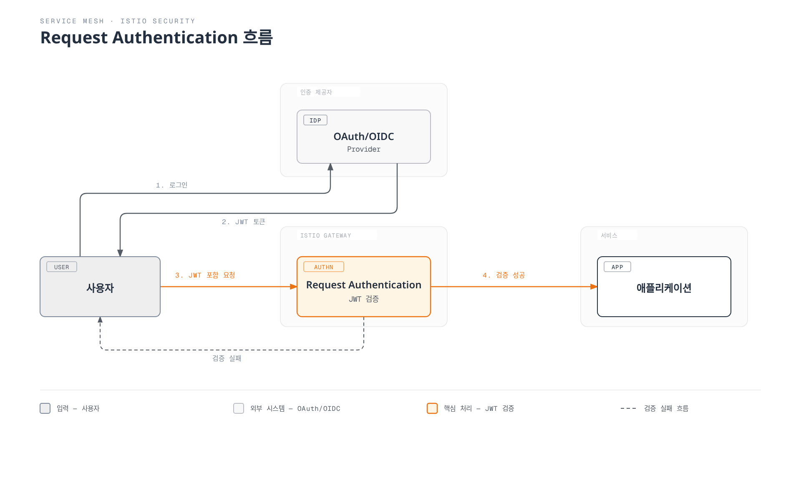

# 인증

Istio는 서비스 간 인증(Peer Authentication)과 최종 사용자 인증(Request Authentication)을 지원합니다.

## 목차

1. [인증 개요](#인증-개요)
2. [Request Authentication (JWT)](#request-authentication-jwt)
3. [OAuth/OIDC 통합](#oauthoidc-통합)
4. [실전 예제](#실전-예제)
5. [문제 해결](#문제-해결)

## 인증 개요

<p align="center">
  
</p>

Istio는 두 가지 유형의 인증을 제공합니다:

1. **Peer Authentication (서비스 간 인증)**
   - mTLS를 사용한 서비스 간 인증
   - SPIFFE ID 기반 신원 확인
   - PeerAuthentication CRD로 구성

2. **Request Authentication (최종 사용자 인증)**
   - JWT 토큰 기반 사용자 인증
   - OAuth/OIDC 제공자 통합
   - RequestAuthentication CRD로 구성



## Request Authentication (JWT)

### 기본 JWT 검증

```yaml
apiVersion: security.istio.io/v1
kind: RequestAuthentication
metadata:
  name: jwt-auth
  namespace: default
spec:
  selector:
    matchLabels:
      app: myapp
  jwtRules:
  - issuer: "https://accounts.google.com"
    jwksUri: "https://www.googleapis.com/oauth2/v3/certs"
```

### 여러 Issuer 지원

```yaml
apiVersion: security.istio.io/v1
kind: RequestAuthentication
metadata:
  name: multi-issuer-jwt
  namespace: default
spec:
  jwtRules:
  - issuer: "https://accounts.google.com"
    jwksUri: "https://www.googleapis.com/oauth2/v3/certs"
  - issuer: "https://login.microsoftonline.com/tenant-id/v2.0"
    jwksUri: "https://login.microsoftonline.com/tenant-id/discovery/v2.0/keys"
```

### Custom Header

```yaml
apiVersion: security.istio.io/v1
kind: RequestAuthentication
metadata:
  name: jwt-custom-header
  namespace: default
spec:
  jwtRules:
  - issuer: "https://auth.example.com"
    jwksUri: "https://auth.example.com/.well-known/jwks.json"
    fromHeaders:
    - name: "X-Auth-Token"
      prefix: "Bearer "
```

## OAuth/OIDC 통합

### AWS Cognito

```yaml
apiVersion: security.istio.io/v1
kind: RequestAuthentication
metadata:
  name: cognito-jwt
  namespace: default
spec:
  jwtRules:
  - issuer: "https://cognito-idp.{region}.amazonaws.com/{userPoolId}"
    jwksUri: "https://cognito-idp.{region}.amazonaws.com/{userPoolId}/.well-known/jwks.json"
```

### Keycloak

```yaml
apiVersion: security.istio.io/v1
kind: RequestAuthentication
metadata:
  name: keycloak-jwt
  namespace: default
spec:
  jwtRules:
  - issuer: "https://keycloak.example.com/auth/realms/myrealm"
    jwksUri: "https://keycloak.example.com/auth/realms/myrealm/protocol/openid-connect/certs"
```

### Auth0

```yaml
apiVersion: security.istio.io/v1
kind: RequestAuthentication
metadata:
  name: auth0-jwt
  namespace: default
spec:
  jwtRules:
  - issuer: "https://your-tenant.auth0.com/"
    jwksUri: "https://your-tenant.auth0.com/.well-known/jwks.json"
    audiences:
    - "https://your-api.example.com"
```

## 실전 예제

### JWT 검증 + Authorization

```yaml
# JWT 검증
apiVersion: security.istio.io/v1
kind: RequestAuthentication
metadata:
  name: jwt-auth
  namespace: default
spec:
  selector:
    matchLabels:
      app: myapp
  jwtRules:
  - issuer: "https://auth.example.com"
    jwksUri: "https://auth.example.com/.well-known/jwks.json"
---
# JWT 없으면 거부
apiVersion: security.istio.io/v1
kind: AuthorizationPolicy
metadata:
  name: require-jwt
  namespace: default
spec:
  selector:
    matchLabels:
      app: myapp
  action: DENY
  rules:
  - from:
    - source:
        notRequestPrincipals: ["*"]
```

## 문제 해결

### JWT 검증 실패

```bash
# 1. RequestAuthentication 확인
kubectl get requestauthentication -A
kubectl describe requestauthentication <name> -n <namespace>

# 2. JWT 토큰 디코드
echo "<jwt-token>" | cut -d'.' -f2 | base64 -d | jq

# 3. JWKS 엔드포인트 확인
curl https://auth.example.com/.well-known/jwks.json

# 4. Envoy 로그 확인
kubectl logs <pod-name> -c istio-proxy -n <namespace> | grep JWT
```

## 참고 자료

- [Istio Request Authentication](https://istio.io/latest/docs/reference/config/security/request_authentication/)
- [JWT Authentication](https://istio.io/latest/docs/tasks/security/authentication/authn-policy/)
