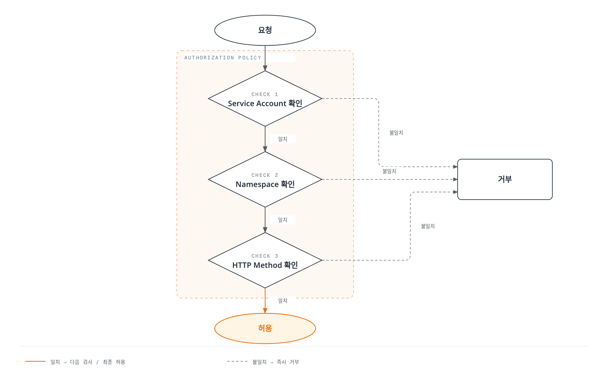

# 권한 부여

AuthorizationPolicy를 사용하여 서비스 접근 권한을 세밀하게 제어할 수 있습니다.

## 목차

1. [권한 부여 개요](#권한-부여-개요)
2. [기본 정책](#기본-정책)
3. [고급 정책](#고급-정책)
4. [실전 예제](#실전-예제)
5. [모범 사례](#모범-사례)

## 권한 부여 개요

<p align="center">
  
</p>

Istio AuthorizationPolicy는 서비스에 대한 세밀한 접근 제어를 제공합니다. 위 다이어그램은 Authorization Policy가 어떻게 작동하는지 보여줍니다:

1. **요청 수신**: Envoy가 인바운드 요청을 받음
2. **Policy 평가**: AuthorizationPolicy 규칙을 순서대로 평가
3. **접근 결정**: ALLOW, DENY, CUSTOM 액션 적용
4. **Audit Logging**: 모든 결정 기록

**지원되는 조건**:
- **Source**: 요청 출처 (ServiceAccount, Namespace, IP)
- **Operation**: HTTP 메서드, 경로, 포트
- **Conditions**: 커스텀 조건 (헤더, JWT 클레임 등)



## 기본 정책

### 기본 거부 (Deny All)

```yaml
apiVersion: security.istio.io/v1
kind: AuthorizationPolicy
metadata:
  name: deny-all
  namespace: default
spec:
  action: DENY
  rules:
  - {}  # 모든 요청 거부
```

### 기본 허용 (Allow All)

```yaml
apiVersion: security.istio.io/v1
kind: AuthorizationPolicy
metadata:
  name: allow-all
  namespace: default
spec:
  action: ALLOW
  rules:
  - {}  # 모든 요청 허용
```

### HTTP Method 기반

```yaml
apiVersion: security.istio.io/v1
kind: AuthorizationPolicy
metadata:
  name: httpbin-get-only
  namespace: default
spec:
  selector:
    matchLabels:
      app: httpbin
  action: ALLOW
  rules:
  - to:
    - operation:
        methods: ["GET"]  # GET만 허용
```

## 고급 정책

### Service Account 기반

```yaml
apiVersion: security.istio.io/v1
kind: AuthorizationPolicy
metadata:
  name: ratings-sa-policy
  namespace: default
spec:
  selector:
    matchLabels:
      app: ratings
  action: ALLOW
  rules:
  - from:
    - source:
        principals: ["cluster.local/ns/default/sa/reviews"]  # reviews SA만 허용
```

### Namespace 기반

```yaml
apiVersion: security.istio.io/v1
kind: AuthorizationPolicy
metadata:
  name: db-namespace-policy
  namespace: database
spec:
  selector:
    matchLabels:
      app: postgresql
  action: ALLOW
  rules:
  - from:
    - source:
        namespaces: ["production", "staging"]  # 특정 네임스페이스만
```

### Path 기반

```yaml
apiVersion: security.istio.io/v1
kind: AuthorizationPolicy
metadata:
  name: path-based-policy
  namespace: default
spec:
  selector:
    matchLabels:
      app: api
  action: ALLOW
  rules:
  - to:
    - operation:
        paths: ["/api/public/*"]  # 공개 API만 허용
  - from:
    - source:
        principals: ["cluster.local/ns/default/sa/admin"]
    to:
    - operation:
        paths: ["/api/admin/*"]  # admin SA는 admin API 접근 가능
```

### JWT Claims 기반

```yaml
apiVersion: security.istio.io/v1
kind: AuthorizationPolicy
metadata:
  name: jwt-claims-policy
  namespace: default
spec:
  selector:
    matchLabels:
      app: myapp
  action: ALLOW
  rules:
  - when:
    - key: request.auth.claims[role]
      values: ["admin", "superuser"]  # role claim이 admin 또는 superuser
```

## 참고 자료

- [Istio Authorization Policy](https://istio.io/latest/docs/reference/config/security/authorization-policy/)
- [Authorization Examples](https://istio.io/latest/docs/tasks/security/authorization/)
