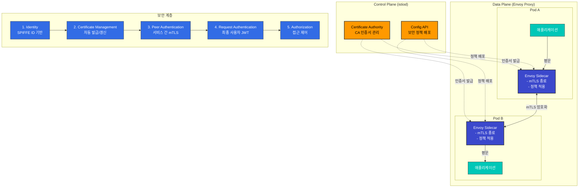

# Security

> **지원 버전**: Istio 1.28
> **마지막 업데이트**: 2025년 11월 27일

Istio는 서비스 메시 내에서 강력한 보안 기능을 제공합니다. Zero Trust 보안 모델을 기반으로 서비스 간 통신을 자동으로 암호화하고, 세밀한 접근 제어를 제공합니다.

## 목차

1. [보안 아키텍처 개요](#보안-아키텍처-개요)
2. [핵심 보안 기능](#핵심-보안-기능)
3. [보안 구성요소](#보안-구성요소)
4. [상세 문서](#상세-문서)
5. [보안 베스트 프랙티스](#보안-베스트-프랙티스)
6. [보안 모니터링](#보안-모니터링)

## 보안 아키텍처 개요

<p align="center">
  
</p>

Istio는 **Zero Trust 보안 모델**을 구현하여 서비스 메시 내의 모든 통신을 보호합니다. 보안 아키텍처는 4가지 핵심 계층으로 구성됩니다:

### 보안 아키텍처 계층



**아키텍처 핵심 구성 요소**:

1. **Control Plane (istiod)**
   - Certificate Authority (CA): X.509 인증서 발급 및 관리
   - Configuration API: 보안 정책 배포 및 관리
   - Service Discovery: 워크로드 Identity 관리

2. **Data Plane (Envoy Proxy)**
   - mTLS 종료점: 서비스 간 암호화 통신
   - Policy Enforcement: 인증/인가 정책 적용
   - Security Telemetry: 보안 메트릭 수집

3. **Identity Management**
   - SPIFFE 표준 기반 강력한 신원 관리
   - Kubernetes ServiceAccount와 통합
   - 자동 인증서 갱신 (기본 24시간)

4. **Policy Engine**
   - 선언적 보안 정책 (CRD 기반)
   - 세밀한 접근 제어 (RBAC)
   - Audit Logging 지원

## 핵심 보안 기능

Istio는 다음 핵심 보안 기능을 제공합니다:

### 1. 통신 보안 (mTLS)

<p align="center">
  
</p>

모든 서비스 간 통신을 자동으로 암호화합니다. Istio는 **PERMISSIVE** 모드를 통해 점진적 마이그레이션을 지원합니다.

```yaml
apiVersion: security.istio.io/v1
kind: PeerAuthentication
metadata:
  name: default
  namespace: istio-system
spec:
  mtls:
    mode: STRICT  # 프로덕션: STRICT, 마이그레이션: PERMISSIVE
```

**모드 설명**:
- **STRICT**: mTLS만 허용 (프로덕션 권장)
- **PERMISSIVE**: mTLS와 평문 둘 다 허용 (마이그레이션용)
- **DISABLE**: mTLS 비활성화

### 2. 인증 (Authentication)

<p align="center">
  
</p>

Istio는 두 계층의 인증을 제공합니다:

- **Peer Authentication**: 서비스 간 인증 (mTLS + SPIFFE ID)
- **Request Authentication**: 최종 사용자 인증 (JWT + OAuth/OIDC)

**예시**:
```yaml
# Request Authentication (JWT)
apiVersion: security.istio.io/v1
kind: RequestAuthentication
metadata:
  name: jwt-auth
spec:
  jwtRules:
  - issuer: "https://accounts.google.com"
    jwksUri: "https://www.googleapis.com/oauth2/v3/certs"
```

### 3. 권한 부여 (Authorization)

<p align="center">
  
</p>

세밀한 접근 제어 정책을 적용합니다. AuthorizationPolicy는 다음을 기반으로 제어합니다:
- Service Account / Namespace
- HTTP Method / Path
- IP 주소
- JWT 클레임

```yaml
apiVersion: security.istio.io/v1
kind: AuthorizationPolicy
metadata:
  name: allow-read
spec:
  action: ALLOW
  rules:
  - from:
    - source:
        principals: ["cluster.local/ns/default/sa/myapp"]
    to:
    - operation:
        methods: ["GET"]
        paths: ["/api/*"]
```

## 보안 베스트 프랙티스

### 1. Defense in Depth (다층 방어)

<p align="center">
  
</p>

여러 계층에서 보안을 적용하여 심층 방어를 구현합니다:

**Network Layer**:
```yaml
# 1. mTLS STRICT 모드 활성화
apiVersion: security.istio.io/v1
kind: PeerAuthentication
metadata:
  name: default
  namespace: istio-system
spec:
  mtls:
    mode: STRICT
```

**Application Layer**:
```yaml
# 2. JWT 인증 활성화
apiVersion: security.istio.io/v1
kind: RequestAuthentication
metadata:
  name: require-jwt
spec:
  jwtRules:
  - issuer: "https://your-auth-provider.com"
    jwksUri: "https://your-auth-provider.com/.well-known/jwks.json"
```

**Access Control Layer**:
```yaml
# 3. 기본 거부 정책
apiVersion: security.istio.io/v1
kind: AuthorizationPolicy
metadata:
  name: deny-all
spec:
  action: DENY
  rules:
  - {}
---
# 4. 필요한 접근만 허용
apiVersion: security.istio.io/v1
kind: AuthorizationPolicy
metadata:
  name: allow-specific
spec:
  action: ALLOW
  rules:
  - from:
    - source:
        principals: ["cluster.local/ns/frontend/sa/webapp"]
    to:
    - operation:
        methods: ["GET", "POST"]
```

### 2. Principle of Least Privilege (최소 권한 원칙)

- 각 서비스에 필요한 최소한의 권한만 부여
- ServiceAccount를 세밀하게 분리
- Namespace 격리 활용

### 3. Security Monitoring

- Istio Access Log 활성화
- Prometheus로 보안 메트릭 수집
- Kiali로 mTLS 상태 모니터링

## 다음 단계

1. **[mTLS](01-mtls.md)**: 서비스 간 암호화 및 Identity 관리
2. **[인증](02-authentication.md)**: JWT 및 OAuth/OIDC 통합
3. **[권한 부여](03-authorization.md)**: 세밀한 접근 제어 정책

## 참고 자료

### 공식 문서
- [Istio Security Concepts](https://istio.io/latest/docs/concepts/security/)
- [Security Best Practices](https://istio.io/latest/docs/ops/best-practices/security/)
- [Security Reference](https://istio.io/latest/docs/reference/config/security/)

### 관련 표준
- [SPIFFE Specification](https://github.com/spiffe/spiffe)
- [OAuth 2.0 / OIDC](https://oauth.net/2/)
- [JWT (RFC 7519)](https://datatracker.ietf.org/doc/html/rfc7519)

## 퀴즈

이 장에서 배운 내용을 테스트하려면 [Istio Security 퀴즈](../../../quizzes/service-mesh/istio/security.md)를 풀어보세요.
