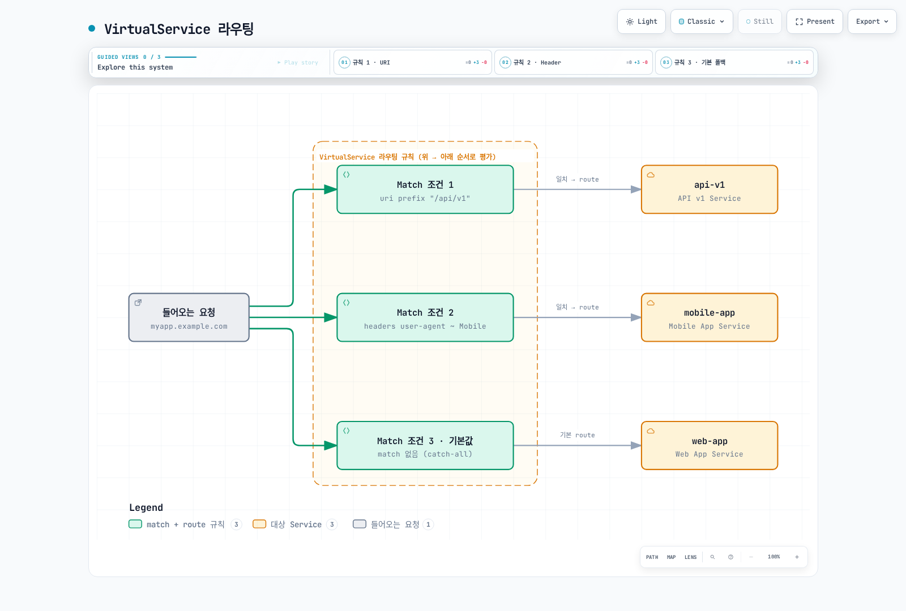

# 라우팅

Istio의 고급 라우팅 기능을 사용하면 요청의 다양한 속성을 기반으로 트래픽을 세밀하게 제어할 수 있습니다.

## 목차

1. [라우팅 개요](#라우팅-개요)
2. [Match 조건](#match-조건)
3. [URI 기반 라우팅](#uri-기반-라우팅)
4. [Header 기반 라우팅](#header-기반-라우팅)
5. [Query Parameter 기반 라우팅](#query-parameter-기반-라우팅)
6. [HTTP Method 기반 라우팅](#http-method-기반-라우팅)
7. [소스 기반 라우팅](#소스-기반-라우팅)
8. [우선순위와 폴백](#우선순위와-폴백)
9. [실전 예제](#실전-예제)
10. [문제 해결](#문제-해결)

## 라우팅 개요

각 예제는 독립적인 Sidecar 라우팅 구성입니다. 참조하는 Service와 subset을 준비하고 같은 호스트의 중복 VirtualService는 하나씩 적용하세요. `gateways`가 없으면 메시 Sidecar에 적용되며 외부 호스트의 인바운드 예제는 기존 Gateway 연결과 호스트 일치도 필요합니다. 헤더·쿼리 파라미터·출발 워크로드 레이블은 라우팅 입력이며 사용자 ID 증명이 아닙니다. 테넌트/사용자 권한은 인증과 AuthorizationPolicy로 집행하세요.

VirtualService의 라우팅 규칙은 **Match 조건**과 **Route 대상**으로 구성됩니다.



[🔍 인터랙티브 다이어그램 보기](https://www.atomai.click/kubernetes-docs/archmaps/ko-service-mesh-istio-traffic-management-02-routing-0.html)

### 기본 구조

```yaml
apiVersion: networking.istio.io/v1
kind: VirtualService
metadata:
  name: routing-example
spec:
  hosts:
  - myapp.example.com
  http:
  - match:
    - uri:
        prefix: "/api/v1"
    route:
    - destination:
        host: api-v1
  - match:
    - headers:
        user-agent:
          regex: ".*Mobile.*"
    route:
    - destination:
        host: mobile-app
  - route:  # 기본 라우트 (match 없음)
    - destination:
        host: web-app
```

## Match 조건

### Match 조건 유형

| 조건 | 설명 | 매칭 타입 |
|------|------|----------|
| **uri** | 요청 경로 | `exact`, `prefix`, `regex` |
| **scheme** | HTTP/HTTPS | `exact`, `prefix`, `regex` |
| **method** | HTTP 메서드 | `exact`, `prefix`, `regex` |
| **authority** | Host 헤더 | `exact`, `prefix`, `regex` |
| **headers** | HTTP 헤더 | `exact`, `prefix`, `regex` |
| **queryParams** | 쿼리 파라미터 | `exact`, `prefix`, `regex` |
| **sourceLabels** | 소스 워크로드 레이블 | Label selector |
| **gateways** | Gateway 이름 | List |

### 매칭 타입

```yaml
# exact: 정확히 일치
match:
- uri:
    exact: "/login"
```

```yaml
# prefix: 접두사 일치
match:
- uri:
    prefix: "/api/"
```

```yaml
# regex: 정규 표현식 일치
match:
- uri:
    regex: "^/api/v[0-9]+/.*"
```

### 여러 조건 조합

```yaml
# AND 조건: 모든 조건이 일치해야 함
http:
- match:
  - uri:
      prefix: "/api"
    headers:
      x-api-version:
        exact: "v2"
    queryParams:
      debug:
        exact: "true"
  route:
  - destination:
      host: api-debug
```

```yaml
# OR 조건: 여러 match 블록 사용
http:
- match:
  - uri:
      prefix: "/api/v1"
  - uri:
      prefix: "/api/v2"
  route:
  - destination:
      host: api-service
```

## URI 기반 라우팅

### Prefix 매칭

```yaml
apiVersion: networking.istio.io/v1
kind: VirtualService
metadata:
  name: uri-prefix-routing
spec:
  hosts:
  - myapp.example.com
  http:
  # API 트래픽
  - match:
    - uri:
        prefix: "/api/"
    route:
    - destination:
        host: api-service
        port:
          number: 8080

  # Admin 트래픽
  - match:
    - uri:
        prefix: "/admin/"
    route:
    - destination:
        host: admin-service
        port:
          number: 9000

  # 정적 파일
  - match:
    - uri:
        prefix: "/static/"
    route:
    - destination:
        host: static-service
        port:
          number: 8000

  # 기본 트래픽
  - route:
    - destination:
        host: frontend-service
        port:
          number: 3000
```

### Exact 매칭

```yaml
apiVersion: networking.istio.io/v1
kind: VirtualService
metadata:
  name: uri-exact-routing
spec:
  hosts:
  - myapp.example.com
  http:
  # 로그인 페이지
  - match:
    - uri:
        exact: "/login"
    route:
    - destination:
        host: auth-service

  # 로그아웃
  - match:
    - uri:
        exact: "/logout"
    route:
    - destination:
        host: auth-service

  # Health check
  - match:
    - uri:
        exact: "/health"
    route:
    - destination:
        host: health-service
```

### Regex 매칭

```yaml
apiVersion: networking.istio.io/v1
kind: VirtualService
metadata:
  name: uri-regex-routing
spec:
  hosts:
  - myapp.example.com
  http:
  # API 버전별 라우팅: /api/v1/, /api/v2/, etc.
  - match:
    - uri:
        regex: "^/api/v[0-9]+/.*"
    route:
    - destination:
        host: api-service

  # 숫자로 된 리소스 ID: /users/123
  - match:
    - uri:
        regex: "^/users/[0-9]+$"
    route:
    - destination:
        host: user-service

  # 파일 확장자별: .jpg, .png, .gif
  - match:
    - uri:
        regex: ".*\\.(jpg|png|gif)$"
    route:
    - destination:
        host: image-service
```

## Header 기반 라우팅

### User-Agent 기반 라우팅

```yaml
apiVersion: networking.istio.io/v1
kind: VirtualService
metadata:
  name: header-user-agent-routing
spec:
  hosts:
  - reviews
  http:
  # Tablet 디바이스
  - match:
    - headers:
        user-agent:
          regex: ".*(iPad|Tablet).*"
    route:
    - destination:
        host: reviews
        subset: tablet

  # Mobile 디바이스
  - match:
    - headers:
        user-agent:
          regex: ".*Mobile.*"
    route:
    - destination:
        host: reviews
        subset: mobile

  # Desktop (기본)
  - route:
    - destination:
        host: reviews
        subset: desktop
```

### Custom Header 기반 라우팅

```yaml
apiVersion: networking.istio.io/v1
kind: VirtualService
metadata:
  name: header-custom-routing
spec:
  hosts:
  - myapp
  http:
  # 개발자/테스터용 라우팅
  - match:
    - headers:
        x-dev-user:
          exact: "true"
    route:
    - destination:
        host: myapp
        subset: dev

  # 베타 테스터
  - match:
    - headers:
        x-beta-tester:
          exact: "true"
    route:
    - destination:
        host: myapp
        subset: beta

  # VIP 사용자
  - match:
    - headers:
        x-user-tier:
          exact: "vip"
    route:
    - destination:
        host: myapp
        subset: vip

  # 일반 사용자
  - route:
    - destination:
        host: myapp
        subset: stable
```

### API 버전 기반 라우팅

```yaml
apiVersion: networking.istio.io/v1
kind: VirtualService
metadata:
  name: header-api-version-routing
spec:
  hosts:
  - api.example.com
  http:
  # API v3
  - match:
    - headers:
        x-api-version:
          exact: "v3"
    route:
    - destination:
        host: api-service
        subset: v3

  # API v2
  - match:
    - headers:
        x-api-version:
          exact: "v2"
    route:
    - destination:
        host: api-service
        subset: v2

  # API v1 (기본)
  - route:
    - destination:
        host: api-service
        subset: v1
```

## Query Parameter 기반 라우팅

### 기본 Query Parameter 매칭

```yaml
apiVersion: networking.istio.io/v1
kind: VirtualService
metadata:
  name: query-param-routing
spec:
  hosts:
  - search.example.com
  http:
  # 디버그 모드: ?debug=true
  - match:
    - queryParams:
        debug:
          exact: "true"
    route:
    - destination:
        host: search-service
        subset: debug

  # 프리미엄 검색: ?premium=1
  - match:
    - queryParams:
        premium:
          exact: "1"
    route:
    - destination:
        host: search-service
        subset: premium

  # A/B 테스트: ?variant=b
  - match:
    - queryParams:
        variant:
          exact: "b"
    route:
    - destination:
        host: search-service
        subset: variant-b

  # 기본 검색
  - route:
    - destination:
        host: search-service
        subset: standard
```

### 여러 Query Parameter 조합

```yaml
apiVersion: networking.istio.io/v1
kind: VirtualService
metadata:
  name: query-param-combined-routing
spec:
  hosts:
  - api.example.com
  http:
  # 디버그 모드 + 상세 로그
  - match:
    - queryParams:
        debug:
          exact: "true"
        verbose:
          exact: "true"
    route:
    - destination:
        host: api-service
        subset: debug-verbose

  # 디버그 모드만
  - match:
    - queryParams:
        debug:
          exact: "true"
    route:
    - destination:
        host: api-service
        subset: debug

  # 일반 모드
  - route:
    - destination:
        host: api-service
        subset: production
```

## HTTP Method 기반 라우팅

```yaml
apiVersion: networking.istio.io/v1
kind: VirtualService
metadata:
  name: method-based-routing
spec:
  hosts:
  - api.example.com
  http:
  # POST 요청 → 쓰기 전용 서비스
  - match:
    - method:
        exact: "POST"
      uri:
        prefix: "/api/"
    route:
    - destination:
        host: api-write-service

  # PUT/PATCH 요청 → 업데이트 서비스
  - match:
    - method:
        regex: "PUT|PATCH"
      uri:
        prefix: "/api/"
    route:
    - destination:
        host: api-update-service

  # DELETE 요청 → 삭제 서비스
  - match:
    - method:
        exact: "DELETE"
      uri:
        prefix: "/api/"
    route:
    - destination:
        host: api-delete-service

  # GET 요청 → 읽기 전용 서비스
  - match:
    - method:
        exact: "GET"
      uri:
        prefix: "/api/"
    route:
    - destination:
        host: api-read-service
```

## 소스 기반 라우팅

`sourceLabels`와 `sourceNamespace`는 구성을 받을 출발 Sidecar를 선택하며 인바운드 게이트웨이에서 요청별로 인증하는 조건이 아닙니다. 최상위 gateways를 명시했다면 `mesh`를 포함해야 합니다. 아래 database 예제는 일반 SQL 프로토콜이 아닌 HTTP 서비스라는 가정입니다.

### Namespace 기반 라우팅

```yaml
apiVersion: networking.istio.io/v1
kind: VirtualService
metadata:
  name: source-namespace-routing
  namespace: production
spec:
  hosts:
  - database.production.svc.cluster.local
  http:
  # production 네임스페이스에서 온 요청
  - match:
    - sourceNamespace: production
    route:
    - destination:
        host: database
        subset: production

  # staging 네임스페이스에서 온 요청
  - match:
    - sourceNamespace: staging
    route:
    - destination:
        host: database
        subset: staging

  # HTTP 거부 응답 예시; ID 정책은 목적지에서 집행
  - directResponse:
      status: 403
```

### 소스 워크로드 레이블 기반 라우팅

```yaml
apiVersion: networking.istio.io/v1
kind: VirtualService
metadata:
  name: source-sa-routing
spec:
  hosts:
  - payment-service
  http:
  # 일치하는 출발 워크로드 레이블에 구성 적용
  - match:
    - sourceLabels:
        app: frontend
        version: v2
    route:
    - destination:
        host: payment-service
        subset: v2

  # 레거시 서비스
  - match:
    - sourceLabels:
        app: frontend
        version: v1
    route:
    - destination:
        host: payment-service
        subset: v1
```

## 우선순위와 폴백

### Match 규칙 우선순위

Istio는 VirtualService의 HTTP 라우팅 규칙을 **위에서 아래로** 평가합니다.

```yaml
apiVersion: networking.istio.io/v1
kind: VirtualService
metadata:
  name: priority-example
spec:
  hosts:
  - myapp.example.com
  http:
  # 1순위: 가장 구체적인 조건
  - match:
    - uri:
        exact: "/api/v2/users/admin"
      headers:
        x-admin:
          exact: "true"
    route:
    - destination:
        host: admin-api-v2

  # 2순위: 중간 구체성
  - match:
    - uri:
        prefix: "/api/v2/"
    route:
    - destination:
        host: api-v2

  # 3순위: 덜 구체적
  - match:
    - uri:
        prefix: "/api/"
    route:
    - destination:
        host: api-v1

  # 4순위 (마지막): 기본 폴백
  - route:
    - destination:
        host: frontend
```

### 폴백 전략

여기서 폴백은 앞 조건에 일치하지 않은 요청의 기본 경로입니다. 경로가 선택된 뒤 업스트림 오류가 나도 다음 라우팅 규칙으로 다시 평가하지 않습니다. 장애 복구에는 재시도·Outlier Detection 또는 롤아웃 컨트롤러를 별도 구성하세요.

```yaml
apiVersion: networking.istio.io/v1
kind: VirtualService
metadata:
  name: fallback-strategy
spec:
  hosts:
  - myapp
  http:
  # 특정 조건의 요청
  - match:
    - headers:
        x-canary:
          exact: "true"
    route:
    - destination:
        host: myapp
        subset: canary
    # Canary 실패 시 폴백 없음 - 에러 반환

  # Canary 조건에 일치하지 않은 요청의 기본 경로
  - route:
    - destination:
        host: myapp
        subset: stable
      weight: 100
```

## 실전 예제

### 예제 1: 멀티 테넌트 라우팅

```yaml
apiVersion: networking.istio.io/v1
kind: VirtualService
metadata:
  name: multi-tenant-routing
spec:
  hosts:
  - api.example.com
  - tenant-b.api.example.com
  http:
  # 테넌트 A (헤더로 식별)
  - match:
    - headers:
        x-tenant-id:
          exact: "tenant-a"
    route:
    - destination:
        host: api-service
        subset: tenant-a

  # 테넌트 B (서브도메인으로 식별)
  - match:
    - authority:
        exact: "tenant-b.api.example.com"
    route:
    - destination:
        host: api-service
        subset: tenant-b

  # 테넌트 C (경로로 식별)
  - match:
    - uri:
        prefix: "/tenant-c/"
    rewrite:
      uri: "/"
    route:
    - destination:
        host: api-service
        subset: tenant-c
```

### 예제 2: Feature Flag 기반 라우팅

```yaml
apiVersion: networking.istio.io/v1
kind: VirtualService
metadata:
  name: feature-flag-routing
spec:
  hosts:
  - myapp
  http:
  # 새 기능 활성화 사용자
  - match:
    - headers:
        x-feature-new-ui:
          exact: "enabled"
    route:
    - destination:
        host: myapp
        subset: new-ui

  # 베타 기능 테스터
  - match:
    - headers:
        x-feature-beta:
          exact: "enabled"
    route:
    - destination:
        host: myapp
        subset: beta

  # role=employee 레이블과 기능 헤더가 있는 워크로드
  - match:
    - headers:
        x-feature-experimental:
          exact: "enabled"
      sourceLabels:
        role: employee
    route:
    - destination:
        host: myapp
        subset: experimental

  # 기본 (안정 버전)
  - route:
    - destination:
        host: myapp
        subset: stable
```

### 예제 3: 지역 기반 라우팅

```yaml
apiVersion: networking.istio.io/v1
kind: VirtualService
metadata:
  name: geo-routing
spec:
  hosts:
  - content.example.com
  http:
  # 한국 사용자
  - match:
    - headers:
        x-country-code:
          exact: "KR"
    route:
    - destination:
        host: content-service
        subset: korea

  # 일본 사용자
  - match:
    - headers:
        x-country-code:
          exact: "JP"
    route:
    - destination:
        host: content-service
        subset: japan

  # 미국 사용자
  - match:
    - headers:
        x-country-code:
          exact: "US"
    route:
    - destination:
        host: content-service
        subset: us

  # 유럽 사용자
  - match:
    - headers:
        x-country-code:
          regex: "DE|FR|GB|IT|ES"
    route:
    - destination:
        host: content-service
        subset: europe

  # 기타 지역 (글로벌)
  - route:
    - destination:
        host: content-service
        subset: global
```

### 예제 4: API 게이트웨이 패턴

`api-gateway`를 실제 게이트웨이에 연결하고 노출 전에 보호 경로에 [JWT 인증 및 인가](../security/02-authentication.md)를 적용하세요. `Bearer ...` 문자열 매칭은 토큰 검증이 아닙니다. 자격 증명이 없다고 보호 경로가 공개/일반 라우트로 넘어가서는 안 됩니다. 지역/테넌트 헤더가 접근 결정에 쓰이면 신뢰하고 인증한 출처에서 제공되어야 합니다.

```yaml
apiVersion: networking.istio.io/v1
kind: VirtualService
metadata:
  name: api-gateway-routing
spec:
  hosts:
  - api.example.com
  gateways:
  - api-gateway
  http:
  # 보호 경로 라우팅; JWT/인가는 별도 집행 필요
  - match:
    - uri:
        prefix: "/api/v1/protected/"
    route:
    - destination:
        host: protected-api-service

  # 공개 API
  - match:
    - uri:
        prefix: "/api/v1/public/"
    route:
    - destination:
        host: public-api-service

  # GraphQL 엔드포인트
  - match:
    - uri:
        exact: "/graphql"
      method:
        exact: "POST"
    route:
    - destination:
        host: graphql-service

  # REST API
  - match:
    - uri:
        prefix: "/api/v1/"
    route:
    - destination:
        host: rest-api-service

  # Health check
  - match:
    - uri:
        exact: "/health"
    route:
    - destination:
        host: health-service

  # 일치하지 않는 경로에 404 응답
  - directResponse:
      status: 404
```

## 문제 해결

### 라우팅이 작동하지 않음

```bash
# 1. VirtualService 상태 확인
kubectl get virtualservice -A
kubectl describe virtualservice <name> -n <namespace>

# 2. 라우팅 규칙 확인
istioctl proxy-config routes <pod-name> -n <namespace>

# 3. 특정 서비스로의 라우팅 확인
istioctl proxy-config routes <pod-name> -n <namespace> --name <route-name> -o json

# 4. 구성 검증
istioctl analyze -n <namespace>
```

### Match 조건 디버깅

```bash
# Envoy 로그 레벨 증가
istioctl proxy-config log <pod-name> -n <namespace> --level debug

# 요청 추적
kubectl logs -n <namespace> <pod-name> -c istio-proxy -f

# Pilot 디버그
kubectl logs -n istio-system -l app=istiod --tail=100
```

### 일반적인 문제

#### 1. Match 순서 문제

```yaml
# ❌ 잘못된 순서 - 기본 라우트가 먼저 오면 다른 규칙 무시됨
http:
- route:  # 모든 트래픽이 여기로
  - destination:
      host: myapp
- match:  # 절대 실행 안 됨
  - uri:
      prefix: "/api"
  route:
  - destination:
      host: api-service
```

```yaml
# ✅ 올바른 순서
http:
- match:  # 구체적인 규칙 먼저
  - uri:
      prefix: "/api"
  route:
  - destination:
      host: api-service
- route:  # 기본 라우트는 마지막
  - destination:
      host: myapp
```

#### 2. Regex 매칭 범위

RE2는 전체 문자열을 매칭합니다. `/api/v[1-3]`은 유효한 문법으로 `/api/v1`에는 일치하지만 `/api/v1/users`에는 일치하지 않습니다. `/`를 이스케이프할 필요는 없습니다. 버전 루트와 하위 경로를 함께 매칭하려면:

```yaml
match:
- uri:
    regex: "^/api/v[1-3](/.*)?$"
```

#### 3. Header 이름

전송되는 HTTP 헤더 이름은 대소문자를 구분하지 않지만 Istio match 맵의 키는 소문자로 작성해야 합니다. 값은 표현식에서 달리 지정하지 않으면 대소문자를 구분합니다.

```yaml
match:
- headers:
    x-custom-header:
      exact: "value"
```

## 모범 사례

### 1. 구체적인 규칙을 먼저 배치

```yaml
# ✅ 좋은 예
http:
- match:
  - uri:
      exact: "/api/v2/admin"  # 가장 구체적
  route:
  - destination:
      host: admin-v2
- match:
  - uri:
      prefix: "/api/v2/"  # 중간
  route:
  - destination:
      host: api-v2
- match:
  - uri:
      prefix: "/api/"  # 일반적
  route:
  - destination:
      host: api-v1
- route:  # 기본값
  - destination:
      host: frontend
```

### 2. 정규 표현식은 최소화

```yaml
# ❌ 피하기 - 복잡한 regex는 성능 저하
match:
- uri:
    regex: "^/(api|admin|public)/v[0-9]+/(users|products|orders)/[a-zA-Z0-9_-]+$"
```

```yaml
# ✅ 권장 - prefix나 exact 사용
match:
- uri:
    prefix: "/api/v1/"
```

### 3. 명확한 네이밍

```yaml
# ✅ 명확한 이름 사용
apiVersion: networking.istio.io/v1
kind: VirtualService
metadata:
  name: product-api-routing  # 명확한 이름
  labels:
    app: product-service
    purpose: routing
spec:
  hosts:
  - product-api.example.com
  http:
  - route:
    - destination:
        host: product-api-service
```

### 4. 문서화

```yaml
apiVersion: networking.istio.io/v1
kind: VirtualService
metadata:
  name: myapp-routing
  annotations:
    description: "Routes traffic based on API version and user type"
    owner: "platform-team"
spec:
  hosts:
  - myapp.example.com
  http:
  # VIP 사용자를 전용 인스턴스로 라우팅
  - match:
    - headers:
        x-user-tier:
          exact: "vip"
    route:
    - destination:
        host: myapp
        subset: vip
```

### 5. 테스트 전략

GATEWAY_URL을 설치된 인바운드 주소/포트로 지정하고 현재 적용한 예제의 Host와 헤더에 맞추세요. 메시 내부 예제를 외부 curl로 검사하려면 먼저 해당 Gateway에 연결해야 합니다. 임시 프록시 debug 로그 레벨은 조사 후 원래대로 복구하세요.

```bash
# 라우팅 규칙 테스트 스크립트
#!/bin/bash

# API v1 테스트
curl -H "Host: api.example.com" http://$GATEWAY_URL/api/v1/users

# API v2 테스트
curl -H "Host: api.example.com" http://$GATEWAY_URL/api/v2/users

# Mobile 사용자 테스트
curl -H "Host: myapp.example.com" -H "User-Agent: Mobile" "http://$GATEWAY_URL/"

# Header 기반 테스트
curl -H "Host: myapp.example.com" -H "x-canary: true" "http://$GATEWAY_URL/"
```

## 참고 자료

- [Istio Traffic Management](https://istio.io/latest/docs/concepts/traffic-management/)
- [VirtualService Reference](https://istio.io/latest/docs/reference/config/networking/virtual-service/)
- [HTTP Route Matching](https://istio.io/latest/docs/reference/config/networking/virtual-service/#HTTPMatchRequest)
- [Traffic Routing](https://istio.io/latest/docs/tasks/traffic-management/request-routing/)
