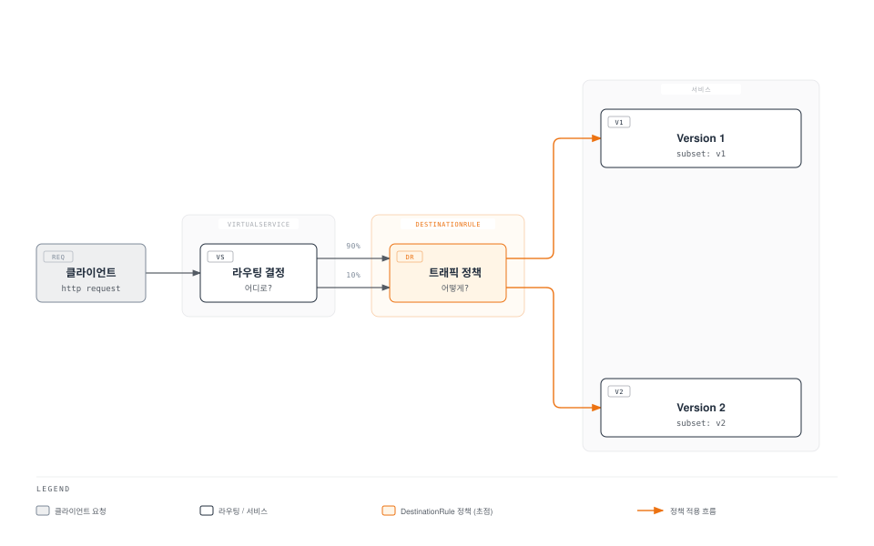
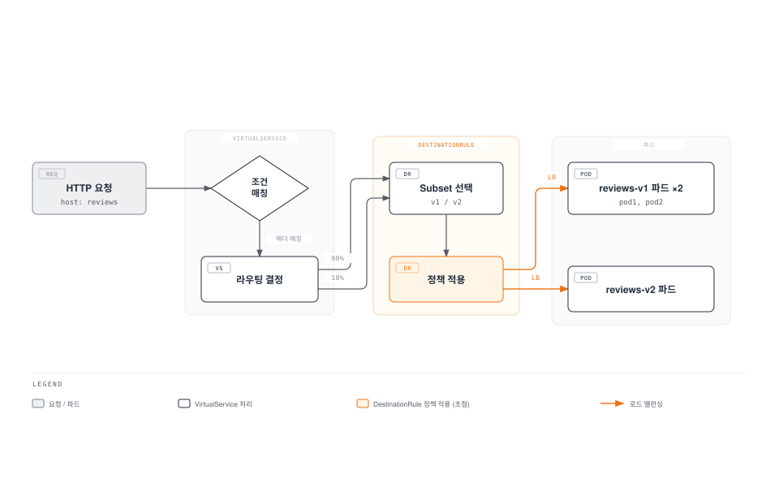
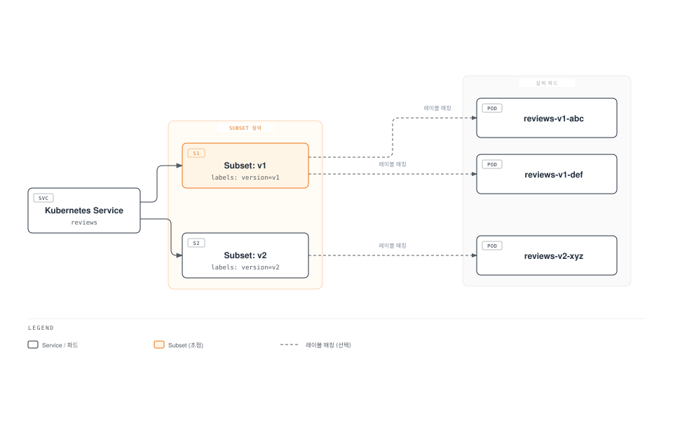
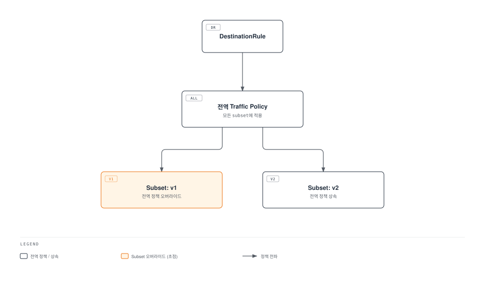

# DestinationRule

> **지원 버전**: Istio 1.28+ **API 버전**: `networking.istio.io/v1` **마지막 업데이트**: 2026년 2월 23일

DestinationRule은 VirtualService가 트래픽을 라우팅한 후, 해당 트래픽을 어떻게 처리할지 정의하는 Istio의 핵심 리소스입니다.

## 목차

1. [DestinationRule이란?](03-destination-rule.md#destinationrule이란)
2. [VirtualService vs DestinationRule](03-destination-rule.md#virtualservice-vs-destinationrule)
3. [Subset 개념](03-destination-rule.md#subset-개념)
4. [기본 구조](03-destination-rule.md#기본-구조)
5. [Subset 정의하기](03-destination-rule.md#subset-정의하기)
6. [Traffic Policy 개요](03-destination-rule.md#traffic-policy-개요)
7. [VirtualService와 함께 사용](03-destination-rule.md#virtualservice와-함께-사용)
8. [실전 예제](03-destination-rule.md#실전-예제)
9. [모범 사례](03-destination-rule.md#모범-사례)
10. [문제 해결](03-destination-rule.md#문제-해결)

## DestinationRule이란?

DestinationRule은 **라우팅 이후의 트래픽 정책**을 정의합니다. VirtualService가 "어디로" 보낼지 결정한다면, DestinationRule은 "어떻게" 처리할지 결정합니다.



### DestinationRule의 주요 역할

| 역할                  | 설명         | 예시                           |
| ------------------- | ---------- | ---------------------------- |
| **Subset 정의**       | 서비스 버전 그룹화 | v1, v2, canary, stable       |
| **Load Balancing**  | 부하 분산 알고리즘 | ROUND\_ROBIN, LEAST\_REQUEST |
| **Connection Pool** | 연결 풀 설정    | 최대 연결 수, Timeout             |
| **Circuit Breaker** | 장애 격리      | Outlier Detection            |
| **TLS 설정**          | 암호화 정책     | mTLS, SIMPLE TLS             |

## VirtualService vs DestinationRule

두 리소스는 함께 사용되어 완전한 트래픽 관리를 제공합니다.

### 역할 비교



### 책임 분리

**VirtualService (어디로?)**:

```yaml
apiVersion: networking.istio.io/v1
kind: VirtualService
metadata:
  name: reviews
spec:
  hosts:
  - reviews
  http:
  - match:
    - headers:
        end-user:
          exact: jason
    route:
    - destination:
        host: reviews
        subset: v2  # ← DestinationRule의 subset 참조
  - route:
    - destination:
        host: reviews
        subset: v1  # ← DestinationRule의 subset 참조
```

**DestinationRule (어떻게?)**:

```yaml
apiVersion: networking.istio.io/v1
kind: DestinationRule
metadata:
  name: reviews
spec:
  host: reviews
  trafficPolicy:  # ← 모든 subset에 적용되는 기본 정책
    loadBalancer:
      simple: LEAST_REQUEST
  subsets:  # ← VirtualService가 참조하는 subset 정의
  - name: v1
    labels:
      version: v1
  - name: v2
    labels:
      version: v2
    trafficPolicy:  # ← v2에만 적용되는 정책
      loadBalancer:
        simple: ROUND_ROBIN
```

## Subset 개념

Subset은 서비스의 **논리적 그룹**을 정의합니다. 주로 버전, 배포 단계, 지역 등으로 구분합니다.

### Subset의 본질



### Subset 사용 시나리오

#### 1. 버전 기반 라우팅

```yaml
apiVersion: networking.istio.io/v1
kind: DestinationRule
metadata:
  name: reviews-versions
spec:
  host: reviews
  subsets:
  - name: v1
    labels:
      version: v1
  - name: v2
    labels:
      version: v2
  - name: v3
    labels:
      version: v3
```

```yaml
# 파드 레이블
apiVersion: v1
kind: Pod
metadata:
  labels:
    app: reviews
    version: v1  # ← Subset과 매칭
```

#### 2. 배포 단계별 구분

```yaml
apiVersion: networking.istio.io/v1
kind: DestinationRule
metadata:
  name: reviews-deployment-stages
spec:
  host: reviews
  subsets:
  - name: stable
    labels:
      stage: stable
  - name: canary
    labels:
      stage: canary
  - name: test
    labels:
      stage: test
```

#### 3. 지역별 구분

```yaml
apiVersion: networking.istio.io/v1
kind: DestinationRule
metadata:
  name: api-regions
spec:
  host: api-service
  subsets:
  - name: us-west
    labels:
      region: us-west
  - name: us-east
    labels:
      region: us-east
  - name: eu-central
    labels:
      region: eu-central
```

#### 4. 환경별 구분

```yaml
apiVersion: networking.istio.io/v1
kind: DestinationRule
metadata:
  name: payment-environments
spec:
  host: payment-service
  subsets:
  - name: production
    labels:
      env: production
  - name: staging
    labels:
      env: staging
```

## 기본 구조

### 필수 필드

```yaml
apiVersion: networking.istio.io/v1
kind: DestinationRule
metadata:
  name: my-destination-rule
  namespace: default
spec:
  host: my-service  # 필수: 대상 서비스
  subsets:          # 선택: Subset 정의
  - name: v1
    labels:
      version: v1
  trafficPolicy:    # 선택: 트래픽 정책
    loadBalancer:
      simple: ROUND_ROBIN
```

### Host 지정 방법

**1. 서비스 이름 (같은 네임스페이스)**

```yaml
spec:
  host: reviews
```

**2. FQDN (다른 네임스페이스)**

```yaml
spec:
  host: reviews.production.svc.cluster.local
```

**3. 와일드카드**

```yaml
spec:
  host: "*.example.com"
```

**4. 외부 서비스 (ServiceEntry와 함께)**

```yaml
spec:
  host: api.external.com
```

## Subset 정의하기

### 단순 Subset

```yaml
apiVersion: networking.istio.io/v1
kind: DestinationRule
metadata:
  name: reviews-simple
spec:
  host: reviews
  subsets:
  - name: v1
    labels:
      version: v1
  - name: v2
    labels:
      version: v2
```

### Subset별 개별 정책

```yaml
apiVersion: networking.istio.io/v1
kind: DestinationRule
metadata:
  name: reviews-subset-policies
spec:
  host: reviews
  trafficPolicy:  # 기본 정책 (모든 subset)
    loadBalancer:
      simple: LEAST_REQUEST
  subsets:
  - name: v1
    labels:
      version: v1
    # v1은 기본 정책 사용

  - name: v2
    labels:
      version: v2
    trafficPolicy:  # v2만의 정책 (기본 정책 오버라이드)
      loadBalancer:
        simple: ROUND_ROBIN
      connectionPool:
        http:
          http1MaxPendingRequests: 10
```

### 복잡한 레이블 매칭

```yaml
apiVersion: networking.istio.io/v1
kind: DestinationRule
metadata:
  name: api-complex
spec:
  host: api-service
  subsets:
  - name: us-west-v2
    labels:
      version: v2
      region: us-west
      tier: premium
  - name: us-east-v1
    labels:
      version: v1
      region: us-east
      tier: standard
```

## Traffic Policy 개요

DestinationRule의 `trafficPolicy`는 다양한 트래픽 제어 기능을 제공합니다.

### Traffic Policy 계층 구조



### Traffic Policy 구성 요소

#### 1. Load Balancer

```yaml
trafficPolicy:
  loadBalancer:
    simple: ROUND_ROBIN  # LEAST_REQUEST, RANDOM, PASSTHROUGH
```

자세한 내용은 [로드 밸런싱](06-load-balancing.md) 참조

#### 2. Connection Pool

```yaml
trafficPolicy:
  connectionPool:
    tcp:
      maxConnections: 100
    http:
      http1MaxPendingRequests: 50
      http2MaxRequests: 100
      maxRequestsPerConnection: 2
```

자세한 내용은 [Circuit Breaker](07-circuit-breaker.md) 참조

#### 3. Outlier Detection

```yaml
trafficPolicy:
  outlierDetection:
    consecutiveErrors: 5
    interval: 30s
    baseEjectionTime: 30s
    maxEjectionPercent: 50
```

자세한 내용은 [Circuit Breaker](07-circuit-breaker.md) 참조

#### 4. TLS 설정

```yaml
trafficPolicy:
  tls:
    mode: ISTIO_MUTUAL  # DISABLE, SIMPLE, MUTUAL
```

자세한 내용은 [보안](../security/01-mtls.md) 참조

#### 5. Port Level Settings

```yaml
trafficPolicy:
  portLevelSettings:
  - port:
      number: 80
    loadBalancer:
      simple: ROUND_ROBIN
  - port:
      number: 443
    tls:
      mode: SIMPLE
```

## VirtualService와 함께 사용

VirtualService와 DestinationRule은 함께 사용되어 완전한 트래픽 제어를 제공합니다.

### 기본 패턴: Canary 배포

```yaml
# DestinationRule: Subset 정의
apiVersion: networking.istio.io/v1
kind: DestinationRule
metadata:
  name: reviews
spec:
  host: reviews
  subsets:
  - name: v1
    labels:
      version: v1
  - name: v2
    labels:
      version: v2
---
# VirtualService: 트래픽 분배
apiVersion: networking.istio.io/v1
kind: VirtualService
metadata:
  name: reviews
spec:
  hosts:
  - reviews
  http:
  - route:
    - destination:
        host: reviews
        subset: v1  # ← DestinationRule의 subset 참조
      weight: 90
    - destination:
        host: reviews
        subset: v2  # ← DestinationRule의 subset 참조
      weight: 10
```

### Header 기반 라우팅

```yaml
# DestinationRule
apiVersion: networking.istio.io/v1
kind: DestinationRule
metadata:
  name: reviews
spec:
  host: reviews
  subsets:
  - name: v1
    labels:
      version: v1
  - name: v2
    labels:
      version: v2
---
# VirtualService
apiVersion: networking.istio.io/v1
kind: VirtualService
metadata:
  name: reviews
spec:
  hosts:
  - reviews
  http:
  # 개발자는 v2 사용
  - match:
    - headers:
        x-dev-user:
          exact: "true"
    route:
    - destination:
        host: reviews
        subset: v2
  # 일반 사용자는 v1 사용
  - route:
    - destination:
        host: reviews
        subset: v1
```

### URI 기반 라우팅 + Subset별 정책

```yaml
# DestinationRule: Subset별 다른 정책
apiVersion: networking.istio.io/v1
kind: DestinationRule
metadata:
  name: api-service
spec:
  host: api-service
  subsets:
  - name: v1
    labels:
      version: v1
    trafficPolicy:
      loadBalancer:
        simple: ROUND_ROBIN
  - name: v2
    labels:
      version: v2
    trafficPolicy:
      loadBalancer:
        simple: LEAST_REQUEST
      connectionPool:
        http:
          http1MaxPendingRequests: 10
---
# VirtualService: URI 기반 라우팅
apiVersion: networking.istio.io/v1
kind: VirtualService
metadata:
  name: api-service
spec:
  hosts:
  - api-service
  http:
  - match:
    - uri:
        prefix: "/api/v2"
    route:
    - destination:
        host: api-service
        subset: v2
  - route:
    - destination:
        host: api-service
        subset: v1
```

## 실전 예제

### 예제 1: 마이크로서비스 버전 관리

```yaml
apiVersion: networking.istio.io/v1
kind: DestinationRule
metadata:
  name: reviews-versions
  namespace: production
spec:
  host: reviews
  trafficPolicy:
    loadBalancer:
      simple: LEAST_REQUEST
    connectionPool:
      tcp:
        maxConnections: 100
      http:
        http1MaxPendingRequests: 50
        maxRequestsPerConnection: 2
  subsets:
  - name: v1
    labels:
      version: v1
  - name: v2
    labels:
      version: v2
  - name: v3
    labels:
      version: v3
```

**사용 시나리오**:

* v1: 안정 버전 (대부분의 트래픽)
* v2: Canary 버전 (10% 트래픽)
* v3: 테스트 버전 (개발자만)

### 예제 2: Multi-Region 배포

```yaml
apiVersion: networking.istio.io/v1
kind: DestinationRule
metadata:
  name: api-multi-region
spec:
  host: api-service
  trafficPolicy:
    loadBalancer:
      simple: LEAST_REQUEST
      localityLbSetting:
        enabled: true
  subsets:
  - name: us-west
    labels:
      region: us-west
    trafficPolicy:
      connectionPool:
        tcp:
          maxConnections: 1000
  - name: us-east
    labels:
      region: us-east
    trafficPolicy:
      connectionPool:
        tcp:
          maxConnections: 1000
  - name: eu-central
    labels:
      region: eu-central
    trafficPolicy:
      connectionPool:
        tcp:
          maxConnections: 500
```

### 예제 3: 배포 단계별 정책

```yaml
apiVersion: networking.istio.io/v1
kind: DestinationRule
metadata:
  name: payment-service-stages
spec:
  host: payment-service
  subsets:
  # Production: 엄격한 정책
  - name: production
    labels:
      stage: production
    trafficPolicy:
      connectionPool:
        tcp:
          maxConnections: 100
        http:
          http1MaxPendingRequests: 10
          maxRequestsPerConnection: 1
      outlierDetection:
        consecutiveErrors: 3
        interval: 10s
        baseEjectionTime: 60s

  # Canary: 적당한 정책
  - name: canary
    labels:
      stage: canary
    trafficPolicy:
      connectionPool:
        tcp:
          maxConnections: 50
        http:
          http1MaxPendingRequests: 20
      outlierDetection:
        consecutiveErrors: 5
        interval: 30s
        baseEjectionTime: 30s

  # Staging: 관대한 정책
  - name: staging
    labels:
      stage: staging
    trafficPolicy:
      connectionPool:
        tcp:
          maxConnections: 200
        http:
          http1MaxPendingRequests: 100
      outlierDetection:
        consecutiveErrors: 10
        interval: 60s
        baseEjectionTime: 30s
```

### 예제 4: 외부 서비스 통합

```yaml
# ServiceEntry: 외부 API 등록
apiVersion: networking.istio.io/v1
kind: ServiceEntry
metadata:
  name: external-payment-api
spec:
  hosts:
  - api.payment-gateway.com
  ports:
  - number: 443
    name: https
    protocol: HTTPS
  location: MESH_EXTERNAL
  resolution: DNS
---
# DestinationRule: 외부 API 정책
apiVersion: networking.istio.io/v1
kind: DestinationRule
metadata:
  name: external-payment-api
spec:
  host: api.payment-gateway.com
  trafficPolicy:
    connectionPool:
      tcp:
        maxConnections: 10
      http:
        http1MaxPendingRequests: 5
        maxRequestsPerConnection: 1
    outlierDetection:
      consecutiveErrors: 3
      interval: 30s
      baseEjectionTime: 120s
    tls:
      mode: SIMPLE
```

### 예제 5: 데이터베이스 연결 풀

```yaml
apiVersion: networking.istio.io/v1
kind: DestinationRule
metadata:
  name: postgres-connection-pool
spec:
  host: postgres-primary
  trafficPolicy:
    connectionPool:
      tcp:
        maxConnections: 50  # DB 연결 제한
        connectTimeout: 5s
        tcpKeepalive:
          time: 7200s
          interval: 75s
      http:
        http1MaxPendingRequests: 10
        maxRequestsPerConnection: 100
    outlierDetection:
      consecutiveErrors: 3
      interval: 60s
      baseEjectionTime: 120s
  subsets:
  - name: primary
    labels:
      role: primary
  - name: replica
    labels:
      role: replica
    trafficPolicy:
      connectionPool:
        tcp:
          maxConnections: 100  # Replica는 더 많이
```

## 모범 사례

### 1. Subset 명명 규칙

```yaml
# ✅ 좋은 예: 의미 있는 이름
subsets:
- name: v1
- name: v2
- name: stable
- name: canary
- name: us-west
- name: production

# ❌ 나쁜 예: 모호한 이름
subsets:
- name: subset1
- name: test
- name: new
```

### 2. 기본 정책 + 오버라이드 패턴

```yaml
# ✅ 좋은 예: 기본 정책을 정의하고 필요시 오버라이드
apiVersion: networking.istio.io/v1
kind: DestinationRule
metadata:
  name: reviews
spec:
  host: reviews
  trafficPolicy:  # 기본 정책
    loadBalancer:
      simple: LEAST_REQUEST
  subsets:
  - name: v1
    labels:
      version: v1
    # v1은 기본 정책 사용
  - name: v2
    labels:
      version: v2
    trafficPolicy:  # v2만 오버라이드
      loadBalancer:
        simple: ROUND_ROBIN
```

### 3. Circuit Breaker는 필수

```yaml
# ✅ 항상 outlierDetection 설정
apiVersion: networking.istio.io/v1
kind: DestinationRule
metadata:
  name: api-service
spec:
  host: api-service
  trafficPolicy:
    loadBalancer:
      simple: LEAST_REQUEST
    outlierDetection:  # 필수
      consecutiveErrors: 5
      interval: 30s
      baseEjectionTime: 30s
```

### 4. Connection Pool 설정

```yaml
# ✅ 서비스 특성에 맞는 Connection Pool
apiVersion: networking.istio.io/v1
kind: DestinationRule
metadata:
  name: high-traffic-service
spec:
  host: api-gateway
  trafficPolicy:
    connectionPool:
      tcp:
        maxConnections: 1000
      http:
        http2MaxRequests: 1000
        maxRequestsPerConnection: 100
```

### 5. 점진적 롤아웃

```yaml
# ✅ 단계별로 Canary 비율 증가
# Step 1: 5%
apiVersion: networking.istio.io/v1
kind: VirtualService
metadata:
  name: reviews-canary-step1
spec:
  hosts:
  - reviews
  http:
  - route:
    - destination:
        host: reviews
        subset: v1
      weight: 95
    - destination:
        host: reviews
        subset: v2
      weight: 5

# Step 2: 모니터링 후 10%로 증가
# Step 3: 25% → 50% → 100%
```

### 6. 문서화

```yaml
apiVersion: networking.istio.io/v1
kind: DestinationRule
metadata:
  name: payment-service
  annotations:
    description: "Payment service traffic management"
    owner: "payments-team"
    subset-purpose: |
      - production: Main production traffic
      - canary: New version testing (10%)
      - staging: Pre-production testing
spec:
  host: payment-service
  # ...
```

## 문제 해결

### Subset이 작동하지 않음

**증상**:

```bash
# VirtualService는 있지만 트래픽이 라우팅되지 않음
kubectl get virtualservice reviews -o yaml
```

**원인 및 해결**:

```bash
# 1. DestinationRule 확인
kubectl get destinationrule reviews -o yaml

# 2. Subset 이름이 일치하는지 확인
# VirtualService: subset: v2
# DestinationRule: name: v2

# 3. 파드 레이블 확인
kubectl get pods --show-labels | grep reviews

# 4. 파드에 version=v2 레이블이 있는지 확인
kubectl label pod reviews-v2-xxx version=v2
```

### Traffic Policy가 적용되지 않음

```bash
# Envoy 구성 확인
istioctl proxy-config cluster <pod-name> --fqdn reviews.default.svc.cluster.local -o json

# Circuit Breaker 설정 확인
istioctl proxy-config cluster <pod-name> -o json | jq '.[] | select(.name=="outbound|9080||reviews.default.svc.cluster.local") | .circuitBreakers'
```

### Subset 충돌

**문제**:

```yaml
# 같은 host에 여러 DestinationRule이 있으면 충돌
apiVersion: networking.istio.io/v1
kind: DestinationRule
metadata:
  name: reviews-1
spec:
  host: reviews
  subsets:
  - name: v1
    labels:
      version: v1
---
# ❌ 충돌 발생
apiVersion: networking.istio.io/v1
kind: DestinationRule
metadata:
  name: reviews-2
spec:
  host: reviews
  subsets:
  - name: v2
    labels:
      version: v2
```

**해결**:

```yaml
# ✅ 하나의 DestinationRule에 모든 subset 정의
apiVersion: networking.istio.io/v1
kind: DestinationRule
metadata:
  name: reviews
spec:
  host: reviews
  subsets:
  - name: v1
    labels:
      version: v1
  - name: v2
    labels:
      version: v2
```

### istioctl 분석

```bash
# DestinationRule 유효성 검증
istioctl analyze

# 특정 네임스페이스
istioctl analyze -n production

# 예시 출력
# Error [IST0101] (DestinationRule reviews.default) Referenced host not found: "reviews"
```

## 다음 단계

DestinationRule을 이해했다면 다음 주제로 넘어가세요:

1. [**트래픽 분할**](https://github.com/Atom-oh/kubernetes-docs/blob/main/ko/service-mesh/istio/traffic-management/03-traffic-splitting.md): Canary, Blue/Green 배포
2. [**로드 밸런싱**](06-load-balancing.md): 다양한 알고리즘과 정책
3. [**Circuit Breaker**](07-circuit-breaker.md): 장애 격리 및 복원력
4. [**Retry 및 Timeout**](https://github.com/Atom-oh/kubernetes-docs/blob/main/ko/service-mesh/istio/traffic-management/04-retry-timeout.md): 재시도 및 타임아웃 설정

## 참고 자료

* [Istio DestinationRule Reference](https://istio.io/latest/docs/reference/config/networking/destination-rule/)
* [Istio Traffic Management](https://istio.io/latest/docs/concepts/traffic-management/)
* [Envoy Cluster Configuration](https://www.envoyproxy.io/docs/envoy/latest/intro/arch_overview/upstream/upstream)
