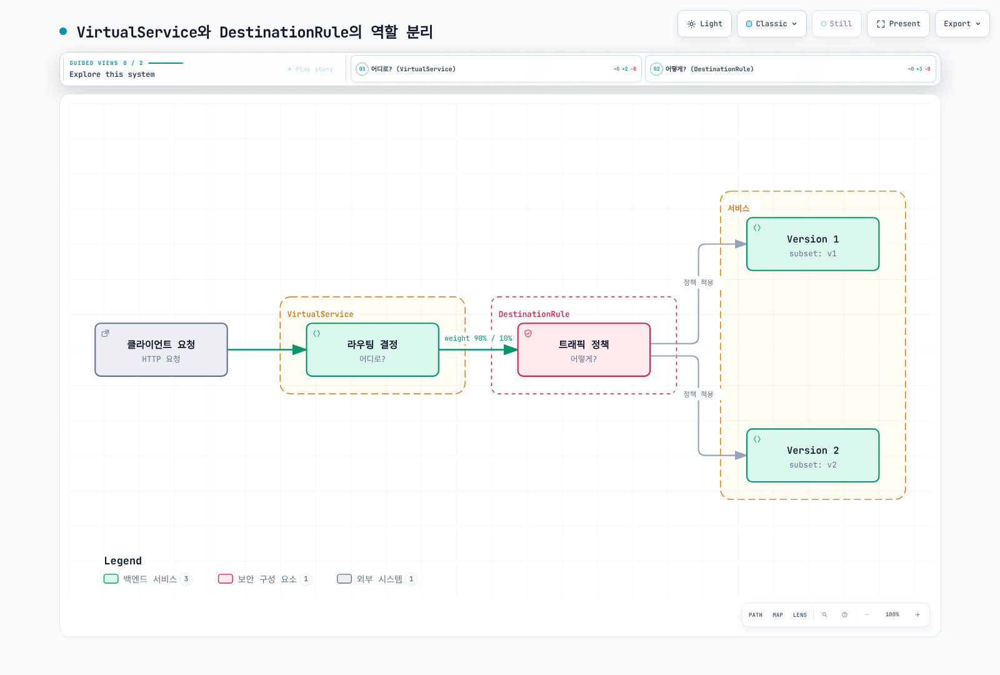
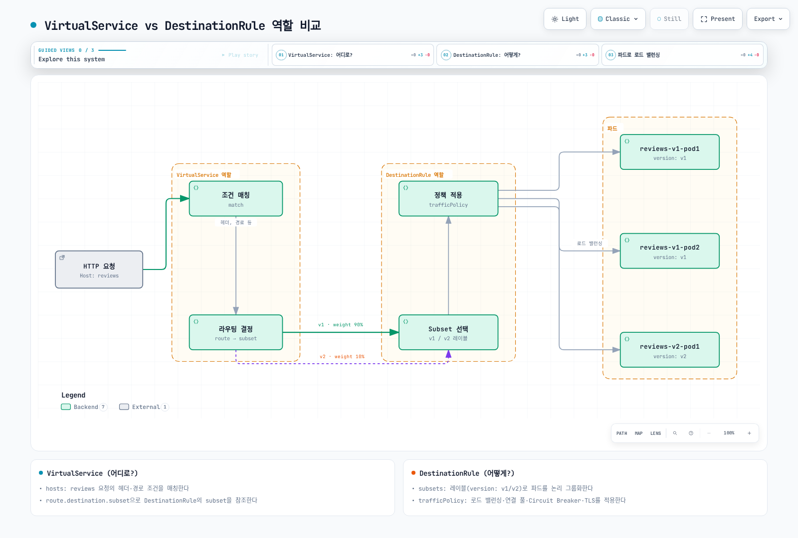
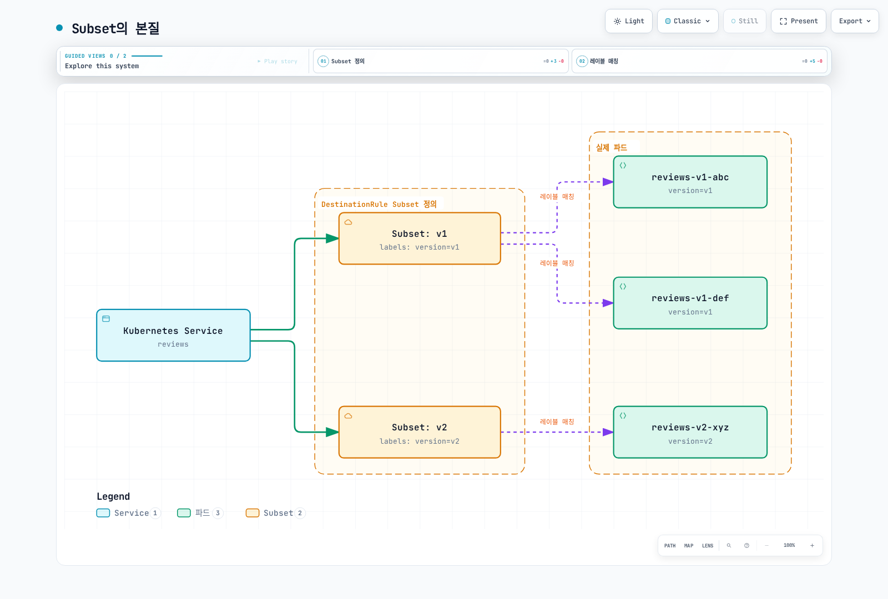
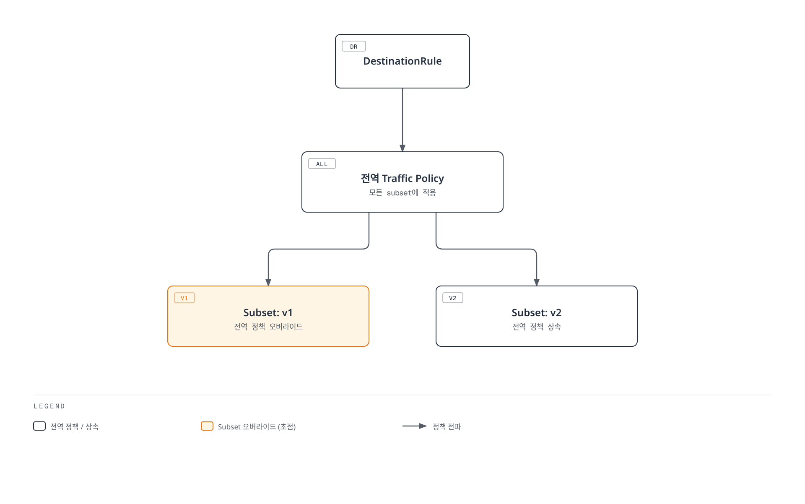

# DestinationRule

> **검토 버전**: Istio 1.31.0 **API 버전**: `networking.istio.io/v1` **마지막 업데이트**: 2026년 9월 11일

DestinationRule은 VirtualService가 트래픽을 라우팅한 후, 해당 트래픽을 어떻게 처리할지 정의하는 Istio의 핵심 리소스입니다.

## 목차

1. [DestinationRule이란?](03-destination-rule.md#destinationrule이란)
2. [VirtualService vs DestinationRule](03-destination-rule.md#virtualservice-vs-destinationrule)
3. [Subset 개념](03-destination-rule.md#subset-개념)
4. [기본 구조](03-destination-rule.md#기본-구조)
5. [Subset 정의하기](03-destination-rule.md#subset-정의하기)
6. [Traffic Policy 개요](03-destination-rule.md#traffic-policy-개요)
7. [VirtualService와 함께 사용](03-destination-rule.md#virtualservice와-함께-사용)
8. [실전 예제](03-destination-rule.md#실전-예제)
9. [모범 사례](03-destination-rule.md#모범-사례)
10. [문제 해결](03-destination-rule.md#문제-해결)

## DestinationRule이란?

각 예제는 독립적인 Sidecar 구성 패턴입니다. DestinationRule과 VirtualService는 istiod가 변환하는 설정 입력이며 별도 트래픽 처리 홉이 아닙니다. DestinationRule은 VirtualService 없이도 적용됩니다. Subset은 Service에 이미 발견된 엔드포인트를 선택하며 워크로드 생성·환경 격리·트래픽 비율 지정을 하지 않습니다. 일치하는 파드 템플릿 레이블과 subset을 참조하는 라우트를 사용하세요.

DestinationRule은 **라우팅 이후의 트래픽 정책**을 정의합니다. VirtualService가 "어디로" 보낼지 결정한다면, DestinationRule은 "어떻게" 처리할지 결정합니다.



[🔍 인터랙티브 다이어그램 보기](https://www.atomai.click/kubernetes-docs/archmaps/ko-service-mesh-istio-traffic-management-03-destination-rule-0.html)

### DestinationRule의 주요 역할

| 역할                  | 설명         | 예시                           |
| ------------------- | ---------- | ---------------------------- |
| **Subset 정의**       | 서비스 버전 그룹화 | v1, v2, canary, stable       |
| **Load Balancing**  | 부하 분산 알고리즘 | ROUND\_ROBIN, LEAST\_REQUEST |
| **Connection Pool** | 연결 풀 설정    | 최대 연결 수, Timeout             |
| **Circuit Breaker** | 장애 격리      | Outlier Detection            |
| **TLS 설정**          | 암호화 정책     | mTLS, SIMPLE TLS             |

## VirtualService vs DestinationRule

두 리소스는 함께 사용되어 완전한 트래픽 관리를 제공합니다.

### 역할 비교



[🔍 인터랙티브 다이어그램 보기](https://www.atomai.click/kubernetes-docs/archmaps/ko-service-mesh-istio-traffic-management-03-destination-rule-1.html)

### 책임 분리

**VirtualService (어디로?)**:

```yaml
apiVersion: networking.istio.io/v1
kind: VirtualService
metadata:
  name: reviews
spec:
  hosts:
  - reviews
  http:
  - match:
    - headers:
        end-user:
          exact: jason
    route:
    - destination:
        host: reviews
        subset: v2  # ← DestinationRule의 subset 참조
  - route:
    - destination:
        host: reviews
        subset: v1  # ← DestinationRule의 subset 참조
```

**DestinationRule (어떻게?)**:

```yaml
apiVersion: networking.istio.io/v1
kind: DestinationRule
metadata:
  name: reviews
spec:
  host: reviews
  trafficPolicy:  # ← 모든 subset에 적용되는 기본 정책
    loadBalancer:
      simple: LEAST_REQUEST
  subsets:  # ← VirtualService가 참조하는 subset 정의
  - name: v1
    labels:
      version: v1
  - name: v2
    labels:
      version: v2
    trafficPolicy:  # ← v2에만 적용되는 정책
      loadBalancer:
        simple: ROUND_ROBIN
```

## Subset 개념

Subset은 서비스의 **논리적 그룹**을 정의합니다. 주로 버전, 배포 단계, 지역 등으로 구분합니다.

### Subset의 본질



[🔍 인터랙티브 다이어그램 보기](https://www.atomai.click/kubernetes-docs/archmaps/ko-service-mesh-istio-traffic-management-03-destination-rule-2.html)

### Subset 사용 시나리오

#### 1. 버전 기반 라우팅

```yaml
apiVersion: networking.istio.io/v1
kind: DestinationRule
metadata:
  name: reviews-versions
spec:
  host: reviews
  subsets:
  - name: v1
    labels:
      version: v1
  - name: v2
    labels:
      version: v2
  - name: v3
    labels:
      version: v3
```

```yaml
# 파드 템플릿 레이블 발췌
metadata:
  labels:
    app: reviews
    version: v1  # ← Subset과 매칭
```

#### 2. 배포 단계별 구분

```yaml
apiVersion: networking.istio.io/v1
kind: DestinationRule
metadata:
  name: reviews-deployment-stages
spec:
  host: reviews
  subsets:
  - name: stable
    labels:
      stage: stable
  - name: canary
    labels:
      stage: canary
  - name: test
    labels:
      stage: test
```

#### 3. 지역별 구분

```yaml
apiVersion: networking.istio.io/v1
kind: DestinationRule
metadata:
  name: api-regions
spec:
  host: api-service
  subsets:
  - name: us-west
    labels:
      region: us-west
  - name: us-east
    labels:
      region: us-east
  - name: eu-central
    labels:
      region: eu-central
```

#### 4. 환경별 구분

```yaml
apiVersion: networking.istio.io/v1
kind: DestinationRule
metadata:
  name: payment-environments
spec:
  host: payment-service
  subsets:
  - name: production
    labels:
      env: production
  - name: staging
    labels:
      env: staging
```

## 기본 구조

### 필수 필드

```yaml
apiVersion: networking.istio.io/v1
kind: DestinationRule
metadata:
  name: my-destination-rule
  namespace: default
spec:
  host: my-service  # 필수: 대상 서비스
  subsets:          # 선택: Subset 정의
  - name: v1
    labels:
      version: v1
  trafficPolicy:    # 선택: 트래픽 정책
    loadBalancer:
      simple: ROUND_ROBIN
```

### Host 지정 방법

**1. 서비스 이름 (같은 네임스페이스)**

```yaml
spec:
  host: reviews
```

**2. FQDN (다른 네임스페이스)**

```yaml
spec:
  host: reviews.production.svc.cluster.local
```

**3. 와일드카드**

```yaml
spec:
  host: "*.example.com"
```

**4. 외부 서비스 (ServiceEntry와 함께)**

```yaml
spec:
  host: api.external.com
```

## Subset 정의하기

### 단순 Subset

```yaml
apiVersion: networking.istio.io/v1
kind: DestinationRule
metadata:
  name: reviews-simple
spec:
  host: reviews
  subsets:
  - name: v1
    labels:
      version: v1
  - name: v2
    labels:
      version: v2
```

### Subset별 개별 정책

```yaml
apiVersion: networking.istio.io/v1
kind: DestinationRule
metadata:
  name: reviews-subset-policies
spec:
  host: reviews
  trafficPolicy:  # 기본 정책 (모든 subset)
    loadBalancer:
      simple: LEAST_REQUEST
  subsets:
  - name: v1
    labels:
      version: v1
    # v1은 기본 정책 사용

  - name: v2
    labels:
      version: v2
    trafficPolicy:  # v2만의 정책 (기본 정책 오버라이드)
      loadBalancer:
        simple: ROUND_ROBIN
      connectionPool:
        http:
          http1MaxPendingRequests: 10
```

### 복잡한 레이블 매칭

```yaml
apiVersion: networking.istio.io/v1
kind: DestinationRule
metadata:
  name: api-complex
spec:
  host: api-service
  subsets:
  - name: us-west-v2
    labels:
      version: v2
      region: us-west
      tier: premium
  - name: us-east-v1
    labels:
      version: v1
      region: us-east
      tier: standard
```

## Traffic Policy 개요

DestinationRule의 `trafficPolicy`는 다양한 트래픽 제어 기능을 제공합니다.

### Traffic Policy 계층 구조



[🔍 인터랙티브 다이어그램 보기](https://www.atomai.click/kubernetes-docs/archmaps/ko-service-mesh-istio-traffic-management-03-destination-rule-3.html)

### Traffic Policy 구성 요소

#### 1. Load Balancer

```yaml
trafficPolicy:
  loadBalancer:
    simple: ROUND_ROBIN  # LEAST_REQUEST, RANDOM, PASSTHROUGH
```

자세한 내용은 [로드 밸런싱](06-load-balancing.md) 참조

#### 2. Connection Pool

```yaml
trafficPolicy:
  connectionPool:
    tcp:
      maxConnections: 100
    http:
      http1MaxPendingRequests: 50
      http2MaxRequests: 100
      maxRequestsPerConnection: 2
```

자세한 내용은 [Circuit Breaker](07-circuit-breaker.md) 참조

#### 3. Outlier Detection

```yaml
trafficPolicy:
  outlierDetection:
    consecutive5xxErrors: 5
    interval: 30s
    baseEjectionTime: 30s
    maxEjectionPercent: 50
```

자세한 내용은 [Circuit Breaker](07-circuit-breaker.md) 참조

#### 4. TLS 설정

```yaml
trafficPolicy:
  tls:
    mode: ISTIO_MUTUAL  # DISABLE, SIMPLE, MUTUAL
```

자세한 내용은 [보안](../security/01-mtls.md) 참조

#### 5. Port Level Settings

```yaml
trafficPolicy:
  portLevelSettings:
  - port:
      number: 80
    loadBalancer:
      simple: ROUND_ROBIN
  - port:
      number: 443
    tls:
      mode: SIMPLE
```

## VirtualService와 함께 사용

VirtualService와 DestinationRule은 함께 사용되어 완전한 트래픽 제어를 제공합니다.

### 기본 패턴: Canary 배포

실제 롤아웃에서는 DestinationRule을 먼저 적용하고 프록시 cluster 구성에 새 subset이 나타난 것을 확인한 뒤 VirtualService를 변경하세요. 여러 문서를 한 번에 apply해도 구성 전파 순서는 보장되지 않습니다. Subset 삭제 전에는 라우트 참조를 먼저 제거하세요.

```yaml
# DestinationRule: Subset 정의
apiVersion: networking.istio.io/v1
kind: DestinationRule
metadata:
  name: reviews
spec:
  host: reviews
  subsets:
  - name: v1
    labels:
      version: v1
  - name: v2
    labels:
      version: v2
---
# VirtualService: 트래픽 분배
apiVersion: networking.istio.io/v1
kind: VirtualService
metadata:
  name: reviews
spec:
  hosts:
  - reviews
  http:
  - route:
    - destination:
        host: reviews
        subset: v1  # ← DestinationRule의 subset 참조
      weight: 90
    - destination:
        host: reviews
        subset: v2  # ← DestinationRule의 subset 참조
      weight: 10
```

### Header 기반 라우팅

```yaml
# DestinationRule
apiVersion: networking.istio.io/v1
kind: DestinationRule
metadata:
  name: reviews
spec:
  host: reviews
  subsets:
  - name: v1
    labels:
      version: v1
  - name: v2
    labels:
      version: v2
---
# VirtualService
apiVersion: networking.istio.io/v1
kind: VirtualService
metadata:
  name: reviews
spec:
  hosts:
  - reviews
  http:
  # 개발자는 v2 사용
  - match:
    - headers:
        x-dev-user:
          exact: "true"
    route:
    - destination:
        host: reviews
        subset: v2
  # 일반 사용자는 v1 사용
  - route:
    - destination:
        host: reviews
        subset: v1
```

### URI 기반 라우팅 + Subset별 정책

```yaml
# DestinationRule: Subset별 다른 정책
apiVersion: networking.istio.io/v1
kind: DestinationRule
metadata:
  name: api-service
spec:
  host: api-service
  subsets:
  - name: v1
    labels:
      version: v1
    trafficPolicy:
      loadBalancer:
        simple: ROUND_ROBIN
  - name: v2
    labels:
      version: v2
    trafficPolicy:
      loadBalancer:
        simple: LEAST_REQUEST
      connectionPool:
        http:
          http1MaxPendingRequests: 10
---
# VirtualService: URI 기반 라우팅
apiVersion: networking.istio.io/v1
kind: VirtualService
metadata:
  name: api-service
spec:
  hosts:
  - api-service
  http:
  - match:
    - uri:
        prefix: "/api/v2"
    route:
    - destination:
        host: api-service
        subset: v2
  - route:
    - destination:
        host: api-service
        subset: v1
```

## 실전 예제

### 예제 1: 마이크로서비스 버전 관리

```yaml
apiVersion: networking.istio.io/v1
kind: DestinationRule
metadata:
  name: reviews-versions
  namespace: production
spec:
  host: reviews
  trafficPolicy:
    loadBalancer:
      simple: LEAST_REQUEST
    connectionPool:
      tcp:
        maxConnections: 100
      http:
        http1MaxPendingRequests: 50
        maxRequestsPerConnection: 2
  subsets:
  - name: v1
    labels:
      version: v1
  - name: v2
    labels:
      version: v2
  - name: v3
    labels:
      version: v3
```

**사용 시나리오**:

* v1: 안정 버전 (대부분의 트래픽)
* v2: Canary 버전 (10% 트래픽)
* v3: 테스트 버전 (개발자만)

### 예제 2: Multi-Region 배포

메시가 각 리전의 엔드포인트를 이미 발견하고 연결할 수 있다는 가정입니다. 사용자 정의 `region` 파드 레이블은 subset 선택용이며 Envoy locality는 별도의 노드 topology 정보로 결정됩니다. 리전 subset에는 명시적 라우팅이 필요하며 locality 장애 조치에는 Outlier Detection과 연결 가능한 정상 용량이 필요합니다.

```yaml
apiVersion: networking.istio.io/v1
kind: DestinationRule
metadata:
  name: api-multi-region
spec:
  host: api-service
  trafficPolicy:
    loadBalancer:
      simple: LEAST_REQUEST
      localityLbSetting:
        enabled: true
  subsets:
  - name: us-west
    labels:
      region: us-west
    trafficPolicy:
      connectionPool:
        tcp:
          maxConnections: 1000
  - name: us-east
    labels:
      region: us-east
    trafficPolicy:
      connectionPool:
        tcp:
          maxConnections: 1000
  - name: eu-central
    labels:
      region: eu-central
    trafficPolicy:
      connectionPool:
        tcp:
          maxConnections: 500
```

### 예제 3: 배포 단계별 정책

```yaml
apiVersion: networking.istio.io/v1
kind: DestinationRule
metadata:
  name: payment-service-stages
spec:
  host: payment-service
  subsets:
  # Production: 엄격한 정책
  - name: production
    labels:
      stage: production
    trafficPolicy:
      connectionPool:
        tcp:
          maxConnections: 100
        http:
          http1MaxPendingRequests: 10
          maxRequestsPerConnection: 1
      outlierDetection:
        consecutive5xxErrors: 3
        interval: 10s
        baseEjectionTime: 60s

  # Canary: 적당한 정책
  - name: canary
    labels:
      stage: canary
    trafficPolicy:
      connectionPool:
        tcp:
          maxConnections: 50
        http:
          http1MaxPendingRequests: 20
      outlierDetection:
        consecutive5xxErrors: 5
        interval: 30s
        baseEjectionTime: 30s

  # Staging: 관대한 정책
  - name: staging
    labels:
      stage: staging
    trafficPolicy:
      connectionPool:
        tcp:
          maxConnections: 200
        http:
          http1MaxPendingRequests: 100
      outlierDetection:
        consecutive5xxErrors: 10
        interval: 60s
        baseEjectionTime: 30s
```

### 예제 4: 외부 서비스 통합

```yaml
# ServiceEntry: 외부 API 등록
apiVersion: networking.istio.io/v1
kind: ServiceEntry
metadata:
  name: external-payment-api
spec:
  hosts:
  - api.payment-gateway.com
  ports:
  - number: 80
    name: http
    protocol: HTTP
    targetPort: 443
  location: MESH_EXTERNAL
  resolution: DNS
---
# DestinationRule: 외부 API 정책
apiVersion: networking.istio.io/v1
kind: DestinationRule
metadata:
  name: external-payment-api
spec:
  host: api.payment-gateway.com
  trafficPolicy:
    connectionPool:
      tcp:
        maxConnections: 10
      http:
        http1MaxPendingRequests: 5
        maxRequestsPerConnection: 1
    outlierDetection:
      consecutive5xxErrors: 3
      interval: 30s
      baseEjectionTime: 120s
    tls:
      mode: SIMPLE
      sni: api.payment-gateway.com
      subjectAltNames:
      - api.payment-gateway.com
```

이 구성은 앱이 등록된 80 포트로 HTTP를 보내고 Sidecar가 443 포트로 검증된 TLS를 시작하는 예제입니다. 호스트는 실제 엔드포인트로 바꾸세요. 앱이 이미 HTTPS를 보내는 경우 해당 불투명 TLS 경로에 TLS Origination과 HTTP 전용 정책을 추가하지 않아야 이중 암호화를 피할 수 있습니다.

### 예제 5: 데이터베이스 연결 풀

```yaml
apiVersion: networking.istio.io/v1
kind: DestinationRule
metadata:
  name: postgres-connection-pool
spec:
  host: postgres-primary
  trafficPolicy:
    connectionPool:
      tcp:
        maxConnections: 50  # DB 연결 제한
        connectTimeout: 5s
        tcpKeepalive:
          time: 7200s
          interval: 75s
    outlierDetection:
      consecutive5xxErrors: 3
      interval: 60s
      baseEjectionTime: 120s
  subsets:
  - name: primary
    labels:
      role: primary
  - name: replica
    labels:
      role: replica
    trafficPolicy:
      connectionPool:
        tcp:
          maxConnections: 100  # Replica는 더 많이
```

위 TCP 연결 제한은 프록시별로 적용되며 데이터베이스 전체의 연결 예산이 아닙니다. PostgreSQL에는 HTTP 연결 설정이 적용되지 않습니다. Primary/replica subset은 선택한 Service의 엔드포인트에 실제로 존재해야 하며 앱이 읽기/쓰기 목적지를 올바르게 선택해야 합니다.

## 모범 사례

### 1. Subset 명명 규칙

```yaml
# ✅ 좋은 예: 의미 있는 이름
subsets:
- name: v1
- name: v2
- name: stable
- name: canary
- name: us-west
- name: production
```

```yaml
# ❌ 나쁜 예: 모호한 이름
subsets:
- name: subset1
- name: test
- name: new
```

### 2. 기본 정책 + 오버라이드 패턴

```yaml
# ✅ 좋은 예: 기본 정책을 정의하고 필요시 오버라이드
apiVersion: networking.istio.io/v1
kind: DestinationRule
metadata:
  name: reviews
spec:
  host: reviews
  trafficPolicy:  # 기본 정책
    loadBalancer:
      simple: LEAST_REQUEST
  subsets:
  - name: v1
    labels:
      version: v1
    # v1은 기본 정책 사용
  - name: v2
    labels:
      version: v2
    trafficPolicy:  # v2만 오버라이드
      loadBalancer:
        simple: ROUND_ROBIN
```

### 3. 장애 격리 정책 조정

```yaml
# 서비스와 장애 모델에 맞게 outlierDetection 조정
apiVersion: networking.istio.io/v1
kind: DestinationRule
metadata:
  name: api-service
spec:
  host: api-service
  trafficPolicy:
    loadBalancer:
      simple: LEAST_REQUEST
    outlierDetection:  # 선택적 정책
      consecutive5xxErrors: 5
      interval: 30s
      baseEjectionTime: 30s
```

### 4. Connection Pool 설정

```yaml
# ✅ 서비스 특성에 맞는 Connection Pool
apiVersion: networking.istio.io/v1
kind: DestinationRule
metadata:
  name: high-traffic-service
spec:
  host: api-gateway
  trafficPolicy:
    connectionPool:
      tcp:
        maxConnections: 1000
      http:
        http2MaxRequests: 1000
        maxRequestsPerConnection: 100
```

### 5. 점진적 롤아웃

```yaml
# ✅ 단계별로 Canary 비율 증가
# Step 1: 5%
apiVersion: networking.istio.io/v1
kind: VirtualService
metadata:
  name: reviews-canary-step1
spec:
  hosts:
  - reviews
  http:
  - route:
    - destination:
        host: reviews
        subset: v1
      weight: 95
    - destination:
        host: reviews
        subset: v2
      weight: 5

# Step 2: 모니터링 후 10%로 증가
# Step 3: 25% → 50% → 100%
```

### 6. 문서화

```yaml
apiVersion: networking.istio.io/v1
kind: DestinationRule
metadata:
  name: payment-service
  annotations:
    description: "Payment service traffic management"
    owner: "payments-team"
    subset-purpose: |
      - production: Main production traffic
      - canary: New version testing (10%)
      - staging: Pre-production testing
spec:
  host: payment-service
  # ...
```

## 문제 해결

### Subset이 작동하지 않음

**증상**:

```bash
# VirtualService는 있지만 트래픽이 라우팅되지 않음
kubectl get virtualservice reviews -o yaml
```

**원인 및 해결**:

```bash
# 1. DestinationRule 확인
kubectl get destinationrule reviews -o yaml

# 2. Subset 이름이 일치하는지 확인
# VirtualService: subset: v2
# DestinationRule: name: v2

# 3. 파드 레이블 확인
kubectl get pods --show-labels | grep reviews

# 4. 파드에 version=v2 레이블이 있는지 확인
kubectl get deployment reviews-v2 -o jsonpath='{.spec.template.metadata.labels}'
```

### Traffic Policy가 적용되지 않음

```bash
# Envoy 구성 확인
istioctl proxy-config clusters <pod-name> --fqdn reviews.default.svc.cluster.local -o json

# Circuit Breaker 설정 확인
istioctl proxy-config clusters <pod-name> -o json | jq '.[] | select(.name=="outbound|9080||reviews.default.svc.cluster.local") | .circuitBreakers'
```

### Subset 충돌

Istio는 동일 호스트에 적용되는 DestinationRule 조각을 병합할 수 있습니다. 아래처럼 다른 이름의 두 subset 자체가 충돌하지는 않습니다. 중복 subset 이름은 내용을 병합하지 않고 첫 정의를 사용하며 최상위 trafficPolicy가 여러 개면 먼저 처리한 것만 사용합니다. 네임스페이스 조회 범위와 가시성도 영향을 주므로 한 관리 주체의 규칙 하나가 이해하기 쉽습니다.

**문제**:

```yaml
# 같은 host의 DestinationRule 조각은 제한 조건에 따라 병합 가능
apiVersion: networking.istio.io/v1
kind: DestinationRule
metadata:
  name: reviews-1
spec:
  host: reviews
  subsets:
  - name: v1
    labels:
      version: v1
---
# 고유 subset 이름은 병합 가능; 중복 이름/정책이 문제
apiVersion: networking.istio.io/v1
kind: DestinationRule
metadata:
  name: reviews-2
spec:
  host: reviews
  subsets:
  - name: v2
    labels:
      version: v2
```

**해결**:

```yaml
# ✅ 하나의 DestinationRule에 모든 subset 정의
apiVersion: networking.istio.io/v1
kind: DestinationRule
metadata:
  name: reviews
spec:
  host: reviews
  subsets:
  - name: v1
    labels:
      version: v1
  - name: v2
    labels:
      version: v2
```

### istioctl 분석

```bash
# DestinationRule 유효성 검증
istioctl analyze

# 특정 네임스페이스
istioctl analyze -n production

# 예시 출력
# Inspect actual analyzer messages and confirm subset clusters in proxy-config output
```

## 다음 단계

DestinationRule을 이해했다면 다음 주제로 넘어가세요:

1. [**트래픽 분할**](04-traffic-splitting.md): Canary, Blue/Green 배포
2. [**로드 밸런싱**](06-load-balancing.md): 다양한 알고리즘과 정책
3. [**Circuit Breaker**](07-circuit-breaker.md): 장애 격리 및 복원력
4. [**Retry 및 Timeout**](05-retry-timeout.md): 재시도 및 타임아웃 설정

## 참고 자료

* [Istio DestinationRule Reference](https://istio.io/latest/docs/reference/config/networking/destination-rule/)
* [Istio Traffic Management](https://istio.io/latest/docs/concepts/traffic-management/)
* [Envoy Cluster Configuration](https://www.envoyproxy.io/docs/envoy/latest/intro/arch_overview/upstream/upstream)

- [DestinationRule merging and safe subset rollout](https://istio.io/latest/docs/ops/best-practices/traffic-management/)
- [TLS origination](https://istio.io/latest/docs/tasks/traffic-management/egress/egress-tls-origination/)
