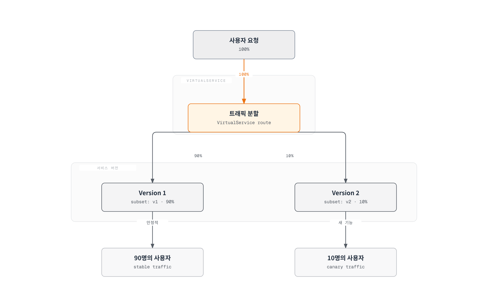
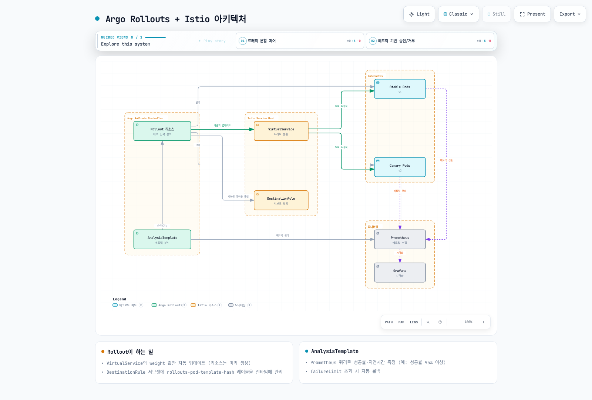
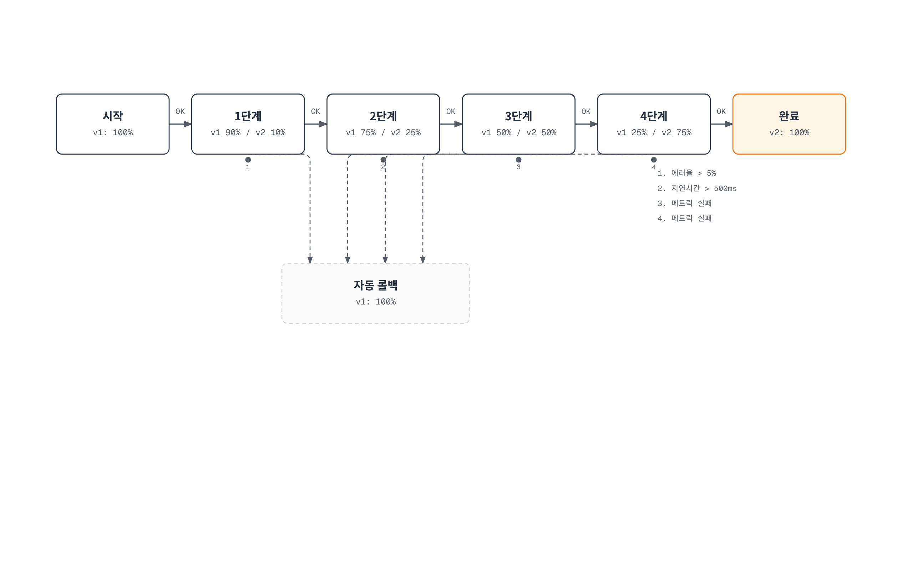
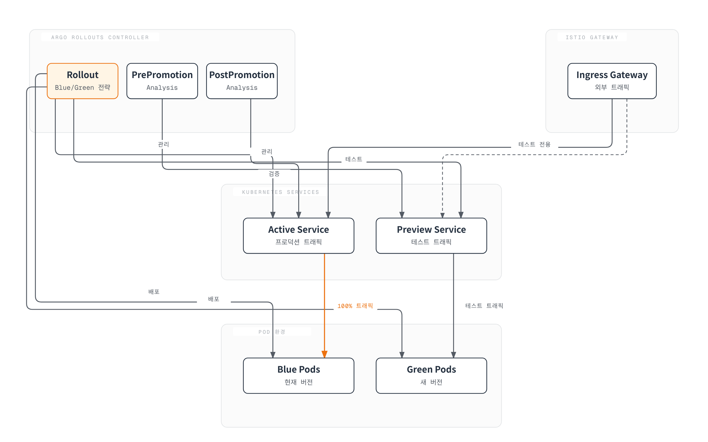
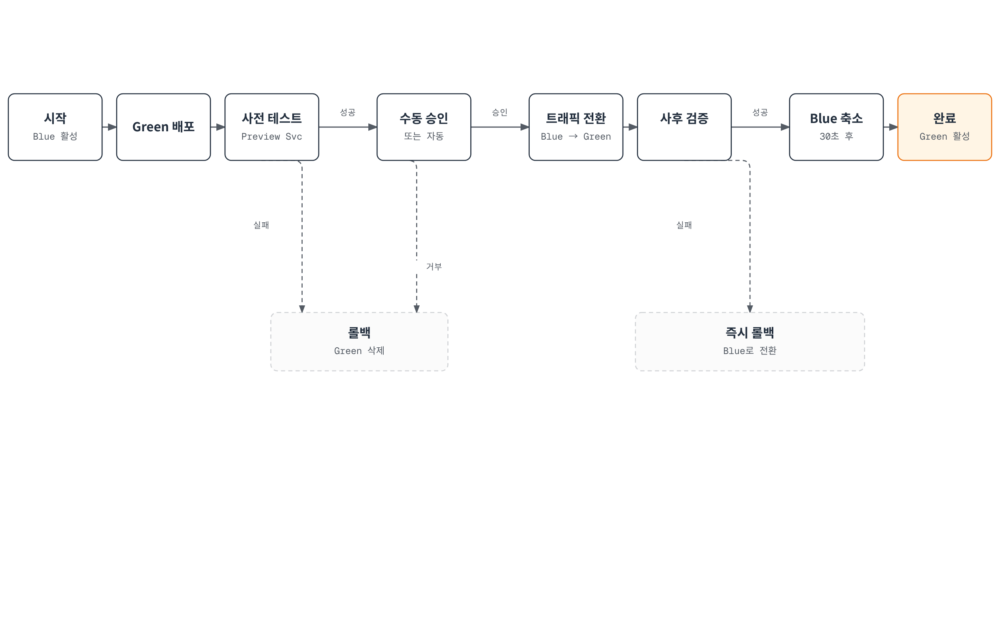
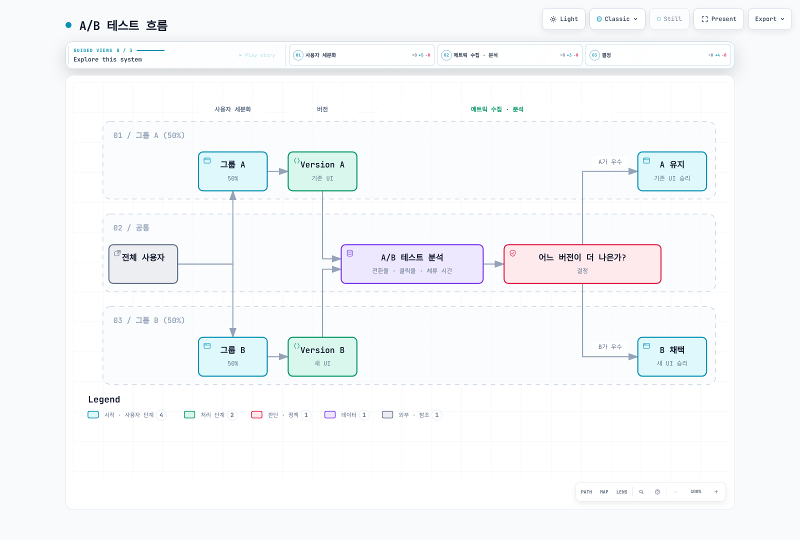

# 트래픽 분할

트래픽 분할은 Istio의 가장 강력한 기능 중 하나로, Canary 배포, A/B 테스트, Blue/Green 배포 등을 코드 변경 없이 구현할 수 있습니다.

## 목차

1. [트래픽 분할 개요](#트래픽-분할-개요)
2. [Canary 배포](#canary-배포)
3. [Blue/Green 배포](#bluegreen-배포)
4. [A/B 테스트](#ab-테스트)
5. [점진적 롤아웃](#점진적-롤아웃)
6. [트래픽 미러링과 함께 사용](#트래픽-미러링과-함께-사용)
7. [실전 예제](#실전-예제)
8. [모니터링 및 롤백](#모니터링-및-롤백)
9. [문제 해결](#문제-해결)

## 트래픽 분할 개요

Istio 1.31.0 및 Argo Rollouts 1.10.0 기준으로 검토했습니다. 각 예제는 독립적인 테스트 네임스페이스용 대안입니다. 같은 selector를 가진 여러 Rollout을 동시에 실행하거나 수동 스크립트/GitOps로 Rollouts가 관리하는 가중치와 subset 해시를 덮어쓰지 마세요. 참조하는 Service, DestinationRule, AnalysisTemplate, 게이트웨이, Prometheus를 먼저 준비하세요. 최초 배포는 안정 ReplicaSet을 만들며 이후 업데이트에서 Canary 단계와 분석을 실행합니다. Weight는 요청 분포이며 고정된 사용자 비율을 뜻하지 않습니다.

트래픽 분할은 VirtualService의 `weight` 필드를 사용하여 여러 서비스 버전 간에 트래픽을 비율로 분배합니다.



[🔍 인터랙티브 다이어그램 보기](https://www.atomai.click/kubernetes-docs/archmaps/ko-service-mesh-istio-traffic-management-04-traffic-splitting-0.html)

### 기본 구조

```yaml
apiVersion: networking.istio.io/v1
kind: VirtualService
metadata:
  name: reviews
spec:
  hosts:
  - reviews
  http:
  - route:
    - destination:
        host: reviews
        subset: v1
      weight: 90  # 90%의 트래픽
    - destination:
        host: reviews
        subset: v2
      weight: 10  # 10%의 트래픽
```

## Canary 배포

Canary 배포는 새 버전을 소수의 사용자에게만 먼저 배포하여 안전하게 검증하는 전략입니다. Argo Rollouts와 Istio를 함께 사용하면 자동화된 점진적 배포와 메트릭 기반 자동 롤백을 구현할 수 있습니다.

### Argo Rollouts + Istio 아키텍처



[🔍 인터랙티브 다이어그램 보기](https://www.atomai.click/kubernetes-docs/archmaps/ko-service-mesh-istio-traffic-management-04-traffic-splitting-1.html)

### Canary 배포 흐름



[🔍 인터랙티브 다이어그램 보기](https://www.atomai.click/kubernetes-docs/archmaps/ko-service-mesh-istio-traffic-management-04-traffic-splitting-2.html)

### 1단계: Argo Rollouts 설치

```bash
# Argo Rollouts 설치
kubectl create namespace argo-rollouts
kubectl apply -n argo-rollouts -f https://github.com/argoproj/argo-rollouts/releases/download/v1.10.0/install.yaml

# Argo Rollouts CLI 설치 (선택사항)
curl -LO https://github.com/argoproj/argo-rollouts/releases/download/v1.10.0/kubectl-argo-rollouts-linux-amd64
chmod +x kubectl-argo-rollouts-linux-amd64
sudo mv kubectl-argo-rollouts-linux-amd64 /usr/local/bin/kubectl-argo-rollouts

# Argo Rollouts 대시보드 실행
kubectl argo rollouts dashboard
```

### 2단계: Rollout 리소스 정의

```yaml
apiVersion: argoproj.io/v1alpha1
kind: Rollout
metadata:
  name: reviews
  namespace: default
spec:
  replicas: 5
  revisionHistoryLimit: 2
  selector:
    matchLabels:
      app: reviews
  template:
    metadata:
      labels:
        app: reviews
        sidecar.istio.io/inject: "true"
    spec:
      containers:
      - name: reviews
        image: docker.io/istio/examples-bookinfo-reviews-v2:1.20.3
        ports:
        - containerPort: 9080
        resources:
          requests:
            memory: "64Mi"
            cpu: "100m"
          limits:
            memory: "128Mi"
            cpu: "200m"

  # Canary 배포 전략
  strategy:
    canary:
      # Istio VirtualService를 통한 트래픽 제어
      trafficRouting:
        istio:
          virtualService:
            name: reviews-vsvc
            routes:
            - primary
          destinationRule:
            name: reviews-destrule
            canarySubsetName: canary
            stableSubsetName: stable

      # Canary 단계 정의
      steps:
      - setWeight: 10    # 10% 트래픽을 Canary로
      - pause:
          duration: 2m   # 2분 대기

      - analysis:
          templates:
          - templateName: success-rate
          - templateName: latency
          args:
          - name: service-name
            value: reviews
          - name: pod-template-hash
            valueFrom:
              podTemplateHashValue: Latest

      - setWeight: 25    # 25% 트래픽을 Canary로
      - pause:
          duration: 2m

      - analysis:
          templates:
          - templateName: success-rate
          - templateName: latency
          args:
          - name: service-name
            value: reviews
          - name: pod-template-hash
            valueFrom:
              podTemplateHashValue: Latest

      - setWeight: 50    # 50% 트래픽을 Canary로
      - pause:
          duration: 2m

      - analysis:
          templates:
          - templateName: success-rate
          - templateName: latency
          args:
          - name: service-name
            value: reviews
          - name: pod-template-hash
            valueFrom:
              podTemplateHashValue: Latest

      - setWeight: 75    # 75% 트래픽을 Canary로
      - pause:
          duration: 2m

      - analysis:
          templates:
          - templateName: success-rate
          - templateName: latency
          args:
          - name: service-name
            value: reviews
          - name: pod-template-hash
            valueFrom:
              podTemplateHashValue: Latest

```

### 3단계: Service 생성

먼저 Kubernetes Service를 생성합니다:

```yaml
apiVersion: v1
kind: Service
metadata:
  name: reviews
  namespace: default
spec:
  ports:
  - port: 9080
    name: http
  selector:
    app: reviews  # Rollout의 모든 Pod를 선택
```

### 4단계: VirtualService 정의

**중요**: Argo Rollouts는 참조한 VirtualService 라우트의 가중치를 수정합니다. VirtualService를 생성하지는 않으므로 먼저 만들어야 합니다.

```yaml
apiVersion: networking.istio.io/v1
kind: VirtualService
metadata:
  name: reviews-vsvc
  namespace: default
spec:
  hosts:
  - reviews
  http:
  - name: primary  # Rollout이 참조하는 route 이름 (필수)
    route:
    - destination:
        host: reviews
        subset: stable  # 안정 버전
      weight: 100
    - destination:
        host: reviews
        subset: canary  # Canary 버전
      weight: 0
```

**주요 포인트**:
- Rollout의 routes 목록을 명시하면 일치하는 `http[].name`이 필요합니다. 라우트가 하나면 routes 목록을 생략할 수 있습니다
- Rollout은 이 VirtualService의 `weight` 값만 자동으로 업데이트합니다
- 두 개의 destination이 필요합니다: stable과 canary

### 5단계: DestinationRule 정의

**중요**: Argo Rollouts는 DestinationRule을 자동으로 생성하지 **않습니다**. 반드시 미리 생성해야 합니다.

```yaml
apiVersion: networking.istio.io/v1
kind: DestinationRule
metadata:
  name: reviews-destrule
  namespace: default
spec:
  host: reviews
  subsets:
  - name: stable
    labels:
      app: reviews
  - name: canary
    labels:
      app: reviews
```

**주요 포인트**:
- 서브셋 이름(`stable`, `canary`)은 Rollout의 `stableSubsetName`, `canarySubsetName`과 일치해야 합니다
- Rollout은 Pod에 `rollouts-pod-template-hash` 레이블을 자동으로 추가합니다
- DestinationRule의 서브셋은 이 레이블을 기반으로 Pod를 선택합니다
- 필요한 앱 레이블은 유지할 수 있습니다. Rollout이 각 subset의 파드 템플릿 해시를 추가·갱신하므로 트래픽 전달 전에 반영을 확인하세요.

### 6단계: AnalysisTemplate 정의

아래 Canary 검증을 사용하기 전에 워크로드 Istio 메트릭을 수집하는 Prometheus **Pod 스크래핑 job**에 이 relabel 규칙을 추가하세요. 수집한 시계열에 `rollout_hash`와 `reporter="destination"`이 있는지 확인합니다. `podTemplateHashValue: Latest`로 전달한 실제 Canary ReplicaSet을 구분하며 서비스 전체 평균으로 작은 Canary 오류가 숨는 것을 피합니다. 대표 요청 트래픽을 공급하고 누락/NaN 측정으로 배포가 승인되지 않게 하세요.

```yaml
# Add to the existing pod scrape job's relabel_configs
- source_labels: [__meta_kubernetes_pod_label_rollouts_pod_template_hash]
  target_label: rollout_hash
```

#### 성공률 분석

```yaml
apiVersion: argoproj.io/v1alpha1
kind: AnalysisTemplate
metadata:
  name: success-rate
  namespace: default
spec:
  args:
  - name: service-name
  - name: pod-template-hash

  metrics:
  - name: success-rate
    interval: 30s
    count: 4  # 4회 측정; interval이 전체 소요 시간은 아님
    successCondition: len(result) == 1 && !isNaN(result[0]) && result[0] >= 0.95
    failureLimit: 0  # 실패 측정을 허용하지 않음
    provider:
      prometheus:
        address: http://prometheus.istio-system:9090
        query: |
          sum(rate(
            istio_requests_total{
              destination_service_name="{{args.service-name}}",
              reporter="destination",
              rollout_hash="{{args.pod-template-hash}}",
              destination_workload_namespace="default",
              response_code!~"5.*"
            }[2m]
          ))
          /
          sum(rate(
            istio_requests_total{
              destination_service_name="{{args.service-name}}",
              reporter="destination",
              rollout_hash="{{args.pod-template-hash}}",
              destination_workload_namespace="default"
            }[2m]
          ))
```

#### 지연시간 분석

```yaml
apiVersion: argoproj.io/v1alpha1
kind: AnalysisTemplate
metadata:
  name: latency
  namespace: default
spec:
  args:
  - name: service-name
  - name: pod-template-hash

  metrics:
  - name: latency-p95
    interval: 30s
    count: 4
    successCondition: len(result) == 1 && !isNaN(result[0]) && result[0] <= 500
    failureLimit: 0
    provider:
      prometheus:
        address: http://prometheus.istio-system:9090
        query: |
          histogram_quantile(0.95,
            sum(rate(
              istio_request_duration_milliseconds_bucket{
                destination_service_name="{{args.service-name}}",
              reporter="destination",
              rollout_hash="{{args.pod-template-hash}}",
                destination_workload_namespace="default"
              }[2m]
            )) by (le)
          )
```

### 배포 실행 및 모니터링

#### 새 버전 배포

```bash
# 이미지 업데이트로 Canary 배포 시작
kubectl argo rollouts set image reviews \
  reviews=docker.io/istio/examples-bookinfo-reviews-v3:1.20.3

# Rollout 상태 확인
kubectl argo rollouts get rollout reviews --watch

# 실시간 대시보드
kubectl argo rollouts dashboard
```

#### 수동 승인/거부

```bash
# 다음 단계로 수동 승인
kubectl argo rollouts promote reviews

# Canary 배포 중단 및 롤백
kubectl argo rollouts abort reviews

# 특정 리비전으로 롤백
kubectl argo rollouts undo reviews
```

#### 배포 진행 상황 모니터링

```bash
# Rollout 상태 확인
kubectl argo rollouts status reviews

# 분석 결과 확인
kubectl get analysisrun -w

# Canary vs Stable 트래픽 분포 확인
kubectl get virtualservice reviews-vsvc -o yaml

# 실제 Pod 상태 확인
kubectl get pods -l app=reviews --show-labels
```

### 고급 설정: 메트릭 기반 자동 진행

아래 전략은 위의 완전한 Rollout에 병합하고 selector/template을 유지하세요. 뒤의 축약된 Rollout 예제도 독립 매니페스트가 아닌 오버레이입니다.

```yaml
apiVersion: argoproj.io/v1alpha1
kind: Rollout
metadata:
  name: reviews-auto
spec:
  replicas: 5
  strategy:
    canary:
      trafficRouting:
        istio:
          virtualService:
            name: reviews-vsvc
            routes:
            - primary
          destinationRule:
            name: reviews-destrule
            canarySubsetName: canary
            stableSubsetName: stable

      steps:
      - setWeight: 10
      - pause:
          duration: 1m

      # 자동 분석 - 성공 시 자동으로 다음 단계 진행
      - analysis:
          templates:
          - templateName: success-rate
          - templateName: latency
          args:
          - name: service-name
            value: reviews
          - name: pod-template-hash
            valueFrom:
              podTemplateHashValue: Latest

      - setWeight: 25
      - pause:
          duration: 1m

      - analysis:
          templates:
          - templateName: success-rate
          - templateName: latency
          args:
          - name: service-name
            value: reviews
          - name: pod-template-hash
            valueFrom:
              podTemplateHashValue: Latest

      - setWeight: 50
      - pause:
          duration: 1m

      - analysis:
          templates:
          - templateName: success-rate
          - templateName: latency
          args:
          - name: service-name
            value: reviews
          - name: pod-template-hash
            valueFrom:
              podTemplateHashValue: Latest

      - setWeight: 75
      - pause:
          duration: 1m

      - analysis:
          templates:
          - templateName: success-rate
          - templateName: latency
          args:
          - name: service-name
            value: reviews
          - name: pod-template-hash
            valueFrom:
              podTemplateHashValue: Latest
```

### 주요 주의사항

#### 1. VirtualService와 DestinationRule 미리 생성 필수

Argo Rollouts는 이 리소스들을 생성하지 않습니다. 반드시 Rollout 배포 전에 미리 생성해야 합니다:

```bash
# 순서가 중요합니다
kubectl apply -f service.yaml
kubectl apply -f destination-rule.yaml
kubectl apply -f virtual-service.yaml
kubectl apply -f analysis-templates.yaml
kubectl apply -f rollout.yaml
```

#### 2. Rollout이 관리하는 레이블

Argo Rollouts는 다음 레이블을 자동으로 추가/관리합니다:

```yaml
# Rollout이 자동 추가하는 레이블
rollouts-pod-template-hash: <hash>  # ReplicaSet 식별용
```

이 레이블은 DestinationRule의 서브셋 선택에 사용됩니다.

#### 3. HTTP Route Name 필수

명시적으로 선택한 라우트에 참조 이름이 필요합니다. 관리하지 않는 헤더 라우트에는 필수가 아니며 아래 예제는 primary를 선택합니다:

```yaml
# ❌ 잘못된 예
http:
- route:  # name이 없음!
  - destination:
      host: reviews
```

```yaml
# ✅ 올바른 예
http:
- name: primary  # 필수!
  route:
  - destination:
      host: reviews
```

#### 4. Istio Injection 활성화

Rollout의 Pod에 Istio sidecar가 주입되어야 합니다:

```bash
# 방법 1: Namespace 레벨
kubectl label namespace default istio-injection=enabled
```

```yaml
# 방법 2: Pod 레벨
template:
  metadata:
    labels:
      sidecar.istio.io/inject: "true"
```

### VirtualService Match와 함께 사용하기

테스터/지역/등급 헤더가 권한 있는 접근을 제어한다면 신뢰하는 계층이 제공해야 합니다. 항상 canary를 선택하는 비관리 라우트는 가중치 롤백으로 바뀌지 않아 축소된 Canary를 계속 가리킬 수 있으므로 중단/정리 절차에서 제거하거나 조정하세요.

Argo Rollouts는 VirtualService의 match 조건과 함께 사용할 수 있습니다. 이를 통해 특정 조건을 만족하는 트래픽만 Canary로 라우팅할 수 있습니다.

#### 예제 1: 헤더 기반 Canary (내부 테스터용)

```yaml
apiVersion: networking.istio.io/v1
kind: VirtualService
metadata:
  name: reviews-vsvc
spec:
  hosts:
  - reviews
  http:
  # 1순위: 내부 테스터는 항상 Canary로
  - match:
    - headers:
        x-canary-tester:
          exact: "true"
    route:
    - destination:
        host: reviews
        subset: canary

  # 2순위: 일반 트래픽 - Rollout이 이 route의 weight를 관리
  - name: primary
    route:
    - destination:
        host: reviews
        subset: stable
      weight: 100
    - destination:
        host: reviews
        subset: canary
      weight: 0
```

**사용 시나리오**:
```bash
# 내부 테스터는 항상 Canary 버전에 접근
curl -H "x-canary-tester: true" http://reviews:9080/

# 일반 사용자는 Rollout의 weight에 따라 라우팅
curl http://reviews:9080/
```

#### 예제 2: 지역 기반 단계적 배포

```yaml
apiVersion: networking.istio.io/v1
kind: VirtualService
metadata:
  name: reviews-vsvc
spec:
  hosts:
  - reviews
  http:
  # 1순위: 개발 환경은 항상 최신 버전
  - match:
    - headers:
        x-env:
          exact: "dev"
    route:
    - destination:
        host: reviews
        subset: canary

  # 2순위: 특정 지역만 Canary 테스트 (예: 서울)
  - match:
    - headers:
        x-region:
          exact: "ap-northeast-2"
    name: seoul-traffic
    route:
    - destination:
        host: reviews
        subset: stable
      weight: 100
    - destination:
        host: reviews
        subset: canary
      weight: 0

  # 3순위: 나머지 지역은 안정 버전 유지
  - name: other-regions
    route:
    - destination:
        host: reviews
        subset: stable
```

**Rollout 설정**:
```yaml
apiVersion: argoproj.io/v1alpha1
kind: Rollout
metadata:
  name: reviews
spec:
  # ... (이전과 동일)
  strategy:
    canary:
      trafficRouting:
        istio:
          virtualService:
            name: reviews-vsvc
            routes:
            - seoul-traffic  # 서울 트래픽만 Canary 적용
          destinationRule:
            name: reviews-destrule
            canarySubsetName: canary
            stableSubsetName: stable
      steps:
      - setWeight: 10
      - pause: {duration: 2m}
      - setWeight: 50
      - pause: {duration: 2m}
```

#### 예제 3: 사용자 등급별 배포

```yaml
apiVersion: networking.istio.io/v1
kind: VirtualService
metadata:
  name: reviews-vsvc
spec:
  hosts:
  - reviews
  http:
  # 1순위: 베타 프로그램 참가자
  - match:
    - headers:
        x-user-tier:
          exact: "beta"
    route:
    - destination:
        host: reviews
        subset: canary

  # 2순위: 프리미엄 사용자만 Canary 테스트
  - match:
    - headers:
        x-user-tier:
          exact: "premium"
    name: premium-users
    route:
    - destination:
        host: reviews
        subset: stable
      weight: 100
    - destination:
        host: reviews
        subset: canary
      weight: 0

  # 3순위: 일반 사용자는 안정 버전
  - name: free-users
    route:
    - destination:
        host: reviews
        subset: stable
```

#### 예제 4: 모바일 앱 버전별 배포

```yaml
apiVersion: networking.istio.io/v1
kind: VirtualService
metadata:
  name: reviews-vsvc
spec:
  hosts:
  - reviews
  http:
  # 1순위: 최신 앱 버전 사용자만 Canary
  - match:
    - headers:
        x-app-version:
          regex: "^3\\.([1-9][0-9]+)\\.[0-9]+$"  # minor >= 10인 3.x.y; 4.x는 제외
    name: latest-app-version
    route:
    - destination:
        host: reviews
        subset: stable
      weight: 100
    - destination:
        host: reviews
        subset: canary
      weight: 0

  # 2순위: 구버전 앱은 안정 버전만
  - name: legacy-app-version
    route:
    - destination:
        host: reviews
        subset: stable
```

### 완전한 배포 예제

신규 실습 설치를 위한 통합 참조 매니페스트입니다. 기존 배포는 변경 순서와 전파 확인이 필요하며 apply는 원자적이지 않습니다:

```yaml
---
# Service
apiVersion: v1
kind: Service
metadata:
  name: reviews
spec:
  ports:
  - port: 9080
    name: http
  selector:
    app: reviews

---
# DestinationRule
apiVersion: networking.istio.io/v1
kind: DestinationRule
metadata:
  name: reviews-destrule
spec:
  host: reviews
  subsets:
  - name: stable
    labels: {app: reviews}  # Rollout이 revision 해시 추가
  - name: canary
    labels: {app: reviews}  # Rollout이 revision 해시 추가

---
# VirtualService
apiVersion: networking.istio.io/v1
kind: VirtualService
metadata:
  name: reviews-vsvc
spec:
  hosts:
  - reviews
  http:
  - name: primary
    route:
    - destination:
        host: reviews
        subset: stable
      weight: 100
    - destination:
        host: reviews
        subset: canary
      weight: 0

---
# Rollout
apiVersion: argoproj.io/v1alpha1
kind: Rollout
metadata:
  name: reviews
spec:
  replicas: 3
  selector:
    matchLabels:
      app: reviews
  template:
    metadata:
      labels:
        app: reviews
    spec:
      containers:
      - name: reviews
        image: istio/examples-bookinfo-reviews-v1:1.20.3
        ports:
        - containerPort: 9080

  strategy:
    canary:
      trafficRouting:
        istio:
          virtualService:
            name: reviews-vsvc
            routes:
            - primary
          destinationRule:
            name: reviews-destrule
            canarySubsetName: canary
            stableSubsetName: stable

      steps:
      - setWeight: 20
      - pause: {duration: 1m}
      - setWeight: 40
      - pause: {duration: 1m}
      - setWeight: 60
      - pause: {duration: 1m}
      - setWeight: 80
      - pause: {duration: 1m}
```

### Match와 함께 사용 시 주의사항

#### 1. Route 순서가 중요

VirtualService의 HTTP route는 **순서대로 평가**됩니다. match가 있는 route는 Rollout이 관리하는 route보다 먼저 배치해야 합니다:

```yaml
# ✅ 올바른 예
http:
- match:
    - headers:
        x-tester: {exact: "true"}
  route:
    - destination: {host: reviews, subset: canary}

- name: primary  # Rollout이 관리
  route:
    - destination: {host: reviews, subset: stable}
      weight: 100
    - destination: {host: reviews, subset: canary}
      weight: 0
```

```yaml
# ❌ 잘못된 예 - primary가 먼저 오면 match가 무시됨
http:
- name: primary
  route: [...]

- match: [...]  # 여기에 도달하지 못함!
  route: [...]
```

#### 2. Rollout은 지정된 Route만 관리

Rollout은 `routes` 필드에 지정된 route의 weight만 수정합니다:

```yaml
strategy:
  canary:
    trafficRouting:
      istio:
        virtualService:
          name: reviews-vsvc
          routes:
          - primary  # 이 route의 weight만 수정
          # match가 있는 다른 route는 수정하지 않음
```

#### 3. 여러 Route를 동시에 관리

필요한 경우 여러 route를 동시에 관리할 수 있습니다:

```yaml
apiVersion: networking.istio.io/v1
kind: VirtualService
metadata:
  name: reviews-vsvc
spec:
  hosts:
  - reviews
  http:
  # 프리미엄 사용자용 route
  - match:
    - headers:
        x-user-tier: {exact: "premium"}
    name: premium-route
    route:
    - destination: {host: reviews, subset: stable}
      weight: 100
    - destination: {host: reviews, subset: canary}
      weight: 0

  # 일반 사용자용 route
  - name: standard-route
    route:
    - destination: {host: reviews, subset: stable}
      weight: 100
    - destination: {host: reviews, subset: canary}
      weight: 0

---
apiVersion: argoproj.io/v1alpha1
kind: Rollout
metadata:
  name: reviews
spec:
  strategy:
    canary:
      trafficRouting:
        istio:
          virtualService:
            name: reviews-vsvc
            routes:
            - premium-route    # 두 route 모두 관리
            - standard-route
          destinationRule:
            name: reviews-destrule
            canarySubsetName: canary
            stableSubsetName: stable
      steps:
      - setWeight: 10
      - pause: {duration: 2m}
```

### 문제 해결

#### Rollout이 Progressing 상태에서 멈춤

```bash
# Rollout 상태 확인
kubectl argo rollouts get rollout reviews

# Events 확인
kubectl describe rollout reviews

# 일반적인 원인:
# 1. VirtualService/DestinationRule이 없음
kubectl get virtualservice reviews-vsvc
kubectl get destinationrule reviews-destrule

# 2. HTTP route name이 잘못됨
kubectl get virtualservice reviews-vsvc -o yaml | grep "name:"

# 3. Istio sidecar가 주입되지 않음
kubectl get pods -l app=reviews -o jsonpath='{.items[*].spec.containers[*].name}'
```

#### 트래픽이 Canary로 가지 않음

```bash
# VirtualService의 weight 확인
kubectl get virtualservice reviews-vsvc -o yaml

# DestinationRule의 서브셋 확인
kubectl get destinationrule reviews-destrule -o yaml

# Pod 레이블 확인
kubectl get pods -l app=reviews --show-labels

# Envoy 설정 확인
istioctl proxy-config routes <pod-name>
```

#### Rollout 롤백

```bash
# 이전 리비전으로 롤백
kubectl argo rollouts undo reviews

# 특정 리비전으로 롤백
kubectl argo rollouts undo reviews --to-revision=2

# 즉시 중단 및 롤백
kubectl argo rollouts abort reviews
```

### Blue/Green 배포와 Argo Rollouts

Argo Rollouts는 Blue/Green 전략도 지원합니다:

```yaml
apiVersion: argoproj.io/v1alpha1
kind: Rollout
metadata:
  name: reviews-bluegreen
spec:
  replicas: 5
  selector:
    matchLabels:
      app: reviews
  template:
    metadata:
      labels:
        app: reviews
    spec:
      containers:
      - name: reviews
        image: docker.io/istio/examples-bookinfo-reviews-v2:1.20.3
        ports:
        - containerPort: 9080

  strategy:
    blueGreen:
      activeService: reviews-active
      previewService: reviews-preview
      autoPromotionEnabled: false  # 수동 승인
      scaleDownDelaySeconds: 30
      prePromotionAnalysis:
        templates:
        - templateName: smoke-tests
        args:
        - name: service-name
          value: reviews-preview
        - name: pod-template-hash
          valueFrom:
            podTemplateHashValue: Latest
```

## Blue/Green 배포

Blue/Green 배포는 두 개의 동일한 프로덕션 환경을 유지하고, 순간적으로 트래픽을 전환합니다. Argo Rollouts와 Istio를 함께 사용하면 안전한 전환과 자동 롤백을 구현할 수 있습니다.

Service selector 변경은 비동기로 전파되며 기존 연결은 이전 ReplicaSet에 남을 수 있습니다. 수동 pause는 승인 실패가 아닙니다. 사전 분석 실패는 기존 프로덕션을 유지하고, 사후 분석은 이전 ReplicaSet이 유지되는 동안 트래픽을 되돌릴 수 있습니다.

### Argo Rollouts Blue/Green 아키텍처



[🔍 인터랙티브 다이어그램 보기](https://www.atomai.click/kubernetes-docs/archmaps/ko-service-mesh-istio-traffic-management-04-traffic-splitting-3.html)

### Blue/Green 배포 흐름



[🔍 인터랙티브 다이어그램 보기](https://www.atomai.click/kubernetes-docs/archmaps/ko-service-mesh-istio-traffic-management-04-traffic-splitting-4.html)

### 1단계: Service 정의

Blue/Green 배포에는 두 개의 Service가 필요합니다:

```yaml
---
# Active Service - 프로덕션 트래픽
apiVersion: v1
kind: Service
metadata:
  name: reviews-active
spec:
  ports:
  - port: 9080
    name: http
  selector:
    app: reviews
    # Rollout이 자동으로 selector를 업데이트

---
# Preview Service - 테스트 트래픽
apiVersion: v1
kind: Service
metadata:
  name: reviews-preview
spec:
  ports:
  - port: 9080
    name: http
  selector:
    app: reviews
    # Rollout이 자동으로 selector를 업데이트
```

### 2단계: Istio Gateway 및 VirtualService

```yaml
---
# Gateway
apiVersion: networking.istio.io/v1
kind: Gateway
metadata:
  name: reviews-gateway
spec:
  selector:
    istio: ingressgateway
  servers:
  - port:
      number: 80
      name: http
      protocol: HTTP
    hosts:
    - reviews.example.com
    - reviews-preview.example.com

---
# VirtualService - Active Service
apiVersion: networking.istio.io/v1
kind: VirtualService
metadata:
  name: reviews-vsvc
spec:
  hosts:
  - reviews.example.com
  gateways:
  - reviews-gateway
  http:
  - route:
    - destination:
        host: reviews-active  # Active Service로 라우팅
        port:
          number: 9080

---
# VirtualService - Preview Service (테스트용)
apiVersion: networking.istio.io/v1
kind: VirtualService
metadata:
  name: reviews-preview-vsvc
spec:
  hosts:
  - reviews-preview.example.com
  gateways:
  - reviews-gateway
  http:
  - route:
    - destination:
        host: reviews-preview  # Preview Service로 라우팅
        port:
          number: 9080
```

### 3단계: Rollout 리소스 정의

```yaml
apiVersion: argoproj.io/v1alpha1
kind: Rollout
metadata:
  name: reviews
spec:
  replicas: 3
  revisionHistoryLimit: 2
  selector:
    matchLabels:
      app: reviews
  template:
    metadata:
      labels:
        app: reviews
    spec:
      containers:
      - name: reviews
        image: istio/examples-bookinfo-reviews-v1:1.20.3
        ports:
        - containerPort: 9080

  strategy:
    blueGreen:
      # Active/Preview Service 지정
      activeService: reviews-active
      previewService: reviews-preview

      # 자동 승인 설정
      autoPromotionEnabled: false  # false: 수동 승인, true: 자동 승인
      autoPromotionSeconds: 30     # autoPromotionEnabled=false이면 무시됨

      # Blue 환경 유지 시간
      scaleDownDelaySeconds: 600   # 사후 검증 동안 이전 용량 유지
      scaleDownDelayRevisionLimit: 2  # 이전 버전 2개까지 유지

      # 사전 테스트 (배포 전 Preview 검증)
      prePromotionAnalysis:
        templates:
        - templateName: smoke-tests
        args:
        - name: service-name
          value: reviews-preview
        - name: pod-template-hash
          valueFrom:
            podTemplateHashValue: Latest

      # 사후 검증 (전환 후 Active 검증)
      postPromotionAnalysis:
        templates:
        - templateName: post-promotion-tests
        args:
        - name: service-name
          value: reviews-active
        - name: pod-template-hash
          valueFrom:
            podTemplateHashValue: Latest

      # Anti-affinity (Blue/Green이 다른 노드에 배포)
      antiAffinity:
        requiredDuringSchedulingIgnoredDuringExecution: {}
```

### 4단계: AnalysisTemplate 정의

#### 사전 테스트 (Smoke Tests)

Job 제공자는 Job 종료 코드 0으로 성공을 판단하며 출력한 HTTP 상태를 result로 파싱하지 않습니다. Bookinfo의 `/health`와 `/reviews/0`을 사용합니다. Native-sidecar annotation은 메시 mTLS를 유지하며 Job이 종료되도록 하며 지원되는 Kubernetes/Istio 동작이 필요합니다. 선택한 EKS 버전에서 검증하세요.

```yaml
apiVersion: argoproj.io/v1alpha1
kind: AnalysisTemplate
metadata:
  name: smoke-tests
spec:
  args:
  - name: service-name
  - name: pod-template-hash

  metrics:
  # 1. HTTP 상태 코드 확인
  - name: http-status
    interval: 10s
    count: 5
    provider:
      job:
        spec:
          activeDeadlineSeconds: 60
          template:
            metadata:
              labels:
                sidecar.istio.io/inject: "true"
              annotations:
                sidecar.istio.io/nativeSidecar: "true"
            spec:
              containers:
              - name: curl
                image: curlimages/curl:8.16.0
                command:
                - sh
                - -c
                - |
                  test "$(curl -fsS -o /dev/null -w "%{http_code}" http://{{args.service-name}}:9080/health)" = 200
              restartPolicy: Never
          backoffLimit: 1

  # 2. 기본 기능 테스트
  - name: functional-test
    interval: 10s
    count: 3
    provider:
      job:
        spec:
          activeDeadlineSeconds: 60
          template:
            metadata:
              labels:
                sidecar.istio.io/inject: "true"
              annotations:
                sidecar.istio.io/nativeSidecar: "true"
            spec:
              containers:
              - name: test
                image: curlimages/curl:8.16.0
                command:
                - sh
                - -c
                - |
                  # API 엔드포인트 테스트
                  curl -fsS http://{{args.service-name}}:9080/reviews/0
              restartPolicy: Never
          backoffLimit: 1
```

#### 사후 검증 테스트

```yaml
apiVersion: argoproj.io/v1alpha1
kind: AnalysisTemplate
metadata:
  name: post-promotion-tests
spec:
  args:
  - name: service-name
  - name: pod-template-hash

  metrics:
  # Prometheus 메트릭 기반 검증
  - name: error-rate
    interval: 30s
    count: 10
    successCondition: len(result) == 1 && !isNaN(result[0]) && result[0] < 0.05
    provider:
      prometheus:
        address: http://prometheus.istio-system:9090
        query: |
          sum(rate(
            istio_requests_total{
              destination_service_name="{{args.service-name}}",
              reporter="destination",
              rollout_hash="{{args.pod-template-hash}}",
              response_code=~"5.."
            }[1m]
          ))
          /
          sum(rate(
            istio_requests_total{
              destination_service_name="{{args.service-name}}",
              reporter="destination",
              rollout_hash="{{args.pod-template-hash}}"
            }[1m]
          ))

  - name: response-time
    interval: 30s
    count: 10
    successCondition: len(result) == 1 && !isNaN(result[0]) && result[0] < 500
    provider:
      prometheus:
        address: http://prometheus.istio-system:9090
        query: |
          histogram_quantile(0.95,
            sum(rate(
              istio_request_duration_milliseconds_bucket{
                destination_service_name="{{args.service-name}}",
              reporter="destination",
              rollout_hash="{{args.pod-template-hash}}"
              }[1m]
            )) by (le)
          )
```

### 배포 실행 및 관리

#### 새 버전 배포

```bash
# 이미지 업데이트로 Blue/Green 배포 시작
kubectl argo rollouts set image reviews \
  reviews=istio/examples-bookinfo-reviews-v2:1.20.3

# Rollout 상태 확인
kubectl argo rollouts get rollout reviews --watch

# Preview 환경 테스트
curl http://reviews-preview.example.com/
```

#### 수동 승인 (Promotion)

```bash
# 사전 테스트가 성공하면 수동으로 승인
kubectl argo rollouts promote reviews

# 또는 대시보드에서 승인
kubectl argo rollouts dashboard
```

#### 상태 확인

```bash
# Rollout 상태
kubectl argo rollouts status reviews

# Active/Preview Service 확인
kubectl get svc reviews-active reviews-preview

# Pod 상태 확인
kubectl get pods -l app=reviews --show-labels

# Analysis 결과 확인
kubectl get analysisrun
```

#### 롤백

```bash
# 즉시 롤백 (Blue로 전환)
kubectl argo rollouts abort reviews

# 이전 버전으로 롤백
kubectl argo rollouts undo reviews

# 특정 리비전으로 롤백
kubectl argo rollouts undo reviews --to-revision=3
```

## A/B 테스트

A/B 테스트는 두 가지 버전을 동시에 실행하고, 특정 기준으로 사용자를 분류하여 효과를 측정합니다.



[🔍 인터랙티브 다이어그램 보기](https://www.atomai.click/kubernetes-docs/archmaps/ko-service-mesh-istio-traffic-management-04-traffic-splitting-5.html)

### Cookie 기반 A/B 테스트

```yaml
apiVersion: networking.istio.io/v1
kind: VirtualService
metadata:
  name: myapp-ab-test
spec:
  hosts:
  - myapp.example.com
  http:
  # 그룹 A (쿠키 값이 "a")
  - match:
    - headers:
        cookie:
          regex: "(^|.*;[ ]*)ab_test=a(;.*|$)"
    route:
    - destination:
        host: myapp
        subset: version-a

  # 그룹 B (쿠키 값이 "b")
  - match:
    - headers:
        cookie:
          regex: "(^|.*;[ ]*)ab_test=b(;.*|$)"
    route:
    - destination:
        host: myapp
        subset: version-b

  # 새 사용자 (쿠키 없음) - 50/50 분할
  - route:
    - destination:
        host: myapp
        subset: version-a
      weight: 50
      headers:
        response:
          add:
            set-cookie: "ab_test=a; Max-Age=2592000; Path=/; SameSite=Lax"
    - destination:
        host: myapp
        subset: version-b
      weight: 50
      headers:
        response:
          add:
            set-cookie: "ab_test=b; Max-Age=2592000; Path=/; SameSite=Lax"
```

### Header 기반 A/B 테스트

```yaml
apiVersion: networking.istio.io/v1
kind: VirtualService
metadata:
  name: myapp-ab-header
spec:
  hosts:
  - myapp
  http:
  # 모바일 사용자 → Version B (새 모바일 UI)
  - match:
    - headers:
        user-agent:
          regex: ".*Mobile.*"
    route:
    - destination:
        host: myapp
        subset: version-b

  # 프리미엄 사용자 → Version B (새 기능)
  - match:
    - headers:
        x-user-tier:
          exact: "premium"
    route:
    - destination:
        host: myapp
        subset: version-b

  # 일반 사용자 → Version A
  - route:
    - destination:
        host: myapp
        subset: version-a
```

### 지역 기반 A/B 테스트

```yaml
apiVersion: networking.istio.io/v1
kind: VirtualService
metadata:
  name: myapp-ab-geo
spec:
  hosts:
  - myapp
  http:
  # 특정 지역에서만 새 버전 테스트
  - match:
    - headers:
        x-country-code:
          regex: "US|CA"  # 미국, 캐나다
    route:
    - destination:
        host: myapp
        subset: version-b
      weight: 50
    - destination:
        host: myapp
        subset: version-a
      weight: 50

  # 다른 지역은 기존 버전
  - route:
    - destination:
        host: myapp
        subset: version-a
```

## 점진적 롤아웃

점진적 롤아웃은 시간에 따라 자동으로 트래픽 비율을 증가시킵니다. Argo Rollouts의 Canary 전략을 사용하면 자동화된 점진적 배포를 구현할 수 있습니다.

### 수동 점진적 롤아웃

수동 운영은 명시적 pause를 구성하고 AnalysisRun과 실제 트래픽을 검토한 뒤 한 단계씩 진행합니다. 타이머와 원시 카운터 grep은 오류율 검증이 아닙니다. 컨트롤러 관리 예제에서는 다음을 사용하세요:

```bash
kubectl argo rollouts get rollout reviews
kubectl get analysisruns
kubectl argo rollouts promote reviews
# 진행 중인 롤아웃의 검증이 실패하면:
kubectl argo rollouts abort reviews
```

## 트래픽 미러링과 함께 사용

트래픽 분할과 미러링을 결합하여 더 안전한 배포를 할 수 있습니다.

```yaml
apiVersion: networking.istio.io/v1
kind: VirtualService
metadata:
  name: myapp-canary-with-mirror
spec:
  hosts:
  - myapp
  http:
  - route:
    # 주 트래픽: 90% v1, 10% v2
    - destination:
        host: myapp
        subset: v1
      weight: 90
    - destination:
        host: myapp
        subset: v2
      weight: 10
    # 미러링: 모든 트래픽을 v3로 복제 (응답 무시)
    mirror:
      host: myapp
      subset: v3
    mirrorPercentage:
      value: 100
```

## 실전 예제

### 예제 1: 사용자 세그먼트별 배포

```yaml
apiVersion: networking.istio.io/v1
kind: VirtualService
metadata:
  name: myapp-segmented-rollout
spec:
  hosts:
  - myapp.example.com
  http:
  # 내부 직원 - 먼저 새 버전 사용
  - match:
    - headers:
        x-employee:
          exact: "true"
    route:
    - destination:
        host: myapp
        subset: v2

  # 베타 테스터 - 다음으로 새 버전 사용
  - match:
    - headers:
        x-beta-tester:
          exact: "true"
    route:
    - destination:
        host: myapp
        subset: v2

  # VIP 고객 - Canary 50%
  - match:
    - headers:
        x-user-tier:
          exact: "vip"
    route:
    - destination:
        host: myapp
        subset: v1
      weight: 50
    - destination:
        host: myapp
        subset: v2
      weight: 50

  # 일반 고객 - Canary 10%
  - route:
    - destination:
        host: myapp
        subset: v1
      weight: 90
    - destination:
        host: myapp
        subset: v2
      weight: 10
```

### 예제 2: 시간대별 배포

```yaml
apiVersion: networking.istio.io/v1
kind: VirtualService
metadata:
  name: myapp-time-based
spec:
  hosts:
  - myapp
  http:
  # 한국 낮 시간 (KST 09:00-18:00) - 안정 버전
  - match:
    - headers:
        x-country-code:
          exact: "KR"
        x-hour:
          regex: "0[9]|1[0-7]"  # 09-17시
    route:
    - destination:
        host: myapp
        subset: v1

  # 한국 야간 시간 - Canary 테스트
  - match:
    - headers:
        x-country-code:
          exact: "KR"
    route:
    - destination:
        host: myapp
        subset: v1
      weight: 80
    - destination:
        host: myapp
        subset: v2
      weight: 20

  # 기타 지역
  - route:
    - destination:
        host: myapp
        subset: v1
```

### 예제 3: 마이크로서비스 연쇄 Canary

```yaml
# Frontend Canary
apiVersion: networking.istio.io/v1
kind: VirtualService
metadata:
  name: frontend-canary
spec:
  hosts:
  - frontend
  http:
  - route:
    - destination:
        host: frontend
        subset: v1
      weight: 90
    - destination:
        host: frontend
        subset: v2
      weight: 10
---
# Backend Canary (Frontend v2만 사용)
apiVersion: networking.istio.io/v1
kind: VirtualService
metadata:
  name: backend-canary
spec:
  hosts:
  - backend
  http:
  # Frontend v2에서 온 요청만 Backend v2로
  - match:
    - sourceLabels:
        app: frontend
        version: v2
    route:
    - destination:
        host: backend
        subset: v2

  # 나머지는 Backend v1로
  - route:
    - destination:
        host: backend
        subset: v1
```

## 모니터링 및 롤백

### Prometheus 쿼리

```promql
# 버전별 요청 수
sum(rate(istio_requests_total{reporter="destination",destination_service="myapp.default.svc.cluster.local"}[5m])) by (destination_version)

# 버전별 에러율
sum(rate(istio_requests_total{reporter="destination",destination_service="myapp.default.svc.cluster.local",response_code=~"5.."}[5m])) by (destination_version)
/
sum(rate(istio_requests_total{reporter="destination",destination_service="myapp.default.svc.cluster.local"}[5m])) by (destination_version)

# 버전별 지연시간 (P95)
histogram_quantile(0.95, sum(rate(istio_request_duration_milliseconds_bucket{reporter="destination",destination_service="myapp.default.svc.cluster.local"}[5m])) by (destination_version, le))

# 트래픽 분할 비율
sum(rate(istio_requests_total{reporter="destination",destination_service="myapp.default.svc.cluster.local"}[5m])) by (destination_version)
/
scalar(sum(rate(istio_requests_total{reporter="destination",destination_service="myapp.default.svc.cluster.local"}[5m])))
```

### 자동 롤백

위 AnalysisTemplate을 롤아웃 검증에 사용하세요. Prometheus 카운터 누적값은 비율이 아니며 비어 있거나 실패한 쿼리는 정상이라는 증거가 아닙니다. 최신 ReplicaSet의 측정값, 최소 트래픽, AnalysisRun 상태를 확인하세요. 라우팅 변경은 Argo Rollouts가 관리하도록 하고 경쟁하는 VirtualService를 apply하지 마세요. abort가 목표 이미지까지 되돌리는 것은 아닙니다. undo는 목표 템플릿을 되돌리고 abort는 진행 중인 롤아웃을 중단해 전략의 안정 상태로 트래픽을 보냅니다. 완전 승격 후에는 적절한 undo/재배포 절차를 검증하세요.

```bash
kubectl get analysisruns
kubectl describe analysisrun <analysis-run>
kubectl argo rollouts get rollout reviews
```

## 문제 해결

### 트래픽 분할이 작동하지 않음

```bash
# 1. DestinationRule 확인
kubectl get destinationrule -A
kubectl describe destinationrule <name> -n <namespace>

# 2. 서브셋 레이블 확인
kubectl get pods -n <namespace> --show-labels

# 3. VirtualService 구성 확인
istioctl proxy-config routes <pod-name> -n <namespace> -o json

# 4. 실제 트래픽 분포 확인
istioctl proxy-config routes <pod-name> -n <namespace> -o json
```

### Weight가 예상과 다르게 동작

```bash
# Envoy 클러스터 가중치 확인
istioctl proxy-config routes <pod-name> -n <namespace> -o json

# Endpoint 상태 확인
kubectl get endpointslices -n <namespace> -l kubernetes.io/service-name=<service-name> -o yaml

# 파드 준비 상태 확인
kubectl get pods -n <namespace> -l version=v2
```

## 모범 사례

### 1. 단계적 롤아웃

```yaml
# ✅ 좋은 예: 점진적 증가
# 5% → 10% → 25% → 50% → 100%

# ❌ 나쁜 예: 급격한 증가
# 5% → 100%
```

### 2. 롤백 계획 준비

```bash
# 롤백용 YAML 파일 미리 준비
cat > rollback-v1.yaml <<EOF
apiVersion: networking.istio.io/v1
kind: VirtualService
metadata:
  name: myapp
spec:
  hosts:
  - myapp
  http:
  - route:
    - destination:
        host: myapp
        subset: v1
      weight: 100
EOF

# 롤백 명령어
kubectl apply -f rollback-v1.yaml
```

### 3. 모니터링 필수

- **Golden Signals** 모니터링: Latency, Traffic, Errors, Saturation
- **SLO 기반 의사 결정**: 목표 SLO 미달 시 자동 롤백
- **실시간 알림**: Slack, PagerDuty 등으로 알림 설정

### 4. 테스트 자동화

Argo Rollouts의 AnalysisTemplate을 사용하여 자동화된 테스트 및 검증을 구현할 수 있습니다:

```yaml
# AnalysisTemplate로 자동 테스트 및 검증
apiVersion: argoproj.io/v1alpha1
kind: AnalysisTemplate
metadata:
  name: success-rate
spec:
  args:
  - name: service-name
  - name: pod-template-hash
  metrics:
  - name: success-rate
    interval: 1m
    count: 10
    successCondition: len(result) == 1 && !isNaN(result[0]) && result[0] >= 0.95
    failureLimit: 3
    provider:
      prometheus:
        address: http://prometheus.istio-system:9090
        query: |
          sum(rate(
            istio_requests_total{
              destination_service_name="{{args.service-name}}",
              reporter="destination",
              rollout_hash="{{args.pod-template-hash}}",
              response_code!~"5.*"
            }[1m]
          ))
          /
          sum(rate(
            istio_requests_total{
              destination_service_name="{{args.service-name}}",
              reporter="destination",
              rollout_hash="{{args.pod-template-hash}}"
            }[1m]
          ))
---
# Rollout에서 AnalysisTemplate 사용
apiVersion: argoproj.io/v1alpha1
kind: Rollout
metadata:
  name: myapp
spec:
  strategy:
    canary:
      steps:
      - setWeight: 10
      - pause: {duration: 1m}
      - analysis:
          templates:
          - templateName: success-rate
          args:
          - name: service-name
            value: myapp
          - name: pod-template-hash
            valueFrom:
              podTemplateHashValue: Latest
```

### 5. 문서화

```yaml
# Annotation excerpt to merge into an existing VirtualService
metadata:
  name: myapp-canary
  annotations:
    description: "Canary deployment for myapp v2"
    owner: "platform-team"
    rollout-date: "2025-11-24"
    rollout-plan: "5% -> 10% -> 25% -> 50% -> 100%"
    monitoring-dashboard: "https://grafana.example.com/d/canary"
```

## 참고 자료

### Istio 관련
- [Istio Traffic Shifting](https://istio.io/latest/docs/tasks/traffic-management/traffic-shifting/)
- [Canary Deployments](https://istio.io/latest/blog/2017/0.1-canary/)

### Argo Rollouts 관련
- [Argo Rollouts 공식 문서](https://argo-rollouts.readthedocs.io/)
- [Istio 통합 가이드](https://argo-rollouts.readthedocs.io/en/stable/features/traffic-management/istio/)
- [Argo Rollouts GitHub](https://github.com/argoproj/argo-rollouts)
- [Argo Rollouts 예제](https://github.com/argoproj/argo-rollouts/tree/master/examples)

### Progressive Delivery
- [Progressive Delivery](https://www.weave.works/blog/what-is-progressive-delivery-all-about)
- [Argo Rollouts progressive delivery concepts](https://github.com/argoproj/argo-rollouts/blob/v1.10.0/docs/concepts.md)

- [Primary reference 1](https://raw.githubusercontent.com/argoproj/argo-rollouts/v1.10.0/docs/features/traffic-management/istio.md)
- [Primary reference 2](https://raw.githubusercontent.com/argoproj/argo-rollouts/v1.10.0/docs/analysis/prometheus.md)
- [Primary reference 3](https://raw.githubusercontent.com/argoproj/argo-rollouts/v1.10.0/docs/analysis/job.md)
- [Primary reference 4](https://raw.githubusercontent.com/argoproj/argo-rollouts/v1.10.0/docs/features/analysis.md)
- [Primary reference 5](https://raw.githubusercontent.com/argoproj/argo-rollouts/v1.10.0/docs/features/bluegreen.md)
- [Primary reference 6](https://raw.githubusercontent.com/istio/istio/1.31.0/samples/bookinfo/platform/kube/bookinfo.yaml)
- [Primary reference 7](https://raw.githubusercontent.com/istio/istio/1.31.0/samples/curl/curl.yaml)
- [Primary reference 8](https://istio.io/latest/docs/reference/config/annotations/)
- [Primary reference 9](https://istio.io/latest/docs/reference/config/networking/virtual-service/)
- [Primary reference 10](https://prometheus.io/docs/prometheus/latest/configuration/configuration/)
