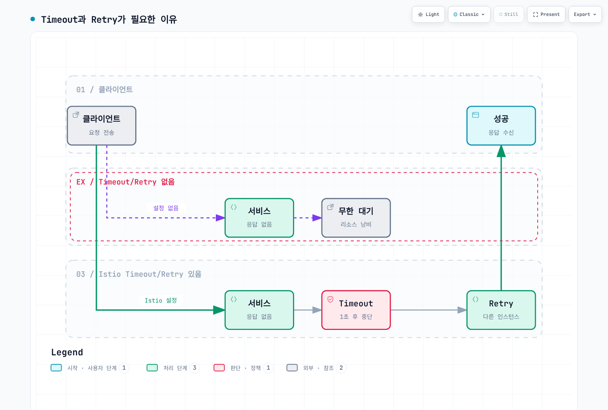
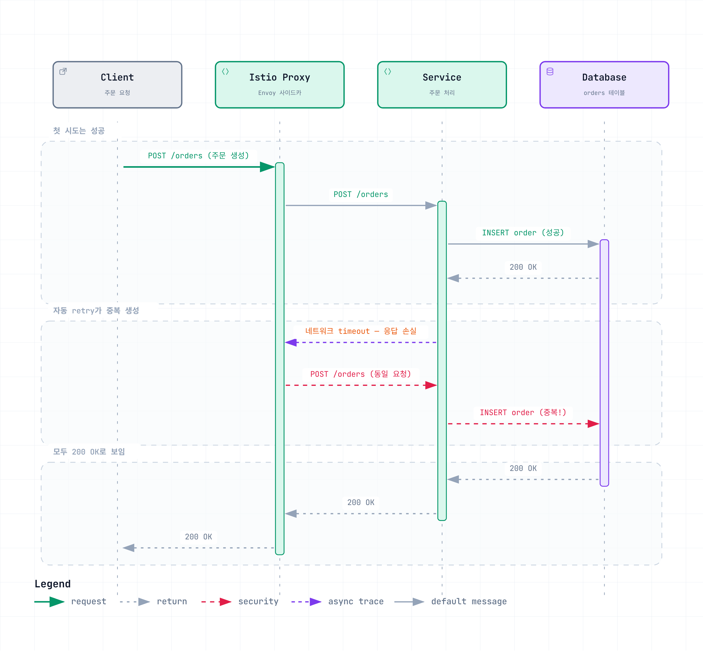

# Retry 및 Timeout

Retry와 Timeout은 마이크로서비스의 복원력을 높이는 핵심 메커니즘입니다. Istio를 사용하면 애플리케이션 코드 변경 없이 이러한 정책을 설정할 수 있습니다.

## 목차

1. [개요](#개요)
2. [Timeout 설정](#timeout-설정)
3. [Retry 설정](#retry-설정)
4. [Retry와 Timeout 조합](#retry와-timeout-조합)
5. [실전 예제](#실전-예제)
6. [중요 주의사항](#중요-주의사항)
7. [모범 사례](#모범-사례)
8. [문제 해결](#문제-해결)

## 개요

각 예제는 독립적인 HTTP Sidecar 정책이며 쓰기 정책을 표시한 경우 외에는 재시도가 안전한 작업을 가정합니다. 일반 SQL과 앱이 직접 암호화한 HTTPS에는 HTTP 재시도/타임아웃 규칙이 적용되지 않습니다. 호출자 기한도 설정하세요. 여러 계층의 재시도는 백엔드 시도 수를 곱하고 개별 계층의 로컬 타임아웃을 넘길 수 있습니다.

### Timeout과 Retry의 필요성



[🔍 인터랙티브 다이어그램 보기](https://www.atomai.click/kubernetes-docs/archmaps/ko-service-mesh-istio-traffic-management-05-retry-timeout-0.html)

## Timeout 설정

### 기본 Timeout

```yaml
apiVersion: networking.istio.io/v1
kind: VirtualService
metadata:
  name: reviews-timeout
spec:
  hosts:
  - reviews
  http:
  - route:
    - destination:
        host: reviews
    timeout: 10s  # 10초 후 타임아웃
```

### 경로별 Timeout

```yaml
apiVersion: networking.istio.io/v1
kind: VirtualService
metadata:
  name: api-timeouts
spec:
  hosts:
  - api.example.com
  http:
  # 빠른 응답이 필요한 API - 짧은 timeout
  - match:
    - uri:
        prefix: "/api/quick"
    route:
    - destination:
        host: api-service
    timeout: 1s

  # 일반 API
  - match:
    - uri:
        prefix: "/api/standard"
    route:
    - destination:
        host: api-service
    timeout: 5s

  # 무거운 작업 - 긴 timeout
  - match:
    - uri:
        prefix: "/api/batch"
    route:
    - destination:
        host: api-service
    timeout: 30s
```

## Retry 설정

> **중요**: `retries`를 생략했다고 retry가 꺼지는 것은 아닙니다. Istio 1.31.0의 렌더링 기본 정책은 `attempts: 2`, `retryOn: connect-failure,refused-stream,unavailable,cancelled,retriable-status-codes`입니다. 여기서 `attempts`는 최초 요청 이후의 **추가 재시도 횟수**이므로 최대 전달 횟수는 3회입니다. 프록시 retry를 확실히 끄려면 해당 route에 `attempts: 0`을 명시합니다.

HTTPRetry 참조 문서에는 목록이 축약되어 있지만 릴리스 구현은 설정된 상태 코드를 위한 retriable-status-codes도 활성화합니다. 클러스터 기본값은 재정의될 수 있습니다. 재시도 조건을 명시하고 모든 타임아웃이 재시도되거나 항상 다른 정상 엔드포인트가 있다고 가정하지 마세요.

### 기본 Retry

```yaml
apiVersion: networking.istio.io/v1
kind: VirtualService
metadata:
  name: reviews-retry
spec:
  hosts:
  - reviews
  http:
  - route:
    - destination:
        host: reviews
    retries:
      attempts: 3  # 최대 3번 재시도
      perTryTimeout: 2s  # 각 시도마다 2초 timeout
      retryOn: 5xx,reset,connect-failure,refused-stream  # 재시도 조건
```

### Retry 조건

| 조건 | 설명 |
|------|------|
| `5xx` | HTTP 5xx 에러 |
| `gateway-error` | 502, 503, 504 에러 |
| `reset` | 연결 리셋 |
| `connect-failure` | 연결 실패 |
| `refused-stream` | HTTP/2 REFUSED_STREAM |
| `retriable-4xx` | 409 Conflict |
| `retriable-status-codes` | 사용자 정의 상태 코드 |

### 고급 Retry 설정

`payment-service`는 결제 요청처럼 비멱등 write를 처리하므로, 모든 메서드에 동일한
retry 정책을 적용하면 `reset`이나 `5xx`가 발생했을 때 mesh가 POST를 재전송해버릴 수
있습니다 — 이 문서 전체가 경고하는 "모호한 재전송" 위험 그대로입니다. 메서드별로
라우트를 분리해, 읽기 전용 상태 조회는 넉넉히 재시도하고 write 경로는 mesh retry를
완전히 끕니다.

```yaml
apiVersion: networking.istio.io/v1
kind: VirtualService
metadata:
  name: advanced-retry
spec:
  hosts:
  - payment-service
  http:
  - name: reads-retryable
    match:
    - method:
        regex: "^(GET|HEAD)$"
    route:
    - destination:
        host: payment-service
    retries:
      attempts: 3
      perTryTimeout: 2s
      retryOn: connect-failure,refused-stream
      retryRemoteLocalities: true  # 다른 지역으로도 재시도
  - name: writes-no-mesh-retry
    match:
    - method:
        regex: "^(POST|PUT|PATCH|DELETE)$"
    route:
    - destination:
        host: payment-service
    retries:
      attempts: 0
```

## Retry와 Timeout 조합

### 계층별 Timeout

```yaml
apiVersion: networking.istio.io/v1
kind: VirtualService
metadata:
  name: layered-timeouts
spec:
  hosts:
  - frontend
  http:
  - route:
    - destination:
        host: frontend
    timeout: 10s  # 전체 timeout
    retries:
      attempts: 3
      perTryTimeout: 3s  # 최초 요청을 포함한 각 전달의 timeout
```

**계산**: 이론상 전달 시간 상한은 `(1 + attempts) × perTryTimeout = 4 × 3s = 12s`이지만, route의 전체 `timeout: 10s`가 먼저 적용됩니다. 실제 재시도 횟수는 backoff와 남은 전체 timeout에 따라 줄어들 수 있습니다.

### HTTP 메서드별 Retry 분리

```yaml
apiVersion: networking.istio.io/v1
kind: VirtualService
metadata:
  name: order-service
spec:
  hosts:
  - order-service
  http:
  # POST/PATCH: 처리 결과가 모호해도 mesh가 재전송하지 않음
  - name: writes-no-mesh-retry
    match:
    - method:
        regex: "^(POST|PUT|PATCH|DELETE)$"
    route:
    - destination:
        host: order-service
    timeout: 10s
    retries:
      attempts: 0

  # GET/HEAD: 연결 성립 전 실패와 HTTP/2 REFUSED_STREAM만 제한적으로 재시도
  - name: reads-limited-retry
    match:
    - method:
        regex: "^(GET|HEAD)$"
    route:
    - destination:
        host: order-service
    timeout: 5s
    retries:
      attempts: 2
      perTryTimeout: 2s
      retryOn: connect-failure,refused-stream
```

POST/PATCH와 도메인에서 쓰기로 정의한 작업은 기본적으로 mesh retry를 끕니다. PUT/DELETE도 HTTP 명세상 멱등일 수 있다는 이유만으로 자동 재시도하지 말고, 애플리케이션의 실제 계약이 같은 요청의 반복 실행을 안전하게 처리할 때만 허용합니다.

## 실전 예제

### 예제 1: 마이크로서비스 체인

```yaml
# Frontend → Backend → Database
apiVersion: networking.istio.io/v1
kind: VirtualService
metadata:
  name: frontend
spec:
  hosts:
  - frontend
  http:
  - route:
    - destination:
        host: frontend
    timeout: 15s  # 전체 체인 고려
    retries:
      attempts: 2
      perTryTimeout: 7s
---
apiVersion: networking.istio.io/v1
kind: VirtualService
metadata:
  name: backend
spec:
  hosts:
  - backend
  http:
  - route:
    - destination:
        host: backend
    timeout: 10s  # Database 호출 고려
    retries:
      attempts: 3
      perTryTimeout: 3s
      retryOn: 5xx,reset
---
apiVersion: networking.istio.io/v1
kind: VirtualService
metadata:
  name: database
spec:
  hosts:
  - database
  http:
  - route:
    - destination:
        host: database
    timeout: 5s
    retries:
      attempts: 2
      perTryTimeout: 2s
      retryOn: connect-failure,refused-stream
```

### 예제 2: 외부 API 호출

```yaml
apiVersion: networking.istio.io/v1
kind: VirtualService
metadata:
  name: external-api
spec:
  hosts:
  - api.external.com
  http:
  - route:
    - destination:
        host: api.external.com
    timeout: 30s  # 외부 API는 느릴 수 있음
    retries:
      attempts: 5  # 외부 API는 일시적 실패 많음
      perTryTimeout: 5s
      retryOn: 5xx,reset,connect-failure,gateway-error
---
apiVersion: networking.istio.io/v1
kind: ServiceEntry
metadata:
  name: external-api
spec:
  hosts:
  - api.external.com
  ports:
  - number: 80
    name: http
    protocol: HTTP
    targetPort: 443
  location: MESH_EXTERNAL
  resolution: DNS
---
apiVersion: networking.istio.io/v1
kind: DestinationRule
metadata:
  name: external-api-tls
spec:
  host: api.external.com
  trafficPolicy:
    tls:
      mode: SIMPLE
      sni: api.external.com
      subjectAltNames:
      - api.external.com
```

TLS Origination 예제이므로 앱은 `http://api.external.com`으로 호출하며 실제 서비스 호스트로 바꾸세요. 앱이 HTTPS를 직접 시작하면 암호화된 HTTP 메시지를 재시도 조건으로 검사할 수 없습니다.

### 예제 3: Circuit Breaker와 함께 사용

`payment`는 비멱등 write를 처리하므로, 앞서 나온 `payment-service` 예제와 동일하게
메서드별로 라우트를 분리합니다 — 읽기는 넉넉히 재시도하고 write는 mesh retry를
끕니다. 아래 circuit breaker는 양쪽 모두에 적용됩니다.

```yaml
apiVersion: networking.istio.io/v1
kind: VirtualService
metadata:
  name: resilient-service
spec:
  hosts:
  - payment
  http:
  - name: reads-retryable
    match:
    - method:
        regex: "^(GET|HEAD)$"
    route:
    - destination:
        host: payment
    timeout: 10s
    retries:
      attempts: 3
      perTryTimeout: 3s
      retryOn: connect-failure,refused-stream
  - name: writes-no-mesh-retry
    match:
    - method:
        regex: "^(POST|PUT|PATCH|DELETE)$"
    route:
    - destination:
        host: payment
    timeout: 10s
    retries:
      attempts: 0
---
apiVersion: networking.istio.io/v1
kind: DestinationRule
metadata:
  name: payment-circuit-breaker
spec:
  host: payment
  trafficPolicy:
    connectionPool:
      tcp:
        maxConnections: 100
      http:
        http1MaxPendingRequests: 50
        maxRequestsPerConnection: 2
    outlierDetection:
      consecutive5xxErrors: 5
      interval: 30s
      baseEjectionTime: 30s
      maxEjectionPercent: 50
```

## 중요 주의사항

### ⚠️ 비멱등성 요청(Non-Idempotent Requests)에 대한 Retry 위험

**핵심 원칙**: POST/PATCH와 도메인에서 비멱등으로 정의한 쓰기 요청은 Istio Proxy에서 자동 retry를 사용하면 **데이터 정합성 문제**가 발생할 수 있습니다. PUT/DELETE도 애플리케이션 계약이 실제 멱등성을 보장할 때만 예외로 취급합니다.

#### 문제 상황



[🔍 인터랙티브 다이어그램 보기](https://www.atomai.click/kubernetes-docs/archmaps/ko-service-mesh-istio-traffic-management-05-retry-timeout-1.html)

#### 왜 위험한가?

1. **중복 생성**: POST 요청이 실제로는 성공했지만 네트워크 문제로 응답이 손실되면, Proxy가 재시도하여 **중복 레코드**가 생성됩니다.
2. **잘못된 상태 변경**: 결제, 재고 차감 등 **비즈니스 크리티컬한 작업**이 중복 실행될 수 있습니다.
3. **검증 불가능**: Istio Proxy는 요청이 성공했는지 확인할 방법이 없습니다.

#### 안전한 Retry 전략

**권장: mesh retry 비활성화 + 애플리케이션 수준의 중복 방지**

```yaml
# Istio: 비멱등 쓰기는 명시적으로 재시도하지 않음
apiVersion: networking.istio.io/v1
kind: VirtualService
metadata:
  name: order-service
spec:
  hosts:
  - order-service
  http:
  - match:
    - method:
        exact: POST
    route:
    - destination:
        host: order-service
    timeout: 10s
    retries:
      attempts: 0  # 최초 요청 이후 추가 전달 없음
```

`reset`, `503`, timeout은 서버가 요청을 처리하지 않았다는 증거가 아닙니다. 서버가 DB commit을 끝낸 뒤 응답만 유실될 수 있으므로 프록시는 동일 요청의 replay가 안전한지 판단할 수 없습니다. 결과가 모호하면 무조건 재전송하기보다 애플리케이션이 요청 상태를 조회해야 합니다.

```python
# Client excerpt: requires an API with an atomic idempotency contract.
import requests
from requests.adapters import HTTPAdapter
from urllib3.util.retry import Retry


def create_order_with_idempotency(order_data, idempotency_key):
    # Persist one key per logical order; reuse it after ambiguous failures.
    if not idempotency_key:
        raise ValueError("A persisted operation idempotency key is required")
    retries = Retry(
        total=3,
        status_forcelist=[500, 502, 503, 504],
        allowed_methods=["POST"],
        backoff_factor=1,
    )
    with requests.Session() as session:
        adapter = HTTPAdapter(max_retries=retries)
        session.mount("http://", adapter)
        session.mount("https://", adapter)
        response = session.post(
            "http://order-service/orders",
            json=order_data,
            headers={"X-Idempotency-Key": idempotency_key},
            timeout=(3, 10),
        )
        response.raise_for_status()
        return response.json()
```

서버가 원자적으로 계약을 보장해야 합니다. Redis exists 확인 뒤 주문을 만들고 캐시 키를 따로 기록하면 동시 요청과 크래시 구간에서 중복 주문이 발생하므로 안전한 중복 방지 구현이 아닙니다.

1. 키를 검증하고 인증한 호출자와 요청 페이로드 fingerprint에 결합합니다.
2. DB unique constraint로 키를 확보하고 동시 시도를 직렬화합니다.
3. 주문 변경과 키에 연결된 상태/응답을 같은 트랜잭션으로 커밋합니다.
4. 동일 키/페이로드에는 저장한 결과를 반환하고 다른 페이로드의 키 재사용은 거부합니다.
5. 되돌리기 어려운 외부 효과는 outbox/멱등 다운스트림 API로 조정하고 재시도 기간을 포함하는 보존 시간을 정합니다.

클라이언트 예제는 서버가 이 계약을 이미 제공한다는 전제입니다. 헤더만으로 POST가 안전해지지 않으며 Requests timeout은 시도별 연결/읽기 기한이지 전체 재시도 기한이 아닙니다.


프로덕션 쓰기 API에는 다음 보호장치를 조합합니다.

- `Idempotency-Key`와 데이터베이스 unique constraint를 같은 트랜잭션에서 적용
- update에는 `ETag`/`If-Match` 또는 version 필드 기반 compare-and-swap 적용
- timeout/reset 후 transaction ID나 command ID로 처리 상태 조회
- 결제, 이벤트 발행 같은 되돌리기 어려운 후속 효과에는 transactional outbox 적용

#### HTTP 메소드별 Retry 안전성

| 메소드 | 멱등성 | Istio Retry 안전성 | 권장 설정 |
|-------|--------|-------------------|----------|
| **GET** | ✅ 멱등 | ✅ 안전 | `attempts: 3, retryOn: 5xx,reset` |
| **HEAD** | ✅ 멱등 | ✅ 안전 | `attempts: 3, retryOn: 5xx,reset` |
| **OPTIONS** | ✅ 멱등 | ✅ 안전 | `attempts: 3, retryOn: 5xx,reset` |
| **PUT** | ⚠️ 계약에 따라 다름 | ⚠️ 주의 | 실제 멱등 계약 + 조건부 갱신 필요 |
| **DELETE** | ⚠️ 계약에 따라 다름 | ⚠️ 주의 | 실제 멱등 계약 + 결과 조회 필요 |
| **POST** | ❌ 일반적으로 비멱등 | ❌ 위험 | `attempts: 0`, Idempotency Key |
| **PATCH** | ❌ 일반적으로 비멱등 | ❌ 위험 | `attempts: 0`, version/ETag |

#### 안전하게 Retry 가능한 경우

```yaml
# 읽기 전용 요청 - 안전
apiVersion: networking.istio.io/v1
kind: VirtualService
metadata:
  name: api-service-reads
spec:
  hosts:
  - api-service
  http:
  - match:
    - method:
        regex: "GET|HEAD|OPTIONS"
    route:
    - destination:
        host: api-service
    retries:
      attempts: 3
      perTryTimeout: 2s
      retryOn: 5xx,reset,connect-failure
```

```yaml
# 멱등성이 보장된 쓰기 요청
apiVersion: networking.istio.io/v1
kind: VirtualService
metadata:
  name: idempotent-writes
spec:
  hosts:
  - api-service
  http:
  - match:
    - method:
        exact: PUT
      headers:
        x-idempotency-key:
          regex: ".+"  # Idempotency Key 있을 때만
    route:
    - destination:
        host: api-service
    retries:
      attempts: 3
      perTryTimeout: 2s
      retryOn: 5xx,reset
```

#### Circuit Breaker와 함께 사용 시 주의사항

Circuit Breaker는 **장애 격리**에는 효과적이지만, **비멱등성 요청의 중복 실행**은 막지 못합니다.

```yaml
# ❌ 잘못된 예: POST + Circuit Breaker + Retry
apiVersion: networking.istio.io/v1
kind: VirtualService
metadata:
  name: payment-service
spec:
  hosts:
  - payment-service
  http:
  - route:
    - destination:
        host: payment-service
    retries:
      attempts: 3  # ❌ POST에 대해 3번 재시도
      retryOn: 5xx
---
apiVersion: networking.istio.io/v1
kind: DestinationRule
metadata:
  name: payment-circuit-breaker
spec:
  host: payment-service
  trafficPolicy:
    outlierDetection:
      consecutive5xxErrors: 5
      baseEjectionTime: 30s

# 결과: Circuit Breaker가 열리기 전에
# 중복 결제가 3번 발생할 수 있음!
```

```yaml
# ✅ 올바른 예: Circuit Breaker만 사용, Retry는 애플리케이션에서
apiVersion: networking.istio.io/v1
kind: VirtualService
metadata:
  name: payment-service
spec:
  hosts:
  - payment-service
  http:
  - route:
    - destination:
        host: payment-service
    timeout: 10s
    retries:
      attempts: 0  # Retry 완전 비활성화
---
apiVersion: networking.istio.io/v1
kind: DestinationRule
metadata:
  name: payment-circuit-breaker
spec:
  host: payment-service
  trafficPolicy:
    outlierDetection:
      consecutive5xxErrors: 5
      baseEjectionTime: 30s
```

#### 실전 가이드라인

1. **GET/HEAD/OPTIONS**: Istio Proxy Retry 사용 가능 ✅
2. **POST/PATCH**: Istio Retry 비활성화, 애플리케이션 레벨 Retry + Idempotency Key ✅
3. **PUT/DELETE**: Idempotency 보장 시에만 Istio Retry 사용 ⚠️
4. **결제/재고/포인트 등 크리티컬**: 반드시 애플리케이션 레벨 검증 + Idempotency Key 🔴

## 모범 사례

### 1. Timeout 설정 가이드

```yaml
# ✅ 좋은 예: 계층별 적절한 timeout
# Frontend: 15s
# API Gateway: 10s
# Backend Service: 5s
# Database: 3s

apiVersion: networking.istio.io/v1
kind: VirtualService
metadata:
  name: api-gateway
spec:
  hosts:
  - api-gateway
  http:
  - route:
    - destination:
        host: api-gateway
    timeout: 10s
    retries:
      attempts: 2
      perTryTimeout: 4s
```

```yaml
# ❌ 나쁜 예: 너무 긴 timeout
apiVersion: networking.istio.io/v1
kind: VirtualService
metadata:
  name: api-gateway
spec:
  hosts:
  - api-gateway
  http:
  - route:
    - destination:
        host: api-gateway
    timeout: 300s  # 짧은 대화형 요청에는 부적절한 예시; 스트리밍은 별도 판단
```

### 2. Retry 전략

```yaml
# ✅ 좋은 예: 멱등성 고려
apiVersion: networking.istio.io/v1
kind: VirtualService
metadata:
  name: api-service
spec:
  hosts:
  - api-service
  http:
  # GET - 안전하게 재시도
  - match:
    - method:
        exact: GET
    route:
    - destination:
        host: api-service
    retries:
      attempts: 3
      perTryTimeout: 2s
      retryOn: 5xx,reset,connect-failure

  # POST/PATCH - mesh retry 명시적 비활성화
  - match:
    - method:
        regex: "^(POST|PUT|PATCH|DELETE)$"
    route:
    - destination:
        host: api-service
    retries:
      attempts: 0
```

### 3. 지수 백오프 (Exponential Backoff)

Envoy는 기본 25ms 기저 간격의 jitter가 있는 지수 백오프를 사용하며 실제 지연은 25/50/100ms의 고정 순서가 아닙니다. 아래는 읽기 재시도의 기저 간격을 지정하고 쓰기는 명시적으로 재시도하지 않는 예제입니다:

```yaml
apiVersion: networking.istio.io/v1
kind: VirtualService
metadata:
  name: backoff-retry
spec:
  hosts:
  - payment
  http:
  - match:
    - method:
        regex: "^(GET|HEAD)$"
    route:
    - destination:
        host: payment
    retries:
      attempts: 5
      perTryTimeout: 2s
      retryOn: connect-failure,refused-stream
      backoff: 100ms
  - route:
    - destination:
        host: payment
    retries:
      attempts: 0
```

### 4. 전체 시스템 Timeout 계산

```yaml
# Frontend → API Gateway → Backend → Database
# Frontend: 20s
# API Gateway: 15s (Frontend보다 작아야 함)
# Backend: 10s (API Gateway보다 작아야 함)
# Database: 5s (Backend보다 작아야 함)

# 각 레이어는 하위 레이어 timeout + overhead를 고려
```

## 문제 해결

### Timeout이 작동하지 않음

```bash
# 1. VirtualService 확인
kubectl get virtualservice -n <namespace>
kubectl describe virtualservice <name> -n <namespace>

# 2. Envoy 구성 확인
istioctl proxy-config routes <pod-name> -n <namespace> -o json | grep timeout

# 3. 실제 timeout 테스트
kubectl exec -it <pod-name> -n <namespace> -c <app-container> -- \
  curl -v --max-time 15 http://backend-service
```

### Retry가 너무 많이 발생

curl이 있는 애플리케이션 컨테이너에서 트래픽을 생성하세요. istio-proxy UID는 가로채기를 우회할 수 있습니다. 테스트하는 라우트 타임아웃보다 curl 기한을 길게 설정합니다. 프록시 stats matcher에서 활성화한 Envoy 재시도 카운터를 사용하세요. UR 응답 플래그는 upstream remote reset이며 재시도 카운터가 아닙니다.

```promql
sum(rate(envoy_cluster_upstream_rq_retry[5m]))
```

### Retry Storm 방지

```yaml
# Circuit Breaker와 함께 사용
apiVersion: networking.istio.io/v1
kind: DestinationRule
metadata:
  name: prevent-retry-storm
spec:
  host: backend
  trafficPolicy:
    connectionPool:
      tcp:
        maxConnections: 100
      http:
        http1MaxPendingRequests: 10  # 대기 요청 제한
        http2MaxRequests: 100
        maxRequestsPerConnection: 1
    outlierDetection:
      consecutive5xxErrors: 3  # 빠른 차단
      interval: 10s
      baseEjectionTime: 30s
```

## 참고 자료

- [Istio Timeout](https://istio.io/latest/docs/reference/config/networking/virtual-service/#HTTPRoute)
- [Istio Retry](https://istio.io/latest/docs/reference/config/networking/virtual-service/#HTTPRetry)
- [Envoy Retry Policy](https://www.envoyproxy.io/docs/envoy/latest/configuration/http/http_filters/router_filter#config-http-filters-router-x-envoy-retry-on)
- [RFC 9110: Idempotent Methods](https://www.rfc-editor.org/rfc/rfc9110.html#name-idempotent-methods)

- [Primary reference 1](https://istio.io/latest/docs/reference/config/networking/virtual-service/)
- [Primary reference 2](https://raw.githubusercontent.com/istio/istio/1.31.0/pilot/pkg/networking/core/route/retry/retry.go)
- [Primary reference 3](https://www.envoyproxy.io/docs/envoy/latest/configuration/http/http_filters/router_filter)
- [Primary reference 4](https://www.rfc-editor.org/rfc/rfc9110.html#name-idempotent-methods)
- [Primary reference 5](https://aws.amazon.com/builders-library/making-retries-safe-with-idempotent-APIs/)
- [Primary reference 6](https://raw.githubusercontent.com/psf/requests/main/docs/user/advanced.rst)
- [Primary reference 7](https://raw.githubusercontent.com/urllib3/urllib3/main/src/urllib3/util/retry.py)
- [Primary reference 8](https://istio.io/latest/docs/tasks/traffic-management/egress/egress-tls-origination/)
